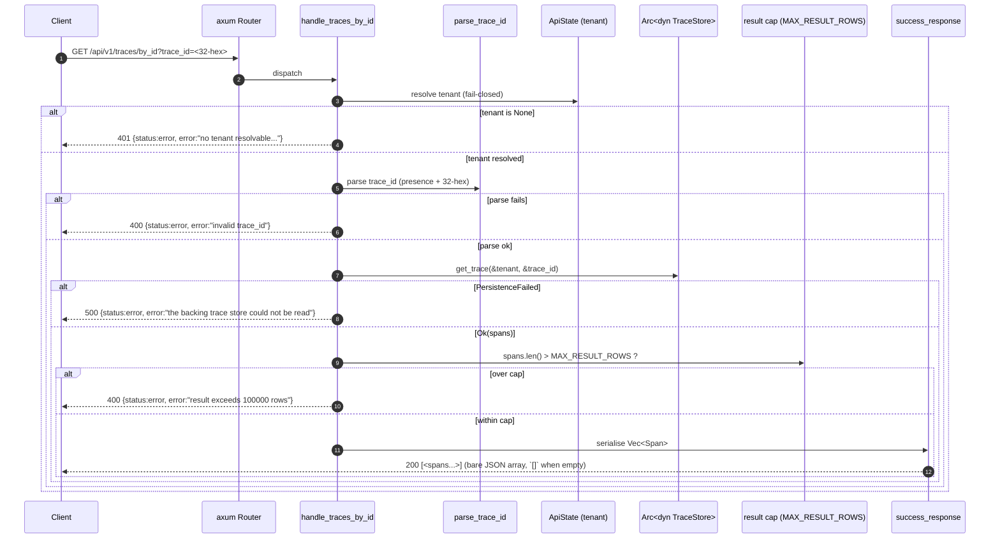

# Application Architecture: trace-lookup-by-id-v0

Author: `@nw-solution-architect` (Morgan), DESIGN wave, 2026-05-27.
Mode: propose.

## System Context (C4 L1)

The system boundary is unchanged from the
`log-query-severity-filter-v0` slice and from every preceding
read-side slice on the `trace-query-api` crate: a single in-process
`trace-query-api` HTTP service that exposes the OTel trace read
contract over `GET /api/v1/traces*`, with a fail-closed tenant seam
resolved from `KALEIDOSCOPE_TRACE_QUERY_TENANT` and a single driven
port `Arc<dyn ray::TraceStore + Send + Sync>` bound to the durable
`FileBackedTraceStore` adapter at the composition root. The slice
adds ONE sibling route (`GET /api/v1/traces/by_id`) inside the
existing crate; no new crate, no new external dependency, no new
listening port, no new container. L1 is therefore reused verbatim
from ADR-0048 and is not redrawn here.

## Sequence (C4 L2)

L1 not redrawn (unchanged from ADR-0048). L3 not produced (the
slice adds one free function and one async handler on one existing
file; the read-API precedents ADR-0047 / ADR-0048 / ADR-0050 /
ADR-0052 produced no L3 for slices of this size).

## Changes Per File

| Path | Kind | Summary | ~LOC |
|---|---|---|---|
| `crates/trace-query-api/src/lib.rs` | EXTEND | Add `TRACES_BY_ID_ROUTE` const; register `get(handle_traces_by_id)` on the same `Router`; add private `TracesByIdParams { trace_id: Option<String> }`; add `async fn handle_traces_by_id`; add free `fn parse_trace_id(raw: &str) -> Result<TraceId, String>`; `use ray::TraceId`. No edit to existing items. | ~80 |
| `crates/ray/src/store.rs` | UNCHANGED | `TraceStore::get_trace` already exists at line 72; reused as-is. | 0 |
| `crates/ray/src/span.rs` | UNCHANGED | `TraceId(pub [u8; 16])` constructed directly from the decoded byte array. | 0 |
| `crates/trace-query-api/src/composition.rs` | UNCHANGED | Composition root does not name the new route; the existing parameter-less probe demonstrates substrate reachability for both arms. | 0 |
| `crates/trace-query-api/src/main.rs` | UNCHANGED | Thin binary calls `router(store, tenant)`; signature unchanged. | 0 |
| `crates/trace-query-api/tests/slice_01_traces_read.rs` | UNCHANGED | Existing 18 acceptance scenarios stay green verbatim. | 0 |
| `crates/trace-query-api/tests/common/mod.rs` | EXTEND (DISTILL) | Add `traces_by_id_request(trace_id)` builder; reuse `tenant`, `open_durable_store`, `seed`, `span_with_ids`, `call`, `spans_array`, `is_error_envelope`, `FailingTraceStore`. | ~10 |
| `crates/trace-query-api/tests/slice_02_traces_lookup_by_id.rs` | NEW (DISTILL) | Acceptance suite encoding US-01 through US-05 plus result-cap 400. | ~250 |
| `docs/product/architecture/adr-0053-trace-lookup-by-id.md` | NEW | The contract growth ADR; back-references ADR-0048 and ADR-0050; neither modified. | ~140 |
| `docs/feature/trace-lookup-by-id-v0/design/wave-decisions.md` | NEW | This DESIGN wave's decisions doc. | exists |
| `docs/feature/trace-lookup-by-id-v0/design/application-architecture.md` | NEW | This file. | exists |
| `docs/product/architecture/brief.md` | EXTEND | Append `## Application Architecture — trace-lookup-by-id-v0` section. | ~30 |

## Error Contract

| Case | HTTP status | Body |
|---|---|---|
| Tenant unresolved (`state.tenant.is_none()`) | 401 | `{"status":"error","error":"no tenant resolvable: the trace query service refuses unscoped requests"}` |
| `trace_id` missing (`None`) | 400 | `{"status":"error","error":"invalid trace_id"}` |
| `trace_id` empty (`Some("")`) | 400 | `{"status":"error","error":"invalid trace_id"}` |
| `trace_id` length != 32 | 400 | `{"status":"error","error":"invalid trace_id"}` |
| `trace_id` contains a non-hex character (any byte outside `[0-9a-fA-F]`) | 400 | `{"status":"error","error":"invalid trace_id"}` |
| Store returns `PersistenceFailed { reason }` | 500 | `{"status":"error","error":"the backing trace store could not be read"}` (and `tracing::error!` `traces.store.failed` with the `reason` field) |
| Returned `spans.len() > MAX_RESULT_ROWS` (100_000) | 400 | `{"status":"error","error":"result exceeds 100000 rows"}` |
| Unknown `(tenant, trace_id)` | 200 | `[]` (bare empty JSON array; the calm-empty arm of `InMemoryTraceStore::get_trace`) |
| Match found | 200 | `[<spans...>]` (bare JSON array in ascending `start_time_unix_nano` order; `Span`'s existing `Serialize` derive) |

Redaction posture (ADR-0048 Decision 2, preserved): the raw `trace_id`
parameter value is NEVER echoed in any error body; the literal class
label `"invalid trace_id"` is the entire reason on every malformed
arm. The body MUST NOT contain `"SECRET"`, `"Bearer"`, or the raw
value of the supplied parameter.
