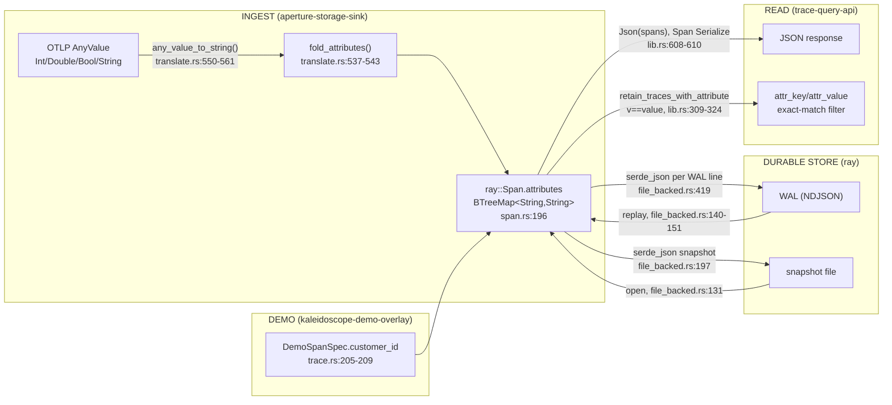
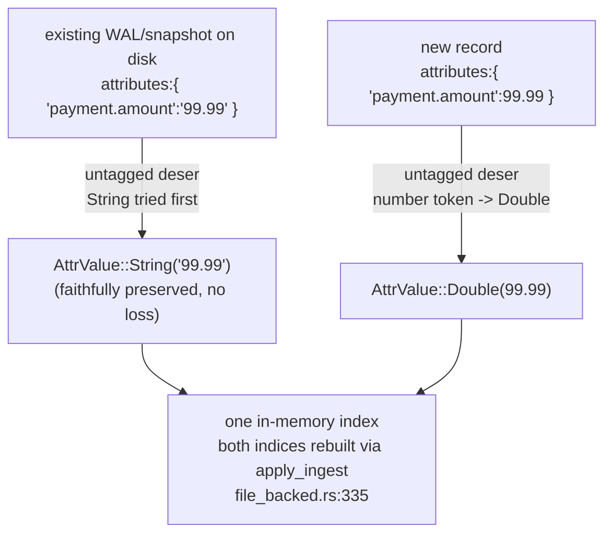

# Typed span attribute values — design options

- **Feature**: `typed-span-attributes-v0`
- **Wave**: DESIGN
- **Author**: `nw-solution-architect` (Morgan)
- **Status**: Draft for peer review (paired with ADR-0080)
- **Paradigm**: Rust idiomatic — data + free functions + traits (CLAUDE.md). No new `dyn`.

## 1. The need (iteration 3, verifier RED-grounded)

1. **FIDELITY** — numeric span attributes (int AND float) must round-trip as JSON
   numbers, not strings. Today every span attribute value is coerced to a `String`
   at ingest, so `payment.amount` of `9, 90, 99.99, 100, 250, 250.50, 500` returns
   as the JSON strings `"9" … "500"` instead of the numbers `9 … 500`
   (decimals preserved: `99.99`, `250.5`).
2. **THRESHOLD** (follow-on) — a numeric `attr_gte` filter on the traces query
   (`attr_key=payment.amount&attr_gte=100`) that compares NUMERICALLY: `>=100`
   includes `{100, 250, 250.50, 500}` and excludes `{9, 90, 99.99}` (the
   anti-lexical case: lexical string ordering would wrongly keep `"90"` and `"99.99"`
   and could drop `"100"`). Requires the value stored numerically.

## 2. Where the string coercion lives today (grounded)



The single coercion point is `any_value_to_string` (`crates/aperture-storage-sink/src/translate.rs:550-561`):
`IntValue(i).to_string()`, `DoubleValue(d).to_string()`, `BoolValue(b).to_string()` —
every scalar is flattened to a `String`, then folded into `BTreeMap<String,String>` by
`fold_attributes` (`translate.rs:537-543`). That map is the field type
`ray::Span.attributes` (`crates/ray/src/span.rs:196`). Everything downstream — the
durable codec, the query JSON, and the exact-match filter — inherits the string-only
shape from that one field.

The metric path already preserves numbers but as a single `f64` (`number_point_value`,
`translate.rs:226-234`, `as_int` → exact `f64`). For metrics that is correct (metric
points are inherently floating point). For span attributes we must keep int and double
*distinct*, so an int round-trips as `100`, not `100.0`.

## 3. The attribute VALUE model

### 3.1 Proposed type — `AttrValue` (lives in `crates/ray/src/span.rs`)

```rust
// crate: ray  (the OTLP-shaped boundary type already lives here)
pub enum AttrValue {
    String(String),   // OTLP AnyValue::StringValue  (+ Bytes/Array/Kvlist rendered to string)
    Bool(bool),       // OTLP AnyValue::BoolValue
    Int(i64),         // OTLP AnyValue::IntValue   — kept DISTINCT from Double
    Double(f64),      // OTLP AnyValue::DoubleValue
}
```

It lives in `ray` because that is where the OTLP-shaped boundary types already live
(`Span`, `SpanKind`, `SpanStatus`; `span.rs:17-22` docstring: "Field set mirrors
`opentelemetry-proto::trace::v1::Span`"). `Span.attributes` becomes
`BTreeMap<String, AttrValue>` (`span.rs:196`).

### 3.2 serde representation — `#[serde(untagged)]` (the load-bearing choice)

`AttrValue` serializes/deserializes **untagged**, so the JSON value token IS the
discriminator — no wrapper object, no type tag on the wire:

| `AttrValue` | JSON on the wire |
|-------------|------------------|
| `String("/checkout")` | `"/checkout"` |
| `Bool(true)` | `true` |
| `Int(100)` | `100` |
| `Double(99.99)` | `99.99` (ryu; `250.50` → `250.5`) |

Untagged **deserialization** tries variants in declaration order and takes the first
that matches the JSON token. Declaration order `[String, Bool, Int, Double]` is correct
for every case AND for **backward compatibility** (see §5):

- a JSON **string** `"99.99"` → `String` (a number-looking string stays a string; a
  number token is never coerced to `String` by serde_json);
- a JSON `true` → `Bool`;
- a JSON integer `100` → `Int` (`Double` would also accept it, but `Int` is tried first);
- a JSON `99.99` / `100.0` → `Double` (`Int`/`i64` deserialization rejects a fractional
  number token, so it falls through to `Double`).

This is the same hand-rolled, dependency-free serde posture the codebase already uses
(`TraceId`/`SpanId` custom (de)serialize, `span.rs:67-113`). No new crate.

### 3.3 The `f64`-forces-dropping-`Eq` trade-off (the one real cost — be honest)

`Span` today derives `PartialEq, Eq` (`span.rs:183`). `f64` is **not** `Eq` (NaN), so
`AttrValue` cannot derive `Eq`, and transitively `Span` and `SpanBatch` (which contains
`Vec<Span>`) must drop the `Eq` *marker* and keep only `PartialEq`.

- **Functionally safe**: a repo-wide search found **no** `HashSet<Span>` /
  `BTreeSet<Span>` and `Span` is never a map *key* (the indices key on `TraceId` /
  `ServiceName` and hold `Span` as the *value* — `store.rs:110-111`,
  `file_backed.rs:86-87`). Every `assert_eq!(... spans)` needs only `PartialEq`, which
  survives. So nothing breaks at compile or runtime.
- **Bounded surface diff**: removing the derived `Eq impl` for `Span` and `SpanBatch`
  is a `cargo public-api` (ADR-0005 Gate 2) byte-diff. It is an **intentional,
  ADR-documented** surface evolution (ADR-0080), not a regression — the crafter
  regenerates the public-api baseline as part of the FIDELITY slice.
- **Scope discipline contains it**: because event/link attributes stay `String` (§3.4),
  `SpanEvent`, `SpanLink`, `SpanStatus`, `SpanKind`, `StatusCode` keep `Eq`. Only the
  two types that transitively carry the typed map (`Span`, `SpanBatch`) lose it.

Rejected alternative to keep `Eq`: a `Double(F64Bits(u64))` newtype comparing bit
patterns. It buys the `Eq` marker back but gives NaN==NaN / `-0.0 != 0.0` equality
semantics that diverge from `f64`, needs a custom number (de)serializer, and adds
incidental complexity for a marker nothing uses. Rejected — dropping `Eq` is the
honest, idiomatic Rust move when a struct gains an `f64`.

### 3.4 Scope: span attributes only this iteration (recommendation)

| Field | Site | This iteration | Why |
|-------|------|----------------|-----|
| span `attributes` | `span.rs:196` | **→ `BTreeMap<String, AttrValue>`** | the stated need (FIDELITY + THRESHOLD) |
| `resource_attributes` | `span.rs:199` | **stays `String`** | semantic-convention strings (`service.name`, `service.version`); no numeric-filter use case; `service_name()` reads `String` (`span.rs:208-213`) |
| span event `attributes` | `span.rs:169` | **stays `String`** | not in the need; keeps `SpanEvent: Eq`; no filter touches them |
| span link `attributes` | `span.rs:177` | **stays `String`** | not in the need; keeps `SpanLink: Eq` |
| log / metric attributes | `lumen`, `pulse` | **untouched** | different crates; `fold_attributes` stays their codec — zero blast radius |

Keeping resource/event/link on `String` is a deliberate consistency trade. It is the
*least-invasive* choice: it confines the `Eq` drop to `Span`/`SpanBatch`, leaves
`fold_attributes` (`translate.rs:537`) serving four of five call-sites unchanged, and
ships the need without a five-field migration. A future iteration can promote the rest
under a follow-up ADR once the typed shape has proven out. Recommended.

### 3.5 Arrays / bytes / kvlist (composite OTLP kinds)

OTLP `AnyValue` also carries `ArrayValue`, `KvlistValue`, `BytesValue`
(`translate.rs:557-559`). Recommendation: map them to **`AttrValue::String`** using the
*existing* renderings — `hex_lower` for bytes, `render_array` `[a,b,c]`, `render_kvlist`
`{k=v}` (`translate.rs:564-590`). They have no numeric-filter use case, and modeling
them structurally (recursive `AttrValue::Array(Vec<AttrValue>)`) is a large surface
expansion for zero need. Out of scope; justified.

## 4. The OTLP decode mapping (ingest)

Add a span-specific fold beside the shared one (do **not** widen `fold_attributes`,
which four other call-sites depend on):

```text
fn fold_span_attributes(attrs: &[KeyValue]) -> BTreeMap<String, AttrValue>
  StringValue(s) -> AttrValue::String(s)
  BoolValue(b)   -> AttrValue::Bool(b)
  IntValue(i)    -> AttrValue::Int(i)        // kept distinct (NOT cast to f64)
  DoubleValue(d) -> AttrValue::Double(d)
  Bytes/Array/Kvlist -> AttrValue::String(<existing hex_lower / render_* output>)
  None / empty AnyValue -> AttrValue::String("")   // matches today's empty-string fold
```

Only `translate_span` (`translate.rs:333`) switches from `fold_attributes` to
`fold_span_attributes` for the span's own `attributes`. The span's
`resource_attributes` (`translate.rs:334`), and `translate_events` /
`translate_links` (`translate.rs:410-439`), keep calling `fold_attributes`. Logs and
metrics translation is untouched.

## 5. Durability — on-disk format evolution (the critical part)

### 5.1 How a Span is serialized to disk today (quoted)

The ray store is `serde_json`, both halves:

- **WAL**: one JSON object per line (NDJSON), per record, fsynced per record —
  `serde_json::to_string(record)` then `write_all(b"\n")` then
  `fsync_backend.fsync_file` (`file_backed.rs:419-427`). The record is
  `WalRecord::Ingest { tenant, spans: Vec<Span> }` (`file_backed.rs:51-55`).
- **Snapshot**: `serde_json::to_writer(writer, &snap)` inside
  `wal_recovery::atomic_write_snapshot` (`file_backed.rs:193-201`), where `snap` is
  `Snapshot { traces: Vec<TraceBucket { tenant, trace_id, spans: Vec<Span> }> }`
  (`file_backed.rs:57-69`).
- **Recovery**: snapshot via `serde_json::from_reader::<Snapshot>` (`file_backed.rs:131`);
  WAL via `wal_recovery::replay_wal_tolerating_torn_tail::<WalRecord, _>`
  (`file_backed.rs:140-151`), which deserializes one `WalRecord` per line.

So **the codec is the `Span` struct's own serde derive.** Changing `Span.attributes`'
value type changes the JSON *shape of that field's values* — but the framing
(one JSON object per line, newline terminated; the ADR-0059 torn-tail boundary) is
**identical**.

### 5.2 Recommended evolution: migration-on-read via the untagged enum — option (a)

**No version field, no migration pass, no data wipe.** The untagged `AttrValue`
(§3.2) IS the migration:

- An **existing** on-disk attribute value is always a JSON **string**
  (everything was coerced via `any_value_to_string`). On read, untagged
  deserialization matches the `String` variant first → `AttrValue::String("99.99")`.
  This is exactly the prompt's option (a) "old string attrs read as
  `AttrValue::String`" — achieved for free, with no record-version branch.
- A **new** record writes typed values; on read, the JSON number/bool token selects
  `Int`/`Double`/`Bool`. The JSON token type is the discriminator and serde_json
  preserves it (quoted = string, bare number = number), so there is **no ambiguity**
  between a new `String("100")` and a new `Int(100)`.



### 5.3 Blast radius analysis (durability-critical)

| Surface | Source change | Risk | Mitigation |
|---------|---------------|------|------------|
| `file_backed.rs` codec (WAL append, snapshot write, replay, open) | **ZERO source lines** — it serializes `Span` by value; the derive does the work | format-compat only | the untagged round-trip; no logic touched |
| WAL replay (`replay_wal_tolerating_torn_tail`, `file_backed.rs:140`) | none | a new typed record must deserialize | gold round-trip test through reopen (durability slice) |
| Snapshot load (`from_reader::<Snapshot>`, `file_backed.rs:131`) | none | an OLD string-only snapshot must still load | explicit "old-snapshot, new-binary" gold test with a pre-change fixture |
| `wal-recovery` crate | none | — | unchanged; fsync/atomic-snapshot discipline (ADR-0060) intact |
| NDJSON framing / torn-tail boundary (ADR-0059) | none | — | newline framing unchanged; this is NOT a WAL-format change in the ADR-0059/0060 C8 sense (that pins the framing, not the per-record schema) |
| fsync discipline (ADR-0049/0060) | none | — | `append_wal` (`file_backed.rs:414-429`) untouched |
| `cargo public-api` (Gate 2) | `Eq` dropped on `Span`/`SpanBatch`; `AttrValue` added; `attributes` field type changes | intentional surface diff | regenerate baseline under ADR-0080 |
| mutation gate (100% on modified files, ADR-0005 Gate 5) | applies to `span.rs`, `translate.rs`, `lib.rs` (not `file_backed.rs`, unmodified) | — | new pins for the typed fold + the filters |

**Honest limit of migration-on-read**: data that was *already coerced* to a string
before this change (e.g. an int `100` stored as `"100"` by the old ingest) stays
`AttrValue::String("100")` — we cannot retroactively recover a type that was destroyed
at the old ingest. FIDELITY therefore applies to **newly-ingested** data; existing data
is faithfully preserved as the strings it already was. For the numeric `attr_gte`
filter, those legacy `"100"` strings are non-numeric and are **excluded** (the
documented mixed-type rule, §6.2). The managed instance is re-seeded (the seed/overlay
emit typed numbers from day one), so this limit is invisible there; real ingested data
is preserved, never wiped. Recommended over option (b) "new field alongside" (doubles
the attribute storage and needs a precedence rule) and option (c) "one-time wipe"
(loses real ingested data; only the managed instance is re-seedable — unacceptable as
the default).

## 6. Query serialization and filters

### 6.1 JSON response

`success_response` serializes `Json(spans)` riding `Span`'s own `Serialize`
(`lib.rs:608-610`; "`Span` carries its own `Serialize` derive, so the array is faithful
with no hand-written mapping"). With untagged `AttrValue`, numbers serialize as JSON
numbers automatically: `Int(100)` → `100`, `Double(99.99)` → `99.99`, `Double(250.5)`
→ `250.5`. The `/by_id` and `/with_logs` arms (`lib.rs:542`, `:709-718`) inherit the
same faithful shape — no per-arm change.

### 6.2 Filters

**Existing exact-match `attr_key`/`attr_value`** (`retain_traces_with_attribute`,
`lib.rs:309-324`) compares `v == value` where `v: &String`. With `AttrValue` it
compares the wire string against the value's **canonical string form**:
`AttrValue::canonical_string()` — `String` → itself; `Int` → decimal; `Double` → the
same ryu form serde emits; `Bool` → `"true"`/`"false"`. So `attr_value=alice` still
matches `String("alice")` (slice_10 behaviour preserved byte-for-byte), and
`attr_value=100` matches `Int(100)`. A string-valued attribute whose text equals the
query still matches — exact match is type-agnostic on the canonical form.

**New numeric `attr_gte`** (THRESHOLD): add `attr_gte: Option<String>` to `TracesParams`
(beside `attr_value`, `lib.rs:219-222`), parsed to `f64` before the store (same
fail-before-store posture as the other params, `lib.rs:405-408`). A trace qualifies when
**any** of its spans has the `attr_key` attribute whose `AttrValue.as_f64()` is `Some`
and `>= threshold`. `AttrValue::as_f64()` — `Int(i)` → `i as f64`; `Double(d)` → `d`;
`String`/`Bool` → `None`. Parse-free at compare time because the value is already
numeric. Mixed-type rule: a string-valued attribute under a numeric `gte` yields `None`
→ **excluded**. This delivers the anti-lexical case exactly: `>=100` keeps
`{100, 250, 250.50, 500}`, drops `{9, 90, 99.99}`.

Param shape (mirrors the existing both-or-neither validation, `lib.rs:286-300`):
`attr_key` + `attr_value` → exact match (today); `attr_key` + `attr_gte` → numeric gte
(new); `attr_gte` without `attr_key` → 400; `attr_value` + `attr_gte` together → 400
(ambiguous). Reasons never echo the raw key/value (the established redaction posture,
`lib.rs:282-299`).

### 6.3 Demo overlay

`DemoTraceOverlay::synthesize_span` currently inserts only the `customer.id` String
attribute (`trace.rs:205-209`). Add a `payment.amount` typed numeric to each
`DemoSpanSpec` (`trace.rs:52-66`) drawn from `{9, 90, 99.99, 100, 250, 250.50, 500}` —
ints as `AttrValue::Int`, decimals as `AttrValue::Double`. There are 6 specs
(`trace.rs:77-154`) and 7 target values; the THRESHOLD slice decides the exact mapping
(add a 7th spec, or let one spec carry the extra value via a second healthy trace). The
spread must straddle 100 so `attr_gte=100` is discriminating on the demo (the failed
checkout `alice` should sit on a value that makes the composed `customer.id + gte`
story coherent). The overlay stays read-only (`trace.rs:24-26`, 242-248); no write
path.

## 7. Quality attributes (ISO 25010)

- **Functional suitability** — numeric round-trip + numeric threshold delivered; int vs
  double distinction preserved (divergence from the metric `as_int → f64` path is
  deliberate).
- **Reliability / recoverability** — migration-on-read preserves ALL existing stored
  data through both WAL replay and snapshot load; no wipe; framing and fsync discipline
  (ADR-0049/0059/0060) untouched.
- **Maintainability / testability** — `AttrValue` is data + small free functions
  (`as_f64`, `canonical_string`); untagged serde keeps the codec derive-only; ports
  (`TraceStore`) and trait signatures unchanged, so existing doubles/tests stand.
- **Compatibility** — wire JSON is plain OTLP-shaped numbers/strings/bools; no tag
  pollution; consumers (prism) read numbers as numbers.
- **Performance** — no new allocation on the hot path beyond what the string fold did;
  `as_f64` compare is parse-free (vs parsing strings per-compare in a lexical hack).

## 8. Architectural enforcement

- `cargo check` / `cargo public-api` (Gate 2) catch the type + `Eq` surface change
  (subtype layer).
- A pre-commit AST/structural pin asserts `translate_span` folds the span attributes
  through `fold_span_attributes` (not the string `fold_attributes`) — the same
  structural-layer discipline ADR-0060 §Verification uses for the fsync call sites.
- Behavioural gold test: a fixture WAL+snapshot written with the OLD string shape loads
  under the new binary and yields `AttrValue::String` (the migration-on-read probe);
  and a new typed record round-trips through reopen as numbers (the fidelity probe).
  These are the Earned-Trust probes for "the substrate (old on-disk data) does not lie
  after the type change."

## 9. Recommendation

Adopt **option (a) — typed `AttrValue` enum (untagged serde), span `attributes` only,
migration-on-read**. It delivers numeric fidelity and the numeric threshold with:
no on-disk wipe, no migration pass, zero source change to the durability-critical codec
(`file_backed.rs`), and a bounded, ADR-documented public-api diff (the `Eq` drop). The
one honest trade is that pre-change string data stays string-typed (unrecoverable type,
faithfully preserved, re-seeded on the managed instance). See ADR-0080 for the decision
record; see `slice-plan.md` for the shippable sequence.
