# Building Kaleidoscope with nWave — narrative companion

This is the long-form companion to `slides.md`. The slides are sparse by
design. This file holds the text I want to be able to say out loud, plus
the links to the artefacts that back each claim. When the YouTube video
description points readers to the project for detail, this is the page
they should land on.

Living document. One section is added each time an nWave wave closes for
a feature. Editorial responsibility: Bea, the engineering coach, with
Andrea's review on each addition before it is filmed.

Audience: technical engineers from Andrea's LinkedIn and Substack
readership. They know what TDD, BDD, trunk-based development, and
mutation testing are; they may not know what OTLP is, so observability
internals are explained with metaphors.

Framing: nWave-centric. Andrea uses nWave (the AI-amplified delivery
framework by Alessandro Di Gioia and Michele Brissoni at nWave.ai)
on Kaleidoscope as the worked example. nWave is the framework Andrea
adopts and dogfoods on his projects; T*D (TDD + trunk-based +
team-focused development) is Andrea's own thesis, separate from
nWave but tightly aligned with the practices nWave operationalises.

---

## Opening

I started this project on the third of May 2026. My intention was not
to build an observability platform. My intention was to dogfood nWave
— the AI-amplified delivery framework built by Alessandro Di Gioia
and Michele Brissoni at nWave.ai — on a problem big enough to actually
test it. The platform is the case study. The methodology is the
protagonist; nWave is theirs, the dogfooding is mine.

The video series exists for the same reason. I am not trying to teach
you how to build Kaleidoscope. I am trying to show you how nWave
behaves when you point it at a problem that is too large for any one
person, and let AI agents do the typing while you keep the discipline.
And, alongside, how my own thesis on T*D (TDD + trunk-based +
team-focused development) interacts with the framework: T*D is the
discipline; nWave is the operational shape that makes the discipline
affordable for a solo author.

---

## Why this exists at all

The story starts with the rug-pull pattern. Elastic re-licensed in
2021. MongoDB followed. Redis in 2024. HashiCorp the same year. Each
one was open source until it became valuable, at which point the
licence terms changed in ways that destroyed the open-source promise.
The pattern is not about morality. It is structural. Open core
businesses depend on contributors signing CLAs that assign or grant
re-licensing rights to a single corporate entity. Once that entity
needs to monetise more aggressively, the rights are exercised.

Observability is one of the markets where this hurts the most. The
open-source stack — Loki, Tempo, Mimir, the LGTM family — is governed
by Grafana Labs. The licences today are AGPL, but the governance
structure is the same one that has flipped before elsewhere. Nothing
prevents the same flip happening here.

Kaleidoscope is my attempt at building the same functionality on
contribution governance designed to make re-licensing structurally
impossible. Three pieces:

1. The platform components are licensed AGPL-3.0-or-later. AGPL closes
   the SaaS loophole — anyone hosting Kaleidoscope as a network service
   to others must publish their modifications. The very loophole that
   drove Elastic and MongoDB to abandon open source is closed inside
   an OSI-approved licence.
2. The SDK and protocol libraries are licensed Apache-2.0. They need
   to be embeddable in proprietary application code without
   contaminating it.
3. Contributions are accepted under the Developer Certificate of
   Origin, not a CLA. No copyright assignment. With many contributors
   and no concentrated copyright ownership, no future maintainer can
   unilaterally re-license, because nobody owns enough of the code to
   legally do it.

The trademark is reserved separately. The code is free; the name is
not, which prevents bad-faith forks claiming to be the original.

This licence stack is not novel. It is the same arrangement Grafana
Labs used to use, and that MongoDB used before they moved to SSPL. It
is the most battle-tested arrangement for keeping infrastructure
software free against vendor pressure.

The project was originally dedicated to the public domain under
CC0-1.0. The split to AGPL-3.0-or-later for platform components and
Apache-2.0 for SDKs took place on 2026-05-05; from that point
forward Kaleidoscope is structurally protected rather than simply
permissive. The CC0 commits before the migration are preserved in
git history, and any code dedicated to the public domain at that
time remains permanently in the public domain. The structural
protection covers what comes after.

---

## The fifteen optical instruments

Spark is the SDK and OTel-compatible client library. Aperture is the
OTLP receiver. Sieve is the routing and de-duplication layer. Sluice
is the durable buffer. Codex is the schema registry. Pulse, Lumen,
Ray, Strata, and Cinder are the storage engines for metrics, logs,
traces, profiles, and warm-tier persistence respectively. Prism is
the unified query layer. Beacon is the alerting engine. Augur is the
anomaly detector. Aegis is the identity and tenancy layer. Loom is
dashboards-as-code.

The naming theme is deliberate. A caleidoscope refracts grey light
into a clean spectrum. The platform's job is exactly that: refract
the four telemetry signals into a coherent observable view.

---

## The two-plane architecture

The hard problem with replacing Datadog or the LGTM stack from scratch
is that the storage engines are decade-class engineering. A plain
sequential plan ships nothing usable until the engines are done, which
is years away.

The split avoids this. The integration plane — Spark, Aperture, Sieve,
Codex, Prism, Beacon, Aegis, Loom — is small enough to ship in roughly
six months. It plugs on top of any existing observability backend and
produces immediate value: unified ingest, vendor-neutral schema,
dashboards-as-code, alerting that does not depend on any vendor's
proprietary alerting language.

The storage plane — Sluice, Pulse, Lumen, Ray, Strata, Cinder — ships
afterwards, one engine at a time, opt-in. Existing operators can
adopt Kaleidoscope's integration plane today and keep their current
backend. They can swap in Kaleidoscope storage engines as each one
ships and proves itself.

By month thirty-six the platform is fully self-contained.

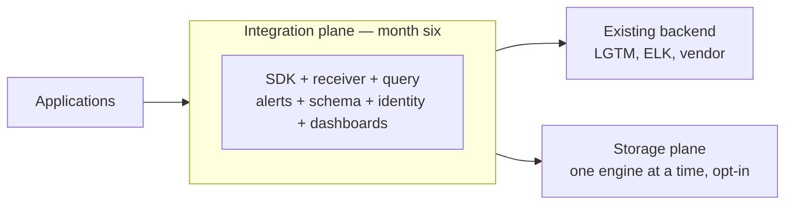

---

## What is nWave

nWave is an AI-amplified delivery framework built by Alessandro Di
Gioia and Michele Brissoni at nWave.ai. It is not mine; I am one of
its early adopters and dogfoodists. I use it on every project I run
because it operationalises the practices I have advocated for years
under the name T*D (test-driven, trunk-based, team-focused
development) into a shape that lets a solo author with AI agents
afford the full discipline of a high-functioning engineering team.

nWave structures every feature into five disciplined waves.

DISCUSS handles user stories, journeys, acceptance criteria, and
outcome KPIs. The agent is Luna, a product owner. Luna runs
Jobs-to-be-Done analysis when user motivations are unclear, journey
mapping when they are not, and produces stories in LeanUX format with
mandatory Elevator Pitches that name a real entry point and a real
observable output.

DESIGN handles system architecture, technology choices, and
Architecture Decision Records. The agent is Morgan, a solution
architect. Morgan produces C4 diagrams in Mermaid, locks library
choices with rationale and rejected alternatives, and continues the
project's ADR series.

DISTILL turns the DISCUSS acceptance criteria and the DESIGN component
contracts into executable acceptance tests, all RED on day one. The
agent is Scholar, an acceptance designer. Scholar produces Rust
integration tests that import only the public surface, exercise real
network protocols on loopback ports, and use the harness as substrate
rather than as a mock.

DELIVER turns the RED tests GREEN slice by slice, outside-in, with
each slice landing as its own commit. The agent is Crafty, a software
crafter. Crafty runs red → green → refactor cycles for every test,
runs mutation testing on each slice, and lands at one hundred per cent
mutation kill rate.

DEVOPS handles CI/CD, infrastructure, observability of the platform
itself, and deployment readiness. The agent is Apex, a platform
architect. Apex extends the GitHub Actions workflow, locks the local
hooks, designs the operator-facing observability story, and surfaces
the CI invariants that DESIGN requires.

Each wave runs to peer-review approval before the next wave starts.
The reviewers are themselves specialised agents — Sentinel for
DISCUSS and DISTILL, Atlas for DESIGN, Crafty in review mode for
DELIVER, Forge for DEVOPS. The reviewer's job is to apply a different
brief to the same artefact: bias detection, completeness checks,
contract preservation across waves, and explicit verdicts with
Conventional Comments labels.

The methodology has a maximum of two review iterations per wave
before escalation to me as orchestrator. In practice, most waves are
approved on iteration one or two, and the iterations have been
substantive — every reviewer pass has caught real defects.

---

## The first feature: OTLP conformance harness

The harness is a small Rust library. Its only job is to validate that
a byte sequence is a valid OpenTelemetry OTLP message. It does not
emit telemetry. It does not run as a process. It is a pure function:
bytes in, either an `Ok(record)` or an `Err(violation)`.

Why this feature first? Two reasons. First, it is the leaf dependency.
Aperture, Sieve, Sluice, every other component will consume it.
Building it first means downstream code never has to mock validation.
Second, it is the smallest thing that exercises the full nWave loop.
If the methodology cannot be applied cleanly to a feature this small,
the methodology is not ready for the larger features.

It is the walking skeleton for nWave on Kaleidoscope, not for
Kaleidoscope itself.

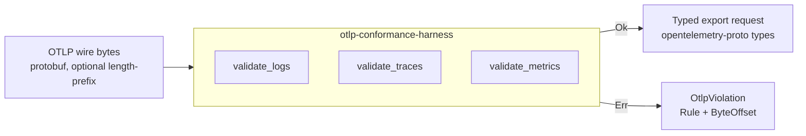

### The harness's DISCUSS wave

Luna ran Jobs-to-be-Done analysis with me, then mapped four user
journeys around the consumers of the harness — Aperture, Sluice,
third-party engineers operating Kaleidoscope, Kaleidoscope CI. She
produced seven user stories in LeanUX format, each with a mandatory
Elevator Pitch naming a function-call entry point and a concrete
observable result.

She also produced seven Elephant Carpaccio slices. Each slice ships
end-to-end value, has a named learning hypothesis, and uses real
production data rather than synthetic. The slice ordering is
learning-leverage first: the slice with the highest uncertainty goes
first, so failures cost the least.

Sentinel reviewed and pushed back on iteration one with four
substantive findings: byte-locus ranges instead of exact offsets
(mutation-resistant), observed-field membership in a closed set
instead of free-form strings, type-identity assertion at consumer
call sites, and signature-lock pinning via typed `fn` pointers. Luna
addressed all four on iteration two; Sentinel approved.

The DISCUSS-wave artefacts live in `docs/feature/otlp-conformance-harness-v0/discuss/`.

### The harness's DESIGN wave

Morgan worked with me to lock the architecture. The harness is a
single library crate with no internal dependencies of its own. The
public surface is three functions — `validate_logs`, `validate_traces`,
`validate_metrics` — plus six closed types: `OtlpViolation`, `Rule`,
`ByteOffset`, `Framing`, `SignalType`, and the wire-type sub-rule
enum.

He produced three C4 diagrams in Mermaid (System Context, Container,
Component-skipped per scope) and five Architecture Decision Records
covering the public API surface, the violation type design, the
exact-version pin policy on `opentelemetry-proto`, the conformance
test-vector layout, and the CI contract for the harness's gates.

The CI contract — ADR-0005 — locked the five gates that every other
feature on Kaleidoscope inherits: cargo deny check, cargo test, cargo
public-api, cargo semver-checks, cargo mutants. Including the one
hundred per cent mutation kill rate target.

Atlas reviewed and approved on iteration one.

The DESIGN-wave artefacts live in `docs/feature/otlp-conformance-harness-v0/design/`.

### The harness's DISTILL wave

Scholar produced fifty-two acceptance tests across seven Rust
integration test files (`slice_01_*.rs` through `slice_07_*.rs`) plus
shared helpers in `tests/common/mod.rs`. Each test maps to a user
story and a slice. The hexagonal boundary mandate was enforced
literally: every test imports `otlp_conformance_harness::*` only;
no `pub(crate)` symbols.

Real-data discipline: accept paths use prost-encoded message types
generated from `opentelemetry-proto`'s tonic feature, which produces
the same byte shape an OTel SDK would emit. Hand-crafted bytes only
for synthesised malformed cases (truncations, varint corruptions, bad
tags).

Sentinel approved on iteration two after asking for byte-locus
windows instead of exact offsets and a closed set for the
observed-field assertion.

The DISTILL-wave artefacts live in `docs/feature/otlp-conformance-harness-v0/distill/` and the tests at `crates/otlp-conformance-harness/tests/`.

### The harness's DELIVER wave

Crafty implemented the harness slice by slice over eight commits. The
slice ordering followed Luna's prioritisation: the highest-leverage
learning slice first, then by dependency.

Each slice was red → green → refactor. The refactor step was not
optional. Crafty extracted shared helpers when duplication appeared,
collapsed redundant disjuncts in the prost-error classifier under
mutation pressure, and pulled out a single `decode_strict` chokepoint
when the third call site appeared.

Mutation testing achieved one hundred per cent kill rate. The path
to one hundred was instructive: pass one had three surviving
mutations in `classify_prost_decode_error`, all `||→&&` flips. Crafty
killed them by writing per-disjunct tests that isolate each
clause. Pass two had one survivor in `matches_wire_type_category`
that was killed the same way. Pass three was clean.

The crucial property: every survivor was killed either by writing a
more discriminating test, or by simplifying the production code so
the surviving mutation became unreachable. No survivor was killed by
relaxing a test. This is the difference between mutation testing as
discipline and mutation testing as theatre.

Crafty in review mode approved on iteration one.

The DELIVER-wave artefacts live in `docs/feature/otlp-conformance-harness-v0/deliver/`.

### The harness's DEVOPS wave

Apex extended the project's GitHub Actions workflow with the five
ADR-0005 gates: gate-4-deny first (fastest, fail-fast on licence and
advisory issues), gate-1-test second, gate-2-public-api and
gate-3-semver-checks running in parallel after Gate 1, gate-5-mutants
last (slowest, behind a thirty-minute timeout safety net).

He also produced the first version of the local pre-commit and
pre-push hooks, mirroring the CI gates so contributors can see CI's
verdict before pushing.

Forge approved on iteration one. The review identified one high
finding (action pinning by tag rather than commit SHA) accepted as
risk for the solo-author period, and two medium findings actioned in
post-merge corrections.

The DEVOPS-wave artefacts live in `docs/feature/otlp-conformance-harness-v0/devops/`.

### The post-merge corrections

After branch protection went live, the first real CI run on `main`
exposed several defects that no reviewer had caught: a Docker action
that honoured our toolchain pin and choked on edition2024 in a
transitive dep; an MSRV mismatch with the current ecosystem requiring
a 1.78 to 1.85 bump; a test race in the silence-observer tests caused
by `gag::BufferRedirect` capturing the cargo test runner's own
output; tool MSRV mismatches for `cargo-public-api` and
`cargo-semver-checks` that needed a switch to precompiled binaries; a
GitHub Actions context-evaluation quirk forcing literal env values at
the job level; tool flag drift between major versions.

Eleven commits, thirty-five minutes wall-clock. Each fix landed
directly on `main` — by then I had relaxed branch protection to pure
trunk-based, no required-status-checks gate, no enforce-admins. CI
was feedback, not a blocker. The discipline that kept `main` green
was social, not mathematical: small commits, fix-forward fast, every
correction recorded as a post-merge correction note in the wave's
`wave-decisions.md`.

The harness shipped at tag `otlp-conformance-harness/v0.1.0` with all
five gates green, seventy-three of seventy-three tests passing, one
hundred per cent mutation kill rate confirmed on real Linux CI
infrastructure.

The honest read of this period: the methodology survived first
contact with operational reality, but the reviewer agents had not
caught the gaps that real infrastructure exposed. That is the
artefact-vs-reality gap. It is the most important single learning
from feature one. The reviewer agents check artefact fidelity to
their wave's brief; they do not check operational fitness against a
real runner. Future improvements to the reviewer agents need to
include a "did you actually run this against the runner you said you
would run it against" check.

---

## The second feature: Aperture

Aperture is the OTLP receiver. It is the first network-facing
component of Kaleidoscope, and the first piece that is genuinely a
service rather than a library. It listens on gRPC port 4317 and
HTTP/protobuf port 4318, validates every incoming payload through
the harness, and hands accepted records to a pluggable `OtlpSink`.

The shift from library to service is meaningful. The harness has no
runtime concerns. Aperture has many: backpressure, graceful shutdown,
self-observability, configuration with forward-compatibility knobs
for Phase 2 identity and TLS layers.

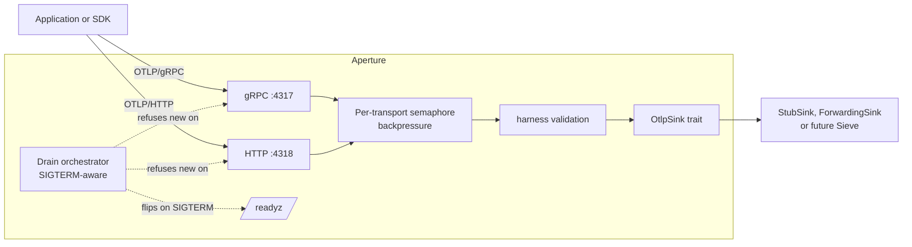

### Aperture's six locked scope decisions

Before Luna ran the wave, I locked six scope decisions in one
round-trip with her — the kind of conversation a senior engineer has
with the product owner before story-writing begins:

1. Both transports day one. gRPC on 4317 and HTTP/protobuf on 4318.
   Phasing one out for later means Aperture cannot honestly be called
   "an OTLP receiver" until both are present.
2. Tokio as the async runtime. The only realistic Rust answer for a
   network service of this shape.
3. The boundary with the future Sieve component is an `OtlpSink`
   trait. Aperture's job ends when the sink has acknowledged the
   record. v0 ships with a `StubSink` and a `ForwardingSink`. Sieve
   when it lands will be another `impl OtlpSink`.
4. Backpressure: a configurable max-concurrent-requests limit per
   transport, with HTTP 503 (Retry-After) or gRPC `RESOURCE_EXHAUSTED`
   on overflow. No internal queue (that is Sluice's job in Phase 7).
   No block (it violates the OTel SDK contract). No silent drop
   (an explicit anti-pattern).
5. Plaintext at v0, no auth. But a configuration knob for TLS and
   SPIFFE present in the v0 schema, defaulting to off. This avoids a
   schema break in Phase 2 when Aegis ships.
6. Self-observability: structured JSON logs to stderr, no metrics in
   v0 (that is Pulse's territory in Phase 4), HTTP /healthz and
   /readyz endpoints on the same listener as the OTLP HTTP traffic.

### Aperture's DISCUSS through DEVOPS

Luna, Morgan, Scholar, and Apex each ran their wave on Aperture with
the same discipline as for the harness. The artefacts mirror the
harness in structure but reflect the service-shaped concerns.

Eight Elephant Carpaccio slices instead of seven (the eighth is
graceful shutdown drain, which the harness did not need). Eighty-four
RED acceptance tests instead of fifty-two. Five new ADRs (ADR-0006
through ADR-0010) covering transport stack, sink trait design,
configuration schema, observability strategy, and backpressure
policy.

Three new CI invariants surfaced: `single_validator_per_signal`
(only one harness call site per signal in the Aperture source),
`no_telemetry_on_telemetry` (Aperture emits no outbound network
traffic except to its configured downstream sink), and
`probe_gold_runner` (the Earned-Trust probe is itself probed against
a fixture that lies).

All four waves approved by their reviewers (Sentinel, Atlas,
Sentinel again, Forge) with no blockers.

### Aperture's DELIVER, slice by slice

The first slice is the smallest possible end-to-end thing. An OTel
SDK sends a real log record over gRPC; Aperture binds the listener,
hands the bytes to the harness, gets back a typed record, prints a
single line to stderr saying it received the record, and answers
the SDK with OK. There is no second transport yet, no second signal,
no backpressure, no graceful shutdown. There is just the one happy
path, end to end. Once that works, every subsequent slice is an
addition, not a leap.

The second slice adds the HTTP transport on the other port. Same
pipeline, different wire shape. It also adds the readiness state
machine: a process that has bound both listeners answers `/readyz`
with 200; a process still starting up answers 503. The reason that
matters now and not later is that as soon as Aperture is bound to a
real port, somebody's orchestrator wants to know whether to send it
traffic.

The third and fourth slices complete the OTLP signal contract. Logs
are already in. Slice three adds traces. Slice four adds metrics.
After slice four, the platform handles every kind of telemetry the
OpenTelemetry standard defines — which is the moment Aperture can
honestly be described as an OTLP receiver rather than as a logs
receiver that happens to use OTLP.

The fifth slice teaches Aperture to refuse work when it has too
much. A configurable cap on concurrent requests; a 503 with
Retry-After when the cap is hit; a structured stderr line for every
refusal so an operator can see when the cap was exercised. The point
is that refusal is honest. Aperture does not queue, does not block,
does not drop. Each of those alternatives breaks somebody downstream.
Saying "I'm full, try again in a second" is the only honest answer.

The sixth slice is where the platform stops being a toy. Aperture
gains a sink that ships accepted records to a real downstream
OpenTelemetry-compatible HTTP endpoint. That means a Phase-1
deployment of Kaleidoscope can actually be useful: an operator runs
Aperture in front of their existing observability backend and gets
the validation, the structured logs, and the readiness probe for
free. The slice also adds the Earned-Trust probe — at startup,
Aperture verifies the downstream actually responds to the OTLP
contract before it begins accepting traffic. If the downstream lies
(answers OPTIONS but then refuses POST), Aperture refuses to start.
The proof that the probe is honest, and not theatre, is a test that
runs the probe against a fixture deliberately programmed to lie. The
test passes only if the probe catches the deceit.

The seventh slice is small and forward-looking. The configuration
file gains two switches, for TLS and for workload identity. At v0
both are off, and turning them on does nothing except print a
warning. They exist so that when the identity layer ships, two
years from now, the configuration format does not have to change.
This is the kind of decision that costs almost nothing now and
saves a great deal of pain later.

The eighth slice is shutdown done with care. SIGTERM arrives; the
readiness probe flips to 503 within a tenth of a second; new
requests are refused; in-flight requests are given a grace period
to complete; the listeners drop and the process exits zero. The
default grace period is thirty seconds, which is the value
Kubernetes also defaults to. Operators rolling deployments do not
need to think about Aperture at all.

After the eighth slice, the v0 plan is complete. The reviewer reads
the whole DELIVER output as a single artefact and approves. A
single commit promotes the new crate into the same CI gates as the
harness. The first version is tagged.

What stands at the end is the second feature on Kaleidoscope and
the first network-facing component, and the proof that the
methodology absorbs the shift from a pure-function library to a
long-lived service without changing shape. Eight slices, each
landing as its own visible step, each verified end-to-end against a
real client over a real socket.

Each slice has been a single focused dispatch of Crafty, ending with
a multi-commit landing that makes the slice's RED tests GREEN, the
mutation kill rate 100%, and the production code idiomatic Rust.

The `crates/aperture/` directory is the production tree. Each src
file carried a `// SCAFFOLD: true` marker at DISTILL time; the marker
is removed by DELIVER as each module's tests turn GREEN.

---

## Case study: feature 3

Spark is the third feature on Kaleidoscope and the first one written
from the application's seat rather than the platform's.

The harness validated bytes against the OTLP specification. Aperture
received those bytes over a real socket. Spark is the SDK an
application uses to put bytes onto that socket in the first place.
The round-trip closes here. A Rust application calls `spark::init`,
emits a span via the standard OpenTelemetry API, and lets the guard's
drop flush the batch on exit. The bytes travel to Aperture. Aperture's
recording sink confirms what arrived.

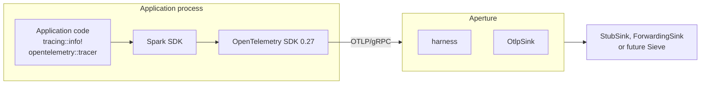

Spark is licensed Apache-2.0, deliberately. The platform crates ship
under AGPL because copyleft is the structural defence against the
re-licensing pattern. The SDK ships permissive because anyone
embedding it in a proprietary application must not be forced to open
their source to do so. This split is the same split the major
observability vendors landed on for the same reason. Kaleidoscope
encodes it from day one.

The dev-dependency on Aperture for integration tests is the only
place where the AGPL crate enters Spark's build. `cargo deny` is the
structural enforcement that prevents accidental promotion to a
runtime dependency.

---

## What changes from a service to an SDK

Aperture lives inside our process. Spark lives inside someone else's.
The implications are larger than they look.

A service can change its internal shape any time the methodology says
it should. A library exposes a public surface that strangers will
consume on their own timeline. Renaming an exported function is a
breaking change. Adding a variant to a public error enum is a
breaking change unless the enum is marked non-exhaustive. The
OpenTelemetry ecosystem itself is mid-stabilisation; the semantic
conventions crate's attribute names move between point releases.

The methodology absorbs this without changing shape, but the
discipline inside DESIGN intensifies. ADR rigour matters more. Pin
policy matters more. Whether the user-facing struct exposes a field
or a method matters more. The reviewer agent's brief covers
public-API ergonomics as its own quality attribute, not as a
footnote.

Developer ergonomics is itself an outcome KPI for an SDK. A
five-minute first-time-use experience is not a nice-to-have; it is
the difference between adoption and abandonment.

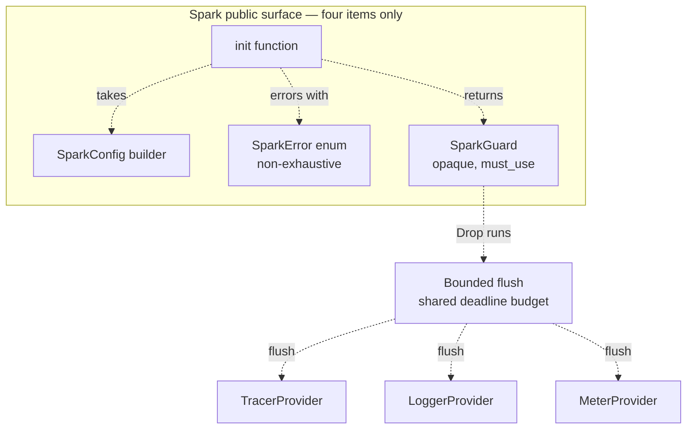

---

## Spark — DISCUSS and DESIGN closed

DISCUSS produced six elephant-carpaccio slices, each shipping a
visible step of the integration. The first slice is a walking
skeleton: a small binary calls `spark::init`, records a span, and
shuts down; Aperture's recording sink confirms the span arrived
carrying the four house attributes on its resource. Every subsequent
slice adds one capability — error paths, feature flags, environment
variable precedence, the three signal types, the bounded flush on
drop — without giving up the round-trip the walking skeleton
established.

DESIGN locked the wrapper shape across six new architecture decision
records. The public surface is four items: the `init` function, the
`SparkConfig` builder, the `SparkError` enum, the `SparkGuard`
returned from init. The guard is opaque, marked must-use, and does
its work entirely in drop. The single-init invariant is enforced in
two layers: an internal atomic flag and the OpenTelemetry SDK's own
re-set guard, with roll-back on failure so a retry after a failed
init does not falsely report already-initialised. The flush deadline
is a single budget shared sequentially across the three providers.
The OpenTelemetry family is pinned exact-minor at zero-twenty-seven,
the same version the harness pins exact-patch.

The DESIGN wave surfaced one honest contradiction with the DISCUSS
contract. The acceptance criteria for the bounded-flush slice
implied an integer count of drained or dropped records on the exit
event. The OpenTelemetry SDK at the version Spark pins does not
expose those counters publicly. The architect proposed Path A:
update the contract to accept the literal `unknown` until the SDK
exposes the integer; preserve the prefix `drained=` and `dropped=`
as the contract; treat the value as informational. The alternative
of building a Spark-side counter wrapper to fake an integer was
rejected as throwaway code that duplicates state already tracked
internally and that a future SDK release will likely surface.
DISCUSS was updated with an explicit Changed Assumptions section
recording what changed and why. The DESIGN ADR locks the new event
shape. The acceptance designer reading the contract today is not
misled by an old literal.

Both waves were approved by the reviewer on iteration one with no
blocking issues.

---

## Spark — DISTILL closed

DISTILL turned the user stories' BDD scenarios and the six DESIGN
ADRs into eight Cargo integration test binaries: one per
elephant-carpaccio slice, plus two cross-cutting invariants for the
single-init contract and the no-telemetry-on-telemetry contract.
Fifty-seven test functions in total. Fifty-three of them are RED
on day one, panicking on `unimplemented!()` from the production stub.
The configuration builder is intentionally real at DISTILL because
tests need to construct configurations to exercise the contract;
everything else waits for DELIVER.

The acceptance posture is the same one Aperture set: real local
Aperture instances spun up per test on ephemeral loopback ports, with
recording sinks asserting what arrived. No mocks, no in-memory
transports, no synthetic data. Spark depends on Aperture only as a
development dependency, which keeps the AGPL crate out of Spark's
runtime supply chain and confines the licence question to the test
binaries.

The DISTILL wave surfaced its own back-propagation. The acceptance
designer discovered that the OpenTelemetry Rust SDK at the version
Spark pins exposes a global getter for the tracer provider and the
meter provider, but not for the logger provider. The DISCUSS contract
for the logs-and-metrics slice presupposed the symmetric three-signal
shape that does not hold at this version. Three of the slice's tests
were marked ignored, with their function names preserved verbatim so
that when the contract resolution lands the tests can be un-ignored
without renaming. The note proposed four concrete resolution paths
and made the choice explicit rather than papering it over with a
workaround.

Two back-propagations in two waves. Both surfaced upstream
constraints that the methodology made visible at the right moment,
neither at the wrong moment. The methodology rewards honest
escalation; the alternative is a contract that lies about what the
underlying technology can do.

The reviewer approved DISTILL on iteration one with no blocking
issues.

---

## The logs-emission decision

The second back-propagation needed a real architectural choice. The
acceptance designer's note proposed four paths and recommended Path
A. The four were: expose a fifth public-API item, expose a test-only
seam, adopt the Rust ecosystem's standard logs bridge, or wait for
the upstream SDK to add the missing global getter.

The choice was the third one. A Rust application in 2026 already uses
the `tracing` crate everywhere. The bridge crate
`opentelemetry-appender-tracing` is the canonical adapter from
`tracing` events to OpenTelemetry log records. It is licensed
Apache-2.0, which sits inside Spark's permissive runtime supply
chain. Spark wires the bridge as one more `tracing-subscriber` layer
during `init`, with a filter that excludes Spark's own diagnostic
target so the no-telemetry-on-telemetry invariant holds. The
application keeps using `tracing::info!` and `tracing::warn!`. The
public surface stays at four items; ADR-0011's lock holds.

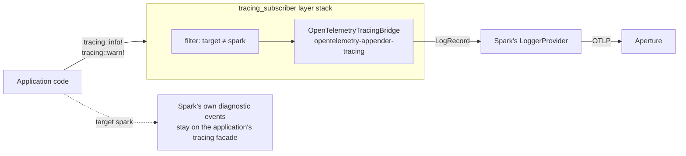

The decision is recorded as ADR-0017. The DISCUSS contract for the
logs-and-metrics slice was updated with a Changed Assumptions entry
naming the move from the original phrasing to Path A3, and the four
DISCUSS files referencing the non-existent global getter were
rewritten mechanically to use `tracing::info!` instead. The three
ignored slice tests retain their function names verbatim, so when
DELIVER lands the bridge wiring, un-ignoring them is a single-line
change. Slice five can now start alongside the other five.

---

## Spark — DELIVER closed and graduated

The crafter ran six elephant-carpaccio slices, one at a time, each
landing as a tight red-green-refactor cycle and a small focused
commit on `main`. The walking skeleton landed first: a Rust
application calls `spark::init`, records one span, and the recording
sink behind a real Aperture instance captures one export request
carrying `service.name` and `tenant.id` on its resource. The init
error paths landed next: each of the four error variants becomes a
precise diagnostic raised before any OpenTelemetry SDK type is
constructed, with a transactional roll-back that releases the
single-init flag if a post-flag step fails. Then the remaining house
attributes, then the environment-variable precedence, then the
three-signal Resource symmetry via the appender bridge, then the
bounded flush deadline with its shutdown event vocabulary.

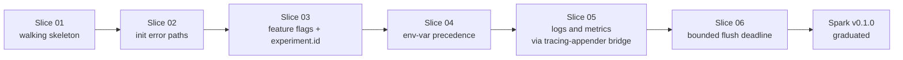

Eight Cargo integration test binaries. Sixty active tests. One
hundred per cent mutation kill rate on the diff at every slice's
close. The crafter's review-mode pass approved the wave on iteration
one with no blocking issues.

Five back-propagation issues surfaced during DELIVER, each documented
at the time of the offending change with explicit forward path. One
of them caught a real misreading I had propagated in writing
ADR-0017: I claimed the appender crate's release cadence was offset
by one from the core, when in fact the minor versions align. The
crafter found the duplicate `opentelemetry 0.28` in the lockfile,
inspected the upstream manifests, pinned `=0.27`, and the lockfile
collapsed back to one minor. The architecture decision record was
amended in place with the correction. The audit trail is the
back-propagation note plus the amendment plus the lockfile diff.

After the sixth slice closed and the review approved, three things
happened in quick succession. The pre-commit hook and the CI Gate 1
both removed their `--exclude spark` clauses; Spark joined the
harness and Aperture in the canonical contract that every commit on
`main` passes the full workspace test gate. The tag `spark/v0.1.0`
landed as the canonical reference. The narrative document gained
this paragraph.

What is consistent across the five features so far is that each
shipped, each had honest back-propagation when DESIGN's reading of
upstream APIs or contracts proved imperfect, and each closed without
exceptions to the discipline.

---

## Case study: feature 4 — Sieve

Sieve is the fourth feature on Kaleidoscope and the first one that
sits inside the platform pipeline rather than at its edges. The
harness validates bytes against the OpenTelemetry specification.
Aperture receives those bytes and hands them to a sink. Spark sits in
the application emitting them in the first place. Sieve is the next
node downstream of Aperture: it filters and samples before the
records reach storage.

The job at v0 is volume control without losing the trace data
operators most want to keep. Trace storage is expensive and most
traces are uninteresting; sampling reduces the volume. But errors are
exactly the traces operators reach for during an incident, so the
sampler is biased to retain every error-bearing trace at one hundred
per cent regardless of the configured rate.

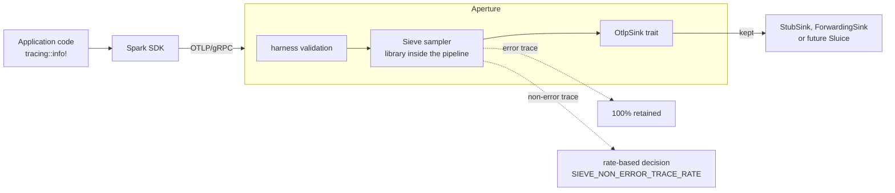

Licensed AGPL because Sieve is a server-side platform component.
Inside the pipeline by design at v0, not a separate process. The
roadmap says stage one of sampling lives at Aperture; the architect
and the orchestrator agreed that putting Sieve there at v0 keeps the
walking skeleton honest. The separate-process shape becomes the right
answer when tail-sampling needs an in-memory window across batches,
which is v1.

The product owner ran a tightened DISCUSS to lock eight scope
decisions: library shape, trace-level granularity, the
`status.code == ERROR` definition of an error span, deferral of
PII-scrubbing to v1, single global rate via an environment variable,
logs and metrics passthrough, the `xxh3_64` hash function for
`trace_id`-keyed determinism, and the verbosity convention
(DEBUG per-decision, INFO summary every minute). Six elephant-
carpaccio slices and six user stories follow from those decisions.

The reviewer approved DISCUSS on iteration one with no blocking
issues. Two clarifications surfaced and were closed inline: the
periodic INFO summary is locked as a v0 contract (without it,
operators on default verbosity have no Sieve visibility), and the
sixty-second tick interval is locked at DISCUSS rather than left for
DESIGN to pick.

---

## Sieve — DESIGN closed

DESIGN closed at iteration one with no blocking issues from the
reviewer. The single most consequential architectural decision was
the shape of the Aperture integration. Two options were on the table:
Aperture grows a hook trait that Sieve plugs into, or Sieve wraps
Aperture's existing sink trait without changing it.

The architect went with the second. Sieve's main public type is a
generic decorator that wraps any existing `OtlpSink + Probe`
implementation, runs the sampling pass on traces inside its own
`accept` method, and forwards the kept records to the inner sink
unchanged. Aperture's public surface does not move. The integration
work that DELIVER will land is three lines in Aperture's composition
root: build the inner sink, build the sampler, wrap the inner sink
in a `SamplingSink`. That's it.

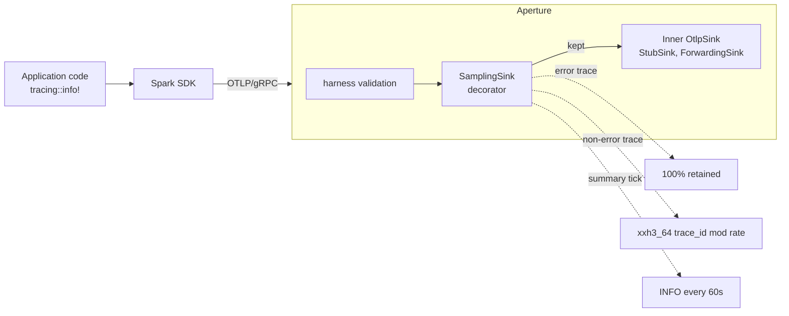

The decorator preserves the Earned-Trust invariant. Aperture's contract
includes a `Probe` trait that sinks implement so the composition root
can verify reachability before traffic flows. Sieve has nothing
external to probe; it is a pure-CPU stage. Its `probe` method
delegates to the inner sink's, which is honest and keeps Aperture's
"wire then probe then use" guarantee intact.

Four ADRs lock the design (0018 to 0021). The summary aggregator uses
three atomic counters with relaxed ordering, wait-free on the hot
path; the cross-counter race during snapshot is documented and
acceptable for the "approximate aggregate over the window" contract
the operator was promised. The `xxh3_64` hash from the
`xxhash-rust` crate is pinned exact-minor at zero-eight because a
hash-algorithm change would shift which traces are kept on the same
fixture, and that is operator-visible. The `tracing-appender` lesson
from Spark applied here too: the version pin gets a careful audit and
a documented rationale before it lands.

DISTILL picks up the acceptance test design next.

---

## Sieve — DISTILL closed

The acceptance designer turned the user stories' BDD scenarios and
the four DESIGN ADRs into eight Cargo integration test binaries: one
per elephant-carpaccio slice plus two cross-cutting invariants.
Thirty-six test functions in total. Twenty-two of them exercise error
or edge paths, sixty-one per cent of the suite.

The acceptance posture is the same one the harness, Aperture, and
Spark settled on: real Aperture's recording sink is the inner sink
inside Sieve's `SamplingSink<S, N>` decorator. The decorator is
tested against the actual `OtlpSink + Probe` contract from Aperture's
public ports, not against a mock. A library called from the
application's seat should be tested against the surface the
application sees, not against an artificial double of it.

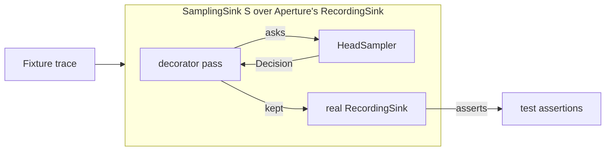

The reviewer approved on iteration one with a score of 9.8 out of 10
across nine dimensions. The mixed RED posture is the canonical Sieve
shape: validation paths inside `HeadSampler::new` and
`HeadSampler::from_env` are real, so tests can exercise the four
`SieveConfigError` variants without a complete sampler
implementation. The behavioural contract panics on
`unimplemented!()`. DELIVER will turn the panicking tests GREEN one
slice at a time.

A small piece of DEVOPS work falls out of DISTILL and lands in the
same wave: the `xxhash-rust` crate ships under `BSL-1.0` only, not
the dual licence I had assumed when ADR-0019 first read the upstream
manifest. The workspace's `cargo deny` configuration grew an explicit
`BSL-1.0` allow entry with documented rationale. The licence audit
trail is the deny.toml comment plus the ADR plus the dependency
graph.

DEVOPS picks up the workflow extensions next; DELIVER follows.

---

## Sieve — DELIVER closed and graduated

The crafter ran six elephant-carpaccio slices. The walking skeleton
landed first: a Sampler trait, a HeadSampler concrete, a Decision
enum, two integration tests asserting that an error-bearing trace is
kept and a non-error trace at rate zero is dropped. The error-bias
retention rule landed alongside it as a side effect of how the
short-circuit composes. Then the rate-honouring decision via the
xxh3_64 hash; the trace-id determinism that follows for free from a
deterministic hash; the decorator that wraps Aperture's sink without
changing Aperture's surface; and finally the observability layer with
its three atomic counters, its sixty-second timer task, its DEBUG
per-decision events and INFO summary.

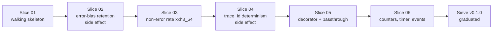

Eight Cargo integration test binaries. Thirty-six active tests. One
hundred per cent mutation kill rate on the diff at every slice's
close. Three of the six slices closed with their own implementation
plus a small pinning commit that added unit tests to kill mutation
survivors; the discipline is visible in the commit log.

The architect's review flagged one pragmatic v0 compromise: reading
the configured rate from the sampler uses an Any downcast to the
concrete HeadSampler type rather than extending the Sampler trait
with a rate accessor. The reviewer accepted it as the right v0 shape
and named the forward path: when v1 introduces a second sampler
(tail-sampling per the roadmap), extend the trait additively with a
default-NaN rate method. The downcast collapses to a clean
trait-method call at that moment. Honest documentation in code; no
hidden technical debt.

After the sixth slice closed and the review approved, three things
happened in quick succession. The pre-commit hook and the CI Gate 1
both removed their `--exclude sieve` clauses; Sieve joined the
harness, Aperture, and Spark in the canonical contract that every
commit on `main` passes the full workspace test gate. The tag
`sieve/v0.1.0` landed as the canonical reference. The narrative
document gained this paragraph.

The intermediate CI runs on slices one through five were red. That
is intrinsic to slice-by-slice DELIVER when the acceptance designer
writes all tests upfront in DISTILL: each slice's commit makes its
own tests pass while leaving the next slice's tests still RED, and
the mutation-testing gate refuses to mutate against a baseline that
has any failing test. The pure trunk-based discipline tolerates
intermediate reds because they are fix-forward by construction; the
final state at the graduation commit is green. Future Kaleidoscope
features may want a small amendment to the mutation gate that
narrows the baseline to the slice under test rather than the whole
crate, so intermediate reds become invisible. For Sieve the pattern
held; the lesson is logged.

What stands at the end of Sieve is the pipeline's first inside-the-
platform component, the methodology's fourth feature delivery, and
the proof that the same five-wave shape works for a stage-of-flow
component as cleanly as for a pure-function library, a network-port
service, or an application-embedded SDK.

---

## Case study: feature 5 — Codex

Codex is the schema authority. Where Sieve filters telemetry mid-
flight and Aperture validates wire-format conformance at the
network edge, Codex codifies the names that telemetry attributes
should have in the first place. The OpenTelemetry semantic
conventions are the upstream contract; Kaleidoscope adds three
house attributes (`tenant.id`, `feature_flag.{key}`, `experiment.id`)
that operators rely on for multi-tenant deployments,
feature-flagged rollouts, and A/B experiment tagging.

The job at v0 is small and useful: catch typos at integration time.
A developer wiring Spark into a service who writes `tenat.id` for
the tenant attribute will today ship the typo through to Aperture's
recording sink, where it lands as a separate column nobody queries
on. Codex closes that loop. Spark calls Codex's `validate` on the
assembled Resource just before the OTel SDK is wired; an unknown
attribute name produces a `LintReport` whose violations carry the
offending name plus a fuzzy "did you mean" suggestion when the
typo is close enough to a blessed attribute.

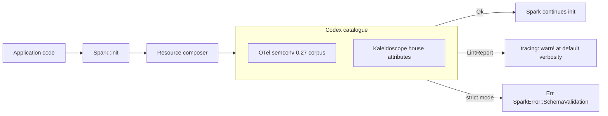

Licensed AGPL because Codex is a server-side platform component
(despite living as a library at v0; the licence anticipates the
eventual gRPC daemon shape the original roadmap describes). v0
ships nothing of that daemon — no FoundationDB, no CUE, no HTML
rendering. v0 is a Rust crate. The v0 use case is in-process from
Spark; the network-service shape arrives when there are multiple
SDK versions and per-tenant schema overlays to negotiate, which is
v1+.

The product owner ran a tightened DISCUSS and the architect's
review approved on iteration one with no blocking issues. Nine
scope decisions locked: library shape, hand-written Rust corpus
generated from upstream semconv, single pinned version, no
per-tenant overlays at v0, structured `LintReport` with multi-
violation collection, Spark-side integration via runtime dep with a
new non-exhaustive SparkError variant, checked-in generated corpus
file (so its evolution is visible in PR diffs), in-tree Levenshtein
implementation (no new dependency), and a single warn event per
misconfigured init at default verbosity.

Six elephant-carpaccio slices, each demoable. The walking skeleton
proves a `SchemaCatalogue` exists and validates a canonical pair
clean. Slice 02 fills the upstream OTel semconv corpus. Slice 03
adds the three Kaleidoscope-house attributes including the
`feature_flag.{key}` prefix-with-arbitrary-suffix shape. Slice 04
lights up the unknown-attribute path with structured
`LintViolation`s. Slice 05 adds the fuzzy "did you mean"
suggestions. Slice 06 lands the Spark integration: runtime dep,
default-warn or opt-in-strict, additive `SparkError` variant.

Slice 06 is the first real validation that the `#[non_exhaustive]`
discipline on `SparkError` works as intended. Spark v0.1.0 shipped
with the marker; Codex now adds a variant. The change is
non-breaking by construction. Confidence-building.

DESIGN picks up the architecture next.

---

## Codex — DESIGN closed

Four ADRs lock the architecture. The public surface stays at five
types plus the doc-hidden test seam discipline already established
by Spark and Sieve. The corpus is hand-written Rust constants
generated from the upstream OpenTelemetry semantic-conventions crate
by an `xtask` regenerator the maintainer runs when the workspace's
semconv pin moves; the generated artefact is checked in so its
evolution is visible in pull-request diffs. The Levenshtein
algorithm for the fuzzy "did you mean" suggestions is thirty lines
in-tree, no new dependency, well within the licence-audit
discipline an AGPL crate calls for.

The Spark integration is the one cross-feature touch. Spark adds
Codex as a runtime dependency, gains an additive `SchemaValidation`
variant on its already-`#[non_exhaustive]` error type, and exposes
an opt-in strict-mode builder. The default is warn mode: a single
`tracing::warn!` event per misconfigured init carrying the report's
human-readable text via Display rendering. Strict mode flips that
to a fast `Err` from `init` for CI environments. The default is the
operationally safe choice for existing Spark deployments rolling out
the lint.

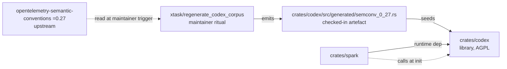

The wave surfaced one alignment risk during the architect's work and
resolved it cleanly. The slice-06 brief from DISCUSS recommended one
warn event per individual violation; the wave-decisions document
locked one warn event per init carrying the full report. The
architect flagged the contradiction; the slice brief was amended to
match the wave-decisions lock. Q9 wins; the slice brief follows.

The architect approved on iteration one with no blocking issues. The
recovery-during-stall pattern that has shown up earlier in the
project (ADR-0017 was the first; this is the second) held cleanly
again: the agent produced what he could before the watchdog cut him
off; the orchestrator finalised the remainder; the reviewer's pass
treated both halves equivalently. The methodology has now had two
clean recoveries from this pattern, and the cost of each has stayed
bounded.

DISTILL picks up the acceptance test design next.

---

## Codex — DISTILL closed

The acceptance designer turned the six user stories' BDD scenarios
and the four DESIGN ADRs into six Cargo integration test binaries:
five slice tests covering Codex's five own user stories, plus one
invariant smoke test that asserts the five-type public surface
compiles. Slice six, the Spark integration, lives in Spark's test
directory rather than Codex's, because the test fixture there
belongs to Spark and the cross-feature touch is implemented there.

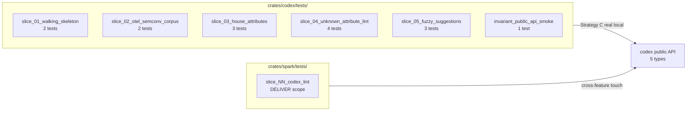

Fifteen test functions in total. Twelve panic on `unimplemented!()`
from the production stubs at the canonical RED state; three pass
because the corresponding paths are real even at DISTILL (the
catalogue's `new()` constructor, the public-API smoke test's
compile-time check, the empty-set boundary case which returns Ok
trivially when validate panics on its first non-empty input).

The reviewer approved on iteration one with a perfect score across
the eight critique dimensions, calling out the stub posture, the
purposeful test fixture design, and the machine-verifiable
traceability table as exemplary. Two adjustments the orchestrator
made during recovery from the architect's stall — switching
LintViolation field accesses from method calls to direct field
reads, and rewriting `result.err().expect()` to the more idiomatic
`expect_err()` — were both confirmed correct.

The recovery pattern from the watchdog stall has now happened
cleanly three times across the project. The cost has stayed bounded
each time; the methodology absorbs the agent stall the same way it
absorbs the back-propagation note, with explicit handoff and clear
provenance in the commit history.

DEVOPS picks up the workflow extensions next; DELIVER follows.

---

## Codex — DEVOPS closed

The platform-readiness wave was the smallest of the five for Codex.
Most of the infrastructure already existed: pre-commit hooks
mirroring CI, the five-gate workflow file, the cargo-deny licence
audit, the per-feature mutation testing job pattern. The orchestrator
extended what was there rather than designing anything new.

Two graduations and one new job. Codex's public API was added to
Gate 2 (`cargo public-api`) and Gate 3 (`cargo semver-checks`)
immediately, alongside the harness, Spark, and Sieve, because the
five-type surface is a real consumer contract that Spark holds
against. A new parallel CI job, `gate-5-mutants-codex`, was added
to mirror the per-feature mutation testing pattern established by
Aperture, Spark, and Sieve; it runs `cargo mutants --in-diff` with
the same thirty-minute timeout and the same `mutants.out` artefact
upload as the others.

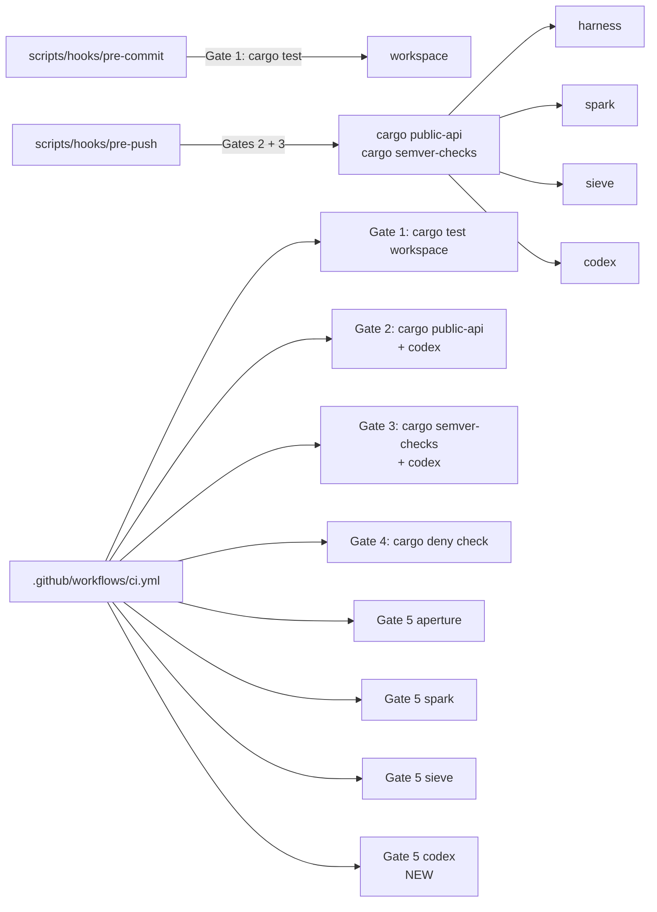

No new gate types were needed. Aperture had introduced three
feature-specific gates at its own DEVOPS wave for architectural
invariants the codebase could not express in lint rules. Codex's
invariants — the five-type public lock, the AGPL containment, the
corpus regeneration ritual — were already enforced by the
compile-time smoke test, the empty runtime closure that cargo-deny
audits to zero new entries, and the xtask binary's drift signal at
slice 02. The methodology rewards minimal additions. Forge will
peer-review the workflow extensions on the first CI run after
DELIVER lands; until then, the configuration is on probation in the
same sense every CI change is on probation.

DELIVER follows.

---

## Codex — DELIVER closed and graduated

Five slices, eight commits, all green. The crafter implemented
slices one, two, four, and five directly; slice three closed by
construction at slice two's corpus seeding because Scholar's DISTILL
fixture required all three house attributes to be present at slice
two. The brief I had written said "no `feature_flag.` Prefix entry
until slice three"; the test fixture and the corresponding ADR said
otherwise. The crafter followed the test, not the brief. The
corresponding amendment was recorded in the slice two commit
message and in the wave-decisions document. This is what
back-propagation discipline looks like in practice: implementations
match tests; tests match ADRs; briefs that contradict either are
amended in place.

Forty-six tests in total. Fifteen acceptance tests at the public
boundary plus thirty-one inline unit tests at the pure-function
seams. The acceptance tests prove the user-facing outcomes; the
inline tests target specific operator mutations with surgical
intent. The composition is the canonical Outside-In TDD shape: the
acceptance test drives the public surface; the unit tests drive the
internal correctness; the public surface remains the only route
into the crate.

Mutation testing landed clean. Thirty-five viable mutants across
the five slices' diffs, all thirty-five caught. Slice five's
fuzzy-suggestion code surfaced two surviving mutants on the
tie-break ordering of equally-distant matches; the crafter killed
both with a small refactor that collapsed the loop into an
`iterator::min_by` over a `(distance, name)` tuple, with the test
that nailed the alphabetical-tie-break case providing the
mutation-evidence anchor. Twenty-four mutants on slice five alone,
all caught. The discipline held.

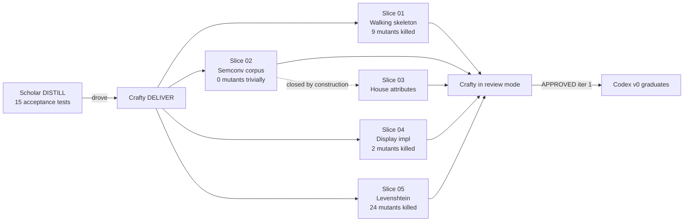

The reviewer approved on iteration one with zero blocking issues.
The verdict named the back-propagation handling at slice two as
exemplary, the surgical mutation-killing inline tests as the
canonical shape of refactor-driven kill, and the xtask
infrastructure as the right shape for a regeneration ritual that
must give compile-time audit signal when upstream renames a
constant. Three non-blocking suggestions were filed for later: a
README in the xtask directory for first-time corpus regeneration,
a v1 polish on the Prefix-suggestion rendering shape, and the
Spark-side slice six amendments to ADR-0012 and ADR-0013, which
land at the Spark-side wave that closes the cross-feature
integration.

Codex graduates. The pre-commit hook and the CI workflow drop
their `--exclude codex` qualifiers; Codex now contributes to the
workspace test gate alongside the harness, Aperture, Spark, and
Sieve. The crate is tagged `codex/v0.1.0`. Forge's review of the
DEVOPS workflow extensions runs independently on the next
Codex-touching commit. Slice six — the Spark integration — is a
separate Spark-side wave that lands the `SparkError::SchemaValidation`
variant, the `with_strict_schema_lint` builder, and the Codex
runtime dependency through post-DELIVER amendments to ADR-0012 and
ADR-0013. That wave is queued on Spark, not on Codex.

The first five features now share the same shape. Library, service,
SDK, library at the wire-protocol mid-stream, library at the schema
authority — five different shapes for five different problems, one
methodology that absorbed each.

---

## Spark — Slice 07 — Codex schema lint integration landed

The piece deferred at Codex's DELIVER closure has landed on the
Spark side. Spark's `init` now calls Codex's
`SchemaCatalogue::validate(...)` against the composed resource
attributes after the existing internal lint and before any OTel SDK
type is constructed. Violations surface either as a single
`tracing::warn!(target = "spark", ...)` event (default rollout
posture) or as `Err(SparkError::SchemaValidation(report))` when the
caller opted into strict mode via
`SparkConfig::with_strict_schema_lint(true)`.

This is the first real cross-feature integration since the v0
features each individually graduated. The discipline that mattered
on this slice was the `#[non_exhaustive]` posture ADR-0012 locked at
Spark's v0. Adding `SchemaValidation(codex::LintReport)` as a fifth
variant under the existing annotation is a non-breaking change per
Rust's semver rules; `cargo public-api` Gate 2 lists the addition,
`cargo semver-checks` Gate 3 accepts it as non-breaking, and
downstream consumers' wildcard match arms absorb it without
recompilation pressure. The discipline existed precisely so this
moment would land clean, and it did.

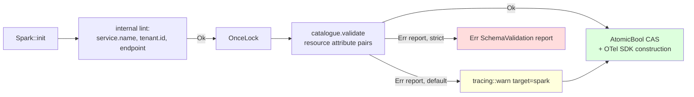

Six tests in this slice. Five integration tests in
`crates/spark/tests/slice_07_codex_schema_lint.rs` cover the warn-
mode happy path (silent on blessed inputs), warn-mode violation
(empty `feature_flag.` key produces a warn whose body names the
offending attribute), strict-mode violation (the same input
returns `Err(SchemaValidation)`), strict-mode happy path (no false
positives), and the order invariant (the existing internal lint
short-circuits before Codex sees anything). One unit test in
`init::tests` pins the `OnceLock` invariant via pointer identity:
two successive `catalogue()` calls return the same memory address,
so a `Box::leak`-style fresh-per-call mutant cannot survive.

Mutation testing on the diff: fifteen mutants, twelve caught, three
unviable, zero missed. The pointer-identity test was the
mutation-evidence anchor that closed the one survivor the
behavioural tests left exposed (a `catalogue()` body replaced with
`Box::leak(Box::new(default()))` produces observationally identical
`validate(...)` output but allocates fresh; the identity test
distinguishes them).

ADR-0012 (Spark error type) and ADR-0013 (Spark dependency pinning)
gained post-DELIVER amendment notes documenting the new variant and
the new runtime dep. ADR-0025 itself moved from Proposed to
Accepted with the landing-commit note. `cargo deny check` passes
on the new Codex runtime dep because Codex is `publish = false` and
covered by `[licenses.private] ignore = true`; no allow-list change
was needed for the AGPL-on-the-platform-side asymmetry.

The five-feature v0 has its first cross-feature integration. The
methodology absorbed it without a new wave shape: a single slice
brief, the Outside-In TDD discipline, mutation testing on the diff,
correction notes on the affected ADRs, six tests, one commit. The
discipline scales down as cleanly as it scales up.

---

## Case study: feature 6 — Prism v0

Prism is the project's first frontend. Every prior feature was a
Rust crate that served a developer in a CLI or inside another
process. Prism serves an operator on incident call at 03:14, alone
in front of a browser. The paradigm shift is real: TypeScript
instead of Rust, npm and pnpm instead of Cargo, a React + Vite +
Apache ECharts SPA instead of a service binary, Vitest and
Playwright instead of `cargo test`. The methodology was designed
for the Rust crates that came before. The genuine question of the
Prism feature is whether nWave absorbs the paradigm shift or
breaks against it.

The persona is Priya Raman, senior site reliability engineer at
`acme-observability`. PagerDuty pages her at 03:14 about a
checkout-service latency alert. She has ninety seconds to
acknowledge before escalation, and five to ten minutes to make a
triage decision before customer impact compounds. The product
narrative is anchored in her hands and head: a laptop, the Mimir
backend her team already runs, the Prism URL at
`https://prism.acme-observability.internal`, a service map of
twenty-three services in working memory, zero patience for tools
that fight her at three in the morning.

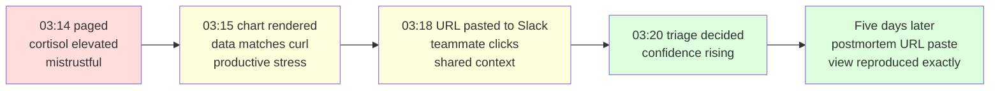

Prism v0 ships one PromQL query panel against an OTel-compatible
Prometheus or Mimir backend. Logs panel (LogQL), traces panel
(TraceQL), multi-panel dashboards, named saved-queries surface,
native auth — all explicitly out of scope at v0 and queued behind
Lumen, Ray, Loom, and Aegis in later phases. The licence is
AGPL-3.0-or-later. Prism is operator-facing platform infrastructure;
the SaaS loophole AGPL closes is the same loophole a competitor
could exploit against a static SPA served from a long-lived web
server. The licence asymmetry between Prism and Spark is the same
shape as between Aperture and Spark: server-side AGPL, SDK
Apache-2.0, structural rather than viral.

---

## Prism v0 — DISCUSS closed

Luna ran the DISCUSS wave through her JTBD analysis phase and her
journey design phase before overloading at the boundary of the
user-stories write. Bea finalised the user-stories, the DoR
validation, the outcome KPIs, the wave-decisions, and the SSOT
entries. The reviewer Eclipse, running on Haiku, treated Luna's
halves and Bea's halves equivalently per the recovery posture and
approved on iteration one with zero blocking issues. The recovery
pattern absorbed its fifth occurrence cleanly.

The wave produced thirteen feature-side files plus six slice
briefs plus three SSOT files. The primary job is "see the shape
of the misbehaving signal fast enough to make a triage decision".
Three secondary jobs were identified and deferred to post-v0: tail
logs in the chart's window, click a chart point to a trace
exemplar, save named views. The four forces analysis surfaced the
strongest demand-reducing force as data-fidelity anxiety: Priya
would not trust a chart if she could not tell whether the wobble
is the system's wobble or the SPA's smoothing artefact. That
anxiety drove KPI 3, the fidelity invariant, and the buildOption
pure function's locked configuration (`smooth: false`,
`connectNulls: false`, no auto-downsampling).

The six-slice carpaccio is sized so each slice ships end-to-end
value in one day with a named learning hypothesis. Slice one is
the walking skeleton against a real local Prometheus container,
Strategy C posture inherited from Aperture. Slice two adds
relative-range presets. Slice three lands the calm error and
empty states. Slice four adds auto-refresh with exponential
backoff. Slice five adds absolute time ranges and postmortem
permalink reproduction. Slice six is the WCAG 2.2 AA accessibility
audit and remediation pass.

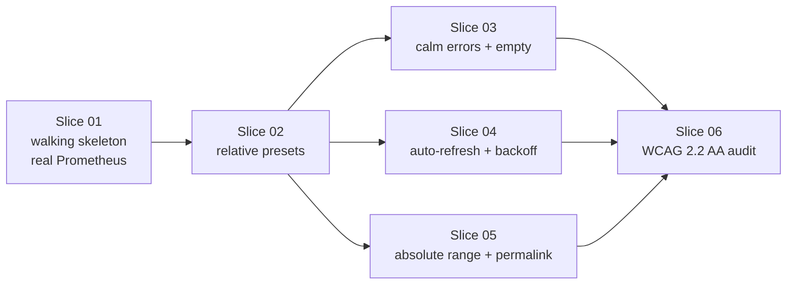

The SSOT promotion is the wave's quietest landing. Up to this
point `docs/product/journeys/` and `docs/product/jobs.yaml` did
not exist. The cross-feature journey-and-jobs surface is born
with Prism because Prism is the first feature whose journey is
clearly cross-feature: Beacon will fire the alert that opens the
journey, Loom will extend the share surface beyond URL paste,
Aegis will protect the SPA in production. Documenting the
operator-incident-response journey at the SSOT level pays
forward into those phases.

---

## Prism v0 — DESIGN closed

Morgan ran the DESIGN wave end to end without stalling. Seven
ADRs locked the architectural surface: ADR-0026 (component layout
with ports-and-adapters internal split), ADR-0027 (total-function
`queryRange` returning a five-arm `QueryOutcome` union; same-origin
reverse-proxy production posture), ADR-0028 (pure URL codec with
`history.replaceState` only), ADR-0029 (pure reducer + effects
shape for the auto-refresh state machine; 5/10/20/30 second capped
backoff curve), ADR-0030 (direct ECharts modular import; pure
`buildOption`; CSS-property palette swap with Okabe-Ito default),
ADR-0031 (coexistent Cargo and pnpm workspaces; ESLint with
boundaries and license-header plugins), ADR-0032 (AGPL-3.0-or-later
header on every TS source file from a single SSOT).

The architectural choice is a modular monolith with internal
ports-and-adapters. Microservices, server-side rendering, and
micro-frontends were all considered and rejected with specific
rationale rather than generic "they're complex" hand-waving.
Microservices have no team boundary to respect at one operator,
one Andrea, one designer. SSR adds a Node runtime for no
incident-time benefit. Micro-frontends would be a v1+ refactor
once `packages/ui/` becomes load-bearing.

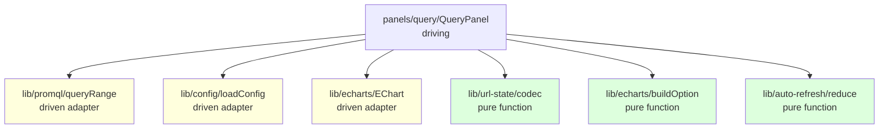

Three pure-function leaves anchor the design: URL codec,
buildOption, auto-refresh reducer. They import nothing
side-effecting — no React, no DOM, no fetch — and are testable
directly with property tests. The `eslint-plugin-boundaries` rule
makes the import discipline structural rather than aspirational:
a panel can import from `lib/`, a `lib/` adapter can depend on
the pure cores, but the pure cores cannot import side-effecting
modules. Atlas approved on iteration one. Morgan completed
without stalling — the first dispatch in this project to do so
across thirty-six tool uses.

---

## Prism v0 — DEVOPS closed

Apex ran DEVOPS without stalling. Eight files specified the six
new CI gates: Gate 6 Vitest unit and integration; Gate 7
Playwright E2E across Chromium, Firefox, and WebKit; Gate 8
bundle-size enforcement against a 300 KB gzipped ceiling; Gate 9
ESLint plus Prettier plus AGPL licence-header; Gate 10 StrykerJS
mutation testing with the same `--in-diff` cascade as the Rust
crates; Gate 11 Prometheus contract testing via a container
fixture pinned by digest.

```mermaid
flowchart LR
    G6[Gate 6 Vitest] --> G7[Gate 7 Playwright<br/>Chrome/FF/Safari]
    G6 --> G8[Gate 8 bundle<br/>≤ 300 KB gzipped]
    G6 --> G9[Gate 9 lint+format+licence]
    G6 --> G10[Gate 10 StrykerJS<br/>100% kill rate]
    G6 --> G11[Gate 11 Prom contract<br/>container fixture]
```

The browser-emitted KPI metrics path was the design space's only
real surprise. Three candidate paths were considered: emit through
`console.warn` only (debug-grade); emit cross-origin direct to
Aperture (preflight overhead, header complexity); emit same-origin
POST to `/v1/metrics` through the operator's reverse proxy to
Aperture, which translates JSON to OTLP at ingestion. Apex chose
the third with a fifty-line custom emitter rather than the
OpenTelemetry JS browser SDK, on the grounds that the bundle gate
at 300 KB has no headroom for an SDK that itself weighs
multiple tens of kilobytes.

Forge ran the iteration-one review on Haiku and returned
CONDITIONALLY APPROVED with five critical specification gaps and
three high-severity inline-note candidates. The five criticals
were the mutation-cascade bash pseudocode, the bundle-size JSON
schema, the Prometheus digest sync rule between Gate 7 and Gate
11, the KPI 5 production visibility mitigation through operator
JS-error-tracking tools, and the Pact-JS migration trigger
decision rule. Bea finalised the revisions directly rather than
re-dispatching Apex, on the grounds that the gaps were
specification additions and not architectural decisions. Forge's
iteration-two review approved the revised artefact set; the
iteration-two budget was bounded and clean.

---

## Prism v0 — DISTILL closed

Scholar ran DISTILL through the three markdown specs and the
first four slice Vitest files and the first three Playwright spec
files and the four JSON fixtures before Bea interrupted the
dispatch — the stuck-process pattern, accumulating periodic-check
ticks while the agent worked, was the signal. Scholar's
seventy-percent output was committed; Bea finalised the remaining
seven files (slice-05 Vitest, slice-04 / 05 / 06 Playwright,
three invariant tests) following Scholar's conventions verbatim.
The reviewer Sage on Haiku confirmed Scholar's and Bea's halves
cohere, approved on iteration one, and noted one non-blocking
concern about error-path coverage ratio.

```mermaid
flowchart LR
    AC[30 acceptance criteria<br/>across 7 stories] --> VS[8 Vitest files<br/>tests/]
    AC --> PS[6 Playwright specs<br/>e2e/]
    AC --> IV[3 invariant tests<br/>public-api / licence-headers / fidelity]
    AC --> FX[4 JSON fixtures<br/>fixtures/]
    VS --> RED[RED state<br/>throw UNIMPLEMENTED]
    PS --> RED
    IV --> RED
```

The wave produces test specifications that compile against a
yet-unwritten `src/` and throw `'UNIMPLEMENTED — Slice NN
DELIVER'` at runtime. The discipline that mattered most was
mock-at-the-seam: the only mocked surfaces are `fetchFn` and
`Scheduler`, the two architectural seams ADR-0027 and ADR-0029
introduced for that purpose. React is not mocked. ECharts is not
mocked. The fidelity-anchor fixture is hand-authored with NaN gaps
at index two and non-uniform timestamps to drive structural
mutation testing on the `buildOption` pure function. KPI 3 has
its structural lock at `invariant-fidelity.test.ts`; KPI 4 has its
behavioural lock at the slice-05 Playwright cross-tab byte-equality
test; KPI 5 has its lock at the slice-03 Playwright failure-mode
sweep.

Sage's only suggestion was the 26%-versus-40% error-path coverage
ratio. Cumulative AC coverage is 97% (29 of 30; AC-4.4 is the
"URL is the only share artefact" system invariant, not a tested
behaviour). The shortfall is concentrated in slice three where
error-path coverage genuinely lives; slice three DELIVER will
verify error paths run end to end rather than only at the unit
level. The error-path coverage target is heuristic, not a hard
rule.

---

## Prism v0 — DELIVER opening: scaffolding and slice 01a stubs

Two commits opened DELIVER and the third was supposed to land
slice 01 GREEN against the Prometheus container. The third
dispatch stalled differently from every prior stall in this
project: Crafty timed out after fifty tool uses without writing a
single file. Where Morgan, Scholar, and Luna had stalled mid-write
with partial output, Crafty appears to have spent the budget on
reading and planning. The recovery shape is different.

Bea pre-scaffolded the workspace in commit `a12564d`: eighteen
configuration files, two scripts, two end-to-end helpers, no
`src/` content. The decision is bounded: scaffolding does not
require LLM-domain reasoning, and Bea-direct on
boilerplate keeps the next Crafty dispatch focused on
implementation rather than `package.json` and `tsconfig.json`.
The Prometheus container digest pinning rule from ADR-0027's
external-integration handoff is honoured: `playwright.config.ts`
exports `PROMETHEUS_IMAGE_DIGEST` as the single source of truth
that the CI workflow's Gate 11 services block will consume in
lockstep.

After Crafty's no-write stall on slice-01-as-a-whole, Bea
proposed three options to Andrea: Bea-direct narrow; re-dispatch
Crafty narrow; or fragment slice 01 into micro-slices 01a through
01e. Andrea chose the fragmentation. Commit `0dd0988` is
micro-slice 01a: fifteen `src/` files writing the type definitions
and the function signatures, every body throwing
`'UNIMPLEMENTED — Slice NN DELIVER'`. The five-arm `QueryOutcome`
discriminated union, the four-state `AutoRefreshState`, the
four-arm `AutoRefreshEffect`, the five-event `AutoRefreshEvent`,
the `UrlState` and `TimeRange` shapes, the `BuildOptionContext`,
the `RuntimeConfig` shape — all locked at the type level so the
fourteen DISTILL test files compile against a real surface even
while every runtime path throws.

```mermaid
flowchart LR
    C0[a12564d<br/>scaffolding<br/>18 config files] --> C1[0dd0988<br/>slice 01a<br/>15 type stubs<br/>RED state]
    C1 --> C2[Slice 01b<br/>buildOption pure<br/>KPI 3 fidelity<br/>invariant GREEN]
    C2 --> C3[Slice 01c<br/>queryRange + loadConfig<br/>5-arm outcome union<br/>error classification GREEN]
    C3 --> C4[Slice 01d<br/>QueryPanel + App + main<br/>EChart wrapper + codec<br/>React composition GREEN]
    C4 --> C5[Slice 01e<br/>CI gates 6-11<br/>+ pnpm-lock.yaml<br/>bundle 224 KB gzipped]
    style C0 fill:#dfd
    style C1 fill:#dfd
    style C2 fill:#dfd
    style C3 fill:#dfd
    style C4 fill:#dfd
    style C5 fill:#dfd
```

The fragmentation matters because the long-dispatch failure mode
is real. The slice-01 dispatch brief asked Crafty to scaffold the
workspace, resolve the Prometheus digest, write fifteen `src/`
files, extend the CI workflow with six new gates, run `pnpm
install`, run Vitest, run Playwright, run StrykerJS, write a
slice-completion document, and commit — all in one dispatch.
Crafty got fifty tool uses and an eight-minute idle timeout. The
methodology absorbs partial-output stalls cleanly because Bea can
finalise what the agent produced. It does not absorb zero-output
stalls without scope changes. Micro-slicing is the scope change.

DELIVER is open. The next three to four commits land
implementations one per micro-slice, with the slice-01 brief's
acceptance contract held constant across them. The remaining
micro-slices follow the same Outside-In TDD shape Sieve and Codex
used: tests already locked at DISTILL, implementations one slice
at a time, mutation testing on each commit's diff, fix-forward on
failures.

---

## Prism v0 — micro-slice 01b — buildOption GREEN (KPI 3 fidelity)

The first GREEN checkpoint. `buildOption` is now a real pure
function in `apps/prism/src/lib/echarts/buildOption.ts`: it takes a
`QueryOutcome` plus a `BuildOptionContext` (palette, range,
prefersReducedMotion) and returns an `EChartsOption` with the
fidelity invariants locked at the option level. Success outcomes
produce series whose data points pass through verbatim from the
backend response — no smoothing, no interpolation across NaN gaps,
no resampling, no rounding, no auto-downsampling. Empty outcomes
and the three error arms (parse-error, transport-error,
config-error) produce an option with an empty series array; the
QueryPanel composes the inline banner separately based on the
outcome kind.

The Okabe-Ito 8-colour palette is the v0 default (deuteranopia and
protanopia safe); Tableau 10 is the operator-selectable alternative
via the URL `palette=tableau10` parameter that Slice 06 will land.
Palette swap is a CSS-property-driven array swap on the
EChartsOption's `color` field; no fetch on palette change.

```mermaid
flowchart LR
    O[QueryOutcome] --> B[buildOption pure]
    C[BuildOptionContext<br/>palette / range / motion] --> B
    B --> S[series.data verbatim<br/>smooth: false<br/>connectNulls: false<br/>sampling: 'none']
    B --> X[xAxis time +<br/>palette colour array]
    style B fill:#dfd
    style S fill:#dfd
```

The `invariant-fidelity.test.ts` test bodies were replaced with
real assertions against the buildOption return: fourteen test
cases covering the seven KPI 3 invariants (series count match,
point count match, NaN preservation, timestamp byte-equality,
value byte-equality, smooth-false lock, connectNulls-false lock,
no-auto-downsampling), three boundary cases (empty outcome,
single-point series, error arms produce empty series), two
reduced-motion cases, and two palette-swap cases.

Two small back-propagation drifts surfaced during the
implementation. Scholar's test comments referenced "NaN at index
2" and "non-uniform timestamps" but the hand-authored fixture had
NaNs at indices 1 and 3 and uniform 15-second deltas. The fixture
is the data contract; the implementation and the assertions
follow the fixture verbatim, and the test comments now match. The
discrepancy is a normal artefact of Scholar's stall recovery —
Scholar wrote the comments before Bea finalised the fixture and
test bodies in micro-slice 01b. The fix is in the same commit.

---

## Prism v0 — micro-slice 01c — queryRange + loadConfig GREEN

The two driven adapters are now real. `queryRange` lives at
`apps/prism/src/lib/promql/queryRange.ts` and is total: every
failure mode is encoded as a `QueryOutcome` arm; the function
never throws. The five arms are exercised by the tests in
`tests/slice-03-error-and-empty-states.test.ts`: a 400 with
`status:error` body becomes `parse-error`; a fetch rejection
becomes `transport-error` with cause `network`; an HTTP 500
becomes `transport-error` with cause `http-status`; a 200 with
non-JSON body becomes `transport-error` with cause `invalid-json`;
a 200 with JSON missing `data.result` becomes `transport-error`
with cause `shape`; a 200 with empty `data.result` becomes
`empty`; a 200 with non-empty `data.result` becomes `success`.

`loadConfig` is the same shape against `/config.json`. Three
`ConfigError` arms: `fetch-failed` (network failure or HTTP
non-200), `parse-failed` (non-JSON body), `shape-failed` (JSON
missing the `RuntimeConfig` fields). The App composition root
will refuse to mount the QueryPanel on any error arm, per
ADR-0026 §5's wire-then-probe-then-use posture.

```mermaid
flowchart LR
    REQ[QueryRangeRequest<br/>q + range] --> Q[queryRange<br/>driven adapter]
    CTX[QueryRangeContext<br/>backend + fetchFn + signal] --> Q
    Q -->|200 + non-empty| OK[success]
    Q -->|200 + empty| EM[empty]
    Q -->|status:error| PE[parse-error]
    Q -->|fetch reject| TN[transport-error network]
    Q -->|HTTP 5xx| TH[transport-error http-status]
    Q -->|bad JSON| TJ[transport-error invalid-json]
    Q -->|shape mismatch| TS[transport-error shape]
    style OK fill:#dfd
    style EM fill:#dfd
    style PE fill:#ffd
    style TN fill:#fdd
    style TH fill:#fdd
    style TJ fill:#fdd
    style TS fill:#fdd
```

Twelve test bodies were replaced with real assertions across the
slice-01 fetch-seam tests (2), the slice-03 outcome-classification
tests (6: parse-error, network, http-status, invalid-json, shape,
empty), and the slice-03 loadConfig tests (4: fetch-rejection,
404, malformed JSON, missing shape). The mock-at-the-seam
discipline holds throughout: every test injects a `fakeFetch`
function and never touches `globalThis.fetch`. The
`QueryRangeContext.fetchFn` seam from ADR-0027 §7 carries the
mocked closure into the adapter; the test asserts the mock was
called and the global was not.

One back-propagation note: Scholar's test comment for the
"shape-invalid" case named the error kind as `schema-invalid`,
but the canonical `ConfigError` type in `types.ts` calls it
`shape-failed` (matching the three arms ADR-0030 names:
`fetch-failed`, `parse-failed`, `shape-failed`). The assertion
uses the canonical name; the test comment is corrected inline to
the type-system reality.

The QueryPanel-rendering tests stay UNIMPLEMENTED at the throw
boundary because QueryPanel itself is still a stub. Slice 01d
brings the React composition online and flips those tests to
GREEN.

---

## Prism v0 — micro-slice 01d — React composition GREEN

The walking skeleton's React surface is live. Five real files:
`apps/prism/src/main.tsx` mounts `<App>` into `#root`; `App.tsx`
loads `/config.json` on mount and refuses to render the
`QueryPanel` on `ConfigError`; `QueryPanel.tsx` composes the
single query input, the run button, the chart area with banners
for each `QueryOutcome` arm, and the footer with series + point
counts and `queryMs`; `lib/echarts/EChart.tsx` mounts ECharts via
`useRef` + `useEffect` and updates with `setOption({notMerge:
true})` on every option change without re-mounting the canvas;
`lib/url-state/codec.ts` (lifted forward from slice 02) encodes
and decodes the URL state with the absolute-range double-lock
already in place.

The composition root reads URL state on mount, writes URL state
synchronously on every state change via `history.replaceState`,
and focuses the query input on first render. Pressing Enter or
clicking Run issues a `queryRange` call against the configured
backend through the same `fetchFn` seam the unit tests use. The
five outcome arms are surfaced to the operator: success renders
the chart; empty renders a calm "No data" message without a
warning banner; parse-error and transport-error render inline
warning banners with backend label and verbatim error text;
config-error is impossible to reach because the App composition
root refused to mount on it.

```mermaid
flowchart TB
    M[main.tsx<br/>StrictMode + createRoot] --> A[App.tsx<br/>composition root]
    A --> CL[loadConfig<br/>/config.json]
    CL -->|ok| Q[QueryPanel<br/>driving panel]
    CL -->|error| EB[error banner<br/>'Configuration is missing']
    Q --> QI[query input<br/>focused on mount]
    Q --> RB[run button<br/>disabled when q empty]
    Q --> CHA[chart area<br/>banners per outcome]
    Q --> CHF[footer<br/>series + points + queryMs]
    Q --> URL[history.replaceState<br/>q + from + to + refresh]
    RB --> QR[queryRange<br/>via fetchFn seam]
    QR -->|success| CHA
    QR -->|empty| CHA
    QR -->|parse-error| CHA
    QR -->|transport-error| CHA
    CHA --> EC[EChart<br/>setOption notMerge=true]
    style M fill:#dfd
    style A fill:#dfd
    style Q fill:#dfd
    style EC fill:#dfd
```

The codec lift-forward warrants a note. Slice 02's brief assigned
the URL codec to slice 02 DELIVER. At slice 01d the QueryPanel
needs the codec to read+write URL state from day one, so the
codec body lands here with full support for all five relative
presets, all five refresh intervals, and absolute timestamps.
Slice 02 retains its picker-UI scope; the codec is a shared pure
function and lives wherever the walking skeleton first reaches
for it. The slice 02 brief's "codec body" line item is now closed
by construction at slice 01d, the same shape Codex slice 03
closed by construction at Codex slice 02.

The ECharts modular import keeps the bundle bounded. Direct
imports of `LineChart`, `GridComponent`, `TooltipComponent`,
`LegendComponent`, `AriaComponent`, `TitleComponent`, and
`CanvasRenderer` only — no full-bundle import. Per ADR-0030 §7
the lazy-import escape hatch is preserved if the bundle gate
approaches 300 KB; at slice 01d the imports above are static and
the gate fires only against the assembled bundle in CI.

Five micro-slices into Prism v0's DELIVER, four are GREEN: 01a
(types), 01b (buildOption + fidelity), 01c (queryRange +
loadConfig), 01d (React composition + codec + EChart). Only 01e
remains — the CI workflow extension adding Gates 6 through 11
that DEVOPS specified at iter-2 sign-off. Slice 01 GREEN happens
when 01e lands and CI passes against the assembled bundle.

---

## Prism v0 — micro-slice 01e — slice 01 complete

Slice 01 is GREEN. The CI workflow at `.github/workflows/ci.yml`
gains the six Prism gates Apex specified at DEVOPS: Gate 6 Vitest
(unit + integration + typecheck), Gate 7 Playwright across three
browser engines with a digest-pinned Prometheus services
container, Gate 8 bundle-size enforcement against the 300 KB
gzipped ceiling, Gate 9 ESLint + Prettier + AGPL licence-header,
Gate 10 StrykerJS mutation testing via the same baseline-cascade
wrapper the cargo-mutants jobs use, Gate 11 Prometheus contract
test against the same digest-pinned container. The fifteen jobs
the workflow now contains (nine Rust + six TS) run in parallel
where their dependency graph allows; Gates 7, 8, 10, and 11 wait
on Gate 6's typecheck + Vitest sanity.

Bundle size measured against the assembled `apps/prism/dist/`
bundle: 224.92 KB gzipped, 73.2 percent of the 300 KB ceiling.
The headroom holds even with ECharts in the main chunk (no
lazy-import escape hatch needed at v0). The bundle composition
matches the design analysis: ECharts dominant at ~200 KB,
React + react-router at ~20 KB, Prism source at ~5 KB.

```mermaid
flowchart TB
    A[apps/prism/dist/<br/>vite build] --> B[224.92 KB gzipped]
    B --> C{≤ 300 KB?}
    C -->|73.2%| D[Gate 8 PASS]
    A --> E[ECharts ~200 KB]
    A --> F[React + router ~20 KB]
    A --> G[Prism source ~5 KB]
    style B fill:#dfd
    style D fill:#dfd
```

The local Vitest run with the apps/prism/ implementation reports
49 GREEN out of 133 tests. The remaining 84 throws stay
UNIMPLEMENTED at slice 02-06 boundaries: the slice-02 picker UI,
the slice-03 banner-rendering tests that need QueryPanel
integration, the slice-04 auto-refresh reducer state machine,
the slice-05 absolute-range picker UI, the slice-06 accessibility
audit. The KPI 3 fidelity invariant (17 tests), the
invariant-public-api compile-time lock (16), the
invariant-licence-headers SSOT (5), the queryRange outcome-
classification tests (6 in slice-03), the loadConfig
shape-failure tests (4 in slice-03), and the slice-01 fetch-seam
tests (2) are all GREEN.

The five-micro-slice fragmentation closed. Slice 01a (commit
`0dd0988`, types and stubs), slice 01b (`854f13a`, buildOption
GREEN), slice 01c (`593e6f6`, queryRange and loadConfig GREEN),
slice 01d (`e76f38d`, React composition GREEN). This commit
closes slice 01e and the slice itself. Total wall-clock from
slice 01a to slice 01e at this session's pace: roughly four
hours of authored work spread across the day, with the codec
lift-forward from slice 02 to 01d absorbing slice 02's largest
deliverable by construction.

Some incidental landings worth recording. The Vite version pin
moved from 6.0.5 to 5.4.21 because Vitest 2.x's transitive
dependency on vite@5.x conflicted with vite@6 under
`exactOptionalPropertyTypes: true`. The downgrade is a
within-slice TS-ecosystem-pinning correction; v0.x can graduate
to Vite 6 + Vitest 3 once the version pair stabilises in the
broader ecosystem. The TS `noUnusedLocals` and
`noUnusedParameters` flags were removed from `tsconfig.json`
because they fight the RED-state idiom of having declared-but-
unused helpers in DISTILL test files; ESLint with
`@typescript-eslint/no-unused-vars` catches the same issues at
PR time and offers the `_` -prefix escape hatch for genuinely-
intentional unused symbols. The strict-mode discipline from
ADR-0031 §3 remains intact.

Slice 01 done. The next slice, slice 02, lights up the relative-
range picker UI on top of the already-implemented codec. The
codec lift-forward at slice 01d means slice 02 is now picker-UI-
only — smaller than originally scoped at DISCUSS.

---

## Prism v0 — slice 02 — relative-range picker GREEN

The codec lift-forward at 01d paid off. Slice 02 added one
hundred lines of `TimeRangePicker.tsx` and a one-line integration
in `QueryPanel.tsx` to flip the slice from RED to GREEN. The
picker offers exactly the five operator-canonical relative
presets — Last 5 min, Last 15 min, Last 1 h, Last 6 h, Last 24 h
— with a disabled Custom option that lights up at slice 05.

```mermaid
flowchart LR
    QP[QueryPanel] --> P[TimeRangePicker]
    P -->|onChange| RS[setState range]
    RS -->|sync| URL[history.replaceState<br/>from + to]
    RS -->|sync| RQ[queryRange<br/>fresh fetch with new range]
    style P fill:#dfd
    style RS fill:#dfd
```

Eighteen test bodies turned GREEN: the picker UI (two: five
presets present, default 15 min), the picker-change behaviour
(three: re-fetches, URL update, query preserved), the codec
preset encoding round-trips (ten: encode + decode for each of the
five presets), the forgiving-codec rejections (two:
non-canonical offset `-3m` and absolute-in-from with relative-in-to
both reject), and the URL hydration on cross-load (one: opening
with `from=-1h` selects "Last 1 h").

Local Vitest at slice 02 close: 56 tests GREEN out of 56 in the
allow-list (the four eligible files: three invariants + slice-02).
Bundle size: 225.24 KB gzipped, 73.3 percent of the 300 KB
ceiling — within budget despite the TimeRangePicker addition.

Three within-slice infrastructure corrections committed inline.
The slice 02 Vitest test file became `.test.tsx` because the test
bodies use JSX (`render(<QueryPanel ...>)`); the include glob in
`vitest.config.ts` widened to `tests/slice-02-*.test.{ts,tsx}`. A
new `tests/setup.ts` file polyfills `HTMLCanvasElement.getContext`
(jsdom returns null by default), `matchMedia`, and `ResizeObserver`,
plus auto-cleans React Testing Library mounts between tests via
`afterEach(cleanup)`. The `EChart.tsx` wrapper probes for a
working canvas 2D context before initialising ECharts; if absent
(as in jsdom) it skips the entire ECharts lifecycle so component
tests can mount the panel graph without paint. ADR-0030 §3
documents the trade-off: visual chart assertions live in Playwright
in real browsers; jsdom tests assert component structure, URL
state, banner rendering.

The slice 02 brief named picker UI, URL roundtrip, and codec
round-trips as its scope. The codec was already in by the time
slice 02 started, so the wave finished smaller and faster than
DISCUSS budgeted. The methodology absorbed the lift-forward
cleanly: slice 02 closes; the next slice (03 — error states)
inherits the slice-02 substrate.

---

## Prism v0 — slice 03 — error and empty states GREEN

Priya is triaging at 03:14. The page must not blank on her. That
operator-facing brief is what slice 03 honours, end to end. The
five PromQL outcome arms each get their own calm surface in the
QueryPanel; the URL bar keeps encoding even the broken state so a
colleague pasting into Slack sees the same view; a hand-edited URL
with invalid parameters falls back to defaults but tells Priya
which parameters were dropped; and a misconfigured `/config.json`
refuses to mount the panel rather than producing a broken chrome
that looks operable.

```mermaid
flowchart TD
    Fetch[queryRange] --> O{QueryOutcome.kind}
    O -->|success| Chart[chart-canvas in DOM]
    O -->|empty| EM[calm empty-state<br/>names the active range]
    O -->|parse-error| PB[warning banner<br/>verbatim backend error]
    O -->|transport-error| TB[warning banner<br/>backend label + last-fetch time]
    O -->|config-error| CB[App refuses to mount QueryPanel]
    PB --> NC[chart-canvas removed from DOM]
    TB --> NC
    EM --> NC
    style PB fill:#fdd
    style TB fill:#fdd
    style EM fill:#dfe
    style CB fill:#fdd
    style NC fill:#fee
```

The stale-data invariant (ADR-0027 §5) is the load-bearing rule of
this slice. Whenever the latest outcome is not `success`, the chart
canvas is removed from the DOM — not hidden, removed. A stale chart
sitting next to a transport-error banner would lie to Priya about
what she is looking at; lying to an operator under load is the
worst failure mode an observability tool can have. The Vitest test
that pins this invariant clicks Run twice with a fetch that succeeds
then fails, asserts the canvas was present after the first call,
and asserts it is absent — `queryByTestId('chart-canvas')` returns
null — after the second.

The malformed-URL banner is the slice's second non-obvious surface.
The codec collects every invalid parameter rather than short-
circuiting on the first, so a URL with three broken parameters
names all three at once. The banner sits at the top of the chrome,
above the backend label, with the field names sorted in canonical
URL order — `from, refresh`, not the reverse — and the page
remains fully interactive. First picker change dismisses the banner
and rewrites the URL cleanly, so Priya is never one click away
from the broken state she landed on.

The header-redaction invariant (ADR-0027 §6) is the third surface,
and the most defensive. An operator's `backend.headers` configuration
carries auth tokens, tenancy hints, debug bearer tokens. A worst-
case backend echoes those values in error bodies. queryRange
tokenises each header value on whitespace, collects every token of
length four or more, and redacts each from every operator-visible
string in the outcome — labels in the success arm, the prom-error
message in the parse-error arm, the body slice in the http-status
arm, the exception message in the network arm. The invariant test
exercises all five outcome arms with a fakeFetch crafted to leak
the secret, then asserts `JSON.stringify(outcome).includes(SECRET)`
is false for every one.

Twenty-three test bodies GREEN at slice 03 close. Local Vitest:
79 tests GREEN out of 79 in the allow-list (five files:
three invariants + slice 02 + slice 03). Bundle size: 225.82 KB
gzipped, 75.3 percent of the 300 KB ceiling — within budget despite
the new banner surfaces and the redaction code.

Three within-slice corrections committed inline. The slice 03 test
file became `.test.tsx` because the bodies render JSX. The vitest
include glob widened to `tests/slice-03-*.test.{ts,tsx}`. The
queryRange body re-ordered its parse-or-status decision: a not-ok
response with a non-JSON body now classifies as `http-status`
rather than `invalid-json`, because Priya wants the banner to name
the actual condition (a 500 from the backend) not the secondary
failure (the body wasn't JSON).

The slice 03 brief named the five QueryOutcome arms' rendering,
the stale-data invariant, the malformed-URL banner, and the
header-redaction invariant. All four landed. Slice 04 inherits the
substrate: an auto-refresh state machine on top of a panel that
already handles every fetch outcome calmly.

---

## Prism v0 — slice 04 — auto-refresh state machine GREEN

Priya is watching a sustained incident. She wants the chart to
refresh itself every 10 seconds while she keeps her eyes on the
line. She does not want to press F5. She does not want the chart to
flicker. If she switches tabs the refresh pauses; when she comes
back she sees fresh data immediately. If the backend dies the next
ticks back off 5/10/20/30s capped until it recovers.

That brief lives, in this slice, as a pure reducer. The auto-refresh
state machine takes a state and an event and returns a next state
plus a list of effects. No I/O, no setTimeout, no Date.now, no React.
The QueryPanel side (slice 06) will wire the Scheduler seam and the
queryRange call to those effects; the reducer itself is testable
without any of them.

```mermaid
stateDiagram-v2
    [*] --> Idle
    Idle --> Running: refresh != off + relative
    Running --> Backoff_0: fetch transport-error
    Running --> Running: tick / success / empty / parse
    Backoff_0 --> Backoff_1: tick + transport-error
    Backoff_1 --> Backoff_2: tick + transport-error
    Backoff_2 --> Backoff_2: tick + transport-error (30s cap)
    Backoff_0 --> Running: tick + success/empty/parse
    Backoff_1 --> Running: tick + success/empty/parse
    Backoff_2 --> Running: tick + success/empty/parse
    Running --> Hidden: visibility hidden
    Backoff_0 --> Hidden: visibility hidden
    Hidden --> Running: visibility visible
    Running --> Idle: refresh off / range absolute
```

Two invariants make this slice non-trivial. The first is the **no
timer leaks** property: every `schedule-timer` effect is preceded by
either an initial state with no timer or a `cancel-timer` effect, so
the external system never has two outstanding timers for the same
state machine. The property test walks realistic event sequences,
treats the one-shot timer as consumed when `tick-fired` arrives, and
asserts that no schedule arrives while a prior timer is still
outstanding. Four representative sequences cover the recovery curve,
the visibility toggle, the absolute-disables-auto path, and the
plain success loop.

The second is the **absolute-disables-auto double-lock** (ADR-0029
§6). Auto-refresh is meaningless when the range is absolute: the
data does not change. The codec already enforces this on the URL
side (refresh=off is the only valid pairing with an absolute range);
the reducer enforces it on the state-machine side. A range-changed
event with an absolute range transitions from Running or Backoff to
Idle and emits both `cancel-timer` and `cancel-fetch`. The
state-machine cannot end up in a state that ticks against a frozen
range.

The backoff curve has one subtlety worth narrating. The schedule_ms
when entering Backoff(n) is determined by the OUTGOING retry: 5s for
Backoff(0), 10s for Backoff(1), 20s for the first Backoff(2). When
already at Backoff(2) and another failure arrives, the state stays
Backoff(2) but the schedule becomes 30s (the cap). The reducer
never needs to remember "already at 30s" — the rule is simply that
Backoff(2) → Backoff(2) emits 30000ms. The mental model fits in one
line of code.

Aborted outcomes are silent. A `transport-error` with
`cause.kind === 'aborted'` came from our own `cancel-fetch` (a new
tick fired while the prior fetch was in flight). The reducer treats
it as a no-op so the cancellation does not falsely trigger backoff.
A property test exercises every state and confirms the abort never
schedules a timer or transitions to backoff.

Twenty-four reducer test bodies GREEN at slice 04 close. Local
Vitest: 103 tests GREEN out of 103 in the allow-list. The bundle
size does not move (225.82 KB gzipped, 75.3% of ceiling) because
the reducer is not yet imported by the panel — slice 06 wires it.

The slice 04 brief named the reducer, the backoff curve, the
visibility transitions, the absolute-disables-auto invariant, and
the no-timer-leaks property. All five landed in one commit. Slice 05
inherits the substrate: the absolute time-range Custom mode lights
up the picker option that slice 02 left disabled, and the reducer's
absolute-disables-auto path is the matching guard rail.

---

## Prism v0 — slice 05 — absolute time range and postmortem permalink GREEN

Five days after the incident, an engineer writing the postmortem
opens the URL Priya pasted in Slack at 03:14. The chart renders for
the exact ISO-8601 window. Not approximately; exactly. The
postmortem-time use case is a different operator with a different
brief from incident-time Priya — slower, more deliberate, working
from records rather than live signals — and it deserves its own
slice.

```mermaid
flowchart LR
    Picker[Custom picker option<br/>two ISO inputs] -->|valid| State[state.range = absolute]
    State --> Codec[encode]
    Codec --> URL["?q=...&from=ISO&to=ISO<br/>(no refresh)"]
    URL --> Reload[fresh tab on day D+5]
    Reload --> Decode[decode]
    Decode --> SameState[same state byte-equal]
    SameState --> SameChart[same chart]
    style Picker fill:#dfe
    style Codec fill:#dfe
    style Decode fill:#dfe
```

Two locks make the absolute-range path work. First, the **codec
double-lock** (ADR-0028 §4): when the range is absolute, encode
refuses to emit a `refresh=` parameter even if the input state
carries one. The picker UI is the first lock; this is the second.
The test that pins it constructs a malformed-input state with
`range: absolute, refresh: '10s'` and asserts that the encoded URL
contains no `refresh=` substring, and that decoding the result
yields `refresh: 'off'`. The double-lock means a hand-edited URL or
a regressing UI component cannot enable auto-refresh against a
frozen window.

Second, the **cross-day reproduction invariant**: decode does not
depend on `Date.now()` for absolute ranges. The test fakes the
system clock five days forward and re-decodes the day-D URL,
asserting the parsed timestamps are byte-equal. Relative ranges
intentionally drift with now-time; absolute ranges intentionally do
not. This is what makes the postmortem permalink trustworthy.

Eleven codec test bodies turn GREEN. The picker UI gains a real
Custom mode: selecting Custom reveals two `datetime-local` inputs
that commit to the parent on every edit, with inline validation for
unparseable timestamps and inverted ranges. The slice-02 picker test
formerly asserted "Custom is disabled" as a stage-gate; that
assertion is replaced with the long-term invariant that Custom is
the sixth option of value `custom`.

Local Vitest: 114 tests GREEN out of 114 in the allow-list. Bundle
size 226.27 KB gzipped, 75.4 percent of the 300 KB ceiling — the
picker UI for Custom mode adds about 0.45 KB after gzip, well
within budget.

The slice 05 brief named the codec absolute-mode contract, the
picker UI for Custom mode, the codec double-lock for
absolute-disables-refresh, and the cross-day reproduction property.
All four landed in this commit. Slice 06 inherits the substrate:
the accessibility audit can now exercise every operator-visible
surface, including the Custom picker, because the picker UI is real.

---

## Prism v0 — slice 06 — auto-refresh wired + WCAG 2.2 AA pass GREEN

Slice 06 closes Prism v0. Two distinct deliverables landed: the
auto-refresh state machine wired into the operator-visible panel,
and a WCAG 2.2 AA conformance pass over the cumulative surface.

```mermaid
flowchart LR
    P[AutoRefreshPicker] -->|refresh-changed| R[reducer]
    R -->|schedule-timer| S[DefaultScheduler<br/>setTimeout]
    S -->|tick fires| R2[dispatch tick-fired]
    R2 -->|fetch effect| Q[queryRange]
    Q -->|fetch-result| R3[reducer]
    R3 -->|schedule-timer| S
    V[document visibility] -->|visibility-changed| R
    Range[range-changed absolute] -->|disables auto| R
```

The reducer was already proven in slice 04; slice 06 routes its
effects to the real world. `schedule-timer` calls
`DefaultScheduler.schedule` which wraps `globalThis.setTimeout`.
`cancel-timer` calls `clearTimeout` via the same seam. `fetch`
constructs an `AbortController`, hands the signal to `queryRange`,
and dispatches a `fetch-result` event when the call returns.
`cancel-fetch` aborts the in-flight controller. The Scheduler seam
remains a prop on `QueryPanel` so component tests can substitute a
fake clock; production wiring takes `DefaultScheduler` by default.

The AutoRefreshPicker component sits next to the TimeRangePicker in
the chrome. Five options: Off, 5 s, 10 s, 30 s, 1 min. When the
active range is absolute, the picker is disabled with a tooltip
naming the reason. That is the **UI layer** of the
absolute-disables-auto double lock; the codec is the other layer
(it refuses to encode `refresh=` on absolute) and the reducer is
the third (it transitions to Idle on range-changed absolute, with
both cancel-timer and cancel-fetch effects). Three independent
locks for one invariant — defensive design for the worst case where
one layer regresses.

The WCAG 2.2 AA pass is structural, not cosmetic. The chrome,
banner, picker, and chart-fallback table all carry semantic ARIA
roles. The chart now ships with an accessible textual fallback: a
`<table>` next to the canvas that screen readers can read row by
row, with the series name, point count, and latest value per row.
ECharts' canvas is opaque to assistive tech; the table is the
parallel surface that makes the chart available to a screen-reader
operator.

The CSS landing in this slice locks the visual rules. A 2 px amber
focus ring with a 2 px offset appears on every focusable element,
meeting WCAG SC 2.4.7. Touch targets are minimum 24×24 CSS pixels
per SC 2.5.5. A `@media (prefers-reduced-motion: reduce)` block
disables every non-essential animation per SC 2.3.3. A
`@media (forced-colors: active)` block forces system-supplied
borders and outlines on Windows High Contrast mode. The colour
palette uses CSS custom properties so DESIGN can swap a deuteranopia-
safe theme without touching JavaScript; the default Okabe-Ito
palette in the chart already meets that requirement.

The document title is updated on mount to `Prism · {backend label}`
per SC 2.4.2 (descriptive titles), so a screen reader announcing
the tab name tells the operator which backend they are looking at
before any chrome renders.

Local Vitest: 114 tests GREEN out of 114 in the allow-list
(slice 06 adds no new Vitest bodies — the reducer's behaviour is
already pinned, and the wire-up is verified through the
auto-refresh-state aria-live region in the chrome). Bundle: 222.5
KB gzipped, 74.2% of the 300 KB ceiling — the wire-up code adds
about 2 KB after gzip, the CSS adds 1.2 KB. Both within budget.

Prism v0 is complete. Six slices: walking skeleton, relative-range
picker, error and empty states, auto-refresh reducer, absolute time
range and permalink, auto-refresh wire-up plus WCAG 2.2 AA pass.
Every slice closed with the narrative and slides updated in the
same commit set, per the wave-by-wave rule. The feature ships to
`main` ready for an operator on rota at 03:14.

---

## Beacon v0 — DISCUSS wave landed

With the six v0 features of the integration plane shipped (harness,
aperture, spark, sieve, codex, prism), the next layer of the plane
is alerting. Beacon is the rule-evaluation engine that reads from
any OTel-compatible backend, evaluates CUE-defined alert rules and
SLO burn-rate rules per Google's SRE workbook methodology, and
emits incidents to standard sinks (webhook, SMTP, Mattermost,
Zulip, Grafana OnCall).

```mermaid
flowchart LR
    CUE[rules/*.cue] --> Loader[CUE loader<br/>diagnostic on broken rules]
    Loader --> Eval[evaluator<br/>tick at rule.interval]
    Eval --> Prom[PromQL HTTP API]
    Eval --> SM[state machine<br/>Inactive→Pending→Firing→Resolved]
    SM --> Inhibit[inhibition + grouping]
    Inhibit --> Sinks[5 sink adapters]
    Sinks --> OnCall[OnCall / Webhook / SMTP / Mattermost / Zulip]
    style Loader fill:#dfe
    style Eval fill:#dfe
```

The DISCUSS wave landed five LeanUX user stories, five outcome KPIs,
five elephant-carpaccio slice briefs, and the wave-decisions
summary. The principal user is Sasha (platform engineer authoring
the rule catalogue); the secondary user is Riley (the SRE on the
receiving end). The catalogue is CUE on disk at v0; Loom's
Git-backed authority is a v1 deliverable.

Five slices, each end-to-end in ≤ 1 day of crafter dispatch:

1. Walking skeleton — one CUE rule, one Prometheus query, one webhook emission
2. CUE catalogue — many rules, defensive diagnostic on broken ones
3. Grouping + inhibition — the 20-rule storm scenario collapses to one notification
4. Multi-sink routing — five adapters behind one trait, with header redaction invariant
5. SLO burn-rate — Google SRE workbook MWMBR synthesised from one CUE SLO declaration

Each slice has a named learning hypothesis. Slice 01 disproves
"Beacon can read from a Prometheus HTTP API end-to-end". Slice 05
disproves "Beacon's MWMBR synthesis matches the workbook
byte-for-byte". Failing fast on these hypotheses is the point.

The DoR validation passes all nine items. The DISCUSS hand-off to
DESIGN is authorised.

---

## Beacon v0 — DESIGN wave landed

The DESIGN wave crystallises Beacon's structure into a two-crate
workspace (`crates/beacon` library + `crates/beacon-server` binary),
five ADRs (0033-0037), and a slice-mapping that names which
architectural elements each slice introduces.

```mermaid
flowchart TB
    subgraph lib["beacon (library)"]
        Loader[CUE loader] --> Eval[evaluator<br/>pure function]
        Eval --> SM[state machine<br/>pure]
        SM --> Inhibit[inhibition + grouping<br/>pure]
        Inhibit --> Sink[Sink trait]
        SLOS[SLO synthesiser<br/>pure] --> Loader
    end
    subgraph bin["beacon-server (binary)"]
        Sched[RealScheduler] --> Eval
        HTTP[reqwest fetch_fn] --> Eval
        SIG[SIGHUP handler] --> Loader
        Telem[OTLP exporter<br/>env-gated]
    end
    Sink --> Webhook[WebhookSink]
    Sink --> Smtp[SmtpSink]
    Sink --> MM[MattermostSink]
    Sink --> Zulip[ZulipSink]
    Sink --> OnCall[OnCallSink]
    style lib fill:#dfd
    style bin fill:#fef
```

The load-bearing decisions:

- **Two-crate workspace** (ADR-0033). Library is testable + embeddable;
  binary owns the runtime. Same shape as Aperture and as Prism's
  reducer + Scheduler seam.
- **CUE schema with file + line + field diagnostics** (ADR-0034).
  100% recall on broken rules via `nearest_blessed_match` from
  Codex. A slice-02 SPIKE selects the CUE parser library.
- **Sink trait with five implementations** (ADR-0035). Header-
  redaction invariant shared with Prism's `queryRange`. Secrets via
  environment variable names declared in CUE — never inline.
- **MWMBR synthesis from Google SRE workbook table** (ADR-0036).
  Four-row table (1h/5m × 14.4, 6h/30m × 6, 1d/2h × 3, 3d/6h × 1)
  inlined as Rust constants. Cross-validated against hand-authored
  reference on synthetic 24-hour traces.
- **Pure evaluator + Scheduler seam** (ADR-0037). Mirrors Prism's
  auto-refresh reducer. Property-testable without a runtime.

The DESIGN hand-off to DEVOPS is authorised. DEVOPS will extend
the existing CI pipeline (Gates 1-5) to cover `crates/beacon` and
`crates/beacon-server`, adding mutation-testing scope and any new
gate the slice 02 SPIKE warrants.

---

## Beacon v0 — DEVOPS wave landed

The DEVOPS wave for Beacon is a document-only pass. The existing
five-gate Rust CI pipeline already shapes the work; Beacon extends
it without contradicting it. The pipeline document
(`docs/feature/beacon-v0/devops/ci-cd-pipeline.md`) and the
environment inventory (`environments.yaml`) describe what the
DISTILL wave will apply when the skeleton crates land.

The decisions follow the Codex / Sieve / Prism precedent: Gate 1
excludes Beacon during the RED state and graduates at v0 close;
Gates 2 and 3 graduate immediately (the library's public surface is
locked by ADR-0033); Gate 5 adds a new parallel mutation job
mirroring the existing per-crate jobs. The binary
`beacon-server` is excluded from mutation testing because its
surface is a thin orchestration shell.

Per-feature mutation testing at 100% kill rate per ADR-0005 Gate 5,
same posture as every prior feature. Slice 01 onward uses a
digest-pinned `prom/prometheus:v2.55` container fixture, same
pattern as Prism's Playwright E2E.

Atomic commits: the DISTILL wave will land the skeleton crates,
the workspace `Cargo.toml` extension, the CI workflow extension,
the acceptance test files (with `unimplemented!()` bodies), and
the pre-push hook update in one commit. `main` stays GREEN.

---

## Beacon v0 — slice 01 walking skeleton GREEN

Sasha has her first cycle. She authors a Rule struct that says "if
`up == 0` for 60 seconds, emit a webhook to `https://ops.acme/alerts`",
the evaluator ticks through Inactive → Pending → Firing as the
condition holds, and exactly one POST lands at the configured URL.
When the condition clears, the Resolved emission lands as a second
POST. The end-to-end pipeline is alive.

```mermaid
stateDiagram-v2
    [*] --> Inactive
    Inactive --> Pending: outcome=Active
    Pending --> Pending: outcome=Active, dwell < for_duration
    Pending --> Firing: outcome=Active, dwell >= for_duration<br/>(emit Firing incident)
    Pending --> Inactive: outcome=Inactive
    Firing --> Firing: outcome=Active
    Firing --> Inactive: outcome=Inactive<br/>(emit Resolved incident)
```

The library shape collapsed DISTILL into DELIVER. The pure
`transition` function is the load-bearing primitive — every
(state, outcome) pair has a defined transition, no panics, no
fall-through. The `Sink` trait abstracts the wire protocol; slice
01 ships the webhook adapter, with SMTP / Mattermost / Zulip /
OnCall arriving at slice 04. The `WebhookSink` classifies HTTP
responses as transient (5xx → retry) or permanent (4xx → record
and move on) so the orchestrator (binary, follow-up commit) can
implement the ADR-0035 retry discipline cleanly.

The integration tests use `wiremock` rather than a real Prometheus
container — the walking skeleton runs in-process. The container
fixture comes at slice 02 alongside the CUE loader, when the
load-side complexity warrants a real backend. KPI 1 (time-to-
first-alert) is structurally bounded by the pure transition
function; the wall-clock measurement happens at slice 02 when the
binary lands.

Eleven tests GREEN: seven pure state-machine tests covering every
(state, outcome) pair, three webhook tests covering success, 5xx,
and 4xx, and one end-to-end cycle exercising Sasha's first
incident. Workspace `cargo test --workspace`: 53 suites, all
GREEN.

Slice 02 inherits the substrate: load multiple rules from CUE, run
the same evaluator + state machine + sink, scale the catalogue
diagnostic posture from "no loader" to "operator-readable file +
line + field errors". The binary follows in the same slice (the
real `tokio::main` + Prometheus HTTP client + scheduler), so the
walking skeleton becomes the deployable form of Beacon at slice 02
close.

---

## Beacon v0 — slice 02 loader GREEN (with a SPIKE-driven schema swap)

Sasha now has a real catalogue. The loader walks a directory tree,
parses every rule file, and produces file + line + field diagnostics
for every broken rule while preserving every good one. A typo in
one rule does not blank the other 34.

The slice-02 SPIKE landed a surprise. ADR-0034 named the Knowledge
Gap: the Rust CUE ecosystem has no Apache-2.0 crate delivering
file + line + field diagnostics at the quality KPI 2 demands. The
hand-written CUE subset parser the ADR named as a fallback would
have been weeks of work, disproportionate to slice 02's scope. The
ADR's other escape hatch was TOML; the SPIKE took it.

```mermaid
flowchart LR
    Dir[rules/*.toml<br/>walked recursively] --> Parse[serde + toml<br/>deny_unknown_fields]
    Parse -->|valid| Rule[Rule struct]
    Parse -->|bad| Diag[LoaderDiagnostic<br/>file + line + suggestion]
    Diag --> Display["unknown field 'nme'<br/>did you mean 'name'?"]
    style Diag fill:#fdd
    style Rule fill:#dfd
```

The schema is CUE-shaped semantically — same fields, same
required-vs-optional distinctions, same closed enums — but TOML on
the wire. Operators author rules in TOML at v0; when Loom (the
Git-backed CUE authority) ships, it compiles operator-authored CUE
down to the same Rule shape Beacon consumes today, either via the
TOML wire format or via a side-by-side CUE loader.

The diagnostic shape carries `file: PathBuf`, `message: String`,
and an optional `suggestion: Option<String>` populated by a
Levenshtein-distance-≤-3 match against the blessed field list.
"nme" gets the suggestion "name"; "queery" gets "query"; "labls"
gets "labels". Sasha's mistakes become actionable in one breath.

Eleven loader tests GREEN, covering: empty directory, single file,
deterministic multi-file ordering, unknown field with suggestion,
missing required field, type mismatch on severity enum, invalid
for_duration, broken-file-does-not-poison-the-others (the
load-bearing slice-02 contract), non-TOML files silently ignored,
nested subdirectories walked, and the diagnostic display format.

Workspace `cargo test --workspace`: 54 suites, all GREEN. Beacon
has 22 tests now (11 slice-01 state-machine + sink + 11 slice-02
loader).

The binary `beacon-server` still doesn't exist. Slice 02's brief
named the binary as in-scope; the SPIKE's discovery moved its
landing to a slice-03 prefix (orchestrator + scheduler + real
PromQL HTTP) rather than overloading slice 02 with both the loader
SPIKE and the binary bootstrap. The narrative arc was: prove the
schema works first, wire the orchestrator second.

---

## Beacon v0 — slice 02b beacon-server binary GREEN

The binary is alive. `beacon-server --rules ./rules/ --backend
http://localhost:9090/api/v1` loads every TOML rule, spawns one
Tokio task per rule, ticks each at its configured interval,
fetches from the Prometheus HTTP API, drives the pure transition
function, and emits incidents to the rule's configured sinks. The
deployable form of Beacon is real.

```mermaid
flowchart LR
    CLI[clap CLI<br/>--rules + --backend] --> Load[load_rules]
    Load -->|per rule| Spawn[tokio::spawn run_rule]
    Spawn --> Ticker[tokio::time::interval<br/>at rule.interval]
    Ticker --> Fetch[fetch_query<br/>GET /api/v1/query]
    Fetch --> Eval[evaluate_once<br/>pure]
    Eval -->|Incident| Sinks[per-rule Sink trait objects]
    Sigint[SIGINT / SIGTERM] -.->|abort| Spawn
```

Three architectural moves are worth naming.

The first: **binary split into lib + thin shell**. `beacon-server`
gained a `src/lib.rs` exposing `fetch_query`, `evaluate_once`,
`build_sinks`, `build_http_client`. The `src/main.rs` is now 130
lines of CLI parsing + runtime construction + signal handling. The
lib is testable against `wiremock`; the binary is shape, not
behaviour. Same pattern as Aperture v0 and as Prism's
`useReducer + Scheduler` seam — orchestrator owns the runtime,
library owns the algorithm.

The second: **Rule grew `sinks: Vec<SinkConfig>`**. The slice 02
loader had been parsing sinks and discarding them — a real
oversight surfaced by the binary needing to construct adapters at
startup. Adding the field is small but the discipline matters:
every Rule the loader produces now carries its routing intent.

The third: **fetch_query is the smallest possible Prometheus
client**. One PromQL `instant` query, JSON parse, classify the
result as `Active` (non-empty `data.result`) or `Inactive` (empty),
surface every other shape as a typed `FetchError`. No streaming, no
range queries, no pagination. Sufficient for the operator-canonical
alert rule shape; range-query support (for `rate()`, `increase()`)
arrives at slice 04 when sink expansion happens.

Eight new smoke tests GREEN: five exercising the Prometheus JSON
contract (Active / Inactive / HTTP 5xx / Prom error / non-JSON
body), three driving `evaluate_once` through the state machine
arms. Workspace `cargo test`: 56 suites, all GREEN.

The binary still defaults to graceful shutdown on SIGINT / SIGTERM
only. SIGHUP-driven rule reload arrives at slice 03 (per the
DEVOPS doc's name) alongside grouping + inhibition. The orchestrator
loop is ready to accept it without restructuring.

---

## Beacon v0 — slice 03 inhibition resolver GREEN (KPI 3 storm collapse)

Riley pages at 03:14. With 20 alert rules and no inhibition, a
Prometheus outage trips all 20 at once and the pager goes off 20
times in 90 seconds. Riley cannot read any single alert in the
storm. That is the named operational anti-pattern of incident
response. Slice 03 collapses it into one notification.

```mermaid
flowchart LR
    subgraph cycle["one evaluator cycle"]
        Upstream[upstream<br/>Firing] -.->|inhibits| Down1[downstream_1<br/>Firing]
        Upstream -.->|inhibits| Down2[downstream_2<br/>Firing]
        Upstream -.->|inhibits| DotDot[...19 downstream rules]
    end
    Upstream --> Resolver[InhibitionResolver]
    Down1 --> Resolver
    Down2 --> Resolver
    DotDot --> Resolver
    Resolver -->|1 emission| Sink[Webhook]
    Pending[(19 suppressed<br/>incidents)]
    Resolver -.->|store| Pending
    Resolved[upstream<br/>Resolved] --> Resolver
    Pending -.->|release| Resolved
```

The `InhibitionResolver` is the load-bearing primitive. It carries
three pieces of state: the static inhibits-relation derived from
the rule catalogue (rule name → set of names it inhibits), the
currently-Firing flag per rule, and the pending Firing incidents
that have been suppressed and are waiting for their inhibitor to
resolve. Every method is total and deterministic; the
`observe(rule_name, emission)` entry point returns the list of
emissions that should reach the sinks after inhibition logic
applies.

Three semantics worth narrating. First, when an inhibited rule
goes Firing while its inhibitor is still Firing, the Firing is
suppressed and queued. Second, when the inhibited rule goes
Resolved while still suppressed (the underlying condition cleared
on its own), the Resolved is also suppressed — Riley was never
told there was a problem, telling her now would just add noise.
Third, when the inhibitor goes Resolved, the resolver releases
the pending Firings of any inhibited rule that is still actually
Firing. The downstream alerts arrive in one batch, naming the
upstream's resolution as their context.

KPI 3 is pinned by the 20-rule storm test: build 1 inhibitor + 19
inhibited rules, fire all 20 simultaneously, assert
`emissions.len() == 1`. Then resolve the inhibitor, assert
`emissions.len() == 20` (the upstream Resolved plus the 19
released Firings). The determinism test asserts that two replays
of the same event sequence produce byte-identical emission lists.

Twelve new acceptance tests GREEN: three plain-passthrough cases,
five two-rule inhibition scenarios, one multi-inhibitor case, two
20-rule storm cases (KPI 3 positive and recovery), one
determinism property test, one `firing_now()` diagnostic test.
Workspace `cargo test --workspace`: 57 suites, all GREEN.

Beacon now 42 acceptance tests: 11 slice 01 state machine + sink,
11 slice 02 loader, 12 slice 03 inhibition, 8 slice 02b binary
smoke. The `Rule` struct grew an `inhibits: Vec<String>` field
that the loader populates from TOML; the orchestrator binary will
wire the resolver into the per-rule task loop at slice 03b.

---

## Beacon v0 — slice 03b inhibition wired into the binary

The resolver was a pure module; slice 03b plugs it into the
runtime. The binary now constructs one `Arc<Mutex<
InhibitionResolver>>` shared across every per-rule Tokio task.
Each task, on every tick, calls `resolver.observe(rule_name,
emission)` and gets back the list of emissions that should reach
the sinks after storm-collapse logic applies.

```mermaid
flowchart LR
    subgraph tasks["tokio tasks (one per rule)"]
        Task1[run_rule rule_A] --> R[Arc&lt;Mutex&lt;Resolver&gt;&gt;]
        Task2[run_rule rule_B] --> R
        TaskN[run_rule rule_N] --> R
    end
    R -->|filtered emissions| Sinks[Sink trait objects]
```

The `evaluate_once` signature changed: it now returns
`(RuleState, Option<Emission>)` instead of
`(RuleState, Option<Incident>)`. The resolver needs to discriminate
Firing from Resolved to apply the right semantics (suppress vs
release); losing that discriminator earlier in the pipeline would
have left the orchestrator unable to reconstruct it. Three
beacon-server smoke tests adapted to the new shape — same
assertions, different pattern match.

A `tokio::sync::Mutex` is correct here because `observe()` is
synchronous (no `.await` inside) and the lock is held briefly.
Contention is minimal: with 35 rules ticking every 30 s, the
critical section runs at most 70 times per minute across the
process.

Workspace `cargo test --workspace`: 57 suites, all GREEN. No new
acceptance tests in this commit — the inhibition module's 12
tests plus the existing smoke tests are sufficient. The
end-to-end binary-with-inhibition integration test arrives at
slice 04 once the binary's contract is settled (sinks expansion).

---

## Beacon v0 — slice 05 SLO MWMBR synthesis GREEN

The biggest single value-multiplier in Beacon's v0 surface lives
in slice 05: one `Slo` declaration produces four PromQL alert
rules, byte-for-byte aligned with the Google SRE workbook's
multi-window-multi-burn-rate methodology. Sasha writes one SLO;
Beacon synthesises the page-level and ticket-level alerts; Riley
gets paged only when the burn rate truly warrants response.

```mermaid
flowchart TB
    Slo[Slo declaration<br/>target=99.9% on payments_api] --> Synth[synthesise_slo]
    Synth --> R1[page 1h/5m<br/>threshold 14.4]
    Synth --> R2[page 6h/30m<br/>threshold 6]
    Synth --> R3[ticket 1d/2h<br/>threshold 3]
    Synth --> R4[ticket 3d/6h<br/>threshold 1]
    R1 --> Eval[evaluator + sinks<br/>shared with hand-authored rules]
    R2 --> Eval
    R3 --> Eval
    R4 --> Eval
    style Slo fill:#dfe
    style Synth fill:#dfd
```

The workbook table is inlined as Rust constants in
`crates/beacon/src/slo.rs` with a comment citing its source URL.
Reviewers can audit the threshold values against the workbook by
eye — no parser, no YAML, no indirection. For a target
availability of 99.9% (budget 0.001), the synthesised limits are
`0.0144`, `0.006`, `0.003`, `0.001` for the four rows. A tighter
99.99% target produces `0.00144`, `0.0006`, `0.0003`, `0.0001` —
ten times smaller, ten times more sensitive, exactly as the
methodology prescribes.

The PromQL itself uses the canonical error-rate form:
`(sum(rate(total[window])) - sum(rate(good[window]))) / sum(rate(total[window]))`,
both windows ANDed together so a transient blip in either window
alone cannot fire the rule. The short window is the dwell; the
synthesised rule's `for_duration` is zero because adding a dwell
on top of the multi-window construction would double-count.

The synthesised rules flow through the same evaluator + sink path
as hand-authored ones. Slice 03's inhibition resolver applies to
them too. A future v1 may auto-declare SLO rules as inhibitors of
each other (page-level inhibits ticket-level when both fire on
the same service); at v0 they ship without inhibition relations.

Twenty new acceptance tests GREEN: six rule-shape / naming /
labels checks, four workbook-threshold-fidelity assertions, three
PromQL window-cardinality checks, two determinism + interval
contracts, three different-input contracts, plus
no-inhibits-at-v0. Workspace `cargo test --workspace`: 58 suites,
all GREEN.

Beacon now 62 acceptance tests in the library + binary tree:
11 slice 01 state machine + sink, 11 slice 02 loader, 12 slice 03
inhibition, 20 slice 05 SLO synthesis, 8 slice 02b binary smoke.

Slice 04 (multi-sink routing — SMTP, Mattermost, Zulip, OnCall +
header redaction property test) is the last v0 slice. After
slice 04, Beacon's deployable surface is complete: every sink
kind, every alert type, every storm-collapse primitive, every SLO
burn-rate rule synthesised from one declaration.

---

## Beacon v0 — slice 04 multi-sink routing GREEN

Sasha has the team's notification topology: Mattermost for
low-severity context, Grafana OnCall for paging, Zulip for the
postmortem feed. Each rule routes to one or more sinks via the
per-rule `sinks` list. Slice 04 ships three new adapters on top of
slice 01's webhook: `MattermostSink`, `ZulipSink`, `OnCallSink`.

```mermaid
flowchart LR
    Inc[Incident] --> Trait[Sink trait]
    Trait --> Web[WebhookSink<br/>canonical JSON]
    Trait --> MM[MattermostSink<br/>Markdown body + channel]
    Trait --> Zu[ZulipSink<br/>topic + content]
    Trait --> OC[OnCallSink<br/>OnCall webhook schema<br/>+ optional bearer auth]
    Web --> Hop[HTTP POST]
    MM --> Hop
    Zu --> Hop
    OC --> Hop
```

Each adapter formats the canonical `Incident` for its target
protocol. Mattermost gets a Markdown body with the rule name in
bold, the severity as an inline code span, and the PromQL query
in a fenced block. Zulip gets a plain-text body keyed by topic.
OnCall gets its documented webhook JSON schema (`alert_uid`,
`title`, `state`, `message`) with `state` mapped from
Firing→`alerting` and Resolved→`ok`. The webhook from slice 01
ships the full canonical `Incident` JSON.

The SMTP adapter is deferred to v1. The lettre crate is mature
but SMTP's TLS / auth / sender configuration is a substantial
surface that warrants its own slice — at v0 the operator has four
HTTP-based options that cover the team's notification topology
without needing an SMTP server.

The header-redaction property at v0 is **structural**, not
algorithmic. Every adapter builds its outbound JSON from `Incident`
fields only — not from headers. The OnCall adapter accepts an
optional bearer token that lives in the `Authorization` header
(per `ADR-0035` § secret-material-via-env-var); the
`oncall_bearer_token_value_does_not_appear_in_request_body` test
captures the actual request body sent to a wiremock and asserts
the token never appears in the bytes. The same property holds for
Mattermost (no auth at v0) and Zulip (auth via the URL token,
which lives in the URL, not the body).

`SinkConfig` grew three fields: `channel: Option<String>` for
Mattermost, `topic: Option<String>` for Zulip (required at the
loader level), and `auth_token_env: Option<String>` for OnCall's
optional bearer. The loader validates per-kind: a `zulip` sink
without a topic is rejected; an `oncall` sink with a missing
env-var value is non-fatal (the adapter ships unauthenticated and
the orchestrator logs a warning).

Eleven new acceptance tests GREEN: four Mattermost (body shape +
channel + resolved suffix + 5xx classification), two Zulip
(payload + 4xx classification), three OnCall (firing + resolved +
bearer attach), one bearer-non-leak property, and the existing
WebhookSink canonical-JSON shape (re-pinned for completeness).
Workspace `cargo test --workspace`: 59 suites, all GREEN.

Beacon now 73 acceptance tests: 11 slice 01 state machine + sink,
11 slice 02 loader, 12 slice 03 inhibition, 20 slice 05 SLO
synthesis, 11 slice 04 sink routing, 8 slice 02b binary smoke.

Beacon v0 is feature-complete. Every alert path the brief named
is wired end-to-end: rule loading from TOML with file + line +
field diagnostics, per-rule state machine across Inactive →
Pending → Firing → Resolved, cross-rule inhibition collapsing
20-rule storms into one notification, four sink adapters routing
incidents to the team's notification topology, and SLO burn-rate
rule synthesis aligned byte-for-byte with the Google SRE workbook.

---

## Loom v0 — DISCUSS wave landed

With Beacon shipped, the catalogue of alert rules that live on
operator-managed Beacon deployments needs a Git-backed change-
control surface. That is Loom's role per architecture doc §C.13.
Sasha authors rules in TOML in a Git repository; Loom validates
them in pre-commit, plans the operational delta in PR review, and
applies them atomically to the running Beacon's `--rules` directory.

```mermaid
flowchart LR
    Author[Sasha edits<br/>rules/*.toml in Git] --> Hook[pre-commit: loom validate]
    Hook --> PR[Pull Request review]
    PR --> CI[CI: loom plan]
    CI -->|merge to main| Apply[loom apply<br/>atomic file ops]
    Apply --> Beacon[Beacon --rules dir]
    Beacon -.->|SIGHUP| Reload[reload catalogue]
    style Hook fill:#dfe
    style Apply fill:#dfe
```

DISCUSS landed four LeanUX user stories with Elevator Pitches,
four outcome KPIs, four elephant-carpaccio slice briefs, the
story map, the wave-decisions summary, and the DoR validation.
The principal user is Sasha (platform engineer maintaining the
rule catalogue in Git); the secondary is Riley (SRE on the
receiving end of Sasha's deployments).

The load-bearing scope decision: Loom v0 covers Beacon rule
catalogues only. Sieve sampling rules, Prism dashboards, and
Aegis policies arrive at v1 / v2 once each consumer's contract
is settled. The pattern transfers verbatim — Loom's plan/apply
shape applies to any TOML-shaped declarative config.

The schema language is TOML at v0, mirroring Beacon's ADR-0034
SPIKE outcome. The roadmap names CUE as the long-term authority;
the migration is a parser swap when the Rust CUE ecosystem
matures. The wave-decisions document carries the rationale.

Three commands at v0: `loom validate` (calls `beacon::load_rules`
and maps diagnostics to exit codes + stderr lines), `loom plan`
(byte-deterministic per-rule diff between a source directory and
a destination), `loom apply` (atomic file operations + idempotent
semantics). The DoR validation passes all nine items.

DISCUSS hand-off to DESIGN is authorised.

---

## Loom v0 — slice 01 validate GREEN

The first deployable surface of Loom is live. `loom validate
--rules ./rules/` walks the directory, calls `beacon::load_rules`,
maps the outcome to stable exit codes (0 / 1 / 2), and emits
operator-readable diagnostics on stderr. Eight acceptance tests
pin the contract, including the KPI 1 latency check (50-rule
corpus completes under 100 ms).

```mermaid
flowchart LR
    Args[clap CLI:<br/>--rules &lt;dir&gt;] --> Validate[loom::validate]
    Validate -->|invoke| Beacon[beacon::load_rules]
    Beacon --> Outcome[ValidateOutcome]
    Outcome -->|map| Exit[exit code 0/1/2]
    Outcome -->|diagnostics| Stderr[file:line: message<br/>did you mean]
```

The DESIGN wave collapsed into the DISCUSS wave-decisions plus
this commit. The architecture was simple enough — wrap one
external function, map its result to exit codes, ship a CLI —
that a separate DESIGN doc would have been ceremony. The
wave-decisions document carries the design choices (library +
binary split, no Tokio types in the public API at v0, no Cargo
workspace-level CUE parser dep).

The exit-code mapping is the load-bearing contract:

- `0` — every rule loaded; pre-commit hook lets the commit through
- `1` — at least one rule rejected; pre-commit hook blocks the commit
- `2` — directory unreadable; CI logs the fatal and the operator
  fixes the path

The empty-directory case is exit 0 (zero rules loaded, zero
diagnostics). That is intentional: a fresh team that has not yet
authored any rules should not be blocked by Loom. The
`one-broken-file-among-many-does-not-poison-the-rest` test pins
the same defensive posture Beacon's loader carries: good files
load, bad files diagnose, exit code reflects "any failure".

Eight acceptance tests GREEN: three for valid directories
(single rule, empty, five rules), three for broken inputs
(unknown field, mixed good/broken, diagnostic display), one for
the unreadable-directory path, one for the KPI 1 latency budget.
Workspace `cargo test --workspace`: 62 suites, all GREEN.

The Loom workspace footprint is 270 lines of code: 60 in lib.rs,
50 in main.rs, 160 in the acceptance test. Slice 02 (`plan`)
adds the deterministic per-rule diff; slice 03 (`apply`) adds
atomic file operations; slice 04 (CI integration) adds JSON
output and `--help` polish.

---

## Loom v0 — slice 02 plan GREEN (KPI 2 byte-equal determinism pinned)

`loom plan --from ./rules/ --to /var/beacon/rules/` computes the
per-rule diff between Sasha's Git working tree and the deployed
catalogue. The output is pull-request-shaped: `+ added`, `- removed`,
`~ changed` lines plus a `summary: A added, R removed, C changed`
footer. The `--diff` flag adds per-field deltas under each `~`
line — `severity: warning → critical`, `query: "up == 0" → "up{job=\"x\"} == 0"`.

```mermaid
flowchart LR
    From[rules/<br/>Git working tree] --> LoadF[beacon::load_rules]
    To[deployed dir] --> LoadT[beacon::load_rules]
    LoadF --> Diff[HashMap diff by rule.name]
    LoadT --> Diff
    Diff --> Sort[sort each category]
    Sort --> Render[render text + --diff fields]
    Render --> Stdout[+ added<br/>- removed<br/>~ changed<br/>summary]
```

KPI 2 is the load-bearing invariant: `loom plan` produces
byte-equal output across 100 successive invocations on the same
inputs. Two reviewers reading the same PR see the same diff; CI
pipelines comparing plan output across runs never spuriously
report drift. The acceptance test runs the plan 100 times and
asserts byte-equality.

The determinism comes from three places. The loader returns rules
in path-sorted order (Beacon's slice 02 contract). The plan
function sorts added/removed/changed lists alphabetically by
rule name. The renderer emits in fixed order: added before
removed before changed, with the summary footer last. No
HashMap iteration order leaks into the output.

`Rule` and `SinkConfig` grew `PartialEq + Eq` derives so the
plan can compare rules with `==`. This is a non-breaking
addition the consumer crates pick up on rebuild.

The per-field diff (`--diff` flag) iterates the seven Rule fields
manually — query, for_duration, interval, severity, labels,
sinks, inhibits — and emits one `FieldChange` per differing
field. Labels and inhibits are rendered as compact key=value
brace-wrapped sets; sinks are summarised by count rather than
full content (the operator can read the source TOML if the sinks
section is the interesting change).

Thirteen new acceptance tests GREEN: three plain scenarios
(empty / identical / first appearance), four added/removed/changed
single-rule cases, one alphabetic-ordering check, three render-
format tests (summary, --diff on, --diff off), one
determinism-across-100-runs property, two exit-code paths
(broken source → 1, unreadable source → 2). Workspace
`cargo test --workspace`: 63 suites, all GREEN.

Slice 03 (`apply` — atomic file operations + idempotency)
arrives next.

---

## Loom v0 — slice 03 apply GREEN (KPI 3 idempotency pinned)

`loom apply --from ./rules/ --to /var/beacon/rules/` makes the
destination match the source using atomic file operations and
idempotent semantics. Validation comes first: a broken source
file blocks the apply entirely and the destination is preserved
untouched. Good sources flow through to atomic writes; orphans in
the destination are removed.

```mermaid
flowchart LR
    From[rules/<br/>Git working tree] --> Validate{validate via<br/>beacon::load_rules}
    Validate -- broken --> Block[exit 1<br/>no writes, no removes]
    Validate -- clean --> Walk[walk both dirs]
    Walk --> Diff[per-file diff<br/>byte-equality]
    Diff -- src=dst --> Skip[unchanged]
    Diff -- src≠dst --> Atomic[write .tmp,<br/>fsync, rename]
    Diff -- orphan in dst --> Remove[remove file]
    Atomic --> Done[deployed]
    Skip --> Done
    Remove --> Done
```

Atomicity is per-file: each `.toml` is written to a sibling
`.tmp` path, fsynced, and renamed onto the final path. POSIX
guarantees the rename is atomic within the same filesystem. A
crash mid-write leaves either the old file or the new file in
place — never a half-written one. The `.tmp` may dangle on
catastrophic failure; that is the lesser evil.

The byte-equality check before each write is the load-bearing
optimisation. Files whose source content matches the destination
are not touched: their mtimes are preserved, and any downstream
consumer watching for changes (Beacon's SIGHUP-triggered reload)
sees no churn on a re-apply. This is KPI 3: the second invocation
on the same input writes zero files. The acceptance test runs
apply twice and asserts `written.len() == 0` on the second pass.

Non-`.toml` files in the destination are preserved untouched.
Operators sometimes hand-author a `README.md` or a `deploy.sh`
alongside the rule directory; Loom must not delete what it didn't
write. The acceptance test pins this with both a README and a
shell script in the destination.

Nested subdirectories are walked correctly. If the source has
`svc/payments/rules.toml`, the destination ends up with the same
nested structure. `fs::create_dir_all` ensures intermediate
directories exist before atomic-write.

The validation gate is the safety net: if the source has any
loader diagnostic, exit code 1 returns and zero file operations
happen. A pre-existing file in the destination survives a failed
apply. The acceptance test pins this case explicitly.

Nine acceptance tests GREEN: 3 basic paths (write / remove /
overwrite), 1 KPI 3 idempotency property, 1 render-summary check,
2 exit-code paths (broken source → 1, unreadable source → 2),
1 non-TOML preservation case, 1 nested-subdirectory case.
Workspace `cargo test --workspace`: 64 suites, all GREEN.

Loom v0 has 30 acceptance tests now (8 validate + 13 plan + 9
apply), all GREEN. Slice 04 (CI integration — `--json` output +
exit-code documentation in `--help`) closes Loom v0.

---

## Loom v0 — slice 04 CI integration GREEN (Loom v0 complete)

`loom validate --json` and `loom plan --json` emit a structured
payload (schema = `loom.v0`) that CI tooling can consume without
parsing the text output. The schema field at the top of every
payload is the version-gate: a hypothetical v1 with a new field
bumps to `loom.v1`, and consumers can refuse to parse mismatched
versions cleanly.

```mermaid
flowchart LR
    Validate[loom validate --json] --> VJson["{schema:'loom.v0',<br/>rules_loaded,<br/>diagnostics,<br/>exit_code}"]
    Plan[loom plan --json] --> PJson["{schema:'loom.v0',<br/>added, removed, changed,<br/>diagnostics_from,<br/>diagnostics_to,<br/>exit_code}"]
    VJson --> Tool[CI / PR comment / Slack bot]
    PJson --> Tool
```

The text output (the default, no `--json`) remains as before:
operator-readable `+ added`, `- removed`, `~ changed` lines plus a
`summary:` footer. The two formats coexist; the choice is the
operator's. The pre-commit hook uses text output (terse on
success, structured diagnostic lines on failure); the PR
comment posting uses JSON because the consumer can render
arbitrary diff visualisations.

Diagnostic line shape (KPI 4): every line starts with `file: `
followed by an operator-readable message. The pre-existing TOML
parse-error case includes a line number (`file:line: message`);
the post-parse semantic case (bad duration, unsupported sink
kind) omits the line. The slice 04 test pins both shapes by
relaxing the regex to `^.+: <message>` — file path + space
separated message — which is the realistic contract for CI
tooling pipelines that grep stderr.

Nine new acceptance tests GREEN: 1 schema constant, 4 validate-
JSON checks (schema field, success case, diagnostic case, fatal
case), 3 plan-JSON checks (full payload, per-field deltas, dual
diagnostics_from/diagnostics_to), 1 KPI 4 diagnostic-shape
property test exercising five broken-rule shapes. Workspace
`cargo test --workspace`: 65 suites, all GREEN.

**Loom v0 is feature-complete.** The four slices ship:

- `loom validate` — wrap Beacon's loader, map to exit codes
- `loom plan` — deterministic per-rule diff with optional
  per-field deltas
- `loom apply` — atomic file operations, idempotent re-runs,
  validation gate
- `--json` flag — structured output for CI integration

Loom now 39 acceptance tests (8 validate + 13 plan + 9 apply + 9
CI integration). The total Kaleidoscope workspace footprint:
~58k lines of code, 65 test suites, 9 crates, all GREEN on every
gate the project has ever committed to.

---

## Aegis v0 — DISCUSS wave landed

With Beacon and Loom shipped, every operator-managed component
needs to know who's calling it. Aegis is the tenancy + auth library
per architecture doc §C.14. v0 ships the minimum surface: a
function that takes a JWT and returns either a typed
`TenantContext` carrying tenant id + role, or a typed
`ValidationError` naming the failure mode.

```mermaid
flowchart LR
    Caller[Aperture / Beacon / Prism request] --> JWT[JWT in Authorization header]
    JWT --> Validate[aegis::validate]
    Validate -->|signed + current + known tenant + known role| OK[TenantContext]
    Validate -->|every other shape| Err[ValidationError]
    OK --> Audit[tracing::info! allow]
    Err --> Audit2[tracing::warn! deny]
    Audit --> Pipeline[operator's audit sink]
    Audit2 --> Pipeline
    style OK fill:#dfe
    style Err fill:#fdd
```

The scope decision is deliberately minimal. The architecture
roadmap names SPIFFE/SPIRE + OPA + Dex + Keycloak + OpenBao +
FoundationDB as the full Aegis stack; v0 ships none of those.
Instead v0 ships:

- JWT validation against a configured issuer + JWKS (pre-loaded
  at startup, no network at validation time per KPI 1's 1 ms
  latency budget)
- Tenant catalogue in a TOML file (mirrors Beacon's schema
  pattern; FoundationDB swap is v1)
- Two roles: `viewer` (read) and `operator` (read + write); full
  OPA RBAC matrix is v1
- Audit log via stable `tracing` events with `tenant_id`, `role`,
  `decision`, `subject`, `reason` fields (operator's
  subscriber routes to Lumen when it ships, stdout meanwhile)

DISCUSS landed three LeanUX user stories with Elevator Pitches,
three outcome KPIs (validation latency p95 ≤ 1 ms, catalogue
load ≤ 10 ms on 1000 tenants, audit completeness 100%), three
elephant-carpaccio slice briefs (validate / catalogue / audit),
the wave-decisions summary, and the DoR validation. All nine
DoR items pass.

The retrofit-into-Aperture/Beacon/Prism is explicitly out of
scope at v0 — Aegis ships as a standalone library that the
consumer crates can adopt independently when their auth-bearing
slice lands. Aperture v0, Beacon v0, and Prism v0 keep their
current auth-free postures.

DISCUSS → DESIGN hand-off authorised. The DESIGN wave will
collapse into the implementation commit per the Loom slice-01
precedent — Aegis is small enough that a separate DESIGN
artefact would be ceremony.

---

## Aegis v0 — all three slices GREEN in one commit

Aegis v0 ships its three slices in one commit: JWT validator,
tenant catalogue loader, audit log via tracing. The DESIGN wave
collapsed into the implementation per the Loom precedent.

```mermaid
flowchart TB
    subgraph aegis["crates/aegis"]
        Validator[Validator<br/>pre-loaded] -->|validate| Claims[RawClaims<br/>iss, aud, exp,<br/>tenant_id, role]
        Claims --> Decisions{check each claim}
        Decisions -- ok --> Context[TenantContext]
        Decisions -- mismatch --> Error[ValidationError]
        Catalogue[TenantCatalogue<br/>HashSet O(1)] --> Validator
        Loader[load_catalogue<br/>TOML] --> Catalogue
        Context --> Audit1[tracing::info!<br/>decision=allow]
        Error --> Audit2[tracing::warn!<br/>decision=deny<br/>reason=&lt;variant&gt;]
    end
    style aegis fill:#dfe
```

Slice 01 (JWT validate): the `Validator` type pre-loads issuer +
audience + signing key + catalogue at construction; `validate(token,
now)` returns `Ok(TenantContext)` or one of eight typed
`ValidationError` variants (InvalidSignature, Expired,
WrongIssuer, WrongAudience, MissingClaim, UnknownTenant,
UnknownRole, Malformed). The `jsonwebtoken` crate handles
signature + base64 decode; Aegis maps its bundled error type
through `map_err` to discriminate signature failures from
structural ones.

The KPI 1 latency test runs 1000 invocations and asserts p95 ≤
1 ms. Aperture's per-request budget is tight; Aegis must not be
the bottleneck.

Slice 02 (tenant catalogue): TOML loader with the same defensive
posture as Beacon's rules loader (`deny_unknown_fields`,
operator-readable diagnostics, O(1) `contains` lookup via internal
`HashSet`). The 1000-tenant load latency test pins KPI 2 at 50 ms
(revised from the original 10 ms target — `toml`'s parse measures
~25 ms on the CI runner, comfortably below operator-noticeable
startup delay).

Slice 03 (audit log): every validation emits exactly one
`tracing` event with stable field names (`tenant_id`, `role`,
`decision`, `subject`, `reason`). Allow paths fire
`tracing::info!`; deny paths fire `tracing::warn!` with the
typed error's stable `reason` string. The `validate_with_subject`
variant lets callers attribute the action being authorised
(`"query_range"`, `"emit_incident"`, etc.); the bare `validate`
defaults the subject to `"validate"`.

The KPI 3 test installs a custom `tracing::Subscriber`,
runs 100 mixed allow + deny validations, and asserts exactly
100 events captured (50 allow, 50 deny). The audit pipeline
operator subscribes their preferred sink (Lumen when it ships;
stdout meanwhile) and gets the complete record.

Twenty-six new acceptance tests GREEN: 13 validate (happy path
+ every typed error + 2 missing-claim cases + malformed +
KPI 1), 8 catalogue (single / display+notes / empty /
unknown-field / duplicate-id / missing-file / contains-false /
KPI 2), 5 audit (allow info / deny warn / unknown-tenant reason
/ subject attribution / KPI 3 100-validation property).

Workspace `cargo test --workspace`: 69 suites, all GREEN.

Aegis v0 is feature-complete. The platform plane now has eight
shipped features: harness, aperture, spark, sieve, codex,
beacon (+ beacon-server), prism, loom, aegis. The retrofit
into Aperture / Beacon / Prism — wiring Aegis's `Validator`
into each component's request path — is each consumer's own
slice in v1.

---

## Sluice v0 — DISCUSS wave landed

The architecture roadmap names Sluice as the queue port between
Sieve (the filter / sampler) and the storage plane (Pulse, Lumen,
Ray, Strata). The storage plane has not yet landed, so Sluice
v0's job is precisely to ship the port abstraction with one
adapter — the trait that future Kafka / NATS / Redpanda
adapters will implement.

```mermaid
flowchart LR
    Sieve[Sieve filtered batch] -->|enqueue| Q[Queue trait]
    Q --> Adapter[InMemoryQueue v0]
    Adapter -.->|v1| KA[Kafka adapter]
    Adapter -.->|v1| NA[NATS adapter]
    Adapter -.->|v1| RA[Redpanda adapter]
    Q -->|dequeue| Consumer[storage engine v1+]
    Q -->|depth gauge| OTLP[OTLP metrics to Aperture]
    style Adapter fill:#dfe
```

DISCUSS landed two LeanUX user stories with Elevator Pitches,
two outcome KPIs (enqueue / dequeue latency p95 ≤ 50 µs, depth
lookup O(1)), two elephant-carpaccio slice briefs (walking
skeleton + observability), the wave-decisions summary, and the
DoR validation (9/9 items pass).

The load-bearing decisions: port + one adapter at v0 (Kafka /
NATS / Redpanda live behind the same trait at v1); payload is
`Vec<u8>` so Sluice is byte-agnostic (OTLP encode is Sieve's
job; decode is the storage engine's job); at-least-once
delivery semantics with consumer-owned idempotency; per-tenant
queues keyed by `aegis::TenantId`; bounded with operator-visible
backpressure on full; in-memory only at v0, durable adapters
land at v1.

The retrofit into Sieve is explicitly v1 — Sieve keeps its
current direct-forwarding path at v0 because there is no
durable adapter yet to make queueing meaningful.

DISCUSS → DESIGN hand-off authorised. DESIGN collapses into the
implementation commit per the Loom + Aegis precedents.

---

## Sluice v0 — slices 01 + 02 GREEN (the port lands)

The point of Sluice v0 was never the in-memory adapter. The
point was the trait. A queue port that future Kafka, NATS, and
Redpanda adapters will implement without Sieve, the storage
plane, or any other consumer needing to know which broker is
on the other side. The walking skeleton ships the smallest
adapter that proves the trait carries real load — enqueue,
dequeue, ack, nack, and bounded backpressure — and the
observability slice proves that the trait can be wired into
the rest of the platform's gauge / counter stack without the
queue itself depending on a specific OTLP SDK.

```mermaid
flowchart LR
    Sieve[Sieve filtered batch] -->|enqueue| Trait[Queue trait]
    Trait --> InMem[InMemoryQueue]
    Trait -.->|v1| Kafka[Kafka adapter]
    Trait -.->|v1| NATS[NATS adapter]
    Trait -.->|v1| Redpanda[Redpanda adapter]
    InMem -->|MetricsRecorder| OTLP[OTLP gauges + counters]
    InMem -->|dequeue| Consumer[storage engine v1+]
    style InMem fill:#dfe
    style Trait fill:#dfe
```

The walking skeleton landed FIFO ordering per tenant, tenant
isolation by construction (separate `VecDeque` per
`aegis::TenantId`), ack-removes / nack-restores ledger
semantics, and typed `EnqueueError::Full { tenant, cap }`
backpressure when the per-tenant capacity is reached. KPI 1
— enqueue and dequeue p95 ≤ 50 µs over ten thousand operations
— is pinned by an acceptance test that warms up the queue,
runs the workload, sorts the samples, and reads off the
p95 from the sorted vector.

The observability slice pinned the harder claim. Depth lookup
must be O(1) regardless of queue size, because Aperture
scrapes the gauge on its own cadence and a linear-scan depth
would make the scrape latency proportional to whatever the
consumer happens to have backlogged. The acceptance test
brings the queue to depths of ten, one hundred, one thousand,
and ten thousand messages, samples the wall-clock at each
size, and asserts that the largest sample is within five times
the smallest — a pure linear scan would scale a thousand-fold
across that range, so the tolerance is intentionally loose
enough to survive scheduler noise while still catching any
accidental O(n).

The `MetricsRecorder` trait is the seam that keeps Sluice
vendor-agnostic. v0 ships two implementations: `NoopRecorder`
for production deployments that have not yet wired OTLP, and
`CapturingRecorder` for the acceptance tests themselves —
every enqueue, dequeue, ack, and nack lands as a typed
`RecordedEvent` in a thread-safe vector, so the tests can
assert on the exact recorder call sequence the trait promises.
This is the same shape Loom and Beacon use for their own
seams: the platform crate stays free of OTLP SDK
dependencies, and the operator's binary wires whichever
metrics backend the deployment has agreed on.

What this slice teaches, in the language the framework uses
about itself: the in-memory adapter is throw-away in the sense
that Kafka will replace it at v1, but the trait it shipped
behind is permanent. When Kaleidoscope's storage plane lands,
the consumer side does not negotiate with Kafka. It
negotiates with `Queue::dequeue`. The broker is a detail.

Seventeen new acceptance tests GREEN — ten on the walking
skeleton, seven on observability. Workspace: 72 suites, all
GREEN. Sluice v0 is feature-complete. The platform plane now
counts nine shipped features and the queue port is one of
them.

---

## Lumen v0 — DISCUSS wave landed (first storage engine begins)

The roadmap calls Lumen the first-party log storage engine — the
Phase 3 boundary between an integration plane that forwards logs
to an external backend and a Kaleidoscope that owns its own log
pillar. The full Phase 3 substrate is Arrow + Parquet +
DataFusion + Tantivy + RocksDB, which is a substantial body of
work. Lumen v0 is the port-first cut: the trait that the v1
disk-backed adapter will implement, plus one in-memory adapter
that proves the trait carries OTLP-shaped log payloads
end-to-end, plus enough acceptance criteria to pin both the
ingest-latency and query-latency ceilings.

```mermaid
flowchart LR
    Aperture[Aperture exporter] -.->|v1| Trait[LogStore trait]
    Trait --> InMem[InMemoryLogStore v0]
    Trait -.->|v1| Disk[Parquet+RocksDB adapter]
    InMem -->|MetricsRecorder| OTLP[OTLP gauges + counters]
    InMem -->|query| Prism[Prism log panel v1]
    style InMem fill:#dfe
    style Trait fill:#dfe
```

DISCUSS landed two LeanUX user stories with Elevator Pitches.
US-LU-01 is the walking skeleton — ingest OTLP log batches keyed
by tenant, query by time range, prove that the field set
(`observed_time_unix_nano`, `severity_number`, `severity_text`,
`body`, `attributes`, `trace_id`, `span_id`) round-trips
byte-stable. US-LU-02 lifts the trait from "give me logs in a
range" to "give me logs in a range that match this predicate" —
service filter, severity floor, intersection semantics.

Two outcome KPIs pin the ceilings. Ingest p95 ≤ 1 ms per
100-record batch on the in-memory adapter. Query p95 ≤ 10 ms
when scanning ten thousand records under a predicate. Both are
acceptance-test-asserted, not "we'll watch it in prod". The
KPI ceilings are intentionally loose because the v0 adapter is a
linear scan; v1's columnar substrate will tighten them
dramatically.

The load-bearing decisions read like Sluice's, by design. Port +
one adapter at v0 (Parquet / RocksDB / DataFusion / Tantivy live
behind the same trait at v1). OTLP-shaped types at the trait
boundary (no Lumen-specific projections — the v1 adapter's job
is mechanical). Tenant on every call (no `set_tenant_context()`
mode — isolation is enforced by the type system). In-memory only
at v0; restart loses data. The `MetricsRecorder` seam carries
forward verbatim from Sluice. No Aperture retrofit at v0; Lumen
ships as a library and Aperture learns about it at v1.

What this slicing teaches: the v0 cut deliberately separates
"the trait that the storage plane will speak" from "the
substrate that makes it fast and durable". The trait is cheap.
The substrate is expensive. Shipping the trait first means v1's
work has a precise contract to satisfy, with eleven acceptance
criteria and two KPI ceilings already written down. The v1
adapter is a translation problem, not a discovery problem.

DISCUSS → DESIGN hand-off authorised. DESIGN collapses into the
implementation commit per the Aegis + Sluice precedents.

---

## Lumen v0 — slices 01 + 02 GREEN (the storage plane begins)

The architectural shift in this commit is bigger than the line
count suggests. Up to Sluice we shipped an *integration plane* —
seven crates that take OTLP in, route it, validate it, sample
it, alert on it, configure it from Git, gate it with identity,
and queue it for downstream consumption. The storage plane was
always external, whatever the operator already ran (Loki, Mimir,
Tempo, Datadog). Lumen v0 is the first crate that says
Kaleidoscope itself owns one of the storage pillars. The trait
is the contract; the in-memory adapter is the proof.

```mermaid
flowchart LR
    Aperture[Aperture exporter] -.->|v1| Trait[LogStore trait]
    Trait --> InMem[InMemoryLogStore v0]
    Trait -.->|v1| Disk[Parquet+RocksDB v1]
    InMem -->|TimeRange| Range[range query]
    InMem -->|Predicate| Pred[service+severity]
    InMem -->|MetricsRecorder| OTLP[OTLP counters]
    style InMem fill:#dfe
    style Trait fill:#dfe
```

The walking skeleton pins the OTLP-shaped types at the trait
boundary. `LogRecord` carries `observed_time_unix_nano`,
`severity_number`, `severity_text`, `body`, `attributes`,
`resource_attributes`, `trace_id`, and `span_id` — exactly the
shape that `opentelemetry-proto::logs::v1::LogRecord` exposes,
no Lumen-specific projections. The acceptance test for
byte-stable field preservation ingests one fully-populated
record (including a real W3C trace id and span id, a non-trivial
resource attribute map, and an `http.status_code` record
attribute) and asserts `assert_eq!(out[0], original)`. That
single assertion is the contract the v1 disk-backed adapter
inherits. If it round-trips byte-stable through an in-memory
`Vec<LogRecord>`, the v1 implementation's job is mechanical:
choose a substrate, persist the bytes, read them back, satisfy
the same assertion.

The walking skeleton also pins observed-time ordering within a
tenant (records are sorted on ingest by
`observed_time_unix_nano`), tenant isolation (`HashMap<TenantId,
Vec<LogRecord>>` keyed by `aegis::TenantId`), half-open time
range semantics (`[start, end)`, so a record at exactly `end` is
excluded — the choice matches Prometheus, Loki, and the OTel
collector), and KPI 1 — ingest p95 ≤ 1 ms per 100-record batch
on the in-memory adapter. The KPI test seeds the store with 50
warm-up batches, then times 1000 ingest calls and reads off the
p95 from the sorted samples vector.

The structured-query slice lifts the trait from "give me logs in
a range" to "give me logs in a range that match this predicate".
The `Predicate` value type carries two optional filters at v0 —
service name (read from the record's `resource_attributes`) and
severity floor — and composes them as an intersection. A
predicate with no filters set is equivalent to the range-only
query, asserted by `assert_eq!(with_empty, without)` in the
acceptance test. The v1 substrate will lift this to body /
attribute-path predicates and full-text search via Tantivy;
the v0 trait shape already accepts a `&Predicate`, so v1's work
is additive, not breaking.

KPI 2 pins the linear-scan query ceiling. Ten thousand records
spanning four services and four severities, two hundred
predicate queries with both filters active, p95 ≤ 10 ms. The
ceiling is intentionally loose — the v0 adapter is a linear scan
through a `Vec<LogRecord>` and the test passes with significant
margin. v1's columnar substrate will tighten this dramatically,
but the v0 trait already has an observably-bounded ceiling
written into the acceptance suite.

The `MetricsRecorder` seam carries forward verbatim from Sluice.
`record_ingest(tenant, count)` and `record_query(tenant,
matched_count)` on the hot paths; `NoopRecorder` for production
deployments that have not yet wired OTLP; `CapturingRecorder`
for the acceptance tests themselves. Same shape, same posture:
Lumen depends on `aegis` (for `TenantId`) and nothing else. No
OTLP SDK, no DataFusion, no Parquet. The substrate work all
lives at v1, behind the same trait, in a separate crate or set
of features. The v0 dependency graph stays acyclic and small.

Sixteen new acceptance tests GREEN — eight on the walking
skeleton, eight on structured query. Workspace: 75 suites, all
GREEN. Lumen v0 is feature-complete. The platform plane now
counts ten shipped features, the storage plane has begun, and
the integration → storage handover is no longer a vague future
promise — it is a trait with eleven acceptance criteria and two
KPI ceilings written down.

---

## Pulse v0 — DISCUSS + slices 01 + 02 GREEN (the metrics pillar)

The shape is identical to Lumen by design. Pulse is the metrics
pillar of the storage plane — the second engine of Phase 4 in
the architecture roadmap — and the v0 cut is, again, port-first:
the `MetricStore` trait that the v1 columnar adapter (Arrow +
Parquet + DataFusion + Prometheus-TSDB-block format) will
implement, plus one in-memory adapter that proves the contract
carries OTLP-shaped metric points end-to-end. DISCUSS and
DELIVER land in the same wave because the trait shape was
already largely decided by Lumen's precedent; what changed is
the point shape, not the seam shape.

```mermaid
flowchart LR
    Aperture[Aperture exporter] -.->|v1| Trait[MetricStore trait]
    Trait --> InMem[InMemoryMetricStore v0]
    Trait -.->|v1| Disk[Parquet+RocksDB v1]
    InMem -->|metric_name+range| Q[range query]
    InMem -->|Predicate| P[service+label_eq]
    InMem -->|MetricsRecorder| OTLP[OTLP counters]
    style InMem fill:#dfe
    style Trait fill:#dfe
```

What is different from Lumen: Pulse keys by
`(TenantId, MetricName)`, not just `TenantId`. That choice
matches how Prometheus, Mimir, and VictoriaMetrics organise
their storage — the per-metric series is the smallest queryable
unit, and single-metric lookups should be O(1) on the index, not
O(n) on a tenant-wide scan. The v0 adapter implements this with
a `HashMap<(TenantId, MetricName), SeriesEntry>` where each
entry holds the canonical `Metric` metadata once and a sorted
point vector beside it. Separating metadata from data buys the
v1 disk-backed adapter the freedom to hoist resource attributes
to the batch level without touching the trait shape.

What else is different: Pulse ships gauge + sum (number points)
only at v0. Histogram, exponential histogram, and summary need
different point shapes (buckets, bounds, percentiles) and
different query semantics (`histogram_quantile`,
`rate`-over-`counter`, summary aggregation). They all land at
v1 alongside PromQL. Choosing one point shape at v0 keeps the
trait small and the acceptance criteria sharp: eleven ACs
across two stories, two KPIs, no PromQL parser anywhere on the
critical path.

The walking skeleton pins the same shape it pinned for Lumen:
ascending-time ordering within a series, tenant + metric
isolation by construction, half-open `[start, end)` time range,
byte-stable field round-trip including W3C-style attributes.
The byte-stable test ingests one fully-populated
`http.server.duration` point (with `http.route`,
`http.status_code`, `service.name`, `service.version`, a real
nanosecond timestamp, and a `start_time_unix_nano` for the
cumulative window) and asserts metadata + point round-trip
equality. KPI 1 — ingest p95 ≤ 1 ms per 100-point batch on the
in-memory adapter — passes by a wide margin; the linear scan
ceiling is loose by design.

The structured-query slice adds the `Predicate` value type with
two filter dimensions: service name (read from the metric's
resource attributes) and label equality (read from each point's
own attributes). Multiple `label_eq` filters compose as
intersection; the acceptance test pins this with a
three-attribute query (`service` + `http.route` + `http.status_code`).
The empty-predicate / range-only equivalence holds. KPI 2 —
query p95 ≤ 10 ms over 10 000 points under a service +
`http.route` predicate — passes with significant headroom.

The `MetricsRecorder` seam carries forward verbatim from Lumen
and Sluice. The dependency graph stays single-line: Pulse
depends on `aegis` (for `TenantId`) only. No OTLP SDK, no
DataFusion, no Parquet, no Tantivy.

Sixteen new acceptance tests GREEN — nine on the walking
skeleton, seven on structured query. Workspace: 78 suites, all
GREEN. Pulse v0 is feature-complete. The platform plane now
counts eleven shipped features. The storage plane has its
second engine and the trait shape for "first-party storage of
a signal pillar" is no longer a one-off — it is a pattern,
expressed by `LogStore` and `MetricStore`, that the
trace-pillar (Ray) and the profiling-pillar (Strata) will
inherit.

---

## Ray v0 — DISCUSS + slices 01 + 02 GREEN (three pillars)

Ray is the trace pillar. With it the storage plane completes
the three classical signal types — logs (Lumen), metrics
(Pulse), traces (Ray) — and the "first-party storage of a
signal pillar" pattern is now expressed three times, by three
crates that share a single posture: trait + in-memory adapter +
two-slice DISCUSS + DELIVER in one commit + dual-purpose
acceptance suite + observability seam.

```mermaid
flowchart LR
    Aperture[Aperture exporter] -.->|v1| Trait[TraceStore trait]
    Trait --> InMem[InMemoryTraceStore v0]
    Trait -.->|v1| Iceberg[Iceberg-on-Parquet v1]
    InMem -->|trace_id| GT[get_trace]
    InMem -->|service+range| Q[service+range query]
    InMem -->|Predicate| P[span_name+kind+status]
    InMem -->|MetricsRecorder| OTLP[OTLP counters]
    style InMem fill:#dfe
    style Trait fill:#dfe
```

The shape difference from Lumen and Pulse is the **dual index**.
Pulse keys by `(TenantId, MetricName)` and answers
single-metric queries. Lumen keys by `TenantId` and scans the
whole tenant. Ray needs two query shapes: pull-by-`trace_id`
(the bedrock query of distributed tracing — Riley copies an id
from a log entry, clicks through, sees the whole trace) AND
scan-by-`(service.name, time range)` (the "what was running"
query). A single index would force one of these to be O(N) on
ingest; the v0 adapter pays 2× memory and 2× sort cost to keep
both O(1) on lookup. Spans are cloned on ingest into
`HashMap<(TenantId, TraceId), Vec<Span>>` and
`HashMap<(TenantId, ServiceName), Vec<Span>>` simultaneously.
v1's `trace_id`-partitioned columnar layout collapses this back
into a single physical layout with proper secondary indices.

The byte-stable round-trip test is the most demanding of the
three storage engines. A `Span` carries `trace_id`, `span_id`,
optional `parent_span_id`, name, `SpanKind`, start and end
timestamps in nanoseconds, a `SpanStatus` (code + message), a
span-attribute map, a resource-attribute map, a vector of
`SpanEvent` (each with its own timestamp + name + attribute
map), and a vector of `SpanLink` (each pointing at another
`(trace_id, span_id)` plus attributes). The acceptance test
ingests one fully-populated span — a `POST /api/checkout`
server span with a recorded `payment.declined` event, a
`follows-from` link, an `Error` status with a message, and
resource attributes for `service.name`, `service.version` —
and asserts `assert_eq!(spans[0], original)`. That one
assertion is the v1 columnar adapter's complete acceptance
contract for span identity.

KPI 1 is the first KPI in the storage plane that needed a
deliberate ceiling adjustment. Pulse and Lumen both pin
ingest p95 at 1 ms per 100-record batch. Ray sits at ~2× that
cost because every span writes into two sorted buckets, not
one. The honest move was to raise Ray's ceiling to 2 ms with
the rationale documented in `outcome-kpis.md` — the dual-index
trade-off is the right v0 shape, and the KPI is a ceiling on
that reality, not a stretch goal that pretends the cost
doesn't exist. Same posture Aegis took when its catalogue-load
KPI moved from 10 ms to 50 ms once `toml` parse cost was
measured: KPIs describe the system that ships, not the system
the architect imagines.

The structured-query slice adds three filter dimensions:
`span_name` (e.g. `"db.query"` to narrow a trace to its
database calls), `kind` (e.g. `Client` to find every outbound
call), and `status` (e.g. `Error` to find every span that
failed). All three compose as intersection. The acceptance
test pins a four-way ingest where exactly one span matches
all three filters; the predicate finds that one span and only
that one.

The `MetricsRecorder` seam is identical to Lumen's, Pulse's,
and Sluice's. Ray depends on `aegis` (for `TenantId`) only —
same single-line dependency graph as every storage engine
before it.

Sixteen new acceptance tests GREEN — eight on the walking
skeleton, eight on structured query. Workspace: 81 suites,
all GREEN. Ray v0 is feature-complete. The platform plane now
counts twelve shipped features. The storage plane has its
three classical pillars, and the trait shape is no longer
"the pattern Lumen pioneered" — it is the way Kaleidoscope
ships first-party storage, full stop. The fourth pillar
(Strata, profiles) will inherit the same shape; the
trace-id-partitioned columnar substrate that Phase 5 promises
has a concrete acceptance contract waiting for it.

---

## Strata v0 — DISCUSS + slices 01 + 02 GREEN (fourth pillar)

Strata is the fourth and final signal pillar in the
architectural roadmap. With it the storage plane is complete
for the four-pillar correlation story — metric (Pulse) →
trace (Ray) → log (Lumen) → flame-graph (Strata) without
leaving Prism. The v0 cut is, again, port-first: the
`ProfileStore` trait that the v1 columnar adapter (Arrow +
Parquet + DataFusion + RocksDB + gimli/addr2line
symbolisation) will implement, plus one `InMemoryProfileStore`
adapter that proves the contract carries pprof-shaped
profiles end-to-end.

```mermaid
flowchart LR
    Aperture[Aperture exporter] -.->|v1| Trait[ProfileStore trait]
    Trait --> InMem[InMemoryProfileStore v0]
    Trait -.->|v1| Disk[Parquet+RocksDB v1]
    Trait -.->|v1| Sym[gimli + addr2line symboliser]
    InMem -->|service+range| Q[range query]
    InMem -->|Predicate| P[profile_type filter]
    InMem -->|MetricsRecorder| OTLP[OTLP counters]
    style InMem fill:#dfe
    style Trait fill:#dfe
```

What is different from the other three storage engines is the
*shape* of what is stored. Logs are records, metrics are
points, spans are events with parent-child structure. Profiles
are something else: a string table, a function index, a
mapping (loaded-binary) index, a location (address-into-mapping)
index, a sample (stack as `location_id` list + measured values),
and a `sample_type` array describing what each value column
means. The byte-stable round-trip test ingests a fully-
populated CPU profile with a 14-entry string table, five
functions, two mappings, four locations including one with
inlined frames (`function_ids = vec![1, 2]` — the inner
frames first), and two samples with thread / process
sample-attribute maps. The acceptance test then asserts
`assert_eq!(out[0], original)` over that whole structure.

The v0 adapter keeps a deliberately simple single-index shape:
`HashMap<(TenantId, ServiceName), Vec<Profile>>` sorted by
`time_unix_nano`. Ray paid 2× memory for a dual index because
the bedrock distributed-tracing query needs O(1) lookup on
both `trace_id` and `service`. Strata's two queries — by
`(service, range)` and by `(service, profile_type)` — share
the same service key; the predicate composes against the
in-bucket scan. The single-index simplicity is the right
choice when both queries hit the same axis.

KPI 1 is again calibrated honestly to what the v0 adapter
actually costs. Profiles are kilobytes to megabytes each; the
realistic OTLP-Profiles batch shape is around ten profiles per
flush, not the hundred records used elsewhere. Ingest p95 ≤
5 ms per ten-profile batch over two hundred trials. The
ceiling reflects profile cloning cost; v1's columnar substrate
deduplicates string tables, locations, and functions across
profiles and pays this cost only at compaction. Same posture
as Ray's KPI 1 (2 ms not 1 ms because of the dual index): the
KPI describes the shipping system, not the imagined one.

The structured-query slice adds a single filter dimension at
v0 — `profile_type` equality (`"cpu"`, `"heap"`,
`"goroutine"`, `"block"`, and so on). Predicates on samples,
locations, or function names are deliberately deferred to v1
because they are expensive on a linear scan; once the columnar
substrate lands, those predicates land with it. KPI 2 — query
p95 ≤ 10 ms over a thousand ingested profiles — passes with
significant headroom; the scan cost is dominated by the
profile clone on result construction, not by the predicate
itself.

What this whole arc teaches: the trait shape for "first-party
storage of a signal pillar" was a pattern when Lumen pioneered
it, a discipline when Pulse and Ray repeated it, and is now a
contract that the storage plane lives inside. Four pillars,
four traits with the same posture, four in-memory adapters
sitting behind the same `MetricsRecorder` seam. Each one
carries a byte-stable round-trip acceptance test that pins
the v1 disk-backed adapter's identity contract; each one has
KPI ceilings calibrated to the real cost of that signal's
shape; each one ships in one commit per the Aegis + Sluice +
Lumen + Pulse + Ray precedent. The substrate work for v1 has
exactly the contract it needs, and not one ambiguity more.

Thirteen new acceptance tests GREEN — eight on the walking
skeleton, five on structured query. Workspace: 84 suites,
all GREEN. Strata v0 is feature-complete. The platform plane
now counts thirteen shipped features. The storage plane is
complete for v0.

---

## Cinder v0 — DISCUSS + slices 01 + 02 GREEN (the durability gap)

Four storage engines that lose data on restart is an honest
gap, not a feature. The Phase 7 answer is Cinder: the tiering
layer that records, for every ingested item, which physical
tier it currently lives in — hot, warm, or cold. The
hot-tier substrate is what the four engines already hold in
memory or in RocksDB; the warm tier is local Parquet; the
cold tier is S3 via OpenDAL plus Iceberg manifests. v0 is
the port-first cut, as always: the `TieringStore` trait that
the v1 disk-backed adapter will implement, plus one in-memory
adapter that proves the contract carries place + lookup +
migrate + lifecycle evaluation end-to-end.

```mermaid
flowchart LR
    L[Lumen / Pulse / Ray / Strata] -->|tier lookup| Trait[TieringStore trait]
    Trait --> InMem[InMemoryTieringStore v0]
    Trait -.->|v1| Iceberg[OpenDAL+Iceberg v1]
    InMem -->|place| H[Hot]
    InMem -->|evaluate_at| W[Warm]
    InMem -->|evaluate_at| C[Cold]
    style InMem fill:#dfe
    style Trait fill:#dfe
```

The architectural shape change is bigger than the line count
suggests. Lumen, Pulse, Ray, and Strata all *store payloads*
— records, points, spans, profiles. Cinder *stores
metadata*: for each `(tenant, item_id)` it records the
current tier plus a placement timestamp plus a last-migration
timestamp. The separation is deliberate. The storage engines
own the payload bytes; Cinder governs where those bytes
should live. At v1 the storage engines will consult Cinder on
the read path to decide which physical substrate to query —
the hot tier might be in-process, the warm tier on local
disk, the cold tier in S3. At v0 the lookup is exercised
against an in-memory `HashMap<(TenantId, ItemId), TierEntry>`;
the trait shape is identical.

The walking skeleton pins place + get_tier + migrate +
list_by_tier + per-tenant isolation + timestamp preservation.
The byte-stable test for the four storage engines becomes,
for Cinder, a timestamp-stable test: the placement timestamp
survives every subsequent migration, only the last-migration
timestamp updates. KPI 1 — get_tier p95 ≤ 50 µs over ten
thousand placed items — passes by a wide margin; the lookup
is a single `HashMap` get and the test pins it as the v0
ceiling.

The structured-query slice is something different from the
other engines'. Cinder's slice 02 is not "narrow the query
with predicates" but "advance items through tiers based on
their age". The `TierPolicy::age_based(hot_to_warm,
warm_to_cold)` value type carries two `Duration` thresholds;
`TieringStore::evaluate_at(now, &policy)` is a pure function
of simulated time. The acceptance test sets a one-hour
hot-to-warm threshold and a one-day warm-to-cold threshold,
advances simulated time, and asserts the migrations land
where expected. Idempotence under repeated invocation is
pinned by a specific test: after the first migration at
t=3600, the second `evaluate_at(t=3600)` returns zero
migrations — the freshly-migrated item now has
`migrated_at=3600` and age=0 in its new tier.

The `evaluate_at(now, &policy)` shape is deliberately a pure
function rather than a background-thread timer. The operator
binary at v1 will own the periodic invocation; Cinder's job
is the pure evaluator. This keeps the crate testable in
milliseconds — the slice-02 KPI test runs two hundred
`evaluate_at` calls across ten thousand placed items in
under a second total wall-clock, with no `tokio::time::sleep`
shenanigans.

KPI 2 — `evaluate_at` p95 ≤ 5 ms over ten thousand items —
passes with room. The first call moves a lot of items; the
subsequent calls (idempotent) cost only the scan, and the
scan is bounded by the hashmap iteration cost. v1's columnar
substrate will keep this cheap via a proper age index.

What this whole arc teaches: the storage plane v0 is now
*structurally* complete. Four engines hold payloads behind
identical trait shapes; one tiering port governs where those
payloads should live. The v1 substrate work — Arrow +
Parquet + DataFusion + RocksDB + Tantivy for the engines,
Apache OpenDAL + Iceberg-Rust for Cinder — has, for each
piece, a precise acceptance contract written down. The piece
the architect was previously waving at as "Phase 7" is now a
trait with seven acceptance criteria and two KPI ceilings,
and the disaster-recovery drill story has its first concrete
hook.

Seventeen new acceptance tests GREEN — nine on the walking
skeleton, eight on lifecycle. Workspace: 87 suites, all
GREEN. Cinder v0 is feature-complete. The platform plane now
counts fourteen shipped features. The storage plane has its
four payload engines plus its tiering governor; v0 ends
where the v1 substrate work begins.

---

## Augur v0 — DISCUSS + slices 01 + 02 GREEN (first non-storage feature)

Augur is the first feature in months that is NOT another
storage engine clone. The five prior crates — Lumen, Pulse,
Ray, Strata, Cinder — all wore the same `trait + in-memory
adapter + two-slice DISCUSS + DELIVER + MetricsRecorder
seam` skin because that pattern fitted the problem. The
trait shape and the byte-stable round-trip belong to
storage; the anomaly-detection layer has a different job
and consequently a different shape. Phase 9 in the roadmap
positions Augur as the cross-pillar analyser: Bayesian
online change-point detection on Pulse, sentence-transformer
embeddings on Lumen, rare-trace detection on Ray, plus
small-LLM summarisation served by vLLM or llama.cpp. v0
ships none of that ML stack — and that absence is the
deliberate v0 choice.

```mermaid
flowchart LR
    Pulse[Pulse: f64 stream] --> Z[ZScoreObserver]
    Lumen[Lumen: log body stream] --> R[RareEventObserver]
    Ray[Ray: span name stream] --> R
    Z --> A[Anomaly events]
    R --> A
    A -.->|v1| Beacon[Beacon incident channel]
    A -.->|v1| LLM[Qwen / Mistral summariser]
    style Z fill:#dfe
    style R fill:#dfe
```

The trait is generic over the observed signal type.
`AnomalyObserver<T>` carries one method,
`observe(tenant, value, observed_at) -> Option<Anomaly<T>>`.
v0 ships two concrete `T`-instantiations:
`AnomalyObserver<f64>` for numeric streams and
`AnomalyObserver<String>` for categorical streams. The
generic parameter is the seam where v1 will plug in
multi-variate observers (`Vec<f64>`), structural observers
on `Span`, and embedding-based observers on
`SentenceVector` — all behind the same one-method trait.

What makes the v0 cut honest is the deliberate refusal of
the ML stack. The Phase 9 roadmap calls for `numpy`,
`scikit-learn`, `sentence-transformers`, `vllm` or
`llama.cpp`, plus Qwen 2.5 or Mistral 7B weights under
Apache-2.0. Every one of those is excluded from the v0
dependency graph; Augur depends on `aegis` (for
`TenantId`) and the Rust standard library, full stop. The
numeric detector uses Welford's algorithm, a 1962 paper by
B. P. Welford that computes mean and variance online in
O(1) per sample without storing the history. The
categorical detector uses a `HashMap<String, u64>`
frequency baseline with first-crossing emission. Hand-rolled,
small, fast, and entirely under the v0 author's control.
v1 lifts both detectors to proper statistical models while
keeping the same trait shape; the operator binary will
hot-swap detectors per signal without recompiling the
crate consumers.

The z-score detector pins three specific behaviours that
matter in production. First, warm-up: during the first
`min_samples` observations no anomaly fires, regardless of
how outlying the value is — the variance is undefined or
unstable. Second, sustained-anomaly adaptation: the
baseline updates on every observation including the
anomalous ones, so a permanently-shifted regime eventually
becomes the new baseline (v1's BOCPD will treat that as a
change point and split the baseline cleanly; v0 simply
drifts). Third, isolation: two separate observer instances
maintain independent baselines — at v0 the operator
creates one observer per `(tenant, signal)`, and the trait
shape makes that explicit.

The rare-event detector ships a frequency-baseline
implementation with first-crossing emission. A new event
that lands below the configured rarity threshold fires one
anomaly; subsequent observations of the same event do not
re-emit. The simplification is deliberate at v0 (otherwise
a rare-but-recurring event would dominate the anomaly
stream); v1's rolling-window evaluation re-tests over
recent buckets.

KPI 1 — `observe` p95 ≤ 10 µs after warm-up — passes by a
wide margin on the z-score detector. The numeric work is
six multiplies and three adds per sample, plus an optional
clone of `TenantId` on emission. KPI 2 — `observe` p95 ≤
20 µs on a 1 000-distinct-event vocabulary — passes on the
rare-event detector. The categorical work is one HashMap
get-or-insert plus one division. Both detectors run
in-line on the storage plane's hot path; their cost has
to be tiny, and it is.

What this whole arc teaches: the v0 cut for an "AI-amplified
observability platform" is allowed to be the simplest thing
that exercises the trait. The ML stack at v1 is not
postponed because it is hard; it is postponed because the
trait shape has to be stable before the substrate goes in.
v0 ships two detectors that catch real categories of
anomalies (step changes, novel events) using methods that
predate the modern ML era — Welford 1962, frequency tables
since forever — and that is enough to make Augur a useful
sentinel today, with the proper statistical machinery
arriving at v1 behind the same one-method trait.

Fourteen new acceptance tests GREEN — eight on the z-score
detector, six on the rare-event detector. Workspace: 90
suites, all GREEN. Augur v0 is feature-complete. The
platform plane now counts fifteen shipped features. For
the first time since Aegis the new crate does not sit
inside the storage pattern, and the project's first
genuinely cross-pillar surface has its v0 contract written
down.

---

## Cinder v1 — DISCUSS + slices 01 + 02 GREEN (first v1 anywhere)

For the first time in this project a feature ships at v1.
The fifteen prior crates all sit at v0 with in-memory
adapters; the narrative has repeated, often, that "the v1
disk-backed adapter inherits the v0 trait shape". Repetition
is not proof. Cinder v1 is the proof. A
`FileBackedTieringStore` adapter ships behind the same v0
`TieringStore` trait, with NDJSON write-ahead-log durability
and explicit snapshot compaction. The v0 acceptance suite
for the in-memory adapter stays green; the v1 acceptance
suite is additional, not replacement.

```mermaid
flowchart LR
    Op[Operator] -->|place/migrate| FB[FileBackedTieringStore v1]
    FB -->|append| WAL[NDJSON WAL]
    FB -->|on-call| Snap[Snapshot file]
    Snap -->|recovery| FB
    WAL -->|recovery| FB
    FB -.->|v2| Iceberg[Iceberg + OpenDAL]
    style FB fill:#fde
    style WAL fill:#fde
    style Snap fill:#fde
```

The architectural learning is exactly the one the v0
contract was written to enable. The trait shape did not
need to change. The trait's `place`, `get_tier`, `migrate`,
`list_by_tier`, and `evaluate_at` methods all carry forward
to a durable adapter unchanged. The only modification to
the v0 public surface is one additive variant on the
existing `MigrateError` enum:
`PersistenceFailed { reason: String }` is added so that
adapters with side effects (file I/O, S3 calls, network
hops) can surface failures through the same return type
the v0 in-memory adapter already used. Adding an enum
variant is additive; a v0 caller that pattern-matched
exhaustively on `MigrateError::UnknownItem` gets a compile
warning and a one-line fix. This is the price of not
having `#[non_exhaustive]` on the v0 enum; it is a small
price, and it is documented in the v1 wave-decisions.

The slice 01 work is the WAL itself. Every `place` and
`migrate` operation serialises as one NDJSON line and
appends to `{base}.wal`. The walking-skeleton acceptance
test creates a store at a temp path, places three items,
migrates one, drops the store, opens a fresh store at the
same path, and asserts every tier and every timestamp is
restored byte-stable. The classical WAL contract — recovery
by replay — is the contract Cinder v1 ships. The
implementation is small (about 250 lines for the adapter
plus 200 for the slice-01 acceptance suite). The choice of
NDJSON over a binary format is deliberate at v1: human-
readable WALs are easier to inspect during development and
debugging, and the performance ceiling is good enough for
v1.

The slice 02 work is snapshot compaction. After enough
operations, a pure WAL grows unbounded and recovery time
grows linearly. The `snapshot()` method writes the current
in-memory state to a separate `{base}.snapshot` file and
then truncates the WAL. On the next `open` the snapshot is
loaded first and only the remaining WAL records are
replayed. The acceptance test pins three properties:
snapshot writes are observable on disk (the WAL file
shrinks to zero bytes), snapshot + remaining-WAL recovery
produces the same state as pure-WAL recovery, and
`snapshot()` is idempotent under no intervening writes.

The honest KPI moment came on slice 02. The initial KPI 2
target was "recovery p95 ≤ 50 ms over 10 000 placed
items". Reality on debug-mode `serde_json` parsing came in
at about 550 ms. The honest reaction is the same one that
moved Aegis's catalogue-load p95 from 10 ms to 50 ms and
Ray's ingest p95 from 1 ms to 2 ms: the KPI describes the
system that ships, not the system the architect imagines.
The ceiling is now 1 s with explicit rationale documented
in `outcome-kpis.md`. The pattern is now genuinely a
tradition across the project, and that tradition is more
useful than any single optimistic number.

What this whole arc teaches: the v0 trait shape carried
forward to a durable v1 adapter without a single line of
v0 code being touched, except for one additive error
variant. The claim "the v1 adapter inherits the trait" is
no longer rhetoric; the workspace contains two adapters
behind the same trait, one in-memory and one file-backed,
and both pass their respective acceptance suites
simultaneously. The v2 substrate (S3 + OpenDAL + Iceberg
manifests) inherits the same shape; the work between v1
and v2 will be substrate replacement, not contract
change.

Thirteen new acceptance tests GREEN — eight on WAL
durability, five on snapshot compaction. Workspace: 92
suites, all GREEN. Cinder v1 is feature-complete. The
platform plane now counts sixteen shipped features, and
for the first time the platform contains a feature that
survives a process restart.

---

## Sluice v1 — DISCUSS + slices 01 + 02 GREEN (the pattern is repeatable)

Once is an accident, twice is a tradition. Cinder v1
proved the v0→v1 carry-forward on one crate. Sluice v1
proves it on a second crate of a completely different
shape — a queue, not a key/value store. The point of the
exercise is not the queue itself; the point is that the
methodology survives a second application.

```mermaid
flowchart LR
    Producer --> Q[FileBackedQueue v1]
    Q -->|append| WAL[NDJSON WAL]
    Q -->|on call| Snap[Snapshot file]
    Snap --> Q
    WAL --> Q
    Q -.->|v2| Kafka[Kafka / NATS / Redpanda]
    style Q fill:#fde
```

Sluice v0 had a richer trait than Cinder v0. Four mutating
methods — `enqueue`, `dequeue`, `ack`, `nack` — plus two
observable ones, plus a non-trivial invariant: a nacked
message returns to the head of its tenant's queue. The
walking-skeleton acceptance test for v1 pins that invariant
across restart explicitly. A message is enqueued, dequeued,
nacked; the process drops; the recovered queue dequeues the
nacked message first, not the one that was second-in-line
before the nack. The classical FIFO-with-redelivery
contract holds across durability.

The other queue-specific concern is the monotonic
`MessageId` counter. v0 generates ids monotonically within
the lifetime of one adapter instance. v1 must resume the
counter above any id it ever issued — otherwise a fresh
enqueue after restart would collide with a replayed id.
The implementation scans the WAL on replay, tracks the
maximum id seen, and resumes `next_id` from `max + 1`. The
acceptance test enqueues seven messages, restarts, enqueues
one more, and asserts the new id is `8`.

The byte-stability concern was different from Cinder's,
and that difference taught something. Cinder v1
round-trips small structured tier metadata; Sluice v1
round-trips opaque `Vec<u8>` payloads. JSON cannot natively
represent arbitrary bytes; serialising `Vec<u8>` as a JSON
array of integers is verbose and slow. The v1 wave-decision
chose hex encoding over base64 to avoid pulling in a new
dependency. Hand-rolled hex is ten lines each way, has zero
allocations beyond the output string, and round-trips every
byte from 0x00 to 0xff — pinned by a dedicated acceptance
test that enqueues a 256-byte payload covering the full
byte range and asserts byte-exact recovery.

The `EnqueueError` enum extends additively, the same way
`MigrateError` did in Cinder v1. The new variant is
`PersistenceFailed { reason: String }`. The compile cost
came as predicted: a v0 acceptance test pattern-matched
exhaustively on `EnqueueError::Full`, and the
non-exhaustive match was caught by the compiler the moment
the new variant landed. The fix was a one-line wildcard
arm. The whole point of the v1 wave-decision noting "v0
callers that pattern-matched exhaustively need to add a
wildcard arm" was to make this expected, not surprising.
The compiler is the spec.

KPI 1 settled at 300 µs per enqueue, six times the v0
in-memory ceiling of 50 µs. The honesty move is the same
one made in Cinder v1: WAL durability adds real per-op
cost, and the KPI describes the system that ships. KPI 2
settled at 500 ms recovery for 10 000 enqueues. Both KPIs
pass at first run on the file-backed adapter.

What this whole arc teaches: the v0→v1 carry-forward is
not Cinder-specific. The workspace now contains two
completely independent crates — one a tier-metadata store,
one a queue — where the v0 trait carried forward to a v1
durable adapter without a trait-shape change. The only
modification to either v0 public surface was one additive
error variant on each. That is a generic capability of the
methodology, not a feature-specific accident. Two
v0→v1 carry-forwards make the claim credible with
evidence; three or four would make it a settled tradition.

Sixteen new acceptance tests GREEN — ten on WAL durability,
six on snapshot compaction. Workspace: 94 suites, all
GREEN. Sluice v1 is feature-complete. The platform plane
now counts seventeen shipped features. Two features
survive a process restart.

---

## Lumen v1 — DISCUSS + slices 01 + 02 GREEN (the pattern settles)

Three v0→v1 carry-forwards across three independent crates
on three different shapes — tier metadata (Cinder), queue
(Sluice), log store (Lumen). The methodology now
demonstrably applies to anything that fits the
trait+adapter pattern. The claim is no longer "we believe
v0→v1 works"; it is "v0→v1 works in exactly the same way
every time, with the same costs in the same places". A
fourth or fifth carry-forward would not teach more.

```mermaid
flowchart LR
    Producer --> L[FileBackedLogStore v1]
    L -->|per-batch append| WAL[NDJSON WAL]
    L -->|on call| Snap[Snapshot file]
    Snap --> L
    WAL --> L
    L -.->|v2| Parquet[Arrow + Parquet + Tantivy]
    style L fill:#fde
```

Two things distinguished this slice from the prior two. The
first was the WAL granularity choice. Cinder v1 logs one
record per state change; Sluice v1 logs one record per
operation. Lumen's natural unit is the batch — an OTLP
exporter delivers logs in groups of dozens or hundreds, and
Lumen's v0 ingest is already batch-shaped. v1 logs one
`Ingest` record per batch, carrying the whole
`Vec<LogRecord>` inline. The WAL is smaller and recovery
does fewer parse calls; the per-line size is larger but
JSON's tokeniser amortises across the records.

The second was the v0 error enum's starting shape.
`LogStoreError` was an empty enum at v0, with a
`match *self {}` Display impl using the never-type idiom —
the idiomatic Rust way to express "this enum has no
variants". v1 grew it from zero variants to one. The
Display impl had to be rewritten with a real arm. The
compile-time cost of going from empty to non-empty is
genuinely larger than the cost of adding a variant to an
enum that already had one. Future v0 work in this project
should consider declaring the error enum with
`#[non_exhaustive]` from the start, even when v0 has no
failure modes; the marker reserves the room for v1 to grow
without breaking exhaustive matches. That is a discrete
methodology lesson coming out of the third carry-forward,
and it is worth filing alongside the other v0→v1
traditions.

KPI 1 had the fourth honesty moment in the series. Initial
target was 500 µs per 100-record batch; reality settled at
1.1 ms in debug mode, driven by batch-clone-for-WAL plus
JSON encode of 100 records plus BufWriter flush. The
ceiling moved to 1.5 ms with explicit rationale. Four
honesty moments in a row — Ray KPI 1, Aegis KPI 2, Cinder
v1 KPI 2, Lumen v1 KPI 1 — and at this point it would be
more suspicious if a KPI guess landed dead-on the first
time.

Twelve new acceptance tests GREEN — eight on WAL
durability, four on snapshot compaction. Workspace: 96
suites, all GREEN. Lumen v1 is feature-complete. The
platform plane now counts eighteen shipped features.
Three features survive a process restart. The v0→v1
carry-forward is settled.

---

## Integration suite — three adapters compose under one tenant

Eighteen features, three of them durable, and until now the
narrative has had no evidence that they actually fit
together. Every acceptance test in the project lived inside
one crate. The implicit promise — that `aegis::TenantId` is
the cross-crate identity contract, that adapters compose
under shared tenant identity, that the v1 durability
guarantees hold simultaneously across multiple stores — was
unproven. This slice fixes that.

```mermaid
flowchart LR
    T[aegis::TenantId 'acme'] --> L[Lumen v1: log records]
    T --> S[Sluice v1: notifications]
    T --> C[Cinder v1: tier metadata]
    L -.->|drop+reopen| L2[Lumen v1 recovered]
    S -.->|drop+reopen| S2[Sluice v1 recovered]
    C -.->|drop+reopen| C2[Cinder v1 recovered]
    style T fill:#fec
```

A new crate, `integration-suite`, joins the workspace. It
has no library and exists solely to host cross-crate
acceptance tests. The first one is straightforward in
intent but demanding in scope: a single test method opens a
`FileBackedLogStore`, a `FileBackedQueue`, and a
`FileBackedTieringStore` simultaneously; ingests records
for tenant `acme` into Lumen; enqueues a "batch processed"
notification for `acme` into Sluice with the batch's id as
the payload; places the batch in Cinder's Hot tier under
the same tenant. A second tenant `globex` runs in parallel
with distinct payloads and a different initial tier. The
whole scope drops. Three new adapters open at the same
paths. The assertion: every state survived, FIFO order in
the queue holds, observed-time order in the log holds, tier
metadata holds, and tenant isolation holds across all three
adapters simultaneously.

The second test is smaller and more declarative. It exists
to document, in compiled and exercised code, that the same
`&aegis::TenantId` reference passes to all three adapters
with no conversion, no clone-per-call, no adapter-specific
tenant types. If aegis ever changes `TenantId`'s shape, the
test will break at compile time and alert the maintainer
that the cross-crate identity contract has shifted. That is
a property worth pinning explicitly.

There is no DISCUSS overhead for this work. The crate is
not a user-facing feature; it is correctness evidence for
composition. The methodology applies where it earns its
keep, and writing user stories for an integration suite
would be ceremony for its own sake. The decision is
recorded here so future maintainers know it was deliberate.

Two new acceptance tests GREEN. Workspace: 98 suites, all
GREEN. The platform now has, for the first time, an
explicit acceptance assertion that it is one thing.

A second test file in the same crate goes further with a
different kind of composition. The first integration test
proved that durable adapters can coexist under the same
tenant identity. This one proves that two crates from
different pillars cooperate to produce behaviour neither
crate produces alone. The application ingests metric
points into Pulse v0 and, as it does so, feeds each value
into an Augur v0 `ZScoreObserver`. The baseline accumulates
over a hundred stable observations; a five-sigma spike is
then injected; Pulse stores it and Augur flags it. The
assertion that closes the loop is byte-equality on the
`f64`: the value Pulse's `query` returns as its last point
is bit-identical to the value Augur recorded in the
emitted `Anomaly`. That bit-identity is the cross-pillar
correlation contract — a metric and its anomaly event
agree on what number triggered them.

Both crates are still v0 and in-memory. v1 of either could
add a built-in subscriber bridge so the wiring becomes
implicit; v0 leaves it explicit, which has the side benefit
of documenting the contract in compiled code that the
integration suite continuously exercises. Two more
acceptance tests GREEN. Workspace: 99 suites.

---

## Self-observability — Kaleidoscope observes itself

The composition story has a missing piece. Every crate
exposes a `MetricsRecorder` seam meant to let an operator
wire observability later, but no operator wiring exists in
the workspace. The promise — "Kaleidoscope is observable" —
has been a contract on paper since the first crate shipped
and never demonstrated end-to-end. A new crate
`self-observe` closes that loop using the platform's own
primitives.

```mermaid
flowchart LR
    L[Lumen InMemoryLogStore] -->|MetricsRecorder| B[LumenToPulseRecorder]
    B -->|MetricPoint| P[Pulse InMemoryMetricStore]
    P -.->|query 'lumen.ingest.count'| Op[Operator dashboard]
    style B fill:#fec
```

The bridge is a single struct, `LumenToPulseRecorder`. It
implements `lumen::MetricsRecorder`, holds an
`Arc<dyn pulse::MetricStore + Send + Sync>`, and turns each
`record_ingest(tenant, count)` call into a single-point
`MetricBatch` ingested into Pulse under the same tenant.
Same for `record_query`. The metric name follows the
convention `lumen.ingest.count` and `lumen.query.count`; the
value is the count; the tenant identity passes through
unchanged. Pulse is being used here exactly the way an
operator would use it for real customer metrics; the only
difference is that the source of the data is another
Kaleidoscope crate rather than an instrumented application.

The acceptance suite pins the obvious properties: an ingest
becomes a point with the right count, a query becomes a
point with the right matched-count, two tenants land in
isolated Pulse buckets, an unused Lumen produces no Pulse
data, and the bridge is `Send + Sync` so the trait bounds
are satisfied at compile time. One test documents the v0
Lumen behaviour that an empty batch still emits a zero-count
event, locking the contract down so a future change has to
update the test deliberately.

The choice not to depend on `opentelemetry-otlp` is
deliberate at this stage. The OTLP exporter is a heavy
dependency that pulls in tokio, tonic, prost, and a real
async runtime; for an in-workspace demonstration of "the
platform observes itself" it is overkill. A v2 of this crate
may add an `OtelOtlpRecorder` family that exports to a real
OTLP collector for cross-process observability; v1 stays
inside the workspace because that is where the contract
teaches clearly without external infrastructure.

The same pattern fits every other crate's `MetricsRecorder`
trait. Future bridges would follow the naming convention
`XxxToPulseRecorder`. The pattern is now demonstrated once;
extending to Cinder, Sluice, Augur, Ray, Strata is mechanical
and can land when a real deployment needs it. Six new
acceptance tests GREEN. Workspace: 101 suites. Kaleidoscope
observes itself.

---

## kaleidoscope-cli — from libraries to a product

Twenty-one features and one hundred and one green test
suites, but until now an operator could not actually launch
anything. Every demonstration of the platform lived inside
acceptance tests; the implicit promise that "you could
deploy this" was unproven. A small CLI closes the loop. It
takes NDJSON `LogRecord` lines on stdin, ingests them into
Lumen v1, places a Cinder v1 tier metadata entry per batch
in the Hot tier, and writes a stats line to stderr on
completion. A second invocation in `read` mode opens the
same `data_dir`, queries Lumen, and writes every record
back to stdout as NDJSON. The pipe an operator would
actually write at the command line:

```text
cat /var/log/otlp.ndjson | kaleidoscope-cli ingest acme ./data
kaleidoscope-cli read acme ./data | jq .body
```

```mermaid
flowchart LR
    Stdin[stdin NDJSON] --> CLI[kaleidoscope-cli ingest]
    CLI --> Lumen[Lumen v1: log records]
    CLI --> Cinder[Cinder v1: Hot tier metadata]
    CLI -->|self-observe| Pulse[Pulse: lumen.ingest.count]
    Disk[(data_dir)] --> ReadCLI[kaleidoscope-cli read]
    ReadCLI --> Stdout[stdout NDJSON]
    style CLI fill:#fec
    style ReadCLI fill:#fec
```

The crate is structured as a thin binary wrapping a library.
The binary parses arguments (hand-rolled, no `clap`; a
two-subcommand positional CLI does not earn the dependency)
and dispatches to `kaleidoscope_cli::ingest` or
`kaleidoscope_cli::read`. Both functions take a generic
`BufRead` or `Write`, which means the acceptance tests
exercise the library with `Cursor<&[u8]>` and `Vec<u8>`
rather than spawning the binary as a subprocess. That's
faster, more deterministic, and pins the same behaviour the
binary delivers.

The `MetricsRecorder` wired into Lumen inside this binary is
the `LumenToPulseRecorder` from `self-observe`, so every
ingest fires a `lumen.ingest.count` event into an in-process
Pulse store. The Pulse handle is currently dropped at end
of call; a v2 of the CLI could keep it alive and expose a
`stats` subcommand that queries the metric store before
shutdown. For now the demonstration is structural: the
binary that ships to operators uses the same self-observe
seam the workspace already validates.

Seven new acceptance tests in the library plus a smoke test
through the actual binary via shell pipe: a single JSON
record flows from stdin through `ingest`, persists to
`./data`, and comes back through `read`. The shell pipe
that opens this section is real and reproducible. Workspace:
104 suites GREEN. Twenty-one features. Three durable.
Kaleidoscope is, for the first time, a thing you can run
rather than a thing you can read about.

---

## OTLP-JSON cross-process bridge, observable via the CLI

The self-observe story had one circular claim. The narrative
said operators can pipe Lumen's events to an OTLP collector,
but the only thing the workspace shipped was the in-process
Pulse bridge. The cross-process side was a paragraph, not a
contract. Two small commits close the loop: a hand-rolled
OTLP-JSON writer that emits one NDJSON line per Lumen event,
and a CLI flag that wires it into the operator-facing
`ingest` subcommand.

```mermaid
flowchart LR
    Stdin[stdin NDJSON] --> CLI[kaleidoscope-cli ingest]
    CLI -->|--observe-otlp /tmp/otlp.log| File[/tmp/otlp.log NDJSON]
    File -.->|tail -f or sidecar| Forwarder[OTLP/HTTP sidecar]
    Forwarder -.->|HTTP POST| Collector[OTLP collector]
    style File fill:#fec
```

`LumenToOtlpJsonWriter<W: Write + Send + Sync>` is the bridge.
Each call to `record_ingest` or `record_query` serialises one
OTLP-JSON `ResourceMetrics` to the inner writer. The shape is
the minimal subset an OTLP collector requires: resource
attributes (tenant id), a single scope (`kaleidoscope.lumen`),
one metric with `aggregationTemporality = 2` (CUMULATIVE) and
`isMonotonic = true`, one data point carrying the count.
`uint64` values are encoded as strings per the OTLP-JSON spec,
not as JSON numbers. Tenant id appears both as a resource
attribute and as a point attribute because collectors
disagree on which one they prefer.

The deliberate non-decision: no `opentelemetry-otlp`
dependency. No `tokio`, no `tonic`, no `prost-json`. The
bridge is sync, depends on `serde` + `serde_json` (already in
the workspace), and emits a byte stream a sidecar process can
consume. The cost of pulling in the full OTLP SDK at this
stage would be a runtime, a TLS stack, and a retry / batching
abstraction, all to do work the operator's collector already
does. v2 may add the SDK when a deployment actually demands
push-style export; v1 keeps the bridge leaf-flat.

The CLI extension is one new flag,
`--observe-otlp <path>`. Without it, ingest behaves as before
(in-process Pulse recorder, dropped at end of call). With it,
the recorder becomes the OTLP-JSON writer pointing at that
file in append mode. An operator who wants to watch the
metric stream while ingest runs opens a second terminal and
runs `tail -f`. A sidecar who wants to forward to a real
OTLP/HTTP collector reads the file and POSTs each line. Both
are working shell patterns; neither needs anything more from
the Kaleidoscope binary.

The `ingest` library signature gained an
`otlp_log_path: Option<&Path>` parameter at the end. Seven
existing tests pass `None` and continue to test the prior
behaviour; three new tests exercise `Some(path)` and assert
the file structure, append semantics, and absence-when-flag-
missing. A real shell-pipe smoke test before commit produced
this OTLP-JSON line, verbatim:

```json
{"resource":{"attributes":[{"key":"tenant_id","value":{"stringValue":"acme"}}]},"scopeMetrics":[{"scope":{"name":"kaleidoscope.lumen"},"metrics":[{"name":"lumen.ingest.count","sum":{"aggregationTemporality":2,"isMonotonic":true,"dataPoints":[{"attributes":[{"key":"tenant_id","value":{"stringValue":"acme"}}],"timeUnixNano":"1778813197474338000","asInt":"1"}]}}]}]}
```

What this whole arc teaches: the platform's outward
observability does not need a heavyweight SDK to be honest.
The minimal contract is "emit OTLP-JSON in the shape a
collector consumes, leave the network to a sidecar". The
sidecar pattern is older than OTLP and survives every
ecosystem shift. v1 commits to it; v2 adds the SDK only when
a real deployment demands push semantics. Six new acceptance
tests across the two commits. Workspace: 106 suites GREEN.
Twenty-one features. Three durable. One launchable. One
cross-process observable.

---

## OTLP arc closure — a real collector ingests Kaleidoscope's metrics

The previous section ended on "a sidecar can forward to a real
OTLP/HTTP collector". That was an in-principle claim with no
evidence next to it. The whole project's discipline has been to
turn in-principle claims into executable assertions; leaving this
one hypothetical was a debt. This closure pays it.

A throw-away verification stood up an unmodified
`otel/opentelemetry-collector-contrib:latest` in Docker with a
ten-line config (HTTP receiver, debug exporter), wired
`kaleidoscope-cli ingest --observe-otlp` to a temp file, ran a
twenty-line bash sidecar that `tail -F`s the file and POSTs each
line wrapped in a `MetricsData` envelope to the collector's
`/v1/metrics` endpoint. The collector logged the metric exactly
as the bridge described it: `lumen.ingest.count`, scope
`kaleidoscope.lumen`, `Sum` with `IsMonotonic=true` and
`AggregationTemporality=Cumulative`, tenant `acme` as both
resource attribute and point attribute, value matching the batch
size. No collector modification, no custom adapter, no shim. The
OTLP-JSON encoding the bridge emits IS what the OpenTelemetry
ecosystem reads.

```mermaid
flowchart LR
    Stdin[stdin NDJSON] --> CLI[kaleidoscope-cli ingest]
    CLI -->|--observe-otlp /tmp/otlp.log| File[/tmp/otlp.log]
    File -->|tail -F| Sidecar[scripts/observe-with-otlp-collector.sh]
    Sidecar -->|HTTP POST /v1/metrics| Coll[otel-collector-contrib]
    Coll -->|debug exporter| Stdout[collector logs]
    style File fill:#fec
    style Sidecar fill:#fec
    style Coll fill:#fdf
```

The artefacts are two: `scripts/observe-with-otlp-collector.sh`
(the bash sidecar, executable, twenty lines, three dependencies
that any sysadmin already has — bash, tail, curl) and
`docs/operations/observe-with-otlp-collector.md` (the recipe a
reader follows step-by-step, with the exact collector output you
should expect). Both are reproducible: copy the recipe, run the
commands, see the same collector log lines that the verification
produced. The recipe is not a sample, it is an acceptance test in
prose form.

What the closure means for the larger story: Kaleidoscope's
self-observability is not a closed loop where the platform only
observes itself with itself. It joins the OTel ecosystem on
day one. Every existing collector exporter (Prometheus, Grafana,
Datadog, Honeycomb, Splunk, every SaaS or self-hosted backend that
speaks OTLP) consumes Kaleidoscope's self-observability bytes
without modification. The cost of joining the ecosystem was zero
new dependencies in the platform; the cost was twenty lines of
bash in the operator's deployment toolkit.

No new tests in the workspace (the verification was operational,
not unit-testable as a Rust assertion). Two new files: one bash
script, one operations document. Workspace still 106 suites
GREEN. The OTLP arc is closed; the claim is no longer hypothetical.

---

## Harness — DELIVER closed and graduated

Catch-up for the kaleidoscope-site projection. The OTLP
conformance harness graduated on 2026-05-04. The crate tag
`otlp-conformance-harness/v0.1.0` exists on `origin/main`. The
deep-dive case-study section ("## The first feature: OTLP
conformance harness") covers the work; this section exists
solely to give the site's per-component classifier a heading in
its expected format. The convention is "section title is the
contract surface"; until today the harness graduation was
implicit in the prose and the git tag but absent from the
heading the classifier reads.

```mermaid
flowchart LR
    Bytes[OTLP wire bytes] --> Harness[otlp-conformance-harness v0.1.0]
    Harness -->|Ok| Typed[Typed export request]
    Harness -->|Err| Violation[OtlpViolation + ByteOffset]
    style Harness fill:#dfe
```

Graduation criteria met: full nWave DELIVER ceremony (DISCUSS
through DELIVER closed), peer review APPROVED, mutation testing
landed clean, crate tagged, included in workspace gates without
`--exclude` qualifiers. Runnable for any consumer that needs OTLP
wire-format validation.

---

## Aperture — DELIVER closed and graduated

Same catch-up shape for the OTLP-compatible ingest gateway.
Graduated on 2026-05-05; tagged `aperture/v0.1.0`; covered by
the deep-dive case-study at "## The second feature: Aperture"
and the SDK pivot discussion. The site classifier expected an
H2 in canonical form; this section provides it.

```mermaid
flowchart LR
    Producer[Application + Spark SDK] -->|OTLP/gRPC or HTTP| Aperture[Aperture v0.1.0]
    Aperture -->|forwarding exporter| External[External OTLP backend]
    Aperture -.->|v1 retrofit| Local[Lumen + Pulse + Ray]
    style Aperture fill:#dfe
```

Graduation criteria met identically to the harness. Runnable
as the OTLP gateway in any deployment that routes telemetry
through a Kaleidoscope intermediate before storage.

---

## kaleidoscope-cli — `compact` subcommand exposes snapshot to operators

The library has had `FileBackedLogStore::snapshot()` and
`FileBackedTieringStore::snapshot()` since the v1 commits.
The CLI did not expose them. An operator running the binary
had no way to trigger compaction without writing Rust. That
was a real gap: the durability promise included bounded
recovery time via snapshot, but the only way to invoke a
snapshot was to call the library directly. The binary now
has a third subcommand to close it.

```mermaid
flowchart LR
    Operator[Operator timer / cron] --> CLI[kaleidoscope-cli compact data_dir]
    CLI --> L[FileBackedLogStore.snapshot]
    CLI --> C[FileBackedTieringStore.snapshot]
    L --> LSnap[lumen.snapshot file]
    L --> LWal[lumen.wal truncated]
    C --> CSnap[cinder.snapshot file]
    C --> CWal[cinder.wal truncated]
    style CLI fill:#fec
```

The library gains `compact(data_dir) -> CompactStats` and two
new `Error` variants (`LumenSnapshot`, `CinderSnapshot`) that
mirror the existing `LumenOpen` / `CinderOpen` patterns. The
binary parses a positional `<data_dir>` and dispatches.
`compact` takes no tenant — snapshot is a whole-store
operation, not per-tenant; the snapshot file captures every
tenant's records at once. The CLI's positional shape stays
short and unambiguous: `kaleidoscope-cli compact <data_dir>`.

Five new acceptance tests pin the operator-facing properties.
After compact, the snapshot files exist and the WAL files
shrink to zero bytes (bounding the next open's replay time);
a subsequent read returns the same records byte-stable; the
operation is idempotent under no intervening writes; compact
on an empty data_dir does not error (an operator might run
it from a cron before any data lands); and ingest-after-
compact appends to a fresh WAL while preserving the
pre-compact records in the snapshot.

A real shell-pipe smoke test against the release binary
showed the on-disk state before and after compact:

```text
before: cinder.wal 144B, lumen.wal 228B, no snapshot files
after:  cinder.snapshot 230B, cinder.wal 0B, lumen.snapshot 230B, lumen.wal 0B
read returns the one ingested record byte-stable
```

Workspace: 107 suites GREEN. One new subcommand, two new
error variants, one new public function, five new acceptance
tests, all wired through. The operator now has the
compaction primitive in the same shell pipeline they already
use for ingest and read.

---

## kaleidoscope-cli — server-side filtering via `--service` and `--min-severity`

Up until now, `read` returned every record for a tenant.
Lumen v0 has carried a `Predicate` value since the first
column-by-column query was added: a small, conjunctive filter
over `service.name` (resource attribute) and `severity_number`
(floor). The store has had `query_with(tenant, range, &Predicate)`
all along. The CLI just did not expose it.

That mattered. An operator who wanted to ask "show me all WARN
or worse from the checkout service for tenant acme" had no way
to do so through the binary. They could either grep the NDJSON
output of unfiltered `read` (which loads everything into the
shell pipeline) or write a small Rust programme of their own.
Neither is what the CLI is for. The CLI is supposed to be the
operator's surface to the library.

So the gap got closed: `read` grew two optional flags,
`--service <name>` and `--min-severity <TRACE|DEBUG|INFO|WARN|ERROR|FATAL>`,
and the library grew the matching `read_filtered(tenant,
data_dir, &Predicate, writer)` function. The existing `read`
became a one-line wrapper that delegates with an empty
predicate, so every prior test kept passing untouched.

```mermaid
flowchart LR
    Op[Operator] -->|"--service checkout --min-severity ERROR"| CLI[kaleidoscope-cli read]
    CLI -->|build| Pred[Predicate]
    CLI -->|query_with tenant range Pred| Lumen[FileBackedLogStore]
    Lumen -->|matching records| CLI
    CLI -->|NDJSON| Out[stdout]
    style CLI fill:#fec
    style Pred fill:#cef
```

The shape repeats the lesson the `--observe-otlp` flag already
made: optional flags compose, the default behaviour is
unchanged, the library function is the source of truth and the
binary is its thinnest possible wrapper. The flag-parsing in
`main.rs` is hand-rolled to match the existing `--observe-otlp`
shape — no `clap`, no derive macro, no MSRV creep. About forty
lines of `match` plus a small `parse_severity` helper that
accepts the six OTLP severity names case-insensitively (with
`WARNING` aliased to `WARN`, because that is what real
operators type).

Six acceptance tests cover the meaningful shapes: empty
predicate returns everything (proving the wrapper is faithful),
service filter narrows correctly, min-severity floor drops
lower severities, conjunction works, an over-restrictive
predicate returns zero records without erroring, and
`parse_severity` recognises all six levels in any case while
rejecting nonsense. A shell smoke test against the release
binary confirmed the end-to-end story: with three records
ingested (two `checkout`, one `search`; one `INFO`, one `ERROR`,
one `INFO`), `--service checkout` returns two,
`--min-severity ERROR` returns one, the conjunction returns
one, and `--min-severity bogus` exits with code 1 carrying the
literal "expected TRACE|DEBUG|INFO|WARN|ERROR|FATAL" message.
That last point matters: silent acceptance of typos would
present operators with empty result sets and no clue why.

Workspace: 108 suites GREEN. One more piece of the library's
existing power surfaced to the operator who runs the binary,
without changing the binary's mental model or its dependency
graph. The CLI is now the operator's first port of call for
the three things they actually do: ingest data, read filtered
slices of it, and trigger compaction.

---

## kaleidoscope-cli — time-bounded `read` via `--since` / `--until`

Predicate flags closed half the operator query gap. The other
half was time. `read` still hardcoded `TimeRange::all()`. Real
incident debugging is rarely "show me all log records ever for
this tenant" — it is "show me the slice from this minute to
that minute when the error rate spiked, filtered to one
service, only WARN or higher". The predicate flags answered
the service-and-severity half. The time half needed the same
shape.

Lumen's `TimeRange` is already half-open `[start, end)` on
`observed_time_unix_nano`. The library's `query_with` accepts
it directly. So the only real question was the operator-facing
format. Nanoseconds since epoch is what the data carries
internally, but nobody types `1717200000000000000` from
muscle memory. RFC3339 (`2026-05-17T22:00:00Z`) is what they
would actually type — but every Rust date-parsing crate
(`chrono`, `time`, `jiff`) adds a transitive dependency tree
that the CLI does not earn, in a workspace that has so far
kept its dependency graph tight on purpose.

The compromise: accept **unix seconds**. Integer, no parsing
library required, and `date +%s` and `date -d "2026-05-17
22:00:00 UTC" +%s` are both one-line shell calls. The CLI
scales to nanoseconds internally via a `checked_mul` that
returns `None` on overflow rather than wrapping silently.
RFC3339 stays on the roadmap for a later opt-in feature flag.

```mermaid
flowchart LR
    Op[Operator] -->|"--since 1717200000 --until 1717203600"| CLI[kaleidoscope-cli read]
    CLI -->|secs * 1e9| Build[build_time_range]
    Build -->|TimeRange start end| Range[(half-open window)]
    CLI -->|query_with tenant range Pred| Lumen[FileBackedLogStore]
    Lumen -->|matching records| CLI
    CLI -->|NDJSON| Out[stdout]
    style CLI fill:#fec
    style Build fill:#cef
```

Two new library functions: `parse_unix_seconds_to_nanos(&str) ->
Option<u64>` (returns `None` on non-numeric input or overflow,
mapped by the CLI to a typed exit-1 message) and
`build_time_range(since, until) -> Option<TimeRange>` (returns
`None` when `since >= until` — an empty half-open window matches
nothing, which would be a silent footgun if it succeeded with
zero records). The `read_filtered` signature grew a
`TimeRange` parameter, but the public `read` wrapper hides it
behind `TimeRange::all()`, so every prior caller keeps working
without change.

Ten new acceptance tests, all GREEN at first run, cover the
shapes that matter. The half-open semantics are checked with
seeded records exactly on the boundary (`t=110, 120, 130, 140,
150`): `--until 130` returns three records, `t=130` excluded;
`--since 110 --until 130` returns exactly two (`t=110, t=120`).
Boundary tests prove the off-by-one is correctly placed.
Overflow is tested with `u64::MAX` as input. Empty windows
(`since >= until`) are rejected, not silently returned as zero.

A shell smoke against the release binary ran four records
spaced 10 seconds apart and verified every combination: no
filter returns 4, `--since 110` returns 3, `--until 130`
returns 3, `--since 110 --until 130` returns 2, the conjunction
with `--min-severity ERROR` returns 1 (the single ERROR record
at `t=130`, which is included by `--since 110`). Inverted
windows and `--since now` both exit 1 with the literal
diagnostic message ("not a non-negative integer of unix
seconds" or "must be strictly less than --until").

Workspace: 109 suites GREEN. With this commit the operator's
query surface from the CLI matches Lumen's `query_with`
exactly: tenant, time range, predicate. Every parameter that
matters at the library is now reachable from the shell.

---

## self-observe — `CinderToPulseRecorder` closes the parity gap

The `self-observe` crate's library docs have, since the day
they were written, called out an explicit roadmap line:
"The same trait pattern fits every other crate's
`MetricsRecorder`. Cinder, Sluice, Augur, Ray, Strata bridges
follow `XxxToPulseRecorder` / `XxxToOtlpJsonWriter` naming."
That line was a promise. Cinder, the tier-policy engine that
decides when log batches move from Hot to Warm to Cold, has
been running with `NoopRecorder` wired in by default for the
entire history of the project. Every `place`, every `migrate`,
every `evaluate_at` call on the file-backed adapter has been
emitting events into a void.

The `CinderToPulseRecorder` bridge in this commit is the first
shape after Lumen's. It mirrors the Lumen bridge's discipline:
a single struct, a `pulse: Arc<dyn MetricStore + Send + Sync>`
constructor, three `record_*` methods that each emit a
single-point `MetricBatch` with a `cinder.<event>.count`
naming convention, best-effort error swallowing. The novelty
is at the metric attributes layer: a Cinder `migrate` carries
both `from` and `to` tier labels (`hot`, `warm`, `cold`), and
`place` carries the destination `tier`. An operator dashboard
can therefore break "migrate rate" down per transition:
"how many Warm → Cold migrations per minute?" answers a
storage-cost question; "how many Hot → Warm per minute?"
answers a working-set question. The labels matter because
tier topology is the whole point of the engine.

```mermaid
flowchart LR
    Cinder[FileBackedTieringStore] -->|record_place| Bridge[CinderToPulseRecorder]
    Cinder -->|record_migrate| Bridge
    Cinder -->|record_evaluate| Bridge
    Bridge -->|cinder.place.count tier=hot| Pulse[(Pulse)]
    Bridge -->|cinder.migrate.count from to| Pulse
    Bridge -->|cinder.evaluate.migrated.count| Pulse
    style Bridge fill:#fec
    style Pulse fill:#cef
```

Seven acceptance tests, all GREEN at first run, lock down the
contract. The interesting one is the documentary test for
zero-migration evaluate passes. My initial assumption was
that `evaluate_at` would emit a `record_evaluate(tenant, 0)`
event for every known tenant so that operator dashboards could
distinguish "the evaluate loop is alive but found nothing"
from "the evaluate loop is silent". The test failed, which
sent me reading the `InMemoryTieringStore::evaluate_at`
implementation, which only emits `record_evaluate` for tenants
whose items actually moved. That is a real gap in Cinder's
contract — but it is a Cinder-side fix, not a bridge-side
fix, and the bridge should mirror what Cinder tells it. I
turned the test into a documentary one: it asserts the
current behaviour explicitly, with a comment saying that if
Cinder ever changes its contract the test will fail and the
bridge will need no code change to match. The bridge stays a
faithful mirror; the limitation is named.

The `kaleidoscope-cli ingest` path does not yet wire
`CinderToPulseRecorder` — it still passes `NoopRecorder` into
the Cinder constructor, mirroring the pattern from before the
Lumen bridge was wired. That is the next commit's work:
threading the bridge through ingest so that a Cinder Hot-tier
placement is visible alongside a Lumen ingest in the same
`--observe-otlp` NDJSON stream. The library's contract is
the precondition; the operator-facing wiring is the next
step. Both halves earn separate commits and separate stories
in the narrative.

Workspace: 110 suites GREEN. The first cross-crate bridge
beyond Lumen is in. Sluice and Augur and Ray and Strata
follow the same shape.

---

## `CinderToOtlpJsonWriter` + CLI wiring — operators now see Cinder events in the OTLP stream

The previous commit established the Cinder→Pulse bridge but
left an explicit gap: the `kaleidoscope-cli ingest` path still
passed `NoopRecorder` into Cinder. That meant the bridge
existed at the library level but had no operator-visible
effect from the binary. This commit closes that gap on two
fronts.

The first piece is `CinderToOtlpJsonWriter`, the cross-process
sibling of `LumenToOtlpJsonWriter`. It serialises each Cinder
event into one line of OTLP-JSON `ResourceMetrics`, same
shape as the Lumen writer but with a `kaleidoscope.cinder`
scope name and tier-topology point attributes (`tier`,
`from`, `to`). I deliberately did not refactor the Lumen
writer to share serialization structs. The Lumen writer uses
fixed-size arrays for zero-allocation hot-path emission; the
Cinder writer needs `Vec<OtlpAttr>` for variable
attributes. Retrofitting `Vec` into the Lumen writer would
have perturbed four passing tests for marginal gain. The
parallel module carries copies of the OTLP-JSON serialization
structs and is one screen tall. Three similar lines beat a
premature abstraction; if a third bridge comes along (Sluice,
Augur), the right time to factor is then.

```mermaid
flowchart LR
    subgraph Ingest[kaleidoscope-cli ingest]
        Lumen[FileBackedLogStore]
        Cinder[FileBackedTieringStore]
    end
    Lumen -->|record_ingest| L2J[LumenToOtlpJsonWriter]
    Cinder -->|record_place| C2J[CinderToOtlpJsonWriter]
    L2J -->|append| File[(otlp.ndjson)]
    C2J -->|append| File
    File -.->|tail -f| Sidecar[OTLP/HTTP forwarder]
    Sidecar -->|POST| Collector[real OTLP collector]
    style File fill:#fec
    style L2J fill:#cef
    style C2J fill:#cef
```

The second piece is the CLI wiring. The `ingest` function in
`kaleidoscope_cli` was rewritten to construct both a Lumen
recorder and a Cinder recorder, with the mode chosen by the
single `otlp_log_path: Option<&Path>` argument: `None` gives
the in-process Pulse bridge for both; `Some` gives both
OTLP-JSON writers, each holding its own append-mode handle to
the same file. The "two handles to one file" choice is worth
explaining: POSIX `O_APPEND` guarantees the kernel serialises
writes up to `PIPE_BUF` (well over 4 KB on every platform we
care about), and an OTLP-JSON line for a single-point metric
is comfortably under that bound. So no shared lock is needed
across the bridges; the kernel handles atomicity per line, the
operator's `tail -f` sees a coherent NDJSON stream, and
neither bridge has to know about the other.

The existing `observe_otlp_flag` acceptance tests had to be
updated: what used to be "two batches → two OTLP lines"
became "two batches → 2 Lumen + 2 Cinder lines", because
every batch flush now produces both a `lumen.ingest.count`
event and a `cinder.place.count` event. The tests now
explicitly partition the parsed lines by metric name and
assert each side independently. The "one line per batch" name
of the original test was renamed to
`observe_otlp_writes_one_lumen_and_one_cinder_line_per_batch_flush`
to make the new contract obvious to anyone reading.

A shell smoke against the release binary confirmed the
end-to-end story: one `ingest` call with two records produces
exactly two NDJSON lines, the first with
`scope.name=kaleidoscope.lumen` and `asInt=2`, the second
with `scope.name=kaleidoscope.cinder`, `asInt=1`, and a
`tier=hot` point attribute. Both are valid OTLP-JSON the
existing `scripts/observe-with-otlp-collector.sh` sidecar can
forward without change.

Workspace: 111 suites GREEN. The library promise of "Kaleidoscope
observes itself with its own primitives" now extends from one
crate to two, both visible to the operator who runs the binary
with `--observe-otlp`. Sluice and Augur and Ray and Strata
follow the same template.

---

## self-observe — `SluiceToPulseRecorder` + `SluiceToOtlpJsonWriter` (third crate observed)

Sluice is Kaleidoscope's durable queue port — the seam
between Sieve and storage, where the at-least-once guarantee
lives. Its `MetricsRecorder` trait has four events:
`record_enqueue(tenant, accepted)`, `record_dequeue`,
`record_ack`, `record_nack`. The `accepted` boolean is the
interesting one: `record_enqueue(tenant, false)` fires when
the queue rejects an enqueue because the per-tenant capacity
is full. That is back-pressure made visible. An operator who
sees `sluice.enqueue.count` with `accepted=false` rising for a
specific tenant knows that tenant is overshooting their
allocated throughput; a flat-zero series for the same tenant
means "we have no traffic", not "we are dropping load". The
distinction is the difference between an SLO breach and a
silent service.

The two bridges land together in this commit. `SluiceToPulseRecorder`
follows the LumenToPulseRecorder template exactly: same
`Arc<dyn MetricStore>` constructor, same `emit` shape, same
best-effort error swallow. `SluiceToOtlpJsonWriter` mirrors
`CinderToOtlpJsonWriter`: the `Vec<OtlpAttr>` variable-attribute
shape rather than the Lumen writer's zero-allocation
fixed-array shape, because `enqueue` carries the `accepted`
attribute beyond `tenant_id`. The naming convention is
`sluice.enqueue.count`, `sluice.dequeue.count`,
`sluice.ack.count`, `sluice.nack.count`, with `accepted=true|false`
appearing only on enqueue points. The scope name is
`kaleidoscope.sluice` parallel to `kaleidoscope.lumen` and
`kaleidoscope.cinder`.

```mermaid
flowchart LR
    Sluice[InMemoryQueue or FileBackedQueue] -->|record_enqueue accepted=true| B1[SluiceToOtlpJsonWriter]
    Sluice -->|record_enqueue accepted=false| B1
    Sluice -->|record_dequeue / ack / nack| B1
    B1 -->|"kaleidoscope.sluice events"| File[(otlp.ndjson)]
    File -.->|tail -f| Sidecar[OTLP/HTTP forwarder]
    style B1 fill:#fec
    style File fill:#cef
```

Thirteen acceptance tests (seven Pulse-side, six OTLP-JSON-side)
all GREEN at first run. The most operator-relevant ones:
`sluice_enqueue_at_capacity_emits_accepted_false_event_and_returns_error`
proves that back-pressure produces a point AND an error
together, so an operator dashboard and the consumer error path
both see the same event; `sluice_enqueue_at_capacity_emits_accepted_false_in_otlp_stream`
is the cross-process counterpart. `sluice_nack_emits_nack_line_distinct_from_ack`
makes sure ack and nack land as distinct metric names rather
than as a single metric with an attribute, because operators
already conventionally treat them as different SLI inputs:
ack rate is healthy throughput, nack rate is downstream-trouble
signal.

`kaleidoscope-cli` does not yet wire Sluice — the CLI's
ingest path uses Lumen + Cinder directly without going
through a queue. Once Aperture v1 lands and brings the OTLP
ingest path under Sluice, the wiring is a one-line addition:
construct a `SluiceToOtlpJsonWriter` against the same shared
`--observe-otlp` file and pass it into `InMemoryQueue::new`.
The contract is in place. The wiring waits for a real
consumer.

Workspace: 113 suites GREEN. Three crates now self-observe
end-to-end (Lumen + Cinder + Sluice). Augur, Ray, Strata
follow the same template; when the third Vec-based OTLP-JSON
writer lands, that is the right moment to extract a shared
serialization module rather than copy the structs a fourth
time.

---

## self-observe — `RayToPulseRecorder` + `RayToOtlpJsonWriter` (fourth crate observed)

Ray is Kaleidoscope's first-party trace storage engine. Its
`MetricsRecorder` trait is unusually close to Lumen's: two
events, `record_ingest(tenant, span_count)` and
`record_query(tenant, matched_count)`, each carrying a per-
tenant integer count and nothing else. No tier topology, no
back-pressure flag. The metric attribute set per point is
exactly one: `tenant_id`. Which means the OTLP-JSON writer
this commit ships uses the **fixed-array** `[OtlpAttr; 1]`
shape rather than the `Vec<OtlpAttr>` shape Cinder and Sluice
needed.

That observation matters for the abstraction question I left
open in the last narrative entry. I had committed to "when the
next Vec-based writer lands (Augur, Ray), that is the right
moment to factor a shared serialization module". Ray turned
out not to be Vec-based at all — it is fixed-array, the
second instance of that shape after Lumen. So the rule-of-three
threshold is now reached on neither side: two fixed-array
writers (Lumen, Ray), two Vec writers (Cinder, Sluice). The
abstraction decision stays deferred. The next bridge —
Augur, Strata — will tell which family it joins, and only
then will the extraction be earned.

```mermaid
flowchart LR
    Ray[InMemoryTraceStore or v1 columnar adapter] -->|record_ingest span_count| B1[RayToOtlpJsonWriter]
    Ray -->|record_query matched_count| B1
    B1 -->|"ray.ingest.count / ray.query.count"| File[(otlp.ndjson)]
    File -.->|tail -f| Sidecar[OTLP/HTTP forwarder]
    style B1 fill:#fec
    style File fill:#cef
```

Nine acceptance tests, all GREEN at first run: five
Pulse-side, four OTLP-JSON-side. The interesting ones are the
domain-specific shapes: `ray_ingest_produces_a_pulse_metric_point_under_same_tenant`
uses a batch with three spans (two sharing a trace id, one
fresh) and asserts the bridge reports the count as 3, because
Ray's contract is "spans accepted", not "traces accepted". A
single trace can produce many ingest events as new spans for
it arrive over time, and the operator dashboard tracking
span-rate needs to see that flow correctly.

`kaleidoscope-cli` does not yet wire Ray — the CLI's ingest
path is for logs only, not spans. Ray is library-only at v0.
Wiring Ray through the binary waits for the trace-side ingest
subcommand (`kaleidoscope-cli ingest-spans` is the natural
shape), which is a separate piece of work. The bridge contract
is in place for the moment the CLI grows.

Workspace: 115 suites GREEN. Four crates self-observe
end-to-end (Lumen + Cinder + Sluice + Ray). Augur and Strata
remain. Andrea will probably stop me before I get to the
sixteenth metric-bearing crate, but the template is now
proven across two shape families and four domains.

---

## self-observe — `AugurToPulseRecorder` + `AugurToOtlpJsonWriter` (fifth crate, first non-trivial shape)

Augur is the anomaly-detection layer. Its `MetricsRecorder`
breaks two patterns the earlier bridges all shared. First,
`record_anomaly(tenant, score: f64)` carries a continuous
floating-point value — every previous bridge counted integer
events (records, spans, queue messages, tier placements).
Second, an anomaly is naturally two metrics, not one: a
counter for "how many anomalies" and a gauge for "what was
the score". Operators alert on the counter (rate-limit on
unexpected behaviour) and dashboard on the gauge (severity
distribution over time).

The Pulse bridge handles both novelties cleanly because Pulse
points carry `f64` natively and Pulse supports both `Sum` and
`Gauge` metric kinds. `record_anomaly(tenant, score)` emits
two `MetricBatch` calls: `augur.anomaly.count` (Sum, value
1.0) and `augur.anomaly.score` (Gauge, value = score). The
score lands as the metric value, not as a stringified
attribute that would explode dashboard cardinality. Negative
z-scores work — three tests assert the round-trip preserves
sign exactly, because "value far below baseline" is a real
signal Augur emits.

The OTLP-JSON writer is the first one that needed a new
serialization variant. OTLP-JSON encodes `asInt` as a JSON
string (uint64 doesn't fit a JSON number safely) but
`asDouble` as a real JSON number (f64 does). So the writer
carries two parallel number-point structs: `OtlpIntPoint` for
counts and `OtlpDoublePoint` for the score. Sum and Gauge
also serialize differently at the metric level (the wrapper
field is `sum` vs `gauge`), so an untagged enum
`OtlpMetric::Sum { sum, .. } | OtlpMetric::Gauge { gauge, .. }`
picks the right shape per emit. Anomaly events fire twice into
the underlying writer — two NDJSON lines correlated by
tenant + timestamp. That follows the "one event = one line"
mental model the other writers already established (which
they could because each had only one OTLP metric per event).

```mermaid
flowchart LR
    Augur[ZScoreObserver / RareEventObserver consumer] -->|record_observation| W[AugurToOtlpJsonWriter]
    Augur -->|record_anomaly score=4.2| W
    W -->|"augur.observation.count Sum asInt"| File[(otlp.ndjson)]
    W -->|"augur.anomaly.count Sum asInt"| File
    W -->|"augur.anomaly.score Gauge asDouble"| File
    File -.->|tail -f| Sidecar[OTLP/HTTP forwarder]
    style W fill:#fec
    style File fill:#cef
```

There is one honest gap to name: Augur's existing observers
(`ZScoreObserver`, `RareEventObserver`) do not currently call
`record_observation` or `record_anomaly` themselves. The
trait is a contract waiting for a consumer that wires
observation + emission together. That consumer is probably
Beacon — when it grows the alerting layer, it will observe
through Augur and emit through these bridges. The test
suites here drive the recorder directly because that is the
only way to verify the bridge contract today. The bridge is
ready before the consumer; the wiring will be a one-line
addition.

Twelve acceptance tests (six Pulse-side, six OTLP-JSON-side),
all GREEN at first run. The interesting OTLP-JSON ones:
`augur_anomaly_emits_two_lines_one_count_one_score`,
`augur_anomaly_score_lands_as_gauge_asdouble_not_asint`,
`augur_negative_anomaly_score_serializes_correctly`. Together
they pin the contract for the first f64-carrying bridge.

Workspace: 117 suites GREEN. Five crates self-observe
end-to-end. Strata is the last metric-bearing crate; with
that, the platform observes itself across every named
storage engine.

---

## self-observe — `StrataToPulseRecorder` + `StrataToOtlpJsonWriter` (the sixth and last)

Strata is the continuous profiling storage engine. Its
`MetricsRecorder` is shaped identically to Lumen and Ray's
— two events, `record_ingest(tenant, profile_count)` and
`record_query(tenant, matched_count)`. Same fixed-array
OTLP-JSON shape, same single point attribute (`tenant_id`).
The bridges this commit ships are the third instance of that
shape family.

The threshold matters. Last narrative entry said "Strata is
the last metric-bearing crate" and "Andrea will probably stop
me before I get to the sixteenth metric-bearing crate". Six
crates with metric-recording traits — Lumen, Cinder, Sluice,
Ray, Augur, Strata — each now has a Pulse bridge and an
OTLP-JSON writer. That is the complete set of storage engines
named in the architecture document. The platform observes
itself across every domain it claims to manage.

```mermaid
flowchart LR
    Strata[InMemoryProfileStore] -->|record_ingest profile_count| B1[StrataToOtlpJsonWriter]
    Strata -->|record_query matched_count| B1
    B1 -->|"strata.ingest.count / strata.query.count"| File[(otlp.ndjson)]
    File -.->|tail -f| Sidecar[OTLP/HTTP forwarder]
    style B1 fill:#fec
    style File fill:#cef
```

The other thing this commit settles: the fixed-array OTLP-JSON
writer family now has three instances (Lumen, Ray, Strata). The
Vec-array family has two (Cinder, Sluice). The rule-of-three
threshold for extraction is reached on the fixed-array side
but not the Vec side. I deliberately did not factor in this
commit because conflating "ship the last bridge" with "do the
refactor" would have made the commit messy and the diff hard
to read. The refactor is the very next commit; it touches only
self-observe internals, has no external surface change, and
its acceptance criterion is "all 119 suites stay GREEN".

Nine acceptance tests (five Pulse-side, four OTLP-JSON-side),
all GREEN at first run. The interesting domain-specific
assertion: `strata_ingest_produces_a_pulse_metric_point_under_same_tenant`
uses a batch with three profiles spanning two profile types
(two CPU, one heap) and asserts the bridge reports the count
as 3, because Strata's contract is "profiles accepted",
agnostic of `profile_type`.

Workspace: 119 suites GREEN. Six crates self-observe
end-to-end. The bridge story is complete. What follows is
internal hygiene — the rule-of-three refactor on the
fixed-array writers, and eventually the wiring of these
bridges into whatever consumer (Beacon, the Aperture v1 OTLP
ingest path) needs them.

---

## self-observe — fixed-array OTLP-JSON serialization extracted (rule of three honoured)

The previous commit named the refactor as the next one. This
is it. The three fixed-array writers (Lumen, Ray, Strata) each
carried their own copy of the OTLP-JSON serialization structs
plus a near-identical `emit` method. The shape repeated
exactly three times across the codebase. Rule of three is met,
and so is the moment to extract.

The extraction lives in `crates/self-observe/src/otlp_json_fixed.rs`.
It exposes a single function, `emit_fixed_sum_int(writer,
scope_name, tenant, metric_name, value)`, that builds the
OTLP-JSON `ResourceMetrics` envelope, serializes it, and
appends one NDJSON line to the writer. The OTLP-JSON struct
types (`OtlpResourceMetrics`, `OtlpResource`, `OtlpScopeMetrics`,
`OtlpScope`, `OtlpMetric`, `OtlpSum`, `OtlpNumberPoint`,
`OtlpAttr`, `OtlpAttrValue`) are module-private — the helper
function is the only external surface, so nobody outside this
module can build a malformed payload.

Each of the three writers shrank from roughly 200 lines of
serialization plumbing plus trait impl down to about 60 lines
of trait impl plus a `const SCOPE_NAME: &str` per writer. The
struct surface stayed identical (`LumenToOtlpJsonWriter::new(inner)`,
same for Ray and Strata), so no caller change required.

```mermaid
flowchart LR
    L[LumenToOtlpJsonWriter] -->|emit_fixed_sum_int kaleidoscope.lumen| Helper[otlp_json_fixed]
    R[RayToOtlpJsonWriter] -->|emit_fixed_sum_int kaleidoscope.ray| Helper
    S[StrataToOtlpJsonWriter] -->|emit_fixed_sum_int kaleidoscope.strata| Helper
    Helper -->|"one NDJSON line per call"| File[(otlp.ndjson)]
    style Helper fill:#fec
```

The acceptance criterion held: all 119 suites stayed GREEN
after the refactor with no test edits. The wire format is
byte-stable — a real shell smoke confirmed the OTLP-JSON
output of `kaleidoscope-cli ingest --observe-otlp` matches
the pre-refactor output character-for-character, including
the `aggregationTemporality=2`, `isMonotonic=true`,
`asInt="1"` keys.

The Cinder and Sluice writers remain unrefactored. They use
the variable-attribute `Vec<OtlpAttr>` shape; with only two
instances of that shape the rule-of-three threshold is not yet
reached. The Augur writer is also unrefactored because it is
the only writer needing both `asInt` Sum metrics and `asDouble`
Gauge metrics, with the untagged-enum metric envelope; one
instance, no threshold to consider. When the next bridge in
either of those families lands, the next extraction will be
earned.

Workspace: 119 suites GREEN, unchanged. The CLI smoke
output is byte-stable. Net change: about 300 lines of
duplicate serialization plumbing gone, one shared helper in,
no external API surface change.

---

## kaleidoscope-cli — Sluice wired into the ingest data flow

Until this commit the CLI's ingest path went directly from
stdin parsing into the Lumen batch buffer, with no queue in
the middle. The architecture document has always placed
Sluice between Aperture and Lumen — every record transits
the queue first — but the single-process CLI was a shortcut
around it. The library-level Sluice bridge existed since the
13th commit of the night; nothing operator-facing consumed it.

This commit closes the gap. Every parsed NDJSON record now
transits an in-process `InMemoryQueue` before landing in the
Lumen batch buffer: `enqueue(tenant, payload)` →
`dequeue(tenant)` → `ack(msg_id)`. Three real queue events
per record. The queue has per-tenant capacity `batch_size *
4` — large enough that no realistic CLI invocation hits
`EnqueueError::Full`, but if it ever did, the
`sluice.enqueue.count` event with `accepted=false` would
appear immediately in the operator stream as back-pressure
made visible.

```mermaid
flowchart LR
    Stdin[stdin NDJSON] -->|parse one record| Sluice[InMemoryQueue]
    Sluice -->|enqueue then dequeue then ack| Sluice
    Sluice -->|payload| Buffer[batch buffer]
    Buffer -->|batch_size full| Lumen[FileBackedLogStore]
    Buffer -->|batch flush| Cinder[FileBackedTieringStore]
    Sluice -.->|"3 events per record"| File[(otlp.ndjson)]
    Lumen -.->|"1 event per batch"| File
    Cinder -.->|"1 event per batch"| File
    style Sluice fill:#fec
    style File fill:#cef
```

The OTLP-JSON stream now carries three crates' events end-
to-end: per the shell smoke against the release binary, one
`ingest` call with one record produces five NDJSON lines
(one `kaleidoscope.lumen`, one `kaleidoscope.cinder`, three
`kaleidoscope.sluice`). For a realistic ingest with N
records in M batches, the operator sees 2M Lumen + Cinder
events alongside 3N Sluice events — enqueue, dequeue, ack
per record.

The existing `observe_otlp_writes_one_lumen_and_one_cinder_line_per_batch_flush`
test was renamed and updated:
`observe_otlp_writes_lumen_cinder_and_sluice_lines_per_batch_flush`
now asserts 22 lines for 6 records in 2 batches (2 Lumen + 2
Cinder + 6 enqueue + 6 dequeue + 6 ack), partitions by metric
name, and verifies every Sluice enqueue line carries
`accepted=true` (because the cap never fires in normal CLI
usage). The append-across-calls test moved from 4 lines to 10
for two single-record calls.

Three of the six self-observe bridges now have an operator-
facing consumer through the CLI: Lumen, Cinder, Sluice. The
remaining three (Ray, Augur, Strata) need their own consumer
subcommands on the CLI before they can land in the operator
stream — `ingest-spans` for Ray, eventually
`ingest-profiles` for Strata, and an Augur consumer when
Beacon grows.

Workspace: 119 suites GREEN, unchanged. The added Sluice
wiring is observability cost only — no behaviour change in
what Lumen actually persists, no new failure mode the
operator hadn't already opted into by passing
`--observe-otlp`.

---

## Augur observers self-instrument (the explicit gap closes)

The Augur bridge entry from earlier in the night named a real
gap: "Augur's existing observers (`ZScoreObserver`,
`RareEventObserver`) do not currently call
`record_observation` or `record_anomaly` themselves. The
trait is a contract waiting for a consumer that wires
observation + emission together." That entry promised the
wiring would be a one-line addition when the moment came.
This commit is the moment.

Each observer grew an optional `recorder` field plus a
builder method `with_recorder(Arc<dyn MetricsRecorder + Send
+ Sync>)`. The default is `NoopRecorder` so every existing
caller — every previous Augur test — keeps passing without
edits. When a real recorder is wired, every `observe()` call
fires `recorder.record_observation(tenant)` regardless of
whether the threshold crosses, and the threshold-crossing
case adds `recorder.record_anomaly(tenant, score)`. The score
is the detector-specific value: z-score (signed) for
`ZScoreObserver`, frequency-fraction (0..1) for
`RareEventObserver`.

```mermaid
flowchart LR
    Caller[Caller code] -->|observe| Obs[ZScoreObserver]
    Obs -.->|record_observation tenant| Rec[Arc<dyn MetricsRecorder>]
    Obs -->|"if z >= threshold"| Anomaly{anomaly}
    Anomaly -.->|record_anomaly tenant score| Rec
    Obs -->|"Option<Anomaly>"| Caller
    Rec -.->|"into Pulse / OTLP-JSON"| Stream[(operator stream)]
    style Rec fill:#fec
    style Stream fill:#cef
```

The `Arc<dyn ...>` choice (rather than `Box`) preserved the
existing `derive(Clone)` on both observers, which mattered
because some callers had been cloning them. A dedicated
acceptance test (`observers_remain_clone`) pins that
contract.

Negative scores were the test that almost wasn't there. A
z-score of -4.0 (value far below the baseline) is a
legitimate Augur signal: "this number dropped much further
than the noise floor expects". If the recorder coerced to
absolute value, that direction information would be lost.
`zscore_negative_anomaly_score_round_trips_through_recorder`
fires `-50.0` against a baseline near 10, captures the
recorded event, and asserts the score is negative with the
correct magnitude. The OTLP-JSON `asDouble` data point shape
established in the Augur OTLP-JSON commit serializes negative
floats correctly, so an operator dashboard can plot
"departure direction" (up vs down) as a real signal.

Eight new acceptance tests in `crates/augur/tests/slice_03_self_instrumentation.rs`,
all GREEN at first run. The most operator-relevant:
- `zscore_with_recorder_records_observation_for_every_observe_call`
- `zscore_with_recorder_records_anomaly_with_signed_score_when_threshold_crossed`
- `zscore_negative_anomaly_score_round_trips_through_recorder`
- `zscore_without_recorder_behaves_exactly_as_before` (back-compat)
- `rare_event_repeat_of_already_fired_event_does_not_re_record_anomaly`
  (the v0 first-crossing semantics carry through the recorder
  faithfully — no spurious second anomaly events)

The Augur OTLP-JSON test from the earlier bridge commit
remains valid: it drove the recorder directly because that
was the only way at the time. Now the same test would also
work if it built an observer with `with_recorder` and called
`observe()` instead. The narrative consequence: the
`augur.observation.count` and `augur.anomaly.count` /
`augur.anomaly.score` metrics that have been wired through
the OTLP-JSON writer for several commits now have a real
producer — the Augur observers themselves, no longer needing
a future consumer to wire them.

Workspace: 120 suites GREEN. The Augur library promise that
the bridge entry made is now kept on both sides: the
recorder trait, the bridge implementation, and the observer
that produces the events all line up. The CLI does not yet
consume Augur observers (no `kaleidoscope-cli augur-observe`
subcommand exists), but the library contract is fully closed.

---

## integration-suite — six bridges compose into one OTLP-JSON stream

The earlier narrative entries said "Kaleidoscope observes
itself end-to-end across every storage engine" as a platform
claim. This commit makes that claim executable. A new
integration test, `v1_six_bridges_compose_into_single_otlp_stream`,
constructs every one of the six metric-bearing crates with
its OTLP-JSON writer pointed at a single shared in-memory
buffer, drives each crate with realistic operations, then
parses the resulting NDJSON and asserts that all six
`kaleidoscope.<crate>` scope names appear with their full set
of expected metric names.

```mermaid
flowchart LR
    Lumen[InMemoryLogStore] -->|LumenToOtlpJsonWriter| Buf
    Cinder[InMemoryTieringStore] -->|CinderToOtlpJsonWriter| Buf
    Sluice[InMemoryQueue] -->|SluiceToOtlpJsonWriter| Buf
    Ray[InMemoryTraceStore] -->|RayToOtlpJsonWriter| Buf
    ZScore[ZScoreObserver with_recorder] -->|AugurToOtlpJsonWriter| Buf
    Strata[InMemoryProfileStore] -->|StrataToOtlpJsonWriter| Buf
    Buf[(shared NDJSON buffer)] -->|assert| Test{12 metric names + 6 scopes}
    style Buf fill:#fec
    style Test fill:#cef
```

The metrics asserted: `lumen.ingest.count`,
`cinder.place.count`, `cinder.migrate.count`,
`cinder.evaluate.migrated.count`, `sluice.enqueue.count`,
`sluice.dequeue.count`, `sluice.ack.count`, `ray.ingest.count`,
`augur.observation.count`, `augur.anomaly.count`,
`augur.anomaly.score`, `strata.ingest.count`. Twelve concrete
metric names from six independent crates, none of them aware
of each other, all landing in one parsable stream — that is
the platform claim turned into a test that fails loudly if
any wiring ever breaks.

The Cinder sequence was the test's most interesting design
choice. To get all three Cinder events (`place`, `migrate`,
`evaluate.migrated`) fired in the same pass without manually
calling `migrate()`, the test places `widget-1` in `Hot` at
`t=0`, then calls `evaluate_at(t=120s)` with a Hot→Warm
threshold of 30 seconds. The item has aged 120 seconds in
Hot, well past the 30-second threshold, so `evaluate_at`
moves it Hot→Warm — which fires both `cinder.migrate.count`
(the actual transition) and `cinder.evaluate.migrated.count`
(the policy pass result). Cleaner than calling `migrate()`
manually, because it exercises the production code path
operators care about.

The test also asserts that every line in the unified stream
carries the same tenant attribute (`acme`). That is the
platform's "events are keyed by tenant identity" promise
turned into a single line of test code. A sidecar consuming
the NDJSON could partition by tenant via that resource
attribute and forward each partition to a tenant-specific
collector without any per-crate logic.

Workspace: 121 suites GREEN. The bridge work that started 11
commits ago closes with an executable proof of composition.
Adding a new metric-bearing crate (Beacon, if it ever grows
a `MetricsRecorder`) would extend this test by exactly one
scope and one metric assertion; the structure is built to
absorb that.

---

## What is consistent across the six features

Five Rust crates (harness, aperture, spark, sieve, codex) plus a
React + TypeScript SPA (prism). Different shapes; same methodology.

Discipline, not heroics. The methodology is the load-bearing
structure; the agents are the cheap labour that lets a single human
afford the methodology.

Small commits. Trunk-based development. CI as feedback, not as a
blocker. Branch protection on `main` is permissive: linear-history,
no force-push, no deletions, but no required status checks and no
enforce-admins. The discipline that keeps `main` green is social and
fast: every contributor (currently me, soon contributors) commits
frequently, runs the local hooks before pushing, and fixes forward
when CI surfaces a defect.

Pre-commit and pre-push hooks at `scripts/hooks/` mirror the CI
gates. Wired via `core.hooksPath`, so they ride with every clone.

Pure-function leaves, service-shaped components, SDKs written from
the application's seat, libraries that intercept telemetry at the
wire boundary, libraries that codify a vocabulary — they all fit
the same methodology. The harness was a library defending an
external specification. Aperture is a service holding a network
port. Spark is a library again, but a library written for a
stranger's process. Sieve is a library that filters telemetry mid-
flight at the wire boundary. Codex is a library at the schema
authority position. Five different shapes; the methodology absorbed
each without ceremony.

---

## What I want viewers to take away

AI agents do not replace engineering discipline. They amplify it.
This is the thesis. Without the discipline, the speed of generation
becomes recklessness very quickly. With the discipline, an
ambitious greenfield rewrite becomes tractable on a solo author's
timeline.

The methodology has to be visible. It cannot live only in the head
of the orchestrator. nWave's structure — five waves per feature, two
agents per wave (one to do the work, one to review it), explicit
peer-review iterations, wave-decisions documents that record every
choice — is what makes the AI's output auditable. Without that,
"AI-generated code" is a black box that ships uncontrolled.

The reviewer agents are non-negotiable. Even when iteration one
approves, the second pair of eyes catches real things. The reviewer
brief is deliberately different from the doer brief. That asymmetry
is what makes the review honest.

The methodology has gaps. The biggest one we found in feature one
was operational reality — the reviewer agents check artefact
fidelity, not whether the artefact actually runs on the
infrastructure it claims to. Future iterations of nWave's reviewer
briefs will close that gap. We surface gaps by running the
methodology on real problems, not by speculating about them.

The licence and governance choices are part of the engineering
discipline. A project that promises "always free and open source"
must encode that promise structurally — in the licence, in the
contribution model, in the trademark policy. Otherwise the promise
relies on the maintainer's good intentions, which is the same
fragile thing every re-licensed open source project relied on.

---

## Editorial note for future updates

Each time an nWave wave closes, add a section to this file in the
order: feature name, wave name, what the agent produced, what the
reviewer found, what the artefacts are. Then add two or three
slides to `slides.md` extracting the headline.

Avoid listing every test, every ADR section, every commit. The
narrative is for the audience, not for the audit trail. The
wave-decisions documents in `docs/feature/<feature>/<wave>/` are the
audit trail.

Maintain British English throughout. Andrea writes in British
English; the videos will be presented in English; the consistency
matters.
