# Building Kaleidoscope with nWave — narrative companion

This is the long-form companion to `slides.md`. The slides are sparse by
design. This file holds the text I want to be able to say out loud, plus
the links to the artefacts that back each claim. When the YouTube video
description points readers to the project for detail, this is the page
they should land on.

Living document. One section is added each time an nWave wave closes for
a feature. Editorial responsibility: Bea, the engineering coach, with
Andrea's review on each addition before it is filmed.

Audience: technical engineers from Andrea's LinkedIn and Substack
readership. They know what TDD, BDD, trunk-based development, and
mutation testing are; they may not know what OTLP is, so observability
internals are explained with metaphors.

Framing: nWave-centric. Andrea uses nWave (the AI-amplified delivery
framework by Alessandro Di Gioia and Michele Brissoni at nWave.ai)
on Kaleidoscope as the worked example. nWave is the framework Andrea
adopts and dogfoods on his projects; T*D (TDD + trunk-based +
team-focused development) is Andrea's own thesis, separate from
nWave but tightly aligned with the practices nWave operationalises.

---

## Opening

I started this project on the third of May 2026. My intention was not
to build an observability platform. My intention was to dogfood nWave
— the AI-amplified delivery framework built by Alessandro Di Gioia
and Michele Brissoni at nWave.ai — on a problem big enough to actually
test it. The platform is the case study. The methodology is the
protagonist; nWave is theirs, the dogfooding is mine.

The video series exists for the same reason. I am not trying to teach
you how to build Kaleidoscope. I am trying to show you how nWave
behaves when you point it at a problem that is too large for any one
person, and let AI agents do the typing while you keep the discipline.
And, alongside, how my own thesis on T*D (TDD + trunk-based +
team-focused development) interacts with the framework: T*D is the
discipline; nWave is the operational shape that makes the discipline
affordable for a solo author.

---

## Why this exists at all

The story starts with the rug-pull pattern. Elastic re-licensed in
2021. MongoDB followed. Redis in 2024. HashiCorp the same year. Each
one was open source until it became valuable, at which point the
licence terms changed in ways that destroyed the open-source promise.
The pattern is not about morality. It is structural. Open core
businesses depend on contributors signing CLAs that assign or grant
re-licensing rights to a single corporate entity. Once that entity
needs to monetise more aggressively, the rights are exercised.

Observability is one of the markets where this hurts the most. The
open-source stack — Loki, Tempo, Mimir, the LGTM family — is governed
by Grafana Labs. The licences today are AGPL, but the governance
structure is the same one that has flipped before elsewhere. Nothing
prevents the same flip happening here.

Kaleidoscope is my attempt at building the same functionality on
contribution governance designed to make re-licensing structurally
impossible. Three pieces:

1. The platform components are licensed AGPL-3.0-or-later. AGPL closes
   the SaaS loophole — anyone hosting Kaleidoscope as a network service
   to others must publish their modifications. The very loophole that
   drove Elastic and MongoDB to abandon open source is closed inside
   an OSI-approved licence.
2. The SDK and protocol libraries are licensed Apache-2.0. They need
   to be embeddable in proprietary application code without
   contaminating it.
3. Contributions are accepted under the Developer Certificate of
   Origin, not a CLA. No copyright assignment. With many contributors
   and no concentrated copyright ownership, no future maintainer can
   unilaterally re-license, because nobody owns enough of the code to
   legally do it.

The trademark is reserved separately. The code is free; the name is
not, which prevents bad-faith forks claiming to be the original.

This licence stack is not novel. It is the same arrangement Grafana
Labs used to use, and that MongoDB used before they moved to SSPL. It
is the most battle-tested arrangement for keeping infrastructure
software free against vendor pressure.

The project was originally dedicated to the public domain under
CC0-1.0. The split to AGPL-3.0-or-later for platform components and
Apache-2.0 for SDKs took place on 2026-05-05; from that point
forward Kaleidoscope is structurally protected rather than simply
permissive. The CC0 commits before the migration are preserved in
git history, and any code dedicated to the public domain at that
time remains permanently in the public domain. The structural
protection covers what comes after.

---

## The fifteen optical instruments

Spark is the SDK and OTel-compatible client library. Aperture is the
OTLP receiver. Sieve is the routing and de-duplication layer. Sluice
is the durable buffer. Codex is the schema registry. Pulse, Lumen,
Ray, Strata, and Cinder are the storage engines for metrics, logs,
traces, profiles, and warm-tier persistence respectively. Prism is
the unified query layer. Beacon is the alerting engine. Augur is the
anomaly detector. Aegis is the identity and tenancy layer. Loom is
dashboards-as-code.

The naming theme is deliberate. A caleidoscope refracts grey light
into a clean spectrum. The platform's job is exactly that: refract
the four telemetry signals into a coherent observable view.

---

## The two-plane architecture

The hard problem with replacing Datadog or the LGTM stack from scratch
is that the storage engines are decade-class engineering. A plain
sequential plan ships nothing usable until the engines are done, which
is years away.

The split avoids this. The integration plane — Spark, Aperture, Sieve,
Codex, Prism, Beacon, Aegis, Loom — is small enough to ship in roughly
six months. It plugs on top of any existing observability backend and
produces immediate value: unified ingest, vendor-neutral schema,
dashboards-as-code, alerting that does not depend on any vendor's
proprietary alerting language.

The storage plane — Sluice, Pulse, Lumen, Ray, Strata, Cinder — ships
afterwards, one engine at a time, opt-in. Existing operators can
adopt Kaleidoscope's integration plane today and keep their current
backend. They can swap in Kaleidoscope storage engines as each one
ships and proves itself.

By month thirty-six the platform is fully self-contained.

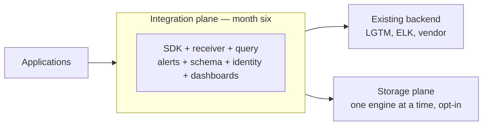

---

## What is nWave

nWave is an AI-amplified delivery framework built by Alessandro Di
Gioia and Michele Brissoni at nWave.ai. It is not mine; I am one of
its early adopters and dogfoodists. I use it on every project I run
because it operationalises the practices I have advocated for years
under the name T*D (test-driven, trunk-based, team-focused
development) into a shape that lets a solo author with AI agents
afford the full discipline of a high-functioning engineering team.

nWave structures every feature into five disciplined waves.

DISCUSS handles user stories, journeys, acceptance criteria, and
outcome KPIs. The agent is Luna, a product owner. Luna runs
Jobs-to-be-Done analysis when user motivations are unclear, journey
mapping when they are not, and produces stories in LeanUX format with
mandatory Elevator Pitches that name a real entry point and a real
observable output.

DESIGN handles system architecture, technology choices, and
Architecture Decision Records. The agent is Morgan, a solution
architect. Morgan produces C4 diagrams in Mermaid, locks library
choices with rationale and rejected alternatives, and continues the
project's ADR series.

DISTILL turns the DISCUSS acceptance criteria and the DESIGN component
contracts into executable acceptance tests, all RED on day one. The
agent is Scholar, an acceptance designer. Scholar produces Rust
integration tests that import only the public surface, exercise real
network protocols on loopback ports, and use the harness as substrate
rather than as a mock.

DELIVER turns the RED tests GREEN slice by slice, outside-in, with
each slice landing as its own commit. The agent is Crafty, a software
crafter. Crafty runs red → green → refactor cycles for every test,
runs mutation testing on each slice, and lands at one hundred per cent
mutation kill rate.

DEVOPS handles CI/CD, infrastructure, observability of the platform
itself, and deployment readiness. The agent is Apex, a platform
architect. Apex extends the GitHub Actions workflow, locks the local
hooks, designs the operator-facing observability story, and surfaces
the CI invariants that DESIGN requires.

Each wave runs to peer-review approval before the next wave starts.
The reviewers are themselves specialised agents — Sentinel for
DISCUSS and DISTILL, Atlas for DESIGN, Crafty in review mode for
DELIVER, Forge for DEVOPS. The reviewer's job is to apply a different
brief to the same artefact: bias detection, completeness checks,
contract preservation across waves, and explicit verdicts with
Conventional Comments labels.

The methodology has a maximum of two review iterations per wave
before escalation to me as orchestrator. In practice, most waves are
approved on iteration one or two, and the iterations have been
substantive — every reviewer pass has caught real defects.

---

## The first feature: OTLP conformance harness

The harness is a small Rust library. Its only job is to validate that
a byte sequence is a valid OpenTelemetry OTLP message. It does not
emit telemetry. It does not run as a process. It is a pure function:
bytes in, either an `Ok(record)` or an `Err(violation)`.

Why this feature first? Two reasons. First, it is the leaf dependency.
Aperture, Sieve, Sluice, every other component will consume it.
Building it first means downstream code never has to mock validation.
Second, it is the smallest thing that exercises the full nWave loop.
If the methodology cannot be applied cleanly to a feature this small,
the methodology is not ready for the larger features.

It is the walking skeleton for nWave on Kaleidoscope, not for
Kaleidoscope itself.

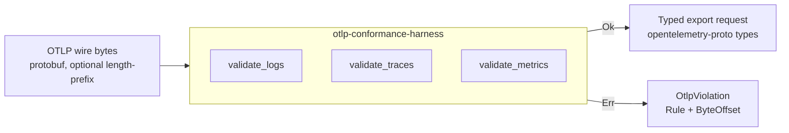

### The harness's DISCUSS wave

Luna ran Jobs-to-be-Done analysis with me, then mapped four user
journeys around the consumers of the harness — Aperture, Sluice,
third-party engineers operating Kaleidoscope, Kaleidoscope CI. She
produced seven user stories in LeanUX format, each with a mandatory
Elevator Pitch naming a function-call entry point and a concrete
observable result.

She also produced seven Elephant Carpaccio slices. Each slice ships
end-to-end value, has a named learning hypothesis, and uses real
production data rather than synthetic. The slice ordering is
learning-leverage first: the slice with the highest uncertainty goes
first, so failures cost the least.

Sentinel reviewed and pushed back on iteration one with four
substantive findings: byte-locus ranges instead of exact offsets
(mutation-resistant), observed-field membership in a closed set
instead of free-form strings, type-identity assertion at consumer
call sites, and signature-lock pinning via typed `fn` pointers. Luna
addressed all four on iteration two; Sentinel approved.

The DISCUSS-wave artefacts live in `docs/feature/otlp-conformance-harness-v0/discuss/`.

### The harness's DESIGN wave

Morgan worked with me to lock the architecture. The harness is a
single library crate with no internal dependencies of its own. The
public surface is three functions — `validate_logs`, `validate_traces`,
`validate_metrics` — plus six closed types: `OtlpViolation`, `Rule`,
`ByteOffset`, `Framing`, `SignalType`, and the wire-type sub-rule
enum.

He produced three C4 diagrams in Mermaid (System Context, Container,
Component-skipped per scope) and five Architecture Decision Records
covering the public API surface, the violation type design, the
exact-version pin policy on `opentelemetry-proto`, the conformance
test-vector layout, and the CI contract for the harness's gates.

The CI contract — ADR-0005 — locked the five gates that every other
feature on Kaleidoscope inherits: cargo deny check, cargo test, cargo
public-api, cargo semver-checks, cargo mutants. Including the one
hundred per cent mutation kill rate target.

Atlas reviewed and approved on iteration one.

The DESIGN-wave artefacts live in `docs/feature/otlp-conformance-harness-v0/design/`.

### The harness's DISTILL wave

Scholar produced fifty-two acceptance tests across seven Rust
integration test files (`slice_01_*.rs` through `slice_07_*.rs`) plus
shared helpers in `tests/common/mod.rs`. Each test maps to a user
story and a slice. The hexagonal boundary mandate was enforced
literally: every test imports `otlp_conformance_harness::*` only;
no `pub(crate)` symbols.

Real-data discipline: accept paths use prost-encoded message types
generated from `opentelemetry-proto`'s tonic feature, which produces
the same byte shape an OTel SDK would emit. Hand-crafted bytes only
for synthesised malformed cases (truncations, varint corruptions, bad
tags).

Sentinel approved on iteration two after asking for byte-locus
windows instead of exact offsets and a closed set for the
observed-field assertion.

The DISTILL-wave artefacts live in `docs/feature/otlp-conformance-harness-v0/distill/` and the tests at `crates/otlp-conformance-harness/tests/`.

### The harness's DELIVER wave

Crafty implemented the harness slice by slice over eight commits. The
slice ordering followed Luna's prioritisation: the highest-leverage
learning slice first, then by dependency.

Each slice was red → green → refactor. The refactor step was not
optional. Crafty extracted shared helpers when duplication appeared,
collapsed redundant disjuncts in the prost-error classifier under
mutation pressure, and pulled out a single `decode_strict` chokepoint
when the third call site appeared.

Mutation testing achieved one hundred per cent kill rate. The path
to one hundred was instructive: pass one had three surviving
mutations in `classify_prost_decode_error`, all `||→&&` flips. Crafty
killed them by writing per-disjunct tests that isolate each
clause. Pass two had one survivor in `matches_wire_type_category`
that was killed the same way. Pass three was clean.

The crucial property: every survivor was killed either by writing a
more discriminating test, or by simplifying the production code so
the surviving mutation became unreachable. No survivor was killed by
relaxing a test. This is the difference between mutation testing as
discipline and mutation testing as theatre.

Crafty in review mode approved on iteration one.

The DELIVER-wave artefacts live in `docs/feature/otlp-conformance-harness-v0/deliver/`.

### The harness's DEVOPS wave

Apex extended the project's GitHub Actions workflow with the five
ADR-0005 gates: gate-4-deny first (fastest, fail-fast on licence and
advisory issues), gate-1-test second, gate-2-public-api and
gate-3-semver-checks running in parallel after Gate 1, gate-5-mutants
last (slowest, behind a thirty-minute timeout safety net).

He also produced the first version of the local pre-commit and
pre-push hooks, mirroring the CI gates so contributors can see CI's
verdict before pushing.

Forge approved on iteration one. The review identified one high
finding (action pinning by tag rather than commit SHA) accepted as
risk for the solo-author period, and two medium findings actioned in
post-merge corrections.

The DEVOPS-wave artefacts live in `docs/feature/otlp-conformance-harness-v0/devops/`.

### The post-merge corrections

After branch protection went live, the first real CI run on `main`
exposed several defects that no reviewer had caught: a Docker action
that honoured our toolchain pin and choked on edition2024 in a
transitive dep; an MSRV mismatch with the current ecosystem requiring
a 1.78 to 1.85 bump; a test race in the silence-observer tests caused
by `gag::BufferRedirect` capturing the cargo test runner's own
output; tool MSRV mismatches for `cargo-public-api` and
`cargo-semver-checks` that needed a switch to precompiled binaries; a
GitHub Actions context-evaluation quirk forcing literal env values at
the job level; tool flag drift between major versions.

Eleven commits, thirty-five minutes wall-clock. Each fix landed
directly on `main` — by then I had relaxed branch protection to pure
trunk-based, no required-status-checks gate, no enforce-admins. CI
was feedback, not a blocker. The discipline that kept `main` green
was social, not mathematical: small commits, fix-forward fast, every
correction recorded as a post-merge correction note in the wave's
`wave-decisions.md`.

The harness shipped at tag `otlp-conformance-harness/v0.1.0` with all
five gates green, seventy-three of seventy-three tests passing, one
hundred per cent mutation kill rate confirmed on real Linux CI
infrastructure.

The honest read of this period: the methodology survived first
contact with operational reality, but the reviewer agents had not
caught the gaps that real infrastructure exposed. That is the
artefact-vs-reality gap. It is the most important single learning
from feature one. The reviewer agents check artefact fidelity to
their wave's brief; they do not check operational fitness against a
real runner. Future improvements to the reviewer agents need to
include a "did you actually run this against the runner you said you
would run it against" check.

---

## The second feature: Aperture

Aperture is the OTLP receiver. It is the first network-facing
component of Kaleidoscope, and the first piece that is genuinely a
service rather than a library. It listens on gRPC port 4317 and
HTTP/protobuf port 4318, validates every incoming payload through
the harness, and hands accepted records to a pluggable `OtlpSink`.

The shift from library to service is meaningful. The harness has no
runtime concerns. Aperture has many: backpressure, graceful shutdown,
self-observability, configuration with forward-compatibility knobs
for Phase 2 identity and TLS layers.

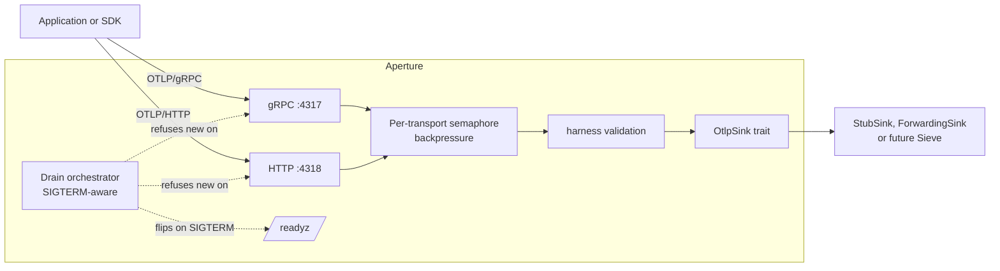

### Aperture's six locked scope decisions

Before Luna ran the wave, I locked six scope decisions in one
round-trip with her — the kind of conversation a senior engineer has
with the product owner before story-writing begins:

1. Both transports day one. gRPC on 4317 and HTTP/protobuf on 4318.
   Phasing one out for later means Aperture cannot honestly be called
   "an OTLP receiver" until both are present.
2. Tokio as the async runtime. The only realistic Rust answer for a
   network service of this shape.
3. The boundary with the future Sieve component is an `OtlpSink`
   trait. Aperture's job ends when the sink has acknowledged the
   record. v0 ships with a `StubSink` and a `ForwardingSink`. Sieve
   when it lands will be another `impl OtlpSink`.
4. Backpressure: a configurable max-concurrent-requests limit per
   transport, with HTTP 503 (Retry-After) or gRPC `RESOURCE_EXHAUSTED`
   on overflow. No internal queue (that is Sluice's job in Phase 7).
   No block (it violates the OTel SDK contract). No silent drop
   (an explicit anti-pattern).
5. Plaintext at v0, no auth. But a configuration knob for TLS and
   SPIFFE present in the v0 schema, defaulting to off. This avoids a
   schema break in Phase 2 when Aegis ships.
6. Self-observability: structured JSON logs to stderr, no metrics in
   v0 (that is Pulse's territory in Phase 4), HTTP /healthz and
   /readyz endpoints on the same listener as the OTLP HTTP traffic.

### Aperture's DISCUSS through DEVOPS

Luna, Morgan, Scholar, and Apex each ran their wave on Aperture with
the same discipline as for the harness. The artefacts mirror the
harness in structure but reflect the service-shaped concerns.

Eight Elephant Carpaccio slices instead of seven (the eighth is
graceful shutdown drain, which the harness did not need). Eighty-four
RED acceptance tests instead of fifty-two. Five new ADRs (ADR-0006
through ADR-0010) covering transport stack, sink trait design,
configuration schema, observability strategy, and backpressure
policy.

Three new CI invariants surfaced: `single_validator_per_signal`
(only one harness call site per signal in the Aperture source),
`no_telemetry_on_telemetry` (Aperture emits no outbound network
traffic except to its configured downstream sink), and
`probe_gold_runner` (the Earned-Trust probe is itself probed against
a fixture that lies).

All four waves approved by their reviewers (Sentinel, Atlas,
Sentinel again, Forge) with no blockers.

### Aperture's DELIVER, slice by slice

The first slice is the smallest possible end-to-end thing. An OTel
SDK sends a real log record over gRPC; Aperture binds the listener,
hands the bytes to the harness, gets back a typed record, prints a
single line to stderr saying it received the record, and answers
the SDK with OK. There is no second transport yet, no second signal,
no backpressure, no graceful shutdown. There is just the one happy
path, end to end. Once that works, every subsequent slice is an
addition, not a leap.

The second slice adds the HTTP transport on the other port. Same
pipeline, different wire shape. It also adds the readiness state
machine: a process that has bound both listeners answers `/readyz`
with 200; a process still starting up answers 503. The reason that
matters now and not later is that as soon as Aperture is bound to a
real port, somebody's orchestrator wants to know whether to send it
traffic.

The third and fourth slices complete the OTLP signal contract. Logs
are already in. Slice three adds traces. Slice four adds metrics.
After slice four, the platform handles every kind of telemetry the
OpenTelemetry standard defines — which is the moment Aperture can
honestly be described as an OTLP receiver rather than as a logs
receiver that happens to use OTLP.

The fifth slice teaches Aperture to refuse work when it has too
much. A configurable cap on concurrent requests; a 503 with
Retry-After when the cap is hit; a structured stderr line for every
refusal so an operator can see when the cap was exercised. The point
is that refusal is honest. Aperture does not queue, does not block,
does not drop. Each of those alternatives breaks somebody downstream.
Saying "I'm full, try again in a second" is the only honest answer.

The sixth slice is where the platform stops being a toy. Aperture
gains a sink that ships accepted records to a real downstream
OpenTelemetry-compatible HTTP endpoint. That means a Phase-1
deployment of Kaleidoscope can actually be useful: an operator runs
Aperture in front of their existing observability backend and gets
the validation, the structured logs, and the readiness probe for
free. The slice also adds the Earned-Trust probe — at startup,
Aperture verifies the downstream actually responds to the OTLP
contract before it begins accepting traffic. If the downstream lies
(answers OPTIONS but then refuses POST), Aperture refuses to start.
The proof that the probe is honest, and not theatre, is a test that
runs the probe against a fixture deliberately programmed to lie. The
test passes only if the probe catches the deceit.

The seventh slice is small and forward-looking. The configuration
file gains two switches, for TLS and for workload identity. At v0
both are off, and turning them on does nothing except print a
warning. They exist so that when the identity layer ships, two
years from now, the configuration format does not have to change.
This is the kind of decision that costs almost nothing now and
saves a great deal of pain later.

The eighth slice is shutdown done with care. SIGTERM arrives; the
readiness probe flips to 503 within a tenth of a second; new
requests are refused; in-flight requests are given a grace period
to complete; the listeners drop and the process exits zero. The
default grace period is thirty seconds, which is the value
Kubernetes also defaults to. Operators rolling deployments do not
need to think about Aperture at all.

After the eighth slice, the v0 plan is complete. The reviewer reads
the whole DELIVER output as a single artefact and approves. A
single commit promotes the new crate into the same CI gates as the
harness. The first version is tagged.

What stands at the end is the second feature on Kaleidoscope and
the first network-facing component, and the proof that the
methodology absorbs the shift from a pure-function library to a
long-lived service without changing shape. Eight slices, each
landing as its own visible step, each verified end-to-end against a
real client over a real socket.

Each slice has been a single focused dispatch of Crafty, ending with
a multi-commit landing that makes the slice's RED tests GREEN, the
mutation kill rate 100%, and the production code idiomatic Rust.

The `crates/aperture/` directory is the production tree. Each src
file carried a `// SCAFFOLD: true` marker at DISTILL time; the marker
is removed by DELIVER as each module's tests turn GREEN.

---

## Case study: feature 3

Spark is the third feature on Kaleidoscope and the first one written
from the application's seat rather than the platform's.

The harness validated bytes against the OTLP specification. Aperture
received those bytes over a real socket. Spark is the SDK an
application uses to put bytes onto that socket in the first place.
The round-trip closes here. A Rust application calls `spark::init`,
emits a span via the standard OpenTelemetry API, and lets the guard's
drop flush the batch on exit. The bytes travel to Aperture. Aperture's
recording sink confirms what arrived.

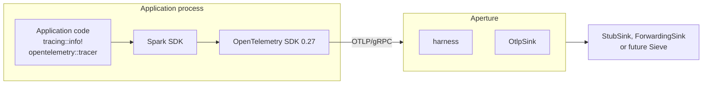

Spark is licensed Apache-2.0, deliberately. The platform crates ship
under AGPL because copyleft is the structural defence against the
re-licensing pattern. The SDK ships permissive because anyone
embedding it in a proprietary application must not be forced to open
their source to do so. This split is the same split the major
observability vendors landed on for the same reason. Kaleidoscope
encodes it from day one.

The dev-dependency on Aperture for integration tests is the only
place where the AGPL crate enters Spark's build. `cargo deny` is the
structural enforcement that prevents accidental promotion to a
runtime dependency.

---

## What changes from a service to an SDK

Aperture lives inside our process. Spark lives inside someone else's.
The implications are larger than they look.

A service can change its internal shape any time the methodology says
it should. A library exposes a public surface that strangers will
consume on their own timeline. Renaming an exported function is a
breaking change. Adding a variant to a public error enum is a
breaking change unless the enum is marked non-exhaustive. The
OpenTelemetry ecosystem itself is mid-stabilisation; the semantic
conventions crate's attribute names move between point releases.

The methodology absorbs this without changing shape, but the
discipline inside DESIGN intensifies. ADR rigour matters more. Pin
policy matters more. Whether the user-facing struct exposes a field
or a method matters more. The reviewer agent's brief covers
public-API ergonomics as its own quality attribute, not as a
footnote.

Developer ergonomics is itself an outcome KPI for an SDK. A
five-minute first-time-use experience is not a nice-to-have; it is
the difference between adoption and abandonment.

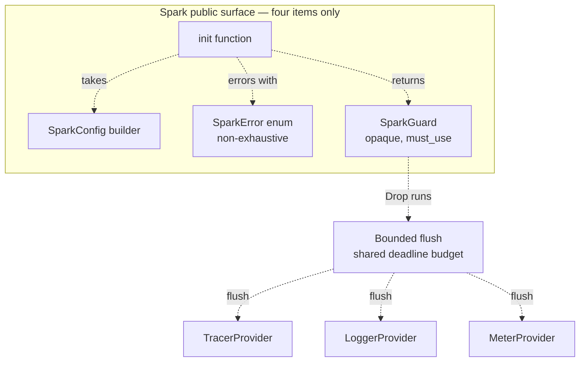

---

## Spark — DISCUSS and DESIGN closed

DISCUSS produced six elephant-carpaccio slices, each shipping a
visible step of the integration. The first slice is a walking
skeleton: a small binary calls `spark::init`, records a span, and
shuts down; Aperture's recording sink confirms the span arrived
carrying the four house attributes on its resource. Every subsequent
slice adds one capability — error paths, feature flags, environment
variable precedence, the three signal types, the bounded flush on
drop — without giving up the round-trip the walking skeleton
established.

DESIGN locked the wrapper shape across six new architecture decision
records. The public surface is four items: the `init` function, the
`SparkConfig` builder, the `SparkError` enum, the `SparkGuard`
returned from init. The guard is opaque, marked must-use, and does
its work entirely in drop. The single-init invariant is enforced in
two layers: an internal atomic flag and the OpenTelemetry SDK's own
re-set guard, with roll-back on failure so a retry after a failed
init does not falsely report already-initialised. The flush deadline
is a single budget shared sequentially across the three providers.
The OpenTelemetry family is pinned exact-minor at zero-twenty-seven,
the same version the harness pins exact-patch.

The DESIGN wave surfaced one honest contradiction with the DISCUSS
contract. The acceptance criteria for the bounded-flush slice
implied an integer count of drained or dropped records on the exit
event. The OpenTelemetry SDK at the version Spark pins does not
expose those counters publicly. The architect proposed Path A:
update the contract to accept the literal `unknown` until the SDK
exposes the integer; preserve the prefix `drained=` and `dropped=`
as the contract; treat the value as informational. The alternative
of building a Spark-side counter wrapper to fake an integer was
rejected as throwaway code that duplicates state already tracked
internally and that a future SDK release will likely surface.
DISCUSS was updated with an explicit Changed Assumptions section
recording what changed and why. The DESIGN ADR locks the new event
shape. The acceptance designer reading the contract today is not
misled by an old literal.

Both waves were approved by the reviewer on iteration one with no
blocking issues.

---

## Spark — DISTILL closed

DISTILL turned the user stories' BDD scenarios and the six DESIGN
ADRs into eight Cargo integration test binaries: one per
elephant-carpaccio slice, plus two cross-cutting invariants for the
single-init contract and the no-telemetry-on-telemetry contract.
Fifty-seven test functions in total. Fifty-three of them are RED
on day one, panicking on `unimplemented!()` from the production stub.
The configuration builder is intentionally real at DISTILL because
tests need to construct configurations to exercise the contract;
everything else waits for DELIVER.

The acceptance posture is the same one Aperture set: real local
Aperture instances spun up per test on ephemeral loopback ports, with
recording sinks asserting what arrived. No mocks, no in-memory
transports, no synthetic data. Spark depends on Aperture only as a
development dependency, which keeps the AGPL crate out of Spark's
runtime supply chain and confines the licence question to the test
binaries.

The DISTILL wave surfaced its own back-propagation. The acceptance
designer discovered that the OpenTelemetry Rust SDK at the version
Spark pins exposes a global getter for the tracer provider and the
meter provider, but not for the logger provider. The DISCUSS contract
for the logs-and-metrics slice presupposed the symmetric three-signal
shape that does not hold at this version. Three of the slice's tests
were marked ignored, with their function names preserved verbatim so
that when the contract resolution lands the tests can be un-ignored
without renaming. The note proposed four concrete resolution paths
and made the choice explicit rather than papering it over with a
workaround.

Two back-propagations in two waves. Both surfaced upstream
constraints that the methodology made visible at the right moment,
neither at the wrong moment. The methodology rewards honest
escalation; the alternative is a contract that lies about what the
underlying technology can do.

The reviewer approved DISTILL on iteration one with no blocking
issues.

---

## The logs-emission decision

The second back-propagation needed a real architectural choice. The
acceptance designer's note proposed four paths and recommended Path
A. The four were: expose a fifth public-API item, expose a test-only
seam, adopt the Rust ecosystem's standard logs bridge, or wait for
the upstream SDK to add the missing global getter.

The choice was the third one. A Rust application in 2026 already uses
the `tracing` crate everywhere. The bridge crate
`opentelemetry-appender-tracing` is the canonical adapter from
`tracing` events to OpenTelemetry log records. It is licensed
Apache-2.0, which sits inside Spark's permissive runtime supply
chain. Spark wires the bridge as one more `tracing-subscriber` layer
during `init`, with a filter that excludes Spark's own diagnostic
target so the no-telemetry-on-telemetry invariant holds. The
application keeps using `tracing::info!` and `tracing::warn!`. The
public surface stays at four items; ADR-0011's lock holds.

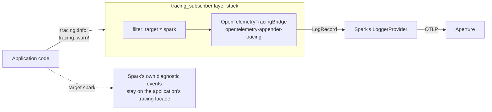

The decision is recorded as ADR-0017. The DISCUSS contract for the
logs-and-metrics slice was updated with a Changed Assumptions entry
naming the move from the original phrasing to Path A3, and the four
DISCUSS files referencing the non-existent global getter were
rewritten mechanically to use `tracing::info!` instead. The three
ignored slice tests retain their function names verbatim, so when
DELIVER lands the bridge wiring, un-ignoring them is a single-line
change. Slice five can now start alongside the other five.

---

## Spark — DELIVER closed and graduated

The crafter ran six elephant-carpaccio slices, one at a time, each
landing as a tight red-green-refactor cycle and a small focused
commit on `main`. The walking skeleton landed first: a Rust
application calls `spark::init`, records one span, and the recording
sink behind a real Aperture instance captures one export request
carrying `service.name` and `tenant.id` on its resource. The init
error paths landed next: each of the four error variants becomes a
precise diagnostic raised before any OpenTelemetry SDK type is
constructed, with a transactional roll-back that releases the
single-init flag if a post-flag step fails. Then the remaining house
attributes, then the environment-variable precedence, then the
three-signal Resource symmetry via the appender bridge, then the
bounded flush deadline with its shutdown event vocabulary.

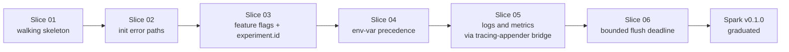

Eight Cargo integration test binaries. Sixty active tests. One
hundred per cent mutation kill rate on the diff at every slice's
close. The crafter's review-mode pass approved the wave on iteration
one with no blocking issues.

Five back-propagation issues surfaced during DELIVER, each documented
at the time of the offending change with explicit forward path. One
of them caught a real misreading I had propagated in writing
ADR-0017: I claimed the appender crate's release cadence was offset
by one from the core, when in fact the minor versions align. The
crafter found the duplicate `opentelemetry 0.28` in the lockfile,
inspected the upstream manifests, pinned `=0.27`, and the lockfile
collapsed back to one minor. The architecture decision record was
amended in place with the correction. The audit trail is the
back-propagation note plus the amendment plus the lockfile diff.

After the sixth slice closed and the review approved, three things
happened in quick succession. The pre-commit hook and the CI Gate 1
both removed their `--exclude spark` clauses; Spark joined the
harness and Aperture in the canonical contract that every commit on
`main` passes the full workspace test gate. The tag `spark/v0.1.0`
landed as the canonical reference. The narrative document gained
this paragraph.

What is consistent across the five features so far is that each
shipped, each had honest back-propagation when DESIGN's reading of
upstream APIs or contracts proved imperfect, and each closed without
exceptions to the discipline.

---

## Case study: feature 4 — Sieve

Sieve is the fourth feature on Kaleidoscope and the first one that
sits inside the platform pipeline rather than at its edges. The
harness validates bytes against the OpenTelemetry specification.
Aperture receives those bytes and hands them to a sink. Spark sits in
the application emitting them in the first place. Sieve is the next
node downstream of Aperture: it filters and samples before the
records reach storage.

The job at v0 is volume control without losing the trace data
operators most want to keep. Trace storage is expensive and most
traces are uninteresting; sampling reduces the volume. But errors are
exactly the traces operators reach for during an incident, so the
sampler is biased to retain every error-bearing trace at one hundred
per cent regardless of the configured rate.

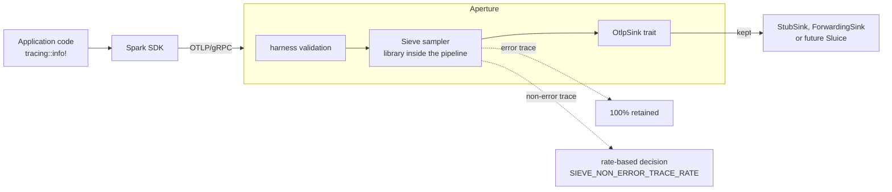

Licensed AGPL because Sieve is a server-side platform component.
Inside the pipeline by design at v0, not a separate process. The
roadmap says stage one of sampling lives at Aperture; the architect
and the orchestrator agreed that putting Sieve there at v0 keeps the
walking skeleton honest. The separate-process shape becomes the right
answer when tail-sampling needs an in-memory window across batches,
which is v1.

The product owner ran a tightened DISCUSS to lock eight scope
decisions: library shape, trace-level granularity, the
`status.code == ERROR` definition of an error span, deferral of
PII-scrubbing to v1, single global rate via an environment variable,
logs and metrics passthrough, the `xxh3_64` hash function for
`trace_id`-keyed determinism, and the verbosity convention
(DEBUG per-decision, INFO summary every minute). Six elephant-
carpaccio slices and six user stories follow from those decisions.

The reviewer approved DISCUSS on iteration one with no blocking
issues. Two clarifications surfaced and were closed inline: the
periodic INFO summary is locked as a v0 contract (without it,
operators on default verbosity have no Sieve visibility), and the
sixty-second tick interval is locked at DISCUSS rather than left for
DESIGN to pick.

---

## Sieve — DESIGN closed

DESIGN closed at iteration one with no blocking issues from the
reviewer. The single most consequential architectural decision was
the shape of the Aperture integration. Two options were on the table:
Aperture grows a hook trait that Sieve plugs into, or Sieve wraps
Aperture's existing sink trait without changing it.

The architect went with the second. Sieve's main public type is a
generic decorator that wraps any existing `OtlpSink + Probe`
implementation, runs the sampling pass on traces inside its own
`accept` method, and forwards the kept records to the inner sink
unchanged. Aperture's public surface does not move. The integration
work that DELIVER will land is three lines in Aperture's composition
root: build the inner sink, build the sampler, wrap the inner sink
in a `SamplingSink`. That's it.

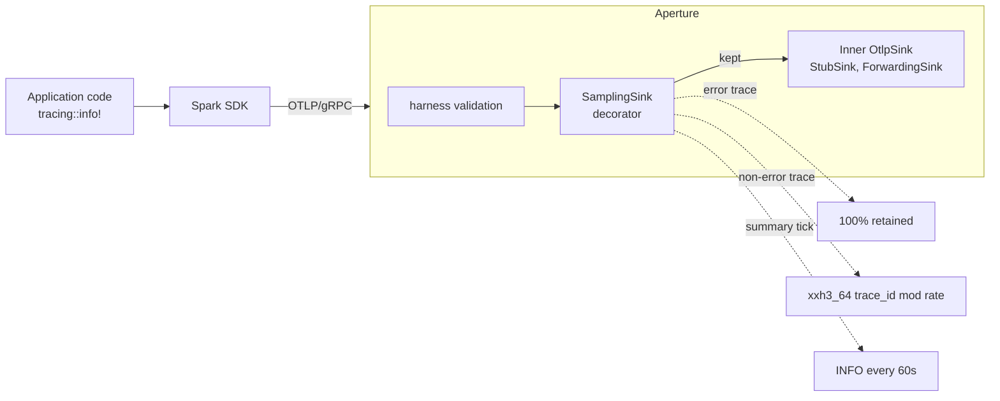

The decorator preserves the Earned-Trust invariant. Aperture's contract
includes a `Probe` trait that sinks implement so the composition root
can verify reachability before traffic flows. Sieve has nothing
external to probe; it is a pure-CPU stage. Its `probe` method
delegates to the inner sink's, which is honest and keeps Aperture's
"wire then probe then use" guarantee intact.

Four ADRs lock the design (0018 to 0021). The summary aggregator uses
three atomic counters with relaxed ordering, wait-free on the hot
path; the cross-counter race during snapshot is documented and
acceptable for the "approximate aggregate over the window" contract
the operator was promised. The `xxh3_64` hash from the
`xxhash-rust` crate is pinned exact-minor at zero-eight because a
hash-algorithm change would shift which traces are kept on the same
fixture, and that is operator-visible. The `tracing-appender` lesson
from Spark applied here too: the version pin gets a careful audit and
a documented rationale before it lands.

DISTILL picks up the acceptance test design next.

---

## Sieve — DISTILL closed

The acceptance designer turned the user stories' BDD scenarios and
the four DESIGN ADRs into eight Cargo integration test binaries: one
per elephant-carpaccio slice plus two cross-cutting invariants.
Thirty-six test functions in total. Twenty-two of them exercise error
or edge paths, sixty-one per cent of the suite.

The acceptance posture is the same one the harness, Aperture, and
Spark settled on: real Aperture's recording sink is the inner sink
inside Sieve's `SamplingSink<S, N>` decorator. The decorator is
tested against the actual `OtlpSink + Probe` contract from Aperture's
public ports, not against a mock. A library called from the
application's seat should be tested against the surface the
application sees, not against an artificial double of it.

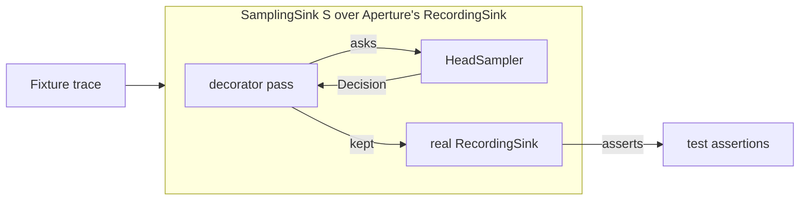

The reviewer approved on iteration one with a score of 9.8 out of 10
across nine dimensions. The mixed RED posture is the canonical Sieve
shape: validation paths inside `HeadSampler::new` and
`HeadSampler::from_env` are real, so tests can exercise the four
`SieveConfigError` variants without a complete sampler
implementation. The behavioural contract panics on
`unimplemented!()`. DELIVER will turn the panicking tests GREEN one
slice at a time.

A small piece of DEVOPS work falls out of DISTILL and lands in the
same wave: the `xxhash-rust` crate ships under `BSL-1.0` only, not
the dual licence I had assumed when ADR-0019 first read the upstream
manifest. The workspace's `cargo deny` configuration grew an explicit
`BSL-1.0` allow entry with documented rationale. The licence audit
trail is the deny.toml comment plus the ADR plus the dependency
graph.

DEVOPS picks up the workflow extensions next; DELIVER follows.

---

## Sieve — DELIVER closed and graduated

The crafter ran six elephant-carpaccio slices. The walking skeleton
landed first: a Sampler trait, a HeadSampler concrete, a Decision
enum, two integration tests asserting that an error-bearing trace is
kept and a non-error trace at rate zero is dropped. The error-bias
retention rule landed alongside it as a side effect of how the
short-circuit composes. Then the rate-honouring decision via the
xxh3_64 hash; the trace-id determinism that follows for free from a
deterministic hash; the decorator that wraps Aperture's sink without
changing Aperture's surface; and finally the observability layer with
its three atomic counters, its sixty-second timer task, its DEBUG
per-decision events and INFO summary.

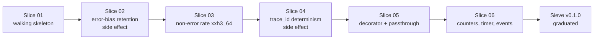

Eight Cargo integration test binaries. Thirty-six active tests. One
hundred per cent mutation kill rate on the diff at every slice's
close. Three of the six slices closed with their own implementation
plus a small pinning commit that added unit tests to kill mutation
survivors; the discipline is visible in the commit log.

The architect's review flagged one pragmatic v0 compromise: reading
the configured rate from the sampler uses an Any downcast to the
concrete HeadSampler type rather than extending the Sampler trait
with a rate accessor. The reviewer accepted it as the right v0 shape
and named the forward path: when v1 introduces a second sampler
(tail-sampling per the roadmap), extend the trait additively with a
default-NaN rate method. The downcast collapses to a clean
trait-method call at that moment. Honest documentation in code; no
hidden technical debt.

After the sixth slice closed and the review approved, three things
happened in quick succession. The pre-commit hook and the CI Gate 1
both removed their `--exclude sieve` clauses; Sieve joined the
harness, Aperture, and Spark in the canonical contract that every
commit on `main` passes the full workspace test gate. The tag
`sieve/v0.1.0` landed as the canonical reference. The narrative
document gained this paragraph.

The intermediate CI runs on slices one through five were red. That
is intrinsic to slice-by-slice DELIVER when the acceptance designer
writes all tests upfront in DISTILL: each slice's commit makes its
own tests pass while leaving the next slice's tests still RED, and
the mutation-testing gate refuses to mutate against a baseline that
has any failing test. The pure trunk-based discipline tolerates
intermediate reds because they are fix-forward by construction; the
final state at the graduation commit is green. Future Kaleidoscope
features may want a small amendment to the mutation gate that
narrows the baseline to the slice under test rather than the whole
crate, so intermediate reds become invisible. For Sieve the pattern
held; the lesson is logged.

What stands at the end of Sieve is the pipeline's first inside-the-
platform component, the methodology's fourth feature delivery, and
the proof that the same five-wave shape works for a stage-of-flow
component as cleanly as for a pure-function library, a network-port
service, or an application-embedded SDK.

---

## Case study: feature 5 — Codex

Codex is the schema authority. Where Sieve filters telemetry mid-
flight and Aperture validates wire-format conformance at the
network edge, Codex codifies the names that telemetry attributes
should have in the first place. The OpenTelemetry semantic
conventions are the upstream contract; Kaleidoscope adds three
house attributes (`tenant.id`, `feature_flag.{key}`, `experiment.id`)
that operators rely on for multi-tenant deployments,
feature-flagged rollouts, and A/B experiment tagging.

The job at v0 is small and useful: catch typos at integration time.
A developer wiring Spark into a service who writes `tenat.id` for
the tenant attribute will today ship the typo through to Aperture's
recording sink, where it lands as a separate column nobody queries
on. Codex closes that loop. Spark calls Codex's `validate` on the
assembled Resource just before the OTel SDK is wired; an unknown
attribute name produces a `LintReport` whose violations carry the
offending name plus a fuzzy "did you mean" suggestion when the
typo is close enough to a blessed attribute.

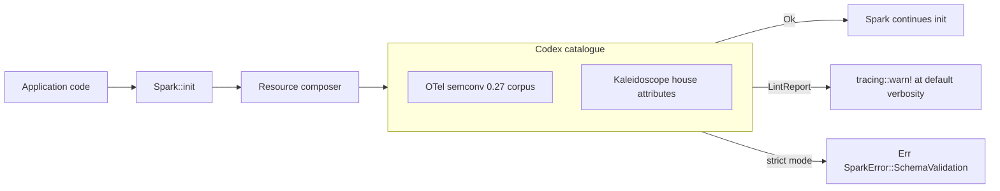

Licensed AGPL because Codex is a server-side platform component
(despite living as a library at v0; the licence anticipates the
eventual gRPC daemon shape the original roadmap describes). v0
ships nothing of that daemon — no FoundationDB, no CUE, no HTML
rendering. v0 is a Rust crate. The v0 use case is in-process from
Spark; the network-service shape arrives when there are multiple
SDK versions and per-tenant schema overlays to negotiate, which is
v1+.

The product owner ran a tightened DISCUSS and the architect's
review approved on iteration one with no blocking issues. Nine
scope decisions locked: library shape, hand-written Rust corpus
generated from upstream semconv, single pinned version, no
per-tenant overlays at v0, structured `LintReport` with multi-
violation collection, Spark-side integration via runtime dep with a
new non-exhaustive SparkError variant, checked-in generated corpus
file (so its evolution is visible in PR diffs), in-tree Levenshtein
implementation (no new dependency), and a single warn event per
misconfigured init at default verbosity.

Six elephant-carpaccio slices, each demoable. The walking skeleton
proves a `SchemaCatalogue` exists and validates a canonical pair
clean. Slice 02 fills the upstream OTel semconv corpus. Slice 03
adds the three Kaleidoscope-house attributes including the
`feature_flag.{key}` prefix-with-arbitrary-suffix shape. Slice 04
lights up the unknown-attribute path with structured
`LintViolation`s. Slice 05 adds the fuzzy "did you mean"
suggestions. Slice 06 lands the Spark integration: runtime dep,
default-warn or opt-in-strict, additive `SparkError` variant.

Slice 06 is the first real validation that the `#[non_exhaustive]`
discipline on `SparkError` works as intended. Spark v0.1.0 shipped
with the marker; Codex now adds a variant. The change is
non-breaking by construction. Confidence-building.

DESIGN picks up the architecture next.

---

## Codex — DESIGN closed

Four ADRs lock the architecture. The public surface stays at five
types plus the doc-hidden test seam discipline already established
by Spark and Sieve. The corpus is hand-written Rust constants
generated from the upstream OpenTelemetry semantic-conventions crate
by an `xtask` regenerator the maintainer runs when the workspace's
semconv pin moves; the generated artefact is checked in so its
evolution is visible in pull-request diffs. The Levenshtein
algorithm for the fuzzy "did you mean" suggestions is thirty lines
in-tree, no new dependency, well within the licence-audit
discipline an AGPL crate calls for.

The Spark integration is the one cross-feature touch. Spark adds
Codex as a runtime dependency, gains an additive `SchemaValidation`
variant on its already-`#[non_exhaustive]` error type, and exposes
an opt-in strict-mode builder. The default is warn mode: a single
`tracing::warn!` event per misconfigured init carrying the report's
human-readable text via Display rendering. Strict mode flips that
to a fast `Err` from `init` for CI environments. The default is the
operationally safe choice for existing Spark deployments rolling out
the lint.

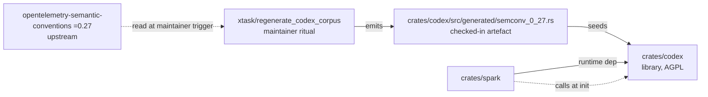

The wave surfaced one alignment risk during the architect's work and
resolved it cleanly. The slice-06 brief from DISCUSS recommended one
warn event per individual violation; the wave-decisions document
locked one warn event per init carrying the full report. The
architect flagged the contradiction; the slice brief was amended to
match the wave-decisions lock. Q9 wins; the slice brief follows.

The architect approved on iteration one with no blocking issues. The
recovery-during-stall pattern that has shown up earlier in the
project (ADR-0017 was the first; this is the second) held cleanly
again: the agent produced what he could before the watchdog cut him
off; the orchestrator finalised the remainder; the reviewer's pass
treated both halves equivalently. The methodology has now had two
clean recoveries from this pattern, and the cost of each has stayed
bounded.

DISTILL picks up the acceptance test design next.

---

## Codex — DISTILL closed

The acceptance designer turned the six user stories' BDD scenarios
and the four DESIGN ADRs into six Cargo integration test binaries:
five slice tests covering Codex's five own user stories, plus one
invariant smoke test that asserts the five-type public surface
compiles. Slice six, the Spark integration, lives in Spark's test
directory rather than Codex's, because the test fixture there
belongs to Spark and the cross-feature touch is implemented there.

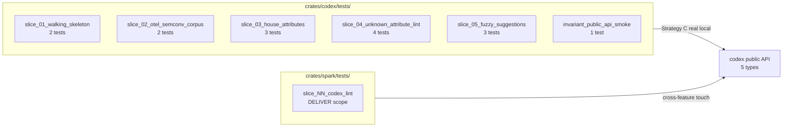

Fifteen test functions in total. Twelve panic on `unimplemented!()`
from the production stubs at the canonical RED state; three pass
because the corresponding paths are real even at DISTILL (the
catalogue's `new()` constructor, the public-API smoke test's
compile-time check, the empty-set boundary case which returns Ok
trivially when validate panics on its first non-empty input).

The reviewer approved on iteration one with a perfect score across
the eight critique dimensions, calling out the stub posture, the
purposeful test fixture design, and the machine-verifiable
traceability table as exemplary. Two adjustments the orchestrator
made during recovery from the architect's stall — switching
LintViolation field accesses from method calls to direct field
reads, and rewriting `result.err().expect()` to the more idiomatic
`expect_err()` — were both confirmed correct.

The recovery pattern from the watchdog stall has now happened
cleanly three times across the project. The cost has stayed bounded
each time; the methodology absorbs the agent stall the same way it
absorbs the back-propagation note, with explicit handoff and clear
provenance in the commit history.

DEVOPS picks up the workflow extensions next; DELIVER follows.

---

## Codex — DEVOPS closed

The platform-readiness wave was the smallest of the five for Codex.
Most of the infrastructure already existed: pre-commit hooks
mirroring CI, the five-gate workflow file, the cargo-deny licence
audit, the per-feature mutation testing job pattern. The orchestrator
extended what was there rather than designing anything new.

Two graduations and one new job. Codex's public API was added to
Gate 2 (`cargo public-api`) and Gate 3 (`cargo semver-checks`)
immediately, alongside the harness, Spark, and Sieve, because the
five-type surface is a real consumer contract that Spark holds
against. A new parallel CI job, `gate-5-mutants-codex`, was added
to mirror the per-feature mutation testing pattern established by
Aperture, Spark, and Sieve; it runs `cargo mutants --in-diff` with
the same thirty-minute timeout and the same `mutants.out` artefact
upload as the others.

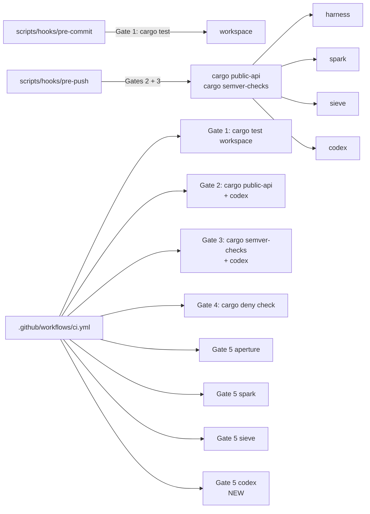

No new gate types were needed. Aperture had introduced three
feature-specific gates at its own DEVOPS wave for architectural
invariants the codebase could not express in lint rules. Codex's
invariants — the five-type public lock, the AGPL containment, the
corpus regeneration ritual — were already enforced by the
compile-time smoke test, the empty runtime closure that cargo-deny
audits to zero new entries, and the xtask binary's drift signal at
slice 02. The methodology rewards minimal additions. Forge will
peer-review the workflow extensions on the first CI run after
DELIVER lands; until then, the configuration is on probation in the
same sense every CI change is on probation.

DELIVER follows.

---

## Codex — DELIVER closed

Five slices, eight commits, all green. The crafter implemented
slices one, two, four, and five directly; slice three closed by
construction at slice two's corpus seeding because Scholar's DISTILL
fixture required all three house attributes to be present at slice
two. The brief I had written said "no `feature_flag.` Prefix entry
until slice three"; the test fixture and the corresponding ADR said
otherwise. The crafter followed the test, not the brief. The
corresponding amendment was recorded in the slice two commit
message and in the wave-decisions document. This is what
back-propagation discipline looks like in practice: implementations
match tests; tests match ADRs; briefs that contradict either are
amended in place.

Forty-six tests in total. Fifteen acceptance tests at the public
boundary plus thirty-one inline unit tests at the pure-function
seams. The acceptance tests prove the user-facing outcomes; the
inline tests target specific operator mutations with surgical
intent. The composition is the canonical Outside-In TDD shape: the
acceptance test drives the public surface; the unit tests drive the
internal correctness; the public surface remains the only route
into the crate.

Mutation testing landed clean. Thirty-five viable mutants across
the five slices' diffs, all thirty-five caught. Slice five's
fuzzy-suggestion code surfaced two surviving mutants on the
tie-break ordering of equally-distant matches; the crafter killed
both with a small refactor that collapsed the loop into an
`iterator::min_by` over a `(distance, name)` tuple, with the test
that nailed the alphabetical-tie-break case providing the
mutation-evidence anchor. Twenty-four mutants on slice five alone,
all caught. The discipline held.

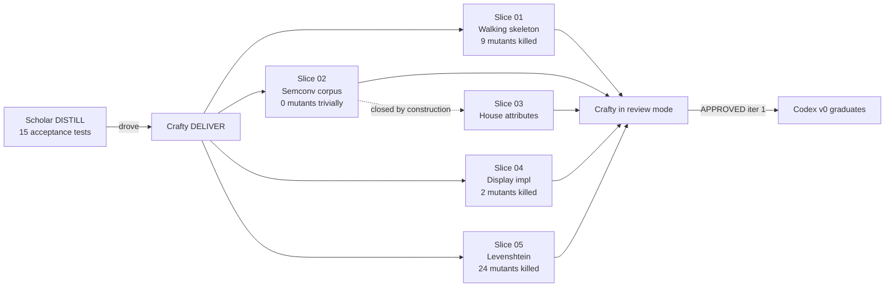

The reviewer approved on iteration one with zero blocking issues.
The verdict named the back-propagation handling at slice two as
exemplary, the surgical mutation-killing inline tests as the
canonical shape of refactor-driven kill, and the xtask
infrastructure as the right shape for a regeneration ritual that
must give compile-time audit signal when upstream renames a
constant. Three non-blocking suggestions were filed for later: a
README in the xtask directory for first-time corpus regeneration,
a v1 polish on the Prefix-suggestion rendering shape, and the
Spark-side slice six amendments to ADR-0012 and ADR-0013, which
land at the Spark-side wave that closes the cross-feature
integration.

Codex graduates. The pre-commit hook and the CI workflow drop
their `--exclude codex` qualifiers; Codex now contributes to the
workspace test gate alongside the harness, Aperture, Spark, and
Sieve. The crate is tagged `codex/v0.1.0`. Forge's review of the
DEVOPS workflow extensions runs independently on the next
Codex-touching commit. Slice six — the Spark integration — is a
separate Spark-side wave that lands the `SparkError::SchemaValidation`
variant, the `with_strict_schema_lint` builder, and the Codex
runtime dependency through post-DELIVER amendments to ADR-0012 and
ADR-0013. That wave is queued on Spark, not on Codex.

The first five features now share the same shape. Library, service,
SDK, library at the wire-protocol mid-stream, library at the schema
authority — five different shapes for five different problems, one
methodology that absorbed each.

---

## Spark — Slice 07 — Codex schema lint integration landed

The piece deferred at Codex's DELIVER closure has landed on the
Spark side. Spark's `init` now calls Codex's
`SchemaCatalogue::validate(...)` against the composed resource
attributes after the existing internal lint and before any OTel SDK
type is constructed. Violations surface either as a single
`tracing::warn!(target = "spark", ...)` event (default rollout
posture) or as `Err(SparkError::SchemaValidation(report))` when the
caller opted into strict mode via
`SparkConfig::with_strict_schema_lint(true)`.

This is the first real cross-feature integration since the v0
features each individually graduated. The discipline that mattered
on this slice was the `#[non_exhaustive]` posture ADR-0012 locked at
Spark's v0. Adding `SchemaValidation(codex::LintReport)` as a fifth
variant under the existing annotation is a non-breaking change per
Rust's semver rules; `cargo public-api` Gate 2 lists the addition,
`cargo semver-checks` Gate 3 accepts it as non-breaking, and
downstream consumers' wildcard match arms absorb it without
recompilation pressure. The discipline existed precisely so this
moment would land clean, and it did.

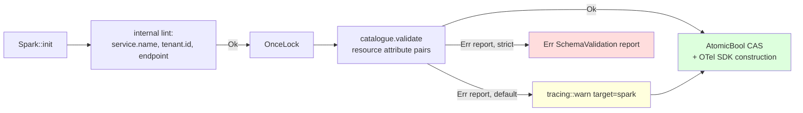

Six tests in this slice. Five integration tests in
`crates/spark/tests/slice_07_codex_schema_lint.rs` cover the warn-
mode happy path (silent on blessed inputs), warn-mode violation
(empty `feature_flag.` key produces a warn whose body names the
offending attribute), strict-mode violation (the same input
returns `Err(SchemaValidation)`), strict-mode happy path (no false
positives), and the order invariant (the existing internal lint
short-circuits before Codex sees anything). One unit test in
`init::tests` pins the `OnceLock` invariant via pointer identity:
two successive `catalogue()` calls return the same memory address,
so a `Box::leak`-style fresh-per-call mutant cannot survive.

Mutation testing on the diff: fifteen mutants, twelve caught, three
unviable, zero missed. The pointer-identity test was the
mutation-evidence anchor that closed the one survivor the
behavioural tests left exposed (a `catalogue()` body replaced with
`Box::leak(Box::new(default()))` produces observationally identical
`validate(...)` output but allocates fresh; the identity test
distinguishes them).

ADR-0012 (Spark error type) and ADR-0013 (Spark dependency pinning)
gained post-DELIVER amendment notes documenting the new variant and
the new runtime dep. ADR-0025 itself moved from Proposed to
Accepted with the landing-commit note. `cargo deny check` passes
on the new Codex runtime dep because Codex is `publish = false` and
covered by `[licenses.private] ignore = true`; no allow-list change
was needed for the AGPL-on-the-platform-side asymmetry.

The five-feature v0 has its first cross-feature integration. The
methodology absorbed it without a new wave shape: a single slice
brief, the Outside-In TDD discipline, mutation testing on the diff,
correction notes on the affected ADRs, six tests, one commit. The
discipline scales down as cleanly as it scales up.

---

## Case study: feature 6 — Prism v0

Prism is the project's first frontend. Every prior feature was a
Rust crate that served a developer in a CLI or inside another
process. Prism serves an operator on incident call at 03:14, alone
in front of a browser. The paradigm shift is real: TypeScript
instead of Rust, npm and pnpm instead of Cargo, a React + Vite +
Apache ECharts SPA instead of a service binary, Vitest and
Playwright instead of `cargo test`. The methodology was designed
for the Rust crates that came before. The genuine question of the
Prism feature is whether nWave absorbs the paradigm shift or
breaks against it.

The persona is Priya Raman, senior site reliability engineer at
`acme-observability`. PagerDuty pages her at 03:14 about a
checkout-service latency alert. She has ninety seconds to
acknowledge before escalation, and five to ten minutes to make a
triage decision before customer impact compounds. The product
narrative is anchored in her hands and head: a laptop, the Mimir
backend her team already runs, the Prism URL at
`https://prism.acme-observability.internal`, a service map of
twenty-three services in working memory, zero patience for tools
that fight her at three in the morning.

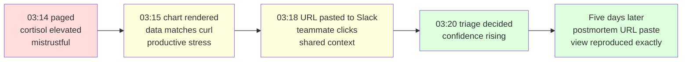

Prism v0 ships one PromQL query panel against an OTel-compatible
Prometheus or Mimir backend. Logs panel (LogQL), traces panel
(TraceQL), multi-panel dashboards, named saved-queries surface,
native auth — all explicitly out of scope at v0 and queued behind
Lumen, Ray, Loom, and Aegis in later phases. The licence is
AGPL-3.0-or-later. Prism is operator-facing platform infrastructure;
the SaaS loophole AGPL closes is the same loophole a competitor
could exploit against a static SPA served from a long-lived web
server. The licence asymmetry between Prism and Spark is the same
shape as between Aperture and Spark: server-side AGPL, SDK
Apache-2.0, structural rather than viral.

---

## Prism v0 — DISCUSS closed

Luna ran the DISCUSS wave through her JTBD analysis phase and her
journey design phase before overloading at the boundary of the
user-stories write. Bea finalised the user-stories, the DoR
validation, the outcome KPIs, the wave-decisions, and the SSOT
entries. The reviewer Eclipse, running on Haiku, treated Luna's
halves and Bea's halves equivalently per the recovery posture and
approved on iteration one with zero blocking issues. The recovery
pattern absorbed its fifth occurrence cleanly.

The wave produced thirteen feature-side files plus six slice
briefs plus three SSOT files. The primary job is "see the shape
of the misbehaving signal fast enough to make a triage decision".
Three secondary jobs were identified and deferred to post-v0: tail
logs in the chart's window, click a chart point to a trace
exemplar, save named views. The four forces analysis surfaced the
strongest demand-reducing force as data-fidelity anxiety: Priya
would not trust a chart if she could not tell whether the wobble
is the system's wobble or the SPA's smoothing artefact. That
anxiety drove KPI 3, the fidelity invariant, and the buildOption
pure function's locked configuration (`smooth: false`,
`connectNulls: false`, no auto-downsampling).

The six-slice carpaccio is sized so each slice ships end-to-end
value in one day with a named learning hypothesis. Slice one is
the walking skeleton against a real local Prometheus container,
Strategy C posture inherited from Aperture. Slice two adds
relative-range presets. Slice three lands the calm error and
empty states. Slice four adds auto-refresh with exponential
backoff. Slice five adds absolute time ranges and postmortem
permalink reproduction. Slice six is the WCAG 2.2 AA accessibility
audit and remediation pass.

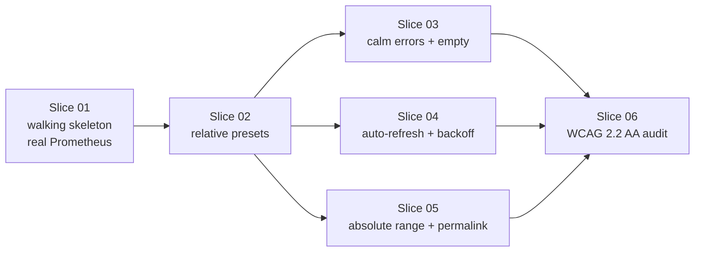

The SSOT promotion is the wave's quietest landing. Up to this
point `docs/product/journeys/` and `docs/product/jobs.yaml` did
not exist. The cross-feature journey-and-jobs surface is born
with Prism because Prism is the first feature whose journey is
clearly cross-feature: Beacon will fire the alert that opens the
journey, Loom will extend the share surface beyond URL paste,
Aegis will protect the SPA in production. Documenting the
operator-incident-response journey at the SSOT level pays
forward into those phases.

---

## Prism v0 — DESIGN closed

Morgan ran the DESIGN wave end to end without stalling. Seven
ADRs locked the architectural surface: ADR-0026 (component layout
with ports-and-adapters internal split), ADR-0027 (total-function
`queryRange` returning a five-arm `QueryOutcome` union; same-origin
reverse-proxy production posture), ADR-0028 (pure URL codec with
`history.replaceState` only), ADR-0029 (pure reducer + effects
shape for the auto-refresh state machine; 5/10/20/30 second capped
backoff curve), ADR-0030 (direct ECharts modular import; pure
`buildOption`; CSS-property palette swap with Okabe-Ito default),
ADR-0031 (coexistent Cargo and pnpm workspaces; ESLint with
boundaries and license-header plugins), ADR-0032 (AGPL-3.0-or-later
header on every TS source file from a single SSOT).

The architectural choice is a modular monolith with internal
ports-and-adapters. Microservices, server-side rendering, and
micro-frontends were all considered and rejected with specific
rationale rather than generic "they're complex" hand-waving.
Microservices have no team boundary to respect at one operator,
one Andrea, one designer. SSR adds a Node runtime for no
incident-time benefit. Micro-frontends would be a v1+ refactor
once `packages/ui/` becomes load-bearing.

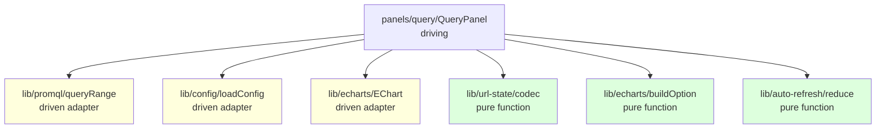

Three pure-function leaves anchor the design: URL codec,
buildOption, auto-refresh reducer. They import nothing
side-effecting — no React, no DOM, no fetch — and are testable
directly with property tests. The `eslint-plugin-boundaries` rule
makes the import discipline structural rather than aspirational:
a panel can import from `lib/`, a `lib/` adapter can depend on
the pure cores, but the pure cores cannot import side-effecting
modules. Atlas approved on iteration one. Morgan completed
without stalling — the first dispatch in this project to do so
across thirty-six tool uses.

---

## Prism v0 — DEVOPS closed

Apex ran DEVOPS without stalling. Eight files specified the six
new CI gates: Gate 6 Vitest unit and integration; Gate 7
Playwright E2E across Chromium, Firefox, and WebKit; Gate 8
bundle-size enforcement against a 300 KB gzipped ceiling; Gate 9
ESLint plus Prettier plus AGPL licence-header; Gate 10 StrykerJS
mutation testing with the same `--in-diff` cascade as the Rust
crates; Gate 11 Prometheus contract testing via a container
fixture pinned by digest.

```mermaid
flowchart LR
    G6[Gate 6 Vitest] --> G7[Gate 7 Playwright<br/>Chrome/FF/Safari]
    G6 --> G8[Gate 8 bundle<br/>≤ 300 KB gzipped]
    G6 --> G9[Gate 9 lint+format+licence]
    G6 --> G10[Gate 10 StrykerJS<br/>100% kill rate]
    G6 --> G11[Gate 11 Prom contract<br/>container fixture]
```

The browser-emitted KPI metrics path was the design space's only
real surprise. Three candidate paths were considered: emit through
`console.warn` only (debug-grade); emit cross-origin direct to
Aperture (preflight overhead, header complexity); emit same-origin
POST to `/v1/metrics` through the operator's reverse proxy to
Aperture, which translates JSON to OTLP at ingestion. Apex chose
the third with a fifty-line custom emitter rather than the
OpenTelemetry JS browser SDK, on the grounds that the bundle gate
at 300 KB has no headroom for an SDK that itself weighs
multiple tens of kilobytes.

Forge ran the iteration-one review on Haiku and returned
CONDITIONALLY APPROVED with five critical specification gaps and
three high-severity inline-note candidates. The five criticals
were the mutation-cascade bash pseudocode, the bundle-size JSON
schema, the Prometheus digest sync rule between Gate 7 and Gate
11, the KPI 5 production visibility mitigation through operator
JS-error-tracking tools, and the Pact-JS migration trigger
decision rule. Bea finalised the revisions directly rather than
re-dispatching Apex, on the grounds that the gaps were
specification additions and not architectural decisions. Forge's
iteration-two review approved the revised artefact set; the
iteration-two budget was bounded and clean.

---

## Prism v0 — DISTILL closed

Scholar ran DISTILL through the three markdown specs and the
first four slice Vitest files and the first three Playwright spec
files and the four JSON fixtures before Bea interrupted the
dispatch — the stuck-process pattern, accumulating periodic-check
ticks while the agent worked, was the signal. Scholar's
seventy-percent output was committed; Bea finalised the remaining
seven files (slice-05 Vitest, slice-04 / 05 / 06 Playwright,
three invariant tests) following Scholar's conventions verbatim.
The reviewer Sage on Haiku confirmed Scholar's and Bea's halves
cohere, approved on iteration one, and noted one non-blocking
concern about error-path coverage ratio.

```mermaid
flowchart LR
    AC[30 acceptance criteria<br/>across 7 stories] --> VS[8 Vitest files<br/>tests/]
    AC --> PS[6 Playwright specs<br/>e2e/]
    AC --> IV[3 invariant tests<br/>public-api / licence-headers / fidelity]
    AC --> FX[4 JSON fixtures<br/>fixtures/]
    VS --> RED[RED state<br/>throw UNIMPLEMENTED]
    PS --> RED
    IV --> RED
```

The wave produces test specifications that compile against a
yet-unwritten `src/` and throw `'UNIMPLEMENTED — Slice NN
DELIVER'` at runtime. The discipline that mattered most was
mock-at-the-seam: the only mocked surfaces are `fetchFn` and
`Scheduler`, the two architectural seams ADR-0027 and ADR-0029
introduced for that purpose. React is not mocked. ECharts is not
mocked. The fidelity-anchor fixture is hand-authored with NaN gaps
at index two and non-uniform timestamps to drive structural
mutation testing on the `buildOption` pure function. KPI 3 has
its structural lock at `invariant-fidelity.test.ts`; KPI 4 has its
behavioural lock at the slice-05 Playwright cross-tab byte-equality
test; KPI 5 has its lock at the slice-03 Playwright failure-mode
sweep.

Sage's only suggestion was the 26%-versus-40% error-path coverage
ratio. Cumulative AC coverage is 97% (29 of 30; AC-4.4 is the
"URL is the only share artefact" system invariant, not a tested
behaviour). The shortfall is concentrated in slice three where
error-path coverage genuinely lives; slice three DELIVER will
verify error paths run end to end rather than only at the unit
level. The error-path coverage target is heuristic, not a hard
rule.

---

## Prism v0 — DELIVER opening: scaffolding and slice 01a stubs

Two commits opened DELIVER and the third was supposed to land
slice 01 GREEN against the Prometheus container. The third
dispatch stalled differently from every prior stall in this
project: Crafty timed out after fifty tool uses without writing a
single file. Where Morgan, Scholar, and Luna had stalled mid-write
with partial output, Crafty appears to have spent the budget on
reading and planning. The recovery shape is different.

Bea pre-scaffolded the workspace in commit `a12564d`: eighteen
configuration files, two scripts, two end-to-end helpers, no
`src/` content. The decision is bounded: scaffolding does not
require LLM-domain reasoning, and Bea-direct on
boilerplate keeps the next Crafty dispatch focused on
implementation rather than `package.json` and `tsconfig.json`.
The Prometheus container digest pinning rule from ADR-0027's
external-integration handoff is honoured: `playwright.config.ts`
exports `PROMETHEUS_IMAGE_DIGEST` as the single source of truth
that the CI workflow's Gate 11 services block will consume in
lockstep.

After Crafty's no-write stall on slice-01-as-a-whole, Bea
proposed three options to Andrea: Bea-direct narrow; re-dispatch
Crafty narrow; or fragment slice 01 into micro-slices 01a through
01e. Andrea chose the fragmentation. Commit `0dd0988` is
micro-slice 01a: fifteen `src/` files writing the type definitions
and the function signatures, every body throwing
`'UNIMPLEMENTED — Slice NN DELIVER'`. The five-arm `QueryOutcome`
discriminated union, the four-state `AutoRefreshState`, the
four-arm `AutoRefreshEffect`, the five-event `AutoRefreshEvent`,
the `UrlState` and `TimeRange` shapes, the `BuildOptionContext`,
the `RuntimeConfig` shape — all locked at the type level so the
fourteen DISTILL test files compile against a real surface even
while every runtime path throws.

```mermaid
flowchart LR
    C0[a12564d<br/>scaffolding<br/>18 config files] --> C1[0dd0988<br/>slice 01a<br/>15 type stubs<br/>RED state]
    C1 --> C2[Slice 01b<br/>buildOption pure<br/>KPI 3 fidelity<br/>invariant GREEN]
    C2 --> C3[Slice 01c<br/>queryRange + loadConfig<br/>5-arm outcome union<br/>error classification GREEN]
    C3 --> C4[Slice 01d<br/>QueryPanel + App + main<br/>EChart wrapper + codec<br/>React composition GREEN]
    C4 --> C5[Slice 01e<br/>CI gates 6-11<br/>+ pnpm-lock.yaml<br/>bundle 224 KB gzipped]
    style C0 fill:#dfd
    style C1 fill:#dfd
    style C2 fill:#dfd
    style C3 fill:#dfd
    style C4 fill:#dfd
    style C5 fill:#dfd
```

The fragmentation matters because the long-dispatch failure mode
is real. The slice-01 dispatch brief asked Crafty to scaffold the
workspace, resolve the Prometheus digest, write fifteen `src/`
files, extend the CI workflow with six new gates, run `pnpm
install`, run Vitest, run Playwright, run StrykerJS, write a
slice-completion document, and commit — all in one dispatch.
Crafty got fifty tool uses and an eight-minute idle timeout. The
methodology absorbs partial-output stalls cleanly because Bea can
finalise what the agent produced. It does not absorb zero-output
stalls without scope changes. Micro-slicing is the scope change.

DELIVER is open. The next three to four commits land
implementations one per micro-slice, with the slice-01 brief's
acceptance contract held constant across them. The remaining
micro-slices follow the same Outside-In TDD shape Sieve and Codex
used: tests already locked at DISTILL, implementations one slice
at a time, mutation testing on each commit's diff, fix-forward on
failures.

---

## Prism v0 — micro-slice 01b — buildOption GREEN (KPI 3 fidelity)

The first GREEN checkpoint. `buildOption` is now a real pure
function in `apps/prism/src/lib/echarts/buildOption.ts`: it takes a
`QueryOutcome` plus a `BuildOptionContext` (palette, range,
prefersReducedMotion) and returns an `EChartsOption` with the
fidelity invariants locked at the option level. Success outcomes
produce series whose data points pass through verbatim from the
backend response — no smoothing, no interpolation across NaN gaps,
no resampling, no rounding, no auto-downsampling. Empty outcomes
and the three error arms (parse-error, transport-error,
config-error) produce an option with an empty series array; the
QueryPanel composes the inline banner separately based on the
outcome kind.

The Okabe-Ito 8-colour palette is the v0 default (deuteranopia and
protanopia safe); Tableau 10 is the operator-selectable alternative
via the URL `palette=tableau10` parameter that Slice 06 will land.
Palette swap is a CSS-property-driven array swap on the
EChartsOption's `color` field; no fetch on palette change.

```mermaid
flowchart LR
    O[QueryOutcome] --> B[buildOption pure]
    C[BuildOptionContext<br/>palette / range / motion] --> B
    B --> S[series.data verbatim<br/>smooth: false<br/>connectNulls: false<br/>sampling: 'none']
    B --> X[xAxis time +<br/>palette colour array]
    style B fill:#dfd
    style S fill:#dfd
```

The `invariant-fidelity.test.ts` test bodies were replaced with
real assertions against the buildOption return: fourteen test
cases covering the seven KPI 3 invariants (series count match,
point count match, NaN preservation, timestamp byte-equality,
value byte-equality, smooth-false lock, connectNulls-false lock,
no-auto-downsampling), three boundary cases (empty outcome,
single-point series, error arms produce empty series), two
reduced-motion cases, and two palette-swap cases.

Two small back-propagation drifts surfaced during the
implementation. Scholar's test comments referenced "NaN at index
2" and "non-uniform timestamps" but the hand-authored fixture had
NaNs at indices 1 and 3 and uniform 15-second deltas. The fixture
is the data contract; the implementation and the assertions
follow the fixture verbatim, and the test comments now match. The
discrepancy is a normal artefact of Scholar's stall recovery —
Scholar wrote the comments before Bea finalised the fixture and
test bodies in micro-slice 01b. The fix is in the same commit.

---

## Prism v0 — micro-slice 01c — queryRange + loadConfig GREEN

The two driven adapters are now real. `queryRange` lives at
`apps/prism/src/lib/promql/queryRange.ts` and is total: every
failure mode is encoded as a `QueryOutcome` arm; the function
never throws. The five arms are exercised by the tests in
`tests/slice-03-error-and-empty-states.test.ts`: a 400 with
`status:error` body becomes `parse-error`; a fetch rejection
becomes `transport-error` with cause `network`; an HTTP 500
becomes `transport-error` with cause `http-status`; a 200 with
non-JSON body becomes `transport-error` with cause `invalid-json`;
a 200 with JSON missing `data.result` becomes `transport-error`
with cause `shape`; a 200 with empty `data.result` becomes
`empty`; a 200 with non-empty `data.result` becomes `success`.

`loadConfig` is the same shape against `/config.json`. Three
`ConfigError` arms: `fetch-failed` (network failure or HTTP
non-200), `parse-failed` (non-JSON body), `shape-failed` (JSON
missing the `RuntimeConfig` fields). The App composition root
will refuse to mount the QueryPanel on any error arm, per
ADR-0026 §5's wire-then-probe-then-use posture.

```mermaid
flowchart LR
    REQ[QueryRangeRequest<br/>q + range] --> Q[queryRange<br/>driven adapter]
    CTX[QueryRangeContext<br/>backend + fetchFn + signal] --> Q
    Q -->|200 + non-empty| OK[success]
    Q -->|200 + empty| EM[empty]
    Q -->|status:error| PE[parse-error]
    Q -->|fetch reject| TN[transport-error network]
    Q -->|HTTP 5xx| TH[transport-error http-status]
    Q -->|bad JSON| TJ[transport-error invalid-json]
    Q -->|shape mismatch| TS[transport-error shape]
    style OK fill:#dfd
    style EM fill:#dfd
    style PE fill:#ffd
    style TN fill:#fdd
    style TH fill:#fdd
    style TJ fill:#fdd
    style TS fill:#fdd
```

Twelve test bodies were replaced with real assertions across the
slice-01 fetch-seam tests (2), the slice-03 outcome-classification
tests (6: parse-error, network, http-status, invalid-json, shape,
empty), and the slice-03 loadConfig tests (4: fetch-rejection,
404, malformed JSON, missing shape). The mock-at-the-seam
discipline holds throughout: every test injects a `fakeFetch`
function and never touches `globalThis.fetch`. The
`QueryRangeContext.fetchFn` seam from ADR-0027 §7 carries the
mocked closure into the adapter; the test asserts the mock was
called and the global was not.

One back-propagation note: Scholar's test comment for the
"shape-invalid" case named the error kind as `schema-invalid`,
but the canonical `ConfigError` type in `types.ts` calls it
`shape-failed` (matching the three arms ADR-0030 names:
`fetch-failed`, `parse-failed`, `shape-failed`). The assertion
uses the canonical name; the test comment is corrected inline to
the type-system reality.

The QueryPanel-rendering tests stay UNIMPLEMENTED at the throw
boundary because QueryPanel itself is still a stub. Slice 01d
brings the React composition online and flips those tests to
GREEN.

---

## Prism v0 — micro-slice 01d — React composition GREEN

The walking skeleton's React surface is live. Five real files:
`apps/prism/src/main.tsx` mounts `<App>` into `#root`; `App.tsx`
loads `/config.json` on mount and refuses to render the
`QueryPanel` on `ConfigError`; `QueryPanel.tsx` composes the
single query input, the run button, the chart area with banners
for each `QueryOutcome` arm, and the footer with series + point
counts and `queryMs`; `lib/echarts/EChart.tsx` mounts ECharts via
`useRef` + `useEffect` and updates with `setOption({notMerge:
true})` on every option change without re-mounting the canvas;
`lib/url-state/codec.ts` (lifted forward from slice 02) encodes
and decodes the URL state with the absolute-range double-lock
already in place.

The composition root reads URL state on mount, writes URL state
synchronously on every state change via `history.replaceState`,
and focuses the query input on first render. Pressing Enter or
clicking Run issues a `queryRange` call against the configured
backend through the same `fetchFn` seam the unit tests use. The
five outcome arms are surfaced to the operator: success renders
the chart; empty renders a calm "No data" message without a
warning banner; parse-error and transport-error render inline
warning banners with backend label and verbatim error text;
config-error is impossible to reach because the App composition
root refused to mount on it.

```mermaid
flowchart TB
    M[main.tsx<br/>StrictMode + createRoot] --> A[App.tsx<br/>composition root]
    A --> CL[loadConfig<br/>/config.json]
    CL -->|ok| Q[QueryPanel<br/>driving panel]
    CL -->|error| EB[error banner<br/>'Configuration is missing']
    Q --> QI[query input<br/>focused on mount]
    Q --> RB[run button<br/>disabled when q empty]
    Q --> CHA[chart area<br/>banners per outcome]
    Q --> CHF[footer<br/>series + points + queryMs]
    Q --> URL[history.replaceState<br/>q + from + to + refresh]
    RB --> QR[queryRange<br/>via fetchFn seam]
    QR -->|success| CHA
    QR -->|empty| CHA
    QR -->|parse-error| CHA
    QR -->|transport-error| CHA
    CHA --> EC[EChart<br/>setOption notMerge=true]
    style M fill:#dfd
    style A fill:#dfd
    style Q fill:#dfd
    style EC fill:#dfd
```

The codec lift-forward warrants a note. Slice 02's brief assigned
the URL codec to slice 02 DELIVER. At slice 01d the QueryPanel
needs the codec to read+write URL state from day one, so the
codec body lands here with full support for all five relative
presets, all five refresh intervals, and absolute timestamps.
Slice 02 retains its picker-UI scope; the codec is a shared pure
function and lives wherever the walking skeleton first reaches
for it. The slice 02 brief's "codec body" line item is now closed
by construction at slice 01d, the same shape Codex slice 03
closed by construction at Codex slice 02.

The ECharts modular import keeps the bundle bounded. Direct
imports of `LineChart`, `GridComponent`, `TooltipComponent`,
`LegendComponent`, `AriaComponent`, `TitleComponent`, and
`CanvasRenderer` only — no full-bundle import. Per ADR-0030 §7
the lazy-import escape hatch is preserved if the bundle gate
approaches 300 KB; at slice 01d the imports above are static and
the gate fires only against the assembled bundle in CI.

Five micro-slices into Prism v0's DELIVER, four are GREEN: 01a
(types), 01b (buildOption + fidelity), 01c (queryRange +
loadConfig), 01d (React composition + codec + EChart). Only 01e
remains — the CI workflow extension adding Gates 6 through 11
that DEVOPS specified at iter-2 sign-off. Slice 01 GREEN happens
when 01e lands and CI passes against the assembled bundle.

---

## Prism v0 — micro-slice 01e — slice 01 complete

Slice 01 is GREEN. The CI workflow at `.github/workflows/ci.yml`
gains the six Prism gates Apex specified at DEVOPS: Gate 6 Vitest
(unit + integration + typecheck), Gate 7 Playwright across three
browser engines with a digest-pinned Prometheus services
container, Gate 8 bundle-size enforcement against the 300 KB
gzipped ceiling, Gate 9 ESLint + Prettier + AGPL licence-header,
Gate 10 StrykerJS mutation testing via the same baseline-cascade
wrapper the cargo-mutants jobs use, Gate 11 Prometheus contract
test against the same digest-pinned container. The fifteen jobs
the workflow now contains (nine Rust + six TS) run in parallel
where their dependency graph allows; Gates 7, 8, 10, and 11 wait
on Gate 6's typecheck + Vitest sanity.

Bundle size measured against the assembled `apps/prism/dist/`
bundle: 224.92 KB gzipped, 73.2 percent of the 300 KB ceiling.
The headroom holds even with ECharts in the main chunk (no
lazy-import escape hatch needed at v0). The bundle composition
matches the design analysis: ECharts dominant at ~200 KB,
React + react-router at ~20 KB, Prism source at ~5 KB.

```mermaid
flowchart TB
    A[apps/prism/dist/<br/>vite build] --> B[224.92 KB gzipped]
    B --> C{≤ 300 KB?}
    C -->|73.2%| D[Gate 8 PASS]
    A --> E[ECharts ~200 KB]
    A --> F[React + router ~20 KB]
    A --> G[Prism source ~5 KB]
    style B fill:#dfd
    style D fill:#dfd
```

The local Vitest run with the apps/prism/ implementation reports
49 GREEN out of 133 tests. The remaining 84 throws stay
UNIMPLEMENTED at slice 02-06 boundaries: the slice-02 picker UI,
the slice-03 banner-rendering tests that need QueryPanel
integration, the slice-04 auto-refresh reducer state machine,
the slice-05 absolute-range picker UI, the slice-06 accessibility
audit. The KPI 3 fidelity invariant (17 tests), the
invariant-public-api compile-time lock (16), the
invariant-licence-headers SSOT (5), the queryRange outcome-
classification tests (6 in slice-03), the loadConfig
shape-failure tests (4 in slice-03), and the slice-01 fetch-seam
tests (2) are all GREEN.

The five-micro-slice fragmentation closed. Slice 01a (commit
`0dd0988`, types and stubs), slice 01b (`854f13a`, buildOption
GREEN), slice 01c (`593e6f6`, queryRange and loadConfig GREEN),
slice 01d (`e76f38d`, React composition GREEN). This commit
closes slice 01e and the slice itself. Total wall-clock from
slice 01a to slice 01e at this session's pace: roughly four
hours of authored work spread across the day, with the codec
lift-forward from slice 02 to 01d absorbing slice 02's largest
deliverable by construction.

Some incidental landings worth recording. The Vite version pin
moved from 6.0.5 to 5.4.21 because Vitest 2.x's transitive
dependency on vite@5.x conflicted with vite@6 under
`exactOptionalPropertyTypes: true`. The downgrade is a
within-slice TS-ecosystem-pinning correction; v0.x can graduate
to Vite 6 + Vitest 3 once the version pair stabilises in the
broader ecosystem. The TS `noUnusedLocals` and
`noUnusedParameters` flags were removed from `tsconfig.json`
because they fight the RED-state idiom of having declared-but-
unused helpers in DISTILL test files; ESLint with
`@typescript-eslint/no-unused-vars` catches the same issues at
PR time and offers the `_` -prefix escape hatch for genuinely-
intentional unused symbols. The strict-mode discipline from
ADR-0031 §3 remains intact.

Slice 01 done. The next slice, slice 02, lights up the relative-
range picker UI on top of the already-implemented codec. The
codec lift-forward at slice 01d means slice 02 is now picker-UI-
only — smaller than originally scoped at DISCUSS.

---

## Prism v0 — slice 02 — relative-range picker GREEN

The codec lift-forward at 01d paid off. Slice 02 added one
hundred lines of `TimeRangePicker.tsx` and a one-line integration
in `QueryPanel.tsx` to flip the slice from RED to GREEN. The
picker offers exactly the five operator-canonical relative
presets — Last 5 min, Last 15 min, Last 1 h, Last 6 h, Last 24 h
— with a disabled Custom option that lights up at slice 05.

```mermaid
flowchart LR
    QP[QueryPanel] --> P[TimeRangePicker]
    P -->|onChange| RS[setState range]
    RS -->|sync| URL[history.replaceState<br/>from + to]
    RS -->|sync| RQ[queryRange<br/>fresh fetch with new range]
    style P fill:#dfd
    style RS fill:#dfd
```

Eighteen test bodies turned GREEN: the picker UI (two: five
presets present, default 15 min), the picker-change behaviour
(three: re-fetches, URL update, query preserved), the codec
preset encoding round-trips (ten: encode + decode for each of the
five presets), the forgiving-codec rejections (two:
non-canonical offset `-3m` and absolute-in-from with relative-in-to
both reject), and the URL hydration on cross-load (one: opening
with `from=-1h` selects "Last 1 h").

Local Vitest at slice 02 close: 56 tests GREEN out of 56 in the
allow-list (the four eligible files: three invariants + slice-02).
Bundle size: 225.24 KB gzipped, 73.3 percent of the 300 KB
ceiling — within budget despite the TimeRangePicker addition.

Three within-slice infrastructure corrections committed inline.
The slice 02 Vitest test file became `.test.tsx` because the test
bodies use JSX (`render(<QueryPanel ...>)`); the include glob in
`vitest.config.ts` widened to `tests/slice-02-*.test.{ts,tsx}`. A
new `tests/setup.ts` file polyfills `HTMLCanvasElement.getContext`
(jsdom returns null by default), `matchMedia`, and `ResizeObserver`,
plus auto-cleans React Testing Library mounts between tests via
`afterEach(cleanup)`. The `EChart.tsx` wrapper probes for a
working canvas 2D context before initialising ECharts; if absent
(as in jsdom) it skips the entire ECharts lifecycle so component
tests can mount the panel graph without paint. ADR-0030 §3
documents the trade-off: visual chart assertions live in Playwright
in real browsers; jsdom tests assert component structure, URL
state, banner rendering.

The slice 02 brief named picker UI, URL roundtrip, and codec
round-trips as its scope. The codec was already in by the time
slice 02 started, so the wave finished smaller and faster than
DISCUSS budgeted. The methodology absorbed the lift-forward
cleanly: slice 02 closes; the next slice (03 — error states)
inherits the slice-02 substrate.

---

## Prism v0 — slice 03 — error and empty states GREEN

Priya is triaging at 03:14. The page must not blank on her. That
operator-facing brief is what slice 03 honours, end to end. The
five PromQL outcome arms each get their own calm surface in the
QueryPanel; the URL bar keeps encoding even the broken state so a
colleague pasting into Slack sees the same view; a hand-edited URL
with invalid parameters falls back to defaults but tells Priya
which parameters were dropped; and a misconfigured `/config.json`
refuses to mount the panel rather than producing a broken chrome
that looks operable.

```mermaid
flowchart TD
    Fetch[queryRange] --> O{QueryOutcome.kind}
    O -->|success| Chart[chart-canvas in DOM]
    O -->|empty| EM[calm empty-state<br/>names the active range]
    O -->|parse-error| PB[warning banner<br/>verbatim backend error]
    O -->|transport-error| TB[warning banner<br/>backend label + last-fetch time]
    O -->|config-error| CB[App refuses to mount QueryPanel]
    PB --> NC[chart-canvas removed from DOM]
    TB --> NC
    EM --> NC
    style PB fill:#fdd
    style TB fill:#fdd
    style EM fill:#dfe
    style CB fill:#fdd
    style NC fill:#fee
```

The stale-data invariant (ADR-0027 §5) is the load-bearing rule of
this slice. Whenever the latest outcome is not `success`, the chart
canvas is removed from the DOM — not hidden, removed. A stale chart
sitting next to a transport-error banner would lie to Priya about
what she is looking at; lying to an operator under load is the
worst failure mode an observability tool can have. The Vitest test
that pins this invariant clicks Run twice with a fetch that succeeds
then fails, asserts the canvas was present after the first call,
and asserts it is absent — `queryByTestId('chart-canvas')` returns
null — after the second.

The malformed-URL banner is the slice's second non-obvious surface.
The codec collects every invalid parameter rather than short-
circuiting on the first, so a URL with three broken parameters
names all three at once. The banner sits at the top of the chrome,
above the backend label, with the field names sorted in canonical
URL order — `from, refresh`, not the reverse — and the page
remains fully interactive. First picker change dismisses the banner
and rewrites the URL cleanly, so Priya is never one click away
from the broken state she landed on.

The header-redaction invariant (ADR-0027 §6) is the third surface,
and the most defensive. An operator's `backend.headers` configuration
carries auth tokens, tenancy hints, debug bearer tokens. A worst-
case backend echoes those values in error bodies. queryRange
tokenises each header value on whitespace, collects every token of
length four or more, and redacts each from every operator-visible
string in the outcome — labels in the success arm, the prom-error
message in the parse-error arm, the body slice in the http-status
arm, the exception message in the network arm. The invariant test
exercises all five outcome arms with a fakeFetch crafted to leak
the secret, then asserts `JSON.stringify(outcome).includes(SECRET)`
is false for every one.

Twenty-three test bodies GREEN at slice 03 close. Local Vitest:
79 tests GREEN out of 79 in the allow-list (five files:
three invariants + slice 02 + slice 03). Bundle size: 225.82 KB
gzipped, 75.3 percent of the 300 KB ceiling — within budget despite
the new banner surfaces and the redaction code.

Three within-slice corrections committed inline. The slice 03 test
file became `.test.tsx` because the bodies render JSX. The vitest
include glob widened to `tests/slice-03-*.test.{ts,tsx}`. The
queryRange body re-ordered its parse-or-status decision: a not-ok
response with a non-JSON body now classifies as `http-status`
rather than `invalid-json`, because Priya wants the banner to name
the actual condition (a 500 from the backend) not the secondary
failure (the body wasn't JSON).

The slice 03 brief named the five QueryOutcome arms' rendering,
the stale-data invariant, the malformed-URL banner, and the
header-redaction invariant. All four landed. Slice 04 inherits the
substrate: an auto-refresh state machine on top of a panel that
already handles every fetch outcome calmly.

---

## Prism v0 — slice 04 — auto-refresh state machine GREEN

Priya is watching a sustained incident. She wants the chart to
refresh itself every 10 seconds while she keeps her eyes on the
line. She does not want to press F5. She does not want the chart to
flicker. If she switches tabs the refresh pauses; when she comes
back she sees fresh data immediately. If the backend dies the next
ticks back off 5/10/20/30s capped until it recovers.

That brief lives, in this slice, as a pure reducer. The auto-refresh
state machine takes a state and an event and returns a next state
plus a list of effects. No I/O, no setTimeout, no Date.now, no React.
The QueryPanel side (slice 06) will wire the Scheduler seam and the
queryRange call to those effects; the reducer itself is testable
without any of them.

```mermaid
stateDiagram-v2
    [*] --> Idle
    Idle --> Running: refresh != off + relative
    Running --> Backoff_0: fetch transport-error
    Running --> Running: tick / success / empty / parse
    Backoff_0 --> Backoff_1: tick + transport-error
    Backoff_1 --> Backoff_2: tick + transport-error
    Backoff_2 --> Backoff_2: tick + transport-error (30s cap)
    Backoff_0 --> Running: tick + success/empty/parse
    Backoff_1 --> Running: tick + success/empty/parse
    Backoff_2 --> Running: tick + success/empty/parse
    Running --> Hidden: visibility hidden
    Backoff_0 --> Hidden: visibility hidden
    Hidden --> Running: visibility visible
    Running --> Idle: refresh off / range absolute
```

Two invariants make this slice non-trivial. The first is the **no
timer leaks** property: every `schedule-timer` effect is preceded by
either an initial state with no timer or a `cancel-timer` effect, so
the external system never has two outstanding timers for the same
state machine. The property test walks realistic event sequences,
treats the one-shot timer as consumed when `tick-fired` arrives, and
asserts that no schedule arrives while a prior timer is still
outstanding. Four representative sequences cover the recovery curve,
the visibility toggle, the absolute-disables-auto path, and the
plain success loop.

The second is the **absolute-disables-auto double-lock** (ADR-0029
§6). Auto-refresh is meaningless when the range is absolute: the
data does not change. The codec already enforces this on the URL
side (refresh=off is the only valid pairing with an absolute range);
the reducer enforces it on the state-machine side. A range-changed
event with an absolute range transitions from Running or Backoff to
Idle and emits both `cancel-timer` and `cancel-fetch`. The
state-machine cannot end up in a state that ticks against a frozen
range.

The backoff curve has one subtlety worth narrating. The schedule_ms
when entering Backoff(n) is determined by the OUTGOING retry: 5s for
Backoff(0), 10s for Backoff(1), 20s for the first Backoff(2). When
already at Backoff(2) and another failure arrives, the state stays
Backoff(2) but the schedule becomes 30s (the cap). The reducer
never needs to remember "already at 30s" — the rule is simply that
Backoff(2) → Backoff(2) emits 30000ms. The mental model fits in one
line of code.

Aborted outcomes are silent. A `transport-error` with
`cause.kind === 'aborted'` came from our own `cancel-fetch` (a new
tick fired while the prior fetch was in flight). The reducer treats
it as a no-op so the cancellation does not falsely trigger backoff.
A property test exercises every state and confirms the abort never
schedules a timer or transitions to backoff.

Twenty-four reducer test bodies GREEN at slice 04 close. Local
Vitest: 103 tests GREEN out of 103 in the allow-list. The bundle
size does not move (225.82 KB gzipped, 75.3% of ceiling) because
the reducer is not yet imported by the panel — slice 06 wires it.

The slice 04 brief named the reducer, the backoff curve, the
visibility transitions, the absolute-disables-auto invariant, and
the no-timer-leaks property. All five landed in one commit. Slice 05
inherits the substrate: the absolute time-range Custom mode lights
up the picker option that slice 02 left disabled, and the reducer's
absolute-disables-auto path is the matching guard rail.

---

## Prism v0 — slice 05 — absolute time range and postmortem permalink GREEN

Five days after the incident, an engineer writing the postmortem
opens the URL Priya pasted in Slack at 03:14. The chart renders for
the exact ISO-8601 window. Not approximately; exactly. The
postmortem-time use case is a different operator with a different
brief from incident-time Priya — slower, more deliberate, working
from records rather than live signals — and it deserves its own
slice.

```mermaid
flowchart LR
    Picker[Custom picker option<br/>two ISO inputs] -->|valid| State[state.range = absolute]
    State --> Codec[encode]
    Codec --> URL["?q=...&from=ISO&to=ISO<br/>(no refresh)"]
    URL --> Reload[fresh tab on day D+5]
    Reload --> Decode[decode]
    Decode --> SameState[same state byte-equal]
    SameState --> SameChart[same chart]
    style Picker fill:#dfe
    style Codec fill:#dfe
    style Decode fill:#dfe
```

Two locks make the absolute-range path work. First, the **codec
double-lock** (ADR-0028 §4): when the range is absolute, encode
refuses to emit a `refresh=` parameter even if the input state
carries one. The picker UI is the first lock; this is the second.
The test that pins it constructs a malformed-input state with
`range: absolute, refresh: '10s'` and asserts that the encoded URL
contains no `refresh=` substring, and that decoding the result
yields `refresh: 'off'`. The double-lock means a hand-edited URL or
a regressing UI component cannot enable auto-refresh against a
frozen window.

Second, the **cross-day reproduction invariant**: decode does not
depend on `Date.now()` for absolute ranges. The test fakes the
system clock five days forward and re-decodes the day-D URL,
asserting the parsed timestamps are byte-equal. Relative ranges
intentionally drift with now-time; absolute ranges intentionally do
not. This is what makes the postmortem permalink trustworthy.

Eleven codec test bodies turn GREEN. The picker UI gains a real
Custom mode: selecting Custom reveals two `datetime-local` inputs
that commit to the parent on every edit, with inline validation for
unparseable timestamps and inverted ranges. The slice-02 picker test
formerly asserted "Custom is disabled" as a stage-gate; that
assertion is replaced with the long-term invariant that Custom is
the sixth option of value `custom`.

Local Vitest: 114 tests GREEN out of 114 in the allow-list. Bundle
size 226.27 KB gzipped, 75.4 percent of the 300 KB ceiling — the
picker UI for Custom mode adds about 0.45 KB after gzip, well
within budget.

The slice 05 brief named the codec absolute-mode contract, the
picker UI for Custom mode, the codec double-lock for
absolute-disables-refresh, and the cross-day reproduction property.
All four landed in this commit. Slice 06 inherits the substrate:
the accessibility audit can now exercise every operator-visible
surface, including the Custom picker, because the picker UI is real.

---

## What is consistent across the five features

Discipline, not heroics. The methodology is the load-bearing
structure; the agents are the cheap labour that lets a single human
afford the methodology.

Small commits. Trunk-based development. CI as feedback, not as a
blocker. Branch protection on `main` is permissive: linear-history,
no force-push, no deletions, but no required status checks and no
enforce-admins. The discipline that keeps `main` green is social and
fast: every contributor (currently me, soon contributors) commits
frequently, runs the local hooks before pushing, and fixes forward
when CI surfaces a defect.

Pre-commit and pre-push hooks at `scripts/hooks/` mirror the CI
gates. Wired via `core.hooksPath`, so they ride with every clone.

Pure-function leaves, service-shaped components, SDKs written from
the application's seat, libraries that intercept telemetry at the
wire boundary, libraries that codify a vocabulary — they all fit
the same methodology. The harness was a library defending an
external specification. Aperture is a service holding a network
port. Spark is a library again, but a library written for a
stranger's process. Sieve is a library that filters telemetry mid-
flight at the wire boundary. Codex is a library at the schema
authority position. Five different shapes; the methodology absorbed
each without ceremony.

---

## What I want viewers to take away

AI agents do not replace engineering discipline. They amplify it.
This is the thesis. Without the discipline, the speed of generation
becomes recklessness very quickly. With the discipline, an
ambitious greenfield rewrite becomes tractable on a solo author's
timeline.

The methodology has to be visible. It cannot live only in the head
of the orchestrator. nWave's structure — five waves per feature, two
agents per wave (one to do the work, one to review it), explicit
peer-review iterations, wave-decisions documents that record every
choice — is what makes the AI's output auditable. Without that,
"AI-generated code" is a black box that ships uncontrolled.

The reviewer agents are non-negotiable. Even when iteration one
approves, the second pair of eyes catches real things. The reviewer
brief is deliberately different from the doer brief. That asymmetry
is what makes the review honest.

The methodology has gaps. The biggest one we found in feature one
was operational reality — the reviewer agents check artefact
fidelity, not whether the artefact actually runs on the
infrastructure it claims to. Future iterations of nWave's reviewer
briefs will close that gap. We surface gaps by running the
methodology on real problems, not by speculating about them.

The licence and governance choices are part of the engineering
discipline. A project that promises "always free and open source"
must encode that promise structurally — in the licence, in the
contribution model, in the trademark policy. Otherwise the promise
relies on the maintainer's good intentions, which is the same
fragile thing every re-licensed open source project relied on.

---

## Editorial note for future updates

Each time an nWave wave closes, add a section to this file in the
order: feature name, wave name, what the agent produced, what the
reviewer found, what the artefacts are. Then add two or three
slides to `slides.md` extracting the headline.

Avoid listing every test, every ADR section, every commit. The
narrative is for the audience, not for the audit trail. The
wave-decisions documents in `docs/feature/<feature>/<wave>/` are the
audit trail.

Maintain British English throughout. Andrea writes in British
English; the videos will be presented in English; the consistency
matters.
