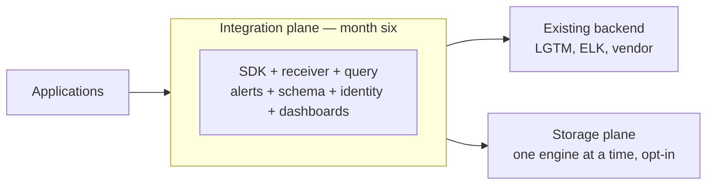
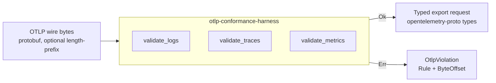
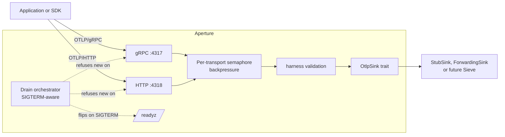
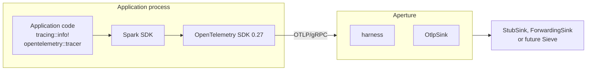
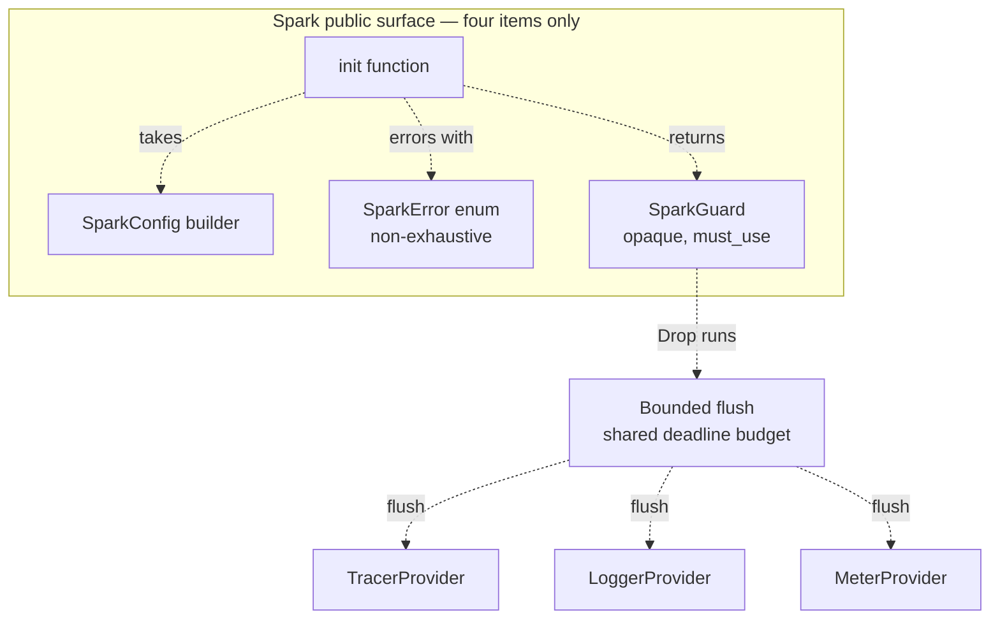
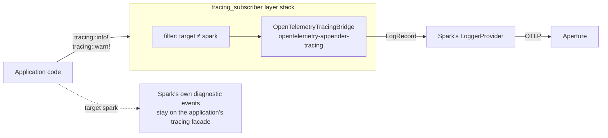
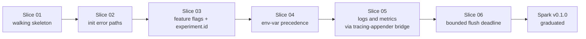
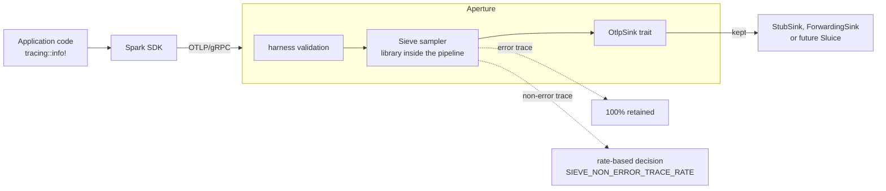

# Building Kaleidoscope with nWave — narrative companion

This is the long-form companion to `slides.md`. The slides are sparse by
design. This file holds the text I want to be able to say out loud, plus
the links to the artefacts that back each claim. When the YouTube video
description points readers to the project for detail, this is the page
they should land on.

Living document. One section is added each time an nWave wave closes for
a feature. Editorial responsibility: Bea, the engineering coach, with
Andrea's review on each addition before it is filmed.

Audience: technical engineers from Andrea's LinkedIn and Substack
readership. They know what TDD, BDD, trunk-based development, and
mutation testing are; they may not know what OTLP is, so observability
internals are explained with metaphors.

Framing: nWave-centric. Andrea uses nWave (the AI-amplified delivery
framework by Alessandro Di Gioia and Michele Brissoni at nWave.ai)
on Kaleidoscope as the worked example. nWave is the framework Andrea
adopts and dogfoods on his projects; T*D (TDD + trunk-based +
team-focused development) is Andrea's own thesis, separate from
nWave but tightly aligned with the practices nWave operationalises.

---

## Opening

I started this project on the third of May 2026. My intention was not
to build an observability platform. My intention was to dogfood nWave
— the AI-amplified delivery framework built by Alessandro Di Gioia
and Michele Brissoni at nWave.ai — on a problem big enough to actually
test it. The platform is the case study. The methodology is the
protagonist; nWave is theirs, the dogfooding is mine.

The video series exists for the same reason. I am not trying to teach
you how to build Kaleidoscope. I am trying to show you how nWave
behaves when you point it at a problem that is too large for any one
person, and let AI agents do the typing while you keep the discipline.
And, alongside, how my own thesis on T*D (TDD + trunk-based +
team-focused development) interacts with the framework: T*D is the
discipline; nWave is the operational shape that makes the discipline
affordable for a solo author.

---

## Why this exists at all

The story starts with the rug-pull pattern. Elastic re-licensed in
2021. MongoDB followed. Redis in 2024. HashiCorp the same year. Each
one was open source until it became valuable, at which point the
licence terms changed in ways that destroyed the open-source promise.
The pattern is not about morality. It is structural. Open core
businesses depend on contributors signing CLAs that assign or grant
re-licensing rights to a single corporate entity. Once that entity
needs to monetise more aggressively, the rights are exercised.

Observability is one of the markets where this hurts the most. The
open-source stack — Loki, Tempo, Mimir, the LGTM family — is governed
by Grafana Labs. The licences today are AGPL, but the governance
structure is the same one that has flipped before elsewhere. Nothing
prevents the same flip happening here.

Kaleidoscope is my attempt at building the same functionality on
contribution governance designed to make re-licensing structurally
impossible. Three pieces:

1. The platform components are licensed AGPL-3.0-or-later. AGPL closes
   the SaaS loophole — anyone hosting Kaleidoscope as a network service
   to others must publish their modifications. The very loophole that
   drove Elastic and MongoDB to abandon open source is closed inside
   an OSI-approved licence.
2. The SDK and protocol libraries are licensed Apache-2.0. They need
   to be embeddable in proprietary application code without
   contaminating it.
3. Contributions are accepted under the Developer Certificate of
   Origin, not a CLA. No copyright assignment. With many contributors
   and no concentrated copyright ownership, no future maintainer can
   unilaterally re-license, because nobody owns enough of the code to
   legally do it.

The trademark is reserved separately. The code is free; the name is
not, which prevents bad-faith forks claiming to be the original.

This licence stack is not novel. It is the same arrangement Grafana
Labs used to use, and that MongoDB used before they moved to SSPL. It
is the most battle-tested arrangement for keeping infrastructure
software free against vendor pressure.

The project was originally dedicated to the public domain under
CC0-1.0. The split to AGPL-3.0-or-later for platform components and
Apache-2.0 for SDKs took place on 2026-05-05; from that point
forward Kaleidoscope is structurally protected rather than simply
permissive. The CC0 commits before the migration are preserved in
git history, and any code dedicated to the public domain at that
time remains permanently in the public domain. The structural
protection covers what comes after.

---

## The fifteen optical instruments

Spark is the SDK and OTel-compatible client library. Aperture is the
OTLP receiver. Sieve is the routing and de-duplication layer. Sluice
is the durable buffer. Codex is the schema registry. Pulse, Lumen,
Ray, Strata, and Cinder are the storage engines for metrics, logs,
traces, profiles, and warm-tier persistence respectively. Prism is
the unified query layer. Beacon is the alerting engine. Augur is the
anomaly detector. Aegis is the identity and tenancy layer. Loom is
dashboards-as-code.

The naming theme is deliberate. A caleidoscope refracts grey light
into a clean spectrum. The platform's job is exactly that: refract
the four telemetry signals into a coherent observable view.

---

## The two-plane architecture

The hard problem with replacing Datadog or the LGTM stack from scratch
is that the storage engines are decade-class engineering. A plain
sequential plan ships nothing usable until the engines are done, which
is years away.

The split avoids this. The integration plane — Spark, Aperture, Sieve,
Codex, Prism, Beacon, Aegis, Loom — is small enough to ship in roughly
six months. It plugs on top of any existing observability backend and
produces immediate value: unified ingest, vendor-neutral schema,
dashboards-as-code, alerting that does not depend on any vendor's
proprietary alerting language.

The storage plane — Sluice, Pulse, Lumen, Ray, Strata, Cinder — ships
afterwards, one engine at a time, opt-in. Existing operators can
adopt Kaleidoscope's integration plane today and keep their current
backend. They can swap in Kaleidoscope storage engines as each one
ships and proves itself.

By month thirty-six the platform is fully self-contained.

---

## What is nWave

nWave is an AI-amplified delivery framework built by Alessandro Di
Gioia and Michele Brissoni at nWave.ai. It is not mine; I am one of
its early adopters and dogfoodists. I use it on every project I run
because it operationalises the practices I have advocated for years
under the name T*D (test-driven, trunk-based, team-focused
development) into a shape that lets a solo author with AI agents
afford the full discipline of a high-functioning engineering team.

nWave structures every feature into five disciplined waves.

DISCUSS handles user stories, journeys, acceptance criteria, and
outcome KPIs. The agent is Luna, a product owner. Luna runs
Jobs-to-be-Done analysis when user motivations are unclear, journey
mapping when they are not, and produces stories in LeanUX format with
mandatory Elevator Pitches that name a real entry point and a real
observable output.

DESIGN handles system architecture, technology choices, and
Architecture Decision Records. The agent is Morgan, a solution
architect. Morgan produces C4 diagrams in Mermaid, locks library
choices with rationale and rejected alternatives, and continues the
project's ADR series.

DISTILL turns the DISCUSS acceptance criteria and the DESIGN component
contracts into executable acceptance tests, all RED on day one. The
agent is Scholar, an acceptance designer. Scholar produces Rust
integration tests that import only the public surface, exercise real
network protocols on loopback ports, and use the harness as substrate
rather than as a mock.

DELIVER turns the RED tests GREEN slice by slice, outside-in, with
each slice landing as its own commit. The agent is Crafty, a software
crafter. Crafty runs red → green → refactor cycles for every test,
runs mutation testing on each slice, and lands at one hundred per cent
mutation kill rate.

DEVOPS handles CI/CD, infrastructure, observability of the platform
itself, and deployment readiness. The agent is Apex, a platform
architect. Apex extends the GitHub Actions workflow, locks the local
hooks, designs the operator-facing observability story, and surfaces
the CI invariants that DESIGN requires.

Each wave runs to peer-review approval before the next wave starts.
The reviewers are themselves specialised agents — Sentinel for
DISCUSS and DISTILL, Atlas for DESIGN, Crafty in review mode for
DELIVER, Forge for DEVOPS. The reviewer's job is to apply a different
brief to the same artefact: bias detection, completeness checks,
contract preservation across waves, and explicit verdicts with
Conventional Comments labels.

The methodology has a maximum of two review iterations per wave
before escalation to me as orchestrator. In practice, most waves are
approved on iteration one or two, and the iterations have been
substantive — every reviewer pass has caught real defects.

---

## The first feature: OTLP conformance harness

The harness is a small Rust library. Its only job is to validate that
a byte sequence is a valid OpenTelemetry OTLP message. It does not
emit telemetry. It does not run as a process. It is a pure function:
bytes in, either an `Ok(record)` or an `Err(violation)`.

Why this feature first? Two reasons. First, it is the leaf dependency.
Aperture, Sieve, Sluice, every other component will consume it.
Building it first means downstream code never has to mock validation.
Second, it is the smallest thing that exercises the full nWave loop.
If the methodology cannot be applied cleanly to a feature this small,
the methodology is not ready for the larger features.

It is the walking skeleton for nWave on Kaleidoscope, not for
Kaleidoscope itself.

### The harness's DISCUSS wave

Luna ran Jobs-to-be-Done analysis with me, then mapped four user
journeys around the consumers of the harness — Aperture, Sluice,
third-party engineers operating Kaleidoscope, Kaleidoscope CI. She
produced seven user stories in LeanUX format, each with a mandatory
Elevator Pitch naming a function-call entry point and a concrete
observable result.

She also produced seven Elephant Carpaccio slices. Each slice ships
end-to-end value, has a named learning hypothesis, and uses real
production data rather than synthetic. The slice ordering is
learning-leverage first: the slice with the highest uncertainty goes
first, so failures cost the least.

Sentinel reviewed and pushed back on iteration one with four
substantive findings: byte-locus ranges instead of exact offsets
(mutation-resistant), observed-field membership in a closed set
instead of free-form strings, type-identity assertion at consumer
call sites, and signature-lock pinning via typed `fn` pointers. Luna
addressed all four on iteration two; Sentinel approved.

The DISCUSS-wave artefacts live in `docs/feature/otlp-conformance-harness-v0/discuss/`.

### The harness's DESIGN wave

Morgan worked with me to lock the architecture. The harness is a
single library crate with no internal dependencies of its own. The
public surface is three functions — `validate_logs`, `validate_traces`,
`validate_metrics` — plus six closed types: `OtlpViolation`, `Rule`,
`ByteOffset`, `Framing`, `SignalType`, and the wire-type sub-rule
enum.

He produced three C4 diagrams in Mermaid (System Context, Container,
Component-skipped per scope) and five Architecture Decision Records
covering the public API surface, the violation type design, the
exact-version pin policy on `opentelemetry-proto`, the conformance
test-vector layout, and the CI contract for the harness's gates.

The CI contract — ADR-0005 — locked the five gates that every other
feature on Kaleidoscope inherits: cargo deny check, cargo test, cargo
public-api, cargo semver-checks, cargo mutants. Including the one
hundred per cent mutation kill rate target.

Atlas reviewed and approved on iteration one.

The DESIGN-wave artefacts live in `docs/feature/otlp-conformance-harness-v0/design/`.

### The harness's DISTILL wave

Scholar produced fifty-two acceptance tests across seven Rust
integration test files (`slice_01_*.rs` through `slice_07_*.rs`) plus
shared helpers in `tests/common/mod.rs`. Each test maps to a user
story and a slice. The hexagonal boundary mandate was enforced
literally: every test imports `otlp_conformance_harness::*` only;
no `pub(crate)` symbols.

Real-data discipline: accept paths use prost-encoded message types
generated from `opentelemetry-proto`'s tonic feature, which produces
the same byte shape an OTel SDK would emit. Hand-crafted bytes only
for synthesised malformed cases (truncations, varint corruptions, bad
tags).

Sentinel approved on iteration two after asking for byte-locus
windows instead of exact offsets and a closed set for the
observed-field assertion.

The DISTILL-wave artefacts live in `docs/feature/otlp-conformance-harness-v0/distill/` and the tests at `crates/otlp-conformance-harness/tests/`.

### The harness's DELIVER wave

Crafty implemented the harness slice by slice over eight commits. The
slice ordering followed Luna's prioritisation: the highest-leverage
learning slice first, then by dependency.

Each slice was red → green → refactor. The refactor step was not
optional. Crafty extracted shared helpers when duplication appeared,
collapsed redundant disjuncts in the prost-error classifier under
mutation pressure, and pulled out a single `decode_strict` chokepoint
when the third call site appeared.

Mutation testing achieved one hundred per cent kill rate. The path
to one hundred was instructive: pass one had three surviving
mutations in `classify_prost_decode_error`, all `||→&&` flips. Crafty
killed them by writing per-disjunct tests that isolate each
clause. Pass two had one survivor in `matches_wire_type_category`
that was killed the same way. Pass three was clean.

The crucial property: every survivor was killed either by writing a
more discriminating test, or by simplifying the production code so
the surviving mutation became unreachable. No survivor was killed by
relaxing a test. This is the difference between mutation testing as
discipline and mutation testing as theatre.

Crafty in review mode approved on iteration one.

The DELIVER-wave artefacts live in `docs/feature/otlp-conformance-harness-v0/deliver/`.

### The harness's DEVOPS wave

Apex extended the project's GitHub Actions workflow with the five
ADR-0005 gates: gate-4-deny first (fastest, fail-fast on licence and
advisory issues), gate-1-test second, gate-2-public-api and
gate-3-semver-checks running in parallel after Gate 1, gate-5-mutants
last (slowest, behind a thirty-minute timeout safety net).

He also produced the first version of the local pre-commit and
pre-push hooks, mirroring the CI gates so contributors can see CI's
verdict before pushing.

Forge approved on iteration one. The review identified one high
finding (action pinning by tag rather than commit SHA) accepted as
risk for the solo-author period, and two medium findings actioned in
post-merge corrections.

The DEVOPS-wave artefacts live in `docs/feature/otlp-conformance-harness-v0/devops/`.

### The post-merge corrections

After branch protection went live, the first real CI run on `main`
exposed several defects that no reviewer had caught: a Docker action
that honoured our toolchain pin and choked on edition2024 in a
transitive dep; an MSRV mismatch with the current ecosystem requiring
a 1.78 to 1.85 bump; a test race in the silence-observer tests caused
by `gag::BufferRedirect` capturing the cargo test runner's own
output; tool MSRV mismatches for `cargo-public-api` and
`cargo-semver-checks` that needed a switch to precompiled binaries; a
GitHub Actions context-evaluation quirk forcing literal env values at
the job level; tool flag drift between major versions.

Eleven commits, thirty-five minutes wall-clock. Each fix landed
directly on `main` — by then I had relaxed branch protection to pure
trunk-based, no required-status-checks gate, no enforce-admins. CI
was feedback, not a blocker. The discipline that kept `main` green
was social, not mathematical: small commits, fix-forward fast, every
correction recorded as a post-merge correction note in the wave's
`wave-decisions.md`.

The harness shipped at tag `otlp-conformance-harness/v0.1.0` with all
five gates green, seventy-three of seventy-three tests passing, one
hundred per cent mutation kill rate confirmed on real Linux CI
infrastructure.

The honest read of this period: the methodology survived first
contact with operational reality, but the reviewer agents had not
caught the gaps that real infrastructure exposed. That is the
artefact-vs-reality gap. It is the most important single learning
from feature one. The reviewer agents check artefact fidelity to
their wave's brief; they do not check operational fitness against a
real runner. Future improvements to the reviewer agents need to
include a "did you actually run this against the runner you said you
would run it against" check.

---

## The second feature: Aperture

Aperture is the OTLP receiver. It is the first network-facing
component of Kaleidoscope, and the first piece that is genuinely a
service rather than a library. It listens on gRPC port 4317 and
HTTP/protobuf port 4318, validates every incoming payload through
the harness, and hands accepted records to a pluggable `OtlpSink`.

The shift from library to service is meaningful. The harness has no
runtime concerns. Aperture has many: backpressure, graceful shutdown,
self-observability, configuration with forward-compatibility knobs
for Phase 2 identity and TLS layers.

### Aperture's six locked scope decisions

Before Luna ran the wave, I locked six scope decisions in one
round-trip with her — the kind of conversation a senior engineer has
with the product owner before story-writing begins:

1. Both transports day one. gRPC on 4317 and HTTP/protobuf on 4318.
   Phasing one out for later means Aperture cannot honestly be called
   "an OTLP receiver" until both are present.
2. Tokio as the async runtime. The only realistic Rust answer for a
   network service of this shape.
3. The boundary with the future Sieve component is an `OtlpSink`
   trait. Aperture's job ends when the sink has acknowledged the
   record. v0 ships with a `StubSink` and a `ForwardingSink`. Sieve
   when it lands will be another `impl OtlpSink`.
4. Backpressure: a configurable max-concurrent-requests limit per
   transport, with HTTP 503 (Retry-After) or gRPC `RESOURCE_EXHAUSTED`
   on overflow. No internal queue (that is Sluice's job in Phase 7).
   No block (it violates the OTel SDK contract). No silent drop
   (an explicit anti-pattern).
5. Plaintext at v0, no auth. But a configuration knob for TLS and
   SPIFFE present in the v0 schema, defaulting to off. This avoids a
   schema break in Phase 2 when Aegis ships.
6. Self-observability: structured JSON logs to stderr, no metrics in
   v0 (that is Pulse's territory in Phase 4), HTTP /healthz and
   /readyz endpoints on the same listener as the OTLP HTTP traffic.

### Aperture's DISCUSS through DEVOPS

Luna, Morgan, Scholar, and Apex each ran their wave on Aperture with
the same discipline as for the harness. The artefacts mirror the
harness in structure but reflect the service-shaped concerns.

Eight Elephant Carpaccio slices instead of seven (the eighth is
graceful shutdown drain, which the harness did not need). Eighty-four
RED acceptance tests instead of fifty-two. Five new ADRs (ADR-0006
through ADR-0010) covering transport stack, sink trait design,
configuration schema, observability strategy, and backpressure
policy.

Three new CI invariants surfaced: `single_validator_per_signal`
(only one harness call site per signal in the Aperture source),
`no_telemetry_on_telemetry` (Aperture emits no outbound network
traffic except to its configured downstream sink), and
`probe_gold_runner` (the Earned-Trust probe is itself probed against
a fixture that lies).

All four waves approved by their reviewers (Sentinel, Atlas,
Sentinel again, Forge) with no blockers.

### Aperture's DELIVER, slice by slice

The first slice is the smallest possible end-to-end thing. An OTel
SDK sends a real log record over gRPC; Aperture binds the listener,
hands the bytes to the harness, gets back a typed record, prints a
single line to stderr saying it received the record, and answers
the SDK with OK. There is no second transport yet, no second signal,
no backpressure, no graceful shutdown. There is just the one happy
path, end to end. Once that works, every subsequent slice is an
addition, not a leap.

The second slice adds the HTTP transport on the other port. Same
pipeline, different wire shape. It also adds the readiness state
machine: a process that has bound both listeners answers `/readyz`
with 200; a process still starting up answers 503. The reason that
matters now and not later is that as soon as Aperture is bound to a
real port, somebody's orchestrator wants to know whether to send it
traffic.

The third and fourth slices complete the OTLP signal contract. Logs
are already in. Slice three adds traces. Slice four adds metrics.
After slice four, the platform handles every kind of telemetry the
OpenTelemetry standard defines — which is the moment Aperture can
honestly be described as an OTLP receiver rather than as a logs
receiver that happens to use OTLP.

The fifth slice teaches Aperture to refuse work when it has too
much. A configurable cap on concurrent requests; a 503 with
Retry-After when the cap is hit; a structured stderr line for every
refusal so an operator can see when the cap was exercised. The point
is that refusal is honest. Aperture does not queue, does not block,
does not drop. Each of those alternatives breaks somebody downstream.
Saying "I'm full, try again in a second" is the only honest answer.

The sixth slice is where the platform stops being a toy. Aperture
gains a sink that ships accepted records to a real downstream
OpenTelemetry-compatible HTTP endpoint. That means a Phase-1
deployment of Kaleidoscope can actually be useful: an operator runs
Aperture in front of their existing observability backend and gets
the validation, the structured logs, and the readiness probe for
free. The slice also adds the Earned-Trust probe — at startup,
Aperture verifies the downstream actually responds to the OTLP
contract before it begins accepting traffic. If the downstream lies
(answers OPTIONS but then refuses POST), Aperture refuses to start.
The proof that the probe is honest, and not theatre, is a test that
runs the probe against a fixture deliberately programmed to lie. The
test passes only if the probe catches the deceit.

The seventh slice is small and forward-looking. The configuration
file gains two switches, for TLS and for workload identity. At v0
both are off, and turning them on does nothing except print a
warning. They exist so that when the identity layer ships, two
years from now, the configuration format does not have to change.
This is the kind of decision that costs almost nothing now and
saves a great deal of pain later.

The eighth slice is shutdown done with care. SIGTERM arrives; the
readiness probe flips to 503 within a tenth of a second; new
requests are refused; in-flight requests are given a grace period
to complete; the listeners drop and the process exits zero. The
default grace period is thirty seconds, which is the value
Kubernetes also defaults to. Operators rolling deployments do not
need to think about Aperture at all.

After the eighth slice, the v0 plan is complete. The reviewer reads
the whole DELIVER output as a single artefact and approves. A
single commit promotes the new crate into the same CI gates as the
harness. The first version is tagged.

What stands at the end is the second feature on Kaleidoscope and
the first network-facing component, and the proof that the
methodology absorbs the shift from a pure-function library to a
long-lived service without changing shape. Eight slices, each
landing as its own visible step, each verified end-to-end against a
real client over a real socket.

Each slice has been a single focused dispatch of Crafty, ending with
a multi-commit landing that makes the slice's RED tests GREEN, the
mutation kill rate 100%, and the production code idiomatic Rust.

The `crates/aperture/` directory is the production tree. Each src
file carried a `// SCAFFOLD: true` marker at DISTILL time; the marker
is removed by DELIVER as each module's tests turn GREEN.

---

## Case study: feature 3

Spark is the third feature on Kaleidoscope and the first one written
from the application's seat rather than the platform's.

The harness validated bytes against the OTLP specification. Aperture
received those bytes over a real socket. Spark is the SDK an
application uses to put bytes onto that socket in the first place.
The round-trip closes here. A Rust application calls `spark::init`,
emits a span via the standard OpenTelemetry API, and lets the guard's
drop flush the batch on exit. The bytes travel to Aperture. Aperture's
recording sink confirms what arrived.

Spark is licensed Apache-2.0, deliberately. The platform crates ship
under AGPL because copyleft is the structural defence against the
re-licensing pattern. The SDK ships permissive because anyone
embedding it in a proprietary application must not be forced to open
their source to do so. This split is the same split the major
observability vendors landed on for the same reason. Kaleidoscope
encodes it from day one.

The dev-dependency on Aperture for integration tests is the only
place where the AGPL crate enters Spark's build. `cargo deny` is the
structural enforcement that prevents accidental promotion to a
runtime dependency.

---

## What changes from a service to an SDK

Aperture lives inside our process. Spark lives inside someone else's.
The implications are larger than they look.

A service can change its internal shape any time the methodology says
it should. A library exposes a public surface that strangers will
consume on their own timeline. Renaming an exported function is a
breaking change. Adding a variant to a public error enum is a
breaking change unless the enum is marked non-exhaustive. The
OpenTelemetry ecosystem itself is mid-stabilisation; the semantic
conventions crate's attribute names move between point releases.

The methodology absorbs this without changing shape, but the
discipline inside DESIGN intensifies. ADR rigour matters more. Pin
policy matters more. Whether the user-facing struct exposes a field
or a method matters more. The reviewer agent's brief covers
public-API ergonomics as its own quality attribute, not as a
footnote.

Developer ergonomics is itself an outcome KPI for an SDK. A
five-minute first-time-use experience is not a nice-to-have; it is
the difference between adoption and abandonment.

---

## Spark — DISCUSS and DESIGN closed

DISCUSS produced six elephant-carpaccio slices, each shipping a
visible step of the integration. The first slice is a walking
skeleton: a small binary calls `spark::init`, records a span, and
shuts down; Aperture's recording sink confirms the span arrived
carrying the four house attributes on its resource. Every subsequent
slice adds one capability — error paths, feature flags, environment
variable precedence, the three signal types, the bounded flush on
drop — without giving up the round-trip the walking skeleton
established.

DESIGN locked the wrapper shape across six new architecture decision
records. The public surface is four items: the `init` function, the
`SparkConfig` builder, the `SparkError` enum, the `SparkGuard`
returned from init. The guard is opaque, marked must-use, and does
its work entirely in drop. The single-init invariant is enforced in
two layers: an internal atomic flag and the OpenTelemetry SDK's own
re-set guard, with roll-back on failure so a retry after a failed
init does not falsely report already-initialised. The flush deadline
is a single budget shared sequentially across the three providers.
The OpenTelemetry family is pinned exact-minor at zero-twenty-seven,
the same version the harness pins exact-patch.

The DESIGN wave surfaced one honest contradiction with the DISCUSS
contract. The acceptance criteria for the bounded-flush slice
implied an integer count of drained or dropped records on the exit
event. The OpenTelemetry SDK at the version Spark pins does not
expose those counters publicly. The architect proposed Path A:
update the contract to accept the literal `unknown` until the SDK
exposes the integer; preserve the prefix `drained=` and `dropped=`
as the contract; treat the value as informational. The alternative
of building a Spark-side counter wrapper to fake an integer was
rejected as throwaway code that duplicates state already tracked
internally and that a future SDK release will likely surface.
DISCUSS was updated with an explicit Changed Assumptions section
recording what changed and why. The DESIGN ADR locks the new event
shape. The acceptance designer reading the contract today is not
misled by an old literal.

Both waves were approved by the reviewer on iteration one with no
blocking issues.

---

## Spark — DISTILL closed

DISTILL turned the user stories' BDD scenarios and the six DESIGN
ADRs into eight Cargo integration test binaries: one per
elephant-carpaccio slice, plus two cross-cutting invariants for the
single-init contract and the no-telemetry-on-telemetry contract.
Fifty-seven test functions in total. Fifty-three of them are RED
on day one, panicking on `unimplemented!()` from the production stub.
The configuration builder is intentionally real at DISTILL because
tests need to construct configurations to exercise the contract;
everything else waits for DELIVER.

The acceptance posture is the same one Aperture set: real local
Aperture instances spun up per test on ephemeral loopback ports, with
recording sinks asserting what arrived. No mocks, no in-memory
transports, no synthetic data. Spark depends on Aperture only as a
development dependency, which keeps the AGPL crate out of Spark's
runtime supply chain and confines the licence question to the test
binaries.

The DISTILL wave surfaced its own back-propagation. The acceptance
designer discovered that the OpenTelemetry Rust SDK at the version
Spark pins exposes a global getter for the tracer provider and the
meter provider, but not for the logger provider. The DISCUSS contract
for the logs-and-metrics slice presupposed the symmetric three-signal
shape that does not hold at this version. Three of the slice's tests
were marked ignored, with their function names preserved verbatim so
that when the contract resolution lands the tests can be un-ignored
without renaming. The note proposed four concrete resolution paths
and made the choice explicit rather than papering it over with a
workaround.

Two back-propagations in two waves. Both surfaced upstream
constraints that the methodology made visible at the right moment,
neither at the wrong moment. The methodology rewards honest
escalation; the alternative is a contract that lies about what the
underlying technology can do.

The reviewer approved DISTILL on iteration one with no blocking
issues.

---

## The logs-emission decision

The second back-propagation needed a real architectural choice. The
acceptance designer's note proposed four paths and recommended Path
A. The four were: expose a fifth public-API item, expose a test-only
seam, adopt the Rust ecosystem's standard logs bridge, or wait for
the upstream SDK to add the missing global getter.

The choice was the third one. A Rust application in 2026 already uses
the `tracing` crate everywhere. The bridge crate
`opentelemetry-appender-tracing` is the canonical adapter from
`tracing` events to OpenTelemetry log records. It is licensed
Apache-2.0, which sits inside Spark's permissive runtime supply
chain. Spark wires the bridge as one more `tracing-subscriber` layer
during `init`, with a filter that excludes Spark's own diagnostic
target so the no-telemetry-on-telemetry invariant holds. The
application keeps using `tracing::info!` and `tracing::warn!`. The
public surface stays at four items; ADR-0011's lock holds.

The decision is recorded as ADR-0017. The DISCUSS contract for the
logs-and-metrics slice was updated with a Changed Assumptions entry
naming the move from the original phrasing to Path A3, and the four
DISCUSS files referencing the non-existent global getter were
rewritten mechanically to use `tracing::info!` instead. The three
ignored slice tests retain their function names verbatim, so when
DELIVER lands the bridge wiring, un-ignoring them is a single-line
change. Slice five can now start alongside the other five.

---

## Spark — DELIVER closed and graduated

The crafter ran six elephant-carpaccio slices, one at a time, each
landing as a tight red-green-refactor cycle and a small focused
commit on `main`. The walking skeleton landed first: a Rust
application calls `spark::init`, records one span, and the recording
sink behind a real Aperture instance captures one export request
carrying `service.name` and `tenant.id` on its resource. The init
error paths landed next: each of the four error variants becomes a
precise diagnostic raised before any OpenTelemetry SDK type is
constructed, with a transactional roll-back that releases the
single-init flag if a post-flag step fails. Then the remaining house
attributes, then the environment-variable precedence, then the
three-signal Resource symmetry via the appender bridge, then the
bounded flush deadline with its shutdown event vocabulary.

Eight Cargo integration test binaries. Sixty active tests. One
hundred per cent mutation kill rate on the diff at every slice's
close. The crafter's review-mode pass approved the wave on iteration
one with no blocking issues.

Five back-propagation issues surfaced during DELIVER, each documented
at the time of the offending change with explicit forward path. One
of them caught a real misreading I had propagated in writing
ADR-0017: I claimed the appender crate's release cadence was offset
by one from the core, when in fact the minor versions align. The
crafter found the duplicate `opentelemetry 0.28` in the lockfile,
inspected the upstream manifests, pinned `=0.27`, and the lockfile
collapsed back to one minor. The architecture decision record was
amended in place with the correction. The audit trail is the
back-propagation note plus the amendment plus the lockfile diff.

After the sixth slice closed and the review approved, three things
happened in quick succession. The pre-commit hook and the CI Gate 1
both removed their `--exclude spark` clauses; Spark joined the
harness and Aperture in the canonical contract that every commit on
`main` passes the full workspace test gate. The tag `spark/v0.1.0`
landed as the canonical reference. The narrative document gained
this paragraph.

What is consistent across the three features so far is that each
shipped, each had honest back-propagation when DESIGN's reading of
upstream APIs proved imperfect, and each closed without exceptions
to the discipline.

---

## Case study: feature 4 — Sieve

Sieve is the fourth feature on Kaleidoscope and the first one that
sits inside the platform pipeline rather than at its edges. The
harness validates bytes against the OpenTelemetry specification.
Aperture receives those bytes and hands them to a sink. Spark sits in
the application emitting them in the first place. Sieve is the next
node downstream of Aperture: it filters and samples before the
records reach storage.

The job at v0 is volume control without losing the trace data
operators most want to keep. Trace storage is expensive and most
traces are uninteresting; sampling reduces the volume. But errors are
exactly the traces operators reach for during an incident, so the
sampler is biased to retain every error-bearing trace at one hundred
per cent regardless of the configured rate.

Licensed AGPL because Sieve is a server-side platform component.
Inside the pipeline by design at v0, not a separate process. The
roadmap says stage one of sampling lives at Aperture; the architect
and the orchestrator agreed that putting Sieve there at v0 keeps the
walking skeleton honest. The separate-process shape becomes the right
answer when tail-sampling needs an in-memory window across batches,
which is v1.

The product owner ran a tightened DISCUSS to lock eight scope
decisions: library shape, trace-level granularity, the
`status.code == ERROR` definition of an error span, deferral of
PII-scrubbing to v1, single global rate via an environment variable,
logs and metrics passthrough, the `xxh3_64` hash function for
`trace_id`-keyed determinism, and the verbosity convention
(DEBUG per-decision, INFO summary every minute). Six elephant-
carpaccio slices and six user stories follow from those decisions.

The reviewer approved DISCUSS on iteration one with no blocking
issues. Two clarifications surfaced and were closed inline: the
periodic INFO summary is locked as a v0 contract (without it,
operators on default verbosity have no Sieve visibility), and the
sixty-second tick interval is locked at DISCUSS rather than left for
DESIGN to pick. DESIGN picks up the architecture next.

---

## What is consistent across the three features

Discipline, not heroics. The methodology is the load-bearing
structure; the agents are the cheap labour that lets a single human
afford the methodology.

Small commits. Trunk-based development. CI as feedback, not as a
blocker. Branch protection on `main` is permissive: linear-history,
no force-push, no deletions, but no required status checks and no
enforce-admins. The discipline that keeps `main` green is social and
fast: every contributor (currently me, soon contributors) commits
frequently, runs the local hooks before pushing, and fixes forward
when CI surfaces a defect.

Pre-commit and pre-push hooks at `scripts/hooks/` mirror the CI
gates. Wired via `core.hooksPath`, so they ride with every clone.

Pure-function leaves, service-shaped components, and SDKs written
from the application's seat all fit the same methodology. The harness
was a library defending an external specification. Aperture is a
service holding a network port. Spark is a library again, but a
library written for a stranger's process. Three different shapes;
the methodology absorbed each without ceremony.

---

## What I want viewers to take away

AI agents do not replace engineering discipline. They amplify it.
This is the thesis. Without the discipline, the speed of generation
becomes recklessness very quickly. With the discipline, an
ambitious greenfield rewrite becomes tractable on a solo author's
timeline.

The methodology has to be visible. It cannot live only in the head
of the orchestrator. nWave's structure — five waves per feature, two
agents per wave (one to do the work, one to review it), explicit
peer-review iterations, wave-decisions documents that record every
choice — is what makes the AI's output auditable. Without that,
"AI-generated code" is a black box that ships uncontrolled.

The reviewer agents are non-negotiable. Even when iteration one
approves, the second pair of eyes catches real things. The reviewer
brief is deliberately different from the doer brief. That asymmetry
is what makes the review honest.

The methodology has gaps. The biggest one we found in feature one
was operational reality — the reviewer agents check artefact
fidelity, not whether the artefact actually runs on the
infrastructure it claims to. Future iterations of nWave's reviewer
briefs will close that gap. We surface gaps by running the
methodology on real problems, not by speculating about them.

The licence and governance choices are part of the engineering
discipline. A project that promises "always free and open source"
must encode that promise structurally — in the licence, in the
contribution model, in the trademark policy. Otherwise the promise
relies on the maintainer's good intentions, which is the same
fragile thing every re-licensed open source project relied on.

---

## Editorial note for future updates

Each time an nWave wave closes, add a section to this file in the
order: feature name, wave name, what the agent produced, what the
reviewer found, what the artefacts are. Then add two or three
slides to `slides.md` extracting the headline.

Avoid listing every test, every ADR section, every commit. The
narrative is for the audience, not for the audit trail. The
wave-decisions documents in `docs/feature/<feature>/<wave>/` are the
audit trail.

Maintain British English throughout. Andrea writes in British
English; the videos will be presented in English; the consistency
matters.
