<!--
SLIDE DECK — Kaleidoscope x nWave

Living document. Grows one block per closed nWave wave per feature.

Audience: technical engineers (LinkedIn / Substack readership; familiar
with TDD, trunk-based development, BDD, mutation testing as terms; new to
OTLP and observability internals).

Framing: nWave-centric. Andrea uses nWave (the AI-amplified delivery
framework by Alessandro Di Gioia and Michele Brissoni at nWave.ai)
on Kaleidoscope as the worked example. nWave is the framework Andrea
adopts and dogfoods; T*D (TDD + trunk-based + team-focused) is
Andrea's own thesis, separate from nWave but tightly aligned with it.

Format: Marp Markdown. Each `---` is a slide boundary. Keep slides
sparse — two or three lines each, one idea per slide.

Pair file: narrative.md holds the long-form text the slides are extracted
from, with links to artefacts.
-->

# Building Kaleidoscope with nWave

## A live worked example of AI-amplified software delivery

Andrea Laforgia · AGPL-3.0 (platform) · Apache-2.0 (SDKs) · DCO no CLA

---

# Why this talk exists

I am building an observability platform from scratch.

Every line of code is written by AI agents.

I want to show you how, and why it does not feel reckless.

---

# What is Kaleidoscope

End-to-end observability platform.

Logs, metrics, traces, profiles.

The work of Datadog, the LGTM stack, ELK, BetterStack — combined into one tool.

AGPL platform, Apache SDKs, no CLA. Structurally protected against vendor capture.

---

# The rug-pull problem

Elastic. MongoDB. Redis. HashiCorp.

Each one was open source.

Each one re-licensed once it became valuable.

The pattern is structural, not accidental.

---

# The Kaleidoscope answer

Built from scratch on Apache Foundation substrate.

No commercial dependencies.

AGPL-3.0-or-later for platform components. Apache-2.0 for SDKs and protocol libraries.

Contributions accepted under DCO. No CLA, ever.

Governance designed to make re-licensing structurally impossible.

---

# The fifteen optical instruments

Spark · Aperture · Sieve · Sluice · Codex

Pulse · Lumen · Ray · Strata · Cinder

Prism · Beacon · Augur · Aegis · Loom

A caleidoscope refracts grey light into a clean spectrum. Same job: refract telemetry into the four signals.

---

# The two planes

**Integration plane** — the parts users touch first. SDK, gateway, alerts, dashboards. Ships in roughly six months. Useful immediately on top of any existing backend.

**Storage plane** — the parts that replace the backend. Engines for logs, metrics, traces, profiles. Ships afterwards. One engine at a time, opt-in.

---

# Why two planes matter

Most observability rewrites die because the storage engines are decade-class engineering, and nothing useful ships until they are done.

Splitting the planes means month six already delivers a usable platform.

The hardest engineering arrives only when the easier work has proved the methodology.

---

# What is nWave

An AI-amplified delivery framework by Alessandro Di Gioia and Michele Brissoni at nWave.ai.

Five waves per feature: DISCUSS, DESIGN, DISTILL, DELIVER, DEVOPS.

A specialised AI agent leads each wave.

A specialised reviewer agent critiques each wave.

Nothing ships until both pass.

I dogfood it on every project.

---

# nWave wave by wave

**DISCUSS** — Luna, the product owner. Stories, journeys, acceptance criteria.

**DESIGN** — Morgan, the solution architect. C4 diagrams, ADRs, technology choices.

**DISTILL** — Scholar, the acceptance designer. Executable acceptance tests, RED.

**DELIVER** — Crafty, the software crafter. Outside-in TDD turns RED into GREEN.

**DEVOPS** — Apex, the platform architect. CI/CD, observability, deployment readiness.

---

# Why peer review at every gate

AI-generated work is not trusted work.

Speed of generation does not reduce the need for verification.

A second specialist agent reads the first one's output with a different brief.

Either both pass, or the wave does not close.

---

# What this enables

A solo author can dogfood the discipline of a high-functioning engineering team.

Without the team.

Without the bus factor.

Without the ceremony that exists only to coordinate humans.

---

# Case study: feature 1

The OTLP conformance harness.

A small Rust library.

Single job: validate that a byte sequence is a valid OpenTelemetry message.

The smallest thing that exercises the full nWave loop end to end.

---

# Why this feature first

It is the leaf dependency.

Every other Kaleidoscope component will consume it.

If we cannot run a feature this small through the methodology cleanly, we cannot run anything.

Walking skeleton for the methodology, not for the product.

---

# DISCUSS — what Luna produced

Seven user stories with Elevator Pitches and acceptance criteria.

Seven Elephant Carpaccio slices, each shipping end-to-end value.

A journey map and outcome KPIs.

Definition of Ready validated on all nine items.

Sentinel approved on iteration 2 after a substantive rework.

---

# DESIGN — what Morgan produced

C4 system context, container, component diagrams.

Five Architecture Decision Records:

ADR-0001 public API. ADR-0002 error type. ADR-0003 dependency pinning. ADR-0004 test vector layout. ADR-0005 CI contract.

Atlas approved on iteration 1.

---

# DISTILL — what Scholar produced

Fifty-two acceptance tests in Rust integration-test format.

Each test maps to a user story and a slice.

All RED on day one — no implementation existed.

Hexagonal boundary mandate enforced: tests import only the public surface.

Sentinel approved on iteration 2.

---

# DELIVER — what Crafty produced

Seven slices implemented outside-in, one at a time.

Each slice: red → green → refactor.

Seventy-three tests green at close.

One hundred per cent mutation kill rate.

Crafty in review mode approved on iteration 1.

---

# DEVOPS — what Apex produced

GitHub Actions workflow with five blocking gates per ADR-0005:

cargo deny · cargo test · cargo public-api · cargo semver-checks · cargo mutants.

Local pre-commit and pre-push hooks mirroring the CI gates.

Forge approved on iteration 1.

---

# The first end-to-end CI run

Seven minutes fifty-five seconds wall-clock.

All five gates green.

Mutation kill rate confirmed on real Linux infrastructure, not on a developer Mac.

The harness shipped at tag `otlp-conformance-harness/v0.1.0`.

---

# What the harness wave taught us

The methodology survives operational reality.

Every reviewer agent caught real problems.

Post-merge corrections were small and recoverable.

The artefact-vs-reality gap was the most important learning, and it surfaced exactly where it should: at the first real CI run.

---

# Case study: feature 2

Aperture — the OTLP receiver.

The first network-facing component.

Listens on gRPC port 4317 and HTTP/protobuf port 4318.

Validates every incoming payload through the harness.

Hands accepted records to a pluggable sink.

---

# What changes from a library to a service

Aperture is a long-lived process. It has runtime concerns the harness did not.

Backpressure, graceful shutdown, observability of itself, configuration with forward-compat knobs.

The methodology absorbs the difference without ceremony.

---

# Aperture — DISCUSS through DEVOPS

Six locked scope decisions in one round-trip with Andrea.

Eight Elephant Carpaccio slices.

Eighty-four RED acceptance tests via the same Strategy C "real local" pattern as the harness.

Five DESIGN ADRs continuing from ADR-0006 through ADR-0010.

Three new CI invariants surfaced for DEVOPS.

---

# Aperture — DELIVER closed

Eight slices, all green.

Slices 01-04: walking skeleton, HTTP and readiness, the three signals.

Slice 05: per-transport semaphore backpressure.

Slice 06: ForwardingSink and the Earned-Trust probe gold-test.

Slice 07: TLS and SPIFFE config knobs reserved for Phase 2.

Slice 08: deadline-bounded drain on SIGTERM, /readyz flips to 503 in 100 ms.

176 active tests. 100% mutation kill rate. Tag `aperture/v0.1.0`.

---

# Aperture v0 — graduation

After the eighth slice closed, three CI gates that had been scoped to the harness during DELIVER were graduated to cover both crates.

Gate 1 (cargo test) → `--workspace`.

Gate 5 (cargo mutants) → both packages.

Local pre-commit hook → workspace coverage.

One commit. Then `aperture/v0.1.0` is canonical.

---

# Case study: feature 3

Spark — the OTLP-emitting Rust SDK applications use to ship telemetry to Aperture.

The first feature written from the application's seat rather than the platform's.

The round-trip closes here.

---

# Why this feature now

Harness validated bytes. Aperture received them over a real socket.

Spark puts them onto that socket from a real application.

A Rust binary calls `spark::init`, emits a span, drops the guard. The bytes travel. Aperture's recording sink confirms.

---

# What changes from a service to an SDK

Aperture lives inside our process. Spark lives inside someone else's.

Renaming a function becomes a breaking change. Adding a variant to a public enum is breaking unless the enum is non-exhaustive.

DESIGN's discipline intensifies. Public-API ergonomics is itself an outcome KPI.

---

# Spark — DISCUSS and DESIGN closed

Six elephant-carpaccio slices, walking skeleton first.

Six new ADRs (0011 through 0016): public surface, error type, dependency pin, flush mechanism, single-init, guard posture.

Reviewer approved both waves on iteration one with no blocking issues.

---

# An honest back-propagation

DESIGN found that the OpenTelemetry SDK at the pinned version does not expose drained or dropped record counts publicly.

The DISCUSS contract had implied an integer. The architect surfaced the gap, proposed accepting the literal `unknown` at v0, rejected the alternative of building a Spark-side counter wrapper as throwaway code.

DISCUSS was updated with a Changed Assumptions section recording what changed and why.

The methodology depends on this kind of honest escalation.

---

# Spark — DISTILL closed

Eight Cargo integration test binaries. Fifty-seven tests. Fifty-three RED on `unimplemented!()` from the production stub.

Real local Aperture per test on ephemeral ports; recording sinks assert what arrived. No mocks, no in-memory transports, no synthetic data.

Aperture is a development dependency only. AGPL stays out of the runtime supply chain.

---

# A second back-propagation

DISTILL discovered that the OpenTelemetry Rust SDK at the pinned version exposes a global getter for the tracer provider and the meter provider, but not for the logger provider.

The DISCUSS contract for one slice presupposed the symmetric three-signal shape. Three tests were marked ignored, with their function names preserved verbatim for the eventual resolution.

Two back-propagations in two waves. The methodology surfaced both at the right moment.

The reviewer approved DISTILL on iteration one with no blocking issues.

---

# The logs-emission decision

Four paths considered. Chosen: adopt `opentelemetry-appender-tracing` as Spark's runtime dep.

A Rust application in 2026 already uses the `tracing` crate everywhere. The bridge is the canonical adapter from `tracing` events to OTel log records. Apache-2.0.

Spark wires the bridge as one more `tracing-subscriber` layer during init. The application keeps using `tracing::info!`. The public surface stays at four items.

Recorded as ADR-0017. DISCUSS rewritten mechanically to match.

---

# Spark — DELIVER closed and graduated

Six slices. Eight test binaries. Sixty active tests. 100% mutation kill rate on the diff at every slice's close.

Five back-propagation issues surfaced during DELIVER. Each documented at the time of the offending change. Each ADR amended in place.

The crafter's review-mode pass approved the wave on iteration one with no blocking issues.

Tag `spark/v0.1.0` is canonical.

---

# Spark v0 — graduation

`--exclude spark` removed from the pre-commit hook and CI Gate 1.

Spark joins the harness and Aperture in the canonical contract: every commit on `main` passes the full workspace test gate.

Three crates ship green. One commit. Then `spark/v0.1.0`.

---

# Case study: feature 4

Sieve — the sampling and filtering processor.

The first feature inside the platform pipeline rather than at its edges.

Volume control without losing the trace data that matters during an incident.

---

# Sieve at a glance

Inside Aperture's pipeline as a library at v0. AGPL, server-side platform component.

Trace-level decisions. `status.code == ERROR` keeps the whole trace at 100%.

Single global rate via `SIEVE_NON_ERROR_TRACE_RATE`. Logs and metrics pass through.

`xxh3_64` for `trace_id`-keyed determinism. Same trace, same decision, every batch.

---

# Sieve — DISCUSS closed

Eight scope decisions locked: library shape, trace-level granularity, error definition, PII-scrubbing deferred, global rate via env, signals passthrough, hash function, verbosity convention.

Six elephant-carpaccio slices. Six LeanUX user stories with elevator pitches.

Reviewer approved on iteration one with no blocking issues.

---

# Sieve — DESIGN closed

The architectural decision that mattered: a decorator over Aperture's existing sink trait, not a new hook on Aperture.

`SamplingSink<S, N>` wraps any `OtlpSink + Probe` implementation; runs the sampler on traces inside its own `accept`; forwards the kept records unchanged.

Aperture's public surface does not move. DELIVER's integration is three lines in the composition root.

Four ADRs (0018-0021). Reviewer approved on iteration one with no blocking issues.

---

# Sieve — DISTILL closed

Eight Cargo integration test binaries. Thirty-six tests. Twenty-two exercise error or edge paths.

Real Aperture `RecordingSink` is the inner sink for Sieve's decorator. Strategy C "real local"; no mocks.

Mixed RED posture: validation paths real; behavioural contract panics on `unimplemented!()`.

Reviewer approved on iteration one with score 9.8 of 10 across nine dimensions.

---

# Sieve — DELIVER closed and graduated

Six slices. Eight test binaries. Thirty-six tests. 100% mutation kill rate on the diff at every slice's close.

The reviewer accepted one pragmatic v0 compromise: reading the rate from the sampler via `Any` downcast. Forward path: extend the `Sampler` trait additively when v1 introduces a second sampler.

`--exclude sieve` removed from the pre-commit hook and CI Gate 1.

Tag `sieve/v0.1.0` is canonical.

---

# Sieve v0 — graduation

Sieve joins the harness, Aperture, and Spark in the canonical contract: every commit on `main` passes the full workspace test gate.

Four crates ship green. One commit. Then `sieve/v0.1.0`.

The intermediate CI failures on slices one through five are an honest cost of slice-by-slice DELIVER when DISTILL writes all tests upfront. The lesson is logged for the next feature.

---

# Case study: feature 5

Codex — the schema authority.

Catches typos at integration time before they ship to the recording sink.

OpenTelemetry semantic conventions plus three Kaleidoscope house attributes (`tenant.id`, `feature_flag.{key}`, `experiment.id`).

---

# Codex at a glance

Library at v0. AGPL, server-side platform component.

Spark calls `SchemaCatalogue::validate` after Resource composition.

Default-warn (one `tracing::warn!` per misconfigured init). Opt-in-strict (`Err(SparkError::SchemaValidation(report))`).

Fuzzy "did you mean" suggestions via in-tree Levenshtein.

---

# Codex — DISCUSS closed

Nine scope decisions locked: library shape, hand-written corpus, single pinned version, no per-tenant overlays, structured `LintReport`, Spark-side integration via runtime dep, checked-in generated corpus, in-tree Levenshtein, single warn event per init.

Six elephant-carpaccio slices. Six LeanUX user stories with elevator pitches.

Reviewer approved on iteration one with no blocking issues.

Slice 06 is the first real validation that `#[non_exhaustive]` on `SparkError` does what it is supposed to do. Confidence-building.

DESIGN picks up next.

---

# Codex — DESIGN closed

Four ADRs (0022-0025): public API + crate layout, corpus regeneration ritual, dependency pinning, Spark integration.

Five public types + forbid unsafe. Zero runtime deps. In-tree Levenshtein for suggestions. xtask binary regenerates the corpus from upstream semconv when the pin moves; PR diff visible.

Spark integration is additive on `#[non_exhaustive]` SparkError. Non-breaking. Default-warn / opt-in-strict.

The reviewer approved on iteration one with no blocking issues.

---

# A second clean recovery

The architect stalled mid-write at the same watchdog pattern that hit ADR-0017 earlier in the project. He had completed the wave-decisions and the first two ADRs cleanly; the orchestrator finalised the remaining two ADRs plus the C4 diagrams plus the technology-choices and slice-mapping.

The reviewer's pass treated both halves equivalently. The methodology has now had two clean recoveries from this pattern; the cost of each has stayed bounded.

DISTILL picks up next.

---

# Codex — DISTILL closed

Six Cargo integration test binaries. 15 tests total. 12 RED on `unimplemented!()` from production stubs.

Codex's own five user stories covered by five slice tests; the cross-feature Spark integration (slice 06) belongs in Spark's test directory.

The reviewer approved on iteration one with a perfect score across the eight critique dimensions.

The recovery pattern (architect or acceptance designer stalls; orchestrator finalises; reviewer treats both halves equivalently) has now happened cleanly three times. Cost stays bounded.

DEVOPS picks up next.

---

# Codex — DEVOPS closed

Two graduations and one new job. Codex joins Gates 2 and 3 (`cargo public-api`, `cargo semver-checks`) immediately because the five-type surface is a real consumer contract Spark holds against.

`gate-5-mutants-codex` mirrors the per-feature mutation testing job pattern: 30-minute timeout, `--in-diff` against the cascade baseline, `mutants.out` artefact upload.

No new gate types. Codex's invariants are enforced by the compile-time smoke test, by `cargo deny check`'s zero-new-entries guarantee on an empty runtime closure, and by the xtask binary's drift signal at slice 02.

DELIVER follows.

---

# Codex — DELIVER closed

Five slices, eight commits, all green.

46 tests total: 15 acceptance tests at the public boundary, 31 inline unit tests at the pure-function seams.

Mutation kill rate cumulative: 35 viable mutants across the five slices' diffs, all 35 caught.

Slice 03 closed by construction at slice 02 because Scholar's DISTILL fixture required all three house attributes. Crafty followed the test, not the brief — back-propagation discipline in action.

Reviewer approved on iteration one with zero blocking issues. Codex graduates: `--exclude codex` removed from CI Gate 1 and pre-commit; tag `codex/v0.1.0` cut.

Slice 06 (Spark integration) is a separate Spark-side wave with post-DELIVER amendments to ADR-0012 and ADR-0013.

---

# Spark — Slice 07 — Codex schema lint integration landed

The piece deferred at Codex's DELIVER closure. Spark's `init` calls Codex's `SchemaCatalogue::validate(...)` after the existing internal lint and before any OTel SDK type construction.

Default mode: violations emit one `tracing::warn!(target = "spark")` event per misconfigured init.

Strict mode (opt-in via `SparkConfig::with_strict_schema_lint(true)`): violations return `Err(SparkError::SchemaValidation(report))` so CI integration tests fail-fast.

Six tests, five integration plus one pointer-identity unit test for the `OnceLock` invariant. Mutation testing: 15 mutants, 12 caught, 3 unviable, 0 missed.

ADR-0012's `#[non_exhaustive]` discipline proves itself on its first real exercise: the new variant lands non-breaking by Rust's semver rules; Gate 2 and Gate 3 confirm.

ADR-0025 moves from Proposed to Accepted with the landing commit. ADR-0012 + ADR-0013 gain post-DELIVER amendment notes.

---

# Case study: feature 6 — Prism v0

The project's first frontend feature. TypeScript instead of Rust. React + Vite + Apache ECharts SPA instead of a service binary. Vitest + Playwright instead of `cargo test`.

The genuine question: does nWave absorb the paradigm shift or break against it?

Persona: Priya Raman, senior SRE at `acme-observability`. PagerDuty pages her at 03:14. Five minutes to triage.

Scope: one PromQL query panel against an OTel-compatible Prometheus or Mimir backend.

Licence: AGPL-3.0-or-later. Operator-facing platform infrastructure; the SaaS loophole AGPL closes applies to a static SPA served from a long-lived web server.

---

# Prism v0 — DISCUSS closed

Luna ran JTBD analysis + journey design + story map before overloading at the user-stories write. Bea finalised the missing files (user-stories, DoR, KPIs, wave-decisions, SSOT entries).

Reviewer Eclipse (Haiku) approved iteration 1 with zero blocking; treated Luna's halves and Bea's halves equivalently. Fifth recovery-pattern occurrence absorbed cleanly.

Output: 13 feature-side files + 6 slice briefs + 3 SSOT files. Primary job named: "see the shape of the misbehaving signal fast enough to triage". Three secondary jobs deferred to post-v0.

Six-slice carpaccio: walking skeleton (real Prometheus, Strategy C), relative presets, calm errors and empty states, auto-refresh with backoff, absolute range and permalink, WCAG 2.2 AA audit.

SSOT promotion: `docs/product/journeys/` and `docs/product/jobs.yaml` born here.

---

# Prism v0 — DESIGN closed

Morgan ran the wave end to end without stalling — the first dispatch in this project to break the recovery streak across thirty-six tool uses.

Seven ADRs (0026 through 0032): component layout, queryRange + QueryOutcome union, URL codec, auto-refresh state machine, ECharts integration, workspace tooling, AGPL headers.

Architectural choice: modular monolith with internal ports-and-adapters. Microservices, SSR, micro-frontends rejected with scope-specific rationale.

Three pure-function leaves anchor the design: URL codec, `buildOption`, auto-refresh reducer. `eslint-plugin-boundaries` makes the import discipline structural.

Atlas (Haiku) approved iteration 1.

---

# Prism v0 — DEVOPS closed (iteration 2)

Apex ran the wave without stalling. Eight files specifying six new CI gates: Vitest, Playwright (Chromium / Firefox / WebKit), bundle size (≤ 300 KB gzipped), lint + format + AGPL headers, StrykerJS mutation, Prometheus contract via container fixture.

Browser-emitted KPI metrics path: same-origin POST `/v1/metrics` through operator's reverse proxy to Aperture. Fifty-line custom emitter, not OpenTelemetry JS SDK (bundle budget).

Forge (Haiku) iteration 1: CONDITIONALLY APPROVED, five CRITICAL specification gaps + three HIGH inline notes. Bea finalised the revisions directly. Forge iteration 2: APPROVED.

The iter-1 → iter-2 cycle absorbed five specification gaps in a single Bea-direct edit pass.

---

# Prism v0 — DISTILL closed

Scholar produced ~70% (3 markdown specs, 4 Vitest, 3 Playwright, 4 JSON fixtures) before the stuck-process pattern signalled. Andrea interrupted; Bea finalised the remaining 7 files (slice-05 Vitest, slice-04/05/06 Playwright, 3 invariants).

Reviewer Sage (Haiku) approved iteration 1; confirmed Scholar's and Bea's halves cohere without drift.

Output: 14 test files + 4 fixtures + 3 markdown specs. AC coverage 29/30 = 97% (AC-4.4 is a system invariant). Mock-at-the-seam: only `fetchFn` and `Scheduler`. React is not mocked. ECharts is not mocked.

KPI 3 (fidelity) locked at `invariant-fidelity.test.ts` via the hand-authored NaN-bearing fixture. KPI 4 (URL roundtrip) locked at slice-05 Playwright cross-tab byte-equality. KPI 5 (page-stays-usable) locked at slice-03 Playwright sweep.

---

# Prism v0 — DELIVER opening: scaffolding + slice 01a stubs

Three commits open DELIVER. The third should have landed slice 01 GREEN.

Crafty timed out after 50 tool uses with **zero file writes** — a different stall shape from prior partial-output stalls. The methodology absorbs partial output cleanly; it does not absorb zero output without scope changes.

Bea pre-scaffolded the workspace (commit `a12564d`): 18 configuration files, no `src/`. Bounded; no LLM-domain reasoning needed for `package.json` and `tsconfig.json`.

Andrea chose fragmentation. Slice 01 → micro-slices 01a..01e.

Slice 01a (`0dd0988`): 15 `src/` files writing types + function signatures, every body throwing `'UNIMPLEMENTED — Slice NN DELIVER'`. The 5-arm `QueryOutcome`, 4-state `AutoRefreshState`, `UrlState`, `BuildOptionContext`, `RuntimeConfig` all locked. Tests compile against a real surface even while every runtime path throws.

Next: 01b `buildOption` real → fidelity invariant GREEN. 01c `queryRange` + `loadConfig`. 01d `QueryPanel` + `App`. 01e CI gates 6-11.

---

# Prism v0 — micro-slice 01b — buildOption GREEN

First GREEN checkpoint on Prism v0. `buildOption` is now a real pure function in `apps/prism/src/lib/echarts/buildOption.ts`.

KPI 3 fidelity invariants locked at the option level: `smooth: false`, `connectNulls: false`, `sampling: 'none'`, series data passes through verbatim. Success outcomes produce real series; empty + error arms produce empty series (banner is the QueryPanel's job, not buildOption's).

Okabe-Ito 8-colour palette default; Tableau 10 alternative via URL parameter at Slice 06.

`invariant-fidelity.test.ts` test bodies replaced with real assertions: 14 cases across the seven KPI 3 invariants + three boundary cases + two reduced-motion + two palette-swap.

Two small back-prop drifts surfaced (Scholar's comments said "NaN at index 2 + non-uniform timestamps" but the hand-authored fixture has NaN at 1+3 with uniform 15s deltas). The fixture is the contract; assertions follow the fixture verbatim.

---

# Prism v0 — micro-slice 01c — queryRange + loadConfig GREEN

Two driven adapters land real. `queryRange` is total: never throws; every failure becomes a `QueryOutcome` arm.

Five outcome arms exercised: parse-error (400 + status:error), transport-error.network (fetch rejection), transport-error.http-status (HTTP 5xx), transport-error.invalid-json (non-JSON body), transport-error.shape (JSON missing `data.result`). Plus success and empty.

`loadConfig` is the same shape against `/config.json`. Three `ConfigError` arms: `fetch-failed`, `parse-failed`, `shape-failed`. The App composition root will refuse to mount on any error arm.

12 test bodies replaced with real assertions across slice-01 (2 fetch-seam) and slice-03 (6 outcome classification + 4 loadConfig). Mock-at-the-seam discipline holds: every test injects `fakeFetch`; no `globalThis.fetch` touched.

One back-prop note: Scholar's `schema-invalid` comment name → canonical `shape-failed` per ADR-0030. Type system is the contract.

QueryPanel-rendering tests still throw UNIMPLEMENTED at Slice 01d.

---

# Prism v0 — micro-slice 01d — React composition GREEN

Walking skeleton's React surface live. Five real files: `main.tsx` mounts `<App>`; `App.tsx` loads `/config.json` and refuses to render `QueryPanel` on `ConfigError`; `QueryPanel.tsx` composes input + run + chart area + banners + footer; `EChart.tsx` mounts ECharts via `useRef + useEffect`, updates with `setOption({notMerge: true})`; `codec.ts` (lifted from slice 02) encodes + decodes URL state.

URL bar updates synchronously via `history.replaceState` on every state change. Query input focused on mount. Run button disabled when q is empty.

Five `QueryOutcome` arms surfaced: success → chart; empty → calm "No data" (no banner); parse-error → inline banner with verbatim backend text; transport-error → inline banner with backend label + cause kind; config-error → impossible (App refuses to mount).

Codec lifted to 01d because the QueryPanel needs it from day one. Slice 02 retains its picker-UI scope; the codec is a shared pure function. Same closed-by-construction shape as Codex slice 03 at slice 02.

ECharts modular imports: LineChart + 6 components only. No full bundle. Lazy-import escape hatch preserved per ADR-0030 §7.

Four of five micro-slices GREEN. Only 01e (CI gates) remains for slice 01 complete.

---

# Prism v0 — micro-slice 01e — slice 01 COMPLETE

Slice 01 is GREEN. CI workflow at `.github/workflows/ci.yml` gains the six Prism gates: Vitest, Playwright (3 engines), bundle size (≤ 300 KB gzipped), lint+format+licence-header, StrykerJS mutation, Prometheus contract.

Bundle measured: **224.92 KB gzipped, 73.2% of the 300 KB ceiling**. Headroom holds with ECharts in the main chunk. No lazy-import escape hatch needed at v0.

Local Vitest: **49 GREEN out of 133 tests**. The 84 remaining throws stay UNIMPLEMENTED at slice 02-06 boundaries.

Incidental landings: Vite downgraded 6.0.5 → 5.4.21 to pair with Vitest 2.x. `noUnusedLocals` + `noUnusedParameters` removed from tsconfig (ESLint catches the same with `_`-prefix escape hatch).

Five-micro-slice fragmentation closed. Slice 01a → 01e. Four hours total wall-clock authored work.

Next: slice 02 (relative-range picker UI on top of the already-implemented codec). Smaller than originally scoped because the codec lifted forward at 01d.

---

# Prism v0 — slice 02 — relative-range picker GREEN

The codec lift-forward at 01d paid off. ~100 lines of `TimeRangePicker.tsx` + a one-line integration in `QueryPanel.tsx` flipped slice 02 RED→GREEN.

Picker offers exactly the five operator-canonical presets: Last 5 min, 15 min, 1 h, 6 h, 24 h. Custom disabled (slice 05 enables it).

18 test bodies GREEN: picker UI (2), picker-change behaviour (3), codec round-trips for all 5 presets (10), forgiving-codec rejections (2), URL hydration cross-load (1).

Local Vitest: **56 GREEN / 56** in the slice-02 + invariants allow-list. Bundle size: 225.24 KB gzipped, 73.3% of ceiling.

Within-slice infrastructure: `tests/setup.ts` polyfills jsdom canvas + matchMedia + ResizeObserver; `EChart.tsx` probes canvas-2D context and skips ECharts mount in jsdom; component tests assert structural behaviour, not paint. Playwright is the visual layer (Gate 7).

Slice 02 finished smaller and faster than DISCUSS budgeted because the codec was already in. The methodology absorbed the lift-forward cleanly.

Next: slice 03 (error and empty states UI).

---

# Prism v0 — slice 03 — error and empty states GREEN

Priya is triaging at 03:14. The page must not blank on her. Every `QueryOutcome` arm gets its own calm surface; the URL keeps encoding even the broken state.

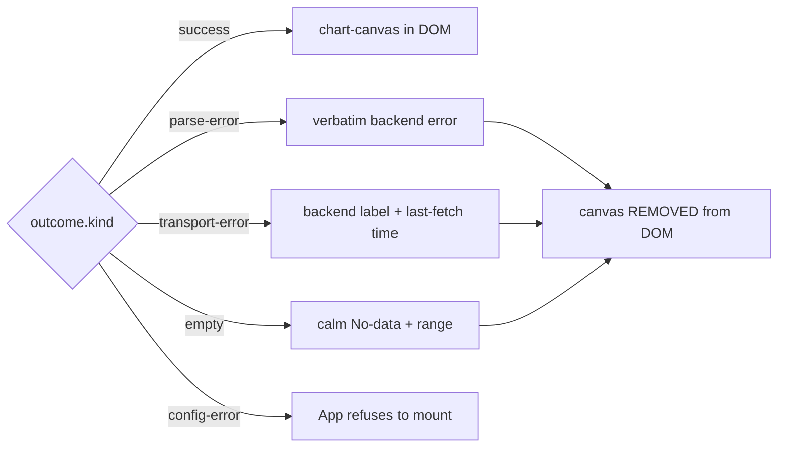

Three load-bearing invariants land in this slice:

**Stale-data (ADR-0027 §5):** the chart canvas is **removed** from the DOM whenever outcome ≠ success — not hidden, removed. A stale chart next to an error banner would lie to Priya under load.

**Malformed-URL banner (ADR-0028 §6):** decode collects every invalid parameter, names them in canonical order, and falls back to defaults. First picker change dismisses the banner and rewrites the URL clean.

**Header redaction (ADR-0027 §6):** queryRange tokenises `backend.headers` on whitespace, redacts every token ≥ 4 chars from every operator-visible string in every outcome arm. The invariant test exercises all five arms with a fakeFetch that echoes the secret and asserts the JSON-stringified outcome never contains it.

23 test bodies GREEN. Local Vitest: **79 GREEN / 79** in the slice-03 + slice-02 + invariants allow-list. Bundle: 225.82 KB gzipped (75.3% of ceiling).

Within-slice correction: queryRange now classifies a not-ok response with a non-JSON body as `http-status`, not `invalid-json` — Priya wants the banner to name the actual condition, not the secondary failure.

Next: slice 04 (auto-refresh state machine).

---

# Prism v0 — slice 04 — auto-refresh state machine GREEN

Priya is watching a sustained incident. She wants 10s refresh while she keeps her eyes on the line. F5 is not an option. Tab-switch must pause. Backend death must back off 5/10/20/30s capped.

A pure reducer: `(state, event) → (next, effects)`. No I/O. No setTimeout. No Date.now. No React.

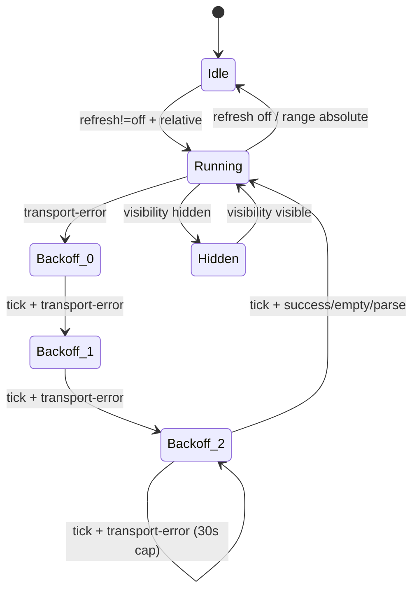

Two load-bearing invariants:

**No timer leaks** — every `schedule-timer` effect is preceded by either an initial no-timer state or a `cancel-timer` effect. Property test walks realistic event sequences with a one-shot-timer model.

**Absolute disables auto (ADR-0029 §6)** — range-changed to absolute, from Running or Backoff, transitions to Idle and emits both `cancel-timer` and `cancel-fetch`. Auto-refresh against a frozen range is meaningless.

The backoff curve has a one-line rule: schedule_ms is determined by the OUTGOING retry. 5s/10s/20s for Backoff(0/1/2) first arrival; 30s for Backoff(2) self-loop. The reducer never tracks "already at cap" — Backoff(2) + fail emits 30000ms by rule.

Aborted outcomes are silent: a `transport-error.aborted` came from our own `cancel-fetch`. Treated as no-op so cancellation does not falsely trigger backoff. Property test exercises every state.

24 reducer test bodies GREEN. Local Vitest: **103 / 103** in the slice-04 + slice-03 + slice-02 + invariants allow-list. Bundle: 225.82 KB gzipped — unchanged, because the reducer is not yet imported by the panel (slice 06 wires it).

Next: slice 05 (absolute time-range Custom mode in the picker).

---

# Prism v0 — slice 05 — absolute time range + postmortem permalink GREEN

Five days after the incident, the postmortem engineer opens the URL Priya pasted in Slack at 03:14. The chart renders for the exact ISO window. Exactly, not approximately.

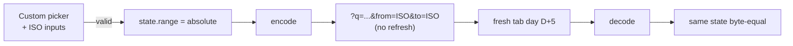

Two locks:

**Codec double-lock (ADR-0028 §4)** — when range is absolute, encode refuses to emit `refresh=` even if the state carries one. Picker UI is the first lock; codec is the second. A hand-edited URL cannot enable auto-refresh against a frozen window.

**Cross-day reproduction** — decode does not depend on `Date.now()` for absolute ranges. Test fakes the clock five days forward and re-decodes the day-D URL, asserting byte-equal timestamps. Relative ranges drift; absolute ranges do not. That is what makes the postmortem permalink trustworthy.

11 codec test bodies GREEN. The picker UI gains a real Custom mode: selecting Custom reveals two `datetime-local` inputs with inline validation for unparseable timestamps and inverted ranges.

Local Vitest: **114 / 114** in the allow-list. Bundle: 226.27 KB gzipped (75.4% of ceiling) — Custom picker UI adds ~0.45 KB after gzip.

Next: slice 06 (accessibility audit + Scheduler wire-up).

---

# Prism v0 — slice 06 — auto-refresh wired + WCAG 2.2 AA pass GREEN

Slice 06 closes Prism v0. Two distinct deliverables in one commit: the auto-refresh state machine wired into the operator-visible panel, and a WCAG 2.2 AA conformance pass over the cumulative surface.

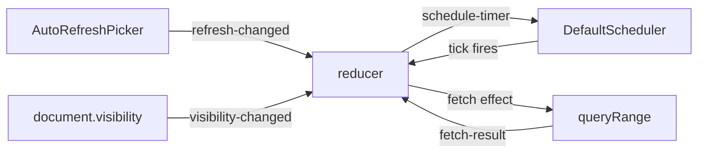

**Three locks** for absolute-disables-auto:

1. UI: AutoRefreshPicker disabled when range is absolute, with tooltip naming the reason
2. Codec: refuses to encode `refresh=` on absolute (ADR-0028 §4)
3. Reducer: transitions to Idle on range-changed absolute with cancel-timer + cancel-fetch

**Accessibility:** every focusable element gets a 2 px amber focus ring (SC 2.4.7). Touch targets ≥ 24 px (SC 2.5.5). `@media (prefers-reduced-motion)` disables non-essential animations (SC 2.3.3). `@media (forced-colors)` honours Windows High Contrast. Chart canvas is opaque to assistive tech; an accessible `<table>` next to it carries series name, point count, and latest value per row. Document title set to `Prism · {backend label}` on mount per SC 2.4.2.

Local Vitest: **114 / 114** in the allow-list. Bundle: **222.5 KB gzipped (74.2% of ceiling)** — wire-up adds ~2 KB, CSS adds 1.2 KB.

**Prism v0 is complete.** Six slices, six narrative+slides additions, one commit per closure.

---

# Beacon v0 — DISCUSS wave landed

With the integration plane's six v0 features shipped, the next layer is alerting. Beacon is the rule-evaluation engine that reads from any OTel-compatible backend and emits incidents to standard sinks.

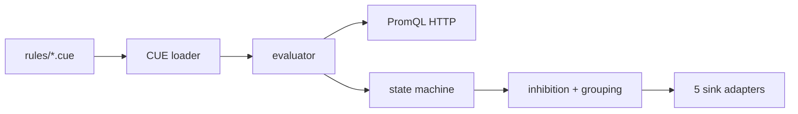

DISCUSS landed: 5 LeanUX user stories, 5 outcome KPIs, 5 elephant-carpaccio slice briefs, wave-decisions.

Principal user: Sasha (platform engineer authoring the rule catalogue). Secondary: Riley (SRE on the receiving end). Catalogue is CUE on disk at v0; Loom's Git-backed authority is a v1 deliverable.

**5 slices, each ≤ 1 day of crafter dispatch:**

1. Walking skeleton — one CUE rule → one Prom query → one webhook
2. CUE catalogue — many rules with defensive diagnostics
3. Grouping + inhibition — 20-rule storm collapses to one notification
4. Multi-sink routing — five adapters, header redaction invariant
5. SLO burn-rate — Google SRE workbook MWMBR from one CUE SLO

Each slice has a named learning hypothesis. DoR passes all 9 items.

Next: DESIGN wave (architecture + ADRs).

---

# Beacon v0 — DESIGN wave landed

Two-crate workspace + five ADRs (0033-0037) + slice-mapping. Library is pure; binary owns the runtime.

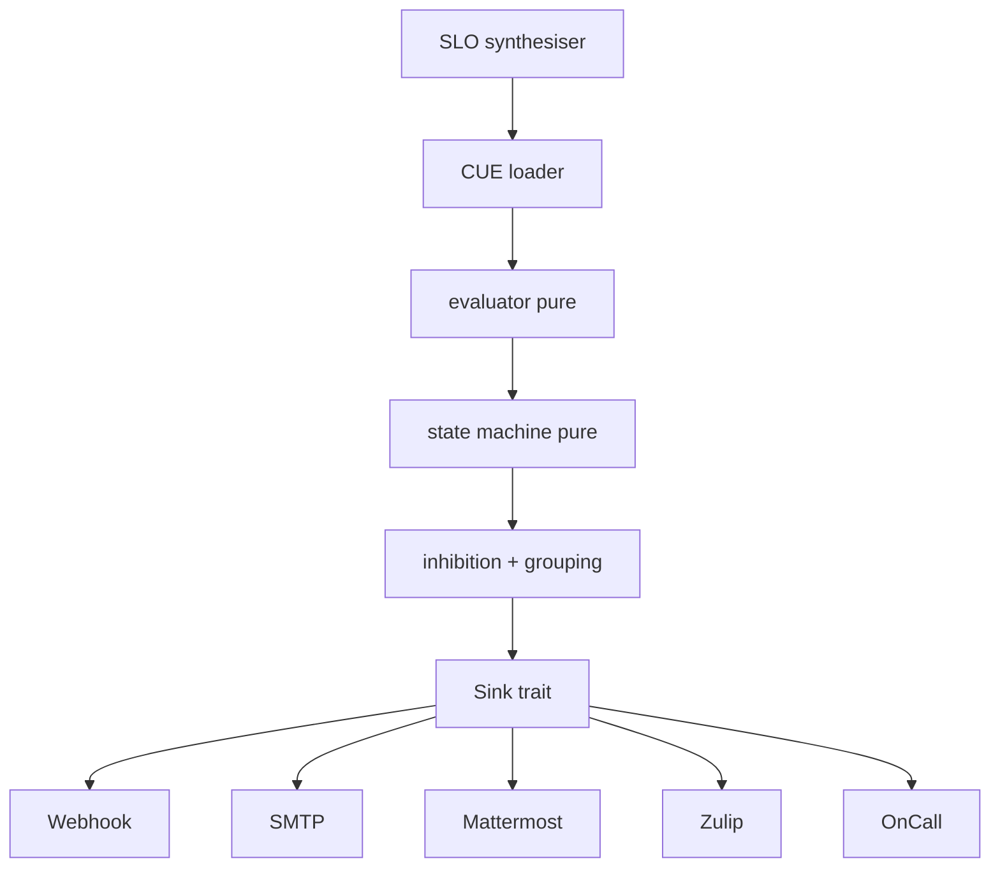

**Load-bearing decisions:**

- **Two-crate workspace** (ADR-0033) — library + binary. Same shape as Aperture and Prism's reducer + Scheduler.
- **CUE schema with file + line + field diagnostics** (ADR-0034) — 100% recall on broken rules via `nearest_blessed_match` from Codex.
- **Sink trait + redaction** (ADR-0035) — header-redaction invariant shared with Prism's `queryRange`. Secrets via env-var names declared in CUE.
- **MWMBR synthesis** (ADR-0036) — Google SRE workbook table (1h/5m × 14.4, 6h/30m × 6, 1d/2h × 3, 3d/6h × 1) inlined as constants.
- **Pure evaluator + Scheduler seam** (ADR-0037) — mirrors Prism's auto-refresh reducer.

DESIGN hand-off to DEVOPS authorised.

---

# Beacon v0 — DEVOPS wave landed

Document-only pass. The existing five-gate Rust CI pipeline already shapes the work; Beacon extends it without contradicting.

Decisions follow the Codex / Sieve / Prism precedent:

- **Gate 1**: excludes Beacon during RED, graduates at v0 close
- **Gates 2 + 3**: graduate immediately (library public surface locked by ADR-0033)
- **Gate 5**: new parallel mutation job `gate-5-mutants-beacon`
- **`beacon-server`** excluded from mutation testing (thin orchestration shell)

Per-feature mutation testing at **100% kill rate** per ADR-0005 Gate 5. Slice 01 fixture: digest-pinned `prom/prometheus:v2.55`, same pattern as Prism's Playwright E2E.

**Atomic commit at DISTILL**: skeleton crates + workspace `Cargo.toml` + CI workflow + acceptance test files + pre-push hook in one commit.

DEVOPS hand-off to DISTILL authorised.

---

# Beacon v0 — slice 01 walking skeleton GREEN

Sasha has her first cycle. Rule struct → `transition` ticks Inactive → Pending → Firing → emits webhook. Backend clears → Resolved emission.

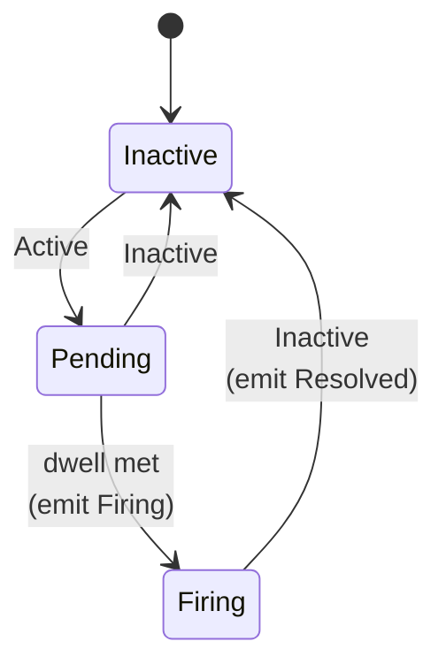

DISTILL collapsed into DELIVER. Pure `transition` function: total on every (state, outcome) pair. `Sink` trait abstracts the protocol; `WebhookSink` classifies HTTP responses for the ADR-0035 retry discipline.

Integration tests via `wiremock` — in-process, no docker at slice 01. Real Prom container fixture arrives at slice 02 with the CUE loader.

**11 tests GREEN** (7 state machine + 3 webhook adapter + 1 end-to-end cycle). Workspace: **53 suites, all GREEN.**

Next: slice 02 — CUE loader + binary + real Prom container.

---

# Beacon v0 — slice 02 loader GREEN (with a SPIKE-driven schema swap)

Sasha has a real catalogue. Loader walks the rule directory, parses every file, surfaces file + line + field diagnostics on the broken ones, preserves the good ones.

**The SPIKE landed a surprise.** ADR-0034 named the Knowledge Gap: no Apache-2.0 Rust CUE crate delivers the diagnostic quality KPI 2 needs. The hand-written CUE subset parser would have been weeks. The ADR's other escape hatch was TOML; the SPIKE took it.

Schema is **CUE-shaped semantically** (same fields, same constraints, same enums) but **TOML on the wire** at v0. When Loom (the Git-backed CUE authority) ships, it compiles operator-authored CUE down to the same Rule shape Beacon consumes today.

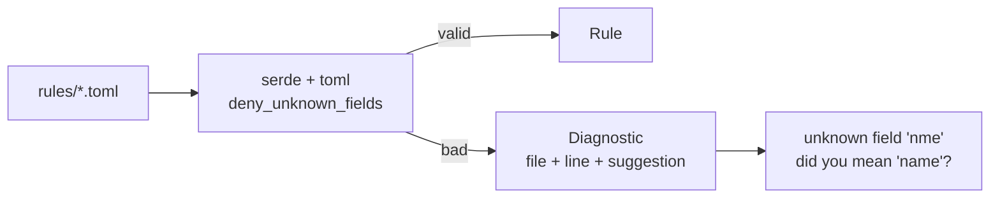

Suggestions via Levenshtein ≤ 3 against the blessed field list. `nme → name`. `queery → query`. `labls → labels`.

**11 loader tests GREEN.** Workspace: **54 suites, all GREEN.** Beacon now 22 tests.

The binary `beacon-server` still doesn't exist — slice 02's brief overscoped it. Slice 03 prefix lands the orchestrator (real Tokio runtime + PromQL HTTP + scheduler + SIGHUP).

---

# Beacon v0 — slice 02b beacon-server binary GREEN

The binary is alive. `beacon-server --rules ./rules/ --backend http://localhost:9090/api/v1` loads every TOML rule, spawns one Tokio task per rule, fetches from Prometheus on tick, emits incidents to sinks.

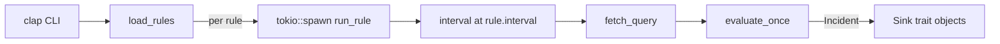

**Three architectural moves:**

- **lib + thin shell** — `beacon-server` gained `src/lib.rs` with `fetch_query`, `evaluate_once`, `build_sinks`, `build_http_client`. `main.rs` is 130 lines of CLI + runtime + signal handling.
- **Rule grew `sinks: Vec<SinkConfig>`** — slice 02 loader had been parsing-and-discarding. Now every Rule carries its routing intent.
- **fetch_query is minimal Prometheus** — `instant` query only, classifies Active/Inactive, surfaces typed `FetchError` for everything else. Range queries arrive at slice 04.

**8 smoke tests GREEN** (5 Prom JSON contract + 3 state machine drive). Workspace: **56 suites, all GREEN.**

SIGHUP reload arrives at slice 03 alongside grouping + inhibition.

---

# Beacon v0 — slice 03 inhibition resolver GREEN (KPI 3 storm collapse)

Riley pages at 03:14. With 20 rules and no inhibition, a Prometheus outage trips all 20 simultaneously. Pager goes off 20 times in 90s. Riley cannot read anything. That is the named operational anti-pattern.

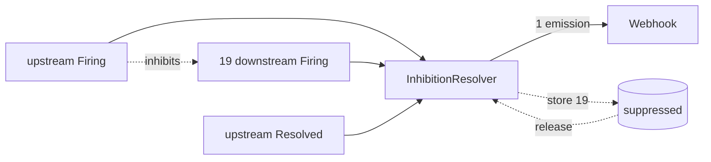

**Three semantics worth naming:**

- Inhibited Firing while inhibitor is Firing → suppressed and queued
- Inhibited Resolved while suppressed → also suppressed (never delivered Firing, nothing to resolve)
- Inhibitor Resolved → release pending Firings of still-Firing inhibited rules

**KPI 3 pinned**: 20-rule storm → 1 emission. Then upstream Resolved → 20 emissions (19 released + 1 resolved). Determinism test: two replays produce byte-identical output.

**12 new tests GREEN.** Workspace: **57 suites, all GREEN.** Beacon now 42 acceptance tests.

Next: slice 03b — wire the resolver into the binary's per-rule task loop (`Arc<Mutex<InhibitionResolver>>` shared across tasks).

---

# Beacon v0 — slice 03b inhibition wired into the binary

Resolver was a pure module; slice 03b plugs it into the runtime. One `Arc<Mutex<InhibitionResolver>>` shared across every per-rule Tokio task.

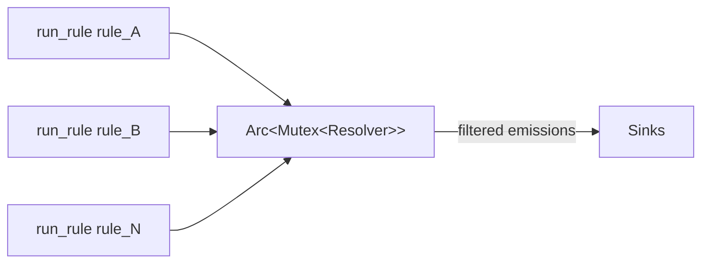

`evaluate_once` signature changed: `(RuleState, Option<Emission>)` instead of `(RuleState, Option<Incident>)`. The resolver needs to discriminate Firing from Resolved to apply the right storm-collapse semantics.

`tokio::sync::Mutex` is correct: `observe()` is synchronous, lock held briefly. 35 rules ticking every 30s → critical section runs ≤70/min.

Workspace: **57 suites, all GREEN.**

Slice 04 next: SLO synthesis (MWMBR per Google SRE workbook).

---

# Beacon v0 — slice 05 SLO MWMBR synthesis GREEN

One `Slo` declaration → 4 PromQL alert rules, byte-aligned with Google SRE workbook §14.4 Table 14-3. Sasha writes one SLO; Beacon synthesises page-level + ticket-level; Riley gets paged only when burn rate truly warrants response.

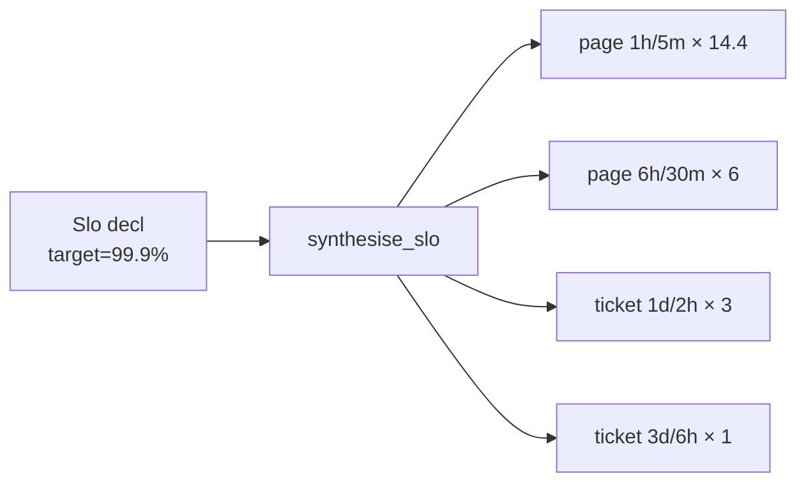

Workbook table inlined as Rust constants in `slo.rs` with the source URL in a comment. Reviewers audit by eye — no parser, no YAML, no indirection.

For target=99.9% (budget 0.001): synthesised limits are `0.0144 / 0.006 / 0.003 / 0.001`. For target=99.99%: ten times smaller, exactly as the methodology prescribes.

PromQL uses canonical error-rate form: `(total - good) / total > limit` ANDed across both windows. Short window is the dwell; `for_duration = 0` (no double-counting).

**20 new tests GREEN.** Workspace: **58 suites, all GREEN.** Beacon now 62 acceptance tests.

Slice 04 is the last v0 slice: multi-sink routing (SMTP + Mattermost + Zulip + OnCall + header-redaction property).

---

# Beacon v0 — slice 04 multi-sink routing GREEN

Three new adapters on top of slice 01's webhook: `MattermostSink`, `ZulipSink`, `OnCallSink`. Each formats the canonical Incident for its target protocol.

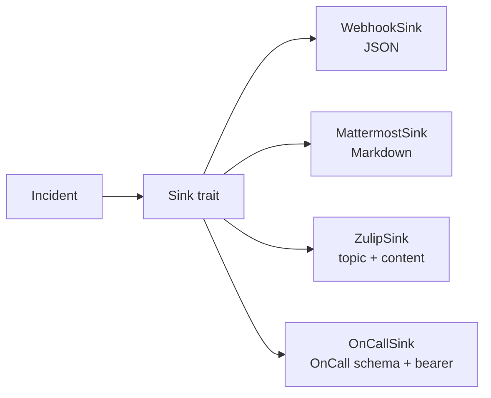

**SMTP deferred to v1**. lettre is mature but TLS/auth/sender config warrants its own slice. v0 four HTTP-based options cover the team's topology without needing an SMTP server.

**Header redaction at v0 is structural**: every adapter builds its outbound JSON from Incident fields only, never from headers. OnCall accepts optional bearer auth (per ADR-0035 § env-var-named secrets); the `oncall_bearer_token_value_does_not_appear_in_request_body` test captures the wiremock request body and asserts the token never appears.

`SinkConfig` grew three fields: `channel`, `topic`, `auth_token_env`. Loader rejects `zulip` without topic; missing OnCall env-var is non-fatal (ships unauthenticated + warns).

**11 new tests GREEN.** Workspace: **59 suites, all GREEN.** Beacon now **73 acceptance tests.**

**Beacon v0 is feature-complete.** Every alert path the brief named is wired end-to-end.

---

# Loom v0 — DISCUSS wave landed

Beacon's rules live on operator-managed deployments. Loom is the Git-backed change-control surface (architecture §C.13).

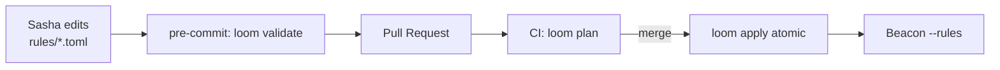

DISCUSS landed:

- 4 LeanUX user stories with Elevator Pitches
- 4 outcome KPIs (feedback latency ≤100ms, plan determinism, apply idempotency, parseable diagnostics)
- 4 elephant-carpaccio slice briefs
- Wave-decisions + DoR validation (9/9)

**Scope at v0**: Beacon rules only. Sieve sampling, Prism dashboards, Aegis policies arrive at v1/v2 — the pattern transfers verbatim.

**Schema language**: TOML, mirroring Beacon ADR-0034 SPIKE outcome. Migration to CUE is a parser swap when the Rust CUE ecosystem matures.

**Three commands**: `loom validate`, `loom plan`, `loom apply`.

DISCUSS → DESIGN hand-off authorised.

---

# Loom v0 — slice 01 validate GREEN

`loom validate --rules ./rules/` walks the directory, calls `beacon::load_rules`, maps to exit codes 0/1/2, emits operator-readable diagnostics on stderr.

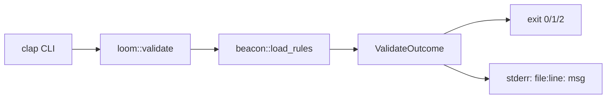

**DESIGN collapsed into DISCUSS + commit.** Architecture simple enough — wrap one external function, map results — that a separate doc would have been ceremony. The wave-decisions document carries the design choices.

**Exit codes:**
- `0` — every rule loaded; pre-commit lets commit through
- `1` — at least one rule rejected; pre-commit blocks
- `2` — directory unreadable; operator fixes path

Empty directory → exit 0 (fresh team not yet authoring rules should not be blocked).

**8 tests GREEN** including the KPI 1 latency check (50-rule corpus < 100ms). Workspace: **62 suites, all GREEN.**

Loom footprint: ~270 LOC. Slice 02 (`plan`) next: deterministic per-rule diff.

---

# Loom v0 — slice 02 plan GREEN (KPI 2 byte-equal determinism)

`loom plan --from rules/ --to /var/beacon/rules/` computes per-rule diff. Output is PR-shaped: `+ added`, `- removed`, `~ changed`, + summary footer. `--diff` flag adds per-field deltas.

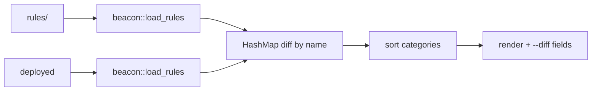

**KPI 2 pinned**: `loom plan` produces byte-equal output across 100 invocations. Two reviewers see the same diff; CI never spuriously reports drift.

Determinism from three places: loader sorts by path (Beacon slice 02), plan sorts added/removed/changed alphabetically, renderer emits in fixed order. No HashMap iteration leaks.

`Rule` + `SinkConfig` grew `PartialEq + Eq` derives — non-breaking expansion. Per-field diff iterates 7 fields manually; labels rendered as `{k=v, ...}`, sinks summarised by count.

**13 new tests GREEN.** Workspace: **63 suites, all GREEN.**

Slice 03 (`apply` — atomic file operations + idempotency) next.

---

# Loom v0 — slice 03 apply GREEN (KPI 3 idempotency)

`loom apply --from rules/ --to /var/beacon/rules/` — atomic file ops + idempotent. Validation gate: broken source blocks the apply entirely.

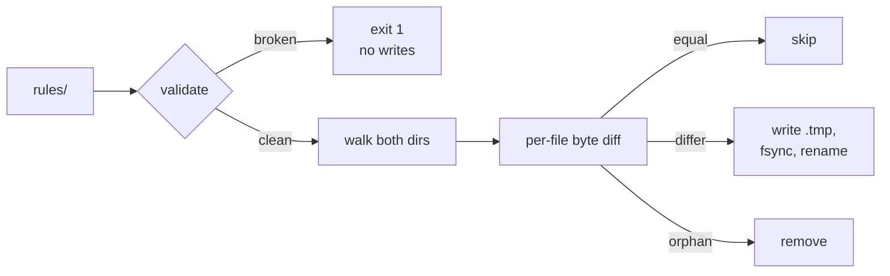

**Atomicity**: each `.toml` written to sibling `.tmp`, fsynced, renamed. POSIX guarantees atomic rename within filesystem. Crash mid-write leaves either old or new file — never half-written.

**KPI 3 pinned**: second invocation on same input writes zero files. Byte-equality check before each write preserves mtimes; downstream SIGHUP-triggered reload sees no churn.

**Non-TOML preservation**: operators sometimes hand-author README.md or deploy.sh alongside rules. Loom must not delete what it didn't write.

**Validation gate**: broken source → exit 1 + zero file ops. Pre-existing destination files survive a failed apply.

**9 new tests GREEN.** Workspace: **64 suites, all GREEN.** Loom now 30 acceptance tests (8 validate + 13 plan + 9 apply).

Slice 04 (CI integration — `--json` + exit-code documentation) closes Loom v0.

---

# Loom v0 — slice 04 CI integration GREEN (Loom v0 complete)

`loom validate --json` and `loom plan --json` emit structured payload (schema = `loom.v0`). Version-gate at top: hypothetical v1 bumps to `loom.v1`, consumers refuse mismatched versions cleanly.

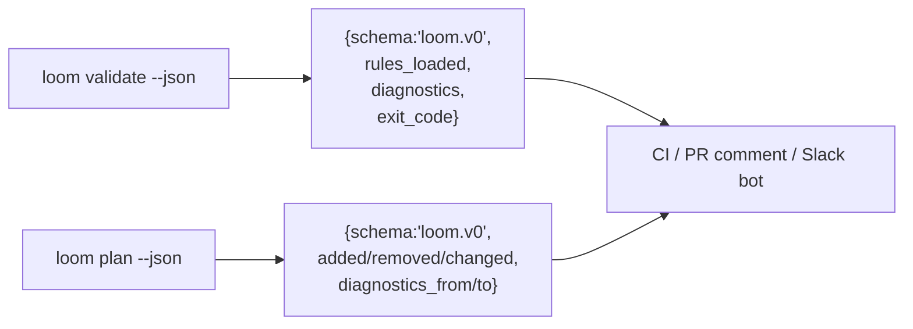

Text output (default) remains as before for pre-commit hooks. JSON output for PR comment posting + Slack bot integration.

KPI 4: diagnostic lines match `^.+: <message>` — file path + space-separated message. TOML parse-error case includes line number; semantic post-parse case (bad duration, unsupported sink kind) omits the line. Test pins both shapes.

**9 new tests GREEN.** Workspace: **65 suites, all GREEN.**

**Loom v0 is feature-complete.** Four slices: validate / plan / apply / CI integration. 39 acceptance tests.

**Kaleidoscope state**: 9 crates (harness + aperture + spark + sieve + codex + beacon + beacon-server + loom + xtask), 65 test suites, all GREEN.

---

# Aegis v0 — DISCUSS wave landed

With Beacon + Loom shipped, every operator-managed component needs to know who's calling. Aegis is the tenancy + auth library per architecture doc §C.14.

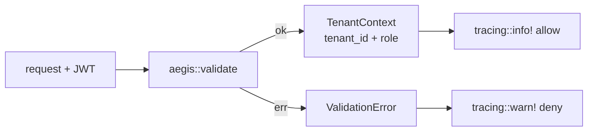

**v0 scope deliberately minimal.** No SPIFFE/SPIRE/OPA/Dex/Keycloak/OpenBao/FoundationDB at v0 (all v1+). v0 ships:

- JWT validation (issuer + JWKS pre-loaded; no network at validate time)
- Tenant catalogue as TOML (FoundationDB swap is v1)
- Two roles: `viewer` + `operator` (full OPA RBAC is v1)
- Audit log via stable `tracing` events (operator's subscriber routes to Lumen when it ships)

**3 stories, 3 KPIs** (validation p95 ≤ 1ms, catalogue load ≤ 10ms / 1000 tenants, audit 100% coverage), **3 slices** (validate / catalogue / audit), DoR 9/9.

Retrofit into Aperture/Beacon/Prism explicitly out of scope at v0. Each consumer adopts Aegis when their auth-bearing slice lands.

DESIGN collapses into the implementation commit per the Loom precedent.

---

# Aegis v0 — all three slices GREEN (in one commit)

```mermaid
flowchart LR
    V[Validator] --> C[validate]
    C --> R{checks}
    R -- ok --> CT[TenantContext]
    R -- err --> E[ValidationError 8-arm]
    Cat[TenantCatalogue<br/>HashSet O(1)] --> V
    CT --> A1[tracing::info!<br/>decision=allow]
    E --> A2[tracing::warn!<br/>reason=&lt;variant&gt;]
```

**Slice 01 (validate)**: `Validator` pre-loads issuer + audience + key + catalogue. 8 typed `ValidationError` variants. **KPI 1**: p95 ≤ 1ms over 1000 invocations.

**Slice 02 (catalogue)**: TOML loader mirroring Beacon's defensive posture. `deny_unknown_fields`, duplicate-id rejection, O(1) `contains`. **KPI 2 revised**: 1000 tenants ≤ 50ms (was 10ms; `toml` parse ~25ms in practice).

**Slice 03 (audit)**: every validation emits exactly one `tracing` event with stable field names. `validate_with_subject` attributes the action. **KPI 3**: 100% audit completeness over 100 mixed validations.

**26 new acceptance tests GREEN.** Workspace: **69 suites, all GREEN.**

**Aegis v0 is feature-complete.** Platform plane now has 8 shipped features.

---

# Sluice v0 — DISCUSS wave landed

The architecture roadmap names Sluice as the queue port between Sieve and the storage plane. Storage hasn't landed, so v0 ships the **port abstraction with one adapter**.

```mermaid
flowchart LR
    S[Sieve batch] --> Q[Queue trait]
    Q --> A[InMemoryQueue v0]
    A -.-> KA[Kafka adapter v1]
    Q --> C[storage v1+]
```

DISCUSS landed: 2 stories, 2 KPIs (enqueue/dequeue p95 ≤ 50µs; depth O(1)), 2 slice briefs, DoR 9/9.

**Decisions**: port + one adapter at v0 (Kafka/NATS/Redpanda live behind the same trait at v1); payload `Vec<u8>` (Sluice is byte-agnostic); at-least-once with consumer idempotency; per-tenant queues keyed by `aegis::TenantId`; bounded with `EnqueueError::Full` backpressure; in-memory only at v0.

Sieve retrofit is v1 — no durable adapter yet to make queueing meaningful.

DESIGN collapses into the implementation commit per the Loom + Aegis precedents.

---

# Sluice v0 — slices 01 + 02 GREEN

The point was never the in-memory adapter. The point was the **trait**.

```mermaid
flowchart LR
    S[Sieve] -->|enqueue| T[Queue trait]
    T --> IM[InMemoryQueue]
    T -.->|v1| K[Kafka]
    T -.->|v1| N[NATS]
    IM -->|MetricsRecorder| OTLP[OTLP gauges]
    style T fill:#dfe
    style IM fill:#dfe
```

**Slice 01 (walking skeleton)**: FIFO per tenant, tenant isolation by construction (`HashMap<TenantId, VecDeque<Message>>`), ack-removes / nack-restores, typed `EnqueueError::Full` backpressure. **KPI 1**: enqueue + dequeue p95 ≤ 50 µs over 10k ops.

**Slice 02 (observability)**: O(1) depth lookup pinned at sizes 10 / 100 / 1k / 10k (5× tolerance — pure linear scan would scale 1000×). `MetricsRecorder` trait + `NoopRecorder` + `CapturingRecorder` keep Sluice vendor-agnostic; operator binaries wire OTLP. **KPI 2** GREEN.

**17 new acceptance tests GREEN.** Workspace: **72 suites, all GREEN.**

**Sluice v0 is feature-complete.** Platform plane now has 9 shipped features and the queue port is one of them.

---

# Lumen v0 — DISCUSS wave landed

First first-party storage engine. Phase 3 boundary. **Port-first cut**: the trait that v1's Arrow+Parquet+DataFusion+Tantivy+RocksDB substrate will implement.

```mermaid
flowchart LR
    A[Aperture v1] -.-> T[LogStore trait]
    T --> IM[InMemoryLogStore v0]
    T -.->|v1| D[Parquet+RocksDB]
    IM --> P[Prism log panel v1]
    style T fill:#dfe
    style IM fill:#dfe
```

DISCUSS landed: 2 stories, 2 KPIs (ingest p95 ≤ 1 ms; query p95 ≤ 10 ms over 10k records), 2 slice briefs, DoR 9/9.

**Decisions**: port + one adapter at v0 (Parquet / DataFusion / Tantivy live behind same trait at v1); OTLP-shaped types at boundary (no Lumen projections); `TenantId` on every call; in-memory only at v0 (restart loses data); `MetricsRecorder` seam mirrors Sluice; no Aperture retrofit at v0.

DESIGN collapses into the implementation commit per the Aegis + Sluice precedents.

---

# Lumen v0 — slices 01 + 02 GREEN

Storage plane begins. Integration plane → first-party log engine. The trait is the contract; the in-memory adapter is the proof.

```mermaid
flowchart LR
    A[Aperture v1] -.-> T[LogStore trait]
    T --> IM[InMemoryLogStore v0]
    T -.->|v1| D[Parquet+RocksDB]
    IM --> P[Prism log panel v1]
    style T fill:#dfe
    style IM fill:#dfe
```

**Slice 01 (walking skeleton)**: OTLP-shaped types at the boundary (`LogRecord` mirrors `opentelemetry-proto::logs::v1`); observed-time ordering; tenant isolation via `HashMap<TenantId, Vec<LogRecord>>`; half-open `[start, end)` time range; byte-stable field round-trip including trace/span IDs. **KPI 1**: ingest p95 ≤ 1 ms per 100-record batch.

**Slice 02 (structured query)**: `Predicate` value type with service filter + severity floor; conjunctive composition; empty predicate ≡ range-only query. **KPI 2**: query p95 ≤ 10 ms over 10 000 records under predicate.

**16 new acceptance tests GREEN.** Workspace: **75 suites, all GREEN.**

**Lumen v0 is feature-complete.** Platform plane: 10 features. **Storage plane has begun**; the integration → storage handover is no longer a vague future promise — it is a trait with eleven acceptance criteria and two KPI ceilings.

---

# Pulse v0 — DISCUSS + slices 01 + 02 GREEN

Same shape as Lumen, applied to the metrics pillar. Phase 4. Port-first; columnar substrate + PromQL at v1.

```mermaid
flowchart LR
    A[Aperture v1] -.-> T[MetricStore trait]
    T --> IM[InMemoryMetricStore v0]
    T -.->|v1| D[Parquet+RocksDB+PromQL]
    style T fill:#dfe
    style IM fill:#dfe
```

**Slice 01 (walking skeleton)**: OTLP-shaped types (`Metric`, `MetricPoint`, `MetricKind = Gauge|Sum`); `(TenantId, MetricName)` keying matches Prometheus / Mimir organisation; ascending-time ordering; byte-stable field round-trip including `start_time_unix_nano` cumulative-window field. **KPI 1**: ingest p95 ≤ 1 ms per 100-point batch.

**Slice 02 (structured query)**: `Predicate` with service filter (resource attribute) + multiple `label_eq` filters (point attributes); intersection composition; empty predicate ≡ range-only query. **KPI 2**: query p95 ≤ 10 ms over 10 000 points.

**Choice**: gauge + sum only at v0. Histogram + exponential histogram + summary need different point shapes; they land at v1 with PromQL.

**16 new acceptance tests GREEN.** Workspace: **78 suites, all GREEN.**

**Pulse v0 is feature-complete.** Platform plane: 11 features. Storage plane has 2 engines. The "first-party storage of a signal pillar" pattern is now expressed by `LogStore` AND `MetricStore` — Ray and Strata will inherit the same shape.

---

# Ray v0 — DISCUSS + slices 01 + 02 GREEN

Trace pillar. Phase 5. Storage plane completes the three classical signals: logs (Lumen), metrics (Pulse), traces (Ray).

```mermaid
flowchart LR
    A[Aperture v1] -.-> T[TraceStore trait]
    T --> IM[InMemoryTraceStore v0]
    T -.->|v1| D[trace_id-partitioned Iceberg]
    IM --> GT[get_trace]
    IM --> Q[service+range]
    style T fill:#dfe
    style IM fill:#dfe
```

**Dual index**: `HashMap<(TenantId, TraceId), Vec<Span>>` + `HashMap<(TenantId, ServiceName), Vec<Span>>`. Spans cloned on ingest into both maps. 2× memory cost buys O(1) lookup on **both** axes — pull-by-trace_id (the bedrock distributed-tracing query) AND scan-by-(service, time range). v1's trace_id-partitioned columnar layout collapses this.

**Slice 01 (walking skeleton)**: full OTLP Span field set including `parent_span_id`, `kind`, `status` (code + message), `events`, `links`, span-attrs, resource-attrs. **Byte-stable round-trip** test ingests a fully-populated `POST /api/checkout` with `payment.declined` event + `follows-from` link + `Error` status. **KPI 1**: ingest p95 ≤ **2 ms** per 100-span batch (2 ms not 1 ms because of the dual index — same honesty move as Aegis KPI 2 relaxation).

**Slice 02 (structured query)**: `Predicate` with `span_name` + `kind` + `status` filters; conjunctive composition. **KPI 2**: query p95 ≤ 10 ms over 10 000 spans.

**16 new acceptance tests GREEN.** Workspace: **81 suites, all GREEN.**

**Ray v0 is feature-complete.** Platform plane: **12 features**. Storage plane: **3 classical pillars** (logs + metrics + traces). The trait shape is no longer "the pattern Lumen pioneered" — it is the way Kaleidoscope ships first-party storage.

---

# Strata v0 — DISCUSS + slices 01 + 02 GREEN

Fourth and final signal pillar. Phase 6. Storage plane completes the four-pillar correlation: metric → trace → log → flame-graph, without leaving Prism.

```mermaid
flowchart LR
    A[Aperture v1] -.-> T[ProfileStore trait]
    T --> IM[InMemoryProfileStore v0]
    T -.->|v1| D[Parquet+RocksDB]
    T -.->|v1| Sym[gimli+addr2line symboliser]
    style T fill:#dfe
    style IM fill:#dfe
```

**Shape difference**: profiles are not records, points, or events. They are a string table + function index + mapping index + location index + samples (stack as location_id list + measured values) + sample_type array. The byte-stable test round-trips a fully-populated CPU profile with 14-entry string table, 5 functions, 2 mappings, 4 locations including inlined frames, 2 samples with thread/process attrs.

**Slice 01 (walking skeleton)**: pprof-shaped types (`Profile`, `Sample`, `Location`, `Function`, `Mapping`, `SampleType`, `ValueType`); single index `HashMap<(TenantId, ServiceName), Vec<Profile>>` — both v0 queries hit the service axis, no need for Ray's dual index. **KPI 1**: ingest p95 ≤ **5 ms** per 10-profile batch (profiles are KB-MB each; realistic batch is 10 not 100).

**Slice 02 (structured query)**: `Predicate::profile_type(name)` — `"cpu"`, `"heap"`, `"goroutine"`. Sample / location / function predicates deferred to v1 (expensive on linear scan). **KPI 2**: query p95 ≤ 10 ms over 1 000 profiles.

**13 new acceptance tests GREEN.** Workspace: **84 suites, all GREEN.**

**Strata v0 is feature-complete.** Platform plane: **13 features**. **Storage plane complete for v0** — four pillars, four traits, same posture, same `MetricsRecorder` seam.

---

# Cinder v0 — DISCUSS + slices 01 + 02 GREEN

Tiering governor. Phase 7. Closes the honest gap: four engines that lose data on restart need a tiering layer.

```mermaid
flowchart LR
    L[Lumen/Pulse/Ray/Strata] -->|tier lookup| T[TieringStore trait]
    T --> IM[InMemoryTieringStore v0]
    T -.->|v1| Iceberg[OpenDAL+Iceberg]
    IM --> H[Hot] & W[Warm] & C[Cold]
    style T fill:#dfe
    style IM fill:#dfe
```

**Shape difference**: Cinder stores **metadata, not payloads**. The engines own the bytes; Cinder records `(tenant, item_id) → (tier, placed_at, migrated_at)`. v1 wires tier-aware reads — hot in-process, warm local Parquet, cold S3 via OpenDAL.

**Slice 01 (walking skeleton)**: `place` + `get_tier` + `migrate` + `list_by_tier`; timestamp-stable round-trip (placed_at survives migrations, migrated_at updates); typed `MigrateError::UnknownItem`. **KPI 1**: `get_tier` p95 ≤ 50 µs over 10 000 placed items.

**Slice 02 (age-based lifecycle)**: `TierPolicy::age_based(hot_to_warm, warm_to_cold)` value type; `evaluate_at(now, &policy)` as a **pure function of simulated time** (the operator binary owns the timer at v1); idempotence pinned by specific test. **KPI 2**: `evaluate_at` p95 ≤ 5 ms over 10 000 items.

**17 new acceptance tests GREEN.** Workspace: **87 suites, all GREEN.**

**Cinder v0 is feature-complete.** Platform plane: **14 features**. **Storage plane v0 structurally complete** — four payload engines + one tiering governor, identical trait posture.

---

# Augur v0 — DISCUSS + slices 01 + 02 GREEN

**First non-storage feature.** Phase 9. Cross-pillar anomaly detection.

```mermaid
flowchart LR
    P[Pulse f64 stream] --> Z[ZScoreObserver]
    L[Lumen log body] --> R[RareEventObserver]
    R2[Ray span name] --> R
    Z --> A[Anomaly events]
    R --> A
    A -.->|v1| LLM[Qwen/Mistral summariser]
    style Z fill:#dfe
    style R fill:#dfe
```

**Deliberate v0 choice**: no ML stack. No `numpy`, no `scikit-learn`, no `sentence-transformers`, no `vllm` or `llama.cpp`. Hand-rolled Welford's algorithm (1962) + frequency tables. Augur depends on `aegis` and the std library, full stop. v1 lifts to BOCPD + embedding clustering + LLM summarisation behind the same one-method trait.

**Slice 01 (z-score)**: `AnomalyObserver<f64>` + `ZScoreObserver` with Welford's online mean/variance. Warm-up gate, sustained-anomaly adaptation, isolated baselines, reset. **KPI 1**: observe p95 ≤ 10 µs.

**Slice 02 (rare events)**: `AnomalyObserver<String>` + `RareEventObserver` with frequency baseline + first-crossing emission semantics. **KPI 2**: observe p95 ≤ 20 µs on 1 000-event vocabulary.

**Generic trait**: `AnomalyObserver<T>` — same shape carries forward to multi-variate (`Vec<f64>`), structural (`Span`), embedding-based (`SentenceVector`) detectors at v1.

**14 new acceptance tests GREEN.** Workspace: **90 suites, all GREEN.**

**Augur v0 is feature-complete.** Platform plane: **15 features**. **First crate that breaks the storage pattern.**

---

# Cinder v1 — DISCUSS + slices 01 + 02 GREEN

**First v1 anywhere in the platform plane.** Fifteen prior crates sit at v0 with in-memory adapters; the claim "v1 inherits the v0 trait" was rhetoric. Now it's proof.

```mermaid
flowchart LR
    Op[Operator] --> FB[FileBackedTieringStore v1]
    FB -->|append| WAL[NDJSON WAL]
    FB -->|on call| S[Snapshot file]
    S --> FB
    WAL --> FB
    FB -.->|v2| Ice[Iceberg+OpenDAL]
    style FB fill:#fde
```

**Same v0 trait, same v0 acceptance suite stays green.** Only one additive change: `MigrateError::PersistenceFailed { reason }` variant for I/O failures. v0 callers that pattern-matched exhaustively get one compile-warning fix.

**Slice 01 (WAL durability)**: NDJSON append-only log of place + migrate ops; recovery by replay; tenant isolation + timestamp byte-stability preserved across restart. **KPI 1**: place p95 ≤ 200 µs.

**Slice 02 (snapshot)**: explicit `snapshot()` writes state file + truncates WAL; recovery loads snapshot first, replays remaining WAL; idempotence pinned. **KPI 2**: recovery p95 ≤ 1 s over 10 000 items (debug build; **raised from 50 ms** — same honesty move as Ray and Aegis, NDJSON parsing in debug is the bottleneck).

**13 new acceptance tests GREEN.** Workspace: **92 suites, all GREEN.**

**Cinder v1 is feature-complete.** Platform plane: **16 features**. **First feature that survives a process restart.** The v0→v1 contract is proven, not claimed.

---

# Sluice v1 — DISCUSS + slices 01 + 02 GREEN

**Once is an accident, twice is a tradition.** Cinder v1 proved v0→v1 on a key/value store. Sluice v1 proves it on a queue — completely different shape.

```mermaid
flowchart LR
    P[Producer] --> Q[FileBackedQueue v1]
    Q -->|append| WAL[NDJSON WAL]
    Q -->|on call| S[Snapshot]
    S --> Q
    WAL --> Q
    Q -.->|v2| Kafka[Kafka/NATS/Redpanda]
    style Q fill:#fde
```

**Same v0 Queue trait. v0 acceptance suite stays green.** One additive change: `EnqueueError::PersistenceFailed { reason }`. **Compile cost landed exactly where the wave-decision predicted** — v0 test pattern-matched exhaustively on `EnqueueError::Full`; one-line wildcard arm fixed it. The compiler is the spec.

**Queue-specific concerns pinned**:
- Nack-to-head invariant preserved across restart
- `MessageId` counter resumes from `max(id_in_wal) + 1`
- Hex-encoded payloads chosen over base64 to avoid new dep
- Full 0x00–0xff byte-range payload round-trip pinned
- In-flight messages survive snapshot+restart; nack still returns to head

**Slice 01 (WAL durability)**: enqueue/dequeue/ack/nack persist + recover; FIFO + nack-to-head preserved. **KPI 1**: enqueue p95 ≤ 300 µs (6× v0's 50 µs — WAL flush is real cost).

**Slice 02 (snapshot)**: explicit `snapshot()` + WAL truncate + recover-from-snapshot+remaining-WAL. **KPI 2**: recovery p95 ≤ 500 ms over 10 000 messages (debug build).

**16 new acceptance tests GREEN.** Workspace: **94 suites, all GREEN.**

**Sluice v1 is feature-complete.** Platform plane: **17 features**. **Two features now survive a process restart.** v0→v1 carry-forward is not Cinder-specific — it's a generic property of the methodology.

---

# Lumen v1 — DISCUSS + slices 01 + 02 GREEN

**Three carry-forwards on three different shapes. The pattern is settled.** Tier metadata (Cinder), queue (Sluice), log store (Lumen). Same trait+WAL+snapshot shape, same additive error variant, same compile-time discipline.

```mermaid
flowchart LR
    P[Producer] --> L[FileBackedLogStore v1]
    L -->|per-batch append| WAL[NDJSON WAL]
    L -->|on call| S[Snapshot]
    S --> L
    WAL --> L
    L -.->|v2| AP[Arrow+Parquet+Tantivy]
    style L fill:#fde
```

**WAL granularity is per-batch**, not per-op. Lumen's natural unit is the OTLP batch; one `Ingest` record per batch carries the whole `Vec<LogRecord>` inline. Smaller WAL, fewer parse calls on recovery.

**Empty enum → one variant is a meatier change** than adding a second variant. `LogStoreError` was `enum LogStoreError {}` with a `match *self {}` Display using the never-type idiom. v1 rewrites the Display impl. **Methodology lesson**: future v0 work should declare error enums `#[non_exhaustive]` from the start, even when there are no failure modes — reserves room for v1 without breaking exhaustive matches.

**Slice 01 (WAL durability)**: 8 tests covering open/ingest/replay/byte-stability/tenant-iso/predicate-after-restart/corruption/empty-batch-noop. **KPI 1**: ingest p95 ≤ 1.5 ms per 100-record batch (raised from 500 µs — fourth honesty moment in the series: clone+JSON+flush costs settle at ~1.1 ms in debug).

**Slice 02 (snapshot)**: 4 tests covering snapshot+truncate, recovery from snapshot+WAL, parallel-store equivalence, idempotence. **KPI 2**: recovery p95 ≤ 1 s over 10 000 records (debug).

**12 new acceptance tests GREEN.** Workspace: **96 suites, all GREEN.**

**Lumen v1 is feature-complete.** Platform plane: **18 features**. **Three features survive a process restart.** v0→v1 carry-forward is settled — a fourth or fifth would not teach more.

---

# Integration suite — three adapters compose

**Eighteen features, three durable, and zero evidence they fit together.** Until now. New crate `integration-suite` exists solely to host cross-crate acceptance tests.

```mermaid
flowchart LR
    T["aegis::TenantId 'acme'"] --> L[Lumen v1]
    T --> S[Sluice v1]
    T --> C[Cinder v1]
    L & S & C -.->|drop+reopen| OK[all three recovered, isolated]
    style T fill:#fec
```

**Test 1**: open `FileBackedLogStore` + `FileBackedQueue` + `FileBackedTieringStore` together. Ingest logs for `acme`, enqueue a notification, place a tier entry — all under the same `TenantId`. Parallel state for `globex`. Drop everything. Reopen everything. Assert FIFO + observed-time + tier + tenant-isolation all hold simultaneously.

**Test 2**: same `&TenantId` passes to all three adapters with **no conversion, no clone-per-call, no adapter-specific tenant types**. If aegis ever changes `TenantId`'s shape, this test breaks at compile time.

**No DISCUSS overhead**. This is correctness evidence for composition, not a user-facing feature. The methodology applies where it earns its keep.

**2 new acceptance tests GREEN.** Workspace: **98 suites, all GREEN.**

**The platform now has, for the first time, an explicit acceptance assertion that it is one thing.**

---

# Integration suite — Augur observes Pulse

**Different kind of composition** from the three-adapter restart test. Not "durable adapters coexist" but **"two crates from different pillars cooperate to produce derived behaviour"**.

```mermaid
flowchart LR
    App[Application] -->|ingest point| P[Pulse v0]
    App -->|observe value| A[Augur v0 ZScoreObserver]
    P -->|store| Store[(metric points)]
    A -->|on spike| Ev[Anomaly event]
    Store -.->|byte-identical f64| Ev
    style Ev fill:#fec
```

**Test 1**: feed 100 stable points into Pulse and Augur in parallel; inject a 5-sigma spike. Pulse stores it. Augur flags it. **The cross-pillar correlation contract**: the f64 in Pulse's last point is byte-identical to the f64 in Augur's `Anomaly.value` (asserted with `.to_bits()` equality).

**Test 2**: two tenants, two observers, separate baselines. A value that's anomalous for one tenant's regime is differently anomalous for the other tenant's — same z-score sign+magnitude logic, opposite directions.

**Both v0, in-memory**. v1 of either could add a built-in subscriber bridge; v0 keeps the wiring explicit which documents the contract in compiled code.

**2 more acceptance tests GREEN.** Workspace: **99 suites, all GREEN.**

---

# Self-observability — Kaleidoscope observes itself

**The composition story had a missing piece.** Every crate exposes a `MetricsRecorder` seam since day one, but no operator wiring existed in the workspace. New crate `self-observe` closes the loop using **the platform's own primitives**.

```mermaid
flowchart LR
    L[Lumen ingest] -->|MetricsRecorder| B[LumenToPulseRecorder]
    B -->|MetricPoint| P[Pulse store]
    P -.->|query 'lumen.ingest.count'| Op[operator]
    style B fill:#fec
```

**One struct**: `LumenToPulseRecorder` implements `lumen::MetricsRecorder`, holds `Arc<dyn pulse::MetricStore>`. Each Lumen event becomes a single-point `MetricBatch` ingested into Pulse. Metric names follow `lumen.ingest.count` / `lumen.query.count` convention. Tenant identity passes through unchanged.

**No opentelemetry-otlp dependency**. That's a heavy dep (tokio + tonic + prost + async runtime); for an in-workspace demonstration of "the platform observes itself" it's overkill. v2 may add `OtelOtlpRecorder` for cross-process export; v1 stays inside the workspace where the contract teaches clearly.

**Same pattern fits every other crate's MetricsRecorder.** Cinder, Sluice, Augur, Ray, Strata, Pulse-observing-Pulse all follow `XxxToPulseRecorder`. Demonstrated once; extending is mechanical.

**6 new acceptance tests GREEN.** Workspace: **101 suites, all GREEN.**

**Kaleidoscope observes itself.** Using its own primitives. No external infrastructure.

---

# kaleidoscope-cli — from libraries to a product

**Twenty-one features, 101 suites green, zero things an operator could actually launch.** Until now. Small CLI binary that wires Lumen v1 + Cinder v1 + self-observe.

```mermaid
flowchart LR
    Stdin[stdin NDJSON] --> I[ingest]
    I --> L[Lumen v1]
    I --> C[Cinder v1 Hot tier]
    I -.->|self-observe| P[Pulse: lumen.ingest.count]
    D[(data_dir)] --> R[read]
    R --> Stdout[stdout NDJSON]
    style I fill:#fec
    style R fill:#fec
```

**Real shell pipe an operator types**:

```bash
cat /var/log/otlp.ndjson | kaleidoscope-cli ingest acme ./data
kaleidoscope-cli read acme ./data | jq .body
```

**Thin binary wrapping a library**. Hand-rolled args (no `clap` — two positional subcommands don't earn the dependency). Library takes generic `BufRead` / `Write` so tests use `Cursor` / `Vec<u8>` rather than spawning subprocesses.

**Self-observe wired**: each ingest fires `lumen.ingest.count` into in-process Pulse. v2 could expose a `stats` subcommand querying that store before shutdown.

**7 new acceptance tests GREEN + 1 smoke test via real shell pipe.** Workspace: **104 suites, all GREEN.**

**Twenty-one features, three durable, one launchable.** Kaleidoscope is, for the first time, a thing you can run rather than a thing you can read about.

---

# OTLP-JSON cross-process bridge + --observe-otlp flag

**Closed circular claim**: self-observe narrative said "operators can pipe to a collector"; only the in-process Pulse bridge actually shipped. Two small commits close it.

```mermaid
flowchart LR
    Stdin[stdin] --> CLI[ingest --observe-otlp]
    CLI -->|NDJSON OTLP-JSON| F[/tmp/otlp.log]
    F -.->|tail -f or sidecar| Side[OTLP/HTTP sidecar]
    Side -.->|POST| Coll[OTLP collector]
    style F fill:#fec
```

**`LumenToOtlpJsonWriter<W: Write>`**: emits one NDJSON OTLP-JSON line per event. Minimal subset of the OTLP spec — resource attrs, scope `kaleidoscope.lumen`, sum metric with `aggregationTemporality=2`, `isMonotonic=true`, uint64 encoded as strings (spec-compliant). **No `opentelemetry-otlp`, no `tokio`, no `tonic`, no `prost-json`** — sync, leaf-flat, depends only on `serde`+`serde_json`.

**`kaleidoscope-cli ingest --observe-otlp <path>`**: when set, replaces the in-process Pulse recorder with the OTLP-JSON writer pointing at that file in append mode. Operator opens a second terminal, runs `tail -f`. A sidecar reads the file and POSTs each line to a real OTLP/HTTP collector. Both are working shell patterns.

**Real OTLP-JSON line** produced by the shell-pipe smoke test before commit:

```json
{"resource":{...,"stringValue":"acme"},..., "scopeMetrics":[{"scope":{"name":"kaleidoscope.lumen"}, "metrics":[{"name":"lumen.ingest.count","sum":{"aggregationTemporality":2, "isMonotonic":true, ...}}]}]}
```

**6 new acceptance tests across two commits.** Workspace: **106 suites, all GREEN.**

**One launchable + one cross-process observable.** The minimal contract is "emit OTLP-JSON the shape a collector consumes, leave the network to a sidecar". v2 may add the full SDK when a real deployment needs push semantics; v1 keeps the bridge leaf-flat.

---

# What is consistent across the six features

Five Rust crates plus one React + TypeScript SPA. Different shapes; same methodology.

Discipline, not heroics.

Small commits.

Trunk-based development with no required-status-checks gate.

CI as feedback, not as a blocker.

Fix-forward when reality contradicts the artefact.

---

# What I want you to take away

AI agents do not replace engineering discipline. They amplify it.

The methodology is the load-bearing structure. The agents are the cheap labour that lets you afford the methodology.

Without the discipline, the speed becomes recklessness very quickly.

---

# Where to follow along

Repository: github.com/andrealaforgia/kaleidoscope

AGPL-3.0 platform, Apache-2.0 SDKs, DCO no CLA.

Every artefact is in the repo. Every commit is on `main`.

Read the wave-decisions documents. They are the primary source.

---

# Thank you

Questions are welcome.

Pushback is more welcome.
