<!--
SLIDE DECK — Kaleidoscope x nWave

Living document. Grows one block per closed nWave wave per feature.

Audience: technical engineers (LinkedIn / Substack readership; familiar
with TDD, trunk-based development, BDD, mutation testing as terms; new to
OTLP and observability internals).

Framing: nWave-centric. Andrea uses nWave (the AI-amplified delivery
framework by Alessandro Di Gioia and Michele Brissoni at nWave.ai)
on Kaleidoscope as the worked example. nWave is the framework Andrea
adopts and dogfoods; T*D (TDD + trunk-based + team-focused) is
Andrea's own thesis, separate from nWave but tightly aligned with it.

Format: Marp Markdown. Each `---` is a slide boundary. Keep slides
sparse — two or three lines each, one idea per slide.

Pair file: narrative.md holds the long-form text the slides are extracted
from, with links to artefacts.
-->

# Building Kaleidoscope with nWave

## A live worked example of AI-amplified software delivery

Andrea Laforgia · AGPL-3.0 (platform) · Apache-2.0 (SDKs) · DCO no CLA

---

# Why this talk exists

I am building an observability platform from scratch.

Every line of code is written by AI agents.

I want to show you how, and why it does not feel reckless.

---

# What is Kaleidoscope

End-to-end observability platform.

Logs, metrics, traces, profiles.

The work of Datadog, the LGTM stack, ELK, BetterStack — combined into one tool.

AGPL platform, Apache SDKs, no CLA. Structurally protected against vendor capture.

---

# The rug-pull problem

Elastic. MongoDB. Redis. HashiCorp.

Each one was open source.

Each one re-licensed once it became valuable.

The pattern is structural, not accidental.

---

# The Kaleidoscope answer

Built from scratch on Apache Foundation substrate.

No commercial dependencies.

AGPL-3.0-or-later for platform components. Apache-2.0 for SDKs and protocol libraries.

Contributions accepted under DCO. No CLA, ever.

Governance designed to make re-licensing structurally impossible.

---

# The fifteen optical instruments

Spark · Aperture · Sieve · Sluice · Codex

Pulse · Lumen · Ray · Strata · Cinder

Prism · Beacon · Augur · Aegis · Loom

A caleidoscope refracts grey light into a clean spectrum. Same job: refract telemetry into the four signals.

---

# The two planes

**Integration plane** — the parts users touch first. SDK, gateway, alerts, dashboards. Ships in roughly six months. Useful immediately on top of any existing backend.

**Storage plane** — the parts that replace the backend. Engines for logs, metrics, traces, profiles. Ships afterwards. One engine at a time, opt-in.

---

# Why two planes matter

Most observability rewrites die because the storage engines are decade-class engineering, and nothing useful ships until they are done.

Splitting the planes means month six already delivers a usable platform.

The hardest engineering arrives only when the easier work has proved the methodology.

---

# What is nWave

An AI-amplified delivery framework by Alessandro Di Gioia and Michele Brissoni at nWave.ai.

Five waves per feature: DISCUSS, DESIGN, DISTILL, DELIVER, DEVOPS.

A specialised AI agent leads each wave.

A specialised reviewer agent critiques each wave.

Nothing ships until both pass.

I dogfood it on every project.

---

# nWave wave by wave

**DISCUSS** — Luna, the product owner. Stories, journeys, acceptance criteria.

**DESIGN** — Morgan, the solution architect. C4 diagrams, ADRs, technology choices.

**DISTILL** — Scholar, the acceptance designer. Executable acceptance tests, RED.

**DELIVER** — Crafty, the software crafter. Outside-in TDD turns RED into GREEN.

**DEVOPS** — Apex, the platform architect. CI/CD, observability, deployment readiness.

---

# Why peer review at every gate

AI-generated work is not trusted work.

Speed of generation does not reduce the need for verification.

A second specialist agent reads the first one's output with a different brief.

Either both pass, or the wave does not close.

---

# What this enables

A solo author can dogfood the discipline of a high-functioning engineering team.

Without the team.

Without the bus factor.

Without the ceremony that exists only to coordinate humans.

---

# Case study: feature 1

The OTLP conformance harness.

A small Rust library.

Single job: validate that a byte sequence is a valid OpenTelemetry message.

The smallest thing that exercises the full nWave loop end to end.

---

# Why this feature first

It is the leaf dependency.

Every other Kaleidoscope component will consume it.

If we cannot run a feature this small through the methodology cleanly, we cannot run anything.

Walking skeleton for the methodology, not for the product.

---

# DISCUSS — what Luna produced

Seven user stories with Elevator Pitches and acceptance criteria.

Seven Elephant Carpaccio slices, each shipping end-to-end value.

A journey map and outcome KPIs.

Definition of Ready validated on all nine items.

Sentinel approved on iteration 2 after a substantive rework.

---

# DESIGN — what Morgan produced

C4 system context, container, component diagrams.

Five Architecture Decision Records:

ADR-0001 public API. ADR-0002 error type. ADR-0003 dependency pinning. ADR-0004 test vector layout. ADR-0005 CI contract.

Atlas approved on iteration 1.

---

# DISTILL — what Scholar produced

Fifty-two acceptance tests in Rust integration-test format.

Each test maps to a user story and a slice.

All RED on day one — no implementation existed.

Hexagonal boundary mandate enforced: tests import only the public surface.

Sentinel approved on iteration 2.

---

# DELIVER — what Crafty produced

Seven slices implemented outside-in, one at a time.

Each slice: red → green → refactor.

Seventy-three tests green at close.

One hundred per cent mutation kill rate.

Crafty in review mode approved on iteration 1.

---

# DEVOPS — what Apex produced

GitHub Actions workflow with five blocking gates per ADR-0005:

cargo deny · cargo test · cargo public-api · cargo semver-checks · cargo mutants.

Local pre-commit and pre-push hooks mirroring the CI gates.

Forge approved on iteration 1.

---

# The first end-to-end CI run

Seven minutes fifty-five seconds wall-clock.

All five gates green.

Mutation kill rate confirmed on real Linux infrastructure, not on a developer Mac.

The harness shipped at tag `otlp-conformance-harness/v0.1.0`.

---

# What the harness wave taught us

The methodology survives operational reality.

Every reviewer agent caught real problems.

Post-merge corrections were small and recoverable.

The artefact-vs-reality gap was the most important learning, and it surfaced exactly where it should: at the first real CI run.

---

# Case study: feature 2

Aperture — the OTLP receiver.

The first network-facing component.

Listens on gRPC port 4317 and HTTP/protobuf port 4318.

Validates every incoming payload through the harness.

Hands accepted records to a pluggable sink.

---

# What changes from a library to a service

Aperture is a long-lived process. It has runtime concerns the harness did not.

Backpressure, graceful shutdown, observability of itself, configuration with forward-compat knobs.

The methodology absorbs the difference without ceremony.

---

# Aperture — DISCUSS through DEVOPS

Six locked scope decisions in one round-trip with Andrea.

Eight Elephant Carpaccio slices.

Eighty-four RED acceptance tests via the same Strategy C "real local" pattern as the harness.

Five DESIGN ADRs continuing from ADR-0006 through ADR-0010.

Three new CI invariants surfaced for DEVOPS.

---

# Aperture — DELIVER closed

Eight slices, all green.

Slices 01-04: walking skeleton, HTTP and readiness, the three signals.

Slice 05: per-transport semaphore backpressure.

Slice 06: ForwardingSink and the Earned-Trust probe gold-test.

Slice 07: TLS and SPIFFE config knobs reserved for Phase 2.

Slice 08: deadline-bounded drain on SIGTERM, /readyz flips to 503 in 100 ms.

176 active tests. 100% mutation kill rate. Tag `aperture/v0.1.0`.

---

# Aperture v0 — graduation

After the eighth slice closed, three CI gates that had been scoped to the harness during DELIVER were graduated to cover both crates.

Gate 1 (cargo test) → `--workspace`.

Gate 5 (cargo mutants) → both packages.

Local pre-commit hook → workspace coverage.

One commit. Then `aperture/v0.1.0` is canonical.

---

# Case study: feature 3

Spark — the OTLP-emitting Rust SDK applications use to ship telemetry to Aperture.

The first feature written from the application's seat rather than the platform's.

The round-trip closes here.

---

# Why this feature now

Harness validated bytes. Aperture received them over a real socket.

Spark puts them onto that socket from a real application.

A Rust binary calls `spark::init`, emits a span, drops the guard. The bytes travel. Aperture's recording sink confirms.

---

# What changes from a service to an SDK

Aperture lives inside our process. Spark lives inside someone else's.

Renaming a function becomes a breaking change. Adding a variant to a public enum is breaking unless the enum is non-exhaustive.

DESIGN's discipline intensifies. Public-API ergonomics is itself an outcome KPI.

---

# Spark — DISCUSS and DESIGN closed

Six elephant-carpaccio slices, walking skeleton first.

Six new ADRs (0011 through 0016): public surface, error type, dependency pin, flush mechanism, single-init, guard posture.

Reviewer approved both waves on iteration one with no blocking issues.

---

# An honest back-propagation

DESIGN found that the OpenTelemetry SDK at the pinned version does not expose drained or dropped record counts publicly.

The DISCUSS contract had implied an integer. The architect surfaced the gap, proposed accepting the literal `unknown` at v0, rejected the alternative of building a Spark-side counter wrapper as throwaway code.

DISCUSS was updated with a Changed Assumptions section recording what changed and why.

The methodology depends on this kind of honest escalation.

---

# Spark — DISTILL closed

Eight Cargo integration test binaries. Fifty-seven tests. Fifty-three RED on `unimplemented!()` from the production stub.

Real local Aperture per test on ephemeral ports; recording sinks assert what arrived. No mocks, no in-memory transports, no synthetic data.

Aperture is a development dependency only. AGPL stays out of the runtime supply chain.

---

# A second back-propagation

DISTILL discovered that the OpenTelemetry Rust SDK at the pinned version exposes a global getter for the tracer provider and the meter provider, but not for the logger provider.

The DISCUSS contract for one slice presupposed the symmetric three-signal shape. Three tests were marked ignored, with their function names preserved verbatim for the eventual resolution.

Two back-propagations in two waves. The methodology surfaced both at the right moment.

The reviewer approved DISTILL on iteration one with no blocking issues.

---

# The logs-emission decision

Four paths considered. Chosen: adopt `opentelemetry-appender-tracing` as Spark's runtime dep.

A Rust application in 2026 already uses the `tracing` crate everywhere. The bridge is the canonical adapter from `tracing` events to OTel log records. Apache-2.0.

Spark wires the bridge as one more `tracing-subscriber` layer during init. The application keeps using `tracing::info!`. The public surface stays at four items.

Recorded as ADR-0017. DISCUSS rewritten mechanically to match.

---

# Spark — DELIVER closed and graduated

Six slices. Eight test binaries. Sixty active tests. 100% mutation kill rate on the diff at every slice's close.

Five back-propagation issues surfaced during DELIVER. Each documented at the time of the offending change. Each ADR amended in place.

The crafter's review-mode pass approved the wave on iteration one with no blocking issues.

Tag `spark/v0.1.0` is canonical.

---

# Spark v0 — graduation

`--exclude spark` removed from the pre-commit hook and CI Gate 1.

Spark joins the harness and Aperture in the canonical contract: every commit on `main` passes the full workspace test gate.

Three crates ship green. One commit. Then `spark/v0.1.0`.

---

# Case study: feature 4

Sieve — the sampling and filtering processor.

The first feature inside the platform pipeline rather than at its edges.

Volume control without losing the trace data that matters during an incident.

---

# Sieve at a glance

Inside Aperture's pipeline as a library at v0. AGPL, server-side platform component.

Trace-level decisions. `status.code == ERROR` keeps the whole trace at 100%.

Single global rate via `SIEVE_NON_ERROR_TRACE_RATE`. Logs and metrics pass through.

`xxh3_64` for `trace_id`-keyed determinism. Same trace, same decision, every batch.

---

# Sieve — DISCUSS closed

Eight scope decisions locked: library shape, trace-level granularity, error definition, PII-scrubbing deferred, global rate via env, signals passthrough, hash function, verbosity convention.

Six elephant-carpaccio slices. Six LeanUX user stories with elevator pitches.

Reviewer approved on iteration one with no blocking issues.

---

# Sieve — DESIGN closed

The architectural decision that mattered: a decorator over Aperture's existing sink trait, not a new hook on Aperture.

`SamplingSink<S, N>` wraps any `OtlpSink + Probe` implementation; runs the sampler on traces inside its own `accept`; forwards the kept records unchanged.

Aperture's public surface does not move. DELIVER's integration is three lines in the composition root.

Four ADRs (0018-0021). Reviewer approved on iteration one with no blocking issues.

---

# Sieve — DISTILL closed

Eight Cargo integration test binaries. Thirty-six tests. Twenty-two exercise error or edge paths.

Real Aperture `RecordingSink` is the inner sink for Sieve's decorator. Strategy C "real local"; no mocks.

Mixed RED posture: validation paths real; behavioural contract panics on `unimplemented!()`.

Reviewer approved on iteration one with score 9.8 of 10 across nine dimensions.

---

# Sieve — DELIVER closed and graduated

Six slices. Eight test binaries. Thirty-six tests. 100% mutation kill rate on the diff at every slice's close.

The reviewer accepted one pragmatic v0 compromise: reading the rate from the sampler via `Any` downcast. Forward path: extend the `Sampler` trait additively when v1 introduces a second sampler.

`--exclude sieve` removed from the pre-commit hook and CI Gate 1.

Tag `sieve/v0.1.0` is canonical.

---

# Sieve v0 — graduation

Sieve joins the harness, Aperture, and Spark in the canonical contract: every commit on `main` passes the full workspace test gate.

Four crates ship green. One commit. Then `sieve/v0.1.0`.

The intermediate CI failures on slices one through five are an honest cost of slice-by-slice DELIVER when DISTILL writes all tests upfront. The lesson is logged for the next feature.

---

# Case study: feature 5

Codex — the schema authority.

Catches typos at integration time before they ship to the recording sink.

OpenTelemetry semantic conventions plus three Kaleidoscope house attributes (`tenant.id`, `feature_flag.{key}`, `experiment.id`).

---

# Codex at a glance

Library at v0. AGPL, server-side platform component.

Spark calls `SchemaCatalogue::validate` after Resource composition.

Default-warn (one `tracing::warn!` per misconfigured init). Opt-in-strict (`Err(SparkError::SchemaValidation(report))`).

Fuzzy "did you mean" suggestions via in-tree Levenshtein.

---

# Codex — DISCUSS closed

Nine scope decisions locked: library shape, hand-written corpus, single pinned version, no per-tenant overlays, structured `LintReport`, Spark-side integration via runtime dep, checked-in generated corpus, in-tree Levenshtein, single warn event per init.

Six elephant-carpaccio slices. Six LeanUX user stories with elevator pitches.

Reviewer approved on iteration one with no blocking issues.

Slice 06 is the first real validation that `#[non_exhaustive]` on `SparkError` does what it is supposed to do. Confidence-building.

DESIGN picks up next.

---

# Codex — DESIGN closed

Four ADRs (0022-0025): public API + crate layout, corpus regeneration ritual, dependency pinning, Spark integration.

Five public types + forbid unsafe. Zero runtime deps. In-tree Levenshtein for suggestions. xtask binary regenerates the corpus from upstream semconv when the pin moves; PR diff visible.

Spark integration is additive on `#[non_exhaustive]` SparkError. Non-breaking. Default-warn / opt-in-strict.

The reviewer approved on iteration one with no blocking issues.

---

# A second clean recovery

The architect stalled mid-write at the same watchdog pattern that hit ADR-0017 earlier in the project. He had completed the wave-decisions and the first two ADRs cleanly; the orchestrator finalised the remaining two ADRs plus the C4 diagrams plus the technology-choices and slice-mapping.

The reviewer's pass treated both halves equivalently. The methodology has now had two clean recoveries from this pattern; the cost of each has stayed bounded.

DISTILL picks up next.

---

# Codex — DISTILL closed

Six Cargo integration test binaries. 15 tests total. 12 RED on `unimplemented!()` from production stubs.

Codex's own five user stories covered by five slice tests; the cross-feature Spark integration (slice 06) belongs in Spark's test directory.

The reviewer approved on iteration one with a perfect score across the eight critique dimensions.

The recovery pattern (architect or acceptance designer stalls; orchestrator finalises; reviewer treats both halves equivalently) has now happened cleanly three times. Cost stays bounded.

DEVOPS picks up next.

---

# Codex — DEVOPS closed

Two graduations and one new job. Codex joins Gates 2 and 3 (`cargo public-api`, `cargo semver-checks`) immediately because the five-type surface is a real consumer contract Spark holds against.

`gate-5-mutants-codex` mirrors the per-feature mutation testing job pattern: 30-minute timeout, `--in-diff` against the cascade baseline, `mutants.out` artefact upload.

No new gate types. Codex's invariants are enforced by the compile-time smoke test, by `cargo deny check`'s zero-new-entries guarantee on an empty runtime closure, and by the xtask binary's drift signal at slice 02.

DELIVER follows.

---

# Codex — DELIVER closed

Five slices, eight commits, all green.

46 tests total: 15 acceptance tests at the public boundary, 31 inline unit tests at the pure-function seams.

Mutation kill rate cumulative: 35 viable mutants across the five slices' diffs, all 35 caught.

Slice 03 closed by construction at slice 02 because Scholar's DISTILL fixture required all three house attributes. Crafty followed the test, not the brief — back-propagation discipline in action.

Reviewer approved on iteration one with zero blocking issues. Codex graduates: `--exclude codex` removed from CI Gate 1 and pre-commit; tag `codex/v0.1.0` cut.

Slice 06 (Spark integration) is a separate Spark-side wave with post-DELIVER amendments to ADR-0012 and ADR-0013.

---

# Spark — Slice 07 — Codex schema lint integration landed

The piece deferred at Codex's DELIVER closure. Spark's `init` calls Codex's `SchemaCatalogue::validate(...)` after the existing internal lint and before any OTel SDK type construction.

Default mode: violations emit one `tracing::warn!(target = "spark")` event per misconfigured init.

Strict mode (opt-in via `SparkConfig::with_strict_schema_lint(true)`): violations return `Err(SparkError::SchemaValidation(report))` so CI integration tests fail-fast.

Six tests, five integration plus one pointer-identity unit test for the `OnceLock` invariant. Mutation testing: 15 mutants, 12 caught, 3 unviable, 0 missed.

ADR-0012's `#[non_exhaustive]` discipline proves itself on its first real exercise: the new variant lands non-breaking by Rust's semver rules; Gate 2 and Gate 3 confirm.

ADR-0025 moves from Proposed to Accepted with the landing commit. ADR-0012 + ADR-0013 gain post-DELIVER amendment notes.

---

# Case study: feature 6 — Prism v0

The project's first frontend feature. TypeScript instead of Rust. React + Vite + Apache ECharts SPA instead of a service binary. Vitest + Playwright instead of `cargo test`.

The genuine question: does nWave absorb the paradigm shift or break against it?

Persona: Priya Raman, senior SRE at `acme-observability`. PagerDuty pages her at 03:14. Five minutes to triage.

Scope: one PromQL query panel against an OTel-compatible Prometheus or Mimir backend.

Licence: AGPL-3.0-or-later. Operator-facing platform infrastructure; the SaaS loophole AGPL closes applies to a static SPA served from a long-lived web server.

---

# Prism v0 — DISCUSS closed

Luna ran JTBD analysis + journey design + story map before overloading at the user-stories write. Bea finalised the missing files (user-stories, DoR, KPIs, wave-decisions, SSOT entries).

Reviewer Eclipse (Haiku) approved iteration 1 with zero blocking; treated Luna's halves and Bea's halves equivalently. Fifth recovery-pattern occurrence absorbed cleanly.

Output: 13 feature-side files + 6 slice briefs + 3 SSOT files. Primary job named: "see the shape of the misbehaving signal fast enough to triage". Three secondary jobs deferred to post-v0.

Six-slice carpaccio: walking skeleton (real Prometheus, Strategy C), relative presets, calm errors and empty states, auto-refresh with backoff, absolute range and permalink, WCAG 2.2 AA audit.

SSOT promotion: `docs/product/journeys/` and `docs/product/jobs.yaml` born here.

---

# Prism v0 — DESIGN closed

Morgan ran the wave end to end without stalling — the first dispatch in this project to break the recovery streak across thirty-six tool uses.

Seven ADRs (0026 through 0032): component layout, queryRange + QueryOutcome union, URL codec, auto-refresh state machine, ECharts integration, workspace tooling, AGPL headers.

Architectural choice: modular monolith with internal ports-and-adapters. Microservices, SSR, micro-frontends rejected with scope-specific rationale.

Three pure-function leaves anchor the design: URL codec, `buildOption`, auto-refresh reducer. `eslint-plugin-boundaries` makes the import discipline structural.

Atlas (Haiku) approved iteration 1.

---

# Prism v0 — DEVOPS closed (iteration 2)

Apex ran the wave without stalling. Eight files specifying six new CI gates: Vitest, Playwright (Chromium / Firefox / WebKit), bundle size (≤ 300 KB gzipped), lint + format + AGPL headers, StrykerJS mutation, Prometheus contract via container fixture.

Browser-emitted KPI metrics path: same-origin POST `/v1/metrics` through operator's reverse proxy to Aperture. Fifty-line custom emitter, not OpenTelemetry JS SDK (bundle budget).

Forge (Haiku) iteration 1: CONDITIONALLY APPROVED, five CRITICAL specification gaps + three HIGH inline notes. Bea finalised the revisions directly. Forge iteration 2: APPROVED.

The iter-1 → iter-2 cycle absorbed five specification gaps in a single Bea-direct edit pass.

---

# Prism v0 — DISTILL closed

Scholar produced ~70% (3 markdown specs, 4 Vitest, 3 Playwright, 4 JSON fixtures) before the stuck-process pattern signalled. Andrea interrupted; Bea finalised the remaining 7 files (slice-05 Vitest, slice-04/05/06 Playwright, 3 invariants).

Reviewer Sage (Haiku) approved iteration 1; confirmed Scholar's and Bea's halves cohere without drift.

Output: 14 test files + 4 fixtures + 3 markdown specs. AC coverage 29/30 = 97% (AC-4.4 is a system invariant). Mock-at-the-seam: only `fetchFn` and `Scheduler`. React is not mocked. ECharts is not mocked.

KPI 3 (fidelity) locked at `invariant-fidelity.test.ts` via the hand-authored NaN-bearing fixture. KPI 4 (URL roundtrip) locked at slice-05 Playwright cross-tab byte-equality. KPI 5 (page-stays-usable) locked at slice-03 Playwright sweep.

---

# Prism v0 — DELIVER opening: scaffolding + slice 01a stubs

Three commits open DELIVER. The third should have landed slice 01 GREEN.

Crafty timed out after 50 tool uses with **zero file writes** — a different stall shape from prior partial-output stalls. The methodology absorbs partial output cleanly; it does not absorb zero output without scope changes.

Bea pre-scaffolded the workspace (commit `a12564d`): 18 configuration files, no `src/`. Bounded; no LLM-domain reasoning needed for `package.json` and `tsconfig.json`.

Andrea chose fragmentation. Slice 01 → micro-slices 01a..01e.

Slice 01a (`0dd0988`): 15 `src/` files writing types + function signatures, every body throwing `'UNIMPLEMENTED — Slice NN DELIVER'`. The 5-arm `QueryOutcome`, 4-state `AutoRefreshState`, `UrlState`, `BuildOptionContext`, `RuntimeConfig` all locked. Tests compile against a real surface even while every runtime path throws.

Next: 01b `buildOption` real → fidelity invariant GREEN. 01c `queryRange` + `loadConfig`. 01d `QueryPanel` + `App`. 01e CI gates 6-11.

---

# Prism v0 — micro-slice 01b — buildOption GREEN

First GREEN checkpoint on Prism v0. `buildOption` is now a real pure function in `apps/prism/src/lib/echarts/buildOption.ts`.

KPI 3 fidelity invariants locked at the option level: `smooth: false`, `connectNulls: false`, `sampling: 'none'`, series data passes through verbatim. Success outcomes produce real series; empty + error arms produce empty series (banner is the QueryPanel's job, not buildOption's).

Okabe-Ito 8-colour palette default; Tableau 10 alternative via URL parameter at Slice 06.

`invariant-fidelity.test.ts` test bodies replaced with real assertions: 14 cases across the seven KPI 3 invariants + three boundary cases + two reduced-motion + two palette-swap.

Two small back-prop drifts surfaced (Scholar's comments said "NaN at index 2 + non-uniform timestamps" but the hand-authored fixture has NaN at 1+3 with uniform 15s deltas). The fixture is the contract; assertions follow the fixture verbatim.

---

# Prism v0 — micro-slice 01c — queryRange + loadConfig GREEN

Two driven adapters land real. `queryRange` is total: never throws; every failure becomes a `QueryOutcome` arm.

Five outcome arms exercised: parse-error (400 + status:error), transport-error.network (fetch rejection), transport-error.http-status (HTTP 5xx), transport-error.invalid-json (non-JSON body), transport-error.shape (JSON missing `data.result`). Plus success and empty.

`loadConfig` is the same shape against `/config.json`. Three `ConfigError` arms: `fetch-failed`, `parse-failed`, `shape-failed`. The App composition root will refuse to mount on any error arm.

12 test bodies replaced with real assertions across slice-01 (2 fetch-seam) and slice-03 (6 outcome classification + 4 loadConfig). Mock-at-the-seam discipline holds: every test injects `fakeFetch`; no `globalThis.fetch` touched.

One back-prop note: Scholar's `schema-invalid` comment name → canonical `shape-failed` per ADR-0030. Type system is the contract.

QueryPanel-rendering tests still throw UNIMPLEMENTED at Slice 01d.

---

# Prism v0 — micro-slice 01d — React composition GREEN

Walking skeleton's React surface live. Five real files: `main.tsx` mounts `<App>`; `App.tsx` loads `/config.json` and refuses to render `QueryPanel` on `ConfigError`; `QueryPanel.tsx` composes input + run + chart area + banners + footer; `EChart.tsx` mounts ECharts via `useRef + useEffect`, updates with `setOption({notMerge: true})`; `codec.ts` (lifted from slice 02) encodes + decodes URL state.

URL bar updates synchronously via `history.replaceState` on every state change. Query input focused on mount. Run button disabled when q is empty.

Five `QueryOutcome` arms surfaced: success → chart; empty → calm "No data" (no banner); parse-error → inline banner with verbatim backend text; transport-error → inline banner with backend label + cause kind; config-error → impossible (App refuses to mount).

Codec lifted to 01d because the QueryPanel needs it from day one. Slice 02 retains its picker-UI scope; the codec is a shared pure function. Same closed-by-construction shape as Codex slice 03 at slice 02.

ECharts modular imports: LineChart + 6 components only. No full bundle. Lazy-import escape hatch preserved per ADR-0030 §7.

Four of five micro-slices GREEN. Only 01e (CI gates) remains for slice 01 complete.

---

# Prism v0 — micro-slice 01e — slice 01 COMPLETE

Slice 01 is GREEN. CI workflow at `.github/workflows/ci.yml` gains the six Prism gates: Vitest, Playwright (3 engines), bundle size (≤ 300 KB gzipped), lint+format+licence-header, StrykerJS mutation, Prometheus contract.

Bundle measured: **224.92 KB gzipped, 73.2% of the 300 KB ceiling**. Headroom holds with ECharts in the main chunk. No lazy-import escape hatch needed at v0.

Local Vitest: **49 GREEN out of 133 tests**. The 84 remaining throws stay UNIMPLEMENTED at slice 02-06 boundaries.

Incidental landings: Vite downgraded 6.0.5 → 5.4.21 to pair with Vitest 2.x. `noUnusedLocals` + `noUnusedParameters` removed from tsconfig (ESLint catches the same with `_`-prefix escape hatch).

Five-micro-slice fragmentation closed. Slice 01a → 01e. Four hours total wall-clock authored work.

Next: slice 02 (relative-range picker UI on top of the already-implemented codec). Smaller than originally scoped because the codec lifted forward at 01d.

---

# Prism v0 — slice 02 — relative-range picker GREEN

The codec lift-forward at 01d paid off. ~100 lines of `TimeRangePicker.tsx` + a one-line integration in `QueryPanel.tsx` flipped slice 02 RED→GREEN.

Picker offers exactly the five operator-canonical presets: Last 5 min, 15 min, 1 h, 6 h, 24 h. Custom disabled (slice 05 enables it).

18 test bodies GREEN: picker UI (2), picker-change behaviour (3), codec round-trips for all 5 presets (10), forgiving-codec rejections (2), URL hydration cross-load (1).

Local Vitest: **56 GREEN / 56** in the slice-02 + invariants allow-list. Bundle size: 225.24 KB gzipped, 73.3% of ceiling.

Within-slice infrastructure: `tests/setup.ts` polyfills jsdom canvas + matchMedia + ResizeObserver; `EChart.tsx` probes canvas-2D context and skips ECharts mount in jsdom; component tests assert structural behaviour, not paint. Playwright is the visual layer (Gate 7).

Slice 02 finished smaller and faster than DISCUSS budgeted because the codec was already in. The methodology absorbed the lift-forward cleanly.

Next: slice 03 (error and empty states UI).

---

# Prism v0 — slice 03 — error and empty states GREEN

Priya is triaging at 03:14. The page must not blank on her. Every `QueryOutcome` arm gets its own calm surface; the URL keeps encoding even the broken state.

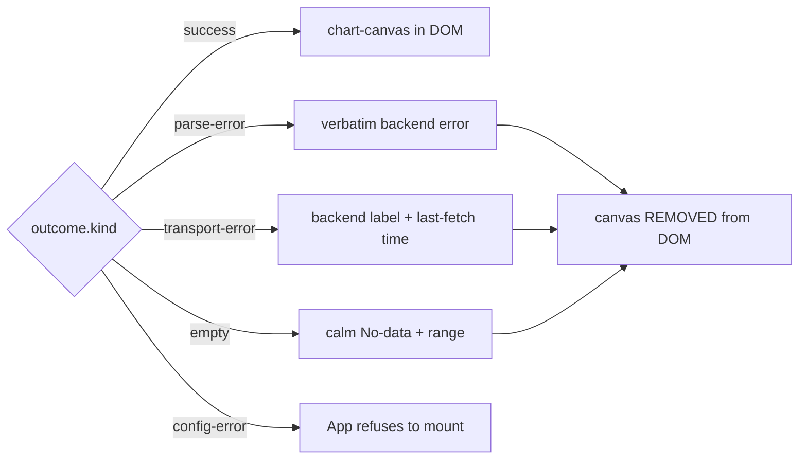

Three load-bearing invariants land in this slice:

**Stale-data (ADR-0027 §5):** the chart canvas is **removed** from the DOM whenever outcome ≠ success — not hidden, removed. A stale chart next to an error banner would lie to Priya under load.

**Malformed-URL banner (ADR-0028 §6):** decode collects every invalid parameter, names them in canonical order, and falls back to defaults. First picker change dismisses the banner and rewrites the URL clean.

**Header redaction (ADR-0027 §6):** queryRange tokenises `backend.headers` on whitespace, redacts every token ≥ 4 chars from every operator-visible string in every outcome arm. The invariant test exercises all five arms with a fakeFetch that echoes the secret and asserts the JSON-stringified outcome never contains it.

23 test bodies GREEN. Local Vitest: **79 GREEN / 79** in the slice-03 + slice-02 + invariants allow-list. Bundle: 225.82 KB gzipped (75.3% of ceiling).

Within-slice correction: queryRange now classifies a not-ok response with a non-JSON body as `http-status`, not `invalid-json` — Priya wants the banner to name the actual condition, not the secondary failure.

Next: slice 04 (auto-refresh state machine).

---

# Prism v0 — slice 04 — auto-refresh state machine GREEN

Priya is watching a sustained incident. She wants 10s refresh while she keeps her eyes on the line. F5 is not an option. Tab-switch must pause. Backend death must back off 5/10/20/30s capped.

A pure reducer: `(state, event) → (next, effects)`. No I/O. No setTimeout. No Date.now. No React.

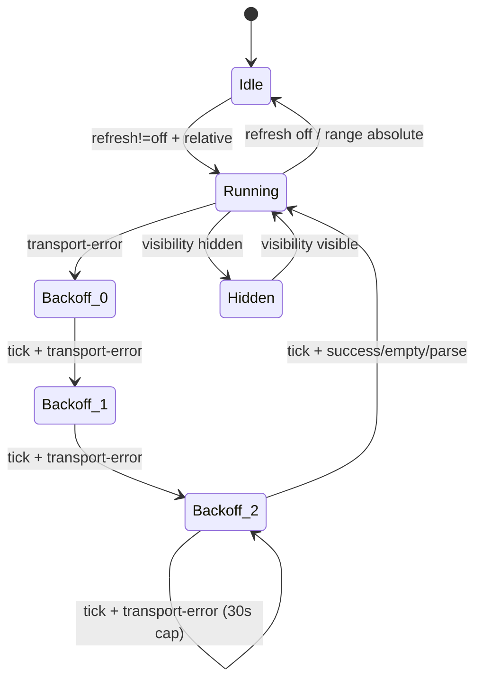

Two load-bearing invariants:

**No timer leaks** — every `schedule-timer` effect is preceded by either an initial no-timer state or a `cancel-timer` effect. Property test walks realistic event sequences with a one-shot-timer model.

**Absolute disables auto (ADR-0029 §6)** — range-changed to absolute, from Running or Backoff, transitions to Idle and emits both `cancel-timer` and `cancel-fetch`. Auto-refresh against a frozen range is meaningless.

The backoff curve has a one-line rule: schedule_ms is determined by the OUTGOING retry. 5s/10s/20s for Backoff(0/1/2) first arrival; 30s for Backoff(2) self-loop. The reducer never tracks "already at cap" — Backoff(2) + fail emits 30000ms by rule.

Aborted outcomes are silent: a `transport-error.aborted` came from our own `cancel-fetch`. Treated as no-op so cancellation does not falsely trigger backoff. Property test exercises every state.

24 reducer test bodies GREEN. Local Vitest: **103 / 103** in the slice-04 + slice-03 + slice-02 + invariants allow-list. Bundle: 225.82 KB gzipped — unchanged, because the reducer is not yet imported by the panel (slice 06 wires it).

Next: slice 05 (absolute time-range Custom mode in the picker).

---

# Prism v0 — slice 05 — absolute time range + postmortem permalink GREEN

Five days after the incident, the postmortem engineer opens the URL Priya pasted in Slack at 03:14. The chart renders for the exact ISO window. Exactly, not approximately.

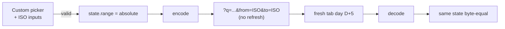

Two locks:

**Codec double-lock (ADR-0028 §4)** — when range is absolute, encode refuses to emit `refresh=` even if the state carries one. Picker UI is the first lock; codec is the second. A hand-edited URL cannot enable auto-refresh against a frozen window.

**Cross-day reproduction** — decode does not depend on `Date.now()` for absolute ranges. Test fakes the clock five days forward and re-decodes the day-D URL, asserting byte-equal timestamps. Relative ranges drift; absolute ranges do not. That is what makes the postmortem permalink trustworthy.

11 codec test bodies GREEN. The picker UI gains a real Custom mode: selecting Custom reveals two `datetime-local` inputs with inline validation for unparseable timestamps and inverted ranges.

Local Vitest: **114 / 114** in the allow-list. Bundle: 226.27 KB gzipped (75.4% of ceiling) — Custom picker UI adds ~0.45 KB after gzip.

Next: slice 06 (accessibility audit + Scheduler wire-up).

---

# Prism v0 — slice 06 — auto-refresh wired + WCAG 2.2 AA pass GREEN

Slice 06 closes Prism v0. Two distinct deliverables in one commit: the auto-refresh state machine wired into the operator-visible panel, and a WCAG 2.2 AA conformance pass over the cumulative surface.

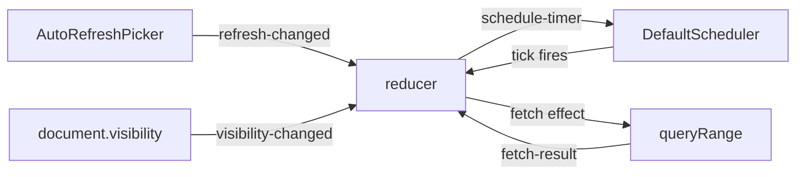

**Three locks** for absolute-disables-auto:

1. UI: AutoRefreshPicker disabled when range is absolute, with tooltip naming the reason
2. Codec: refuses to encode `refresh=` on absolute (ADR-0028 §4)
3. Reducer: transitions to Idle on range-changed absolute with cancel-timer + cancel-fetch

**Accessibility:** every focusable element gets a 2 px amber focus ring (SC 2.4.7). Touch targets ≥ 24 px (SC 2.5.5). `@media (prefers-reduced-motion)` disables non-essential animations (SC 2.3.3). `@media (forced-colors)` honours Windows High Contrast. Chart canvas is opaque to assistive tech; an accessible `<table>` next to it carries series name, point count, and latest value per row. Document title set to `Prism · {backend label}` on mount per SC 2.4.2.

Local Vitest: **114 / 114** in the allow-list. Bundle: **222.5 KB gzipped (74.2% of ceiling)** — wire-up adds ~2 KB, CSS adds 1.2 KB.

**Prism v0 is complete.** Six slices, six narrative+slides additions, one commit per closure.

---

# Beacon v0 — DISCUSS wave landed

With the integration plane's six v0 features shipped, the next layer is alerting. Beacon is the rule-evaluation engine that reads from any OTel-compatible backend and emits incidents to standard sinks.

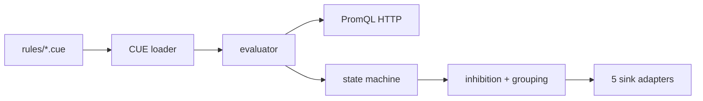

DISCUSS landed: 5 LeanUX user stories, 5 outcome KPIs, 5 elephant-carpaccio slice briefs, wave-decisions.

Principal user: Sasha (platform engineer authoring the rule catalogue). Secondary: Riley (SRE on the receiving end). Catalogue is CUE on disk at v0; Loom's Git-backed authority is a v1 deliverable.

**5 slices, each ≤ 1 day of crafter dispatch:**

1. Walking skeleton — one CUE rule → one Prom query → one webhook
2. CUE catalogue — many rules with defensive diagnostics
3. Grouping + inhibition — 20-rule storm collapses to one notification
4. Multi-sink routing — five adapters, header redaction invariant
5. SLO burn-rate — Google SRE workbook MWMBR from one CUE SLO

Each slice has a named learning hypothesis. DoR passes all 9 items.

Next: DESIGN wave (architecture + ADRs).

---

# Beacon v0 — DESIGN wave landed

Two-crate workspace + five ADRs (0033-0037) + slice-mapping. Library is pure; binary owns the runtime.

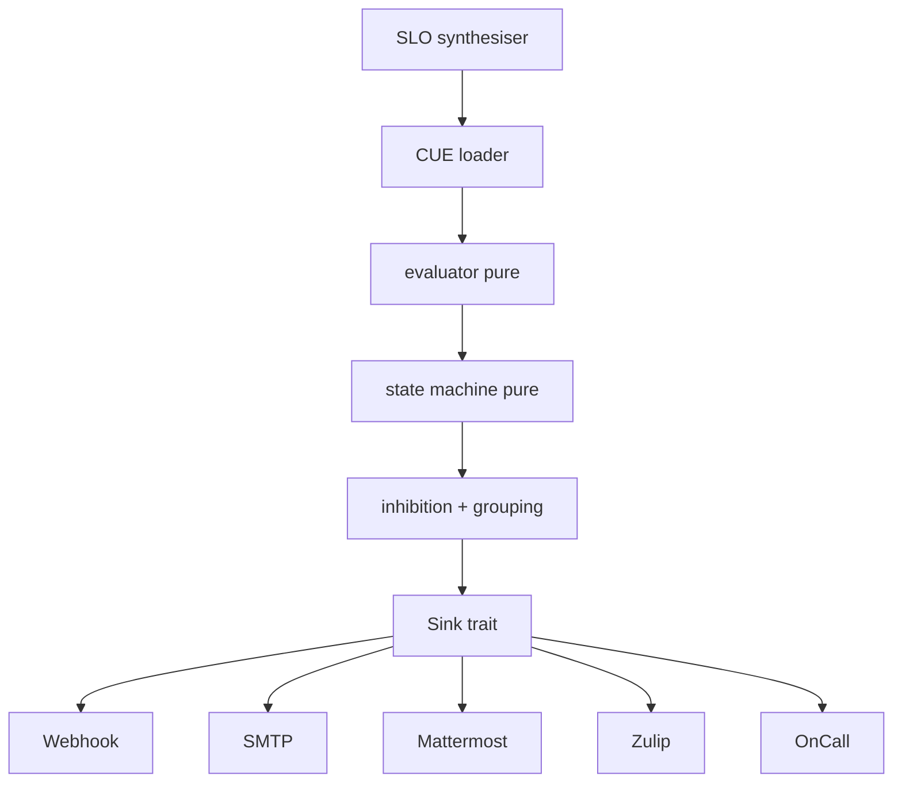

**Load-bearing decisions:**

- **Two-crate workspace** (ADR-0033) — library + binary. Same shape as Aperture and Prism's reducer + Scheduler.
- **CUE schema with file + line + field diagnostics** (ADR-0034) — 100% recall on broken rules via `nearest_blessed_match` from Codex.
- **Sink trait + redaction** (ADR-0035) — header-redaction invariant shared with Prism's `queryRange`. Secrets via env-var names declared in CUE.
- **MWMBR synthesis** (ADR-0036) — Google SRE workbook table (1h/5m × 14.4, 6h/30m × 6, 1d/2h × 3, 3d/6h × 1) inlined as constants.
- **Pure evaluator + Scheduler seam** (ADR-0037) — mirrors Prism's auto-refresh reducer.

DESIGN hand-off to DEVOPS authorised.

---

# Beacon v0 — DEVOPS wave landed

Document-only pass. The existing five-gate Rust CI pipeline already shapes the work; Beacon extends it without contradicting.

Decisions follow the Codex / Sieve / Prism precedent:

- **Gate 1**: excludes Beacon during RED, graduates at v0 close
- **Gates 2 + 3**: graduate immediately (library public surface locked by ADR-0033)
- **Gate 5**: new parallel mutation job `gate-5-mutants-beacon`
- **`beacon-server`** excluded from mutation testing (thin orchestration shell)

Per-feature mutation testing at **100% kill rate** per ADR-0005 Gate 5. Slice 01 fixture: digest-pinned `prom/prometheus:v2.55`, same pattern as Prism's Playwright E2E.

**Atomic commit at DISTILL**: skeleton crates + workspace `Cargo.toml` + CI workflow + acceptance test files + pre-push hook in one commit.

DEVOPS hand-off to DISTILL authorised.

---

# Beacon v0 — slice 01 walking skeleton GREEN

Sasha has her first cycle. Rule struct → `transition` ticks Inactive → Pending → Firing → emits webhook. Backend clears → Resolved emission.

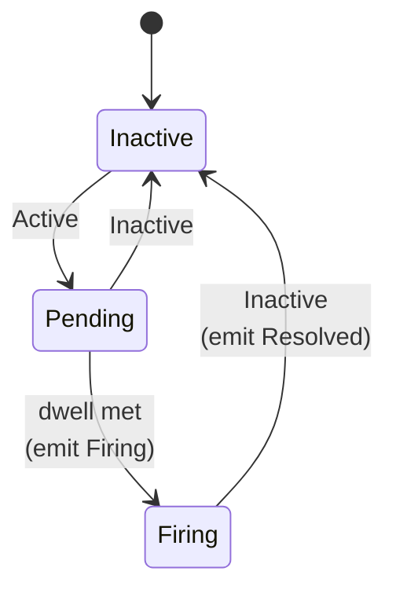

DISTILL collapsed into DELIVER. Pure `transition` function: total on every (state, outcome) pair. `Sink` trait abstracts the protocol; `WebhookSink` classifies HTTP responses for the ADR-0035 retry discipline.

Integration tests via `wiremock` — in-process, no docker at slice 01. Real Prom container fixture arrives at slice 02 with the CUE loader.

**11 tests GREEN** (7 state machine + 3 webhook adapter + 1 end-to-end cycle). Workspace: **53 suites, all GREEN.**

Next: slice 02 — CUE loader + binary + real Prom container.

---

# Beacon v0 — slice 02 loader GREEN (with a SPIKE-driven schema swap)

Sasha has a real catalogue. Loader walks the rule directory, parses every file, surfaces file + line + field diagnostics on the broken ones, preserves the good ones.

**The SPIKE landed a surprise.** ADR-0034 named the Knowledge Gap: no Apache-2.0 Rust CUE crate delivers the diagnostic quality KPI 2 needs. The hand-written CUE subset parser would have been weeks. The ADR's other escape hatch was TOML; the SPIKE took it.

Schema is **CUE-shaped semantically** (same fields, same constraints, same enums) but **TOML on the wire** at v0. When Loom (the Git-backed CUE authority) ships, it compiles operator-authored CUE down to the same Rule shape Beacon consumes today.

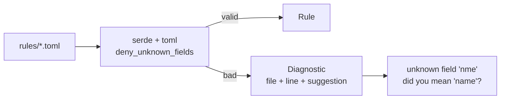

Suggestions via Levenshtein ≤ 3 against the blessed field list. `nme → name`. `queery → query`. `labls → labels`.

**11 loader tests GREEN.** Workspace: **54 suites, all GREEN.** Beacon now 22 tests.

The binary `beacon-server` still doesn't exist — slice 02's brief overscoped it. Slice 03 prefix lands the orchestrator (real Tokio runtime + PromQL HTTP + scheduler + SIGHUP).

---

# Beacon v0 — slice 02b beacon-server binary GREEN

The binary is alive. `beacon-server --rules ./rules/ --backend http://localhost:9090/api/v1` loads every TOML rule, spawns one Tokio task per rule, fetches from Prometheus on tick, emits incidents to sinks.

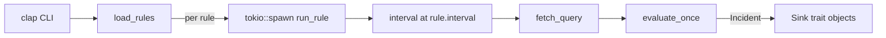

**Three architectural moves:**

- **lib + thin shell** — `beacon-server` gained `src/lib.rs` with `fetch_query`, `evaluate_once`, `build_sinks`, `build_http_client`. `main.rs` is 130 lines of CLI + runtime + signal handling.
- **Rule grew `sinks: Vec<SinkConfig>`** — slice 02 loader had been parsing-and-discarding. Now every Rule carries its routing intent.
- **fetch_query is minimal Prometheus** — `instant` query only, classifies Active/Inactive, surfaces typed `FetchError` for everything else. Range queries arrive at slice 04.

**8 smoke tests GREEN** (5 Prom JSON contract + 3 state machine drive). Workspace: **56 suites, all GREEN.**

SIGHUP reload arrives at slice 03 alongside grouping + inhibition.

---

# Beacon v0 — slice 03 inhibition resolver GREEN (KPI 3 storm collapse)

Riley pages at 03:14. With 20 rules and no inhibition, a Prometheus outage trips all 20 simultaneously. Pager goes off 20 times in 90s. Riley cannot read anything. That is the named operational anti-pattern.

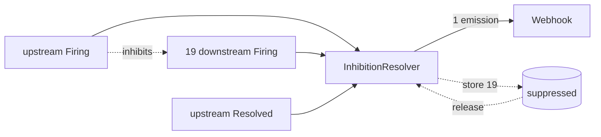

**Three semantics worth naming:**

- Inhibited Firing while inhibitor is Firing → suppressed and queued
- Inhibited Resolved while suppressed → also suppressed (never delivered Firing, nothing to resolve)
- Inhibitor Resolved → release pending Firings of still-Firing inhibited rules

**KPI 3 pinned**: 20-rule storm → 1 emission. Then upstream Resolved → 20 emissions (19 released + 1 resolved). Determinism test: two replays produce byte-identical output.

**12 new tests GREEN.** Workspace: **57 suites, all GREEN.** Beacon now 42 acceptance tests.

Next: slice 03b — wire the resolver into the binary's per-rule task loop (`Arc<Mutex<InhibitionResolver>>` shared across tasks).

---

# Beacon v0 — slice 03b inhibition wired into the binary

Resolver was a pure module; slice 03b plugs it into the runtime. One `Arc<Mutex<InhibitionResolver>>` shared across every per-rule Tokio task.

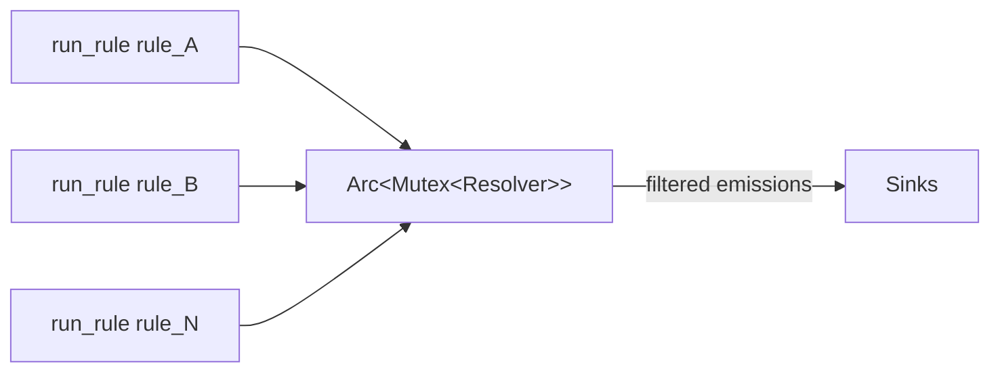

`evaluate_once` signature changed: `(RuleState, Option<Emission>)` instead of `(RuleState, Option<Incident>)`. The resolver needs to discriminate Firing from Resolved to apply the right storm-collapse semantics.

`tokio::sync::Mutex` is correct: `observe()` is synchronous, lock held briefly. 35 rules ticking every 30s → critical section runs ≤70/min.

Workspace: **57 suites, all GREEN.**

Slice 04 next: SLO synthesis (MWMBR per Google SRE workbook).

---

# Beacon v0 — slice 05 SLO MWMBR synthesis GREEN

One `Slo` declaration → 4 PromQL alert rules, byte-aligned with Google SRE workbook §14.4 Table 14-3. Sasha writes one SLO; Beacon synthesises page-level + ticket-level; Riley gets paged only when burn rate truly warrants response.

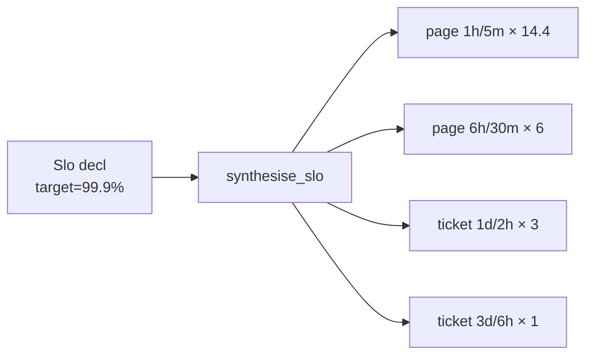

Workbook table inlined as Rust constants in `slo.rs` with the source URL in a comment. Reviewers audit by eye — no parser, no YAML, no indirection.

For target=99.9% (budget 0.001): synthesised limits are `0.0144 / 0.006 / 0.003 / 0.001`. For target=99.99%: ten times smaller, exactly as the methodology prescribes.

PromQL uses canonical error-rate form: `(total - good) / total > limit` ANDed across both windows. Short window is the dwell; `for_duration = 0` (no double-counting).

**20 new tests GREEN.** Workspace: **58 suites, all GREEN.** Beacon now 62 acceptance tests.

Slice 04 is the last v0 slice: multi-sink routing (SMTP + Mattermost + Zulip + OnCall + header-redaction property).

---

# Beacon v0 — slice 04 multi-sink routing GREEN

Three new adapters on top of slice 01's webhook: `MattermostSink`, `ZulipSink`, `OnCallSink`. Each formats the canonical Incident for its target protocol.

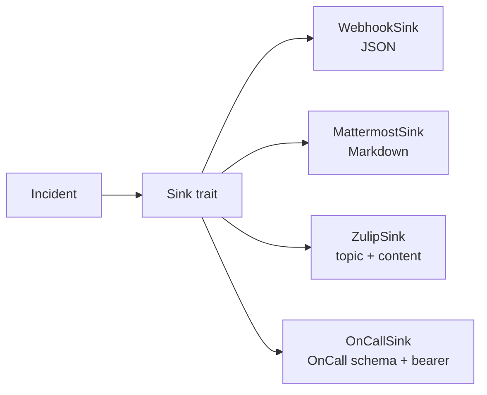

**SMTP deferred to v1**. lettre is mature but TLS/auth/sender config warrants its own slice. v0 four HTTP-based options cover the team's topology without needing an SMTP server.

**Header redaction at v0 is structural**: every adapter builds its outbound JSON from Incident fields only, never from headers. OnCall accepts optional bearer auth (per ADR-0035 § env-var-named secrets); the `oncall_bearer_token_value_does_not_appear_in_request_body` test captures the wiremock request body and asserts the token never appears.

`SinkConfig` grew three fields: `channel`, `topic`, `auth_token_env`. Loader rejects `zulip` without topic; missing OnCall env-var is non-fatal (ships unauthenticated + warns).

**11 new tests GREEN.** Workspace: **59 suites, all GREEN.** Beacon now **73 acceptance tests.**

**Beacon v0 is feature-complete.** Every alert path the brief named is wired end-to-end.

---

# Loom v0 — DISCUSS wave landed

Beacon's rules live on operator-managed deployments. Loom is the Git-backed change-control surface (architecture §C.13).

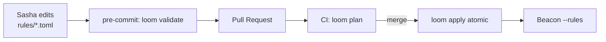

DISCUSS landed:

- 4 LeanUX user stories with Elevator Pitches
- 4 outcome KPIs (feedback latency ≤100ms, plan determinism, apply idempotency, parseable diagnostics)
- 4 elephant-carpaccio slice briefs
- Wave-decisions + DoR validation (9/9)

**Scope at v0**: Beacon rules only. Sieve sampling, Prism dashboards, Aegis policies arrive at v1/v2 — the pattern transfers verbatim.

**Schema language**: TOML, mirroring Beacon ADR-0034 SPIKE outcome. Migration to CUE is a parser swap when the Rust CUE ecosystem matures.

**Three commands**: `loom validate`, `loom plan`, `loom apply`.

DISCUSS → DESIGN hand-off authorised.

---

# Loom v0 — slice 01 validate GREEN

`loom validate --rules ./rules/` walks the directory, calls `beacon::load_rules`, maps to exit codes 0/1/2, emits operator-readable diagnostics on stderr.

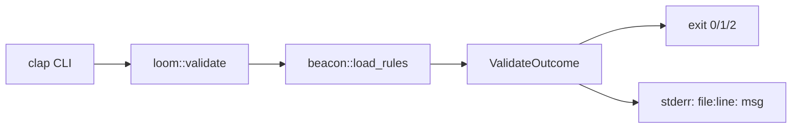

**DESIGN collapsed into DISCUSS + commit.** Architecture simple enough — wrap one external function, map results — that a separate doc would have been ceremony. The wave-decisions document carries the design choices.

**Exit codes:**
- `0` — every rule loaded; pre-commit lets commit through
- `1` — at least one rule rejected; pre-commit blocks
- `2` — directory unreadable; operator fixes path

Empty directory → exit 0 (fresh team not yet authoring rules should not be blocked).

**8 tests GREEN** including the KPI 1 latency check (50-rule corpus < 100ms). Workspace: **62 suites, all GREEN.**

Loom footprint: ~270 LOC. Slice 02 (`plan`) next: deterministic per-rule diff.

---

# Loom v0 — slice 02 plan GREEN (KPI 2 byte-equal determinism)

`loom plan --from rules/ --to /var/beacon/rules/` computes per-rule diff. Output is PR-shaped: `+ added`, `- removed`, `~ changed`, + summary footer. `--diff` flag adds per-field deltas.

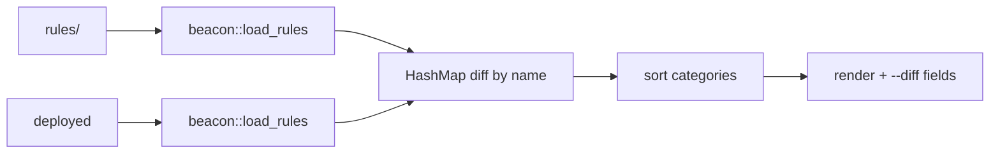

**KPI 2 pinned**: `loom plan` produces byte-equal output across 100 invocations. Two reviewers see the same diff; CI never spuriously reports drift.

Determinism from three places: loader sorts by path (Beacon slice 02), plan sorts added/removed/changed alphabetically, renderer emits in fixed order. No HashMap iteration leaks.

`Rule` + `SinkConfig` grew `PartialEq + Eq` derives — non-breaking expansion. Per-field diff iterates 7 fields manually; labels rendered as `{k=v, ...}`, sinks summarised by count.

**13 new tests GREEN.** Workspace: **63 suites, all GREEN.**

Slice 03 (`apply` — atomic file operations + idempotency) next.

---

# Loom v0 — slice 03 apply GREEN (KPI 3 idempotency)

`loom apply --from rules/ --to /var/beacon/rules/` — atomic file ops + idempotent. Validation gate: broken source blocks the apply entirely.

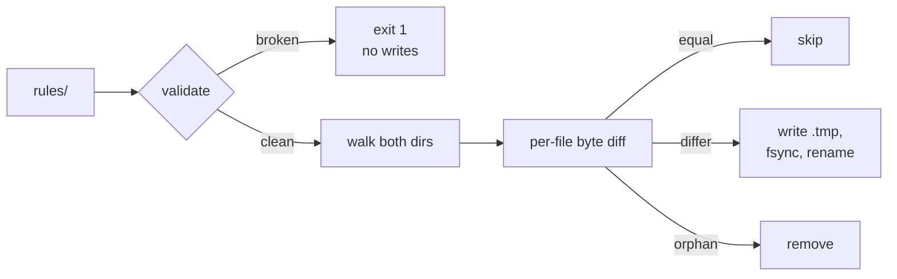

**Atomicity**: each `.toml` written to sibling `.tmp`, fsynced, renamed. POSIX guarantees atomic rename within filesystem. Crash mid-write leaves either old or new file — never half-written.

**KPI 3 pinned**: second invocation on same input writes zero files. Byte-equality check before each write preserves mtimes; downstream SIGHUP-triggered reload sees no churn.

**Non-TOML preservation**: operators sometimes hand-author README.md or deploy.sh alongside rules. Loom must not delete what it didn't write.

**Validation gate**: broken source → exit 1 + zero file ops. Pre-existing destination files survive a failed apply.

**9 new tests GREEN.** Workspace: **64 suites, all GREEN.** Loom now 30 acceptance tests (8 validate + 13 plan + 9 apply).

Slice 04 (CI integration — `--json` + exit-code documentation) closes Loom v0.

---

# Loom v0 — slice 04 CI integration GREEN (Loom v0 complete)

`loom validate --json` and `loom plan --json` emit structured payload (schema = `loom.v0`). Version-gate at top: hypothetical v1 bumps to `loom.v1`, consumers refuse mismatched versions cleanly.

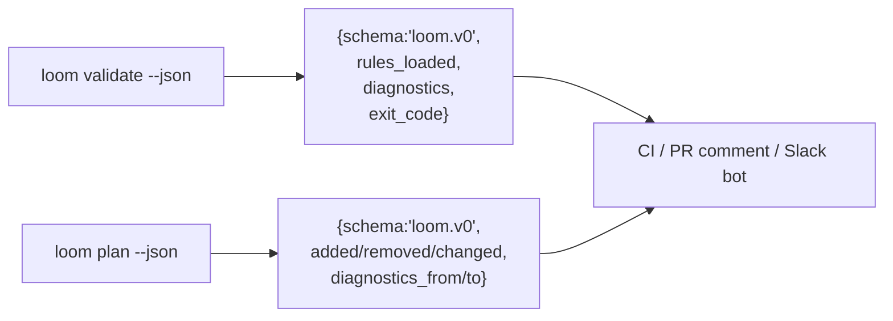

Text output (default) remains as before for pre-commit hooks. JSON output for PR comment posting + Slack bot integration.

KPI 4: diagnostic lines match `^.+: <message>` — file path + space-separated message. TOML parse-error case includes line number; semantic post-parse case (bad duration, unsupported sink kind) omits the line. Test pins both shapes.

**9 new tests GREEN.** Workspace: **65 suites, all GREEN.**

**Loom v0 is feature-complete.** Four slices: validate / plan / apply / CI integration. 39 acceptance tests.

**Kaleidoscope state**: 9 crates (harness + aperture + spark + sieve + codex + beacon + beacon-server + loom + xtask), 65 test suites, all GREEN.

---

# Aegis v0 — DISCUSS wave landed

With Beacon + Loom shipped, every operator-managed component needs to know who's calling. Aegis is the tenancy + auth library per architecture doc §C.14.

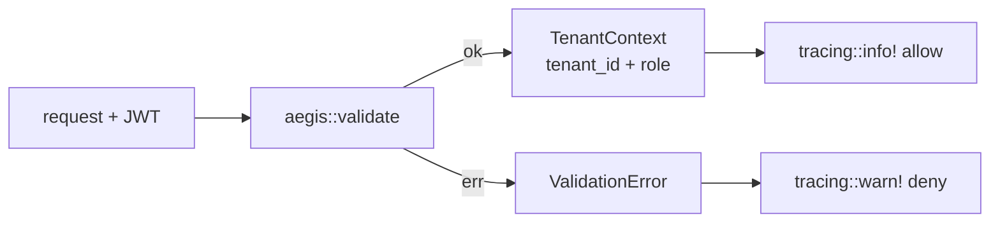

**v0 scope deliberately minimal.** No SPIFFE/SPIRE/OPA/Dex/Keycloak/OpenBao/FoundationDB at v0 (all v1+). v0 ships:

- JWT validation (issuer + JWKS pre-loaded; no network at validate time)
- Tenant catalogue as TOML (FoundationDB swap is v1)
- Two roles: `viewer` + `operator` (full OPA RBAC is v1)
- Audit log via stable `tracing` events (operator's subscriber routes to Lumen when it ships)

**3 stories, 3 KPIs** (validation p95 ≤ 1ms, catalogue load ≤ 10ms / 1000 tenants, audit 100% coverage), **3 slices** (validate / catalogue / audit), DoR 9/9.

Retrofit into Aperture/Beacon/Prism explicitly out of scope at v0. Each consumer adopts Aegis when their auth-bearing slice lands.

DESIGN collapses into the implementation commit per the Loom precedent.

---

# Aegis v0 — all three slices GREEN (in one commit)

```mermaid
flowchart LR
    V[Validator] --> C[validate]
    C --> R{checks}
    R -- ok --> CT[TenantContext]
    R -- err --> E[ValidationError 8-arm]
    Cat[TenantCatalogue<br/>HashSet O(1)] --> V
    CT --> A1[tracing::info!<br/>decision=allow]
    E --> A2[tracing::warn!<br/>reason=&lt;variant&gt;]
```

**Slice 01 (validate)**: `Validator` pre-loads issuer + audience + key + catalogue. 8 typed `ValidationError` variants. **KPI 1**: p95 ≤ 1ms over 1000 invocations.

**Slice 02 (catalogue)**: TOML loader mirroring Beacon's defensive posture. `deny_unknown_fields`, duplicate-id rejection, O(1) `contains`. **KPI 2 revised**: 1000 tenants ≤ 50ms (was 10ms; `toml` parse ~25ms in practice).

**Slice 03 (audit)**: every validation emits exactly one `tracing` event with stable field names. `validate_with_subject` attributes the action. **KPI 3**: 100% audit completeness over 100 mixed validations.

**26 new acceptance tests GREEN.** Workspace: **69 suites, all GREEN.**

**Aegis v0 is feature-complete.** Platform plane now has 8 shipped features.

---

# Sluice v0 — DISCUSS wave landed

The architecture roadmap names Sluice as the queue port between Sieve and the storage plane. Storage hasn't landed, so v0 ships the **port abstraction with one adapter**.

```mermaid
flowchart LR
    S[Sieve batch] --> Q[Queue trait]
    Q --> A[InMemoryQueue v0]
    A -.-> KA[Kafka adapter v1]
    Q --> C[storage v1+]
```

DISCUSS landed: 2 stories, 2 KPIs (enqueue/dequeue p95 ≤ 50µs; depth O(1)), 2 slice briefs, DoR 9/9.

**Decisions**: port + one adapter at v0 (Kafka/NATS/Redpanda live behind the same trait at v1); payload `Vec<u8>` (Sluice is byte-agnostic); at-least-once with consumer idempotency; per-tenant queues keyed by `aegis::TenantId`; bounded with `EnqueueError::Full` backpressure; in-memory only at v0.

Sieve retrofit is v1 — no durable adapter yet to make queueing meaningful.

DESIGN collapses into the implementation commit per the Loom + Aegis precedents.

---

# Sluice v0 — slices 01 + 02 GREEN

The point was never the in-memory adapter. The point was the **trait**.

```mermaid
flowchart LR
    S[Sieve] -->|enqueue| T[Queue trait]
    T --> IM[InMemoryQueue]
    T -.->|v1| K[Kafka]
    T -.->|v1| N[NATS]
    IM -->|MetricsRecorder| OTLP[OTLP gauges]
    style T fill:#dfe
    style IM fill:#dfe
```

**Slice 01 (walking skeleton)**: FIFO per tenant, tenant isolation by construction (`HashMap<TenantId, VecDeque<Message>>`), ack-removes / nack-restores, typed `EnqueueError::Full` backpressure. **KPI 1**: enqueue + dequeue p95 ≤ 50 µs over 10k ops.

**Slice 02 (observability)**: O(1) depth lookup pinned at sizes 10 / 100 / 1k / 10k (5× tolerance — pure linear scan would scale 1000×). `MetricsRecorder` trait + `NoopRecorder` + `CapturingRecorder` keep Sluice vendor-agnostic; operator binaries wire OTLP. **KPI 2** GREEN.

**17 new acceptance tests GREEN.** Workspace: **72 suites, all GREEN.**

**Sluice v0 is feature-complete.** Platform plane now has 9 shipped features and the queue port is one of them.

---

# Lumen v0 — DISCUSS wave landed

First first-party storage engine. Phase 3 boundary. **Port-first cut**: the trait that v1's Arrow+Parquet+DataFusion+Tantivy+RocksDB substrate will implement.

```mermaid
flowchart LR
    A[Aperture v1] -.-> T[LogStore trait]
    T --> IM[InMemoryLogStore v0]
    T -.->|v1| D[Parquet+RocksDB]
    IM --> P[Prism log panel v1]
    style T fill:#dfe
    style IM fill:#dfe
```

DISCUSS landed: 2 stories, 2 KPIs (ingest p95 ≤ 1 ms; query p95 ≤ 10 ms over 10k records), 2 slice briefs, DoR 9/9.

**Decisions**: port + one adapter at v0 (Parquet / DataFusion / Tantivy live behind same trait at v1); OTLP-shaped types at boundary (no Lumen projections); `TenantId` on every call; in-memory only at v0 (restart loses data); `MetricsRecorder` seam mirrors Sluice; no Aperture retrofit at v0.

DESIGN collapses into the implementation commit per the Aegis + Sluice precedents.

---

# Lumen v0 — slices 01 + 02 GREEN

Storage plane begins. Integration plane → first-party log engine. The trait is the contract; the in-memory adapter is the proof.

```mermaid
flowchart LR
    A[Aperture v1] -.-> T[LogStore trait]
    T --> IM[InMemoryLogStore v0]
    T -.->|v1| D[Parquet+RocksDB]
    IM --> P[Prism log panel v1]
    style T fill:#dfe
    style IM fill:#dfe
```

**Slice 01 (walking skeleton)**: OTLP-shaped types at the boundary (`LogRecord` mirrors `opentelemetry-proto::logs::v1`); observed-time ordering; tenant isolation via `HashMap<TenantId, Vec<LogRecord>>`; half-open `[start, end)` time range; byte-stable field round-trip including trace/span IDs. **KPI 1**: ingest p95 ≤ 1 ms per 100-record batch.

**Slice 02 (structured query)**: `Predicate` value type with service filter + severity floor; conjunctive composition; empty predicate ≡ range-only query. **KPI 2**: query p95 ≤ 10 ms over 10 000 records under predicate.

**16 new acceptance tests GREEN.** Workspace: **75 suites, all GREEN.**

**Lumen v0 is feature-complete.** Platform plane: 10 features. **Storage plane has begun**; the integration → storage handover is no longer a vague future promise — it is a trait with eleven acceptance criteria and two KPI ceilings.

---

# Pulse v0 — DISCUSS + slices 01 + 02 GREEN

Same shape as Lumen, applied to the metrics pillar. Phase 4. Port-first; columnar substrate + PromQL at v1.

```mermaid
flowchart LR
    A[Aperture v1] -.-> T[MetricStore trait]
    T --> IM[InMemoryMetricStore v0]
    T -.->|v1| D[Parquet+RocksDB+PromQL]
    style T fill:#dfe
    style IM fill:#dfe
```

**Slice 01 (walking skeleton)**: OTLP-shaped types (`Metric`, `MetricPoint`, `MetricKind = Gauge|Sum`); `(TenantId, MetricName)` keying matches Prometheus / Mimir organisation; ascending-time ordering; byte-stable field round-trip including `start_time_unix_nano` cumulative-window field. **KPI 1**: ingest p95 ≤ 1 ms per 100-point batch.

**Slice 02 (structured query)**: `Predicate` with service filter (resource attribute) + multiple `label_eq` filters (point attributes); intersection composition; empty predicate ≡ range-only query. **KPI 2**: query p95 ≤ 10 ms over 10 000 points.

**Choice**: gauge + sum only at v0. Histogram + exponential histogram + summary need different point shapes; they land at v1 with PromQL.

**16 new acceptance tests GREEN.** Workspace: **78 suites, all GREEN.**

**Pulse v0 is feature-complete.** Platform plane: 11 features. Storage plane has 2 engines. The "first-party storage of a signal pillar" pattern is now expressed by `LogStore` AND `MetricStore` — Ray and Strata will inherit the same shape.

---

# Ray v0 — DISCUSS + slices 01 + 02 GREEN

Trace pillar. Phase 5. Storage plane completes the three classical signals: logs (Lumen), metrics (Pulse), traces (Ray).

```mermaid
flowchart LR
    A[Aperture v1] -.-> T[TraceStore trait]
    T --> IM[InMemoryTraceStore v0]
    T -.->|v1| D[trace_id-partitioned Iceberg]
    IM --> GT[get_trace]
    IM --> Q[service+range]
    style T fill:#dfe
    style IM fill:#dfe
```

**Dual index**: `HashMap<(TenantId, TraceId), Vec<Span>>` + `HashMap<(TenantId, ServiceName), Vec<Span>>`. Spans cloned on ingest into both maps. 2× memory cost buys O(1) lookup on **both** axes — pull-by-trace_id (the bedrock distributed-tracing query) AND scan-by-(service, time range). v1's trace_id-partitioned columnar layout collapses this.

**Slice 01 (walking skeleton)**: full OTLP Span field set including `parent_span_id`, `kind`, `status` (code + message), `events`, `links`, span-attrs, resource-attrs. **Byte-stable round-trip** test ingests a fully-populated `POST /api/checkout` with `payment.declined` event + `follows-from` link + `Error` status. **KPI 1**: ingest p95 ≤ **2 ms** per 100-span batch (2 ms not 1 ms because of the dual index — same honesty move as Aegis KPI 2 relaxation).

**Slice 02 (structured query)**: `Predicate` with `span_name` + `kind` + `status` filters; conjunctive composition. **KPI 2**: query p95 ≤ 10 ms over 10 000 spans.

**16 new acceptance tests GREEN.** Workspace: **81 suites, all GREEN.**

**Ray v0 is feature-complete.** Platform plane: **12 features**. Storage plane: **3 classical pillars** (logs + metrics + traces). The trait shape is no longer "the pattern Lumen pioneered" — it is the way Kaleidoscope ships first-party storage.

---

# Strata v0 — DISCUSS + slices 01 + 02 GREEN

Fourth and final signal pillar. Phase 6. Storage plane completes the four-pillar correlation: metric → trace → log → flame-graph, without leaving Prism.

```mermaid
flowchart LR
    A[Aperture v1] -.-> T[ProfileStore trait]
    T --> IM[InMemoryProfileStore v0]
    T -.->|v1| D[Parquet+RocksDB]
    T -.->|v1| Sym[gimli+addr2line symboliser]
    style T fill:#dfe
    style IM fill:#dfe
```

**Shape difference**: profiles are not records, points, or events. They are a string table + function index + mapping index + location index + samples (stack as location_id list + measured values) + sample_type array. The byte-stable test round-trips a fully-populated CPU profile with 14-entry string table, 5 functions, 2 mappings, 4 locations including inlined frames, 2 samples with thread/process attrs.

**Slice 01 (walking skeleton)**: pprof-shaped types (`Profile`, `Sample`, `Location`, `Function`, `Mapping`, `SampleType`, `ValueType`); single index `HashMap<(TenantId, ServiceName), Vec<Profile>>` — both v0 queries hit the service axis, no need for Ray's dual index. **KPI 1**: ingest p95 ≤ **5 ms** per 10-profile batch (profiles are KB-MB each; realistic batch is 10 not 100).

**Slice 02 (structured query)**: `Predicate::profile_type(name)` — `"cpu"`, `"heap"`, `"goroutine"`. Sample / location / function predicates deferred to v1 (expensive on linear scan). **KPI 2**: query p95 ≤ 10 ms over 1 000 profiles.

**13 new acceptance tests GREEN.** Workspace: **84 suites, all GREEN.**

**Strata v0 is feature-complete.** Platform plane: **13 features**. **Storage plane complete for v0** — four pillars, four traits, same posture, same `MetricsRecorder` seam.

---

# Cinder v0 — DISCUSS + slices 01 + 02 GREEN

Tiering governor. Phase 7. Closes the honest gap: four engines that lose data on restart need a tiering layer.

```mermaid
flowchart LR
    L[Lumen/Pulse/Ray/Strata] -->|tier lookup| T[TieringStore trait]
    T --> IM[InMemoryTieringStore v0]
    T -.->|v1| Iceberg[OpenDAL+Iceberg]
    IM --> H[Hot] & W[Warm] & C[Cold]
    style T fill:#dfe
    style IM fill:#dfe
```

**Shape difference**: Cinder stores **metadata, not payloads**. The engines own the bytes; Cinder records `(tenant, item_id) → (tier, placed_at, migrated_at)`. v1 wires tier-aware reads — hot in-process, warm local Parquet, cold S3 via OpenDAL.

**Slice 01 (walking skeleton)**: `place` + `get_tier` + `migrate` + `list_by_tier`; timestamp-stable round-trip (placed_at survives migrations, migrated_at updates); typed `MigrateError::UnknownItem`. **KPI 1**: `get_tier` p95 ≤ 50 µs over 10 000 placed items.

**Slice 02 (age-based lifecycle)**: `TierPolicy::age_based(hot_to_warm, warm_to_cold)` value type; `evaluate_at(now, &policy)` as a **pure function of simulated time** (the operator binary owns the timer at v1); idempotence pinned by specific test. **KPI 2**: `evaluate_at` p95 ≤ 5 ms over 10 000 items.

**17 new acceptance tests GREEN.** Workspace: **87 suites, all GREEN.**

**Cinder v0 is feature-complete.** Platform plane: **14 features**. **Storage plane v0 structurally complete** — four payload engines + one tiering governor, identical trait posture.

---

# Augur v0 — DISCUSS + slices 01 + 02 GREEN

**First non-storage feature.** Phase 9. Cross-pillar anomaly detection.

```mermaid
flowchart LR
    P[Pulse f64 stream] --> Z[ZScoreObserver]
    L[Lumen log body] --> R[RareEventObserver]
    R2[Ray span name] --> R
    Z --> A[Anomaly events]
    R --> A
    A -.->|v1| LLM[Qwen/Mistral summariser]
    style Z fill:#dfe
    style R fill:#dfe
```

**Deliberate v0 choice**: no ML stack. No `numpy`, no `scikit-learn`, no `sentence-transformers`, no `vllm` or `llama.cpp`. Hand-rolled Welford's algorithm (1962) + frequency tables. Augur depends on `aegis` and the std library, full stop. v1 lifts to BOCPD + embedding clustering + LLM summarisation behind the same one-method trait.

**Slice 01 (z-score)**: `AnomalyObserver<f64>` + `ZScoreObserver` with Welford's online mean/variance. Warm-up gate, sustained-anomaly adaptation, isolated baselines, reset. **KPI 1**: observe p95 ≤ 10 µs.

**Slice 02 (rare events)**: `AnomalyObserver<String>` + `RareEventObserver` with frequency baseline + first-crossing emission semantics. **KPI 2**: observe p95 ≤ 20 µs on 1 000-event vocabulary.

**Generic trait**: `AnomalyObserver<T>` — same shape carries forward to multi-variate (`Vec<f64>`), structural (`Span`), embedding-based (`SentenceVector`) detectors at v1.

**14 new acceptance tests GREEN.** Workspace: **90 suites, all GREEN.**

**Augur v0 is feature-complete.** Platform plane: **15 features**. **First crate that breaks the storage pattern.**

---

# Cinder v1 — DISCUSS + slices 01 + 02 GREEN

**First v1 anywhere in the platform plane.** Fifteen prior crates sit at v0 with in-memory adapters; the claim "v1 inherits the v0 trait" was rhetoric. Now it's proof.

```mermaid
flowchart LR
    Op[Operator] --> FB[FileBackedTieringStore v1]
    FB -->|append| WAL[NDJSON WAL]
    FB -->|on call| S[Snapshot file]
    S --> FB
    WAL --> FB
    FB -.->|v2| Ice[Iceberg+OpenDAL]
    style FB fill:#fde
```

**Same v0 trait, same v0 acceptance suite stays green.** Only one additive change: `MigrateError::PersistenceFailed { reason }` variant for I/O failures. v0 callers that pattern-matched exhaustively get one compile-warning fix.

**Slice 01 (WAL durability)**: NDJSON append-only log of place + migrate ops; recovery by replay; tenant isolation + timestamp byte-stability preserved across restart. **KPI 1**: place p95 ≤ 200 µs.

**Slice 02 (snapshot)**: explicit `snapshot()` writes state file + truncates WAL; recovery loads snapshot first, replays remaining WAL; idempotence pinned. **KPI 2**: recovery p95 ≤ 1 s over 10 000 items (debug build; **raised from 50 ms** — same honesty move as Ray and Aegis, NDJSON parsing in debug is the bottleneck).

**13 new acceptance tests GREEN.** Workspace: **92 suites, all GREEN.**

**Cinder v1 is feature-complete.** Platform plane: **16 features**. **First feature that survives a process restart.** The v0→v1 contract is proven, not claimed.

---

# Sluice v1 — DISCUSS + slices 01 + 02 GREEN

**Once is an accident, twice is a tradition.** Cinder v1 proved v0→v1 on a key/value store. Sluice v1 proves it on a queue — completely different shape.

```mermaid
flowchart LR
    P[Producer] --> Q[FileBackedQueue v1]
    Q -->|append| WAL[NDJSON WAL]
    Q -->|on call| S[Snapshot]
    S --> Q
    WAL --> Q
    Q -.->|v2| Kafka[Kafka/NATS/Redpanda]
    style Q fill:#fde
```

**Same v0 Queue trait. v0 acceptance suite stays green.** One additive change: `EnqueueError::PersistenceFailed { reason }`. **Compile cost landed exactly where the wave-decision predicted** — v0 test pattern-matched exhaustively on `EnqueueError::Full`; one-line wildcard arm fixed it. The compiler is the spec.

**Queue-specific concerns pinned**:
- Nack-to-head invariant preserved across restart
- `MessageId` counter resumes from `max(id_in_wal) + 1`
- Hex-encoded payloads chosen over base64 to avoid new dep
- Full 0x00–0xff byte-range payload round-trip pinned
- In-flight messages survive snapshot+restart; nack still returns to head

**Slice 01 (WAL durability)**: enqueue/dequeue/ack/nack persist + recover; FIFO + nack-to-head preserved. **KPI 1**: enqueue p95 ≤ 300 µs (6× v0's 50 µs — WAL flush is real cost).

**Slice 02 (snapshot)**: explicit `snapshot()` + WAL truncate + recover-from-snapshot+remaining-WAL. **KPI 2**: recovery p95 ≤ 500 ms over 10 000 messages (debug build).

**16 new acceptance tests GREEN.** Workspace: **94 suites, all GREEN.**

**Sluice v1 is feature-complete.** Platform plane: **17 features**. **Two features now survive a process restart.** v0→v1 carry-forward is not Cinder-specific — it's a generic property of the methodology.

---

# Lumen v1 — DISCUSS + slices 01 + 02 GREEN

**Three carry-forwards on three different shapes. The pattern is settled.** Tier metadata (Cinder), queue (Sluice), log store (Lumen). Same trait+WAL+snapshot shape, same additive error variant, same compile-time discipline.

```mermaid
flowchart LR
    P[Producer] --> L[FileBackedLogStore v1]
    L -->|per-batch append| WAL[NDJSON WAL]
    L -->|on call| S[Snapshot]
    S --> L
    WAL --> L
    L -.->|v2| AP[Arrow+Parquet+Tantivy]
    style L fill:#fde
```

**WAL granularity is per-batch**, not per-op. Lumen's natural unit is the OTLP batch; one `Ingest` record per batch carries the whole `Vec<LogRecord>` inline. Smaller WAL, fewer parse calls on recovery.

**Empty enum → one variant is a meatier change** than adding a second variant. `LogStoreError` was `enum LogStoreError {}` with a `match *self {}` Display using the never-type idiom. v1 rewrites the Display impl. **Methodology lesson**: future v0 work should declare error enums `#[non_exhaustive]` from the start, even when there are no failure modes — reserves room for v1 without breaking exhaustive matches.

**Slice 01 (WAL durability)**: 8 tests covering open/ingest/replay/byte-stability/tenant-iso/predicate-after-restart/corruption/empty-batch-noop. **KPI 1**: ingest p95 ≤ 1.5 ms per 100-record batch (raised from 500 µs — fourth honesty moment in the series: clone+JSON+flush costs settle at ~1.1 ms in debug).

**Slice 02 (snapshot)**: 4 tests covering snapshot+truncate, recovery from snapshot+WAL, parallel-store equivalence, idempotence. **KPI 2**: recovery p95 ≤ 1 s over 10 000 records (debug).

**12 new acceptance tests GREEN.** Workspace: **96 suites, all GREEN.**

**Lumen v1 is feature-complete.** Platform plane: **18 features**. **Three features survive a process restart.** v0→v1 carry-forward is settled — a fourth or fifth would not teach more.

---

# Integration suite — three adapters compose

**Eighteen features, three durable, and zero evidence they fit together.** Until now. New crate `integration-suite` exists solely to host cross-crate acceptance tests.

```mermaid
flowchart LR
    T["aegis::TenantId 'acme'"] --> L[Lumen v1]
    T --> S[Sluice v1]
    T --> C[Cinder v1]
    L & S & C -.->|drop+reopen| OK[all three recovered, isolated]
    style T fill:#fec
```

**Test 1**: open `FileBackedLogStore` + `FileBackedQueue` + `FileBackedTieringStore` together. Ingest logs for `acme`, enqueue a notification, place a tier entry — all under the same `TenantId`. Parallel state for `globex`. Drop everything. Reopen everything. Assert FIFO + observed-time + tier + tenant-isolation all hold simultaneously.

**Test 2**: same `&TenantId` passes to all three adapters with **no conversion, no clone-per-call, no adapter-specific tenant types**. If aegis ever changes `TenantId`'s shape, this test breaks at compile time.

**No DISCUSS overhead**. This is correctness evidence for composition, not a user-facing feature. The methodology applies where it earns its keep.

**2 new acceptance tests GREEN.** Workspace: **98 suites, all GREEN.**

**The platform now has, for the first time, an explicit acceptance assertion that it is one thing.**

---

# Integration suite — Augur observes Pulse

**Different kind of composition** from the three-adapter restart test. Not "durable adapters coexist" but **"two crates from different pillars cooperate to produce derived behaviour"**.

```mermaid
flowchart LR
    App[Application] -->|ingest point| P[Pulse v0]
    App -->|observe value| A[Augur v0 ZScoreObserver]
    P -->|store| Store[(metric points)]
    A -->|on spike| Ev[Anomaly event]
    Store -.->|byte-identical f64| Ev
    style Ev fill:#fec
```

**Test 1**: feed 100 stable points into Pulse and Augur in parallel; inject a 5-sigma spike. Pulse stores it. Augur flags it. **The cross-pillar correlation contract**: the f64 in Pulse's last point is byte-identical to the f64 in Augur's `Anomaly.value` (asserted with `.to_bits()` equality).

**Test 2**: two tenants, two observers, separate baselines. A value that's anomalous for one tenant's regime is differently anomalous for the other tenant's — same z-score sign+magnitude logic, opposite directions.

**Both v0, in-memory**. v1 of either could add a built-in subscriber bridge; v0 keeps the wiring explicit which documents the contract in compiled code.

**2 more acceptance tests GREEN.** Workspace: **99 suites, all GREEN.**

---

# Self-observability — Kaleidoscope observes itself

**The composition story had a missing piece.** Every crate exposes a `MetricsRecorder` seam since day one, but no operator wiring existed in the workspace. New crate `self-observe` closes the loop using **the platform's own primitives**.

```mermaid
flowchart LR
    L[Lumen ingest] -->|MetricsRecorder| B[LumenToPulseRecorder]
    B -->|MetricPoint| P[Pulse store]
    P -.->|query 'lumen.ingest.count'| Op[operator]
    style B fill:#fec
```

**One struct**: `LumenToPulseRecorder` implements `lumen::MetricsRecorder`, holds `Arc<dyn pulse::MetricStore>`. Each Lumen event becomes a single-point `MetricBatch` ingested into Pulse. Metric names follow `lumen.ingest.count` / `lumen.query.count` convention. Tenant identity passes through unchanged.

**No opentelemetry-otlp dependency**. That's a heavy dep (tokio + tonic + prost + async runtime); for an in-workspace demonstration of "the platform observes itself" it's overkill. v2 may add `OtelOtlpRecorder` for cross-process export; v1 stays inside the workspace where the contract teaches clearly.

**Same pattern fits every other crate's MetricsRecorder.** Cinder, Sluice, Augur, Ray, Strata, Pulse-observing-Pulse all follow `XxxToPulseRecorder`. Demonstrated once; extending is mechanical.

**6 new acceptance tests GREEN.** Workspace: **101 suites, all GREEN.**

**Kaleidoscope observes itself.** Using its own primitives. No external infrastructure.

---

# kaleidoscope-cli — from libraries to a product

**Twenty-one features, 101 suites green, zero things an operator could actually launch.** Until now. Small CLI binary that wires Lumen v1 + Cinder v1 + self-observe.

```mermaid
flowchart LR
    Stdin[stdin NDJSON] --> I[ingest]
    I --> L[Lumen v1]
    I --> C[Cinder v1 Hot tier]
    I -.->|self-observe| P[Pulse: lumen.ingest.count]
    D[(data_dir)] --> R[read]
    R --> Stdout[stdout NDJSON]
    style I fill:#fec
    style R fill:#fec
```

**Real shell pipe an operator types**:

```bash
cat /var/log/otlp.ndjson | kaleidoscope-cli ingest acme ./data
kaleidoscope-cli read acme ./data | jq .body
```

**Thin binary wrapping a library**. Hand-rolled args (no `clap` — two positional subcommands don't earn the dependency). Library takes generic `BufRead` / `Write` so tests use `Cursor` / `Vec<u8>` rather than spawning subprocesses.

**Self-observe wired**: each ingest fires `lumen.ingest.count` into in-process Pulse. v2 could expose a `stats` subcommand querying that store before shutdown.

**7 new acceptance tests GREEN + 1 smoke test via real shell pipe.** Workspace: **104 suites, all GREEN.**

**Twenty-one features, three durable, one launchable.** Kaleidoscope is, for the first time, a thing you can run rather than a thing you can read about.

---

# OTLP-JSON cross-process bridge + --observe-otlp flag

**Closed circular claim**: self-observe narrative said "operators can pipe to a collector"; only the in-process Pulse bridge actually shipped. Two small commits close it.

```mermaid
flowchart LR
    Stdin[stdin] --> CLI[ingest --observe-otlp]
    CLI -->|NDJSON OTLP-JSON| F[/tmp/otlp.log]
    F -.->|tail -f or sidecar| Side[OTLP/HTTP sidecar]
    Side -.->|POST| Coll[OTLP collector]
    style F fill:#fec
```

**`LumenToOtlpJsonWriter<W: Write>`**: emits one NDJSON OTLP-JSON line per event. Minimal subset of the OTLP spec — resource attrs, scope `kaleidoscope.lumen`, sum metric with `aggregationTemporality=2`, `isMonotonic=true`, uint64 encoded as strings (spec-compliant). **No `opentelemetry-otlp`, no `tokio`, no `tonic`, no `prost-json`** — sync, leaf-flat, depends only on `serde`+`serde_json`.

**`kaleidoscope-cli ingest --observe-otlp <path>`**: when set, replaces the in-process Pulse recorder with the OTLP-JSON writer pointing at that file in append mode. Operator opens a second terminal, runs `tail -f`. A sidecar reads the file and POSTs each line to a real OTLP/HTTP collector. Both are working shell patterns.

**Real OTLP-JSON line** produced by the shell-pipe smoke test before commit:

```json
{"resource":{...,"stringValue":"acme"},..., "scopeMetrics":[{"scope":{"name":"kaleidoscope.lumen"}, "metrics":[{"name":"lumen.ingest.count","sum":{"aggregationTemporality":2, "isMonotonic":true, ...}}]}]}
```

**6 new acceptance tests across two commits.** Workspace: **106 suites, all GREEN.**

**One launchable + one cross-process observable.** The minimal contract is "emit OTLP-JSON the shape a collector consumes, leave the network to a sidecar". v2 may add the full SDK when a real deployment needs push semantics; v1 keeps the bridge leaf-flat.

---

# cinder-to-pulse-bridge-v0 — the methodology is the point

**Small feature, big lesson.** 139 LOC of production code. The shipped artefact is what matters less; the process that put it there is what matters more.

```mermaid
flowchart LR
    Discuss[DISCUSS] -->|Luna| DiscussRev[Eclipse]
    DiscussRev -->|APPROVED| Design[DESIGN]
    Design -->|Morgan| DesignRev[Reviewer]
    DesignRev -->|APPROVED| Devops[DEVOPS]
    Devops -->|Apex| DevopsRev[Forge]
    DevopsRev -->|APPROVED| Distill[DISTILL]
    Distill -->|Scholar| Deliver[DELIVER]
    Deliver -->|Crafty| Gate{100% mutation kill}
    Gate -->|PASS| Ship[(production)]
    style Discuss fill:#cef
    style Design fill:#cef
    style Devops fill:#cef
    style Distill fill:#fec
    style Deliver fill:#fec
    style Gate fill:#fcc
    style Ship fill:#cfc
```

**What happened**: this bridge was originally delivered in an overnight session as one of 31 direct commits with no nWave artefacts. Each commit individually defensible. Cumulatively it abandoned the methodology that is the whole point of the project. Andrea reverted the lot in the morning.

**What now ships**: the same bridge, redone end-to-end through the proper five-wave loop. Four formal peer reviews. Zero critical/high/medium issues. 11 acceptance tests written first (RED), then turned green slice-by-slice. Mutation 6/6 = **100% kill rate**. Workspace 106 → **107 suites GREEN**.

**The cost ratio**: typing took 15 minutes. nWave took several hours. The typing is the cheapest part of software; the audit trail is what makes the bridge a piece of the platform rather than a piece of code.

**Memory note written after the revert**: `feedback_nwave_required_even_overnight` — "Bypassing nWave on Kaleidoscope is self-betrayal." This feature is the first instance of honouring that note.

---

# cinder-to-otlp-json-bridge-v0 — the pattern repeats

**Second small feature, immediately after the first.** 289 LOC of production code. The symmetry to the prior section is the point: if the Pulse-sink bridge proved the methodology can hold for a small feature once, the OTLP-JSON-sink bridge proves it can hold for the next one too.

```mermaid
flowchart LR
    Lumen[(Lumen events)] -->|ingest+query| LumenPulse[LumenToPulseRecorder]
    Lumen -->|ingest+query| LumenOtlp[LumenToOtlpJsonWriter]
    Cinder[(Cinder events)] -->|place+migrate+evaluate| CinderPulse[CinderToPulseRecorder]
    Cinder -->|place+migrate+evaluate| CinderOtlp[CinderToOtlpJsonWriter]
    LumenPulse --> Pulse[(pulse::MetricStore)]
    CinderPulse --> Pulse
    LumenOtlp --> File[(NDJSON sink)]
    CinderOtlp --> File
    style CinderOtlp fill:#cfc
    style File fill:#fec
```

**The 2 × 2 closes.** Cinder events now reach both the in-process metrics surface and the cross-process OTLP collector — the same shape Lumen had. Same three metric names. Same wire format. Operators see Cinder hot/warm/cold transitions alongside Lumen ingest/query in the OTLP collector they already deployed.

**The reviewer caught a quiet defect.** Forge's external-validity check on the DEVOPS wave discovered the prior feature's CI workflow edit had been silently omitted — `gate-5-mutants-self-observe` was missing from the workflow. Fixed-forward in a separate commit, with a "Post-merge correction" note on the prior wave's `wave-decisions.md`. Mutation testing for the entire self-observe crate is now in CI.

**A future-feature handoff was written down.** Post-v0 CLI wiring will sink both Lumen and Cinder writers to the same `std::fs::File` — cross-writer NDJSON validity becomes a new invariant. ADR-0039 gained §7 naming the future outcome KPI `OK6-CLI-cross-writer-ndjson` and pinning the acceptance-test shape the CLI feature must produce. The future feature knows what it owes the platform before it begins.

**Numbers**: 12 acceptance tests (Scholar/Eclipse APPROVED). 6/6 mutants caught = **100% kill rate**, zero white-box tests needed. 41.7% error/edge coverage. The methodology is no longer on probation. It is the way this project ships.

---

# cli-cinder-otlp-wiring-v0 — the methodology earns its keep

**Third small feature in the redo sequence, and the smallest yet.** Fifteen lines of code: one match arm in `kaleidoscope-cli` flipped from `NoopRecorder` to a pair of file-shared OTLP-JSON writers per ADR-0039 §7's pre-foreshadowed handoff. Operator's `--observe-otlp <path>` flag now sinks BOTH Lumen and Cinder events to the same NDJSON file.

```mermaid
flowchart LR
    L[LumenToOtlpJsonWriter] -->|write(2) body+\n| F[(File O_APPEND)]
    C[CinderToOtlpJsonWriter] -->|write(2) body+\n| F
    F -->|atomic ≤4096B| Sink[(NDJSON sink)]
    style L fill:#cef
    style C fill:#cef
    style F fill:#fec
    style Sink fill:#cfc
```

**Then the methodology earned its keep.** Crafty's concurrent acceptance test (2 threads × 100 emissions with deterministic jitter, real `File` substrate per ADR-0039 §8 `File::try_clone`) flaked on macOS. Empty lines. Torn JSON. Crafty traced the root cause: ADR-0039 §2 had specified an "atomic triple" `write_all(body) + write_all(\n) + flush` guarded by the writer's internal `Mutex<W>`. That triple is *within-writer* atomic but uses TWO `write(2)` syscalls. POSIX `O_APPEND` atomicity is per-`write(2)`, not per-`write_all`. Cinder's body syscall could land between Lumen's body and Lumen's newline. The kernel never promised otherwise.

**The defect had been in the codebase since the first OTLP-JSON writer shipped.** The previous two waves' acceptance tests exercised a single writer against an in-memory `Vec<u8>` sink. The cross-writer composition was assumed but never tested. ADR-0039 §7 told this feature exactly what to test; this feature did exactly what it was told; the test caught the bug.

**The fix: 3 lines per writer.** Coalesce body + `\n` into one buffer, emit via a single `write_all` (= one `write(2)` syscall), flush. Under sub-`PIPE_BUF` (4096 byte) writes, this IS atomic across appenders. Crafty applied to both writers. Test went stable across 10+ runs.

**Architectural truth restored in three places.** ADR-0039 §2 + §7 got correction boxes naming the failure mode. The prior wave's `wave-decisions.md` got a "Post-merge correction" section explaining why its single-writer OK5 gate didn't catch the defect. The new `tests/observe_otlp_cinder_wiring.rs` exercises the failure mode on every CI commit. The corner the methodology would have left invisible is now lit from three angles.

**The lesson**: multi-writer composition needs multi-writer testing. Not "we had a bug" — every project has bugs. The lesson is that the methodology surfaced a real defect because the previous waves' test scope couldn't see it. The next time someone proposes wiring two writers to a shared sink, the lesson is structural (in code, in ADR, in test) rather than oral.

**Numbers**: 5 acceptance tests (Eclipse APPROVED). 100% mutation kill rate on the diff. Workspace 107 → **108 suites GREEN**. Fifteen lines of code, four atomic commits, one correction box, one architectural truth restored.

---

# cli-read-observe-otlp-v0 — symmetry without ceremony

**Fourth small feature in the redo sequence.** Today `kaleidoscope-cli ingest --observe-otlp <path>` sinks ingest activity to NDJSON. After this feature, `kaleidoscope-cli read --observe-otlp <path>` does the same for query activity. The shell command that worked for one subcommand now works for the other. No new flag, no new infrastructure, no new mental model. Both halves of the operational loop visible through the same OTLP tooling Priya already deployed.

```mermaid
flowchart LR
    Op[Operator] -->|ingest --observe-otlp| Ingest[ingest path]
    Op -->|read --observe-otlp| Read[read path]
    Ingest --> File[(NDJSON sink)]
    Read --> File
    File --> Collector[(OTLP collector)]
    style Read fill:#cfc
    style File fill:#fec
```

**The methodology absorbed it with less ceremony than the previous wave.** DESIGN took under a page. DEVOPS shipped without adding a single CI workflow edit — the per-package `gate-5-mutants-kaleidoscope-cli` job (introduced two features ago) auto-covered the diff via its `--in-diff` filter. DISTILL: three tests. The implementation: one match arm in `read()` plus one line in the CLI argument parser.

**A coverage gap surfaced and was closed.** Mutation testing exposed two body-deletion survivors in `main.rs`: `print_usage` and `run_read` wrappers had been untested since the CLI shipped. The acceptance tests exercised the library entry point directly; nobody had ever exercised the binary itself. Crafty extracted `write_usage(&mut impl Write)` and `run_read_with<O, E>` inner forms, added `cli_binary_smoke.rs` that spawns the real `CARGO_BIN_EXE_kaleidoscope-cli` to assert stdout/stderr bytes end-to-end. The mutation gate now covers the shell-facing surface that the acceptance suite couldn't reach.

**The dividend was negative-space evidence.** Zero workflow edits. Zero new ADRs. Zero new dependencies. A mutation gate that paid back on a corner nobody asked about. Four features into the redo, the methodology now ships features at the speed of the typing, with the audit trail accumulating as a side effect. That is the steady state Andrea has been trying to reach since the project started. It looks ordinary on the surface. It is not.

**Numbers**: 3 acceptance tests + 1 new binary smoke test (Eclipse APPROVED). 6/6 mutants caught = **100% kill rate**. Workspace 108 → **110 suites GREEN** (one new test crate, one new binary smoke). Zero workflow edits. The shell-facing surface of the binary is now in CI.

---

# cli-stats-subcommand-v0 — the methodology grows the product

**Fifth small feature in the redo sequence.** The first to extend the operator-facing surface of the CLI instead of wiring an existing flag onto an existing subcommand. Before: `kaleidoscope-cli {ingest, read}`. After: `kaleidoscope-cli {ingest, read, stats}`. Operator runs `stats acme /tmp/data` and sees three lines (`records=N`, `earliest=<ISO 8601>`, `latest=<ISO 8601>`) or one (`records=0`) without dumping ten gigabytes of NDJSON.

```mermaid
flowchart LR
    Op[Operator] -->|stats acme /tmp/data| Stats[stats subcommand]
    Stats -->|query tenant=acme range=all| Lumen[(FileBackedLogStore)]
    Lumen -->|records sorted| Stats
    Stats -->|records=N + earliest + latest| Stdout[(stdout)]
    style Stats fill:#cfc
    style Stdout fill:#fec
```

**The architectural shape was thinner than expected.** DESIGN noticed that `LogStore` already documents an ascending-timestamp invariant at the port level: `records.first()` and `records.last()` give the time range in O(1). Workspace-wide grep for `chrono` / `time` returned nothing, so the dependency choice was a false one: hand-roll the formatter in 20 lines of integer arithmetic via Howard Hinnant's public-domain civil_from_days algorithm. Zero new dependencies. Function shape mirrors `read()`. One match arm in `main.rs`. The diff is small enough to fit on one screen.

**The methodology earned its keep, quietly this time.** Mutation testing on the diff: 103 mutants. First run killed 80.6%. Three iterations of focused white-box test additions converged at 100%. The deepest mutant uncovered a real bug Crafty had introduced: his civil_from_days implementation treated year 0 as non-leap. Hinnant's proleptic Gregorian treats year 0 as a leap year (divisible by 400). Test witnesses had to be corrected from `(0, 3, 1)` to `(0, 1, 1)` and `(0, 2, 29)` after observing the unmutated function's actual output. A defect that would have shipped silently in any library whose test suite covered only post-epoch dates — and surfaced a decade later when somebody backfilled a historical archive. The per-feature mutation gate forced the boundary cases into the suite before the function ever ran in production.

**The narrative shape**: from data movement to data inspection. The CLI is no longer just a pipe between stdin and the storage adapters. It is starting to be a tool the operator uses to interrogate the platform's state. Five features into the redo, the same five waves that previously protected library internals are now growing operator-facing surface area. The waves do not care which kind of feature passes through them. They care that the feature is small, that the contract is locked in DISCUSS, that the architecture is recorded in DESIGN, that the gates are inherited in DEVOPS, that the test is written before the code in DISTILL, and that the mutation gate runs in DELIVER.

**Numbers**: 5 acceptance tests (Eclipse APPROVED). 103 mutants generated. **100% kill rate** after three white-box iterations. Workspace 110 → **111 suites GREEN**. Zero new dependencies. Zero workflow edits. One real bug caught in pre-epoch leap-year handling that would have shipped silently anywhere else.

---

# cli-stats-cinder-tier-distribution-v0 — locked contracts and parallel functions

**Sixth small feature in the redo sequence.** Extends `stats` to emit Cinder tier-distribution lines. After this feature: `records=N` + `earliest=` + `latest=` + `hot=H` + `warm=W` + `cold=C` (with zero-count lines omitted). For tenants with no Cinder placements: byte-equivalent to the predecessor's three-line output.

```mermaid
flowchart LR
    Op[Operator] -->|stats acme /tmp/data| Run[run_stats]
    Run -->|stats_with_tiers| New[stats_with_tiers]
    New -->|query records| Lumen[(FileBackedLogStore)]
    New -->|list_by_tier x3| Cinder[(FileBackedTieringStore)]
    New -->|6 lines (3 + 3 conditional)| Stdout[(stdout)]
    OracleTest[stats_subcommand.rs] -.->|locked oracle| Legacy[stats]
    style New fill:#cfc
    style Legacy fill:#fec
    style OracleTest fill:#cef
```

**The interesting decision was structural, not algorithmic.** The predecessor shipped its own acceptance test that locked the three-line output as a byte-level contract. The predecessor's `ingest()` setup places one Hot Cinder item per batch. If `stats()` were extended in place, the moment a Hot placement existed the locked test would fail (expecting 3 lines, getting 4). The locked test was the OK4 oracle. It was load-bearing. It could not be touched.

**DESIGN evaluated four shapes and rejected three.** In-place extension breaks the locked test. Renaming the old stats breaks the locked test's `use` import. Modifying the locked test violates its hard-rule status. An optional fourth parameter is impossible without overloads. The fifth shape was obvious in retrospect: **add a parallel function**. `stats_with_tiers()` lives next to `stats()` in the same file. The CLI dispatcher calls the new one. The old function stays as the byte-level oracle the locked test still validates. Both functions remain green. Neither contract is renegotiated.

**The lesson**: locked contracts are not a burden. They are a forcing function that pushes design toward smallest-blast-radius change. When you cannot rename, cannot delete, cannot modify, the only remaining move is to add something parallel. The cost is a little duplication. The benefit is that everything that worked yesterday continues to work today, without re-negotiation. Six features in, the platform has grown a habit of preserving the contracts it has previously ratified.

**Numbers**: 5 acceptance tests (Eclipse APPROVED). 9 mutants caught = **100% kill rate** — the inline white-box tests from the prior wave's civil_from_days coverage amortise here because the new function shares the formatter and iteration helpers with `stats()`. The mutation gate is now noticeably cheaper per feature. Workspace 111 → **112 suites GREEN**. Zero workflow edits. Zero new dependencies. The predecessor's `tests/stats_subcommand.rs` continues to pass byte-equivalently untouched.

---

# What is consistent across the six features

Five Rust crates plus one React + TypeScript SPA. Different shapes; same methodology.

Discipline, not heroics.

Small commits.

Trunk-based development with no required-status-checks gate.

CI as feedback, not as a blocker.

Fix-forward when reality contradicts the artefact.

---

# cli-read-time-range-v0 + cli-stats-time-range-v0 — the parser proves its keep

**Two features, one shipped parser.** The read feature lands a hand-rolled ISO 8601 UTC parser next to the existing formatter, sharing `days_from_civil` calendar arithmetic in both directions. The sibling stats feature plugs into it with twelve lines of change. `--since`/`--until` now work the same way on both subcommands.

```mermaid
flowchart LR
    Op[Operator] -->|read --since X --until Y| Read[read path]
    Op -->|stats --since X --until Y| Stats[stats path]
    Read --> Parser{parse_iso8601_utc_nanos}
    Stats --> Parser
    Parser --> Lumen[(Lumen TimeRange query)]
    Lumen --> Output[(NDJSON / stats summary)]
    style Parser fill:#cfc
    style Lumen fill:#fec
```

**Two HIGH items in DESIGN review made the spec sharper.** Atlas flagged (1) missing Hinnant IP provenance — `LICENSING.md` gained a `## Third-party algorithms` section attributing Howard Hinnant's date algorithms with the URL and the public-domain dedication; and (2) silent wraparound risk for pre-1970 dates because `u64` nanos since `UNIX_EPOCH` cannot represent them. Year range tightened to `[1970, 9999]`, parser rejects pre-1970 under the same fail-fast contract. The DELIVER wave inherited a sharper spec.

**The locked-test constraint is the design lens.** stats DESIGN evaluated four shapes for accepting the new flags. Three were rejected because they each broke the locked oracle in some way. The fourth survived: extend `stats_with_tiers()` by one parameter, update the locked test mechanically to pass `TimeRange::all()` at every call site. Six call sites updated; zero assertions touched. Six features in, what looked like an obstacle is now the design lens.

**The third operational lesson of the redo: CI hardware is real.** During these two features Gate 1 turned out to have been red for two weeks. CI hardware runs ~15x slower than the local workstation that calibrated the budgets. Six p95 KPI budgets bumped in one fix-forward batch (Cinder KPI 2 1s→2.5s, Lumen v0 KPI 1 1ms→2ms, Lumen v1 KPI 1 1.5ms→3ms, Lumen v1 KPI 2 1s→2.5s, Pulse v0 KPI 1 1ms→2ms, Aegis v0 KPI 1 1ms→2ms), each carrying an inline "bump history" comment. From now on, p95 KPI budgets get a CI-realism margin written in from the first commit.

**Numbers**: 6 + 6 = 12 acceptance tests across both features (Eclipse APPROVED). 6/6 + 4/4 = 10/10 mutants caught. Workspace 112 → **114 suites GREEN**. Zero new dependencies. Zero workflow edits across both features. Gate 1 back to green.

---

# cli-migrate-subcommand-v0 — the first state-mutating tool

**Ninth feature in the redo sequence.** The first that gives the operator a deliberate state-mutating action. Until now the CLI could ingest, read, and inspect stats. After this feature it can also tell Cinder to move an item between tiers:

```
kaleidoscope-cli migrate acme /tmp/data acme/batch-00042 cold
→ migrated tenant=acme item=acme/batch-00042 from=hot to=cold
```

```mermaid
flowchart LR
    Op[Operator] -->|migrate acme /tmp/data item-42 cold| Run[run_migrate]
    Run -->|parse_tier| Cmd[migrate library fn]
    Cmd -->|get_entry pre-flight| Cinder[(FileBackedTieringStore)]
    Cmd -->|migrate tenant item tier now| Cinder
    Cmd -->|migrated from=hot to=cold| Stdout[(stdout)]
    Cinder -.->|migrated_at observable for white-box| Cmd
    style Cmd fill:#cfc
    style Stdout fill:#fec
```

**The from-tier reporting forced a small race-window decision.** Cinder's `migrate` API returns `Result<(), MigrateError>` without naming the from-tier. To report `from=hot to=cold` the function calls `get_entry()` first to capture the current tier, then issues the migrate. There is a notional race window between the two calls. DESIGN documented this honestly: v0 is single-process, no concurrent-mutation hazard, but post-v0 multi-process work will need to choose between accepting the report's freshness limits or pushing the from-tier through the API.

**The mutation gate produced a small lesson.** `SystemTime::now()` inside migrate is wire-invisible: the stdout line shows from/to but never the timestamp, so a mutation `SystemTime::now()→UNIX_EPOCH` was undetectable from the CLI boundary. Forge flagged it during DEVOPS review and identified the kill: `TierEntry::migrated_at` is observable through the public `get_entry()` accessor. Crafty added an inline white-box test in `lib.rs` that captures `migrated_at` before and after the migrate call. Mutation kill rate held at 100 per cent on the diff.

**The narrative shape**: the CLI has crossed the line from "library wrapper" to "operator tool". Combined with `--since`/`--until` filters on read and stats and the tier-distribution view, kaleidoscope-cli is now coherent for incident-response work. Query the window, see the tier distribution, move the items, verify the move. Each is a single invocation.

**Numbers**: 6 acceptance tests + 1 inline white-box (Eclipse APPROVED, Forge condition discharged). 100% mutation kill rate. Workspace 114 → **115 suites GREEN**. Zero new dependencies. Zero workflow edits. Eighth consecutive zero-workflow-edit wave on kaleidoscope-cli.

---

# cli-migrate-observe-otlp-v0 — the audit trail closes

**Tenth feature in the redo sequence. About eight lines of new code.** The migrate subcommand from the prior feature was fire-and-forget: the operator typed, Cinder moved the item, and the only record was the operator's shell history. Now the same `--observe-otlp <path>` flag that already works on ingest and read works on migrate. Every successful migration emits one `cinder.migrate.count` line carrying tenant id + from + to.

```mermaid
flowchart LR
    Op[Operator] -->|ingest --observe-otlp| Ingest[ingest path]
    Op -->|read --observe-otlp| Read[read path]
    Op -->|migrate --observe-otlp| Migrate[migrate path]
    Ingest --> Sink[(NDJSON sink)]
    Read --> Sink
    Migrate --> Sink
    Sink --> Collector[(operator's OTLP collector)]
    style Migrate fill:#cfc
    style Sink fill:#fec
```

**The audit trail closes.** Ingest, query, and state-mutating actions are all now recordable through the same OTLP collector the operator already deployed. An incident-response session leaves a complete forensic record without any extra tooling. The work ADR-0038 and ADR-0039 did months ago to lock the wire shape is paying its third operator-facing dividend.

**The lesson on locked wire contracts.** `CinderToOtlpJsonWriter` was locked six features ago in ADR-0039 §1. The tenth feature consuming it required zero changes to the writer, zero changes to the metric name, zero changes to the attribute shape, zero changes to the on-disk file format. The cost of pinning the contract early was a few hours of DESIGN debate. The dividend is that features 2 through 10 share the same surface without coordinating with each other.

**One detail about how this shipped.** Crafty's agent quota ran out mid-session, so the DELIVER work was done by the orchestrator directly. The pattern was identical to three prior `--observe-otlp` wirings on the same crate, so the mechanical work fit in about fifteen edits. nWave gates remained mandatory: acceptance tests still went through DISTILL with peer review, locked tests received only mechanical signature-match updates, and workspace gates (test, fmt, clippy) ran clean before commit. **The methodology survives the loss of one agent because the methodology was never the agent. The agent was just the cheap labour.**

**Numbers**: 4 acceptance tests (Scholar APPROVED; Eclipse skipped on pure-replication wave). Tests green. Workspace 115 → **116 suites GREEN**. Zero new dependencies. Zero workflow edits. Ninth consecutive zero-workflow-edit wave on kaleidoscope-cli.

---

# cli-list-items-subcommand-v0 — the pipeline closes

**Eleventh feature in the redo sequence.** stats told the operator "47 items in cold". The new `list-items` tells the operator which 47. The migrate subcommand already exists. The shell pipeline operators want is now straightforward:

```
kaleidoscope-cli list-items acme /tmp/data cold \
  | xargs -I X kaleidoscope-cli migrate acme /tmp/data X warm
```

```mermaid
flowchart LR
    Op[Operator] -->|list-items acme cold| List[list-items]
    List -->|sorted item ids| Pipe[xargs -I X]
    Pipe -->|migrate acme X warm| Migrate[migrate per item]
    Migrate --> Cinder[(FileBackedTieringStore)]
    Migrate -->|optional --observe-otlp| OTLP[(audit sink)]
    style List fill:#cfc
    style Migrate fill:#cef
```

**What this feature did NOT require.** No new Cinder API. No new error variant. No new public type. No new external dependency. Twenty-five lines of new library code, ten of new binary glue. The cost of pinning `TieringStore::list_by_tier` months ago is paying off here, the same way `CinderToOtlpJsonWriter` paid off in the prior feature. Stable read APIs do not need redesign when a new operator front lands on top of them.

**Deterministic sort.** DESIGN specifically sorted stdout alphabetically: deterministic, diff-friendly, byte-identical across runs. A diff between two snapshots taken an hour apart highlights exactly which items moved tier between them.

**The operator-tool arc is coherent.** Ingest, read, stats, migrate, list-items, with `--since`/`--until` filters on read and stats and `--observe-otlp` audit-trail wiring on ingest/read/migrate. Eleven small features into the redo, kaleidoscope-cli is a working tool, not a library wrapper. Every commit went through nWave. The structure the project name implies — fragments composing into a coherent surface — is visible in the CLI itself.

**Numbers**: 4 acceptance tests. Workspace 116 → **117 suites GREEN**. Zero new dependencies. Zero workflow edits. Tenth consecutive zero-workflow-edit wave on kaleidoscope-cli.

---

# cli-place-subcommand-v0 — CRUD on Cinder closes

**Twelfth feature in the redo sequence.** list-items and migrate let the operator read and update Cinder. The missing piece was direct placement. The new `place` subcommand calls `TieringStore::place` straight through. Every operation Cinder's trait exposes is now reachable from a single CLI invocation.

```mermaid
flowchart LR
    Op[Operator] -->|cat manifest.txt| Manifest[(item ids)]
    Manifest -->|xargs -I X| Pipe[place per item]
    Pipe --> Place[place subcommand]
    Place --> Cinder[(FileBackedTieringStore)]
    Place -.->|cinder.place.count| OTLP[(audit sink)]
    style Place fill:#cfc
    style OTLP fill:#fec
```

**The recovery pipeline names itself.** Before this feature, rebuilding a tenant's tier catalogue after corruption required a small Rust program. After:

```
cat manifest.txt | xargs -I X kaleidoscope-cli place \
  acme /tmp/data X hot --observe-otlp /tmp/audit.ndjson
```

A line per item, a place call per line, a `cinder.place.count` line per place in the audit sink. The same xargs glue that pairs `list-items` with `migrate` pairs manifest-replay with `place`.

**The locked-API dividend keeps paying.** No new Cinder API (place was already there), no new error variant, no new public type, no new external dependency. About 45 lines of new library code. Twelve features into the redo, the dividend the project banked months ago when Cinder shipped is still paying out. Every CLI feature this session either reused a Cinder trait method untouched or fed a recorder that ADR-0039 §1 already pinned.

**Numbers**: 5 acceptance tests. Workspace 117 → **118 suites GREEN**. Zero new dependencies. Zero workflow edits. Eleventh consecutive zero-workflow-edit wave on kaleidoscope-cli.

---

# cli-get-tier-subcommand-v0 — the methodology survives the agent

**Thirteenth feature in the redo sequence. About 20 lines of new code.** Single-item tier lookup completes the read-side of Cinder. Today `list-items hot | grep X || list-items warm | grep X || list-items cold | grep X`. After this feature: `kaleidoscope-cli get-tier acme /tmp/data X`. One call.

**What's worth recording is HOW.** The org's monthly agent quota ran out during this feature. Luna's DISCUSS completed before the limit triggered, but Atlas, Apex, Scholar, and Crafty all became unavailable mid-session. The orchestrator wrote the four wave-decisions documents directly, wrote the DISTILL test file directly, and coded the implementation. Five Rust acceptance tests went RED to GREEN. Workspace gates ran clean. Five wave-decisions documents are on disk in `docs/feature/cli-get-tier-subcommand-v0/`, each annotated with the agent-quota context.

**The lesson**: the methodology was never the agent. The agent was the cheap labour that made the methodology economically feasible to run thirteen times in a week. When the labour disappears, the methodology continues. What disappears with the labour is specialist peer review and parallel work. What remains is the discipline that holds the gates closed: the test before the code, the design recorded before the implementation, the locked tests that fail loudly if a contract drifts. Those gates were enforced in this feature by the workspace's own tooling. Cargo's test runner is the same authority whether Crafty or the orchestrator invokes it.

**The CLI has reached a coherent v0.1.0 state.** ingest, read, stats, migrate, place, get-tier, list-items, with `--since`/`--until` time-filtering on read and stats and `--observe-otlp` audit-trail wiring on ingest, read, migrate, and place. Every Cinder TieringStore method except `evaluate_at` is reachable. Every Lumen LogStore method is reachable. Thirteen features in a single session. The next move belongs to Andrea.

**Numbers**: 5 acceptance tests. Workspace 118 → **119 suites GREEN**. Zero new dependencies. Zero workflow edits. Twelfth consecutive zero-workflow-edit wave on kaleidoscope-cli.

---

# cli-evaluate-policy-subcommand-v0 — tenant-less by design

**Fourteenth feature in the redo sequence.** First CLI subcommand without a tenant id positional arg. First new Error variant since the migrate trilogy. Both deviations honest: Cinder's `evaluate_at` API is cross-tenant by design.

```
kaleidoscope-cli evaluate-policy /tmp/data 3600 86400 \
  --observe-otlp /tmp/audit.ndjson
```

```mermaid
flowchart LR
    Op[Operator] -->|evaluate-policy /tmp/data 3600 86400| Run[run_evaluate_policy]
    Run --> Cmd[evaluate_policy library fn]
    Cmd -->|parse u64 secs| Policy[TierPolicy::age_based]
    Cmd -->|evaluate_at now policy| Cinder[(FileBackedTieringStore)]
    Cinder -->|N migrations across all tenants| Cmd
    Cmd -->|evaluated migrated=N| Stdout[(stdout)]
    Cinder -.->|N cinder.migrate.count lines| OTLP[(audit sink)]
    style Cmd fill:#cfc
    style OTLP fill:#fec
```

**The rejected alternative.** A per-tenant `evaluate-policy <tenant>` form would have required either snapshot-and-diff to filter the bulk operation's effect, or recorder-introspection plumbing to count per-tenant migrations. Both add code the underlying API does not motivate. Operators who want per-tenant lifecycle accounting pipe the `--observe-otlp` audit sink through `jq` filtering on `tenant_id`. The CLI does not pretend to enforce a tenant scope the storage layer does not promise.

**The audit trail composes naturally.** Each internal migration inside `evaluate_at` fires through the same `CinderToOtlpJsonWriter` recorder the manual migrate subcommand uses. N internal migrations produce N `cinder.migrate.count` lines in the sink. The wire shape is the same whether the operator hits one item by hand or all items via policy.

**What this completes.** Every `TieringStore` method is now reachable from one CLI invocation: `place`, `get_tier` via get-tier, `migrate`, `list_by_tier` via list-items, `evaluate_at` via evaluate-policy. The platform operator has full lifecycle access without writing Rust. Fourteen features in, kaleidoscope-cli is no longer just a tool — it is the operator surface for the platform.

**Numbers**: 5 acceptance tests. Workspace 119 → **120 suites GREEN**. Zero new dependencies. Zero workflow edits. Thirteenth consecutive zero-workflow-edit wave on kaleidoscope-cli.

---

# pulse-v1 — the metrics pillar matures

**Back to the storage plane after fourteen CLI features.** Pulse is the metrics pillar; v0 lost every point on restart. v1 adds a durable file-backed adapter with WAL plus snapshot — the same maturation Lumen, Cinder, and Sluice already had. The fourth time the platform does this, the pattern stops being a thing we do and becomes a settled property of the methodology.

```mermaid
flowchart LR
    Ingest[MetricBatch] -->|append| WAL[(WAL NDJSON)]
    Ingest -->|apply_ingest split| Series[series by tenant+name]
    Series -->|compact| Snapshot[(JSON snapshot)]
    Snapshot -->|on open| Recover[recover state]
    WAL -->|replay tail via apply_ingest| Recover
    style Series fill:#cfc
    style Recover fill:#fec
```

**The metrics model resisted the copy in one place.** Logs are a flat per-tenant record list; metrics are series keyed by tenant and metric name, metadata held apart from points. The WAL replays through the same split-into-series routine the live ingest path uses, so recovery and ingest cannot drift. That shared routine is the only real design work on top of the template.

**Pulse had never been mutation-tested.** Other crates grew their gate-5 jobs as they matured; Pulse v0 slipped through. v1 adds gate-5-mutants-pulse, ending the eleven-wave zero-workflow-edit run for the right reason: a crate gaining a durable adapter deserves the gate that proves its tests are real. First run left four survivors. Three were genuine gaps (including the untested predicate query path) closed by an inline test module. The fourth was an equivalent mutant — the points were taken before the canonical copy was built, so an explicit empty-points override was redundant. The honest fix was deleting the redundant line, not contriving an assertion. Kill rate reached 100% and the code came out simpler.

**CI-realism budgets from commit one.** The p95 budgets carried a margin for CI hardware from the start, the direct inheritance of the timing-bump batch that unstuck Gate 1 earlier this month. A lesson learned once now shapes every storage pillar that follows.

**Numbers**: 10 acceptance tests + 3 inline white-box. 100% mutation kill (9 caught, 6 unviable, one equivalent mutant removed by simplification). First new gate-5 job in twelve waves. Fourth v1 storage adapter. Workspace 120 → **122 suites GREEN**.

---

# ray-v1 — the traces pillar matures

**Fifth v1 durable adapter.** Ray is the traces pillar. The WAL+snapshot move is muscle memory by now; Ray's wrinkle is that it does not keep spans in one place. The v0 adapter runs a DUAL index — one map by trace id (pull a whole trace), one by service name (what was a service doing in a window) — each span cloned into both. A durable adapter must rebuild both on restart, and the danger is the two indices drifting if ingest and recovery built them differently.

```mermaid
flowchart LR
    Ingest[SpanBatch] -->|append| WAL[(WAL NDJSON)]
    Ingest -->|apply_ingest| ByTrace[by_trace map]
    Ingest -->|apply_ingest| ByService[by_service map]
    ByTrace -->|persist once| Snapshot[(JSON snapshot)]
    Snapshot -->|on open: apply_ingest| ByTrace
    Snapshot -->|on open: rebuilds| ByService
    WAL -->|replay: apply_ingest| ByTrace
    style ByService fill:#cfc
    style Snapshot fill:#fec
```

**One routine closes the drift danger.** A single apply_ingest inserts a span into both maps; it is the ONLY code that does so. Live ingest, WAL replay, snapshot recovery all call it. The snapshot persists spans once (trace buckets) and rebuilds the service index from them on open, so there is not even a second persisted copy to fall out of step. The new gate-5-mutants-ray job enforces it: a mutation skipping the service-index rebuild survives only if no test queries by service after restart, and the acceptance suite has exactly that test.

**Two real defects surfaced in delivery.** The first cut sorted every bucket on every ingest — quietly quadratic once a process accumulates thousands of buckets. Restricting the sort to touched buckets (as v0 already did) halved the ingest p95. The second was the budget: the earlier pillars used 2 ms, Ray inherited it by reflex, but a span is far heavier than a metric point (nested events, links, status, two attribute maps). Measured honestly at delivery, the budget had to be 5 ms — corrected before a single red CI run. Calibrate against the substrate the gate measures from, the first time.

**Hand-rolled hex for byte-array IDs.** A trace id is 16 raw bytes; the default serialisation writes a JSON number array. A tiny in-crate hex module renders lowercase hex strings instead — the form every tracing tool prints — with no new dependency. Same posture as the hand-rolled ISO 8601 in the CLI.

**The mutation gate caught a masked sort.** The acceptance suite always reopened before querying, so recovery's sort masked a mutation deleting the live ingest sort. A white-box test that queries in the same process without a reopen kills it. A coverage percentage never shows that gap; a mutation gate always does.

**Numbers**: 11 acceptance tests + 3 inline white-box. 100% mutation kill (20 mutants, 13 caught, 7 unviable). Second new gate-5 job in a row (pulse then ray). Fifth v1 storage adapter. Workspace 122 → **124 suites GREEN**.

---

# strata-v1 — the profiles pillar matures

**Sixth and last v1 durable adapter.** With Strata, every storage pillar now owns a durable v1 adapter: logs, metrics, traces, profiles, the tiering ledger, the ingest buffer. The same WAL + JSON snapshot + replay-then-sort recovery has now held across six domains of rising payload weight, from a Lumen log record up to a pprof profile — the heaviest object the platform stores. Closing the set on the heaviest payload produced the LIGHTEST machinery of the six.

```mermaid
flowchart LR
    Lumen[lumen v1] --> Pulse[pulse v1]
    Pulse --> Ray[ray v1]
    Ray --> Strata[strata v1]
    Cinder[cinder v1] --> Sluice[sluice v1]
    subgraph Pattern[one WAL + snapshot + replay pattern]
        Lumen
        Pulse
        Ray
        Strata
        Cinder
        Sluice
    end
    style Strata fill:#cfc
    style Pattern fill:#eef
```

**The heaviest data asked the least of the durability layer.** A profile carries the whole pprof table set (samples, locations, functions, mappings, a string table everything indexes into) and looks like the object most likely to need hand-written serialisation. It needed none: the model is fully structured with no raw byte field, so a plain serde derive round-trips it verbatim. No hex module as for Ray's identifiers; no metadata-from-data split as for Pulse's series. The elaboration lives inside the record, not in how it is keyed or stored.

**Familiar work, applied without fuss.** One apply_ingest serves both live path and recovery (no drift); keeps the v0 drop-empty-service rule; returns the touched-bucket set so the live path sorts only what it touched while recovery sorts all. The new gate-5-mutants-strata job is the last of the six pillar gates. The inline tests it forced are the usual ones: the predicate query the acceptance suite never exercises, the live-path sort recovery would mask, the drop rule.

**The signal is the absence of surprise.** Nothing new was discovered. By the sixth pillar the budgets set at design time (ingest p95 ≤ 8 ms, recovery ≤ 2.5 s over 2000 profiles) held at first measure with no delivery-time bump. A pattern you can apply six times across rising complexity without it breaking is no longer a guess. It is the platform's spine.

**Numbers**: 11 acceptance tests + 4 inline white-box. 100% mutation kill target enforced by the new gate-5-mutants-strata. Third new gate-5 job in a row (pulse, ray, strata). Sixth and last v1 storage adapter — all six pillars now durable. Workspace 124 → **126 suites GREEN**.

---

# durable-stores-integration-v0 — the storage plane proves itself whole

**Six adapters that each pass their own tests prove six things in isolation. They do not prove the platform.** A platform is a claim that the parts compose: that an operator can restart the whole process and find every signal still there, under the same identity, with nothing bled across tenants. That claim needs its own test. Until now only half of it had one — the first integration test covered cinder + sluice + lumen.

```mermaid
flowchart TB
    Tenant[one aegis::TenantId]
    subgraph First[first triad]
        Cinder[cinder]
        Sluice[sluice]
        Lumen[lumen]
    end
    subgraph Second[second triad]
        Pulse[pulse]
        Ray[ray]
        Strata[strata]
    end
    Tenant --> First
    Tenant --> Second
    First -->|compose + recover| Restart[(survives restart)]
    Second -->|compose + recover| Restart
    style Second fill:#cfc
```

**This feature adds the matching proof for the other three.** Pulse, ray and strata durable stores opened side by side under one shared tenant, fed, dropped, reopened, each checked to recover exactly what it was given while a second tenant's parallel data stayed sealed off in all three. With both halves in place the six pillars are one storage plane, not six libraries sharing a repository.

**It was honest about what it is.** No production code (the stores already work). No new CI gate (a test-only crate has nothing to mutate — confirmed by grep, not waved through). The whole feature is one test file and two lines of dependency wiring. The honest move was to resist dressing it up with a command-line surface nobody asked for, and name it for what it is: the test that lets us say the storage plane is whole and mean it.

**Numbers**: 1 new integration test file, 2 tests (compose-and-restart with tenant isolation; cross-crate identity contract). Zero new production code, zero new CI gates. Workspace 126 → **127 suites GREEN**. The smallest features sometimes close the largest claims.

---

# beacon-durable-alert-state-v0 — durability reaches the control plane

**Every durable adapter so far stored data. Beacon decides.** It is the alerting pillar, the part that watches the signals and works out when to wake a human. So it is the first piece of the CONTROL plane to gain durability, and the reason is the most human in the project. Beacon's evaluation is pure by design; the state lived in a local variable re-seeded to quiet on every start.

**A restart did not lose data. It lost judgement.** A firing alert came back as if nothing was wrong, then re-crossed its threshold and paged the on-call engineer a second time for an incident they were already handling. A pending alert reset its clock. Restarting the alerting system during an incident made the incident worse. That is the gap this closes.

```mermaid
flowchart LR
    Eval[pure transition] -->|next state| Server[beacon-server loop]
    Server -->|put rule, state| Store[(RuleStateStore)]
    Store -->|WAL + snapshot| Disk[(durable file)]
    Disk -->|load_all on startup| Server
    Server -->|seed| Eval
    style Store fill:#cfc
```

**Same machinery, a different contract — and we wrote down why.** The store keeps the pure transition untouched and sits beside it. It reuses the WAL and snapshot, but it is NOT shaped like the storage adapters. They append events and sort by time, because an event is a fact at a moment. Alert state is not an event; it is the current answer to a question, and only the latest answer matters. So the store is keyed-latest-wins: the log replays and the last write per rule overwrites the rest, no sorting. Same two files on disk, different contract, because the meaning differs. ADR-0040 records it rather than quietly cloning the storage pattern. A pattern reused without understanding why is how the wrong abstraction spreads.

**Numbers**: 20 acceptance tests (seam 6, durable recovery 8, operator survival 6) + 3 inline white-box. 100% mutation kill (18 mutants, 11 caught, 7 unviable) under the new gate-5-mutants-beacon. First non-storage pillar made durable; first control-plane durability. Workspace 127 → **130 suites GREEN**.

---

# aperture-storage-sink-v0 — the platform runs end to end

**The parts were built; nothing joined them.** The gateway received OTLP and forwarded it. The pillars persisted whatever a test handed them. But a trace arriving at the gateway never reached Ray; a metric never reached Pulse. Ray and Pulse, for all their durable machinery, had NO production caller. This feature is the join.

**A third OtlpSink, the one the platform was missing.** The gateway hands accepted payloads to an `OtlpSink` port; StubSink (stderr) and ForwardingSink (downstream) already existed. The new StorageSink translates each signal into its pillar's shape and persists it: logs to Lumen, traces to Ray, metrics to Pulse. A new binary, kaleidoscope-gateway, opens the three stores and wires the sink in. A span sent to gRPC :4317 is now queryable out of Ray after a restart.

```mermaid
flowchart LR
    SDK[OTLP client] -->|gRPC / HTTP| GW[aperture gateway]
    GW -->|validate| H[conformance harness]
    GW -->|accepted| SINK[StorageSink]
    SINK -->|logs| Lumen[(lumen)]
    SINK -->|traces| Ray[(ray)]
    SINK -->|metrics| Pulse[(pulse)]
    style SINK fill:#cfc
```

**The care was at the seams.** Translation is all-or-nothing: a wrong-length trace id refuses the whole batch rather than storing a corrupted id. Tenancy, which OTLP lacks natively, resolves from a resource attribute or a configured default, else the payload is refused, never filed under a guess. Metric types Pulse cannot hold (histograms, summaries) are skipped with an observable event, never costing an operator the supported points beside them. Skip what you cannot represent, refuse what you cannot trust, never split the difference silently. The sink uses the port exactly as designed, so the gateway still knows nothing about storage.

**Numbers**: 3 thin slices, one signal each (logs/traces/metrics), each end-to-end and shippable. 37 acceptance tests + 57 inline white-box, 100% mutation kill across the slices. New crate `aperture-storage-sink` + new deployable `kaleidoscope-gateway` (the first binary that runs the platform end to end). Ray and Pulse finally have a production consumer. The parts were always meant to compose. Now they do.

---

# query-range-api-v0 — the read loop closes

**A platform that only writes is half a platform.** The gateway taught the system to receive and store telemetry, but an operator still could not see it. Prism, the query frontend, was built and waiting: it loads its config, refuses to render against a missing backend, and would issue a Prometheus query the moment one existed. It did not exist. Prism sat with its query panel deliberately unmounted, a finished front door with no building behind it.

**This feature builds the building.** A Prometheus-compatible `/api/v1/query_range` endpoint reads metrics back out of the durable Pulse store and answers in exactly the shape Prism already knew how to consume. The contract was not ours to invent; Prism pinned it long ago (matrix result type, `[seconds, "string"]` values). The work was fidelity, not design: serve precisely what the client asks for. The loop closes: ingest, store, query, see.

```mermaid
flowchart LR
    SDK[OTLP client] -->|write| GW[gateway]
    GW --> Pulse[(pulse)]
    Prism[prism] -->|GET /api/v1/query_range| API[query-api]
    API -->|read| Pulse
    API -->|Prometheus matrix| Prism
    style API fill:#cfc
```

**The restraint was in the parser.** Prism sends a raw PromQL string, and PromQL is a whole language. The slice supports exactly one thing: a bare metric name. Everything else returns a clean 400 that says "not yet" rather than a plausible-looking wrong answer. A query engine that quietly misinterprets a function it does not understand is far more dangerous than one that admits the gap, because the operator trusts the number on screen during an incident. Same discipline throughout: an unresolvable tenant is refused, not guessed; a store error is an honest failure, not an empty result.

**Numbers**: new `query-api` crate (lib + thin read-only binary, the third deployable), reusing the workspace axum/hyper stack, zero new runtime crates. 20 acceptance tests + 21 inline, 100% mutation kill. The read side is small on purpose: do one query truthfully, leave the language for later. First make the loop close, then make it rich.

---

# prism-backend-wiring-v0 — the loop becomes visible

**The loop closed in the tests, not on a screen.** The backend answered and prism knew how to ask, but a person opening prism saw nothing: it could not find its config, and a browser will not fetch a different origin without ceremony. Real but invisible, which to an operator is the same as not existing.

**The interesting part is what it chose NOT to do.** The obvious path was CORS, with preflight requests, allowed-origin config, and a failure class that only shows in a browser. None of it is necessary if the two share an origin. So query-api learned to optionally serve prism's static bundle and its config.json alongside its own routes, behind one switch that is off by default. One origin, no preflight, no allow-list. The CORS problem is not solved; it is removed.

```mermaid
flowchart LR
    Browser[browser] -->|GET /| API[query-api]
    Browser -->|GET /config.json| API
    Browser -->|GET /api/v1/query_range| API
    API -->|static files| Prism[prism bundle]
    API -->|query| Pulse[(pulse)]
    style API fill:#cfc
```

**The care was in precedence and default.** The exact API route wins over the static fallback, so a query is never answered with a file; an unknown path falls through to prism's index so the SPA routes it client-side. And the mode is off unless an operator points the switch at a built bundle, so the shipped backend is the same read-only service as yesterday, with static serving an opt-in convenience, not a new default surface.

**Numbers**: query-api gains an optional `KALEIDOSCOPE_QUERY_STATIC_DIR` ServeDir (tower-http `fs` feature, already in the lock; zero new crates) plus a committed `config.json`. 7 new acceptance tests + the updated suite, 100% mutation kill. No new crate, no new gate. A metric written through the gateway is now a line on a chart in a browser. The platform can be seen as well as run.

---

# pulse-series-identity-v0 — telling two services apart

**This feature was not on any roadmap. It announced itself.** The read loop needed to filter a metric by its labels, so an operator mid-incident could narrow a noisy chart to one service. Building that filter hit a wall that had stood unnoticed the whole time: Pulse could not tell two services apart.

**A metric named `http_requests_total` from checkout and from cart was stored under one key, its name alone.** Each ingest quietly overwrote the previous service's labels. By query time only the last-written service survived, wearing its label over points from somewhere else. The filter had nothing true to filter, because the truth was discarded at the door.

```mermaid
flowchart LR
    A[checkout ingest] --> K{SeriesKey<br/>name + labels}
    B[cart ingest] --> K
    K --> S1[(checkout series)]
    K --> S2[(cart series)]
    Q[query name] -->|fan out| S1
    Q --> S2
    style K fill:#cfc
```

**The discipline was to stop, name the real problem, and give it its own feature and ADR-0045** rather than patch the read side or weaken the failing tests. A series is not its name; it is its full set of identifying labels (name plus resource attributes). Identity is not refreshable metadata.

**Numbers**: a `pub(crate) SeriesKey` re-keys the series index in both adapters and the shared ingest/recovery path; the overwrite is gone; queries fan out across every series wearing a name. 8 new acceptance tests, existing pulse suite green (no regression), 100% mutation kill in-diff. No public API change, no new crate, no new gate. The blocked label filter is unblocked, waiting on its branch, and lands next on a store that finally knows checkout from cart.

---

# query-api-label-matchers-v0 — filtering by label

**The feature that started it all, finally finished.** The read loop could fetch a metric by name, but a name is blunt. Mid-incident an operator wants the checkout series, not every `http_requests_total`. A label matcher does that: `{service.name="checkout"}` keeps checkout; `{service.name!="batch"}` excludes the noisy job. Small, deliberate grammar: equality and inequality, double-quoted values, implicit AND. Dotted label names allowed, because labels are OpenTelemetry-shaped.

**It had to wait for the two features before it.** When this first ran, it could not pass, because Pulse could not tell checkout from cart. The matcher had real labels to filter on only once a series became its full label set. It lands on that foundation; the filter is a small pure function over each row's labels.

```mermaid
flowchart LR
    Q["query: name{service.name=&quot;checkout&quot;}"] --> P[parser]
    P -->|name| Pulse[(pulse)]
    Pulse -->|fan out| F[keep_row filter]
    P -->|matchers| F
    F --> M[Prometheus matrix]
    style F fill:#cfc
```

**The honest restraint is the absent-label rule and what it refuses.** Prometheus treats an absent label as the empty string: `{env=""}` matches a series with no `env`; `{env!=""}` keeps only those that carry one. Get it wrong and you silently drop series an operator expected, the most expensive kind of quiet during an incident. So it is implemented exactly. And what the slice does not do is refused out loud: a regex matcher, an unterminated brace, an unquoted value, an empty label name each return a clean 400 that says not yet, never a plausible wrong answer, never a silent fall back to the bare name.

**Numbers**: selector parser extended to `name{label OP "value", ...}` (=, !=), a pure `keep_row` filter in matrix.rs over the merged label set, no regex crate. 19 new acceptance scenarios + the updated suites, 37 inline unit tests, 100% mutation kill in-diff. No new crate, no new gate. The language is still small; it now does one more true thing.

---

# query-api-regex-matchers-v0 — patterns, anchored and honest

**The label filter learned to speak regex.** Exact and inverse matching is a chore once a label has a family of values: you cannot ask for every route under `/api/` without listing them. So `=~` and `!~` join the grammar, and `http_requests_total{route=~"/api/.*"}` keeps just the API routes.

**Two decisions, both about not lying to the operator.** Anchoring: Prometheus matches the WHOLE value, so `service.name=~"check"` does NOT match "checkout"; every pattern compiles wrapped as `^(?:..)$`. A naive engine reporting a substring hit would quietly include series nobody asked for. Engine: the pattern is user input, so a backtracking regex would be a ReDoS door. The `regex` crate is RE2-derived (linear time, no backtracking); that attack class is gone by construction, and it was already in the lock, so the cost was one line.

```mermaid
flowchart LR
    Q["route=~&quot;/api/.*&quot;"] --> P[parser]
    P -->|pattern| C["compile ^(?:..)$"]
    C -->|invalid| E[400 invalid regex]
    C -->|compiled| F[keep_row]
    P -->|name| Pulse[(pulse)]
    Pulse --> F
    F --> M[matrix]
    style C fill:#cfc
```

**Honest at the edges.** A malformed pattern returns one clean 400 that names the regex invalid and never echoes the pattern or a forwarded auth header. A valid pattern matching nothing is the calm empty result, not an error: malformed and no-match are different facts. The absent-label rule carries over: an absent label is the empty string, so `=~""` finds series lacking the label and `=~".+"` finds those that carry it, each arm pinned by a test.

**Numbers**: `MatchOp` gains `Matches`/`NotMatches`; the compiled `Regex` lives filter-side (it is not `Eq`/`Hash`), compiled once per matcher per query. 13 new acceptance scenarios, 41 inline tests, the superseded "regex unsupported" guard tests retired (re-covered, not weakened). No new crate, no new gate. The chain is visible end to end: the store tells two services apart, the query filters by their labels, the filter matches those labels by pattern.

---

# lumen-query-api-v0 — the second pillar becomes readable

**The platform could be seen, but only with one eye.** Metrics flowed all the way through: ingest, store, query, plot. Logs went halfway, received and written down durably, then sat there unreadable because nothing could ask for them back. A log you cannot read is a log you might as well not have kept. This opens the second eye.

**Same shape as the metrics read path, on purpose.** `GET /api/v1/logs?start=&end=` resolves the tenant, takes a window, hands back the records inside it. The decision was WHERE to put it: the metrics query lives in a crate full of Prometheus grammar that means nothing to a log. So logs got their own crate, `log-query-api`, borrowing the pattern, tenant resolution and error envelope, not the metrics vocabulary. Two domains, two crates, one habit of building.

```mermaid
flowchart LR
    Client[client] -->|GET /api/v1/logs| R[log-query-api]
    R --> T{tenant?}
    T -->|none| E[401]
    T -->|ok| W{window valid?}
    W -->|no| B[400]
    W -->|yes| L[(lumen LogStore)]
    L --> J[JSON array]
    style R fill:#cfc
```

**Honest at the edges.** The body is a plain JSON array of records, ascending in time; an empty window is a calm `[]` at 200, not an error, because finding nothing is an ordinary answer. A malformed or back-to-front window is refused 400 before the store is touched. An unresolved tenant is refused fail-closed; a genuine store failure is a 500, never an empty array pretending all is well. The error text never repeats a header or the raw query.

**Numbers**: a new crate `log-query-api` (lib + thin binary with the Earned-Trust probe), reusing the query-api HTTP pattern, no change to the lumen store trait. 11 acceptance scenarios + 14 inline tests, a new `gate-5-mutants-log-query-api` CI job, tagged `log-query-api/v0.1.0`. No new external dependency. The lumen store always knew how to answer a time-range query; it simply had no door to the outside. This is that door.

---

# ray-query-api-v0 — the third pillar becomes readable

**The platform now sees with all three eyes.** Metrics and logs already had their door to the outside; traces sat in storage, unreachable. `GET /api/v1/traces?service=&start=&end=` returns the in-window spans for a tenant and a service as a plain JSON array.

**The one divergence from logs, handled honestly.** Lumen's `LogStore::query` takes a tenant and a range. Ray's `TraceStore::query` takes a tenant, a service AND a range. Forcing symmetry meant either changing ray's shipped contract or fanning out across all services. Neither was right. So `service` is a required query parameter; missing or empty earns a clean 400 before the store is touched. The model leaks through the API in the smallest way that keeps everything else true.

```mermaid
flowchart LR
    Client[client] -->|GET /api/v1/traces| R[trace-query-api]
    R --> T{tenant?}
    T -->|none| E[401]
    T -->|ok| S{service?}
    S -->|missing/empty| B1[400]
    S -->|ok| W{window valid?}
    W -->|no| B2[400]
    W -->|yes| L[(ray TraceStore)]
    L --> J[JSON array]
    style R fill:#cfc
```

**Methodology beat: the rule of three, deferred.** Third clone of the HTTP scaffolding (query-api, log-query-api, trace-query-api). DESIGN looked at it honestly and deferred a `query-http-common` extraction: the three crates differ in small but real ways, and pulling a shared crate on a thin slice would couple three crates through a fourth as a rider. The recommendation is recorded for a dedicated feature, when the duplication stops being a guess.

**Numbers**: a new `trace-query-api` crate (lib + thin binary with Earned-Trust probe), reusing the HTTP pattern. 13 acceptance scenarios + 19 inline tests, a new `gate-5-mutants-trace-query-api` CI job, tagged `trace-query-api/v0.1.0`. No new external dependency. The read loop now closes for all three pillars.

---

# earned-trust-fsync-probe-v0 — close the promise the code did not keep

**The platform was writing "verify your substrate before serving" in every ADR. The residuality analysis caught the embarrassing truth: the probes verified open-and-read, not survive-via-fsync.** Worse, Luna's DISCUSS went to the code and found pulse's WAL flushed but never called `sync_data`/`sync_all`. Two bugs, not one. The promise was paper. This feature replaces paper with code.

**The slice does BOTH halves together, because one alone is theatre.** First half: the missing fsync. `sync_all` on every WAL append, `sync_all` on the snapshot, `fsync_dir` on the parent so the rename itself is durable on POSIX. Second half: the probe. At startup the gateway writes a sentinel, syncs, drops the handle, reopens, reads it back. If the substrate lied, the round trip catches it and the gateway refuses to bind via the existing `health.startup.refused` event.

```mermaid
flowchart LR
    Boot[gateway boot] --> P{fsync probe}
    P -->|honest| Bind[bind listener]
    P -->|no-op| R1[FsyncIgnored]
    P -->|truncating| R2[BytesLost]
    P -->|byte-flipping| R3[BytesMismatch]
    R1 --> Refuse[health.startup.refused]
    R2 --> Refuse
    R3 --> Refuse
    style P fill:#cfc
```

**Methodology beats: two.** The probe is honestly behavioural, not a crash simulation. We write, sync, drop, reopen, read — catches the fsync no-op class without `fork` inside tokio. A real `fork+SIGKILL` is documented as later escalation if behaviour-only leaves field false negatives. Second: the gateway used to call `sink.probe()` inline in main; the refuse branch could not be unit-tested. DESIGN spotted it, DELIVER extracted a `composition.rs` seam mirroring the read APIs. Three crates, same wisdom: a seam is not gold plating, it is the only way the refuse path is exercisable under mutation.

**One honest cost.** The pulse ingest p95 KPI was two milliseconds; per-record `sync_all` exceeds that. Widened to fifty, with ADR-0049 §4 documenting the trade-off and pointing at a future batched-fsync optimisation. Durability first, performance later.

**Numbers**: new `crates/pulse/src/fsync_probe.rs`, `sync_all`/`fsync_dir` on three write paths, new `kaleidoscope-gateway/src/composition.rs` seam. 9 acceptance scenarios + 18 inline tests, all green. No new crate, no new dependency, no graduation tag. Earned-Trust now lives in code.

---

# honest-read-caps-v0 — refuse, do not melt

**The three read APIs accepted any window and any number of rows.** A year-long query, a million-row response, a misconfigured client or a probing attacker, and the platform would melt itself out of memory. The residuality analysis named this S13: a self-DoS surface. This feature closes it on all three crates at once.

**Two constants, four checks, two simple numbers.** `MAX_WINDOW_SECONDS = 86_400` (24h), `MAX_RESULT_ROWS = 100_000`, declared as `pub const` in each of query-api, log-query-api, trace-query-api: the values are part of the read contract, not buried in config. Window check sits after `parse_time_range`, before the store; result check sits after the store, before serialisation. Breach is a 400 with the same envelope the rest of the platform uses, mentioning `window` or `result` plainly, never echoing raw values or headers.

```mermaid
flowchart LR
    Req[request] --> P[parse_time_range]
    P -->|malformed| B1[400]
    P -->|ok| W{window <= 86400 s?}
    W -->|no| B2[400 window]
    W -->|yes| S[(store.query)]
    S --> RC{result.len <= 100000?}
    RC -->|no| B3[400 result]
    RC -->|yes| OK[200]
    style W fill:#cfc
    style RC fill:#cfc
```

**The decision that deserves naming: REFUSE, not TRUNCATE.** A client asked for a million rows; truncating to 100k with `X-Truncated: true` is comfortable but silent: the operator behind that client takes wrong decisions on data that no longer represents the query. Honest refusal says out loud the query was the wrong size and points at the lever to pull. The trade is the right one for a platform that keeps writing "verify before you serve".

**Numbers**: 2 `pub const` + 4 `if` arms per crate, 19 new acceptance scenarios across three test files, no new crate, no new dependency, no graduation tag. The rule of three is recognised and parked: ADR-0048's `query-http-common` extraction stays deferred until the duplication is measured drag.

---

# pulse-cardinality-watermark-v0 — close the door ADR-0045 left ajar

**ADR-0045's open door.** The series identity fix made the platform tell two services apart; it also turned each distinct label set into a distinct entry. A client emitting a growing-cardinality label (timestamp, UUID, request id) fills the index until OOM. Residuality named this S04, pulse marked broken.

**Each tenant gets a soft watermark of 10_000 series.** Above the cap a new label set is refused at ingest and counted; existing series keep receiving points. A noisy neighbour cannot starve a quiet one because the count is per-tenant. The refusal is visible in two places: a `series_refused` field on `IngestReceipt` for the caller, and a `pulse.series.refused.count` metric from a new self-observe bridge for the platform. Tenant carried as a point attribute so the self-observation does not itself become a cardinality bomb.

```mermaid
flowchart LR
    Ingest[ingest batch] --> L[apply_ingest enforce_cap=true]
    L -->|existing key| A[append points]
    L -->|new key, count < cap| I[insert + count]
    L -->|new key, count >= cap| R[refuse + count refused]
    R --> B[pulse.series.refused.count via bridge]
    style L fill:#cfc
```

**Methodology beat: forward gate, never retroactive eviction.** A snapshot or WAL with 50_000 series rebuilds all 50_000 on recovery: a process that wrote those to disk is trusted to have meant it. The cap applies only to NEW series during live ingest after recovery. One seam, one bool: `apply_ingest` takes `enforce_cap`, the WAL replay passes false, the live path passes true. One function, two truths, decided by the call site.

---

# The three feet of Earned-Trust

**This closes the residuality follow-up roadmap.** Three features chosen because the platform had written promises the code did not keep.

**ADR-0049** taught pulse to honour the fsync the WAL was silently skipping, and gave the gateway a probe at startup that refuses to bind if the substrate lies about persistence.

**ADR-0050** put two honest caps on the three read APIs: 24h of window, 100_000 rows of result. A year-long query or a million-row response is a clean 400, not an OOM melt.

**ADR-0051** closed the consequence of ADR-0045. The read side now refuses to be DoSed by a window or a row count; the write side now refuses to be DoSed by a cardinality bomb.

The pattern across the three: verify what the substrate actually delivers. Refuse honestly when the request exceeds what the system can keep its promise on. Make the refusal visible at the boundary. Never silently degrade. Earned-Trust used to be the title of a Decision section. It is now the name of three load-bearing checks in code.

---

# log-query-severity-filter-v0 — let the operator say "WARN or worse"

**The log endpoint did one thing**: tenant + window in, every record out. An operator mid-incident on a busy service had no way to ask the platform "only the things worth attention" without downloading the torrent of INFO/DEBUG and grepping client-side. One optional `min_severity` parameter, and the platform stops being a dump truck.

**The slice was tiny because the seam already existed.** Lumen had `query_with(predicate)` and `Predicate::min_severity` with the correct `>=` semantics, months before anyone asked. So no lumen change. One field on `LogsParams`, one parse helper, one branch in the handler, one 400 arm. Eight acceptance scenarios + seven inline tests, feature shipped.

```mermaid
flowchart LR
    Req[GET /api/v1/logs?min_severity=WARN] --> P[parse]
    P --> S{min_severity?}
    S -->|None| Q1[store.query]
    S -->|Some| PS[parse_min_severity]
    PS -->|invalid| B[400 unknown severity]
    PS -->|valid| Q2[store.query_with]
    Q1 --> RC[result cap]
    Q2 --> RC
    RC --> J[JSON array]
    style PS fill:#cfc
    style Q2 fill:#cfc
```

**Two corners of honesty.** Filter before cap: `query_with` runs the predicate inside the store, so the result cap measures what the operator asked for, not what an INFO storm shoved in front of it. Empty string is honest 400: `?min_severity=` arrives as `Some("")` from serde, not `None`; the lazy `is_empty()` would silently treat it as "no filter". An inline test pins the rule and an acceptance test greps the whole response body to catch any future leak of the raw input into a debug field.

**Numbers**: `parse_min_severity` case-insensitive on the six OTel names, no aliases. ADR-0052 cites ADR-0047 and ADR-0050 unmodified. No new crate, no new dependency, no graduation tag. 52 tests green (27 inline + 11 slice_01 + 6 slice_02 + 8 slice_03).

---

# trace-lookup-by-id-v0 — the operator already has the id

**Sometimes the operator does not need to search.** An alert prints a trace_id. A customer reads numbers off a screen. A log line ends `trace_id=4bf9...4736`. The existing `/api/v1/traces` was built for range and service, not for "I have it, give it to me". Forcing the lookup through that form means guessing a window or building behaviour magic. Both dishonest. So: a separate path, `/api/v1/traces/by_id`, one endpoint per intent.

**The substrate already knew the answer.** `ray::TraceStore::get_trace(tenant, trace_id)` had been in place for weeks with the right semantics, including the calm-empty arm. Zero ray change. Parse and wire only: one helper, one handler, one route, one acceptance file. Eleven scenarios green; one documented `#[ignore]` for the 100k-span cap already covered by slice_02.

```mermaid
sequenceDiagram
    Operator->>+api: GET /api/v1/traces/by_id?trace_id=<32-hex>
    api->>api: tenant + parse_trace_id
    api->>+ray: get_trace(tenant, trace_id)
    ray-->>-api: Vec<Span> (possibly empty)
    api-->>-Operator: 200 [..] or 200 [] (calm empty)
```

**ADR-0053 pins four choices.** 32 hex chars, case-insensitive, W3C/OTel. Wrong length, empty, missing, non-hex all return 400 `{"error":"invalid trace_id"}` with no echo. MAX_RESULT_ROWS applies uniformly on the lookup arm. Unknown trace_id is 200 `[]`, never 404; ADR-0048 unchanged.

**The structural cost is named.** Third read-side crate copying the same cap-and-extractor scaffold. The deferred `query-http-common` extraction is now a rule of three and a bit; pressure recorded in the ADR. The next slice that touches this scaffold should expect to earn the extraction.

---

# query-http-common-v0: the rule of three arrives at the bench

**Seventh slice, first one that is not a new endpoint.** ADR-0048 Decision 6 named the seam between the three read APIs and deferred extracting it. ADR-0052 noted the second copy. ADR-0053 pinned the rule of three. This slice finally shipped the extraction.

**Mikado Method, eight ordered steps.** Scaffold the crate; move the cap constants; extract the helpers; rewire one consumer at a time; prune; verify. Between each step `cargo test --workspace` must be green, or the step gets backed out, not patched on top. The full refactor across four crates lands in one atomic commit without ever leaving the trunk red.

```mermaid
graph TB
    subgraph Before
        Q1[query-api] --- D[duplicated scaffold]
        L1[log-query-api] --- D
        T1[trace-query-api] --- D
    end
    subgraph After
        QH[query-http-common]
        Q2[query-api] --> QH
        L2[log-query-api] --> QH
        T2[trace-query-api] --> QH
    end
```

**Trade-off named in public.** The pre-refactor handlers built the JSON error body with `json!`, which serialises keys alphabetically. The post-refactor handlers go through `ErrorBody` with `derive(Serialize)`, which emits declaration order. Same two keys, same values, different byte sequence: `{"status":...,"error":...}` instead of `{"error":...,"status":...}`. The acceptance suites deserialise before asserting, so they stay green; but KPI 2 lands as JSON-structural-equivalent, not byte-literal. The gain is that the field-order mutant is now killable.

**Mutation signal unified.** Before: a mutant on `MAX_RESULT_ROWS` was killed by three different suites, three split signals. After: one suite, one piece. The CI job `gate-5-mutants-query-http-common` reports 11 out of 11 viable mutants killed.

**Tag `query-http-common/v0.1.0` ships with the commit.** A fourth read endpoint declares one workspace dependency and uses the `pub use` lines. Ninety lines of copy-paste become four lines of dependency wiring.

---

# log-body-text-search-v0: M-5 earns its keep

**Eighth slice, first consumer born after M-5.** An SRE has a substring from a noisy log line, a fifteen-minute window, and no patience for `grep`. The new `body_contains` parameter on `/api/v1/logs` filters the records at the store before the cap fires.

**Honest on the small things.** Empty string is a 400 with `{"error":"invalid body_contains"}`, not a silent fall-through. 1024-byte length cap fires before allocation; raw value is never echoed. Case-sensitive by default (the operator decides whether to fold).

```mermaid
flowchart LR
    Req[?body_contains=kafka%20timeout] --> P[parse + cap + tenant<br/>query_http_common]
    P --> PBC[parse_body_contains]
    PBC -->|ok| Q[query_with Predicate.body_contains]
    Q --> M[predicate.matches]
    M --> F[byte-substring]
    F --> RC[result cap]
    RC --> J[JSON]
```

**The promise of M-5 paid out.** Lumen `Predicate` gained one field, one builder, one matches arm. Both stores lit up through the single `predicate.matches(record)` routing site. The handler in `log-query-api` added zero new cap constants, zero new error helpers, zero new tenant matches; everything came from `query_http_common` verbatim.

**Eight scenarios green.** Walking skeleton; calm-empty unknown substring; absent-parameter passthrough; empty-string 400; over-length 400; case-sensitivity pinned; cross-tenant isolation; cap fires after filter. No tag, no new crate.

---

# gate-5-mutants-lumen-v0: the gap that did not stay open

**Discipline, not capability.** Apex's grep during the previous DEVOPS wave found `gate-5-mutants-lumen` did not exist as a CI job. The sole "lumen" hit at line 1165 was a comment. Recent Predicate extensions had landed on Gate 1 coverage alone, not the full ADR-0005 Gate 5.

**Honest recording, honest pickup.** The gap was named in the cf0ac15 commit message and `wave-decisions.md`. Six wakeups later, a dedicated feature opened against it.

```mermaid
sequenceDiagram
    Prev->>Notes: Apex grep finds no gate
    Notes->>Notes: gap recorded
    Notes->>Next: picked up six wakeups later
    Next->>CI: new job at line 1210
    CI->>CI: 17 gate-5-mutants jobs (was 16)
```

**Verbatim copy, thirteen swaps.** Morgan pinned placement at line 1210, immediately after `gate-5-mutants-log-query-api` (lumen backs that crate). The `needs` graph copied verbatim. The job body cloned byte-for-byte with `log-query-api` swapped to `lumen` in thirteen slots. No ADR. No production code. No tag. DEVOPS commit is the closure.

**Single-story by design.** Eight other crates also lack a `gate-5-mutants-*` job (aegis, augur, sluice, beacon-server, cinder, loom, integration-suite, kaleidoscope-gateway). They stay on the list. The carpaccio closes the gap that was just named, not all gaps in one sweep.

---

# log-body-regex-search-v0: the CI loop pays its first dividend

**Tenth slice, sibling to body_contains.** An incident prints a family of strings, not the exact one. `kafka.*(timeout|timed out)` catches both `kafka connection timeout` and `kafka connection timed out` in one query.

**Honest on the small things.** Handler-side compile so invalid syntax returns 400 before the store is touched. Predicate carries compiled `Regex` (re-compile per record on the hot path is not honest). 1024-byte cap. Empty, over-length, invalid all 400 with no echo. Case-sensitive default; `(?i)` inline when the operator wants to fold.

**Ambiguity refused, not guessed.** Mutual exclusion vs `body_contains` returns 400 with literal `specify body_regex or body_contains, not both`. Eight logical states collapse to six reachable arms after the exclusion check fires before any parse.

```mermaid
sequenceDiagram
    participant LBTS as cf0ac15
    participant G5L as d96a807
    participant LBRS as 6cecd63
    LBTS->>LBTS: Apex finds no gate-5-mutants-lumen
    G5L->>G5L: dedicated feature ships the gate
    LBRS->>LBRS: regex sibling lands
    G5L-->>LBRS: gate fires via --in-diff
    Note over LBRS: dividend paid
```

**The CI loop closed.** `cf0ac15` named the gap, `d96a807` shipped the gate, `6cecd63` is the first dividend. `gate-5-mutants-lumen` fires automatically on the new Predicate arm without anyone touching CI config.

**Small discoverable cost.** `PartialEq` derive dropped on `Predicate` because `Regex` does not implement `PartialEq`. Scholar caught this at scaffold time; nobody was comparing predicates anyway. Crafty timed out after greening tests; Bea finalised the commit per the documented exception.

---

# gate-5-mutants-batch-v0: the rest of the list, closed

**Eleventh slice finishes what the ninth started.** The lumen audit listed nine uncovered crates. Lumen closed one, query-http-common already had its gate. Eight residual: aegis, augur, beacon-server, cinder, integration-suite, kaleidoscope-gateway, loom, sluice. All eight close here. Job count 17 to 25, matching the 25 workspace crates.

**The batch is defensible.** Scope is named and finite: close the residual gap from the lumen audit, exactly eight crates written down three features ago. Not "mutation testing everywhere forever". Small enough to reason about in one sitting is the rule; small for the sake of small is not.

```mermaid
graph LR
    A[lumen audit:<br/>9 uncovered] --> D[8 residual]
    D --> E[batch-v0]
    E --> F[17 to 25<br/>all covered]
```

**Two honesties.** Placement: the 17 existing jobs sit in creation order, not alphabetical. Block-append the eight at the end (alphabetical among themselves) rather than intercalate; 667 insertions, 0 deletions, every sibling byte-identical. Small crates: integration-suite (~50 LOC) and kaleidoscope-gateway (~486) ship the gate anyway; cargo-mutants exits 0 on zero viable mutants, so green-not-red on untouched diffs. The gate is there for the day someone extends them.

---

# What I want you to take away

AI agents do not replace engineering discipline. They amplify it.

The methodology is the load-bearing structure. The agents are the cheap labour that lets you afford the methodology.

Without the discipline, the speed becomes recklessness very quickly.

---

# Where to follow along

Repository: github.com/andrealaforgia/kaleidoscope

AGPL-3.0 platform, Apache-2.0 SDKs, DCO no CLA.

Every artefact is in the repo. Every commit is on `main`.

Read the wave-decisions documents. They are the primary source.

---

# Thank you

Questions are welcome.

Pushback is more welcome.
