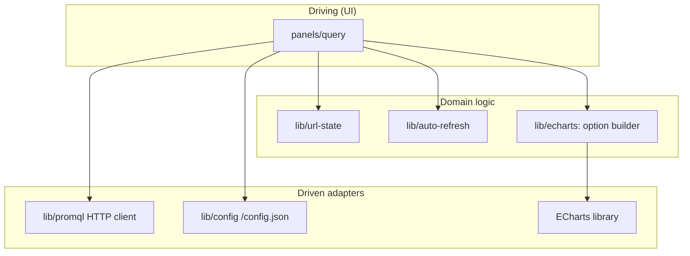

# ADR-0026 — Prism component layout and module split

- **Status**: Accepted
- **Date**: 2026-05-07
- **Author**: `nw-solution-architect` (Morgan, dispatched by Bea)
- **Feature**: `prism` v0
- **Supersedes**: none
- **Superseded by**: none
- **Related**: ADR-0027 (backend HTTP client), ADR-0028 (URL state schema),
  ADR-0029 (auto-refresh state machine), ADR-0030 (ECharts integration),
  ADR-0031 (workspace layout), ADR-0032 (licence headers)

## Context

Prism v0 is the project's first frontend feature: a single-page application
serving an operator-on-incident-call against a Prometheus / Mimir HTTP API.
DISCUSS locked seven user stories, six slices, thirty acceptance criteria,
and five outcome KPIs.

The slice-by-slice DISTILL/DELIVER posture requires a module split where
each slice can land its tests in a predictable place (Vitest unit tests at
`apps/prism/tests/slice-NN-*.test.ts`, Playwright E2E at
`apps/prism/e2e/slice-NN-*.spec.ts`) and exercise a bounded surface. The
split also has to make Slice 03's error-state contract (parse vs transport
vs empty-result) implementable as three branches in one rendering path,
and Slice 04's auto-refresh state machine implementable as a single
inspectable reducer.

This ADR locks the directory layout, the module responsibilities, and the
ports-and-adapters boundary between the QueryPanel (driving) and the
backend HTTP client (driven). It does NOT prescribe how each module is
implemented internally — that is the crafter's responsibility during
GREEN and REFACTOR.

## Decision

### 1. Top-level shape: `apps/prism/`

```
apps/prism/
├── package.json                 -- pinned deps, scripts, AGPL declaration
├── tsconfig.json                -- strict mode, project references
├── vite.config.ts               -- Vite + React + bundle-size guard
├── eslint.config.ts             -- @typescript-eslint type-checked
├── .prettierrc.json
├── public/
│   └── config.json.example      -- shape-only exemplar; operator overrides
├── index.html                   -- single SPA entry
├── src/
│   ├── main.tsx                 -- entry; mounts <App> with React Router
│   ├── app/                     -- App + RouterProvider + ConfigProvider
│   ├── panels/
│   │   └── query/               -- the only panel at v0
│   ├── lib/
│   │   ├── promql/              -- driven adapter: backend HTTP client
│   │   ├── url-state/           -- URL <-> typed state codec
│   │   ├── auto-refresh/        -- state machine (idle/running/backoff)
│   │   ├── config/              -- /config.json fetcher + parser
│   │   └── echarts/             -- ECharts option-builder + thin wrapper
│   ├── components/              -- shared atoms (button, dropdown, banner)
│   └── styles/
│       ├── theme.module.css     -- CSS custom-property tokens
│       └── global.css           -- reset + body + landmark layout
├── tests/
│   ├── slice-01-walking-skeleton.test.ts
│   ├── slice-02-relative-presets.test.ts
│   ├── slice-03-errors.test.ts
│   ├── slice-04-auto-refresh.test.ts
│   ├── slice-05-absolute-range.test.ts
│   └── slice-06-accessibility.test.ts
└── e2e/
    ├── slice-01-walking-skeleton.spec.ts
    ├── slice-02-relative-presets.spec.ts
    ├── slice-03-errors.spec.ts
    ├── slice-04-auto-refresh.spec.ts
    ├── slice-05-absolute-range.spec.ts
    └── slice-06-accessibility.spec.ts
```

### 2. Module responsibilities

| Module | Responsibility | Slice introduced | Driving / driven |
|---|---|---|---|
| `app/` | Mount `<App>`, provide `<RouterProvider>`, fetch `/config.json` once, surface a `ConfigContext` | 01 | n/a (composition root) |
| `panels/query/` | The QueryPanel: query input, time-range picker, run button, auto-refresh picker, chart, status line, error banner, empty state, footer. Reads URL state via `useSearchParams`, writes URL state via `history.replaceState`. Composes `lib/promql`, `lib/url-state`, `lib/auto-refresh`, `lib/echarts` | 01 (skeleton); 02-06 grow it | driving (UI) |
| `lib/promql/` | Driven adapter: build `/api/v1/query_range` URL, issue `fetch`, parse `application/json`, classify response into `QueryOutcome` (Success / ParseError / Empty). Transport-level failures bubble as a typed `TransportError` | 01 | driven (HTTP) |
| `lib/url-state/` | Typed codec: `decode(URLSearchParams) -> Result<UrlState, UrlParseError>` and `encode(UrlState) -> URLSearchParams`. Owns the v0 vocabulary (`q`, `from`, `to`, `refresh`) | 01 (`q`,`from`,`to`); 04 (`refresh`); 05 (absolute timestamps) | port (pure function) |
| `lib/auto-refresh/` | Reducer-shaped state machine. States: `idle`, `running`, `backoff(retry_count)`. Page-Visibility integration. Honours absolute-range disable | 04 | port (state) |
| `lib/config/` | Fetch `/config.json`, parse, validate. Exposes `Result<RuntimeConfig, ConfigError>`. Single fetch per page load | 01 | driven (HTTP, single call) |
| `lib/echarts/` | `EChartsOption` builder: maps `QueryOutcome::Success` to ECharts series shape with `smooth: false`, `connectNulls: false`, no auto-downsampling. Holds the colour-blind-safe palette | 01 (basic); 06 (palette + a11y) | driven (rendering library) |
| `components/` | Reusable atoms: `<Button>`, `<Dropdown>`, `<Banner>`, `<FocusRing>`. No business logic | 01-06 (incremental) | UI primitives |

### 3. Dependency direction (ports-and-adapters)



The arrow direction is the dependency direction. `panels/query/` depends
on `lib/promql/`, never the reverse; `lib/promql/` does not import any
React types. `lib/url-state/` is a pure-TS module with zero React or DOM
imports (testable as a pure function under Vitest with no JSdom).

### 4. Test harness placement

- Vitest unit tests live in `apps/prism/tests/slice-NN-*.test.ts`.
  Naming is pinned to slice number so DISTILL's `*.feature` files map
  one-to-one onto a test file.
- Playwright E2E lives in `apps/prism/e2e/slice-NN-*.spec.ts`. The
  KPI 4 (URL roundtrip) and KPI 5 (page-stays-usable) assertions are
  Playwright tests by definition (DISCUSS outcome-kpis.md §§ 4, 5).
- Component tests use React Testing Library on top of Vitest and live
  alongside the slice they exercise.
- Vitest config references the same `tsconfig.json` to share strict-mode
  settings; no separate test-side TS config.

### 5. Composition root

`apps/prism/src/main.tsx` is the only file that:

- Reads `/config.json` (via `lib/config/`).
- Constructs the React Router `BrowserRouter`.
- Mounts `<App>` into `#root`.

If `/config.json` cannot be parsed, `main.tsx` mounts a calm error UI
(reusing `components/Banner`) and refuses to render `<App>`. This is the
"refuse to start" half of the Earned-Trust composition-root invariant
(principle 12, applied to a frontend SPA: the SPA cannot pretend to talk
to a backend it has no honest URL for).

## Alternatives considered

### Option A (rejected): Feature-first directory layout (`features/query`, `features/config`)

The "feature-first" convention (Redux Toolkit, Next.js app router) groups
all code by user-facing feature. Argument for: every feature is one folder
to grep. Argument against (and the reason this ADR rejects it): Prism v0
has exactly one feature (the QueryPanel). The feature-first layout adds
folder weight (a `features/query/api/`, `features/query/state/`,
`features/query/components/`) that duplicates the role of `lib/`.
The chosen split keeps the driven adapters (`lib/promql`, `lib/config`)
distinct from the UI panel; this is the dependency-inversion shape that
gives Slice 03's error testing its leverage (mock `lib/promql`, exercise
QueryPanel; no "feature" indirection).

### Option B (rejected): Atomic Design directory layout (`atoms/`, `molecules/`, `organisms/`)

Atomic Design groups components by their visual decomposition level.
Argument for: design-system clarity. Argument against: Prism v0 has no
component library to speak of (a button, a dropdown, a banner, a focus
ring). The five-level hierarchy is overhead for no payoff at v0. The
chosen split puts shared atoms in `components/` and stops there; if
Loom v0 (Phase 2) inherits Prism's components by lifting them into a
shared `packages/ui/` package, that's a v1+ refactor.

### Option C (rejected): Single-file QueryPanel (no `panels/query/` subfolder)

For a v0 with one panel, why not put the QueryPanel inline in `src/App.tsx`?
Argument for: less ceremony. Argument against: Slice 02-05 grow the
QueryPanel to a four-control bar, an error-state branch, an auto-refresh
state line, an ECharts mount, and a footer. Six modules under
`panels/query/` (one per concern) is the natural decomposition the
crafter will land at refactor time anyway. Pre-locking the folder at
DESIGN gives Slice 01's tests a stable import path.

## Consequences

### Positive

- **Slice → test → module mapping is trivial**. Slice 03's error tests
  live in `tests/slice-03-errors.test.ts` and exercise `lib/promql/`'s
  classification function plus the QueryPanel's error-rendering branch.
  No archaeology required.
- **Driven adapters are mockable in isolation**. `lib/promql/`'s public
  surface is a single function (or two — fetch + classify); Vitest mocks
  it with `vi.mock('../lib/promql/...')`. The QueryPanel never knows
  whether the response came from the network or the mock.
- **Pure-TS modules under `lib/`**. `lib/url-state/` and the option
  builder in `lib/echarts/` are pure functions, testable without JSdom.
  KPI 3 (data-fidelity invariant) lives as a Vitest unit test against
  the option builder with a five-point fixture (DISCUSS outcome-kpis.md).
- **Future shared-package extraction has a clean boundary**. If
  `lib/url-state/` ever needs to be reused by Loom v0, the lift to
  `packages/url-state/` is mechanical (no UI imports inside it).

### Negative

- **More folders than a one-file SPA needs at Slice 01**. The walking
  skeleton (`up` query, default range, one chart) populates eight
  subfolders. The honest cost is folder navigation overhead, not code
  weight; the layout absorbs Slices 02-06 without further restructuring.
- **`lib/echarts/` straddles the ports-and-adapters line**. The option
  builder is pure (port-shaped); the imperative wrapper that calls
  `chart.setOption(...)` is an adapter. Splitting them inside the same
  folder is a deliberate locality choice (one folder per technology
  binding), but reviewers may flag the impurity. Mitigation: the
  imperative wrapper has its own file (`echartsAdapter.ts`) so Vitest
  can mock the wrapper while the option builder stays pure.

### Trade-off summary

The layout pays a small "more folders than Slice 01 needs" cost up front
to avoid a "rewrite the layout at Slice 04 when state grows" cost later.
This is the same trade-off Spark and Sieve made at DESIGN time
(ADR-0011, ADR-0018): lock the module shape early so Slice-N's tests
have a stable home.

## Verification

- ESLint rule `import/no-restricted-paths` (or its equivalent;
  `eslint-plugin-boundaries` is the language-appropriate enforcement
  tool — see ADR-0031 § 4) forbids imports from `panels/` to anything
  under `panels/`'s siblings except `lib/` and `components/`.
- A Vitest test asserts `lib/url-state/` has zero React imports
  (parses the source and walks the import list).
- Slice 01's acceptance suite exercises `panels/query/` against a mocked
  `lib/promql/`; the mock is the only test-time substitution.
