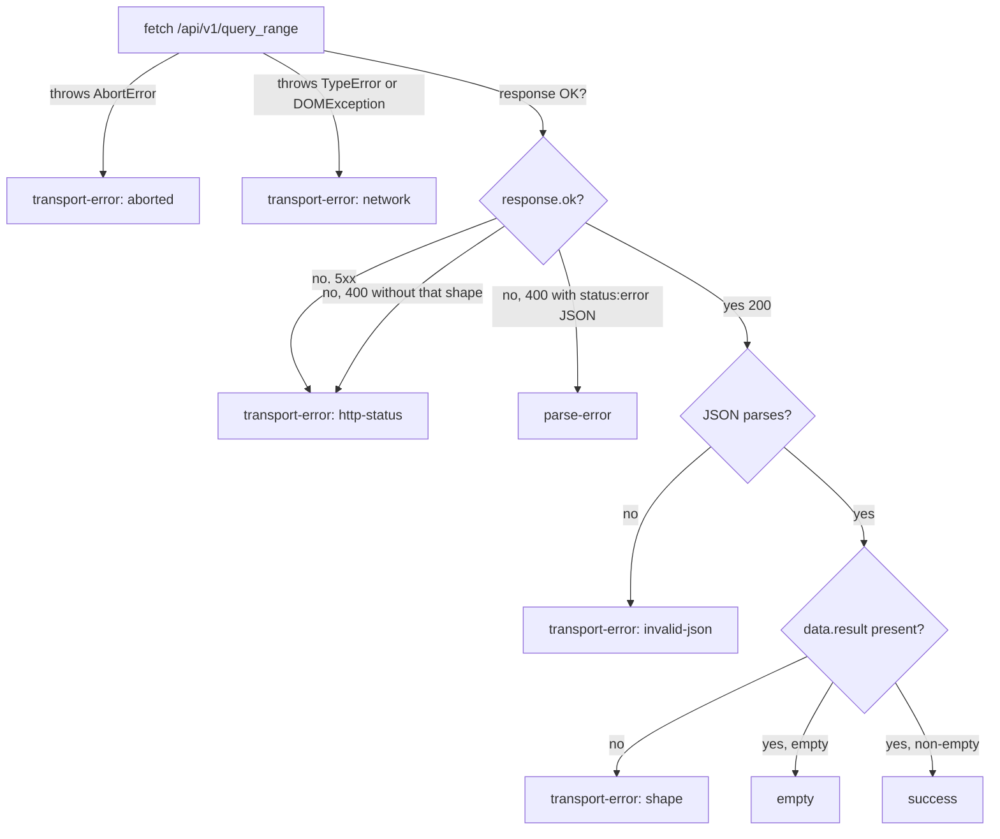

# ADR-0027 — Prism backend HTTP client and error mapping

- **Status**: Accepted
- **Date**: 2026-05-07
- **Author**: `nw-solution-architect` (Morgan, dispatched by Bea)
- **Feature**: `prism` v0
- **Supersedes**: none
- **Superseded by**: none
- **Related**: ADR-0026 (component layout: `lib/promql/`),
  ADR-0028 (URL state — `q`/`from`/`to`/`refresh` round-trip into the
  request payload), ADR-0029 (auto-refresh — every tick is a fresh fetch)

## Context

Slice 01 of Prism v0 issues a real `GET /api/v1/query_range` against a
real Prometheus / Mimir HTTP API. Slice 03 promotes three response shapes
into typed, recoverable, inline UI states:

1. **Application error** — backend returns `400` with
   `{ "status": "error", "errorType": "...", "error": "..." }`. Verbatim
   `error` text rendered in an inline warning banner.
2. **Transport error** — DNS failure, TCP refused, TLS handshake failure,
   any 5xx. The browser's `fetch()` rejects (DNS/TCP/TLS) or resolves
   with a non-OK response (5xx). Inline warning naming the configured
   backend URL and the transport-level error class.
3. **Empty result** — backend returns `200` with `{ "status": "success",
   "data": { "result": [] } }`. Calm "No data for {range}" message,
   not an error banner.

Each branch maps to a different DOM rendering, a different focus rule
(query input keeps focus on parse error; chart area drops on transport
error), and a different downstream behaviour (auto-refresh continues on
all three; URL is preserved on all three).

This ADR locks: the HTTP client surface (one function), the response
classification (a typed `QueryOutcome` discriminated union), the typed
error hierarchy (transport vs application), the CORS posture (production
reverse-proxy; dev-mode Vite proxy), and the contract-test recommendation
for the upstream platform-architect handoff.

## Decision

### 1. The HTTP client surface

`lib/promql/` exposes one function:

```ts
// apps/prism/src/lib/promql/client.ts
export async function queryRange(
  request: QueryRangeRequest,
  context: QueryRangeContext,
): Promise<QueryOutcome>;
```

`QueryRangeRequest` carries the operator's inputs (query, start, end, step).
`QueryRangeContext` carries the runtime configuration (backend URL, optional
headers, an `AbortSignal` for tick cancellation, a `fetch` injection seam
for testing). The function never throws. Every failure shape — including
network errors, JSON parse failures, and unexpected response shapes —
is encoded into the `QueryOutcome` return value.

### 2. The `QueryOutcome` discriminated union

```ts
export type QueryOutcome =
  | { kind: 'success'; series: PromqlSeries[]; queryMs: number }
  | { kind: 'empty';   queryMs: number }
  | { kind: 'parse-error'; backendError: string; queryMs: number }
  | { kind: 'transport-error'; cause: TransportErrorCause; queryMs: number };
```

`success` carries the parsed `data.result` mapped to a typed series shape
(label map plus an array of `[timestamp, value]` tuples). `empty` is the
"200 with empty array" branch and is its own kind so the QueryPanel can
render the empty state without consulting `series.length === 0` (which
would conflate empty success with success-zero-points-of-actual-data).
`parse-error` carries the verbatim `error` field. `transport-error`
carries a typed cause (see § 3).

`queryMs` is captured on every kind so the footer's "fetched in N ms" line
(shared-artefacts-registry.md) and KPI 1 / KPI 2 latency emission can
read the same field regardless of outcome.

### 3. The `TransportErrorCause` union

```ts
export type TransportErrorCause =
  | { kind: 'network';      message: string }   // fetch() rejected (DNS, TCP, TLS)
  | { kind: 'http-status';  status: number; statusText: string } // 5xx, 4xx non-promql
  | { kind: 'invalid-json'; message: string }   // 200 but body is not JSON
  | { kind: 'shape';        message: string }   // 200 + JSON but missing data.result
  | { kind: 'aborted' };                        // AbortController aborted (tick cancelled)
```

The five causes are exhaustive across what the browser's `fetch()` API
can deliver. `aborted` is its own kind so the auto-refresh state machine
(ADR-0029) can suppress it from the error banner: an aborted fetch is
not an error, it is a cancelled tick.

### 4. Classification flow



The 400-with-status-error special case is the Prometheus convention: a
PromQL parse failure is signalled at the HTTP layer with a 400 but the
response body still carries the `status:"error"` JSON wrapper that is
the operator-readable reason. Treating that as a transport error would
hide the operator-meaningful error text behind a "request failed" banner;
treating it as the right kind (`parse-error`) renders the verbatim text
above the chart area as Slice 03 requires.

### 5. CORS posture

**Production**: the operator's reverse-proxy (nginx, Caddy, Envoy)
serves Prism's static bundle at `/` and forwards `/api/v1/*` to the
Prometheus / Mimir backend on the same origin. No CORS preflight, no
`Access-Control-Allow-Origin` headers, no credentials negotiation. This
is the same posture every Prometheus-fronted UI takes (Grafana's
default install, Prometheus' own UI). It is also the simplest
shape for an operator to deploy: one TLS cert, one origin, one log
stream.

**Dev mode**: Vite's `server.proxy` configuration forwards `/api/v1/*`
to `http://localhost:9090` so the developer's browser sees a single
origin (Vite's `localhost:5173`). The dev-mode proxy is a Vite-only
concern and never ships to production.

The SPA does NOT need to read the backend URL from `window.location` or
inject CORS headers; the request URL is `${backend.url}/api/v1/query_range`
where `backend.url` is sourced from `/config.json` and is expected to be
same-origin in production. If an operator deliberately points
`backend.url` at a cross-origin Prometheus, they own the CORS configuration
on the Prometheus side; Prism does not paper over that decision.

### 6. Header propagation

`lib/promql/` reads `backend.headers` from the runtime config (per the
shared-artefacts-registry: `prism.backend.headers`) and attaches every
key/value pair to the outgoing fetch's `Headers` object. Header values
are NEVER:

- written into the `QueryOutcome` return value;
- written into any error banner text;
- logged to the browser console (any `console.error` in `lib/promql/`
  takes a redacted shape `{ url: backend.url, status, kind }` only);
- written into the URL.

This is the security invariant from the shared-artefacts-registry's
`prism.backend.headers` row. The implementation is a Vitest test
asserting that for every `QueryOutcome` kind, a known header value
(`Authorization: Bearer SECRET`) does not appear in any string field.

### 7. Test seam

`QueryRangeContext` carries an optional `fetchFn?: typeof fetch` field.
Tests inject a fake; production passes `globalThis.fetch`. This is the
same seam every other adapter in `lib/` uses (config, ECharts wrapper).

## Alternatives considered

### Option A (rejected): Throw exceptions for transport failures, return values for application errors

The conventional shape: `queryRange` throws on network failure, returns
on application failure. Argument for: matches the JS ecosystem's
fetch-throws idiom. Argument against (and the reason this ADR rejects
it): Slice 03's React rendering wants a single `useEffect` that calls
`queryRange` and dispatches one of N rendering branches. A throw-based
shape forces a `try/catch` plus a value-discrimination `switch` —
two locations to keep in sync. The total-function shape (one return
type, all outcomes are values) collapses both into one switch. It is
also mutation-test friendlier: every branch is visible in the same
function's output type.

### Option B (rejected): Use `axios` or `ky` for the HTTP layer

Both libraries ship their own error classes, retry policy, interceptor
chain. Argument for: less code to write. Argument against: v0 hits two
endpoints (`/api/v1/query_range` plus `/config.json`); native `fetch`
plus a thin `lib/promql/` wrapper is well under a hundred lines. The
bundle-size budget (300 KB gzipped at v0) does not have headroom for
either library when ECharts already takes ~200 KB. The pre-locked
decision (no axios, no ky; native fetch only) is honoured here.

### Option C (rejected): Cross-origin posture as the production default

Some Grafana-Prometheus deployments run cross-origin and inject CORS
headers on Prometheus. Argument for: single Prometheus serves multiple
UIs from different origins. Argument against: every CORS preflight is
an extra round-trip on the operator's incident-time path (KPI 1's 2-second
budget shrinks). Setting CORS on Prometheus also introduces an auth
surprise when Prom is fronted by an auth proxy that does not propagate
preflights. Reverse-proxy is the default; cross-origin is an operator
opt-in path and is documented in the dev-deployment guide rather than
in the SPA itself.

### Option D (rejected): Use a Prometheus-specific TypeScript client library

Several `prom-client`-named npm packages exist; some ship TypeScript types
for the `query_range` response shape. Argument for: typed response,
one less hand-written parser. Argument against: every package surveyed
either targets Node.js (server-side scrape) or ships under a non-AGPL-
compatible licence (MIT is fine, but several pull in transitive deps
that are not). Hand-writing the parser is twenty lines of code; the
typed `QueryOutcome` is what the QueryPanel cares about, and it is
Prism's own shape, not a third-party type.

## Consequences

### Positive

- **One function, one return type**. The QueryPanel's rendering branch
  is a single `switch (outcome.kind)` with five arms. Mutation testing
  catches every dropped arm. Slice 03's tests assert one arm per
  scenario.
- **CORS-free production**. The operator-deployed posture is one origin,
  one cert, one log stream. The smallest possible operator surprise.
- **Header redaction is a structural invariant, not a discipline**. The
  test asserts no `Authorization` value appears in any error string.
  The implementation cannot accidentally regress the security property
  without the test failing.
- **AbortController is first-class**. Cancelled ticks are a kind of
  `transport-error`, distinct from network failure, so the QueryPanel
  can suppress them silently while the auto-refresh state machine
  (ADR-0029) tracks them as in-flight cancellations.

### Negative

- **The classification flow is wider than a single try/catch**. Five
  branches plus an aborted-arm. Reviewers must check every kind has a
  rendering arm in the QueryPanel; the type system catches this
  (exhaustive switch with `never` default), but the eyeball pass at
  review time is wider than for a throw-based shape.
- **The `shape` transport-error kind hides backend incompatibility**. If
  a future Prometheus version changes the response shape (e.g. nests
  `data` under a wrapper), every query renders as `transport-error:
  shape`. Mitigation: the contract-test recommendation in §
  External-integration handoff catches the regression at CI time before
  it lands in production.

### Trade-off summary

The HTTP client is intentionally small and hand-written. The trade-off
is "five arms in one switch" against "one library dependency plus its
own error classes". The five-arm switch composes cleanly with React's
rendering model and stays inside the bundle-size budget.

## External-integration handoff

Per principle 10 (external integration awareness), `/api/v1/query_range`
is an external integration boundary. The handoff to platform-architect
(`@nw-platform-architect` Apex) carries this annotation:

> **External integrations requiring contract tests**:
> - **Prometheus / Mimir HTTP API** (`/api/v1/query_range`): Prism
>   consumes the success-shape (`status:"success"` + `data.result`),
>   the parse-error-shape (400 + `status:"error"` + `error` field),
>   and the empty-shape (`data.result: []`).
>   Recommended: consumer-driven contract tests via Pact-JS in the
>   CI acceptance stage. The upstream provider's test suite (Prometheus'
>   own integration tests) plus a pinned minimum-version assertion
>   in CI (start a known-good Prometheus container, run the contract
>   tests against it) is the equivalent posture.

The recommendation is operationally a Vitest fixture that runs against
a real Prometheus container in CI; the contract assertion is "the four
known response shapes parse without falling into the `shape` transport
error". Apex chooses Pact-JS or the lighter container-fixture posture
based on CI pipeline shape.

## Verification

- Vitest unit tests cover every `QueryOutcome` arm with hand-crafted
  fixtures (the four success/empty/parse-error/transport-error JSON
  payloads).
- A Vitest test asserts no `Authorization` header value appears in
  any `QueryOutcome` field across all kinds.
- A Playwright E2E test against a real Prometheus container exercises
  the full client end-to-end (Slice 01).
- Mutation testing (Stryker.js, per ADR-0031 § 6) targets `lib/promql/`
  with the workspace-wide 100% kill-rate gate Kaleidoscope holds for
  Rust crates (ADR-0005 Gate 5). Frontend mutation testing is its own
  trade-off; v0 ships with the gate set to "report only" until the
  budget is bedded in.
