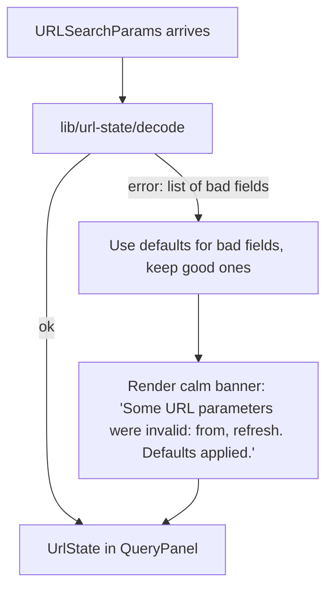

# ADR-0028 — Prism URL state schema and codec

- **Status**: Accepted
- **Date**: 2026-05-07
- **Author**: `nw-solution-architect` (Morgan, dispatched by Bea)
- **Feature**: `prism` v0
- **Supersedes**: none
- **Superseded by**: none
- **Related**: ADR-0026 (`lib/url-state/` module), ADR-0027 (URL state
  feeds the request payload), ADR-0029 (auto-refresh URL parameter)

## Context

The shared-artefacts-registry locks the URL parameter vocabulary as
Prism v0's contract surface (operators paste URLs into Slack, Slack
threads into postmortem docs; the URL must reproduce the view across
machines, tabs, and time). Renames are major-version breaks; additions
are non-breaking.

The vocabulary at v0:

| Parameter | Type | Default | Slice introduced |
|---|---|---|---|
| `q` | URL-encoded PromQL string | empty (Run disabled) | 01 |
| `from` | relative `-Xm`/`-Xh` OR ISO-8601 | `-15m` | 01 (relative); 05 (absolute) |
| `to` | `now` OR ISO-8601 | `now` | 01 (relative); 05 (absolute) |
| `refresh` | `off`, `5s`, `10s`, `30s`, `1m` | `off` | 04 |

Each acceptance criterion that mentions URL state (US-PR-04 § AC-4.1
through AC-4.3, plus per-slice AC's in 01/02/04/05) has to map onto a
typed encoder/decoder pair that round-trips losslessly. Slice 05 adds
two semantic invariants: from-before-to, and to-not-in-the-future. These
land at the codec / picker boundary, not at the fetch boundary, because
US-PR-04 § AC-4.1 requires the URL to update **synchronously on every
state-affecting picker change** including invalid intermediate states.

The codec also has to reject a malformed URL (`from=hello`, `refresh=2s`,
`q` with broken UTF-8 percent-encoding) without crashing the SPA. The
KPI 5 page-stays-usable invariant (DISCUSS outcome-kpis.md § KPI 5)
requires that a hand-edited URL produces a calm rendering, not a blank
page.

This ADR locks the codec's input/output types, the encoding rules
(including the absolute-timestamp ISO-8601 normalisation), the malformed-
URL fallback, and the `replaceState`-vs-`pushState` choice.

## Decision

### 1. The `UrlState` type

```ts
// apps/prism/src/lib/url-state/types.ts

export type UrlState = {
  q: string;                           // PromQL; "" means "no query yet"
  range: TimeRange;
  refresh: RefreshInterval;
};

export type TimeRange =
  | { kind: 'relative'; from: RelativeOffset }     // "to" is implicitly "now"
  | { kind: 'absolute'; from: Date; to: Date };

export type RelativeOffset = '-5m' | '-15m' | '-1h' | '-6h' | '-24h';
export type RefreshInterval = 'off' | '5s' | '10s' | '30s' | '1m';
```

The `range` discriminated union is the source of truth for the
auto-refresh disable rule (Slice 05 § AC and Slice 04's "absolute
disables auto"). The picker reads `range.kind` and disables the
auto-refresh control for `'absolute'`; the URL writer (§ 4) forces
`refresh=off` when serialising an absolute range. The two locks
double-protect the invariant (UI state machine + serialiser).

### 2. The codec interface

```ts
// apps/prism/src/lib/url-state/codec.ts

export function decode(params: URLSearchParams): Result<UrlState, UrlParseError>;
export function encode(state: UrlState): URLSearchParams;
```

`Result` is a small discriminated union local to `lib/url-state/`
(`{ ok: true, value: T } | { ok: false, error: E }`) — no `neverthrow`
or other library dependency. `UrlParseError` carries a typed list of
which fields failed and why; the codec does NOT produce a partial
`UrlState`, it produces all-or-nothing.

The decoder and encoder are pure functions. They have no React imports,
no DOM imports beyond `URLSearchParams`, no global state. They are
testable as pure functions under Vitest with no JSdom.

### 3. Decoding rules

| Field | Decoding | Failure handling |
|---|---|---|
| `q` | `params.get('q') ?? ''`. Empty string is valid (means "no query yet, Run disabled") | Cannot fail: `URLSearchParams` already URL-decoded |
| `from` (relative) | One of the five canonical strings: `-5m`, `-15m`, `-1h`, `-6h`, `-24h` | Any other relative-shape (e.g. `-3m`, `-2h`) is invalid; fallback to `-15m` and add a `from` entry to `UrlParseError` |
| `from` (absolute) | Must parse via `new Date(value)` AND round-trip via `.toISOString()` to a value that matches the input within tolerance | Otherwise invalid |
| `to` | If `from` is relative, `to` must be `now` (else invalid). If `from` is absolute, `to` must be an absolute timestamp (else invalid) | |
| `refresh` | One of `off`/`5s`/`10s`/`30s`/`1m` | Anything else, including absent, fallback to `off` and add a `refresh` entry to `UrlParseError` if value was present-and-invalid |

The decoder treats absent fields as "use defaults" (no error); it only
reports errors for present-and-invalid fields. This is the
forgiving-on-input shape that lets `https://prism.acme/?q=up` work as
a one-arg URL.

### 4. Encoding rules

| Field | Encoded as |
|---|---|
| `q` | `q=<URL-encoded query>`. Always present, even when empty; absence vs `q=` makes URL diffs harder to reason about |
| `range.kind === 'relative'` | `from=<offset>&to=now` |
| `range.kind === 'absolute'` | `from=<from.toISOString()>&to=<to.toISOString()>` |
| `refresh` (relative range) | `refresh=<interval>` if not `off`; absent if `off` |
| `refresh` (absolute range) | NEVER emitted (absolute disables auto-refresh per Slice 05 § AC) |

The order of parameters is canonical (`q`, `from`, `to`, `refresh`) so
two URLs encoding the same state are byte-identical. Byte-identity is
how KPI 4's "URL roundtrip fidelity" Playwright test asserts equality.

ISO-8601 timestamps are normalised to `YYYY-MM-DDTHH:mm:ss.sssZ` (the
shape `Date.prototype.toISOString` produces). The encoder normalises;
the decoder accepts either the normalised form or any input
`new Date(...)` will parse. This is forgiving-on-input, strict-on-output.

### 5. Synchronous URL writes via `history.replaceState`

The QueryPanel writes the URL on every state-affecting picker change
(query input on debounce, time-range picker on selection, auto-refresh
picker on selection, plus on every successful fetch's "now" snapshot
for relative ranges). The write goes through `history.replaceState`,
not `pushState`.

`pushState` would push every keystroke onto the browser's history stack,
making the back button useless mid-incident (Priya hits Back and lands
on a query from forty keystrokes ago instead of leaving the page).
`replaceState` keeps the URL in sync with the visible state without
polluting history.

The URL is updated **after every state change**, not on a debounce,
because Slice 03 § AC-3 requires that the URL still encodes the
broken-state query for shareability — including a query the user is
mid-typing that will trigger a parse error when they press Run.

### 6. Synchronisation with React Router

`react-router-dom` v7 exposes `useSearchParams()` returning
`[URLSearchParams, SetURLSearchParams]`. The QueryPanel uses the
setter with `{ replace: true }` to honour § 5.

The QueryPanel does NOT subscribe directly to `URLSearchParams` for
deciding rendering; it derives `UrlState` once per render via
`useMemo(() => decode(searchParams), [searchParams])`. The memoisation
prevents redundant decode work; the typed `UrlState` is what every
component reads.

### 7. Hand-edited / malformed URL handling (KPI 5)

Decoder failure path:



The failure path is documented in Slice 03's error taxonomy as the fourth
failure mode. The QueryPanel renders the banner at the top of the page
chrome, distinct from the per-fetch error banner. Pressing any picker
control dismisses the malformed-URL banner and writes a fresh URL that
will round-trip cleanly.

This is the KPI 5 "page-stays-usable" structural enforcement: a
hand-edited URL never blanks the page.

## Alternatives considered

### Option A (rejected): TanStack Router file-based routing with built-in URL-state-as-types

TanStack Router has a strong typed-URL-state story (Zod schemas, route
search params, automatic codec generation). Argument for: zero
hand-written codec, types flow into the URL automatically. Argument
against (and the reason the pre-locked decision rejects it): Prism v0
has one panel and one URL. The TanStack Router framework cost is far
larger than the codec cost. React Router v7's `useSearchParams` plus
this ADR's hand-written codec is forty lines of TypeScript.

### Option B (rejected): Encode all of `UrlState` as a single base64-JSON parameter

`?state=<base64(JSON.stringify(UrlState))>`. Argument for: one
parameter, one round-trip, no per-field decoding. Argument against:
hostile to humans. Operators paste these URLs into Slack and into
postmortem docs; a base64 blob is opaque. A teammate cannot eyeball
"what time range is this URL pointing at" without a decoder. The
URL is part of the contract surface for *humans*, not just for the
SPA.

### Option C (rejected): Use `pushState` so the back button works

Argument for: browser-native back-button affordance for "undo my last
range change". Argument against: described in § 5. The UX cost (back
button leaves the SPA accidentally on a multi-edit incident path) is
larger than the UX gain (back button as picker undo). Slice 02 / 04 /
05 all write URLs on every state change; a `pushState` design would
push dozens of states in a typical incident session.

### Option D (rejected): Read all URL state from `window.location.search` directly without React Router

Skip React Router entirely; the QueryPanel does
`new URLSearchParams(window.location.search)` on mount, listens to
`popstate`, calls `history.replaceState` on writes. Argument for: one
fewer dependency. Argument against: the pre-locked decision is React
Router for the routing-substrate-evolution-path reason (multi-panel
post-v0). Threading URL state through React Router's hooks costs zero
extra at v0 and gives the routing escape hatch for free.

## Consequences

### Positive

- **Pure-function codec**. `decode` and `encode` have no side effects,
  no React imports, no DOM beyond `URLSearchParams`. Vitest tests them
  as pure functions; mutation tests fully cover them; KPI 4's roundtrip
  property (`encode(decode(URL)) === URL` for canonical inputs) is a
  one-line property test.
- **Forgiving-input strict-output**. Hand-edited URLs degrade
  gracefully (KPI 5); written URLs are byte-canonical (KPI 4).
- **The auto-refresh-disabled-on-absolute invariant is locked at the
  serialiser**. No matter what the auto-refresh state machine asks
  for, an absolute range emits `refresh` as absent. The state machine
  + the serialiser cannot disagree.
- **Header-pushState pollution avoided**. The browser back button
  remains useful for "leave the SPA" rather than "undo a picker
  change".

### Negative

- **The URL is the only state container**. There is no localStorage
  fallback for "remember my last query / refresh interval". The
  pre-locked decision (no client-side persistence at v0) makes this
  intentional; operators who want to bookmark a Prism URL can use the
  browser's bookmark store. This is a deliberate trade-off for the
  shareability property; revisit at v0.1 if user testing surfaces a
  pain point.
- **Two encoding shapes for `from`/`to` (relative offset string vs
  ISO-8601)** mean the decoder has to dispatch on a regex or string
  prefix. Mitigation: the dispatch is a one-line check `value.startsWith
  ('-')`; the type discriminator is the natural shape on the TypeScript
  side too.

### Trade-off summary

The codec is small, hand-written, pure. The cost is forty lines of
TypeScript plus a Vitest test suite; the gain is a fully-typed URL
contract that operators can hand-edit, screen-readers can announce, and
the SPA can recover from gracefully.

## Verification

- Vitest unit tests cover every decode error path (bad `from`, bad
  `to`, bad `refresh`, mismatched `from`-`to` shapes).
- Vitest property test: for every canonical `UrlState`, `decode(encode
  (state)) === state`.
- Playwright E2E (Slice 02 + Slice 05) asserts that for the four
  fixture URLs (relative-default, relative-1h, absolute-15min,
  absolute-with-bad-refresh), pasting each into a fresh tab renders
  the same view as the writing tab.
- Playwright KPI 5 test asserts that a hand-edited URL with an invalid
  `from` value renders the calm banner and the QueryPanel stays
  interactive.
