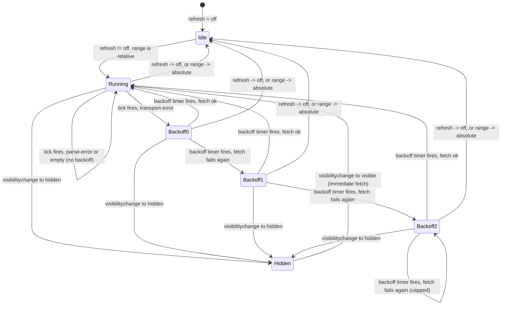

# ADR-0029 — Prism auto-refresh state machine

- **Status**: Accepted
- **Date**: 2026-05-07
- **Author**: `nw-solution-architect` (Morgan, dispatched by Bea)
- **Feature**: `prism` v0
- **Supersedes**: none
- **Superseded by**: none
- **Related**: ADR-0026 (`lib/auto-refresh/` module), ADR-0027
  (every tick fetches via `lib/promql/`), ADR-0028 (`refresh` URL
  parameter)

## Context

Slice 04 lights up auto-refresh: the operator picks one of `5s`, `10s`,
`30s`, `1m` and the chart re-fetches at that cadence. Slice 04's brief
identifies the complexity drivers:

- Page Visibility API (pause when tab hidden, fresh fetch on return).
- AbortController (cancel an in-flight fetch when the next tick fires).
- Interaction with Slice 03's error states (a tick that fails renders
  per Slice 03's contract; the next tick still fires).
- Backoff on **transport errors only** (per the journey-visual State E
  description; application errors do NOT backoff because the operator
  is actively iterating on the query).
- Absolute time ranges disable auto-refresh entirely.

The DISCUSS journey-visual specified "5 → 10 → 30 s" backoff curve;
Bea's pre-locked decision adjusted this to `5s → 10s → 20s → 30s
(capped)` because the doubling shape is the natural mental model and
the 10→30 jump is a discontinuity operators have to learn separately.

This ADR locks: the state machine's states and transitions, the
event vocabulary, the AbortController integration, the Page Visibility
integration, the interaction with absolute ranges, and the testing
posture (the reducer is pure; the time source is injectable).

## Decision

### 1. State machine

Three states:



The four states are `idle`, `running`, `backoff(retry: 0|1|2)`, and
`hidden`. The `retry` payload is part of the state, not the timer; the
backoff delay (5/10/20/30s capped) is derived from `retry` at scheduling
time. `hidden` is a parking state: any timer is cleared on entry, and
re-entry to `running` schedules an immediate fetch (the "fresh fetch
on visible" contract from Slice 04 § AC-5.4).

### 2. Event vocabulary

```ts
// apps/prism/src/lib/auto-refresh/events.ts

export type AutoRefreshEvent =
  | { kind: 'refresh-changed'; interval: RefreshInterval }
  | { kind: 'range-changed'; range: TimeRange }
  | { kind: 'tick-fired' }            // emitted by the timer
  | { kind: 'fetch-result'; outcome: QueryOutcome }
  | { kind: 'visibility-changed'; hidden: boolean };
```

Five events. Every state transition is the result of exactly one
event. The reducer's signature is pure:

```ts
export function reduce(
  state: AutoRefreshState,
  event: AutoRefreshEvent,
): { next: AutoRefreshState; effects: AutoRefreshEffect[] };
```

`effects` is a discriminated union of side effects the reducer cannot
perform itself: `{ kind: 'schedule-timer'; ms: number }`,
`{ kind: 'cancel-timer' }`, `{ kind: 'issue-fetch'; abortSignal: ... }`,
`{ kind: 'cancel-in-flight' }`. The side-effect runner lives in a
React `useEffect` in the QueryPanel; it consumes the effects list and
performs them. This is the same shape Elm-style architectures use, and
it makes every transition unit-testable as `(state, event) -> (state,
effects)`.

### 3. AbortController integration

Every fetch issued from the auto-refresh state machine carries an
`AbortController`'s signal. When the state machine emits a new
`issue-fetch` effect while a previous fetch is still pending, the
side-effect runner first calls the previous controller's `abort()`,
then issues the new fetch. The previous fetch resolves to
`transport-error: aborted` per ADR-0027 § 3, and the QueryPanel's
rendering arm for `aborted` is a no-op (no error banner, no chart
update).

This is Slice 04 § AC's "if a tick fires while a previous fetch is
still in flight, the previous fetch is cancelled and only the new
tick's result is rendered" requirement.

### 4. Backoff curve

Pre-locked: `5s → 10s → 20s → 30s (capped)`, on success reset to the
picked interval.

| Retry count | Delay before next attempt |
|---|---|
| 0 | 5 s (entered Backoff0) |
| 1 | 10 s (entered Backoff1) |
| 2 | 20 s (entered Backoff2) |
| 3+ | 30 s (capped, stays in Backoff2 with retry = 2) |

Note that `Backoff2` is a self-loop on continued failure, with the
delay capped at 30 s. The retry count does not increment past 2
because the only operationally-visible signal at that point is "still
broken at the cap"; an unbounded counter would only matter if the
backoff curve continued growing, which it does not.

The curve applies ONLY to `transport-error` outcomes (per ADR-0027 § 3).
A `parse-error` outcome (operator typed a malformed PromQL) is rendered
inline and the next tick fires at the picked interval — there is no
point in backing off when the operator is iterating on the query. An
`empty` outcome is similarly not a backoff trigger; an empty result is
information, not an error. The reducer pattern-matches on
`outcome.kind` to decide the transition.

### 5. Page Visibility integration

The QueryPanel registers a `document.addEventListener('visibilitychange',
handler)` in a `useEffect`. The handler dispatches a
`visibility-changed` event into the reducer. The reducer transitions
to `hidden` (clearing any timer effect) or back to `running` (with
an immediate `issue-fetch` effect followed by a `schedule-timer` for
the next tick).

The handler is registered at mount and removed at unmount. It does
NOT touch the reducer's internals; it only emits events.

### 6. Absolute-range disable

When the picker switches to an absolute range, the QueryPanel emits
`range-changed` into the reducer. The reducer's transition for
`range-changed` with `range.kind === 'absolute'` is unconditional:
move to `idle`, cancel any timer effect, cancel any in-flight fetch.
Symmetrically, `range-changed` with `range.kind === 'relative'` and
`refresh !== 'off'` moves to `running` with a `schedule-timer` effect.

The absolute-disables-auto invariant is enforced TWICE: at the picker
(the auto-refresh dropdown is greyed out) and at the reducer (any
`tick-fired` event in `idle` state is a no-op). The double lock
defends against a UI bug where the picker visibility lags the actual
range state.

### 7. Time source injection

The reducer is a pure function. The side-effect runner (the
`useEffect` in the QueryPanel) is the only place that calls
`setTimeout` / `clearTimeout`. For testing, the runner accepts a
`Scheduler` interface:

```ts
export type Scheduler = {
  schedule(ms: number, fn: () => void): TimerHandle;
  cancel(handle: TimerHandle): void;
};
```

Production passes a `setTimeout`-backed scheduler; Vitest tests pass
a fake scheduler with a controllable clock. This is the same
test-seam shape every other adapter in `lib/` uses (config, fetch,
ECharts wrapper).

### 8. Status-line read model

The QueryPanel's status line above the chart shows
`Last fetched ${last_fetch_time} · next in ${next_tick_in} s`. Both
fields derive from the auto-refresh state plus a separate timer that
ticks once per second to update the countdown. The separate countdown
timer is intentional: re-rendering the status line every second does
not re-issue fetches, and the chart's `setOption` is not called.

The state-machine timer (the one that fires `tick-fired`) is the
**only** timer that issues fetches. The countdown timer is a
display-only concern.

## Alternatives considered

### Option A (rejected): `setInterval` with a top-level cleanup

The naive shape: `setInterval(refetch, ms)` plus a `clearInterval` on
unmount and on interval change. Argument for: minimal code. Argument
against (and the reason this ADR rejects it): `setInterval` does not
compose with backoff (the interval is fixed; backoff requires
re-scheduling) and does not compose with Page Visibility (pausing an
interval requires clearing and re-scheduling, which has the same shape
as the reducer-driven approach but with more places to forget). The
state-machine shape is barely more code and has every transition
visible.

### Option B (rejected): React Query / SWR for auto-refresh

`react-query` and `swr` both ship `refetchInterval` and Page Visibility
integration. Argument for: zero state-machine code. Argument against:
the bundle cost (react-query is ~13 KB minified+gzipped; swr is ~5 KB)
plus opinionated cache (which conflicts with KPI 3's no-cache invariant)
and an interaction model that does not fit Prism's "Run-button-issues-
a-fetch-and-also-the-tick-issues-a-fetch" semantics. The pre-locked
decision (no state-management library; native fetch) covers this.

### Option C (rejected): Backoff on every error kind

Argument for: simpler reducer, one branch for "any error → backoff".
Argument against: a parse error is the operator's typo; backing off the
auto-refresh because of it would slow down their next iteration. Slice
04's complexity-drivers section calls this out: the interaction with
Slice 03's error states is the load-bearing piece, and backoff on the
wrong kind of error is operationally hostile.

### Option D (rejected): Backoff resets on any tick, not just on success

Argument for: simpler "reset to retry=0 every minute" cadence.
Argument against: it makes the backoff curve flatten; the operator
sees the chart re-fetch every 5 s even when the backend has been
unreachable for ten minutes. The locked design (reset only on
success) keeps the tick rate at the cap when the backend remains down.

## Consequences

### Positive

- **The reducer is pure and testable**. Every transition is a Vitest
  test of the form `reduce(state, event) === { next, effects }`.
  Mutation testing covers every branch.
- **The side-effect runner is the only impure piece**. It is a
  thin `useEffect` that consumes effects and calls `setTimeout` /
  `fetch` / `abort`. The seam between pure and impure is one
  function boundary.
- **Backoff curve is operator-honest**. The doubling shape (5/10/20/30
  capped) matches the operator's mental model better than the
  DISCUSS-original 5/10/30 shape.
- **AbortController integration prevents stale renders**. A late-arriving
  fetch from a previous tick cannot overwrite the chart with stale data.
- **Page Visibility integration meets KPI 5's "page-stays-usable"**.
  Hidden tabs do not pile up failed fetches; resumed tabs see a fresh
  data point immediately.

### Negative

- **The reducer plus side-effect-runner shape is more ceremony than
  Slice 04's brief might suggest**. A first-pass implementation might
  put `setInterval` directly in `panels/query/`. The ADR locks the
  reducer shape because Slice 04's complexity drivers (backoff,
  Page Visibility, AbortController, error-state interaction) all need
  the same state-transition vocabulary; landing it as a reducer pays
  off at the second cross-cutting concern.
- **The countdown timer is its own thing**. Two timers (one for fetches,
  one for the countdown display) means two places to clean up at
  unmount. Mitigation: both timers live in the same `useEffect` and
  share the cleanup return value.

### Trade-off summary

The reducer-and-effects shape is a small fixed cost that absorbs all
four of Slice 04's complexity drivers without a refactor. The
alternative (start naive, refactor later) costs more in DELIVER drift.

## Verification

- Vitest unit tests cover every transition in the state diagram, with
  a fake scheduler driving the time source.
- Vitest property test: for any sequence of events, the reducer never
  emits a `schedule-timer` effect without a prior `cancel-timer`
  effect for the previous timer. (No timer leaks.)
- Vitest property test: every `transport-error: aborted` outcome is
  silently ignored (no banner, no state change).
- Playwright E2E (Slice 04) asserts auto-refresh tick cadence at
  `5s`, `10s`, `30s`, `1m`, the disable-on-absolute behaviour, and
  the Page Visibility pause/resume.
- Playwright E2E exercises the backoff curve by killing the local
  Prometheus mid-test and observing the next four delays are
  5/10/20/30 s.
