# Kaleidoscope — Architecture Brief

> **Scope**: This brief is bootstrapped by the DESIGN wave for `otlp-conformance-harness-v0`. Platform-level architecture lives in [`../../architecture/kaleidoscope-architecture.md`](../../architecture/kaleidoscope-architecture.md) and is **not duplicated here**. Subsequent feature DESIGN waves append their own application-architecture sections; the platform sections (`## System Architecture`, `## Domain Model`) remain owned by their respective architects (`nw-titan-architect`, `nw-hera-architect`) and are absent for this feature because Andrea has decided not to invoke them for the OTLP conformance harness.

---

## Document Ownership

| Section | Owner agent | Status for `otlp-conformance-harness-v0` |
|---|---|---|
| `## System Architecture` | `nw-titan-architect` | Not invoked — platform-level architecture already documented in `docs/architecture/kaleidoscope-architecture.md` and is reused as-is. |
| `## Domain Model` | `nw-hera-architect` | Not invoked — the harness's domain model is the OTLP wire spec, owned upstream by OpenTelemetry. The harness does not introduce new domain concepts. |
| `## Application Architecture` | `nw-solution-architect` (Morgan) | **This document, this section.** |

---

## Application Architecture

> **Author**: `nw-solution-architect` (Morgan), DESIGN wave, 2026-05-03.
> **Feature**: `otlp-conformance-harness-v0` — a Rust crate at `crates/otlp-conformance-harness/` that validates byte sequences against the OpenTelemetry OTLP wire specification. Phase-0 leaf dependency. Consumed by every later Kaleidoscope component (Aperture, Codex, Spark, Pulse, Lumen, Ray, Strata) and by third-party OTel implementers. Released under Apache-2.0 per the SDK / protocol-library class in `LICENSING.md`.

### Mode of operation

This DESIGN wave executed in **propose mode** (Decision 1 of `/nw-design`). Two-to-three options were enumerated for each load-bearing decision below; one option per decision is recommended with a rationale traceable to the user stories, the outcome KPIs, and the platform-level architecture.

### Reuse of platform-level decisions (not re-derived)

The following are **inherited** from `docs/architecture/kaleidoscope-architecture.md` and `docs/roadmap/kaleidoscope-implementation-roadmap.md`. The application architecture builds on them and does not re-litigate them.

1. **Licence**: per-crate per `LICENSING.md`. Platform components are AGPL-3.0-or-later; SDKs and protocol libraries (including this harness) are Apache-2.0. Migration from CC0-1.0 took place on 2026-05-05; brief commits before the migration date were authored under the CC0 framing of the time.
2. **Substrate locked at the Apache Foundation level**: `opentelemetry-proto` (Apache-2.0) is on the substrate boundary. Per the architecture document's stratum diagram, Apache-Foundation-stewarded projects are exempt from port-and-adapter discipline — this is why the harness embeds the upstream types directly rather than wrapping them.
3. **No telemetry from telemetry**: roadmap section A.2 forbids the harness from emitting any output of its own (stdout, stderr, logging facade). Harness-internal observation is delivered only through the `Result` return value.
4. **Library, not service**: DISCUSS D1 fixed the harness as a Rust crate consumed via Cargo, with no UI, no network surface, no listening ports, no daemon.
5. **Spec version**: pinned via `[package.metadata.kaleidoscope.otlp]` and re-exported as `pub const OTLP_SPEC_VERSION` (per `shared-artifacts-registry.md > otlp_spec_version`).

### Paradigm

**Rust idiomatic data-plus-functions style with `trait`s only where polymorphism is genuinely needed.** No class hierarchies (Rust has none); no `dyn Trait` indirection where direct generic monomorphisation suffices; composition over inheritance throughout. The harness exposes three free functions and a small set of `pub` data types (one error struct, three enums). This is the natural shape of the problem and matches the Rust ecosystem's conventions for validation-and-decode libraries (`serde_json`, `prost`, `regex` all expose this shape).

There is no `crates/otlp-conformance-harness/CLAUDE.md` declaration today because the file does not yet exist (greenfield repository, no Rust code yet). **Recommendation to Andrea**: when convenient, add a CLAUDE.md to the crate root with a single-line paradigm declaration so the DELIVER wave's `nw-software-crafter` agent invocation is unambiguous. The text should be:

```text
# Paradigm
This crate is written in idiomatic Rust: data + free functions + traits only where polymorphism is genuinely required. No class-style inheritance hierarchies. Composition over inheritance.
```

This is **not** a DESIGN-wave artefact — it is a project-level note. The DESIGN wave records the paradigm choice here so the DISTILL and DELIVER waves can read it without ambiguity.

### Crate layout (recommended option, see ADR-0001)

```
crates/
└── otlp-conformance-harness/
    ├── Cargo.toml
    ├── README.md
    ├── src/
    │   ├── lib.rs                # public surface: re-exports, pub fn validate_*
    │   ├── framing.rs            # pub enum Framing
    │   ├── signal.rs             # pub enum SignalType
    │   ├── violation.rs          # pub struct OtlpViolation, pub enum Rule, pub enum WireTypeRule, pub enum ByteOffset
    │   ├── decode.rs             # internal: decode dispatch (logs/traces/metrics) + signal-mismatch fallback
    │   └── validate.rs           # internal: the three validate_* implementations; lib.rs delegates here
    └── tests/
        ├── slice_01_empty_rejected.rs
        ├── slice_02_malformed_protobuf_rejected.rs
        ├── slice_03_signal_mismatch_rejected.rs
        ├── slice_04_logs_accepted.rs
        ├── slice_05_traces_accepted.rs
        ├── slice_06_metrics_accepted.rs
        ├── corpus.rs             # the slice-07 corpus runner
        └── vectors/
            ├── logs/
            │   ├── accept/{minimal.bin, minimal.expected.json}
            │   └── reject/{empty.bin, empty.expected.json, truncated.bin, truncated.expected.json,
            │                bad_varint.bin, bad_varint.expected.json,
            │                bad_tag.bin, bad_tag.expected.json,
            │                traces_misrouted.bin, traces_misrouted.expected.json,
            │                metrics_misrouted.bin, metrics_misrouted.expected.json}
            ├── traces/
            │   ├── accept/{minimal.bin, minimal.expected.json}
            │   └── reject/{empty.bin, empty.expected.json,
            │                logs_misrouted.bin, logs_misrouted.expected.json,
            │                metrics_misrouted.bin, metrics_misrouted.expected.json}
            └── metrics/
                ├── accept/{minimal.bin, minimal.expected.json}
                └── reject/{empty.bin, empty.expected.json,
                             logs_misrouted.bin, logs_misrouted.expected.json,
                             traces_misrouted.bin, traces_misrouted.expected.json}
```

The crate is split into modules from day one, but `lib.rs` is the only public surface — internal modules are crate-private (`pub(crate)`) and re-exports name only the items the public contract requires.

### Public surface — locked by US-06 AC 5

The three function signatures below are **constraints, not options** (US-06 AC 5, line 583 of `user-stories.md`):

```rust
pub fn validate_logs(
    bytes: &[u8],
    framing: Framing,
) -> Result<opentelemetry_proto::tonic::collector::logs::v1::ExportLogsServiceRequest, OtlpViolation>;

pub fn validate_traces(
    bytes: &[u8],
    framing: Framing,
) -> Result<opentelemetry_proto::tonic::collector::trace::v1::ExportTraceServiceRequest, OtlpViolation>;

pub fn validate_metrics(
    bytes: &[u8],
    framing: Framing,
) -> Result<opentelemetry_proto::tonic::collector::metrics::v1::ExportMetricsServiceRequest, OtlpViolation>;
```

Plus the public types named by the user stories:

```rust
pub enum Framing { /* HttpProtobuf, GrpcProtobuf */ }            // #[non_exhaustive]
pub enum SignalType { Logs, Traces, Metrics }                    // #[non_exhaustive]
pub struct OtlpViolation { /* see ADR-0002 for fields */ }
pub enum Rule { EmptyInput, WireType(WireTypeRule), /* future */ } // #[non_exhaustive]
pub enum WireTypeRule {                                            // #[non_exhaustive]
    ProtobufDecode,
    SignalMismatch { observed: SignalType, asserted: SignalType },
}
pub enum ByteOffset { Known(usize), Unknown }                      // #[non_exhaustive]
pub const OTLP_SPEC_VERSION: &str;
```

The crate **does not** wrap, rename, or shadow any `opentelemetry_proto::*` type (US-04 AC 2). The crate **does not** re-export `opentelemetry_proto` or any of its modules — consumers must declare their own dependency, ensuring the dependency edge is visible in their `Cargo.toml`.

### Recommendations summary (for fast skim)

| Decision | Recommended option | ADR |
|---|---|---|
| Public API surface and crate layout | Free functions in `lib.rs`, internal modules from day one, no `Validator` struct | [ADR-0001](adr-0001-public-api-surface-and-crate-layout.md) |
| `OtlpViolation` error-type design | Nested `Rule::WireType(WireTypeRule)` enum, `#[non_exhaustive]` everywhere, `std::error::Error` impl with single-line `Display`, `prost::DecodeError` wrapped via `source()` | [ADR-0002](adr-0002-otlp-violation-error-type-design.md) |
| `opentelemetry-proto` pinning policy | Caret pin to a single minor version, version recorded in spec-version metadata, vendoring deferred to v1 if drift becomes painful | [ADR-0003](adr-0003-opentelemetry-proto-pinning-policy.md) |
| Conformance-test-vector layout | Per-signal then per-verdict hierarchy (`{logs,traces,metrics}/{accept,reject}/`), sibling `.expected.json`, SHA-256 hex content hash, runner walks recursively | [ADR-0004](adr-0004-conformance-test-vector-layout.md) |
| CI contract | Five gates: `cargo test --all-targets`, `cargo deny check`, `cargo public-api`, `cargo semver-checks`, `cargo mutants`. Mechanism (workflow runner) deferred to DEVOPS. | [ADR-0005](adr-0005-ci-contract.md) |

Architectural-rule enforcement (Principle 11): a workspace-level lint package and `cargo deny` configuration enforce the rules above. See ADR-0005.

### Quality attributes addressed (ISO 25010)

| Attribute | How the architecture addresses it |
|---|---|
| **Functional Suitability — Correctness** | The closed-rule discipline (US System Constraint 3) and the corpus runner (US-07) make every named verdict observable and regression-defended. |
| **Performance Efficiency** | Validation is synchronous, allocation is the upstream `prost` decoder's (one decoded message per call), no I/O. The signal-mismatch fallback (US-03) costs at most two extra decode attempts on the failure path; KPI 7 tracks this without a v0 SLA. |
| **Compatibility — Interoperability** | The accept-path return type is the upstream `opentelemetry_proto::tonic::collector::*::v1::Export*ServiceRequest` exactly, so downstream consumers (Aperture, Sluice, every storage engine) feed the value through with zero conversion. |
| **Reliability — Maturity** | The harness has no internal state, no I/O, no panics on user input (US System Constraint 5). The only panic-able surface is invariants in the harness's own enum dispatch, which mutation testing exercises. |
| **Security — Integrity** | `EmptyInput` and `ProtobufDecode` shield downstream from confused-deputy errors (e.g. acting on a half-decoded record). `SignalMismatch` shields the storage layer from cross-signal pollution. |
| **Maintainability — Modularity, Testability** | The crate is single-purpose; modules are split by concept (framing, signal, violation, decode, validate). Every public function has at least one corpus vector defending it. |
| **Maintainability — Modifiability** | `#[non_exhaustive]` on every public enum makes additive evolution non-breaking. New rules and new framings ship in minor versions. Consumers that want exhaustive matching opt in via `#[deny(non_exhaustive_omitted_patterns)]`. |
| **Portability** | Pure Rust, no platform-specific code, no `unsafe`. Builds on every platform Rust targets. |

ATAM sensitivity points: (i) the `prost::DecodeError`-to-`ByteOffset` mapping (degrades KPI 6 if mapping is poor), (ii) `opentelemetry-proto` semver behaviour at MINOR bumps (degrades KPI 1 if upstream silently changes accept-path semantics). Both addressed in ADR-0003.

ATAM trade-off points: nesting `Rule::WireType(WireTypeRule)` (verbose pattern matching for the closed-rule consumer ↔ extensibility room for v0.1 rules without rule-namespace pollution). Addressed in ADR-0002.

### Earned Trust (Principle 12)

The harness is an in-process pure function; it does not depend on the filesystem, time, the kernel, or any vendor SDK at runtime. The only dependency-on-the-world it has is **`opentelemetry-proto` actually decoding the way its documentation says it does at the version pinned**. This is probed at construction time of the corpus runner (slice-07), which on every CI run:

1. Decodes every accept vector and asserts `Ok(_)`.
2. Decodes every reject vector and asserts the declared rule.
3. Re-checks every vector's SHA-256 against its descriptor before invoking the harness (catches corpus mutation).
4. Enumerates the `Rule` variants and refuses to run if any variant has zero defending reject vectors.

The corpus runner itself **is** the probe contract. There is no separate `probe()` method because the harness has no ports — it is a substrate-level pure function. The structural-check layer (Principle 12c) is therefore the public-API check (`cargo public-api`) which catches signature drift at compile time, and the behavioural-check layer is the corpus runner. The subtype-check layer is degenerate (no traits to check). The three Earned-Trust layers reduce to two for a pure-function leaf, which is the minimum the principle permits.

For environments-known-to-lie: the `opentelemetry-proto` crate uses `prost`, which has well-documented behaviour for malformed input. The corpus's reject vectors (`bad_varint.bin`, `bad_tag.bin`, `truncated.bin`) **are** the catalogued substrate lies — bytes that look reasonable but that `prost` must refuse, asserted to fail with the harness's `ProtobufDecode` rule. KPI 6 (one reject vector per rule) is the structural enforcement.

### External integrations

**None at runtime.** The harness has no external network surface, no third-party API consumption, no webhooks, no OAuth providers. The only external dependency is the `opentelemetry-proto` Cargo crate at build time, which is on the substrate boundary and is pinned per ADR-0003.

No contract tests are required for the v0 release. (If a future v1 introduces an external corpus mirror, contract testing recommendations would re-enter the picture.)

### Conway's Law check

This is a **single-author crate** built by a single AI agent (the DELIVER wave's `nw-software-crafter`). The architecture's modular split is for *readability and audit*, not for parallel team development. Conway's Law is satisfied trivially: one author, one module graph.

---

## C4 — System Context (Level 1)

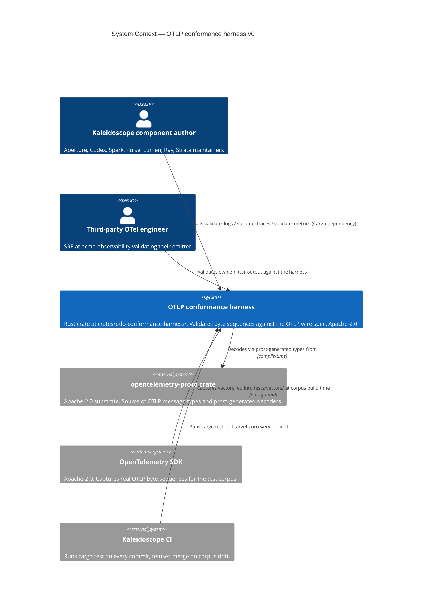
```mermaid
C4Context
  title System Context — OTLP conformance harness v0
  Person(component_author, "Kaleidoscope component author", "Aperture, Codex, Spark, Pulse, Lumen, Ray, Strata maintainers")
  Person(third_party, "Third-party OTel engineer", "SRE at acme-observability validating their emitter")
  System(harness, "OTLP conformance harness", "Rust crate at crates/otlp-conformance-harness/. Validates byte sequences against the OTLP wire spec. Apache-2.0.")
  System_Ext(otel_proto, "opentelemetry-proto crate", "Apache-2.0 substrate. Source of OTLP message types and prost-generated decoders.")
  System_Ext(otel_sdk, "OpenTelemetry SDK", "Apache-2.0. Captures real OTLP byte sequences for the test corpus.")
  System_Ext(ci, "Kaleidoscope CI", "Runs cargo test on every commit, refuses merge on corpus drift.")

  Rel(component_author, harness, "Calls validate_logs / validate_traces / validate_metrics (Cargo dependency)")
  Rel(third_party, harness, "Validates own emitter output against the harness")
  Rel(harness, otel_proto, "Decodes via prost-generated types from", "compile-time")
  Rel(otel_sdk, harness, "Captures vectors fed into tests/vectors/ at corpus build time", "out-of-band")
  Rel(ci, harness, "Runs cargo test --all-targets on every commit")
```

The harness sits as a single in-process box. OTLP byte sequences flow in (as `&[u8]`); `Result<RecordType, OtlpViolation>` flows out. There is no network, no daemon, no external API.

---

## C4 — Container View (Level 2)

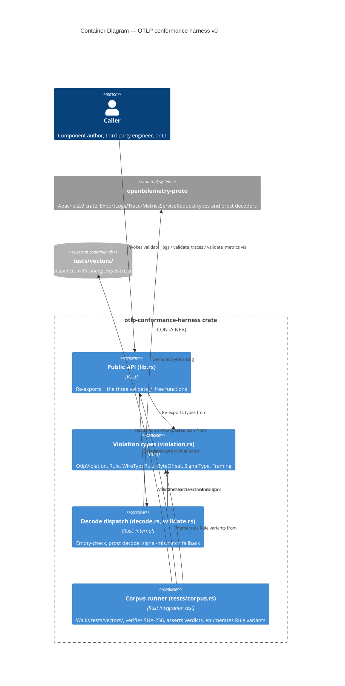
```mermaid
C4Container
  title Container Diagram — OTLP conformance harness v0
  Person(caller, "Caller", "Component author, third-party engineer, or CI")
  Container_Boundary(harness, "otlp-conformance-harness crate") {
    Container(public_api, "Public API (lib.rs)", "Rust", "Re-exports + the three validate_* free functions")
    Container(violation, "Violation types (violation.rs)", "Rust", "OtlpViolation, Rule, WireTypeRule, ByteOffset, SignalType, Framing")
    Container(decode, "Decode dispatch (decode.rs, validate.rs)", "Rust, internal", "Empty-check, prost decode, signal-mismatch fallback")
    Container(corpus_runner, "Corpus runner (tests/corpus.rs)", "Rust integration test", "Walks tests/vectors/, verifies SHA-256, asserts verdicts, enumerates Rule variants")
  }
  System_Ext(otel_proto, "opentelemetry-proto", "Apache-2.0 crate; ExportLogs/Trace/MetricsServiceRequest types and prost decoders")
  ContainerDb_Ext(vectors, "tests/vectors/", "On-disk byte sequences with sibling .expected.json descriptors")

  Rel(caller, public_api, "Invokes validate_logs / validate_traces / validate_metrics via")
  Rel(public_api, decode, "Delegates byte validation to")
  Rel(decode, otel_proto, "Decodes bytes using")
  Rel(decode, violation, "Constructs Err values from")
  Rel(public_api, violation, "Re-exports types from")
  Rel(corpus_runner, public_api, "Validates each vector through")
  Rel(corpus_runner, vectors, "Reads .bin and .expected.json from")
  Rel(corpus_runner, violation, "Enumerates Rule variants from")
```

The five "containers" inside the crate are not deployment units — they are conceptual modules, each a single Rust source file. The container view is shown because the architecture skill mandates L1+L2 minimum even for small systems.

---

## C4 — Component View (Level 3)

**Not produced.** The decode pipeline is three steps in sequence (empty check → prost decode → signal-mismatch fallback). Three steps do not warrant a separate diagram; the second-level Container diagram already captures the dispatch. Per the SA principle ("Component (L3) only for complex subsystems"), L3 is **explicitly skipped** for v0.

If a future v0.1 adds (for example) richer locus reporting that introduces a custom byte-offset tracker shared across decode strategies, an L3 diagram would be appropriate at that point.

---

## Open questions / hand-offs

- **Workspace topology**: this is the first Rust crate in the Kaleidoscope repository. The DEVOPS wave (`platform-architect`) decides whether `Cargo.toml` at the repo root sets up a workspace today (recommended: yes, with `members = ["crates/otlp-conformance-harness"]`), so future Phase-0 crates (Codex, Spark) can be added without restructuring. Not a DESIGN-wave decision; flagged here.
- **Workspace-level `cargo metadata` `opentelemetry-proto` consistency check**: deferred to a future story; `shared-artifacts-registry.md > otlp_wire_format` flags the requirement. The harness is the only consumer in v0 so the check is a no-op.
- **CLAUDE.md paradigm declaration at the crate root**: recommended to Andrea (see "Paradigm" above). Not blocking the DELIVER wave; the paradigm is documented here.

---

## Handoff to DISTILL

Recipient: `nw-acceptance-designer`. The acceptance designer turns the BDD scenarios in `discuss/user-stories.md` and `discuss/journey-validate-otlp-bytes.yaml` into executable Cargo tests against the public surface defined above. No new requirements are introduced by DESIGN; the DESIGN-wave output crystallises *how* the v0 contract is shaped without changing *what* the contract is.

Required reading order for DISTILL:

1. This brief (`docs/product/architecture/brief.md`) for the recommended public surface and the layout.
2. The five ADRs (`docs/product/architecture/adr-000{1..5}-*.md`) for the decision rationale.
3. The `wave-decisions.md` summary in the feature directory for the DESIGN-wave decision log.
4. The DISCUSS artefacts (locked, do not modify).

## Handoff to DEVOPS

Recipient: `nw-platform-architect`. Receives:

- `docs/feature/otlp-conformance-harness-v0/discuss/outcome-kpis.md` — the seven KPIs with measurement plans.
- ADR-0005's CI contract — the five required gates and their exit conditions.
- The `cargo deny` configuration recommendation in ADR-0003.
- No external integrations exist; no contract-test recommendations apply for v0.

The platform architect chooses the workflow runner (GitHub Actions, Gitea Actions, Forgejo Actions, Drone, etc.) and writes the runner-specific YAML. The contract gates listed in ADR-0005 are runner-agnostic and must all pass on every commit affecting `crates/otlp-conformance-harness/**`.

---

## Application Architecture — cinder-to-pulse-bridge-v0

> **Author**: `nw-solution-architect` (Morgan), DESIGN wave, 2026-05-18.
> **Feature**: `cinder-to-pulse-bridge-v0` — adds `CinderToPulseRecorder` to the `self-observe` crate. The bridge implements `cinder::MetricsRecorder` and writes each Cinder tier event as a single-point Pulse `MetricBatch`. Library-only at v0; the operator-visible CLI surface is a separate follow-up feature. AGPL-3.0-or-later, matching the rest of the workspace.
> **Mode of operation**: PROPOSE — two-to-three options enumerated for each load-bearing decision (test seam, file location, public-surface shape, ADR scope); one option recommended per decision with traceable rationale. See the feature-side `design/wave-decisions.md` and `design/application-architecture.md` for the full propose-mode walkthrough; ADR-0038 for the formal record.

### Reuse of platform-level decisions (not re-derived)

The following are **inherited** from prior DESIGN waves and from `docs/architecture/kaleidoscope-architecture.md`:

1. **Licence**: AGPL-3.0-or-later for the `self-observe` crate; matches the rest of the workspace.
2. **Paradigm**: Rust idiomatic per `CLAUDE.md` — data + free functions + traits only where polymorphism is genuinely needed. The bridge holds `Arc<dyn MetricStore + Send + Sync>` because the store is runtime-supplied and the trait-object indirection is the right shape for the boundary (exactly as `LumenToPulseRecorder` already does — `crates/self-observe/src/lumen_bridge.rs:42-50`). No class hierarchies; no inheritance; no `dyn Trait` where direct generic monomorphisation would suffice.
3. **CI contract**: inherits ADR-0005's five workspace gates (`cargo test --workspace`, `cargo deny check`, `cargo public-api`, `cargo semver-checks`, `cargo mutants` at 100% kill rate). No new gate is added; no existing gate is amended.
4. **Mutation testing scope**: per `CLAUDE.md`, per-feature, scoped to the modified files (`crates/self-observe/src/cinder_bridge.rs`). 100% kill rate per ADR-0005 Gate 5.

### Reuse Analysis (RCA F-1 hard gate)

| Existing component | Path | Decision |
|--------------------|------|----------|
| `LumenToPulseRecorder` | `crates/self-observe/src/lumen_bridge.rs` | **REUSE THE SHAPE** (not the type). Traits in different crates cannot unify under one generic; the bridge clones the precedent's shape byte-equivalently for the public surface. |
| `pulse::InMemoryMetricStore` | `crates/pulse/src/store.rs:89-212` | **REUSE** as the acceptance-test assertion target. |
| `cinder::InMemoryTieringStore` | `crates/cinder/src/store.rs:89-233` | **REUSE** as the acceptance-test driver — the realistic operator wiring that lets the dual-emission contract (DISCUSS D3) be expressed naturally in one test. |
| `cinder::CapturingRecorder` | `crates/cinder/src/metrics.rs:57-110` | **REJECTED** as an additional assertion target — asserts what Cinder intends to emit, which Cinder's own crate already covers; the bridge's contract terminates at Pulse, not at an intermediate. |
| `self-observe` crate itself | `crates/self-observe/` | **REUSE.** The lib.rs comment at lines 44-47 explicitly anticipated `Cinder` bridge addition. Zero new crates. |

### Crate layout (incremental addition)

The bridge is a single new file in the existing `self-observe` crate:

```
crates/self-observe/
├── Cargo.toml                          # gains: cinder = { path = "../cinder", version = "0.1.0" }
│                                       #        [[test]] name = "cinder_to_pulse"
└── src/
    ├── lib.rs                          # gains: mod cinder_bridge; pub use cinder_bridge::CinderToPulseRecorder;
    ├── lumen_bridge.rs                 # unchanged (shipped at v0)
    ├── lumen_otlp_json.rs              # unchanged (shipped at v0)
    └── cinder_bridge.rs                # NEW — CinderToPulseRecorder
└── tests/
    ├── lumen_to_pulse.rs               # unchanged
    ├── lumen_to_otlp_json.rs           # unchanged
    └── cinder_to_pulse.rs              # NEW — acceptance tests, Slice 01/02/03 blocks
```

File-flat layout matches the established sibling pattern (lib.rs:51-52). A future `bridges/` subdirectory refactoring becomes warranted at ~8-10 sibling files (when Sluice / Augur / Ray / Strata bridges and their OTLP-JSON variants ship). See ADR-0038 §4 for the deferral rationale.

### Public surface — locked by ADR-0038

One new public item in the `self-observe` crate:

```rust
pub struct CinderToPulseRecorder {
    pulse: Arc<dyn MetricStore + Send + Sync>,
}

impl CinderToPulseRecorder {
    pub fn new(pulse: Arc<dyn MetricStore + Send + Sync>) -> Self;
}

impl cinder::MetricsRecorder for CinderToPulseRecorder {
    fn record_place(&self, tenant: &TenantId, tier: Tier);
    fn record_migrate(&self, tenant: &TenantId, from: Tier, to: Tier);
    fn record_evaluate(&self, tenant: &TenantId, migrated: usize);
}
```

The struct name, the single field name `pulse`, the constructor name and signature, and the three trait-method dispatches are **byte-equivalent** to `LumenToPulseRecorder` (modulo trait identity). The operator's mental model is one idiom shared across every bridge in `self-observe`: wire an `Arc<dyn MetricStore + Send + Sync>` to `XxxToPulseRecorder::new(...)`.

### Per-event emission contract — locked by ADR-0038 §2

| Cinder method | Metric name | Kind | Unit | Value | Point attributes |
|---------------|-------------|------|------|-------|------------------|
| `record_place(tenant, tier)` | `cinder.place.count` | `Sum` | `"1"` | `1.0` | `{"tier": lowercase(tier)}` |
| `record_migrate(tenant, from, to)` | `cinder.migrate.count` | `Sum` | `"1"` | `1.0` | `{"from": lowercase(from), "to": lowercase(to)}` |
| `record_evaluate(tenant, migrated)` | `cinder.evaluate.migrated.count` | `Sum` | `"1"` | `migrated as f64` | `{}` |

Where `lowercase(Tier::Hot) = "hot"`, `lowercase(Tier::Warm) = "warm"`, `lowercase(Tier::Cold) = "cold"`. Emission is best-effort: `let _ = pulse.ingest(tenant, batch)`. The `pulse::MetricStoreError` is empty at v0 (`crates/pulse/src/store.rs:35`); the explicit discard is forward-compatible for v1+.

### Recommendations summary (for fast skim)

| Decision | Recommended option | ADR |
|----------|--------------------|-----|
| Test seam | Drive Cinder through `InMemoryTieringStore`, assert against `InMemoryMetricStore`. Mirrors the Lumen bridge tests; naturally expresses the dual-emission contract. | [ADR-0038 §3](adr-0038-cinder-to-pulse-bridge-public-api-and-crate-layout.md) |
| Module file location | `crates/self-observe/src/cinder_bridge.rs` (file-flat, sibling to existing bridges). | [ADR-0038 §4](adr-0038-cinder-to-pulse-bridge-public-api-and-crate-layout.md) |
| Public surface shape | Byte-equivalent clone of `LumenToPulseRecorder` for the public surface; internal `emit` helper extended by one `attributes: BTreeMap<String, String>` parameter. | [ADR-0038 §1, §5](adr-0038-cinder-to-pulse-bridge-public-api-and-crate-layout.md) |
| ADR scope | One ADR (matches the Phase-1+ per-crate-public-API convention); cross-bridge test-seam ADR and lowercase-tier ADR deferred until a third bridge exemplar exists. | [ADR-0038 itself](adr-0038-cinder-to-pulse-bridge-public-api-and-crate-layout.md) |

Architectural-rule enforcement (Principle 11): inherits the existing five-gate workspace contract (ADR-0005). No new tooling is required.

### Quality attributes addressed (ISO 25010)

| Attribute | How the architecture addresses it |
|---|---|
| **Functional Suitability — Correctness** | Three trait methods each map to one metric name + one locked attribute schema per ADR-0038 §2. The lowercase-tier helper enforces DISCUSS D4 from one location. The dual-emission contract (D3) is inherited from `InMemoryTieringStore::evaluate_at` and exercised by Slice 03's tests. |
| **Performance Efficiency** | One `BTreeMap<String, String>` allocation per event (≤3 entries). One single-point `MetricBatch` per event. One `Mutex` acquisition inside `InMemoryMetricStore::ingest`. No async, no I/O, no network. |
| **Compatibility — Interoperability** | Consumes `cinder::MetricsRecorder` (upstream port) and produces `pulse::MetricBatch` (upstream type). No wrapping, no shadowing, no renaming. |
| **Reliability — Maturity** | Best-effort emission (D5) prevents a future non-empty `MetricStoreError` from propagating to Cinder (whose trait methods return `()`). The bridge cannot crash Cinder. |
| **Security — Integrity** | `tenant_id` forwarded unchanged from Cinder to Pulse; two-tenant isolation asserted in every slice's tests (defends shared-artifacts-registry HIGH-risk `tenant_id` invariant). |
| **Maintainability — Modularity, Testability** | One file, three trait methods. Acceptance tests per slice plus per-tenant-isolation tests plus no-event-no-point tests. Mutation-testing scope is one file at 100% kill rate (Gate 5). |
| **Maintainability — Modifiability** | Public surface locked by `cargo public-api -p self-observe` (Gate 2) and `cargo semver-checks` (Gate 3); any breaking change requires a major-version bump. |
| **Portability** | Pure Rust, no platform-specific code, no `unsafe`. Inherits the crate's `#![forbid(unsafe_code)]` posture. |

ATAM sensitivity points: (i) the `migrated as f64` cast on `record_evaluate` — exact for any operationally-meaningful count (≤ 2^53), defended by Slice 03; (ii) the lowercase serialisation of `Tier` (D4) — a single helper, asserted by Slice 01's three-tier test.

ATAM trade-off points: best-effort emission (D5) sacrifices error visibility to Cinder for forward compatibility with a future non-empty `MetricStoreError`. The trade is correct because (a) v0 emission cannot fail, (b) v1's loud-failing variant is a separate type (`CinderToPulseRecorderStrict`), not a flag.

### Earned Trust (Principle 12)

The bridge is an in-process function from `(TenantId, event)` to `pulse.ingest(...)`. It depends on the world only through the runtime-supplied `Arc<dyn MetricStore + Send + Sync>` and through `SystemTime::now()` for the `time_unix_nano` field on each emitted `MetricPoint`. No filesystem, no network, no vendor SDK, no subprocess.

The probe contract is the acceptance-test suite at `crates/self-observe/tests/cinder_to_pulse.rs`:

1. **Subtype-check layer**: `cargo public-api -p self-observe` (Gate 2) catches public-surface drift; the compile-time `fn assert_send_sync<T: Send + Sync>(); assert_send_sync::<CinderToPulseRecorder>();` test catches any loss of the `Send + Sync` trait bound.
2. **Behavioural-check layer**: per-slice tests exercise the per-event contract against a real `pulse::InMemoryMetricStore`; the Slice 03 dual-emission test exercises the cross-method contract end-to-end.

The structural layer is degenerate for a no-substrate adapter — there is no on-disk schema to defend against drift beyond the public surface, which the subtype layer already covers. This is the minimum the principle permits, matching the posture ADR-0001's `otlp-conformance-harness` documented for a pure-function leaf.

**Environments-known-to-lie**: none in scope. Acceptance tests use `TimeRange::all()` and assert on count + value + attributes, so clock-skew lies in the runtime environment do not affect test outcomes.

### External integrations

**None at runtime.** No external network surface, no third-party API, no webhooks, no OAuth, no subprocess. Dependencies are in-workspace path dependencies (`aegis`, `cinder`, `pulse`). No contract-test recommendation applies.

### Conway's Law check

Single-author crate addition built by a single AI agent (the DELIVER wave's `nw-software-crafter`). The bridge lives inside the `self-observe` crate, owned by Andrea. File-flat layout is for *readability and audit*, not for parallel team development. Satisfied trivially.

---

## C4 — System Context (Level 1) — `cinder-to-pulse-bridge-v0`

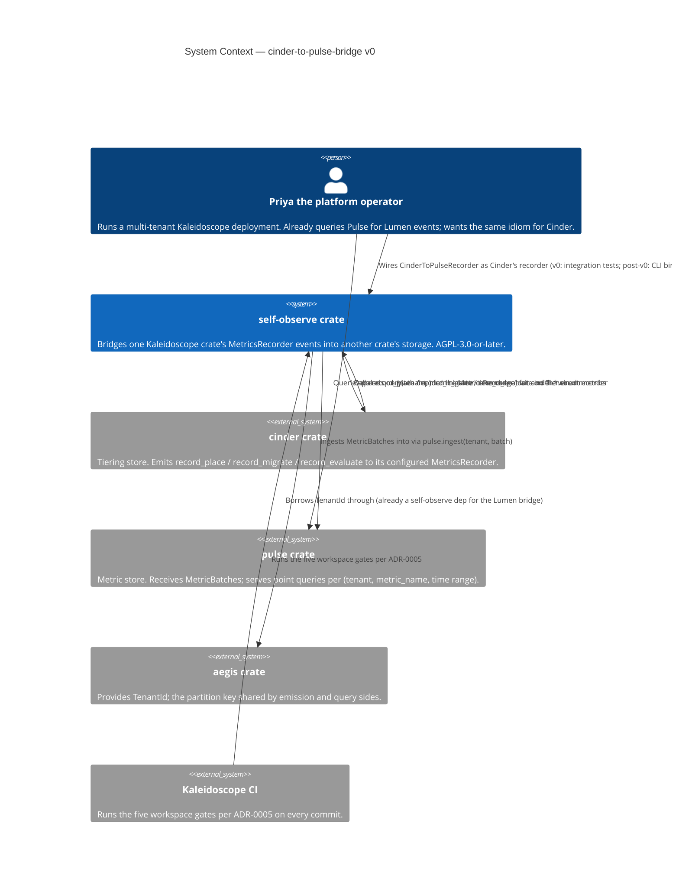
```mermaid
C4Context
  title System Context — cinder-to-pulse-bridge v0
  Person(operator, "Priya the platform operator", "Runs a multi-tenant Kaleidoscope deployment. Already queries Pulse for Lumen events; wants the same idiom for Cinder.")
  System(self_observe, "self-observe crate", "Bridges one Kaleidoscope crate's MetricsRecorder events into another crate's storage. AGPL-3.0-or-later.")
  System_Ext(cinder, "cinder crate", "Tiering store. Emits record_place / record_migrate / record_evaluate to its configured MetricsRecorder.")
  System_Ext(pulse, "pulse crate", "Metric store. Receives MetricBatches; serves point queries per (tenant, metric_name, time range).")
  System_Ext(aegis, "aegis crate", "Provides TenantId; the partition key shared by emission and query sides.")
  System_Ext(ci, "Kaleidoscope CI", "Runs the five workspace gates per ADR-0005 on every commit.")

  Rel(operator, self_observe, "Wires CinderToPulseRecorder as Cinder's recorder (v0: integration tests; post-v0: CLI binary)")
  Rel(self_observe, cinder, "Depends on (path dep) for the MetricsRecorder trait and Tier enum")
  Rel(cinder, self_observe, "Calls record_place / record_migrate / record_evaluate on the wired recorder")
  Rel(self_observe, pulse, "Ingests MetricBatches into via pulse.ingest(tenant, batch)")
  Rel(operator, pulse, "Queries pulse.query(tenant, metric_name, time_range) for cinder.*.count metrics")
  Rel(self_observe, aegis, "Borrows TenantId through (already a self-observe dep for the Lumen bridge)")
  Rel(ci, self_observe, "Runs the five workspace gates per ADR-0005")
```

---

## C4 — Container View (Level 2) — `cinder-to-pulse-bridge-v0`

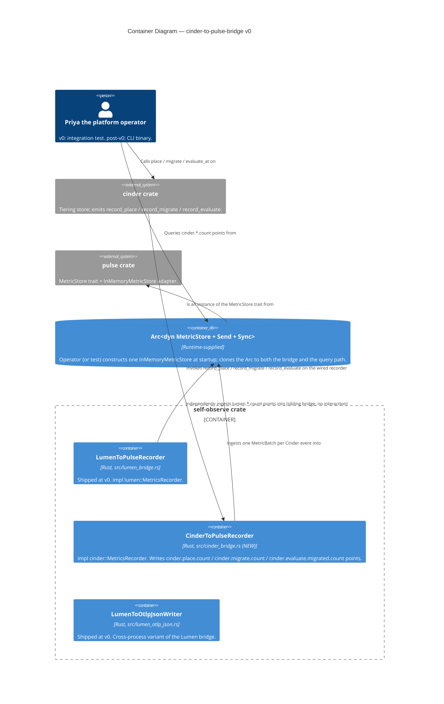
```mermaid
C4Container
  title Container Diagram — cinder-to-pulse-bridge v0
  Person(operator, "Priya the platform operator", "v0: integration test. post-v0: CLI binary.")
  Container_Boundary(self_observe, "self-observe crate") {
    Container(lumen_bridge, "LumenToPulseRecorder", "Rust, src/lumen_bridge.rs", "Shipped at v0. impl lumen::MetricsRecorder.")
    Container(cinder_bridge, "CinderToPulseRecorder", "Rust, src/cinder_bridge.rs (NEW)", "impl cinder::MetricsRecorder. Writes cinder.place.count / cinder.migrate.count / cinder.evaluate.migrated.count points.")
    Container(lumen_otlp_json, "LumenToOtlpJsonWriter", "Rust, src/lumen_otlp_json.rs", "Shipped at v0. Cross-process variant of the Lumen bridge.")
  }
  System_Ext(cinder, "cinder crate", "Tiering store; emits record_place / record_migrate / record_evaluate.")
  System_Ext(pulse, "pulse crate", "MetricStore trait + InMemoryMetricStore adapter.")
  ContainerDb(pulse_store, "Arc<dyn MetricStore + Send + Sync>", "Runtime-supplied", "Operator (or test) constructs one InMemoryMetricStore at startup; clones the Arc to both the bridge and the query path.")

  Rel(operator, cinder, "Calls place / migrate / evaluate_at on")
  Rel(cinder, cinder_bridge, "Invokes record_place / record_migrate / record_evaluate on the wired recorder")
  Rel(cinder_bridge, pulse_store, "Ingests one MetricBatch per Cinder event into")
  Rel(operator, pulse_store, "Queries cinder.*.count points from")
  Rel(pulse_store, pulse, "Is an instance of the MetricStore trait from")
  Rel(lumen_bridge, pulse_store, "Independently ingests lumen.*.count points into (sibling bridge, no interaction)")
```

The container view shows three sibling bridges inside `self-observe`, one of which (`CinderToPulseRecorder`) is new. The Pulse store is a single runtime-supplied `Arc` cloned to all bridges and to the query path; the shared-artifacts-registry's `pulse_store` MEDIUM-risk invariant ("operator must wire one Arc, not two instances") is satisfied by this shape.

The acceptance-test seam wires four nodes: test body → Cinder's store → bridge → Pulse store, with the test body also querying the Pulse store. The bridge is the *only* unit-under-test; Cinder and Pulse are infrastructure used to drive and observe it. See `docs/feature/cinder-to-pulse-bridge-v0/design/application-architecture.md > DD1` for the trade-off study.

---

## C4 — Component View (Level 3) — `cinder-to-pulse-bridge-v0`

**Not produced.** The new container (`CinderToPulseRecorder`) is one Rust source file with one struct, one constructor, three trait methods, and two private helpers. Per the SA principle ("Component (L3) only for complex subsystems"), L3 is **explicitly skipped** for v0. If a future v0.1 adds batching, per-tenant rate limiting, or attribute canonicalisation across bridges, L3 would become appropriate at that point.

---

## Handoff to DISTILL — `cinder-to-pulse-bridge-v0`

Recipient: `nw-acceptance-designer`. The acceptance designer translates `discuss/journey-observe-cinder-tier-transitions.feature` and the BDD scenarios in `discuss/user-stories.md` into executable Rust tests under `crates/self-observe/tests/cinder_to_pulse.rs`. No new requirements are introduced by DESIGN; the DESIGN-wave output crystallises *how* the v0 contract is shaped without changing *what* the contract is.

Required reading order for DISTILL:

1. This brief section (the `## Application Architecture — cinder-to-pulse-bridge-v0` block above) for the public surface and the per-event contract.
2. ADR-0038 for the decision rationale and the locked contract details.
3. The feature-side `design/wave-decisions.md` for the DESIGN-wave decision log.
4. The DISCUSS artefacts under `docs/feature/cinder-to-pulse-bridge-v0/discuss/` (locked, do not modify).

## Handoff to DEVOPS — `cinder-to-pulse-bridge-v0`

Recipient: `nw-platform-architect`. Receives:

- `docs/feature/cinder-to-pulse-bridge-v0/discuss/outcome-kpis.md` — the three outcome KPIs (one per slice).
- ADR-0005's CI contract — the five existing gates apply to this feature unchanged.
- The Cargo manifest delta in ADR-0038 §6: one new dependency declaration (`cinder = { path = "../cinder", version = "0.1.0" }`) and one new `[[test]]` block in `crates/self-observe/Cargo.toml`. No workspace-root `Cargo.toml` edit; the `cinder` crate is already a workspace member.
- Mutation-testing scope: per `CLAUDE.md`, scoped to `crates/self-observe/src/cinder_bridge.rs`, run after the DELIVER refactor pass, 100% kill rate per Gate 5.
- **External integrations**: **none**. No contract-test recommendations apply.
- **Development paradigm for DELIVER**: Rust idiomatic per `CLAUDE.md`. The bridge uses `Arc<dyn MetricStore + Send + Sync>` at the runtime-supplied store boundary because the trait-object indirection is the right shape there (per `LumenToPulseRecorder` precedent); elsewhere the crafter prefers direct generic monomorphisation.

---

## Application Architecture — cinder-to-otlp-json-bridge-v0

> **Author**: `nw-solution-architect` (Morgan), DESIGN wave, 2026-05-18.
> **Feature**: `cinder-to-otlp-json-bridge-v0` — adds `CinderToOtlpJsonWriter<W: Write + Send + Sync>` to the `self-observe` crate. The writer implements `cinder::MetricsRecorder` and emits one OTLP-JSON `ResourceMetrics` NDJSON line per Cinder tier event to a generic sink. Library-only at v0; CLI wiring (`--observe-otlp <path>`) is explicitly out of scope (DISCUSS D9) and ships as a follow-up feature, mirroring the Lumen pair already in production (commits `c6b336c`, `3af7e82`). AGPL-3.0-or-later, matching the rest of the workspace.
> **Mode of operation**: PROPOSE — two-to-three options enumerated for each load-bearing decision (module file location, attribute-array shape, test seam, stub posture, ADR scope); one option recommended per decision with traceable rationale. See the feature-side `design/wave-decisions.md` and `design/application-architecture.md` for the full propose-mode walkthrough; ADR-0039 for the formal record.

### Reuse of platform-level decisions (not re-derived)

The following are **inherited** from prior DESIGN waves and from `docs/architecture/kaleidoscope-architecture.md`:

1. **Licence**: AGPL-3.0-or-later for the `self-observe` crate; matches the rest of the workspace.
2. **Paradigm**: Rust idiomatic per `CLAUDE.md` — data + free functions + traits only where polymorphism is genuinely needed. The writer is generic over `W: Write + Send + Sync` because direct generic monomorphisation is the right shape at the sink seam (exactly as `LumenToOtlpJsonWriter` already does — `crates/self-observe/src/lumen_otlp_json.rs:128-140`). No class hierarchies; no inheritance; no `dyn Trait` where direct generic monomorphisation suffices. The only trait-object shape in the writer's surface comes from `cinder::MetricsRecorder`, which is implemented (not consumed) by the writer.
3. **CI contract**: inherits ADR-0005's five workspace gates (`cargo test --workspace`, `cargo deny check`, `cargo public-api`, `cargo semver-checks`, `cargo mutants` at 100% kill rate). No new gate is added; no existing gate is amended.
4. **Mutation testing scope**: per `CLAUDE.md`, per-feature, scoped to the modified files (`crates/self-observe/src/cinder_otlp_json.rs`). 100% kill rate per ADR-0005 Gate 5.
5. **Cross-bridge metric-name contract**: the three metric names (`cinder.place.count`, `cinder.migrate.count`, `cinder.evaluate.migrated.count`) and the lowercase-tier serialisation are **identical** to those locked by ADR-0038 §2 for the in-process Pulse-sink sibling. A code review diffing `cinder_bridge.rs` against `cinder_otlp_json.rs` surfaces any drift; the acceptance tests on both sides assert the strings independently.

### Reuse Analysis (RCA F-1 hard gate)

| Existing component | Path | Decision |
|--------------------|------|----------|
| `LumenToOtlpJsonWriter` | `crates/self-observe/src/lumen_otlp_json.rs` | **REUSE THE SHAPE** (not the type). The OTLP-JSON envelope serde structs are duplicated per DISCUSS D7 (rule-of-three deferral); the `Mutex<W>` + `write_all + write_all + flush` emission triple is replicated 1:1; the `time_unix_nano` derivation and the `tenant_id` resource+point double-emission are replicated 1:1. The struct *types* cannot be unified because Cinder's per-event point-attribute cardinality (1, 2, 3) differs from Lumen's uniform 1 — `OtlpNumberPoint.attributes` is typed `Vec<OtlpAttr<'a>>` here versus `[OtlpAttr<'a>; 1]` in Lumen. |
| `CinderToPulseRecorder` | `crates/self-observe/src/cinder_bridge.rs` | **REUSE THE EVENT-HANDLING SHAPE** (not the type). Same `impl cinder::MetricsRecorder` dispatch, same per-event attribute mapping, same `tier_lowercase` helper duplicated verbatim. The sink type differs (`Arc<dyn MetricStore>` there, `Mutex<W>` here), so the storage layer cannot be unified. |
| `cinder::InMemoryTieringStore` | `crates/cinder/src/store.rs:89-233` | **REUSE** as the acceptance-test driver. Same posture as ADR-0038 §3 / DD1: the dual-emission contract (DISCUSS D8) is naturally expressed only when Cinder's `evaluate_at` cascade runs end-to-end. |
| `cinder::CapturingRecorder` | `crates/cinder/src/metrics.rs:57-110` | **REJECTED** as an additional assertion target — same reason as ADR-0038 §3 Alternative 3: Cinder ships its own in-tree tests against `CapturingRecorder`; using it here duplicates Cinder's coverage without adding writer-specific evidence. The writer's contract terminates at the byte sequence on the `Write` sink. |
| `SharedBuf(Arc<Mutex<Vec<u8>>>)` test substrate | `crates/self-observe/tests/lumen_to_otlp_json.rs:54-64` | **REUSE THE PATTERN, duplicate the code.** The 11-line `SharedBuf` definition and the `collect_lines` helper are copied into `tests/cinder_to_otlp_json.rs`. Rule of three: extraction into a `tests/common.rs` becomes warranted when a third OTLP-JSON-writer test file lands. |
| Production `File` handle wiring | `kaleidoscope-cli/src/lib.rs:139-160` | **OUT OF SCOPE** (DISCUSS D9). The CLI follow-up plumbs the writer behind `--observe-otlp <path>`. v0 of this feature ships only the library; acceptance tests use `SharedBuf`. |
| `self-observe` crate itself | `crates/self-observe/` | **REUSE.** The lib.rs doc comment at lines 44-47 explicitly anticipates the `CinderToOtlpJsonWriter` addition as the fourth quadrant of the `{Source} × {sink}` writer matrix. Zero new crates. |

### Crate layout (incremental addition)

The writer is a single new file in the existing `self-observe` crate:

```
crates/self-observe/
├── Cargo.toml                          # gains: [[test]] name = "cinder_to_otlp_json"
│                                       # (the cinder = { path = "../cinder" } dep was added by the Pulse-sink sibling)
└── src/
    ├── lib.rs                          # gains: mod cinder_otlp_json; pub use cinder_otlp_json::CinderToOtlpJsonWriter;
    ├── lumen_bridge.rs                 # unchanged (shipped at v0)
    ├── lumen_otlp_json.rs              # unchanged (shipped at v0)
    ├── cinder_bridge.rs                # unchanged (shipped by cinder-to-pulse-bridge-v0, ADR-0038)
    └── cinder_otlp_json.rs             # NEW — CinderToOtlpJsonWriter
└── tests/
    ├── lumen_to_pulse.rs               # unchanged
    ├── lumen_to_otlp_json.rs           # unchanged
    ├── cinder_to_pulse.rs              # unchanged
    └── cinder_to_otlp_json.rs          # NEW — acceptance tests, Slice 01/02/03 blocks + Send+Sync probe
```

File-flat layout matches the established sibling pattern. After this feature ships, the crate root holds N=4 sibling writer files, comfortably below the ~8-10 threshold at which a `bridges/` subdirectory refactoring becomes warranted (when Sluice / Augur / Ray / Strata bridges and their OTLP-JSON variants ship). See ADR-0039 §4 (and the identical posture in ADR-0038 §4) for the deferral rationale.

### Public surface — locked by ADR-0039

One new public item in the `self-observe` crate:

```rust
pub struct CinderToOtlpJsonWriter<W: Write + Send + Sync> {
    inner: Mutex<W>,
    scope_name: String,
}

impl<W: Write + Send + Sync> CinderToOtlpJsonWriter<W> {
    pub fn new(inner: W) -> Self;
}

impl<W: Write + Send + Sync> cinder::MetricsRecorder for CinderToOtlpJsonWriter<W> {
    fn record_place(&self, tenant: &TenantId, tier: Tier);
    fn record_migrate(&self, tenant: &TenantId, from: Tier, to: Tier);
    fn record_evaluate(&self, tenant: &TenantId, migrated: usize);
}
```

The struct name, the generic bounds, the two field names (`inner`, `scope_name`) and their types, the constructor name and signature, and the three trait-method dispatches are **byte-equivalent** to `LumenToOtlpJsonWriter` (modulo the trait identity at the impl block). The operator's mental model is one idiom shared across every OTLP-JSON writer in `self-observe`: construct one `XxxToOtlpJsonWriter::new(W)` wrapping the sink and pass it as the upstream crate's recorder.

### Per-event emission contract — locked by ADR-0039 §2

| Cinder method | Metric name | Kind | `asInt` value | Point attributes |
|---------------|-------------|------|---------------|------------------|
| `record_place(tenant, tier)` | `cinder.place.count` | `Sum` (cumulative, monotonic) | `"1"` | `[{tenant_id: tenant.0}, {tier: lowercase(tier)}]` |
| `record_migrate(tenant, from, to)` | `cinder.migrate.count` | `Sum` (cumulative, monotonic) | `"1"` | `[{tenant_id: tenant.0}, {from: lowercase(from)}, {to: lowercase(to)}]` |
| `record_evaluate(tenant, migrated)` | `cinder.evaluate.migrated.count` | `Sum` (cumulative, monotonic) | `migrated.to_string()` | `[{tenant_id: tenant.0}]` |

Where `lowercase(Tier::Hot) = "hot"`, `lowercase(Tier::Warm) = "warm"`, `lowercase(Tier::Cold) = "cold"`. Each event becomes exactly one NDJSON line. The line is one `OtlpResourceMetrics` encoded as JSON: one resource attribute (`tenant_id`), one scope (`kaleidoscope.cinder`), one metric (per the table), one `OtlpSum` with `aggregationTemporality=2` (cumulative) and `isMonotonic=true`, one `OtlpNumberPoint`. All `asInt` values are JSON strings (per the OTLP-JSON encoding rule for `uint64`). Emission is best-effort: `let _ = writer.write_all(line.as_bytes()); let _ = writer.write_all(b"\n"); let _ = writer.flush();` inside the `Mutex<W>` guard's critical section.

### Recommendations summary (for fast skim)

| Decision | Recommended option | ADR |
|----------|--------------------|-----|
| Module file location | `crates/self-observe/src/cinder_otlp_json.rs` (file-flat, sibling to existing writers). | [ADR-0039 §4](adr-0039-cinder-to-otlp-json-bridge-public-api-and-crate-layout.md) |
| Attribute-array shape | One `OtlpNumberPoint` struct with `attributes: Vec<OtlpAttr<'a>>` (Cinder's per-event cardinality differs from Lumen's uniform 1); envelope-level `[T; 1]` arrays preserved. | [ADR-0039 §2, §5](adr-0039-cinder-to-otlp-json-bridge-public-api-and-crate-layout.md) |
| Test seam | Drive Cinder through `InMemoryTieringStore`; capture via `SharedBuf(Arc<Mutex<Vec<u8>>>)`; parse and assert as `serde_json::Value`. Mirrors the Lumen OTLP-JSON tests verbatim. | [ADR-0039 §3](adr-0039-cinder-to-otlp-json-bridge-public-api-and-crate-layout.md) |
| Stub posture (Slice 01) | Empty no-op `{}` for the two un-implemented methods; Slice 02 and Slice 03 RED tests are the loudness mechanism. | feature-side `design/wave-decisions.md > DD4` |
| Public surface shape | Byte-equivalent clone of `LumenToOtlpJsonWriter` for every part that can be byte-equivalent; the only structural divergence is `OtlpNumberPoint.attributes: Vec<OtlpAttr<'a>>` (forced by Cinder's per-event attribute cardinality). | [ADR-0039 §1, §5](adr-0039-cinder-to-otlp-json-bridge-public-api-and-crate-layout.md) |
| ADR scope | One ADR (ADR-0039); matches the Phase-1+ per-crate-public-API convention chain (ADR-0011/0018/0022/0026/0033/0038); cross-bridge serde-struct duplication ADR deferred until a third OTLP-JSON writer exemplar exists. | [ADR-0039 itself](adr-0039-cinder-to-otlp-json-bridge-public-api-and-crate-layout.md) |

Architectural-rule enforcement (Principle 11): inherits the existing five-gate workspace contract (ADR-0005). No new tooling is required.

### Quality attributes addressed (ISO 25010)

| Attribute | How the architecture addresses it |
|---|---|
| **Functional Suitability — Correctness** | Three trait methods each map to one locked metric name + one locked attribute schema per ADR-0039 §2. The `tier_lowercase` helper enforces DISCUSS D3 from one source location. The dual-emission contract (D8) is inherited from `InMemoryTieringStore::evaluate_at` and exercised by Slice 03's tests. The cross-bridge metric-name parity (D1, cross-locked to ADR-0038 §2) is auditable by `diff`. |
| **Performance Efficiency** | One small `Vec<OtlpAttr>` allocation per event (≤3 entries, smallest allocator size class). One `serde_json::to_string` call (linear in line size). One `Mutex<W>` acquisition. One to three `write_all` calls inside the critical section. No async, no I/O beyond `W`'s semantics, no network. Cost basis matches the existing `CinderToPulseRecorder` per-event cost (`BTreeMap<String, String>` allocation). |
| **Compatibility — Interoperability** | Consumes `cinder::MetricsRecorder` (upstream port) and produces OTLP-JSON `ResourceMetrics` NDJSON lines (downstream wire protocol per the OpenTelemetry specification). Generic `W: Write + Send + Sync` is the technology-neutral seam at the sink side. |
| **Reliability — Maturity** | Best-effort emission (D5) prevents serialisation, write, and mutex-poisoning failures from propagating to Cinder (whose trait methods return `()`). The writer cannot crash Cinder. NDJSON validity (D6) is defended by the `Mutex<W>` + `write_all + write_all + flush` triple inside the critical section; identical pattern to the Lumen OTLP-JSON writer already exercised in production (commits `c6b336c`, `3af7e82`). |
| **Security — Integrity** | `tenant_id` forwarded unchanged from Cinder's call to the OTLP-JSON output (D3 / shared-artifacts-registry HIGH-risk `tenant_id` invariant). Two-tenant isolation asserted in every slice's tests, defending against silent transforms (trim, case-fold, intern). Tier lowercasing locked to one helper. |
| **Maintainability — Modularity, Testability** | One file, three trait method bodies + one `emit` helper + one `tier_lowercase` helper. Acceptance tests per slice plus per-tenant-isolation tests plus NDJSON-validity tests plus dual-emission tests. Mutation-testing scope is one file at 100% kill rate (Gate 5). |
| **Maintainability — Modifiability** | Public surface locked by `cargo public-api -p self-observe` (Gate 2) and `cargo semver-checks` (Gate 3); breaking changes require a major-version bump. The `attributes: Vec<OtlpAttr<'a>>` choice (DD2) makes adding a fourth attribute to any event a one-line change in the calling `record_*` method. |
| **Portability** | Pure Rust, no platform-specific code, no `unsafe`. Inherits the crate's `#![forbid(unsafe_code)]` posture. |

ATAM sensitivity points: (i) the `migrated.to_string()` rendering on `record_evaluate` — exact for any `usize` (OTLP-JSON encodes `uint64` as a string with no precision loss), defended by Slice 03; (ii) the lowercase serialisation of `Tier` (D3) — one helper, asserted by Slice 01's three-tier test; (iii) the NDJSON-validity invariant (D6, OK5) — defended by the Slice 01 "buffer ends with `\n` and exactly one line per event" assertion.

ATAM trade-off points: (i) best-effort emission (D5) sacrifices error visibility to Cinder for forward compatibility with future non-empty error conditions (same trade as ADR-0038); (ii) test seam choice (DD3) entangles writer tests with Cinder behaviour, accepted because the dual-emission contract requires it and consistency across the four writer test files dominates the entanglement risk; (iii) cross-bridge serde-struct duplication (D7) sacrifices DRY for the rule of three — the extraction trigger is the third OTLP-JSON writer sibling.

### Earned Trust (Principle 12)

The writer is an in-process function from `(TenantId, event)` to bytes on a generic `W: Write + Send + Sync`. It depends on the world only through the runtime-supplied `W`, through `SystemTime::now()` for the `timeUnixNano` field, through `serde_json::to_string` for the encoding, and through `Mutex<W>::lock` for the atomicity guard. No external network surface, no third-party API, no vendor SDK, no subprocess.

The probe contract is the acceptance-test suite at `crates/self-observe/tests/cinder_to_otlp_json.rs`:

1. **Subtype-check layer**: `cargo public-api -p self-observe` (Gate 2) catches public-surface drift; the compile-time `fn assert_send_sync<T: Send + Sync>(); assert_send_sync::<CinderToOtlpJsonWriter<Vec<u8>>>();` test catches any loss of the `Send + Sync` trait bound; the `impl cinder::MetricsRecorder for CinderToOtlpJsonWriter<W>` block is subtype-checked against `cinder::MetricsRecorder`.
2. **Behavioural-check layer**: per-slice tests exercise the per-event contract against a `SharedBuf` byte sink; captured bytes are parsed as `serde_json::Value` and the assertions terminate against the parsed JSON tree. The Slice 03 dual-emission test exercises the cross-method contract end-to-end. The Slice 01 NDJSON-line-termination test is the substrate-lie probe for the `Mutex<W>` + `write_all + write_all + flush` triple.

The structural layer is degenerate for a no-substrate adapter — no on-disk schema to defend against drift beyond the public surface, which the subtype layer covers. Same minimum posture as ADR-0001's `otlp-conformance-harness` and ADR-0038's `CinderToPulseRecorder`.

**Environments-known-to-lie**: none in scope at v0. The substrate the writer is exercised against in v0 acceptance tests is `Arc<Mutex<Vec<u8>>>` (in-memory, no filesystem semantics). The real `File` substrate (with its `O_APPEND` atomicity guarantees on POSIX) is the CLI follow-up feature's concern; the Lumen OTLP-JSON writer's identical `Mutex<W>` pattern has already been validated against a real `File` in production (commits `c6b336c`, `3af7e82`), and the Cinder writer inherits that substrate confidence.

### External integrations

**None at runtime.** No external network surface, no third-party API, no webhooks, no OAuth, no subprocess. Dependencies are in-workspace path dependencies (`aegis`, `cinder`, `serde`, `serde_json`). No contract-test recommendation applies.

The downstream OTLP/HTTP collector that the operator's sidecar will eventually forward to IS an external integration, but it is at the operator's deployment boundary, not at this library's boundary. Contract testing for the collector belongs to the operator's deployment topology, not to the library — and the wire-shape acceptability has already been validated by the Lumen OTLP-JSON writer's production deployment (commit `c6b336c`).

### Conway's Law check

Single-author crate addition built by a single AI agent (the DELIVER wave's `nw-software-crafter`). The writer lives inside the `self-observe` crate, owned by Andrea. File-flat layout is for *readability and audit*, not for parallel team development. Satisfied trivially. Same posture as ADR-0038.

---

## C4 — System Context (Level 1) — `cinder-to-otlp-json-bridge-v0`

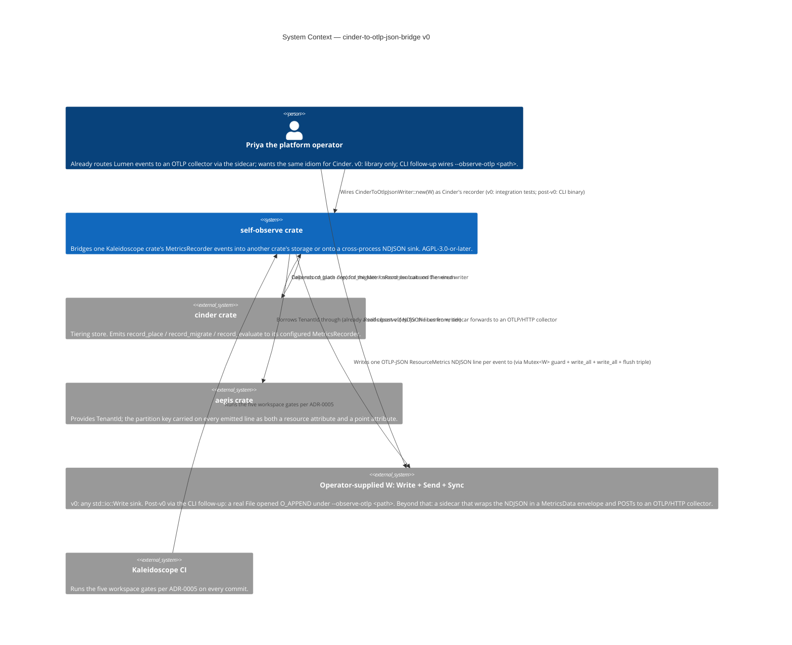
```mermaid
C4Context
  title System Context — cinder-to-otlp-json-bridge v0
  Person(operator, "Priya the platform operator", "Already routes Lumen events to an OTLP collector via the sidecar; wants the same idiom for Cinder. v0: library only; CLI follow-up wires --observe-otlp <path>.")
  System(self_observe, "self-observe crate", "Bridges one Kaleidoscope crate's MetricsRecorder events into another crate's storage or onto a cross-process NDJSON sink. AGPL-3.0-or-later.")
  System_Ext(cinder, "cinder crate", "Tiering store. Emits record_place / record_migrate / record_evaluate to its configured MetricsRecorder.")
  System_Ext(aegis, "aegis crate", "Provides TenantId; the partition key carried on every emitted line as both a resource attribute and a point attribute.")
  System_Ext(sink, "Operator-supplied W: Write + Send + Sync", "v0: any std::io::Write sink. Post-v0 via the CLI follow-up: a real File opened O_APPEND under --observe-otlp <path>. Beyond that: a sidecar that wraps the NDJSON in a MetricsData envelope and POSTs to an OTLP/HTTP collector.")
  System_Ext(ci, "Kaleidoscope CI", "Runs the five workspace gates per ADR-0005 on every commit.")

  Rel(operator, self_observe, "Wires CinderToOtlpJsonWriter::new(W) as Cinder's recorder (v0: integration tests; post-v0: CLI binary)")
  Rel(self_observe, cinder, "Depends on (path dep) for the MetricsRecorder trait and Tier enum")
  Rel(cinder, self_observe, "Calls record_place / record_migrate / record_evaluate on the wired writer")
  Rel(self_observe, sink, "Writes one OTLP-JSON ResourceMetrics NDJSON line per event to (via Mutex<W> guard + write_all + write_all + flush triple)")
  Rel(operator, sink, "Reads (post-v0) NDJSON lines from; sidecar forwards to an OTLP/HTTP collector")
  Rel(self_observe, aegis, "Borrows TenantId through (already a self-observe dep for the Lumen writer)")
  Rel(ci, self_observe, "Runs the five workspace gates per ADR-0005")
```

---

## C4 — Container View (Level 2) — `cinder-to-otlp-json-bridge-v0`

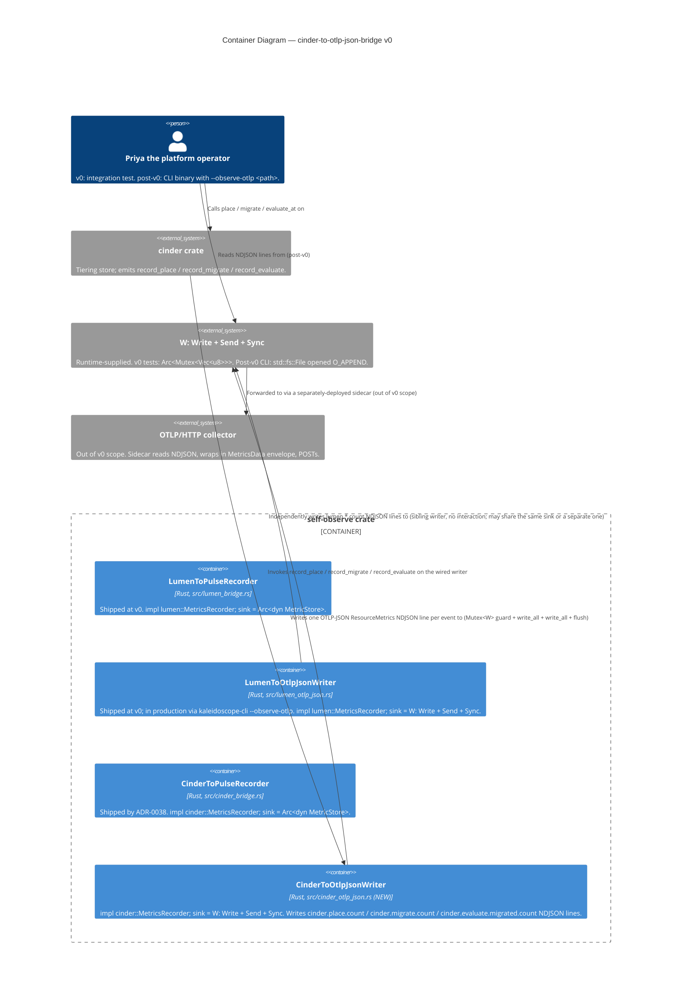
```mermaid
C4Container
  title Container Diagram — cinder-to-otlp-json-bridge v0
  Person(operator, "Priya the platform operator", "v0: integration test. post-v0: CLI binary with --observe-otlp <path>.")
  Container_Boundary(self_observe, "self-observe crate") {
    Container(lumen_bridge, "LumenToPulseRecorder", "Rust, src/lumen_bridge.rs", "Shipped at v0. impl lumen::MetricsRecorder; sink = Arc<dyn MetricStore>.")
    Container(lumen_otlp_json, "LumenToOtlpJsonWriter", "Rust, src/lumen_otlp_json.rs", "Shipped at v0; in production via kaleidoscope-cli --observe-otlp. impl lumen::MetricsRecorder; sink = W: Write + Send + Sync.")
    Container(cinder_bridge, "CinderToPulseRecorder", "Rust, src/cinder_bridge.rs", "Shipped by ADR-0038. impl cinder::MetricsRecorder; sink = Arc<dyn MetricStore>.")
    Container(cinder_otlp_json, "CinderToOtlpJsonWriter", "Rust, src/cinder_otlp_json.rs (NEW)", "impl cinder::MetricsRecorder; sink = W: Write + Send + Sync. Writes cinder.place.count / cinder.migrate.count / cinder.evaluate.migrated.count NDJSON lines.")
  }
  System_Ext(cinder, "cinder crate", "Tiering store; emits record_place / record_migrate / record_evaluate.")
  System_Ext(sink, "W: Write + Send + Sync", "Runtime-supplied. v0 tests: Arc<Mutex<Vec<u8>>>. Post-v0 CLI: std::fs::File opened O_APPEND.")
  System_Ext(collector, "OTLP/HTTP collector", "Out of v0 scope. Sidecar reads NDJSON, wraps in MetricsData envelope, POSTs.")

  Rel(operator, cinder, "Calls place / migrate / evaluate_at on")
  Rel(cinder, cinder_otlp_json, "Invokes record_place / record_migrate / record_evaluate on the wired writer")
  Rel(cinder_otlp_json, sink, "Writes one OTLP-JSON ResourceMetrics NDJSON line per event to (Mutex<W> guard + write_all + write_all + flush)")
  Rel(operator, sink, "Reads NDJSON lines from (post-v0)")
  Rel(sink, collector, "Forwarded to via a separately-deployed sidecar (out of v0 scope)")
  Rel(lumen_otlp_json, sink, "Independently writes lumen.*.count NDJSON lines to (sibling writer, no interaction; may share the same sink or a separate one)")
```

The container view shows four sibling writers inside `self-observe`, one of which (`CinderToOtlpJsonWriter`) is new. The two `*ToOtlpJsonWriter` writers may share a single sink or use separate sinks — the choice belongs to the operator's deployment topology, not to the library; the per-line scope name (`kaleidoscope.lumen` vs `kaleidoscope.cinder`) keeps the streams distinguishable downstream.

The acceptance-test seam wires four nodes: test body → Cinder's store → writer → `SharedBuf` sink, with the test body also reading the sink's bytes and parsing them as `serde_json::Value`. The writer is the *only* unit-under-test; Cinder and `SharedBuf` are infrastructure used to drive and observe it. See `docs/feature/cinder-to-otlp-json-bridge-v0/design/application-architecture.md > DD3` for the trade-off study.

---

## C4 — Component View (Level 3) — `cinder-to-otlp-json-bridge-v0`

**Not produced.** The new container (`CinderToOtlpJsonWriter`) is one Rust source file with nine duplicated serde structs (DISCUSS D7), one writer struct, one constructor, one `emit` helper, three trait methods, and one `tier_lowercase` helper. Per the SA principle ("Component (L3) only for complex subsystems"), L3 is **explicitly skipped** for v0. Reification conditions: L3 would become appropriate if (a) the writer grew batching or buffering across calls, (b) a per-tenant rate limiter were introduced, (c) attribute canonicalisation were extracted into a cross-writer shared module (which is also the rule-of-three trigger for the serde-struct extraction), or (d) the OTLP-JSON envelope gained a non-`Sum` metric kind (`Gauge`, `Histogram`). None of these apply at v0.

---

## Handoff to DISTILL — `cinder-to-otlp-json-bridge-v0`

Recipient: `nw-acceptance-designer`. The acceptance designer translates `discuss/journey-observe-cinder-via-otlp-json.feature` and the BDD scenarios in `discuss/user-stories.md` into executable Rust tests under `crates/self-observe/tests/cinder_to_otlp_json.rs`. No new requirements are introduced by DESIGN; the DESIGN-wave output crystallises *how* the v0 contract is shaped without changing *what* the contract is.

Required reading order for DISTILL:

1. This brief section (the `## Application Architecture — cinder-to-otlp-json-bridge-v0` block above) for the public surface and the per-event contract.
2. ADR-0039 for the decision rationale and the locked contract details.
3. The feature-side `design/wave-decisions.md` for the DESIGN-wave decision log (DD1–DD5).
4. The feature-side `design/application-architecture.md` for the propose-mode walkthrough.
5. The DISCUSS artefacts under `docs/feature/cinder-to-otlp-json-bridge-v0/discuss/` (locked, do not modify).
6. `tests/lumen_to_otlp_json.rs` and `tests/cinder_to_pulse.rs` as test-style precedents.

## Handoff to DEVOPS — `cinder-to-otlp-json-bridge-v0`

Recipient: `nw-platform-architect`. Receives:

- `docs/feature/cinder-to-otlp-json-bridge-v0/discuss/outcome-kpis.md` — the outcome KPIs (one per slice).
- ADR-0005's CI contract — the five existing gates apply to this feature unchanged.
- The Cargo manifest delta in ADR-0039 §6: one new `[[test]]` block in `crates/self-observe/Cargo.toml` (the `cinder` dependency line was added by the Pulse-sink sibling). No workspace-root `Cargo.toml` edit.
- Mutation-testing scope: per `CLAUDE.md`, scoped to `crates/self-observe/src/cinder_otlp_json.rs`, run after the DELIVER refactor pass, 100% kill rate per Gate 5.
- **External integrations**: **none**. No contract-test recommendations apply. The downstream OTLP/HTTP collector is at the operator's deployment boundary (sidecar territory), not at this library's boundary; the Lumen OTLP-JSON writer's existing production deployment (commits `c6b336c`, `3af7e82`) has already validated wire-shape acceptability for the collector.
- **Development paradigm for DELIVER**: Rust idiomatic per `CLAUDE.md`. The writer is generic over `W: Write + Send + Sync` because direct generic monomorphisation is the right shape at the sink seam (per `LumenToOtlpJsonWriter` precedent); the only trait-object shape in the writer's surface comes from `cinder::MetricsRecorder`, which is implemented (not consumed) by the writer.

---

## Application Architecture — cli-cinder-otlp-wiring-v0

> **Author**: `nw-solution-architect` (Morgan), DESIGN wave, 2026-05-18.
> **Feature**: `cli-cinder-otlp-wiring-v0` — extends the
> `kaleidoscope-cli ingest` subcommand so that the existing
> `--observe-otlp <path>` flag also routes Cinder's tier-management
> events into the same NDJSON sink that already carries the Lumen
> events. Today the flag wires `LumenToOtlpJsonWriter` against the
> file (`crates/kaleidoscope-cli/src/lib.rs:153`) but Cinder is
> constructed with `cinder::NoopRecorder` (line 163), so every
> `cinder.place(...)` call inside the ingest loop produces zero bytes
> in the operator's stream. The follow-up to
> `cinder-to-otlp-json-bridge-v0`; closes the cross-writer NDJSON-
> validity mandate in ADR-0039 §7.
> **Mode of operation**: PROPOSE — DISCUSS + ADR-0039 §7 named the
> failure mode this feature must close; DESIGN enumerates the file-
> sharing candidate mechanisms, evaluates each against OK6, idiomatic
> Rust posture, and code change footprint, then picks one. See the
> feature-side `design/wave-decisions.md` and
> `design/application-architecture.md` for the full propose-mode
> walkthrough; ADR-0039 §8 for the formal record.

### Reuse of platform-level decisions (not re-derived)

The following are **inherited** from prior DESIGN waves and from
`docs/architecture/kaleidoscope-architecture.md`:

1. **Licence**: AGPL-3.0-or-later for the `kaleidoscope-cli` crate;
   matches the rest of the workspace.
2. **Paradigm**: Rust idiomatic per `CLAUDE.md` — data + free
   functions + traits only where polymorphism is genuinely needed.
   The wiring change introduces no new trait, no new struct, no new
   `dyn` boundary beyond what already exists at line 163's `Box<dyn
   cinder::MetricsRecorder + Send + Sync>` (which is forced by the
   conditional construction over two concrete recorder types, not a
   design preference). `File::try_clone` is invoked directly as a
   `std::fs::File` method; no wrapper.
3. **CI contract**: inherits ADR-0005's five workspace gates. No new
   gate is added; no existing gate is amended.
4. **Mutation testing scope**: per `CLAUDE.md`, per-feature, scoped
   to the modified files (`crates/kaleidoscope-cli/src/lib.rs`).
   100% kill rate per ADR-0005 Gate 5.
5. **Writer public APIs**: locked by ADR-0039 §1 and by the
   already-in-production Lumen writer surface (commits `c6b336c`,
   `3af7e82`). This feature consumes both surfaces unchanged.

### Reuse Analysis (RCA F-1 hard gate)

| Existing component | Path | Decision |
|--------------------|------|----------|
| `LumenToOtlpJsonWriter::new(file)` construction site | `crates/kaleidoscope-cli/src/lib.rs:148-153` | **EXTEND THE SHAPE.** The Cinder-side wiring is the parallel match arm: the `file` binding from the `OpenOptions::open(path)?` call is reused (via `try_clone`); the writer construction `XxxToOtlpJsonWriter::new(handle)` is the same idiom locked by ADR-0039 §1. |
| `CinderToOtlpJsonWriter` | `crates/self-observe/src/cinder_otlp_json.rs` | **REUSE AS-IS.** Public surface locked by ADR-0039 §1 and DISCUSS D6; constructor takes ownership of `W: Write + Send + Sync` by value. No change required; wiring just passes the `try_clone`d `File` into it. |
| `cinder::NoopRecorder` (alias `CinderRecorder` at line 57) | `crates/kaleidoscope-cli/src/lib.rs:57, 163` | **REUSE IN `None` ARM.** The wiring change is conditional on `otlp_log_path`: absent → `NoopRecorder` (today's behaviour, unchanged); present → `CinderToOtlpJsonWriter`. |
| `From<std::io::Error> for Error` | `crates/kaleidoscope-cli/src/lib.rs:104-108` | **REUSE.** `file.try_clone()?` lifts a `std::io::Error` through `?` into `Error::Io`. No new error variant needed. |
| `Tee` / `MultiWriter` / `SharedFile` / `Arc<Mutex<File>>` adapter | workspace-wide grep | **DOES NOT EXIST IN WORKSPACE.** No precedent for any multi-writer-to-one-sink fanout pattern. The `self-observe` crate's four writer files each dispatch to a single sink; none combine recorders. The `Write` impls in the workspace are exclusively the `SharedBuf` test substrates at `crates/self-observe/tests/{lumen_to_otlp_json,cinder_to_otlp_json}.rs:54-64`. |
| New `MultiWriter` / `Tee` / `SharedFile` type | — | **DO NOT CREATE.** The `File::try_clone` choice (DD1) obviates the need for any such adapter — the OS provides the multi-writer-to-one-sink atomicity natively via `O_APPEND`. Creating a userspace adapter would be a strict regression on idiomatic posture, lock contention, abstraction cost, and forward compatibility (see ADR-0039 §8 Alternative 2). |
| Existing test harness (`tenant`, `record`, `temp_root`, `cleanup`, `ndjson` helpers) | `crates/kaleidoscope-cli/tests/observe_otlp_flag.rs:35-76` | **DUPLICATE INLINE AT V0.** DISCUSS D4 explicitly defers extraction to a `tests/common.rs` module until a third test file lands (rule of three). This feature ships test file #2. |

### Crate layout (no structural change)

No new files in `crates/self-observe/` (locked by ADR-0039). The
change surface in `crates/kaleidoscope-cli/`:

```
crates/kaleidoscope-cli/
├── Cargo.toml                                       # gains one [[test]] block
│                                                    # (self-observe dep already present)
├── src/
│   └── lib.rs                                       # gains ~5 lines in the Some(path) arm
│                                                    # of the otlp_log_path match (lines 147-160)
│                                                    # plus a parallel match for Cinder recorder
│                                                    # at line 163
└── tests/
    ├── observe_otlp_flag.rs                         # unchanged (OK8 byte-equivalence probe)
    └── observe_otlp_cinder_wiring.rs                # NEW — happy-path + concurrent-random-pause
```

### File-sharing mechanism — locked by ADR-0039 §8

The CLI opens the operator-supplied path **exactly once** with
`std::fs::OpenOptions::new().create(true).append(true).open(path)`,
then obtains a second `File` handle via `file.try_clone()?`. The
original `File` is passed into `LumenToOtlpJsonWriter::new(file)`;
the cloned `File` is passed into `CinderToOtlpJsonWriter::new(file_clone)`.
Each writer continues to own its own `Mutex<File>` per ADR-0039 §1
and §2. Cross-writer atomicity is the POSIX `O_APPEND` kernel
guarantee: each `write(2)` against an `O_APPEND` descriptor is
atomic relative to other `O_APPEND` writes on the same file
description, up to `PIPE_BUF` (4096 bytes on Linux and macOS). The
worst-case OTLP-JSON line is the `cinder.migrate.count` line at
approximately 540 bytes, well below `PIPE_BUF`.

### Recommendations summary (for fast skim)

| Decision | Recommended option | Source |
|----------|--------------------|--------|
| File-sharing mechanism | `File::try_clone` after a single `OpenOptions::create(true).append(true).open(path)`; one writer per handle; each writer's `Mutex<File>` unchanged from ADR-0039 §1/§2; cross-writer atomicity via POSIX `O_APPEND`. | [ADR-0039 §8](adr-0039-cinder-to-otlp-json-bridge-public-api-and-crate-layout.md), feature-side `design/wave-decisions.md > DD1` |
| `OpenOptions` flags | `create(true).append(true)` (= `O_CREAT \| O_WRONLY \| O_APPEND`); no `truncate`, no `O_EXCL`. Identical to the in-production Lumen-side wiring at line 149-152. | feature-side `design/wave-decisions.md > DD2` |
| Error handling on `try_clone` failure | Propagate via `Error::Io` through the existing `From<std::io::Error>` impl (line 104-108); no new error variant; no fallback; no retry. | feature-side `design/wave-decisions.md > DD3` |
| New abstraction (MultiWriter / Tee / SharedFile) | **None.** The OS `O_APPEND` mechanism makes any userspace fanout adapter unnecessary. | feature-side `design/wave-decisions.md > DD4` |
| ADR scope | §8 extension to ADR-0039 (no new public type, no new abstraction). New ADR-0040 explicitly **not** created. | [ADR-0039 §8](adr-0039-cinder-to-otlp-json-bridge-public-api-and-crate-layout.md) |

Architectural-rule enforcement (Principle 11): inherits the existing
five-gate workspace contract (ADR-0005). No new tooling is required.
The cross-writer guarantee is enforced behaviourally by the
`cross_writer_ndjson_validity_under_concurrent_random_pauses`
acceptance test (mandated by ADR-0039 §7 item 3), which fails loudly
if any future refactor switches to a substrate that defeats the
`O_APPEND` guarantee.

### Quality attributes addressed (ISO 25010)

| Attribute | How the architecture addresses it |
|---|---|
| **Functional Suitability — Correctness** | OK6 (cross-writer NDJSON validity under concurrent emission) is asserted directly by the `cross_writer_ndjson_validity_under_concurrent_random_pauses` acceptance test. OK7 (Cinder lines present per `place` call) by the happy-path test. OK8 (Lumen non-regression) by the unmodified `observe_otlp_flag.rs`. |
| **Performance Efficiency** | Two FDs for the lifetime of the `ingest` call; one `write(2)` syscall per OTLP-JSON line; no cross-writer userspace lock contention. Each writer's `Mutex<File>` acquisition is independent. Cost basis matches the existing Lumen-side wiring at line 153, simply doubled. |
| **Compatibility — Interoperability** | The downstream wire shape is unchanged from ADR-0039 §2 (OTLP-JSON `ResourceMetrics` per line, scope `kaleidoscope.cinder`, metric `cinder.place.count`). The operator's existing sidecar + collector + dashboard chain receives the new lines without any configuration change. |
| **Reliability — Fault Tolerance** | `O_APPEND` is a hard kernel guarantee on the deployment substrates (Linux, macOS). Within-writer triple atomicity (per ADR-0039 §2) handles serialisation, write, and mutex-poisoning failures with the best-effort `let _ = …` pattern; cross-writer atomicity is independent (the kernel handles it). |
| **Maintainability — Modularity, Testability** | The wiring change is ~5 lines inside the existing `Some(path)` arm of the `otlp_log_path` match. The new acceptance test is one new file mirroring `observe_otlp_flag.rs`. Mutation-testing scope is one source file. |
| **Maintainability — Modifiability** | No new public type, no new abstraction; the wiring is a parallel match arm to the existing Lumen wiring at lines 147-160. A future refactor (e.g. extracting the OTLP writer construction into a helper function) is a localised change. |
| **Portability** | `File::try_clone` is cross-platform; `O_APPEND` atomicity holds on Linux, macOS, and Windows (via `FILE_APPEND_DATA`). The CI matrix per ADR-0005 covers Linux and macOS; the deployment target is Docker Linux per the recent `Dockerfile` work in commit `0c5d91c`. |
| **Observability** | The feature IS an observability feature: it makes Cinder tier placements visible on the operator's existing OTLP stream. No new observability of the wiring itself is needed; failure modes surface as either acceptance-test failures (CI feedback per ADR-0005) or as `Error::Io` from the `ingest` return type. |

ATAM sensitivity points: (i) the worst-case OTLP-JSON line size
versus `PIPE_BUF` (4 KiB) — currently ~540 bytes, well under the
threshold; a regression that quadrupled the point-attribute count
or added kilobyte-scale fields would need to revisit DD1; (ii) the
`O_APPEND` substrate guarantee on the deployment filesystem — the
acceptance test is the empirical probe on the CI matrix; exotic
FUSE mounts are an operator-level responsibility.

ATAM trade-off points: (i) single-line atomicity vs. abstraction
cost — chose single-line atomicity at zero abstraction cost (kernel
`O_APPEND`) over the userspace serialisation alternative
(`Arc<Mutex<File>>` adapter) that would have added a new type and
doubled mutex acquisitions per emission. The trade-off is paid in
increased dependence on the OS substrate guarantee, which is well-
characterised on the deployment targets and probed by the
acceptance test.

### Earned Trust (Principle 12)

The wiring change introduces no new substrate-adjacent dependency
beyond the existing `std::fs::OpenOptions::open(path)` call. The
addition is `file.try_clone()`, a `dup(2)` syscall whose failure
modes (`EMFILE`, `ENFILE`) are well-characterised by POSIX and lift
cleanly through the existing `From<std::io::Error> for Error` impl
into `Error::Io`. The substrate-lie probe is the acceptance test
mandated by ADR-0039 §7 item 3 (the concurrent-random-pause
scenario), which exercises the `O_APPEND` substrate claim against a
real `File` on the deployment filesystem.

The three Earned-Trust layers (Principle 12c):

1. **Subtype-check layer**: `cargo public-api -p kaleidoscope-cli`
   (Gate 2) catches any change to `ingest`'s signature (which does
   NOT change). The compile-time `Box<dyn cinder::MetricsRecorder
   + Send + Sync>` type assertion at line 163 catches any loss of
   the `Send + Sync` trait bound on `CinderToOtlpJsonWriter<File>`.
2. **Behavioural-check layer**: the new acceptance test file
   `crates/kaleidoscope-cli/tests/observe_otlp_cinder_wiring.rs`
   exercises the cross-writer contract end-to-end against a real
   `File` substrate (per §7 item 2), including the random-pause
   scenario (per §7 item 3). The existing `observe_otlp_flag.rs`
   test file continues to pass byte-equivalently (OK8 guardrail).
3. **Structural-check layer**: degenerate for a no-new-substrate
   wiring change. The wiring depends only on the std-lib
   `File::try_clone` primitive and on the writer constructors
   (locked by ADR-0039 §1, defended by Gate 2).

**Environments-known-to-lie**: the `O_APPEND` kernel guarantee
holds on the CI matrix (Linux + macOS per ADR-0005) and on the
operator's deployment target (Docker Linux per commit `0c5d91c`).
The acceptance test exercises the substrate the operator runs on.
Exotic filesystems (FUSE mounts that do not honour `O_APPEND`) are
out of scope at v0; if a future operator deploys on such a
substrate, that operator's own probe (running the acceptance test
on their substrate) is the empirical answer.

### External integrations

**None at runtime.** No external network surface, no third-party
API, no webhooks, no OAuth, no subprocess. The downstream OTLP/HTTP
collector that the operator's sidecar will eventually forward to is
at the operator's deployment boundary, not at this feature's
boundary; the existing Lumen-side wiring (commit `3af7e82`) has
already validated the wire-shape acceptability for the collector
and the sidecar contract. No contract-test recommendation applies.

### Conway's Law check

Single-author CLI plumbing change built by a single AI agent (the
DELIVER wave's `nw-software-crafter`). The wiring lives inside the
`kaleidoscope-cli` crate, owned by Andrea. The change surface
straddles no team boundary. Satisfied trivially.

---

## C4 — System Context (Level 1) — `cli-cinder-otlp-wiring-v0`

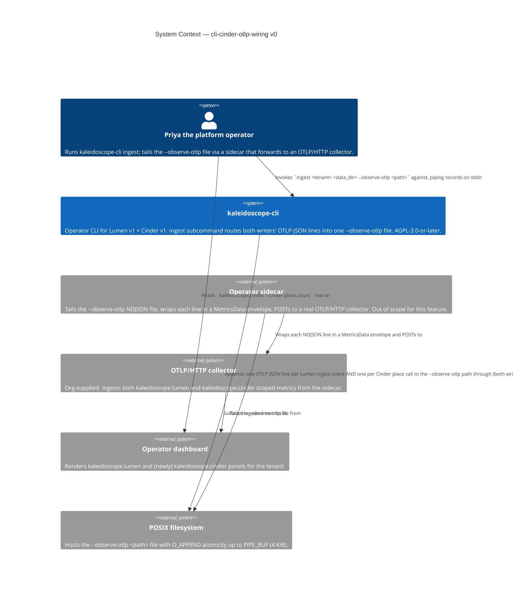
```mermaid
C4Context
  title System Context — cli-cinder-otlp-wiring v0
  Person(operator, "Priya the platform operator", "Runs kaleidoscope-cli ingest; tails the --observe-otlp file via a sidecar that forwards to an OTLP/HTTP collector.")
  System(cli, "kaleidoscope-cli", "Operator CLI for Lumen v1 + Cinder v1. ingest subcommand routes both writers' OTLP-JSON lines into one --observe-otlp file. AGPL-3.0-or-later.")
  System_Ext(sidecar, "Operator sidecar", "Tails the --observe-otlp NDJSON file, wraps each line in a MetricsData envelope, POSTs to a real OTLP/HTTP collector. Out of scope for this feature.")
  System_Ext(collector, "OTLP/HTTP collector", "Org-supplied. Ingests both kaleidoscope.lumen and kaleidoscope.cinder scoped metrics from the sidecar.")
  System_Ext(dashboard, "Operator dashboard", "Renders kaleidoscope.lumen and (newly) kaleidoscope.cinder panels for the tenant.")
  System_Ext(filesystem, "POSIX filesystem", "Hosts the --observe-otlp <path> file with O_APPEND atomicity up to PIPE_BUF (4 KiB).")

  Rel(operator, cli, "Invokes `ingest <tenant> <data_dir> --observe-otlp <path>` against, piping records on stdin")
  Rel(cli, filesystem, "Appends one OTLP-JSON line per Lumen ingest event AND one per Cinder place call to the --observe-otlp path through (both writers; O_APPEND guarantees cross-writer atomicity up to PIPE_BUF)")
  Rel(sidecar, filesystem, "Tails the --observe-otlp file from")
  Rel(sidecar, collector, "Wraps each NDJSON line in a MetricsData envelope and POSTs to")
  Rel(collector, dashboard, "Surfaces ingested metrics to")
  Rel(operator, dashboard, "Reads `kaleidoscope.cinder / cinder.place.count` row on")
```

---

## C4 — Container View (Level 2) — `cli-cinder-otlp-wiring-v0`

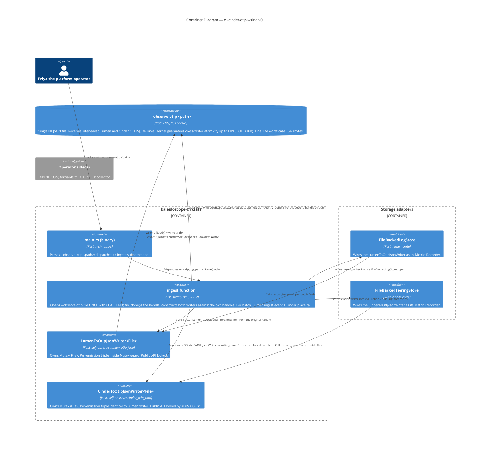
```mermaid
C4Container
  title Container Diagram — cli-cinder-otlp-wiring v0
  Person(operator, "Priya the platform operator")
  Container_Boundary(cli, "kaleidoscope-cli crate") {
    Container(main, "main.rs (binary)", "Rust, src/main.rs", "Parses --observe-otlp <path>; dispatches to ingest subcommand.")
    Container(ingest, "ingest function", "Rust, src/lib.rs:139-212", "Opens --observe-otlp file ONCE with O_APPEND; try_clone()s the handle; constructs both writers against the two handles. Per batch: Lumen ingest event + Cinder place call.")
    Container(lumen_writer, "LumenToOtlpJsonWriter<File>", "Rust, self-observe::lumen_otlp_json", "Owns Mutex<File>. Per-emission triple inside Mutex guard. Public API locked.")
    Container(cinder_writer, "CinderToOtlpJsonWriter<File>", "Rust, self-observe::cinder_otlp_json", "Owns Mutex<File>. Per-emission triple identical to Lumen writer. Public API locked by ADR-0039 §1.")
  }
  Container_Boundary(stores, "Storage adapters") {
    Container(lumen_store, "FileBackedLogStore", "Rust, lumen crate", "Wires the LumenToOtlpJsonWriter as its MetricsRecorder.")
    Container(cinder_store, "FileBackedTieringStore", "Rust, cinder crate", "Wires the CinderToOtlpJsonWriter as its MetricsRecorder.")
  }
  ContainerDb(otlp_file, "--observe-otlp <path>", "POSIX file, O_APPEND", "Single NDJSON file. Receives interleaved Lumen and Cinder OTLP-JSON lines. Kernel guarantees cross-writer atomicity up to PIPE_BUF (4 KiB). Line size worst case ~540 bytes.")
  System_Ext(sidecar, "Operator sidecar", "Tails NDJSON; forwards to OTLP/HTTP collector.")

  Rel(operator, main, "Invokes with --observe-otlp <path>")
  Rel(main, ingest, "Dispatches to (otlp_log_path = Some(path))")
  Rel(ingest, otlp_file, "Opens once with OpenOptions::create(true).append(true) AND try_clone()s for the second handle through")
  Rel(ingest, lumen_writer, "Constructs `LumenToOtlpJsonWriter::new(file)` from the original handle")
  Rel(ingest, cinder_writer, "Constructs `CinderToOtlpJsonWriter::new(file_clone)` from the cloned handle")
  Rel(ingest, lumen_store, "Wires lumen_writer into via FileBackedLogStore::open")
  Rel(ingest, cinder_store, "Wires cinder_writer into via FileBackedTieringStore::open")
  Rel(lumen_store, lumen_writer, "Calls record_ingest on per batch flush")
  Rel(cinder_store, cinder_writer, "Calls record_place on per batch flush")
  Rel(lumen_writer, otlp_file, "write_all(body) + write_all(b\"\\n\") + flush via Mutex<File> guard to")
  Rel(cinder_writer, otlp_file, "write_all(body) + write_all(b\"\\n\") + flush via Mutex<File> guard to")
  Rel(sidecar, otlp_file, "Tails NDJSON lines from")
```

The container view shows the two writers sharing one OS file
description through two distinct `File` handles obtained via
`try_clone`. Each writer's per-emission triple is serialised within
that writer by its own `Mutex<File>` (the within-writer NDJSON-
validity guarantee inherited from ADR-0039 §2). The **cross-writer**
guarantee — the new property this feature ships — is provided by the
kernel's `O_APPEND` atomicity for sub-`PIPE_BUF` writes, which
composes the two writers' independently-serialised triples into a
byte stream where no line interleaves with another. Each writer
remains unaware of the other; the only shared state is the underlying
file description (a kernel object, not a userspace one). The
acceptance test `cross_writer_ndjson_validity_under_concurrent_random_pauses`
is the empirical substrate-lie probe.

---

## C4 — Component View (Level 3) — `cli-cinder-otlp-wiring-v0`

**Not produced.** The change inside `ingest` is one match-arm
substitution (the Cinder recorder construction at
`crates/kaleidoscope-cli/src/lib.rs:163` becomes a parallel `match
otlp_log_path`) plus one `try_clone()?` call inside the existing
`Some(path) => { … }` arm at lines 147-160. The new acceptance test
is one new file mirroring `observe_otlp_flag.rs`. Per the SA
principle ("Component (L3) only for complex subsystems"), L3 is
**explicitly skipped** for this feature. Reification conditions
recorded in the feature-side `design/application-architecture.md`.

---

## Handoff to DISTILL — `cli-cinder-otlp-wiring-v0`

Recipient: `nw-acceptance-designer`. The acceptance designer
translates the BDD scenarios in
`docs/feature/cli-cinder-otlp-wiring-v0/discuss/user-stories.md` into
executable Rust `#[test]` functions (per the project's acceptance
idiom in `CLAUDE.md` — `// Given / // When / // Then` comment
blocks, not Gherkin `.feature` files) under
`crates/kaleidoscope-cli/tests/observe_otlp_cinder_wiring.rs`. No new
requirements are introduced by DESIGN; the DESIGN-wave output
crystallises *how* the OK6 cross-writer guarantee is discharged
without changing *what* the guarantee is.

Required reading order for DISTILL:

1. This brief section (the `## Application Architecture —
   cli-cinder-otlp-wiring-v0` block above) for the wiring shape.
2. ADR-0039 §8 for the decision rationale on the file-sharing
   mechanism.
3. The feature-side `design/wave-decisions.md` for the DESIGN-wave
   decision log (DD1–DD5).
4. The feature-side `design/application-architecture.md` for the
   C4 diagrams and prose narrative.
5. The DISCUSS artefacts under
   `docs/feature/cli-cinder-otlp-wiring-v0/discuss/` (locked, do not
   modify).
6. `crates/kaleidoscope-cli/tests/observe_otlp_flag.rs` as the
   test-style precedent.

## Handoff to DEVOPS — `cli-cinder-otlp-wiring-v0`

Recipient: `nw-platform-architect`. Receives:

- `docs/feature/cli-cinder-otlp-wiring-v0/discuss/outcome-kpis.md` —
  OK6 (principal), OK7, OK8.
- ADR-0005's CI contract — the five existing gates apply to this
  feature unchanged. No new gate added; no existing gate amended. A
  self-observe-conditional gate was considered and rejected: the
  cross-writer contract is a property of the `kaleidoscope-cli` test
  surface, not of `self-observe` (whose tests use `SharedBuf` in-
  memory substrates).
- The Cargo manifest delta: one new `[[test]]` block in
  `crates/kaleidoscope-cli/Cargo.toml` (`name =
  "observe_otlp_cinder_wiring", path =
  "tests/observe_otlp_cinder_wiring.rs"`). No new `[dependencies]`
  line; `self-observe` is already a `kaleidoscope-cli` dep. No
  workspace-root `Cargo.toml` edit.
- Mutation-testing scope: per `CLAUDE.md`, scoped to
  `crates/kaleidoscope-cli/src/lib.rs`, run after the DELIVER refactor
  pass, 100% kill rate per ADR-0005 Gate 5.
- **External integrations**: **none**. No contract-test
  recommendations apply. The downstream OTLP/HTTP collector is at
  the operator's deployment boundary; the existing Lumen-side wiring
  (commits `c6b336c`, `3af7e82`) has already validated wire-shape
  acceptability.
- **Development paradigm for DELIVER**: Rust idiomatic per
  `CLAUDE.md`. Data + free functions + traits only where polymorphism
  is genuinely needed. `File::try_clone` is invoked directly; no
  wrapper. The only `dyn` boundary is the existing `Box<dyn
  cinder::MetricsRecorder + Send + Sync>` at line 163 (forced by the
  conditional construction over two concrete recorder types).

---

## Application Architecture — cli-read-observe-otlp-v0

> **Author**: `nw-solution-architect` (Morgan), DESIGN wave, 2026-05-19.
> **Feature**: extends `kaleidoscope-cli read` so the existing
> `--observe-otlp <path>` flag (shipped for `ingest` at commit `3af7e82`
> and extended in `cli-cinder-otlp-wiring-v0`) also routes Lumen query
> events into the same NDJSON sink. Today `read` wires Lumen with
> `LumenToPulseRecorder` over an in-process Pulse store
> (`crates/kaleidoscope-cli/src/lib.rs:253-255`) that dies at end of
> call. The follow-up to `cli-cinder-otlp-wiring-v0`; closes the
> read-side gap so the operator's single sidecar configuration
> captures the full Lumen lifecycle (ingest + query) on one file.
> **Mode**: PROPOSE. Full propose-mode walkthrough in the feature-side
> `design/wave-decisions.md > DD1-DD5` and `design/application-architecture.md`.

### Inherited posture

AGPL-3.0-or-later licence; Rust idiomatic paradigm per `CLAUDE.md`
(no new trait, no new struct, no new `dyn` boundary beyond the
existing `Box<dyn LumenRec + Send + Sync>` at the recorder
construction site); ADR-0005's five workspace gates apply unchanged;
`LumenToOtlpJsonWriter` consumed unchanged through its existing
re-export from `self_observe`. File-sharing mechanism is the
single-writer instance of ADR-0039 §8, with the `try_clone` step
elided because only one writer participates in `read`.

### Reuse Analysis (RCA F-1 hard gate)

| Existing component | Path | Decision |
|---|---|---|
| `LumenToOtlpJsonWriter::new(file)` construction site | `crates/kaleidoscope-cli/src/lib.rs:158-164` (inside `ingest`) | **EXTEND THE SHAPE.** The `Some(path)` arm of the new match in `read()` mirrors the Lumen-side fragment of the ingest wiring, minus the `try_clone` line and minus the Cinder writer. |
| `LumenToOtlpJsonWriter` | `crates/self-observe/src/lumen_otlp_json.rs` | **REUSE AS-IS.** Constructor takes `W: Write + Send + Sync` by value. No change. |
| `LumenToPulseRecorder` | `crates/self-observe/src/lumen_bridge.rs` | **REUSE IN `None` ARM.** Today's behaviour preserved byte-equivalently. |
| `From<std::io::Error> for Error` | `crates/kaleidoscope-cli/src/lib.rs:104-108` | **REUSE.** `OpenOptions::open(path)?` lifts via `?` into `Error::Io`. No new error variant. |
| `parse_observe_otlp(args)` | `crates/kaleidoscope-cli/src/main.rs:105-119` | **REUSE.** `run_read` gains one call, line-for-line parallel to `run_ingest`. |
| Hypothetical `open_observe_otlp_file` helper | n/a — does not exist | **DO NOT CREATE.** Rule of three: N=2 call sites; extraction trigger arrives at N=3 (ADR-0039 §5 precedent). |
| `try_clone` machinery (ADR-0039 §8) | `crates/kaleidoscope-cli/src/lib.rs:162` | **DO NOT REUSE.** Two-writer-specific; `read()` has one writer; second clone has no consumer. |
| Existing test harness helpers | `crates/kaleidoscope-cli/tests/observe_otlp_flag.rs:35-76` | **DUPLICATE INLINE AT V0** per DISCUSS D6. Rule-of-three trigger arrives WITH this file (test #3); extraction deferred to a follow-up. |

### File-open mechanism — single-handle `OpenOptions::append`, no `try_clone`

In the `Some(path) => { … }` arm of the new `otlp_log_path` match
inside `read()`, the path is opened exactly once with
`std::fs::OpenOptions::new().create(true).append(true).open(path)`
and the resulting `File` passed directly into
`LumenToOtlpJsonWriter::new(file)`. **No `try_clone`** — the second
handle that ADR-0039 §8 introduces is specifically for the two-writer
ingest case, and `read()` instantiates only the Lumen recorder
(DISCUSS D2: no Cinder participation on the read path).
Cross-invocation append safety (the OK3 ingest-then-read shell-session
scenario) is inherited for free from POSIX `O_APPEND` semantics; the
two CLI processes run sequentially (DISCUSS D5) so no
concurrent-writer question arises at this seam.

### Recommendations summary

| Decision | Recommended option |
|---|---|
| Open mechanism (DD1) | Single `OpenOptions::create(true).append(true).open(path)`; no `try_clone`. |
| Helper extraction (DD2) | **None.** Rule of three: N=2 inline. |
| `read()` signature (DD3) | Append `otlp_log_path: Option<&Path>` as fourth positional parameter; mirrors `ingest()`'s fifth-parameter idiom. |
| New abstraction | **None.** Single-writer with single handle is the smallest shape. |
| ADR scope (DD5) | **No ADR change.** ADR-0039 §8 is the single-writer instance with `try_clone` elided. |

### Quality attributes (ISO 25010, condensed)

| Attribute | How addressed |
|---|---|
| Correctness | OK1/OK2/OK3 asserted by `observe_otlp_read_flag.rs`. |
| Performance | One FD per `read` call; one `write(2)` per invocation; no cross-writer contention (single writer). |
| Interoperability | Wire shape unchanged from Lumen writer's existing per-event contract; operator's sidecar + collector + dashboard chain consumes new lines without configuration change. |
| Reliability | Within-writer triple atomicity inherited from ADR-0039 §2; `O_APPEND` guarantees cross-invocation append safety on OK3. |
| Maintainability | ~10 source lines added; mutation scope is two source files; existing `gate-5-mutants-kaleidoscope-cli` auto-covers via `--in-diff` on `crates/kaleidoscope-cli/**`. |
| Portability | `OpenOptions::create(true).append(true).open` is cross-platform; `O_APPEND` atomicity on the CI matrix (Linux + macOS) and on Docker Linux deployment per commit `0c5d91c`. |
| Observability | The feature IS the observability feature: Lumen query events become operator-visible on the existing OTLP stream. |

### Earned Trust (Principle 12)

No new substrate-adjacent dependency. The substrate-lie probe is the
new acceptance test `observe_otlp_read_flag.rs`, exercising the
`OpenOptions::append` posture against a real `File` on the
deployment filesystem (the OK3 scenario reads back the file post-
write and asserts the union of metric-name sets). Three layers:
(1) subtype — `cargo public-api -p kaleidoscope-cli` (Gate 2)
catches the intentional `read()` signature change; `cargo
semver-checks` (Gate 3) flags the breaking change (crate is
`publish = false`; in-tree callers updated in the same commit);
(2) behavioural — `observe_otlp_read_flag.rs` exercises OK1+OK2+OK3
end-to-end; existing `observe_otlp_flag.rs` and
`observe_otlp_cinder_wiring.rs` continue to pass byte-equivalently;
(3) structural — degenerate for a no-new-substrate change.
Environments-known-to-lie inherit the `cli-cinder-otlp-wiring-v0`
posture (exotic FUSE mounts are operator-level responsibility).

### External integrations

**None at runtime.** No new network surface, no third-party API, no
webhooks, no OAuth, no subprocess. No contract-test recommendation
applies.

### Conway's Law check

Single-author CLI plumbing inside `kaleidoscope-cli`, owned by Andrea,
built by a single AI agent. Straddles no team boundary. Satisfied
trivially.

### C4 diagrams

See `docs/feature/cli-read-observe-otlp-v0/design/application-architecture.md`
for the rendered L1 and L2 Mermaid diagrams. Key shape: `read()`
matches on `otlp_log_path`; `Some(path)` opens the file once with
`OpenOptions::create(true).append(true)` and wraps in
`LumenToOtlpJsonWriter`; `None` preserves today's
`LumenToPulseRecorder` wiring byte-equivalently. Single writer; no
`try_clone`; no second handle. **L3 explicitly skipped** (change
inside `read()` is one match expression plus a positional parameter
on the signature).

### Handoff to DISTILL

Recipient: `nw-acceptance-designer`. Translates DISCUSS BDD scenarios
into Rust `#[test]` functions under
`crates/kaleidoscope-cli/tests/observe_otlp_read_flag.rs` per
`CLAUDE.md`'s `// Given / // When / // Then` idiom. Required reading:
this section, the feature-side `design/wave-decisions.md` (DD1-DD5),
the feature-side `design/application-architecture.md`, ADR-0039 §8
for file-sharing context, the locked DISCUSS artefacts, and
`crates/kaleidoscope-cli/tests/observe_otlp_flag.rs` as the
test-style precedent.

### Handoff to DEVOPS

Recipient: `nw-platform-architect`. Receives outcome KPIs (OK1
principal, OK2 guardrail, OK3 leading); ADR-0005's five gates apply
unchanged (**no new gate; no existing gate amended**); the existing
`gate-5-mutants-kaleidoscope-cli` job at
`.github/workflows/ci.yml:949-1028` auto-covers via `--in-diff` on
`crates/kaleidoscope-cli/**` (verified during DESIGN; no per-file
fan-out needed); Cargo manifest delta is one new `[[test]]` block in
`crates/kaleidoscope-cli/Cargo.toml` (`name = "observe_otlp_read_flag"`),
no new `[dependencies]`; mutation scope is
`crates/kaleidoscope-cli/src/{lib,main}.rs` at 100% kill rate per
Gate 5; **external integrations: none** (no contract-test recommendation
applies); paradigm for DELIVER is Rust idiomatic per `CLAUDE.md`
(`OpenOptions::open` invoked directly, no wrapper; only `dyn` boundary
is the existing `Box<dyn LumenRec + Send + Sync>` at the recorder
construction site).

---

## Application Architecture — cli-stats-subcommand-v0

Author: `@nw-solution-architect` (Morgan), DESIGN wave, 2026-05-19.
Mode: PROPOSE.

> **Feature**: adds a third subcommand `stats` to `kaleidoscope-cli`
> invoked as `kaleidoscope-cli stats <tenant_id> <data_dir>`. Prints
> to stdout exactly three plain-text key=value lines for a populated
> tenant (`records=N`, `earliest=<ISO 8601 UTC>`, `latest=<ISO 8601
> UTC>`), or exactly one line `records=0` for an empty tenant. No new
> flag, no JSON, no Cinder, no `--observe-otlp` wiring (DISCUSS D2,
> D3, D4, D5, D7).

### Architectural decisions (summary)

Full text in
`docs/feature/cli-stats-subcommand-v0/design/wave-decisions.md`.

- **DD1 — ISO 8601 formatter: hand-rolled, zero new deps.** Workspace
  grep returns no `chrono`/`time`/`jiff`; no existing dep to prefer.
  Private ~30-line `lib.rs` function: `ns -> (y,m,d,h,m,s,nanos)` via
  civil_from_days arithmetic, format
  `{:04}-{:02}-{:02}T{:02}:{:02}:{:02}.{:09}Z`. Nanosecond precision
  preserved natively; D6 downgrade clause not invoked.
- **DD2 — `pub fn stats(tenant, data_dir, writer) -> Result<usize,
  Error>`.** Mirrors `read()` minus `otlp_log_path`. Writes lines
  directly to writer; returns count. No `StatsSummary` struct
  (`publish = false`; no programmatic consumer).
- **DD3 — `records.first()` / `records.last()`, O(1).** Relies on
  `LogStore` port's documented ascending-order invariant
  (`crates/lumen/src/store.rs:67-75`). Single-record case
  (`first == last`) falls out naturally.
- **DD4 — Reuse: EXTEND `read()` shape; REUSE `lumen_base`,
  quiescent `LumenToPulseRecorder`, `FileBackedLogStore::open`,
  `Error::{LumenOpen,LumenQuery,Io}`, `parse_positional`; CREATE
  only the private formatter.** No new public type, no new trait,
  no new module. Rule-of-three trigger for the quiescent-recorder
  helper arrives here (`stats()` is the third site after `ingest`'s
  and `read`'s no-flag arms) but DISCUSS does not mandate the
  extraction at v0 and this wave does not propose it.

### Change surface

`crates/kaleidoscope-cli/Cargo.toml` gains one `[[test]]` block.
`src/lib.rs` gains `pub fn stats(...)` and a private formatter.
`src/main.rs` gains a `Some("stats")` dispatch arm, a `run_stats`
helper, and an extended `print_usage` block. `tests/stats_subcommand.rs`
is new, mirroring `observe_otlp_read_flag.rs`'s harness shape
(DISCUSS D9 keeps it inline-duplicated).

### C4 — System Context (Level 1) — `cli-stats-subcommand-v0`

See
`docs/feature/cli-stats-subcommand-v0/design/application-architecture.md`
for the full diagram. The change is confined to the `kaleidoscope-cli`
node; the filesystem boundary is unchanged (Lumen WAL+snapshot at
`<data_dir>/lumen.*`); the Unix text-tool pipeline (`grep`, `cut`,
`awk`) gains a much cheaper input.

### C4 — Container View (Level 2) — `cli-stats-subcommand-v0`

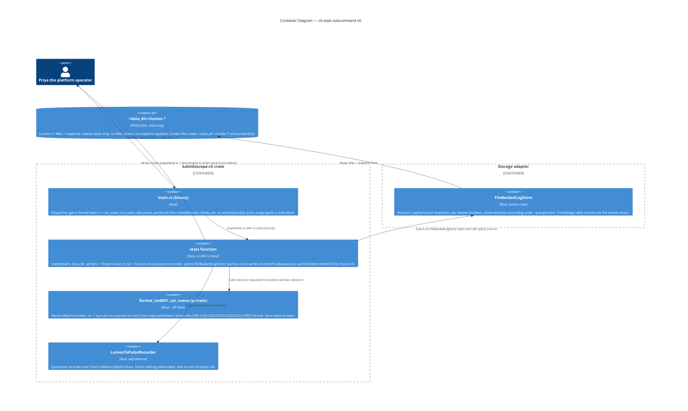
```mermaid
C4Container
  title Container Diagram — cli-stats-subcommand v0
  Person(operator, "Priya the platform operator")
  Container_Boundary(cli, "kaleidoscope-cli crate") {
    Container(main, "main.rs (binary)", "Rust", "Dispatcher gains Some('stats') => run_stats; run_stats calls parse_positional then stats(&tenant, &data_dir, io::stdout().lock()). print_usage gains a stats block.")
    Container(stats_fn, "stats function", "Rust, src/lib.rs (new)", "stats(tenant, data_dir, writer) -> Result<usize, Error>. Constructs quiescent recorder; opens FileBackedLogStore; queries once; writes records=N (always) plus earliest/latest (when N>0); returns N.")
    Container(format_iso, "format_iso8601_utc_nanos (private)", "Rust, ~30 lines", "Hand-rolled formatter. ns -> (y,m,d,h,m,s,nanos) via civil_from_days arithmetic; writes the {:04}-{:02}-{:02}T{:02}:{:02}:{:02}.{:09}Z format. Zero external deps.")
    Container(pulse_recorder, "LumenToPulseRecorder", "Rust, self-observe", "Quiescent recorder over fresh InMemoryMetricStore. Emits nothing observable; dies at end of stats() call.")
  }
  Container_Boundary(stores, "Storage adapter") {
    Container(lumen_store, "FileBackedLogStore", "Rust, lumen crate", "Honours LogStore port invariants: per-tenant isolation, observed-time ascending order. query(tenant, TimeRange::all()) returns the full sorted vector.")
  }
  ContainerDb(lumen_files, "<data_dir>/lumen.*", "POSIX files, read-only", "Lumen v1 WAL + snapshot. stats() reads only; no WAL writes; no snapshot updates. Cinder files under <data_dir>/cinder.* untouched (D2).")

  Rel(operator, main, "Invokes `stats <tenant> <data_dir>` at")
  Rel(main, stats_fn, "Dispatches to with io::stdout().lock()")
  Rel(stats_fn, pulse_recorder, "Constructs quiescent recorder")
  Rel(stats_fn, lumen_store, "Opens via FileBackedLogStore::open and calls query once on")
  Rel(lumen_store, lumen_files, "Reads WAL + snapshot from")
  Rel(stats_fn, format_iso, "Calls twice per populated invocation (earliest, latest) on")
  Rel(stats_fn, operator, "Writes 3 lines (populated) or 1 line (empty) to writer back to (via stdout)")
```

The container view shows the third sibling of `ingest()` and `read()`
sharing the recorder construction pattern with `read()`'s no-flag
arm. The hand-rolled ISO 8601 formatter is a private helper visible
only within `lib.rs`. The Cinder container is **absent on purpose**:
`stats()` does not construct `FileBackedTieringStore` and never
touches `<data_dir>/cinder.*` (DISCUSS D2).

### C4 — Component View (Level 3) — `cli-stats-subcommand-v0`

**Not produced.** The change inside `stats()` is one match expression
over `(records.first(), records.last())` plus a private formatter
call per populated timestamp; the change inside `main.rs` is one new
`run_stats` helper and one extended `print_usage` block. Per the SA
principle ("Component (L3) only for complex subsystems"), L3 is
**explicitly skipped**. Reification conditions documented in the
feature-side `design/application-architecture.md`.

### Quality attributes (ISO 25010)

| Attribute | Strategy |
|---|---|
| Functional Suitability | OK1 (count consistency with `read`), OK2 (earliest/latest match min/max nanos), OK3 (empty-tenant emits exactly `records=0\n`). |
| Performance Efficiency | O(N) for the query (Lumen's existing linear scan) plus O(1) for time-range bounds via `records.first()` / `records.last()`. |
| Maintainability | ~65 new source lines total (formatter ~30, `stats()` body ~15, `main.rs` dispatch ~20). Mutation scope is two source files; existing `gate-5-mutants-kaleidoscope-cli` auto-covers via `--in-diff`. |
| Testability | `stats_subcommand.rs` exercises all five UAT scenarios; in-process `Vec<u8>` writer captures stdout bytes deterministically. |
| Security | Read-only; no new attack surface; no new external integration. Tenant-isolation invariant inherited from `LogStore` port. |
| Reliability | No new failure modes beyond existing `LumenOpen`, `LumenQuery`, `Io` variants. Empty-tenant is not an error. |

### Handoff to DISTILL — `cli-stats-subcommand-v0`

Recipient: `@nw-acceptance-designer`. Translates the five AC in
`docs/feature/cli-stats-subcommand-v0/discuss/slices/slice-01-stats-subcommand-emits-record-count-and-time-range.md`
into Rust `#[test]` functions under
`crates/kaleidoscope-cli/tests/stats_subcommand.rs` per `CLAUDE.md`'s
`// Given / // When / // Then` idiom. Required reading: this
section; the feature-side `design/wave-decisions.md` (DD1-DD5); the
feature-side `design/application-architecture.md`; the locked DISCUSS
artefacts; and `crates/kaleidoscope-cli/tests/observe_otlp_read_flag.rs`
as the test-style precedent (the harness pattern is duplicated inline
at v0 per DISCUSS D9).

### Handoff to DEVOPS — `cli-stats-subcommand-v0`

Recipient: `nw-platform-architect`. Receives outcome KPIs (OK1
principal, OK2, OK3); ADR-0005's five gates apply unchanged (**no new
gate; no existing gate amended**); the existing
`gate-5-mutants-kaleidoscope-cli` job at
`.github/workflows/ci.yml:949-1028` auto-covers via `--in-diff` on
`crates/kaleidoscope-cli/**`; Cargo manifest delta is one new
`[[test]]` block in `crates/kaleidoscope-cli/Cargo.toml` (`name =
"stats_subcommand"`), **no new `[dependencies]`** (no `chrono`, no
`time`, no `jiff` — DD1 hand-rolls the formatter); mutation scope is
`crates/kaleidoscope-cli/src/{lib,main}.rs` at 100% kill rate per
Gate 5; **external integrations: none** (no contract-test
recommendation applies); paradigm for DELIVER is Rust idiomatic per
`CLAUDE.md` (data + free functions; no new trait; no new struct; only
`dyn` boundary is the existing `Box<dyn LumenRec + Send + Sync>` at
the recorder construction site, inherited from `read()`'s shape).

## Application Architecture — `cli-stats-cinder-tier-distribution-v0`

Author: `@nw-solution-architect` (Morgan), DESIGN wave, 2026-05-19.

> **Feature**: extends the existing `kaleidoscope-cli stats` subcommand
> so the same invocation `stats <tenant> <data_dir>` ALSO emits up to
> three additional key=value stdout lines reporting Cinder tier
> distribution (`hot=H` / `warm=W` / `cold=C`), selectively emitted
> only for non-zero tiers (Option B). No new subcommand, no new flag,
> no JSON, no per-item dump, no policy evaluation (DISCUSS D1-D6);
> byte-equivalent stdout preserved for tenants with zero Cinder
> placements (OK4).

The decision: **add a new sibling free function `stats_with_tiers`
that reuses `stats()`'s Lumen body verbatim and appends a Cinder loop
over `[Tier::Hot, Tier::Warm, Tier::Cold]` emitting one line per
non-zero tier; repoint `main.rs::run_stats` from `stats` to
`stats_with_tiers`; leave the legacy `stats` function untouched as
the byte-level test oracle for OK4** (DD1 / DD2 / DD3). Full rationale
in `docs/feature/cli-stats-cinder-tier-distribution-v0/design/wave-decisions.md`.

### Principal architectural decisions

1. **Function shape** (DD1): new sibling `stats_with_tiers(tenant,
   data_dir, writer) -> Result<usize, Error>`. Rejected in-place
   extension (breaks the locked test's "3 lines" assertion because
   `ingest()` places Hot items per batch); rejected renaming `stats`
   (breaks the locked test's `use` import, forbidden by DISCUSS D10);
   rejected an optional fourth parameter (Rust has no overloads;
   breaks the locked test's three-arg call site). Legacy `stats` is
   retained as the byte-level OK4 oracle.

2. **Cinder iteration** (DD2): hardcoded array
   `[Tier::Hot, Tier::Warm, Tier::Cold]` in a `for` loop with `if
   count > 0` guard for Option B selective emission; no `Tier::all()`
   added to the `cinder` crate (Reuse-Choose-Author favours no public
   abstraction for a single in-crate use). Each call:
   `list_by_tier(tenant, tier).len()`; the `Vec<ItemId>` is dropped
   immediately. No `place`, no `migrate`, no `evaluate_at`.

3. **Cinder construction** (DD3): `FileBackedTieringStore::open(cinder_base(data_dir),
   Box::new(CinderRecorder))`, identical to `ingest()`'s no-flag arm
   at `lib.rs:173-180`. Reuses `Error::CinderOpen(MigrateError)`; no
   new error variant.

### Reuse Verdict (RCA F-1)

**EXTEND** (`stats()`'s body shape in the new sibling) + **REUSE**
(fourteen existing constructs: both `*_base` helpers, both store
opens, both quiescent recorder patterns, four `Error` variants plus
`From<io::Error>`, `format_iso8601_utc_nanos` + `civil_from_days`,
the three `Tier` variants, `TieringStore::list_by_tier`, and
`parse_positional`). **No new public type, no new trait, no new
module, no new private helper, no new external dependency, no new
error variant.**

### C4 — System Context (Level 1) — `cli-stats-cinder-tier-distribution-v0`

See `docs/feature/cli-stats-cinder-tier-distribution-v0/design/application-architecture.md`
for the diagram. The change is confined to the `kaleidoscope-cli`
node; the filesystem container gains one new read access pattern
(`<data_dir>/cinder.*`) and no new writes.

### C4 — Container View (Level 2) — `cli-stats-cinder-tier-distribution-v0`

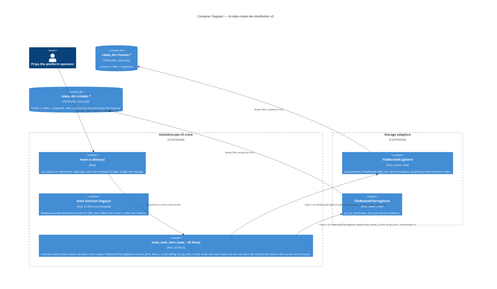
```mermaid
C4Container
  title Container Diagram — cli-stats-cinder-tier-distribution v0
  Person(operator, "Priya the platform operator")
  Container_Boundary(cli, "kaleidoscope-cli crate") {
    Container(main, "main.rs (binary)", "Rust", "run_stats arm repointed: calls stats_with_tiers instead of stats. Single-line change.")
    Container(stats_legacy, "stats function (legacy)", "Rust, src/lib.rs (unchanged)", "Retained as byte-level test oracle for OK4. Not called from main.rs after this feature.")
    Container(stats_with_tiers, "stats_with_tiers (new, ~25 lines)", "Rust, src/lib.rs", "Inherits stats() Lumen block verbatim; then opens FileBackedTieringStore; iterates [Hot, Warm, Cold] calling list_by_tier(..).len(); emits one key=count line per non-zero tier (Option B); returns the Lumen record count.")
  }
  Container_Boundary(stores, "Storage adapters") {
    Container(lumen_store, "FileBackedLogStore", "Rust, lumen crate", "query(tenant, TimeRange::all()); per-tenant isolation; ascending observed-time order.")
    Container(cinder_store, "FileBackedTieringStore", "Rust, cinder crate", "list_by_tier(tenant, tier); per-tenant isolation.")
  }
  ContainerDb(lumen_files, "<data_dir>/lumen.*", "POSIX files, read-only", "Lumen v1 WAL + snapshot.")
  ContainerDb(cinder_files, "<data_dir>/cinder.*", "POSIX files, read-only", "Cinder v1 WAL + snapshot. New read access introduced by this feature.")

  Rel(operator, main, "Invokes `stats <tenant> <data_dir>` at")
  Rel(main, stats_with_tiers, "Dispatches to with stdout writer")
  Rel(stats_with_tiers, lumen_store, "Opens via FileBackedLogStore::open(lumen_base(..)); calls query(..) once on")
  Rel(stats_with_tiers, cinder_store, "Opens via FileBackedTieringStore::open(cinder_base(..)); calls list_by_tier(..) three times on")
  Rel(lumen_store, lumen_files, "Reads WAL+snapshot from")
  Rel(cinder_store, cinder_files, "Reads WAL+snapshot from")
```

### C4 — Component View (Level 3) — `cli-stats-cinder-tier-distribution-v0`

**Not produced.** L3 reification conditions documented in the
feature-side `design/application-architecture.md`. None apply at v0.

### Quality attribute coverage (ISO 25010)

| Attribute | How addressed |
|---|---|
| Functional Suitability | New `stats_with_tiers()` emits the new key=value lines per OK1 (correctness against `list_by_tier(..).len()`), OK2 (tenant isolation via `TieringStore` port), OK3 (Option B empty-render with orphan-tier surfacing), OK4 (byte-equivalent backwards-compat). |
| Maintainability | ~25 new source lines plus one-line `main.rs` repoint. Mutation scope: two files; existing `gate-5-mutants-kaleidoscope-cli` auto-covers via `--in-diff`. No new public type. |
| Reliability | No new failure modes beyond existing `LumenOpen`/`LumenQuery`/`CinderOpen`/`Io`. Empty-tenant is not an error. Quiescent recorders on both sides; no side effects beyond bytes-on-stdout. |
| Compatibility | OK4 guardrail: zero-Cinder tenants produce predecessor-byte-equivalent stdout; locked `tests/stats_subcommand.rs` continues to pass green unmodified. |

### Handoff to DISTILL — `cli-stats-cinder-tier-distribution-v0`

Recipient: `@nw-acceptance-designer`. Translates the four AC in
`docs/feature/cli-stats-cinder-tier-distribution-v0/discuss/slices/slice-01-stats-includes-cinder-tier-distribution.md`
into Rust `#[test]` functions under
`crates/kaleidoscope-cli/tests/stats_cinder_tier_distribution.rs`.
The locked `tests/stats_subcommand.rs` is the supplementary OK4
oracle and is NOT modified (DISCUSS D10). Required reading: this
section; the feature-side `design/wave-decisions.md` (DD1-DD6); the
feature-side `design/application-architecture.md`.

### Handoff to DEVOPS — `cli-stats-cinder-tier-distribution-v0`

Recipient: `nw-platform-architect`. Receives outcome KPIs (OK1
principal, OK2, OK3, OK4); ADR-0005's five gates apply unchanged
(**no new gate; no existing gate amended**); existing
`gate-5-mutants-kaleidoscope-cli` auto-covers via `--in-diff` on
`crates/kaleidoscope-cli/**`; Cargo manifest delta is one new
`[[test]]` block (`name = "stats_cinder_tier_distribution"`), **no
new `[dependencies]`** (all imports already in `lib.rs:56-59`);
mutation scope `crates/kaleidoscope-cli/src/{lib,main}.rs` at 100%
kill rate per Gate 5; **external integrations: none**; paradigm for
DELIVER is Rust idiomatic per `CLAUDE.md` (data + free functions; no
new trait; no new struct; no new `dyn` boundary beyond the existing
`Box<dyn LumenRec + Send + Sync>` and `Box<dyn CinderRec + Send +
Sync>` at the recorder construction sites).

## Application Architecture — `cli-read-time-range-v0`

Author: `@nw-solution-architect` (Morgan), DESIGN wave, 2026-05-19.

> **Feature**: extends `kaleidoscope-cli read` with two optional
> flags `--since <ISO 8601 UTC>` and `--until <ISO 8601 UTC>` whose
> parsed nanos drive `lumen.query(tenant, TimeRange::new(s, e))` in
> place of the today-hard-coded `TimeRange::all()` at
> `crates/kaleidoscope-cli/src/lib.rs:284`. Half-open `[since, until)`
> semantics inherited from `lumen::TimeRange`. No `chrono`/`time`/`jiff`;
> the parser is the hand-rolled symmetric inverse of the already-
> shipped `format_iso8601_utc_nanos` from `cli-stats-subcommand-v0`.

The decision: **extend `read()` from 4 args to 5 by appending
`range: TimeRange` (DD1); add private library `parse_iso8601_utc_nanos`
+ inverse helper `days_from_civil` cohabiting with their inverses
(DD2); add binary-side `parse_time_range` that scans argv and builds
the stderr message naming the offending flag (DD2). Parser accepts
`YYYY-MM-DDTHH:MM:SSZ` and `YYYY-MM-DDTHH:MM:SS.D..DZ` (1..=9
fractional digits), calendar-validates at the parser boundary (DD3).**
Full rationale in `docs/feature/cli-read-time-range-v0/design/wave-decisions.md`.

### Principal architectural decisions

1. **`read()` signature evolution** (DD1): append `range: TimeRange`
   as the 5th parameter (after `otlp_log_path: Option<&Path>`).
   Rejected `Option<TimeRange>` (second null-state on top of
   `TimeRange::all()`); rejected a parallel `read_with_range`
   sibling (the locked OK2 tests invoke the binary via subprocess,
   not the library — the structural force that made `stats_with_tiers`
   correct does not apply); rejected builder (two optional knobs do
   not earn one). The no-flag CLI default is `TimeRange::all()`, so
   OK2 byte-equivalence holds without edit to the locked files.

2. **Parser placement** (DD2): split across `lib.rs` (typed core
   parser, knows nanos) and `main.rs` (flag-name-aware wrapper,
   builds stderr message). Library `parse_iso8601_utc_nanos(&str)
   -> Result<u64, IsoParseError>` cohabits with its inverse
   `format_iso8601_utc_nanos` so the round-trip AC is a single-file
   local check; mutation-killing tests join the formatter's at
   `crates/kaleidoscope-cli/src/lib.rs:457-651`. Binary
   `parse_time_range(args) -> Result<TimeRange, _>` mirrors
   `parse_observe_otlp`'s order-independent argv scan
   (`crates/kaleidoscope-cli/src/main.rs:130-144`).

3. **Parser scope** (DD3): accept exactly `YYYY-MM-DDTHH:MM:SSZ`
   (length 20) and `YYYY-MM-DDTHH:MM:SS.D..DZ` (1..=9 fractional
   digits, length 22..=30). Calendar validation rejects malformed
   values (`2026-13-32T25:99:99Z`) at the parser boundary, not the
   storage layer. Year range `[0000, 9999]` matches the formatter's
   `{year:04}` contract. New helper `days_from_civil` (Hinnant
   public-domain inverse) cohabits with the already-shipped
   `civil_from_days` at `lib.rs:426-438`.

### Reuse Verdict (RCA F-1)

**EXTEND** (`read()`'s signature; `run_read_with`'s body;
`write_usage`'s text) + **REUSE** (eight existing constructs:
`format_iso8601_utc_nanos`, `civil_from_days`, `lumen::TimeRange`,
`TimeRange::all()`, the `parse_observe_otlp` argv-scan shape, the
`Error::Io` / `From<io::Error>` pair, the existing `read()` body,
the locked OK2 test files) + **CREATE NEW** (one private typed
error `IsoParseError`, one private library parser function, one
private library helper `days_from_civil`, one private binary
`parse_time_range` helper, one new optional parameter on the public
`read()` signature). **No new public type, no new trait, no new
module, no new external dependency.**

### C4 — Levels 1, 2, 3 — `cli-read-time-range-v0`

See `docs/feature/cli-read-time-range-v0/design/application-architecture.md`
for the L1 + L2 diagrams. Change confined to the `kaleidoscope-cli`
node; `<data_dir>/lumen.*` I/O pattern unchanged (one `query` call
per `read`, today; only the `TimeRange` argument changes).
Container delta: `main.rs::parse_time_range` (new), `lib.rs::parse_iso8601_utc_nanos`
(new private), `lib.rs::days_from_civil` (new private, Hinnant
inverse), `lib.rs::read` (extended signature). No new external
container. L3 not produced; reification conditions documented
feature-side.

### Quality attribute coverage (ISO 25010)

| Attribute | How addressed |
|---|---|
| Functional Suitability | New parser + `parse_time_range` thread parsed values into `TimeRange::new(s, e)` per OK1 (bounded-window correctness against `TimeRange::contains`'s half-open contract), OK3 (half-bounded `0`/`u64::MAX` defaults), OK4 (fail-fast on invalid input). |
| Maintainability | ~90 new source lines (parser ~50, `days_from_civil` ~15, `parse_time_range` ~25, signature/usage deltas ~5). Two files; existing `gate-5-mutants-kaleidoscope-cli` auto-covers via `--in-diff`. No new public type/trait/module. |
| Reliability | No new failure modes beyond `IsoParseError` (private; flag-name context added by binary wrapper). Fail-fast invariant: invalid input rejected BEFORE Lumen store opens (OK4). |
| Compatibility | OK2 guardrail: no-flag invocations construct `TimeRange::all()`, preserving byte-equivalent stdout on the two locked test files without edit. |
| Portability | Hand-rolled parser preserves the no-`chrono`/`time`/`jiff` posture inherited from `cli-stats-subcommand-v0` DD1; verified by workspace grep at design time (zero matches). |

### Handoff to DISTILL — `cli-read-time-range-v0`

Recipient: `@nw-acceptance-designer`. Translates the eleven AC in
`docs/feature/cli-read-time-range-v0/discuss/user-stories.md`
(US-01) into Rust `#[test]` functions under
`crates/kaleidoscope-cli/tests/read_time_range.rs`, mirroring the
harness from `tests/observe_otlp_read_flag.rs` (helpers duplicated
inline per DISCUSS D7). The locked `observe_otlp_read_flag.rs` and
`observe_otlp_flag.rs` are the OK2 oracles and NOT modified.
Required reading: this section; feature-side `design/wave-decisions.md`
(DD1-DD5); feature-side `design/application-architecture.md`.

### Handoff to DEVOPS — `cli-read-time-range-v0`

Recipient: `nw-platform-architect`. Receives OK1 (bounded-window
filter, principal), OK2 (no-flag byte equivalence), OK3 (half-
bounded), OK4 (invalid-input fail-fast); ADR-0005's five gates
apply unchanged (**no new/amended gate**); existing
`gate-5-mutants-kaleidoscope-cli` auto-covers via `--in-diff` on
`crates/kaleidoscope-cli/**`; Cargo delta is one new `[[test]]`
block (`name = "read_time_range"`), **no new `[dependencies]`**
(`lumen::TimeRange`, `aegis::TenantId`, std I/O traits already in
`lib.rs:55-65`); mutation scope `crates/kaleidoscope-cli/src/{lib,main}.rs`
at 100% kill rate per Gate 5; **external integrations: none**
(pure-string parser + additive parameter); paradigm for DELIVER
is Rust idiomatic per `CLAUDE.md` (data + free functions; new
`IsoParseError` typed sum; no new trait; no new `dyn` boundary).

## Application Architecture — `cli-stats-time-range-v0`

Author: `@nw-solution-architect` (Morgan), DESIGN wave, 2026-05-19.

> **Feature**: extends `kaleidoscope-cli stats` with optional flags
> `--since <ISO 8601 UTC>` and `--until <ISO 8601 UTC>` whose parsed
> nanos drive `lumen.query(tenant, TimeRange::new(s, e))` inside
> `stats_with_tiers` at `crates/kaleidoscope-cli/src/lib.rs:359-361`
> in place of `TimeRange::all()`. Half-open `[since, until)`
> inherited from `lumen::TimeRange`. The Cinder loop at lines
> 375-380 is UNCHANGED — `hot=` / `warm=` / `cold=` remain
> state-snapshot (D-CinderScope). Reuses every parser construct
> shipped by `cli-read-time-range-v0`; introduces zero new library
> functions, helpers, types, or external crates.

The decision: **extend `stats_with_tiers()` from 3 args to 4 by
appending `range: TimeRange` (DD1, mirrors predecessor's DD1 on
`read()`); thread the parameter ONLY into the Lumen call, option
(a) — Cinder branch ignores it (DD2); empty-window handled by the
existing empty-tenant arm (DD3); mechanically update only
`tests/stats_cinder_tier_distribution.rs` (five call sites,
`TimeRange::all()` as 4th arg, no assertion edits) — DD4.** Full
rationale in `docs/feature/cli-stats-time-range-v0/design/wave-decisions.md`.

### Principal architectural decisions

1. **`stats_with_tiers()` signature evolution** (DD1): append
   `range: TimeRange` as the 4th parameter. Rejected
   `Option<TimeRange>` (second null-state on top of
   `TimeRange::all()`) and a parallel `stats_with_tiers_range`
   sibling (the structural force that demanded that shape on the
   original `stats_with_tiers` does not apply here; precedent set
   by `cli-read-time-range-v0` DD1 on `read()`). No-flag CLI
   default is `TimeRange::all()`, so OK4 byte-equivalence holds.

2. **D-CinderScope implementation** (DD2): option (a) — single
   function, `range` parameter consulted by Lumen branch and not by
   Cinder branch. The asymmetric flow at the storage adapters IS
   the architectural contract this feature introduces; the
   source-level encoding is a parameter consulted on one branch
   and not on the other.

3. **D-EmptyWindow confirmation** (DD3): the existing `if let (Some,
   Some) = (records.first(), records.last())` arm at lines 364-369
   handles the empty-window case automatically — no new code path.

4. **Locked test mechanical update scope** (DD4): scoped to
   `tests/stats_cinder_tier_distribution.rs` ONLY (five call-site
   edits, no assertion edits). `tests/stats_subcommand.rs` exercises
   only the legacy 3-arg `stats()` and requires no update. All other
   locked test files do not reference `stats_with_tiers`.

### Reuse Verdict (RCA F-1)

**EXTEND** (`stats_with_tiers`'s signature; `run_stats_with`'s
body; `write_usage`'s text) + **REUSE** (twelve existing constructs:
`parse_iso8601_utc_nanos`, `parse_time_range`, `parse_flag_iso`,
`IsoParseError`, `lumen::TimeRange`, `TimeRange::all()`,
`format_iso8601_utc_nanos`, Lumen `query`, Cinder `list_by_tier`,
`stats_with_tiers` body, legacy `stats()`, all locked test files
except the one mechanical update). **CREATE NEW**: zero new
functions, helpers, types, private items, or crates. The only new
entity in production source is the additional parameter on
`stats_with_tiers`'s public signature. Strictly thinner than
`cli-read-time-range-v0`: this feature consumes what the
predecessor shipped.

### C4 — Levels 1, 2, 3 — `cli-stats-time-range-v0`

See `docs/feature/cli-stats-time-range-v0/design/application-architecture.md`
for L1 + L2 diagrams. Change confined to the `kaleidoscope-cli`
node; storage I/O unchanged (only the `TimeRange` argument to the
Lumen call changes). Container delta: `run_stats_with` (one new
line), `stats_with_tiers` (extended signature + one token swap at
line 360). No new container. L3 not produced.

### Quality attribute coverage (ISO 25010)

| Attribute | How addressed |
|---|---|
| Functional Suitability | Parsed `TimeRange::new(s, e)` threaded into `lumen.query` per OK1 (bounded-window count), OK2 (windowed earliest/latest), OK3 (Cinder lines byte-identical across time-range invocations — pins D-CinderScope). |
| Maintainability | ~3 new production source lines; two files; existing `gate-5-mutants-kaleidoscope-cli` auto-covers via `--in-diff`. No new public type/trait/module. |
| Reliability | No new failure modes. Fail-fast invariant inherited from predecessor (D-NoNewError). |
| Compatibility | OK4 guardrail: no-flag invocations construct `TimeRange::all()`; locked test files pass with mechanical 4th-arg update only. |
| Portability | Hand-rolled parser reused unchanged. No new external crate; no-`chrono`/`time`/`jiff` posture preserved. |

### Handoffs — `cli-stats-time-range-v0`

DISTILL (`@nw-acceptance-designer`): translates US-01's AC into six
`#[test]` functions under
`crates/kaleidoscope-cli/tests/stats_time_range.rs` per the slice;
mechanically updates `tests/stats_cinder_tier_distribution.rs`'s
five `stats_with_tiers(...)` call sites with `TimeRange::all()`
(DD4); no assertion edits.

DEVOPS (`nw-platform-architect`): receives OK1-OK4; ADR-0005's five
gates apply unchanged (**no new/amended gate**);
`gate-5-mutants-kaleidoscope-cli` auto-covers via `--in-diff`; Cargo
delta is one new `[[test]]` block (`name = "stats_time_range"`),
**no new `[dependencies]`**; mutation scope
`crates/kaleidoscope-cli/src/{lib,main}.rs` at 100% kill rate;
**external integrations: none**; DELIVER paradigm Rust idiomatic
(one additive positional parameter; no new trait, no new `dyn`
boundary, no new typed error, no new free function in production
source).

---

## Application Architecture — `cli-migrate-subcommand-v0`

Author: `@nw-solution-architect` (Morgan), DESIGN wave, 2026-05-19.

> **Feature**: adds a fifth positional subcommand to
> `kaleidoscope-cli`:
> `migrate <tenant_id> <data_dir> <item_id> <to_tier>`. Opens the
> Cinder store only, pre-flights `get_entry` to discover the
> `from` tier, calls `TieringStore::migrate(tenant, item, to_tier, SystemTime::now())`,
> and writes one literal line
> `migrated tenant=<tenant> item=<item_id> from=<from> to=<to>\n`
> to stdout. Lower-case-only tier argument; idempotent same-tier
> faithfully reported; Lumen WAL+snapshot byte-equivalent before
> and after every invocation including failure paths. Released
> under AGPL-3.0-or-later.

The decision: **add `pub fn migrate(tenant, data_dir, item_id,
to_tier_arg, writer) -> Result<(), Error>` to `lib.rs` as the
fifth sibling free function (DD1); add private
`parse_tier(s: &str) -> Result<Tier, ()>` accepting only the
three lower-case literals (DD3); pre-flight `get_entry`
discovers `from` and discriminates UnknownItem before
issuing `migrate` (DD2); add TWO new `Error` variants —
`InvalidTier { value: String }` and `CinderMigrate(MigrateError)`
— with distinct `Display` prefixes (DD4); `run_migrate` in
`main.rs` dispatches one new arm and parses argv[4]=item_id and
argv[5]=to_tier inline.** Full rationale in
`docs/feature/cli-migrate-subcommand-v0/design/wave-decisions.md`.

### Principal architectural decisions

1. **`migrate()` library function shape** (DD1): returns
   `Result<(), Error>` with `writer: impl Write` as a parameter,
   parallel to `stats_with_tiers`. Rejected an in-`main.rs`-only
   shape (breaks the in-process acceptance-test pattern) and a
   typed `MigrateReport` return (premature abstraction — stdout
   is the only consumer of the from/to information).

2. **Pre-flight `get_entry`** (DD2): one read call before the
   mutation. `None` materialises
   `Error::CinderMigrate(MigrateError::UnknownItem)` without
   issuing the `migrate` call (no silent insert). The race
   window between `get_entry` and `migrate` is documented and
   accepted as out-of-scope for v0 (single-process CLI).

3. **`parse_tier` literal-match parser** (DD3): inverse of
   `tier_lowercase`. Three accepted literals (`hot`, `warm`,
   `cold`); everything else `_ => Err(())`. No trim, no
   case-fold. The renderer-parser pair pins the lower-case
   contract at zero spelling tolerance.

4. **Two new `Error` variants** (DD4): `InvalidTier { value }`
   (Display: `<to_tier> {value:?}: expected one of hot, warm, cold`)
   and `CinderMigrate(MigrateError)` (Display: `cinder migrate: {e}`).
   The CinderMigrate variant is distinct from the existing
   `CinderOpen(MigrateError)` so a future log analyser
   distinguishes store-open failure from store-migrate failure.

### Reuse Verdict (RCA F-1)

**REUSE** (fourteen existing constructs: `cinder_base`,
`FileBackedTieringStore::open`, `NoopRecorder` alias
`CinderRecorder`, `get_entry`, `migrate`, `MigrateError`,
`ItemId`, `Tier`, `tier_lowercase`, `From<io::Error>`,
`Error::CinderOpen`, `parse_positional`, `TenantId`, the
in-process test harness shape). **CREATE NEW**: one private
parser helper (`parse_tier`), two error variants
(`InvalidTier`, `CinderMigrate`), one public free function
(`migrate`), and the binary-side dispatch arm + `run_migrate`
helper + usage paragraph. **No new public type, no new trait,
no new module, no new external crate.** Change surface: two
files in `src/` (`lib.rs`, `main.rs`) plus one new test file
(`tests/migrate_subcommand.rs`) plus one new `[[test]]` block
in `Cargo.toml`.

### C4 — Levels 1, 2, 3 — `cli-migrate-subcommand-v0`

See `docs/feature/cli-migrate-subcommand-v0/design/application-architecture.md`
for L1 + L2 diagrams. Change confined to the `kaleidoscope-cli`
node; storage I/O gains one new write access pattern on
`<data_dir>/cinder.*`. The Lumen container is unchanged
(D-NoLumenTouch). L3 not produced; reification conditions
documented.

### Quality attribute coverage (ISO 25010)

| Attribute | How addressed |
|---|---|
| Functional Suitability | OK1 (migrate-success correctness: stdout line + post-call `get_entry().tier == to_tier`); OK4 (idempotent same-tier faithfully reported). |
| Reliability | OK2 (UnknownItem fail-fast: stderr names verbatim item id; store unchanged); OK3 (InvalidTier fail-fast: stderr names verbatim invalid value; store unchanged); D-NoLumenTouch (Lumen byte-equivalent across all paths). |
| Maintainability | ~54 new production source lines; two files; existing `gate-5-mutants-kaleidoscope-cli` auto-covers via `--in-diff`. No new public type, trait, or module. Two new Error variants additive on existing enum. |
| Security | No new attack surface. Single positional API; no flag injection; argv parsed by hand against literal matchers. The `{value:?}` Display uses Rust debug-format quoting on operator-supplied strings (no shell injection risk on stderr). |
| Compatibility | Seven locked acceptance test files continue to pass green UNMODIFIED. New `[[test]]` block additive in `Cargo.toml`. |
| Portability | No new external crate; no platform-specific call; `SystemTime::now()` is std. |

### Handoffs — `cli-migrate-subcommand-v0`

DISTILL (`@nw-acceptance-designer`): translates US-01's AC and
OK1..OK4 into `#[test]` functions under
`crates/kaleidoscope-cli/tests/migrate_subcommand.rs` per the
slice. The harness mirrors the six predecessor test files in the
cluster (inline `tenant` / `record` / `temp_root` / `cleanup` /
`ndjson` helpers — rule-of-three extraction deferred per
D-NewTestFile).

DEVOPS (`nw-platform-architect`): receives OK1-OK4; ADR-0005's
five gates apply unchanged (**no new/amended gate**);
`gate-5-mutants-kaleidoscope-cli` auto-covers via `--in-diff`;
Cargo delta is one new `[[test]]` block (`name = "migrate_subcommand"`),
**no new `[dependencies]`**; mutation scope
`crates/kaleidoscope-cli/src/{lib,main}.rs` at 100% kill rate;
**external integrations: none** (no HTTP, no webhook, no
third-party API, no vendor SDK; pure local Cinder WAL mutation);
DELIVER paradigm Rust idiomatic (one new public free function,
one new private parser helper, two additive `Error` variants;
no new trait, no new `dyn` boundary, no new external crate).

---

## Application Architecture — `cli-migrate-observe-otlp-v0`

Author: `@nw-solution-architect` (Morgan), DESIGN wave, 2026-05-19.

> **Feature**: extends the `kaleidoscope-cli migrate <tenant_id>
> <data_dir> <item_id> <to_tier>` subcommand with an optional
> `--observe-otlp <path>` flag. When set, every successful
> `migrate()` call emits exactly one NDJSON OTLP-JSON line to
> `<path>` via the already-shipped `CinderToOtlpJsonWriter`
> (`cinder.migrate.count`, point attributes `{tenant_id, from, to}`,
> `asInt="1"`). When absent, behaviour is byte-equivalent to today
> (Cinder constructed with `NoopRecorder`; no file created).
> Released under AGPL-3.0-or-later.

The decision: **grow `pub fn migrate(...)` by one trailing
`otlp_log_path: Option<&Path>` parameter (DD1); inside the body
replace the literal `Box::new(CinderRecorder)` at line 434 with a
`match otlp_log_path { Some(path) => ..., None => Box::new(CinderRecorder) }`
that constructs `CinderToOtlpJsonWriter::new(file)` in the `Some`
arm against a freshly-opened `OpenOptions::create(true).append(true)`
file handle (DD2); thread the flag through `run_migrate` /
`run_migrate_with` in `main.rs` via the already-existing
`parse_observe_otlp(args)?` helper and update the usage paragraph
to mirror the `ingest` / `read` wording (DD3); REUSE all surrounding
constructs — no new public type, no new trait, no new module, no
new external crate (DD4); apply mechanical signature-match (`None`
appended) to six call sites in `main.rs`, the inline white-box test
in `lib.rs`, and the four `migrate(...)` calls in the locked
`migrate_subcommand.rs` test file (DD5).** Full rationale in
`docs/feature/cli-migrate-observe-otlp-v0/design/wave-decisions.md`.

### Principal architectural decisions

1. **`migrate()` signature growth** (DD1): one trailing
   `Option<&Path>` parameter; mirror of the `read()` and `ingest()`
   shapes already shipped on this crate. No new public type;
   `Option<PathBuf>` ownership stays in `main.rs`; library borrows
   via `.as_deref()`. Rejected: passing a recorder box from the
   caller (violates D-RecorderConstruction); a `MigrateConfig`
   struct (premature abstraction); an overload
   `migrate_with_otlp(...)` (redundant duplication).

2. **Internal `match otlp_log_path`** (DD2): exact mirror of the
   `ingest()` pattern at `lib.rs:155-184`, simplified to a
   single-writer shape (no `try_clone`; only the Cinder store is
   opened on this path). The match block lives between
   `parse_tier(to_tier_arg)?` (line 431) and
   `FileBackedTieringStore::open(...)` (line 434); OK4
   (invalid-tier → no file created) is preserved by construction
   because `parse_tier` short-circuits before the open is reached.

3. **`main.rs` thread-through** (DD3): `parse_observe_otlp(args)?`
   is the third invocation site (after `run_ingest` and
   `run_read_with`). Usage-text paragraph for `migrate` gains the
   `[--observe-otlp <path>]` suffix and one explanatory sentence
   mirroring the `ingest` / `read` wording. No new helper.

### Reuse Verdict (RCA F-1)

**REUSE** (everything): the existing `migrate()` body shape, the
`CinderToOtlpJsonWriter::new(file)` constructor, the
`cinder::NoopRecorder` alias (`None` arm), the `parse_observe_otlp`
helper in `main.rs`, the `OpenOptions::create(true).append(true)`
incantation from ADR-0039 §8, the `From<std::io::Error> for Error`
impl, `parse_tier`, the pre-flight `get_entry` short-circuit, and
the `Box<dyn cinder::MetricsRecorder + Send + Sync>` coercion
idiom. **EXTEND** (one construct): the `migrate()` signature gains
one parameter. **CREATE NEW**: nothing in production source; one
new acceptance test file (`tests/migrate_observe_otlp_flag.rs`)
duplicating the cluster-standard harness inline at v0 (DISCUSS D5,
rule-of-three deferred to test file #12). **No new public type, no
new trait, no new module, no new external crate.** Change surface:
two files in `src/` (`lib.rs`, `main.rs`) plus one new test file
plus one new `[[test]]` block in `Cargo.toml` plus mechanical
signature-match updates on six call sites.

### C4 — Levels 1, 2, 3 — `cli-migrate-observe-otlp-v0`

See `docs/feature/cli-migrate-observe-otlp-v0/design/application-architecture.md`
for L1 + L2 diagrams. The change is confined to the
`kaleidoscope-cli` node; storage I/O gains one new lazy file open
on `<otlp_path>` inside the `Some(path)` arm (only reachable on
successful `parse_tier` + present flag). The Lumen container is
unchanged (D-NoLumenTouch inherited). L3 not produced; reification
conditions documented.

### Quality attribute coverage (ISO 25010)

| Attribute | How addressed |
|---|---|
| Functional Suitability | OK1 (wire shape per successful migrate: `cinder.migrate.count` + `{tenant_id, from, to}` + `asInt="1"`); OK3 (UnknownItem path emits no line); inherits OK1/OK4 of `cli-migrate-subcommand-v0` (post-call state, stdout transition line). |
| Reliability | OK2 (no-flag byte-equivalence: locked `migrate_subcommand.rs` continues to pass green with mechanical signature-match only); OK4 (InvalidTier short-circuits before file open: sink file never created on invalid-tier path); within-writer NDJSON-validity inherited from ADR-0039 §2 (`Mutex<File>` guard around `write_all(line) + flush`). |
| Maintainability | One additive parameter; one match insertion; one usage-text paragraph edit. Existing `gate-5-mutants-kaleidoscope-cli` auto-covers via `--in-diff`. No new public type, trait, or module. |
| Security | No new attack surface. No flag-injection vector (positional + `--observe-otlp` reuses an existing argv scanner). The OTLP file open uses `create(true).append(true)` (no truncate), preserving any pre-existing operator-managed sink contents. |
| Compatibility | Locked `migrate_subcommand.rs` test file continues to pass green with six mechanical signature-match edits (`, None` appended on every call site) and zero assertion edits — same posture applied to `ingest_and_read_roundtrip.rs` and `stats_cinder_tier_distribution.rs` in their respective DELIVER waves. New `[[test]]` block additive in `Cargo.toml`. |
| Portability | No new external crate; no platform-specific call. `OpenOptions::create(true).append(true)` and POSIX `O_APPEND` semantics are inherited from ADR-0039 §8. |

### Handoffs — `cli-migrate-observe-otlp-v0`

DISTILL (`@nw-acceptance-designer`): translates OK1..OK4 into
`#[test]` functions under
`crates/kaleidoscope-cli/tests/migrate_observe_otlp_flag.rs` per
the slice. Inline harness duplication at v0 (rule-of-three
deferred per DISCUSS D5).

DEVOPS (`@nw-platform-architect`): receives OK1-OK4; ADR-0005's
five gates apply unchanged (**no new/amended gate**);
`gate-5-mutants-kaleidoscope-cli` auto-covers via `--in-diff`;
Cargo delta is one new `[[test]]` block
(`name = "migrate_observe_otlp_flag"`), **no new `[dependencies]`**;
mutation scope `crates/kaleidoscope-cli/src/{lib,main}.rs` at 100%
kill rate; **external integrations: none** (no HTTP, no webhook,
no third-party API, no vendor SDK; pure local Cinder WAL mutation
plus one local file append); DELIVER paradigm Rust idiomatic (one
additive positional parameter; one match insertion; reuses the
ADR-0039 §1 writer constructor unchanged; no new trait, no new
`dyn` boundary, no new external crate).

---

## Application Architecture — `cli-list-items-subcommand-v0`

Author: `@nw-solution-architect` (Morgan), DESIGN wave, 2026-05-19.

> **Feature**: adds a sixth positional subcommand to
> `kaleidoscope-cli`:
> `list-items <tenant_id> <data_dir> <tier>`. Opens the Cinder
> store read-only, calls `TieringStore::list_by_tier(tenant,
> tier)`, sorts the returned `Vec<ItemId>` lexicographically,
> and writes one bare item id per line to stdout (terminated by
> `\n`). Lower-case-only tier argument; empty stdout for N=0;
> Cinder WAL+snapshot byte-equivalent across every path
> (including invalid-tier failure); Lumen WAL+snapshot
> byte-equivalent across every path. Released under
> AGPL-3.0-or-later.

The decision: **add `pub fn list_items(tenant, data_dir,
tier_arg, writer) -> Result<(), Error>` to `lib.rs` as the
sixth sibling free function (DD1); reuse the existing
`parse_tier` helper by promoting its visibility to
`pub(crate)` (DD4); apply a `Vec::sort_unstable()` boundary
sort on the returned `Vec<ItemId>` so stdout is
deterministic across runs despite the underlying
`HashMap`-iteration randomness (DD2); emit NO stderr summary
on success (DD3); reuse the existing `Error::InvalidTier`
variant and its existing `Display` wording verbatim for the
OK3 failure path (DD5); `run_list_items` in `main.rs`
dispatches one new arm and parses argv[4]=tier inline.**
Full rationale in
`docs/feature/cli-list-items-subcommand-v0/design/wave-decisions.md`.

### Principal architectural decisions

1. **`list_items()` library function shape** (DD1): returns
   `Result<(), Error>` with `writer: impl Write` as a
   parameter, parallel to `migrate()`. Rejected returning
   `Result<usize, Error>` (the count is unused under DD3) and
   a typed `ListItemsReport` (premature abstraction; stdout
   is the only consumer).

2. **Lexicographic boundary sort** (DD2): `Vec::sort_unstable()`
   on the returned `Vec<ItemId>` using `ItemId`'s natural
   `Ord` impl. Required because
   `cinder::InMemoryTieringStore::list_by_tier` iterates a
   `HashMap` (randomised order per process). Picked
   `sort_unstable` over stable `sort` because `ItemId`s in the
   returned Vec are unique by Cinder invariant — no
   equal-key ties to preserve.

3. **No stderr summary on success** (DD3): stderr remains the
   failure-only channel; happy-path stderr is empty.
   Rejected the `list-items ok: items=N` mirror of `stats ok:
   records=N` because stdout IS the data (operator runs `wc
   -l` if they need a count); a stderr echo duplicates
   observable information and adds noise to interactive
   pipelines.

4. **`parse_tier` visibility promoted to `pub(crate)`** (DD4):
   the existing four-line literal-match helper at
   `lib.rs:475-482` is the authoritative tier-arg parser.
   Reused by the new function via the same lift pattern as
   `migrate()` (`parse_tier(tier_arg).map_err(|_|
   Error::InvalidTier { value: tier_arg.to_string() })?`).
   Smallest-possible visibility growth.

5. **Reused stderr wording on invalid tier** (DD5): existing
   `Error::InvalidTier` `Display` impl at `lib.rs:98-100` is
   reused verbatim. Stderr line is byte-identical to
   `migrate`'s OK3 line — operator muscle memory preserved.

### Reuse Verdict (RCA F-1)

**REUSE** (eleven existing constructs: `cinder_base`,
`FileBackedTieringStore::open`, `NoopRecorder` alias
`CinderRecorder`, `TieringStore::list_by_tier`, `ItemId`,
`Tier`, `parse_tier` (visibility promoted to `pub(crate)`),
`tier_lowercase` not needed at all, `Error::InvalidTier`,
`Error::CinderOpen`, `Error::Io` with existing
`From<io::Error>`, `TenantId`, the in-process test harness
shape). **CREATE NEW**: one public free function
(`list_items`), one binary-side dispatch arm + `run_list_items`
helper + usage paragraph. **No new public type, no new trait,
no new module, no new external crate, NO new `Error`
variant.** Change surface: two files in `src/` (`lib.rs`,
`main.rs`) plus one new test file
(`tests/list_items_subcommand.rs`) plus one new `[[test]]`
block in `Cargo.toml`. Strictly thinner than
`cli-migrate-subcommand-v0` which introduced two new `Error`
variants.

### C4 — Levels 1, 2 — `cli-list-items-subcommand-v0`

See `docs/feature/cli-list-items-subcommand-v0/design/application-architecture.md`
for L1 + L2 diagrams. Change confined to the `kaleidoscope-cli`
node; storage I/O gains zero new write access patterns
(D-ReadOnly: Cinder WAL+snapshot byte-equivalent across all
paths). The Lumen container is unchanged (D-NoLumenTouch).
L3 not produced; reification conditions documented
(cross-tenant aggregate, pagination, time-bound historical
reconstruction — all v1+).

### Quality attribute coverage (ISO 25010)

| Attribute | How addressed |
|---|---|
| Functional Suitability | OK1 (stdout shape: one bare item id per line, lex-sorted, `\n`-terminated); OK2 (N=0 empty stdout; the absence of a placeholder line IS the result). |
| Reliability | OK3 (InvalidTier fail-fast: stderr names verbatim invalid value; store never opened on this path); D-ReadOnly (Cinder byte-equivalent across all paths); D-NoLumenTouch (Lumen byte-equivalent across all paths). |
| Maintainability | ~30 new production source lines; two files; one helper visibility promotion (`parse_tier` private → `pub(crate)`); existing `gate-5-mutants-kaleidoscope-cli` auto-covers via `--in-diff`. No new public type, trait, module, or `Error` variant. |
| Security | No new attack surface. Single positional API; no flag-injection vector; argv parsed by hand against literal matchers. Read-only access on `<data_dir>/cinder.*`. |
| Compatibility | Eight locked acceptance test files continue to pass green UNMODIFIED. New `[[test]]` block additive in `Cargo.toml`. |
| Portability | No new external crate; no platform-specific call. |

### Handoffs — `cli-list-items-subcommand-v0`

DISTILL (`@nw-acceptance-designer`): translates US-01's AC
and OK1..OK3 into `#[test]` functions under
`crates/kaleidoscope-cli/tests/list_items_subcommand.rs` per
the slice. Harness mirrors `tests/migrate_subcommand.rs`
(inline `tenant` / `record` / `temp_root` / `cleanup` /
`ndjson` helpers; rule-of-three extraction deferred per
DISCUSS D-NewTestFile). Eighth `tests/*.rs` in the cluster
using the same harness shape.

DEVOPS (`@nw-platform-architect`): receives OK1-OK3;
ADR-0005's five gates apply unchanged (**no new/amended
gate**); `gate-5-mutants-kaleidoscope-cli` auto-covers via
`--in-diff`; Cargo delta is one new `[[test]]` block
(`name = "list_items_subcommand"`), **no new
`[dependencies]`**; mutation scope
`crates/kaleidoscope-cli/src/{lib,main}.rs` at 100% kill
rate; **external integrations: none** (no HTTP, no webhook,
no third-party API, no vendor SDK; pure local Cinder WAL
read); DELIVER paradigm Rust idiomatic (one new public free
function, one binary-side helper, one promoted visibility on
a private helper; no new trait, no new `dyn` boundary, no
new external crate, no new `Error` variant).

---

## Application Architecture — `cli-place-subcommand-v0`

Author: `@nw-solution-architect` (Morgan), DESIGN wave, 2026-05-19.

> **Feature**: adds a seventh positional subcommand to
> `kaleidoscope-cli`:
> `place <tenant_id> <data_dir> <item_id> <tier> [--observe-otlp <path>]`.
> Opens the Cinder store only, calls
> `TieringStore::place(tenant, item, tier, SystemTime::now())`,
> and writes one literal line
> `placed tenant=<tenant> item=<item_id> tier=<tier>\n` to stdout.
> Lower-case-only tier argument; faithful to the underlying
> overwrite-semantics (re-placing an existing item updates the
> entry with no CLI special case); Lumen WAL+snapshot byte-
> equivalent before and after every invocation including failure
> paths; with `--observe-otlp <path>` set, appends exactly one
> `cinder.place.count` OTLP-JSON line per call to `<path>`.
> Released under AGPL-3.0-or-later.

The decision: **add `pub fn place(tenant, data_dir, item_id,
tier_arg, writer, otlp_log_path) -> Result<(), Error>` to
`lib.rs` as the seventh sibling free function (DD1); mirror
`migrate()`'s recorder-construction match byte-for-byte for the
`Some(path) => CinderToOtlpJsonWriter / None => CinderRecorder`
arms (DD2); NO new `Error` variant — the trait method returns
`()`, so `Error::InvalidTier`, `Error::CinderOpen`, `Error::Io`
fully cover the failure surface (DD3); `run_place` /
`run_place_with` in `main.rs` mirror `run_migrate` /
`run_migrate_with` modulo the function name and the absent
`to_` qualifier on `tier_arg`.** Full rationale in
`docs/feature/cli-place-subcommand-v0/design/wave-decisions.md`.

### Principal architectural decisions

1. **`place()` library function shape** (DD1): six parameters,
   identical order and types to `migrate()` (`tenant`, `data_dir`,
   `item_id`, `tier_arg`, `writer`, `otlp_log_path`). Simpler
   body than `migrate()`: no `get_entry` pre-flight (no `from`
   tier to discover; overwrite-semantics by design), no
   `.map_err(...)` lift on the trait call (`TieringStore::place`
   returns `()`). Rejected: dropping `otlp_log_path` (contradicts
   D-ObserveOtlp); a typed `PlaceReport` return (premature
   abstraction — stdout is the only consumer); typed `ItemId` /
   `Tier` parameters (shifts parse responsibility across the
   library/binary boundary).

2. **Recorder construction copied byte-for-byte from `migrate()`**
   (DD2): the nine-line `match otlp_log_path { Some(path) =>
   OpenOptions::create(true).append(true).open(path)? +
   CinderToOtlpJsonWriter::new(file); None => CinderRecorder }`
   pattern. No helper extraction — only `migrate()` and `place()`
   share the single-writer shape today (`ingest()` opens TWO
   writers via `try_clone`); two sites is NOT the rule of three.
   The `parse_tier(tier_arg)?` short-circuit runs BEFORE the
   file open, preserving the OK3 invariant ("no file created on
   invalid-tier failure") by construction.

3. **No new `Error` variant** (DD3): `TieringStore::place`
   returns `()` at the trait surface (`crates/cinder/src/store.rs:78-81`).
   Three existing variants fully cover the failure modes —
   `Error::InvalidTier` (parse short-circuit), `Error::CinderOpen`
   (store-open failure), `Error::Io` via `From<std::io::Error>`
   (OTLP file-open failure on `--observe-otlp`, `writeln!`
   failure). A speculative `Error::CinderPlace(_)` variant would
   have no `MigrateError`-equivalent to wrap.

### Reuse Verdict (RCA F-1)

**100% REUSE on the production substrate** (seventeen existing
constructs: `cinder_base`, `FileBackedTieringStore::open`,
`NoopRecorder` alias `CinderRecorder`, `CinderToOtlpJsonWriter`,
`OpenOptions` + ADR-0039 §8 incantation, `place` trait method,
`ItemId`, `Tier`, `parse_tier`, `tier_lowercase`,
`Error::InvalidTier`, `Error::CinderOpen`, `Error::Io` +
`From<io::Error>`, `parse_positional`, `parse_observe_otlp`,
`TenantId`, the `Box<dyn CinderRec + Send + Sync>` coercion
idiom). **CREATE NEW**: one public free function (`place`), and
the binary-side dispatch arm + `run_place` / `run_place_with`
helpers + usage paragraph. **No new public type, no new trait,
no new module, no new external crate, no new `Error` variant.**
Change surface: two files in `src/` (`lib.rs`, `main.rs`) plus
one new test file (`tests/place_subcommand.rs`) plus one new
`[[test]]` block in `Cargo.toml`.

### C4 — Levels 1, 2, 3 — `cli-place-subcommand-v0`

See `docs/feature/cli-place-subcommand-v0/design/application-architecture.md`
for L1 + L2 diagrams. Change confined to the `kaleidoscope-cli`
node; storage I/O gains one new write access pattern on
`<data_dir>/cinder.*` plus an optional append to `<otlp_path>`
when `--observe-otlp` is set. The Lumen container is unchanged
(D-NoLumenTouch). L3 not produced; reification conditions
documented.

### Quality attribute coverage (ISO 25010)

| Attribute | How addressed |
|---|---|
| Functional Suitability | OK1 (placement correctness: stdout line + post-call `get_entry().tier == tier`); OK2 (overwrite-semantics: re-placing updates the entry to the new tier, no CLI special case); OK4 (one `cinder.place.count` OTLP-JSON line per call when `--observe-otlp` is set). |
| Reliability | OK3 (InvalidTier fail-fast: stderr names verbatim invalid value; store never opened on this path; OTLP sidecar never created on this path); D-NoLumenTouch (Lumen byte-equivalent across all paths); tenant-isolation (cluster invariant: `place(acme, ...)` does not touch `globex`'s same-named item). |
| Maintainability | ~45 new production source lines; two files; no new public type, trait, module, or `Error` variant; no helper visibility promotion (`parse_tier` and `tier_lowercase` already accessible in-module). Existing `gate-5-mutants-kaleidoscope-cli` auto-covers via `--in-diff`. |
| Security | No new attack surface. Single positional API; no flag-injection vector; argv parsed by hand against literal matchers. The `{value:?}` Display uses Rust debug-format quoting on operator-supplied strings (no shell injection risk on stderr). OTLP file opened with `create(true).append(true)` (no truncate), preserving any pre-existing operator-managed sink contents. |
| Compatibility | Twelve locked acceptance test files continue to pass green UNMODIFIED. New `[[test]]` block additive in `Cargo.toml`. |
| Portability | No new external crate; no platform-specific call; `SystemTime::now()` is std; `OpenOptions::create(true).append(true)` and POSIX `O_APPEND` semantics inherited from ADR-0039 §8. |

### Handoffs — `cli-place-subcommand-v0`

DISTILL (`@nw-acceptance-designer`): translates the slice's
five UAT scenarios and OK1..OK4 into `#[test]` functions under
`crates/kaleidoscope-cli/tests/place_subcommand.rs`. Harness
mirrors `tests/migrate_observe_otlp_flag.rs` and twelve siblings
(inline `tenant` / `record` / `temp_root` / `cleanup` /
`ndjson` helpers; rule-of-three extraction deferred per
D-NewTestFile). Thirteenth `tests/*.rs` in the cluster using
the same harness shape.

DEVOPS (`@nw-platform-architect`): receives OK1-OK4; ADR-0005's
five gates apply unchanged (**no new/amended gate**);
`gate-5-mutants-kaleidoscope-cli` auto-covers via `--in-diff`;
Cargo delta is one new `[[test]]` block (`name =
"place_subcommand"`), **no new `[dependencies]`**; mutation scope
`crates/kaleidoscope-cli/src/{lib,main}.rs` at 100% kill rate;
**external integrations: none** (no HTTP, no webhook, no
third-party API, no vendor SDK; pure local Cinder WAL mutation
plus optional local append to operator-supplied OTLP-JSON
sidecar); DELIVER paradigm Rust idiomatic (one new public free
function, two new binary-side helpers; no new trait, no new
`dyn` boundary, no new external crate, no new `Error` variant).

---

## Application Architecture — `pulse-v1`

Author: `@nw-solution-architect` (Morgan), DESIGN wave, 2026-05-20.

> **Feature**: adds `FileBackedMetricStore` to the `pulse` crate as a
> second adapter behind the unchanged `MetricStore` trait, alongside
> `InMemoryMetricStore`. Durability via NDJSON WAL (one `Ingest`
> record per `MetricBatch`) + JSON snapshot, a verbatim structural
> carry-forward of `crates/lumen/src/file_backed.rs`. The fourth
> v0 to v1 durable-adapter carry-forward after Cinder v1, Sluice v1
> and Lumen v1. Released under AGPL-3.0-or-later.

The decision: **`FileBackedMetricStore::open(path, recorder) ->
Result<Self, MetricStoreError>` mirrors `FileBackedLogStore::open`
(DD1); WAL is NDJSON, one `Ingest { tenant, metrics }` line per
batch (DD2); `snapshot()` writes the full per-`(tenant,
metric_name)` series index to a JSON file then truncates the WAL
(DD3); `open` loads the snapshot then replays the WAL tail then
re-sorts each series on `time_unix_nano` (DD4); the v0 index +
query logic + predicate matching are REUSED by faithful copy while
file I/O + serde are CREATE-NEW (DD5); `MetricStoreError` grows
from the empty never-type enum to one `PersistenceFailed { reason }`
variant (DD-Error).** Full rationale in
`docs/feature/pulse-v1/design/wave-decisions.md`.

### Principal architectural decisions

1. **`open` shape** (DD1): `open<P: AsRef<Path>>(base_path,
   recorder: Box<dyn MetricsRecorder + Send + Sync>) -> Result<Self,
   MetricStoreError>`, a byte-for-byte mirror of
   `FileBackedLogStore::open` (`crates/lumen/src/file_backed.rs:86`).
   Struct holds `base_path`, `recorder`, `state: Mutex<Inner>`
   (series index + append `BufWriter<File>`). Implements
   `MetricStore` identically to `InMemoryMetricStore` — a drop-in.
   Rejected: a new `DurableMetricStore` trait (the port already
   abstracts durability); a builder; returning `io::Error` (breaks
   the typed-error port contract).

2. **WAL format** (DD2): NDJSON, one `WalRecord::Ingest { tenant:
   TenantId, metrics: Vec<Metric> }` per `MetricBatch`, internally
   tagged `#[serde(tag = "op", rename_all = "snake_case")]` — the
   `WalRecord` shape from lumen's `file_backed.rs:43-50`. Each WAL
   `Metric` keeps its `points` populated for self-contained replay.
   Requires serde derives on the six v0 metric types (D5).

3. **Snapshot** (DD3): full state to `Snapshot { series:
   Vec<SeriesBucket> }` JSON, flush WAL, write snapshot, re-open WAL
   with `truncate(true)` — mirror of `snapshot()`
   (`file_backed.rs:145`). `SeriesBucket` keeps the v0
   metadata/data separation (canonical `Metric` with empty `points`
   + sorted `Vec<MetricPoint>`). Explicit call only; no
   auto-compaction at v1; idempotent.

4. **Recovery** (DD4): snapshot-first seed, then WAL-tail replay
   folding points into the matching series and refreshing canonical
   metadata exactly as `InMemoryMetricStore::ingest`, then re-sort
   every series once on `time_unix_nano`. Corrupt WAL line →
   `PersistenceFailed` naming the line number. Snapshot + tail-WAL
   recovery equals pure-WAL recovery (KPI 3).

### Reuse Verdict (RCA F-1)

**REUSE (read path + index semantics):** the per-`(tenant,
metric_name)` `SeriesEntry` index shape (`store.rs:104-107`), the
metadata/data separation, sort-on-ingest discipline, `query` /
`query_with` filter-and-clone logic, half-open `TimeRange::contains`
contract, `Predicate::matches(&Metric, &MetricPoint)` composition,
the `MetricsRecorder` seam (D9 verbatim), `IngestReceipt`,
empty-batch no-op. The v1 adapter reimplements the read path against
its own `Inner` (it does NOT wrap an `InMemoryMetricStore` — Lumen
v1 did not; a wrapped inner would double the lock and obscure the
WAL/index coupling) but copies the *logic* verbatim. **EXTEND:**
`MetricStoreError` (+1 variant); six metric types (+serde derives).
**CREATE NEW (durability only):** `WalRecord`, `Snapshot` /
`SeriesBucket`, `open`, `snapshot`, `append_wal`,
`wal_path_of` / `snapshot_path_of`, the `io` / `parse` adapters — all
structural mirrors of `file_backed.rs:253-287`. **No new public
trait, no new module beyond `file_backed`, no new external crate.**
A new `Error` variant **is** needed (the additive cost paid by
Cinder, Sluice and Lumen before).

### C4 — Levels 1, 2 — `pulse-v1`

See `docs/feature/pulse-v1/design/application-architecture.md` for
the L1 + L2 diagrams. L1: the platform binary ingests/queries through
the `MetricStore` port; the local filesystem (`<base_path>.wal` /
`.snapshot`) is the single driven dependency. L2: `pulse` crate
containers — `MetricStore` trait (unchanged), `InMemoryMetricStore`
(unchanged), `FileBackedMetricStore` (new), OTLP types (serde
derives added), `MetricsRecorder` (verbatim) — plus two new external
data stores (WAL file, snapshot file). L3 **not produced**:
single-`Mutex<Inner>` adapter; reification conditions
(columnar/sharded index, write/read-index split, compaction
scheduler) are all v2.

### Quality attribute coverage (ISO 25010)

| Attribute | How addressed |
|---|---|
| Functional Suitability | KPI 3 (North Star): 100% of pre- and post-snapshot points survive drop-and-reopen, zero loss/duplication. v0 query semantics preserved (half-open range, predicate AND range, `Vec<(Metric, MetricPoint)>`, ascending time). |
| Performance Efficiency | KPI 1 ingest p95 ≤ 2 ms; KPI 2 recovery p95 ≤ 2.5 s for 10 000 points — both set against the CI substrate from commit one (D10), avoiding the 2026-05-19 lumen/cinder two-week CI-failure window. |
| Reliability | Recovery is the empirical Earned-Trust probe; snapshot + tail-WAL equals pure-WAL (parallel-store equality). Corrupt WAL → `PersistenceFailed` naming the line (fail-loud). Honest scope: `BufWriter::flush` only; fsync, atomic rename, file locking explicitly v2. |
| Maintainability | One new file mirroring a thrice-proven template; +serde derives; +1 Error variant. Per-feature mutation testing scoped to the diff at 100% kill rate per ADR-0005 Gate 5. |
| Compatibility | `MetricStore` trait unchanged; `FileBackedMetricStore` is a drop-in for `InMemoryMetricStore`; existing pulse v0 tests untouched. v0 callers matching the empty `MetricStoreError` need one explicit arm (flagged to DISTILL). |
| Portability | No new external crate (`serde`/`serde_json`/`aegis` already present); no platform-specific syscall; std filesystem only. |

### Handoffs — `pulse-v1`

DISTILL (`@nw-acceptance-designer`): translates US-PV1-01 (AC-1.1..)
and US-PV1-02 (AC-2.1..) into `#[test]` functions under
`crates/pulse/tests/v1_slice_01_wal_durability.rs` and
`crates/pulse/tests/v1_slice_02_snapshot.rs` (including the KPI 1 /
KPI 2 latency tests and the KPI 3 parallel-store equality test).
DESIGN collapses into the implementation commit, as with the prior
three v1 adapters. Flags the empty-`MetricStoreError` match-arm
break to v0 callers. Required reading: this section; feature-side
`design/wave-decisions.md` (DD1..DD6, DD-Error); feature-side
`design/application-architecture.md`; `crates/lumen/src/file_backed.rs`
as the structural template.

DEVOPS (`@nw-platform-architect`): receives KPI 1 (ingest, leading),
KPI 2 (recovery, leading), KPI 3 (durability completeness, North
Star guardrail — must hold at 100%); ADR-0005's five gates apply
unchanged (**no new/amended gate**); per-feature mutation scope
`crates/pulse/src/file_backed.rs` + touched `store.rs` / `metric.rs`
lines at 100% kill rate; Cargo delta is two new `[[test]]` blocks
(`v1_slice_01_wal_durability`, `v1_slice_02_snapshot`), **no new
`[dependencies]`**; **external integrations: none** (no HTTP, no
webhook, no third-party API, no vendor SDK; pure local filesystem
WAL append + JSON snapshot — no contract tests apply); DELIVER
paradigm Rust idiomatic (one new struct + trait impl, free helper
functions, two serde structs, one additive `Error` variant; no
class-style inheritance; no new `dyn` boundary beyond the existing
`Box<dyn MetricsRecorder + Send + Sync>`). No new ADR — mirrors
lumen-v1 (the durable file-backed adapter is a settled property of
the methodology after three identical applications).

## Application Architecture — `ray-v1`

Author: `@nw-solution-architect` (Morgan), DESIGN wave, 2026-05-21.

> **Feature**: adds `FileBackedTraceStore` to the `ray` crate as a
> second adapter behind the unchanged `TraceStore` trait, alongside
> `InMemoryTraceStore`. Durability via NDJSON WAL (one `Ingest` record
> per `SpanBatch`) + JSON snapshot, a structural carry-forward of
> `crates/pulse/src/file_backed.rs`. The fifth v0 to v1 durable-adapter
> carry-forward after Cinder v1, Sluice v1, Lumen v1 and Pulse v1.
> Released under AGPL-3.0-or-later.

The decision: **`FileBackedTraceStore::open(path, recorder) ->
Result<Self, TraceStoreError>` mirrors `FileBackedMetricStore::open`
(DD1); WAL is NDJSON, one `Ingest { tenant, spans }` line per
`SpanBatch` (DD2); the snapshot stores spans ONCE as `by_trace`
buckets and derives the `by_service` index on recovery (DD3); live
`ingest` and WAL replay both route through one shared `apply_ingest`
that inserts each span into BOTH maps — the no-drift guarantee (DD4);
`TraceId`/`SpanId` serialise as hand-rolled hex strings, all other
span types use plain serde derives (DD5); the v0 dual-index logic +
query methods are REUSED by faithful copy while file I/O + serde + the
two-map rebuild are CREATE-NEW (DD6); `TraceStoreError` grows from the
empty never-type enum to one `PersistenceFailed { reason }` variant
(DD7).** Full rationale in
`docs/feature/ray-v1/design/wave-decisions.md`.

### Principal architectural decisions

1. **`open` shape** (DD1): `open<P: AsRef<Path>>(base_path, recorder:
   Box<dyn MetricsRecorder + Send + Sync>) -> Result<Self,
   TraceStoreError>`, a mirror of `FileBackedMetricStore::open`
   (`crates/pulse/src/file_backed.rs:97`). `Inner` holds BOTH maps
   (`by_trace`, `by_service`) + the append `BufWriter<File>`.
   Implements `TraceStore` identically to `InMemoryTraceStore` — a
   drop-in. Rejected: a new `DurableTraceStore` trait; `io::Error`
   return.

2. **WAL format** (DD2): NDJSON, one `WalRecord::Ingest { tenant:
   TenantId, spans: Vec<Span> }` per `SpanBatch`, internally tagged
   `#[serde(tag = "op", rename_all = "snake_case")]`. Each WAL `Span`
   carries its own `resource_attributes`, so a record is
   self-contained for replay.

3. **Snapshot — spans once** (DD3): `Snapshot { traces:
   Vec<TraceBucket> }`, persisting ONLY the `by_trace` buckets. The
   `by_service` index is derived on recovery from the same spans (each
   carries its `service.name`). Halves on-disk footprint versus
   persisting both maps; makes "service index is derived, never
   independently persisted" an enforced on-disk invariant; keeps the
   format index-shape-agnostic for the v2 columnar migration.
   `snapshot()` flushes WAL, writes snapshot, re-opens WAL
   `truncate(true)`. Explicit call only; idempotent.

4. **Shared `apply_ingest` over BOTH maps** (DD4): one free function
   generalising Pulse's `apply_ingest` (`file_backed.rs:297`) from one
   map to two. Pushes a clone into `by_trace`; iff `service_name()` is
   non-empty, pushes into `by_service` (empty-`service.name` spans land
   in `by_trace` only — the exact v0 `store.rs:137-150` rule). Live
   `ingest` and WAL replay call this SAME function, so the indices
   cannot drift — the single most important shape constraint from
   DISCUSS [D5]. Caller re-sorts each touched bucket once on
   `start_time_unix_nano` (both maps).

5. **Hex serde for byte-array IDs** (DD5): `TraceId([u8;16])` /
   `SpanId([u8;8])` serialise as lowercase hex strings via a
   hand-rolled `hex` module and custom `Serialize`/`Deserialize` impls
   on the types (not field-level `#[serde(with)]`, because the IDs are
   `HashMap` keys and nest inside `SpanLink`). All other span types get
   plain derives, exactly as Pulse's metric types
   (`crates/pulse/src/metric.rs:29`). Byte-stability (AC-1.5) holds —
   hex is total and injective over `[u8; N]`. Rejected: raw
   integer-array derive (verbose WALs); `serde_with` (a new dependency
   for a 20-line job, against the project's hand-rolled-over-dependency
   posture, cf. the hand-rolled ISO 8601 in `kaleidoscope-cli`).

6. **`TraceStoreError`** (DD7): empty never-type enum
   (`store.rs:35-41`) grows to `PersistenceFailed { reason: String }`;
   Display rewritten. v0 callers matching the empty enum need an
   explicit arm. Mirrors Pulse v1 / Lumen v1.

### Reuse Verdict

**REUSE (read path + index semantics, copied verbatim):** both index
shapes (`store.rs:101-103`), the dual-index ingest rule including the
empty-`service.name` special case (`store.rs:137-150`),
sort-once-per-touched-bucket discipline (`store.rs:156-167`),
`get_trace` / `query` / `query_with` filter-and-clone logic, half-open
`TimeRange::contains`, `Predicate::matches(&Span)`, the
`MetricsRecorder` seam (D11 verbatim), `IngestReceipt`, empty-batch
no-op. The v1 adapter reimplements the read path against its own
`Inner` (it does NOT wrap an `InMemoryTraceStore` — Pulse v1 / Lumen v1
did not; a wrapped inner would double the lock and obscure the
WAL/index coupling) but copies the *logic* verbatim. **EXTEND:**
`TraceStoreError` (+1 variant); the span type set (+serde derives,
+custom hex ID impls). **CREATE NEW (durability only):** `WalRecord`,
`Snapshot` / `TraceBucket`, `open`, `snapshot`, the two-map
`apply_ingest`, `append_wal`, `wal_path_of` / `snapshot_path_of`, the
`io` / `parse` adapters, the `hex` module — all structural mirrors of
`file_backed.rs:289-353`. No new public trait, no new module beyond
`file_backed` (plus the small `hex` helper inside `span`), no new
external crate. A new `Error` variant **is** needed (the additive cost
paid by Cinder, Sluice, Lumen and Pulse before).

### C4 — Levels 1, 2 — `ray-v1`

See `docs/feature/ray-v1/design/application-architecture.md` for the L1
+ L2 diagrams. L1: the platform binary ingests/queries through the
`TraceStore` port; the local filesystem (`<base_path>.wal` /
`.snapshot`) is the single driven dependency. L2: `ray` crate
containers — `TraceStore` trait (unchanged), `InMemoryTraceStore`
(unchanged), `FileBackedTraceStore` (new, dual index), the shared
`apply_ingest` (new, no-drift), span types (serde derives + hex ID
impls added), `MetricsRecorder` (verbatim) — plus two new external data
stores (WAL file, snapshot file). L3 **not produced**:
single-`Mutex<Inner>` adapter; two maps behind one lock with one shared
writer; reification conditions (columnar trace_id-partitioned index,
write/read split, compaction scheduler) are all v2.

### Quality attribute coverage (ISO 25010)

| Attribute | How addressed |
|---|---|
| Functional Suitability | KPI 3 (North Star): 100% of pre- and post-snapshot spans survive drop-and-reopen across BOTH indices, zero loss/duplication, including the empty-`service.name` span (by_trace only). v0 query semantics preserved (half-open range, predicate AND range, ascending start-time). |
| Performance Efficiency | KPI 1 ingest p95 ≤ 2 ms; KPI 2 recovery p95 ≤ 2.5 s — set against the CI substrate from commit one (D12), avoiding the 2026-05-19 lumen/cinder two-week CI-failure window. |
| Reliability | Recovery is the empirical Earned-Trust probe; the derived service index means recovery cannot persist a stale `by_service`. Corrupt WAL → `PersistenceFailed` naming the line (fail-loud). Honest scope: `BufWriter::flush` only; fsync, atomic rename, file locking explicitly v2. |
| Maintainability | One new file mirroring a four-times-proven template; the dual-index novelty is contained in one shared `apply_ingest`; +serde derives + custom hex impls; +1 Error variant. Per-feature mutation testing scoped to the diff at 100% kill rate (ADR-0005 Gate 5) — kills any divergent second copy of `apply_ingest`. |
| Compatibility | `TraceStore` trait unchanged; `FileBackedTraceStore` is a drop-in; existing ray v0 tests untouched. v0 callers matching the empty `TraceStoreError` need one explicit arm (flagged to DISTILL). |
| Portability | No new external crate (`serde`/`serde_json`/`aegis` already present; hex codec hand-rolled); no platform-specific syscall; std filesystem only. |

### Handoffs — `ray-v1`

DISTILL (`@nw-acceptance-designer`): translates US-RV1-01 (AC-1.1..)
and US-RV1-02 (AC-2.1..) into `#[test]` functions under
`crates/ray/tests/v1_slice_01_wal_durability.rs` and
`crates/ray/tests/v1_slice_02_snapshot.rs`, including KPI 1 / KPI 2
latency tests and the KPI 3 durability test. The durability test MUST
cover BOTH indices (`get_trace` and service-`query` recover
identically) AND the empty-`service.name` span. AC-1.5 byte-stability
asserts a hex-serde round-trip. Flags the empty-`TraceStoreError`
match-arm break to v0 callers. DESIGN collapses into the implementation
commit, as with the prior four v1 adapters. Required reading: this
section; feature-side `design/wave-decisions.md` (DD1..DD7);
`design/application-architecture.md`; `crates/pulse/src/file_backed.rs`
as the structural template; `crates/ray/src/store.rs:137-167` as the
dual-index logic to mirror.

DEVOPS (`@nw-platform-architect`): receives KPI 1 (ingest, leading),
KPI 2 (recovery, leading), KPI 3 (durability completeness, North-Star
guardrail — must hold at 100%); ADR-0005's five gates apply unchanged
(**no new/amended gate**); per-feature mutation scope
`crates/ray/src/file_backed.rs` + touched `store.rs` / `span.rs` lines
at 100% kill rate (the enforcement that the single `apply_ingest` has
no divergent twin); Cargo delta is two new `[[test]]` blocks
(`v1_slice_01_wal_durability`, `v1_slice_02_snapshot`), **no new
`[dependencies]`** (hex codec hand-rolled); **external integrations:
none** (no HTTP, no webhook, no third-party API, no vendor SDK; pure
local filesystem WAL append + JSON snapshot — no contract tests apply);
DELIVER paradigm Rust idiomatic (one new struct + trait impl, free
helper functions including the two-map `apply_ingest`, two serde
structs, two custom ID serde impls, a tiny hex module, one additive
`Error` variant; no class-style inheritance; no new `dyn` boundary
beyond the existing `Box<dyn MetricsRecorder + Send + Sync>`). No new
ADR — mirrors pulse-v1 (the durable file-backed adapter is a settled
property of the methodology after four identical applications; the
dual index is a generalisation, not a new pattern).

## Application Architecture — `strata-v1`

Author: `@nw-solution-architect` (Morgan), DESIGN wave, 2026-05-21.

> **Feature**: adds `FileBackedProfileStore` to the `strata` crate as a
> second adapter behind the unchanged `ProfileStore` trait, alongside
> `InMemoryProfileStore`. Durability via NDJSON WAL (one `Ingest`
> record per `ProfileBatch`) + JSON snapshot, a structural
> carry-forward of `crates/pulse/src/file_backed.rs`. The **sixth and
> final** v0 to v1 durable-adapter carry-forward after Cinder v1,
> Sluice v1, Lumen v1, Pulse v1 and Ray v1 — every storage pillar now
> has a durable v1. Released under AGPL-3.0-or-later.

The decision: **`FileBackedProfileStore::open(path, recorder) ->
Result<Self, ProfileStoreError>` mirrors `FileBackedMetricStore::open`
(DD1); WAL is NDJSON, one `Ingest { tenant, profiles }` line per
`ProfileBatch` (DD2); the snapshot serialises the SINGLE per-service
index directly as `ServiceBucket`s and recovery reads it straight back
— no derived second index to rebuild (DD3); live `ingest` and WAL
replay both route through one shared single-map `apply_ingest` (DD4);
ALL profile types use plain serde derives — there is no `[u8; N]` or
`Vec<u8>` field anywhere, so NO custom codec and NO `hex` module (the
decisive contrast with Ray) (DD5); the v0 single-index logic + query
methods are REUSED by faithful copy while file I/O + serde + the
single-map rebuild are CREATE-NEW (DD6); `ProfileStoreError` grows from
the empty never-type enum to one `PersistenceFailed { reason }` variant
(DD7).** Full rationale in
`docs/feature/strata-v1/design/wave-decisions.md`.

### Why Strata is the simplest of the six

Strata v0 keeps ONE index — `per_service: HashMap<(TenantId,
ServiceName), Vec<Profile>>` sorted by `time_unix_nano`
(`store.rs:87-90`). There is no second index to rebuild (unlike Ray's
`by_service`), so the snapshot writes the one map straight out and
recovery reads it straight back (DD3). The Pulse single-index precedent
maps almost one-to-one; the Ray precedent over-covers. The
touched-bucket sort discipline is **inherited, not relearned**: the v0
adapter already tracks touched service buckets and sorts only those
(`store.rs:119-137`), so v1 carries it from the first cut (Ray learned
this the hard way during DELIVER).

### The two items beyond the Pulse precedent

1. **No byte field — confirmed, plain derive is correct (DD5).** A
   profiles pillar invites the assumption of a large `Vec<u8>` sample
   blob whose default derive would emit a JSON integer-per-byte array
   and want base64/hex instead. **`profile.rs:65-157` has no such
   field.** The pprof payload is fully structured: `samples`,
   `locations`, `functions`, `mappings`, `string_table: Vec<String>`
   and three `BTreeMap<String, String>` attribute maps. The heaviest
   fields are `Vec<u64>` / `Vec<i64>` / `Vec<String>`, all of which
   serialise as natural JSON arrays. Plain `Serialize`/`Deserialize`
   derives across the type set are the correct and accepted v1 choice;
   byte-stability (AC-1.5) holds trivially. A compact wire encoding for
   the structured vectors is v2.
2. **Heaviest payload — KPI 1 set high with eyes open (D7).** A
   `Profile` is heavier than a `Span` (Ray, 5 ms) or a `MetricPoint`
   (Pulse, 2 ms): hundreds-to-thousands of samples plus pprof tables
   and a sizeable `string_table`. KPI 1 ingest p95 ≤ 8 ms is set from
   the field set from commit one (recovery KPI 2 p95 ≤ 2.5 s), avoiding
   the 2026-05-19 fast-workstation trap.

### Reuse Verdict

**REUSE (read path + index semantics, copied verbatim):** the
single-index shape (`store.rs:87-90`), the per-service ingest rule
including the empty-`service.name` drop (`store.rs:122-131`),
sort-only-touched-buckets (`store.rs:119-137`), `query` / `query_with`
filter-and-clone, half-open `TimeRange::contains`,
`Predicate::matches(&Profile)`, the `MetricsRecorder` seam (verbatim),
`IngestReceipt`. The v1 adapter reimplements the read path against its
own `Inner` (it does NOT wrap an `InMemoryProfileStore`). **EXTEND:**
`ProfileStoreError` (+1 variant); the profile type set (+serde derives
ONLY); the `lib.rs` doc comment (v1/v2 reframing). **CREATE NEW
(durability only):** `WalRecord`, `Snapshot` / `ServiceBucket`, `open`,
`snapshot`, the single-map `apply_ingest`, `Touched` / `sort_touched` /
`sort_all`, `append_wal`, the path/`io`/`parse` helpers — structural
mirrors of `pulse/src/file_backed.rs:289-353`. **No new public trait,
no new module beyond `file_backed`, no new external crate, no `hex`
helper.** A new `Error` variant **is** needed (the additive cost paid
five times before).

### C4 — Levels 1, 2 — `strata-v1`

See `docs/feature/strata-v1/design/application-architecture.md` for the
L1 + L2 diagrams. L1: the platform binary ingests/queries through the
`ProfileStore` port; the local filesystem (`<base_path>.wal` /
`.snapshot`) is the single driven dependency. L2: `strata` crate
containers — `ProfileStore` trait (unchanged), `InMemoryProfileStore`
(unchanged), `FileBackedProfileStore` (new, single map), the shared
`apply_ingest` (new, no-drift, returns a single `Touched` service-key
set), profile types (serde derives added, no custom codec),
`MetricsRecorder` (verbatim) — plus two new external data stores (WAL
file, snapshot file). L3 **not produced**: single-`Mutex<Inner>`
adapter, one map behind one lock with one writer; reification
conditions (columnar service-partitioned index, write/read split,
compaction scheduler, gimli/addr2line symbolisation) are all v2.

### Quality attribute coverage (ISO 25010)

| Attribute | How addressed |
|---|---|
| Functional Suitability | KPI 3 (guardrail): 100% of pre- and post-snapshot profiles survive drop-and-reopen, zero loss/duplication; the empty-`service.name` profile is intentionally absent both before and after recovery. v0 query semantics preserved (half-open range, predicate AND range, ascending `time_unix_nano`). |
| Performance Efficiency | KPI 1 ingest p95 ≤ 8 ms (heaviest payload of any pillar, D7); KPI 2 recovery p95 ≤ 2.5 s — set against the CI substrate from commit one (D13). Touched-bucket sort keeps ingest off the quadratic re-sort path from the first cut (D5a). |
| Reliability | Recovery is the empirical Earned-Trust probe: reopen replays the WAL through the SAME `apply_ingest` the live path uses, so recovery cannot silently drift from live state. Corrupt WAL → `PersistenceFailed` naming the line (fail-loud). Honest scope: `BufWriter::flush` only; fsync, atomic rename, file locking explicitly v2. |
| Maintainability | One new file mirroring a five-times-proven template; +serde derives only (no custom codec); +1 Error variant; LESS novelty than Ray (no second-map rebuild). Per-feature mutation testing scoped to the diff at 100% kill rate (ADR-0005 Gate 5) kills any divergent second copy of `apply_ingest`. |
| Compatibility | `ProfileStore` trait unchanged; `FileBackedProfileStore` is a drop-in; existing strata v0 tests untouched. One explicit match arm needed by any v0 caller of the empty `ProfileStoreError` (flagged to DISTILL). |
| Portability | No new external crate (`serde` / `serde_json` / `aegis` already present); no platform-specific syscall; std filesystem only. |

### Handoffs — `strata-v1`

DISTILL (`@nw-acceptance-designer`): translates US-SV1-01 (AC-1.x) and
US-SV1-02 (AC-2.x) into `#[test]` functions under
`crates/strata/tests/v1_slice_01_wal_durability.rs` and
`crates/strata/tests/v1_slice_02_snapshot.rs`, including KPI 1 (≤ 8 ms)
/ KPI 2 (≤ 2.5 s) latency tests and the KPI 3 durability test. The
durability test MUST cover WAL-only AND snapshot+WAL recovery, and
assert the empty-`service.name` profile is absent both before and after
(intentional drop, not a loss). AC-1.5 byte-stability asserts a serde
round-trip over the full structured `Profile` — no hex assertion, there
is no byte field. Flags the empty-`ProfileStoreError` match-arm break.
Required reading: this section; `design/wave-decisions.md`;
`design/application-architecture.md`; `crates/pulse/src/file_backed.rs`
as the structural template; `crates/strata/src/store.rs:119-137` as the
single-index logic to mirror.

DEVOPS (`@nw-platform-architect`): receives KPI 1 (ingest, leading),
KPI 2 (recovery, leading), KPI 3 (durability completeness, guardrail at
100%); ADR-0005's five gates apply unchanged (**no new/amended gate**);
per-feature mutation scope `crates/strata/src/file_backed.rs` + touched
`store.rs` / `profile.rs` lines at 100% kill rate; Cargo delta is two
new `[[test]]` blocks, **no new `[dependencies]`** (no `hex`, no
`serde_with`); **external integrations: none** (pure local filesystem
WAL append + JSON snapshot — no contract tests apply). DELIVER also
updates the `lib.rs` doc comment to reframe the durable adapter as v1
and the columnar substrate as v2 (D3). No new ADR — the durable
file-backed adapter is a settled property after five identical
applications; the single index is the simplest instance, not a new
pattern.

## Application Architecture — `pulse-series-identity-v0`

Author: `@nw-solution-architect` (Morgan), DESIGN wave, 2026-05-22.

> **Feature**: corrects Pulse series identity so a metric series is
> identified by its FULL label set (`MetricName` + `resource_attributes`)
> within a tenant, not by name alone. Today both adapters key by
> `(tenant, MetricName)` and overwrite `resource_attributes` on every
> ingest (`store.rs:161`, `file_backed.rs:318`), collapsing two
> same-named metrics differing by `service.name` into one series wearing
> the last-ingested service's labels. A data-model fix in the existing
> `pulse` crate. No new component, no new crate, no trait change.
> Discovered downstream during DELIVER of `query-api-label-matchers-v0`;
> unblocks its six stashed scenarios.

The decision: **a derived `SeriesKey { name: MetricName,
resource_attributes: BTreeMap<String, String> }` in `metric.rs` (derived
`Hash`/`Eq`/`Ord`; `BTreeMap` is deterministically ordered, so the key
is stable) becomes the in-memory index key `(TenantId, SeriesKey)` in
both `InMemoryMetricStore` and the shared `apply_ingest` (D1, D2, D3);
the `resource_attributes` overwrite is removed (D4); `query(name)` fans
out across all series whose `SeriesKey.name` matches within the tenant,
each row carrying its own `resource_attributes` (D5); the snapshot
buckets by full label set, recovery stays append-and-sort (D6); the
snapshot format may change freely, no migration (D7); the `MetricStore`
trait signature is unchanged, verified against `lib.rs` and
`store.rs:77-82` (D8); no secondary index for the fan-out at v0/v1 scale
(D9).** Full rationale in
`docs/feature/pulse-series-identity-v0/design/wave-decisions.md` and
ADR-0045.

### Reuse Verdict

**All EXTEND** (plus REUSE of unchanged elements). `metric.rs` gains the
`SeriesKey` data type beside the existing OTLP types; `store.rs` and
`file_backed.rs` re-key their index, drop one overwrite line each, and
fan `query`/`query_with` out across matching series. The `MetricStore`
trait, the `WalRecord`/`Snapshot`/`SeriesBucket` on-disk shapes, the
`SeriesEntry` split, sort-on-ingest, `Predicate` composition,
`MetricsRecorder` seam, and `aegis::TenantId` scoping are all REUSED
unchanged. **No new crate, no new module, no new external dependency, no
new public trait.** Because live ingest and WAL recovery share
`apply_ingest`, the keying correction lands once and both paths inherit
it.

### Relationship to ADR-0040

ADR-0040 Decision 2 frames the platform's two recovery disciplines:
append-and-sort (the storage pillars, pulse among them) versus
keyed-latest-wins (beacon). The present `resource_attributes` overwrite
is a quiet, accidental keyed-latest-wins applied to metadata WITHIN an
append-and-sort series, exactly the latent error ADR-0040 warns against.
This feature keeps pulse append-and-sort and changes only the series
KEY. **ADR-0040 is cited as framing, NOT modified.**

### C4 — Levels 1, 2 — `pulse-series-identity-v0`

See `docs/feature/pulse-series-identity-v0/design/application-architecture.md`.
L1: the query-api/operator consumer ingests and queries through the
`MetricStore` port; the local filesystem (`<base>.wal` / `.snapshot`) is
the single driven dependency of `FileBackedMetricStore`. L2: the change
point is the series-index KEY shared by `InMemoryMetricStore` and the
durable adapter's `apply_ingest`, re-keyed from `(tenant, MetricName)` to
`(tenant, SeriesKey)`. L3 **not produced**: the change is keying logic
inside existing adapters, not a new multi-component subsystem.

### Quality attribute coverage (ISO 25010)

| Attribute | How addressed |
|---|---|
| Functional Suitability | 100% of distinct `resource_attributes` under a shared name preserved as distinct series; 0 series overwritten by a later ingest. Distinct series survive snapshot+reopen and WAL-only reopen (US-02). |
| Reliability | Live ingest and WAL recovery share `apply_ingest`, so the two cannot drift; recovery stays append-and-sort with the existing re-sort after replay. The existing pulse-v1 durability test is the empirical Earned-Trust probe, now also exercising distinct-series survival. |
| Maintainability | A single home for series identity (`SeriesKey`), three files touched in one crate. Per-feature mutation testing scoped to the diff at 100% kill rate (ADR-0005 Gate 5). |
| Performance Efficiency | `query(name)` fans out across series sharing a name (linear pass). Fine at v0/v1 in-memory scale; flagged as a known characteristic, no premature index. |
| Compatibility | `MetricStore` trait unchanged; both adapters remain drop-in. Snapshot format may change freely (no production data, no migration). |
| Portability | No new external crate; `std::collections::BTreeMap` + derives only; std filesystem unchanged. |

### Handoffs — `pulse-series-identity-v0`

DISTILL (`@nw-acceptance-designer`): translates the eight ACs in
`slices/slice-01-series-identity-by-label-set.md` (US-01 distinct series
at ingest/query, identical-label-set merge, point-attributes-do-not-split;
US-02 survive snapshot+reopen, survive WAL-only reopen, re-ingest joins
the recovered series) into `#[test]` functions against a real
`FileBackedMetricStore`. The `@walking_skeleton` scenario is the US-01
happy path. Required reading: this section; feature-side
`design/wave-decisions.md`; `design/application-architecture.md`;
ADR-0045; the verified-against-code facts in `discuss/wave-decisions.md`.

DEVOPS (`@nw-platform-architect`): **library-only**, no HTTP/daemon/network;
**no new CI gate** (ADR-0005's five gates apply unchanged); per-feature
mutation scope `crates/pulse/src/{store.rs, file_backed.rs, metric.rs}`
at 100% kill rate, covered by the existing `gate-5-mutants-pulse`; **no
new `[dependencies]`**; **external integrations: none** (no third-party
API, webhook, OAuth provider, or vendor SDK; pure in-process data-model
change over the pre-existing local-filesystem WAL + JSON snapshot, so no
contract tests apply); **Earned Trust: no new probe** (pure keying logic
over existing substrate; no new external dependency to probe). DELIVER
paradigm Rust idiomatic (one derived data struct, free-function edits,
one map-key change in three files; no class-style inheritance, no new
`dyn` boundary). New ADR-0045 records the key change and cites ADR-0040
Decision 2 as framing.

## Application Architecture — `query-api-regex-matchers-v0`

Author: `@nw-solution-architect` (Morgan), DESIGN wave, 2026-05-22.

> **Feature**: adds the regex label matchers `=~` (matches) and `!~`
> (does-not-match) to the existing query-api PromQL selector, on top of
> the shipped `=`/`!=` matchers. ADR-0044 deliberately rejected `=~`/`!~`
> with an honest 400 (regex was out of scope); this slice closes that
> deferral. Three files extended in `crates/query-api/src/`, one
> dependency promoted from the lock. No new component, no new crate, no
> trait change, no change to the `query_api::router` signature.

The decision: **the regex engine is the `regex` crate (RE2-derived,
linear-time, ReDoS-safe by construction because the pattern is exposed
user input), promoted from a transitive to a DIRECT dependency of
`crates/query-api`; it is already in `Cargo.lock` (v1.12.3), so
promoting it likely adds no new transitive crates, and the deny.toml /
Gate-4 verification is a DEVOPS task (D1). The raw user pattern is
wrapped as `^(?:{pattern})$` and compiled so a full-string match is
required, the Prometheus anchoring rule, with the pattern's own
alternation bounded by the non-capturing group (D2). `MatchOp` extends
to `{Equal, NotEqual, Matches, NotMatches}`; `LabelMatcher` keeps the
RAW pattern in its existing `value` field and stays `Eq`/`Hash`; the
compiled `regex::Regex` (which is NOT `Eq`/`Hash`) lives FILTER-side,
built ONCE per matcher per query at filter-build, never per row and never
in the parsed types (D3). An absent label is treated as `""` before the
anchored test, so the four-arm matrix falls out of one reused rule:
`=~""` keeps absent/empty, `=~".+"` keeps present-non-empty, `!~""` keeps
present-non-empty, `!~".+"` keeps absent/empty; regex and `=`/`!=`
matchers AND freely (D4). A compile failure at filter-build is the single
origin of the HTTP 400 `{status:error, error:"invalid regex matcher"}`,
which never echoes the pattern, the raw query, or a forwarded header
(DD6); a valid-but-never-matching pattern is the calm 200 empty arm. The
public `query_api::router` signature is unchanged (D5).** Full rationale
in `docs/feature/query-api-regex-matchers-v0/design/wave-decisions.md`
and ADR-0046.

### Reuse Verdict

**All EXTEND, one new direct dependency (`regex`).** `selector.rs`
extends `MatchOp` with two variants and flips the two
`Err(regex_reason())` arms to `Ok(MatchOp::Matches)` /
`Ok(MatchOp::NotMatches)`; `LabelMatcher` is unchanged (raw pattern in
its `value` field). `matrix.rs` gains a small filter-build helper that
compiles each regex once as `^(?:re)$` and a regex arm in
`matches`/`keep_row` over the SAME merged label set and absent-as-empty
rule the `=`/`!=` arms use. `lib.rs` inserts one compile-and-map step
between `selector::parse` and the existing `retain`, reusing the
`error_response` seam for the invalid-regex 400. `pulse::MetricStore::query`,
the probe, the composition root, the Prism contract, and the response
envelope are all REUSED unchanged. **No new crate, no new module, no new
component, no router or envelope change; `regex` is the only new direct
dependency, already in the lock.**

### Relationship to ADR-0044

ADR-0044 Decision 4 deferred regex matchers with an honest 400 ("any
operator other than `=`/`!=`, notably regex `=~`, `!~`, returns HTTP
400"). This feature realises that anticipated extension. ADR-0046 REFINES
ADR-0044 by back-reference, not in-place edit; the subset contract is now
the three-document chain ADR-0042 -> ADR-0044 -> ADR-0046. **ADR-0044 is
cited, NOT modified.**

### C4 — Levels 1, 2 — `query-api-regex-matchers-v0`

See `docs/feature/query-api-regex-matchers-v0/design/application-architecture.md`.
L1: the actors and the one driven dependency are unchanged from ADR-0042
/ ADR-0044; the operator composes a pattern query, Prism forwards it
verbatim, query-api reads name-selected series from the durable Pulse
store and filters them. L2: the change is entirely inside the `query-api`
container along the existing parse -> compile -> filter -> translate
path; the new elements are the compile-regex step between parse and
filter, the regex arm in the filter, and the compile-error mapping to the
400. L3 **not produced**: two new `MatchOp` variants and one regex arm in
two existing files, not a new multi-component subsystem.

### Quality attribute coverage (ISO 25010)

| Attribute | How addressed |
|---|---|
| Security | The `regex` crate is RE2-derived and backtracking-free, so a hostile user pattern cannot trigger catastrophic backtracking (ReDoS). The invalid-regex 400 never echoes the pattern, the raw query, or a forwarded header (DD6). |
| Functional Suitability | Full anchoring via `^(?:re)$` and the four-arm absent-as-empty matrix (`=~""`, `=~".+"`, `!~""`, `!~".+"`) are the explicit correctness oracle, each arm pinned by a DISCUSS scenario and pure-predicate unit tests. |
| Reliability | An invalid pattern is an honest 400, never a panic, a 500, or a silent match-everything/match-nothing; a valid-but-never-matching pattern is the calm 200 empty arm. |
| Performance Efficiency | Each regex compiles ONCE per query at filter-build, not per row, so the per-row scan stays linear in row count; well within the inherited p95 < 500 ms budget for short per-query patterns. |
| Maintainability | Three files extended in one crate; the compiled regex is isolated filter-side so the parsed types stay pure and comparable. Per-feature mutation testing scoped to the diff at 100% kill rate (ADR-0005 Gate 5). |
| Compatibility | The response envelope is byte-shape-unchanged; Prism's pinned `isPromSuccess`/`isPromError` validators accept every arm including the new 400. The `query_api::router` signature is unchanged. |
| Portability | `regex` is a pure-Rust crate already in the lock; no platform-specific code, no new external substrate. |

### Handoffs — `query-api-regex-matchers-v0`

DISTILL (`@nw-acceptance-designer`): translates the regex-matcher ACs
(the four-arm absent-as-empty matrix, AND composition with `=`/`!=`, the
full-anchor rejection of a substring-only match, the invalid-regex 400
with DD6 redaction, the valid-but-never-matching calm empty arm) into
`#[test]` functions against the existing handler and pure predicates.
Required reading: this section; feature-side `design/wave-decisions.md`;
`design/application-architecture.md`; ADR-0046; ADR-0044 (the grammar
this refines); the DISCUSS-pinned semantics in `discuss/wave-decisions.md`.

DEVOPS (`@nw-platform-architect`, Apex): **new direct dependency `regex`**,
promoted from transitive (already in `Cargo.lock` v1.12.3, likely no new
transitive crates); **Apex MUST VERIFY Gate 4** (`cargo deny`, ADR-0005)
confirms no new licence outside the allow-list and no new advisory or
yanked crate once `regex` is direct, and pin without a wildcard. **No new
CI gate**: `gate-5-mutants-query-api` already covers `crates/query-api/src/`
via `--in-diff` at 100% kill rate; primary mutation targets are the
full-anchor boundary, the `Matches`/`NotMatches` negation, and the
invalid-vs-never-matching distinction. **External integrations: none**
(`regex` is an in-process library, not a network integration; the Prism
contract boundary and envelope are unchanged, so the existing contract
posture covers the new 400 arm without a new contract). **Earned Trust:
no new probe** (pure, in-process logic over no new external substrate; the
ADR-0042 Decision 8 startup probe and its three-orthogonal-layer
enforcement are unchanged). DELIVER paradigm Rust idiomatic (data plus
free functions; the crafter owns the compiled-filter value's internal
shape and the GREEN/REFACTOR structure; this design fixes only the
`MatchOp` extension, the filter-side home of the compiled regex, the
`^(?:re)$` anchoring, where the 400 originates, and the absent-as-empty
regex semantics). New ADR-0046 records the engine, anchoring, and type
shape and cites ADR-0044 as the grammar it refines.

## Application Architecture — `lumen-query-api-v0`

Author: `@nw-solution-architect` (Morgan), DESIGN wave, 2026-05-22.

> **Feature**: the HTTP read path for logs, the exact analogue of
> `query-range-api-v0` for the metrics pillar. The gateway writes logs
> durably into `lumen` (`FileBackedLogStore`) but nothing reads them
> back; this slice adds the missing read half. Slice 01 is one thin
> walking skeleton: given a resolved tenant and a half-open window
> `[start, end)`, return the in-window `LogRecord`s as JSON from the
> real durable lumen store. A new crate; no change to the lumen
> `LogStore` trait; no new external dependency.

The decision: **the response contract is a PLAIN JSON array of the
in-window `LogRecord`s in ascending `observed_time_unix_nano` order,
serialised faithfully via the `serde::Serialize` `LogRecord` already
derives; the empty arm is `[]` with HTTP 200, and the error arm reuses
the metrics `{status:"error", error}` shape for cross-pillar symmetry
(D1). Loki-shaping is REJECTED for v0: there is no prism log consumer
pinning a contract yet (unlike the metrics endpoint, whose shape Prism
pinned), and a streams envelope is lossy against the OTLP field set; it
arrives behind the same route when a real consumer needs it. Placement
is a NEW crate `crates/log-query-api`, lib + thin binary mirroring the
`query-api` split, NOT an extension of the metrics-domain-specific
`query-api` (D2); the extract-vs-duplicate call is DUPLICATE the minimum
(~30 lines: the fail-closed seam, `error_response`, the bounds parser
which here produces a `lumen::TimeRange`), extract nothing, because a
shared crate now would couple two crates through a third on speculation
and the two `TimeRange` types differ. The route is `GET /api/v1/logs?start=&end=`,
sibling to `/api/v1/query_range` under the same `/api/v1` prefix, epoch
seconds float-tolerant, converted exactly to the half-open `[start,end)`
u64-nanosecond `lumen::TimeRange` (D3). Tenancy is a configured single
tenant `KALEIDOSCOPE_LOG_QUERY_TENANT`, fail-closed, behind an
`Option<TenantId>` router seam (RED CARD 3). The lumen `LogStore` trait
is UNCHANGED, read through the existing `LogStore::query` (D5).** Full
rationale in `docs/feature/lumen-query-api-v0/design/wave-decisions.md`
and ADR-0047.

### Reuse Verdict

**NEW crate, reuse the PATTERN not the metrics types; no new
dependency.** EXTEND `query-api` was rejected: it is metrics-domain
specific end to end (the `MetricStore` port, the PromQL `selector`, the
`matrix` translator, the Prometheus envelope), and folding logs in would
mix two domains and two response envelopes to share ~40 lines of
boilerplate. The reusable assets are PATTERN, reproduced cheaply in the
new crate: the axum lib+binary split, the fail-closed `Option<TenantId>`
router seam, the `error_response` shape, the epoch-seconds bounds parser,
the tower `oneshot` test posture, and the wire-then-probe-then-use
composition root. The metrics types are NOT reused; logs use
`lumen::LogStore`, `lumen::LogRecord`, `lumen::TimeRange`, and a plain
array. **No new crate beyond the lock: axum/hyper/serde/tokio/tower are
already in the workspace; `regex` and `pulse` are NOT pulled in.**

### Relationship to ADR-0042 and ADR-0043

ADR-0042 (the metrics query-api contract, PromQL subset, fail-closed
tenancy, and Earned-Trust probe) is the directly analogous PRECEDENT this
slice mirrors in shape and diverges from in domain (logs are not metrics:
no PromQL, no query language, a plain array not a matrix). ADR-0043 (the
Prism same-origin `/api/v1` reconciliation) frames the deferred
static-serving posture for a future prism log UI (FLAG 3, out of slice
01). **Both are cited as precedents, NOT modified.** ADR-0047 records the
three resolved flags.

### C4 — Levels 1, 2 — `lumen-query-api-v0`

See `docs/feature/lumen-query-api-v0/design/application-architecture.md`.
L1: the on-call operator GETs `/api/v1/logs` for a tenant over a window;
the gateway (existing) writes records into the durable lumen store; the
new `log-query-api` reads in-window records from that same store via
`LogStore::query`. L2: the whole change is inside the new `log-query-api`
container along the resolve-tenant -> parse-window -> query -> serialise
path; the fail-closed seam refuses with 401, a bad window is a 400 with
no store query run, an empty result is a calm 200 `[]`, and a
`PersistenceFailed` is a 500 that never fabricates an empty. L3 **not
produced**: a thin lib + binary with one handler over the existing store
trait, not a multi-component subsystem (the metrics precedent also needed
no L3 for this shape).

### Quality attribute coverage (ISO 25010)

| Attribute | How addressed |
|---|---|
| Functional Suitability | In-window records in ascending `observed_time` order via `LogStore::query`; half-open `[start,end)` (start included, end excluded); every `LogRecord` field round-trips via the existing `serde::Serialize` derive, no hand-written mapping to drift. |
| Reliability | Honest three-way distinction: a calm 200 `[]` for empty, a 400 for a bad window (no store query run), a 500 for `PersistenceFailed` that never fabricates an empty; no panic on bad input. |
| Security | Fail-closed tenancy (no tenant -> 401, refused before the store); zero cross-tenant leak; the error text never echoes a forwarded header/credential value (DD redaction symmetry with ADR-0042 / ADR-0027 §6). |
| Maintainability | One thin new crate, clean domain boundary from the metrics `query-api`; the only polymorphism is the `Arc<dyn LogStore>` seam; per-feature mutation testing scoped to the diff at 100% kill rate (ADR-0005 Gate 5). |
| Performance Efficiency | A single `LogStore::query` over the store's natural ascending order plus a serde serialise; no per-row super-linear step; slice 01 adds no filtering. |
| Compatibility | A plain JSON array is consumable by any HTTP client with no speculative consumer envelope; Loki-shaping can be added behind the same route, additively, when a consumer needs it. |
| Portability | Pure-Rust deps already in the workspace lock; no new external substrate, no platform-specific code. |

### Handoffs — `lumen-query-api-v0`

DISTILL (`@nw-acceptance-designer`): translate the slice-01 ACs (US-01
in-window + ordering + field fidelity, US-02 calm empty, US-03 tenant
scoping + fail-closed, US-04 bad-window 400 + store-failure 500 +
redaction) into `#[test]` functions driving `router` via tower `oneshot`
against a real `FileBackedLogStore` and a failing store double. Required
reading: this section; feature-side `design/wave-decisions.md`;
`design/application-architecture.md`; ADR-0047; the DISCUSS user stories
and `discuss/wave-decisions.md`.

DEVOPS (`@nw-platform-architect`, Apex): **NEW crate
`crates/log-query-api`** -> a **NEW CI job `gate-5-mutants-log-query-api`**
(`cargo mutants` scoped to `crates/log-query-api/src/` via `--in-diff` at
the 100% kill-rate gate, ADR-0005 Gate 5; primary targets the half-open
boundary, the empty-vs-error distinction, the bounds parser, the
fail-closed refusal) and a **NEW per-crate tag at graduation**. **No new
external dependency** (axum 0.7, hyper, serde, serde_json, tokio, tower
(dev) already in `Cargo.lock`; `regex` and `pulse` NOT pulled in; Gate 4
`cargo deny` should see no new licence, advisory, or yanked crate).
**External integrations: none** (the endpoint reads the in-process
first-party lumen store through the `LogStore` trait, not a network
service; no pinned external consumer contract exists for the logs
response yet, which is why the plain-array contract was chosen). **Earned
Trust: a NEW probe** for the new crate's composition root
(wire -> probe -> use) with the three-orthogonal-layer enforcement
reproduced from ADR-0042 Decision 8 (subtype at the composition-root
boundary, AST pre-commit that the binary probes before binding,
behavioural gold-test with a lying store double asserting
`health.startup.refused`). **Per-feature mutation 100%** scoped to the
modified files (CLAUDE.md). DELIVER paradigm Rust idiomatic (data plus
free functions; the crafter owns the GREEN/REFACTOR structure; this
design fixes only the public `router(store, tenant)` port, the route, the
status mapping, the plain-array success shape, and the fail-closed/probe
invariants). New ADR-0047 records the three resolved flags and cites
ADR-0042 and ADR-0043 as precedents, NOT modified.

## Application Architecture — `ray-query-api-v0`

Author: `@nw-solution-architect` (Morgan), DESIGN wave, 2026-05-22.

> **Feature**: the HTTP read path for traces, the third and final
> observability pillar, the exact analogue of `query-range-api-v0` for
> metrics and `lumen-query-api-v0` for logs. The aperture trace path
> writes spans durably into `ray` (`FileBackedTraceStore`) but nothing
> reads them back; this slice adds the missing read half. Slice 01 is one
> thin walking skeleton: given a resolved tenant, a required `service`,
> and a half-open window `[start, end)`, return the in-window `Span`s as
> JSON from the real durable ray store. A new crate; no change to the ray
> `TraceStore` trait; no new external dependency.

The decision: **the response contract is a PLAIN JSON array of the
in-window `Span`s in ascending `start_time_unix_nano` order, serialised
faithfully via the `serde::Serialize` `Span` already derives (hex
`trace_id`/`span_id`); the empty arm is `[]` with HTTP 200, and the error
arm reuses the metrics/logs `{status:"error", error}` shape for
cross-pillar symmetry (D2). The ONE structural divergence from logs: the
ray range query REQUIRES a `&ServiceName`, so `service` is an EXPLICIT
required request parameter and a missing/empty `service` is a 400 (named,
no store query run), NOT a misleading empty (D1). Assembled-trace
stitching and Grafana Tempo shaping are REJECTED for v0: there is no prism
trace consumer pinning a contract yet, and any assembled/Tempo projection
is lossy or speculative against the OTLP `Span` field set; raw spans, the
store's natural `Vec<Span>` unit, arrive behind the same route additively
when a real consumer needs them (FLAG 4). Placement is a NEW crate
`crates/trace-query-api`, lib + thin binary mirroring the `log-query-api`
split, NOT an extension of the metrics-specific `query-api` or the
logs-specific `log-query-api` (D5); the extract-vs-duplicate call is
DUPLICATE the minimum (~30 lines: the fail-closed seam, `error_response`,
the bounds parser which here produces a `ray::TimeRange`), extract
nothing IN THIS SLICE, because this is the third clone (rule-of-three) but
the three `TimeRange` types differ and the three contracts differ, so a
shared crate is RECORDED as a forward-looking `query-http-common`
extraction feature for after this crate ships. The route is
`GET /api/v1/traces?service=&start=&end=`, sibling to `/api/v1/query_range`
and `/api/v1/logs` under the same `/api/v1` prefix, epoch seconds
float-tolerant, converted exactly to the half-open `[start,end)`
u64-nanosecond `ray::TimeRange` (D3). Tenancy is a configured single
tenant `KALEIDOSCOPE_TRACE_QUERY_TENANT`, fail-closed, behind an
`Option<TenantId>` router seam (RED CARD 3). The ray `TraceStore` trait is
UNCHANGED, read through the existing `TraceStore::query(&tenant, &service, range)`
(D6).** Full rationale in
`docs/feature/ray-query-api-v0/design/wave-decisions.md` and ADR-0048.

### Reuse Verdict

**NEW crate, reuse the PATTERN not the metrics or logs types; no new
dependency.** EXTEND `query-api` or `log-query-api` was rejected: each is
domain-specific end to end (its store port, its record type, its
contract), and folding traces in would mix a third domain and a third
response contract to share ~40 lines of boilerplate. The reusable assets
are PATTERN, reproduced cheaply in the new crate: the axum lib+binary
split, the fail-closed `Option<TenantId>` router seam, the
`error_response` shape, the epoch-seconds bounds parser, the tower
`oneshot` test posture, and the wire-then-probe-then-use composition root.
The other domains' types are NOT reused; traces use `ray::TraceStore`,
`ray::Span`, `ray::TimeRange`, a plain array, and the required `service`
parameter unique to them. **This is the THIRD HTTP read-API clone, the
rule-of-three trigger**, so the ~30 shared lines are mutation-tested in
place and a dedicated `query-http-common` extraction (touching all three
crates under its own ADR) is RECORDED for after this crate ships, not done
as a rider on this thin slice. **No new crate beyond the lock:
axum/hyper/serde/tokio/tower are already in the workspace; `regex`,
`pulse`, and `lumen` are NOT pulled in.**

### Relationship to ADR-0047, ADR-0042 and ADR-0043

ADR-0047 (the lumen log-query-api contract and crate layout) is the
DIRECTLY SYMMETRIC precedent this slice mirrors in shape and diverges from
on the one structural fact (traces require a `&ServiceName`; logs do not).
ADR-0042 (the metrics query-api contract, fail-closed tenancy, and
Earned-Trust probe) is the grandparent precedent. ADR-0043 (the Prism
same-origin `/api/v1` reconciliation) frames the deferred static-serving
posture for a future prism trace UI (FLAG 5, out of slice 01). **All three
are cited as precedents, NOT modified.** New ADR-0048 records the resolved
flags.

### C4 — Levels 1, 2 — `ray-query-api-v0`

See `docs/feature/ray-query-api-v0/design/application-architecture.md`.
L1: the on-call operator GETs `/api/v1/traces?service=&start=&end=` for a
tenant over a window; the aperture trace path (existing) writes spans into
the durable ray store; the new `trace-query-api` reads in-window spans from
that same store via `TraceStore::query`. L2: the whole change is inside
the new `trace-query-api` container along the resolve-tenant -> read and
validate `service` -> parse-window -> query -> serialise path; the
fail-closed seam refuses with 401, a missing/empty `service` or a bad
window is a 400 with no store query run, an empty result is a calm 200
`[]`, and a `PersistenceFailed` is a 500 that never fabricates an empty.
L3 **not produced**: a thin lib + binary with one handler over the
existing store trait, not a multi-component subsystem (the metrics and
logs precedents also needed no L3 for this shape).

### Quality attribute coverage (ISO 25010)

| Attribute | How addressed |
|---|---|
| Functional Suitability | In-window spans in ascending `start_time_unix_nano` order via `TraceStore::query`; half-open `[start,end)` (start included, end excluded); every `Span` field round-trips via the existing `serde::Serialize` derive (hex `trace_id`/`span_id`, status, attribute maps, events, links), no hand-written mapping to drift. |
| Reliability | Honest outcomes: a calm 200 `[]` for empty, a 400 for a missing/empty `service` or a bad window (no store query run), a 500 for `PersistenceFailed` that never fabricates an empty; no panic on bad input. |
| Security | Fail-closed tenancy (no tenant -> 401, refused before the store); zero cross-tenant leak; the error text never echoes a forwarded header/credential value nor the raw `service`/`start`/`end` values (DD redaction symmetry with ADR-0047 / ADR-0042 / ADR-0027 §6). |
| Maintainability | One thin new crate, clean domain boundary from the metrics `query-api` and logs `log-query-api`; the only polymorphism is the `Arc<dyn TraceStore>` seam; per-feature mutation testing scoped to the diff at 100% kill rate (ADR-0005 Gate 5). |
| Performance Efficiency | A single `TraceStore::query` over the store's natural ascending order plus a serde serialise; no per-row super-linear step; slice 01 adds no filtering. |
| Compatibility | A plain JSON array of raw OTLP-shaped spans is consumable by any HTTP client with no speculative consumer envelope; trace assembly or Tempo shaping can be added behind the same route, additively, when a consumer needs it. |
| Portability | Pure-Rust deps already in the workspace lock; no new external substrate, no platform-specific code. |

### Handoffs — `ray-query-api-v0`

DISTILL (`@nw-acceptance-designer`): translate the slice-01 ACs (US-01
in-window + ascending order + field fidelity, US-02 calm empty, US-03
tenant scoping + fail-closed, US-04 missing-service 400 + bad-window 400 +
store-failure 500 + redaction) into `#[test]` functions driving `router`
via tower `oneshot` against a real `FileBackedTraceStore` and a failing
store double. Required reading: this section; feature-side
`design/wave-decisions.md`; `design/application-architecture.md`;
ADR-0048; the DISCUSS user stories and `discuss/wave-decisions.md`.

DEVOPS (`@nw-platform-architect`, Apex): **NEW crate
`crates/trace-query-api`** -> a **NEW CI job
`gate-5-mutants-trace-query-api`** (`cargo mutants` scoped to
`crates/trace-query-api/src/` via `--in-diff` at the 100% kill-rate gate,
ADR-0005 Gate 5; primary targets the half-open boundary, the
empty-vs-error distinction, the missing-service 400, the bounds parser,
the fail-closed refusal) and a **NEW per-crate tag at graduation**. **No
new external dependency** (axum 0.7, hyper, serde, serde_json, tokio,
tower (dev) already in `Cargo.lock`; `regex`, `pulse`, `lumen` NOT pulled
in; Gate 4 `cargo deny` should see no new licence, advisory, or yanked
crate). **External integrations: none** (the endpoint reads the in-process
first-party ray store through the `TraceStore` trait, not a network
service; no pinned external consumer contract exists for the traces
response yet, which is why the plain-array contract was chosen). **Earned
Trust: a NEW probe** for the new crate's composition root
(wire -> probe -> use) with the three-orthogonal-layer enforcement
reproduced from ADR-0047 Decision 6 / ADR-0042 Decision 8 (subtype at the
composition-root boundary, AST pre-commit that the binary probes before
binding, behavioural gold-test with a lying store double asserting
`health.startup.refused`). **Per-feature mutation 100%** scoped to the
modified files (CLAUDE.md). **Forward-looking refactor flag**: this is the
THIRD HTTP read-API crate, so a dedicated `query-http-common` extraction
feature is recommended AFTER this crate ships, under its own ADR, NOT part
of this slice. DELIVER paradigm Rust idiomatic (data plus free functions;
the crafter owns the GREEN/REFACTOR structure; this design fixes only the
public `router(store, tenant)` port, the route, the required `service`
parameter, the status mapping, the plain-array raw-`Span` success shape,
and the fail-closed/probe invariants). New ADR-0048 records the resolved
flags and cites ADR-0047, ADR-0042, and ADR-0043 as precedents, NOT
modified.

## Application Architecture — earned-trust-fsync-probe-v0

Author: `@nw-solution-architect` (Morgan), DESIGN wave, 2026-05-27.

> **Feature**: M-1 in the residuality analysis and item 1 of 3 in the
> residuality follow-up roadmap. The platform claims Earned-Trust at
> startup (ADR-0042 Decision 8, reproduced in ADR-0047 Decision 6 and
> ADR-0048 Decision 8), but the existing `composition::probe()` in
> `log-query-api` and `trace-query-api` verifies open-and-read, NOT
> survive-via-fsync. Six storage pillars (`pulse`, `lumen`, `ray`,
> `cinder`, `strata`, `sluice`) and the beacon rule-state store all
> rely on fsync; none probe it. Worse: Luna verified during DISCUSS
> that the pulse WAL append at `crates/pulse/src/file_backed.rs:354`
> calls `wal.flush()` (user-space buffer to kernel) but NEVER
> `sync_data` / `sync_all` on the underlying file. The Earned-Trust
> claim is paper, not code. Slice 01 is one walking-skeleton pillar
> (`pulse`) and ships BOTH halves: the missing `sync_all` calls on
> the WAL append and snapshot rename paths AND an fsync-honesty probe
> that refuses to bind on a lying substrate.

The decision: **the probe mechanism is write sentinel + `sync_all` +
drop handle + reopen + read (D1; portable, no fork inside tokio,
catches the fsync-no-op class of failure); fork+SIGKILL+reopen is
REJECTED for slice 01 (fork inside a tokio runtime is unsafe) and
RESERVED behind the same seam if (D1) leaves field false negatives;
`statfs`/`fstatfs` is REJECTED as fragmented and reading claims not
behaviour (D1b). The slice-01 pillar is `pulse` (D2; the most
recently touched storage pillar, the owner of the WAL append where
the missing fsync lives, and the WRITE path where the lie hurts
most); `log-query-api` and `trace-query-api` are REJECTED for slice
01 because they are READ APIs not WAL owners; `kaleidoscope-gateway`
is REJECTED as the slice-01 pillar but ACCEPTED as the slice-01
composition root (the probe LOGIC lives in pulse, the WIRING lives
in the gateway, because pulse is library-only and has no `main.rs`
of its own). The write-path fix is `sync_all` per record on the WAL
append (D3a; `sync_all` syncs data AND metadata, and the WAL's file
length is part of the durability promise; `sync_data` is REJECTED
because it skips metadata) and `sync_all` on the snapshot file plus
a parent-directory fsync between snapshot persistence and WAL
truncate AND a second parent-directory fsync after the WAL recreate
(D3c; on POSIX the rename's parent directory must be fsynced for the
directory entry to be durable); per-record fsync at slice 01 (D3b;
durability before throughput; batched fsync is a documented
successor optimisation). The test seam is an `FsyncBackend` trait
with a `LyingFsyncBackend` double in `#[cfg(test)] mod tests`
covering three lie modes (no-op, truncating, byte-flipping), mirroring
`LyingLogStore` / `LyingTraceStore` (D4); path injection and tempdir
doubles are REJECTED (less controllable, platform-dependent, the
trait IS the seam). The new ADR is ADR-0049 (D5; next free number,
verified) recording the refinement of the Earned-Trust discipline
from "open and read" to "honour fsync"; ADR-0042 Decision 8,
ADR-0047 Decision 6, ADR-0048 Decision 8 are CITED as precedents,
NOT modified.** Full rationale in
`docs/feature/earned-trust-fsync-probe-v0/design/wave-decisions.md`
and ADR-0049.

### Reuse Verdict

**NO new crate. NO new external dependency. NO new CI job. NO new
event name.** The change is inside the existing `crates/pulse` and
the existing `crates/kaleidoscope-gateway`. `std::fs::File::sync_all`
is the entire fsync surface (std). The existing
`gate-5-mutants-pulse` job covers the changed files via `--in-diff`
at the 100% kill-rate gate (ADR-0005 Gate 5). The existing
`event=health.startup.refused` is reused verbatim with a new
informational payload field `substrate=<descriptor>` (one of
`fsync-noop`, `fsync-truncating`, `fsync-corrupting`, `fsync-io`).
The CREATE NEW items are small and justified: one new module
`crates/pulse/src/fsync_probe.rs` (the trait, the real impl, the
probe free function, the lying double in tests); one new acceptance
suite `crates/pulse/tests/slice_01_fsync_probe.rs` (the three lie
classes and the honest case). The EXTEND items are surgical: one
`sync_all` line inside `append_wal` (after the existing flush at
`file_backed.rs:358`); three small additions in `snapshot` (a
`sync_all` on the snapshot file at line 184, a parent-directory
`sync_all` between snapshot persistence and WAL truncate, and a
second parent-directory `sync_all` after the WAL recreate); a
`pulse::fsync_probe` call in `kaleidoscope-gateway/src/main.rs`
before the listener bind. The PATTERN reused: the read-APIs'
`composition::probe()` shape (`crates/log-query-api/src/composition.rs:73`,
`crates/trace-query-api/src/composition.rs:77`), the
`LyingLogStore` / `LyingTraceStore` double shape, and the
wire-then-probe-then-use composition-root invariant of ADR-0042
Decision 8. **No code is shared across crates**: the trait, the
real impl, the probe function, and the double all live inside
`crates/pulse`; future contributors recognise the pattern without a
cross-crate dependency.

### Relationship to ADR-0042, ADR-0047, ADR-0048 and ADR-0040

ADR-0042 Decision 8 is the originating Earned-Trust probe at the
query-api composition root, with the `event=health.startup.refused`
vocabulary and the wire-then-probe-then-use invariant. ADR-0047
Decision 6 and ADR-0048 Decision 8 reproduced the discipline for the
log and trace read APIs. All three encoded the discipline as
"open and read" in code. ADR-0049 REFINES the discipline to mean
"honour fsync" by adding the second independent probe at the same
composition root; the original "open and read" probe continues to
run unchanged. **All three precedent ADRs are CITED, NOT modified.**
ADR-0040 (WAL + snapshot + replay recovery) is the recovery
discipline whose durability the missing fsync silently violated; it
is CITED as the invariant slice 01 now actually honours, NOT
modified. New ADR-0049 records the refinement and the resolved
flags.

### C4 — Levels 1, 2 — earned-trust-fsync-probe-v0

See `docs/feature/earned-trust-fsync-probe-v0/design/application-architecture.md`.
L1: the platform operator starts the gateway; the gateway opens the
pulse `FileBackedMetricStore` on `pillar_root/pulse`; before binding
the listener, the gateway calls `pulse::fsync_probe`, which writes a
sentinel, fsyncs, drops the handle, reopens, and reads back; on
success the gateway binds, on failure the gateway emits
`event=health.startup.refused` with a substrate descriptor and exits
non-zero, never binding. L2 (Probe path): the in-process flow inside
`pulse::fsync_probe` from `write_sentinel` -> `fsync` ->
`drop_handle` -> `reopen` -> `read` -> `bind_or_refuse`, with four
distinct refusal arcs (file gone / file shorter / bytes differ / IO
error) each mapping to a distinct substrate descriptor in the
event payload. L3 **not produced**: the probe is one free function
over one trait with one real implementation and a `LyingFsyncBackend`
test double, plus three surgical additions in `file_backed.rs`. The
read-API precedents (ADR-0042 / 0047 / 0048) also produced no L3 for
this shape.

### Quality attribute coverage (ISO 25010)

| Attribute | How addressed |
|---|---|
| Reliability | The probe runs BEFORE the listener binds (wire-then-probe-then-use, ADR-0042 Decision 8 preserved); a fsync-lying substrate refuses to start rather than serving fabricated durability; on the WAL append, the new `sync_all` makes the durability claim honest at the byte level (the Luna finding closed); the snapshot rename gains parent-directory durability so the ADR-0040 recovery invariant survives a crash between snapshot persistence and WAL truncate. |
| Functional Suitability | Three lie classes (no-op, truncating, byte-corrupting) are distinguished in the substrate descriptor on the event payload; the probe is deterministic over identical inputs (same sentinel path); on success the probe returns `Ok(())` and the gateway proceeds unchanged. |
| Maintainability | One new small module in pulse (`fsync_probe.rs`); one small private trait (`FsyncBackend`); four surgical additions in `file_backed.rs` (one in `append_wal`, three in `snapshot`); no storage trait change; per-feature mutation testing scoped to the diff at 100% kill rate (ADR-0005 Gate 5; CLAUDE.md) covers the changed files via the existing `gate-5-mutants-pulse` workflow with `--in-diff`. |
| Security | The probe path `pillar_root/pulse/.fsync-probe` is FIXED and overwritten on every run; no accumulating state across restarts; the path is under the operator-controlled `pillar_root`, not under `/tmp` or a global location; the substrate descriptor in the event payload names the LIE class, not credentials or filesystem options or mount options. |
| Performance Efficiency | The probe runs ONCE at startup: 64-byte sentinel write + one `sync_all` + drop + reopen + read. Bounded and unobservable in operational latency. The per-record `sync_all` on `append_wal` is a real steady-state cost; batched fsync is a documented later optimisation behind the same call site under its own ADR. |
| Portability | `std::fs::File::sync_all` and `File::open` are portable across Linux, macOS, and Windows (`sync_all` maps to `FlushFileBuffers` on Windows); no platform-specific syscalls; the substrate descriptor classes reflect POSIX semantics most precisely (documented portability limit). |
| Compatibility | No change to the WAL or snapshot file formats; ADR-0040 recovery semantics are preserved (and now actually honoured by a substrate the platform has verified honours fsync). |

### Handoffs — earned-trust-fsync-probe-v0

DISTILL (`@nw-acceptance-designer`): translate the slice-01 ACs
(US-01 Scenarios 1-5 — honest substrate binds, fsync-no-op refuses,
truncating fsync refuses, existing probe regression preserved,
storage trait surface unchanged; and US-02 Scenarios 1-4 — honest
seam test, no-op seam test, truncating seam test, mutation kill rate
100%) into `#[test]` functions driving `pulse::fsync_probe` against
a real tempdir AND against `LyingFsyncBackend`. The honest case
mirrors `probe_succeeds_against_a_readable_store_with_a_tenant`
(`crates/log-query-api/src/composition.rs:196`); the lying cases
mirror `probe_refuses_when_the_store_cannot_be_read`
(`crates/log-query-api/src/composition.rs:185`). Required reading:
this section; feature-side `design/wave-decisions.md`;
`design/application-architecture.md`; ADR-0049; the DISCUSS user
stories and `discuss/wave-decisions.md`.

DEVOPS (`@nw-platform-architect`, Apex): **NO new crate** (the
change is inside `crates/pulse` and `crates/kaleidoscope-gateway`).
**NO new external dependency** (`std::fs::File::sync_all` is std;
`serde` / `serde_json` already in `crates/pulse/Cargo.toml`).
**NO new CI job**: the existing `gate-5-mutants-pulse` covers the
changed files (`crates/pulse/src/fsync_probe.rs` and the additions
in `crates/pulse/src/file_backed.rs`) via `--in-diff` at the 100%
kill-rate gate (ADR-0005 Gate 5). Primary mutation targets: the
bytes-differ branch (`!=` -> `==` must be killed); the per-record
`sync_all` on `append_wal` (the call must not be deletable without
a surviving test); the parent-directory fsync calls on the snapshot
rename; the three substrate descriptor classes (no-op vs truncating
vs corrupting must remain distinguishable). **NO new event name**:
refusal rides on the existing `event=health.startup.refused`; the
new `substrate=<descriptor>` payload field is informational (no
dashboard or alert work needed at v0/v1). **External integrations:
none** (the probe reads/writes the in-process filesystem under
`pillar_root`, not a network service; no consumer-driven contract
test recommendation). **Earned Trust enforcement (three orthogonal
layers reproduced from ADR-0042 Decision 8 / ADR-0047 Decision 6 /
ADR-0048 Decision 8)**: (a) subtype check at the gateway's
composition root (the probe is consumed through the `FsyncBackend`
port; `RealFsyncBackend` satisfies it by `impl FsyncBackend`); (b)
AST structural pre-commit check that
`crates/kaleidoscope-gateway/src/main.rs` calls
`pulse::fsync_probe` BEFORE `axum::serve` / the listener bind; (c)
behavioural gold-test in `crates/pulse/tests/slice_01_fsync_probe.rs`
exercising the three lie classes via `LyingFsyncBackend` and
asserting the probe returns `Err` with the matching substrate
descriptor. A single-layer bypass is caught by at least one of the
other two. **Per-feature mutation 100%** scoped to the modified
files (CLAUDE.md). **Forward-looking scope**: slice 01 covers ONE
pillar (`pulse`); successor slices extend the same `FsyncBackend`
and `fsync_probe` shape to `lumen`, `ray`, `cinder`, `strata`,
`sluice`, and the beacon rule-state store, each from its own
composition root. DELIVER paradigm Rust idiomatic (data + free
functions + a small trait where polymorphism is genuinely needed,
per CLAUDE.md); the crafter owns the GREEN/REFACTOR internals; this
design fixes only the public `fsync_probe` free function signature,
the `FsyncBackend` trait surface, the substrate descriptor classes,
the exact lines in `file_backed.rs` to add `sync_all` (per the
Changes Per File table in
`docs/feature/earned-trust-fsync-probe-v0/design/application-architecture.md`),
and the gateway wiring call site. New ADR-0049 records the resolved
flags and cites ADR-0042, ADR-0047, ADR-0048, and ADR-0040 as
precedents, NOT modified.

## Application Architecture — honest-read-caps-v0

Author: `@nw-solution-architect` (Morgan), DESIGN wave, 2026-05-27.

> **Feature**: M-2 in the residuality analysis and item 2 of 3 in the
> residuality follow-up roadmap. The three read APIs (`query-api`,
> `log-query-api`, `trace-query-api`) accept any time window and
> return any number of rows; a year-long window or one yielding
> millions of rows is a self-DoS surface (S13 in the incidence
> matrix). The current handlers (`crates/query-api/src/lib.rs:146`,
> `crates/log-query-api/src/lib.rs:104`,
> `crates/trace-query-api/src/lib.rs:115`) parse and validate `start`
> and `end` via `parse_time_range` and reject non-numeric or
> inverted bounds, but impose NO upper bound on `end - start`, and
> serialise WHATEVER the store returns regardless of size. ADR-0049
> made the Earned-Trust claim CODE on the WRITE side; ADR-0050 makes
> the same claim CODE on the READ side. Slice 01 puts TWO compile-time
> caps on ALL THREE crates in one walking-skeleton slice with honest
> 400 refusal, NOT truncation.

The decision: **the window cap is 86_400 seconds (24 hours, D1) and
the result cap is 100_000 rows / records / spans (D2), uniform across
the three crates; 6h is too narrow for typical analysis (would cut a
"24h today" panel), 7d is too generous against an untested lifetime
at v0/v1, 24h is the residuality analysis's own named default. 10k is
too tight (typical metrics query with normal label sets exceeds it),
1M risks OOM (gigabyte JSON in memory at one kilobyte per row), 100k
is the typical sweet spot in similar systems and the residuality
analysis's named order of magnitude. A reads-fixture sweep confirmed
no existing test fixture exceeds 100k (the widest seeds five records;
the threshold is a factor of 20_000 above any current acceptance
test). The result-cap breach is REFUSE with 400 (D3); TRUNCATE with
`X-Truncated: true` is REJECTED because it is the read-side
equivalent of a buffered fsync that lies (Earned Trust violation),
and collapses the contract's three-way 200 / 200-empty / 4xx
distinction ADR-0042 / 0047 / 0048 all pin. The window check fires
IMMEDIATELY after `parse_time_range` succeeds and BEFORE the store is
queried (D5; the lying-store acceptance scenario proves the store is
NEVER touched on the cap-refusal path); the result check fires
IMMEDIATELY after the store returns (and after the matrix translation
for `query-api`) and BEFORE serialisation. Three crates, three call
sites, NO shared crate (ADR-0048 Decision 5 deferral honoured).
Caps signature (D6): `pub const MAX_WINDOW_SECONDS: u64 = 86_400;
pub const MAX_RESULT_ROWS: usize = 100_000;` in each crate's
`lib.rs`; NO shared crate, NO config struct, NO env override at slice
01. The redaction posture (D7) is SYMMETRIC with each crate's
existing posture; `trace-query-api` retains its stricter posture (no
"SECRET", no "Bearer", no raw `service`). The new ADR is ADR-0050
(D4; next free number, verified by `ls docs/product/architecture/adr-0050*`
returning no hits and `adr-0049` being the latest) recording the
cross-cutting refinement of the read-side contract; ADR-0042 / 0047 /
0048 are CITED as the read-side contract precedents, NOT modified;
ADR-0049 is CITED as the immediate Earned-Trust sibling, NOT
modified.** Full rationale in
`docs/feature/honest-read-caps-v0/design/wave-decisions.md` and
ADR-0050.

### Reuse Verdict

**NO new crate. NO new external dependency. NO new CI job. NO new
event name. NO new envelope shape. NO new status code.** The change
is inside the three existing read-API crates (`crates/query-api`,
`crates/log-query-api`, `crates/trace-query-api`). Six new `pub const`
lines total (two per crate). Six new `if` arms total (two per
handler). Two new named reason strings shared by the three crates.
The existing `error_response` helper, the existing `parse_time_range`
function, the existing `read_required_service` helper (on
`trace-query-api` only), the existing `LyingMetricStore` /
`LyingLogStore` / `LyingTraceStore` test double patterns are all
REUSED unchanged. The existing `gate-5-mutants-query-api`,
`gate-5-mutants-log-query-api`, `gate-5-mutants-trace-query-api`
workflows all cover the modified files via `--in-diff` at the 100%
kill-rate gate (ADR-0005 Gate 5). The existing
`{status:"error", error:"<reason>"}` envelope is reused verbatim;
Prism's `isPromError` already handles it. The CREATE NEW items at the
workspace level are: ADR-0050 (the cross-cutting refinement),
`docs/feature/honest-read-caps-v0/design/wave-decisions.md`,
`docs/feature/honest-read-caps-v0/design/application-architecture.md`,
and the new acceptance suite per crate at
`crates/<crate>/tests/slice_*_honest_caps.rs` (a DISTILL-wave output,
not a DESIGN-wave output). **No code is shared across the three
crates**; the deliberate duplication is the cost ADR-0048 Decision 5
named (the deferred `query-http-common` extraction is M-5, a SEPARATE
future feature).

### Relationship to ADR-0042, ADR-0047, ADR-0048, ADR-0049

ADR-0042 is the originating read-side contract (the metrics
query-api contract, the `{status:"error", error}` envelope, the
fail-closed tenancy, the Earned-Trust probe). ADR-0047 reproduces
the envelope and redaction posture for logs. ADR-0048 reproduces the
envelope with STRICTER redaction for traces and DEFERS the
cross-cutting `query-http-common` extraction. ADR-0049 makes the
Earned-Trust claim CODE on the WRITE side (probe must honour fsync;
the write path actually calls `sync_all`). ADR-0050 makes the same
claim CODE on the READ side: a request that exceeds either cap is
refused out loud with a named envelope, NEVER silently degraded,
NEVER partially served. **All four precedent ADRs are CITED, NOT
modified.** The cap policy lives in ONE place (ADR-0050); the
three contracts (0042 / 0047 / 0048) are unchanged at their existing
sections and gain a cross-reference TO ADR-0050 only at future revision
time (immutability rule preserved). New ADR-0050 records the resolved
flags and the four cited precedents.

### C4 — Level 2 — honest-read-caps-v0

See `docs/feature/honest-read-caps-v0/design/application-architecture.md`.
L2 shows the cap path uniformly across the three crates: the operator
sends `GET /api/v1/{query_range,logs,traces}`; the handler runs
fail-closed tenancy (existing 401 arm), then (on traces only) the
service check (existing 400 arm), then `parse_time_range` (existing
400 arm for non-numeric / inverted), then the **NEW window-cap
check** (400 arm: `end_secs - start_secs > MAX_WINDOW_SECONDS`,
BEFORE the store); on within-cap requests the store is queried (trait
UNCHANGED), then the **NEW result-cap check** (400 arm:
`response.len() > MAX_RESULT_ROWS`, BEFORE serialisation); on
within-both-caps the existing `success_response` emits the matrix or
the bare JSON array. The lying-store invariant: a request
exceeding the window cap returns the cap 400, NOT the
`LyingStore::query` 500 (proof the store is never touched). The
truncation absence invariant: a request exceeding the result cap
returns the cap 400, NOT a `X-Truncated: true` 200, NOT a partial
200, NOT a silent 200 `[]`. L1 and L3 **not produced**: L1 is
inherited from the platform-level container view (the three read-API
binaries already exist); L3 is unwarranted at the scale of two `if`
statements per handler (the read-API precedents ADR-0042 / 0047 /
0048 / 0049 also produced no L3 for slices of this size).

### Quality attribute coverage (ISO 25010)

| Attribute | How addressed |
|---|---|
| Reliability | The two cap checks refuse a request BEFORE the costly path is reached (window cap BEFORE the store; result cap BEFORE serialisation); the S13 self-DoS surface on the three read APIs transitions from `D no upper bound on window` to `S window cap refuses at the handler` for all three columns (QM, QL, QT) in one slice; the lying-store acceptance scenario proves the cap fires BEFORE the store; the truncation-absence invariant preserves the contract's three-way 200/200-empty/4xx distinction. |
| Functional Suitability | The two caps are deterministic over identical inputs (the same window or the same result size produces the same response across calls); the named-cap reason text is stable across cap-value tunings (the reason names the breached class, NOT the breached value); the within-cap happy path returns the existing envelopes unchanged. |
| Maintainability | Two `pub const` and two `if` arms per handler; no new module, no new file in `src/`, no new trait; the crafter's diff is well under the residuality analysis's "~30 LOC per crate" estimate; per-feature mutation testing scoped to the diff at 100% kill rate (ADR-0005 Gate 5; CLAUDE.md) covers the changed files via the existing per-crate `gate-5-mutants-*` workflows with `--in-diff`; the deferred `query-http-common` extraction (ADR-0048 Decision 5 / M-5) remains the eventual home for the shared cap-check. |
| Security | The cap reasons honour each crate's existing redaction posture: no raw `start`, no raw `end`, no raw query text, no raw regex pattern, no raw `service`, no forwarded `Authorization` / `Bearer` value, no "SECRET"; `trace-query-api` retains its stricter posture (no "SECRET" or "Bearer" anywhere in the body); A-U3 (header echo in error bodies) stays blocked at the new 400 arms. The cap-400 envelope is the existing shape Prism's `isPromError` already handles. |
| Performance Efficiency | The window-cap check is one subtraction and one comparison BEFORE the store query; on the cap-refusal path the store is NEVER queried and serialisation is NEVER attempted; on the result-cap-refusal path the store query is paid exactly once but the JSON encoding cost of the over-cap result is NOT paid; on the within-cap path the cap checks add two integer comparisons of bounded cost. NO streaming JSON encoder is introduced; the architectural assumption "response fits in memory" continues, bounded now to 100k items at any cap value. |
| Portability | No platform-specific syscalls; pure arithmetic on `u64` and `usize`; portable across Linux, macOS, and Windows. |
| Compatibility | No change to the WAL or snapshot file formats; no change to the read-API HTTP routes (`/api/v1/query_range`, `/api/v1/logs`, `/api/v1/traces`); no change to the request envelope; no change to the success envelope (matrix for metrics, bare JSON array for logs and traces); no change to `pulse::MetricStore` / `lumen::LogStore` / `ray::TraceStore` trait signatures (Gate 2 `cargo public-api` confirms byte identity). Prism's `isPromError` already handles the existing `{status:"error", error}` envelope; no client-side change required. |

### Handoffs — honest-read-caps-v0

DISTILL (`@nw-acceptance-designer`): translate the slice-01 ACs (US-01
Scenarios 1-5 — metrics within-cap served, metrics over-window cap
refuses before store, metrics window-cap boundary inclusive at
`MAX_WINDOW_SECONDS`, metrics cap-400 redaction, metrics store-trait
unchanged; US-02 Scenarios 1-4 — logs analogues; US-03 Scenarios 1-4
— traces analogues plus the missing-service-still-fires-first scenario;
US-04 Scenarios 1-5 — within-result-cap served on each of the three
endpoints, over-result-cap refused on each (no truncation, no
`X-Truncated`), result-cap boundary inclusive at `MAX_RESULT_ROWS`,
result-cap fires AFTER store and BEFORE serialise, window-cap and
result-cap interaction (window cap fires first); US-05 Scenarios 1-4
— redaction on the four new cap reasons across the three crates)
into `#[test]` functions per crate. The lying-store cases reuse the
existing `LyingMetricStore` / `LyingLogStore` / `LyingTraceStore`
patterns at `crates/log-query-api/src/composition.rs:97` and
`crates/trace-query-api/src/composition.rs:106` (and the equivalent
in `query-api/tests/`). The boundary-inclusive cases reuse the shape
of the existing `equal_bounds_are_accepted_as_an_empty_half_open_range`
inline tests (`crates/query-api/src/lib.rs:267`,
`crates/log-query-api/src/lib.rs:202`,
`crates/trace-query-api/src/lib.rs:243`). The redaction cases reuse
the shape of the existing
`the_bounds_error_never_echoes_the_raw_value` and
`the_service_error_never_echoes_the_raw_service_value_or_a_credential`
tests in each crate. Required reading: this section; feature-side
`design/wave-decisions.md`; `design/application-architecture.md`;
ADR-0050; the DISCUSS user stories and `discuss/wave-decisions.md`.

DEVOPS (`@nw-platform-architect`, Apex): **NO new crate** (the
change is inside the three existing read-API crates). **NO new
external dependency** (the cap-check uses arithmetic on `u64` and
`Vec::len()`; both are core). **NO new CI job**: the existing
`gate-5-mutants-query-api`, `gate-5-mutants-log-query-api`,
`gate-5-mutants-trace-query-api` workflows all cover the modified
files via `--in-diff` at the 100% kill-rate gate (ADR-0005 Gate 5).
Primary mutation targets per crate: the window-cap `>` boundary (the
`>` -> `>=` mutant must be killed by the boundary-inclusive test;
the `>` -> `<` mutant must be killed by the over-by-one test); the
result-cap `>` boundary (same shape); the order-of-checks (a mutant
that moves the cap-check AFTER the store-query is killed by the
lying-store assertion that `query` was NOT called on the over-window
path); the named-cap reason strings (a mutant that empties or alters
the reason is killed by the redaction tests and the reason-substring
assertions). **NO new event name**: refusal rides on the existing
`{status:"error", error:"<reason>"}` envelope; no counter, no
structured event, no dashboard, no alert at v0/v1; the 400 IS the
signal. **NO new graduation tag**: the slice's surface is internal
to the three existing crates; the `router()` signatures are
unchanged; the two `pub const` per crate appear in the public-API
diff as new informational additions, NOT as breaking changes; the
existing `gate-2-public-api` jobs confirm the public-API surface is
byte-identical to the prior tag apart from those additions.
**External integrations: none new** (the cap path is in-process
arithmetic; no third-party API is consumed by the cap path; no
consumer-driven contract test recommendation). **Earned-Trust
enforcement (three orthogonal layers reproduced from ADR-0049
Verification)**: (a) subtype / compile-time check (the cap-check is
two `if` statements over the `pub const` values; removing the
constants fails the build); (b) AST structural / test-reference check
(each crate's acceptance suite references `MAX_WINDOW_SECONDS` and
`MAX_RESULT_ROWS` by name; a successor pre-commit hook can pin this
in a future slice; at slice 01 the cargo build IS the check); (c)
behavioural gold-test in `crates/<crate>/tests/slice_*_honest_caps.rs`
exercising the over-window and over-result paths via real and lying
stores, the boundary cases, the redaction, and (on traces) the
handler order. A single-layer bypass is caught by at least one of
the other two. **Per-feature mutation 100%** scoped to the modified
files (CLAUDE.md). **DELIVER paradigm**: Rust idiomatic per CLAUDE.md
(data + free functions; no trait introduced; the cap-check is two
`if` statements per handler, named for what they reject). The
crafter owns the GREEN / REFACTOR internals; this design fixes only
the two new constants per crate, the two enforcement points (per D5
in `wave-decisions.md`), the redaction posture (per D7), and the
named-cap response envelope. New ADR-0050 records the resolved flags
and cites ADR-0042, ADR-0047, ADR-0048, and ADR-0049 as precedents,
NOT modified.

## Application Architecture — pulse-cardinality-watermark-v0

Author: `@nw-solution-architect` (Morgan), DESIGN wave, 2026-05-27.

> **Feature**: M-4 in the residuality analysis and item 3 of 3 in the
> residuality follow-up roadmap (the third and final residuality
> follow-up after M-1 `earned-trust-fsync-probe-v0` and M-2
> `honest-read-caps-v0`). The current `apply_ingest`
> (`crates/pulse/src/file_backed.rs:349`) and its in-memory mirror in
> `InMemoryMetricStore::ingest` (`crates/pulse/src/store.rs:147`)
> insert every distinct `(tenant, SeriesKey)` into the
> `HashMap<(TenantId, SeriesKey), SeriesEntry>` with no per-tenant
> ceiling; a client (misconfigured or hostile) emitting metrics with
> growing-cardinality labels (a timestamp, a UUID, a per-request ID)
> drives the index without bound and OOM-kills the process. The
> residuality analysis flagged this as the S04 row of the incidence
> matrix, pulse cell `B OOM under enough labels`; the A-U1 attractor
> `Silent data loss` is realised on OOM kill. ADR-0045 made series
> identity the full label set and explicitly named the resulting cost
> as `a v2 concern if series cardinality per name ever grew large`;
> M-4 closes that open consequence. Slice 01 adds ONE compile-time
> per-tenant soft watermark at the shared `apply_ingest` seam,
> refusing NEW `SeriesKey`s above the ceiling while leaving EXISTING
> series untouched; one tenant's bomb does not contaminate another
> tenant; the refusal is observable on two surfaces.

The decision: **the cap value is `MAX_SERIES_PER_TENANT = 10_000`
(D1) per tenant per store instance**; 1_000 is too tight for a real
production tenant with 50 services and modest per-service
cardinality (4 labels of 5-20 distinct values each plausibly cross
1k under normal traffic), 100_000 is too generous (10MB+ of metadata
before any points; the cap would stop OOM only at the absolute upper
bound and let a slowly-bleeding cardinality leak accumulate for
hours), 10_000 is the sweet spot well above a healthy tenant's
natural per-tenant series count (50 services x 100 distinct series
= 5_000) and low enough to refuse a bomb within minutes. **The
refused-signal surfaces on BOTH the synchronous `IngestReceipt` AND
the existing `MetricsRecorder` trait** (D2): `IngestReceipt` grows
one additive field `series_refused: usize` for the per-call signal
the aperture-storage-sink caller translates to OTLP partial-success;
`MetricsRecorder` grows one additive default-method
`record_series_refused(&self, _tenant, _count) {}` (no-op default so
existing impls do not break) for the longitudinal queryable signal
via a new `PulseCardinalityToPulseRecorder` bridge in
`crates/self-observe/` mirroring `LumenToPulseRecorder` and
`CinderToPulseRecorder` (metric name `pulse.series.refused.count`,
value=count, kind Sum, point attribute `{tenant}`). Receipt-only is
rejected because the longitudinal view is invisible; bridge-only is
rejected because the synchronous caller is blind. **Batch semantics
are PARTIAL APPLY** (D3): the per-metric loop in `apply_ingest`
never aborts; existing-series points are extended as today,
new-below-cap series are inserted as today, new-above-cap metrics
are refused and counted while the loop continues; the receipt
reports `count` (points stored) and `series_refused` (refused
metrics) honestly. REJECT-WHOLE is rejected because it would lose
good data (an A-U4 `fabricated empty` attractor by another route)
and violate A-D6 `honest three-way outcomes`. **WAL replay NEVER
refuses** (D5): `apply_ingest` gains an internal boolean parameter
`enforce_cap: bool`; the WAL-replay call site at
`crates/pulse/src/file_backed.rs:158` passes `false`; the live-
ingest call site at `:273` passes `true`; replay rebuilds whatever
the WAL holds regardless of count (the WAL is the durable record of
accepted ingests; refusal at replay would be silent un-acceptance,
an A-U1 attractor by another route); the cap is a FORWARD GATE that
applies only to NEW series at post-replay live ingest. **The
enforcement point is inside `apply_ingest`, with a shadow per-tenant
counter under the same Mutex as the series map** (D7):
`series_count_per_tenant: HashMap<TenantId, usize>` lives next to
`series` inside `Inner` (file-backed) and `InnerState` (in-memory);
the same Mutex serialises the cap-check, the shadow-counter
increment, and the series-map insert (the three are atomic per
metric); the shadow counter is initialised on `open()` after WAL
replay by one pass over `series.keys()`. Compute-on-fly via
`series.keys().filter(|(t,_)| t == tenant).count()` is rejected
because the cost is linear in the cap and a successor slice raising
the cap would make it worse; the shadow is O(1) per check.

The watermark slice **DOES NOT change the `MetricStore` trait
method signatures** (`ingest`, `query`, `query_with` remain
byte-identical to the prior tag; `gate-2-public-api` confirms). It
**DOES NOT change the WAL on-disk record shape**: replay rebuilds
existing series regardless of count, and the cap is a live-ingest
policy. The two additive items in the `cargo public-api` diff are
the `IngestReceipt::series_refused` field and the
`MetricsRecorder::record_series_refused` default method; both are
non-breaking semantically. The `pub const MAX_SERIES_PER_TENANT:
usize = 10_000;` in `crates/pulse/src/lib.rs` appears as a new
informational item. **The recorder hook is the existing
`MetricsRecorder` extended with a default-method, NOT a new sibling
trait** (cohesion: one observability seam, one trait, one family of
events; the new sibling trait alternative was rejected because it
would proliferate the seam and force downstream impls to opt in to
two traits explicitly). **`SeriesKey` stays `pub(crate)`** in
`crates/pulse/src/metric.rs`; the cap does not need it to be `pub`.
**No new crate, no new external dependency, no new CI workflow**:
`gate-5-mutants-pulse` already covers via `--in-diff` the changed
files in `crates/pulse/src/{lib.rs,store.rs,file_backed.rs,metrics.rs}`;
`gate-5-mutants-self-observe` covers the new
`pulse_cardinality_bridge.rs` file; `gate-2-public-api` on both
crates runs on every push. **No new graduation tag**: the slice
ships on a normal feature commit on `main` per the trunk-based
posture. **External integrations: none new** (the cap is in-process
arithmetic; the bridge emits into a pulse store via in-process
`MetricStore::ingest`; no third-party API is consumed; no
consumer-driven contract test recommendation). **Earned-Trust
enforcement (three orthogonal layers reproduced from ADR-0049 /
ADR-0050 Verification)**: (a) subtype / compile-time check
(removing the `MAX_SERIES_PER_TENANT` constant fails the build at
every test-site reference; removing `series_refused` from
`IngestReceipt` fails the build at every construction site;
removing the `enforce_cap: bool` parameter shifts every call site);
(b) AST structural check via the `cargo public-api` diff (the
additive items appear; removal would show as breaking); (c)
behavioural gold-test via the slice-01 acceptance suite (cap
boundary at N and N+1, per-tenant isolation, WAL-replay coherence,
partial-apply, two observability surfaces). A single-layer bypass
is caught by at least one of the other two. **Per-feature mutation
100% on the modified files** (CLAUDE.md). **Primary mutation
targets**: the cap-arm `>=` boundary (killed by the boundary
scenarios), the shadow-counter increment (killed by the at-cap
refusal), the shadow-counter post-replay initialisation (killed by
the post-replay refusal), the `enforce_cap=false` on the WAL-replay
call site (killed by the tightened-cap replay scenario), the
per-metric loop continue-vs-break (killed by the mixed-batch
partial-apply scenario), the `record_series_refused` invocation
(killed by the bridge integration test). **DELIVER paradigm**: Rust
idiomatic per CLAUDE.md (data + free functions; the cap-check is
two extra `if` statements inside the per-metric loop, named for
what they refuse; the shadow counter is a `HashMap<TenantId,
usize>` field next to the existing series map; no trait introduced
beyond extending `MetricsRecorder` with a default-method). The
crafter owns the GREEN / REFACTOR internals; this design fixes only
the `pub const`, the receipt field name, the trait method name and
its default, the enforcement seam (inside `apply_ingest`), the
`enforce_cap` parameter, the shadow-counter shape, the WAL-replay
semantics (D5), the partial-apply semantics (D3), the per-tenant
scope (D7), and the bridge metric name. New ADR-0051 records the
resolved flags and cites ADR-0045 (the precedent that opened this
consequence), ADR-0049 (the Earned-Trust WRITE-side durability
sibling), and ADR-0050 (the Earned-Trust READ-side refusal sibling)
as precedents, NOT modified. ADR-0049 + ADR-0050 + ADR-0051 are
the Earned-Trust trilogy at the ingest / read boundary.

## Application Architecture — log-query-severity-filter-v0

Author: `@nw-solution-architect` (Morgan), DESIGN wave, 2026-05-27.

> **Feature**: a thin parse + wire slice on `crates/log-query-api`.
> One optional query-string parameter on `GET /api/v1/logs` filters
> returned `LogRecord`s by minimum OTel severity, exposing the
> existing `lumen::LogStore::query_with` seam
> (`crates/lumen/src/store.rs:89`) and the existing
> `Predicate::min_severity(SeverityNumber)` builder
> (`crates/lumen/src/predicate.rs:46`) on the HTTP boundary for the
> first time. The default behaviour (parameter absent) is byte-equal
> to the slice-prior response (KPI-2). ADR-0047 Decision 5 stated
> `query_with(predicate)` exists but is NOT used in slice 01 of
> `lumen-query-api-v0`; this slice is the first HTTP-boundary use
> and grows the read-side log API contract by ONE optional parameter
> with cross-reference to ADR-0047 and ADR-0050 — neither modified.
> No lumen change. No new module. No new envelope. No new status
> code. No new tag. No new external dependency.

The decision: **the wire parameter is `min_severity` (FLAG 1)**,
aligned with the `>=` floor semantics and the lumen builder method
name verbatim; `level` is rejected (ambiguous "exactly vs and-above"
connotation across tools) and `severity_min` is rejected (no
readability gain over `min_severity`; ranges are explicitly OUT of
scope at slice 01). **The match is case-insensitive on the six OTel
names, with NO aliases (FLAG 2)**; `WARN`, `warn`, `Warn`, `wArN`
all map to `SeverityNumber::WARN`; `WARNING`, `err`, `critical` and
every other value return HTTP 400 with the existing envelope
`{"status":"error","error":"unknown severity"}`; case-insensitivity
matches operator muscle memory across `syslog`, OTel SDKs, and
ad-hoc curl usage; alias rejection matches the honest-refusal
posture (a typo is a typo, refused out loud) and forecloses a
future `severity_text`-based filter that may legitimately want
`"WARNING"` as a distinct user-defined label. **The filter runs
BEFORE the result cap (FLAG 3)**: the predicate rides inside the
store via `query_with`, so below-floor records never enter the
returned `Vec<LogRecord>` and the result-cap check at
`crates/log-query-api/src/lib.rs:153` (UNCHANGED in location, value,
and reason text) measures the post-filter vector; this is exactly
what ADR-0050 Decision 4 specifies ("the check measures what the
user observes ... not the upstream raw row count"); an operator
running `min_severity=ERROR` against a tenant with 150_000 INFO
and 50_000 ERROR in-window receives the 50_000 ERROR records, NOT
a cap-400 caused by INFO storm. **The contract growth lands in a
new ADR-0052 (FLAG 4)** with cross-reference to ADR-0047 and
ADR-0050, neither modified; ADR-0052 number verified free by
`ls docs/product/architecture/adr-0052*` returning no hits and
`adr-0051-pulse-per-tenant-cardinality-watermark.md` being the
latest. Full rationale in
`docs/feature/log-query-severity-filter-v0/design/wave-decisions.md`
and ADR-0052.

The wiring is the minimal parse-and-branch shape inside the
existing handler. **The `LogsParams` struct grows one additive
field** `min_severity: Option<String>` (D5); `serde` deserialises
a missing parameter as `None`; the field is private and does NOT
appear in the `cargo public-api` diff. **A new free function**
`fn parse_min_severity(raw: &str) -> Result<SeverityNumber, String>`
lives next to the existing `parse_time_range_seconds` and
`parse_epoch_seconds` in `crates/log-query-api/src/lib.rs` (D6); it
trims ASCII whitespace, matches case-insensitively against the six
OTel names via `eq_ignore_ascii_case`, returns the corresponding
`SeverityNumber::TRACE` / `DEBUG` / `INFO` / `WARN` / `ERROR` /
`FATAL` constant on a hit, and returns
`Err("unknown severity".to_string())` on any miss (including the
empty string and `"UNSPECIFIED"`). **The handler's order of checks
grows by one step**: tenancy (existing 401, UNCHANGED) ->
`parse_time_range_seconds` (existing 400 for non-numeric or
inverted, UNCHANGED) -> window cap at line 141 (existing 400 for
`end - start > MAX_WINDOW_SECONDS`, UNCHANGED) -> **NEW**
`parse_min_severity` if present (400 with `"unknown severity"` on
malformed; store is NEVER touched on this arm; redaction
preserved); -> **branched** dispatch: `Some(floor)` ->
`state.store.query_with(&tenant, range, &Predicate::new().min_severity(floor))`,
`None` -> existing `state.store.query(&tenant, range)` at line 147;
-> result cap at line 153 (existing 400 for
`records.len() > MAX_RESULT_ROWS`, UNCHANGED, now measuring the
post-filter vector when a predicate was used); ->
`success_response(records)` (existing 200, UNCHANGED). The parse
step is its OWN gate; it is NOT folded into
`parse_time_range_seconds` (the time parser stays a time parser).

### Reuse Verdict

**NO new crate. NO new external dependency. NO new CI job. NO new
module. NO new file under `crates/lumen/src/`. NO new file under
`crates/log-query-api/src/`. NO change to `lumen::LogStore`
trait signatures (Gate 2 `cargo public-api` confirms byte
identity). NO change to `LogsParams`'s existing fields, to
`MAX_WINDOW_SECONDS`, to `MAX_RESULT_ROWS`, to the route
`/api/v1/logs`, to the success envelope, to the error envelope,
to `error_response`, to `success_response`, to `seconds_to_nanos`,
to `parse_epoch_seconds`, to `parse_time_range_seconds`, to
`ApiState`, or to `router`.** The slice EXTENDS exactly one file
(`crates/log-query-api/src/lib.rs`) with one additive struct field,
one new free function, one new parse step in the handler, and one
branched dispatch. The CREATE NEW items at the workspace level
are: ADR-0052 (the contract growth),
`docs/feature/log-query-severity-filter-v0/design/wave-decisions.md`,
`docs/feature/log-query-severity-filter-v0/design/application-architecture.md`,
and (DISTILL-wave output, NOT DESIGN-wave output) the new
acceptance file
`crates/log-query-api/tests/slice_01_severity_filter.rs`. The
existing acceptance suites `tests/slice_01_logs_read.rs` and
`tests/slice_02_caps.rs` are NOT edited (DISCUSS Decision 8).
The `query-http-common` extraction (ADR-0048 Decision 5; M-5
in the residuality follow-up roadmap) is HONOURED as deferred;
`parse_min_severity` is a natural future inhabitant of that
crate.

### Relationship to ADR-0047 and ADR-0050

ADR-0047 is the originating read-side contract for logs (the bare
JSON array success shape, the `{status:"error", error}` envelope,
the redaction posture, the route, the existence-but-non-use of
`query_with(predicate)`). ADR-0052 GROWS this contract by one
optional parameter and FIRST-USES `query_with` on the HTTP
boundary; the envelope, the redaction, the route, and the success
shape are PRESERVED verbatim. ADR-0047 is CITED, NOT modified.
ADR-0050 is the read-side Earned-Trust caps (window cap, result
cap, REFUSE-not-TRUNCATE, the cap-measures-what-the-user-observes
posture). ADR-0052 honours all four: the window cap fires
unchanged BEFORE the new severity parse; the result cap fires
unchanged AFTER the store returns and BEFORE serialisation; the
cap measures the post-filter `Vec::len()` when the parameter is
present, exactly per ADR-0050 Decision 4. ADR-0050 is CITED, NOT
modified.

### C4 — Level 2 — log-query-severity-filter-v0

See
`docs/feature/log-query-severity-filter-v0/design/application-architecture.md`.
L2 shows the request flow: operator GETs
`/api/v1/logs?start=&end=&min_severity=WARN`; the handler runs
fail-closed tenancy (existing 401 arm), then
`parse_time_range_seconds` (existing 400 arm), then the window
cap (existing 400 arm), then the **NEW** `parse_min_severity`
(400 arm on malformed; store is NOT touched on this arm), then
the **branched** store call (`query_with` with the constructed
`Predicate::new().min_severity(floor)` when `Some`; existing
`query` when `None`), then the result cap (existing 400 arm,
measuring the post-filter vector), then the existing
`success_response`. L1 and L3 **not produced**: L1 is inherited
from the platform-level container view and ADR-0047's container
diagram for `log-query-api`; L3 is unwarranted at the scale of
one new free function and one branched dispatch (the read-API
precedents ADR-0047 / ADR-0050 produced no L3 for slices of this
size).

### Quality attribute coverage (ISO 25010)

| Attribute | How addressed |
|---|---|
| Functional Suitability | The filter semantics (`>=` on `SeverityNumber`) are the substrate's existing semantics preserved verbatim at the HTTP boundary; the parser accepts the six OTel names case-insensitively, rejects every other value; the default (parameter absent) is byte-equal to the existing behaviour for the same inputs; the unknown-severity 400 is the existing envelope with one new reason class (`"unknown severity"`). |
| Performance Efficiency | The filter runs inside the store via `query_with`, so below-floor records never enter the returned vector and never pay JSON serialisation cost; the result cap measures the post-filter vector, so an operator's narrowed read receives the matching records up to the cap, not a cap-400 caused by upstream noise; the parse helper is one trim + at most six case-insensitive comparisons (bounded constant cost); KPI-1 targets a 5x payload reduction on a representative INFO-heavy fixture. |
| Maintainability | One free function added; one struct field added; one branched dispatch added; no new module, no new crate, no new file under `crates/log-query-api/src/` or `crates/lumen/src/`; the parse helper sits next to the existing parse helpers with the same shape; per-feature mutation testing at 100% kill rate (ADR-0005 Gate 5; CLAUDE.md) covers the changed file via the existing `gate-5-mutants-log-query-api` workflow with `--in-diff`. |
| Reliability | The unknown-severity 400 path NEVER touches the store (acceptance scenario US-05 with no-store-call assertion); the filter-BEFORE-cap interaction preserves the result-cap "measures what the user observes" invariant from ADR-0050 Decision 4; the existing Earned-Trust startup probe continues to run unchanged; the existing `LogStore::query` call on the no-parameter path is preserved, so KPI-2 (zero broken clients) is guaranteed by construction. |
| Security | The unknown-severity 400 reason text NEVER echoes the raw parameter value (ADR-0047 Decision 1 redaction posture preserved; symmetric with ADR-0050 Decision 7); the parse helper trims input but does not log or surface the raw value anywhere; the case-insensitive matcher uses `eq_ignore_ascii_case` (ASCII range only, no Unicode-fold side effect); A-U3 (header echo in error bodies) stays blocked at the new 400 arm. |
| Portability | No platform-specific syscalls; pure string matching on the six OTel names and pure arithmetic on the existing `u64` window and `usize` result count; portable across Linux, macOS, and Windows. |
| Compatibility | No change to the route (`/api/v1/logs`); no change to the response envelope (bare JSON array on 200; existing `{status, error}` on 400); no change to the `lumen::LogStore` trait signatures (Gate 2 `cargo public-api` confirms byte identity); no change to the existing parameter set (`start`, `end`); the new parameter is OPTIONAL and DEFAULTS to no-filter, so every existing client receives byte-equal responses for the same inputs (KPI-2). |

### Handoffs — log-query-severity-filter-v0

DISTILL (`@nw-acceptance-designer`): translate the six Gherkin
scenarios from `discuss/user-stories.md` into `#[test]` functions
in the NEW file `crates/log-query-api/tests/slice_01_severity_filter.rs`.
Reuse the `mod common` helpers from
`tests/slice_01_logs_read.rs` (`open_durable_store`, `tenant`,
`seed`, `record`, `record_at_nanos`, `rich_record`,
`logs_request`, `records_array`, `record_bodies`,
`is_error_envelope`) and the `BulkLogStore` pattern from
`tests/slice_02_caps.rs:86` for the filter-BEFORE-cap scenario
(150_000 INFO + 50_000 ERROR fixture with `min_severity=ERROR`
returns 200 with 50_000 records, NOT a cap-400). Encode the
no-store-call assertion on the unknown-severity 400 path via a
test double that counts calls to `query` and `query_with`.
Encode per-name acceptance assertions (each of the six OTel
names accepted in at least one canonical case; at least two case
forms for `WARN` / `warn` to kill the case-insensitivity
mutant). Pin the walking-skeleton scenario first; the remaining
four follow the established one-at-a-time outer-loop convention
from `tests/slice_01_logs_read.rs`. Required reading: ADR-0052,
`design/application-architecture.md`, `design/wave-decisions.md`,
`discuss/user-stories.md`, `discuss/wave-decisions.md`.

DEVOPS (`@nw-platform-architect`, Apex): **NO new crate, NO new
external dependency, NO new CI workflow, NO new graduation tag.**
The existing `gate-5-mutants-log-query-api` covers the modified
file `crates/log-query-api/src/lib.rs` via `--in-diff` at the
100% kill-rate gate (ADR-0005 Gate 5; CLAUDE.md). The existing
`gate-2-public-api` confirms `lumen::LogStore` trait signatures
are byte-identical to the prior tag and the `log-query-api`
`pub` surface (`router`, `MAX_WINDOW_SECONDS`,
`MAX_RESULT_ROWS`, `LOGS_ROUTE` as `const`) is byte-identical
(the `LogsParams` field addition is private). **Primary
mutation targets**: the `>=` boundary on
`Predicate::min_severity` (killed by the boundary-inclusive
scenario at exactly the floor and by the WARN-includes-ERROR
scenario); the six-name mapping table (killed by per-name
acceptance assertion across `TRACE`, `DEBUG`, `INFO`, `WARN`,
`ERROR`, `FATAL`); the case-insensitivity (killed by the
`WARN`/`warn` per-case-form assertion); the redaction in the
`"unknown severity"` reason text (killed by the redaction
substring assertion); the order of checks (a mutant that calls
`query` BEFORE parsing `min_severity` is killed by the
no-store-call assertion on the unknown-severity 400 arm); the
dispatch branch (a mutant that always calls `query` regardless
of the parameter is killed by the walking-skeleton happy path,
where the response would otherwise contain INFO records).
**External integrations: none new** (the parse helper is
in-process string matching; the store call uses an in-process
trait method against the durable `FileBackedLogStore`, which is
a first-party library, not a network service; no third-party
API consumed; no consumer-driven contract test recommendation).
**Earned-Trust enforcement (three orthogonal layers reproduced
from ADR-0049 / ADR-0050 / ADR-0051 Verification)**: (a)
subtype / compile-time check (the case-insensitive match maps
to the existing `SeverityNumber` associated constants;
removing any of the six match arms fails the compile at the
test-site reference); (b) AST structural check via the
acceptance suite's per-name literal reference (a mutant that
drops one is killed by the per-name acceptance scenario); (c)
behavioural gold-test via the slice-01 suite (the
walking-skeleton happy path, the boundary scenarios, the
unknown-severity 400, the filter-BEFORE-cap interaction). A
single-layer bypass is caught by at least one of the other
two. **Per-feature mutation 100%** scoped to the modified files
(CLAUDE.md). **DELIVER paradigm**: Rust idiomatic per CLAUDE.md
(data + free functions; no trait introduced; one new free
function `parse_min_severity`; one branched dispatch in
`handle_logs`; composition over inheritance throughout). The
crafter owns the GREEN / REFACTOR internals; this design fixes
only the wire parameter name (`min_severity`), the
case-insensitive match against the six OTel names with no
aliases, the parse helper name and signature, the `Err` reason
text (`"unknown severity"`), the dispatch shape (branched on
`Option<SeverityNumber>`), the order of checks (severity parse
AFTER the window cap and BEFORE the store call), the cap
location (unchanged), and the `LogsParams` field name and type
(`min_severity: Option<String>`). New ADR-0052 records the
resolved flags and cites ADR-0047 (the originating read-side
log contract this slice GROWS by one optional parameter) and
ADR-0050 (the read-side Earned-Trust caps this slice honours
at the filter-BEFORE-cap interaction) as precedents, NOT
modified.

## Application Architecture — trace-lookup-by-id-v0

Author: `@nw-solution-architect` (Morgan), DESIGN wave, 2026-05-27.

> **Feature**: a thin parse + wire slice on `crates/trace-query-api`.
> One new sibling route `GET /api/v1/traces/by_id?trace_id=<32-hex>`
> on the existing `Router`, exposing the existing
> `ray::TraceStore::get_trace(&tenant, &trace_id)` seam
> (`crates/ray/src/store.rs:72`) and the existing
> `ray::TraceId(pub [u8; 16])` shape (`crates/ray/src/span.rs:65`)
> on the HTTP boundary for the first time. ADR-0048 Decision 6
> stated `get_trace` exists but is NOT used in slice 01 of
> `ray-query-api-v0`; this slice is the first HTTP-boundary use,
> growing the read-side trace contract by ONE new sibling path with
> cross-reference to ADR-0048 and ADR-0050, neither modified. NO
> ray change. NO new module. NO new envelope. NO new status code.
> NO new tag. NO new external dependency.

The four flags resolved: **(1) new separate path
`/api/v1/traces/by_id`** (sibling to the existing route, NOT a
branched dispatch; the two routes share `ApiState { store, tenant }`
and the same `Router`; the existing 18 acceptance scenarios in
`tests/slice_01_traces_read.rs` stay green verbatim). **(2)
`trace_id` is exactly 32 hex characters, case-insensitive on the
hex digits** (matches the OTel / W3C trace context spec and the
substrate codec at `crates/ray/src/span.rs:42-60` which accepts
both `a-f` and `A-F`; any other shape returns 400 with the single
literal class label `"invalid trace_id"`; the raw parameter value
is NEVER echoed, redaction posture per ADR-0048 Decision 2). **(3)
the uniform `MAX_RESULT_ROWS = 100_000` applies to the lookup arm
too** (REFUSE not TRUNCATE; cap fires AFTER `get_trace` returns
and BEFORE serialisation; NO window cap on this arm since there
are no `start`/`end` parameters; ADR-0050 Decisions 2/3/4 honoured
verbatim). **(4) the contract growth lands in a new ADR-0053**
with cross-reference to ADR-0048 and ADR-0050, neither modified;
ADR-0053 number verified free. Full rationale in
`docs/feature/trace-lookup-by-id-v0/design/wave-decisions.md`,
`docs/feature/trace-lookup-by-id-v0/design/application-architecture.md`,
and `docs/product/architecture/adr-0053-trace-lookup-by-id.md`.
The order of checks on the new handler is PINNED: tenancy
(fail-closed 401) -> presence-and-format parse of `trace_id` (400
with `"invalid trace_id"`; store NEVER touched on this arm) ->
`store.get_trace` (500 with `"the backing trace store could not be
read"` on `PersistenceFailed`) -> result cap (400 with `"result
exceeds 100000 rows"`) -> `success_response(Vec<Span>)` (bare JSON
array, `[]` when empty; existing `Span` `Serialize` derive). This
is the third instance of the parse-and-wire pattern after
`log-query-severity-filter-v0`; M-5 (`query-http-common` extraction
per ADR-0048 Decision 5) is annotated as DEFERRED but now under
genuine rule-of-three pressure.

DESIGN artefacts:
`docs/feature/trace-lookup-by-id-v0/design/wave-decisions.md`,
`docs/feature/trace-lookup-by-id-v0/design/application-architecture.md`,
`docs/product/architecture/adr-0053-trace-lookup-by-id.md`.

---

## Application Architecture — query-http-common-v0

M-5 extraction shipped. ADR-0048 Decision 6 named the seam between the three read APIs and deferred extraction until the rule of three arrived. ADR-0052 and ADR-0053 added the second and third copies of the scaffold and pinned the pressure. This feature shipped the extraction.

The new crate `crates/query-http-common/` is a library that holds the cap constants, the literal reason texts, `parse_time_range`, `resolve_tenant_or_refuse`, and the `error_response` helper. The three read APIs depend on it; nothing in the workspace depends on the read APIs. Dependency direction is clean.

A fourth read endpoint now declares one workspace dependency and uses the `pub use` lines that the three current consumers use. No more 90 lines of copy-paste, no more three-place edits on a reason text, no more split mutation signal on the cap constants.

DESIGN artefacts:
`docs/feature/query-http-common-v0/design/wave-decisions.md`,
`docs/feature/query-http-common-v0/design/application-architecture.md`,
`docs/feature/query-http-common-v0/design/mikado-plan.md`,
`docs/product/architecture/adr-0054-query-http-common-extraction.md`.

---

## Application Architecture — log-body-text-search-v0

Author: `nw-solution-architect` (Morgan), DESIGN wave, 2026-05-27.

> **Feature**: a thin parse + wire slice on `crates/log-query-api`
> with ONE incidental additive surface extension on `crates/lumen`.
> One optional query-string parameter `body_contains=<string>` on
> `GET /api/v1/logs` narrows the returned `LogRecord`s to those
> whose `body` field contains the supplied substring, byte-wise,
> case-sensitive. Carpaccio parallel to
> `log-query-severity-filter-v0` (ADR-0052); the conjunctive
> composition with `min_severity` is honest at the predicate
> boundary. This is the FIRST `query-http-common` (ADR-0054, M-5)
> consumer born AFTER the extraction; the slice exercises the
> shared scaffold's public surface (`MAX_RESULT_ROWS`,
> `MAX_WINDOW_SECONDS`, `REASON_*`, `error_response`,
> `resolve_tenant_or_refuse`, `parse_time_range`) and introduces
> ZERO new copies of any of them, validating M-5 post-extraction.

The decisions: **substring matching, NOT regex (DD1)**; regex is a
separate future slice with its own ReDoS budget. **Case-sensitive,
byte-wise (DD2)**; `body_contains=KAFKA` does NOT match a record
whose body is `kafka timeout`; a case-insensitive parameter is a
future slice. **`lumen::Predicate` grows additively (DD3)**;
grep-verified that the predicate carries `service` and
`min_severity` only today (`crates/lumen/src/predicate.rs:25-28`);
the slice adds ONE field (`body_contains: Option<String>`), ONE
builder method (`Predicate::body_contains(s)`), ONE new arm in
`matches` (`record.body.contains(target)`), and ONE new clause in
`is_empty()`; both `LogStore` adapters (`InMemoryLogStore`,
`FileBackedLogStore`) light up automatically through the existing
`predicate.matches(r)` route in their `query_with` impls;
`LogStore` trait signatures stay byte-identical (Gate 2
`cargo public-api`). **Empty `body_contains` is a 400 with the
literal reason `invalid body_contains` (DD4)**, symmetric with the
empty-severity rejection from ADR-0052; the raw value is NEVER
echoed (DD5). **The length cap on `body_contains` is 1024 bytes
(DD6)**, with the SAME literal envelope used for the over-cap arm;
the raw oversize value is NEVER echoed. **The filter runs BEFORE
the result cap (Decision 6 in ADR-0055)**, symmetric with ADR-0052
Decision 4 and ADR-0050 Decision 4; the cap measures what the
user observes (the post-filter records, not the upstream raw row
count). **The contract growth lands in a new ADR-0055 (DD7)**
with cross-references to ADR-0047, ADR-0050, ADR-0052, and
ADR-0054, none modified.

The wiring is the minimal parse-and-branch shape inside the
existing handler. **`LogsParams` grows one additive field**
`body_contains: Option<String>` beside the existing `min_severity:
Option<String>`. **A new free function**
`fn parse_body_contains(raw: &str) -> Result<String, &'static str>`
lives next to `parse_min_severity` in
`crates/log-query-api/src/lib.rs`; it rejects empty input and
input over 1024 bytes with the same literal `"invalid body_contains"`
reason; it preserves the operator's input byte-for-byte (no
trim, no case folding, no Unicode normalisation). **The handler
order grows by one step**: fail-closed tenancy (UNCHANGED) ->
`parse_time_range` (UNCHANGED) -> window cap (UNCHANGED) ->
`parse_min_severity` (UNCHANGED, ADR-0052) -> **NEW**
`parse_body_contains` if present (400 on empty or over-cap; store
NEVER touched) -> branched dispatch: a composed `Predicate`
carrying whichever of `min_severity` and `body_contains` are
present is built and `query_with` is called when either filter is
set; the fall-through `query` call runs only when both are absent;
-> result cap (UNCHANGED; now measures the post-filter vector when
any predicate was used) -> `success_response` (UNCHANGED).

### Reuse Verdict

**NO new crate. NO new external dependency. NO new CI job. NO new
module. NO new file under `crates/log-query-api/src/`. NO new
file under `crates/lumen/src/`. NO change to
`MAX_WINDOW_SECONDS`, `MAX_RESULT_ROWS`, the four `REASON_*`
consts, `error_response`, `resolve_tenant_or_refuse`,
`parse_time_range`, or anything else in `query-http-common`. NO
change to `lumen::LogStore` trait signatures (Gate 2 `cargo
public-api` confirms byte identity). NO change to either store
adapter's `query_with` impl. NO change to the route
`/api/v1/logs`, to the success envelope, to the error envelope.**
The slice EXTENDS exactly two files: `crates/log-query-api/src/lib.rs`
(one additive struct field, one new free function, one new parse
step, one extended dispatch arm — under 30 net new LOC, KPI-3
budget) and `crates/lumen/src/predicate.rs` (one new field, one
new builder, one new `matches` arm, one new `is_empty` clause — 
about 10 new lines). The CREATE NEW items at the workspace level
are: ADR-0055 (the contract growth + the lumen surface diff),
`docs/feature/log-body-text-search-v0/design/wave-decisions.md`,
`docs/feature/log-body-text-search-v0/design/application-architecture.md`,
`docs/feature/log-body-text-search-v0/design/parse-helper-spec.md`,
and (during DELIVER) the new acceptance file
`crates/log-query-api/tests/slice_01_body_contains.rs`.

DESIGN artefacts:
`docs/feature/log-body-text-search-v0/design/wave-decisions.md`,
`docs/feature/log-body-text-search-v0/design/application-architecture.md`,
`docs/feature/log-body-text-search-v0/design/parse-helper-spec.md`,
`docs/product/architecture/adr-0055-log-body-text-search.md`.

## Application Architecture - log-body-regex-search-v0

Author: `nw-solution-architect` (Morgan), DESIGN wave, 2026-05-29.

> **Feature**: a thin parse + wire slice on `crates/log-query-api`
> with ONE incidental additive surface extension on `crates/lumen`
> and ONE new direct dep on `crates/lumen`. One optional
> query-string parameter `body_regex=<pattern>` on
> `GET /api/v1/logs` narrows the returned `LogRecord`s to those
> whose `body` field is matched by a regular expression compiled
> via the workspace's `regex` crate (RE2-derived, linear-time, no
> catastrophic backtracking). Carpaccio parallel to
> `log-body-text-search-v0` (ADR-0055); the conjunctive
> composition with `min_severity` is honest at the predicate
> boundary. SECOND post-extraction consumer of
> `query-http-common` (ADR-0054, M-5) after ADR-0055. FIRST
> cross-pillar reuse of the `regex` crate outside `query-api`'s
> label matchers (ADR-0046). FIRST `lumen::Predicate` arm born
> after `gate-5-mutants-lumen-v0` (commit d96a807); the new arm
> is mutation-tested at the 100% kill-rate gate automatically via
> `cargo mutants --in-diff origin/main`.

The decisions: **handler-side compile, fail-fast 400 on syntax
error (DD1)**; the compile failure is a client error that must
arrive as 400, not 500; mirrors ADR-0046 Decision 3
("Compile the regex matchers ONCE, before the row scan",
verified at `crates/query-api/src/lib.rs:188-195`). **Predicate
field type `Option<Regex>` compiled (DD2)**; per-record compile
would dominate per-record match cost on the hot
`Predicate::matches` path; load-bearing consequence is the drop
of the `#[derive(PartialEq, Eq)]` on `Predicate` because
`regex::Regex` does not implement either trait (the derive is
relaxed to `#[derive(Debug, Clone, Default)]`; the relaxation is
not exercised in production paths). **Length cap 1024 bytes,
INCLUSIVE (DD3)**, mirrors `MAX_BODY_CONTAINS_LEN` from
ADR-0055; a new constant `MAX_BODY_REGEX_LEN: usize = 1024`
lives next to `MAX_BODY_CONTAINS_LEN` in
`crates/log-query-api/src/lib.rs`. **Mutual exclusion vs
`body_contains` (DD4)**; when BOTH parameters are present the
handler returns 400 with the new literal
`"specify body_regex or body_contains, not both"`; the store is
NEVER touched on this path; the cross-check sits AFTER
`parse_body_contains` and BEFORE `parse_body_regex` so an honest
cross-check 400 is not masked by a downstream compile-failure
400; the 8-arm cross product `min_severity x body_contains x
body_regex` is pruned to 6 reachable arms. **ADR-0056 (DD5)**;
three independent triggers (lumen public surface grows by one
pub method plus the derive relaxation; lumen direct-dep tree
grows by one edge `regex = "1"` with zero `Cargo.lock` diff;
HTTP read contract grows by one optional parameter on the same
route) each independently warrant the ADR; ADR-0056 cites
ADR-0047, ADR-0050, ADR-0052, ADR-0054, ADR-0055, and
ADR-0046, none modified.

The wiring is the minimal parse-and-branch shape inside the
existing handler. **`LogsParams` grows one additive field**
`body_regex: Option<String>` beside the existing `body_contains:
Option<String>`. **A new free function** `fn parse_body_regex(raw:
&str) -> Result<Regex, &'static str>` lives next to
`parse_body_contains` in `crates/log-query-api/src/lib.rs`; it
rejects empty input, input over 1024 bytes, and input that the
`regex` crate refuses to compile, all with the same literal
`"invalid body_regex"` reason; no normalisation is applied
(operator uses inline `(?i)` for case-insensitive matching,
inline `^` / `$` for anchoring, inline `(?m)` for multiline).
**The handler order grows by two steps** placed after the
existing `parse_body_contains`: NEW mutual-exclusion check (400
on both-present; store NEVER touched), then NEW `parse_body_regex`
if present (400 on empty / over-cap / compile-failure; store
NEVER touched), then the 6-arm dispatch built from the cross
product `min_severity x exactly-one-of {none, body_contains,
body_regex}`. **`Predicate::matches` gains one new arm** placed
AFTER the existing `body_contains` arm: `if let Some(re) =
self.body_regex.as_ref() { if !re.is_match(&record.body) {
return false; } }`. **`Predicate::is_empty` gains one new
clause** `&& self.body_regex.is_none()`. Both adapters light up
automatically through the existing `predicate.matches(r)` route
in their `query_with` impls; `LogStore` trait signatures stay
byte-identical.

### Reuse Verdict

**NO new crate. NO new CI job. NO new module. NO new file under
`crates/log-query-api/src/`. NO new file under
`crates/lumen/src/`. NO change to `MAX_WINDOW_SECONDS`,
`MAX_RESULT_ROWS`, the four `REASON_*` consts, `error_response`,
`resolve_tenant_or_refuse`, `parse_time_range`, or anything else
in `query-http-common`. NO change to `lumen::LogStore` trait
signatures (Gate 2 `cargo public-api` confirms byte identity).
NO change to either store adapter's `query_with` impl. NO change
to the route `/api/v1/logs`, to the success envelope, to the
error envelope. NO change to ADR-0055's `body_contains`
semantics (case-sensitive, byte-wise, 1024-byte cap, literal
reason).** The slice EXTENDS three files:
`crates/log-query-api/src/lib.rs` (one additive struct field,
one new free function, one new mutual-exclusion check, one
extended 6-arm dispatch arm set, one new `use regex::Regex;` —
about 35 net new LOC; under the KPI-K4 budget of 40),
`crates/lumen/src/predicate.rs` (one new field, one new builder,
one new `matches` arm, one new `is_empty` clause, drop of
`PartialEq, Eq` from the derive — about 12 net new lines plus
the derive edit), and `crates/lumen/Cargo.toml` (one new line:
`regex = "1"` resolving to the existing `Cargo.lock` pin
`1.12.3` with zero lockfile diff). The CREATE NEW items at the
workspace level are: ADR-0056 (the contract growth, the lumen
surface diff, and the new direct dep),
`docs/feature/log-body-regex-search-v0/design/wave-decisions.md`,
`docs/feature/log-body-regex-search-v0/design/application-architecture.md`,
`docs/feature/log-body-regex-search-v0/design/parse-helper-spec.md`,
and (during DELIVER) the new acceptance file
`crates/log-query-api/tests/slice_01_body_regex.rs`.

DESIGN artefacts:
`docs/feature/log-body-regex-search-v0/design/wave-decisions.md`,
`docs/feature/log-body-regex-search-v0/design/application-architecture.md`,
`docs/feature/log-body-regex-search-v0/design/parse-helper-spec.md`,
`docs/product/architecture/adr-0056-log-body-regex-search.md`.

## Application Architecture - log-query-pagination-v0

Author: `nw-solution-architect` (Morgan), DESIGN wave, 2026-05-30.

> **Feature**: a thin parse + wire slice on `crates/log-query-api`
> with ZERO surface change on `crates/lumen` and NO new dependency.
> Two optional query-string parameters `limit=<n>` and `offset=<n>`
> on `GET /api/v1/logs` let the operator scroll a result set one page
> at a time instead of receiving a single block up to the
> `MAX_RESULT_ROWS = 100000` cap. Carpaccio sibling in SHAPE to
> `body_contains` (ADR-0055) and `body_regex` (ADR-0056), but
> DIFFERENT in KIND: pagination is a WINDOWING stage over the result
> vector, not a FILTER over `lumen::Predicate`. The page slice is
> `records.skip(offset).take(limit)` applied handler-side over the
> `Vec<LogRecord>` the store already returns in stable
> `observed_time_unix_nano` order.

The decisions (DD1-DD6 in the feature wave-decisions). **Handler-side
slice within the existing cap (DD1)**: no `LogStore` trait change, no
`Predicate` field, no adapter edit; mirrors how the result-cap check
already operates handler-side on the returned vector
(`lib.rs:285`). In-store pagination is deferred future work.
**`limit` over the cap is rejected, not clamped (DD2)**: a `limit`
strictly over `MAX_RESULT_ROWS` is a 400 `"invalid limit"`; the
boundary is inclusive (`100000` served, `100001` refused); the
refuse-not-truncate posture of ADR-0050 Decision 3 extended to page
size. **`offset` is skip-based (DD3)**: honest over a fixed result
set, no snapshot isolation across requests; cursor paging deferred.
**No default `limit` (DD4)**: the parameter-less request returns
today's response byte-for-byte (US-03); the cap is the only
backstop. **`limit=0` invalid, `offset` past end is a calm empty
page (DD5)**: `limit=0` / negative / non-numeric is 400
`"invalid limit"`; negative / non-numeric `offset` is 400
`"invalid offset"`; `offset=0` is valid (first page); an `offset`
past the end is HTTP 200 `[]`, never 404. **ADR-0057 (DD6)**: the
contract growth and the cap-interaction semantics warrant a durable
record; ADR-0057 cites ADR-0050, ADR-0047, ADR-0052, ADR-0055,
ADR-0056, ADR-0054, none modified.

The central pin is the **cap-then-slice order**. Under the
handler-side cut the existing 100000-row result cap applies to the
PRE-slice vector: tenant -> bounds -> window cap -> filters -> parse
`limit`/`offset` -> store -> result cap (on the post-filter,
pre-slice vector) -> page slice -> serialise. The honest consequence,
documented in ADR-0057 Decision 7: handler-side pagination cannot
scroll beyond 100000 records; a window whose matched set exceeds the
cap is refused at the cap check, before any slice, so an operator
with more than 100000 matches must narrow the window. In-store
pagination is the deferred remedy.

### Reuse Verdict

**NO new crate. NO new dependency (standard-library
`usize::from_str`, `Iterator::skip`, `Iterator::take` only; no
`Cargo.toml` edit anywhere; zero `Cargo.lock` diff). NO change to
`crates/lumen` (the `LogStore` trait and `Predicate` public surfaces
are byte-identical to the prior tag; Gate 2 `cargo public-api` on
`lumen` shows zero drift). NO change to `query-http-common` (the cap
constant and the envelope helper are consumed unchanged). NO new
envelope, NO new status code, NO new route.** The slice EXTENDS one
file: `crates/log-query-api/src/lib.rs` (two additive private
`LogsParams` fields `limit`/`offset: Option<String>`, two new free
functions `parse_limit` / `parse_offset` returning
`Result<usize, &'static str>`, two parse arms after the `body_regex`
parse and before the store dispatch, one `skip(offset).take(limit)`
slice after the result-cap check). `LogsParams` and both helpers are
private, so `log-query-api`'s public surface is byte-identical too.
The CREATE NEW items at the workspace level are: ADR-0057, the three
feature DESIGN artefacts, and (during DELIVER) the new acceptance
file `crates/log-query-api/tests/slice_01_pagination.rs`. The
existing `gate-5-mutants-log-query-api` workflow covers the new
helpers and the slice; `lumen` is not touched, so
`gate-5-mutants-lumen` is not involved. No external integration; no
consumer-driven contract test recommendation.

DESIGN artefacts:
`docs/feature/log-query-pagination-v0/design/wave-decisions.md`,
`docs/feature/log-query-pagination-v0/design/application-architecture.md`,
`docs/feature/log-query-pagination-v0/design/parse-helper-spec.md`,
`docs/product/architecture/adr-0057-log-query-pagination.md`.

## Application Architecture - perf-kpi-ci-gating-v0

Author: `nw-solution-architect` (Morgan), DESIGN wave, 2026-05-31.

> **Feature**: test-infrastructure only. Gate the 28 wall-clock p95 tests
> (11 crates: lumen, pulse, ray, strata, cinder, sluice, beacon, augur,
> aegis) behind a presence-based environment variable so they skip in the
> local pre-commit hook (where machine load flakes them) and run in CI
> (where the thresholds were tuned). NO production source under
> `crates/*/src/` is touched; NO threshold literal moves; NO new crate;
> NO new dependency (`std::env` only).

The guard is a four-line early-return preamble, byte-identical at all 28
sites, placed as the FIRST statement of each test body:
`if std::env::var("KALEIDOSCOPE_PERF_TESTS").is_err() { eprintln!("perf test skipped: set KALEIDOSCOPE_PERF_TESTS=1 to run"); return; }`.
`is_err()` is the absence test: unset means skip and pass with a stderr
note; any value means run the full measurement and threshold assertion
unchanged. The variable never causes a panic.

The decisions (DD1-DD6 in the feature wave-decisions). **Inline, not a
shared helper (DD1)**: no shared test-util crate is consumed by the 11
perf crates, so a helper would force a new dev-dependency crate or a
copied per-crate module; inline is surgical, greppable, and mutation-safe
because the identical text everywhere hides no per-site mutant.
**Presence-based contract (DD2)**: empty-string counts as set; CI sets the
literal `"1"`. **Early-return, not `#[ignore]` (DD3)**: `--include-ignored`
is workspace-global and would re-activate unrelated ignored tests; the
guard is per-test. **The 28-test DISCUSS inventory, confirmed (DD4)**.
**Job-level `env` block on `gate-1-test` (DD5)**: `.github/workflows/ci.yml`
gate-1-test (job header line 136, `cargo test --workspace` at line 182) has
no existing `env:` block; add one with the hardcoded literal
`KALEIDOSCOPE_PERF_TESTS: "1"`, mirroring the gate-2/gate-3 `NIGHTLY_PIN`
workaround for the GitHub Actions job-level env quirk. The pre-commit hook
is left untouched; its absence of the variable IS the local-skip
mechanism. **ADR-0058 (DD6)**: records the WHERE-enforced policy (CI only,
skipped locally by default); cites ADR-0005 (Gate 1 is `cargo test`),
unmodified.

### Reuse Verdict

**NO new crate. NO new dependency (standard-library `std::env::var` and
`eprintln!` only; no `Cargo.toml` edit anywhere; zero `Cargo.lock`
diff). NO production source change. NO threshold, sample count, warm-up,
or percentile index touched (US-03).** The slice EXTENDS the 28 perf test
files (one beacon file holds two perf tests, so 27 distinct test files
plus `.github/workflows/ci.yml`, approximately 28 files, every edit
additive and the same four lines). The pre-commit hook is UNCHANGED. The
CREATE NEW items at the workspace level are ADR-0058 and the two feature
DESIGN artefacts. **Single slice**: every edit is mechanical and identical,
low-risk, with no sequencing dependency, so the 28 guards and the CI
`env` block land in one atomic DELIVER commit. No external integration; no
consumer-driven contract-test recommendation.

DESIGN artefacts:
`docs/feature/perf-kpi-ci-gating-v0/design/wave-decisions.md`,
`docs/feature/perf-kpi-ci-gating-v0/design/application-architecture.md`,
`docs/product/architecture/adr-0058-perf-kpi-ci-gating.md`.

---

## Application Architecture - read-api-tracing-subscriber-v0

**Operability hardening of the three read binaries** (`query-api`,
`log-query-api`, `trace-query-api`). Each already emits `tracing`
lifecycle events but installs no subscriber, so every event is silently
discarded and operator container stderr is empty. Origin: EDD black-box
verifier issue 005 (medium, operability). This feature installs a
subscriber so the events render, aligning the read tier to aperture's
ADR-0009 posture (JSON layer to stderr, env-filtered). No HTTP contract
change, no new crate, **no new ADR** (alignment to an existing posture,
not a new decision).

**Install seam.** Unlike aperture, which installs inside its library
`compose::spawn`, the read binaries have no lifecycle compose seam: their
`composition` modules hold only pure resolvers and all lifecycle work
runs inline in `main`. So the install point is the **first statement of
each `main`**, via a single shared free function
`query_http_common::init_tracing()`. The helper lives in
`query-http-common` (already the read-tier single source of truth,
ADR-0054, and already depended on by all three binaries), is
`OnceLock`-guarded and idempotent exactly as aperture's
`install_subscriber`, and is the one deliberate effectful seam in an
otherwise pure crate. Rust-idiomatic: free function, no `dyn`, no
inheritance.

**Subscriber configuration.** Replicates aperture's builder verbatim
(JSON to stderr, flattened events, `info` default, no target/span noise)
with ONE deliberate divergence: the filter env var is **`RUST_LOG`**, not
aperture's `APERTURE_LOG`. The user stories pin the operator contract to
the conventional `RUST_LOG`; the rendered line shape is otherwise
identical so one JSON parser covers all four binaries. aperture's
in-process `CaptureLayer` is not replicated (the read tier is verified
black-box).

**Events made visible** (names unchanged; this feature only makes them
render): `{query,log_query,trace_query}_api_starting` (info),
`listener_bound` (info, with `addr`), `health.startup.refused` (error,
with `reason`, before a non-zero exit on fail-closed startup).
Pre-subscriber fallible steps (`create_dir_all`, store open,
`resolve_addr`) report via `eprintln!` per aperture's convention.

**Dependencies.** `tracing-subscriber = { version = "0.3",
default-features = false, features = ["fmt", "json", "env-filter",
"registry"] }` plus `tracing = "0.1"` added to `query-http-common`
(per-crate, not promoted to a workspace dep; already in `Cargo.lock` via
aperture so zero resolution churn). Approximately 5 files: the helper +
its two deps in `query-http-common`, and a one-line call in each of the
three `main.rs`.

**Verification.** Black-box subprocess + stderr-grep (parse each line as
`serde_json::Value`, assert the `event` field, assert non-zero exit on
fail-closed) is the pinned acceptance strategy and the same shape the EDD
verifier uses. No external integration; no contract-test recommendation.
DEVOPS wave is slim / doc-only (no new crate, no new CI job; existing
gate-5 mutant runs cover the modified files).

DESIGN artefacts:
`docs/feature/read-api-tracing-subscriber-v0/design/wave-decisions.md`,
`docs/feature/read-api-tracing-subscriber-v0/design/application-architecture.md`.
No ADR (references ADR-0009).

## Application Architecture — `wal-torn-tail-recovery-v0`

> **Author**: `nw-solution-architect` (Morgan), DESIGN wave, 2026-06-02,
> **propose mode**.
> **Feature**: `wal-torn-tail-recovery-v0` — harden the WAL replay path of
> four file-backed storage pillars (lumen, ray, cinder, pulse) so a torn
> final WAL line, the expected post-crash residue of a fsync-honest
> append-only WAL (ADR-0049), no longer bricks recovery of the intact acked
> prefix that precedes it. Also correct a false cinder module doc. New
> ADR-0059; new shared crate `crates/wal-recovery`. No trait change, no WAL
> format change, no write-path change.

**The Earned-Trust read-back mirror.** ADR-0049 made the WRITE side
crash-honest (per-record `sync_all`). The residue a crash leaves in a
fsync-honest append-only WAL is a torn final line: a partial record with
no trailing newline. Today every pillar's parse-or-die replay loop refuses
the whole `open` on that benign tear, leaving the durable acked prefix
unreachable. This feature makes the READ-BACK recover the prefix instead of
refusing it: tolerate ONLY the torn final line (is-last-line AND
no-trailing-newline AND parse-failed), drop it, recover the prefix, emit
one structured WARN, and keep every other parse failure (mid-file, or a
newline-terminated malformed final line) fail-closed exactly as today. The
tolerance is a narrowing of fail-closed, not an abandonment; its value
depends entirely on its narrowness (ADR-0059 Decision 1; AC-5/AC-6 are the
guards).

**Scope and the six-store landscape.** Six pillars share an IDENTICAL
parse-or-die replay loop (`reader.lines().enumerate()` → skip empty →
`serde_json::from_str` → `PersistenceFailed` → apply). Four are in this
slice (lumen, ray, cinder, pulse); two (sluice, strata) carry the same
shape and are an explicit one-line-closure follow-up. Pulse is IN scope:
its `tenant_counts` reseed is a post-loop pass over the rebuilt map,
transparent to dropping the torn tail. See the Reuse Analysis in
`docs/feature/wal-torn-tail-recovery-v0/design/wave-decisions.md`.

**The recovery seam (FLAG 4, Rust-idiomatic).** One shared free function in
a new leaf crate `crates/wal-recovery`, generic over the record type
`R: DeserializeOwned` and the caller error `E`, parameterised by two
closures (`apply`, `on_parse_error`), monomorphised per pillar with NO
`dyn`. The loop body — the part with the three new guard conditions, the
trailing-byte inspection, and the warning emission, the part that must NOT
drift — lives once. Each pillar's `open` shrinks to: read the WAL, call
`wal_recovery::replay_wal_tolerating_torn_tail(..)`, then continue its
existing post-replay work (lumen re-sort, ray `sort_all`, pulse
`tenant_counts` reseed — all unchanged, outside the shared routine). This
is the ADR-0054 `query-http-common` rule-of-three precedent applied to a
recovery routine, and the ADR-0040 case-B warning ("do not copy-paste
recovery code") taken seriously across six stores.

**Detection (FLAG 2).** The honest discriminator is the physical trailing
byte: a crash-torn record provably lacks the closing `\n` the append path
writes last; a complete-but-malformed record provably has it.
`BufRead::lines()` strips the newline and hides this, so the routine reads
`ends_with_newline` and compares the failing line's index to the last
index. Inferring the tear from `serde_json` error class is rejected as
fragile (ADR-0059 alt E). The micro-mechanism is the crafter's DELIVER
choice within these observable constraints.

**Warning (FLAG 3).** `tracing::warn!(event="wal.recovery.torn_tail_dropped",
pillar=..,line=..,dropped_bytes=..)`, at most once per open, riding the
existing structured `event=...` stream (`health.startup.refused`,
`listener_bound`) captured by the read-tier subscriber. `pillar` is the
short word (`"lumen"`/`"ray"`/`"cinder"`/`"pulse"`); `line` is 1-based
(matching the `idx+1` reason-text convention); `dropped_bytes` excludes the
absent newline. No new metric, no new dashboard.

**Earned-Trust enforcement (three orthogonal layers).** (a) subtype: the
generic bound + call-site `cargo check`; (b) structural: an AST pre-commit
check that each in-scope pillar calls the shared routine and retains NO
inline parse-or-die loop (`import-linter` rejected, import-graph only); (c)
behavioural: a gold-test exercising the five catalogued substrate lies
(torn tail recovers+warns; mid-file refuses; newline-terminated malformed
refuses; snapshot+single-torn-line recovers to snapshot; empty/no-WAL).
Self-application: the gold-test probes the routine, the AST layer probes
that pillars call it.

### C4 — Component View (Level 3) — `wal-torn-tail-recovery-v0`

The affected storage crates and the recovery seam. Every arrow labelled
with a verb. The shared `wal-recovery` crate is the new component; the four
pillars depend INWARD on it; nothing depends on a pillar.

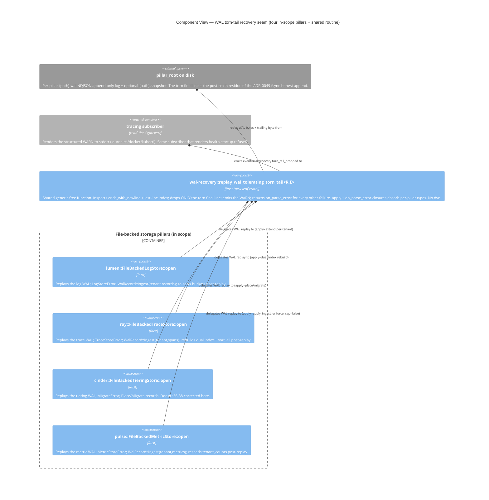
```mermaid
C4Component
  title Component View — WAL torn-tail recovery seam (four in-scope pillars + shared routine)

  System_Ext(disk, "pillar_root on disk", "Per-pillar {path}.wal NDJSON append-only log + optional {path}.snapshot. The torn final line is the post-crash residue of the ADR-0049 fsync-honest append.")
  Container_Ext(subscriber, "tracing subscriber", "read-tier / gateway", "Renders the structured WARN to stderr (journalctl/docker/kubectl). Same subscriber that renders health.startup.refused.")

  Container_Boundary(stores, "File-backed storage pillars (in scope)") {
    Component(lumen, "lumen::FileBackedLogStore::open", "Rust", "Replays the log WAL; LogStoreError; WalRecord::Ingest{tenant,records}; re-sorts buckets post-replay.")
    Component(ray, "ray::FileBackedTraceStore::open", "Rust", "Replays the trace WAL; TraceStoreError; WalRecord::Ingest{tenant,spans}; rebuilds dual index + sort_all post-replay.")
    Component(cinder, "cinder::FileBackedTieringStore::open", "Rust", "Replays the tiering WAL; MigrateError; Place/Migrate records. Doc at :36-38 corrected here.")
    Component(pulse, "pulse::FileBackedMetricStore::open", "Rust", "Replays the metric WAL; MetricStoreError; WalRecord::Ingest{tenant,metrics}; reseeds tenant_counts post-replay.")
  }

  Component(walrec, "wal-recovery::replay_wal_tolerating_torn_tail<R,E>", "Rust (new leaf crate)", "Shared generic free function. Inspects ends_with_newline + last-line index; drops ONLY the torn final line; emits the WARN; returns on_parse_error for every other failure. apply + on_parse_error closures absorb per-pillar types. No dyn.")

  Rel(lumen, walrec, "delegates WAL replay to (apply=extend per-tenant)")
  Rel(ray, walrec, "delegates WAL replay to (apply=dual-index rebuild)")
  Rel(cinder, walrec, "delegates WAL replay to (apply=place/migrate)")
  Rel(pulse, walrec, "delegates WAL replay to (apply=apply_ingest, enforce_cap=false)")
  Rel(walrec, disk, "reads WAL bytes + trailing byte from")
  Rel(walrec, subscriber, "emits event=wal.recovery.torn_tail_dropped to")

  UpdateRelStyle(walrec, disk, $offsetY="-10")
  UpdateRelStyle(walrec, subscriber, $offsetY="10")
```

### For Acceptance Designer — `wal-torn-tail-recovery-v0`

- **Driving port for AC-1 (the headline, verifier D04)**: the **store
  reopen path entered through lumen's `GET /api/v1/logs` read**. Concretely:
  the lumen-backed `log-query-api` binary opens
  `FileBackedLogStore::open(pillar_root, ..)` against a crashed
  `pillar_root` whose WAL holds N acked records followed by one torn final
  line with no trailing newline, binds its listener, and a query over the
  full time range returns exactly the N acked records (none partial, none
  corrupt, original order). This is a primary (driving) port: the operator
  restart + HTTP query is the black-box behaviour, not the internal replay
  loop. Exercise N >= 1.
- **Secondary driving port (AC-3, AC-5, AC-6, the warning + the negatives)**:
  process stderr structured `tracing` output. Assert exactly one
  `event="wal.recovery.torn_tail_dropped"` with `pillar`, `line`,
  `dropped_bytes` on a torn-tail recovery; assert NO such event and a
  `PersistenceFailed`/non-zero exit on mid-file corruption (AC-5) and on a
  newline-terminated malformed final line (AC-6). Same stderr-grep +
  subprocess shape the EDD verifier uses.
- **AC-4 (snapshot-plus-torn-tail)**: ray-backed store, snapshot present,
  WAL is a single torn line; opens successfully, recovers exactly the
  snapshot state, the never-acked torn span absent.
- **AC-7 (cinder doc)**: read the corrected `crates/cinder/src/file_backed.rs`
  module doc (`:36-38`) and `open` doc against AC-1..AC-6.
- **Do NOT enter through** the shared `wal-recovery` function directly as
  the headline acceptance: it is a driven implementation detail. The
  gold-test in `crates/wal-recovery` (the behavioural Earned-Trust layer)
  exercises the five substrate lies as a unit/integration probe, but the
  user-visible acceptance is the binary reopen + query/stderr path above.
- **No external integration; no contract-test recommendation** (the routine
  reads the in-process filesystem under `pillar_root`).

DESIGN artefacts:
`docs/feature/wal-torn-tail-recovery-v0/design/wave-decisions.md`,
`docs/product/architecture/adr-0059-earned-trust-wal-torn-tail-recovery.md`.

---

## Application Architecture — `store-fsync-durability-v0`

> **Author**: `nw-solution-architect` (Morgan), DESIGN wave, 2026-06-04,
> **propose mode**.
> **Feature**: `store-fsync-durability-v0` — make the "survives a restart"
> durability promise TRUE and DEMONSTRABLE across all seven file-backed
> stores (lumen, ray, strata, cinder, sluice, beacon state_store, pulse) by
> adding per-record `sync_all` on WAL append (six stores) and an atomic
> snapshot (all seven), each PROVEN by the mechanism that can actually
> falsify it. The ADR-0049 §8 successor work plus the snapshot-atomicity gap
> ADR-0049 left open even in pulse. New ADR-0060. No new crate (the existing
> `crates/wal-recovery` leaf crate is broadened to carry the durability
> seam). No trait change (C1), no WAL format change (C8).

**The Earned-Trust write-side completion.** ADR-0049 made pulse's WAL
crash-honest and built the `FsyncBackend` seam + the fsync-honesty probe.
ADR-0059 made the read-back recover the torn tail a crash-honest WAL leaves.
This feature extends the write-side fsync to the other six stores and makes
EVERY store's snapshot atomic, closing the two defects Luna verified in
DISCUSS: (1) six stores ack after only `BufWriter::flush()` (bytes in the
page cache, lost on power loss); (2) every store writes its snapshot with
`File::create` onto the canonical path (a mid-snapshot crash tears the live
file and bricks `open()` — total loss, present in pulse too).

**The load-bearing decision: two proving mechanisms, not one.** A
`SIGKILL` / process-kill on the same host CANNOT prove the WAL-fsync half:
`flush()` writes into the kernel page cache, which SURVIVES the process
dying, so a child killed mid-write and reopened by the parent STILL finds
the acked record — even on the buggy `flush()`-only code. The `flush` vs
`sync_all` distinction is observable ONLY when unsynced data is DISCARDED.
Therefore (ADR-0060 §1):

- **(a) Atomic-snapshot correctness** is proven by a **real out-of-process
  process-kill mid-snapshot** (a torn snapshot is a physical on-disk artefact
  the page cache cannot hide; the test ADR-0049 §3/alt-A RESERVED).
- **(b) WAL-fsync correctness** is proven by an **in-suite lying-substrate
  probe** (a `LyingFsyncBackend` `no_op`/`truncating` injected through
  `open_with_fsync_backend` discards exactly the unsynced bytes a power cut
  would; deterministic, in-process; the ADR-0049 mechanism reused).

A single SIGKILL test claiming both would pass on the bug and prove nothing;
DISTILL must not inherit it. `upstream-changes.md` asks the product owner to
split each conflated per-store crash AC into an `AC-snapshot-atomicity`
(process-kill) and an `AC-wal-fsync` (lying-substrate probe).

**The atomic-snapshot procedure (ADR-0060 §2).** Replace
`File::create(canonical)` with: write to `{canonical}.tmp` IN THE SAME
DIRECTORY → `fsync_file(tmp)` → `rename(tmp, canonical)` (atomic on POSIX,
intra-filesystem) → `fsync_dir(parent)` (rename durability). Whole-or-absent
at the canonical path across a crash at any point (C3). Then the existing
WAL truncate + second `fsync_dir` (ADR-0049 §5, carried). Lives ONCE as
`wal_recovery::atomic_write_snapshot`.

**The WAL-fsync procedure + seam (ADR-0060 §3).** Each store's `append_wal`
gains `fsync_backend.fsync_file(wal.get_ref())` after the buffered flush, as
pulse already does. Each store gains an `open_with_fsync_backend(base_path,
recorder, Arc<dyn FsyncBackend + Send + Sync>)` inherent constructor (NOT a
trait member — preserves C1); public `open` delegates with
`RealFsyncBackend`. The acceptance suite injects a `LyingFsyncBackend` to
make the wal-fsync AC falsifiable in-suite. Each composition root runs
`fsync_probe` against THAT store's pillar root, refusing on a lying
substrate with `event=health.startup.refused substrate=<descriptor>` (C4;
K4: 1/7 → 7/7).

**The Reuse decision: EXTRACT into `crates/wal-recovery`, not seven copies,
not consume-from-pulse (ADR-0060 §4).** The fsync + atomic-snapshot logic is
identical across seven stores. The `FsyncBackend` family currently lives in
`crates/pulse` (the METRICS pillar); routing six OTHER pillars at pulse would
be a sibling-pillar dependency / layering inversion. Decisive: **every pillar
already depends on `crates/wal-recovery` INWARD and NOT on pulse**
(`crates/lumen/Cargo.toml:25`; ADR-0059). So the `FsyncBackend` family moves
into `wal-recovery` (broadening its charter to "WAL + snapshot durability"),
pulse re-exports it so the gateway's `pulse::{fsync_probe, ...}` imports stay
byte-identical, and `atomic_write_snapshot` lands there too. Rule of three,
satisfied sevenfold — the ADR-0054 / ADR-0059 extraction precedent.

**Rollout (ADR-0060 §5).** lumen (walking skeleton — validates the
deterministic out-of-process crash on the most observable read path AND
extracts the shared helper) → ray → strata → cinder → sluice → beacon
state_store → pulse (snapshot-only; no wal-fsync AC). strata + sluice land
fsync + atomic snapshot now; their torn-tail-recovery migration (sluice's
fallible `apply_record` needs the ADR-0059 §5 fallible-`apply` seam) is the
tracked follow-up, not a blocker (C7).

**Earned-Trust enforcement (three orthogonal layers).** (a) subtype: each
store consumes the `FsyncBackend` port through `open_with_fsync_backend`;
`impl FsyncBackend for RealFsyncBackend`; removing it fails `cargo check`.
(b) structural: an AST pre-commit check that each store's `append_wal` calls
`fsync_file` after the flush, its `snapshot` calls `atomic_write_snapshot`
(and retains NO inline `File::create(canonical)` snapshot write), and its
composition root calls `fsync_probe` before the listener binds
(`import-linter` rejected — import-graph only). (c) behavioural: the
lying-substrate proving test per store asserts the acked write is absent on
`flush()`-only and present once `sync_all` is wired, plus the
`event=health.startup.refused` emission. Self-application: the lying-substrate
gold-test probes that each store actually fsyncs; the AST layer probes that
each store actually calls the shared helper and the probe.

### C4 — Component View (Level 3) — `store-fsync-durability-v0`

The seven storage pillars, the broadened shared durability seam, and the
two-mechanism proving boundary. Every arrow labelled with a verb. The shared
`wal-recovery` crate is the durability seam (recovery + fsync + atomic
snapshot); the seven pillars depend INWARD on it; nothing depends on a
pillar. The two proving mechanisms are shown as distinct test boundaries.

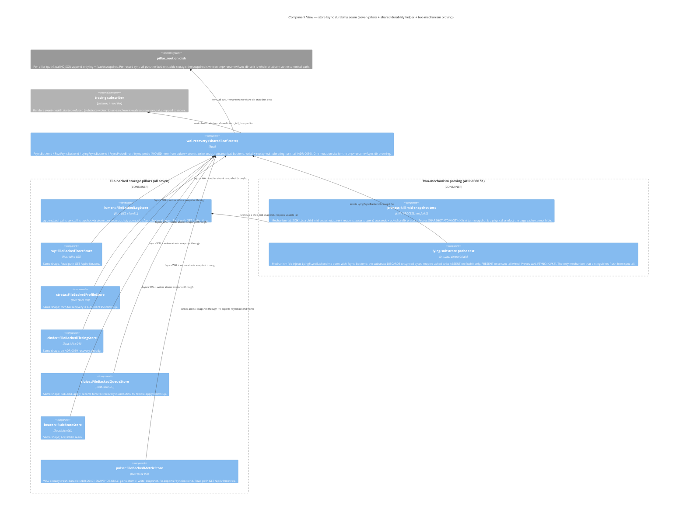
```mermaid
C4Component
  title Component View — store fsync durability seam (seven pillars + shared durability helper + two-mechanism proving)

  System_Ext(disk, "pillar_root on disk", "Per-pillar {path}.wal NDJSON append-only log + {path}.snapshot. Per-record sync_all puts the WAL on stable storage; the snapshot is written tmp+rename+fsync-dir so it is whole-or-absent at the canonical path.")
  Container_Ext(subscriber, "tracing subscriber", "gateway / read tier", "Renders event=health.startup.refused (substrate=<descriptor>) and event=wal.recovery.torn_tail_dropped to stderr.")

  Container_Boundary(stores, "File-backed storage pillars (all seven)") {
    Component(lumen, "lumen::FileBackedLogStore", "Rust (WS, slice 01)", "append_wal gains sync_all; snapshot via atomic_write_snapshot; open_with_fsync_backend seam. Read path GET /api/v1/logs.")
    Component(ray, "ray::FileBackedTraceStore", "Rust (slice 02)", "Same shape. Read path GET /api/v1/traces.")
    Component(strata, "strata::FileBackedProfileStore", "Rust (slice 03)", "Same shape; torn-tail recovery is ADR-0059 §5 follow-up.")
    Component(cinder, "cinder::FileBackedTieringStore", "Rust (slice 04)", "Same shape; on ADR-0059 recovery already.")
    Component(sluice, "sluice::FileBackedQueueStore", "Rust (slice 05)", "Same shape; FALLIBLE apply_record; torn-tail recovery is ADR-0059 §5 fallible-apply follow-up.")
    Component(beacon, "beacon::RuleStateStore", "Rust (slice 06)", "Same shape; ADR-0040 seam.")
    Component(pulse, "pulse::FileBackedMetricStore", "Rust (slice 07)", "WAL already crash-durable (ADR-0049); SNAPSHOT-ONLY: gains atomic_write_snapshot. Re-exports FsyncBackend. Read path GET /api/v1/metrics.")
  }

  Component(walrec, "wal-recovery (shared leaf crate)", "Rust", "FsyncBackend / RealFsyncBackend / LyingFsyncBackend / FsyncProbeError / fsync_probe (MOVED here from pulse) + atomic_write_snapshot(canonical, backend, write) + replay_wal_tolerating_torn_tail (ADR-0059). One mutation site for the tmp+rename+fsync-dir ordering.")

  Container_Boundary(proving, "Two-mechanism proving (ADR-0060 §1)") {
    Component(killtest, "process-kill mid-snapshot test", "child PROCESS, not fork()", "Mechanism (a): SIGKILLs a child mid-snapshot; parent reopens; asserts open() succeeds + acked-prefix present. Proves SNAPSHOT ATOMICITY (K3). A torn snapshot is a physical artefact the page cache cannot hide.")
    Component(lyingtest, "lying-substrate probe test", "in-suite, deterministic", "Mechanism (b): injects LyingFsyncBackend via open_with_fsync_backend; the substrate DISCARDS unsynced bytes; reopen; acked write ABSENT on flush()-only, PRESENT once sync_all wired. Proves WAL FSYNC (K2/K4). The only mechanism that distinguishes flush from sync_all.")
  }

  Rel(lumen, walrec, "fsyncs WAL + writes atomic snapshot through")
  Rel(ray, walrec, "fsyncs WAL + writes atomic snapshot through")
  Rel(strata, walrec, "fsyncs WAL + writes atomic snapshot through")
  Rel(cinder, walrec, "fsyncs WAL + writes atomic snapshot through")
  Rel(sluice, walrec, "fsyncs WAL + writes atomic snapshot through")
  Rel(beacon, walrec, "fsyncs WAL + writes atomic snapshot through")
  Rel(pulse, walrec, "writes atomic snapshot through (re-exports FsyncBackend from)")
  Rel(walrec, disk, "sync_all WAL + tmp+rename+fsync-dir snapshot onto")
  Rel(walrec, subscriber, "emits health.startup.refused + torn_tail_dropped to")
  Rel(killtest, lumen, "SIGKILLs a child mid-snapshot, reopens, asserts (a)")
  Rel(lyingtest, walrec, "injects LyingFsyncBackend to assert (b)")

  UpdateRelStyle(walrec, disk, $offsetY="-10")
  UpdateRelStyle(killtest, lumen, $offsetY="-20")
  UpdateRelStyle(lyingtest, walrec, $offsetY="20")
```

### For Acceptance Designer — `store-fsync-durability-v0`

**This is the critical handoff: each AC names WHICH of the two proving
mechanisms DISTILL must use. Do NOT prove a wal-fsync AC with a process
kill.**

- **AC-snapshot-atomicity (per store; mechanism (a) — process-kill)**: the
  driving port is the **store reopen path**. Concretely: a child PROCESS
  opens the store, is `SIGKILL`ed WHILE writing a snapshot (mid-snapshot),
  the parent reopens; assert `open()` succeeds (no parse error, no torn file
  at the canonical path) AND the last consistent state is served. The crash
  is a SEPARATE child process (`std::process::Command` or a test-only
  binary), NOT a `fork()` inside a tokio runtime (C5). Assert a deterministic
  invariant (open-succeeds + state-present), never a wall-clock p95 (C6).
  KPI K3. Driving read port for the observable outcome:
  - lumen → reopen + `GET /api/v1/logs?tenant=acme&from=..&to=..`
  - ray → reopen + `GET /api/v1/traces?trace_id=..`
  - pulse → reopen + `GET /api/v1/metrics?tenant=acme&metric=..`
  - strata, cinder, sluice, beacon → reopen + the store's in-process query
    API after the child is killed (no HTTP read path; the outcome is
    "`open()` succeeds and the acked prefix is present").
- **AC-wal-fsync (per store EXCEPT pulse; mechanism (b) — lying substrate)**:
  the driving seam is `open_with_fsync_backend(base_path, recorder,
  Arc::new(LyingFsyncBackend::no_op()))` (or `truncating`). Ack a write; the
  lying substrate DISCARDS the unsynced bytes (simulating the page-cache loss
  a power cut causes); reopen with a `RealFsyncBackend`; assert the acked
  write is ABSENT on the un-fixed `flush()`-only code and PRESENT once
  `sync_all` is wired. This is deterministic and in-process. **This is the
  ONLY mechanism that distinguishes `flush` from `sync_all`** — a process
  kill cannot, because the page cache survives the kill. KPI K2.
- **AC-substrate-refusal (per store; mechanism (b) variant)**: drive the
  store's composition root with a `LyingFsyncBackend`; assert it emits
  `event=health.startup.refused` with a `substrate=<descriptor>` field and
  exits non-zero WITHOUT binding the listener. Assert on the process stderr
  structured `tracing` output (the same stderr-grep + subprocess shape the
  EDD verifier uses). KPI K4 (1/7 → 7/7).
- **AC-recovery-regression (per store; the kept SIGKILL+read assertion,
  RE-LABELLED)**: the `SIGKILL`-then-reopen + read-API assertion is KEPT as a
  recovery/read-back regression guard (it pairs with ADR-0059 torn-tail
  recovery — the per-record fsync produces the genuine torn tail recovery
  reads back). It is NOT the wal-fsync proof. Assert the acked prefix is
  present and the torn never-acked tail is absent, with
  `event=wal.recovery.torn_tail_dropped pillar=<store>` where the store is on
  the shared recovery routine (lumen, ray, cinder, pulse; strata/sluice
  assert the acked-prefix outcome without the event until the ADR-0059 §5
  follow-up).
- **pulse (US-07) carries ONLY AC-snapshot-atomicity** (its WAL is already
  crash-durable under ADR-0049; no wal-fsync AC) plus the
  AC-recovery-regression guard.
- **Do NOT enter through** `wal_recovery::atomic_write_snapshot` or
  `fsync_probe` directly as the headline acceptance — they are driven
  implementation details. The shared crate's gold-test (the behavioural
  Earned-Trust layer) exercises them as a unit/integration probe; the
  user-visible acceptance is the per-store reopen + query / stderr / lying-
  substrate path above.
- **No external integration; no contract-test recommendation** (every store
  reads/writes the in-process filesystem under `pillar_root`).

DESIGN artefacts:
`docs/feature/store-fsync-durability-v0/design/wave-decisions.md`,
`docs/feature/store-fsync-durability-v0/design/upstream-changes.md`,
`docs/feature/store-fsync-durability-v0/design/self-review.md`,
`docs/product/architecture/adr-0060-earned-trust-store-fsync-durability.md`.

---

## Application Architecture — `tls-config-reject-v0`

> **Author**: `nw-solution-architect` (Morgan), DESIGN wave, 2026-06-04.
> **Feature**: `tls-config-reject-v0` — a config-validation / startup-behaviour change in `aperture`. When an operator requests a security knob v0 does not implement (`tls.enabled = true` or `auth.spiffe.enabled = true`), aperture **refuses to start** — exit code 2, structured `event=config_validation_failed` naming the knob, no listener bound — instead of warning once and continuing plaintext. Closes verifier issue 008 (HIGH, security). AGPL-3.0-or-later, matching the rest of the workspace.
> **Mode of operation**: PROPOSE — options enumerated for the load-bearing decisions (refusal seam, event choice, supersession scope) with one recommended per decision; see ADR-0061 and the feature-side `design/wave-decisions.md`.

### The decision in one paragraph

The refusal is enforced as a **post-deserialise config-validation invariant** in `RawConfig::into_config` (`crates/aperture/src/config/mod.rs`), co-located with the existing identical-bind-address check. It returns `Err(ConfigError(...))`, which hits the existing exit-2 arm in `main.rs:32-40` **before** `aperture::run` is ever called. Because the bind path (`run` → `wire_sink` → `spawn` → `spawn_grpc/http`) is only entered after a `Config` is successfully constructed, a refusal **structurally guarantees no listener binds** (US-TLS-01 AC-4) — the guarantee does not depend on ordering discipline inside `spawn`. The refusal event is **`config_validation_failed`** (level error), the established event for "config is invalid for this binary", reusing the `ConfigError` → exit-2 channel the identical-bind-address check already uses. `health.startup.refused` is deliberately NOT used — it is the runtime substrate-probe refusal (a probed dependency lied), a different fail-closed axis the codebase keeps separate from config-is-wrong. The exit code is **2** (the established config-error code, `main.rs:19-21`). See ADR-0061 for the full rationale, alternatives, and the precise scope of the ADR-0008 supersession.

### Behaviour matrix (the contract)

| `tls.enabled` | `auth.spiffe.enabled` | Result | Event | Exit | Listener bound? |
|---|---|---|---|---|---|
| true | false | **Refuse** | `config_validation_failed`, reason names `tls.enabled` | 2 | No |
| false | true | **Refuse** | `config_validation_failed`, reason names `auth.spiffe.enabled` | 2 | No |
| true | true | **Refuse** | `config_validation_failed`, reason names **both** requested knobs | 2 | No |
| false | false | **Start** (unchanged) | `startup` then `ready`; no refusal event | binds then runs | Yes (4317 + 4318) |
| `[security]` absent | absent | **Start** (unchanged) | identical to both-false (serde `#[serde(default)]` → false) | binds then runs | Yes |

### ADR-0008 supersession (scope)

ADR-0061 supersedes **only the runtime reaction** to `tls.enabled`/`auth.spiffe.enabled = true` (ADR-0008 lines 19, 36, 164, 166): warn-and-continue → refuse-to-start. **ADR-0008's forward-compat SCHEMA decision is explicitly PRESERVED** — the TLS/SPIFFE keys stay in the v0 schema, default off, with **no Phase-2 (Aegis) schema break**. A config with the knobs off rolls forward exactly as ADR-0008 designed. Only the `= true` reaction changed. ADR-0008's `Superseded by` header was updated with this scope note.

### Comment correction

The false comment at `crates/aperture/src/sinks.rs:94-95` ("the config validator rejects it ahead of this sink") becomes **true** under this ADR and is updated in DELIVER to describe the now-real refusal. No comment may claim a rejection the code does not perform.

### Reuse Analysis (RCA hard gate — extend, do not reinvent)

| Existing machinery | Path | Decision |
|---|---|---|
| `ConfigError` type + `RawConfig::into_config` validator | `crates/aperture/src/config/mod.rs:178-188, 481-530` | **EXTEND.** Add the security-knob refusal as one more invariant beside the identical-bind-address check. Same `ConfigError` return, same validator function. |
| `main.rs` exit-2 config-error arm | `crates/aperture/src/main.rs:32-40` | **REUSE verbatim.** A `ConfigError` from the loader already maps to `eprintln!` + `ExitCode::from(2)`. No new exit path. |
| `event::CONFIG_VALIDATION_FAILED` constant | `crates/aperture/src/observability.rs:49` | **REUSE.** Already the designated event for config-invalid-for-this-binary (`component-design.md:1066`). No new vocabulary. |
| `event::HEALTH_STARTUP_REFUSED` | `crates/aperture/src/observability.rs:48` | **REJECTED for this use.** It is the runtime substrate-probe refusal axis (`compose.rs:78-96`, cinder/pulse fsync). A static config knob is not a probed substrate. Using it would blur two distinct fail-closed axes. |
| `warn_if_v0_security_knob_set` + its call site | `crates/aperture/src/compose.rs:56-76, 127` | **REMOVE.** The reaction moves one layer earlier (config validation); warn-and-continue no longer exists. |
| `event::TLS_NOT_SUPPORTED_IN_V0` | `crates/aperture/src/observability.rs:47` | **RETIRE from call sites.** Semantically "ignored / continuing"; the very contract being superseded. Constant may remain under `#[allow(dead_code)]` (DELIVER cleanup detail). |

**Net new code: one validation branch.** No new error variant, no new exit code, no new event name, no new file. The feature is an extension of the existing fail-closed config-validation seam.

### For Acceptance Designer — `tls-config-reject-v0`

**Driving port**: the aperture binary's startup path with a config file — `aperture --config <path>` (`crates/aperture/src/main.rs`). The acceptance suite writes an `aperture.toml`, runs the binary (or drives `Config::from_toml_str` / `Config::from_toml_path` for the deterministic in-process variant the existing slice tests use), and observes the outcome. The observable surface is **process exit code + structured stderr events + presence/absence of a bound listener** — there is no JSON-on-stdout API for this path.

Per-AC observables (every assertion is black-box; never reach into private functions):

- **AC-1 (tls only refuses)** — config `tls.enabled = true`: exit code **2**; a stderr line with `event=config_validation_failed` whose reason **names `tls.enabled`**; **no** listener bound on `0.0.0.0:4317` or `:4318`; no telemetry accepted. (Scenario 1)
- **AC-2 (spiffe only refuses)** — config `auth.spiffe.enabled = true`, `tls.enabled = false`: exit **2**; `event=config_validation_failed` reason **names `auth.spiffe.enabled`**; no listener bound. (Scenario 2)
- **AC-3 (both refuse, names the knob(s))** — both `true`: exit **2**; `event=config_validation_failed` reason **names both** requested-but-unimplemented knobs; aperture does **not** silently pick one and proceed; no listener bound. (Scenario 3)
- **AC-4 (no plaintext bind on any refusal)** — across AC-1..3: assert **no** listener is bound on `:4317` or `:4318` and no telemetry is accepted. The strongest observable: a connection attempt to the port fails / the process exited before binding. (Scenarios 1-3)
- **AC-5 (negative control — both off starts, unchanged)** — `tls.enabled = false` and `auth.spiffe.enabled = false`: aperture **starts**, emits `event=startup` (then `event=ready`), binds **both** listeners on `0.0.0.0:4317` and `0.0.0.0:4318`, accepts telemetry exactly as today; **no** refusal event emitted. (Scenario 4)
- **AC-6 (negative control — `[security]` absent ≡ both off)** — config omits the `[security]` tables: behaviour **identical** to AC-5 (serde defaults the knobs to false); no refusal event. (Scenario 5)
- **AC-7 (comment correction)** — a source-inspection assertion: the comment at `sinks.rs:94-95` describes the real refusal; no comment claims a non-existent rejection. (Scenario 6) — *this is a code-review/lint observable, not a runtime one.*

**Negative-control observable (the non-regression guard, AC-5 + AC-6)**: with the knobs off or absent, the today-behaviour is preserved byte-for-byte — same `startup`/`ready` events, same two bound ports, telemetry accepted. This guards against the refusal branch leaking into the common case and against any embedder (e.g. `gateway`) regressing. The two-knob truth table (3 refusal rows) plus these 2 negative-control rows supply the per-feature 100% mutation kill coverage (CLAUDE.md / ADR-0005 Gate 5) for the new reject branch.

**No external integration; no contract-test recommendation** — the change is entirely within aperture's in-process config-validation and startup path. No third-party API, webhook, or OAuth provider is involved.

DESIGN artefacts:
`docs/feature/tls-config-reject-v0/design/wave-decisions.md`,
`docs/product/architecture/adr-0061-aperture-refuse-unimplemented-security-knob.md`,
and the ADR-0008 `Superseded by` header update.

---

## Application Architecture — `claims-honesty-pass-v0`

> **Author**: `nw-solution-architect` (Morgan), DESIGN wave (LIGHT), 2026-06-05.
> **Feature**: `claims-honesty-pass-v0` — a prose-honesty sweep. The project's thesis is structural honesty against vendor overstatement; this feature applies that thesis to the project's OWN prose. Across the README, several crate `lib.rs`/`Cargo.toml` headers, and stale-over-green test headers, claims overstate what the code does. The per-crate `lib.rs` already-honest wording is the canonical truth; every correction aligns the louder surface TO the quiet honest `lib.rs`. Seven slices are pure prose (US-01..US-04); two were flagged by DISCUSS as genuine document-vs-implement decisions (US-05 query-api `step`, US-06 harness `GrpcProtobuf` framing). AGPL-3.0-or-later.
> **Mode of operation**: PROPOSE. DESIGN owns ONLY the two flag resolutions; the pure-prose slices need no architecture. **Do not over-build** — this is a LIGHT wave.

### There is no new architecture here

This feature adds no component, no port, no adapter, no integration, no quality-attribute strategy. It changes documentation strings (and, for the two flags, decides NOT to change behaviour). No C4 update — the container/component topology is identical before and after. No external integration; no contract-test recommendation. The only DESIGN content is the two scope decisions below.

### The two document-vs-implement resolutions

**FLAG #1 — query-api `step` (US-05) → DOCUMENT (with ADR-0062).**
`GET /api/v1/query_range` accepts `step`, deserialises it, ignores it (`crates/query-api/src/lib.rs:143-146`), returning raw native-timestamp points, not a Prometheus stepped grid. The in-code field doc (`lib.rs:136-137`, "`step` is accepted and ignored at v0 … raw points, no re-stepping") is **already honest**; the residual overstatement is one word in `README.md:106` ("a Prometheus-compatible `/api/v1/query_range` HTTP endpoint"), which implies the full Prometheus contract incl. `step`-driven re-sampling. **Resolved: DOCUMENT.** Implementing the stepped grid is a genuine feature (re-sampling + last-value/staleness + grid alignment), not low-risk, and carries the per-feature 100% mutation obligation — disproportionate to a prose-honesty pass and a worse honesty outcome if done half-right. This is recorded in **ADR-0062** because it is an architectural SCOPE statement worth an immutable record: *v0 query_range returns raw in-window points; `step` is reserved, not a Prometheus stepped grid.* A future stepped-grid implementation gets its own feature.

**FLAG #2 — harness `Framing::GrpcProtobuf` (US-06) → DOCUMENT (no ADR).**
Every `validate_*` entry point accepts a `Framing` argument that is never branched on in `validate.rs`/`decode.rs` — it is only echoed into `OtlpViolation`. The enum doc (`crates/otlp-conformance-harness/src/framing.rs:14-18`) is **already honest**: "the gRPC length prefix is the caller's responsibility to strip before invoking the harness". The residual is that `lib.rs`/`README` present `GrpcProtobuf` as a first-class framing without flagging that it is an inert label. **Resolved: DOCUMENT.** Honouring it means stripping and validating the 5-byte gRPC length prefix (1 compression flag + 4-byte big-endian length), deciding error semantics on malformed prefixes — new behaviour with its own AC and mutation obligation, changing the harness contract. DOCUMENT just propagates the already-honest enum-doc note up to `lib.rs`/README. **No ADR** — this is local doc-honesty propagation, not a cross-cutting scope decision; it is captured fully in the feature-side `wave-decisions.md`.

Both resolutions follow DISCUSS's non-binding recommendation and the feature's own thesis: "honour the framing" / "implement the grid" are real capabilities that each deserve their own feature, not smuggling into a documentation sweep.

### For Acceptance Designer — `claims-honesty-pass-v0`

Two observable shapes. **Pure-prose slices** (US-01..US-04): a grep/doc-lint guard asserting the false string is **ABSENT** and the corrected string is **PRESENT** — and, for US-03, that the genuinely-RED in-flight markers are still **PRESENT** (proving the correction did not over-reach). The corrected wording must be grounded in the cited already-honest `lib.rs` (never invented fresh). **The two flag slices** (US-05, US-06): the doc-guard above PLUS a black-box behaviour assertion pinning the documented boundary — both DOCUMENT, so both assert INVARIANCE, not difference.

Per-slice observables:

- **US-01 (README codenames)** — in rendered `README.md`: ABSENT as present-tense claims — "Auto-instrumentation SDKs" (Spark row), "Continuous profiling" (Strata row + cost line), "cold-tier coordinator" (Cinder row), "Dashboards-as-code" (Loom row). PRESENT, future-tensed — Spark "manual-init OTel SDK wrapper (auto-instrumentation: v0.2/v1)", Strata "profile storage / passive sink (continuous: roadmap)", Cinder "local tier-metadata coordinator (object-storage cold tier: v2)", Loom "rule-catalogue change control / TOML (dashboards-as-code: v1+)". Each present-tense claim consistent with the crate's `lib.rs` (loom/spark/strata/cinder).
- **US-02 (codex stub headers)** — in `codex/Cargo.toml` + 5 `tests/slice_0*.rs` headers + `tests/common/mod.rs`: ABSENT — "DISTILL-state stub", "panics with `unimplemented!()`", "Tests panic on `unimplemented!()` until DELIVER". PRESENT — delivered/green wording matching `lib.rs:43-48` ("Fully implemented and green"). Guard: codex suite stays green; no `#[ignore]`/active `unimplemented!` in codex tests.
- **US-03 (stale `__SCAFFOLD__`-over-green doc comments)** — ABSENT in `query-http-common/src/lib.rs:30-42` (module doc) the "DISTILL scaffold / all free functions are `unimplemented!` `__SCAFFOLD__` RED" claim, and in `trace-query-api/src/lib.rs:207-209,228-232` the "`unimplemented!` scaffold" claim for `handle_traces_by_id`. PRESENT — implemented-helper / live-handler wording matching the bodies. **Both-directions guard**: the still-legitimate `__SCAFFOLD__` markers in the in-flight tests named in the feature `wave-decisions.md` (crash-durability, log-query body-regex/pagination, tls-config-reject, tracing-subscriber) remain intact.
- **US-04 (harness validation depth + status)** — ABSENT in harness `lib.rs:1-7` / `README.md:3-4` / `Cargo.toml:11` the "validates against the OTLP **wire specification**" overclaim, and in `README.md:8-16` the "implementation intentionally absent / every `validate_*` returns `unimplemented!()`" status. PRESENT — "structural decode-level validation" naming the absent semantic checks (no trace_id/span_id length, no timestamp, no attribute, no semantic-convention) + green-status wording matching `lib.rs:17-22`. Plus one behaviour assertion: a structurally-valid but semantically-bogus body (e.g. 4-byte `trace_id`) is **accepted** by `validate_traces`, pinning the now-documented boundary; cross-read that every step the doc names is present in `decode.rs`.
- **US-05 (query-api `step`, DOCUMENT)** — doc-guard: `README.md` no longer implies a Prometheus stepped grid and states `step` is accepted-but-not-honoured at v0 (raw points). Behaviour: for fixed `query`/`start`/`end`, **two distinct `step` values (e.g. `15s`, `60s`) AND the omitted-`step` case all return byte-identical output** (INVARIANCE under `step`). This is the verifier's black-box; under DOCUMENT it passes and pins the documented boundary. (ADR-0062 flags that a FUTURE stepped-grid feature will intentionally retire this assertion.)
- **US-06 (harness `GrpcProtobuf`, DOCUMENT)** — doc-guard: harness `lib.rs`/README state `GrpcProtobuf` is a non-behavioural label echoed into violations; the caller strips the gRPC length prefix. Behaviour: prefix-stripped bytes **validate identically under `HttpProtobuf` and `GrpcProtobuf`** (framing is inert); a still-length-prefixed body under `GrpcProtobuf` **fails to decode** (matching the "strip first" doc).

**Mutation note**: pure-prose slices have nothing to mutate. Both flags resolved DOCUMENT, so neither carries a production-behaviour change and there is no new mutation target this feature (CLAUDE.md per-feature mutation is on modified production files; doc-only). Recorded as a guardrail, not a gap.

DESIGN artefacts:
`docs/feature/claims-honesty-pass-v0/design/wave-decisions.md`,
`docs/product/architecture/adr-0062-query-range-v0-raw-points-step-reserved.md`.

---

## Application Architecture — `beacon-sighup-reload-v0`

> **Author**: `nw-solution-architect` (Morgan), DESIGN wave, 2026-06-05.
> **Feature**: `beacon-sighup-reload-v0` — a `beacon-server` binary capability. `beacon-server` documents SIGHUP hot-reload of its rule catalogue (ADR-0034, ADR-0033, ADR-0037) but installs only SIGINT/SIGTERM handlers and loads the catalogue once at startup (`crates/beacon-server/src/main.rs:65,177-187`); SIGHUP is unhandled. This feature makes the binary keep the documented promise: on `kill -HUP <pid>` it re-reads `--rules`, validates, and atomically swaps the live catalogue without a restart and without re-paging on-call. Closes verifier issue 010 (B03). AGPL-3.0-or-later.
> **Mode of operation**: PROPOSE — the four flagged mechanism sub-decisions resolved with alternatives in ADR-0063; the reload *contract* is governed by ADR-0034 (unchanged).
> **No new architecture style.** The container/component topology is unchanged: `beacon-server` is the same orchestrator binary over the same `beacon` library. The change is a third signal arm plus a reload sequence in the orchestrator, and one small additive `InhibitionResolver` constructor. No C4 update — no new container, port, or external system; the existing beacon C4 (introduced with ADR-0033/0037) stands.

### The decision in one paragraph

`beacon-server` adopts a **single-orchestrator, build-new-then-swap-then-abort-old** reload model. A `SignalKind::hangup()` arm is added to the main `tokio::select!` (turned into a loop); the orchestrator becomes the sole writer of the catalogue, the shared `InhibitionResolver`, and the set of per-rule `JoinHandle`s, so the SIGHUP handler never races the per-rule evaluation loops or the resolver mutex. On SIGHUP it re-runs `load_rules` (reused verbatim); if the result is invalid (directory unreadable, or zero rules — the same `has_any_rules()` bar startup uses) it **refuses**, keeps the previous catalogue fully active, does not crash, does not partially apply, and emits `beacon.reload.refused`. If valid, it builds the NEW per-rule task set (each seeded with its rule's carried-over `RuleState` from the durable `RuleStateStore`, keyed by name) and a NEW resolver (rebuilt from the new rules, carrying over still-relevant `firing`/`pending` live state), atomically replaces the live generation, aborts the old tasks, and emits `beacon.reload.succeeded`. The full rationale, alternatives, and the four sub-decisions are in **ADR-0063**; the governing reload contract is **ADR-0034** (unmodified).

### The four flagged sub-decisions (resolved)

| # | Sub-decision | Resolution |
|---|---|---|
| 1 | SIGHUP handler concurrency | Single-orchestrator: SIGHUP arm in the main `select!` loop; orchestrator is sole writer of catalogue/resolver/handles; no race with per-rule loops or the resolver mutex; SIGINT/SIGTERM shutdown unchanged. Handler installed before tasks are spawned. |
| 2 | Matching key for kept in-flight state | NAME only. A renamed-unchanged rule keeps its `Pending`/`Firing` `since`. A changed query/for_duration/severity does **not** reset (no re-page on a live edit); the next tick re-evaluates the new definition against the carried clock anchor. Removed → stops + state dropped-and-logged. Added → starts `Inactive`. |
| 3 | Atomic swap of the shared `InhibitionResolver` | Rebuild from new rules, then carry over live `firing` flags and `pending` suppressed-incident entries whose inhibited rule still exists; wholesale `Arc<Mutex<>>` replacement (not in-place mutation), so old tasks never see a torn relation graph. A naive `new()` would silently drop suppressed-pending alerts. |
| 4 | Task lifecycle | Build new task set + new resolver FIRST, replace the live generation, THEN `abort()` old handles. New-live-before-old-aborted: no missed-evaluation window for a surviving rule, no double-fire (overlapping ticks idempotent under ADR-0040 latest-wins). |

### The safety contract (all-or-nothing)

Validity bar = "at least one rule loaded", identical to the startup `has_any_rules()` refusal (`main.rs:77-84`); SIGHUP and startup share one contract. Directory-unreadable or zero-rules → refuse, retain the previous catalogue fully, no crash, no partial apply, `beacon.reload.refused`. A partly-broken catalogue (>=1 valid rule + one malformed file) → apply the valid rules AND surface each `LoaderDiagnostic` via the existing `warn!` (`main.rs:74`), exactly as startup's report-and-skip (B01). A refusal touches neither `handles` nor `resolver`. The new generation is built completely before the live generation is replaced, so there is no partial-apply path.

### Observables (the contract DISTILL reads)

| Event (`tracing` message) | Level | Fields | Read by |
|---|---|---|---|
| `beacon.reload.succeeded` | INFO | `rules_loaded`, `added`, `removed`, `diagnostics` | US-01 AC-5; verifier B03 black-box |
| `beacon.reload.refused` | WARN | `file` (or no-rules reason), `error` (`LoaderDiagnostic::display` incl. "did you mean", or `LoaderError` text), `previous_catalogue_retained = true` | US-02 negative AC |

Per-file report-and-skip diagnostics keep the existing `"rule load diagnostic"` `warn!` unchanged.

### Reuse Analysis (RCA hard gate — extend, do not reinvent)

| Existing machinery | Path | Decision |
|---|---|---|
| `load_rules` + `LoadOutcome` report-and-skip | `crates/beacon/src/loader.rs:111` | **REUSE verbatim** for the re-read. |
| `LoadOutcome::has_any_rules()` validity bar | `loader.rs:53` | **REUSE** — same predicate as the startup refusal. |
| `LoaderDiagnostic::display()` | `loader.rs:75-84` | **REUSE** for the refusal event + per-file `warn!`. |
| Durable `RuleStateStore` (name-keyed, drops absent) | `crates/beacon/src/state_store.rs`; `main.rs:130-144` | **REUSE** as the in-flight-state carry-over seam (already delivered, beacon-durable-alert-state-v0). |
| SIGTERM install + `tokio::select!` shutdown | `main.rs:179-199` | **EXTEND** — add a `hangup()` arm, loop the select. |
| `JoinHandle::abort()` teardown | `main.rs:197-199` | **REUSE** as the reload's old-task teardown, sequenced after the new set is live. |
| `InhibitionResolver` | `crates/beacon/src/inhibition.rs:48-161` | **EXTEND** — add a `rebuild_from(&new_rules, carried_firing, carried_pending)`-style inherent constructor beside `new` (mirrors `FileBackedRuleStateStore::open_with_fsync_backend` beside `open`). `observe` unchanged. **The only new library surface.** |
| Pure `transition` / `evaluate_once` | `state_machine.rs`; `beacon_server::evaluate_once` | **UNTOUCHED** — no I/O or signal logic in the pure evaluator (ADR-0037 inviolable). |

**Net new surface:** one `InhibitionResolver` constructor; one `select!` arm; one reload function in `main.rs`; two event names. The two hard parts (re-read + report-and-skip, and preserving `since` across a respawn) are already solved by the loader and durable store; this feature wires them into a SIGHUP-driven orchestrator loop.

### For Acceptance Designer — `beacon-sighup-reload-v0`

**Driving port**: the POSIX signal `kill -HUP <beacon-server pid>` after editing the `--rules DIR` on disk. No new CLI surface, no new HTTP surface. The acceptance suite starts `beacon-server` with a `--rules` dir and a backend (real or a stub PromQL backend), edits the dir, sends SIGHUP, and observes the structured `tracing` events plus the rules' firing behaviour. Every assertion is black-box; never reach into private functions or the pure `transition`.

Per-AC observables:

- **AC (US-01, added rule fires)** — add `checkout-error-rate.toml` whose query is currently active, `kill -HUP <pid>`: within one evaluation interval the new rule transitions to `Firing` and emits an incident to its sink; the process is the same process (no restart); a `beacon.reload.succeeded` event carries `rules_loaded`, `added=1`, `removed=0`. (B03.)
- **AC (US-01, removed rule stops)** — delete `disk-pressure.toml`, SIGHUP: `disk-pressure` issues no further backend queries and emits no further incidents; its durable state is dropped-and-logged; `beacon.reload.succeeded` carries `removed=1`.
- **AC (US-01, no-op SIGHUP)** — SIGHUP with no on-disk change: the catalogue reloads to the identical set; no spurious `Firing`, no spurious `Resolved`; `beacon.reload.succeeded` carries `added=0, removed=0`.
- **AC (US-02, malformed reload keeps previous)** — introduce a parse error into `payments.toml`, SIGHUP: the previous catalogue stays active, a rule that was `Firing` stays `Firing` with its **original `since`**, no second `Firing` incident, no `Resolved`, on-call not re-paged, the process has not exited; a `beacon.reload.refused` event names `payments.toml`, carries the parse error + the "did you mean for_duration" suggestion, and states `previous_catalogue_retained`.
- **AC (US-02, zero-rules reload refused)** — empty the rules dir, SIGHUP: the reload is refused (no rules loaded), `service-down` keeps being evaluated and stays `Firing`, a `beacon.reload.refused` event states no rules were found and the previous catalogue was retained. The daemon does not go dark.
- **AC (US-02, surviving rule keeps `since` across a valid swap)** — add an unrelated new rule leaving `service-down` unchanged, SIGHUP, new catalogue validates and swaps: `service-down` is still `Firing` with its original `since`, no second `Firing` incident, on-call not re-paged.
- **AC (US-02, partly-broken catalogue)** — add `checkout-error-rate.toml` (valid) and `inventory.toml` (parse error), SIGHUP: the swap proceeds (>=1 valid rule), `checkout-error-rate` begins evaluating, AND a `rule load diagnostic` `warn!` surfaces `inventory.toml`; the catalogue as a whole validated, so the swap is NOT refused (report-and-skip, B01, consistent with startup).

**The two co-equal observables** are the success event (B03 positive) and the malformed-reload-keeps-previous negative (the surviving-`since` + refusal event). Together with the seven AC above, they supply the per-feature 100% mutation kill coverage (CLAUDE.md / ADR-0005 Gate 5) for the new reload branch in `main.rs` and the new `InhibitionResolver` constructor in `inhibition.rs`.

**No external integration; no contract-test recommendation** — the operator entry point is a POSIX signal and the only dependency the reload reaches is the local rules directory (via the already-tested loader) and the local durable store. No third-party API, webhook, or OAuth provider.

DESIGN artefacts:
`docs/feature/beacon-sighup-reload-v0/design/wave-decisions.md`,
`docs/product/architecture/adr-0063-beacon-sighup-reload-atomic-swap-and-state-carryover.md`.
ADR-0034 "Reload semantics" is the governing contract and is unmodified.

---

## Application Architecture — `beacon-slo-operator-path-v0`

> **Author**: `nw-solution-architect` (Morgan), DESIGN wave, 2026-06-06.
> **Feature**: a `beacon` loader + `beacon-server` capability. The SLO multi-window multi-burn-rate (MWMBR) engine (`synthesise_slo`, `crates/beacon/src/slo.rs:106-156`) is correct and 20/20-tested but **library-only**: its only callers are in `crates/beacon/tests/`. An operator cannot declare an SLO in a rule file — `FileShape` (`loader.rs:260-265`) is `deny_unknown_fields` with only `rules`, so an `[[slo]]` block **poisons its whole file** ("unknown field `slo`"). This feature wires the correct-but-dead engine to the existing operator surface (the `--rules` TOML tree + the running `beacon-server` reloaded via `kill -HUP`, ADR-0063): declare an `[[slo]]`, get its four synthesised burn-rate rules merged into the live catalogue. Closes the four-quadrants Q3 gap (Tested But Unwired); makes two false doc claims true / corrected. AGPL-3.0-or-later.
> **Mode of operation**: PROPOSE — the five flagged mechanism decisions resolved with alternatives in ADR-0067; the engine (ADR-0036, corrected here) and the reload contract (ADR-0063, ADR-0034) are honoured, not re-decided.
> **No new architecture style.** The container/component topology is unchanged: the same `beacon` library, the same `beacon-server` orchestrator, the same loader, the same catalogue, the same SIGHUP reload. The change is one private wire shape (`RawSlo`) + its validation/conversion + the merge of synthesised rules into the one catalogue. No new container, port, or external system.

### The decision in one paragraph

Extend the loader to accept an `[[slo]]` array-of-tables. Each `[[slo]]` deserialises into a new private `RawSlo` (`deny_unknown_fields`, reusing `RawSink` for its `sinks`), is **validated** (`target_availability` strictly in `(0,1)`; `error_budget_period == 30d`) in a `RawSlo::into_slo` that mirrors `RawRule::into_rule`, then converted to the existing `Slo`, expanded via `synthesise_slo` **verbatim** into its four MWMBR rules, and **merged** into the same `LoadOutcome.rules` catalogue the hand-authored `[[rules]]` populate. A name collision anywhere in the merged catalogue **refuses the load** with a diagnostic (never a silent shadow). A malformed SLO is a per-file `LoaderDiagnostic`, so at startup the file is skipped and under SIGHUP the existing all-or-nothing guard (`main.rs:343`) refuses the reload and keeps the previous catalogue — no degenerate always-fire rule ever reaches evaluation. The reload's `added`/`rules_loaded` counts are **expansion-aware by construction** (one SLO → `added=4`) because the existing reload counts over the synthesised rule names. Full rationale, alternatives, and the ADR-0036 reconciliation are in **ADR-0067**.

### The five flagged decisions (resolved)

| # | Decision | Resolution |
|---|---|---|
| F1 | `[[slo]]` schema + `FileShape` extension | Table `[[slo]]` (singular). New private `RawSlo` (`deny_unknown_fields`): `service`, `good_events_query`, `total_events_query`, `target_availability`, `error_budget_period` (default `"30d"`), `sinks` (reuse `RawSink`). `FileShape` gains `#[serde(default)] slo: Vec<RawSlo>`; `deny_unknown_fields` kept; `BLESSED_FIELDS` extended with the five SLO keys. `source_path` filled by the loader from the file path, not a wire key. |
| F2 | Merge semantics | Engine names `{service}_slo_{page|ticket}_{long}_{short}`. **Refuse on any duplicate name** in the merged catalogue (a whole-catalogue duplicate-name scan in `load_rules`) — never a silent shadow. Per file: rules first, then synthesised; files in sorted-path order; ordering is evaluation-irrelevant. A file with both kinds loads both. Rules-only path byte-identical. |
| F3 | Validation + messages + reload | In `RawSlo::into_slo`, before synthesis: reject `target_availability` outside `(0,1)` (`invalid target_availability 1.0 (must be strictly greater than 0 and strictly less than 1) in SLO "checkout"`); reject `error_budget_period != 30d` (`unsupported error_budget_period "7d" (only "30d" is supported at v0) in SLO "checkout"`). Each → per-file `LoaderDiagnostic`. Under SIGHUP, the existing `broken_edit_added_nothing` guard refuses + retains previous catalogue (ADR-0063). No new reload code. Makes the `slo.rs:49-51` doc claim true. |
| F4 | SIGHUP reload carryover + counts | Counts **expansion-aware by construction** — one SLO → `added=4`, no new code, no new event field (the reload counts over the synthesised names, `main.rs:338-340,408`). State carryover by stable synthesised name: a firing synthesised rule survives an unrelated SLO edit and keeps its `Firing` `since`, no re-page (ADR-0063 sub-decision 2). |
| F5 | The missing 24h cross-validation test | **DELIVER the test** (deterministic engine → bounded synthetic-trace test, no new dep) AND correct the `slo.rs:24-26` doc. Two arms: above-budget MUST fire the page rules; within-budget MUST NOT fire. Reference is hand-authored PromQL/expected-firing (NOT `.cue`). Specifics handed to DISTILL. |

### Reconciliation of ADR-0036 (the engine ADR's own inconsistencies, corrected)

ADR-0036 (the SLO engine ADR) contradicts the shipped code in three places; ADR-0067 records the truth and DELIVER appends a "Corrected by ADR-0067" note to the immutable ADR-0036:

1. **FOUR rules per SLO**, not "five" (ADR-0036 says both; the `MWMBR_TABLE` has four rows; `synthesise_slo` produces four).
2. **No `annotations` field** on the synthesised `Rule` (ADR-0036 shows one); correlation is the `slo_source` **label** (`slo.rs:135-137`).
3. **Validation is the Rust TOML loader** (ADR-0067 F3), **not a CUE schema** (ADR-0036 claims CUE); the rule-file language is TOML; reference fixtures are PromQL/expected-firing, not `.cue`.

### C4 — the load / validate / synthesise / merge / reload sequence

```mermaid
sequenceDiagram
    autonumber
    actor Priya as Priya (SRE)
    participant File as checkout.toml ([[rules]] + [[slo]])
    participant Loader as beacon::loader (load_rules / parse_file)
    participant Conv as RawSlo::into_slo (validate + convert)
    participant Engine as synthesise_slo (MWMBR_TABLE, 1 SLO -> 4 rules)
    participant Cat as LoadOutcome.rules (merged catalogue)
    participant Server as beacon-server (startup / SIGHUP reload)

    Priya->>File: declare [[slo]] (service, queries, target, 30d, sinks)
    Priya->>Server: start, or edit + kill -HUP <pid>
    Server->>Loader: load_rules(--rules)
    Loader->>Loader: parse [[rules]] -> Rule (existing path, reused)
    Loader->>Conv: parse [[slo]] -> RawSlo, into_slo
    alt target not in (0,1) OR budget != 30d
        Conv-->>Loader: Err(String) -> per-file LoaderDiagnostic
        Loader-->>Server: outcome with diagnostic (no SLO rule synthesised)
        Note over Server: startup -> file skipped;<br/>SIGHUP -> refuse, keep previous catalogue<br/>(beacon.reload.refused) - no always-fire rule
    else valid
        Conv->>Engine: Slo
        Engine-->>Conv: 4 rules ({service}_slo_{page|ticket}_{long}_{short})
        Conv-->>Loader: 4 synthesised rules
        Loader->>Cat: extend (rules first, then synthesised)
        Loader->>Cat: duplicate-name scan over merged catalogue
        alt name collision
            Cat-->>Server: LoaderDiagnostic (collision named) -> refuse / skip
        else no collision
            Cat-->>Server: merged catalogue
            Server->>Server: evaluate all rules (synthesised + hand-authored)
            Note over Server: SIGHUP success -> beacon.reload.succeeded<br/>added=4 per new SLO (expansion-aware);<br/>firing synthesised rule keeps since (ADR-0063)
        end
    end
```

### Reuse Analysis (RCA hard gate — extend, do not reinvent)

| Existing machinery | Path | Decision |
|---|---|---|
| `synthesise_slo` (SLO -> 4 rules, deterministic) | `slo.rs:106-156` | **REUSE verbatim** — no engine change; the whole feature reaches it. |
| `MWMBR_TABLE` (four workbook rows) | `slo.rs:64-93` | **REUSE verbatim.** |
| `Slo` struct (conversion target) | `slo.rs:37-57` | **REUSE.** |
| `load_rules` + `LoadOutcome` + sorted-path determinism | `loader.rs:111-132` | **EXTEND** — second pass over `[[slo]]`; `extend`/sort unchanged. |
| `FileShape` | `loader.rs:260-265` | **EXTEND** — add `#[serde(default)] slo: Vec<RawSlo>`; keep `deny_unknown_fields`. |
| `RawSink` + sink validation (`SUPPORTED`, url/topic) | `loader.rs:311-323, 329-361` | **REUSE verbatim** for SLO `sinks`. |
| `RawRule::into_rule` pattern (`Result<_, String>` -> diagnostic) | `loader.rs:325-372` | **MIRROR** for `RawSlo::into_slo`. |
| `BLESSED_FIELDS` + Levenshtein "did you mean" | `loader.rs:199-229` | **EXTEND** — five new SLO keys. |
| `parse_duration` (humantime) | `loader.rs:375-379` | **REUSE** for `error_budget_period`. |
| beacon-server reload orchestrator (build-new->swap->abort-old; refuse guard; expansion-aware counts) | `main.rs:280-440` | **REUSE verbatim** — no reload change. |
| ADR-0063 all-or-nothing + name-keyed state carryover | ADR-0063 | **HONOUR unchanged.** |
| **`RawSlo` + `into_slo` + duplicate-name scan** | NEW in `loader.rs` | **CREATE** — minimal: one wire struct, one conversion, one scan. No existing code maps `[[slo]]` or detects cross-file collisions. |

**Net new surface:** one private `RawSlo` + `into_slo`; one defaulted `FileShape` field; five `BLESSED_FIELDS` entries; one duplicate-name scan. No new engine/reload logic, no new public Rust API, no new dependency.

### For Acceptance Designer — `beacon-slo-operator-path-v0`

**Driving ports**: (a) the `--rules DIR` TOML files on disk (declare `[[slo]]`); (b) the `beacon-server` binary started against that dir; (c) the POSIX signal `kill -HUP <pid>` after an edit. No new CLI surface, no new HTTP surface. The acceptance suite **reuses the `beacon-sighup-reload-v0` harness**: write real TOML in a temp dir, start `beacon-server` with a backend stub, edit, send SIGHUP, observe the structured `tracing` events and the synthesised rules' firing behaviour. Every assertion is black-box against the **real synthesised names** `{service}_slo_{page|ticket}_{long}_{short}` (e.g. `checkout_slo_page_1h_5m`) — NOT the DISCUSS illustrative names without the `_slo_` infix; never reach into private `into_slo` / `synthesise_row`.

Per-AC observables:

- **AC (US-01, declare + synthesise + load)** — `checkout.toml` with one `[[slo]]`, start: the live catalogue holds the four rules `checkout_slo_page_1h_5m`, `checkout_slo_page_6h_30m`, `checkout_slo_ticket_1d_2h`, `checkout_slo_ticket_3d_6h`; the startup log reports `rules_loaded` reflecting the four-rule expansion. A fast burn pages (critical), a slow burn tickets (warning), to the SLO's sinks.
- **AC (US-01, determinism `@property`)** — two starts of the same on-disk SLO yield byte-identical synthesised rules.
- **AC (US-02, target refused)** — `target_availability = 1.0` (and `0.0`, `1.5`): refused at load; the diagnostic names the file, the value, and the `(0,1)` range; no always-fire rule loaded. `0.999` loads normally.
- **AC (US-03, budget refused)** — `error_budget_period = "7d"` (and `"90d"`): refused; the diagnostic names the file and states only `30d` is supported; no rules loaded from that SLO. `"30d"` loads. After delivery the `slo.rs:49-51` doc claim is true.
- **AC (US-04, coexistence)** — `checkout.toml` (one `[[slo]]`) + `disk.toml` (two `[[rules]]`): `rules_loaded=6`; all six evaluate. A rules-only dir loads exactly as before (slice_05 + rule tests green). A hand-authored rule named `checkout_slo_page_1h_5m` colliding with a synthesised name surfaces a clear collision diagnostic; neither rule is silently dropped.
- **AC (US-05, reload)** — a valid SLO edit + SIGHUP re-synthesises and applies atomically, `beacon.reload.succeeded` with the expansion-aware count, same process; a malformed SLO edit (`target=1.0`) + SIGHUP is refused, `beacon.reload.refused` names the file + `previous_catalogue_retained`, the daemon does not exit, no degenerate rule reaches evaluation; a firing `checkout_slo_page_1h_5m` survives an unrelated `search` SLO add by name, keeps its `since`, does not re-page; the four `search` rules are added.
- **AC (F5, cross-validation)** — a deterministic synthetic 24h trace: above-budget MUST fire the page rules (1h/5m, 6h/30m); within-budget MUST NOT fire; asserted against a hand-authored reference firing pattern.

These AC plus the per-feature 100% mutation gate (CLAUDE.md / ADR-0005 Gate 5) on the modified `loader.rs` / `slo.rs` lines supply the kill coverage for the new parse/validate/merge branch.

**No external integration; no contract-test recommendation** — the operator entry points are a local TOML file and a POSIX SIGHUP; the only dependencies the load reaches are the local rules directory (via the already-tested loader) and the local durable store. No third-party API, webhook, or OAuth provider.

### DEVOPS handoff note — `beacon-slo-operator-path-v0`

**No new infrastructure.** No new crate, binary, container, port, external system, or dependency. The change is additive code in the existing `beacon` library (loader) plus a doc-comment fix in `slo.rs`; `beacon-server` is unchanged (the reload reuses the SLO support for free via the shared `load_rules`). Inherits **ADR-0005's five delivery gates** unchanged. **Mutation scope** = the modified `loader.rs` (`RawSlo`, `into_slo`, the `FileShape` field, the `BLESSED_FIELDS` additions, the duplicate-name scan) and `slo.rs` (doc-comment lines only; the engine is untouched) — per-feature 100% kill (CLAUDE.md). Beacon is **not** enrolled in the Gate 2/3 public-API surface tracking, so no public-api gate fires. **Semver**: additive minor or none; pre-1.0; **NEVER 1.0.0** (Andrea's call). Trunk-based, no CI gates beyond ADR-0005's per-feature checks.

DESIGN artefacts:
`docs/feature/beacon-slo-operator-path-v0/design/wave-decisions.md`,
`docs/product/architecture/adr-0067-beacon-slo-operator-path.md`.
ADR-0036 (the engine) is corrected by ADR-0067 (three reconciliations); ADR-0063 / ADR-0034 (the reload contract) are honoured unmodified.

---

## Application Architecture — `cli-ingest-atomic-v0`

> **Author**: `nw-solution-architect` (Morgan), DESIGN wave, 2026-06-05.
> **Feature**: `cli-ingest-atomic-v0` — a contained correctness change to the commit discipline of one existing free function, `kaleidoscope_cli::ingest` (`crates/kaleidoscope-cli/src/lib.rs:157-246`). Closes verifier issue 009 / K13 (`kaleidoscope-cli` Q2-MEDIUM): `kaleidoscope-cli ingest` is NON-ATOMIC on a mid-stream parse error — a malformed line midway through an NDJSON file leaves earlier full batches already committed to Lumen, and the operator's reflex re-run doubles the prefix. AGPL-3.0-or-later.
> **Mode of operation**: PROPOSE (light). The flagged mechanism decision (D-BufferVsStream) is resolved with two rejected alternatives in **ADR-0064**.
> **No new architecture style, no new surface.** No new crate, trait, dependency, subcommand, `Error` variant, or public API. The `ingest` signature, `IngestStats`, the `Error` enum, and `main.rs` are unchanged. **No C4 update** — no new container, port, or external system; the existing kaleidoscope-cli C4 stands.

### The decision in one paragraph

`ingest` adopts a **buffer-all-parsed-then-flush** commit discipline. The single loop that interleaves parse and `flush` (`lib.rs:205-239`, where a full batch is committed to Lumen + Cinder DURING the read, before later lines are parsed) is split into two sequential phases: **Phase 1 parse-all** drains the reader, skips blank lines exactly as today, and parses every non-blank line into an in-memory `Vec<LogRecord>`, returning `Error::ParseRecord { line: idx+1, source }` on the first bad line — at which point **nothing has been committed** (the stores are opened, but no `lumen.ingest`/`cinder.place`/Pulse has run, so the per-tenant count is unchanged); **Phase 2 flush-all** runs only after the whole input validates, chunking the validated `Vec` into `batch_size` groups through the **unchanged** `flush` helper. This makes the parse-failure case all-or-nothing *structurally* — there is no commit to roll back because no commit happens until validation passes. Two alternatives were rejected: **two-pass read** (needs a re-readable input; stdin is one-shot, so it would force a CLI shape change DISCUSS D-NoFlag declined, or buffer anyway) and **streaming-with-rollback** (a three-store compensation saga with no ingest-path delete API — far more complex and more failure modes than deferring the commit). The whole-input memory cost is a known, accepted v0 consequence (operator files are bounded; the code already buffered a batch). Full rationale in **ADR-0064**.

### Two-phase structure (DD-2)

| Phase | What it does | Commits? |
|---|---|---|
| Store-open (unchanged, stays first) | `create_dir_all`, `otlp_log_path` recorder wiring, `FileBackedLogStore::open`, `FileBackedTieringStore::open` (`lib.rs:164-198`) | No — pure opens |
| **Phase 1 — parse-all** | drain `reader.lines().enumerate()`; skip blank lines (`trim().is_empty()`); `serde_json::from_str::<LogRecord>`; on first failure return `Error::ParseRecord { line: idx+1, source }`; else accumulate whole input into `Vec<LogRecord>` | **No — nothing committed** |
| **Phase 2 — flush-all** | only after Phase 1 succeeds, chunk the validated `Vec` into `batch_size` groups through the unchanged `flush` (`lib.rs:248-266`: `lumen.ingest` + `cinder.place` Hot + Pulse self-observe + 3 counters) | Yes — same order, same `IngestStats` |

Line-number basis (`idx+1` from the raw `reader.lines()` enumeration, blank lines counted) is preserved, so the existing malformed test still reports `line: 2`. For a fully-valid file the Phase-2 chunk loop emits the identical sequence of `flush` calls as today, so `IngestStats` and the stderr summary `ingest ok: records=N batches=M tier_items=K` (`main.rs:275-278`) are byte-equivalent — the negative control.

### Reuse Analysis (RCA hard gate — re-ordering, NOT new components)

This is a **re-ordering** of existing machinery, not a new component. Net new surface: **NONE**.

| Existing machinery | Path | Decision |
|---|---|---|
| Parse step + `Error::ParseRecord { line: idx+1 }` | `lib.rs:210-213` | **REUSE verbatim** → Phase 1 |
| Blank-line skip | `lib.rs:207-209` | **REUSE verbatim** → Phase 1 |
| `flush` (`lumen.ingest` + `cinder.place` Hot + Pulse + 3 counters) | `lib.rs:248-266` | **REUSE UNCHANGED** → Phase 2 |
| Per-batch buffering | `lib.rs:200,215-239` | **EXTEND** — widen buffer to whole input; same flush logic, re-sequenced |
| Store opens + recorder wiring | `lib.rs:164-198` | **REUSE UNCHANGED**, stays first |
| `IngestStats`, `Error::ParseRecord` | `lib.rs:128-134, 87-90` | **REUSE UNCHANGED** — no new variant |
| `main.rs` `run_ingest` | `main.rs:262-280` | **UNCHANGED** — buffer-all is internal to `ingest` |

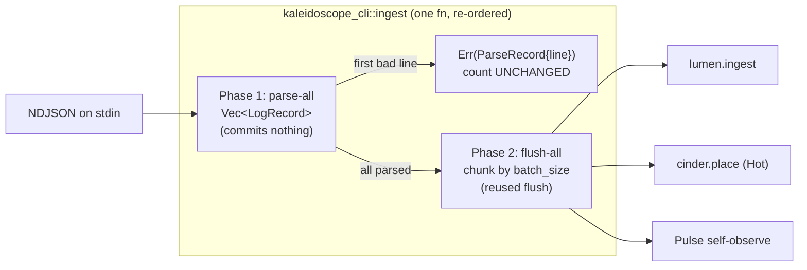
```mermaid
flowchart LR
  stdin["NDJSON on stdin"] --> P1
  subgraph ingest["kaleidoscope_cli::ingest (one fn, re-ordered)"]
    P1["Phase 1: parse-all<br/>Vec&lt;LogRecord&gt;<br/>(commits nothing)"]
    P1 -- "first bad line" --> ERR["Err(ParseRecord{line})<br/>count UNCHANGED"]
    P1 -- "all parsed" --> P2["Phase 2: flush-all<br/>chunk by batch_size<br/>(reused flush)"]
  end
  P2 --> LUMEN["lumen.ingest"]
  P2 --> CINDER["cinder.place (Hot)"]
  P2 --> PULSE["Pulse self-observe"]
```

### For Acceptance Designer — `cli-ingest-atomic-v0`

**Driving port**: `kaleidoscope-cli ingest <tenant> <data_dir>` with NDJSON on **stdin** (equivalently the in-process `ingest(tenant, data_dir, batch_size, reader, otlp_log_path)`). **Driven ports** (reused unchanged): Lumen `FileBackedLogStore`, Cinder `FileBackedTieringStore`, Pulse self-observe. Count read-back: `stats <tenant> <data_dir>` (`records=N`) / `read` / in-process `read(...)` / `stats_with_tiers(...)` against the same `data_dir`. **Black-box only** — the count is observed via the shipped read surfaces, never by inspecting Lumen's files or reaching into private helpers. Realised in the NEW file `crates/kaleidoscope-cli/tests/ingest_atomic.rs`, mirroring the `tests/ingest_and_read_roundtrip.rs` harness.

Per-AC observables:

- **parse-error-commits-nothing** — 3 valid + malformed line 4 at `batch_size=3` (a full batch WOULD flush before line 4 under the old interleaving): returns `Err(ParseRecord { line == 4 })` and a follow-up `read`/`stats` reports count **0** (UNCHANGED — no partial). Minimal witness of "a full batch held back by all-or-nothing."
- **re-run-no-double** — same still-malformed input a second time again returns `Err(ParseRecord { line: 4 })` and `read`/`stats` STILL reports **0**.
- **corrected-file-ingests-once** — line 4 fixed (4 valid at `batch_size=3`): `Ok(IngestStats { records_ingested: 4, batches_flushed: 2, tier_items_placed: 2 })`, exit 0, `read`/`stats` reports exactly **4**.
- **valid-file-negative-control** — 250 valid at `DEFAULT_BATCH_SIZE=100`: `Ok(IngestStats { 250, 3, 3 })`, exit 0, reports **250**, AND `IngestStats` + stderr `ingest ok: records=250 batches=3 tier_items=3` byte-equivalent to pre-change (no regression).
- **malformed-first-line boundary** — first line malformed: `Err(ParseRecord { line == 1 })`, reports **0**.

Plus the seven existing locked tests in `tests/ingest_and_read_roundtrip.rs` pass green UNMODIFIED; no new external dependency (one `[[test]]` manifest entry only); no new `Error` variant. The parse-vs-commit re-ordering is mutation-rich — the `batch_size=3`/malformed-line-4 case is the witness that pins the "commit-nothing-on-error" branch for Gate 5 (100% kill on the modified file).

**No external integration; no contract-test recommendation.** The entry point is the local CLI over stdin; the only dependencies reached are the local in-tree Lumen/Cinder/Pulse stores. No third-party API, webhook, or OAuth provider.

### Out of scope (recorded)

- **Success-case re-run dedup (D-DedupFuture)** — re-ingesting the SAME fully-valid file twice still doubles (Lumen has no idempotency key). A SEPARATE, LARGER concern on the `lumen` `LogStore` contract; deferred to a future `ingest-dedup-v0`.
- **Mid-commit write-failure atomicity** — this closes the PARSE-failure case only; a Lumen/Cinder write failure during Phase 2 is a pre-existing store-durability property (ADR-0059/0060 line), unchanged here.

DESIGN artefacts:
`docs/feature/cli-ingest-atomic-v0/design/wave-decisions.md`,
`docs/product/architecture/adr-0064-cli-ingest-all-or-nothing-on-parse-error.md`.

## Application Architecture — cinder-wal-error-surfacing-v0

> **Author**: `nw-solution-architect` (Morgan), DESIGN wave, 2026-06-05. Mode: PROPOSE (autonomous).
> **Feature**: `cinder-wal-error-surfacing-v0` — make cinder's (and, for uniformity, sluice's)
> tier-persistence operations **fail loud and stay consistent with disk**. cinder's
> `FileBackedTieringStore::place` and `evaluate_at` SWALLOW WAL append failures
> (`crates/cinder/src/file_backed.rs:270-278` and `:364-368`) and update in-memory tier state
> optimistically, so a failed persist on a full/failing disk is dropped and a `get_tier` read returns
> a placement that VANISHES on restart — the acked-but-not-durable lie the Earned-Trust posture
> forbids. The fix surfaces the WAL error AND write-ahead-orders the mutation (append FIRST, mutate
> memory only on success). AGPL-3.0-or-later.
> **Decision record**: **ADR-0065** (`adr-0065-cinder-wal-error-surfacing-trait-signature.md`) — the
> trait-signature change, D1-D4 resolutions, the explicit amendment of ADR-0060 C1's `TieringStore`
> byte-identity, the semver-MINOR consequence (NEVER 1.0.0), and five rejected alternatives.

### The decision in one paragraph

Two cinder trait operations become **fallible and write-ahead-ordered**, reusing the EXISTING
`MigrateError::PersistenceFailed` (no new type) and the `migrate()` discipline already in the crate
(`append_wal(...)?` BEFORE `apply_to_entries`). `place(...) -> ()` becomes `-> Result<(),
MigrateError>`; `evaluate_at(...) -> usize` becomes `-> Result<usize, MigrateError>`. This is a
deliberate, flagged public-API break (Gate 2 + Gate 3 fire — **expected and correct**: an operation
that persists must be able to fail), a semver-MINOR bump for cinder, pre-1.0, **NEVER 1.0.0**. The
live gateway ingest path **fails-the-ingest** on a tier-persist failure (D2, Earned-Trust + ADR-0064
all-or-nothing consistency); the policy sweep **fails-whole on the first WAL error** so its count
never overstates durability (D3); sluice's three swallow sites (`dequeue`/`ack`/`nack`) surface
through sluice's own `Queue`-trait change to `Result<_, EnqueueError>` (D4), a thinner R3 slice with
**zero live blast radius** (sluice is unwired). The failure ACs are made falsifiable in-suite by
injecting a failing `FsyncBackend` through the existing `open_with_fsync_backend` seam (ADR-0060) — a
test that would PASS on today's swallow bug FAILS on it and passes only when the error is surfaced AND
memory stays consistent with disk.

### D1-D4 resolutions (one line each)

- **D1** — `place -> Result<(), MigrateError>`, `evaluate_at -> Result<usize, MigrateError>`; reuse
  `MigrateError`; `InMemory` returns `Ok`; ~15-file caller ripple mapped (one live `flush`); cinder
  semver-MINOR, NEVER 1.0.0.
- **D2** — **fail-the-ingest**: `flush` propagates `cinder.place(...).map_err(Error::CinderPlace)?`,
  non-zero exit, `error: cinder place: persistence failed: io: <reason>` on stderr; the failed batch
  is never acked durable.
- **D3** — **fail-whole**: `evaluate_at` returns `Err` on the first WAL error; durable prefix applied,
  failing item neither on disk nor in memory, rest untouched; `Ok(n)` ⇒ n == durable count.
- **D4** — sluice `Queue::{dequeue,ack,nack}` become `Result<Option<Message>, EnqueueError>` /
  `Result<(), EnqueueError>`; reuse `EnqueueError::PersistenceFailed`; unwired ⇒ R3 carpaccio cut.

### Reuse Analysis verdict — EXTEND, net-new components NONE, net-new types NONE

| Item | Path | Decision |
|---|---|---|
| `MigrateError::PersistenceFailed` | `cinder/src/store.rs:49` | REUSE verbatim |
| `EnqueueError::PersistenceFailed` | `sluice/src/queue.rs:65` | REUSE verbatim |
| `TieringStore` trait (place, evaluate_at) | `cinder/src/store.rs:77` | EXTEND — 2 sig changes (migrate already `Result`) |
| `Queue` trait (dequeue, ack, nack) | `sluice/src/queue.rs` | EXTEND — 3 sig changes (enqueue already `Result`) |
| `FileBackedTieringStore::{place,evaluate_at}` | `cinder/src/file_backed.rs:262,333` | EXTEND — append-before-apply + propagate |
| `FileBackedQueue::{dequeue,ack,nack}` | `sluice/src/file_backed.rs:334,352,361` | EXTEND — append-before-apply + propagate |
| `append_wal` (both) | `…:405`, `…:416` | REUSE UNCHANGED — already `Result`; fix stops discarding it |
| `open_with_fsync_backend` + `FsyncBackend` | `wal-recovery` (shared leaf) | REUSE (DISTILL injects failing mode) |
| CLI `Error` enum | `kaleidoscope-cli/src/lib.rs:73` | EXTEND — `CinderPlace`/`CinderEvaluate` (thin) |

No new crate, trait, error type, event, or dashboard. Only additive public surface: the trait-sig
changes (intended, semver-MINOR) + two thin CLI `Error` variants.

### C4 — Component View (Level 2/3) — cinder-wal-error-surfacing-v0

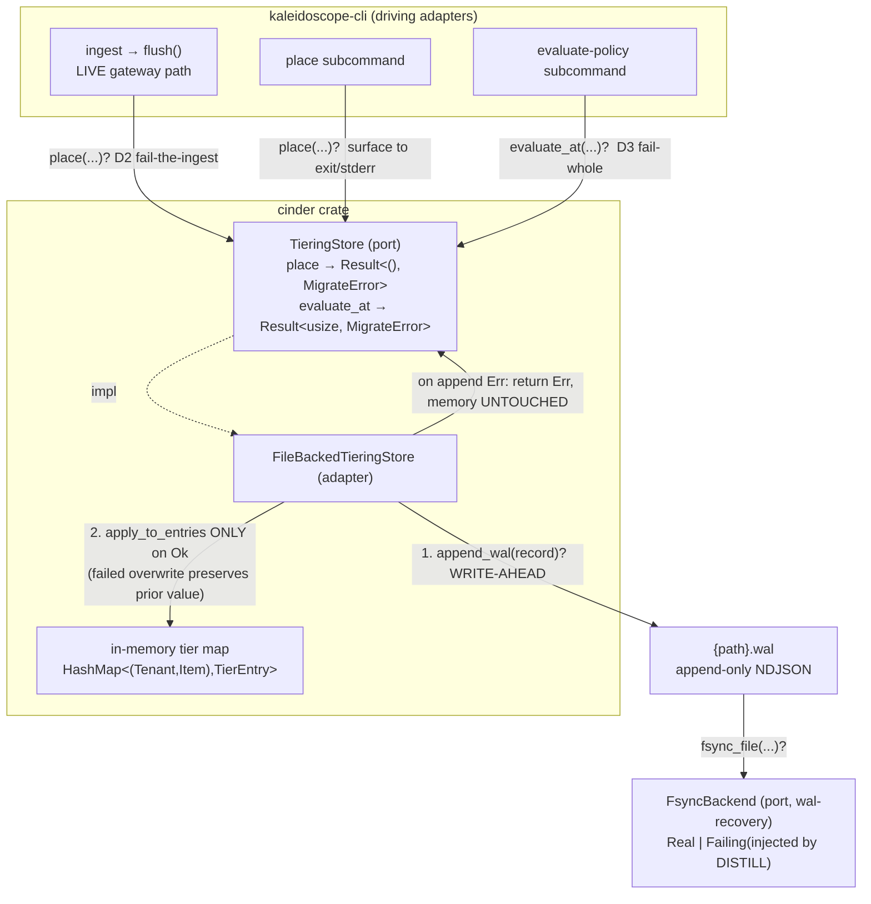
```mermaid
flowchart TB
  subgraph CLI["kaleidoscope-cli (driving adapters)"]
    INGEST["ingest → flush()<br/>LIVE gateway path"]
    PLACECMD["place subcommand"]
    EVALCMD["evaluate-policy subcommand"]
  end

  subgraph CINDER["cinder crate"]
    TRAIT["TieringStore (port)<br/>place → Result&lt;(), MigrateError&gt;<br/>evaluate_at → Result&lt;usize, MigrateError&gt;"]
    FB["FileBackedTieringStore (adapter)"]
    MEM["in-memory tier map<br/>HashMap&lt;(Tenant,Item),TierEntry&gt;"]
  end

  WAL["{path}.wal<br/>append-only NDJSON"]
  FSB["FsyncBackend (port, wal-recovery)<br/>Real | Failing(injected by DISTILL)"]

  INGEST -- "place(...)?  D2 fail-the-ingest" --> TRAIT
  PLACECMD -- "place(...)?  surface to exit/stderr" --> TRAIT
  EVALCMD -- "evaluate_at(...)?  D3 fail-whole" --> TRAIT
  TRAIT -. "impl" .-> FB
  FB -- "1. append_wal(record)?  WRITE-AHEAD" --> WAL
  WAL -- "fsync_file(...)?" --> FSB
  FB -- "2. apply_to_entries ONLY on Ok<br/>(failed overwrite preserves prior value)" --> MEM
  FB -- "on append Err: return Err, memory UNTOUCHED" --> TRAIT
```

The new error path is the labelled `on append Err: return Err, memory UNTOUCHED` edge: it did not
exist before (the adapter swallowed and fell through to the memory mutation). The `FsyncBackend` port
is where DISTILL injects the failing substrate to drive the failure ACs. sluice mirrors this shape
(`Queue` port → `FileBackedQueue` → WAL → `pending`/`in_flight`/`total`) with no live driving adapter.

### For Acceptance Designer — cinder-wal-error-surfacing-v0

**Driving ports** (where DISTILL exercises behaviour, black-box):

1. **CLI ingest path** — `kaleidoscope ingest <tenant> <data_dir>` (drives the LIVE `flush()` → `cinder.place`). The D2 fail-the-ingest AC lives here: on a failing substrate, non-zero exit + `error: cinder place: persistence failed: io: …` on stderr; the failed batch is never reported durable; a follow-up `stats`/`get-tier` shows no un-persisted placement.
2. **CLI `place` subcommand** — `kaleidoscope place <tenant> <item> <tier>`. US-01 ACs: failing substrate ⇒ `PersistenceFailed` error + non-zero exit + nothing printed; a follow-up `get-tier` returns the prior value (or none); a reopen confirms disk == memory; failed overwrite preserves the prior durable tier.
3. **CLI `evaluate-policy` subcommand** — `kaleidoscope evaluate-policy --hot-to-warm <s> --warm-to-cold <s>`. US-03 / D3 ACs: failing substrate mid-sweep ⇒ `PersistenceFailed` + non-zero exit + no `evaluated migrated=` line; the durable prefix survives a reopen; the never-printed count never overstates durability.
4. **Store API (library seam)** — `TieringStore::{place, evaluate_at}` driven directly in cinder's test crate for the unit-level surfacing + memory-consistency assertions. For sluice (US-04, unwired): the `Queue::{dequeue, ack, nack}` library seam is the ONLY entry point (no CLI surface).

**The failing-substrate seam (MANDATORY for falsifiability)**: inject a **failing** `FsyncBackend`
through the EXISTING `FileBackedTieringStore::open_with_fsync_backend(base_path, recorder,
fsync_backend)` (and sluice's `FileBackedQueue::open_with_fsync_backend`). The backend's `fsync_file`
returns `io::Error`, so `append_wal` returns `PersistenceFailed` deterministically, in-process, with
NO host disk-fill. **Falsifiability requirement**: each failure AC MUST assert BOTH the surfaced error
AND that memory == disk after a reopen (the un-persisted placement is ABSENT / the prior value
survives). On today's swallow bug the call returns success and the un-persisted placement is readable,
so the test FAILS on the bug and passes ONLY on the surfaced-and-consistent fix. Do NOT inherit a test
that cannot fail on the swallow (the ADR-0060 §1 / ADR-0049 false-confidence lesson). DISTILL likely
adds a `failing` mode to `wal-recovery`'s `LyingFsyncBackend` (or a small `FailingFsyncBackend`) —
DELIVER detail.

**Negative controls (guardrails — must stay green)**: every healthy-`RealFsyncBackend` scenario
(place/migrate/sweep persists, readable AND durable across reopen) is unchanged; the existing
graceful-restart durability suite (~1194 tests) does not regress.

### Handoff to DEVOPS — cinder-wal-error-surfacing-v0

- **Scope**: a **library + CLI** change. Modified crates: `cinder` (trait + adapter), `sluice`
  (trait + adapter, R3), `kaleidoscope-cli` (caller ripple + 2 thin `Error` variants), plus mechanical
  `.unwrap()`/`?` test-call-site updates. No new crate, no new dependency, no new service.
- **CI gates**: inherits ADR-0005's five workspace gates UNCHANGED. **Gate 2 (`cargo public-api`) and
  Gate 3 (semver) WILL flag the cinder `TieringStore` and sluice `Queue` trait changes — this is the
  EXPECTED, CORRECT signal**, not a regression. Annotate the expected public-api diff; cinder takes a
  **semver-MINOR** bump (pre-1.0), sluice likewise. **NEVER 1.0.0** (Andrea's call).
- **Mutation scope (Gate 5, 100% kill)**: the modified `cinder/src/file_backed.rs` (the `?` on
  `append_wal` in `place`/`evaluate_at`; the append-before-apply ordering; the early-return-on-`Err`)
  and `sluice/src/file_backed.rs` (the three ops' `?` + ordering). A mutant that deletes the `?`, or
  reorders apply before append, must be killed by the failing-substrate gold-test asserting memory ==
  disk on failure.
- **No new observability**: the failure is a typed `Result` surfaced to the in-process caller and
  rendered to stderr by the CLI. No new metric, no new dashboard, no new event. (A future runtime
  `cinder.place.persist_failed` counter would be a separate observability feature.)
- **Shared-crate caution (review follow-up)**: if DELIVER adds a `failing` mode to `wal-recovery`'s
  `FsyncBackend` family (a `FailingFsyncBackend`, or a `failing` arm on `LyingFsyncBackend`), it MUST
  be purely ADDITIVE and behaviour-preserving for the existing `Real`/`Lying`(`no_op`/`truncating`/
  `byte_flipping`) modes — the other six pillars (lumen, ray, strata, pulse, beacon, sluice) share
  this leaf crate (ADR-0060 Decision 4), and their durability gold-tests must stay green. The new mode
  is mutation-covered like the others.
- **No external integration; no contract-test recommendation.** cinder and sluice read/write the
  in-process filesystem under their pillar root, not a network service.

DESIGN artefacts:
`docs/feature/cinder-wal-error-surfacing-v0/design/wave-decisions.md`,
`docs/product/architecture/adr-0065-cinder-wal-error-surfacing-trait-signature.md`.

## Application Architecture — aperture-serve-loop-error-surfacing-v0

> **Author**: `nw-solution-architect` (Morgan), DESIGN wave, 2026-06-05. Mode: PROPOSE (autonomous).
> **Feature**: `aperture-serve-loop-error-surfacing-v0` — make aperture's gRPC and HTTP **serving
> loops fail loud and stop pretending to be healthy** when they die AFTER the socket is bound. Today
> both spawn helpers discard the serve future's `Result` (`crates/aperture/src/transport.rs:89-94`
> gRPC, disclosed-but-silent; `:152-158` HTTP, undisclosed-and-silent), so a post-bind death leaves a
> **zombie listener**: `/healthz` stays 200, `/readyz` stays 200 `"ready"` (no `Failed` phase exists),
> the exit code is unaffected, and the orchestrator keeps routing telemetry to a listener that accepts
> nothing — the acked-but-actually-broken lie the Earned-Trust posture forbids, in the serving layer.
> This is the serving-layer sibling of the storage-layer swallow closed in `cinder-wal-error-surfacing-v0`.
> AGPL-3.0-or-later.
> **Decision record**: **ADR-0066** (`adr-0066-aperture-serve-loop-error-surfacing.md`) — D1/D2/D3
> resolutions, the INTERNAL-only ripple (no public-API break), four rejected alternatives, the
> in-process injection test seam. **Extends, does NOT supersede** the slice-08 graceful-shutdown
> contract (serve-failure is the sibling of drain-deadline); sibling fail-closed precedent ADR-0061.

### The decision in one paragraph

The serve closures change from `JoinHandle<()>` to **`JoinHandle<ServeOutcome>`** and **self-react at
the failure site**: after the serve future returns, the task reads a per-transport
`Arc<AtomicBool> shutdown_requested` (set inside the existing graceful-shutdown oneshot closure) — if
shutdown WAS requested the return is a clean `Graceful` no-op (the slice-08 path, byte-for-byte
unchanged); if it was NOT requested, ANY return (Err, or an unexpected early Ok) is **fatal**: the task
emits one `event=serve_loop_failed transport=grpc|http error=<reason>` at error level, flips readiness
to a new sticky `ReadinessPhase::Failed` (`/readyz` -> 503 `"failed"`), and resolves `ServeOutcome::Failed`,
which the orchestrator/run-loop folds into a new `DrainOutcome::ServeFailed` -> distinct exit code
**`3`** (0 clean / 1 deadline / 2 config / **3 serve-failure**). `/healthz` stays 200 (liveness still
true). The whole ripple is **INTERNAL** (`mod transport;` is crate-private; the spawn helpers,
`ShutdownBundle`, `ReadinessPhase`, `DrainOutcome`, `orchestrate_shutdown` are all `pub(crate)`); the
new `ServeOutcome`/`ServeError` are `pub(crate)` — **no public-API break, no new public type, no new
crate, no new always-running task**. The failure ACs are made falsifiable in-suite by the existing
hand-constructed-`ShutdownBundle` seam (`lib.rs:379-430`) resolving a synthetic join to
`ServeOutcome::Failed` with NO shutdown sent, plus an injectable serve future and `testing::stderr_capture` —
a test that PASSES on today's `let _ = ...await` swallow FAILS on it and passes only when the death is
surfaced (the cinder `FailingFsyncBackend` precedent).

### D1/D2/D3 resolutions (one line each)

- **D1** — `spawn_grpc`/`spawn_http` return `JoinHandle<ServeOutcome>` AND self-react (emit + flip) at
  the failure site; the typed join folds into the exit code. Hybrid of option (c) self-react and (a)
  typed result. Reuses `ShutdownBundle`, the readiness machine, the `DrainOutcome` exit map, the closed
  vocabulary. INTERNAL ripple only; CONFIRMED no public-API leak (C3).
- **D2** — new sticky `ReadinessPhase::Failed` (`/readyz` -> 503 `"failed"`, emits
  `readiness_changed ready=false reason=serve_loop_failed`) PLUS distinct exit code **`3`** through the
  existing `DrainOutcome` seam; `/healthz` stays 200. A serve death never reuses the clean-drain `0`.
- **D3** — discriminator is a per-transport `Arc<AtomicBool> shutdown_requested` set inside the existing
  graceful-shutdown closure: shutdown-requested -> any return clean (`Graceful`, NO event); not-requested
  -> any return (Err OR unexpected early Ok) fatal (`Failed`). Early-Ok is fatal at v0. SIGTERM NEVER
  false-alarms; a true post-bind death ALWAYS surfaces.

### Reuse Analysis verdict — EXTEND-ONLY, net-new public types NONE, net-new crates NONE

| Item | Path | Decision |
|---|---|---|
| `spawn_grpc` / `spawn_http` | `transport.rs:50,117` (`pub(crate)`) | EXTEND — return `JoinHandle<ServeOutcome>`; task self-reacts |
| `ShutdownBundle` | `shutdown.rs:125-134` (`pub(crate)`) | EXTEND — `grpc_join`/`http_join` field type; no new field |
| `DrainOutcome` + `exit_code()` | `shutdown.rs:92-106` (`pub(crate)`) | EXTEND — add `ServeFailed` -> exit `3` |
| `ReadinessPhase` + `ReadinessState` | `readiness.rs:37` (`pub(crate)`) | EXTEND — add sticky `Failed` + `flip_to_failed()`; `/readyz` `Failed -> 503 "failed"` |
| closed event vocabulary | `observability.rs:30-51` (ADR-0009) | EXTEND — one additive constant `SERVE_LOOP_FAILED` |
| graceful-shutdown oneshot closure | `transport.rs:86,155` | EXTEND — set a per-transport `Arc<AtomicBool>` inside the same closure |
| hand-constructed-`ShutdownBundle` test | `lib.rs:379-430` + `testing::stderr_capture` | REUSE — synthetic join resolves `ServeOutcome::Failed`; injectable serve future |
| `ServeOutcome` / `ServeError` | `transport.rs` (new, `pub(crate)`) | CREATE — internal only, never nameable from outside |

No new crate, no new public type, no new always-running task, no new dependency, no schema change. Only
additive INTERNAL surface (two small enums/structs + one event constant + one readiness phase + one
exit code). Confirms C3: the entire ripple is crate-private.

### C4 — Component / sequence view — aperture-serve-loop-error-surfacing-v0

```mermaid
sequenceDiagram
    participant OS as OS accept loop
    participant Task as serve task (grpc|http)
    participant Flag as shutdown_requested (AtomicBool)
    participant Read as ReadinessState
    participant Err as stderr (closed vocab)
    participant Orch as orchestrate_shutdown / run loop
    participant Exit as DrainOutcome -> exit code

    Note over Task: socket already bound (listener_bound emitted)
    OS-->>Task: serve future resolves (Ok | Err | early Ok)
    Task->>Flag: load()
    alt shutdown WAS requested (flag = true)
        Note over Task: graceful drain - clean no-op (slice-08, unchanged)
        Task-->>Orch: JoinHandle resolves ServeOutcome::Graceful
        Orch->>Exit: Clean -> 0  (or DeadlineExceeded -> 1)
    else shutdown NOT requested (flag = false)
        Task->>Err: error! event=serve_loop_failed transport=.. error=..
        Task->>Read: flip_to_failed()  (sticky)
        Read->>Err: readiness_changed ready=false reason=serve_loop_failed
        Note over Read: /readyz -> 503 "failed"; /healthz stays 200
        Task-->>Orch: JoinHandle resolves ServeOutcome::Failed
        Orch->>Exit: ServeFailed -> 3
    end
```

The new arc is the entire `else` branch (the emit + `flip_to_failed` + `ServeFailed -> 3` edges): it did
not exist before (both tasks did `let _ = serve.await` and resolved `()`). The `shutdown_requested`
flag is the load-bearing graceful-vs-fatal guard (D3). L3 NOT produced: the change is two spawn helpers
returning a typed join, one readiness phase, one exit-map arm, and one event constant — below the L3
threshold, matching the cinder-wal-error-surfacing and earned-trust-fsync-probe precedents.

### For Acceptance Designer — aperture-serve-loop-error-surfacing-v0

**Driving port** (black-box, where DISTILL exercises behaviour): the **running `aperture` binary**, observed through

1. **structured stderr** (`testing::stderr_capture`) — assert exactly one `event=serve_loop_failed
   transport=grpc|http error=<reason>` at error level on a post-bind death; assert NONE on a graceful
   SIGTERM (negative control);
2. **`/readyz`** — after a serve death a subsequent probe returns `503 "failed"` (was `200 "ready"`);
   on a healthy instance `200 "ready"` (negative control, unchanged);
3. **`/healthz`** — stays `200` throughout (liveness; never the lever);
4. **process exit code** — `3` on a serve death (distinct from clean-drain `0`, deadline `1`, config `2`);
   `0` on a normal SIGTERM (negative control).

**The serve-failure injection seam (MANDATORY for falsifiability)**: two layered seams.
(i) **Unit/exit-code** — the existing hand-constructed `ShutdownBundle` (`lib.rs:379-430`): build a
`grpc_join`/`http_join` that resolves to `ServeOutcome::Failed` **without any shutdown sent**, drive it
through `drain_to_exit_code`/the run loop, assert exit `3`. (ii) **Acceptance** — drive a real spawned
transport whose serve future is made to resolve to `Err` (or early `Ok`) post-bind behind the spawn
helper (the aperture analogue of cinder's `FailingFsyncBackend`); assert the captured event, the 503
`"failed"` `/readyz`, and the 200 `/healthz`. **Falsifiability requirement**: each failure AC MUST FAIL
against today's `let _ = ...await` swallow (no event captured, `/readyz` still 200, exit still 0) and
pass ONLY when the death is surfaced AND the process reaction fires. Do NOT inherit a serve-failure test
that passes on the swallow, nor a negative control that cannot tell a graceful shutdown from a fatal
death (the DISCUSS false-confidence risk).

**Negative controls (guardrails — must stay green)**: a normal SIGTERM/`Handle::shutdown` emits the
existing slice-08 drain sequence ending `shutdown_complete exit_code=0`, NO `serve_loop_failed`, NO
readiness-failed; the existing slice-08 acceptance suite (`tests/slice_08_graceful_shutdown.rs`) does
not regress; a healthy instance reports `/readyz 200 "ready"` + `/healthz 200 "ok"`.

### Handoff to DEVOPS — aperture-serve-loop-error-surfacing-v0

- **Scope**: an INTERNAL, single-crate change to `aperture`. Modified files: `transport.rs` (two spawn
  helpers + the `shutdown_requested` flag), `shutdown.rs` (`ShutdownBundle` join type, `DrainOutcome::ServeFailed`,
  the orchestrator drain future), `readiness.rs` (`Failed` phase + `flip_to_failed`), `lib.rs` (run-loop
  no-SIGTERM death path + two mechanical test updates), `observability.rs` (one constant), `main.rs`
  (one exit-code doc line). No new crate, no new dependency, no new service, no schema change.
- **CI gates**: inherits ADR-0005's five workspace gates UNCHANGED. **Gate 2 (`cargo public-api`) and
  Gate 3 (semver) do NOT fire** — confirmed INTERNAL (crate-private module + `pub(crate)` types); the
  new `ServeOutcome`/`ServeError` never reach the public surface. (Were a public type ever to leak, it
  would be semver-MINOR, pre-1.0, **NEVER 1.0.0** — annotate in DELIVER if so.)
- **Mutation scope (Gate 5, 100% kill)**: `transport.rs` (the two former swallow sites; the
  graceful-vs-fatal `shutdown_requested` branch; the emit + `flip_to_failed` calls), `shutdown.rs`
  (the `ServeFailed` fold + `ServeFailed -> 3` exit map), `readiness.rs` (the `flip_to_failed` CAS +
  the sticky-precedence no-ops), plus `lib.rs`/`observability.rs`. A mutant restoring `let _ = join.await`,
  deleting the flag read, or collapsing `ServeFailed -> 3` must be killed by the surfacing/exit-3
  gold-tests.
- **No external integration; no contract-test recommendation.** The serving loop is an IN-PROCESS
  boundary on the Tokio runtime / OS accept loop, probed by the injected-serve-failure acceptance test
  (the Earned-Trust probe for this driven boundary), not a third-party network API. No new metric, no
  new dashboard; the failure rides the one additive `serve_loop_failed` event on the existing stderr
  stream.

DESIGN artefacts:
`docs/feature/aperture-serve-loop-error-surfacing-v0/design/wave-decisions.md`,
`docs/product/architecture/adr-0066-aperture-serve-loop-error-surfacing.md`.

---

## Application Architecture — `aegis-ingest-auth-v0`

> **Author**: `nw-solution-architect` (Morgan), DESIGN wave, 2026-06-06. Mode: PROPOSE (autonomous).
> **Feature**: `aegis-ingest-auth-v0` — wire the correct-but-**unwired** `aegis::Validator` onto the
> **live aperture OTLP ingest gateway**, fail-closed. Today aperture has **zero auth**: the gRPC handlers
> (`transport.rs:638,715,781`) and HTTP handlers (`:344,436,523`) never read the `authorization`
> metadata / `Authorization` header, and the sink receives a `SinkRecord` (`ports/mod.rs:30`,
> `#[non_exhaustive]`) carrying **no tenant** — any caller writes telemetry under any tenant id it
> claims. aegis is a correct HS256 lock (`Validator::validate`, alg-confusion-safe, fail-closed `exp`,
> exact iss/aud, catalogue-checked tenant, 8 typed reasons, one audit event per call) with **no door
> fitted** (aperture has no aegis dep). This feature is the integration slice aegis-v0 D10 deferred.
> A **security boundary** on the live gateway: fail-closed posture and HS256-secret handling are
> load-bearing. AGPL-3.0-or-later.
> **Decision record**: **ADR-0068** (`adr-0068-aegis-ingest-auth.md`) — DD1-DD7 resolutions, the tenant
> ripple, five rejected alternatives, the security posture, the token-minting test seam, the semver note.
> Mirrors **ADR-0061** (refuse-to-start fail-closed precedent); reuses **ADR-0010** permit ordering and
> **ADR-0006/0007** sink wiring.

### The decision in one paragraph

Wire `aegis::Validator` onto aperture's ingest request path as a **new authentication step that runs
after the ADR-0010 concurrency permit and before `ingest_*`**, fail-closed. aperture gains a non-wildcard
`aegis` path dependency, constructs an `Arc<aegis::Validator>` **once at composition** from a new
**`[aperture.security.auth.jwt]`** config table (`issuer`, `audience`, `secret_file` — a **path**, never
inline — and `catalogue_path`), and **refuses to start** (ADR-0061 seam: `RawConfig::into_config` →
`ConfigError` → exit **2** → `event=config_validation_failed`, no listener binds) if that table is absent,
incomplete, or unreadable — **no opt-out flag** (a default-OFF flag is the silent-downgrade trap ADR-0061
closed). Each of the 6 handlers (3 signals × 2 transports) extracts the bearer token
(`extract_bearer_{grpc,http}`), calls `validate_with_subject(jwt, now, "ingest_<signal>")`, and either
**rejects** (gRPC `Status::unauthenticated(<reason>)` / HTTP `401` + `WWW-Authenticate: Bearer` per RFC
6750, body = the aegis `reason()`, **nothing stored**) or **accepts** with the validated `tenant_id`
threaded through `ingest_<signal>(body, transport, tenant, sink)` onto a tenant-tagged `SinkRecord`. The
secret is **never logged**: aperture's `Config` stores `secret_file: PathBuf`, never the bytes; aegis
opaque-Debugs the key; config errors name the file by path only; audit/reject lines carry neither secret
nor token. The whole change is **crate-internal** — `aegis` is unchanged, no new crate, no new task.

### DD1-DD7 resolutions (one line each)

- **DD1** — config: new `[aperture.security.auth.jwt]` (`deny_unknown_fields`) with `issuer`/`audience`/
  **`secret_file` (path)**/`catalogue_path`; `Config` stores `PathBuf` not bytes → secret never on a
  loggable surface; `Arc<Validator>` built once at composition (`load_catalogue` + `Validator::new`).
- **DD2** — gRPC: read `authorization` metadata `Bearer <jwt>` → reject `Status::unauthenticated(<reason>)`;
  HTTP: read `Authorization` header → reject `401` + `WWW-Authenticate: Bearer error="invalid_token",
  error_description="<reason>"`; ordering `permit → auth → [415] → ingest`; missing/empty/malformed = reject.
- **DD3** — `ingest_*(body, transport, tenant: TenantId, sink)`; `SinkRecord` variants carry tenant via
  `Logs(TenantScoped<…>)` → tenant-tagged **by type**; `OtlpSink::accept` signature unchanged; the
  single-validator-per-signal invariant is preserved (auth is a *different* symbol in the handler, not a
  second harness `validate_*` call site).
- **DD4** — fail-closed: **refuse-to-start** without a complete/readable auth config (ADR-0061 seam, exit 2,
  `config_validation_failed`, no listener binds); **no opt-out flag**.
- **DD5** — aegis owns the per-validated-request audit event (`validate_with_subject` supplies `subject`);
  aperture emits the **one** decision line only for the pre-validate no/empty/malformed-bearer case;
  exactly one event per request, no double/zero-logging; no secret/token in any field.
- **DD6** — scope = ingest path only (read-path auth is a separate future feature); **role question
  resolved: v0 is authentication-only, role-gating deferred** (any valid catalogued `viewer`/`operator`
  token may ingest; aegis still rejects `unknown_role` free; a future feature adds one role gate, no
  re-plumbing).
- **DD7** — aegis "JWKS" doc overstatement: **adjacent, NOT folded** (touches aegis, would dilute the
  100%-mutation scope); disposition = `docs:` fix-forward / trivial micro-wave.

### C4 — Sequence (Level, the auth boundary)

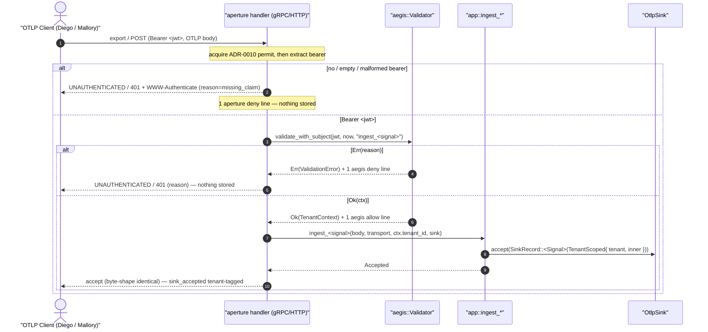
```mermaid
sequenceDiagram
    autonumber
    actor Client as "OTLP Client (Diego / Mallory)"
    participant H as "aperture handler (gRPC/HTTP)"
    participant V as "aegis::Validator"
    participant App as "app::ingest_*"
    participant S as "OtlpSink"
    Client->>H: export / POST (Bearer <jwt>, OTLP body)
    Note over H: acquire ADR-0010 permit, then extract bearer
    alt no / empty / malformed bearer
        H-->>Client: UNAUTHENTICATED / 401 + WWW-Authenticate (reason=missing_claim)
        Note over H: 1 aperture deny line — nothing stored
    else Bearer <jwt>
        H->>V: validate_with_subject(jwt, now, "ingest_<signal>")
        alt Err(reason)
            V-->>H: Err(ValidationError) + 1 aegis deny line
            H-->>Client: UNAUTHENTICATED / 401 (reason) — nothing stored
        else Ok(ctx)
            V-->>H: Ok(TenantContext) + 1 aegis allow line
            H->>App: ingest_<signal>(body, transport, ctx.tenant_id, sink)
            App->>S: accept(SinkRecord::<Signal>(TenantScoped{ tenant, inner }))
            App-->>H: Accepted
            H-->>Client: accept (byte-shape identical) — sink_accepted tenant-tagged
        end
    end
```

L1/L2 NOT re-produced: aperture's System Context + Container views are established in the bootstrap
section and the cinder-bridge sections; this feature adds **no new container, no new external system, no
new data store** — it inserts one authentication step inside the existing aperture gateway container. The
sequence diagram is the load-bearing view for a request-path security boundary. L3 NOT produced: the
change is one config table, one auth-extraction boundary, a tenant parameter on three functions, and a
tenant on the sink record — below the L3 threshold, matching the tls-config-reject and
serve-loop-error-surfacing precedents.

### For Acceptance Designer — aegis-ingest-auth-v0

**Driving ports** (black-box, where DISTILL exercises behaviour): the **running `aperture` binary**,
observed through

1. **gRPC `authorization` metadata** (`Bearer <jwt>`) on `Export{Logs,Trace,Metrics}ServiceRequest` →
   assert accept-with-tenant or `Status::unauthenticated(<reason>)`;
2. **HTTP `Authorization` header** (`Bearer <jwt>`) on `POST /v1/{logs,traces,metrics}` → assert accept or
   `401` + `WWW-Authenticate: Bearer` with the matching `reason` in the body;
3. **the recording sink** — on accept, the drained record carries the validated `tenant_id` (the
   `TenantScoped` tenant); on every reject the sink is **empty** (nothing stored);
4. **structured stderr** (`stderr_capture`) — exactly **one** decision line per request
   (`decision=allow|deny`, `subject=ingest_<signal>`, `reason`, and `tenant_id` on allow);
5. **process exit code + `config_validation_failed`** — for the fail-closed config refusal (exit 2, no
   listener bound, no secret bytes in the error).

**The token-minting test seam (MANDATORY for falsifiability)**: a tiny in-suite helper signs an HS256 JWT
with the **same secret** the test config's `secret_file` points at, for a **catalogued** test tenant, with
`iss`/`aud` matching the test config and a future `exp` (jsonwebtoken `encode`, already a workspace dep via
aegis). Negative-control mints: **no token**, empty `Bearer `, `Bearer not-a-jwt` (malformed), past `exp`
(expired), wrong signing key (invalid_signature), wrong `iss`, wrong `aud` (`kaleidoscope-query`),
`tenant_id` absent from the catalogue (unknown_tenant), role `auditor` (unknown_role). Mirror `slice_02`
(HTTP), `slice_07` (config), `tests/common`. **Falsifiability**: each reject AC MUST FAIL against today's
no-auth code (the request is accepted, the sink is non-empty, no deny line) and pass ONLY when the token is
validated and the request rejected with nothing stored. Each fail-closed-config AC MUST FAIL against a
build that boots without auth config and pass ONLY when the binary refuses to start (exit 2, no listener).

**Negative controls (guardrails — must stay green)**: a **valid** token ingests **exactly as before**
(byte-shape-identical accept, unchanged backpressure / shutdown / serve-loop); the `invariant_single_validator`
test stays green (auth adds no harness `validate_*` call site); existing `slice_0*` tests stay green once
they supply a valid token + auth config.

### Handoff to DEVOPS — aegis-ingest-auth-v0

- **Scope**: a crate-internal change to `aperture` reusing `aegis` verbatim. Modified files:
  `Cargo.toml` (add `aegis = { path = "../aegis" }`, non-wildcard), `config/mod.rs`
  (`[aperture.security.auth.jwt]` schema + `into_config` refuse-to-start invariant + builder setters),
  `ports/mod.rs` (`TenantScoped<T>` + `SinkRecord` payloads), `app.rs` (3 `ingest_*` signatures + 3
  constructions + 3 `summarise_record` arms), `transport.rs` (`extract_bearer_{grpc,http}`,
  `reject_to_{status,http}`, `Arc<Validator>` on the services + `HttpState`, the 6 handler auth steps,
  the one pre-validate aperture deny line), `tests/common` (token-minting + auth-config fixtures).
  **No new infra, no new crate, no new always-running task, no new service.**
- **New dependency**: `aegis` is **in-workspace** (path dep) — no new third-party crate enters the lockfile
  beyond what aegis already pulls (jsonwebtoken, already present transitively). `cargo deny` enforces the
  non-wildcard path dep.
- **CI gates**: inherits **ADR-0005's five workspace gates UNCHANGED**. Gate 2 (`cargo public-api`) and
  Gate 3 (semver) do **not** fire — confirmed crate-internal (`Config` fields `pub(crate)`; `ingest_*` /
  `SinkRecord` `pub` but only aperture constructs them; aegis unchanged). aperture + aegis are **not** in
  the Gate 2/3 public-API set. Pre-1.0; **NEVER 1.0.0**.
- **Mutation scope (Gate 5, 100% kill)**: the **modified aperture files only** — `transport.rs` (bearer
  extraction, reject mapping, the 6 auth-step branches, the pre-validate deny line), `config/mod.rs` (the
  jwt-table parse + the refuse-to-start invariant), `app.rs` (the tenant ripple), `ports/mod.rs`
  (`TenantScoped`). aegis is **out of the mutation scope** (reused verbatim; the DD7 doc-fix is adjacent and
  carries no behaviour). A mutant that accepts a tokenless request, skips the refuse-to-start, drops the
  tenant from the record, or collapses a reject `reason` must be killed by the token-matrix / fail-closed
  gold tests.
- **External integrations: none, no contract-test recommendation.** The bearer-token boundary is an
  IN-PROCESS validation against a pre-shared HS256 key + a local TOML catalogue (no network at validation
  time, no third-party IdP, no JWKS endpoint at v0). The Earned-Trust probe for this driven boundary is the
  token-matrix acceptance suite (present a forged/expired/unknown token, assert reject + nothing stored) and
  the fail-closed-config refusal test (assert exit 2 + no listener when the auth config lies or is absent).
  No new metric, no new dashboard; decisions ride the existing aegis audit event on the stderr stream.

DESIGN artefacts:
`docs/feature/aegis-ingest-auth-v0/design/wave-decisions.md`,
`docs/product/architecture/adr-0068-aegis-ingest-auth.md`.

---

## Application Architecture — `cinder-unknown-item-diagnostic-v0`

> **Author**: `nw-solution-architect` (Morgan), DESIGN wave, 2026-06-06. Mode: PROPOSE (autonomous).
> **Feature**: `cinder-unknown-item-diagnostic-v0` — a one-arm `Display`-string fidelity fix. The
> `MigrateError::UnknownItem` arm (`crates/cinder/src/store.rs:55-58`) renders the id via `{item:?}`
> (Debug of the `ItemId(pub String)` newtype), leaking `ItemId("ghost")` where the documented CLI-help
> contract (`crates/kaleidoscope-cli/src/main.rs:208,245`) promises the bare quoted id (`"ghost"`). Both
> `migrate` (`lib.rs:471`) and `get-tier` (`lib.rs:509`) route through that single arm via
> `Error::CinderMigrate` Display (`lib.rs:103`). The fix makes code match the contract. AGPL-3.0-or-later.

**Intentionally a brief note, not a full section** — a one-token rendering-fidelity change inside one
private `Display` arm has no new topology, no new component, no new dependency, and no public-API or
semver event. A heavy section (C4, ATAM, threat model) would misrepresent its scope. Full decision record:
`docs/feature/cinder-unknown-item-diagnostic-v0/design/wave-decisions.md`.

**The decision in one line**: render the id placeholder as `{:?}` applied to `item.as_str()` (Debug of a
`&str` → quoted `"ghost"`, escaping a quote-containing id correctly), mirroring the established
`{value:?}`-on-a-string precedent at `lib.rs:107` (`invalid tier "warm"`). A `Display` impl on `ItemId`
was evaluated and **rejected** — wider blast radius on a public re-exported type, and it would not by
itself add the contract's quotes. The arm change is the narrowest correct fix; nothing new is created.

**For Acceptance Designer**: the diagnostic contract is `cannot migrate unknown item "<item_id>" for
tenant <tenant>` (the `cinder migrate:` prefix is pre-existing and OUT of scope; the verifier's K18
substring holds regardless). Drive the **built CLI binary** as a subprocess; exercise **both** subcommands
through the shared arm: (1) `migrate` on an unplaced id and (2) `get-tier` on an unplaced composite id —
each asserting stderr **contains** the quoted bare id and does **NOT** contain `ItemId(`, with exit
non-zero (fail-closed UNCHANGED); plus a known-item control (exit 0, unchanged stdout). The existing
substring test (`migrate_subcommand.rs:309-324`) stays green; the new quoted-form + no-`ItemId(`
assertion pair is what pins the contract and was the gap.

**Handoff to DEVOPS**: inherits **ADR-0005's five gates UNCHANGED**. Gate 2/3 do **not** fire — `cinder`
and `kaleidoscope-cli` are not in the public-API/semver-pinned set, and a private `Display`-arm string is
not an API change; **no semver bump, NEVER 1.0.0**. Mutation (Gate 5, 100% kill) scoped to the **single
modified line** (`store.rs:57`); the quoted-form + no-`ItemId(` assertion pair kills the mutant that
reverts the placeholder to `{item:?}`. **No new ADR** — not architecturally significant. **No external
integrations**, no contract-test recommendation. Modified file: `crates/cinder/src/store.rs` (one line);
new test assertions land in `crates/kaleidoscope-cli/tests/`.

DESIGN artefact: `docs/feature/cinder-unknown-item-diagnostic-v0/design/wave-decisions.md`.

## Application Architecture — `spark-ingest-auth-v0`

> **Author**: `nw-solution-architect` (Morgan), DESIGN wave, 2026-06-06. Mode: PROPOSE (autonomous).
> **Feature**: `spark-ingest-auth-v0` — the **client-side sibling of ADR-0068**. The gateway now mandates
> `authorization: Bearer <jwt>` on every ingest (fail-closed, `reason=missing_claim`), but the Spark SDK
> has **no way to send one**: `SparkConfig` has no auth knob (`with_endpoint` is the only transport knob,
> `config.rs:120` — F1), none of the three OTLP exporters attaches metadata (each
> `.with_tonic().with_endpoint(..).build()`, `init.rs:282-352` — F2), and Spark ignores
> `OTEL_EXPORTER_OTLP_HEADERS` (reads only the endpoint env var, `init.rs:70` — F3). So an integrator
> (Marco's `payments-api`) is silently denied at the door; the verifier's E01-E04 (Spark→Aperture
> round-trip, traces AND logs) are BLOCKED. This feature gives the SDK the key. The bearer is a **SECRET**:
> Spark sends it, **never logs it**. AGPL-3.0-or-later.
> **Decision record**: **ADR-0069** (`adr-0069-spark-ingest-auth.md`) — DD1-DD5, the redacting newtype,
> four rejected alternatives, the security posture, the test seam, and the **public-api/semver** note.
> Sibling **ADR-0068** (the gateway that mandates the token). Reuses **ADR-0011** (`#[non_exhaustive]`
> additive evolution), **ADR-0013** (`opentelemetry_otlp =0.27`, tonic transport), **ADR-0014** (the
> `build_pipeline` exporter path), **ADR-0017** (the `target="spark"` event surface a token must not join).

### The decision in one paragraph

Add ONE additive builder method `SparkConfig::with_bearer_token(impl Into<String>)` (backed by a private
`bearer_token: Option<BearerToken>` field on the `#[non_exhaustive]` struct) and honour the standard
`OTEL_EXPORTER_OTLP_HEADERS` env var (the `authorization` entry only, percent-decoded), with
**programmatic-wins precedence** mirroring the endpoint chain. In `build_pipeline`, a **single** helper
`build_auth_metadata(&SparkConfig) -> Option<MetadataMap>` resolves the token and — only when present —
returns a one-entry `MetadataMap` (`authorization = "Bearer <token>"`), which is **cloned into all three**
exporter builders via `WithTonicConfig::with_metadata` (verified API in `opentelemetry-otlp =0.27`:
`tonic/mod.rs:376,405`; `init.rs:45` adds `WithTonicConfig` to the `use`). One helper, one call site ⇒ no
signal can be left un-authenticated by omission (a partial wire is the explicit non-goal). The token is a
secret handled **structurally**: a `BearerToken` newtype whose `Debug` renders `<redacted>` and which has
no value-`Display`; `SparkConfig` keeps `#[derive(Debug)]` and recurses into it, so `dbg!`/`{config:?}`
shows `<redacted>`, never the JWT; the raw value is reached only inside `build_auth_metadata` (config →
`MetadataMap` → wire, touching no `tracing` macro). `emit_init_succeeded`'s closed vocabulary is UNCHANGED.
When no token is resolved, **no** metadata is attached — the no-auth path is byte-identical to today
(`slice_01..slice_07` stay green). No new crate, no new dependency, no pipeline restructure.

### DD1-DD5 resolutions (one line each)

- **DD1** — `.with_metadata(MetadataMap)` (verified `WithTonicConfig`, `opentelemetry-otlp =0.27`
  `tonic/mod.rs:376,405`; merges headers); ONE helper builds it once, cloned into span/log/metric builders
  via a per-signal apply-shim; `init.rs:45` gains `WithTonicConfig`. Interceptor rejected (see ADR-0069 Alt A).
- **DD2** — surface = ONE method `with_bearer_token(impl Into<String>)` (general `with_auth_header`
  deferred); additive on `#[non_exhaustive]` ⇒ non-breaking. **Precedence — REVISED by the DISTILL
  back-propagation note below**: the knob is the supported in-code API; a concurrently-set
  `OTEL_EXPORTER_OTLP_HEADERS=authorization=...` is honoured by **upstream** and is **final on key
  collision** (env-as-override), because `HeaderMap::extend` overwrites — NOT "programmatic wins".
- **DD3** — **never logged**, enforced by a `BearerToken` redacting newtype (mirrors aegis opaque-key
  `validator.rs:149-158`); derived `SparkConfig::Debug` recurses into `<redacted>`; one `pub(crate)`
  accessor, single caller; `emit_init_succeeded` unchanged; errors name kind not bytes.
- **DD4** — **REVISED by the DISTILL back-propagation note below: DROP the spark-owned parser.**
  `opentelemetry-otlp =0.27` **already** parses `OTEL_EXPORTER_OTLP_HEADERS` and percent-decodes it on
  Spark's exact `.with_tonic().build()` path, unconditionally (`tonic/mod.rs:156` → `mod.rs:225` →
  `mod.rs:233 url_decode`). A spark-owned list-parse/percent-decode is **redundant** and is **not built**.
  The spark-owned malformed-fail-fast AC is **dropped** (upstream silently drops a malformed env value;
  it is not spark's concern). The programmatic token is a plain `String` ⇒ no decode ⇒ no malformed case.
- **DD5** — no token ⇒ no metadata attached, no-auth path byte-unchanged; **silent-but-documented** (no
  warn — the unauth-collector workflow is legitimate; the gateway surfaces `missing_claim`; any future
  warn must never echo a token and must be suppressible).

### DISTILL back-propagation (2026-06-06) — env parser dropped, precedence reframed

> Appended after the `spark-ingest-auth-v0` DISTILL surfaced that `opentelemetry-otlp =0.27` **already**
> honours `OTEL_EXPORTER_OTLP_HEADERS` (percent-decode included) on Spark's exact construction path,
> **unconditionally** (`SpanExporter::builder().with_tonic().build()` → `span.rs:66 build_span_exporter`
> → `tonic/mod.rs:300 build_channel` → `tonic/mod.rs:156 parse_headers_from_env`; same for logs/metrics).
> **Full record: ADR-0069 § Amendment (DISTILL back-propagation)** (append-only) and the feature
> `wave-decisions.md § Changed Assumptions`.

- **DD4 env parser: WITHDRAWN** — redundant; upstream owns the parse + percent-decode. No spark parser,
  no percent-decode dependency (moot), no spark-owned malformed-env fail-fast (upstream is silent-drop).
- **DD2 precedence: REFRAMED** — attaching the knob via `.with_metadata` AND a set env header ⇒ both reach
  `build_channel` and the **env value overwrites** the knob (`HeaderMap::extend` replaces on collision,
  `tonic/mod.rs:320-321`). So precedence is **env-as-override, final on collision**; the knob is the
  supported in-code API (no double-attach by mutual exclusion at the source — Spark writes zero env code).
- **STANDS**: the programmatic `with_bearer_token` is the load-bearing core — upstream has **no programmatic
  bearer method**, so an in-code integrator has no way today. DD1/DD3/DD5 and the Gate 2/3 public-api +
  semver-minor (0.1.0 → 0.2.0) consequence are unchanged.
- **Bea msg 038 (no bearer via env)** is most plausibly environmental (var not inherited by the init
  process, or set after `.build()`, or a mis-encoded value silently dropped upstream); DELIVER gets an
  **env-before-init disambiguation probe** asserting the real aperture accepts.

### Reuse verdict

REUSE: the tonic `with_metadata` surface, the endpoint-precedence pattern (`operator_supplied_endpoint`),
the aegis opaque-Debug principle, the empty-env-as-absent fall-through, the `ExporterInitFailed` variant,
the `#[non_exhaustive]` additive guarantee. EXTEND: `SparkConfig` (one field + one method), `build_pipeline`
(three `.with_metadata` calls via one helper), the `init.rs` `use`. CREATE (justified): the `BearerToken`
newtype, the single `build_auth_metadata` helper + apply-shim. ~~the `OTEL_EXPORTER_OTLP_HEADERS` parser~~
**(WITHDRAWN — upstream owns env parsing, see the back-propagation note above)**.
No new crate, no new dependency. Full table in ADR-0069 and the feature wave-decisions.

### C4 — Sequence (authenticated export accepted vs no-token denied)

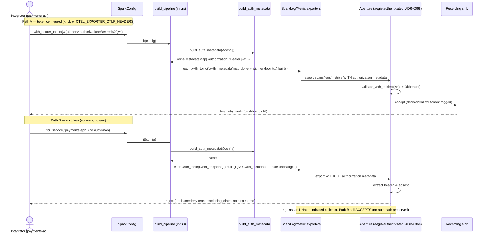
```mermaid
sequenceDiagram
    actor Marco as Integrator (payments-api)
    participant Cfg as SparkConfig
    participant BP as build_pipeline (init.rs)
    participant Helper as build_auth_metadata
    participant Exp as Span/Log/Metric exporters
    participant Ap as Aperture (aegis-authenticated, ADR-0068)
    participant Sink as Recording sink

    Note over Marco,Cfg: Path A — token configured (knob or OTEL_EXPORTER_OTLP_HEADERS)
    Marco->>Cfg: with_bearer_token(jwt)  (or env authorization=Bearer%20jwt)
    Cfg->>BP: init(config)
    BP->>Helper: build_auth_metadata(&config)
    Helper-->>BP: Some(MetadataMap{ authorization: "Bearer jwt" })
    BP->>Exp: each .with_tonic().with_metadata(map.clone()).with_endpoint(..).build()
    Exp->>Ap: export spans/logs/metrics WITH authorization metadata
    Ap->>Ap: validate_with_subject(jwt) -> Ok(tenant)
    Ap->>Sink: accept (decision=allow, tenant-tagged)
    Sink-->>Marco: telemetry lands (dashboards fill)

    Note over Marco,Cfg: Path B — no token (no knob, no env)
    Marco->>Cfg: for_service("payments-api")  (no auth knob)
    Cfg->>BP: init(config)
    BP->>Helper: build_auth_metadata(&config)
    Helper-->>BP: None
    BP->>Exp: each .with_tonic().with_endpoint(..).build()  (NO .with_metadata — byte-unchanged)
    Exp->>Ap: export WITHOUT authorization metadata
    Ap->>Ap: extract bearer -> absent
    Ap-->>Marco: reject (decision=deny reason=missing_claim, nothing stored)
    Note over Exp,Ap: against an UNauthenticated collector, Path B still ACCEPTS (no-auth path preserved)
```

**Intentionally no new C4 L1/L2/L3 topology** — this feature adds an attribute to an existing client→gateway
edge already drawn in the spark and ADR-0068 sections; it introduces no new component, container, or actor.
The sequence above is the load-bearing view (the authenticated-vs-denied flow). Spark gains no new network
behaviour beyond one extra gRPC metadata entry on exports it already makes.

### For Acceptance Designer (DISTILL)

- **Driving ports**: `SparkConfig::with_bearer_token(impl Into<String>)` (the programmatic key) and the
  `OTEL_EXPORTER_OTLP_HEADERS=authorization=Bearer%20<jwt>` env var (the conventional key) — exercised
  against a **real aegis-authenticated aperture** (the E01-E04 shape), not a mock.
- **Token-minting seam**: reuse the ADR-0068 / aegis HS256 mint helper (F5) — a valid token for a
  catalogued tenant with matching `iss`/`aud` and a future `exp`; the no-token negative control is "configure
  nothing".
- **The five mandated AC, mapped**:
  - `a-bearer-configured-export-is-accepted-by-the-authenticated-gateway` — valid token ⇒ ACCEPT
    (`decision=allow`, sink record tagged with the token tenant); same export, no token ⇒ DENY
    `missing_claim`, sink empty. MUST fail on today's no-knob code.
  - `the-token-reaches-all-three-signals` — (a) UNIT assertion on `build_auth_metadata` (the `MetadataMap`
    carries `authorization: Bearer <token>`; the apply-shim is exercised for span/log/metric builder types),
    PLUS (b) at least one signal E2E through the authenticated aperture; integration extended to traces AND
    logs (E01-E04 cover both), metrics where exercisable.
  - `OTEL_EXPORTER_OTLP_HEADERS-attaches-the-bearer` — mirror `slice_04_env_var_precedence.rs`
    (`serial_test`, clean-env, recording-sink aperture); `Bearer%20<jwt>` decoded and accepted **by the
    upstream exporter** (no spark parser — set env **before** `spark::init`; this doubles as the msg-038
    disambiguation probe); empty env ⇒ no header. **Precedence test REVISED** (DISTILL back-propagation):
    both set ⇒ **env value on the wire** (upstream `HeaderMap::extend` overwrites), NOT programmatic-wins.
  - `the-token-is-never-logged` — configure a recognisable token; grep every `target="spark"` event,
    `{:?}` of `SparkConfig`, and error surfaces ⇒ **0** occurrences; redacted placeholder present.
  - `no-token-no-header-against-an-unauthenticated-endpoint-still-works` — no token ⇒ no metadata ⇒
    `slice_01..slice_07` green; no-token exporter build byte-unchanged.
- **Note**: a full three-signal round-trip is integration-heavy; the all-three property is split into a
  cheap unit assertion on the helper plus an E2E proof on at least traces+logs. Spark's contract is correct
  transmission; a gateway rejection (expired/invalid) is the gateway's surfacing, not Spark's (DD5).

### Handoff to DEVOPS

- **No new infra.** No new crate, no new dependency (the tonic `MetadataMap` is already in the lock via
  `opentelemetry_otlp`). **No percent-decode dependency** — the env percent-decode is done by **upstream**,
  not Spark (DISTILL back-propagation; the original "DELIVER picks a percent-decode" is moot). No new env
  var beyond the standard `OTEL_EXPORTER_OTLP_HEADERS`, which upstream already honours on Spark's path.
- **Inherits ADR-0005's five gates.** **CRITICAL DIFFERENCE from cinder/aperture: `spark` IS in the Gate
  2/3 public-API set** (verified `ci.yml:334,347` `cargo public-api -p spark`; `ci.yml:426`
  `cargo semver-checks --package spark`). `with_bearer_token` is a **new public method**, so:
  - **Gate 2** WILL diff ⇒ DELIVER **must regenerate/accept the `cargo public-api` baseline** in-commit.
  - **Gate 3** classifies it **minor (additive)** on a `#[non_exhaustive]` struct ⇒ DELIVER **must bump
    `spark`'s minor version** (pre-1.0; **NEVER 1.0.0** — Andrea's call / CLAUDE.md / MEMORY).
- **Mutation (Gate 5, 100% kill)** scoped to the **modified spark files** (`gate-5-mutants-spark`,
  in-diff on `crates/spark/**`) — the new resolution/attachment/redaction branches in `config.rs` +
  `init.rs` (+ the new `BearerToken` type and parser).
- **No external integration requiring contract tests** — aperture is an in-workspace gateway, not a
  third-party service; the round-trip is covered by the E2E accept/deny suite, not a consumer-driven
  contract.

DESIGN artefacts: `docs/product/architecture/adr-0069-spark-ingest-auth.md`,
`docs/feature/spark-ingest-auth-v0/design/wave-decisions.md`.
