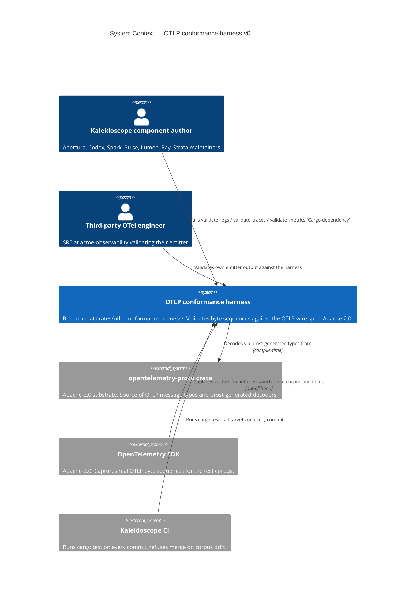
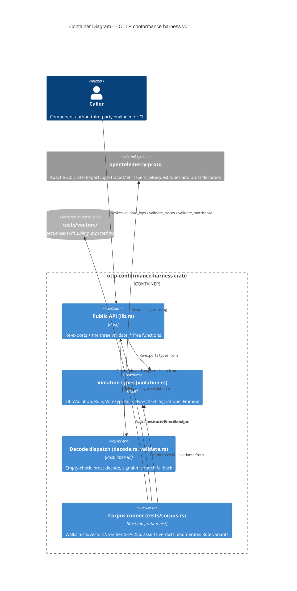
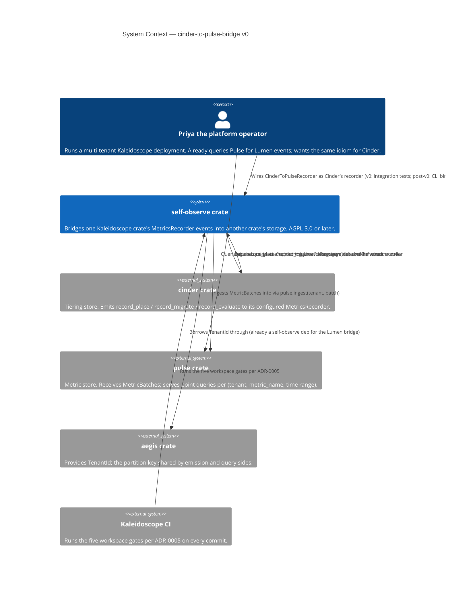
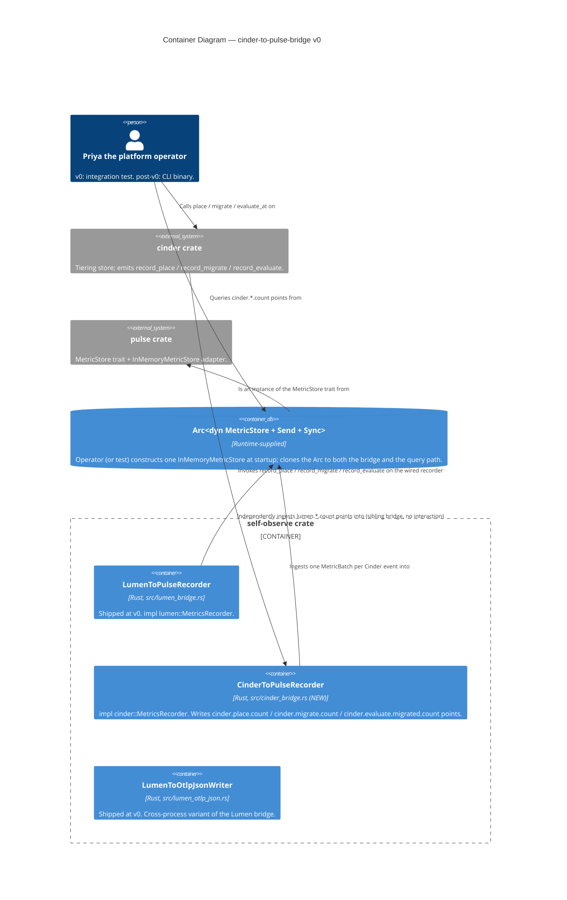
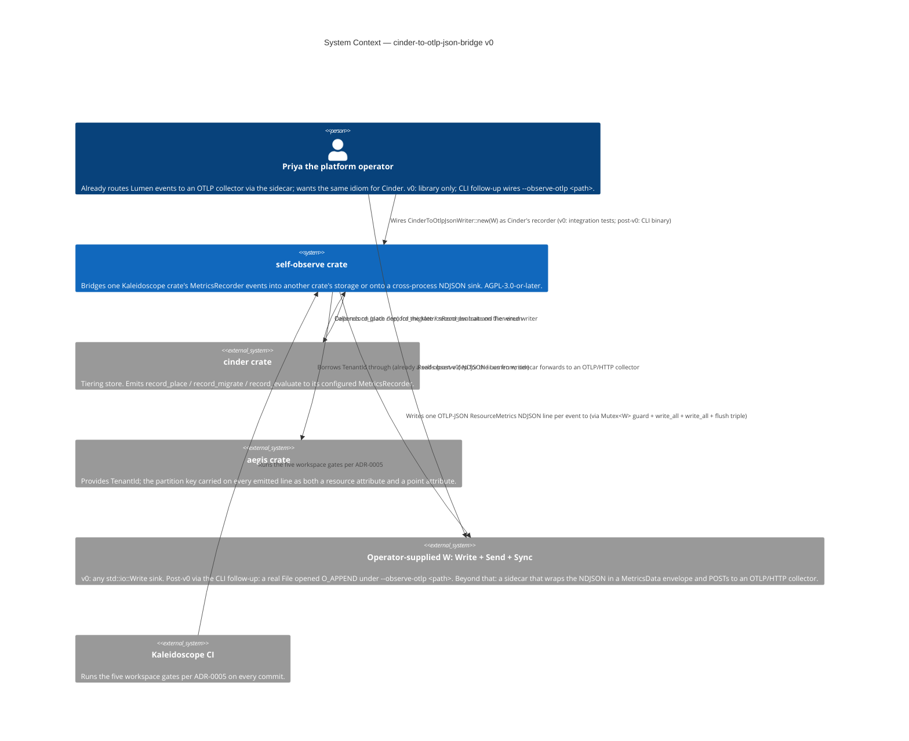
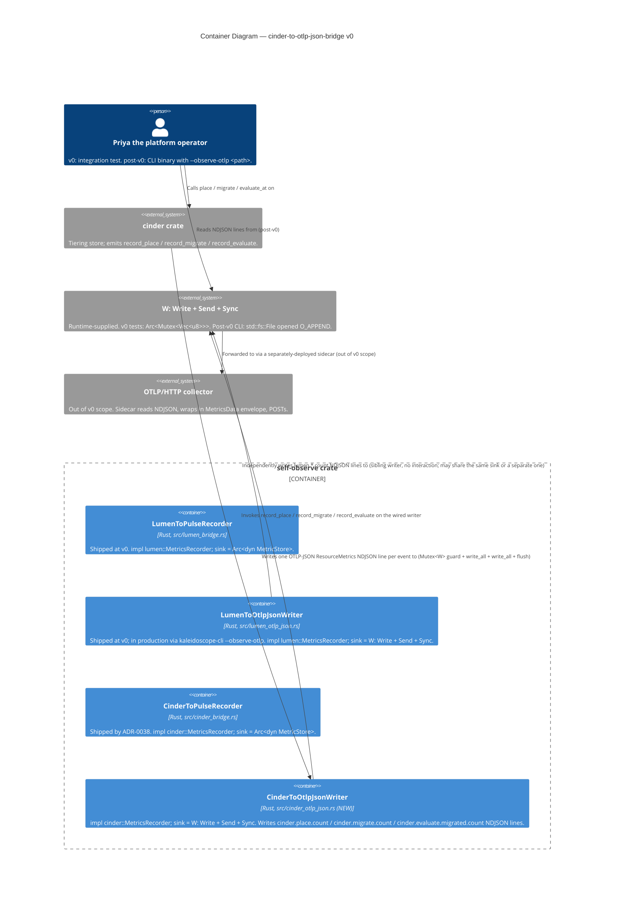
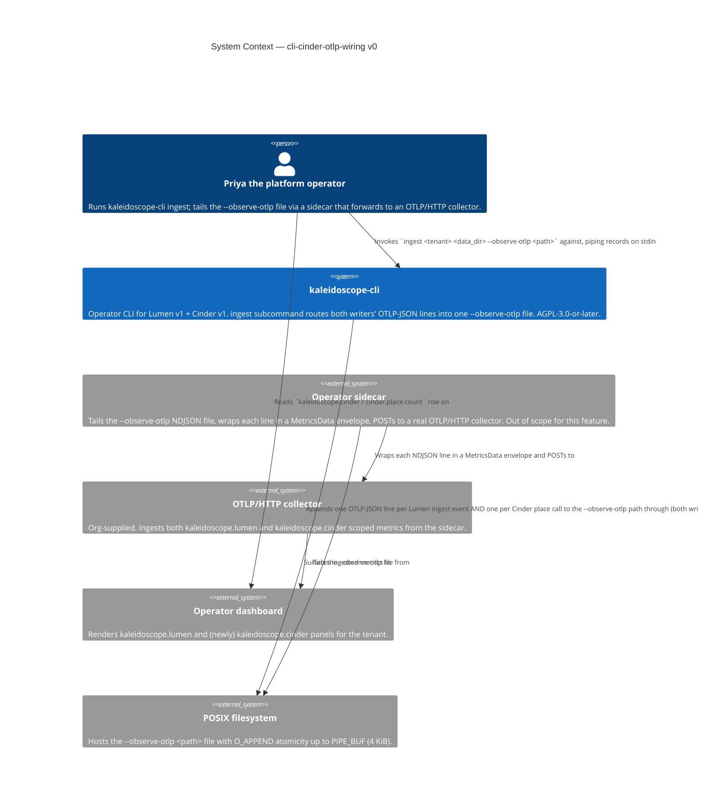
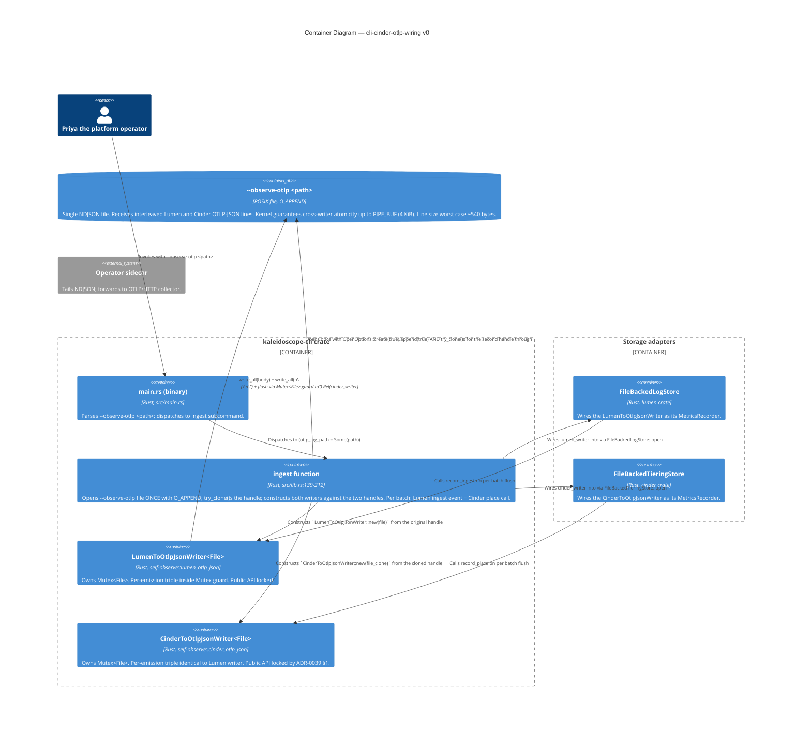
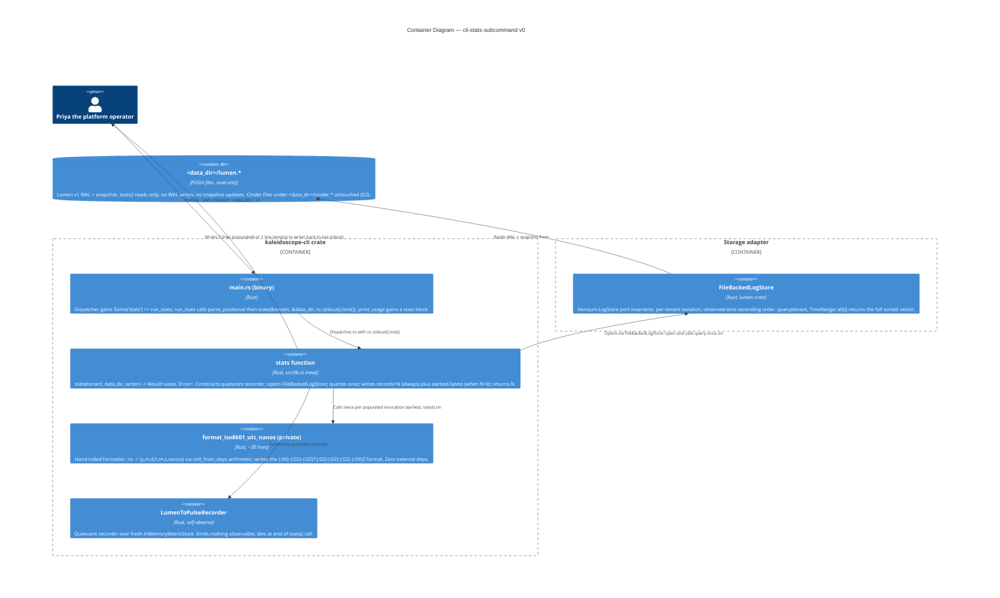

# Kaleidoscope — Architecture Brief

> **Scope**: This brief is bootstrapped by the DESIGN wave for `otlp-conformance-harness-v0`. Platform-level architecture lives in [`../../architecture/kaleidoscope-architecture.md`](../../architecture/kaleidoscope-architecture.md) and is **not duplicated here**. Subsequent feature DESIGN waves append their own application-architecture sections; the platform sections (`## System Architecture`, `## Domain Model`) remain owned by their respective architects (`nw-titan-architect`, `nw-hera-architect`) and are absent for this feature because Andrea has decided not to invoke them for the OTLP conformance harness.

---

## Document Ownership

| Section | Owner agent | Status for `otlp-conformance-harness-v0` |
|---|---|---|
| `## System Architecture` | `nw-titan-architect` | Not invoked — platform-level architecture already documented in `docs/architecture/kaleidoscope-architecture.md` and is reused as-is. |
| `## Domain Model` | `nw-hera-architect` | Not invoked — the harness's domain model is the OTLP wire spec, owned upstream by OpenTelemetry. The harness does not introduce new domain concepts. |
| `## Application Architecture` | `nw-solution-architect` (Morgan) | **This document, this section.** |

---

## Application Architecture

> **Author**: `nw-solution-architect` (Morgan), DESIGN wave, 2026-05-03.
> **Feature**: `otlp-conformance-harness-v0` — a Rust crate at `crates/otlp-conformance-harness/` that validates byte sequences against the OpenTelemetry OTLP wire specification. Phase-0 leaf dependency. Consumed by every later Kaleidoscope component (Aperture, Codex, Spark, Pulse, Lumen, Ray, Strata) and by third-party OTel implementers. Released under Apache-2.0 per the SDK / protocol-library class in `LICENSING.md`.

### Mode of operation

This DESIGN wave executed in **propose mode** (Decision 1 of `/nw-design`). Two-to-three options were enumerated for each load-bearing decision below; one option per decision is recommended with a rationale traceable to the user stories, the outcome KPIs, and the platform-level architecture.

### Reuse of platform-level decisions (not re-derived)

The following are **inherited** from `docs/architecture/kaleidoscope-architecture.md` and `docs/roadmap/kaleidoscope-implementation-roadmap.md`. The application architecture builds on them and does not re-litigate them.

1. **Licence**: per-crate per `LICENSING.md`. Platform components are AGPL-3.0-or-later; SDKs and protocol libraries (including this harness) are Apache-2.0. Migration from CC0-1.0 took place on 2026-05-05; brief commits before the migration date were authored under the CC0 framing of the time.
2. **Substrate locked at the Apache Foundation level**: `opentelemetry-proto` (Apache-2.0) is on the substrate boundary. Per the architecture document's stratum diagram, Apache-Foundation-stewarded projects are exempt from port-and-adapter discipline — this is why the harness embeds the upstream types directly rather than wrapping them.
3. **No telemetry from telemetry**: roadmap section A.2 forbids the harness from emitting any output of its own (stdout, stderr, logging facade). Harness-internal observation is delivered only through the `Result` return value.
4. **Library, not service**: DISCUSS D1 fixed the harness as a Rust crate consumed via Cargo, with no UI, no network surface, no listening ports, no daemon.
5. **Spec version**: pinned via `[package.metadata.kaleidoscope.otlp]` and re-exported as `pub const OTLP_SPEC_VERSION` (per `shared-artifacts-registry.md > otlp_spec_version`).

### Paradigm

**Rust idiomatic data-plus-functions style with `trait`s only where polymorphism is genuinely needed.** No class hierarchies (Rust has none); no `dyn Trait` indirection where direct generic monomorphisation suffices; composition over inheritance throughout. The harness exposes three free functions and a small set of `pub` data types (one error struct, three enums). This is the natural shape of the problem and matches the Rust ecosystem's conventions for validation-and-decode libraries (`serde_json`, `prost`, `regex` all expose this shape).

There is no `crates/otlp-conformance-harness/CLAUDE.md` declaration today because the file does not yet exist (greenfield repository, no Rust code yet). **Recommendation to Andrea**: when convenient, add a CLAUDE.md to the crate root with a single-line paradigm declaration so the DELIVER wave's `nw-software-crafter` agent invocation is unambiguous. The text should be:

```text
# Paradigm
This crate is written in idiomatic Rust: data + free functions + traits only where polymorphism is genuinely required. No class-style inheritance hierarchies. Composition over inheritance.
```

This is **not** a DESIGN-wave artefact — it is a project-level note. The DESIGN wave records the paradigm choice here so the DISTILL and DELIVER waves can read it without ambiguity.

### Crate layout (recommended option, see ADR-0001)

```
crates/
└── otlp-conformance-harness/
    ├── Cargo.toml
    ├── README.md
    ├── src/
    │   ├── lib.rs                # public surface: re-exports, pub fn validate_*
    │   ├── framing.rs            # pub enum Framing
    │   ├── signal.rs             # pub enum SignalType
    │   ├── violation.rs          # pub struct OtlpViolation, pub enum Rule, pub enum WireTypeRule, pub enum ByteOffset
    │   ├── decode.rs             # internal: decode dispatch (logs/traces/metrics) + signal-mismatch fallback
    │   └── validate.rs           # internal: the three validate_* implementations; lib.rs delegates here
    └── tests/
        ├── slice_01_empty_rejected.rs
        ├── slice_02_malformed_protobuf_rejected.rs
        ├── slice_03_signal_mismatch_rejected.rs
        ├── slice_04_logs_accepted.rs
        ├── slice_05_traces_accepted.rs
        ├── slice_06_metrics_accepted.rs
        ├── corpus.rs             # the slice-07 corpus runner
        └── vectors/
            ├── logs/
            │   ├── accept/{minimal.bin, minimal.expected.json}
            │   └── reject/{empty.bin, empty.expected.json, truncated.bin, truncated.expected.json,
            │                bad_varint.bin, bad_varint.expected.json,
            │                bad_tag.bin, bad_tag.expected.json,
            │                traces_misrouted.bin, traces_misrouted.expected.json,
            │                metrics_misrouted.bin, metrics_misrouted.expected.json}
            ├── traces/
            │   ├── accept/{minimal.bin, minimal.expected.json}
            │   └── reject/{empty.bin, empty.expected.json,
            │                logs_misrouted.bin, logs_misrouted.expected.json,
            │                metrics_misrouted.bin, metrics_misrouted.expected.json}
            └── metrics/
                ├── accept/{minimal.bin, minimal.expected.json}
                └── reject/{empty.bin, empty.expected.json,
                             logs_misrouted.bin, logs_misrouted.expected.json,
                             traces_misrouted.bin, traces_misrouted.expected.json}
```

The crate is split into modules from day one, but `lib.rs` is the only public surface — internal modules are crate-private (`pub(crate)`) and re-exports name only the items the public contract requires.

### Public surface — locked by US-06 AC 5

The three function signatures below are **constraints, not options** (US-06 AC 5, line 583 of `user-stories.md`):

```rust
pub fn validate_logs(
    bytes: &[u8],
    framing: Framing,
) -> Result<opentelemetry_proto::tonic::collector::logs::v1::ExportLogsServiceRequest, OtlpViolation>;

pub fn validate_traces(
    bytes: &[u8],
    framing: Framing,
) -> Result<opentelemetry_proto::tonic::collector::trace::v1::ExportTraceServiceRequest, OtlpViolation>;

pub fn validate_metrics(
    bytes: &[u8],
    framing: Framing,
) -> Result<opentelemetry_proto::tonic::collector::metrics::v1::ExportMetricsServiceRequest, OtlpViolation>;
```

Plus the public types named by the user stories:

```rust
pub enum Framing { /* HttpProtobuf, GrpcProtobuf */ }            // #[non_exhaustive]
pub enum SignalType { Logs, Traces, Metrics }                    // #[non_exhaustive]
pub struct OtlpViolation { /* see ADR-0002 for fields */ }
pub enum Rule { EmptyInput, WireType(WireTypeRule), /* future */ } // #[non_exhaustive]
pub enum WireTypeRule {                                            // #[non_exhaustive]
    ProtobufDecode,
    SignalMismatch { observed: SignalType, asserted: SignalType },
}
pub enum ByteOffset { Known(usize), Unknown }                      // #[non_exhaustive]
pub const OTLP_SPEC_VERSION: &str;
```

The crate **does not** wrap, rename, or shadow any `opentelemetry_proto::*` type (US-04 AC 2). The crate **does not** re-export `opentelemetry_proto` or any of its modules — consumers must declare their own dependency, ensuring the dependency edge is visible in their `Cargo.toml`.

### Recommendations summary (for fast skim)

| Decision | Recommended option | ADR |
|---|---|---|
| Public API surface and crate layout | Free functions in `lib.rs`, internal modules from day one, no `Validator` struct | [ADR-0001](adr-0001-public-api-surface-and-crate-layout.md) |
| `OtlpViolation` error-type design | Nested `Rule::WireType(WireTypeRule)` enum, `#[non_exhaustive]` everywhere, `std::error::Error` impl with single-line `Display`, `prost::DecodeError` wrapped via `source()` | [ADR-0002](adr-0002-otlp-violation-error-type-design.md) |
| `opentelemetry-proto` pinning policy | Caret pin to a single minor version, version recorded in spec-version metadata, vendoring deferred to v1 if drift becomes painful | [ADR-0003](adr-0003-opentelemetry-proto-pinning-policy.md) |
| Conformance-test-vector layout | Per-signal then per-verdict hierarchy (`{logs,traces,metrics}/{accept,reject}/`), sibling `.expected.json`, SHA-256 hex content hash, runner walks recursively | [ADR-0004](adr-0004-conformance-test-vector-layout.md) |
| CI contract | Five gates: `cargo test --all-targets`, `cargo deny check`, `cargo public-api`, `cargo semver-checks`, `cargo mutants`. Mechanism (workflow runner) deferred to DEVOPS. | [ADR-0005](adr-0005-ci-contract.md) |

Architectural-rule enforcement (Principle 11): a workspace-level lint package and `cargo deny` configuration enforce the rules above. See ADR-0005.

### Quality attributes addressed (ISO 25010)

| Attribute | How the architecture addresses it |
|---|---|
| **Functional Suitability — Correctness** | The closed-rule discipline (US System Constraint 3) and the corpus runner (US-07) make every named verdict observable and regression-defended. |
| **Performance Efficiency** | Validation is synchronous, allocation is the upstream `prost` decoder's (one decoded message per call), no I/O. The signal-mismatch fallback (US-03) costs at most two extra decode attempts on the failure path; KPI 7 tracks this without a v0 SLA. |
| **Compatibility — Interoperability** | The accept-path return type is the upstream `opentelemetry_proto::tonic::collector::*::v1::Export*ServiceRequest` exactly, so downstream consumers (Aperture, Sluice, every storage engine) feed the value through with zero conversion. |
| **Reliability — Maturity** | The harness has no internal state, no I/O, no panics on user input (US System Constraint 5). The only panic-able surface is invariants in the harness's own enum dispatch, which mutation testing exercises. |
| **Security — Integrity** | `EmptyInput` and `ProtobufDecode` shield downstream from confused-deputy errors (e.g. acting on a half-decoded record). `SignalMismatch` shields the storage layer from cross-signal pollution. |
| **Maintainability — Modularity, Testability** | The crate is single-purpose; modules are split by concept (framing, signal, violation, decode, validate). Every public function has at least one corpus vector defending it. |
| **Maintainability — Modifiability** | `#[non_exhaustive]` on every public enum makes additive evolution non-breaking. New rules and new framings ship in minor versions. Consumers that want exhaustive matching opt in via `#[deny(non_exhaustive_omitted_patterns)]`. |
| **Portability** | Pure Rust, no platform-specific code, no `unsafe`. Builds on every platform Rust targets. |

ATAM sensitivity points: (i) the `prost::DecodeError`-to-`ByteOffset` mapping (degrades KPI 6 if mapping is poor), (ii) `opentelemetry-proto` semver behaviour at MINOR bumps (degrades KPI 1 if upstream silently changes accept-path semantics). Both addressed in ADR-0003.

ATAM trade-off points: nesting `Rule::WireType(WireTypeRule)` (verbose pattern matching for the closed-rule consumer ↔ extensibility room for v0.1 rules without rule-namespace pollution). Addressed in ADR-0002.

### Earned Trust (Principle 12)

The harness is an in-process pure function; it does not depend on the filesystem, time, the kernel, or any vendor SDK at runtime. The only dependency-on-the-world it has is **`opentelemetry-proto` actually decoding the way its documentation says it does at the version pinned**. This is probed at construction time of the corpus runner (slice-07), which on every CI run:

1. Decodes every accept vector and asserts `Ok(_)`.
2. Decodes every reject vector and asserts the declared rule.
3. Re-checks every vector's SHA-256 against its descriptor before invoking the harness (catches corpus mutation).
4. Enumerates the `Rule` variants and refuses to run if any variant has zero defending reject vectors.

The corpus runner itself **is** the probe contract. There is no separate `probe()` method because the harness has no ports — it is a substrate-level pure function. The structural-check layer (Principle 12c) is therefore the public-API check (`cargo public-api`) which catches signature drift at compile time, and the behavioural-check layer is the corpus runner. The subtype-check layer is degenerate (no traits to check). The three Earned-Trust layers reduce to two for a pure-function leaf, which is the minimum the principle permits.

For environments-known-to-lie: the `opentelemetry-proto` crate uses `prost`, which has well-documented behaviour for malformed input. The corpus's reject vectors (`bad_varint.bin`, `bad_tag.bin`, `truncated.bin`) **are** the catalogued substrate lies — bytes that look reasonable but that `prost` must refuse, asserted to fail with the harness's `ProtobufDecode` rule. KPI 6 (one reject vector per rule) is the structural enforcement.

### External integrations

**None at runtime.** The harness has no external network surface, no third-party API consumption, no webhooks, no OAuth providers. The only external dependency is the `opentelemetry-proto` Cargo crate at build time, which is on the substrate boundary and is pinned per ADR-0003.

No contract tests are required for the v0 release. (If a future v1 introduces an external corpus mirror, contract testing recommendations would re-enter the picture.)

### Conway's Law check

This is a **single-author crate** built by a single AI agent (the DELIVER wave's `nw-software-crafter`). The architecture's modular split is for *readability and audit*, not for parallel team development. Conway's Law is satisfied trivially: one author, one module graph.

---

## C4 — System Context (Level 1)



The harness sits as a single in-process box. OTLP byte sequences flow in (as `&[u8]`); `Result<RecordType, OtlpViolation>` flows out. There is no network, no daemon, no external API.

---

## C4 — Container View (Level 2)



The five "containers" inside the crate are not deployment units — they are conceptual modules, each a single Rust source file. The container view is shown because the architecture skill mandates L1+L2 minimum even for small systems.

---

## C4 — Component View (Level 3)

**Not produced.** The decode pipeline is three steps in sequence (empty check → prost decode → signal-mismatch fallback). Three steps do not warrant a separate diagram; the second-level Container diagram already captures the dispatch. Per the SA principle ("Component (L3) only for complex subsystems"), L3 is **explicitly skipped** for v0.

If a future v0.1 adds (for example) richer locus reporting that introduces a custom byte-offset tracker shared across decode strategies, an L3 diagram would be appropriate at that point.

---

## Open questions / hand-offs

- **Workspace topology**: this is the first Rust crate in the Kaleidoscope repository. The DEVOPS wave (`platform-architect`) decides whether `Cargo.toml` at the repo root sets up a workspace today (recommended: yes, with `members = ["crates/otlp-conformance-harness"]`), so future Phase-0 crates (Codex, Spark) can be added without restructuring. Not a DESIGN-wave decision; flagged here.
- **Workspace-level `cargo metadata` `opentelemetry-proto` consistency check**: deferred to a future story; `shared-artifacts-registry.md > otlp_wire_format` flags the requirement. The harness is the only consumer in v0 so the check is a no-op.
- **CLAUDE.md paradigm declaration at the crate root**: recommended to Andrea (see "Paradigm" above). Not blocking the DELIVER wave; the paradigm is documented here.

---

## Handoff to DISTILL

Recipient: `nw-acceptance-designer`. The acceptance designer turns the BDD scenarios in `discuss/user-stories.md` and `discuss/journey-validate-otlp-bytes.yaml` into executable Cargo tests against the public surface defined above. No new requirements are introduced by DESIGN; the DESIGN-wave output crystallises *how* the v0 contract is shaped without changing *what* the contract is.

Required reading order for DISTILL:

1. This brief (`docs/product/architecture/brief.md`) for the recommended public surface and the layout.
2. The five ADRs (`docs/product/architecture/adr-000{1..5}-*.md`) for the decision rationale.
3. The `wave-decisions.md` summary in the feature directory for the DESIGN-wave decision log.
4. The DISCUSS artefacts (locked, do not modify).

## Handoff to DEVOPS

Recipient: `nw-platform-architect`. Receives:

- `docs/feature/otlp-conformance-harness-v0/discuss/outcome-kpis.md` — the seven KPIs with measurement plans.
- ADR-0005's CI contract — the five required gates and their exit conditions.
- The `cargo deny` configuration recommendation in ADR-0003.
- No external integrations exist; no contract-test recommendations apply for v0.

The platform architect chooses the workflow runner (GitHub Actions, Gitea Actions, Forgejo Actions, Drone, etc.) and writes the runner-specific YAML. The contract gates listed in ADR-0005 are runner-agnostic and must all pass on every commit affecting `crates/otlp-conformance-harness/**`.

---

## Application Architecture — cinder-to-pulse-bridge-v0

> **Author**: `nw-solution-architect` (Morgan), DESIGN wave, 2026-05-18.
> **Feature**: `cinder-to-pulse-bridge-v0` — adds `CinderToPulseRecorder` to the `self-observe` crate. The bridge implements `cinder::MetricsRecorder` and writes each Cinder tier event as a single-point Pulse `MetricBatch`. Library-only at v0; the operator-visible CLI surface is a separate follow-up feature. AGPL-3.0-or-later, matching the rest of the workspace.
> **Mode of operation**: PROPOSE — two-to-three options enumerated for each load-bearing decision (test seam, file location, public-surface shape, ADR scope); one option recommended per decision with traceable rationale. See the feature-side `design/wave-decisions.md` and `design/application-architecture.md` for the full propose-mode walkthrough; ADR-0038 for the formal record.

### Reuse of platform-level decisions (not re-derived)

The following are **inherited** from prior DESIGN waves and from `docs/architecture/kaleidoscope-architecture.md`:

1. **Licence**: AGPL-3.0-or-later for the `self-observe` crate; matches the rest of the workspace.
2. **Paradigm**: Rust idiomatic per `CLAUDE.md` — data + free functions + traits only where polymorphism is genuinely needed. The bridge holds `Arc<dyn MetricStore + Send + Sync>` because the store is runtime-supplied and the trait-object indirection is the right shape for the boundary (exactly as `LumenToPulseRecorder` already does — `crates/self-observe/src/lumen_bridge.rs:42-50`). No class hierarchies; no inheritance; no `dyn Trait` where direct generic monomorphisation would suffice.
3. **CI contract**: inherits ADR-0005's five workspace gates (`cargo test --workspace`, `cargo deny check`, `cargo public-api`, `cargo semver-checks`, `cargo mutants` at 100% kill rate). No new gate is added; no existing gate is amended.
4. **Mutation testing scope**: per `CLAUDE.md`, per-feature, scoped to the modified files (`crates/self-observe/src/cinder_bridge.rs`). 100% kill rate per ADR-0005 Gate 5.

### Reuse Analysis (RCA F-1 hard gate)

| Existing component | Path | Decision |
|--------------------|------|----------|
| `LumenToPulseRecorder` | `crates/self-observe/src/lumen_bridge.rs` | **REUSE THE SHAPE** (not the type). Traits in different crates cannot unify under one generic; the bridge clones the precedent's shape byte-equivalently for the public surface. |
| `pulse::InMemoryMetricStore` | `crates/pulse/src/store.rs:89-212` | **REUSE** as the acceptance-test assertion target. |
| `cinder::InMemoryTieringStore` | `crates/cinder/src/store.rs:89-233` | **REUSE** as the acceptance-test driver — the realistic operator wiring that lets the dual-emission contract (DISCUSS D3) be expressed naturally in one test. |
| `cinder::CapturingRecorder` | `crates/cinder/src/metrics.rs:57-110` | **REJECTED** as an additional assertion target — asserts what Cinder intends to emit, which Cinder's own crate already covers; the bridge's contract terminates at Pulse, not at an intermediate. |
| `self-observe` crate itself | `crates/self-observe/` | **REUSE.** The lib.rs comment at lines 44-47 explicitly anticipated `Cinder` bridge addition. Zero new crates. |

### Crate layout (incremental addition)

The bridge is a single new file in the existing `self-observe` crate:

```
crates/self-observe/
├── Cargo.toml                          # gains: cinder = { path = "../cinder", version = "0.1.0" }
│                                       #        [[test]] name = "cinder_to_pulse"
└── src/
    ├── lib.rs                          # gains: mod cinder_bridge; pub use cinder_bridge::CinderToPulseRecorder;
    ├── lumen_bridge.rs                 # unchanged (shipped at v0)
    ├── lumen_otlp_json.rs              # unchanged (shipped at v0)
    └── cinder_bridge.rs                # NEW — CinderToPulseRecorder
└── tests/
    ├── lumen_to_pulse.rs               # unchanged
    ├── lumen_to_otlp_json.rs           # unchanged
    └── cinder_to_pulse.rs              # NEW — acceptance tests, Slice 01/02/03 blocks
```

File-flat layout matches the established sibling pattern (lib.rs:51-52). A future `bridges/` subdirectory refactoring becomes warranted at ~8-10 sibling files (when Sluice / Augur / Ray / Strata bridges and their OTLP-JSON variants ship). See ADR-0038 §4 for the deferral rationale.

### Public surface — locked by ADR-0038

One new public item in the `self-observe` crate:

```rust
pub struct CinderToPulseRecorder {
    pulse: Arc<dyn MetricStore + Send + Sync>,
}

impl CinderToPulseRecorder {
    pub fn new(pulse: Arc<dyn MetricStore + Send + Sync>) -> Self;
}

impl cinder::MetricsRecorder for CinderToPulseRecorder {
    fn record_place(&self, tenant: &TenantId, tier: Tier);
    fn record_migrate(&self, tenant: &TenantId, from: Tier, to: Tier);
    fn record_evaluate(&self, tenant: &TenantId, migrated: usize);
}
```

The struct name, the single field name `pulse`, the constructor name and signature, and the three trait-method dispatches are **byte-equivalent** to `LumenToPulseRecorder` (modulo trait identity). The operator's mental model is one idiom shared across every bridge in `self-observe`: wire an `Arc<dyn MetricStore + Send + Sync>` to `XxxToPulseRecorder::new(...)`.

### Per-event emission contract — locked by ADR-0038 §2

| Cinder method | Metric name | Kind | Unit | Value | Point attributes |
|---------------|-------------|------|------|-------|------------------|
| `record_place(tenant, tier)` | `cinder.place.count` | `Sum` | `"1"` | `1.0` | `{"tier": lowercase(tier)}` |
| `record_migrate(tenant, from, to)` | `cinder.migrate.count` | `Sum` | `"1"` | `1.0` | `{"from": lowercase(from), "to": lowercase(to)}` |
| `record_evaluate(tenant, migrated)` | `cinder.evaluate.migrated.count` | `Sum` | `"1"` | `migrated as f64` | `{}` |

Where `lowercase(Tier::Hot) = "hot"`, `lowercase(Tier::Warm) = "warm"`, `lowercase(Tier::Cold) = "cold"`. Emission is best-effort: `let _ = pulse.ingest(tenant, batch)`. The `pulse::MetricStoreError` is empty at v0 (`crates/pulse/src/store.rs:35`); the explicit discard is forward-compatible for v1+.

### Recommendations summary (for fast skim)

| Decision | Recommended option | ADR |
|----------|--------------------|-----|
| Test seam | Drive Cinder through `InMemoryTieringStore`, assert against `InMemoryMetricStore`. Mirrors the Lumen bridge tests; naturally expresses the dual-emission contract. | [ADR-0038 §3](adr-0038-cinder-to-pulse-bridge-public-api-and-crate-layout.md) |
| Module file location | `crates/self-observe/src/cinder_bridge.rs` (file-flat, sibling to existing bridges). | [ADR-0038 §4](adr-0038-cinder-to-pulse-bridge-public-api-and-crate-layout.md) |
| Public surface shape | Byte-equivalent clone of `LumenToPulseRecorder` for the public surface; internal `emit` helper extended by one `attributes: BTreeMap<String, String>` parameter. | [ADR-0038 §1, §5](adr-0038-cinder-to-pulse-bridge-public-api-and-crate-layout.md) |
| ADR scope | One ADR (matches the Phase-1+ per-crate-public-API convention); cross-bridge test-seam ADR and lowercase-tier ADR deferred until a third bridge exemplar exists. | [ADR-0038 itself](adr-0038-cinder-to-pulse-bridge-public-api-and-crate-layout.md) |

Architectural-rule enforcement (Principle 11): inherits the existing five-gate workspace contract (ADR-0005). No new tooling is required.

### Quality attributes addressed (ISO 25010)

| Attribute | How the architecture addresses it |
|---|---|
| **Functional Suitability — Correctness** | Three trait methods each map to one metric name + one locked attribute schema per ADR-0038 §2. The lowercase-tier helper enforces DISCUSS D4 from one location. The dual-emission contract (D3) is inherited from `InMemoryTieringStore::evaluate_at` and exercised by Slice 03's tests. |
| **Performance Efficiency** | One `BTreeMap<String, String>` allocation per event (≤3 entries). One single-point `MetricBatch` per event. One `Mutex` acquisition inside `InMemoryMetricStore::ingest`. No async, no I/O, no network. |
| **Compatibility — Interoperability** | Consumes `cinder::MetricsRecorder` (upstream port) and produces `pulse::MetricBatch` (upstream type). No wrapping, no shadowing, no renaming. |
| **Reliability — Maturity** | Best-effort emission (D5) prevents a future non-empty `MetricStoreError` from propagating to Cinder (whose trait methods return `()`). The bridge cannot crash Cinder. |
| **Security — Integrity** | `tenant_id` forwarded unchanged from Cinder to Pulse; two-tenant isolation asserted in every slice's tests (defends shared-artifacts-registry HIGH-risk `tenant_id` invariant). |
| **Maintainability — Modularity, Testability** | One file, three trait methods. Acceptance tests per slice plus per-tenant-isolation tests plus no-event-no-point tests. Mutation-testing scope is one file at 100% kill rate (Gate 5). |
| **Maintainability — Modifiability** | Public surface locked by `cargo public-api -p self-observe` (Gate 2) and `cargo semver-checks` (Gate 3); any breaking change requires a major-version bump. |
| **Portability** | Pure Rust, no platform-specific code, no `unsafe`. Inherits the crate's `#![forbid(unsafe_code)]` posture. |

ATAM sensitivity points: (i) the `migrated as f64` cast on `record_evaluate` — exact for any operationally-meaningful count (≤ 2^53), defended by Slice 03; (ii) the lowercase serialisation of `Tier` (D4) — a single helper, asserted by Slice 01's three-tier test.

ATAM trade-off points: best-effort emission (D5) sacrifices error visibility to Cinder for forward compatibility with a future non-empty `MetricStoreError`. The trade is correct because (a) v0 emission cannot fail, (b) v1's loud-failing variant is a separate type (`CinderToPulseRecorderStrict`), not a flag.

### Earned Trust (Principle 12)

The bridge is an in-process function from `(TenantId, event)` to `pulse.ingest(...)`. It depends on the world only through the runtime-supplied `Arc<dyn MetricStore + Send + Sync>` and through `SystemTime::now()` for the `time_unix_nano` field on each emitted `MetricPoint`. No filesystem, no network, no vendor SDK, no subprocess.

The probe contract is the acceptance-test suite at `crates/self-observe/tests/cinder_to_pulse.rs`:

1. **Subtype-check layer**: `cargo public-api -p self-observe` (Gate 2) catches public-surface drift; the compile-time `fn assert_send_sync<T: Send + Sync>(); assert_send_sync::<CinderToPulseRecorder>();` test catches any loss of the `Send + Sync` trait bound.
2. **Behavioural-check layer**: per-slice tests exercise the per-event contract against a real `pulse::InMemoryMetricStore`; the Slice 03 dual-emission test exercises the cross-method contract end-to-end.

The structural layer is degenerate for a no-substrate adapter — there is no on-disk schema to defend against drift beyond the public surface, which the subtype layer already covers. This is the minimum the principle permits, matching the posture ADR-0001's `otlp-conformance-harness` documented for a pure-function leaf.

**Environments-known-to-lie**: none in scope. Acceptance tests use `TimeRange::all()` and assert on count + value + attributes, so clock-skew lies in the runtime environment do not affect test outcomes.

### External integrations

**None at runtime.** No external network surface, no third-party API, no webhooks, no OAuth, no subprocess. Dependencies are in-workspace path dependencies (`aegis`, `cinder`, `pulse`). No contract-test recommendation applies.

### Conway's Law check

Single-author crate addition built by a single AI agent (the DELIVER wave's `nw-software-crafter`). The bridge lives inside the `self-observe` crate, owned by Andrea. File-flat layout is for *readability and audit*, not for parallel team development. Satisfied trivially.

---

## C4 — System Context (Level 1) — `cinder-to-pulse-bridge-v0`



---

## C4 — Container View (Level 2) — `cinder-to-pulse-bridge-v0`



The container view shows three sibling bridges inside `self-observe`, one of which (`CinderToPulseRecorder`) is new. The Pulse store is a single runtime-supplied `Arc` cloned to all bridges and to the query path; the shared-artifacts-registry's `pulse_store` MEDIUM-risk invariant ("operator must wire one Arc, not two instances") is satisfied by this shape.

The acceptance-test seam wires four nodes: test body → Cinder's store → bridge → Pulse store, with the test body also querying the Pulse store. The bridge is the *only* unit-under-test; Cinder and Pulse are infrastructure used to drive and observe it. See `docs/feature/cinder-to-pulse-bridge-v0/design/application-architecture.md > DD1` for the trade-off study.

---

## C4 — Component View (Level 3) — `cinder-to-pulse-bridge-v0`

**Not produced.** The new container (`CinderToPulseRecorder`) is one Rust source file with one struct, one constructor, three trait methods, and two private helpers. Per the SA principle ("Component (L3) only for complex subsystems"), L3 is **explicitly skipped** for v0. If a future v0.1 adds batching, per-tenant rate limiting, or attribute canonicalisation across bridges, L3 would become appropriate at that point.

---

## Handoff to DISTILL — `cinder-to-pulse-bridge-v0`

Recipient: `nw-acceptance-designer`. The acceptance designer translates `discuss/journey-observe-cinder-tier-transitions.feature` and the BDD scenarios in `discuss/user-stories.md` into executable Rust tests under `crates/self-observe/tests/cinder_to_pulse.rs`. No new requirements are introduced by DESIGN; the DESIGN-wave output crystallises *how* the v0 contract is shaped without changing *what* the contract is.

Required reading order for DISTILL:

1. This brief section (the `## Application Architecture — cinder-to-pulse-bridge-v0` block above) for the public surface and the per-event contract.
2. ADR-0038 for the decision rationale and the locked contract details.
3. The feature-side `design/wave-decisions.md` for the DESIGN-wave decision log.
4. The DISCUSS artefacts under `docs/feature/cinder-to-pulse-bridge-v0/discuss/` (locked, do not modify).

## Handoff to DEVOPS — `cinder-to-pulse-bridge-v0`

Recipient: `nw-platform-architect`. Receives:

- `docs/feature/cinder-to-pulse-bridge-v0/discuss/outcome-kpis.md` — the three outcome KPIs (one per slice).
- ADR-0005's CI contract — the five existing gates apply to this feature unchanged.
- The Cargo manifest delta in ADR-0038 §6: one new dependency declaration (`cinder = { path = "../cinder", version = "0.1.0" }`) and one new `[[test]]` block in `crates/self-observe/Cargo.toml`. No workspace-root `Cargo.toml` edit; the `cinder` crate is already a workspace member.
- Mutation-testing scope: per `CLAUDE.md`, scoped to `crates/self-observe/src/cinder_bridge.rs`, run after the DELIVER refactor pass, 100% kill rate per Gate 5.
- **External integrations**: **none**. No contract-test recommendations apply.
- **Development paradigm for DELIVER**: Rust idiomatic per `CLAUDE.md`. The bridge uses `Arc<dyn MetricStore + Send + Sync>` at the runtime-supplied store boundary because the trait-object indirection is the right shape there (per `LumenToPulseRecorder` precedent); elsewhere the crafter prefers direct generic monomorphisation.

---

## Application Architecture — cinder-to-otlp-json-bridge-v0

> **Author**: `nw-solution-architect` (Morgan), DESIGN wave, 2026-05-18.
> **Feature**: `cinder-to-otlp-json-bridge-v0` — adds `CinderToOtlpJsonWriter<W: Write + Send + Sync>` to the `self-observe` crate. The writer implements `cinder::MetricsRecorder` and emits one OTLP-JSON `ResourceMetrics` NDJSON line per Cinder tier event to a generic sink. Library-only at v0; CLI wiring (`--observe-otlp <path>`) is explicitly out of scope (DISCUSS D9) and ships as a follow-up feature, mirroring the Lumen pair already in production (commits `c6b336c`, `3af7e82`). AGPL-3.0-or-later, matching the rest of the workspace.
> **Mode of operation**: PROPOSE — two-to-three options enumerated for each load-bearing decision (module file location, attribute-array shape, test seam, stub posture, ADR scope); one option recommended per decision with traceable rationale. See the feature-side `design/wave-decisions.md` and `design/application-architecture.md` for the full propose-mode walkthrough; ADR-0039 for the formal record.

### Reuse of platform-level decisions (not re-derived)

The following are **inherited** from prior DESIGN waves and from `docs/architecture/kaleidoscope-architecture.md`:

1. **Licence**: AGPL-3.0-or-later for the `self-observe` crate; matches the rest of the workspace.
2. **Paradigm**: Rust idiomatic per `CLAUDE.md` — data + free functions + traits only where polymorphism is genuinely needed. The writer is generic over `W: Write + Send + Sync` because direct generic monomorphisation is the right shape at the sink seam (exactly as `LumenToOtlpJsonWriter` already does — `crates/self-observe/src/lumen_otlp_json.rs:128-140`). No class hierarchies; no inheritance; no `dyn Trait` where direct generic monomorphisation suffices. The only trait-object shape in the writer's surface comes from `cinder::MetricsRecorder`, which is implemented (not consumed) by the writer.
3. **CI contract**: inherits ADR-0005's five workspace gates (`cargo test --workspace`, `cargo deny check`, `cargo public-api`, `cargo semver-checks`, `cargo mutants` at 100% kill rate). No new gate is added; no existing gate is amended.
4. **Mutation testing scope**: per `CLAUDE.md`, per-feature, scoped to the modified files (`crates/self-observe/src/cinder_otlp_json.rs`). 100% kill rate per ADR-0005 Gate 5.
5. **Cross-bridge metric-name contract**: the three metric names (`cinder.place.count`, `cinder.migrate.count`, `cinder.evaluate.migrated.count`) and the lowercase-tier serialisation are **identical** to those locked by ADR-0038 §2 for the in-process Pulse-sink sibling. A code review diffing `cinder_bridge.rs` against `cinder_otlp_json.rs` surfaces any drift; the acceptance tests on both sides assert the strings independently.

### Reuse Analysis (RCA F-1 hard gate)

| Existing component | Path | Decision |
|--------------------|------|----------|
| `LumenToOtlpJsonWriter` | `crates/self-observe/src/lumen_otlp_json.rs` | **REUSE THE SHAPE** (not the type). The OTLP-JSON envelope serde structs are duplicated per DISCUSS D7 (rule-of-three deferral); the `Mutex<W>` + `write_all + write_all + flush` emission triple is replicated 1:1; the `time_unix_nano` derivation and the `tenant_id` resource+point double-emission are replicated 1:1. The struct *types* cannot be unified because Cinder's per-event point-attribute cardinality (1, 2, 3) differs from Lumen's uniform 1 — `OtlpNumberPoint.attributes` is typed `Vec<OtlpAttr<'a>>` here versus `[OtlpAttr<'a>; 1]` in Lumen. |
| `CinderToPulseRecorder` | `crates/self-observe/src/cinder_bridge.rs` | **REUSE THE EVENT-HANDLING SHAPE** (not the type). Same `impl cinder::MetricsRecorder` dispatch, same per-event attribute mapping, same `tier_lowercase` helper duplicated verbatim. The sink type differs (`Arc<dyn MetricStore>` there, `Mutex<W>` here), so the storage layer cannot be unified. |
| `cinder::InMemoryTieringStore` | `crates/cinder/src/store.rs:89-233` | **REUSE** as the acceptance-test driver. Same posture as ADR-0038 §3 / DD1: the dual-emission contract (DISCUSS D8) is naturally expressed only when Cinder's `evaluate_at` cascade runs end-to-end. |
| `cinder::CapturingRecorder` | `crates/cinder/src/metrics.rs:57-110` | **REJECTED** as an additional assertion target — same reason as ADR-0038 §3 Alternative 3: Cinder ships its own in-tree tests against `CapturingRecorder`; using it here duplicates Cinder's coverage without adding writer-specific evidence. The writer's contract terminates at the byte sequence on the `Write` sink. |
| `SharedBuf(Arc<Mutex<Vec<u8>>>)` test substrate | `crates/self-observe/tests/lumen_to_otlp_json.rs:54-64` | **REUSE THE PATTERN, duplicate the code.** The 11-line `SharedBuf` definition and the `collect_lines` helper are copied into `tests/cinder_to_otlp_json.rs`. Rule of three: extraction into a `tests/common.rs` becomes warranted when a third OTLP-JSON-writer test file lands. |
| Production `File` handle wiring | `kaleidoscope-cli/src/lib.rs:139-160` | **OUT OF SCOPE** (DISCUSS D9). The CLI follow-up plumbs the writer behind `--observe-otlp <path>`. v0 of this feature ships only the library; acceptance tests use `SharedBuf`. |
| `self-observe` crate itself | `crates/self-observe/` | **REUSE.** The lib.rs doc comment at lines 44-47 explicitly anticipates the `CinderToOtlpJsonWriter` addition as the fourth quadrant of the `{Source} × {sink}` writer matrix. Zero new crates. |

### Crate layout (incremental addition)

The writer is a single new file in the existing `self-observe` crate:

```
crates/self-observe/
├── Cargo.toml                          # gains: [[test]] name = "cinder_to_otlp_json"
│                                       # (the cinder = { path = "../cinder" } dep was added by the Pulse-sink sibling)
└── src/
    ├── lib.rs                          # gains: mod cinder_otlp_json; pub use cinder_otlp_json::CinderToOtlpJsonWriter;
    ├── lumen_bridge.rs                 # unchanged (shipped at v0)
    ├── lumen_otlp_json.rs              # unchanged (shipped at v0)
    ├── cinder_bridge.rs                # unchanged (shipped by cinder-to-pulse-bridge-v0, ADR-0038)
    └── cinder_otlp_json.rs             # NEW — CinderToOtlpJsonWriter
└── tests/
    ├── lumen_to_pulse.rs               # unchanged
    ├── lumen_to_otlp_json.rs           # unchanged
    ├── cinder_to_pulse.rs              # unchanged
    └── cinder_to_otlp_json.rs          # NEW — acceptance tests, Slice 01/02/03 blocks + Send+Sync probe
```

File-flat layout matches the established sibling pattern. After this feature ships, the crate root holds N=4 sibling writer files, comfortably below the ~8-10 threshold at which a `bridges/` subdirectory refactoring becomes warranted (when Sluice / Augur / Ray / Strata bridges and their OTLP-JSON variants ship). See ADR-0039 §4 (and the identical posture in ADR-0038 §4) for the deferral rationale.

### Public surface — locked by ADR-0039

One new public item in the `self-observe` crate:

```rust
pub struct CinderToOtlpJsonWriter<W: Write + Send + Sync> {
    inner: Mutex<W>,
    scope_name: String,
}

impl<W: Write + Send + Sync> CinderToOtlpJsonWriter<W> {
    pub fn new(inner: W) -> Self;
}

impl<W: Write + Send + Sync> cinder::MetricsRecorder for CinderToOtlpJsonWriter<W> {
    fn record_place(&self, tenant: &TenantId, tier: Tier);
    fn record_migrate(&self, tenant: &TenantId, from: Tier, to: Tier);
    fn record_evaluate(&self, tenant: &TenantId, migrated: usize);
}
```

The struct name, the generic bounds, the two field names (`inner`, `scope_name`) and their types, the constructor name and signature, and the three trait-method dispatches are **byte-equivalent** to `LumenToOtlpJsonWriter` (modulo the trait identity at the impl block). The operator's mental model is one idiom shared across every OTLP-JSON writer in `self-observe`: construct one `XxxToOtlpJsonWriter::new(W)` wrapping the sink and pass it as the upstream crate's recorder.

### Per-event emission contract — locked by ADR-0039 §2

| Cinder method | Metric name | Kind | `asInt` value | Point attributes |
|---------------|-------------|------|---------------|------------------|
| `record_place(tenant, tier)` | `cinder.place.count` | `Sum` (cumulative, monotonic) | `"1"` | `[{tenant_id: tenant.0}, {tier: lowercase(tier)}]` |
| `record_migrate(tenant, from, to)` | `cinder.migrate.count` | `Sum` (cumulative, monotonic) | `"1"` | `[{tenant_id: tenant.0}, {from: lowercase(from)}, {to: lowercase(to)}]` |
| `record_evaluate(tenant, migrated)` | `cinder.evaluate.migrated.count` | `Sum` (cumulative, monotonic) | `migrated.to_string()` | `[{tenant_id: tenant.0}]` |

Where `lowercase(Tier::Hot) = "hot"`, `lowercase(Tier::Warm) = "warm"`, `lowercase(Tier::Cold) = "cold"`. Each event becomes exactly one NDJSON line. The line is one `OtlpResourceMetrics` encoded as JSON: one resource attribute (`tenant_id`), one scope (`kaleidoscope.cinder`), one metric (per the table), one `OtlpSum` with `aggregationTemporality=2` (cumulative) and `isMonotonic=true`, one `OtlpNumberPoint`. All `asInt` values are JSON strings (per the OTLP-JSON encoding rule for `uint64`). Emission is best-effort: `let _ = writer.write_all(line.as_bytes()); let _ = writer.write_all(b"\n"); let _ = writer.flush();` inside the `Mutex<W>` guard's critical section.

### Recommendations summary (for fast skim)

| Decision | Recommended option | ADR |
|----------|--------------------|-----|
| Module file location | `crates/self-observe/src/cinder_otlp_json.rs` (file-flat, sibling to existing writers). | [ADR-0039 §4](adr-0039-cinder-to-otlp-json-bridge-public-api-and-crate-layout.md) |
| Attribute-array shape | One `OtlpNumberPoint` struct with `attributes: Vec<OtlpAttr<'a>>` (Cinder's per-event cardinality differs from Lumen's uniform 1); envelope-level `[T; 1]` arrays preserved. | [ADR-0039 §2, §5](adr-0039-cinder-to-otlp-json-bridge-public-api-and-crate-layout.md) |
| Test seam | Drive Cinder through `InMemoryTieringStore`; capture via `SharedBuf(Arc<Mutex<Vec<u8>>>)`; parse and assert as `serde_json::Value`. Mirrors the Lumen OTLP-JSON tests verbatim. | [ADR-0039 §3](adr-0039-cinder-to-otlp-json-bridge-public-api-and-crate-layout.md) |
| Stub posture (Slice 01) | Empty no-op `{}` for the two un-implemented methods; Slice 02 and Slice 03 RED tests are the loudness mechanism. | feature-side `design/wave-decisions.md > DD4` |
| Public surface shape | Byte-equivalent clone of `LumenToOtlpJsonWriter` for every part that can be byte-equivalent; the only structural divergence is `OtlpNumberPoint.attributes: Vec<OtlpAttr<'a>>` (forced by Cinder's per-event attribute cardinality). | [ADR-0039 §1, §5](adr-0039-cinder-to-otlp-json-bridge-public-api-and-crate-layout.md) |
| ADR scope | One ADR (ADR-0039); matches the Phase-1+ per-crate-public-API convention chain (ADR-0011/0018/0022/0026/0033/0038); cross-bridge serde-struct duplication ADR deferred until a third OTLP-JSON writer exemplar exists. | [ADR-0039 itself](adr-0039-cinder-to-otlp-json-bridge-public-api-and-crate-layout.md) |

Architectural-rule enforcement (Principle 11): inherits the existing five-gate workspace contract (ADR-0005). No new tooling is required.

### Quality attributes addressed (ISO 25010)

| Attribute | How the architecture addresses it |
|---|---|
| **Functional Suitability — Correctness** | Three trait methods each map to one locked metric name + one locked attribute schema per ADR-0039 §2. The `tier_lowercase` helper enforces DISCUSS D3 from one source location. The dual-emission contract (D8) is inherited from `InMemoryTieringStore::evaluate_at` and exercised by Slice 03's tests. The cross-bridge metric-name parity (D1, cross-locked to ADR-0038 §2) is auditable by `diff`. |
| **Performance Efficiency** | One small `Vec<OtlpAttr>` allocation per event (≤3 entries, smallest allocator size class). One `serde_json::to_string` call (linear in line size). One `Mutex<W>` acquisition. One to three `write_all` calls inside the critical section. No async, no I/O beyond `W`'s semantics, no network. Cost basis matches the existing `CinderToPulseRecorder` per-event cost (`BTreeMap<String, String>` allocation). |
| **Compatibility — Interoperability** | Consumes `cinder::MetricsRecorder` (upstream port) and produces OTLP-JSON `ResourceMetrics` NDJSON lines (downstream wire protocol per the OpenTelemetry specification). Generic `W: Write + Send + Sync` is the technology-neutral seam at the sink side. |
| **Reliability — Maturity** | Best-effort emission (D5) prevents serialisation, write, and mutex-poisoning failures from propagating to Cinder (whose trait methods return `()`). The writer cannot crash Cinder. NDJSON validity (D6) is defended by the `Mutex<W>` + `write_all + write_all + flush` triple inside the critical section; identical pattern to the Lumen OTLP-JSON writer already exercised in production (commits `c6b336c`, `3af7e82`). |
| **Security — Integrity** | `tenant_id` forwarded unchanged from Cinder's call to the OTLP-JSON output (D3 / shared-artifacts-registry HIGH-risk `tenant_id` invariant). Two-tenant isolation asserted in every slice's tests, defending against silent transforms (trim, case-fold, intern). Tier lowercasing locked to one helper. |
| **Maintainability — Modularity, Testability** | One file, three trait method bodies + one `emit` helper + one `tier_lowercase` helper. Acceptance tests per slice plus per-tenant-isolation tests plus NDJSON-validity tests plus dual-emission tests. Mutation-testing scope is one file at 100% kill rate (Gate 5). |
| **Maintainability — Modifiability** | Public surface locked by `cargo public-api -p self-observe` (Gate 2) and `cargo semver-checks` (Gate 3); breaking changes require a major-version bump. The `attributes: Vec<OtlpAttr<'a>>` choice (DD2) makes adding a fourth attribute to any event a one-line change in the calling `record_*` method. |
| **Portability** | Pure Rust, no platform-specific code, no `unsafe`. Inherits the crate's `#![forbid(unsafe_code)]` posture. |

ATAM sensitivity points: (i) the `migrated.to_string()` rendering on `record_evaluate` — exact for any `usize` (OTLP-JSON encodes `uint64` as a string with no precision loss), defended by Slice 03; (ii) the lowercase serialisation of `Tier` (D3) — one helper, asserted by Slice 01's three-tier test; (iii) the NDJSON-validity invariant (D6, OK5) — defended by the Slice 01 "buffer ends with `\n` and exactly one line per event" assertion.

ATAM trade-off points: (i) best-effort emission (D5) sacrifices error visibility to Cinder for forward compatibility with future non-empty error conditions (same trade as ADR-0038); (ii) test seam choice (DD3) entangles writer tests with Cinder behaviour, accepted because the dual-emission contract requires it and consistency across the four writer test files dominates the entanglement risk; (iii) cross-bridge serde-struct duplication (D7) sacrifices DRY for the rule of three — the extraction trigger is the third OTLP-JSON writer sibling.

### Earned Trust (Principle 12)

The writer is an in-process function from `(TenantId, event)` to bytes on a generic `W: Write + Send + Sync`. It depends on the world only through the runtime-supplied `W`, through `SystemTime::now()` for the `timeUnixNano` field, through `serde_json::to_string` for the encoding, and through `Mutex<W>::lock` for the atomicity guard. No external network surface, no third-party API, no vendor SDK, no subprocess.

The probe contract is the acceptance-test suite at `crates/self-observe/tests/cinder_to_otlp_json.rs`:

1. **Subtype-check layer**: `cargo public-api -p self-observe` (Gate 2) catches public-surface drift; the compile-time `fn assert_send_sync<T: Send + Sync>(); assert_send_sync::<CinderToOtlpJsonWriter<Vec<u8>>>();` test catches any loss of the `Send + Sync` trait bound; the `impl cinder::MetricsRecorder for CinderToOtlpJsonWriter<W>` block is subtype-checked against `cinder::MetricsRecorder`.
2. **Behavioural-check layer**: per-slice tests exercise the per-event contract against a `SharedBuf` byte sink; captured bytes are parsed as `serde_json::Value` and the assertions terminate against the parsed JSON tree. The Slice 03 dual-emission test exercises the cross-method contract end-to-end. The Slice 01 NDJSON-line-termination test is the substrate-lie probe for the `Mutex<W>` + `write_all + write_all + flush` triple.

The structural layer is degenerate for a no-substrate adapter — no on-disk schema to defend against drift beyond the public surface, which the subtype layer covers. Same minimum posture as ADR-0001's `otlp-conformance-harness` and ADR-0038's `CinderToPulseRecorder`.

**Environments-known-to-lie**: none in scope at v0. The substrate the writer is exercised against in v0 acceptance tests is `Arc<Mutex<Vec<u8>>>` (in-memory, no filesystem semantics). The real `File` substrate (with its `O_APPEND` atomicity guarantees on POSIX) is the CLI follow-up feature's concern; the Lumen OTLP-JSON writer's identical `Mutex<W>` pattern has already been validated against a real `File` in production (commits `c6b336c`, `3af7e82`), and the Cinder writer inherits that substrate confidence.

### External integrations

**None at runtime.** No external network surface, no third-party API, no webhooks, no OAuth, no subprocess. Dependencies are in-workspace path dependencies (`aegis`, `cinder`, `serde`, `serde_json`). No contract-test recommendation applies.

The downstream OTLP/HTTP collector that the operator's sidecar will eventually forward to IS an external integration, but it is at the operator's deployment boundary, not at this library's boundary. Contract testing for the collector belongs to the operator's deployment topology, not to the library — and the wire-shape acceptability has already been validated by the Lumen OTLP-JSON writer's production deployment (commit `c6b336c`).

### Conway's Law check

Single-author crate addition built by a single AI agent (the DELIVER wave's `nw-software-crafter`). The writer lives inside the `self-observe` crate, owned by Andrea. File-flat layout is for *readability and audit*, not for parallel team development. Satisfied trivially. Same posture as ADR-0038.

---

## C4 — System Context (Level 1) — `cinder-to-otlp-json-bridge-v0`



---

## C4 — Container View (Level 2) — `cinder-to-otlp-json-bridge-v0`



The container view shows four sibling writers inside `self-observe`, one of which (`CinderToOtlpJsonWriter`) is new. The two `*ToOtlpJsonWriter` writers may share a single sink or use separate sinks — the choice belongs to the operator's deployment topology, not to the library; the per-line scope name (`kaleidoscope.lumen` vs `kaleidoscope.cinder`) keeps the streams distinguishable downstream.

The acceptance-test seam wires four nodes: test body → Cinder's store → writer → `SharedBuf` sink, with the test body also reading the sink's bytes and parsing them as `serde_json::Value`. The writer is the *only* unit-under-test; Cinder and `SharedBuf` are infrastructure used to drive and observe it. See `docs/feature/cinder-to-otlp-json-bridge-v0/design/application-architecture.md > DD3` for the trade-off study.

---

## C4 — Component View (Level 3) — `cinder-to-otlp-json-bridge-v0`

**Not produced.** The new container (`CinderToOtlpJsonWriter`) is one Rust source file with nine duplicated serde structs (DISCUSS D7), one writer struct, one constructor, one `emit` helper, three trait methods, and one `tier_lowercase` helper. Per the SA principle ("Component (L3) only for complex subsystems"), L3 is **explicitly skipped** for v0. Reification conditions: L3 would become appropriate if (a) the writer grew batching or buffering across calls, (b) a per-tenant rate limiter were introduced, (c) attribute canonicalisation were extracted into a cross-writer shared module (which is also the rule-of-three trigger for the serde-struct extraction), or (d) the OTLP-JSON envelope gained a non-`Sum` metric kind (`Gauge`, `Histogram`). None of these apply at v0.

---

## Handoff to DISTILL — `cinder-to-otlp-json-bridge-v0`

Recipient: `nw-acceptance-designer`. The acceptance designer translates `discuss/journey-observe-cinder-via-otlp-json.feature` and the BDD scenarios in `discuss/user-stories.md` into executable Rust tests under `crates/self-observe/tests/cinder_to_otlp_json.rs`. No new requirements are introduced by DESIGN; the DESIGN-wave output crystallises *how* the v0 contract is shaped without changing *what* the contract is.

Required reading order for DISTILL:

1. This brief section (the `## Application Architecture — cinder-to-otlp-json-bridge-v0` block above) for the public surface and the per-event contract.
2. ADR-0039 for the decision rationale and the locked contract details.
3. The feature-side `design/wave-decisions.md` for the DESIGN-wave decision log (DD1–DD5).
4. The feature-side `design/application-architecture.md` for the propose-mode walkthrough.
5. The DISCUSS artefacts under `docs/feature/cinder-to-otlp-json-bridge-v0/discuss/` (locked, do not modify).
6. `tests/lumen_to_otlp_json.rs` and `tests/cinder_to_pulse.rs` as test-style precedents.

## Handoff to DEVOPS — `cinder-to-otlp-json-bridge-v0`

Recipient: `nw-platform-architect`. Receives:

- `docs/feature/cinder-to-otlp-json-bridge-v0/discuss/outcome-kpis.md` — the outcome KPIs (one per slice).
- ADR-0005's CI contract — the five existing gates apply to this feature unchanged.
- The Cargo manifest delta in ADR-0039 §6: one new `[[test]]` block in `crates/self-observe/Cargo.toml` (the `cinder` dependency line was added by the Pulse-sink sibling). No workspace-root `Cargo.toml` edit.
- Mutation-testing scope: per `CLAUDE.md`, scoped to `crates/self-observe/src/cinder_otlp_json.rs`, run after the DELIVER refactor pass, 100% kill rate per Gate 5.
- **External integrations**: **none**. No contract-test recommendations apply. The downstream OTLP/HTTP collector is at the operator's deployment boundary (sidecar territory), not at this library's boundary; the Lumen OTLP-JSON writer's existing production deployment (commits `c6b336c`, `3af7e82`) has already validated wire-shape acceptability for the collector.
- **Development paradigm for DELIVER**: Rust idiomatic per `CLAUDE.md`. The writer is generic over `W: Write + Send + Sync` because direct generic monomorphisation is the right shape at the sink seam (per `LumenToOtlpJsonWriter` precedent); the only trait-object shape in the writer's surface comes from `cinder::MetricsRecorder`, which is implemented (not consumed) by the writer.

---

## Application Architecture — cli-cinder-otlp-wiring-v0

> **Author**: `nw-solution-architect` (Morgan), DESIGN wave, 2026-05-18.
> **Feature**: `cli-cinder-otlp-wiring-v0` — extends the
> `kaleidoscope-cli ingest` subcommand so that the existing
> `--observe-otlp <path>` flag also routes Cinder's tier-management
> events into the same NDJSON sink that already carries the Lumen
> events. Today the flag wires `LumenToOtlpJsonWriter` against the
> file (`crates/kaleidoscope-cli/src/lib.rs:153`) but Cinder is
> constructed with `cinder::NoopRecorder` (line 163), so every
> `cinder.place(...)` call inside the ingest loop produces zero bytes
> in the operator's stream. The follow-up to
> `cinder-to-otlp-json-bridge-v0`; closes the cross-writer NDJSON-
> validity mandate in ADR-0039 §7.
> **Mode of operation**: PROPOSE — DISCUSS + ADR-0039 §7 named the
> failure mode this feature must close; DESIGN enumerates the file-
> sharing candidate mechanisms, evaluates each against OK6, idiomatic
> Rust posture, and code change footprint, then picks one. See the
> feature-side `design/wave-decisions.md` and
> `design/application-architecture.md` for the full propose-mode
> walkthrough; ADR-0039 §8 for the formal record.

### Reuse of platform-level decisions (not re-derived)

The following are **inherited** from prior DESIGN waves and from
`docs/architecture/kaleidoscope-architecture.md`:

1. **Licence**: AGPL-3.0-or-later for the `kaleidoscope-cli` crate;
   matches the rest of the workspace.
2. **Paradigm**: Rust idiomatic per `CLAUDE.md` — data + free
   functions + traits only where polymorphism is genuinely needed.
   The wiring change introduces no new trait, no new struct, no new
   `dyn` boundary beyond what already exists at line 163's `Box<dyn
   cinder::MetricsRecorder + Send + Sync>` (which is forced by the
   conditional construction over two concrete recorder types, not a
   design preference). `File::try_clone` is invoked directly as a
   `std::fs::File` method; no wrapper.
3. **CI contract**: inherits ADR-0005's five workspace gates. No new
   gate is added; no existing gate is amended.
4. **Mutation testing scope**: per `CLAUDE.md`, per-feature, scoped
   to the modified files (`crates/kaleidoscope-cli/src/lib.rs`).
   100% kill rate per ADR-0005 Gate 5.
5. **Writer public APIs**: locked by ADR-0039 §1 and by the
   already-in-production Lumen writer surface (commits `c6b336c`,
   `3af7e82`). This feature consumes both surfaces unchanged.

### Reuse Analysis (RCA F-1 hard gate)

| Existing component | Path | Decision |
|--------------------|------|----------|
| `LumenToOtlpJsonWriter::new(file)` construction site | `crates/kaleidoscope-cli/src/lib.rs:148-153` | **EXTEND THE SHAPE.** The Cinder-side wiring is the parallel match arm: the `file` binding from the `OpenOptions::open(path)?` call is reused (via `try_clone`); the writer construction `XxxToOtlpJsonWriter::new(handle)` is the same idiom locked by ADR-0039 §1. |
| `CinderToOtlpJsonWriter` | `crates/self-observe/src/cinder_otlp_json.rs` | **REUSE AS-IS.** Public surface locked by ADR-0039 §1 and DISCUSS D6; constructor takes ownership of `W: Write + Send + Sync` by value. No change required; wiring just passes the `try_clone`d `File` into it. |
| `cinder::NoopRecorder` (alias `CinderRecorder` at line 57) | `crates/kaleidoscope-cli/src/lib.rs:57, 163` | **REUSE IN `None` ARM.** The wiring change is conditional on `otlp_log_path`: absent → `NoopRecorder` (today's behaviour, unchanged); present → `CinderToOtlpJsonWriter`. |
| `From<std::io::Error> for Error` | `crates/kaleidoscope-cli/src/lib.rs:104-108` | **REUSE.** `file.try_clone()?` lifts a `std::io::Error` through `?` into `Error::Io`. No new error variant needed. |
| `Tee` / `MultiWriter` / `SharedFile` / `Arc<Mutex<File>>` adapter | workspace-wide grep | **DOES NOT EXIST IN WORKSPACE.** No precedent for any multi-writer-to-one-sink fanout pattern. The `self-observe` crate's four writer files each dispatch to a single sink; none combine recorders. The `Write` impls in the workspace are exclusively the `SharedBuf` test substrates at `crates/self-observe/tests/{lumen_to_otlp_json,cinder_to_otlp_json}.rs:54-64`. |
| New `MultiWriter` / `Tee` / `SharedFile` type | — | **DO NOT CREATE.** The `File::try_clone` choice (DD1) obviates the need for any such adapter — the OS provides the multi-writer-to-one-sink atomicity natively via `O_APPEND`. Creating a userspace adapter would be a strict regression on idiomatic posture, lock contention, abstraction cost, and forward compatibility (see ADR-0039 §8 Alternative 2). |
| Existing test harness (`tenant`, `record`, `temp_root`, `cleanup`, `ndjson` helpers) | `crates/kaleidoscope-cli/tests/observe_otlp_flag.rs:35-76` | **DUPLICATE INLINE AT V0.** DISCUSS D4 explicitly defers extraction to a `tests/common.rs` module until a third test file lands (rule of three). This feature ships test file #2. |

### Crate layout (no structural change)

No new files in `crates/self-observe/` (locked by ADR-0039). The
change surface in `crates/kaleidoscope-cli/`:

```
crates/kaleidoscope-cli/
├── Cargo.toml                                       # gains one [[test]] block
│                                                    # (self-observe dep already present)
├── src/
│   └── lib.rs                                       # gains ~5 lines in the Some(path) arm
│                                                    # of the otlp_log_path match (lines 147-160)
│                                                    # plus a parallel match for Cinder recorder
│                                                    # at line 163
└── tests/
    ├── observe_otlp_flag.rs                         # unchanged (OK8 byte-equivalence probe)
    └── observe_otlp_cinder_wiring.rs                # NEW — happy-path + concurrent-random-pause
```

### File-sharing mechanism — locked by ADR-0039 §8

The CLI opens the operator-supplied path **exactly once** with
`std::fs::OpenOptions::new().create(true).append(true).open(path)`,
then obtains a second `File` handle via `file.try_clone()?`. The
original `File` is passed into `LumenToOtlpJsonWriter::new(file)`;
the cloned `File` is passed into `CinderToOtlpJsonWriter::new(file_clone)`.
Each writer continues to own its own `Mutex<File>` per ADR-0039 §1
and §2. Cross-writer atomicity is the POSIX `O_APPEND` kernel
guarantee: each `write(2)` against an `O_APPEND` descriptor is
atomic relative to other `O_APPEND` writes on the same file
description, up to `PIPE_BUF` (4096 bytes on Linux and macOS). The
worst-case OTLP-JSON line is the `cinder.migrate.count` line at
approximately 540 bytes, well below `PIPE_BUF`.

### Recommendations summary (for fast skim)

| Decision | Recommended option | Source |
|----------|--------------------|--------|
| File-sharing mechanism | `File::try_clone` after a single `OpenOptions::create(true).append(true).open(path)`; one writer per handle; each writer's `Mutex<File>` unchanged from ADR-0039 §1/§2; cross-writer atomicity via POSIX `O_APPEND`. | [ADR-0039 §8](adr-0039-cinder-to-otlp-json-bridge-public-api-and-crate-layout.md), feature-side `design/wave-decisions.md > DD1` |
| `OpenOptions` flags | `create(true).append(true)` (= `O_CREAT \| O_WRONLY \| O_APPEND`); no `truncate`, no `O_EXCL`. Identical to the in-production Lumen-side wiring at line 149-152. | feature-side `design/wave-decisions.md > DD2` |
| Error handling on `try_clone` failure | Propagate via `Error::Io` through the existing `From<std::io::Error>` impl (line 104-108); no new error variant; no fallback; no retry. | feature-side `design/wave-decisions.md > DD3` |
| New abstraction (MultiWriter / Tee / SharedFile) | **None.** The OS `O_APPEND` mechanism makes any userspace fanout adapter unnecessary. | feature-side `design/wave-decisions.md > DD4` |
| ADR scope | §8 extension to ADR-0039 (no new public type, no new abstraction). New ADR-0040 explicitly **not** created. | [ADR-0039 §8](adr-0039-cinder-to-otlp-json-bridge-public-api-and-crate-layout.md) |

Architectural-rule enforcement (Principle 11): inherits the existing
five-gate workspace contract (ADR-0005). No new tooling is required.
The cross-writer guarantee is enforced behaviourally by the
`cross_writer_ndjson_validity_under_concurrent_random_pauses`
acceptance test (mandated by ADR-0039 §7 item 3), which fails loudly
if any future refactor switches to a substrate that defeats the
`O_APPEND` guarantee.

### Quality attributes addressed (ISO 25010)

| Attribute | How the architecture addresses it |
|---|---|
| **Functional Suitability — Correctness** | OK6 (cross-writer NDJSON validity under concurrent emission) is asserted directly by the `cross_writer_ndjson_validity_under_concurrent_random_pauses` acceptance test. OK7 (Cinder lines present per `place` call) by the happy-path test. OK8 (Lumen non-regression) by the unmodified `observe_otlp_flag.rs`. |
| **Performance Efficiency** | Two FDs for the lifetime of the `ingest` call; one `write(2)` syscall per OTLP-JSON line; no cross-writer userspace lock contention. Each writer's `Mutex<File>` acquisition is independent. Cost basis matches the existing Lumen-side wiring at line 153, simply doubled. |
| **Compatibility — Interoperability** | The downstream wire shape is unchanged from ADR-0039 §2 (OTLP-JSON `ResourceMetrics` per line, scope `kaleidoscope.cinder`, metric `cinder.place.count`). The operator's existing sidecar + collector + dashboard chain receives the new lines without any configuration change. |
| **Reliability — Fault Tolerance** | `O_APPEND` is a hard kernel guarantee on the deployment substrates (Linux, macOS). Within-writer triple atomicity (per ADR-0039 §2) handles serialisation, write, and mutex-poisoning failures with the best-effort `let _ = …` pattern; cross-writer atomicity is independent (the kernel handles it). |
| **Maintainability — Modularity, Testability** | The wiring change is ~5 lines inside the existing `Some(path)` arm of the `otlp_log_path` match. The new acceptance test is one new file mirroring `observe_otlp_flag.rs`. Mutation-testing scope is one source file. |
| **Maintainability — Modifiability** | No new public type, no new abstraction; the wiring is a parallel match arm to the existing Lumen wiring at lines 147-160. A future refactor (e.g. extracting the OTLP writer construction into a helper function) is a localised change. |
| **Portability** | `File::try_clone` is cross-platform; `O_APPEND` atomicity holds on Linux, macOS, and Windows (via `FILE_APPEND_DATA`). The CI matrix per ADR-0005 covers Linux and macOS; the deployment target is Docker Linux per the recent `Dockerfile` work in commit `0c5d91c`. |
| **Observability** | The feature IS an observability feature: it makes Cinder tier placements visible on the operator's existing OTLP stream. No new observability of the wiring itself is needed; failure modes surface as either acceptance-test failures (CI feedback per ADR-0005) or as `Error::Io` from the `ingest` return type. |

ATAM sensitivity points: (i) the worst-case OTLP-JSON line size
versus `PIPE_BUF` (4 KiB) — currently ~540 bytes, well under the
threshold; a regression that quadrupled the point-attribute count
or added kilobyte-scale fields would need to revisit DD1; (ii) the
`O_APPEND` substrate guarantee on the deployment filesystem — the
acceptance test is the empirical probe on the CI matrix; exotic
FUSE mounts are an operator-level responsibility.

ATAM trade-off points: (i) single-line atomicity vs. abstraction
cost — chose single-line atomicity at zero abstraction cost (kernel
`O_APPEND`) over the userspace serialisation alternative
(`Arc<Mutex<File>>` adapter) that would have added a new type and
doubled mutex acquisitions per emission. The trade-off is paid in
increased dependence on the OS substrate guarantee, which is well-
characterised on the deployment targets and probed by the
acceptance test.

### Earned Trust (Principle 12)

The wiring change introduces no new substrate-adjacent dependency
beyond the existing `std::fs::OpenOptions::open(path)` call. The
addition is `file.try_clone()`, a `dup(2)` syscall whose failure
modes (`EMFILE`, `ENFILE`) are well-characterised by POSIX and lift
cleanly through the existing `From<std::io::Error> for Error` impl
into `Error::Io`. The substrate-lie probe is the acceptance test
mandated by ADR-0039 §7 item 3 (the concurrent-random-pause
scenario), which exercises the `O_APPEND` substrate claim against a
real `File` on the deployment filesystem.

The three Earned-Trust layers (Principle 12c):

1. **Subtype-check layer**: `cargo public-api -p kaleidoscope-cli`
   (Gate 2) catches any change to `ingest`'s signature (which does
   NOT change). The compile-time `Box<dyn cinder::MetricsRecorder
   + Send + Sync>` type assertion at line 163 catches any loss of
   the `Send + Sync` trait bound on `CinderToOtlpJsonWriter<File>`.
2. **Behavioural-check layer**: the new acceptance test file
   `crates/kaleidoscope-cli/tests/observe_otlp_cinder_wiring.rs`
   exercises the cross-writer contract end-to-end against a real
   `File` substrate (per §7 item 2), including the random-pause
   scenario (per §7 item 3). The existing `observe_otlp_flag.rs`
   test file continues to pass byte-equivalently (OK8 guardrail).
3. **Structural-check layer**: degenerate for a no-new-substrate
   wiring change. The wiring depends only on the std-lib
   `File::try_clone` primitive and on the writer constructors
   (locked by ADR-0039 §1, defended by Gate 2).

**Environments-known-to-lie**: the `O_APPEND` kernel guarantee
holds on the CI matrix (Linux + macOS per ADR-0005) and on the
operator's deployment target (Docker Linux per commit `0c5d91c`).
The acceptance test exercises the substrate the operator runs on.
Exotic filesystems (FUSE mounts that do not honour `O_APPEND`) are
out of scope at v0; if a future operator deploys on such a
substrate, that operator's own probe (running the acceptance test
on their substrate) is the empirical answer.

### External integrations

**None at runtime.** No external network surface, no third-party
API, no webhooks, no OAuth, no subprocess. The downstream OTLP/HTTP
collector that the operator's sidecar will eventually forward to is
at the operator's deployment boundary, not at this feature's
boundary; the existing Lumen-side wiring (commit `3af7e82`) has
already validated the wire-shape acceptability for the collector
and the sidecar contract. No contract-test recommendation applies.

### Conway's Law check

Single-author CLI plumbing change built by a single AI agent (the
DELIVER wave's `nw-software-crafter`). The wiring lives inside the
`kaleidoscope-cli` crate, owned by Andrea. The change surface
straddles no team boundary. Satisfied trivially.

---

## C4 — System Context (Level 1) — `cli-cinder-otlp-wiring-v0`



---

## C4 — Container View (Level 2) — `cli-cinder-otlp-wiring-v0`



The container view shows the two writers sharing one OS file
description through two distinct `File` handles obtained via
`try_clone`. Each writer's per-emission triple is serialised within
that writer by its own `Mutex<File>` (the within-writer NDJSON-
validity guarantee inherited from ADR-0039 §2). The **cross-writer**
guarantee — the new property this feature ships — is provided by the
kernel's `O_APPEND` atomicity for sub-`PIPE_BUF` writes, which
composes the two writers' independently-serialised triples into a
byte stream where no line interleaves with another. Each writer
remains unaware of the other; the only shared state is the underlying
file description (a kernel object, not a userspace one). The
acceptance test `cross_writer_ndjson_validity_under_concurrent_random_pauses`
is the empirical substrate-lie probe.

---

## C4 — Component View (Level 3) — `cli-cinder-otlp-wiring-v0`

**Not produced.** The change inside `ingest` is one match-arm
substitution (the Cinder recorder construction at
`crates/kaleidoscope-cli/src/lib.rs:163` becomes a parallel `match
otlp_log_path`) plus one `try_clone()?` call inside the existing
`Some(path) => { … }` arm at lines 147-160. The new acceptance test
is one new file mirroring `observe_otlp_flag.rs`. Per the SA
principle ("Component (L3) only for complex subsystems"), L3 is
**explicitly skipped** for this feature. Reification conditions
recorded in the feature-side `design/application-architecture.md`.

---

## Handoff to DISTILL — `cli-cinder-otlp-wiring-v0`

Recipient: `nw-acceptance-designer`. The acceptance designer
translates the BDD scenarios in
`docs/feature/cli-cinder-otlp-wiring-v0/discuss/user-stories.md` into
executable Rust `#[test]` functions (per the project's acceptance
idiom in `CLAUDE.md` — `// Given / // When / // Then` comment
blocks, not Gherkin `.feature` files) under
`crates/kaleidoscope-cli/tests/observe_otlp_cinder_wiring.rs`. No new
requirements are introduced by DESIGN; the DESIGN-wave output
crystallises *how* the OK6 cross-writer guarantee is discharged
without changing *what* the guarantee is.

Required reading order for DISTILL:

1. This brief section (the `## Application Architecture —
   cli-cinder-otlp-wiring-v0` block above) for the wiring shape.
2. ADR-0039 §8 for the decision rationale on the file-sharing
   mechanism.
3. The feature-side `design/wave-decisions.md` for the DESIGN-wave
   decision log (DD1–DD5).
4. The feature-side `design/application-architecture.md` for the
   C4 diagrams and prose narrative.
5. The DISCUSS artefacts under
   `docs/feature/cli-cinder-otlp-wiring-v0/discuss/` (locked, do not
   modify).
6. `crates/kaleidoscope-cli/tests/observe_otlp_flag.rs` as the
   test-style precedent.

## Handoff to DEVOPS — `cli-cinder-otlp-wiring-v0`

Recipient: `nw-platform-architect`. Receives:

- `docs/feature/cli-cinder-otlp-wiring-v0/discuss/outcome-kpis.md` —
  OK6 (principal), OK7, OK8.
- ADR-0005's CI contract — the five existing gates apply to this
  feature unchanged. No new gate added; no existing gate amended. A
  self-observe-conditional gate was considered and rejected: the
  cross-writer contract is a property of the `kaleidoscope-cli` test
  surface, not of `self-observe` (whose tests use `SharedBuf` in-
  memory substrates).
- The Cargo manifest delta: one new `[[test]]` block in
  `crates/kaleidoscope-cli/Cargo.toml` (`name =
  "observe_otlp_cinder_wiring", path =
  "tests/observe_otlp_cinder_wiring.rs"`). No new `[dependencies]`
  line; `self-observe` is already a `kaleidoscope-cli` dep. No
  workspace-root `Cargo.toml` edit.
- Mutation-testing scope: per `CLAUDE.md`, scoped to
  `crates/kaleidoscope-cli/src/lib.rs`, run after the DELIVER refactor
  pass, 100% kill rate per ADR-0005 Gate 5.
- **External integrations**: **none**. No contract-test
  recommendations apply. The downstream OTLP/HTTP collector is at
  the operator's deployment boundary; the existing Lumen-side wiring
  (commits `c6b336c`, `3af7e82`) has already validated wire-shape
  acceptability.
- **Development paradigm for DELIVER**: Rust idiomatic per
  `CLAUDE.md`. Data + free functions + traits only where polymorphism
  is genuinely needed. `File::try_clone` is invoked directly; no
  wrapper. The only `dyn` boundary is the existing `Box<dyn
  cinder::MetricsRecorder + Send + Sync>` at line 163 (forced by the
  conditional construction over two concrete recorder types).

---

## Application Architecture — cli-read-observe-otlp-v0

> **Author**: `nw-solution-architect` (Morgan), DESIGN wave, 2026-05-19.
> **Feature**: extends `kaleidoscope-cli read` so the existing
> `--observe-otlp <path>` flag (shipped for `ingest` at commit `3af7e82`
> and extended in `cli-cinder-otlp-wiring-v0`) also routes Lumen query
> events into the same NDJSON sink. Today `read` wires Lumen with
> `LumenToPulseRecorder` over an in-process Pulse store
> (`crates/kaleidoscope-cli/src/lib.rs:253-255`) that dies at end of
> call. The follow-up to `cli-cinder-otlp-wiring-v0`; closes the
> read-side gap so the operator's single sidecar configuration
> captures the full Lumen lifecycle (ingest + query) on one file.
> **Mode**: PROPOSE. Full propose-mode walkthrough in the feature-side
> `design/wave-decisions.md > DD1-DD5` and `design/application-architecture.md`.

### Inherited posture

AGPL-3.0-or-later licence; Rust idiomatic paradigm per `CLAUDE.md`
(no new trait, no new struct, no new `dyn` boundary beyond the
existing `Box<dyn LumenRec + Send + Sync>` at the recorder
construction site); ADR-0005's five workspace gates apply unchanged;
`LumenToOtlpJsonWriter` consumed unchanged through its existing
re-export from `self_observe`. File-sharing mechanism is the
single-writer instance of ADR-0039 §8, with the `try_clone` step
elided because only one writer participates in `read`.

### Reuse Analysis (RCA F-1 hard gate)

| Existing component | Path | Decision |
|---|---|---|
| `LumenToOtlpJsonWriter::new(file)` construction site | `crates/kaleidoscope-cli/src/lib.rs:158-164` (inside `ingest`) | **EXTEND THE SHAPE.** The `Some(path)` arm of the new match in `read()` mirrors the Lumen-side fragment of the ingest wiring, minus the `try_clone` line and minus the Cinder writer. |
| `LumenToOtlpJsonWriter` | `crates/self-observe/src/lumen_otlp_json.rs` | **REUSE AS-IS.** Constructor takes `W: Write + Send + Sync` by value. No change. |
| `LumenToPulseRecorder` | `crates/self-observe/src/lumen_bridge.rs` | **REUSE IN `None` ARM.** Today's behaviour preserved byte-equivalently. |
| `From<std::io::Error> for Error` | `crates/kaleidoscope-cli/src/lib.rs:104-108` | **REUSE.** `OpenOptions::open(path)?` lifts via `?` into `Error::Io`. No new error variant. |
| `parse_observe_otlp(args)` | `crates/kaleidoscope-cli/src/main.rs:105-119` | **REUSE.** `run_read` gains one call, line-for-line parallel to `run_ingest`. |
| Hypothetical `open_observe_otlp_file` helper | n/a — does not exist | **DO NOT CREATE.** Rule of three: N=2 call sites; extraction trigger arrives at N=3 (ADR-0039 §5 precedent). |
| `try_clone` machinery (ADR-0039 §8) | `crates/kaleidoscope-cli/src/lib.rs:162` | **DO NOT REUSE.** Two-writer-specific; `read()` has one writer; second clone has no consumer. |
| Existing test harness helpers | `crates/kaleidoscope-cli/tests/observe_otlp_flag.rs:35-76` | **DUPLICATE INLINE AT V0** per DISCUSS D6. Rule-of-three trigger arrives WITH this file (test #3); extraction deferred to a follow-up. |

### File-open mechanism — single-handle `OpenOptions::append`, no `try_clone`

In the `Some(path) => { … }` arm of the new `otlp_log_path` match
inside `read()`, the path is opened exactly once with
`std::fs::OpenOptions::new().create(true).append(true).open(path)`
and the resulting `File` passed directly into
`LumenToOtlpJsonWriter::new(file)`. **No `try_clone`** — the second
handle that ADR-0039 §8 introduces is specifically for the two-writer
ingest case, and `read()` instantiates only the Lumen recorder
(DISCUSS D2: no Cinder participation on the read path).
Cross-invocation append safety (the OK3 ingest-then-read shell-session
scenario) is inherited for free from POSIX `O_APPEND` semantics; the
two CLI processes run sequentially (DISCUSS D5) so no
concurrent-writer question arises at this seam.

### Recommendations summary

| Decision | Recommended option |
|---|---|
| Open mechanism (DD1) | Single `OpenOptions::create(true).append(true).open(path)`; no `try_clone`. |
| Helper extraction (DD2) | **None.** Rule of three: N=2 inline. |
| `read()` signature (DD3) | Append `otlp_log_path: Option<&Path>` as fourth positional parameter; mirrors `ingest()`'s fifth-parameter idiom. |
| New abstraction | **None.** Single-writer with single handle is the smallest shape. |
| ADR scope (DD5) | **No ADR change.** ADR-0039 §8 is the single-writer instance with `try_clone` elided. |

### Quality attributes (ISO 25010, condensed)

| Attribute | How addressed |
|---|---|
| Correctness | OK1/OK2/OK3 asserted by `observe_otlp_read_flag.rs`. |
| Performance | One FD per `read` call; one `write(2)` per invocation; no cross-writer contention (single writer). |
| Interoperability | Wire shape unchanged from Lumen writer's existing per-event contract; operator's sidecar + collector + dashboard chain consumes new lines without configuration change. |
| Reliability | Within-writer triple atomicity inherited from ADR-0039 §2; `O_APPEND` guarantees cross-invocation append safety on OK3. |
| Maintainability | ~10 source lines added; mutation scope is two source files; existing `gate-5-mutants-kaleidoscope-cli` auto-covers via `--in-diff` on `crates/kaleidoscope-cli/**`. |
| Portability | `OpenOptions::create(true).append(true).open` is cross-platform; `O_APPEND` atomicity on the CI matrix (Linux + macOS) and on Docker Linux deployment per commit `0c5d91c`. |
| Observability | The feature IS the observability feature: Lumen query events become operator-visible on the existing OTLP stream. |

### Earned Trust (Principle 12)

No new substrate-adjacent dependency. The substrate-lie probe is the
new acceptance test `observe_otlp_read_flag.rs`, exercising the
`OpenOptions::append` posture against a real `File` on the
deployment filesystem (the OK3 scenario reads back the file post-
write and asserts the union of metric-name sets). Three layers:
(1) subtype — `cargo public-api -p kaleidoscope-cli` (Gate 2)
catches the intentional `read()` signature change; `cargo
semver-checks` (Gate 3) flags the breaking change (crate is
`publish = false`; in-tree callers updated in the same commit);
(2) behavioural — `observe_otlp_read_flag.rs` exercises OK1+OK2+OK3
end-to-end; existing `observe_otlp_flag.rs` and
`observe_otlp_cinder_wiring.rs` continue to pass byte-equivalently;
(3) structural — degenerate for a no-new-substrate change.
Environments-known-to-lie inherit the `cli-cinder-otlp-wiring-v0`
posture (exotic FUSE mounts are operator-level responsibility).

### External integrations

**None at runtime.** No new network surface, no third-party API, no
webhooks, no OAuth, no subprocess. No contract-test recommendation
applies.

### Conway's Law check

Single-author CLI plumbing inside `kaleidoscope-cli`, owned by Andrea,
built by a single AI agent. Straddles no team boundary. Satisfied
trivially.

### C4 diagrams

See `docs/feature/cli-read-observe-otlp-v0/design/application-architecture.md`
for the rendered L1 and L2 Mermaid diagrams. Key shape: `read()`
matches on `otlp_log_path`; `Some(path)` opens the file once with
`OpenOptions::create(true).append(true)` and wraps in
`LumenToOtlpJsonWriter`; `None` preserves today's
`LumenToPulseRecorder` wiring byte-equivalently. Single writer; no
`try_clone`; no second handle. **L3 explicitly skipped** (change
inside `read()` is one match expression plus a positional parameter
on the signature).

### Handoff to DISTILL

Recipient: `nw-acceptance-designer`. Translates DISCUSS BDD scenarios
into Rust `#[test]` functions under
`crates/kaleidoscope-cli/tests/observe_otlp_read_flag.rs` per
`CLAUDE.md`'s `// Given / // When / // Then` idiom. Required reading:
this section, the feature-side `design/wave-decisions.md` (DD1-DD5),
the feature-side `design/application-architecture.md`, ADR-0039 §8
for file-sharing context, the locked DISCUSS artefacts, and
`crates/kaleidoscope-cli/tests/observe_otlp_flag.rs` as the
test-style precedent.

### Handoff to DEVOPS

Recipient: `nw-platform-architect`. Receives outcome KPIs (OK1
principal, OK2 guardrail, OK3 leading); ADR-0005's five gates apply
unchanged (**no new gate; no existing gate amended**); the existing
`gate-5-mutants-kaleidoscope-cli` job at
`.github/workflows/ci.yml:949-1028` auto-covers via `--in-diff` on
`crates/kaleidoscope-cli/**` (verified during DESIGN; no per-file
fan-out needed); Cargo manifest delta is one new `[[test]]` block in
`crates/kaleidoscope-cli/Cargo.toml` (`name = "observe_otlp_read_flag"`),
no new `[dependencies]`; mutation scope is
`crates/kaleidoscope-cli/src/{lib,main}.rs` at 100% kill rate per
Gate 5; **external integrations: none** (no contract-test recommendation
applies); paradigm for DELIVER is Rust idiomatic per `CLAUDE.md`
(`OpenOptions::open` invoked directly, no wrapper; only `dyn` boundary
is the existing `Box<dyn LumenRec + Send + Sync>` at the recorder
construction site).

---

## Application Architecture — cli-stats-subcommand-v0

Author: `@nw-solution-architect` (Morgan), DESIGN wave, 2026-05-19.
Mode: PROPOSE.

> **Feature**: adds a third subcommand `stats` to `kaleidoscope-cli`
> invoked as `kaleidoscope-cli stats <tenant_id> <data_dir>`. Prints
> to stdout exactly three plain-text key=value lines for a populated
> tenant (`records=N`, `earliest=<ISO 8601 UTC>`, `latest=<ISO 8601
> UTC>`), or exactly one line `records=0` for an empty tenant. No new
> flag, no JSON, no Cinder, no `--observe-otlp` wiring (DISCUSS D2,
> D3, D4, D5, D7).

### Architectural decisions (summary)

Full text in
`docs/feature/cli-stats-subcommand-v0/design/wave-decisions.md`.

- **DD1 — ISO 8601 formatter: hand-rolled, zero new deps.** Workspace
  grep returns no `chrono`/`time`/`jiff`; no existing dep to prefer.
  Private ~30-line `lib.rs` function: `ns -> (y,m,d,h,m,s,nanos)` via
  civil_from_days arithmetic, format
  `{:04}-{:02}-{:02}T{:02}:{:02}:{:02}.{:09}Z`. Nanosecond precision
  preserved natively; D6 downgrade clause not invoked.
- **DD2 — `pub fn stats(tenant, data_dir, writer) -> Result<usize,
  Error>`.** Mirrors `read()` minus `otlp_log_path`. Writes lines
  directly to writer; returns count. No `StatsSummary` struct
  (`publish = false`; no programmatic consumer).
- **DD3 — `records.first()` / `records.last()`, O(1).** Relies on
  `LogStore` port's documented ascending-order invariant
  (`crates/lumen/src/store.rs:67-75`). Single-record case
  (`first == last`) falls out naturally.
- **DD4 — Reuse: EXTEND `read()` shape; REUSE `lumen_base`,
  quiescent `LumenToPulseRecorder`, `FileBackedLogStore::open`,
  `Error::{LumenOpen,LumenQuery,Io}`, `parse_positional`; CREATE
  only the private formatter.** No new public type, no new trait,
  no new module. Rule-of-three trigger for the quiescent-recorder
  helper arrives here (`stats()` is the third site after `ingest`'s
  and `read`'s no-flag arms) but DISCUSS does not mandate the
  extraction at v0 and this wave does not propose it.

### Change surface

`crates/kaleidoscope-cli/Cargo.toml` gains one `[[test]]` block.
`src/lib.rs` gains `pub fn stats(...)` and a private formatter.
`src/main.rs` gains a `Some("stats")` dispatch arm, a `run_stats`
helper, and an extended `print_usage` block. `tests/stats_subcommand.rs`
is new, mirroring `observe_otlp_read_flag.rs`'s harness shape
(DISCUSS D9 keeps it inline-duplicated).

### C4 — System Context (Level 1) — `cli-stats-subcommand-v0`

See
`docs/feature/cli-stats-subcommand-v0/design/application-architecture.md`
for the full diagram. The change is confined to the `kaleidoscope-cli`
node; the filesystem boundary is unchanged (Lumen WAL+snapshot at
`<data_dir>/lumen.*`); the Unix text-tool pipeline (`grep`, `cut`,
`awk`) gains a much cheaper input.

### C4 — Container View (Level 2) — `cli-stats-subcommand-v0`



The container view shows the third sibling of `ingest()` and `read()`
sharing the recorder construction pattern with `read()`'s no-flag
arm. The hand-rolled ISO 8601 formatter is a private helper visible
only within `lib.rs`. The Cinder container is **absent on purpose**:
`stats()` does not construct `FileBackedTieringStore` and never
touches `<data_dir>/cinder.*` (DISCUSS D2).

### C4 — Component View (Level 3) — `cli-stats-subcommand-v0`

**Not produced.** The change inside `stats()` is one match expression
over `(records.first(), records.last())` plus a private formatter
call per populated timestamp; the change inside `main.rs` is one new
`run_stats` helper and one extended `print_usage` block. Per the SA
principle ("Component (L3) only for complex subsystems"), L3 is
**explicitly skipped**. Reification conditions documented in the
feature-side `design/application-architecture.md`.

### Quality attributes (ISO 25010)

| Attribute | Strategy |
|---|---|
| Functional Suitability | OK1 (count consistency with `read`), OK2 (earliest/latest match min/max nanos), OK3 (empty-tenant emits exactly `records=0\n`). |
| Performance Efficiency | O(N) for the query (Lumen's existing linear scan) plus O(1) for time-range bounds via `records.first()` / `records.last()`. |
| Maintainability | ~65 new source lines total (formatter ~30, `stats()` body ~15, `main.rs` dispatch ~20). Mutation scope is two source files; existing `gate-5-mutants-kaleidoscope-cli` auto-covers via `--in-diff`. |
| Testability | `stats_subcommand.rs` exercises all five UAT scenarios; in-process `Vec<u8>` writer captures stdout bytes deterministically. |
| Security | Read-only; no new attack surface; no new external integration. Tenant-isolation invariant inherited from `LogStore` port. |
| Reliability | No new failure modes beyond existing `LumenOpen`, `LumenQuery`, `Io` variants. Empty-tenant is not an error. |

### Handoff to DISTILL — `cli-stats-subcommand-v0`

Recipient: `@nw-acceptance-designer`. Translates the five AC in
`docs/feature/cli-stats-subcommand-v0/discuss/slices/slice-01-stats-subcommand-emits-record-count-and-time-range.md`
into Rust `#[test]` functions under
`crates/kaleidoscope-cli/tests/stats_subcommand.rs` per `CLAUDE.md`'s
`// Given / // When / // Then` idiom. Required reading: this
section; the feature-side `design/wave-decisions.md` (DD1-DD5); the
feature-side `design/application-architecture.md`; the locked DISCUSS
artefacts; and `crates/kaleidoscope-cli/tests/observe_otlp_read_flag.rs`
as the test-style precedent (the harness pattern is duplicated inline
at v0 per DISCUSS D9).

### Handoff to DEVOPS — `cli-stats-subcommand-v0`

Recipient: `nw-platform-architect`. Receives outcome KPIs (OK1
principal, OK2, OK3); ADR-0005's five gates apply unchanged (**no new
gate; no existing gate amended**); the existing
`gate-5-mutants-kaleidoscope-cli` job at
`.github/workflows/ci.yml:949-1028` auto-covers via `--in-diff` on
`crates/kaleidoscope-cli/**`; Cargo manifest delta is one new
`[[test]]` block in `crates/kaleidoscope-cli/Cargo.toml` (`name =
"stats_subcommand"`), **no new `[dependencies]`** (no `chrono`, no
`time`, no `jiff` — DD1 hand-rolls the formatter); mutation scope is
`crates/kaleidoscope-cli/src/{lib,main}.rs` at 100% kill rate per
Gate 5; **external integrations: none** (no contract-test
recommendation applies); paradigm for DELIVER is Rust idiomatic per
`CLAUDE.md` (data + free functions; no new trait; no new struct; only
`dyn` boundary is the existing `Box<dyn LumenRec + Send + Sync>` at
the recorder construction site, inherited from `read()`'s shape).
