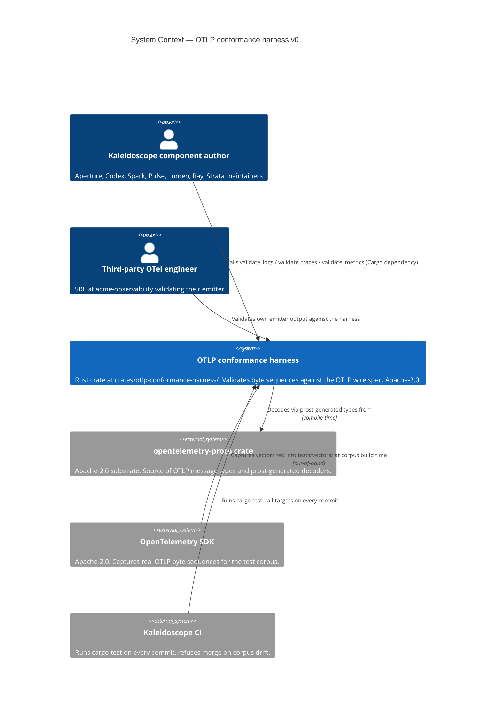
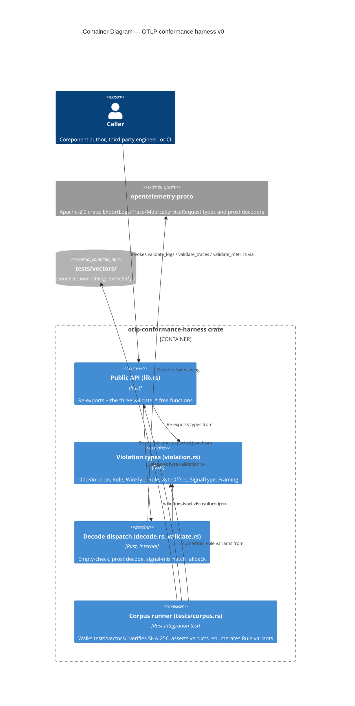
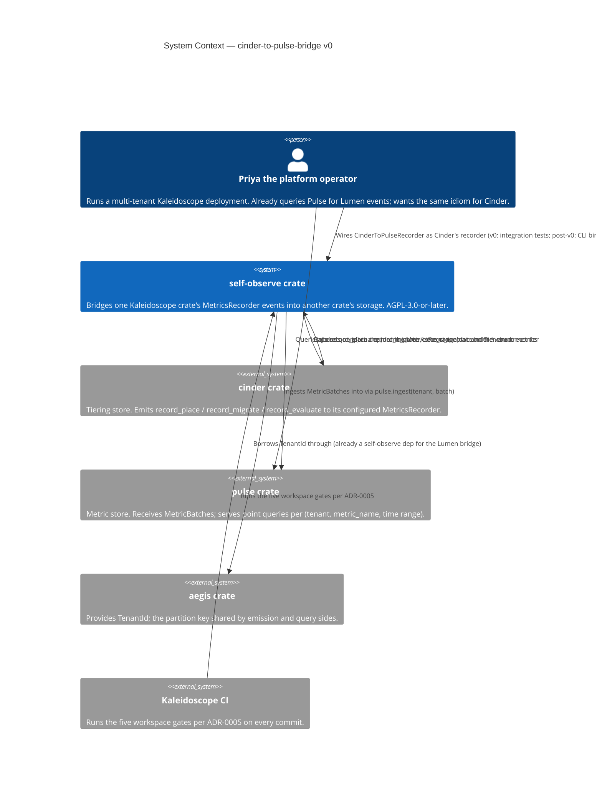
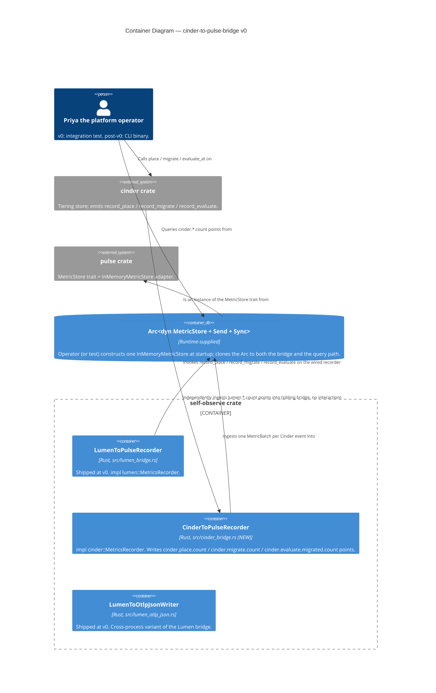
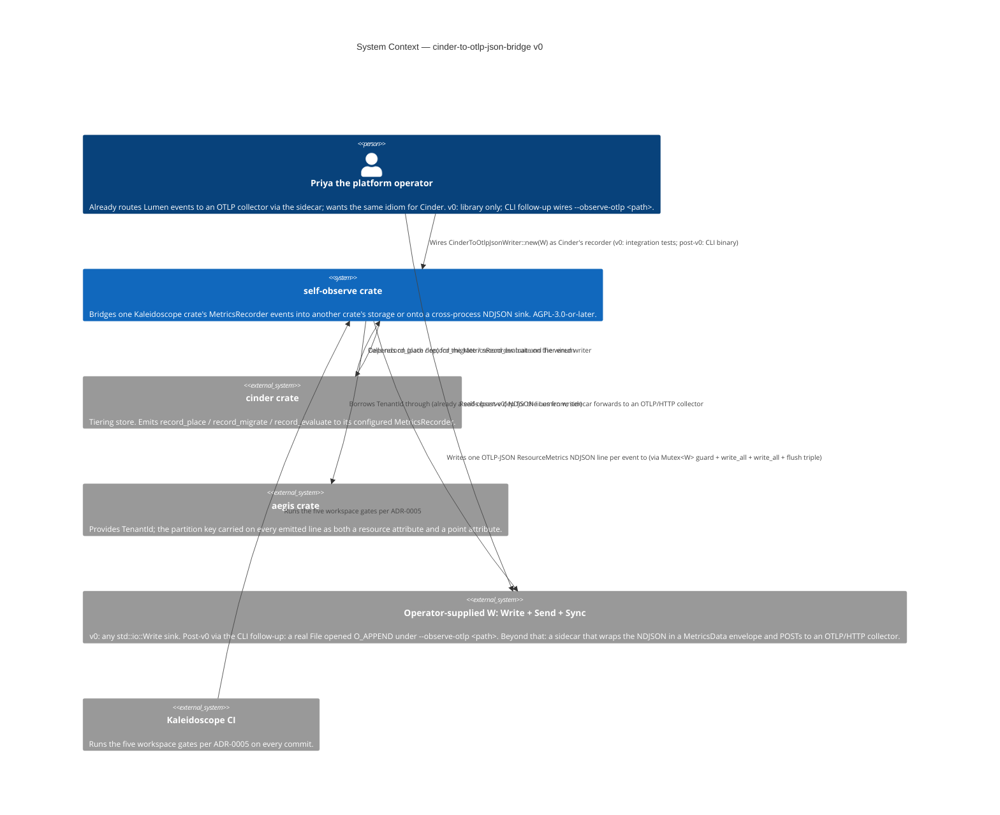
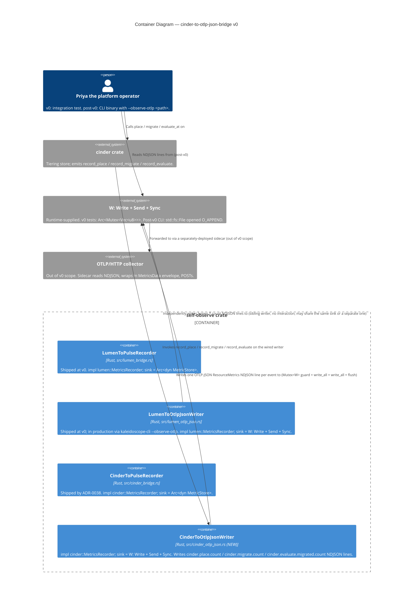
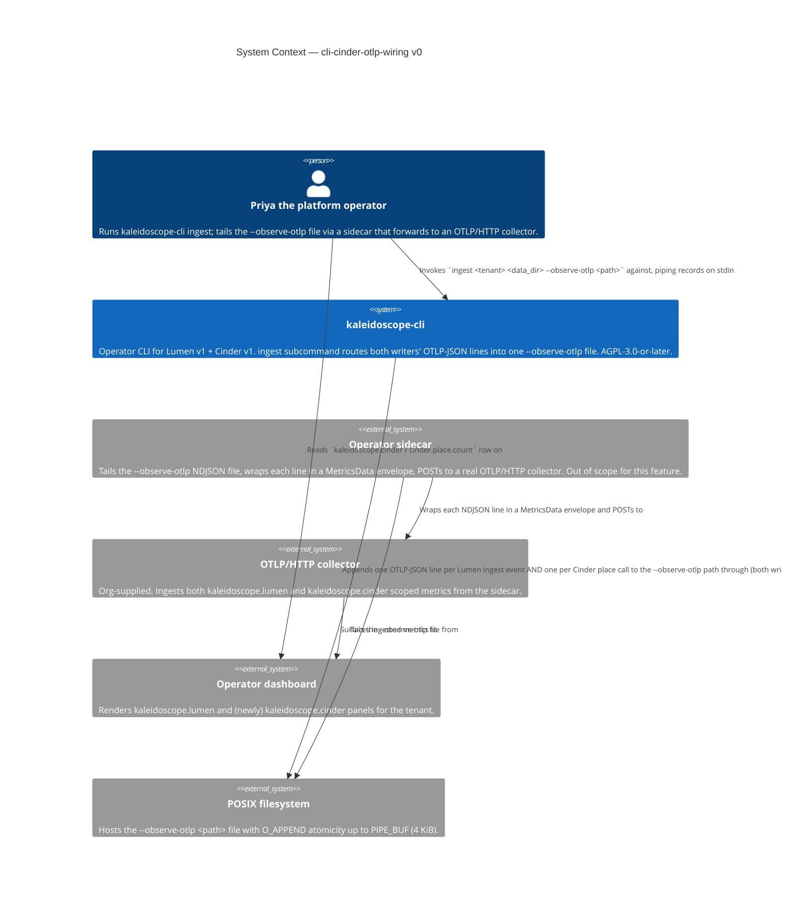
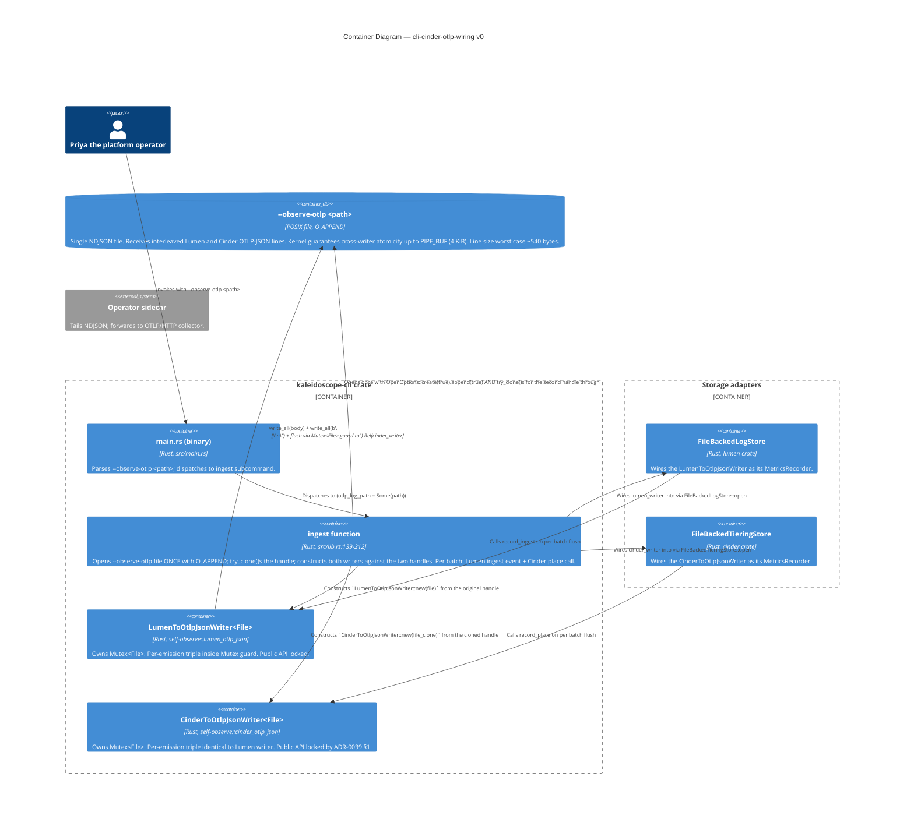
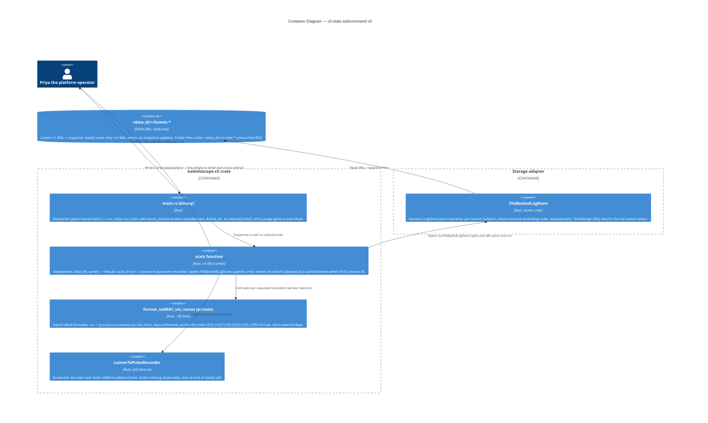
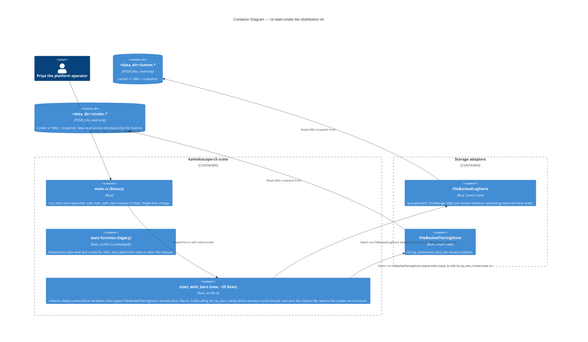

# Kaleidoscope — Architecture Brief

> **Scope**: This brief is bootstrapped by the DESIGN wave for `otlp-conformance-harness-v0`. Platform-level architecture lives in [`../../architecture/kaleidoscope-architecture.md`](../../architecture/kaleidoscope-architecture.md) and is **not duplicated here**. Subsequent feature DESIGN waves append their own application-architecture sections; the platform sections (`## System Architecture`, `## Domain Model`) remain owned by their respective architects (`nw-titan-architect`, `nw-hera-architect`) and are absent for this feature because Andrea has decided not to invoke them for the OTLP conformance harness.

---

## Document Ownership

| Section | Owner agent | Status for `otlp-conformance-harness-v0` |
|---|---|---|
| `## System Architecture` | `nw-titan-architect` | Not invoked — platform-level architecture already documented in `docs/architecture/kaleidoscope-architecture.md` and is reused as-is. |
| `## Domain Model` | `nw-hera-architect` | Not invoked — the harness's domain model is the OTLP wire spec, owned upstream by OpenTelemetry. The harness does not introduce new domain concepts. |
| `## Application Architecture` | `nw-solution-architect` (Morgan) | **This document, this section.** |

---

## Application Architecture

> **Author**: `nw-solution-architect` (Morgan), DESIGN wave, 2026-05-03.
> **Feature**: `otlp-conformance-harness-v0` — a Rust crate at `crates/otlp-conformance-harness/` that validates byte sequences against the OpenTelemetry OTLP wire specification. Phase-0 leaf dependency. Consumed by every later Kaleidoscope component (Aperture, Codex, Spark, Pulse, Lumen, Ray, Strata) and by third-party OTel implementers. Released under Apache-2.0 per the SDK / protocol-library class in `LICENSING.md`.

### Mode of operation

This DESIGN wave executed in **propose mode** (Decision 1 of `/nw-design`). Two-to-three options were enumerated for each load-bearing decision below; one option per decision is recommended with a rationale traceable to the user stories, the outcome KPIs, and the platform-level architecture.

### Reuse of platform-level decisions (not re-derived)

The following are **inherited** from `docs/architecture/kaleidoscope-architecture.md` and `docs/roadmap/kaleidoscope-implementation-roadmap.md`. The application architecture builds on them and does not re-litigate them.

1. **Licence**: per-crate per `LICENSING.md`. Platform components are AGPL-3.0-or-later; SDKs and protocol libraries (including this harness) are Apache-2.0. Migration from CC0-1.0 took place on 2026-05-05; brief commits before the migration date were authored under the CC0 framing of the time.
2. **Substrate locked at the Apache Foundation level**: `opentelemetry-proto` (Apache-2.0) is on the substrate boundary. Per the architecture document's stratum diagram, Apache-Foundation-stewarded projects are exempt from port-and-adapter discipline — this is why the harness embeds the upstream types directly rather than wrapping them.
3. **No telemetry from telemetry**: roadmap section A.2 forbids the harness from emitting any output of its own (stdout, stderr, logging facade). Harness-internal observation is delivered only through the `Result` return value.
4. **Library, not service**: DISCUSS D1 fixed the harness as a Rust crate consumed via Cargo, with no UI, no network surface, no listening ports, no daemon.
5. **Spec version**: pinned via `[package.metadata.kaleidoscope.otlp]` and re-exported as `pub const OTLP_SPEC_VERSION` (per `shared-artifacts-registry.md > otlp_spec_version`).

### Paradigm

**Rust idiomatic data-plus-functions style with `trait`s only where polymorphism is genuinely needed.** No class hierarchies (Rust has none); no `dyn Trait` indirection where direct generic monomorphisation suffices; composition over inheritance throughout. The harness exposes three free functions and a small set of `pub` data types (one error struct, three enums). This is the natural shape of the problem and matches the Rust ecosystem's conventions for validation-and-decode libraries (`serde_json`, `prost`, `regex` all expose this shape).

There is no `crates/otlp-conformance-harness/CLAUDE.md` declaration today because the file does not yet exist (greenfield repository, no Rust code yet). **Recommendation to Andrea**: when convenient, add a CLAUDE.md to the crate root with a single-line paradigm declaration so the DELIVER wave's `nw-software-crafter` agent invocation is unambiguous. The text should be:

```text
# Paradigm
This crate is written in idiomatic Rust: data + free functions + traits only where polymorphism is genuinely required. No class-style inheritance hierarchies. Composition over inheritance.
```

This is **not** a DESIGN-wave artefact — it is a project-level note. The DESIGN wave records the paradigm choice here so the DISTILL and DELIVER waves can read it without ambiguity.

### Crate layout (recommended option, see ADR-0001)

```
crates/
└── otlp-conformance-harness/
    ├── Cargo.toml
    ├── README.md
    ├── src/
    │   ├── lib.rs                # public surface: re-exports, pub fn validate_*
    │   ├── framing.rs            # pub enum Framing
    │   ├── signal.rs             # pub enum SignalType
    │   ├── violation.rs          # pub struct OtlpViolation, pub enum Rule, pub enum WireTypeRule, pub enum ByteOffset
    │   ├── decode.rs             # internal: decode dispatch (logs/traces/metrics) + signal-mismatch fallback
    │   └── validate.rs           # internal: the three validate_* implementations; lib.rs delegates here
    └── tests/
        ├── slice_01_empty_rejected.rs
        ├── slice_02_malformed_protobuf_rejected.rs
        ├── slice_03_signal_mismatch_rejected.rs
        ├── slice_04_logs_accepted.rs
        ├── slice_05_traces_accepted.rs
        ├── slice_06_metrics_accepted.rs
        ├── corpus.rs             # the slice-07 corpus runner
        └── vectors/
            ├── logs/
            │   ├── accept/{minimal.bin, minimal.expected.json}
            │   └── reject/{empty.bin, empty.expected.json, truncated.bin, truncated.expected.json,
            │                bad_varint.bin, bad_varint.expected.json,
            │                bad_tag.bin, bad_tag.expected.json,
            │                traces_misrouted.bin, traces_misrouted.expected.json,
            │                metrics_misrouted.bin, metrics_misrouted.expected.json}
            ├── traces/
            │   ├── accept/{minimal.bin, minimal.expected.json}
            │   └── reject/{empty.bin, empty.expected.json,
            │                logs_misrouted.bin, logs_misrouted.expected.json,
            │                metrics_misrouted.bin, metrics_misrouted.expected.json}
            └── metrics/
                ├── accept/{minimal.bin, minimal.expected.json}
                └── reject/{empty.bin, empty.expected.json,
                             logs_misrouted.bin, logs_misrouted.expected.json,
                             traces_misrouted.bin, traces_misrouted.expected.json}
```

The crate is split into modules from day one, but `lib.rs` is the only public surface — internal modules are crate-private (`pub(crate)`) and re-exports name only the items the public contract requires.

### Public surface — locked by US-06 AC 5

The three function signatures below are **constraints, not options** (US-06 AC 5, line 583 of `user-stories.md`):

```rust
pub fn validate_logs(
    bytes: &[u8],
    framing: Framing,
) -> Result<opentelemetry_proto::tonic::collector::logs::v1::ExportLogsServiceRequest, OtlpViolation>;

pub fn validate_traces(
    bytes: &[u8],
    framing: Framing,
) -> Result<opentelemetry_proto::tonic::collector::trace::v1::ExportTraceServiceRequest, OtlpViolation>;

pub fn validate_metrics(
    bytes: &[u8],
    framing: Framing,
) -> Result<opentelemetry_proto::tonic::collector::metrics::v1::ExportMetricsServiceRequest, OtlpViolation>;
```

Plus the public types named by the user stories:

```rust
pub enum Framing { /* HttpProtobuf, GrpcProtobuf */ }            // #[non_exhaustive]
pub enum SignalType { Logs, Traces, Metrics }                    // #[non_exhaustive]
pub struct OtlpViolation { /* see ADR-0002 for fields */ }
pub enum Rule { EmptyInput, WireType(WireTypeRule), /* future */ } // #[non_exhaustive]
pub enum WireTypeRule {                                            // #[non_exhaustive]
    ProtobufDecode,
    SignalMismatch { observed: SignalType, asserted: SignalType },
}
pub enum ByteOffset { Known(usize), Unknown }                      // #[non_exhaustive]
pub const OTLP_SPEC_VERSION: &str;
```

The crate **does not** wrap, rename, or shadow any `opentelemetry_proto::*` type (US-04 AC 2). The crate **does not** re-export `opentelemetry_proto` or any of its modules — consumers must declare their own dependency, ensuring the dependency edge is visible in their `Cargo.toml`.

### Recommendations summary (for fast skim)

| Decision | Recommended option | ADR |
|---|---|---|
| Public API surface and crate layout | Free functions in `lib.rs`, internal modules from day one, no `Validator` struct | [ADR-0001](adr-0001-public-api-surface-and-crate-layout.md) |
| `OtlpViolation` error-type design | Nested `Rule::WireType(WireTypeRule)` enum, `#[non_exhaustive]` everywhere, `std::error::Error` impl with single-line `Display`, `prost::DecodeError` wrapped via `source()` | [ADR-0002](adr-0002-otlp-violation-error-type-design.md) |
| `opentelemetry-proto` pinning policy | Caret pin to a single minor version, version recorded in spec-version metadata, vendoring deferred to v1 if drift becomes painful | [ADR-0003](adr-0003-opentelemetry-proto-pinning-policy.md) |
| Conformance-test-vector layout | Per-signal then per-verdict hierarchy (`{logs,traces,metrics}/{accept,reject}/`), sibling `.expected.json`, SHA-256 hex content hash, runner walks recursively | [ADR-0004](adr-0004-conformance-test-vector-layout.md) |
| CI contract | Five gates: `cargo test --all-targets`, `cargo deny check`, `cargo public-api`, `cargo semver-checks`, `cargo mutants`. Mechanism (workflow runner) deferred to DEVOPS. | [ADR-0005](adr-0005-ci-contract.md) |

Architectural-rule enforcement (Principle 11): a workspace-level lint package and `cargo deny` configuration enforce the rules above. See ADR-0005.

### Quality attributes addressed (ISO 25010)

| Attribute | How the architecture addresses it |
|---|---|
| **Functional Suitability — Correctness** | The closed-rule discipline (US System Constraint 3) and the corpus runner (US-07) make every named verdict observable and regression-defended. |
| **Performance Efficiency** | Validation is synchronous, allocation is the upstream `prost` decoder's (one decoded message per call), no I/O. The signal-mismatch fallback (US-03) costs at most two extra decode attempts on the failure path; KPI 7 tracks this without a v0 SLA. |
| **Compatibility — Interoperability** | The accept-path return type is the upstream `opentelemetry_proto::tonic::collector::*::v1::Export*ServiceRequest` exactly, so downstream consumers (Aperture, Sluice, every storage engine) feed the value through with zero conversion. |
| **Reliability — Maturity** | The harness has no internal state, no I/O, no panics on user input (US System Constraint 5). The only panic-able surface is invariants in the harness's own enum dispatch, which mutation testing exercises. |
| **Security — Integrity** | `EmptyInput` and `ProtobufDecode` shield downstream from confused-deputy errors (e.g. acting on a half-decoded record). `SignalMismatch` shields the storage layer from cross-signal pollution. |
| **Maintainability — Modularity, Testability** | The crate is single-purpose; modules are split by concept (framing, signal, violation, decode, validate). Every public function has at least one corpus vector defending it. |
| **Maintainability — Modifiability** | `#[non_exhaustive]` on every public enum makes additive evolution non-breaking. New rules and new framings ship in minor versions. Consumers that want exhaustive matching opt in via `#[deny(non_exhaustive_omitted_patterns)]`. |
| **Portability** | Pure Rust, no platform-specific code, no `unsafe`. Builds on every platform Rust targets. |

ATAM sensitivity points: (i) the `prost::DecodeError`-to-`ByteOffset` mapping (degrades KPI 6 if mapping is poor), (ii) `opentelemetry-proto` semver behaviour at MINOR bumps (degrades KPI 1 if upstream silently changes accept-path semantics). Both addressed in ADR-0003.

ATAM trade-off points: nesting `Rule::WireType(WireTypeRule)` (verbose pattern matching for the closed-rule consumer ↔ extensibility room for v0.1 rules without rule-namespace pollution). Addressed in ADR-0002.

### Earned Trust (Principle 12)

The harness is an in-process pure function; it does not depend on the filesystem, time, the kernel, or any vendor SDK at runtime. The only dependency-on-the-world it has is **`opentelemetry-proto` actually decoding the way its documentation says it does at the version pinned**. This is probed at construction time of the corpus runner (slice-07), which on every CI run:

1. Decodes every accept vector and asserts `Ok(_)`.
2. Decodes every reject vector and asserts the declared rule.
3. Re-checks every vector's SHA-256 against its descriptor before invoking the harness (catches corpus mutation).
4. Enumerates the `Rule` variants and refuses to run if any variant has zero defending reject vectors.

The corpus runner itself **is** the probe contract. There is no separate `probe()` method because the harness has no ports — it is a substrate-level pure function. The structural-check layer (Principle 12c) is therefore the public-API check (`cargo public-api`) which catches signature drift at compile time, and the behavioural-check layer is the corpus runner. The subtype-check layer is degenerate (no traits to check). The three Earned-Trust layers reduce to two for a pure-function leaf, which is the minimum the principle permits.

For environments-known-to-lie: the `opentelemetry-proto` crate uses `prost`, which has well-documented behaviour for malformed input. The corpus's reject vectors (`bad_varint.bin`, `bad_tag.bin`, `truncated.bin`) **are** the catalogued substrate lies — bytes that look reasonable but that `prost` must refuse, asserted to fail with the harness's `ProtobufDecode` rule. KPI 6 (one reject vector per rule) is the structural enforcement.

### External integrations

**None at runtime.** The harness has no external network surface, no third-party API consumption, no webhooks, no OAuth providers. The only external dependency is the `opentelemetry-proto` Cargo crate at build time, which is on the substrate boundary and is pinned per ADR-0003.

No contract tests are required for the v0 release. (If a future v1 introduces an external corpus mirror, contract testing recommendations would re-enter the picture.)

### Conway's Law check

This is a **single-author crate** built by a single AI agent (the DELIVER wave's `nw-software-crafter`). The architecture's modular split is for *readability and audit*, not for parallel team development. Conway's Law is satisfied trivially: one author, one module graph.

---

## C4 — System Context (Level 1)



The harness sits as a single in-process box. OTLP byte sequences flow in (as `&[u8]`); `Result<RecordType, OtlpViolation>` flows out. There is no network, no daemon, no external API.

---

## C4 — Container View (Level 2)



The five "containers" inside the crate are not deployment units — they are conceptual modules, each a single Rust source file. The container view is shown because the architecture skill mandates L1+L2 minimum even for small systems.

---

## C4 — Component View (Level 3)

**Not produced.** The decode pipeline is three steps in sequence (empty check → prost decode → signal-mismatch fallback). Three steps do not warrant a separate diagram; the second-level Container diagram already captures the dispatch. Per the SA principle ("Component (L3) only for complex subsystems"), L3 is **explicitly skipped** for v0.

If a future v0.1 adds (for example) richer locus reporting that introduces a custom byte-offset tracker shared across decode strategies, an L3 diagram would be appropriate at that point.

---

## Open questions / hand-offs

- **Workspace topology**: this is the first Rust crate in the Kaleidoscope repository. The DEVOPS wave (`platform-architect`) decides whether `Cargo.toml` at the repo root sets up a workspace today (recommended: yes, with `members = ["crates/otlp-conformance-harness"]`), so future Phase-0 crates (Codex, Spark) can be added without restructuring. Not a DESIGN-wave decision; flagged here.
- **Workspace-level `cargo metadata` `opentelemetry-proto` consistency check**: deferred to a future story; `shared-artifacts-registry.md > otlp_wire_format` flags the requirement. The harness is the only consumer in v0 so the check is a no-op.
- **CLAUDE.md paradigm declaration at the crate root**: recommended to Andrea (see "Paradigm" above). Not blocking the DELIVER wave; the paradigm is documented here.

---

## Handoff to DISTILL

Recipient: `nw-acceptance-designer`. The acceptance designer turns the BDD scenarios in `discuss/user-stories.md` and `discuss/journey-validate-otlp-bytes.yaml` into executable Cargo tests against the public surface defined above. No new requirements are introduced by DESIGN; the DESIGN-wave output crystallises *how* the v0 contract is shaped without changing *what* the contract is.

Required reading order for DISTILL:

1. This brief (`docs/product/architecture/brief.md`) for the recommended public surface and the layout.
2. The five ADRs (`docs/product/architecture/adr-000{1..5}-*.md`) for the decision rationale.
3. The `wave-decisions.md` summary in the feature directory for the DESIGN-wave decision log.
4. The DISCUSS artefacts (locked, do not modify).

## Handoff to DEVOPS

Recipient: `nw-platform-architect`. Receives:

- `docs/feature/otlp-conformance-harness-v0/discuss/outcome-kpis.md` — the seven KPIs with measurement plans.
- ADR-0005's CI contract — the five required gates and their exit conditions.
- The `cargo deny` configuration recommendation in ADR-0003.
- No external integrations exist; no contract-test recommendations apply for v0.

The platform architect chooses the workflow runner (GitHub Actions, Gitea Actions, Forgejo Actions, Drone, etc.) and writes the runner-specific YAML. The contract gates listed in ADR-0005 are runner-agnostic and must all pass on every commit affecting `crates/otlp-conformance-harness/**`.

---

## Application Architecture — cinder-to-pulse-bridge-v0

> **Author**: `nw-solution-architect` (Morgan), DESIGN wave, 2026-05-18.
> **Feature**: `cinder-to-pulse-bridge-v0` — adds `CinderToPulseRecorder` to the `self-observe` crate. The bridge implements `cinder::MetricsRecorder` and writes each Cinder tier event as a single-point Pulse `MetricBatch`. Library-only at v0; the operator-visible CLI surface is a separate follow-up feature. AGPL-3.0-or-later, matching the rest of the workspace.
> **Mode of operation**: PROPOSE — two-to-three options enumerated for each load-bearing decision (test seam, file location, public-surface shape, ADR scope); one option recommended per decision with traceable rationale. See the feature-side `design/wave-decisions.md` and `design/application-architecture.md` for the full propose-mode walkthrough; ADR-0038 for the formal record.

### Reuse of platform-level decisions (not re-derived)

The following are **inherited** from prior DESIGN waves and from `docs/architecture/kaleidoscope-architecture.md`:

1. **Licence**: AGPL-3.0-or-later for the `self-observe` crate; matches the rest of the workspace.
2. **Paradigm**: Rust idiomatic per `CLAUDE.md` — data + free functions + traits only where polymorphism is genuinely needed. The bridge holds `Arc<dyn MetricStore + Send + Sync>` because the store is runtime-supplied and the trait-object indirection is the right shape for the boundary (exactly as `LumenToPulseRecorder` already does — `crates/self-observe/src/lumen_bridge.rs:42-50`). No class hierarchies; no inheritance; no `dyn Trait` where direct generic monomorphisation would suffice.
3. **CI contract**: inherits ADR-0005's five workspace gates (`cargo test --workspace`, `cargo deny check`, `cargo public-api`, `cargo semver-checks`, `cargo mutants` at 100% kill rate). No new gate is added; no existing gate is amended.
4. **Mutation testing scope**: per `CLAUDE.md`, per-feature, scoped to the modified files (`crates/self-observe/src/cinder_bridge.rs`). 100% kill rate per ADR-0005 Gate 5.

### Reuse Analysis (RCA F-1 hard gate)

| Existing component | Path | Decision |
|--------------------|------|----------|
| `LumenToPulseRecorder` | `crates/self-observe/src/lumen_bridge.rs` | **REUSE THE SHAPE** (not the type). Traits in different crates cannot unify under one generic; the bridge clones the precedent's shape byte-equivalently for the public surface. |
| `pulse::InMemoryMetricStore` | `crates/pulse/src/store.rs:89-212` | **REUSE** as the acceptance-test assertion target. |
| `cinder::InMemoryTieringStore` | `crates/cinder/src/store.rs:89-233` | **REUSE** as the acceptance-test driver — the realistic operator wiring that lets the dual-emission contract (DISCUSS D3) be expressed naturally in one test. |
| `cinder::CapturingRecorder` | `crates/cinder/src/metrics.rs:57-110` | **REJECTED** as an additional assertion target — asserts what Cinder intends to emit, which Cinder's own crate already covers; the bridge's contract terminates at Pulse, not at an intermediate. |
| `self-observe` crate itself | `crates/self-observe/` | **REUSE.** The lib.rs comment at lines 44-47 explicitly anticipated `Cinder` bridge addition. Zero new crates. |

### Crate layout (incremental addition)

The bridge is a single new file in the existing `self-observe` crate:

```
crates/self-observe/
├── Cargo.toml                          # gains: cinder = { path = "../cinder", version = "0.1.0" }
│                                       #        [[test]] name = "cinder_to_pulse"
└── src/
    ├── lib.rs                          # gains: mod cinder_bridge; pub use cinder_bridge::CinderToPulseRecorder;
    ├── lumen_bridge.rs                 # unchanged (shipped at v0)
    ├── lumen_otlp_json.rs              # unchanged (shipped at v0)
    └── cinder_bridge.rs                # NEW — CinderToPulseRecorder
└── tests/
    ├── lumen_to_pulse.rs               # unchanged
    ├── lumen_to_otlp_json.rs           # unchanged
    └── cinder_to_pulse.rs              # NEW — acceptance tests, Slice 01/02/03 blocks
```

File-flat layout matches the established sibling pattern (lib.rs:51-52). A future `bridges/` subdirectory refactoring becomes warranted at ~8-10 sibling files (when Sluice / Augur / Ray / Strata bridges and their OTLP-JSON variants ship). See ADR-0038 §4 for the deferral rationale.

### Public surface — locked by ADR-0038

One new public item in the `self-observe` crate:

```rust
pub struct CinderToPulseRecorder {
    pulse: Arc<dyn MetricStore + Send + Sync>,
}

impl CinderToPulseRecorder {
    pub fn new(pulse: Arc<dyn MetricStore + Send + Sync>) -> Self;
}

impl cinder::MetricsRecorder for CinderToPulseRecorder {
    fn record_place(&self, tenant: &TenantId, tier: Tier);
    fn record_migrate(&self, tenant: &TenantId, from: Tier, to: Tier);
    fn record_evaluate(&self, tenant: &TenantId, migrated: usize);
}
```

The struct name, the single field name `pulse`, the constructor name and signature, and the three trait-method dispatches are **byte-equivalent** to `LumenToPulseRecorder` (modulo trait identity). The operator's mental model is one idiom shared across every bridge in `self-observe`: wire an `Arc<dyn MetricStore + Send + Sync>` to `XxxToPulseRecorder::new(...)`.

### Per-event emission contract — locked by ADR-0038 §2

| Cinder method | Metric name | Kind | Unit | Value | Point attributes |
|---------------|-------------|------|------|-------|------------------|
| `record_place(tenant, tier)` | `cinder.place.count` | `Sum` | `"1"` | `1.0` | `{"tier": lowercase(tier)}` |
| `record_migrate(tenant, from, to)` | `cinder.migrate.count` | `Sum` | `"1"` | `1.0` | `{"from": lowercase(from), "to": lowercase(to)}` |
| `record_evaluate(tenant, migrated)` | `cinder.evaluate.migrated.count` | `Sum` | `"1"` | `migrated as f64` | `{}` |

Where `lowercase(Tier::Hot) = "hot"`, `lowercase(Tier::Warm) = "warm"`, `lowercase(Tier::Cold) = "cold"`. Emission is best-effort: `let _ = pulse.ingest(tenant, batch)`. The `pulse::MetricStoreError` is empty at v0 (`crates/pulse/src/store.rs:35`); the explicit discard is forward-compatible for v1+.

### Recommendations summary (for fast skim)

| Decision | Recommended option | ADR |
|----------|--------------------|-----|
| Test seam | Drive Cinder through `InMemoryTieringStore`, assert against `InMemoryMetricStore`. Mirrors the Lumen bridge tests; naturally expresses the dual-emission contract. | [ADR-0038 §3](adr-0038-cinder-to-pulse-bridge-public-api-and-crate-layout.md) |
| Module file location | `crates/self-observe/src/cinder_bridge.rs` (file-flat, sibling to existing bridges). | [ADR-0038 §4](adr-0038-cinder-to-pulse-bridge-public-api-and-crate-layout.md) |
| Public surface shape | Byte-equivalent clone of `LumenToPulseRecorder` for the public surface; internal `emit` helper extended by one `attributes: BTreeMap<String, String>` parameter. | [ADR-0038 §1, §5](adr-0038-cinder-to-pulse-bridge-public-api-and-crate-layout.md) |
| ADR scope | One ADR (matches the Phase-1+ per-crate-public-API convention); cross-bridge test-seam ADR and lowercase-tier ADR deferred until a third bridge exemplar exists. | [ADR-0038 itself](adr-0038-cinder-to-pulse-bridge-public-api-and-crate-layout.md) |

Architectural-rule enforcement (Principle 11): inherits the existing five-gate workspace contract (ADR-0005). No new tooling is required.

### Quality attributes addressed (ISO 25010)

| Attribute | How the architecture addresses it |
|---|---|
| **Functional Suitability — Correctness** | Three trait methods each map to one metric name + one locked attribute schema per ADR-0038 §2. The lowercase-tier helper enforces DISCUSS D4 from one location. The dual-emission contract (D3) is inherited from `InMemoryTieringStore::evaluate_at` and exercised by Slice 03's tests. |
| **Performance Efficiency** | One `BTreeMap<String, String>` allocation per event (≤3 entries). One single-point `MetricBatch` per event. One `Mutex` acquisition inside `InMemoryMetricStore::ingest`. No async, no I/O, no network. |
| **Compatibility — Interoperability** | Consumes `cinder::MetricsRecorder` (upstream port) and produces `pulse::MetricBatch` (upstream type). No wrapping, no shadowing, no renaming. |
| **Reliability — Maturity** | Best-effort emission (D5) prevents a future non-empty `MetricStoreError` from propagating to Cinder (whose trait methods return `()`). The bridge cannot crash Cinder. |
| **Security — Integrity** | `tenant_id` forwarded unchanged from Cinder to Pulse; two-tenant isolation asserted in every slice's tests (defends shared-artifacts-registry HIGH-risk `tenant_id` invariant). |
| **Maintainability — Modularity, Testability** | One file, three trait methods. Acceptance tests per slice plus per-tenant-isolation tests plus no-event-no-point tests. Mutation-testing scope is one file at 100% kill rate (Gate 5). |
| **Maintainability — Modifiability** | Public surface locked by `cargo public-api -p self-observe` (Gate 2) and `cargo semver-checks` (Gate 3); any breaking change requires a major-version bump. |
| **Portability** | Pure Rust, no platform-specific code, no `unsafe`. Inherits the crate's `#![forbid(unsafe_code)]` posture. |

ATAM sensitivity points: (i) the `migrated as f64` cast on `record_evaluate` — exact for any operationally-meaningful count (≤ 2^53), defended by Slice 03; (ii) the lowercase serialisation of `Tier` (D4) — a single helper, asserted by Slice 01's three-tier test.

ATAM trade-off points: best-effort emission (D5) sacrifices error visibility to Cinder for forward compatibility with a future non-empty `MetricStoreError`. The trade is correct because (a) v0 emission cannot fail, (b) v1's loud-failing variant is a separate type (`CinderToPulseRecorderStrict`), not a flag.

### Earned Trust (Principle 12)

The bridge is an in-process function from `(TenantId, event)` to `pulse.ingest(...)`. It depends on the world only through the runtime-supplied `Arc<dyn MetricStore + Send + Sync>` and through `SystemTime::now()` for the `time_unix_nano` field on each emitted `MetricPoint`. No filesystem, no network, no vendor SDK, no subprocess.

The probe contract is the acceptance-test suite at `crates/self-observe/tests/cinder_to_pulse.rs`:

1. **Subtype-check layer**: `cargo public-api -p self-observe` (Gate 2) catches public-surface drift; the compile-time `fn assert_send_sync<T: Send + Sync>(); assert_send_sync::<CinderToPulseRecorder>();` test catches any loss of the `Send + Sync` trait bound.
2. **Behavioural-check layer**: per-slice tests exercise the per-event contract against a real `pulse::InMemoryMetricStore`; the Slice 03 dual-emission test exercises the cross-method contract end-to-end.

The structural layer is degenerate for a no-substrate adapter — there is no on-disk schema to defend against drift beyond the public surface, which the subtype layer already covers. This is the minimum the principle permits, matching the posture ADR-0001's `otlp-conformance-harness` documented for a pure-function leaf.

**Environments-known-to-lie**: none in scope. Acceptance tests use `TimeRange::all()` and assert on count + value + attributes, so clock-skew lies in the runtime environment do not affect test outcomes.

### External integrations

**None at runtime.** No external network surface, no third-party API, no webhooks, no OAuth, no subprocess. Dependencies are in-workspace path dependencies (`aegis`, `cinder`, `pulse`). No contract-test recommendation applies.

### Conway's Law check

Single-author crate addition built by a single AI agent (the DELIVER wave's `nw-software-crafter`). The bridge lives inside the `self-observe` crate, owned by Andrea. File-flat layout is for *readability and audit*, not for parallel team development. Satisfied trivially.

---

## C4 — System Context (Level 1) — `cinder-to-pulse-bridge-v0`



---

## C4 — Container View (Level 2) — `cinder-to-pulse-bridge-v0`



The container view shows three sibling bridges inside `self-observe`, one of which (`CinderToPulseRecorder`) is new. The Pulse store is a single runtime-supplied `Arc` cloned to all bridges and to the query path; the shared-artifacts-registry's `pulse_store` MEDIUM-risk invariant ("operator must wire one Arc, not two instances") is satisfied by this shape.

The acceptance-test seam wires four nodes: test body → Cinder's store → bridge → Pulse store, with the test body also querying the Pulse store. The bridge is the *only* unit-under-test; Cinder and Pulse are infrastructure used to drive and observe it. See `docs/feature/cinder-to-pulse-bridge-v0/design/application-architecture.md > DD1` for the trade-off study.

---

## C4 — Component View (Level 3) — `cinder-to-pulse-bridge-v0`

**Not produced.** The new container (`CinderToPulseRecorder`) is one Rust source file with one struct, one constructor, three trait methods, and two private helpers. Per the SA principle ("Component (L3) only for complex subsystems"), L3 is **explicitly skipped** for v0. If a future v0.1 adds batching, per-tenant rate limiting, or attribute canonicalisation across bridges, L3 would become appropriate at that point.

---

## Handoff to DISTILL — `cinder-to-pulse-bridge-v0`

Recipient: `nw-acceptance-designer`. The acceptance designer translates `discuss/journey-observe-cinder-tier-transitions.feature` and the BDD scenarios in `discuss/user-stories.md` into executable Rust tests under `crates/self-observe/tests/cinder_to_pulse.rs`. No new requirements are introduced by DESIGN; the DESIGN-wave output crystallises *how* the v0 contract is shaped without changing *what* the contract is.

Required reading order for DISTILL:

1. This brief section (the `## Application Architecture — cinder-to-pulse-bridge-v0` block above) for the public surface and the per-event contract.
2. ADR-0038 for the decision rationale and the locked contract details.
3. The feature-side `design/wave-decisions.md` for the DESIGN-wave decision log.
4. The DISCUSS artefacts under `docs/feature/cinder-to-pulse-bridge-v0/discuss/` (locked, do not modify).

## Handoff to DEVOPS — `cinder-to-pulse-bridge-v0`

Recipient: `nw-platform-architect`. Receives:

- `docs/feature/cinder-to-pulse-bridge-v0/discuss/outcome-kpis.md` — the three outcome KPIs (one per slice).
- ADR-0005's CI contract — the five existing gates apply to this feature unchanged.
- The Cargo manifest delta in ADR-0038 §6: one new dependency declaration (`cinder = { path = "../cinder", version = "0.1.0" }`) and one new `[[test]]` block in `crates/self-observe/Cargo.toml`. No workspace-root `Cargo.toml` edit; the `cinder` crate is already a workspace member.
- Mutation-testing scope: per `CLAUDE.md`, scoped to `crates/self-observe/src/cinder_bridge.rs`, run after the DELIVER refactor pass, 100% kill rate per Gate 5.
- **External integrations**: **none**. No contract-test recommendations apply.
- **Development paradigm for DELIVER**: Rust idiomatic per `CLAUDE.md`. The bridge uses `Arc<dyn MetricStore + Send + Sync>` at the runtime-supplied store boundary because the trait-object indirection is the right shape there (per `LumenToPulseRecorder` precedent); elsewhere the crafter prefers direct generic monomorphisation.

---

## Application Architecture — cinder-to-otlp-json-bridge-v0

> **Author**: `nw-solution-architect` (Morgan), DESIGN wave, 2026-05-18.
> **Feature**: `cinder-to-otlp-json-bridge-v0` — adds `CinderToOtlpJsonWriter<W: Write + Send + Sync>` to the `self-observe` crate. The writer implements `cinder::MetricsRecorder` and emits one OTLP-JSON `ResourceMetrics` NDJSON line per Cinder tier event to a generic sink. Library-only at v0; CLI wiring (`--observe-otlp <path>`) is explicitly out of scope (DISCUSS D9) and ships as a follow-up feature, mirroring the Lumen pair already in production (commits `c6b336c`, `3af7e82`). AGPL-3.0-or-later, matching the rest of the workspace.
> **Mode of operation**: PROPOSE — two-to-three options enumerated for each load-bearing decision (module file location, attribute-array shape, test seam, stub posture, ADR scope); one option recommended per decision with traceable rationale. See the feature-side `design/wave-decisions.md` and `design/application-architecture.md` for the full propose-mode walkthrough; ADR-0039 for the formal record.

### Reuse of platform-level decisions (not re-derived)

The following are **inherited** from prior DESIGN waves and from `docs/architecture/kaleidoscope-architecture.md`:

1. **Licence**: AGPL-3.0-or-later for the `self-observe` crate; matches the rest of the workspace.
2. **Paradigm**: Rust idiomatic per `CLAUDE.md` — data + free functions + traits only where polymorphism is genuinely needed. The writer is generic over `W: Write + Send + Sync` because direct generic monomorphisation is the right shape at the sink seam (exactly as `LumenToOtlpJsonWriter` already does — `crates/self-observe/src/lumen_otlp_json.rs:128-140`). No class hierarchies; no inheritance; no `dyn Trait` where direct generic monomorphisation suffices. The only trait-object shape in the writer's surface comes from `cinder::MetricsRecorder`, which is implemented (not consumed) by the writer.
3. **CI contract**: inherits ADR-0005's five workspace gates (`cargo test --workspace`, `cargo deny check`, `cargo public-api`, `cargo semver-checks`, `cargo mutants` at 100% kill rate). No new gate is added; no existing gate is amended.
4. **Mutation testing scope**: per `CLAUDE.md`, per-feature, scoped to the modified files (`crates/self-observe/src/cinder_otlp_json.rs`). 100% kill rate per ADR-0005 Gate 5.
5. **Cross-bridge metric-name contract**: the three metric names (`cinder.place.count`, `cinder.migrate.count`, `cinder.evaluate.migrated.count`) and the lowercase-tier serialisation are **identical** to those locked by ADR-0038 §2 for the in-process Pulse-sink sibling. A code review diffing `cinder_bridge.rs` against `cinder_otlp_json.rs` surfaces any drift; the acceptance tests on both sides assert the strings independently.

### Reuse Analysis (RCA F-1 hard gate)

| Existing component | Path | Decision |
|--------------------|------|----------|
| `LumenToOtlpJsonWriter` | `crates/self-observe/src/lumen_otlp_json.rs` | **REUSE THE SHAPE** (not the type). The OTLP-JSON envelope serde structs are duplicated per DISCUSS D7 (rule-of-three deferral); the `Mutex<W>` + `write_all + write_all + flush` emission triple is replicated 1:1; the `time_unix_nano` derivation and the `tenant_id` resource+point double-emission are replicated 1:1. The struct *types* cannot be unified because Cinder's per-event point-attribute cardinality (1, 2, 3) differs from Lumen's uniform 1 — `OtlpNumberPoint.attributes` is typed `Vec<OtlpAttr<'a>>` here versus `[OtlpAttr<'a>; 1]` in Lumen. |
| `CinderToPulseRecorder` | `crates/self-observe/src/cinder_bridge.rs` | **REUSE THE EVENT-HANDLING SHAPE** (not the type). Same `impl cinder::MetricsRecorder` dispatch, same per-event attribute mapping, same `tier_lowercase` helper duplicated verbatim. The sink type differs (`Arc<dyn MetricStore>` there, `Mutex<W>` here), so the storage layer cannot be unified. |
| `cinder::InMemoryTieringStore` | `crates/cinder/src/store.rs:89-233` | **REUSE** as the acceptance-test driver. Same posture as ADR-0038 §3 / DD1: the dual-emission contract (DISCUSS D8) is naturally expressed only when Cinder's `evaluate_at` cascade runs end-to-end. |
| `cinder::CapturingRecorder` | `crates/cinder/src/metrics.rs:57-110` | **REJECTED** as an additional assertion target — same reason as ADR-0038 §3 Alternative 3: Cinder ships its own in-tree tests against `CapturingRecorder`; using it here duplicates Cinder's coverage without adding writer-specific evidence. The writer's contract terminates at the byte sequence on the `Write` sink. |
| `SharedBuf(Arc<Mutex<Vec<u8>>>)` test substrate | `crates/self-observe/tests/lumen_to_otlp_json.rs:54-64` | **REUSE THE PATTERN, duplicate the code.** The 11-line `SharedBuf` definition and the `collect_lines` helper are copied into `tests/cinder_to_otlp_json.rs`. Rule of three: extraction into a `tests/common.rs` becomes warranted when a third OTLP-JSON-writer test file lands. |
| Production `File` handle wiring | `kaleidoscope-cli/src/lib.rs:139-160` | **OUT OF SCOPE** (DISCUSS D9). The CLI follow-up plumbs the writer behind `--observe-otlp <path>`. v0 of this feature ships only the library; acceptance tests use `SharedBuf`. |
| `self-observe` crate itself | `crates/self-observe/` | **REUSE.** The lib.rs doc comment at lines 44-47 explicitly anticipates the `CinderToOtlpJsonWriter` addition as the fourth quadrant of the `{Source} × {sink}` writer matrix. Zero new crates. |

### Crate layout (incremental addition)

The writer is a single new file in the existing `self-observe` crate:

```
crates/self-observe/
├── Cargo.toml                          # gains: [[test]] name = "cinder_to_otlp_json"
│                                       # (the cinder = { path = "../cinder" } dep was added by the Pulse-sink sibling)
└── src/
    ├── lib.rs                          # gains: mod cinder_otlp_json; pub use cinder_otlp_json::CinderToOtlpJsonWriter;
    ├── lumen_bridge.rs                 # unchanged (shipped at v0)
    ├── lumen_otlp_json.rs              # unchanged (shipped at v0)
    ├── cinder_bridge.rs                # unchanged (shipped by cinder-to-pulse-bridge-v0, ADR-0038)
    └── cinder_otlp_json.rs             # NEW — CinderToOtlpJsonWriter
└── tests/
    ├── lumen_to_pulse.rs               # unchanged
    ├── lumen_to_otlp_json.rs           # unchanged
    ├── cinder_to_pulse.rs              # unchanged
    └── cinder_to_otlp_json.rs          # NEW — acceptance tests, Slice 01/02/03 blocks + Send+Sync probe
```

File-flat layout matches the established sibling pattern. After this feature ships, the crate root holds N=4 sibling writer files, comfortably below the ~8-10 threshold at which a `bridges/` subdirectory refactoring becomes warranted (when Sluice / Augur / Ray / Strata bridges and their OTLP-JSON variants ship). See ADR-0039 §4 (and the identical posture in ADR-0038 §4) for the deferral rationale.

### Public surface — locked by ADR-0039

One new public item in the `self-observe` crate:

```rust
pub struct CinderToOtlpJsonWriter<W: Write + Send + Sync> {
    inner: Mutex<W>,
    scope_name: String,
}

impl<W: Write + Send + Sync> CinderToOtlpJsonWriter<W> {
    pub fn new(inner: W) -> Self;
}

impl<W: Write + Send + Sync> cinder::MetricsRecorder for CinderToOtlpJsonWriter<W> {
    fn record_place(&self, tenant: &TenantId, tier: Tier);
    fn record_migrate(&self, tenant: &TenantId, from: Tier, to: Tier);
    fn record_evaluate(&self, tenant: &TenantId, migrated: usize);
}
```

The struct name, the generic bounds, the two field names (`inner`, `scope_name`) and their types, the constructor name and signature, and the three trait-method dispatches are **byte-equivalent** to `LumenToOtlpJsonWriter` (modulo the trait identity at the impl block). The operator's mental model is one idiom shared across every OTLP-JSON writer in `self-observe`: construct one `XxxToOtlpJsonWriter::new(W)` wrapping the sink and pass it as the upstream crate's recorder.

### Per-event emission contract — locked by ADR-0039 §2

| Cinder method | Metric name | Kind | `asInt` value | Point attributes |
|---------------|-------------|------|---------------|------------------|
| `record_place(tenant, tier)` | `cinder.place.count` | `Sum` (cumulative, monotonic) | `"1"` | `[{tenant_id: tenant.0}, {tier: lowercase(tier)}]` |
| `record_migrate(tenant, from, to)` | `cinder.migrate.count` | `Sum` (cumulative, monotonic) | `"1"` | `[{tenant_id: tenant.0}, {from: lowercase(from)}, {to: lowercase(to)}]` |
| `record_evaluate(tenant, migrated)` | `cinder.evaluate.migrated.count` | `Sum` (cumulative, monotonic) | `migrated.to_string()` | `[{tenant_id: tenant.0}]` |

Where `lowercase(Tier::Hot) = "hot"`, `lowercase(Tier::Warm) = "warm"`, `lowercase(Tier::Cold) = "cold"`. Each event becomes exactly one NDJSON line. The line is one `OtlpResourceMetrics` encoded as JSON: one resource attribute (`tenant_id`), one scope (`kaleidoscope.cinder`), one metric (per the table), one `OtlpSum` with `aggregationTemporality=2` (cumulative) and `isMonotonic=true`, one `OtlpNumberPoint`. All `asInt` values are JSON strings (per the OTLP-JSON encoding rule for `uint64`). Emission is best-effort: `let _ = writer.write_all(line.as_bytes()); let _ = writer.write_all(b"\n"); let _ = writer.flush();` inside the `Mutex<W>` guard's critical section.

### Recommendations summary (for fast skim)

| Decision | Recommended option | ADR |
|----------|--------------------|-----|
| Module file location | `crates/self-observe/src/cinder_otlp_json.rs` (file-flat, sibling to existing writers). | [ADR-0039 §4](adr-0039-cinder-to-otlp-json-bridge-public-api-and-crate-layout.md) |
| Attribute-array shape | One `OtlpNumberPoint` struct with `attributes: Vec<OtlpAttr<'a>>` (Cinder's per-event cardinality differs from Lumen's uniform 1); envelope-level `[T; 1]` arrays preserved. | [ADR-0039 §2, §5](adr-0039-cinder-to-otlp-json-bridge-public-api-and-crate-layout.md) |
| Test seam | Drive Cinder through `InMemoryTieringStore`; capture via `SharedBuf(Arc<Mutex<Vec<u8>>>)`; parse and assert as `serde_json::Value`. Mirrors the Lumen OTLP-JSON tests verbatim. | [ADR-0039 §3](adr-0039-cinder-to-otlp-json-bridge-public-api-and-crate-layout.md) |
| Stub posture (Slice 01) | Empty no-op `{}` for the two un-implemented methods; Slice 02 and Slice 03 RED tests are the loudness mechanism. | feature-side `design/wave-decisions.md > DD4` |
| Public surface shape | Byte-equivalent clone of `LumenToOtlpJsonWriter` for every part that can be byte-equivalent; the only structural divergence is `OtlpNumberPoint.attributes: Vec<OtlpAttr<'a>>` (forced by Cinder's per-event attribute cardinality). | [ADR-0039 §1, §5](adr-0039-cinder-to-otlp-json-bridge-public-api-and-crate-layout.md) |
| ADR scope | One ADR (ADR-0039); matches the Phase-1+ per-crate-public-API convention chain (ADR-0011/0018/0022/0026/0033/0038); cross-bridge serde-struct duplication ADR deferred until a third OTLP-JSON writer exemplar exists. | [ADR-0039 itself](adr-0039-cinder-to-otlp-json-bridge-public-api-and-crate-layout.md) |

Architectural-rule enforcement (Principle 11): inherits the existing five-gate workspace contract (ADR-0005). No new tooling is required.

### Quality attributes addressed (ISO 25010)

| Attribute | How the architecture addresses it |
|---|---|
| **Functional Suitability — Correctness** | Three trait methods each map to one locked metric name + one locked attribute schema per ADR-0039 §2. The `tier_lowercase` helper enforces DISCUSS D3 from one source location. The dual-emission contract (D8) is inherited from `InMemoryTieringStore::evaluate_at` and exercised by Slice 03's tests. The cross-bridge metric-name parity (D1, cross-locked to ADR-0038 §2) is auditable by `diff`. |
| **Performance Efficiency** | One small `Vec<OtlpAttr>` allocation per event (≤3 entries, smallest allocator size class). One `serde_json::to_string` call (linear in line size). One `Mutex<W>` acquisition. One to three `write_all` calls inside the critical section. No async, no I/O beyond `W`'s semantics, no network. Cost basis matches the existing `CinderToPulseRecorder` per-event cost (`BTreeMap<String, String>` allocation). |
| **Compatibility — Interoperability** | Consumes `cinder::MetricsRecorder` (upstream port) and produces OTLP-JSON `ResourceMetrics` NDJSON lines (downstream wire protocol per the OpenTelemetry specification). Generic `W: Write + Send + Sync` is the technology-neutral seam at the sink side. |
| **Reliability — Maturity** | Best-effort emission (D5) prevents serialisation, write, and mutex-poisoning failures from propagating to Cinder (whose trait methods return `()`). The writer cannot crash Cinder. NDJSON validity (D6) is defended by the `Mutex<W>` + `write_all + write_all + flush` triple inside the critical section; identical pattern to the Lumen OTLP-JSON writer already exercised in production (commits `c6b336c`, `3af7e82`). |
| **Security — Integrity** | `tenant_id` forwarded unchanged from Cinder's call to the OTLP-JSON output (D3 / shared-artifacts-registry HIGH-risk `tenant_id` invariant). Two-tenant isolation asserted in every slice's tests, defending against silent transforms (trim, case-fold, intern). Tier lowercasing locked to one helper. |
| **Maintainability — Modularity, Testability** | One file, three trait method bodies + one `emit` helper + one `tier_lowercase` helper. Acceptance tests per slice plus per-tenant-isolation tests plus NDJSON-validity tests plus dual-emission tests. Mutation-testing scope is one file at 100% kill rate (Gate 5). |
| **Maintainability — Modifiability** | Public surface locked by `cargo public-api -p self-observe` (Gate 2) and `cargo semver-checks` (Gate 3); breaking changes require a major-version bump. The `attributes: Vec<OtlpAttr<'a>>` choice (DD2) makes adding a fourth attribute to any event a one-line change in the calling `record_*` method. |
| **Portability** | Pure Rust, no platform-specific code, no `unsafe`. Inherits the crate's `#![forbid(unsafe_code)]` posture. |

ATAM sensitivity points: (i) the `migrated.to_string()` rendering on `record_evaluate` — exact for any `usize` (OTLP-JSON encodes `uint64` as a string with no precision loss), defended by Slice 03; (ii) the lowercase serialisation of `Tier` (D3) — one helper, asserted by Slice 01's three-tier test; (iii) the NDJSON-validity invariant (D6, OK5) — defended by the Slice 01 "buffer ends with `\n` and exactly one line per event" assertion.

ATAM trade-off points: (i) best-effort emission (D5) sacrifices error visibility to Cinder for forward compatibility with future non-empty error conditions (same trade as ADR-0038); (ii) test seam choice (DD3) entangles writer tests with Cinder behaviour, accepted because the dual-emission contract requires it and consistency across the four writer test files dominates the entanglement risk; (iii) cross-bridge serde-struct duplication (D7) sacrifices DRY for the rule of three — the extraction trigger is the third OTLP-JSON writer sibling.

### Earned Trust (Principle 12)

The writer is an in-process function from `(TenantId, event)` to bytes on a generic `W: Write + Send + Sync`. It depends on the world only through the runtime-supplied `W`, through `SystemTime::now()` for the `timeUnixNano` field, through `serde_json::to_string` for the encoding, and through `Mutex<W>::lock` for the atomicity guard. No external network surface, no third-party API, no vendor SDK, no subprocess.

The probe contract is the acceptance-test suite at `crates/self-observe/tests/cinder_to_otlp_json.rs`:

1. **Subtype-check layer**: `cargo public-api -p self-observe` (Gate 2) catches public-surface drift; the compile-time `fn assert_send_sync<T: Send + Sync>(); assert_send_sync::<CinderToOtlpJsonWriter<Vec<u8>>>();` test catches any loss of the `Send + Sync` trait bound; the `impl cinder::MetricsRecorder for CinderToOtlpJsonWriter<W>` block is subtype-checked against `cinder::MetricsRecorder`.
2. **Behavioural-check layer**: per-slice tests exercise the per-event contract against a `SharedBuf` byte sink; captured bytes are parsed as `serde_json::Value` and the assertions terminate against the parsed JSON tree. The Slice 03 dual-emission test exercises the cross-method contract end-to-end. The Slice 01 NDJSON-line-termination test is the substrate-lie probe for the `Mutex<W>` + `write_all + write_all + flush` triple.

The structural layer is degenerate for a no-substrate adapter — no on-disk schema to defend against drift beyond the public surface, which the subtype layer covers. Same minimum posture as ADR-0001's `otlp-conformance-harness` and ADR-0038's `CinderToPulseRecorder`.

**Environments-known-to-lie**: none in scope at v0. The substrate the writer is exercised against in v0 acceptance tests is `Arc<Mutex<Vec<u8>>>` (in-memory, no filesystem semantics). The real `File` substrate (with its `O_APPEND` atomicity guarantees on POSIX) is the CLI follow-up feature's concern; the Lumen OTLP-JSON writer's identical `Mutex<W>` pattern has already been validated against a real `File` in production (commits `c6b336c`, `3af7e82`), and the Cinder writer inherits that substrate confidence.

### External integrations

**None at runtime.** No external network surface, no third-party API, no webhooks, no OAuth, no subprocess. Dependencies are in-workspace path dependencies (`aegis`, `cinder`, `serde`, `serde_json`). No contract-test recommendation applies.

The downstream OTLP/HTTP collector that the operator's sidecar will eventually forward to IS an external integration, but it is at the operator's deployment boundary, not at this library's boundary. Contract testing for the collector belongs to the operator's deployment topology, not to the library — and the wire-shape acceptability has already been validated by the Lumen OTLP-JSON writer's production deployment (commit `c6b336c`).

### Conway's Law check

Single-author crate addition built by a single AI agent (the DELIVER wave's `nw-software-crafter`). The writer lives inside the `self-observe` crate, owned by Andrea. File-flat layout is for *readability and audit*, not for parallel team development. Satisfied trivially. Same posture as ADR-0038.

---

## C4 — System Context (Level 1) — `cinder-to-otlp-json-bridge-v0`



---

## C4 — Container View (Level 2) — `cinder-to-otlp-json-bridge-v0`



The container view shows four sibling writers inside `self-observe`, one of which (`CinderToOtlpJsonWriter`) is new. The two `*ToOtlpJsonWriter` writers may share a single sink or use separate sinks — the choice belongs to the operator's deployment topology, not to the library; the per-line scope name (`kaleidoscope.lumen` vs `kaleidoscope.cinder`) keeps the streams distinguishable downstream.

The acceptance-test seam wires four nodes: test body → Cinder's store → writer → `SharedBuf` sink, with the test body also reading the sink's bytes and parsing them as `serde_json::Value`. The writer is the *only* unit-under-test; Cinder and `SharedBuf` are infrastructure used to drive and observe it. See `docs/feature/cinder-to-otlp-json-bridge-v0/design/application-architecture.md > DD3` for the trade-off study.

---

## C4 — Component View (Level 3) — `cinder-to-otlp-json-bridge-v0`

**Not produced.** The new container (`CinderToOtlpJsonWriter`) is one Rust source file with nine duplicated serde structs (DISCUSS D7), one writer struct, one constructor, one `emit` helper, three trait methods, and one `tier_lowercase` helper. Per the SA principle ("Component (L3) only for complex subsystems"), L3 is **explicitly skipped** for v0. Reification conditions: L3 would become appropriate if (a) the writer grew batching or buffering across calls, (b) a per-tenant rate limiter were introduced, (c) attribute canonicalisation were extracted into a cross-writer shared module (which is also the rule-of-three trigger for the serde-struct extraction), or (d) the OTLP-JSON envelope gained a non-`Sum` metric kind (`Gauge`, `Histogram`). None of these apply at v0.

---

## Handoff to DISTILL — `cinder-to-otlp-json-bridge-v0`

Recipient: `nw-acceptance-designer`. The acceptance designer translates `discuss/journey-observe-cinder-via-otlp-json.feature` and the BDD scenarios in `discuss/user-stories.md` into executable Rust tests under `crates/self-observe/tests/cinder_to_otlp_json.rs`. No new requirements are introduced by DESIGN; the DESIGN-wave output crystallises *how* the v0 contract is shaped without changing *what* the contract is.

Required reading order for DISTILL:

1. This brief section (the `## Application Architecture — cinder-to-otlp-json-bridge-v0` block above) for the public surface and the per-event contract.
2. ADR-0039 for the decision rationale and the locked contract details.
3. The feature-side `design/wave-decisions.md` for the DESIGN-wave decision log (DD1–DD5).
4. The feature-side `design/application-architecture.md` for the propose-mode walkthrough.
5. The DISCUSS artefacts under `docs/feature/cinder-to-otlp-json-bridge-v0/discuss/` (locked, do not modify).
6. `tests/lumen_to_otlp_json.rs` and `tests/cinder_to_pulse.rs` as test-style precedents.

## Handoff to DEVOPS — `cinder-to-otlp-json-bridge-v0`

Recipient: `nw-platform-architect`. Receives:

- `docs/feature/cinder-to-otlp-json-bridge-v0/discuss/outcome-kpis.md` — the outcome KPIs (one per slice).
- ADR-0005's CI contract — the five existing gates apply to this feature unchanged.
- The Cargo manifest delta in ADR-0039 §6: one new `[[test]]` block in `crates/self-observe/Cargo.toml` (the `cinder` dependency line was added by the Pulse-sink sibling). No workspace-root `Cargo.toml` edit.
- Mutation-testing scope: per `CLAUDE.md`, scoped to `crates/self-observe/src/cinder_otlp_json.rs`, run after the DELIVER refactor pass, 100% kill rate per Gate 5.
- **External integrations**: **none**. No contract-test recommendations apply. The downstream OTLP/HTTP collector is at the operator's deployment boundary (sidecar territory), not at this library's boundary; the Lumen OTLP-JSON writer's existing production deployment (commits `c6b336c`, `3af7e82`) has already validated wire-shape acceptability for the collector.
- **Development paradigm for DELIVER**: Rust idiomatic per `CLAUDE.md`. The writer is generic over `W: Write + Send + Sync` because direct generic monomorphisation is the right shape at the sink seam (per `LumenToOtlpJsonWriter` precedent); the only trait-object shape in the writer's surface comes from `cinder::MetricsRecorder`, which is implemented (not consumed) by the writer.

---

## Application Architecture — cli-cinder-otlp-wiring-v0

> **Author**: `nw-solution-architect` (Morgan), DESIGN wave, 2026-05-18.
> **Feature**: `cli-cinder-otlp-wiring-v0` — extends the
> `kaleidoscope-cli ingest` subcommand so that the existing
> `--observe-otlp <path>` flag also routes Cinder's tier-management
> events into the same NDJSON sink that already carries the Lumen
> events. Today the flag wires `LumenToOtlpJsonWriter` against the
> file (`crates/kaleidoscope-cli/src/lib.rs:153`) but Cinder is
> constructed with `cinder::NoopRecorder` (line 163), so every
> `cinder.place(...)` call inside the ingest loop produces zero bytes
> in the operator's stream. The follow-up to
> `cinder-to-otlp-json-bridge-v0`; closes the cross-writer NDJSON-
> validity mandate in ADR-0039 §7.
> **Mode of operation**: PROPOSE — DISCUSS + ADR-0039 §7 named the
> failure mode this feature must close; DESIGN enumerates the file-
> sharing candidate mechanisms, evaluates each against OK6, idiomatic
> Rust posture, and code change footprint, then picks one. See the
> feature-side `design/wave-decisions.md` and
> `design/application-architecture.md` for the full propose-mode
> walkthrough; ADR-0039 §8 for the formal record.

### Reuse of platform-level decisions (not re-derived)

The following are **inherited** from prior DESIGN waves and from
`docs/architecture/kaleidoscope-architecture.md`:

1. **Licence**: AGPL-3.0-or-later for the `kaleidoscope-cli` crate;
   matches the rest of the workspace.
2. **Paradigm**: Rust idiomatic per `CLAUDE.md` — data + free
   functions + traits only where polymorphism is genuinely needed.
   The wiring change introduces no new trait, no new struct, no new
   `dyn` boundary beyond what already exists at line 163's `Box<dyn
   cinder::MetricsRecorder + Send + Sync>` (which is forced by the
   conditional construction over two concrete recorder types, not a
   design preference). `File::try_clone` is invoked directly as a
   `std::fs::File` method; no wrapper.
3. **CI contract**: inherits ADR-0005's five workspace gates. No new
   gate is added; no existing gate is amended.
4. **Mutation testing scope**: per `CLAUDE.md`, per-feature, scoped
   to the modified files (`crates/kaleidoscope-cli/src/lib.rs`).
   100% kill rate per ADR-0005 Gate 5.
5. **Writer public APIs**: locked by ADR-0039 §1 and by the
   already-in-production Lumen writer surface (commits `c6b336c`,
   `3af7e82`). This feature consumes both surfaces unchanged.

### Reuse Analysis (RCA F-1 hard gate)

| Existing component | Path | Decision |
|--------------------|------|----------|
| `LumenToOtlpJsonWriter::new(file)` construction site | `crates/kaleidoscope-cli/src/lib.rs:148-153` | **EXTEND THE SHAPE.** The Cinder-side wiring is the parallel match arm: the `file` binding from the `OpenOptions::open(path)?` call is reused (via `try_clone`); the writer construction `XxxToOtlpJsonWriter::new(handle)` is the same idiom locked by ADR-0039 §1. |
| `CinderToOtlpJsonWriter` | `crates/self-observe/src/cinder_otlp_json.rs` | **REUSE AS-IS.** Public surface locked by ADR-0039 §1 and DISCUSS D6; constructor takes ownership of `W: Write + Send + Sync` by value. No change required; wiring just passes the `try_clone`d `File` into it. |
| `cinder::NoopRecorder` (alias `CinderRecorder` at line 57) | `crates/kaleidoscope-cli/src/lib.rs:57, 163` | **REUSE IN `None` ARM.** The wiring change is conditional on `otlp_log_path`: absent → `NoopRecorder` (today's behaviour, unchanged); present → `CinderToOtlpJsonWriter`. |
| `From<std::io::Error> for Error` | `crates/kaleidoscope-cli/src/lib.rs:104-108` | **REUSE.** `file.try_clone()?` lifts a `std::io::Error` through `?` into `Error::Io`. No new error variant needed. |
| `Tee` / `MultiWriter` / `SharedFile` / `Arc<Mutex<File>>` adapter | workspace-wide grep | **DOES NOT EXIST IN WORKSPACE.** No precedent for any multi-writer-to-one-sink fanout pattern. The `self-observe` crate's four writer files each dispatch to a single sink; none combine recorders. The `Write` impls in the workspace are exclusively the `SharedBuf` test substrates at `crates/self-observe/tests/{lumen_to_otlp_json,cinder_to_otlp_json}.rs:54-64`. |
| New `MultiWriter` / `Tee` / `SharedFile` type | — | **DO NOT CREATE.** The `File::try_clone` choice (DD1) obviates the need for any such adapter — the OS provides the multi-writer-to-one-sink atomicity natively via `O_APPEND`. Creating a userspace adapter would be a strict regression on idiomatic posture, lock contention, abstraction cost, and forward compatibility (see ADR-0039 §8 Alternative 2). |
| Existing test harness (`tenant`, `record`, `temp_root`, `cleanup`, `ndjson` helpers) | `crates/kaleidoscope-cli/tests/observe_otlp_flag.rs:35-76` | **DUPLICATE INLINE AT V0.** DISCUSS D4 explicitly defers extraction to a `tests/common.rs` module until a third test file lands (rule of three). This feature ships test file #2. |

### Crate layout (no structural change)

No new files in `crates/self-observe/` (locked by ADR-0039). The
change surface in `crates/kaleidoscope-cli/`:

```
crates/kaleidoscope-cli/
├── Cargo.toml                                       # gains one [[test]] block
│                                                    # (self-observe dep already present)
├── src/
│   └── lib.rs                                       # gains ~5 lines in the Some(path) arm
│                                                    # of the otlp_log_path match (lines 147-160)
│                                                    # plus a parallel match for Cinder recorder
│                                                    # at line 163
└── tests/
    ├── observe_otlp_flag.rs                         # unchanged (OK8 byte-equivalence probe)
    └── observe_otlp_cinder_wiring.rs                # NEW — happy-path + concurrent-random-pause
```

### File-sharing mechanism — locked by ADR-0039 §8

The CLI opens the operator-supplied path **exactly once** with
`std::fs::OpenOptions::new().create(true).append(true).open(path)`,
then obtains a second `File` handle via `file.try_clone()?`. The
original `File` is passed into `LumenToOtlpJsonWriter::new(file)`;
the cloned `File` is passed into `CinderToOtlpJsonWriter::new(file_clone)`.
Each writer continues to own its own `Mutex<File>` per ADR-0039 §1
and §2. Cross-writer atomicity is the POSIX `O_APPEND` kernel
guarantee: each `write(2)` against an `O_APPEND` descriptor is
atomic relative to other `O_APPEND` writes on the same file
description, up to `PIPE_BUF` (4096 bytes on Linux and macOS). The
worst-case OTLP-JSON line is the `cinder.migrate.count` line at
approximately 540 bytes, well below `PIPE_BUF`.

### Recommendations summary (for fast skim)

| Decision | Recommended option | Source |
|----------|--------------------|--------|
| File-sharing mechanism | `File::try_clone` after a single `OpenOptions::create(true).append(true).open(path)`; one writer per handle; each writer's `Mutex<File>` unchanged from ADR-0039 §1/§2; cross-writer atomicity via POSIX `O_APPEND`. | [ADR-0039 §8](adr-0039-cinder-to-otlp-json-bridge-public-api-and-crate-layout.md), feature-side `design/wave-decisions.md > DD1` |
| `OpenOptions` flags | `create(true).append(true)` (= `O_CREAT \| O_WRONLY \| O_APPEND`); no `truncate`, no `O_EXCL`. Identical to the in-production Lumen-side wiring at line 149-152. | feature-side `design/wave-decisions.md > DD2` |
| Error handling on `try_clone` failure | Propagate via `Error::Io` through the existing `From<std::io::Error>` impl (line 104-108); no new error variant; no fallback; no retry. | feature-side `design/wave-decisions.md > DD3` |
| New abstraction (MultiWriter / Tee / SharedFile) | **None.** The OS `O_APPEND` mechanism makes any userspace fanout adapter unnecessary. | feature-side `design/wave-decisions.md > DD4` |
| ADR scope | §8 extension to ADR-0039 (no new public type, no new abstraction). New ADR-0040 explicitly **not** created. | [ADR-0039 §8](adr-0039-cinder-to-otlp-json-bridge-public-api-and-crate-layout.md) |

Architectural-rule enforcement (Principle 11): inherits the existing
five-gate workspace contract (ADR-0005). No new tooling is required.
The cross-writer guarantee is enforced behaviourally by the
`cross_writer_ndjson_validity_under_concurrent_random_pauses`
acceptance test (mandated by ADR-0039 §7 item 3), which fails loudly
if any future refactor switches to a substrate that defeats the
`O_APPEND` guarantee.

### Quality attributes addressed (ISO 25010)

| Attribute | How the architecture addresses it |
|---|---|
| **Functional Suitability — Correctness** | OK6 (cross-writer NDJSON validity under concurrent emission) is asserted directly by the `cross_writer_ndjson_validity_under_concurrent_random_pauses` acceptance test. OK7 (Cinder lines present per `place` call) by the happy-path test. OK8 (Lumen non-regression) by the unmodified `observe_otlp_flag.rs`. |
| **Performance Efficiency** | Two FDs for the lifetime of the `ingest` call; one `write(2)` syscall per OTLP-JSON line; no cross-writer userspace lock contention. Each writer's `Mutex<File>` acquisition is independent. Cost basis matches the existing Lumen-side wiring at line 153, simply doubled. |
| **Compatibility — Interoperability** | The downstream wire shape is unchanged from ADR-0039 §2 (OTLP-JSON `ResourceMetrics` per line, scope `kaleidoscope.cinder`, metric `cinder.place.count`). The operator's existing sidecar + collector + dashboard chain receives the new lines without any configuration change. |
| **Reliability — Fault Tolerance** | `O_APPEND` is a hard kernel guarantee on the deployment substrates (Linux, macOS). Within-writer triple atomicity (per ADR-0039 §2) handles serialisation, write, and mutex-poisoning failures with the best-effort `let _ = …` pattern; cross-writer atomicity is independent (the kernel handles it). |
| **Maintainability — Modularity, Testability** | The wiring change is ~5 lines inside the existing `Some(path)` arm of the `otlp_log_path` match. The new acceptance test is one new file mirroring `observe_otlp_flag.rs`. Mutation-testing scope is one source file. |
| **Maintainability — Modifiability** | No new public type, no new abstraction; the wiring is a parallel match arm to the existing Lumen wiring at lines 147-160. A future refactor (e.g. extracting the OTLP writer construction into a helper function) is a localised change. |
| **Portability** | `File::try_clone` is cross-platform; `O_APPEND` atomicity holds on Linux, macOS, and Windows (via `FILE_APPEND_DATA`). The CI matrix per ADR-0005 covers Linux and macOS; the deployment target is Docker Linux per the recent `Dockerfile` work in commit `0c5d91c`. |
| **Observability** | The feature IS an observability feature: it makes Cinder tier placements visible on the operator's existing OTLP stream. No new observability of the wiring itself is needed; failure modes surface as either acceptance-test failures (CI feedback per ADR-0005) or as `Error::Io` from the `ingest` return type. |

ATAM sensitivity points: (i) the worst-case OTLP-JSON line size
versus `PIPE_BUF` (4 KiB) — currently ~540 bytes, well under the
threshold; a regression that quadrupled the point-attribute count
or added kilobyte-scale fields would need to revisit DD1; (ii) the
`O_APPEND` substrate guarantee on the deployment filesystem — the
acceptance test is the empirical probe on the CI matrix; exotic
FUSE mounts are an operator-level responsibility.

ATAM trade-off points: (i) single-line atomicity vs. abstraction
cost — chose single-line atomicity at zero abstraction cost (kernel
`O_APPEND`) over the userspace serialisation alternative
(`Arc<Mutex<File>>` adapter) that would have added a new type and
doubled mutex acquisitions per emission. The trade-off is paid in
increased dependence on the OS substrate guarantee, which is well-
characterised on the deployment targets and probed by the
acceptance test.

### Earned Trust (Principle 12)

The wiring change introduces no new substrate-adjacent dependency
beyond the existing `std::fs::OpenOptions::open(path)` call. The
addition is `file.try_clone()`, a `dup(2)` syscall whose failure
modes (`EMFILE`, `ENFILE`) are well-characterised by POSIX and lift
cleanly through the existing `From<std::io::Error> for Error` impl
into `Error::Io`. The substrate-lie probe is the acceptance test
mandated by ADR-0039 §7 item 3 (the concurrent-random-pause
scenario), which exercises the `O_APPEND` substrate claim against a
real `File` on the deployment filesystem.

The three Earned-Trust layers (Principle 12c):

1. **Subtype-check layer**: `cargo public-api -p kaleidoscope-cli`
   (Gate 2) catches any change to `ingest`'s signature (which does
   NOT change). The compile-time `Box<dyn cinder::MetricsRecorder
   + Send + Sync>` type assertion at line 163 catches any loss of
   the `Send + Sync` trait bound on `CinderToOtlpJsonWriter<File>`.
2. **Behavioural-check layer**: the new acceptance test file
   `crates/kaleidoscope-cli/tests/observe_otlp_cinder_wiring.rs`
   exercises the cross-writer contract end-to-end against a real
   `File` substrate (per §7 item 2), including the random-pause
   scenario (per §7 item 3). The existing `observe_otlp_flag.rs`
   test file continues to pass byte-equivalently (OK8 guardrail).
3. **Structural-check layer**: degenerate for a no-new-substrate
   wiring change. The wiring depends only on the std-lib
   `File::try_clone` primitive and on the writer constructors
   (locked by ADR-0039 §1, defended by Gate 2).

**Environments-known-to-lie**: the `O_APPEND` kernel guarantee
holds on the CI matrix (Linux + macOS per ADR-0005) and on the
operator's deployment target (Docker Linux per commit `0c5d91c`).
The acceptance test exercises the substrate the operator runs on.
Exotic filesystems (FUSE mounts that do not honour `O_APPEND`) are
out of scope at v0; if a future operator deploys on such a
substrate, that operator's own probe (running the acceptance test
on their substrate) is the empirical answer.

### External integrations

**None at runtime.** No external network surface, no third-party
API, no webhooks, no OAuth, no subprocess. The downstream OTLP/HTTP
collector that the operator's sidecar will eventually forward to is
at the operator's deployment boundary, not at this feature's
boundary; the existing Lumen-side wiring (commit `3af7e82`) has
already validated the wire-shape acceptability for the collector
and the sidecar contract. No contract-test recommendation applies.

### Conway's Law check

Single-author CLI plumbing change built by a single AI agent (the
DELIVER wave's `nw-software-crafter`). The wiring lives inside the
`kaleidoscope-cli` crate, owned by Andrea. The change surface
straddles no team boundary. Satisfied trivially.

---

## C4 — System Context (Level 1) — `cli-cinder-otlp-wiring-v0`



---

## C4 — Container View (Level 2) — `cli-cinder-otlp-wiring-v0`



The container view shows the two writers sharing one OS file
description through two distinct `File` handles obtained via
`try_clone`. Each writer's per-emission triple is serialised within
that writer by its own `Mutex<File>` (the within-writer NDJSON-
validity guarantee inherited from ADR-0039 §2). The **cross-writer**
guarantee — the new property this feature ships — is provided by the
kernel's `O_APPEND` atomicity for sub-`PIPE_BUF` writes, which
composes the two writers' independently-serialised triples into a
byte stream where no line interleaves with another. Each writer
remains unaware of the other; the only shared state is the underlying
file description (a kernel object, not a userspace one). The
acceptance test `cross_writer_ndjson_validity_under_concurrent_random_pauses`
is the empirical substrate-lie probe.

---

## C4 — Component View (Level 3) — `cli-cinder-otlp-wiring-v0`

**Not produced.** The change inside `ingest` is one match-arm
substitution (the Cinder recorder construction at
`crates/kaleidoscope-cli/src/lib.rs:163` becomes a parallel `match
otlp_log_path`) plus one `try_clone()?` call inside the existing
`Some(path) => { … }` arm at lines 147-160. The new acceptance test
is one new file mirroring `observe_otlp_flag.rs`. Per the SA
principle ("Component (L3) only for complex subsystems"), L3 is
**explicitly skipped** for this feature. Reification conditions
recorded in the feature-side `design/application-architecture.md`.

---

## Handoff to DISTILL — `cli-cinder-otlp-wiring-v0`

Recipient: `nw-acceptance-designer`. The acceptance designer
translates the BDD scenarios in
`docs/feature/cli-cinder-otlp-wiring-v0/discuss/user-stories.md` into
executable Rust `#[test]` functions (per the project's acceptance
idiom in `CLAUDE.md` — `// Given / // When / // Then` comment
blocks, not Gherkin `.feature` files) under
`crates/kaleidoscope-cli/tests/observe_otlp_cinder_wiring.rs`. No new
requirements are introduced by DESIGN; the DESIGN-wave output
crystallises *how* the OK6 cross-writer guarantee is discharged
without changing *what* the guarantee is.

Required reading order for DISTILL:

1. This brief section (the `## Application Architecture —
   cli-cinder-otlp-wiring-v0` block above) for the wiring shape.
2. ADR-0039 §8 for the decision rationale on the file-sharing
   mechanism.
3. The feature-side `design/wave-decisions.md` for the DESIGN-wave
   decision log (DD1–DD5).
4. The feature-side `design/application-architecture.md` for the
   C4 diagrams and prose narrative.
5. The DISCUSS artefacts under
   `docs/feature/cli-cinder-otlp-wiring-v0/discuss/` (locked, do not
   modify).
6. `crates/kaleidoscope-cli/tests/observe_otlp_flag.rs` as the
   test-style precedent.

## Handoff to DEVOPS — `cli-cinder-otlp-wiring-v0`

Recipient: `nw-platform-architect`. Receives:

- `docs/feature/cli-cinder-otlp-wiring-v0/discuss/outcome-kpis.md` —
  OK6 (principal), OK7, OK8.
- ADR-0005's CI contract — the five existing gates apply to this
  feature unchanged. No new gate added; no existing gate amended. A
  self-observe-conditional gate was considered and rejected: the
  cross-writer contract is a property of the `kaleidoscope-cli` test
  surface, not of `self-observe` (whose tests use `SharedBuf` in-
  memory substrates).
- The Cargo manifest delta: one new `[[test]]` block in
  `crates/kaleidoscope-cli/Cargo.toml` (`name =
  "observe_otlp_cinder_wiring", path =
  "tests/observe_otlp_cinder_wiring.rs"`). No new `[dependencies]`
  line; `self-observe` is already a `kaleidoscope-cli` dep. No
  workspace-root `Cargo.toml` edit.
- Mutation-testing scope: per `CLAUDE.md`, scoped to
  `crates/kaleidoscope-cli/src/lib.rs`, run after the DELIVER refactor
  pass, 100% kill rate per ADR-0005 Gate 5.
- **External integrations**: **none**. No contract-test
  recommendations apply. The downstream OTLP/HTTP collector is at
  the operator's deployment boundary; the existing Lumen-side wiring
  (commits `c6b336c`, `3af7e82`) has already validated wire-shape
  acceptability.
- **Development paradigm for DELIVER**: Rust idiomatic per
  `CLAUDE.md`. Data + free functions + traits only where polymorphism
  is genuinely needed. `File::try_clone` is invoked directly; no
  wrapper. The only `dyn` boundary is the existing `Box<dyn
  cinder::MetricsRecorder + Send + Sync>` at line 163 (forced by the
  conditional construction over two concrete recorder types).

---

## Application Architecture — cli-read-observe-otlp-v0

> **Author**: `nw-solution-architect` (Morgan), DESIGN wave, 2026-05-19.
> **Feature**: extends `kaleidoscope-cli read` so the existing
> `--observe-otlp <path>` flag (shipped for `ingest` at commit `3af7e82`
> and extended in `cli-cinder-otlp-wiring-v0`) also routes Lumen query
> events into the same NDJSON sink. Today `read` wires Lumen with
> `LumenToPulseRecorder` over an in-process Pulse store
> (`crates/kaleidoscope-cli/src/lib.rs:253-255`) that dies at end of
> call. The follow-up to `cli-cinder-otlp-wiring-v0`; closes the
> read-side gap so the operator's single sidecar configuration
> captures the full Lumen lifecycle (ingest + query) on one file.
> **Mode**: PROPOSE. Full propose-mode walkthrough in the feature-side
> `design/wave-decisions.md > DD1-DD5` and `design/application-architecture.md`.

### Inherited posture

AGPL-3.0-or-later licence; Rust idiomatic paradigm per `CLAUDE.md`
(no new trait, no new struct, no new `dyn` boundary beyond the
existing `Box<dyn LumenRec + Send + Sync>` at the recorder
construction site); ADR-0005's five workspace gates apply unchanged;
`LumenToOtlpJsonWriter` consumed unchanged through its existing
re-export from `self_observe`. File-sharing mechanism is the
single-writer instance of ADR-0039 §8, with the `try_clone` step
elided because only one writer participates in `read`.

### Reuse Analysis (RCA F-1 hard gate)

| Existing component | Path | Decision |
|---|---|---|
| `LumenToOtlpJsonWriter::new(file)` construction site | `crates/kaleidoscope-cli/src/lib.rs:158-164` (inside `ingest`) | **EXTEND THE SHAPE.** The `Some(path)` arm of the new match in `read()` mirrors the Lumen-side fragment of the ingest wiring, minus the `try_clone` line and minus the Cinder writer. |
| `LumenToOtlpJsonWriter` | `crates/self-observe/src/lumen_otlp_json.rs` | **REUSE AS-IS.** Constructor takes `W: Write + Send + Sync` by value. No change. |
| `LumenToPulseRecorder` | `crates/self-observe/src/lumen_bridge.rs` | **REUSE IN `None` ARM.** Today's behaviour preserved byte-equivalently. |
| `From<std::io::Error> for Error` | `crates/kaleidoscope-cli/src/lib.rs:104-108` | **REUSE.** `OpenOptions::open(path)?` lifts via `?` into `Error::Io`. No new error variant. |
| `parse_observe_otlp(args)` | `crates/kaleidoscope-cli/src/main.rs:105-119` | **REUSE.** `run_read` gains one call, line-for-line parallel to `run_ingest`. |
| Hypothetical `open_observe_otlp_file` helper | n/a — does not exist | **DO NOT CREATE.** Rule of three: N=2 call sites; extraction trigger arrives at N=3 (ADR-0039 §5 precedent). |
| `try_clone` machinery (ADR-0039 §8) | `crates/kaleidoscope-cli/src/lib.rs:162` | **DO NOT REUSE.** Two-writer-specific; `read()` has one writer; second clone has no consumer. |
| Existing test harness helpers | `crates/kaleidoscope-cli/tests/observe_otlp_flag.rs:35-76` | **DUPLICATE INLINE AT V0** per DISCUSS D6. Rule-of-three trigger arrives WITH this file (test #3); extraction deferred to a follow-up. |

### File-open mechanism — single-handle `OpenOptions::append`, no `try_clone`

In the `Some(path) => { … }` arm of the new `otlp_log_path` match
inside `read()`, the path is opened exactly once with
`std::fs::OpenOptions::new().create(true).append(true).open(path)`
and the resulting `File` passed directly into
`LumenToOtlpJsonWriter::new(file)`. **No `try_clone`** — the second
handle that ADR-0039 §8 introduces is specifically for the two-writer
ingest case, and `read()` instantiates only the Lumen recorder
(DISCUSS D2: no Cinder participation on the read path).
Cross-invocation append safety (the OK3 ingest-then-read shell-session
scenario) is inherited for free from POSIX `O_APPEND` semantics; the
two CLI processes run sequentially (DISCUSS D5) so no
concurrent-writer question arises at this seam.

### Recommendations summary

| Decision | Recommended option |
|---|---|
| Open mechanism (DD1) | Single `OpenOptions::create(true).append(true).open(path)`; no `try_clone`. |
| Helper extraction (DD2) | **None.** Rule of three: N=2 inline. |
| `read()` signature (DD3) | Append `otlp_log_path: Option<&Path>` as fourth positional parameter; mirrors `ingest()`'s fifth-parameter idiom. |
| New abstraction | **None.** Single-writer with single handle is the smallest shape. |
| ADR scope (DD5) | **No ADR change.** ADR-0039 §8 is the single-writer instance with `try_clone` elided. |

### Quality attributes (ISO 25010, condensed)

| Attribute | How addressed |
|---|---|
| Correctness | OK1/OK2/OK3 asserted by `observe_otlp_read_flag.rs`. |
| Performance | One FD per `read` call; one `write(2)` per invocation; no cross-writer contention (single writer). |
| Interoperability | Wire shape unchanged from Lumen writer's existing per-event contract; operator's sidecar + collector + dashboard chain consumes new lines without configuration change. |
| Reliability | Within-writer triple atomicity inherited from ADR-0039 §2; `O_APPEND` guarantees cross-invocation append safety on OK3. |
| Maintainability | ~10 source lines added; mutation scope is two source files; existing `gate-5-mutants-kaleidoscope-cli` auto-covers via `--in-diff` on `crates/kaleidoscope-cli/**`. |
| Portability | `OpenOptions::create(true).append(true).open` is cross-platform; `O_APPEND` atomicity on the CI matrix (Linux + macOS) and on Docker Linux deployment per commit `0c5d91c`. |
| Observability | The feature IS the observability feature: Lumen query events become operator-visible on the existing OTLP stream. |

### Earned Trust (Principle 12)

No new substrate-adjacent dependency. The substrate-lie probe is the
new acceptance test `observe_otlp_read_flag.rs`, exercising the
`OpenOptions::append` posture against a real `File` on the
deployment filesystem (the OK3 scenario reads back the file post-
write and asserts the union of metric-name sets). Three layers:
(1) subtype — `cargo public-api -p kaleidoscope-cli` (Gate 2)
catches the intentional `read()` signature change; `cargo
semver-checks` (Gate 3) flags the breaking change (crate is
`publish = false`; in-tree callers updated in the same commit);
(2) behavioural — `observe_otlp_read_flag.rs` exercises OK1+OK2+OK3
end-to-end; existing `observe_otlp_flag.rs` and
`observe_otlp_cinder_wiring.rs` continue to pass byte-equivalently;
(3) structural — degenerate for a no-new-substrate change.
Environments-known-to-lie inherit the `cli-cinder-otlp-wiring-v0`
posture (exotic FUSE mounts are operator-level responsibility).

### External integrations

**None at runtime.** No new network surface, no third-party API, no
webhooks, no OAuth, no subprocess. No contract-test recommendation
applies.

### Conway's Law check

Single-author CLI plumbing inside `kaleidoscope-cli`, owned by Andrea,
built by a single AI agent. Straddles no team boundary. Satisfied
trivially.

### C4 diagrams

See `docs/feature/cli-read-observe-otlp-v0/design/application-architecture.md`
for the rendered L1 and L2 Mermaid diagrams. Key shape: `read()`
matches on `otlp_log_path`; `Some(path)` opens the file once with
`OpenOptions::create(true).append(true)` and wraps in
`LumenToOtlpJsonWriter`; `None` preserves today's
`LumenToPulseRecorder` wiring byte-equivalently. Single writer; no
`try_clone`; no second handle. **L3 explicitly skipped** (change
inside `read()` is one match expression plus a positional parameter
on the signature).

### Handoff to DISTILL

Recipient: `nw-acceptance-designer`. Translates DISCUSS BDD scenarios
into Rust `#[test]` functions under
`crates/kaleidoscope-cli/tests/observe_otlp_read_flag.rs` per
`CLAUDE.md`'s `// Given / // When / // Then` idiom. Required reading:
this section, the feature-side `design/wave-decisions.md` (DD1-DD5),
the feature-side `design/application-architecture.md`, ADR-0039 §8
for file-sharing context, the locked DISCUSS artefacts, and
`crates/kaleidoscope-cli/tests/observe_otlp_flag.rs` as the
test-style precedent.

### Handoff to DEVOPS

Recipient: `nw-platform-architect`. Receives outcome KPIs (OK1
principal, OK2 guardrail, OK3 leading); ADR-0005's five gates apply
unchanged (**no new gate; no existing gate amended**); the existing
`gate-5-mutants-kaleidoscope-cli` job at
`.github/workflows/ci.yml:949-1028` auto-covers via `--in-diff` on
`crates/kaleidoscope-cli/**` (verified during DESIGN; no per-file
fan-out needed); Cargo manifest delta is one new `[[test]]` block in
`crates/kaleidoscope-cli/Cargo.toml` (`name = "observe_otlp_read_flag"`),
no new `[dependencies]`; mutation scope is
`crates/kaleidoscope-cli/src/{lib,main}.rs` at 100% kill rate per
Gate 5; **external integrations: none** (no contract-test recommendation
applies); paradigm for DELIVER is Rust idiomatic per `CLAUDE.md`
(`OpenOptions::open` invoked directly, no wrapper; only `dyn` boundary
is the existing `Box<dyn LumenRec + Send + Sync>` at the recorder
construction site).

---

## Application Architecture — cli-stats-subcommand-v0

Author: `@nw-solution-architect` (Morgan), DESIGN wave, 2026-05-19.
Mode: PROPOSE.

> **Feature**: adds a third subcommand `stats` to `kaleidoscope-cli`
> invoked as `kaleidoscope-cli stats <tenant_id> <data_dir>`. Prints
> to stdout exactly three plain-text key=value lines for a populated
> tenant (`records=N`, `earliest=<ISO 8601 UTC>`, `latest=<ISO 8601
> UTC>`), or exactly one line `records=0` for an empty tenant. No new
> flag, no JSON, no Cinder, no `--observe-otlp` wiring (DISCUSS D2,
> D3, D4, D5, D7).

### Architectural decisions (summary)

Full text in
`docs/feature/cli-stats-subcommand-v0/design/wave-decisions.md`.

- **DD1 — ISO 8601 formatter: hand-rolled, zero new deps.** Workspace
  grep returns no `chrono`/`time`/`jiff`; no existing dep to prefer.
  Private ~30-line `lib.rs` function: `ns -> (y,m,d,h,m,s,nanos)` via
  civil_from_days arithmetic, format
  `{:04}-{:02}-{:02}T{:02}:{:02}:{:02}.{:09}Z`. Nanosecond precision
  preserved natively; D6 downgrade clause not invoked.
- **DD2 — `pub fn stats(tenant, data_dir, writer) -> Result<usize,
  Error>`.** Mirrors `read()` minus `otlp_log_path`. Writes lines
  directly to writer; returns count. No `StatsSummary` struct
  (`publish = false`; no programmatic consumer).
- **DD3 — `records.first()` / `records.last()`, O(1).** Relies on
  `LogStore` port's documented ascending-order invariant
  (`crates/lumen/src/store.rs:67-75`). Single-record case
  (`first == last`) falls out naturally.
- **DD4 — Reuse: EXTEND `read()` shape; REUSE `lumen_base`,
  quiescent `LumenToPulseRecorder`, `FileBackedLogStore::open`,
  `Error::{LumenOpen,LumenQuery,Io}`, `parse_positional`; CREATE
  only the private formatter.** No new public type, no new trait,
  no new module. Rule-of-three trigger for the quiescent-recorder
  helper arrives here (`stats()` is the third site after `ingest`'s
  and `read`'s no-flag arms) but DISCUSS does not mandate the
  extraction at v0 and this wave does not propose it.

### Change surface

`crates/kaleidoscope-cli/Cargo.toml` gains one `[[test]]` block.
`src/lib.rs` gains `pub fn stats(...)` and a private formatter.
`src/main.rs` gains a `Some("stats")` dispatch arm, a `run_stats`
helper, and an extended `print_usage` block. `tests/stats_subcommand.rs`
is new, mirroring `observe_otlp_read_flag.rs`'s harness shape
(DISCUSS D9 keeps it inline-duplicated).

### C4 — System Context (Level 1) — `cli-stats-subcommand-v0`

See
`docs/feature/cli-stats-subcommand-v0/design/application-architecture.md`
for the full diagram. The change is confined to the `kaleidoscope-cli`
node; the filesystem boundary is unchanged (Lumen WAL+snapshot at
`<data_dir>/lumen.*`); the Unix text-tool pipeline (`grep`, `cut`,
`awk`) gains a much cheaper input.

### C4 — Container View (Level 2) — `cli-stats-subcommand-v0`



The container view shows the third sibling of `ingest()` and `read()`
sharing the recorder construction pattern with `read()`'s no-flag
arm. The hand-rolled ISO 8601 formatter is a private helper visible
only within `lib.rs`. The Cinder container is **absent on purpose**:
`stats()` does not construct `FileBackedTieringStore` and never
touches `<data_dir>/cinder.*` (DISCUSS D2).

### C4 — Component View (Level 3) — `cli-stats-subcommand-v0`

**Not produced.** The change inside `stats()` is one match expression
over `(records.first(), records.last())` plus a private formatter
call per populated timestamp; the change inside `main.rs` is one new
`run_stats` helper and one extended `print_usage` block. Per the SA
principle ("Component (L3) only for complex subsystems"), L3 is
**explicitly skipped**. Reification conditions documented in the
feature-side `design/application-architecture.md`.

### Quality attributes (ISO 25010)

| Attribute | Strategy |
|---|---|
| Functional Suitability | OK1 (count consistency with `read`), OK2 (earliest/latest match min/max nanos), OK3 (empty-tenant emits exactly `records=0\n`). |
| Performance Efficiency | O(N) for the query (Lumen's existing linear scan) plus O(1) for time-range bounds via `records.first()` / `records.last()`. |
| Maintainability | ~65 new source lines total (formatter ~30, `stats()` body ~15, `main.rs` dispatch ~20). Mutation scope is two source files; existing `gate-5-mutants-kaleidoscope-cli` auto-covers via `--in-diff`. |
| Testability | `stats_subcommand.rs` exercises all five UAT scenarios; in-process `Vec<u8>` writer captures stdout bytes deterministically. |
| Security | Read-only; no new attack surface; no new external integration. Tenant-isolation invariant inherited from `LogStore` port. |
| Reliability | No new failure modes beyond existing `LumenOpen`, `LumenQuery`, `Io` variants. Empty-tenant is not an error. |

### Handoff to DISTILL — `cli-stats-subcommand-v0`

Recipient: `@nw-acceptance-designer`. Translates the five AC in
`docs/feature/cli-stats-subcommand-v0/discuss/slices/slice-01-stats-subcommand-emits-record-count-and-time-range.md`
into Rust `#[test]` functions under
`crates/kaleidoscope-cli/tests/stats_subcommand.rs` per `CLAUDE.md`'s
`// Given / // When / // Then` idiom. Required reading: this
section; the feature-side `design/wave-decisions.md` (DD1-DD5); the
feature-side `design/application-architecture.md`; the locked DISCUSS
artefacts; and `crates/kaleidoscope-cli/tests/observe_otlp_read_flag.rs`
as the test-style precedent (the harness pattern is duplicated inline
at v0 per DISCUSS D9).

### Handoff to DEVOPS — `cli-stats-subcommand-v0`

Recipient: `nw-platform-architect`. Receives outcome KPIs (OK1
principal, OK2, OK3); ADR-0005's five gates apply unchanged (**no new
gate; no existing gate amended**); the existing
`gate-5-mutants-kaleidoscope-cli` job at
`.github/workflows/ci.yml:949-1028` auto-covers via `--in-diff` on
`crates/kaleidoscope-cli/**`; Cargo manifest delta is one new
`[[test]]` block in `crates/kaleidoscope-cli/Cargo.toml` (`name =
"stats_subcommand"`), **no new `[dependencies]`** (no `chrono`, no
`time`, no `jiff` — DD1 hand-rolls the formatter); mutation scope is
`crates/kaleidoscope-cli/src/{lib,main}.rs` at 100% kill rate per
Gate 5; **external integrations: none** (no contract-test
recommendation applies); paradigm for DELIVER is Rust idiomatic per
`CLAUDE.md` (data + free functions; no new trait; no new struct; only
`dyn` boundary is the existing `Box<dyn LumenRec + Send + Sync>` at
the recorder construction site, inherited from `read()`'s shape).

## Application Architecture — `cli-stats-cinder-tier-distribution-v0`

Author: `@nw-solution-architect` (Morgan), DESIGN wave, 2026-05-19.

> **Feature**: extends the existing `kaleidoscope-cli stats` subcommand
> so the same invocation `stats <tenant> <data_dir>` ALSO emits up to
> three additional key=value stdout lines reporting Cinder tier
> distribution (`hot=H` / `warm=W` / `cold=C`), selectively emitted
> only for non-zero tiers (Option B). No new subcommand, no new flag,
> no JSON, no per-item dump, no policy evaluation (DISCUSS D1-D6);
> byte-equivalent stdout preserved for tenants with zero Cinder
> placements (OK4).

The decision: **add a new sibling free function `stats_with_tiers`
that reuses `stats()`'s Lumen body verbatim and appends a Cinder loop
over `[Tier::Hot, Tier::Warm, Tier::Cold]` emitting one line per
non-zero tier; repoint `main.rs::run_stats` from `stats` to
`stats_with_tiers`; leave the legacy `stats` function untouched as
the byte-level test oracle for OK4** (DD1 / DD2 / DD3). Full rationale
in `docs/feature/cli-stats-cinder-tier-distribution-v0/design/wave-decisions.md`.

### Principal architectural decisions

1. **Function shape** (DD1): new sibling `stats_with_tiers(tenant,
   data_dir, writer) -> Result<usize, Error>`. Rejected in-place
   extension (breaks the locked test's "3 lines" assertion because
   `ingest()` places Hot items per batch); rejected renaming `stats`
   (breaks the locked test's `use` import, forbidden by DISCUSS D10);
   rejected an optional fourth parameter (Rust has no overloads;
   breaks the locked test's three-arg call site). Legacy `stats` is
   retained as the byte-level OK4 oracle.

2. **Cinder iteration** (DD2): hardcoded array
   `[Tier::Hot, Tier::Warm, Tier::Cold]` in a `for` loop with `if
   count > 0` guard for Option B selective emission; no `Tier::all()`
   added to the `cinder` crate (Reuse-Choose-Author favours no public
   abstraction for a single in-crate use). Each call:
   `list_by_tier(tenant, tier).len()`; the `Vec<ItemId>` is dropped
   immediately. No `place`, no `migrate`, no `evaluate_at`.

3. **Cinder construction** (DD3): `FileBackedTieringStore::open(cinder_base(data_dir),
   Box::new(CinderRecorder))`, identical to `ingest()`'s no-flag arm
   at `lib.rs:173-180`. Reuses `Error::CinderOpen(MigrateError)`; no
   new error variant.

### Reuse Verdict (RCA F-1)

**EXTEND** (`stats()`'s body shape in the new sibling) + **REUSE**
(fourteen existing constructs: both `*_base` helpers, both store
opens, both quiescent recorder patterns, four `Error` variants plus
`From<io::Error>`, `format_iso8601_utc_nanos` + `civil_from_days`,
the three `Tier` variants, `TieringStore::list_by_tier`, and
`parse_positional`). **No new public type, no new trait, no new
module, no new private helper, no new external dependency, no new
error variant.**

### C4 — System Context (Level 1) — `cli-stats-cinder-tier-distribution-v0`

See `docs/feature/cli-stats-cinder-tier-distribution-v0/design/application-architecture.md`
for the diagram. The change is confined to the `kaleidoscope-cli`
node; the filesystem container gains one new read access pattern
(`<data_dir>/cinder.*`) and no new writes.

### C4 — Container View (Level 2) — `cli-stats-cinder-tier-distribution-v0`



### C4 — Component View (Level 3) — `cli-stats-cinder-tier-distribution-v0`

**Not produced.** L3 reification conditions documented in the
feature-side `design/application-architecture.md`. None apply at v0.

### Quality attribute coverage (ISO 25010)

| Attribute | How addressed |
|---|---|
| Functional Suitability | New `stats_with_tiers()` emits the new key=value lines per OK1 (correctness against `list_by_tier(..).len()`), OK2 (tenant isolation via `TieringStore` port), OK3 (Option B empty-render with orphan-tier surfacing), OK4 (byte-equivalent backwards-compat). |
| Maintainability | ~25 new source lines plus one-line `main.rs` repoint. Mutation scope: two files; existing `gate-5-mutants-kaleidoscope-cli` auto-covers via `--in-diff`. No new public type. |
| Reliability | No new failure modes beyond existing `LumenOpen`/`LumenQuery`/`CinderOpen`/`Io`. Empty-tenant is not an error. Quiescent recorders on both sides; no side effects beyond bytes-on-stdout. |
| Compatibility | OK4 guardrail: zero-Cinder tenants produce predecessor-byte-equivalent stdout; locked `tests/stats_subcommand.rs` continues to pass green unmodified. |

### Handoff to DISTILL — `cli-stats-cinder-tier-distribution-v0`

Recipient: `@nw-acceptance-designer`. Translates the four AC in
`docs/feature/cli-stats-cinder-tier-distribution-v0/discuss/slices/slice-01-stats-includes-cinder-tier-distribution.md`
into Rust `#[test]` functions under
`crates/kaleidoscope-cli/tests/stats_cinder_tier_distribution.rs`.
The locked `tests/stats_subcommand.rs` is the supplementary OK4
oracle and is NOT modified (DISCUSS D10). Required reading: this
section; the feature-side `design/wave-decisions.md` (DD1-DD6); the
feature-side `design/application-architecture.md`.

### Handoff to DEVOPS — `cli-stats-cinder-tier-distribution-v0`

Recipient: `nw-platform-architect`. Receives outcome KPIs (OK1
principal, OK2, OK3, OK4); ADR-0005's five gates apply unchanged
(**no new gate; no existing gate amended**); existing
`gate-5-mutants-kaleidoscope-cli` auto-covers via `--in-diff` on
`crates/kaleidoscope-cli/**`; Cargo manifest delta is one new
`[[test]]` block (`name = "stats_cinder_tier_distribution"`), **no
new `[dependencies]`** (all imports already in `lib.rs:56-59`);
mutation scope `crates/kaleidoscope-cli/src/{lib,main}.rs` at 100%
kill rate per Gate 5; **external integrations: none**; paradigm for
DELIVER is Rust idiomatic per `CLAUDE.md` (data + free functions; no
new trait; no new struct; no new `dyn` boundary beyond the existing
`Box<dyn LumenRec + Send + Sync>` and `Box<dyn CinderRec + Send +
Sync>` at the recorder construction sites).

## Application Architecture — `cli-read-time-range-v0`

Author: `@nw-solution-architect` (Morgan), DESIGN wave, 2026-05-19.

> **Feature**: extends `kaleidoscope-cli read` with two optional
> flags `--since <ISO 8601 UTC>` and `--until <ISO 8601 UTC>` whose
> parsed nanos drive `lumen.query(tenant, TimeRange::new(s, e))` in
> place of the today-hard-coded `TimeRange::all()` at
> `crates/kaleidoscope-cli/src/lib.rs:284`. Half-open `[since, until)`
> semantics inherited from `lumen::TimeRange`. No `chrono`/`time`/`jiff`;
> the parser is the hand-rolled symmetric inverse of the already-
> shipped `format_iso8601_utc_nanos` from `cli-stats-subcommand-v0`.

The decision: **extend `read()` from 4 args to 5 by appending
`range: TimeRange` (DD1); add private library `parse_iso8601_utc_nanos`
+ inverse helper `days_from_civil` cohabiting with their inverses
(DD2); add binary-side `parse_time_range` that scans argv and builds
the stderr message naming the offending flag (DD2). Parser accepts
`YYYY-MM-DDTHH:MM:SSZ` and `YYYY-MM-DDTHH:MM:SS.D..DZ` (1..=9
fractional digits), calendar-validates at the parser boundary (DD3).**
Full rationale in `docs/feature/cli-read-time-range-v0/design/wave-decisions.md`.

### Principal architectural decisions

1. **`read()` signature evolution** (DD1): append `range: TimeRange`
   as the 5th parameter (after `otlp_log_path: Option<&Path>`).
   Rejected `Option<TimeRange>` (second null-state on top of
   `TimeRange::all()`); rejected a parallel `read_with_range`
   sibling (the locked OK2 tests invoke the binary via subprocess,
   not the library — the structural force that made `stats_with_tiers`
   correct does not apply); rejected builder (two optional knobs do
   not earn one). The no-flag CLI default is `TimeRange::all()`, so
   OK2 byte-equivalence holds without edit to the locked files.

2. **Parser placement** (DD2): split across `lib.rs` (typed core
   parser, knows nanos) and `main.rs` (flag-name-aware wrapper,
   builds stderr message). Library `parse_iso8601_utc_nanos(&str)
   -> Result<u64, IsoParseError>` cohabits with its inverse
   `format_iso8601_utc_nanos` so the round-trip AC is a single-file
   local check; mutation-killing tests join the formatter's at
   `crates/kaleidoscope-cli/src/lib.rs:457-651`. Binary
   `parse_time_range(args) -> Result<TimeRange, _>` mirrors
   `parse_observe_otlp`'s order-independent argv scan
   (`crates/kaleidoscope-cli/src/main.rs:130-144`).

3. **Parser scope** (DD3): accept exactly `YYYY-MM-DDTHH:MM:SSZ`
   (length 20) and `YYYY-MM-DDTHH:MM:SS.D..DZ` (1..=9 fractional
   digits, length 22..=30). Calendar validation rejects malformed
   values (`2026-13-32T25:99:99Z`) at the parser boundary, not the
   storage layer. Year range `[0000, 9999]` matches the formatter's
   `{year:04}` contract. New helper `days_from_civil` (Hinnant
   public-domain inverse) cohabits with the already-shipped
   `civil_from_days` at `lib.rs:426-438`.

### Reuse Verdict (RCA F-1)

**EXTEND** (`read()`'s signature; `run_read_with`'s body;
`write_usage`'s text) + **REUSE** (eight existing constructs:
`format_iso8601_utc_nanos`, `civil_from_days`, `lumen::TimeRange`,
`TimeRange::all()`, the `parse_observe_otlp` argv-scan shape, the
`Error::Io` / `From<io::Error>` pair, the existing `read()` body,
the locked OK2 test files) + **CREATE NEW** (one private typed
error `IsoParseError`, one private library parser function, one
private library helper `days_from_civil`, one private binary
`parse_time_range` helper, one new optional parameter on the public
`read()` signature). **No new public type, no new trait, no new
module, no new external dependency.**

### C4 — Levels 1, 2, 3 — `cli-read-time-range-v0`

See `docs/feature/cli-read-time-range-v0/design/application-architecture.md`
for the L1 + L2 diagrams. Change confined to the `kaleidoscope-cli`
node; `<data_dir>/lumen.*` I/O pattern unchanged (one `query` call
per `read`, today; only the `TimeRange` argument changes).
Container delta: `main.rs::parse_time_range` (new), `lib.rs::parse_iso8601_utc_nanos`
(new private), `lib.rs::days_from_civil` (new private, Hinnant
inverse), `lib.rs::read` (extended signature). No new external
container. L3 not produced; reification conditions documented
feature-side.

### Quality attribute coverage (ISO 25010)

| Attribute | How addressed |
|---|---|
| Functional Suitability | New parser + `parse_time_range` thread parsed values into `TimeRange::new(s, e)` per OK1 (bounded-window correctness against `TimeRange::contains`'s half-open contract), OK3 (half-bounded `0`/`u64::MAX` defaults), OK4 (fail-fast on invalid input). |
| Maintainability | ~90 new source lines (parser ~50, `days_from_civil` ~15, `parse_time_range` ~25, signature/usage deltas ~5). Two files; existing `gate-5-mutants-kaleidoscope-cli` auto-covers via `--in-diff`. No new public type/trait/module. |
| Reliability | No new failure modes beyond `IsoParseError` (private; flag-name context added by binary wrapper). Fail-fast invariant: invalid input rejected BEFORE Lumen store opens (OK4). |
| Compatibility | OK2 guardrail: no-flag invocations construct `TimeRange::all()`, preserving byte-equivalent stdout on the two locked test files without edit. |
| Portability | Hand-rolled parser preserves the no-`chrono`/`time`/`jiff` posture inherited from `cli-stats-subcommand-v0` DD1; verified by workspace grep at design time (zero matches). |

### Handoff to DISTILL — `cli-read-time-range-v0`

Recipient: `@nw-acceptance-designer`. Translates the eleven AC in
`docs/feature/cli-read-time-range-v0/discuss/user-stories.md`
(US-01) into Rust `#[test]` functions under
`crates/kaleidoscope-cli/tests/read_time_range.rs`, mirroring the
harness from `tests/observe_otlp_read_flag.rs` (helpers duplicated
inline per DISCUSS D7). The locked `observe_otlp_read_flag.rs` and
`observe_otlp_flag.rs` are the OK2 oracles and NOT modified.
Required reading: this section; feature-side `design/wave-decisions.md`
(DD1-DD5); feature-side `design/application-architecture.md`.

### Handoff to DEVOPS — `cli-read-time-range-v0`

Recipient: `nw-platform-architect`. Receives OK1 (bounded-window
filter, principal), OK2 (no-flag byte equivalence), OK3 (half-
bounded), OK4 (invalid-input fail-fast); ADR-0005's five gates
apply unchanged (**no new/amended gate**); existing
`gate-5-mutants-kaleidoscope-cli` auto-covers via `--in-diff` on
`crates/kaleidoscope-cli/**`; Cargo delta is one new `[[test]]`
block (`name = "read_time_range"`), **no new `[dependencies]`**
(`lumen::TimeRange`, `aegis::TenantId`, std I/O traits already in
`lib.rs:55-65`); mutation scope `crates/kaleidoscope-cli/src/{lib,main}.rs`
at 100% kill rate per Gate 5; **external integrations: none**
(pure-string parser + additive parameter); paradigm for DELIVER
is Rust idiomatic per `CLAUDE.md` (data + free functions; new
`IsoParseError` typed sum; no new trait; no new `dyn` boundary).

## Application Architecture — `cli-stats-time-range-v0`

Author: `@nw-solution-architect` (Morgan), DESIGN wave, 2026-05-19.

> **Feature**: extends `kaleidoscope-cli stats` with optional flags
> `--since <ISO 8601 UTC>` and `--until <ISO 8601 UTC>` whose parsed
> nanos drive `lumen.query(tenant, TimeRange::new(s, e))` inside
> `stats_with_tiers` at `crates/kaleidoscope-cli/src/lib.rs:359-361`
> in place of `TimeRange::all()`. Half-open `[since, until)`
> inherited from `lumen::TimeRange`. The Cinder loop at lines
> 375-380 is UNCHANGED — `hot=` / `warm=` / `cold=` remain
> state-snapshot (D-CinderScope). Reuses every parser construct
> shipped by `cli-read-time-range-v0`; introduces zero new library
> functions, helpers, types, or external crates.

The decision: **extend `stats_with_tiers()` from 3 args to 4 by
appending `range: TimeRange` (DD1, mirrors predecessor's DD1 on
`read()`); thread the parameter ONLY into the Lumen call, option
(a) — Cinder branch ignores it (DD2); empty-window handled by the
existing empty-tenant arm (DD3); mechanically update only
`tests/stats_cinder_tier_distribution.rs` (five call sites,
`TimeRange::all()` as 4th arg, no assertion edits) — DD4.** Full
rationale in `docs/feature/cli-stats-time-range-v0/design/wave-decisions.md`.

### Principal architectural decisions

1. **`stats_with_tiers()` signature evolution** (DD1): append
   `range: TimeRange` as the 4th parameter. Rejected
   `Option<TimeRange>` (second null-state on top of
   `TimeRange::all()`) and a parallel `stats_with_tiers_range`
   sibling (the structural force that demanded that shape on the
   original `stats_with_tiers` does not apply here; precedent set
   by `cli-read-time-range-v0` DD1 on `read()`). No-flag CLI
   default is `TimeRange::all()`, so OK4 byte-equivalence holds.

2. **D-CinderScope implementation** (DD2): option (a) — single
   function, `range` parameter consulted by Lumen branch and not by
   Cinder branch. The asymmetric flow at the storage adapters IS
   the architectural contract this feature introduces; the
   source-level encoding is a parameter consulted on one branch
   and not on the other.

3. **D-EmptyWindow confirmation** (DD3): the existing `if let (Some,
   Some) = (records.first(), records.last())` arm at lines 364-369
   handles the empty-window case automatically — no new code path.

4. **Locked test mechanical update scope** (DD4): scoped to
   `tests/stats_cinder_tier_distribution.rs` ONLY (five call-site
   edits, no assertion edits). `tests/stats_subcommand.rs` exercises
   only the legacy 3-arg `stats()` and requires no update. All other
   locked test files do not reference `stats_with_tiers`.

### Reuse Verdict (RCA F-1)

**EXTEND** (`stats_with_tiers`'s signature; `run_stats_with`'s
body; `write_usage`'s text) + **REUSE** (twelve existing constructs:
`parse_iso8601_utc_nanos`, `parse_time_range`, `parse_flag_iso`,
`IsoParseError`, `lumen::TimeRange`, `TimeRange::all()`,
`format_iso8601_utc_nanos`, Lumen `query`, Cinder `list_by_tier`,
`stats_with_tiers` body, legacy `stats()`, all locked test files
except the one mechanical update). **CREATE NEW**: zero new
functions, helpers, types, private items, or crates. The only new
entity in production source is the additional parameter on
`stats_with_tiers`'s public signature. Strictly thinner than
`cli-read-time-range-v0`: this feature consumes what the
predecessor shipped.

### C4 — Levels 1, 2, 3 — `cli-stats-time-range-v0`

See `docs/feature/cli-stats-time-range-v0/design/application-architecture.md`
for L1 + L2 diagrams. Change confined to the `kaleidoscope-cli`
node; storage I/O unchanged (only the `TimeRange` argument to the
Lumen call changes). Container delta: `run_stats_with` (one new
line), `stats_with_tiers` (extended signature + one token swap at
line 360). No new container. L3 not produced.

### Quality attribute coverage (ISO 25010)

| Attribute | How addressed |
|---|---|
| Functional Suitability | Parsed `TimeRange::new(s, e)` threaded into `lumen.query` per OK1 (bounded-window count), OK2 (windowed earliest/latest), OK3 (Cinder lines byte-identical across time-range invocations — pins D-CinderScope). |
| Maintainability | ~3 new production source lines; two files; existing `gate-5-mutants-kaleidoscope-cli` auto-covers via `--in-diff`. No new public type/trait/module. |
| Reliability | No new failure modes. Fail-fast invariant inherited from predecessor (D-NoNewError). |
| Compatibility | OK4 guardrail: no-flag invocations construct `TimeRange::all()`; locked test files pass with mechanical 4th-arg update only. |
| Portability | Hand-rolled parser reused unchanged. No new external crate; no-`chrono`/`time`/`jiff` posture preserved. |

### Handoffs — `cli-stats-time-range-v0`

DISTILL (`@nw-acceptance-designer`): translates US-01's AC into six
`#[test]` functions under
`crates/kaleidoscope-cli/tests/stats_time_range.rs` per the slice;
mechanically updates `tests/stats_cinder_tier_distribution.rs`'s
five `stats_with_tiers(...)` call sites with `TimeRange::all()`
(DD4); no assertion edits.

DEVOPS (`nw-platform-architect`): receives OK1-OK4; ADR-0005's five
gates apply unchanged (**no new/amended gate**);
`gate-5-mutants-kaleidoscope-cli` auto-covers via `--in-diff`; Cargo
delta is one new `[[test]]` block (`name = "stats_time_range"`),
**no new `[dependencies]`**; mutation scope
`crates/kaleidoscope-cli/src/{lib,main}.rs` at 100% kill rate;
**external integrations: none**; DELIVER paradigm Rust idiomatic
(one additive positional parameter; no new trait, no new `dyn`
boundary, no new typed error, no new free function in production
source).

---

## Application Architecture — `cli-migrate-subcommand-v0`

Author: `@nw-solution-architect` (Morgan), DESIGN wave, 2026-05-19.

> **Feature**: adds a fifth positional subcommand to
> `kaleidoscope-cli`:
> `migrate <tenant_id> <data_dir> <item_id> <to_tier>`. Opens the
> Cinder store only, pre-flights `get_entry` to discover the
> `from` tier, calls `TieringStore::migrate(tenant, item, to_tier, SystemTime::now())`,
> and writes one literal line
> `migrated tenant=<tenant> item=<item_id> from=<from> to=<to>\n`
> to stdout. Lower-case-only tier argument; idempotent same-tier
> faithfully reported; Lumen WAL+snapshot byte-equivalent before
> and after every invocation including failure paths. Released
> under AGPL-3.0-or-later.

The decision: **add `pub fn migrate(tenant, data_dir, item_id,
to_tier_arg, writer) -> Result<(), Error>` to `lib.rs` as the
fifth sibling free function (DD1); add private
`parse_tier(s: &str) -> Result<Tier, ()>` accepting only the
three lower-case literals (DD3); pre-flight `get_entry`
discovers `from` and discriminates UnknownItem before
issuing `migrate` (DD2); add TWO new `Error` variants —
`InvalidTier { value: String }` and `CinderMigrate(MigrateError)`
— with distinct `Display` prefixes (DD4); `run_migrate` in
`main.rs` dispatches one new arm and parses argv[4]=item_id and
argv[5]=to_tier inline.** Full rationale in
`docs/feature/cli-migrate-subcommand-v0/design/wave-decisions.md`.

### Principal architectural decisions

1. **`migrate()` library function shape** (DD1): returns
   `Result<(), Error>` with `writer: impl Write` as a parameter,
   parallel to `stats_with_tiers`. Rejected an in-`main.rs`-only
   shape (breaks the in-process acceptance-test pattern) and a
   typed `MigrateReport` return (premature abstraction — stdout
   is the only consumer of the from/to information).

2. **Pre-flight `get_entry`** (DD2): one read call before the
   mutation. `None` materialises
   `Error::CinderMigrate(MigrateError::UnknownItem)` without
   issuing the `migrate` call (no silent insert). The race
   window between `get_entry` and `migrate` is documented and
   accepted as out-of-scope for v0 (single-process CLI).

3. **`parse_tier` literal-match parser** (DD3): inverse of
   `tier_lowercase`. Three accepted literals (`hot`, `warm`,
   `cold`); everything else `_ => Err(())`. No trim, no
   case-fold. The renderer-parser pair pins the lower-case
   contract at zero spelling tolerance.

4. **Two new `Error` variants** (DD4): `InvalidTier { value }`
   (Display: `<to_tier> {value:?}: expected one of hot, warm, cold`)
   and `CinderMigrate(MigrateError)` (Display: `cinder migrate: {e}`).
   The CinderMigrate variant is distinct from the existing
   `CinderOpen(MigrateError)` so a future log analyser
   distinguishes store-open failure from store-migrate failure.

### Reuse Verdict (RCA F-1)

**REUSE** (fourteen existing constructs: `cinder_base`,
`FileBackedTieringStore::open`, `NoopRecorder` alias
`CinderRecorder`, `get_entry`, `migrate`, `MigrateError`,
`ItemId`, `Tier`, `tier_lowercase`, `From<io::Error>`,
`Error::CinderOpen`, `parse_positional`, `TenantId`, the
in-process test harness shape). **CREATE NEW**: one private
parser helper (`parse_tier`), two error variants
(`InvalidTier`, `CinderMigrate`), one public free function
(`migrate`), and the binary-side dispatch arm + `run_migrate`
helper + usage paragraph. **No new public type, no new trait,
no new module, no new external crate.** Change surface: two
files in `src/` (`lib.rs`, `main.rs`) plus one new test file
(`tests/migrate_subcommand.rs`) plus one new `[[test]]` block
in `Cargo.toml`.

### C4 — Levels 1, 2, 3 — `cli-migrate-subcommand-v0`

See `docs/feature/cli-migrate-subcommand-v0/design/application-architecture.md`
for L1 + L2 diagrams. Change confined to the `kaleidoscope-cli`
node; storage I/O gains one new write access pattern on
`<data_dir>/cinder.*`. The Lumen container is unchanged
(D-NoLumenTouch). L3 not produced; reification conditions
documented.

### Quality attribute coverage (ISO 25010)

| Attribute | How addressed |
|---|---|
| Functional Suitability | OK1 (migrate-success correctness: stdout line + post-call `get_entry().tier == to_tier`); OK4 (idempotent same-tier faithfully reported). |
| Reliability | OK2 (UnknownItem fail-fast: stderr names verbatim item id; store unchanged); OK3 (InvalidTier fail-fast: stderr names verbatim invalid value; store unchanged); D-NoLumenTouch (Lumen byte-equivalent across all paths). |
| Maintainability | ~54 new production source lines; two files; existing `gate-5-mutants-kaleidoscope-cli` auto-covers via `--in-diff`. No new public type, trait, or module. Two new Error variants additive on existing enum. |
| Security | No new attack surface. Single positional API; no flag injection; argv parsed by hand against literal matchers. The `{value:?}` Display uses Rust debug-format quoting on operator-supplied strings (no shell injection risk on stderr). |
| Compatibility | Seven locked acceptance test files continue to pass green UNMODIFIED. New `[[test]]` block additive in `Cargo.toml`. |
| Portability | No new external crate; no platform-specific call; `SystemTime::now()` is std. |

### Handoffs — `cli-migrate-subcommand-v0`

DISTILL (`@nw-acceptance-designer`): translates US-01's AC and
OK1..OK4 into `#[test]` functions under
`crates/kaleidoscope-cli/tests/migrate_subcommand.rs` per the
slice. The harness mirrors the six predecessor test files in the
cluster (inline `tenant` / `record` / `temp_root` / `cleanup` /
`ndjson` helpers — rule-of-three extraction deferred per
D-NewTestFile).

DEVOPS (`nw-platform-architect`): receives OK1-OK4; ADR-0005's
five gates apply unchanged (**no new/amended gate**);
`gate-5-mutants-kaleidoscope-cli` auto-covers via `--in-diff`;
Cargo delta is one new `[[test]]` block (`name = "migrate_subcommand"`),
**no new `[dependencies]`**; mutation scope
`crates/kaleidoscope-cli/src/{lib,main}.rs` at 100% kill rate;
**external integrations: none** (no HTTP, no webhook, no
third-party API, no vendor SDK; pure local Cinder WAL mutation);
DELIVER paradigm Rust idiomatic (one new public free function,
one new private parser helper, two additive `Error` variants;
no new trait, no new `dyn` boundary, no new external crate).

---

## Application Architecture — `cli-migrate-observe-otlp-v0`

Author: `@nw-solution-architect` (Morgan), DESIGN wave, 2026-05-19.

> **Feature**: extends the `kaleidoscope-cli migrate <tenant_id>
> <data_dir> <item_id> <to_tier>` subcommand with an optional
> `--observe-otlp <path>` flag. When set, every successful
> `migrate()` call emits exactly one NDJSON OTLP-JSON line to
> `<path>` via the already-shipped `CinderToOtlpJsonWriter`
> (`cinder.migrate.count`, point attributes `{tenant_id, from, to}`,
> `asInt="1"`). When absent, behaviour is byte-equivalent to today
> (Cinder constructed with `NoopRecorder`; no file created).
> Released under AGPL-3.0-or-later.

The decision: **grow `pub fn migrate(...)` by one trailing
`otlp_log_path: Option<&Path>` parameter (DD1); inside the body
replace the literal `Box::new(CinderRecorder)` at line 434 with a
`match otlp_log_path { Some(path) => ..., None => Box::new(CinderRecorder) }`
that constructs `CinderToOtlpJsonWriter::new(file)` in the `Some`
arm against a freshly-opened `OpenOptions::create(true).append(true)`
file handle (DD2); thread the flag through `run_migrate` /
`run_migrate_with` in `main.rs` via the already-existing
`parse_observe_otlp(args)?` helper and update the usage paragraph
to mirror the `ingest` / `read` wording (DD3); REUSE all surrounding
constructs — no new public type, no new trait, no new module, no
new external crate (DD4); apply mechanical signature-match (`None`
appended) to six call sites in `main.rs`, the inline white-box test
in `lib.rs`, and the four `migrate(...)` calls in the locked
`migrate_subcommand.rs` test file (DD5).** Full rationale in
`docs/feature/cli-migrate-observe-otlp-v0/design/wave-decisions.md`.

### Principal architectural decisions

1. **`migrate()` signature growth** (DD1): one trailing
   `Option<&Path>` parameter; mirror of the `read()` and `ingest()`
   shapes already shipped on this crate. No new public type;
   `Option<PathBuf>` ownership stays in `main.rs`; library borrows
   via `.as_deref()`. Rejected: passing a recorder box from the
   caller (violates D-RecorderConstruction); a `MigrateConfig`
   struct (premature abstraction); an overload
   `migrate_with_otlp(...)` (redundant duplication).

2. **Internal `match otlp_log_path`** (DD2): exact mirror of the
   `ingest()` pattern at `lib.rs:155-184`, simplified to a
   single-writer shape (no `try_clone`; only the Cinder store is
   opened on this path). The match block lives between
   `parse_tier(to_tier_arg)?` (line 431) and
   `FileBackedTieringStore::open(...)` (line 434); OK4
   (invalid-tier → no file created) is preserved by construction
   because `parse_tier` short-circuits before the open is reached.

3. **`main.rs` thread-through** (DD3): `parse_observe_otlp(args)?`
   is the third invocation site (after `run_ingest` and
   `run_read_with`). Usage-text paragraph for `migrate` gains the
   `[--observe-otlp <path>]` suffix and one explanatory sentence
   mirroring the `ingest` / `read` wording. No new helper.

### Reuse Verdict (RCA F-1)

**REUSE** (everything): the existing `migrate()` body shape, the
`CinderToOtlpJsonWriter::new(file)` constructor, the
`cinder::NoopRecorder` alias (`None` arm), the `parse_observe_otlp`
helper in `main.rs`, the `OpenOptions::create(true).append(true)`
incantation from ADR-0039 §8, the `From<std::io::Error> for Error`
impl, `parse_tier`, the pre-flight `get_entry` short-circuit, and
the `Box<dyn cinder::MetricsRecorder + Send + Sync>` coercion
idiom. **EXTEND** (one construct): the `migrate()` signature gains
one parameter. **CREATE NEW**: nothing in production source; one
new acceptance test file (`tests/migrate_observe_otlp_flag.rs`)
duplicating the cluster-standard harness inline at v0 (DISCUSS D5,
rule-of-three deferred to test file #12). **No new public type, no
new trait, no new module, no new external crate.** Change surface:
two files in `src/` (`lib.rs`, `main.rs`) plus one new test file
plus one new `[[test]]` block in `Cargo.toml` plus mechanical
signature-match updates on six call sites.

### C4 — Levels 1, 2, 3 — `cli-migrate-observe-otlp-v0`

See `docs/feature/cli-migrate-observe-otlp-v0/design/application-architecture.md`
for L1 + L2 diagrams. The change is confined to the
`kaleidoscope-cli` node; storage I/O gains one new lazy file open
on `<otlp_path>` inside the `Some(path)` arm (only reachable on
successful `parse_tier` + present flag). The Lumen container is
unchanged (D-NoLumenTouch inherited). L3 not produced; reification
conditions documented.

### Quality attribute coverage (ISO 25010)

| Attribute | How addressed |
|---|---|
| Functional Suitability | OK1 (wire shape per successful migrate: `cinder.migrate.count` + `{tenant_id, from, to}` + `asInt="1"`); OK3 (UnknownItem path emits no line); inherits OK1/OK4 of `cli-migrate-subcommand-v0` (post-call state, stdout transition line). |
| Reliability | OK2 (no-flag byte-equivalence: locked `migrate_subcommand.rs` continues to pass green with mechanical signature-match only); OK4 (InvalidTier short-circuits before file open: sink file never created on invalid-tier path); within-writer NDJSON-validity inherited from ADR-0039 §2 (`Mutex<File>` guard around `write_all(line) + flush`). |
| Maintainability | One additive parameter; one match insertion; one usage-text paragraph edit. Existing `gate-5-mutants-kaleidoscope-cli` auto-covers via `--in-diff`. No new public type, trait, or module. |
| Security | No new attack surface. No flag-injection vector (positional + `--observe-otlp` reuses an existing argv scanner). The OTLP file open uses `create(true).append(true)` (no truncate), preserving any pre-existing operator-managed sink contents. |
| Compatibility | Locked `migrate_subcommand.rs` test file continues to pass green with six mechanical signature-match edits (`, None` appended on every call site) and zero assertion edits — same posture applied to `ingest_and_read_roundtrip.rs` and `stats_cinder_tier_distribution.rs` in their respective DELIVER waves. New `[[test]]` block additive in `Cargo.toml`. |
| Portability | No new external crate; no platform-specific call. `OpenOptions::create(true).append(true)` and POSIX `O_APPEND` semantics are inherited from ADR-0039 §8. |

### Handoffs — `cli-migrate-observe-otlp-v0`

DISTILL (`@nw-acceptance-designer`): translates OK1..OK4 into
`#[test]` functions under
`crates/kaleidoscope-cli/tests/migrate_observe_otlp_flag.rs` per
the slice. Inline harness duplication at v0 (rule-of-three
deferred per DISCUSS D5).

DEVOPS (`@nw-platform-architect`): receives OK1-OK4; ADR-0005's
five gates apply unchanged (**no new/amended gate**);
`gate-5-mutants-kaleidoscope-cli` auto-covers via `--in-diff`;
Cargo delta is one new `[[test]]` block
(`name = "migrate_observe_otlp_flag"`), **no new `[dependencies]`**;
mutation scope `crates/kaleidoscope-cli/src/{lib,main}.rs` at 100%
kill rate; **external integrations: none** (no HTTP, no webhook,
no third-party API, no vendor SDK; pure local Cinder WAL mutation
plus one local file append); DELIVER paradigm Rust idiomatic (one
additive positional parameter; one match insertion; reuses the
ADR-0039 §1 writer constructor unchanged; no new trait, no new
`dyn` boundary, no new external crate).

---

## Application Architecture — `cli-list-items-subcommand-v0`

Author: `@nw-solution-architect` (Morgan), DESIGN wave, 2026-05-19.

> **Feature**: adds a sixth positional subcommand to
> `kaleidoscope-cli`:
> `list-items <tenant_id> <data_dir> <tier>`. Opens the Cinder
> store read-only, calls `TieringStore::list_by_tier(tenant,
> tier)`, sorts the returned `Vec<ItemId>` lexicographically,
> and writes one bare item id per line to stdout (terminated by
> `\n`). Lower-case-only tier argument; empty stdout for N=0;
> Cinder WAL+snapshot byte-equivalent across every path
> (including invalid-tier failure); Lumen WAL+snapshot
> byte-equivalent across every path. Released under
> AGPL-3.0-or-later.

The decision: **add `pub fn list_items(tenant, data_dir,
tier_arg, writer) -> Result<(), Error>` to `lib.rs` as the
sixth sibling free function (DD1); reuse the existing
`parse_tier` helper by promoting its visibility to
`pub(crate)` (DD4); apply a `Vec::sort_unstable()` boundary
sort on the returned `Vec<ItemId>` so stdout is
deterministic across runs despite the underlying
`HashMap`-iteration randomness (DD2); emit NO stderr summary
on success (DD3); reuse the existing `Error::InvalidTier`
variant and its existing `Display` wording verbatim for the
OK3 failure path (DD5); `run_list_items` in `main.rs`
dispatches one new arm and parses argv[4]=tier inline.**
Full rationale in
`docs/feature/cli-list-items-subcommand-v0/design/wave-decisions.md`.

### Principal architectural decisions

1. **`list_items()` library function shape** (DD1): returns
   `Result<(), Error>` with `writer: impl Write` as a
   parameter, parallel to `migrate()`. Rejected returning
   `Result<usize, Error>` (the count is unused under DD3) and
   a typed `ListItemsReport` (premature abstraction; stdout
   is the only consumer).

2. **Lexicographic boundary sort** (DD2): `Vec::sort_unstable()`
   on the returned `Vec<ItemId>` using `ItemId`'s natural
   `Ord` impl. Required because
   `cinder::InMemoryTieringStore::list_by_tier` iterates a
   `HashMap` (randomised order per process). Picked
   `sort_unstable` over stable `sort` because `ItemId`s in the
   returned Vec are unique by Cinder invariant — no
   equal-key ties to preserve.

3. **No stderr summary on success** (DD3): stderr remains the
   failure-only channel; happy-path stderr is empty.
   Rejected the `list-items ok: items=N` mirror of `stats ok:
   records=N` because stdout IS the data (operator runs `wc
   -l` if they need a count); a stderr echo duplicates
   observable information and adds noise to interactive
   pipelines.

4. **`parse_tier` visibility promoted to `pub(crate)`** (DD4):
   the existing four-line literal-match helper at
   `lib.rs:475-482` is the authoritative tier-arg parser.
   Reused by the new function via the same lift pattern as
   `migrate()` (`parse_tier(tier_arg).map_err(|_|
   Error::InvalidTier { value: tier_arg.to_string() })?`).
   Smallest-possible visibility growth.

5. **Reused stderr wording on invalid tier** (DD5): existing
   `Error::InvalidTier` `Display` impl at `lib.rs:98-100` is
   reused verbatim. Stderr line is byte-identical to
   `migrate`'s OK3 line — operator muscle memory preserved.

### Reuse Verdict (RCA F-1)

**REUSE** (eleven existing constructs: `cinder_base`,
`FileBackedTieringStore::open`, `NoopRecorder` alias
`CinderRecorder`, `TieringStore::list_by_tier`, `ItemId`,
`Tier`, `parse_tier` (visibility promoted to `pub(crate)`),
`tier_lowercase` not needed at all, `Error::InvalidTier`,
`Error::CinderOpen`, `Error::Io` with existing
`From<io::Error>`, `TenantId`, the in-process test harness
shape). **CREATE NEW**: one public free function
(`list_items`), one binary-side dispatch arm + `run_list_items`
helper + usage paragraph. **No new public type, no new trait,
no new module, no new external crate, NO new `Error`
variant.** Change surface: two files in `src/` (`lib.rs`,
`main.rs`) plus one new test file
(`tests/list_items_subcommand.rs`) plus one new `[[test]]`
block in `Cargo.toml`. Strictly thinner than
`cli-migrate-subcommand-v0` which introduced two new `Error`
variants.

### C4 — Levels 1, 2 — `cli-list-items-subcommand-v0`

See `docs/feature/cli-list-items-subcommand-v0/design/application-architecture.md`
for L1 + L2 diagrams. Change confined to the `kaleidoscope-cli`
node; storage I/O gains zero new write access patterns
(D-ReadOnly: Cinder WAL+snapshot byte-equivalent across all
paths). The Lumen container is unchanged (D-NoLumenTouch).
L3 not produced; reification conditions documented
(cross-tenant aggregate, pagination, time-bound historical
reconstruction — all v1+).

### Quality attribute coverage (ISO 25010)

| Attribute | How addressed |
|---|---|
| Functional Suitability | OK1 (stdout shape: one bare item id per line, lex-sorted, `\n`-terminated); OK2 (N=0 empty stdout; the absence of a placeholder line IS the result). |
| Reliability | OK3 (InvalidTier fail-fast: stderr names verbatim invalid value; store never opened on this path); D-ReadOnly (Cinder byte-equivalent across all paths); D-NoLumenTouch (Lumen byte-equivalent across all paths). |
| Maintainability | ~30 new production source lines; two files; one helper visibility promotion (`parse_tier` private → `pub(crate)`); existing `gate-5-mutants-kaleidoscope-cli` auto-covers via `--in-diff`. No new public type, trait, module, or `Error` variant. |
| Security | No new attack surface. Single positional API; no flag-injection vector; argv parsed by hand against literal matchers. Read-only access on `<data_dir>/cinder.*`. |
| Compatibility | Eight locked acceptance test files continue to pass green UNMODIFIED. New `[[test]]` block additive in `Cargo.toml`. |
| Portability | No new external crate; no platform-specific call. |

### Handoffs — `cli-list-items-subcommand-v0`

DISTILL (`@nw-acceptance-designer`): translates US-01's AC
and OK1..OK3 into `#[test]` functions under
`crates/kaleidoscope-cli/tests/list_items_subcommand.rs` per
the slice. Harness mirrors `tests/migrate_subcommand.rs`
(inline `tenant` / `record` / `temp_root` / `cleanup` /
`ndjson` helpers; rule-of-three extraction deferred per
DISCUSS D-NewTestFile). Eighth `tests/*.rs` in the cluster
using the same harness shape.

DEVOPS (`@nw-platform-architect`): receives OK1-OK3;
ADR-0005's five gates apply unchanged (**no new/amended
gate**); `gate-5-mutants-kaleidoscope-cli` auto-covers via
`--in-diff`; Cargo delta is one new `[[test]]` block
(`name = "list_items_subcommand"`), **no new
`[dependencies]`**; mutation scope
`crates/kaleidoscope-cli/src/{lib,main}.rs` at 100% kill
rate; **external integrations: none** (no HTTP, no webhook,
no third-party API, no vendor SDK; pure local Cinder WAL
read); DELIVER paradigm Rust idiomatic (one new public free
function, one binary-side helper, one promoted visibility on
a private helper; no new trait, no new `dyn` boundary, no
new external crate, no new `Error` variant).

---

## Application Architecture — `cli-place-subcommand-v0`

Author: `@nw-solution-architect` (Morgan), DESIGN wave, 2026-05-19.

> **Feature**: adds a seventh positional subcommand to
> `kaleidoscope-cli`:
> `place <tenant_id> <data_dir> <item_id> <tier> [--observe-otlp <path>]`.
> Opens the Cinder store only, calls
> `TieringStore::place(tenant, item, tier, SystemTime::now())`,
> and writes one literal line
> `placed tenant=<tenant> item=<item_id> tier=<tier>\n` to stdout.
> Lower-case-only tier argument; faithful to the underlying
> overwrite-semantics (re-placing an existing item updates the
> entry with no CLI special case); Lumen WAL+snapshot byte-
> equivalent before and after every invocation including failure
> paths; with `--observe-otlp <path>` set, appends exactly one
> `cinder.place.count` OTLP-JSON line per call to `<path>`.
> Released under AGPL-3.0-or-later.

The decision: **add `pub fn place(tenant, data_dir, item_id,
tier_arg, writer, otlp_log_path) -> Result<(), Error>` to
`lib.rs` as the seventh sibling free function (DD1); mirror
`migrate()`'s recorder-construction match byte-for-byte for the
`Some(path) => CinderToOtlpJsonWriter / None => CinderRecorder`
arms (DD2); NO new `Error` variant — the trait method returns
`()`, so `Error::InvalidTier`, `Error::CinderOpen`, `Error::Io`
fully cover the failure surface (DD3); `run_place` /
`run_place_with` in `main.rs` mirror `run_migrate` /
`run_migrate_with` modulo the function name and the absent
`to_` qualifier on `tier_arg`.** Full rationale in
`docs/feature/cli-place-subcommand-v0/design/wave-decisions.md`.

### Principal architectural decisions

1. **`place()` library function shape** (DD1): six parameters,
   identical order and types to `migrate()` (`tenant`, `data_dir`,
   `item_id`, `tier_arg`, `writer`, `otlp_log_path`). Simpler
   body than `migrate()`: no `get_entry` pre-flight (no `from`
   tier to discover; overwrite-semantics by design), no
   `.map_err(...)` lift on the trait call (`TieringStore::place`
   returns `()`). Rejected: dropping `otlp_log_path` (contradicts
   D-ObserveOtlp); a typed `PlaceReport` return (premature
   abstraction — stdout is the only consumer); typed `ItemId` /
   `Tier` parameters (shifts parse responsibility across the
   library/binary boundary).

2. **Recorder construction copied byte-for-byte from `migrate()`**
   (DD2): the nine-line `match otlp_log_path { Some(path) =>
   OpenOptions::create(true).append(true).open(path)? +
   CinderToOtlpJsonWriter::new(file); None => CinderRecorder }`
   pattern. No helper extraction — only `migrate()` and `place()`
   share the single-writer shape today (`ingest()` opens TWO
   writers via `try_clone`); two sites is NOT the rule of three.
   The `parse_tier(tier_arg)?` short-circuit runs BEFORE the
   file open, preserving the OK3 invariant ("no file created on
   invalid-tier failure") by construction.

3. **No new `Error` variant** (DD3): `TieringStore::place`
   returns `()` at the trait surface (`crates/cinder/src/store.rs:78-81`).
   Three existing variants fully cover the failure modes —
   `Error::InvalidTier` (parse short-circuit), `Error::CinderOpen`
   (store-open failure), `Error::Io` via `From<std::io::Error>`
   (OTLP file-open failure on `--observe-otlp`, `writeln!`
   failure). A speculative `Error::CinderPlace(_)` variant would
   have no `MigrateError`-equivalent to wrap.

### Reuse Verdict (RCA F-1)

**100% REUSE on the production substrate** (seventeen existing
constructs: `cinder_base`, `FileBackedTieringStore::open`,
`NoopRecorder` alias `CinderRecorder`, `CinderToOtlpJsonWriter`,
`OpenOptions` + ADR-0039 §8 incantation, `place` trait method,
`ItemId`, `Tier`, `parse_tier`, `tier_lowercase`,
`Error::InvalidTier`, `Error::CinderOpen`, `Error::Io` +
`From<io::Error>`, `parse_positional`, `parse_observe_otlp`,
`TenantId`, the `Box<dyn CinderRec + Send + Sync>` coercion
idiom). **CREATE NEW**: one public free function (`place`), and
the binary-side dispatch arm + `run_place` / `run_place_with`
helpers + usage paragraph. **No new public type, no new trait,
no new module, no new external crate, no new `Error` variant.**
Change surface: two files in `src/` (`lib.rs`, `main.rs`) plus
one new test file (`tests/place_subcommand.rs`) plus one new
`[[test]]` block in `Cargo.toml`.

### C4 — Levels 1, 2, 3 — `cli-place-subcommand-v0`

See `docs/feature/cli-place-subcommand-v0/design/application-architecture.md`
for L1 + L2 diagrams. Change confined to the `kaleidoscope-cli`
node; storage I/O gains one new write access pattern on
`<data_dir>/cinder.*` plus an optional append to `<otlp_path>`
when `--observe-otlp` is set. The Lumen container is unchanged
(D-NoLumenTouch). L3 not produced; reification conditions
documented.

### Quality attribute coverage (ISO 25010)

| Attribute | How addressed |
|---|---|
| Functional Suitability | OK1 (placement correctness: stdout line + post-call `get_entry().tier == tier`); OK2 (overwrite-semantics: re-placing updates the entry to the new tier, no CLI special case); OK4 (one `cinder.place.count` OTLP-JSON line per call when `--observe-otlp` is set). |
| Reliability | OK3 (InvalidTier fail-fast: stderr names verbatim invalid value; store never opened on this path; OTLP sidecar never created on this path); D-NoLumenTouch (Lumen byte-equivalent across all paths); tenant-isolation (cluster invariant: `place(acme, ...)` does not touch `globex`'s same-named item). |
| Maintainability | ~45 new production source lines; two files; no new public type, trait, module, or `Error` variant; no helper visibility promotion (`parse_tier` and `tier_lowercase` already accessible in-module). Existing `gate-5-mutants-kaleidoscope-cli` auto-covers via `--in-diff`. |
| Security | No new attack surface. Single positional API; no flag-injection vector; argv parsed by hand against literal matchers. The `{value:?}` Display uses Rust debug-format quoting on operator-supplied strings (no shell injection risk on stderr). OTLP file opened with `create(true).append(true)` (no truncate), preserving any pre-existing operator-managed sink contents. |
| Compatibility | Twelve locked acceptance test files continue to pass green UNMODIFIED. New `[[test]]` block additive in `Cargo.toml`. |
| Portability | No new external crate; no platform-specific call; `SystemTime::now()` is std; `OpenOptions::create(true).append(true)` and POSIX `O_APPEND` semantics inherited from ADR-0039 §8. |

### Handoffs — `cli-place-subcommand-v0`

DISTILL (`@nw-acceptance-designer`): translates the slice's
five UAT scenarios and OK1..OK4 into `#[test]` functions under
`crates/kaleidoscope-cli/tests/place_subcommand.rs`. Harness
mirrors `tests/migrate_observe_otlp_flag.rs` and twelve siblings
(inline `tenant` / `record` / `temp_root` / `cleanup` /
`ndjson` helpers; rule-of-three extraction deferred per
D-NewTestFile). Thirteenth `tests/*.rs` in the cluster using
the same harness shape.

DEVOPS (`@nw-platform-architect`): receives OK1-OK4; ADR-0005's
five gates apply unchanged (**no new/amended gate**);
`gate-5-mutants-kaleidoscope-cli` auto-covers via `--in-diff`;
Cargo delta is one new `[[test]]` block (`name =
"place_subcommand"`), **no new `[dependencies]`**; mutation scope
`crates/kaleidoscope-cli/src/{lib,main}.rs` at 100% kill rate;
**external integrations: none** (no HTTP, no webhook, no
third-party API, no vendor SDK; pure local Cinder WAL mutation
plus optional local append to operator-supplied OTLP-JSON
sidecar); DELIVER paradigm Rust idiomatic (one new public free
function, two new binary-side helpers; no new trait, no new
`dyn` boundary, no new external crate, no new `Error` variant).

---

## Application Architecture — `pulse-v1`

Author: `@nw-solution-architect` (Morgan), DESIGN wave, 2026-05-20.

> **Feature**: adds `FileBackedMetricStore` to the `pulse` crate as a
> second adapter behind the unchanged `MetricStore` trait, alongside
> `InMemoryMetricStore`. Durability via NDJSON WAL (one `Ingest`
> record per `MetricBatch`) + JSON snapshot, a verbatim structural
> carry-forward of `crates/lumen/src/file_backed.rs`. The fourth
> v0 to v1 durable-adapter carry-forward after Cinder v1, Sluice v1
> and Lumen v1. Released under AGPL-3.0-or-later.

The decision: **`FileBackedMetricStore::open(path, recorder) ->
Result<Self, MetricStoreError>` mirrors `FileBackedLogStore::open`
(DD1); WAL is NDJSON, one `Ingest { tenant, metrics }` line per
batch (DD2); `snapshot()` writes the full per-`(tenant,
metric_name)` series index to a JSON file then truncates the WAL
(DD3); `open` loads the snapshot then replays the WAL tail then
re-sorts each series on `time_unix_nano` (DD4); the v0 index +
query logic + predicate matching are REUSED by faithful copy while
file I/O + serde are CREATE-NEW (DD5); `MetricStoreError` grows
from the empty never-type enum to one `PersistenceFailed { reason }`
variant (DD-Error).** Full rationale in
`docs/feature/pulse-v1/design/wave-decisions.md`.

### Principal architectural decisions

1. **`open` shape** (DD1): `open<P: AsRef<Path>>(base_path,
   recorder: Box<dyn MetricsRecorder + Send + Sync>) -> Result<Self,
   MetricStoreError>`, a byte-for-byte mirror of
   `FileBackedLogStore::open` (`crates/lumen/src/file_backed.rs:86`).
   Struct holds `base_path`, `recorder`, `state: Mutex<Inner>`
   (series index + append `BufWriter<File>`). Implements
   `MetricStore` identically to `InMemoryMetricStore` — a drop-in.
   Rejected: a new `DurableMetricStore` trait (the port already
   abstracts durability); a builder; returning `io::Error` (breaks
   the typed-error port contract).

2. **WAL format** (DD2): NDJSON, one `WalRecord::Ingest { tenant:
   TenantId, metrics: Vec<Metric> }` per `MetricBatch`, internally
   tagged `#[serde(tag = "op", rename_all = "snake_case")]` — the
   `WalRecord` shape from lumen's `file_backed.rs:43-50`. Each WAL
   `Metric` keeps its `points` populated for self-contained replay.
   Requires serde derives on the six v0 metric types (D5).

3. **Snapshot** (DD3): full state to `Snapshot { series:
   Vec<SeriesBucket> }` JSON, flush WAL, write snapshot, re-open WAL
   with `truncate(true)` — mirror of `snapshot()`
   (`file_backed.rs:145`). `SeriesBucket` keeps the v0
   metadata/data separation (canonical `Metric` with empty `points`
   + sorted `Vec<MetricPoint>`). Explicit call only; no
   auto-compaction at v1; idempotent.

4. **Recovery** (DD4): snapshot-first seed, then WAL-tail replay
   folding points into the matching series and refreshing canonical
   metadata exactly as `InMemoryMetricStore::ingest`, then re-sort
   every series once on `time_unix_nano`. Corrupt WAL line →
   `PersistenceFailed` naming the line number. Snapshot + tail-WAL
   recovery equals pure-WAL recovery (KPI 3).

### Reuse Verdict (RCA F-1)

**REUSE (read path + index semantics):** the per-`(tenant,
metric_name)` `SeriesEntry` index shape (`store.rs:104-107`), the
metadata/data separation, sort-on-ingest discipline, `query` /
`query_with` filter-and-clone logic, half-open `TimeRange::contains`
contract, `Predicate::matches(&Metric, &MetricPoint)` composition,
the `MetricsRecorder` seam (D9 verbatim), `IngestReceipt`,
empty-batch no-op. The v1 adapter reimplements the read path against
its own `Inner` (it does NOT wrap an `InMemoryMetricStore` — Lumen
v1 did not; a wrapped inner would double the lock and obscure the
WAL/index coupling) but copies the *logic* verbatim. **EXTEND:**
`MetricStoreError` (+1 variant); six metric types (+serde derives).
**CREATE NEW (durability only):** `WalRecord`, `Snapshot` /
`SeriesBucket`, `open`, `snapshot`, `append_wal`,
`wal_path_of` / `snapshot_path_of`, the `io` / `parse` adapters — all
structural mirrors of `file_backed.rs:253-287`. **No new public
trait, no new module beyond `file_backed`, no new external crate.**
A new `Error` variant **is** needed (the additive cost paid by
Cinder, Sluice and Lumen before).

### C4 — Levels 1, 2 — `pulse-v1`

See `docs/feature/pulse-v1/design/application-architecture.md` for
the L1 + L2 diagrams. L1: the platform binary ingests/queries through
the `MetricStore` port; the local filesystem (`<base_path>.wal` /
`.snapshot`) is the single driven dependency. L2: `pulse` crate
containers — `MetricStore` trait (unchanged), `InMemoryMetricStore`
(unchanged), `FileBackedMetricStore` (new), OTLP types (serde
derives added), `MetricsRecorder` (verbatim) — plus two new external
data stores (WAL file, snapshot file). L3 **not produced**:
single-`Mutex<Inner>` adapter; reification conditions
(columnar/sharded index, write/read-index split, compaction
scheduler) are all v2.

### Quality attribute coverage (ISO 25010)

| Attribute | How addressed |
|---|---|
| Functional Suitability | KPI 3 (North Star): 100% of pre- and post-snapshot points survive drop-and-reopen, zero loss/duplication. v0 query semantics preserved (half-open range, predicate AND range, `Vec<(Metric, MetricPoint)>`, ascending time). |
| Performance Efficiency | KPI 1 ingest p95 ≤ 2 ms; KPI 2 recovery p95 ≤ 2.5 s for 10 000 points — both set against the CI substrate from commit one (D10), avoiding the 2026-05-19 lumen/cinder two-week CI-failure window. |
| Reliability | Recovery is the empirical Earned-Trust probe; snapshot + tail-WAL equals pure-WAL (parallel-store equality). Corrupt WAL → `PersistenceFailed` naming the line (fail-loud). Honest scope: `BufWriter::flush` only; fsync, atomic rename, file locking explicitly v2. |
| Maintainability | One new file mirroring a thrice-proven template; +serde derives; +1 Error variant. Per-feature mutation testing scoped to the diff at 100% kill rate per ADR-0005 Gate 5. |
| Compatibility | `MetricStore` trait unchanged; `FileBackedMetricStore` is a drop-in for `InMemoryMetricStore`; existing pulse v0 tests untouched. v0 callers matching the empty `MetricStoreError` need one explicit arm (flagged to DISTILL). |
| Portability | No new external crate (`serde`/`serde_json`/`aegis` already present); no platform-specific syscall; std filesystem only. |

### Handoffs — `pulse-v1`

DISTILL (`@nw-acceptance-designer`): translates US-PV1-01 (AC-1.1..)
and US-PV1-02 (AC-2.1..) into `#[test]` functions under
`crates/pulse/tests/v1_slice_01_wal_durability.rs` and
`crates/pulse/tests/v1_slice_02_snapshot.rs` (including the KPI 1 /
KPI 2 latency tests and the KPI 3 parallel-store equality test).
DESIGN collapses into the implementation commit, as with the prior
three v1 adapters. Flags the empty-`MetricStoreError` match-arm
break to v0 callers. Required reading: this section; feature-side
`design/wave-decisions.md` (DD1..DD6, DD-Error); feature-side
`design/application-architecture.md`; `crates/lumen/src/file_backed.rs`
as the structural template.

DEVOPS (`@nw-platform-architect`): receives KPI 1 (ingest, leading),
KPI 2 (recovery, leading), KPI 3 (durability completeness, North
Star guardrail — must hold at 100%); ADR-0005's five gates apply
unchanged (**no new/amended gate**); per-feature mutation scope
`crates/pulse/src/file_backed.rs` + touched `store.rs` / `metric.rs`
lines at 100% kill rate; Cargo delta is two new `[[test]]` blocks
(`v1_slice_01_wal_durability`, `v1_slice_02_snapshot`), **no new
`[dependencies]`**; **external integrations: none** (no HTTP, no
webhook, no third-party API, no vendor SDK; pure local filesystem
WAL append + JSON snapshot — no contract tests apply); DELIVER
paradigm Rust idiomatic (one new struct + trait impl, free helper
functions, two serde structs, one additive `Error` variant; no
class-style inheritance; no new `dyn` boundary beyond the existing
`Box<dyn MetricsRecorder + Send + Sync>`). No new ADR — mirrors
lumen-v1 (the durable file-backed adapter is a settled property of
the methodology after three identical applications).

## Application Architecture — `ray-v1`

Author: `@nw-solution-architect` (Morgan), DESIGN wave, 2026-05-21.

> **Feature**: adds `FileBackedTraceStore` to the `ray` crate as a
> second adapter behind the unchanged `TraceStore` trait, alongside
> `InMemoryTraceStore`. Durability via NDJSON WAL (one `Ingest` record
> per `SpanBatch`) + JSON snapshot, a structural carry-forward of
> `crates/pulse/src/file_backed.rs`. The fifth v0 to v1 durable-adapter
> carry-forward after Cinder v1, Sluice v1, Lumen v1 and Pulse v1.
> Released under AGPL-3.0-or-later.

The decision: **`FileBackedTraceStore::open(path, recorder) ->
Result<Self, TraceStoreError>` mirrors `FileBackedMetricStore::open`
(DD1); WAL is NDJSON, one `Ingest { tenant, spans }` line per
`SpanBatch` (DD2); the snapshot stores spans ONCE as `by_trace`
buckets and derives the `by_service` index on recovery (DD3); live
`ingest` and WAL replay both route through one shared `apply_ingest`
that inserts each span into BOTH maps — the no-drift guarantee (DD4);
`TraceId`/`SpanId` serialise as hand-rolled hex strings, all other
span types use plain serde derives (DD5); the v0 dual-index logic +
query methods are REUSED by faithful copy while file I/O + serde + the
two-map rebuild are CREATE-NEW (DD6); `TraceStoreError` grows from the
empty never-type enum to one `PersistenceFailed { reason }` variant
(DD7).** Full rationale in
`docs/feature/ray-v1/design/wave-decisions.md`.

### Principal architectural decisions

1. **`open` shape** (DD1): `open<P: AsRef<Path>>(base_path, recorder:
   Box<dyn MetricsRecorder + Send + Sync>) -> Result<Self,
   TraceStoreError>`, a mirror of `FileBackedMetricStore::open`
   (`crates/pulse/src/file_backed.rs:97`). `Inner` holds BOTH maps
   (`by_trace`, `by_service`) + the append `BufWriter<File>`.
   Implements `TraceStore` identically to `InMemoryTraceStore` — a
   drop-in. Rejected: a new `DurableTraceStore` trait; `io::Error`
   return.

2. **WAL format** (DD2): NDJSON, one `WalRecord::Ingest { tenant:
   TenantId, spans: Vec<Span> }` per `SpanBatch`, internally tagged
   `#[serde(tag = "op", rename_all = "snake_case")]`. Each WAL `Span`
   carries its own `resource_attributes`, so a record is
   self-contained for replay.

3. **Snapshot — spans once** (DD3): `Snapshot { traces:
   Vec<TraceBucket> }`, persisting ONLY the `by_trace` buckets. The
   `by_service` index is derived on recovery from the same spans (each
   carries its `service.name`). Halves on-disk footprint versus
   persisting both maps; makes "service index is derived, never
   independently persisted" an enforced on-disk invariant; keeps the
   format index-shape-agnostic for the v2 columnar migration.
   `snapshot()` flushes WAL, writes snapshot, re-opens WAL
   `truncate(true)`. Explicit call only; idempotent.

4. **Shared `apply_ingest` over BOTH maps** (DD4): one free function
   generalising Pulse's `apply_ingest` (`file_backed.rs:297`) from one
   map to two. Pushes a clone into `by_trace`; iff `service_name()` is
   non-empty, pushes into `by_service` (empty-`service.name` spans land
   in `by_trace` only — the exact v0 `store.rs:137-150` rule). Live
   `ingest` and WAL replay call this SAME function, so the indices
   cannot drift — the single most important shape constraint from
   DISCUSS [D5]. Caller re-sorts each touched bucket once on
   `start_time_unix_nano` (both maps).

5. **Hex serde for byte-array IDs** (DD5): `TraceId([u8;16])` /
   `SpanId([u8;8])` serialise as lowercase hex strings via a
   hand-rolled `hex` module and custom `Serialize`/`Deserialize` impls
   on the types (not field-level `#[serde(with)]`, because the IDs are
   `HashMap` keys and nest inside `SpanLink`). All other span types get
   plain derives, exactly as Pulse's metric types
   (`crates/pulse/src/metric.rs:29`). Byte-stability (AC-1.5) holds —
   hex is total and injective over `[u8; N]`. Rejected: raw
   integer-array derive (verbose WALs); `serde_with` (a new dependency
   for a 20-line job, against the project's hand-rolled-over-dependency
   posture, cf. the hand-rolled ISO 8601 in `kaleidoscope-cli`).

6. **`TraceStoreError`** (DD7): empty never-type enum
   (`store.rs:35-41`) grows to `PersistenceFailed { reason: String }`;
   Display rewritten. v0 callers matching the empty enum need an
   explicit arm. Mirrors Pulse v1 / Lumen v1.

### Reuse Verdict

**REUSE (read path + index semantics, copied verbatim):** both index
shapes (`store.rs:101-103`), the dual-index ingest rule including the
empty-`service.name` special case (`store.rs:137-150`),
sort-once-per-touched-bucket discipline (`store.rs:156-167`),
`get_trace` / `query` / `query_with` filter-and-clone logic, half-open
`TimeRange::contains`, `Predicate::matches(&Span)`, the
`MetricsRecorder` seam (D11 verbatim), `IngestReceipt`, empty-batch
no-op. The v1 adapter reimplements the read path against its own
`Inner` (it does NOT wrap an `InMemoryTraceStore` — Pulse v1 / Lumen v1
did not; a wrapped inner would double the lock and obscure the
WAL/index coupling) but copies the *logic* verbatim. **EXTEND:**
`TraceStoreError` (+1 variant); the span type set (+serde derives,
+custom hex ID impls). **CREATE NEW (durability only):** `WalRecord`,
`Snapshot` / `TraceBucket`, `open`, `snapshot`, the two-map
`apply_ingest`, `append_wal`, `wal_path_of` / `snapshot_path_of`, the
`io` / `parse` adapters, the `hex` module — all structural mirrors of
`file_backed.rs:289-353`. No new public trait, no new module beyond
`file_backed` (plus the small `hex` helper inside `span`), no new
external crate. A new `Error` variant **is** needed (the additive cost
paid by Cinder, Sluice, Lumen and Pulse before).

### C4 — Levels 1, 2 — `ray-v1`

See `docs/feature/ray-v1/design/application-architecture.md` for the L1
+ L2 diagrams. L1: the platform binary ingests/queries through the
`TraceStore` port; the local filesystem (`<base_path>.wal` /
`.snapshot`) is the single driven dependency. L2: `ray` crate
containers — `TraceStore` trait (unchanged), `InMemoryTraceStore`
(unchanged), `FileBackedTraceStore` (new, dual index), the shared
`apply_ingest` (new, no-drift), span types (serde derives + hex ID
impls added), `MetricsRecorder` (verbatim) — plus two new external data
stores (WAL file, snapshot file). L3 **not produced**:
single-`Mutex<Inner>` adapter; two maps behind one lock with one shared
writer; reification conditions (columnar trace_id-partitioned index,
write/read split, compaction scheduler) are all v2.

### Quality attribute coverage (ISO 25010)

| Attribute | How addressed |
|---|---|
| Functional Suitability | KPI 3 (North Star): 100% of pre- and post-snapshot spans survive drop-and-reopen across BOTH indices, zero loss/duplication, including the empty-`service.name` span (by_trace only). v0 query semantics preserved (half-open range, predicate AND range, ascending start-time). |
| Performance Efficiency | KPI 1 ingest p95 ≤ 2 ms; KPI 2 recovery p95 ≤ 2.5 s — set against the CI substrate from commit one (D12), avoiding the 2026-05-19 lumen/cinder two-week CI-failure window. |
| Reliability | Recovery is the empirical Earned-Trust probe; the derived service index means recovery cannot persist a stale `by_service`. Corrupt WAL → `PersistenceFailed` naming the line (fail-loud). Honest scope: `BufWriter::flush` only; fsync, atomic rename, file locking explicitly v2. |
| Maintainability | One new file mirroring a four-times-proven template; the dual-index novelty is contained in one shared `apply_ingest`; +serde derives + custom hex impls; +1 Error variant. Per-feature mutation testing scoped to the diff at 100% kill rate (ADR-0005 Gate 5) — kills any divergent second copy of `apply_ingest`. |
| Compatibility | `TraceStore` trait unchanged; `FileBackedTraceStore` is a drop-in; existing ray v0 tests untouched. v0 callers matching the empty `TraceStoreError` need one explicit arm (flagged to DISTILL). |
| Portability | No new external crate (`serde`/`serde_json`/`aegis` already present; hex codec hand-rolled); no platform-specific syscall; std filesystem only. |

### Handoffs — `ray-v1`

DISTILL (`@nw-acceptance-designer`): translates US-RV1-01 (AC-1.1..)
and US-RV1-02 (AC-2.1..) into `#[test]` functions under
`crates/ray/tests/v1_slice_01_wal_durability.rs` and
`crates/ray/tests/v1_slice_02_snapshot.rs`, including KPI 1 / KPI 2
latency tests and the KPI 3 durability test. The durability test MUST
cover BOTH indices (`get_trace` and service-`query` recover
identically) AND the empty-`service.name` span. AC-1.5 byte-stability
asserts a hex-serde round-trip. Flags the empty-`TraceStoreError`
match-arm break to v0 callers. DESIGN collapses into the implementation
commit, as with the prior four v1 adapters. Required reading: this
section; feature-side `design/wave-decisions.md` (DD1..DD7);
`design/application-architecture.md`; `crates/pulse/src/file_backed.rs`
as the structural template; `crates/ray/src/store.rs:137-167` as the
dual-index logic to mirror.

DEVOPS (`@nw-platform-architect`): receives KPI 1 (ingest, leading),
KPI 2 (recovery, leading), KPI 3 (durability completeness, North-Star
guardrail — must hold at 100%); ADR-0005's five gates apply unchanged
(**no new/amended gate**); per-feature mutation scope
`crates/ray/src/file_backed.rs` + touched `store.rs` / `span.rs` lines
at 100% kill rate (the enforcement that the single `apply_ingest` has
no divergent twin); Cargo delta is two new `[[test]]` blocks
(`v1_slice_01_wal_durability`, `v1_slice_02_snapshot`), **no new
`[dependencies]`** (hex codec hand-rolled); **external integrations:
none** (no HTTP, no webhook, no third-party API, no vendor SDK; pure
local filesystem WAL append + JSON snapshot — no contract tests apply);
DELIVER paradigm Rust idiomatic (one new struct + trait impl, free
helper functions including the two-map `apply_ingest`, two serde
structs, two custom ID serde impls, a tiny hex module, one additive
`Error` variant; no class-style inheritance; no new `dyn` boundary
beyond the existing `Box<dyn MetricsRecorder + Send + Sync>`). No new
ADR — mirrors pulse-v1 (the durable file-backed adapter is a settled
property of the methodology after four identical applications; the
dual index is a generalisation, not a new pattern).

## Application Architecture — `strata-v1`

Author: `@nw-solution-architect` (Morgan), DESIGN wave, 2026-05-21.

> **Feature**: adds `FileBackedProfileStore` to the `strata` crate as a
> second adapter behind the unchanged `ProfileStore` trait, alongside
> `InMemoryProfileStore`. Durability via NDJSON WAL (one `Ingest`
> record per `ProfileBatch`) + JSON snapshot, a structural
> carry-forward of `crates/pulse/src/file_backed.rs`. The **sixth and
> final** v0 to v1 durable-adapter carry-forward after Cinder v1,
> Sluice v1, Lumen v1, Pulse v1 and Ray v1 — every storage pillar now
> has a durable v1. Released under AGPL-3.0-or-later.

The decision: **`FileBackedProfileStore::open(path, recorder) ->
Result<Self, ProfileStoreError>` mirrors `FileBackedMetricStore::open`
(DD1); WAL is NDJSON, one `Ingest { tenant, profiles }` line per
`ProfileBatch` (DD2); the snapshot serialises the SINGLE per-service
index directly as `ServiceBucket`s and recovery reads it straight back
— no derived second index to rebuild (DD3); live `ingest` and WAL
replay both route through one shared single-map `apply_ingest` (DD4);
ALL profile types use plain serde derives — there is no `[u8; N]` or
`Vec<u8>` field anywhere, so NO custom codec and NO `hex` module (the
decisive contrast with Ray) (DD5); the v0 single-index logic + query
methods are REUSED by faithful copy while file I/O + serde + the
single-map rebuild are CREATE-NEW (DD6); `ProfileStoreError` grows from
the empty never-type enum to one `PersistenceFailed { reason }` variant
(DD7).** Full rationale in
`docs/feature/strata-v1/design/wave-decisions.md`.

### Why Strata is the simplest of the six

Strata v0 keeps ONE index — `per_service: HashMap<(TenantId,
ServiceName), Vec<Profile>>` sorted by `time_unix_nano`
(`store.rs:87-90`). There is no second index to rebuild (unlike Ray's
`by_service`), so the snapshot writes the one map straight out and
recovery reads it straight back (DD3). The Pulse single-index precedent
maps almost one-to-one; the Ray precedent over-covers. The
touched-bucket sort discipline is **inherited, not relearned**: the v0
adapter already tracks touched service buckets and sorts only those
(`store.rs:119-137`), so v1 carries it from the first cut (Ray learned
this the hard way during DELIVER).

### The two items beyond the Pulse precedent

1. **No byte field — confirmed, plain derive is correct (DD5).** A
   profiles pillar invites the assumption of a large `Vec<u8>` sample
   blob whose default derive would emit a JSON integer-per-byte array
   and want base64/hex instead. **`profile.rs:65-157` has no such
   field.** The pprof payload is fully structured: `samples`,
   `locations`, `functions`, `mappings`, `string_table: Vec<String>`
   and three `BTreeMap<String, String>` attribute maps. The heaviest
   fields are `Vec<u64>` / `Vec<i64>` / `Vec<String>`, all of which
   serialise as natural JSON arrays. Plain `Serialize`/`Deserialize`
   derives across the type set are the correct and accepted v1 choice;
   byte-stability (AC-1.5) holds trivially. A compact wire encoding for
   the structured vectors is v2.
2. **Heaviest payload — KPI 1 set high with eyes open (D7).** A
   `Profile` is heavier than a `Span` (Ray, 5 ms) or a `MetricPoint`
   (Pulse, 2 ms): hundreds-to-thousands of samples plus pprof tables
   and a sizeable `string_table`. KPI 1 ingest p95 ≤ 8 ms is set from
   the field set from commit one (recovery KPI 2 p95 ≤ 2.5 s), avoiding
   the 2026-05-19 fast-workstation trap.

### Reuse Verdict

**REUSE (read path + index semantics, copied verbatim):** the
single-index shape (`store.rs:87-90`), the per-service ingest rule
including the empty-`service.name` drop (`store.rs:122-131`),
sort-only-touched-buckets (`store.rs:119-137`), `query` / `query_with`
filter-and-clone, half-open `TimeRange::contains`,
`Predicate::matches(&Profile)`, the `MetricsRecorder` seam (verbatim),
`IngestReceipt`. The v1 adapter reimplements the read path against its
own `Inner` (it does NOT wrap an `InMemoryProfileStore`). **EXTEND:**
`ProfileStoreError` (+1 variant); the profile type set (+serde derives
ONLY); the `lib.rs` doc comment (v1/v2 reframing). **CREATE NEW
(durability only):** `WalRecord`, `Snapshot` / `ServiceBucket`, `open`,
`snapshot`, the single-map `apply_ingest`, `Touched` / `sort_touched` /
`sort_all`, `append_wal`, the path/`io`/`parse` helpers — structural
mirrors of `pulse/src/file_backed.rs:289-353`. **No new public trait,
no new module beyond `file_backed`, no new external crate, no `hex`
helper.** A new `Error` variant **is** needed (the additive cost paid
five times before).

### C4 — Levels 1, 2 — `strata-v1`

See `docs/feature/strata-v1/design/application-architecture.md` for the
L1 + L2 diagrams. L1: the platform binary ingests/queries through the
`ProfileStore` port; the local filesystem (`<base_path>.wal` /
`.snapshot`) is the single driven dependency. L2: `strata` crate
containers — `ProfileStore` trait (unchanged), `InMemoryProfileStore`
(unchanged), `FileBackedProfileStore` (new, single map), the shared
`apply_ingest` (new, no-drift, returns a single `Touched` service-key
set), profile types (serde derives added, no custom codec),
`MetricsRecorder` (verbatim) — plus two new external data stores (WAL
file, snapshot file). L3 **not produced**: single-`Mutex<Inner>`
adapter, one map behind one lock with one writer; reification
conditions (columnar service-partitioned index, write/read split,
compaction scheduler, gimli/addr2line symbolisation) are all v2.

### Quality attribute coverage (ISO 25010)

| Attribute | How addressed |
|---|---|
| Functional Suitability | KPI 3 (guardrail): 100% of pre- and post-snapshot profiles survive drop-and-reopen, zero loss/duplication; the empty-`service.name` profile is intentionally absent both before and after recovery. v0 query semantics preserved (half-open range, predicate AND range, ascending `time_unix_nano`). |
| Performance Efficiency | KPI 1 ingest p95 ≤ 8 ms (heaviest payload of any pillar, D7); KPI 2 recovery p95 ≤ 2.5 s — set against the CI substrate from commit one (D13). Touched-bucket sort keeps ingest off the quadratic re-sort path from the first cut (D5a). |
| Reliability | Recovery is the empirical Earned-Trust probe: reopen replays the WAL through the SAME `apply_ingest` the live path uses, so recovery cannot silently drift from live state. Corrupt WAL → `PersistenceFailed` naming the line (fail-loud). Honest scope: `BufWriter::flush` only; fsync, atomic rename, file locking explicitly v2. |
| Maintainability | One new file mirroring a five-times-proven template; +serde derives only (no custom codec); +1 Error variant; LESS novelty than Ray (no second-map rebuild). Per-feature mutation testing scoped to the diff at 100% kill rate (ADR-0005 Gate 5) kills any divergent second copy of `apply_ingest`. |
| Compatibility | `ProfileStore` trait unchanged; `FileBackedProfileStore` is a drop-in; existing strata v0 tests untouched. One explicit match arm needed by any v0 caller of the empty `ProfileStoreError` (flagged to DISTILL). |
| Portability | No new external crate (`serde` / `serde_json` / `aegis` already present); no platform-specific syscall; std filesystem only. |

### Handoffs — `strata-v1`

DISTILL (`@nw-acceptance-designer`): translates US-SV1-01 (AC-1.x) and
US-SV1-02 (AC-2.x) into `#[test]` functions under
`crates/strata/tests/v1_slice_01_wal_durability.rs` and
`crates/strata/tests/v1_slice_02_snapshot.rs`, including KPI 1 (≤ 8 ms)
/ KPI 2 (≤ 2.5 s) latency tests and the KPI 3 durability test. The
durability test MUST cover WAL-only AND snapshot+WAL recovery, and
assert the empty-`service.name` profile is absent both before and after
(intentional drop, not a loss). AC-1.5 byte-stability asserts a serde
round-trip over the full structured `Profile` — no hex assertion, there
is no byte field. Flags the empty-`ProfileStoreError` match-arm break.
Required reading: this section; `design/wave-decisions.md`;
`design/application-architecture.md`; `crates/pulse/src/file_backed.rs`
as the structural template; `crates/strata/src/store.rs:119-137` as the
single-index logic to mirror.

DEVOPS (`@nw-platform-architect`): receives KPI 1 (ingest, leading),
KPI 2 (recovery, leading), KPI 3 (durability completeness, guardrail at
100%); ADR-0005's five gates apply unchanged (**no new/amended gate**);
per-feature mutation scope `crates/strata/src/file_backed.rs` + touched
`store.rs` / `profile.rs` lines at 100% kill rate; Cargo delta is two
new `[[test]]` blocks, **no new `[dependencies]`** (no `hex`, no
`serde_with`); **external integrations: none** (pure local filesystem
WAL append + JSON snapshot — no contract tests apply). DELIVER also
updates the `lib.rs` doc comment to reframe the durable adapter as v1
and the columnar substrate as v2 (D3). No new ADR — the durable
file-backed adapter is a settled property after five identical
applications; the single index is the simplest instance, not a new
pattern.

## Application Architecture — `pulse-series-identity-v0`

Author: `@nw-solution-architect` (Morgan), DESIGN wave, 2026-05-22.

> **Feature**: corrects Pulse series identity so a metric series is
> identified by its FULL label set (`MetricName` + `resource_attributes`)
> within a tenant, not by name alone. Today both adapters key by
> `(tenant, MetricName)` and overwrite `resource_attributes` on every
> ingest (`store.rs:161`, `file_backed.rs:318`), collapsing two
> same-named metrics differing by `service.name` into one series wearing
> the last-ingested service's labels. A data-model fix in the existing
> `pulse` crate. No new component, no new crate, no trait change.
> Discovered downstream during DELIVER of `query-api-label-matchers-v0`;
> unblocks its six stashed scenarios.

The decision: **a derived `SeriesKey { name: MetricName,
resource_attributes: BTreeMap<String, String> }` in `metric.rs` (derived
`Hash`/`Eq`/`Ord`; `BTreeMap` is deterministically ordered, so the key
is stable) becomes the in-memory index key `(TenantId, SeriesKey)` in
both `InMemoryMetricStore` and the shared `apply_ingest` (D1, D2, D3);
the `resource_attributes` overwrite is removed (D4); `query(name)` fans
out across all series whose `SeriesKey.name` matches within the tenant,
each row carrying its own `resource_attributes` (D5); the snapshot
buckets by full label set, recovery stays append-and-sort (D6); the
snapshot format may change freely, no migration (D7); the `MetricStore`
trait signature is unchanged, verified against `lib.rs` and
`store.rs:77-82` (D8); no secondary index for the fan-out at v0/v1 scale
(D9).** Full rationale in
`docs/feature/pulse-series-identity-v0/design/wave-decisions.md` and
ADR-0045.

### Reuse Verdict

**All EXTEND** (plus REUSE of unchanged elements). `metric.rs` gains the
`SeriesKey` data type beside the existing OTLP types; `store.rs` and
`file_backed.rs` re-key their index, drop one overwrite line each, and
fan `query`/`query_with` out across matching series. The `MetricStore`
trait, the `WalRecord`/`Snapshot`/`SeriesBucket` on-disk shapes, the
`SeriesEntry` split, sort-on-ingest, `Predicate` composition,
`MetricsRecorder` seam, and `aegis::TenantId` scoping are all REUSED
unchanged. **No new crate, no new module, no new external dependency, no
new public trait.** Because live ingest and WAL recovery share
`apply_ingest`, the keying correction lands once and both paths inherit
it.

### Relationship to ADR-0040

ADR-0040 Decision 2 frames the platform's two recovery disciplines:
append-and-sort (the storage pillars, pulse among them) versus
keyed-latest-wins (beacon). The present `resource_attributes` overwrite
is a quiet, accidental keyed-latest-wins applied to metadata WITHIN an
append-and-sort series, exactly the latent error ADR-0040 warns against.
This feature keeps pulse append-and-sort and changes only the series
KEY. **ADR-0040 is cited as framing, NOT modified.**

### C4 — Levels 1, 2 — `pulse-series-identity-v0`

See `docs/feature/pulse-series-identity-v0/design/application-architecture.md`.
L1: the query-api/operator consumer ingests and queries through the
`MetricStore` port; the local filesystem (`<base>.wal` / `.snapshot`) is
the single driven dependency of `FileBackedMetricStore`. L2: the change
point is the series-index KEY shared by `InMemoryMetricStore` and the
durable adapter's `apply_ingest`, re-keyed from `(tenant, MetricName)` to
`(tenant, SeriesKey)`. L3 **not produced**: the change is keying logic
inside existing adapters, not a new multi-component subsystem.

### Quality attribute coverage (ISO 25010)

| Attribute | How addressed |
|---|---|
| Functional Suitability | 100% of distinct `resource_attributes` under a shared name preserved as distinct series; 0 series overwritten by a later ingest. Distinct series survive snapshot+reopen and WAL-only reopen (US-02). |
| Reliability | Live ingest and WAL recovery share `apply_ingest`, so the two cannot drift; recovery stays append-and-sort with the existing re-sort after replay. The existing pulse-v1 durability test is the empirical Earned-Trust probe, now also exercising distinct-series survival. |
| Maintainability | A single home for series identity (`SeriesKey`), three files touched in one crate. Per-feature mutation testing scoped to the diff at 100% kill rate (ADR-0005 Gate 5). |
| Performance Efficiency | `query(name)` fans out across series sharing a name (linear pass). Fine at v0/v1 in-memory scale; flagged as a known characteristic, no premature index. |
| Compatibility | `MetricStore` trait unchanged; both adapters remain drop-in. Snapshot format may change freely (no production data, no migration). |
| Portability | No new external crate; `std::collections::BTreeMap` + derives only; std filesystem unchanged. |

### Handoffs — `pulse-series-identity-v0`

DISTILL (`@nw-acceptance-designer`): translates the eight ACs in
`slices/slice-01-series-identity-by-label-set.md` (US-01 distinct series
at ingest/query, identical-label-set merge, point-attributes-do-not-split;
US-02 survive snapshot+reopen, survive WAL-only reopen, re-ingest joins
the recovered series) into `#[test]` functions against a real
`FileBackedMetricStore`. The `@walking_skeleton` scenario is the US-01
happy path. Required reading: this section; feature-side
`design/wave-decisions.md`; `design/application-architecture.md`;
ADR-0045; the verified-against-code facts in `discuss/wave-decisions.md`.

DEVOPS (`@nw-platform-architect`): **library-only**, no HTTP/daemon/network;
**no new CI gate** (ADR-0005's five gates apply unchanged); per-feature
mutation scope `crates/pulse/src/{store.rs, file_backed.rs, metric.rs}`
at 100% kill rate, covered by the existing `gate-5-mutants-pulse`; **no
new `[dependencies]`**; **external integrations: none** (no third-party
API, webhook, OAuth provider, or vendor SDK; pure in-process data-model
change over the pre-existing local-filesystem WAL + JSON snapshot, so no
contract tests apply); **Earned Trust: no new probe** (pure keying logic
over existing substrate; no new external dependency to probe). DELIVER
paradigm Rust idiomatic (one derived data struct, free-function edits,
one map-key change in three files; no class-style inheritance, no new
`dyn` boundary). New ADR-0045 records the key change and cites ADR-0040
Decision 2 as framing.

## Application Architecture — `query-api-regex-matchers-v0`

Author: `@nw-solution-architect` (Morgan), DESIGN wave, 2026-05-22.

> **Feature**: adds the regex label matchers `=~` (matches) and `!~`
> (does-not-match) to the existing query-api PromQL selector, on top of
> the shipped `=`/`!=` matchers. ADR-0044 deliberately rejected `=~`/`!~`
> with an honest 400 (regex was out of scope); this slice closes that
> deferral. Three files extended in `crates/query-api/src/`, one
> dependency promoted from the lock. No new component, no new crate, no
> trait change, no change to the `query_api::router` signature.

The decision: **the regex engine is the `regex` crate (RE2-derived,
linear-time, ReDoS-safe by construction because the pattern is exposed
user input), promoted from a transitive to a DIRECT dependency of
`crates/query-api`; it is already in `Cargo.lock` (v1.12.3), so
promoting it likely adds no new transitive crates, and the deny.toml /
Gate-4 verification is a DEVOPS task (D1). The raw user pattern is
wrapped as `^(?:{pattern})$` and compiled so a full-string match is
required, the Prometheus anchoring rule, with the pattern's own
alternation bounded by the non-capturing group (D2). `MatchOp` extends
to `{Equal, NotEqual, Matches, NotMatches}`; `LabelMatcher` keeps the
RAW pattern in its existing `value` field and stays `Eq`/`Hash`; the
compiled `regex::Regex` (which is NOT `Eq`/`Hash`) lives FILTER-side,
built ONCE per matcher per query at filter-build, never per row and never
in the parsed types (D3). An absent label is treated as `""` before the
anchored test, so the four-arm matrix falls out of one reused rule:
`=~""` keeps absent/empty, `=~".+"` keeps present-non-empty, `!~""` keeps
present-non-empty, `!~".+"` keeps absent/empty; regex and `=`/`!=`
matchers AND freely (D4). A compile failure at filter-build is the single
origin of the HTTP 400 `{status:error, error:"invalid regex matcher"}`,
which never echoes the pattern, the raw query, or a forwarded header
(DD6); a valid-but-never-matching pattern is the calm 200 empty arm. The
public `query_api::router` signature is unchanged (D5).** Full rationale
in `docs/feature/query-api-regex-matchers-v0/design/wave-decisions.md`
and ADR-0046.

### Reuse Verdict

**All EXTEND, one new direct dependency (`regex`).** `selector.rs`
extends `MatchOp` with two variants and flips the two
`Err(regex_reason())` arms to `Ok(MatchOp::Matches)` /
`Ok(MatchOp::NotMatches)`; `LabelMatcher` is unchanged (raw pattern in
its `value` field). `matrix.rs` gains a small filter-build helper that
compiles each regex once as `^(?:re)$` and a regex arm in
`matches`/`keep_row` over the SAME merged label set and absent-as-empty
rule the `=`/`!=` arms use. `lib.rs` inserts one compile-and-map step
between `selector::parse` and the existing `retain`, reusing the
`error_response` seam for the invalid-regex 400. `pulse::MetricStore::query`,
the probe, the composition root, the Prism contract, and the response
envelope are all REUSED unchanged. **No new crate, no new module, no new
component, no router or envelope change; `regex` is the only new direct
dependency, already in the lock.**

### Relationship to ADR-0044

ADR-0044 Decision 4 deferred regex matchers with an honest 400 ("any
operator other than `=`/`!=`, notably regex `=~`, `!~`, returns HTTP
400"). This feature realises that anticipated extension. ADR-0046 REFINES
ADR-0044 by back-reference, not in-place edit; the subset contract is now
the three-document chain ADR-0042 -> ADR-0044 -> ADR-0046. **ADR-0044 is
cited, NOT modified.**

### C4 — Levels 1, 2 — `query-api-regex-matchers-v0`

See `docs/feature/query-api-regex-matchers-v0/design/application-architecture.md`.
L1: the actors and the one driven dependency are unchanged from ADR-0042
/ ADR-0044; the operator composes a pattern query, Prism forwards it
verbatim, query-api reads name-selected series from the durable Pulse
store and filters them. L2: the change is entirely inside the `query-api`
container along the existing parse -> compile -> filter -> translate
path; the new elements are the compile-regex step between parse and
filter, the regex arm in the filter, and the compile-error mapping to the
400. L3 **not produced**: two new `MatchOp` variants and one regex arm in
two existing files, not a new multi-component subsystem.

### Quality attribute coverage (ISO 25010)

| Attribute | How addressed |
|---|---|
| Security | The `regex` crate is RE2-derived and backtracking-free, so a hostile user pattern cannot trigger catastrophic backtracking (ReDoS). The invalid-regex 400 never echoes the pattern, the raw query, or a forwarded header (DD6). |
| Functional Suitability | Full anchoring via `^(?:re)$` and the four-arm absent-as-empty matrix (`=~""`, `=~".+"`, `!~""`, `!~".+"`) are the explicit correctness oracle, each arm pinned by a DISCUSS scenario and pure-predicate unit tests. |
| Reliability | An invalid pattern is an honest 400, never a panic, a 500, or a silent match-everything/match-nothing; a valid-but-never-matching pattern is the calm 200 empty arm. |
| Performance Efficiency | Each regex compiles ONCE per query at filter-build, not per row, so the per-row scan stays linear in row count; well within the inherited p95 < 500 ms budget for short per-query patterns. |
| Maintainability | Three files extended in one crate; the compiled regex is isolated filter-side so the parsed types stay pure and comparable. Per-feature mutation testing scoped to the diff at 100% kill rate (ADR-0005 Gate 5). |
| Compatibility | The response envelope is byte-shape-unchanged; Prism's pinned `isPromSuccess`/`isPromError` validators accept every arm including the new 400. The `query_api::router` signature is unchanged. |
| Portability | `regex` is a pure-Rust crate already in the lock; no platform-specific code, no new external substrate. |

### Handoffs — `query-api-regex-matchers-v0`

DISTILL (`@nw-acceptance-designer`): translates the regex-matcher ACs
(the four-arm absent-as-empty matrix, AND composition with `=`/`!=`, the
full-anchor rejection of a substring-only match, the invalid-regex 400
with DD6 redaction, the valid-but-never-matching calm empty arm) into
`#[test]` functions against the existing handler and pure predicates.
Required reading: this section; feature-side `design/wave-decisions.md`;
`design/application-architecture.md`; ADR-0046; ADR-0044 (the grammar
this refines); the DISCUSS-pinned semantics in `discuss/wave-decisions.md`.

DEVOPS (`@nw-platform-architect`, Apex): **new direct dependency `regex`**,
promoted from transitive (already in `Cargo.lock` v1.12.3, likely no new
transitive crates); **Apex MUST VERIFY Gate 4** (`cargo deny`, ADR-0005)
confirms no new licence outside the allow-list and no new advisory or
yanked crate once `regex` is direct, and pin without a wildcard. **No new
CI gate**: `gate-5-mutants-query-api` already covers `crates/query-api/src/`
via `--in-diff` at 100% kill rate; primary mutation targets are the
full-anchor boundary, the `Matches`/`NotMatches` negation, and the
invalid-vs-never-matching distinction. **External integrations: none**
(`regex` is an in-process library, not a network integration; the Prism
contract boundary and envelope are unchanged, so the existing contract
posture covers the new 400 arm without a new contract). **Earned Trust:
no new probe** (pure, in-process logic over no new external substrate; the
ADR-0042 Decision 8 startup probe and its three-orthogonal-layer
enforcement are unchanged). DELIVER paradigm Rust idiomatic (data plus
free functions; the crafter owns the compiled-filter value's internal
shape and the GREEN/REFACTOR structure; this design fixes only the
`MatchOp` extension, the filter-side home of the compiled regex, the
`^(?:re)$` anchoring, where the 400 originates, and the absent-as-empty
regex semantics). New ADR-0046 records the engine, anchoring, and type
shape and cites ADR-0044 as the grammar it refines.

## Application Architecture — `lumen-query-api-v0`

Author: `@nw-solution-architect` (Morgan), DESIGN wave, 2026-05-22.

> **Feature**: the HTTP read path for logs, the exact analogue of
> `query-range-api-v0` for the metrics pillar. The gateway writes logs
> durably into `lumen` (`FileBackedLogStore`) but nothing reads them
> back; this slice adds the missing read half. Slice 01 is one thin
> walking skeleton: given a resolved tenant and a half-open window
> `[start, end)`, return the in-window `LogRecord`s as JSON from the
> real durable lumen store. A new crate; no change to the lumen
> `LogStore` trait; no new external dependency.

The decision: **the response contract is a PLAIN JSON array of the
in-window `LogRecord`s in ascending `observed_time_unix_nano` order,
serialised faithfully via the `serde::Serialize` `LogRecord` already
derives; the empty arm is `[]` with HTTP 200, and the error arm reuses
the metrics `{status:"error", error}` shape for cross-pillar symmetry
(D1). Loki-shaping is REJECTED for v0: there is no prism log consumer
pinning a contract yet (unlike the metrics endpoint, whose shape Prism
pinned), and a streams envelope is lossy against the OTLP field set; it
arrives behind the same route when a real consumer needs it. Placement
is a NEW crate `crates/log-query-api`, lib + thin binary mirroring the
`query-api` split, NOT an extension of the metrics-domain-specific
`query-api` (D2); the extract-vs-duplicate call is DUPLICATE the minimum
(~30 lines: the fail-closed seam, `error_response`, the bounds parser
which here produces a `lumen::TimeRange`), extract nothing, because a
shared crate now would couple two crates through a third on speculation
and the two `TimeRange` types differ. The route is `GET /api/v1/logs?start=&end=`,
sibling to `/api/v1/query_range` under the same `/api/v1` prefix, epoch
seconds float-tolerant, converted exactly to the half-open `[start,end)`
u64-nanosecond `lumen::TimeRange` (D3). Tenancy is a configured single
tenant `KALEIDOSCOPE_LOG_QUERY_TENANT`, fail-closed, behind an
`Option<TenantId>` router seam (RED CARD 3). The lumen `LogStore` trait
is UNCHANGED, read through the existing `LogStore::query` (D5).** Full
rationale in `docs/feature/lumen-query-api-v0/design/wave-decisions.md`
and ADR-0047.

### Reuse Verdict

**NEW crate, reuse the PATTERN not the metrics types; no new
dependency.** EXTEND `query-api` was rejected: it is metrics-domain
specific end to end (the `MetricStore` port, the PromQL `selector`, the
`matrix` translator, the Prometheus envelope), and folding logs in would
mix two domains and two response envelopes to share ~40 lines of
boilerplate. The reusable assets are PATTERN, reproduced cheaply in the
new crate: the axum lib+binary split, the fail-closed `Option<TenantId>`
router seam, the `error_response` shape, the epoch-seconds bounds parser,
the tower `oneshot` test posture, and the wire-then-probe-then-use
composition root. The metrics types are NOT reused; logs use
`lumen::LogStore`, `lumen::LogRecord`, `lumen::TimeRange`, and a plain
array. **No new crate beyond the lock: axum/hyper/serde/tokio/tower are
already in the workspace; `regex` and `pulse` are NOT pulled in.**

### Relationship to ADR-0042 and ADR-0043

ADR-0042 (the metrics query-api contract, PromQL subset, fail-closed
tenancy, and Earned-Trust probe) is the directly analogous PRECEDENT this
slice mirrors in shape and diverges from in domain (logs are not metrics:
no PromQL, no query language, a plain array not a matrix). ADR-0043 (the
Prism same-origin `/api/v1` reconciliation) frames the deferred
static-serving posture for a future prism log UI (FLAG 3, out of slice
01). **Both are cited as precedents, NOT modified.** ADR-0047 records the
three resolved flags.

### C4 — Levels 1, 2 — `lumen-query-api-v0`

See `docs/feature/lumen-query-api-v0/design/application-architecture.md`.
L1: the on-call operator GETs `/api/v1/logs` for a tenant over a window;
the gateway (existing) writes records into the durable lumen store; the
new `log-query-api` reads in-window records from that same store via
`LogStore::query`. L2: the whole change is inside the new `log-query-api`
container along the resolve-tenant -> parse-window -> query -> serialise
path; the fail-closed seam refuses with 401, a bad window is a 400 with
no store query run, an empty result is a calm 200 `[]`, and a
`PersistenceFailed` is a 500 that never fabricates an empty. L3 **not
produced**: a thin lib + binary with one handler over the existing store
trait, not a multi-component subsystem (the metrics precedent also needed
no L3 for this shape).

### Quality attribute coverage (ISO 25010)

| Attribute | How addressed |
|---|---|
| Functional Suitability | In-window records in ascending `observed_time` order via `LogStore::query`; half-open `[start,end)` (start included, end excluded); every `LogRecord` field round-trips via the existing `serde::Serialize` derive, no hand-written mapping to drift. |
| Reliability | Honest three-way distinction: a calm 200 `[]` for empty, a 400 for a bad window (no store query run), a 500 for `PersistenceFailed` that never fabricates an empty; no panic on bad input. |
| Security | Fail-closed tenancy (no tenant -> 401, refused before the store); zero cross-tenant leak; the error text never echoes a forwarded header/credential value (DD redaction symmetry with ADR-0042 / ADR-0027 §6). |
| Maintainability | One thin new crate, clean domain boundary from the metrics `query-api`; the only polymorphism is the `Arc<dyn LogStore>` seam; per-feature mutation testing scoped to the diff at 100% kill rate (ADR-0005 Gate 5). |
| Performance Efficiency | A single `LogStore::query` over the store's natural ascending order plus a serde serialise; no per-row super-linear step; slice 01 adds no filtering. |
| Compatibility | A plain JSON array is consumable by any HTTP client with no speculative consumer envelope; Loki-shaping can be added behind the same route, additively, when a consumer needs it. |
| Portability | Pure-Rust deps already in the workspace lock; no new external substrate, no platform-specific code. |

### Handoffs — `lumen-query-api-v0`

DISTILL (`@nw-acceptance-designer`): translate the slice-01 ACs (US-01
in-window + ordering + field fidelity, US-02 calm empty, US-03 tenant
scoping + fail-closed, US-04 bad-window 400 + store-failure 500 +
redaction) into `#[test]` functions driving `router` via tower `oneshot`
against a real `FileBackedLogStore` and a failing store double. Required
reading: this section; feature-side `design/wave-decisions.md`;
`design/application-architecture.md`; ADR-0047; the DISCUSS user stories
and `discuss/wave-decisions.md`.

DEVOPS (`@nw-platform-architect`, Apex): **NEW crate
`crates/log-query-api`** -> a **NEW CI job `gate-5-mutants-log-query-api`**
(`cargo mutants` scoped to `crates/log-query-api/src/` via `--in-diff` at
the 100% kill-rate gate, ADR-0005 Gate 5; primary targets the half-open
boundary, the empty-vs-error distinction, the bounds parser, the
fail-closed refusal) and a **NEW per-crate tag at graduation**. **No new
external dependency** (axum 0.7, hyper, serde, serde_json, tokio, tower
(dev) already in `Cargo.lock`; `regex` and `pulse` NOT pulled in; Gate 4
`cargo deny` should see no new licence, advisory, or yanked crate).
**External integrations: none** (the endpoint reads the in-process
first-party lumen store through the `LogStore` trait, not a network
service; no pinned external consumer contract exists for the logs
response yet, which is why the plain-array contract was chosen). **Earned
Trust: a NEW probe** for the new crate's composition root
(wire -> probe -> use) with the three-orthogonal-layer enforcement
reproduced from ADR-0042 Decision 8 (subtype at the composition-root
boundary, AST pre-commit that the binary probes before binding,
behavioural gold-test with a lying store double asserting
`health.startup.refused`). **Per-feature mutation 100%** scoped to the
modified files (CLAUDE.md). DELIVER paradigm Rust idiomatic (data plus
free functions; the crafter owns the GREEN/REFACTOR structure; this
design fixes only the public `router(store, tenant)` port, the route, the
status mapping, the plain-array success shape, and the fail-closed/probe
invariants). New ADR-0047 records the three resolved flags and cites
ADR-0042 and ADR-0043 as precedents, NOT modified.

## Application Architecture — `ray-query-api-v0`

Author: `@nw-solution-architect` (Morgan), DESIGN wave, 2026-05-22.

> **Feature**: the HTTP read path for traces, the third and final
> observability pillar, the exact analogue of `query-range-api-v0` for
> metrics and `lumen-query-api-v0` for logs. The aperture trace path
> writes spans durably into `ray` (`FileBackedTraceStore`) but nothing
> reads them back; this slice adds the missing read half. Slice 01 is one
> thin walking skeleton: given a resolved tenant, a required `service`,
> and a half-open window `[start, end)`, return the in-window `Span`s as
> JSON from the real durable ray store. A new crate; no change to the ray
> `TraceStore` trait; no new external dependency.

The decision: **the response contract is a PLAIN JSON array of the
in-window `Span`s in ascending `start_time_unix_nano` order, serialised
faithfully via the `serde::Serialize` `Span` already derives (hex
`trace_id`/`span_id`); the empty arm is `[]` with HTTP 200, and the error
arm reuses the metrics/logs `{status:"error", error}` shape for
cross-pillar symmetry (D2). The ONE structural divergence from logs: the
ray range query REQUIRES a `&ServiceName`, so `service` is an EXPLICIT
required request parameter and a missing/empty `service` is a 400 (named,
no store query run), NOT a misleading empty (D1). Assembled-trace
stitching and Grafana Tempo shaping are REJECTED for v0: there is no prism
trace consumer pinning a contract yet, and any assembled/Tempo projection
is lossy or speculative against the OTLP `Span` field set; raw spans, the
store's natural `Vec<Span>` unit, arrive behind the same route additively
when a real consumer needs them (FLAG 4). Placement is a NEW crate
`crates/trace-query-api`, lib + thin binary mirroring the `log-query-api`
split, NOT an extension of the metrics-specific `query-api` or the
logs-specific `log-query-api` (D5); the extract-vs-duplicate call is
DUPLICATE the minimum (~30 lines: the fail-closed seam, `error_response`,
the bounds parser which here produces a `ray::TimeRange`), extract
nothing IN THIS SLICE, because this is the third clone (rule-of-three) but
the three `TimeRange` types differ and the three contracts differ, so a
shared crate is RECORDED as a forward-looking `query-http-common`
extraction feature for after this crate ships. The route is
`GET /api/v1/traces?service=&start=&end=`, sibling to `/api/v1/query_range`
and `/api/v1/logs` under the same `/api/v1` prefix, epoch seconds
float-tolerant, converted exactly to the half-open `[start,end)`
u64-nanosecond `ray::TimeRange` (D3). Tenancy is a configured single
tenant `KALEIDOSCOPE_TRACE_QUERY_TENANT`, fail-closed, behind an
`Option<TenantId>` router seam (RED CARD 3). The ray `TraceStore` trait is
UNCHANGED, read through the existing `TraceStore::query(&tenant, &service, range)`
(D6).** Full rationale in
`docs/feature/ray-query-api-v0/design/wave-decisions.md` and ADR-0048.

### Reuse Verdict

**NEW crate, reuse the PATTERN not the metrics or logs types; no new
dependency.** EXTEND `query-api` or `log-query-api` was rejected: each is
domain-specific end to end (its store port, its record type, its
contract), and folding traces in would mix a third domain and a third
response contract to share ~40 lines of boilerplate. The reusable assets
are PATTERN, reproduced cheaply in the new crate: the axum lib+binary
split, the fail-closed `Option<TenantId>` router seam, the
`error_response` shape, the epoch-seconds bounds parser, the tower
`oneshot` test posture, and the wire-then-probe-then-use composition root.
The other domains' types are NOT reused; traces use `ray::TraceStore`,
`ray::Span`, `ray::TimeRange`, a plain array, and the required `service`
parameter unique to them. **This is the THIRD HTTP read-API clone, the
rule-of-three trigger**, so the ~30 shared lines are mutation-tested in
place and a dedicated `query-http-common` extraction (touching all three
crates under its own ADR) is RECORDED for after this crate ships, not done
as a rider on this thin slice. **No new crate beyond the lock:
axum/hyper/serde/tokio/tower are already in the workspace; `regex`,
`pulse`, and `lumen` are NOT pulled in.**

### Relationship to ADR-0047, ADR-0042 and ADR-0043

ADR-0047 (the lumen log-query-api contract and crate layout) is the
DIRECTLY SYMMETRIC precedent this slice mirrors in shape and diverges from
on the one structural fact (traces require a `&ServiceName`; logs do not).
ADR-0042 (the metrics query-api contract, fail-closed tenancy, and
Earned-Trust probe) is the grandparent precedent. ADR-0043 (the Prism
same-origin `/api/v1` reconciliation) frames the deferred static-serving
posture for a future prism trace UI (FLAG 5, out of slice 01). **All three
are cited as precedents, NOT modified.** New ADR-0048 records the resolved
flags.

### C4 — Levels 1, 2 — `ray-query-api-v0`

See `docs/feature/ray-query-api-v0/design/application-architecture.md`.
L1: the on-call operator GETs `/api/v1/traces?service=&start=&end=` for a
tenant over a window; the aperture trace path (existing) writes spans into
the durable ray store; the new `trace-query-api` reads in-window spans from
that same store via `TraceStore::query`. L2: the whole change is inside
the new `trace-query-api` container along the resolve-tenant -> read and
validate `service` -> parse-window -> query -> serialise path; the
fail-closed seam refuses with 401, a missing/empty `service` or a bad
window is a 400 with no store query run, an empty result is a calm 200
`[]`, and a `PersistenceFailed` is a 500 that never fabricates an empty.
L3 **not produced**: a thin lib + binary with one handler over the
existing store trait, not a multi-component subsystem (the metrics and
logs precedents also needed no L3 for this shape).

### Quality attribute coverage (ISO 25010)

| Attribute | How addressed |
|---|---|
| Functional Suitability | In-window spans in ascending `start_time_unix_nano` order via `TraceStore::query`; half-open `[start,end)` (start included, end excluded); every `Span` field round-trips via the existing `serde::Serialize` derive (hex `trace_id`/`span_id`, status, attribute maps, events, links), no hand-written mapping to drift. |
| Reliability | Honest outcomes: a calm 200 `[]` for empty, a 400 for a missing/empty `service` or a bad window (no store query run), a 500 for `PersistenceFailed` that never fabricates an empty; no panic on bad input. |
| Security | Fail-closed tenancy (no tenant -> 401, refused before the store); zero cross-tenant leak; the error text never echoes a forwarded header/credential value nor the raw `service`/`start`/`end` values (DD redaction symmetry with ADR-0047 / ADR-0042 / ADR-0027 §6). |
| Maintainability | One thin new crate, clean domain boundary from the metrics `query-api` and logs `log-query-api`; the only polymorphism is the `Arc<dyn TraceStore>` seam; per-feature mutation testing scoped to the diff at 100% kill rate (ADR-0005 Gate 5). |
| Performance Efficiency | A single `TraceStore::query` over the store's natural ascending order plus a serde serialise; no per-row super-linear step; slice 01 adds no filtering. |
| Compatibility | A plain JSON array of raw OTLP-shaped spans is consumable by any HTTP client with no speculative consumer envelope; trace assembly or Tempo shaping can be added behind the same route, additively, when a consumer needs it. |
| Portability | Pure-Rust deps already in the workspace lock; no new external substrate, no platform-specific code. |

### Handoffs — `ray-query-api-v0`

DISTILL (`@nw-acceptance-designer`): translate the slice-01 ACs (US-01
in-window + ascending order + field fidelity, US-02 calm empty, US-03
tenant scoping + fail-closed, US-04 missing-service 400 + bad-window 400 +
store-failure 500 + redaction) into `#[test]` functions driving `router`
via tower `oneshot` against a real `FileBackedTraceStore` and a failing
store double. Required reading: this section; feature-side
`design/wave-decisions.md`; `design/application-architecture.md`;
ADR-0048; the DISCUSS user stories and `discuss/wave-decisions.md`.

DEVOPS (`@nw-platform-architect`, Apex): **NEW crate
`crates/trace-query-api`** -> a **NEW CI job
`gate-5-mutants-trace-query-api`** (`cargo mutants` scoped to
`crates/trace-query-api/src/` via `--in-diff` at the 100% kill-rate gate,
ADR-0005 Gate 5; primary targets the half-open boundary, the
empty-vs-error distinction, the missing-service 400, the bounds parser,
the fail-closed refusal) and a **NEW per-crate tag at graduation**. **No
new external dependency** (axum 0.7, hyper, serde, serde_json, tokio,
tower (dev) already in `Cargo.lock`; `regex`, `pulse`, `lumen` NOT pulled
in; Gate 4 `cargo deny` should see no new licence, advisory, or yanked
crate). **External integrations: none** (the endpoint reads the in-process
first-party ray store through the `TraceStore` trait, not a network
service; no pinned external consumer contract exists for the traces
response yet, which is why the plain-array contract was chosen). **Earned
Trust: a NEW probe** for the new crate's composition root
(wire -> probe -> use) with the three-orthogonal-layer enforcement
reproduced from ADR-0047 Decision 6 / ADR-0042 Decision 8 (subtype at the
composition-root boundary, AST pre-commit that the binary probes before
binding, behavioural gold-test with a lying store double asserting
`health.startup.refused`). **Per-feature mutation 100%** scoped to the
modified files (CLAUDE.md). **Forward-looking refactor flag**: this is the
THIRD HTTP read-API crate, so a dedicated `query-http-common` extraction
feature is recommended AFTER this crate ships, under its own ADR, NOT part
of this slice. DELIVER paradigm Rust idiomatic (data plus free functions;
the crafter owns the GREEN/REFACTOR structure; this design fixes only the
public `router(store, tenant)` port, the route, the required `service`
parameter, the status mapping, the plain-array raw-`Span` success shape,
and the fail-closed/probe invariants). New ADR-0048 records the resolved
flags and cites ADR-0047, ADR-0042, and ADR-0043 as precedents, NOT
modified.

## Application Architecture — earned-trust-fsync-probe-v0

Author: `@nw-solution-architect` (Morgan), DESIGN wave, 2026-05-27.

> **Feature**: M-1 in the residuality analysis and item 1 of 3 in the
> residuality follow-up roadmap. The platform claims Earned-Trust at
> startup (ADR-0042 Decision 8, reproduced in ADR-0047 Decision 6 and
> ADR-0048 Decision 8), but the existing `composition::probe()` in
> `log-query-api` and `trace-query-api` verifies open-and-read, NOT
> survive-via-fsync. Six storage pillars (`pulse`, `lumen`, `ray`,
> `cinder`, `strata`, `sluice`) and the beacon rule-state store all
> rely on fsync; none probe it. Worse: Luna verified during DISCUSS
> that the pulse WAL append at `crates/pulse/src/file_backed.rs:354`
> calls `wal.flush()` (user-space buffer to kernel) but NEVER
> `sync_data` / `sync_all` on the underlying file. The Earned-Trust
> claim is paper, not code. Slice 01 is one walking-skeleton pillar
> (`pulse`) and ships BOTH halves: the missing `sync_all` calls on
> the WAL append and snapshot rename paths AND an fsync-honesty probe
> that refuses to bind on a lying substrate.

The decision: **the probe mechanism is write sentinel + `sync_all` +
drop handle + reopen + read (D1; portable, no fork inside tokio,
catches the fsync-no-op class of failure); fork+SIGKILL+reopen is
REJECTED for slice 01 (fork inside a tokio runtime is unsafe) and
RESERVED behind the same seam if (D1) leaves field false negatives;
`statfs`/`fstatfs` is REJECTED as fragmented and reading claims not
behaviour (D1b). The slice-01 pillar is `pulse` (D2; the most
recently touched storage pillar, the owner of the WAL append where
the missing fsync lives, and the WRITE path where the lie hurts
most); `log-query-api` and `trace-query-api` are REJECTED for slice
01 because they are READ APIs not WAL owners; `kaleidoscope-gateway`
is REJECTED as the slice-01 pillar but ACCEPTED as the slice-01
composition root (the probe LOGIC lives in pulse, the WIRING lives
in the gateway, because pulse is library-only and has no `main.rs`
of its own). The write-path fix is `sync_all` per record on the WAL
append (D3a; `sync_all` syncs data AND metadata, and the WAL's file
length is part of the durability promise; `sync_data` is REJECTED
because it skips metadata) and `sync_all` on the snapshot file plus
a parent-directory fsync between snapshot persistence and WAL
truncate AND a second parent-directory fsync after the WAL recreate
(D3c; on POSIX the rename's parent directory must be fsynced for the
directory entry to be durable); per-record fsync at slice 01 (D3b;
durability before throughput; batched fsync is a documented
successor optimisation). The test seam is an `FsyncBackend` trait
with a `LyingFsyncBackend` double in `#[cfg(test)] mod tests`
covering three lie modes (no-op, truncating, byte-flipping), mirroring
`LyingLogStore` / `LyingTraceStore` (D4); path injection and tempdir
doubles are REJECTED (less controllable, platform-dependent, the
trait IS the seam). The new ADR is ADR-0049 (D5; next free number,
verified) recording the refinement of the Earned-Trust discipline
from "open and read" to "honour fsync"; ADR-0042 Decision 8,
ADR-0047 Decision 6, ADR-0048 Decision 8 are CITED as precedents,
NOT modified.** Full rationale in
`docs/feature/earned-trust-fsync-probe-v0/design/wave-decisions.md`
and ADR-0049.

### Reuse Verdict

**NO new crate. NO new external dependency. NO new CI job. NO new
event name.** The change is inside the existing `crates/pulse` and
the existing `crates/kaleidoscope-gateway`. `std::fs::File::sync_all`
is the entire fsync surface (std). The existing
`gate-5-mutants-pulse` job covers the changed files via `--in-diff`
at the 100% kill-rate gate (ADR-0005 Gate 5). The existing
`event=health.startup.refused` is reused verbatim with a new
informational payload field `substrate=<descriptor>` (one of
`fsync-noop`, `fsync-truncating`, `fsync-corrupting`, `fsync-io`).
The CREATE NEW items are small and justified: one new module
`crates/pulse/src/fsync_probe.rs` (the trait, the real impl, the
probe free function, the lying double in tests); one new acceptance
suite `crates/pulse/tests/slice_01_fsync_probe.rs` (the three lie
classes and the honest case). The EXTEND items are surgical: one
`sync_all` line inside `append_wal` (after the existing flush at
`file_backed.rs:358`); three small additions in `snapshot` (a
`sync_all` on the snapshot file at line 184, a parent-directory
`sync_all` between snapshot persistence and WAL truncate, and a
second parent-directory `sync_all` after the WAL recreate); a
`pulse::fsync_probe` call in `kaleidoscope-gateway/src/main.rs`
before the listener bind. The PATTERN reused: the read-APIs'
`composition::probe()` shape (`crates/log-query-api/src/composition.rs:73`,
`crates/trace-query-api/src/composition.rs:77`), the
`LyingLogStore` / `LyingTraceStore` double shape, and the
wire-then-probe-then-use composition-root invariant of ADR-0042
Decision 8. **No code is shared across crates**: the trait, the
real impl, the probe function, and the double all live inside
`crates/pulse`; future contributors recognise the pattern without a
cross-crate dependency.

### Relationship to ADR-0042, ADR-0047, ADR-0048 and ADR-0040

ADR-0042 Decision 8 is the originating Earned-Trust probe at the
query-api composition root, with the `event=health.startup.refused`
vocabulary and the wire-then-probe-then-use invariant. ADR-0047
Decision 6 and ADR-0048 Decision 8 reproduced the discipline for the
log and trace read APIs. All three encoded the discipline as
"open and read" in code. ADR-0049 REFINES the discipline to mean
"honour fsync" by adding the second independent probe at the same
composition root; the original "open and read" probe continues to
run unchanged. **All three precedent ADRs are CITED, NOT modified.**
ADR-0040 (WAL + snapshot + replay recovery) is the recovery
discipline whose durability the missing fsync silently violated; it
is CITED as the invariant slice 01 now actually honours, NOT
modified. New ADR-0049 records the refinement and the resolved
flags.

### C4 — Levels 1, 2 — earned-trust-fsync-probe-v0

See `docs/feature/earned-trust-fsync-probe-v0/design/application-architecture.md`.
L1: the platform operator starts the gateway; the gateway opens the
pulse `FileBackedMetricStore` on `pillar_root/pulse`; before binding
the listener, the gateway calls `pulse::fsync_probe`, which writes a
sentinel, fsyncs, drops the handle, reopens, and reads back; on
success the gateway binds, on failure the gateway emits
`event=health.startup.refused` with a substrate descriptor and exits
non-zero, never binding. L2 (Probe path): the in-process flow inside
`pulse::fsync_probe` from `write_sentinel` -> `fsync` ->
`drop_handle` -> `reopen` -> `read` -> `bind_or_refuse`, with four
distinct refusal arcs (file gone / file shorter / bytes differ / IO
error) each mapping to a distinct substrate descriptor in the
event payload. L3 **not produced**: the probe is one free function
over one trait with one real implementation and a `LyingFsyncBackend`
test double, plus three surgical additions in `file_backed.rs`. The
read-API precedents (ADR-0042 / 0047 / 0048) also produced no L3 for
this shape.

### Quality attribute coverage (ISO 25010)

| Attribute | How addressed |
|---|---|
| Reliability | The probe runs BEFORE the listener binds (wire-then-probe-then-use, ADR-0042 Decision 8 preserved); a fsync-lying substrate refuses to start rather than serving fabricated durability; on the WAL append, the new `sync_all` makes the durability claim honest at the byte level (the Luna finding closed); the snapshot rename gains parent-directory durability so the ADR-0040 recovery invariant survives a crash between snapshot persistence and WAL truncate. |
| Functional Suitability | Three lie classes (no-op, truncating, byte-corrupting) are distinguished in the substrate descriptor on the event payload; the probe is deterministic over identical inputs (same sentinel path); on success the probe returns `Ok(())` and the gateway proceeds unchanged. |
| Maintainability | One new small module in pulse (`fsync_probe.rs`); one small private trait (`FsyncBackend`); four surgical additions in `file_backed.rs` (one in `append_wal`, three in `snapshot`); no storage trait change; per-feature mutation testing scoped to the diff at 100% kill rate (ADR-0005 Gate 5; CLAUDE.md) covers the changed files via the existing `gate-5-mutants-pulse` workflow with `--in-diff`. |
| Security | The probe path `pillar_root/pulse/.fsync-probe` is FIXED and overwritten on every run; no accumulating state across restarts; the path is under the operator-controlled `pillar_root`, not under `/tmp` or a global location; the substrate descriptor in the event payload names the LIE class, not credentials or filesystem options or mount options. |
| Performance Efficiency | The probe runs ONCE at startup: 64-byte sentinel write + one `sync_all` + drop + reopen + read. Bounded and unobservable in operational latency. The per-record `sync_all` on `append_wal` is a real steady-state cost; batched fsync is a documented later optimisation behind the same call site under its own ADR. |
| Portability | `std::fs::File::sync_all` and `File::open` are portable across Linux, macOS, and Windows (`sync_all` maps to `FlushFileBuffers` on Windows); no platform-specific syscalls; the substrate descriptor classes reflect POSIX semantics most precisely (documented portability limit). |
| Compatibility | No change to the WAL or snapshot file formats; ADR-0040 recovery semantics are preserved (and now actually honoured by a substrate the platform has verified honours fsync). |

### Handoffs — earned-trust-fsync-probe-v0

DISTILL (`@nw-acceptance-designer`): translate the slice-01 ACs
(US-01 Scenarios 1-5 — honest substrate binds, fsync-no-op refuses,
truncating fsync refuses, existing probe regression preserved,
storage trait surface unchanged; and US-02 Scenarios 1-4 — honest
seam test, no-op seam test, truncating seam test, mutation kill rate
100%) into `#[test]` functions driving `pulse::fsync_probe` against
a real tempdir AND against `LyingFsyncBackend`. The honest case
mirrors `probe_succeeds_against_a_readable_store_with_a_tenant`
(`crates/log-query-api/src/composition.rs:196`); the lying cases
mirror `probe_refuses_when_the_store_cannot_be_read`
(`crates/log-query-api/src/composition.rs:185`). Required reading:
this section; feature-side `design/wave-decisions.md`;
`design/application-architecture.md`; ADR-0049; the DISCUSS user
stories and `discuss/wave-decisions.md`.

DEVOPS (`@nw-platform-architect`, Apex): **NO new crate** (the
change is inside `crates/pulse` and `crates/kaleidoscope-gateway`).
**NO new external dependency** (`std::fs::File::sync_all` is std;
`serde` / `serde_json` already in `crates/pulse/Cargo.toml`).
**NO new CI job**: the existing `gate-5-mutants-pulse` covers the
changed files (`crates/pulse/src/fsync_probe.rs` and the additions
in `crates/pulse/src/file_backed.rs`) via `--in-diff` at the 100%
kill-rate gate (ADR-0005 Gate 5). Primary mutation targets: the
bytes-differ branch (`!=` -> `==` must be killed); the per-record
`sync_all` on `append_wal` (the call must not be deletable without
a surviving test); the parent-directory fsync calls on the snapshot
rename; the three substrate descriptor classes (no-op vs truncating
vs corrupting must remain distinguishable). **NO new event name**:
refusal rides on the existing `event=health.startup.refused`; the
new `substrate=<descriptor>` payload field is informational (no
dashboard or alert work needed at v0/v1). **External integrations:
none** (the probe reads/writes the in-process filesystem under
`pillar_root`, not a network service; no consumer-driven contract
test recommendation). **Earned Trust enforcement (three orthogonal
layers reproduced from ADR-0042 Decision 8 / ADR-0047 Decision 6 /
ADR-0048 Decision 8)**: (a) subtype check at the gateway's
composition root (the probe is consumed through the `FsyncBackend`
port; `RealFsyncBackend` satisfies it by `impl FsyncBackend`); (b)
AST structural pre-commit check that
`crates/kaleidoscope-gateway/src/main.rs` calls
`pulse::fsync_probe` BEFORE `axum::serve` / the listener bind; (c)
behavioural gold-test in `crates/pulse/tests/slice_01_fsync_probe.rs`
exercising the three lie classes via `LyingFsyncBackend` and
asserting the probe returns `Err` with the matching substrate
descriptor. A single-layer bypass is caught by at least one of the
other two. **Per-feature mutation 100%** scoped to the modified
files (CLAUDE.md). **Forward-looking scope**: slice 01 covers ONE
pillar (`pulse`); successor slices extend the same `FsyncBackend`
and `fsync_probe` shape to `lumen`, `ray`, `cinder`, `strata`,
`sluice`, and the beacon rule-state store, each from its own
composition root. DELIVER paradigm Rust idiomatic (data + free
functions + a small trait where polymorphism is genuinely needed,
per CLAUDE.md); the crafter owns the GREEN/REFACTOR internals; this
design fixes only the public `fsync_probe` free function signature,
the `FsyncBackend` trait surface, the substrate descriptor classes,
the exact lines in `file_backed.rs` to add `sync_all` (per the
Changes Per File table in
`docs/feature/earned-trust-fsync-probe-v0/design/application-architecture.md`),
and the gateway wiring call site. New ADR-0049 records the resolved
flags and cites ADR-0042, ADR-0047, ADR-0048, and ADR-0040 as
precedents, NOT modified.
