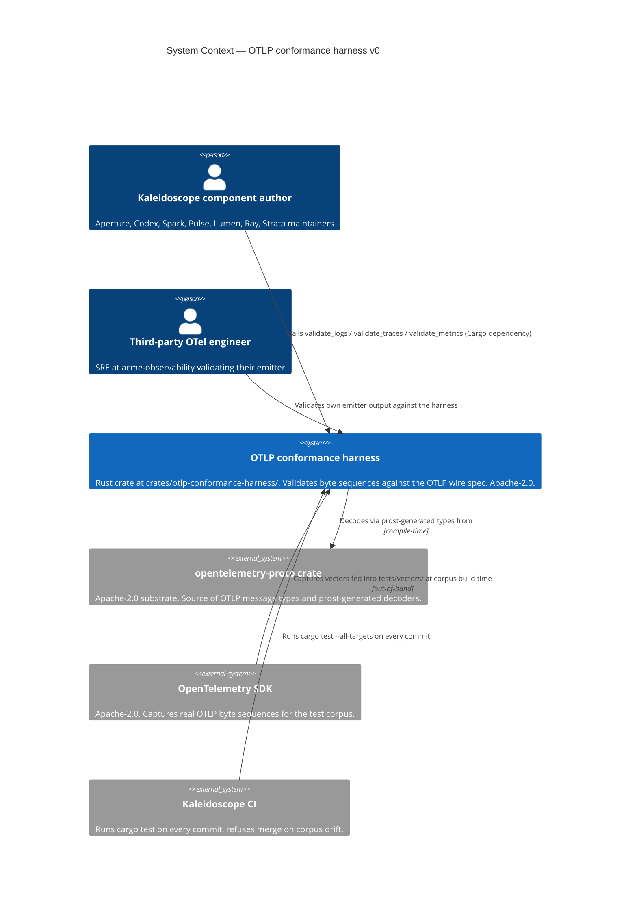
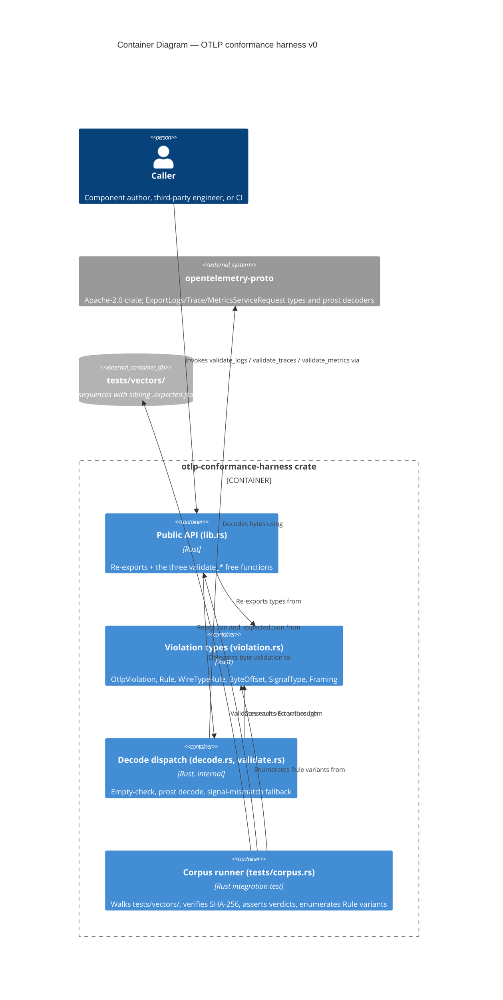

# Kaleidoscope — Architecture Brief

> **Scope**: This brief is bootstrapped by the DESIGN wave for `otlp-conformance-harness-v0`. Platform-level architecture lives in [`../../architecture/kaleidoscope-architecture.md`](../../architecture/kaleidoscope-architecture.md) and is **not duplicated here**. Subsequent feature DESIGN waves append their own application-architecture sections; the platform sections (`## System Architecture`, `## Domain Model`) remain owned by their respective architects (`nw-titan-architect`, `nw-hera-architect`) and are absent for this feature because Andrea has decided not to invoke them for the OTLP conformance harness.

---

## Document Ownership

| Section | Owner agent | Status for `otlp-conformance-harness-v0` |
|---|---|---|
| `## System Architecture` | `nw-titan-architect` | Not invoked — platform-level architecture already documented in `docs/architecture/kaleidoscope-architecture.md` and is reused as-is. |
| `## Domain Model` | `nw-hera-architect` | Not invoked — the harness's domain model is the OTLP wire spec, owned upstream by OpenTelemetry. The harness does not introduce new domain concepts. |
| `## Application Architecture` | `nw-solution-architect` (Morgan) | **This document, this section.** |

---

## Application Architecture

> **Author**: `nw-solution-architect` (Morgan), DESIGN wave, 2026-05-03.
> **Feature**: `otlp-conformance-harness-v0` — a Rust crate at `crates/otlp-conformance-harness/` that validates byte sequences against the OpenTelemetry OTLP wire specification. Phase-0 leaf dependency. Consumed by every later Kaleidoscope component (Aperture, Codex, Spark, Pulse, Lumen, Ray, Strata) and by third-party OTel implementers. Released under Apache-2.0 per the SDK / protocol-library class in `LICENSING.md`.

### Mode of operation

This DESIGN wave executed in **propose mode** (Decision 1 of `/nw-design`). Two-to-three options were enumerated for each load-bearing decision below; one option per decision is recommended with a rationale traceable to the user stories, the outcome KPIs, and the platform-level architecture.

### Reuse of platform-level decisions (not re-derived)

The following are **inherited** from `docs/architecture/kaleidoscope-architecture.md` and `docs/roadmap/kaleidoscope-implementation-roadmap.md`. The application architecture builds on them and does not re-litigate them.

1. **Licence**: per-crate per `LICENSING.md`. Platform components are AGPL-3.0-or-later; SDKs and protocol libraries (including this harness) are Apache-2.0. Migration from CC0-1.0 took place on 2026-05-05; brief commits before the migration date were authored under the CC0 framing of the time.
2. **Substrate locked at the Apache Foundation level**: `opentelemetry-proto` (Apache-2.0) is on the substrate boundary. Per the architecture document's stratum diagram, Apache-Foundation-stewarded projects are exempt from port-and-adapter discipline — this is why the harness embeds the upstream types directly rather than wrapping them.
3. **No telemetry from telemetry**: roadmap section A.2 forbids the harness from emitting any output of its own (stdout, stderr, logging facade). Harness-internal observation is delivered only through the `Result` return value.
4. **Library, not service**: DISCUSS D1 fixed the harness as a Rust crate consumed via Cargo, with no UI, no network surface, no listening ports, no daemon.
5. **Spec version**: pinned via `[package.metadata.kaleidoscope.otlp]` and re-exported as `pub const OTLP_SPEC_VERSION` (per `shared-artifacts-registry.md > otlp_spec_version`).

### Paradigm

**Rust idiomatic data-plus-functions style with `trait`s only where polymorphism is genuinely needed.** No class hierarchies (Rust has none); no `dyn Trait` indirection where direct generic monomorphisation suffices; composition over inheritance throughout. The harness exposes three free functions and a small set of `pub` data types (one error struct, three enums). This is the natural shape of the problem and matches the Rust ecosystem's conventions for validation-and-decode libraries (`serde_json`, `prost`, `regex` all expose this shape).

There is no `crates/otlp-conformance-harness/CLAUDE.md` declaration today because the file does not yet exist (greenfield repository, no Rust code yet). **Recommendation to Andrea**: when convenient, add a CLAUDE.md to the crate root with a single-line paradigm declaration so the DELIVER wave's `nw-software-crafter` agent invocation is unambiguous. The text should be:

```text
# Paradigm
This crate is written in idiomatic Rust: data + free functions + traits only where polymorphism is genuinely required. No class-style inheritance hierarchies. Composition over inheritance.
```

This is **not** a DESIGN-wave artefact — it is a project-level note. The DESIGN wave records the paradigm choice here so the DISTILL and DELIVER waves can read it without ambiguity.

### Crate layout (recommended option, see ADR-0001)

```
crates/
└── otlp-conformance-harness/
    ├── Cargo.toml
    ├── README.md
    ├── src/
    │   ├── lib.rs                # public surface: re-exports, pub fn validate_*
    │   ├── framing.rs            # pub enum Framing
    │   ├── signal.rs             # pub enum SignalType
    │   ├── violation.rs          # pub struct OtlpViolation, pub enum Rule, pub enum WireTypeRule, pub enum ByteOffset
    │   ├── decode.rs             # internal: decode dispatch (logs/traces/metrics) + signal-mismatch fallback
    │   └── validate.rs           # internal: the three validate_* implementations; lib.rs delegates here
    └── tests/
        ├── slice_01_empty_rejected.rs
        ├── slice_02_malformed_protobuf_rejected.rs
        ├── slice_03_signal_mismatch_rejected.rs
        ├── slice_04_logs_accepted.rs
        ├── slice_05_traces_accepted.rs
        ├── slice_06_metrics_accepted.rs
        ├── corpus.rs             # the slice-07 corpus runner
        └── vectors/
            ├── logs/
            │   ├── accept/{minimal.bin, minimal.expected.json}
            │   └── reject/{empty.bin, empty.expected.json, truncated.bin, truncated.expected.json,
            │                bad_varint.bin, bad_varint.expected.json,
            │                bad_tag.bin, bad_tag.expected.json,
            │                traces_misrouted.bin, traces_misrouted.expected.json,
            │                metrics_misrouted.bin, metrics_misrouted.expected.json}
            ├── traces/
            │   ├── accept/{minimal.bin, minimal.expected.json}
            │   └── reject/{empty.bin, empty.expected.json,
            │                logs_misrouted.bin, logs_misrouted.expected.json,
            │                metrics_misrouted.bin, metrics_misrouted.expected.json}
            └── metrics/
                ├── accept/{minimal.bin, minimal.expected.json}
                └── reject/{empty.bin, empty.expected.json,
                             logs_misrouted.bin, logs_misrouted.expected.json,
                             traces_misrouted.bin, traces_misrouted.expected.json}
```

The crate is split into modules from day one, but `lib.rs` is the only public surface — internal modules are crate-private (`pub(crate)`) and re-exports name only the items the public contract requires.

### Public surface — locked by US-06 AC 5

The three function signatures below are **constraints, not options** (US-06 AC 5, line 583 of `user-stories.md`):

```rust
pub fn validate_logs(
    bytes: &[u8],
    framing: Framing,
) -> Result<opentelemetry_proto::tonic::collector::logs::v1::ExportLogsServiceRequest, OtlpViolation>;

pub fn validate_traces(
    bytes: &[u8],
    framing: Framing,
) -> Result<opentelemetry_proto::tonic::collector::trace::v1::ExportTraceServiceRequest, OtlpViolation>;

pub fn validate_metrics(
    bytes: &[u8],
    framing: Framing,
) -> Result<opentelemetry_proto::tonic::collector::metrics::v1::ExportMetricsServiceRequest, OtlpViolation>;
```

Plus the public types named by the user stories:

```rust
pub enum Framing { /* HttpProtobuf, GrpcProtobuf */ }            // #[non_exhaustive]
pub enum SignalType { Logs, Traces, Metrics }                    // #[non_exhaustive]
pub struct OtlpViolation { /* see ADR-0002 for fields */ }
pub enum Rule { EmptyInput, WireType(WireTypeRule), /* future */ } // #[non_exhaustive]
pub enum WireTypeRule {                                            // #[non_exhaustive]
    ProtobufDecode,
    SignalMismatch { observed: SignalType, asserted: SignalType },
}
pub enum ByteOffset { Known(usize), Unknown }                      // #[non_exhaustive]
pub const OTLP_SPEC_VERSION: &str;
```

The crate **does not** wrap, rename, or shadow any `opentelemetry_proto::*` type (US-04 AC 2). The crate **does not** re-export `opentelemetry_proto` or any of its modules — consumers must declare their own dependency, ensuring the dependency edge is visible in their `Cargo.toml`.

### Recommendations summary (for fast skim)

| Decision | Recommended option | ADR |
|---|---|---|
| Public API surface and crate layout | Free functions in `lib.rs`, internal modules from day one, no `Validator` struct | [ADR-0001](adr-0001-public-api-surface-and-crate-layout.md) |
| `OtlpViolation` error-type design | Nested `Rule::WireType(WireTypeRule)` enum, `#[non_exhaustive]` everywhere, `std::error::Error` impl with single-line `Display`, `prost::DecodeError` wrapped via `source()` | [ADR-0002](adr-0002-otlp-violation-error-type-design.md) |
| `opentelemetry-proto` pinning policy | Caret pin to a single minor version, version recorded in spec-version metadata, vendoring deferred to v1 if drift becomes painful | [ADR-0003](adr-0003-opentelemetry-proto-pinning-policy.md) |
| Conformance-test-vector layout | Per-signal then per-verdict hierarchy (`{logs,traces,metrics}/{accept,reject}/`), sibling `.expected.json`, SHA-256 hex content hash, runner walks recursively | [ADR-0004](adr-0004-conformance-test-vector-layout.md) |
| CI contract | Five gates: `cargo test --all-targets`, `cargo deny check`, `cargo public-api`, `cargo semver-checks`, `cargo mutants`. Mechanism (workflow runner) deferred to DEVOPS. | [ADR-0005](adr-0005-ci-contract.md) |

Architectural-rule enforcement (Principle 11): a workspace-level lint package and `cargo deny` configuration enforce the rules above. See ADR-0005.

### Quality attributes addressed (ISO 25010)

| Attribute | How the architecture addresses it |
|---|---|
| **Functional Suitability — Correctness** | The closed-rule discipline (US System Constraint 3) and the corpus runner (US-07) make every named verdict observable and regression-defended. |
| **Performance Efficiency** | Validation is synchronous, allocation is the upstream `prost` decoder's (one decoded message per call), no I/O. The signal-mismatch fallback (US-03) costs at most two extra decode attempts on the failure path; KPI 7 tracks this without a v0 SLA. |
| **Compatibility — Interoperability** | The accept-path return type is the upstream `opentelemetry_proto::tonic::collector::*::v1::Export*ServiceRequest` exactly, so downstream consumers (Aperture, Sluice, every storage engine) feed the value through with zero conversion. |
| **Reliability — Maturity** | The harness has no internal state, no I/O, no panics on user input (US System Constraint 5). The only panic-able surface is invariants in the harness's own enum dispatch, which mutation testing exercises. |
| **Security — Integrity** | `EmptyInput` and `ProtobufDecode` shield downstream from confused-deputy errors (e.g. acting on a half-decoded record). `SignalMismatch` shields the storage layer from cross-signal pollution. |
| **Maintainability — Modularity, Testability** | The crate is single-purpose; modules are split by concept (framing, signal, violation, decode, validate). Every public function has at least one corpus vector defending it. |
| **Maintainability — Modifiability** | `#[non_exhaustive]` on every public enum makes additive evolution non-breaking. New rules and new framings ship in minor versions. Consumers that want exhaustive matching opt in via `#[deny(non_exhaustive_omitted_patterns)]`. |
| **Portability** | Pure Rust, no platform-specific code, no `unsafe`. Builds on every platform Rust targets. |

ATAM sensitivity points: (i) the `prost::DecodeError`-to-`ByteOffset` mapping (degrades KPI 6 if mapping is poor), (ii) `opentelemetry-proto` semver behaviour at MINOR bumps (degrades KPI 1 if upstream silently changes accept-path semantics). Both addressed in ADR-0003.

ATAM trade-off points: nesting `Rule::WireType(WireTypeRule)` (verbose pattern matching for the closed-rule consumer ↔ extensibility room for v0.1 rules without rule-namespace pollution). Addressed in ADR-0002.

### Earned Trust (Principle 12)

The harness is an in-process pure function; it does not depend on the filesystem, time, the kernel, or any vendor SDK at runtime. The only dependency-on-the-world it has is **`opentelemetry-proto` actually decoding the way its documentation says it does at the version pinned**. This is probed at construction time of the corpus runner (slice-07), which on every CI run:

1. Decodes every accept vector and asserts `Ok(_)`.
2. Decodes every reject vector and asserts the declared rule.
3. Re-checks every vector's SHA-256 against its descriptor before invoking the harness (catches corpus mutation).
4. Enumerates the `Rule` variants and refuses to run if any variant has zero defending reject vectors.

The corpus runner itself **is** the probe contract. There is no separate `probe()` method because the harness has no ports — it is a substrate-level pure function. The structural-check layer (Principle 12c) is therefore the public-API check (`cargo public-api`) which catches signature drift at compile time, and the behavioural-check layer is the corpus runner. The subtype-check layer is degenerate (no traits to check). The three Earned-Trust layers reduce to two for a pure-function leaf, which is the minimum the principle permits.

For environments-known-to-lie: the `opentelemetry-proto` crate uses `prost`, which has well-documented behaviour for malformed input. The corpus's reject vectors (`bad_varint.bin`, `bad_tag.bin`, `truncated.bin`) **are** the catalogued substrate lies — bytes that look reasonable but that `prost` must refuse, asserted to fail with the harness's `ProtobufDecode` rule. KPI 6 (one reject vector per rule) is the structural enforcement.

### External integrations

**None at runtime.** The harness has no external network surface, no third-party API consumption, no webhooks, no OAuth providers. The only external dependency is the `opentelemetry-proto` Cargo crate at build time, which is on the substrate boundary and is pinned per ADR-0003.

No contract tests are required for the v0 release. (If a future v1 introduces an external corpus mirror, contract testing recommendations would re-enter the picture.)

### Conway's Law check

This is a **single-author crate** built by a single AI agent (the DELIVER wave's `nw-software-crafter`). The architecture's modular split is for *readability and audit*, not for parallel team development. Conway's Law is satisfied trivially: one author, one module graph.

---

## C4 — System Context (Level 1)



The harness sits as a single in-process box. OTLP byte sequences flow in (as `&[u8]`); `Result<RecordType, OtlpViolation>` flows out. There is no network, no daemon, no external API.

---

## C4 — Container View (Level 2)



The five "containers" inside the crate are not deployment units — they are conceptual modules, each a single Rust source file. The container view is shown because the architecture skill mandates L1+L2 minimum even for small systems.

---

## C4 — Component View (Level 3)

**Not produced.** The decode pipeline is three steps in sequence (empty check → prost decode → signal-mismatch fallback). Three steps do not warrant a separate diagram; the second-level Container diagram already captures the dispatch. Per the SA principle ("Component (L3) only for complex subsystems"), L3 is **explicitly skipped** for v0.

If a future v0.1 adds (for example) richer locus reporting that introduces a custom byte-offset tracker shared across decode strategies, an L3 diagram would be appropriate at that point.

---

## Open questions / hand-offs

- **Workspace topology**: this is the first Rust crate in the Kaleidoscope repository. The DEVOPS wave (`platform-architect`) decides whether `Cargo.toml` at the repo root sets up a workspace today (recommended: yes, with `members = ["crates/otlp-conformance-harness"]`), so future Phase-0 crates (Codex, Spark) can be added without restructuring. Not a DESIGN-wave decision; flagged here.
- **Workspace-level `cargo metadata` `opentelemetry-proto` consistency check**: deferred to a future story; `shared-artifacts-registry.md > otlp_wire_format` flags the requirement. The harness is the only consumer in v0 so the check is a no-op.
- **CLAUDE.md paradigm declaration at the crate root**: recommended to Andrea (see "Paradigm" above). Not blocking the DELIVER wave; the paradigm is documented here.

---

## Handoff to DISTILL

Recipient: `nw-acceptance-designer`. The acceptance designer turns the BDD scenarios in `discuss/user-stories.md` and `discuss/journey-validate-otlp-bytes.yaml` into executable Cargo tests against the public surface defined above. No new requirements are introduced by DESIGN; the DESIGN-wave output crystallises *how* the v0 contract is shaped without changing *what* the contract is.

Required reading order for DISTILL:

1. This brief (`docs/product/architecture/brief.md`) for the recommended public surface and the layout.
2. The five ADRs (`docs/product/architecture/adr-000{1..5}-*.md`) for the decision rationale.
3. The `wave-decisions.md` summary in the feature directory for the DESIGN-wave decision log.
4. The DISCUSS artefacts (locked, do not modify).

## Handoff to DEVOPS

Recipient: `nw-platform-architect`. Receives:

- `docs/feature/otlp-conformance-harness-v0/discuss/outcome-kpis.md` — the seven KPIs with measurement plans.
- ADR-0005's CI contract — the five required gates and their exit conditions.
- The `cargo deny` configuration recommendation in ADR-0003.
- No external integrations exist; no contract-test recommendations apply for v0.

The platform architect chooses the workflow runner (GitHub Actions, Gitea Actions, Forgejo Actions, Drone, etc.) and writes the runner-specific YAML. The contract gates listed in ADR-0005 are runner-agnostic and must all pass on every commit affecting `crates/otlp-conformance-harness/**`.
