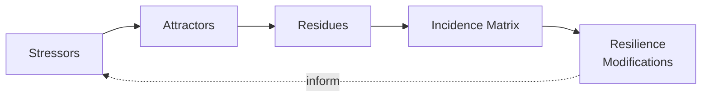
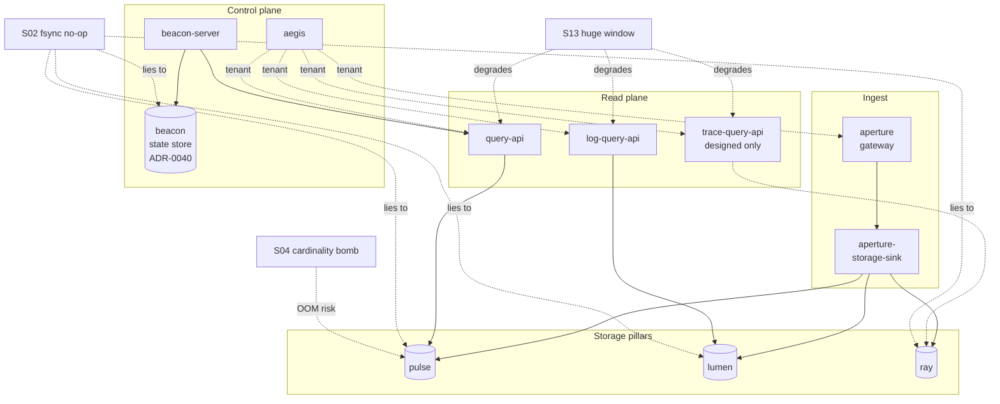

# Residuality analysis — Kaleidoscope

- **Status**: Analytical (not an ADR; this is a system-level companion to the
  per-feature ADRs in this directory)
- **Date**: 2026-05-23
- **Author**: nw-system-designer (Titan), invoked via `/nw-design --residuality`
- **Method**: Barry M. O'Reilly's Residuality Theory
  (stressors -> attractors -> residues -> incidence matrix -> resilience
  modifications)
- **Scope**: Kaleidoscope as it stands at v0/v1, library-only and
  walking-skeleton storage with three HTTP read APIs and a control plane.
  No production traffic, no production data.
- **Reads confirmation checklist** (all checked):
  - [x] `docs/product/architecture/brief.md` (heading scan; per-feature
        sections from feature 1 through `lumen-query-api-v0` /
        `ray-query-api-v0`)
  - [x] ADR-0001 (public-api + crate layout)
  - [x] ADR-0005 (the five CI gates)
  - [x] ADR-0040 (beacon rule-state store seam, append-and-sort vs
        keyed-latest-wins recovery contrast)
  - [x] ADR-0042 (query-api contract, PromQL subset, fail-closed tenancy,
        Earned-Trust probe)
  - [x] ADR-0044 (`=`/`!=` label matchers; cited via 0045/0046)
  - [x] ADR-0045 (pulse series identity is the full label set)
  - [x] ADR-0046 (regex `=~`/`!~` label matchers; RE2 engine, full anchor)
  - [x] ADR-0047 (lumen log-query-api contract)
  - [x] ADR-0048 (ray trace-query-api contract; designed, not yet
        implemented)
  - [x] ADR names skim: 0001-0048
  - [x] `crates/` directory listing and lib.rs head doc for aegis,
        aperture, aperture-storage-sink, pulse, lumen, ray, beacon,
        beacon-server, cinder, sluice, strata, self-observe, query-api,
        log-query-api
  - [x] `CLAUDE.md` (project guidance)
  - [x] `docs/presentation/narrative.md` sections "What is consistent
        across the six features" and "What I want viewers to take away"
  - [x] `.github/workflows/ci.yml` (head; gate ordering and trunk-based
        triggers)

## Context

Kaleidoscope is a multi-crate Rust observability platform plus a
React/TypeScript SPA. It accepts OTLP for the three stable signals
(logs, metrics, traces), validates payloads against a first-party
conformance harness, persists them through six storage pillars
(`cinder`, `sluice`, `lumen`, `pulse`, `ray`, `strata`), and serves a
small read surface (`query-api` for metrics, `log-query-api` for logs,
`trace-query-api` designed in ADR-0048). A control plane (`beacon`,
`beacon-server`, `aegis`) does rule evaluation and tenancy
resolution. The platform observes itself via `self-observe` bridges.

The platform is v0/v1, library-only, no daemons that own production
state, no production data. The project's discipline (nWave wave per
agent, ADR-immutable, CI as feedback not gate, 100% mutation kill on
modified files) is itself part of the system under analysis: a
methodology stressor is as real here as a disk-full stressor.

This document is an analytical companion to the per-feature ADRs. It
modifies no ADR and no per-feature artefact. The recommendations at
the end name proportionate next steps and are flagged "v0-now" or
"v1-roadmap" or "future feature" accordingly.

## Method

Residuality theory asks not "what risk shall I prevent" but "what
survives when any stress hits". The five steps:

1. **Stressors** — destabilising events the system may face.
2. **Attractors** — the stable configurations the system actually
   tends to under stress (desired AND undesired).
3. **Residues** — the design elements that survive an attractor.
4. **Incidence matrix** — stressors as rows, components / invariants
   as columns; each cell marks survive / degrade / break and names
   the reason.
5. **Resilience modifications** — concrete, proportionate changes
   that raise the residue, ranked by leverage and bounded by cost
   and blast radius.

Heuristic: optimise for criticality, not correctness; loose coupling
by default; design for the attractor the system actually settles
into, not the one it is supposed to.

## Stressors

Twenty-two stressors, named tersely and grouped. The goal is
discovery, not probability ranking; impact is weighed under residues.

### Hardware and process

- **S01** disk full on the pillar root mid-WAL-append
- **S02** `fsync` silently no-op on the substrate (Docker overlayfs,
  some Mac volume drivers, network FS); ADR-0040 / Earned-Trust
  principle 9 explicitly anticipates this
- **S03** process kill (SIGKILL, panic, OOM kill) mid-write between
  WAL append and snapshot truncation
- **S04** OOM under a sudden cardinality spike (one tenant emits
  hundreds of thousands of unique label sets — ADR-0045 made series
  identity the full label set, so a label-cardinality bomb is now a
  RAM bomb)
- **S05** clock skew or backwards jump (NTP failure, VM suspend /
  resume); affects `time_unix_nano` ordering in append-and-sort
  pillars and `for_duration` dwell clocks in beacon
- **S06** corrupt or truncated WAL file (partial last record from S01
  or S03)

### Network and transport

- **S07** slow OTLP client (Slowloris-style grpc/h2 keep-alive,
  partial-body POST) holding aperture connections
- **S08** transient network partition between the gateway and a
  durable store on a different volume (unlikely in v0 single-process,
  but real if pillars ever move to a remote substrate)
- **S09** TLS termination outage or expired certificate on the
  ingress
- **S10** OTLP wire version skew (a client at a newer
  opentelemetry-proto than the pinned ADR-0003 version)

### Data and load

- **S11** malformed OTLP payload designed to defeat the harness
  (truncated protobuf, unknown enum, non-UTF-8 label value)
- **S12** ReDoS attempt on `query-api` regex matchers; ADR-0046
  picked the RE2-derived `regex` crate explicitly to remove this
  class of attack
- **S13** unbounded `[start, end)` window on a read endpoint (a
  tenant queries a year of data through `/api/v1/logs` or
  `/api/v1/traces`)
- **S14** label-cardinality bomb under one metric name (closely
  related to S04 but at the query side: fan-out across many
  matching series, ADR-0045 Consequences "Negative")
- **S15** 100x ingest spike against the in-process queue (`sluice`);
  bounded queue surfaces `EnqueueError::Full`

### Security and tenancy

- **S16** lost or rotated JWT signing key with stale JWKS cached
- **S17** expired or hand-edited tenant catalogue (the TOML drifts
  from the issuer's reality)
- **S18** a forwarded header value (Authorization, X-Forwarded-For,
  X-Scope-OrgID) leaking into an error message body — DD6 redaction
  is the residue this stressor tests
- **S19** unset `KALEIDOSCOPE_*_TENANT` envs in production deploy
  (gateway, query-api, log-query-api, trace-query-api each have one)

### Operational and methodology

- **S20** dependency CVE in a transitive crate; or MSRV creep from a
  transitive bumping `rust-version` (already observed and recorded
  as memory note in this repo)
- **S21** rolling restart of a stateful component (beacon-server,
  which holds firing-rule clocks) without persistence — the exact
  defect ADR-0040 fixes
- **S22** pre-commit hook flaky on a slow Mac (locally observed in
  this repo); contributor temptation to bypass; methodology stress
  on the trunk-based-development discipline

(Out of scope as stressors for v0/v1: multi-region failover, sharded
write quorum loss, Byzantine peer failure — Kaleidoscope is a
single-binary-per-pillar walking skeleton.)

## Attractors

The configurations the system settles into. Naming them explicitly,
including the undesired ones the platform must NOT settle into.

### Desired attractors

- **A-D1 The four-step closure**: ingest -> validate via harness ->
  durable store -> query. Each of the three signals closes this
  loop today (metrics via `query-api`, logs via `log-query-api`,
  traces only on the write side; the read closure is designed in
  ADR-0048 and not yet wired).
- **A-D2 Append-and-sort steady state**: the storage pillars hold
  each WAL record as an event in a time series; recovery replays
  and re-sorts by `time_unix_nano` (ADR-0040 Decision 2).
- **A-D3 Keyed-latest-wins steady state**: beacon's per-rule state
  is the value, not an event in a series; recovery replays and the
  last `Put` per `rule_id` wins (ADR-0040 Decision 2). This is a
  DIFFERENT attractor from A-D2 and the ADR exists to stop them
  being confused.
- **A-D4 Fail-closed tenancy at every plane boundary**: the
  gateway, query-api, log-query-api, and trace-query-api each
  refuse when no tenant resolves; no plane defaults to "all
  tenants" (ADR-0041 / 0042 / 0047 / 0048).
- **A-D5 Earned-Trust at startup**: every read API and the
  storage sink probe the substrate before binding the listener;
  startup refuses with `event=health.startup.refused` if the probe
  fails (Earned-Trust principle 9; ADR-0042 / 0047 / 0048
  Decision N).
- **A-D6 Honest three-way outcomes on read**: 200 success, 200 calm
  empty `[]`, 4xx that names the fault, 5xx that never fabricates
  a success. No silent wrong answers.
- **A-D7 nWave-disciplined trunk**: small commits to `main`, CI as
  feedback not gate, fix-forward, every wave's artefacts under
  `docs/feature/<id>/<wave>/`.

### Undesired attractors (what the system must NOT settle into)

- **A-U1 Silent data loss**: a WAL appears to succeed but the
  substrate's `fsync` did nothing; recovery rebuilds without the
  last second of writes. The exact lie principle 9 anticipates.
- **A-U2 Cross-tenant leak**: a read endpoint with an unset tenant
  env falls back to "all tenants" instead of refusing.
- **A-U3 Header echo in error bodies**: an error message leaks an
  Authorization value, a tenant catalogue value, or the raw query
  string.
- **A-U4 Fabricated empty**: a store error converted to 200 `[]`
  by a careless `Result::unwrap_or_default()` somewhere on the
  read path.
- **A-U5 Series collapse on shared metric names**: ADR-0045
  documents the platform settling into this attractor before the
  fix; two services emitting the same metric name collapse into
  one series wearing whichever service ingested last. Fixed in
  ADR-0045; preserved here as a precedent that an undesired
  attractor can be a quiet metadata convention.
- **A-U6 Beacon resets on restart**: pre-ADR-0040, firing-rule
  state lost on every deploy; on-call re-paged. Fixed by the
  durable seam; preserved as the attractor the seam exists to
  block.

## Residues

For each platform invariant, the stressors that threaten it and the
residue (what survives). Each residue rides on one or more named
ADRs.

| Invariant | ADR(s) | Threatening stressors | Residue (what survives) |
|---|---|---|---|
| Per-tenant fail-closed read | 0041, 0042, 0047, 0048 | S19, S18, S08 | Every read endpoint refuses with 401 when no tenant resolves; the router seam is an `Option<TenantId>` so the refusal is structural, not a conditional easy to delete. The Earned-Trust probe (A-D5) fails closed at startup if the substrate cannot answer for the configured tenant. |
| Series identity by full label set | 0045 | S04, S14, S21 | A label-cardinality bomb is a memory bomb, not a correctness bomb: per-service provenance is preserved by construction. Recovery rebuilds buckets keyed by `SeriesKey { name, resource_attributes }` from `apply_ingest`, the single shared path; ingest and replay cannot drift. |
| Append-and-sort recovery for the five storage pillars | 0040 | S03, S06, S05, S02 | A truncated last WAL record is skipped on replay (existing pattern); re-sorting by `time_unix_nano` after replay tolerates a clock that walked backwards once (the points are reordered, not lost). The shared `apply_ingest` covers ingest and replay symmetrically. NOTE: `fsync` honesty is NOT a residue today; see A-U1 and the resilience modifications. |
| Keyed-latest-wins recovery for beacon rule state | 0040 | S03, S21 | The last `Put` per `rule_id` wins on replay; firing-rule clocks survive a restart. A corrupt state file refuses to start rather than starting with silently-reset state (recover-then-refuse). |
| Honest 4xx vs 5xx vs calm empty on the three read APIs | 0042, 0047, 0048 | S11, S13, S12, S18 | Each fault has a tested 4xx that names it; a store `PersistenceFailed` is a 5xx not a fabricated empty; the empty arm is a calm 200 with `[]` or `result: []`. Error text never echoes a forwarded header (DD6). |
| ReDoS-immune regex matchers | 0046 | S12 | The `regex` crate is RE2-derived; linear-time match by construction; the pattern compiles once per query, not per row. The full-anchor wrap is built in (`^(?:{p})$`). |
| OTLP wire conformance | 0003, 0004, harness | S10, S11 | Every payload validates through the first-party harness before any sink is touched; a wire-version-skewed client hits a tested reject path, not the store. |
| Conformance corpus immutability | 0004 | methodology drift | The corpus is a frozen artefact; regeneration is a ritual (ADR-0023 for codex, mirrored for the harness); a contributor cannot edit a corpus vector by accident. |
| Five-gate CI feedback (test, public-api, semver, deny, mutants) | 0005 | S20, S22 | A dependency CVE surfaces at Gate 4; an MSRV bump surfaces at Gate 1; a public API drift at Gate 2 / 3; a mutation surviving a test at Gate 5. CI is feedback, not gate (no required-status-checks), but the hooks at `scripts/hooks/` mirror the gates locally before push. |
| ADR immutability | repo convention | methodology drift | ADRs are never edited; superseding records are new ADRs. The immutable trail is the audit residue against a wave's later misremembering. |
| Per-crate tags and per-crate mutation jobs | 0005 + DEVOPS | S20 | Each crate graduates on its own tag (e.g. `pulse/v0.1.0`); blast radius of a per-crate regression is bounded by the crate's gate. |
| nWave wave-per-agent discipline | CLAUDE.md, MEMORY | S22 | Every change is an agent invocation under a recorded wave; an artefact hand-authored bypassing nWave is an immediately-recognisable smell (already observed and corrected in this repo, per the project memory). |

## Incidence matrix

Rows: the 22 stressors. Columns: 12 components / invariants. Cells:
S survives, D degrades (continues but with named loss), B breaks
(refuses to start, returns 5xx, or silently corrupts), with a short
reason. The matrix is truncated to the most informative cells; a
fuller matrix can be expanded later if any cell here proves
contested.

Columns: **G** gateway (aperture), **AS** aperture-storage-sink,
**P** pulse, **L** lumen, **R** ray, **B** beacon-server, **AE**
aegis, **QM** query-api, **QL** log-query-api, **QT**
trace-query-api (designed, not implemented), **CI** the five CI
gates, **NW** the nWave discipline.

| Stressor | G | AS | P | L | R | B | AE | QM | QL | QT | CI | NW |
|---|---|---|---|---|---|---|---|---|---|---|---|---|
| S01 disk full mid-WAL | D refuse via `PersistenceFailed`; no fabricated 200 | D bubble up | D ditto | D ditto | D ditto | D ditto via `RuleStateStoreError` | S unaffected | S unaffected | S unaffected | n/a | S | S |
| S02 `fsync` no-op | **B silent loss possible** (A-U1) | **B** | **B** | **B** | **B** | **B** | S | D 5xx on next read if recovery fails | D ditto | n/a | S (no fsync probe in CI today) | S |
| S03 SIGKILL mid-write | D last record may be truncated; replay tolerates | D | D | D | D | D last `Put` wins; recover-then-refuse if corrupt | S | S | S | n/a | S | S |
| S04 cardinality bomb | D backpressure refuses excess | D | **B OOM** under enough labels | D | D | S | S | D fan-out cost (recorded in 0045) | D | n/a | S | S |
| S05 clock skew / backwards jump | D timestamps as recorded | D | D points re-sorted on replay; live order may interleave | D ditto | D ditto | D dwell-clock confusion possible | S | D query window edges may misclassify points within skew window | D | n/a | S | S |
| S06 corrupt WAL | D truncated tail skipped | D | D | D | D | D recover-then-refuse on corrupt state file | S | D 5xx on read of affected range | D | n/a | S | S |
| S07 Slowloris OTLP | D backpressure cap refuses excess (ADR-0010) | S | S | S | S | S | S | S | S | n/a | S | S |
| S08 partition gateway-to-store | n/a v0 (in-process) | n/a | n/a | n/a | n/a | S | S | n/a | n/a | n/a | S | S |
| S09 TLS / cert outage | D ingest refused at the ingress | S | S | S | S | S | S | S | S | n/a | S | S |
| S10 OTLP version skew | S harness rejects with named rule | S | S | S | S | S | S | S | S | n/a | S | S |
| S11 malformed OTLP | S harness rejects | S | S | S | S | S | S | S | S | n/a | S | S |
| S12 ReDoS pattern | S | S | S | S | S | S | S | **S RE2 engine, linear** | n/a | n/a | S | S |
| S13 huge `[start, end)` | n/a | n/a | D linear scan; no pagination | D ditto | D ditto | S | S | **D no upper bound on window** | **D ditto** | **D ditto** | S | S |
| S14 cardinality bomb at query | n/a | n/a | D fan-out cost | n/a | n/a | S | S | D fan-out cost (0045 Consequences) | n/a | n/a | S | S |
| S15 100x ingest spike | D backpressure | D | D queue full surfaces | D | D | S | S | S | S | n/a | S | S |
| S16 lost JWT signing key | D ingest refused if Aegis validates online | S | S | S | S | S | **B until JWKS refresh** | **B** if Aegis is the resolver | **B** | n/a | S | S |
| S17 stale tenant catalogue | D ingest refused for missing tenant | S | S | S | S | S | **D unknown tenant refused (fail-closed)** | D | D | n/a | S | S |
| S18 header value in error body | S DD6 redaction | S | S | S | S | S | S | **S asserted by redaction test** | **S** | **S** | S | S |
| S19 unset tenant env | n/a | n/a | n/a | n/a | n/a | n/a | n/a | **S fail-closed 401** | **S** | **S** | S | S |
| S20 transitive CVE / MSRV creep | D Gate 4 advisories alerts; MSRV bump per project memory | D | D | D | D | D | D | D | D | D | **S CI flags** | S |
| S21 rolling restart | D in-flight requests drained (graceful shutdown) | D | D recovery replays | D ditto | D ditto | **S durable state (ADR-0040)** | S | D briefly refuses during restart | D | n/a | S | S |
| S22 flaky pre-commit | n/a | n/a | n/a | n/a | n/a | n/a | n/a | n/a | n/a | n/a | D feedback delayed | **D temptation to bypass; mitigated by project memory note** |

Notable cells:

- The **S02 row** is the most informative. Five of the six storage
  pillars and the beacon state store rely on `fsync`; none of them
  probe whether the substrate honours it. The Earned-Trust probes
  that DO exist today (ADR-0042 / 0047 / 0048 `probe()`) verify the
  store can be opened and read, not that a write survived a crash.
  This is the single biggest residue gap.
- The **S12 column QM** is the cleanest residue in the matrix. ADR-0046
  chose the engine specifically to defeat this stressor; the residue
  is structural, not a runtime defence.
- The **S13 columns QM / QL / QT** all degrade. There is no per-request
  window cap and no result-size cap on any read endpoint; a one-year
  range on a busy tenant is a self-DoS.
- The **S04 / S14 column P** is the cardinality story. ADR-0045 fixed
  the correctness defect (series collapse, A-U5) but accepted the cost
  characteristic (fan-out and memory growth) as a known trade with a
  recorded "no premature indexing" deferral. The residue is correctness,
  not capacity.

## Resilience modifications (prioritised)

Each modification names the threat it addresses, the change shape,
the cost, and the blast radius. Modifications are ranked by leverage.
Those marked **v0-now** are proportionate to the current walking
skeleton; **v1-roadmap** items name the right shape for later; **future
feature** items defer cleanly under an nWave wave when the platform
warrants them.

### M-1 (v0-now): an `fsync`-honesty probe at storage-pillar startup

**Threat**: S02 (silent loss via `fsync` no-op) -> A-U1.
**Change**: extend the existing Earned-Trust probe pattern (already
proven in ADR-0042 / 0047 / 0048) to each `FileBacked*Store::open`:
write a sentinel record, fsync, kill-and-reopen at the process level
is too heavy for startup, so use the cheaper proxy of `fstatfs`
(or `statfs`) to detect a known-lying substrate (Docker overlayfs
without persistent volume mount; certain network filesystems), plus
a one-shot `O_DSYNC` write-read cycle. On a detected lie, emit
`event=health.startup.refused` naming the substrate and a suggested
alternative (a host-mounted volume, an `O_DIRECT` capable backend).
**Cost**: ~50 lines per pillar; one new test per pillar using a
substrate double. Reuses the established probe contract.
**Blast radius**: contained per crate; mutation-tested in place; no
trait change. Each pillar already owns a probe seam.

### M-2 (v0-now): per-request window cap and result-size cap on all three read APIs

**Threat**: S13 (huge `[start, end)`) -> self-DoS; S04/S14 at the
read side amplifying memory pressure.
**Change**: a configured maximum window duration (e.g. 24h
default) and a configured maximum result count, enforced in each
read API's handler before the store is queried. Exceeding either is
a 400 with a named reason, in line with the honest-4xx pattern of
ADR-0042 / 0047 / 0048. Configuration via the same env-driven
posture (`KALEIDOSCOPE_QUERY_MAX_WINDOW_SECONDS`, `_MAX_RESULTS`)
the tenancy already uses.
**Cost**: ~30 lines per crate; one acceptance test per cap per
crate. No trait change.
**Blast radius**: contained per read API; the cap is a handler-level
guard, not a store-level concern.

### M-3 (v0-now): write the trace-query-api crate

**Threat**: ADR-0048 designs `/api/v1/traces` but the crate does not
exist on disk. The trace pillar therefore has no read closure today.
This is a designed-but-unimplemented gap, not a stressor in the
classic sense, but it is the most direct way to extend the
"ingest -> store -> query -> see" residue to the third signal.
**Change**: implement the crate per ADR-0048: lib + thin binary,
fail-closed `Option<TenantId>`, the `service` required parameter
returning 400 when missing, Earned-Trust probe, `gate-5-mutants-
trace-query-api`.
**Cost**: bounded by the ADR; a single nWave feature wave.
**Blast radius**: a new crate, mirror of `log-query-api`; no
existing crate changes.

### M-4 (v0-now): explicit cardinality watermark on pulse ingest

**Threat**: S04 (label-cardinality bomb -> OOM in pulse). ADR-0045
chose correctness over premature indexing and recorded the
characteristic. The watermark turns "silent OOM" into "observable
warning + bounded refusal".
**Change**: a configured per-tenant ceiling on distinct
`SeriesKey`s under one metric name (e.g. 100k). Above the ceiling,
new series ingest is rejected with a tracked counter; existing
series continue to receive points. Self-observe surfaces the
counter as a queryable pulse metric (the self-observation bridge
already exists). Honest backpressure beats opaque OOM.
**Cost**: ~80 lines in `pulse::file_backed` and `pulse::store` (the
ingest path is shared via `apply_ingest`, so one edit covers live
and replay); one acceptance test.
**Blast radius**: contained per tenant; the ceiling is a soft cap,
not a series ban. Does not change `MetricStore` trait.

### M-5 (v1-roadmap): a `query-http-common` extraction

**Threat**: methodology drift across three near-identical read APIs.
ADR-0048 Decision 5 explicitly recorded this as the rule-of-three
trigger and the next clean refactor.
**Change**: extract the fail-closed `Option<TenantId>` seam, the
`error_response` JSON helper, and the epoch-seconds bounds parser
into a shared crate, with type-parameterised `TimeRange` to handle
the three different store-side TimeRange types. One ADR for the
extraction; touches all three read crates together.
**Cost**: moderate; the parser is not type-identical so a generic
or three thin adapters are needed.
**Blast radius**: three crates coupled through one fourth; bounded
by the per-crate mutation gates.

### M-6 (v1-roadmap): a fsync-probe-honesty regression test in CI

**Threat**: M-1 itself drifting (Earned-Trust principle 9's
self-application: the probe must stay honest after every
dependency upgrade).
**Change**: a CI job (non-gating, per the project's "CI is feedback
not gate" stance) that runs the probes against a known-lying
substrate fixture (a tmpfs-without-fsync, or a deliberately-broken
overlayfs simulation). The job fails noisily if a probe stops
detecting the lie after a dep bump.
**Cost**: a few hundred lines of fixture; one new workflow job.
**Blast radius**: zero on the binaries; informational only.

### M-7 (future feature): cross-pillar reconciliation report

**Threat**: latent disagreement between pillars (a span exists in
ray for a `trace_id` that has no logs in lumen, or a metric exists
for a service with no traces). Not a stressor today (no consumer
relies on the cross-correlation) but a likely residue gap once
prism gains a unified incident view.
**Change**: a nightly reconciliation report (one nWave feature)
that joins by `(tenant, trace_id)` and `(tenant, service.name)`
across the three pillars and surfaces orphans. Read-only, runs
out-of-band.
**Cost**: a feature wave; no production-side change.
**Blast radius**: zero on the read/write paths.

### M-8 (future feature): clock-skew detector on ingest

**Threat**: S05 (clock skew). Append-and-sort tolerates a one-shot
skew by re-sorting; it does not detect a persistently-skewed source
(a client whose clock is hours wrong, sending points into the
future).
**Change**: at the gateway, an observable counter when a point's
`time_unix_nano` lies outside `[now - max_past, now + max_future]`
(configured). Out-of-window points are still accepted (do not break
ingest) but the counter surfaces the problem.
**Cost**: small; a counter and a configured pair.
**Blast radius**: zero on persistence; observability only.

### Not recommended (would contradict project principles)

- A required-status-check on `main` (would contradict "CI is
  feedback, not gate", per project memory and narrative).
- Skipping pre-commit hooks on flake (would contradict the
  trunk-based-discipline residue, per project memory).
- Pushing to 1.0.0 ahead of Andrea (the graduation call is the
  human's, per project memory).
- Multi-region failover work (no multi-region exists; out of
  scope).

## Honest gaps in the platform's claimed invariants

One claimed invariant is contradicted by the current implementation
surface, and one designed invariant is not yet realised. Naming both
explicitly so they are not lost.

- **fsync honesty is claimed by design but not probed in code**.
  The Earned-Trust principle (principle 9) requires every
  infrastructure component to "demonstrate empirically that the
  substrate actually delivers the semantics it claims". The
  startup probes that DO exist (ADR-0042 / 0047 / 0048) verify
  open-and-read, not survive-a-crash. The five storage pillars and
  the beacon state store all rely on `fsync` and none of them probe
  it. M-1 closes this.
- **trace-query-api is designed (ADR-0048) but the crate is not on
  disk**. The traces read closure is therefore a paper residue,
  not a code residue. The system tends to A-D1 for metrics and
  logs but not yet for traces. M-3 closes this.

Both are honest, recorded, and proportionate to a v0/v1 walking
skeleton with no production data. They are flagged here because a
residuality analysis that hid them would itself be the kind of
"comforting story about the substrate" the Earned-Trust principle
warns against.

## Limits

This analysis is bounded by the platform's v0/v1 frame.

- **Multi-region, sharding, write quorum** are out of scope: the
  pillars are single-process libraries today.
- **Production load characteristics** are unknown: no production
  data exists. Numbers in the resilience modifications (24h window
  cap, 100k series ceiling) are starting defaults, not measured
  ones.
- **Beacon's persistence** is recent (ADR-0040); its behaviour at
  scale (many rules, many emissions) is exercised by tests, not by
  load.
- **The mutation-test residue** assumes the per-crate mutation gates
  stay at 100% kill. If a crate ever drops below, every cell in its
  columns weakens. The CI workflow currently enforces this on every
  push; that is the residue this assumes.
- **The prism (frontend) plane** is named but not analysed in
  depth here. It is a same-origin SPA served by `query-api` and
  inherits the read-API residues; a SPA-specific stressor pass
  (XSS, CSP, dependency CVE in the JS supply chain) would be a
  separate, sibling analysis.
- **The nWave methodology stress (S22)** is real and observed in
  this repo, but its mitigations live in the project memory
  notes, not in code. This analysis records the stressor; the
  mitigations remain a discipline question, not a code question.

The honest summary: at v0/v1, with no production data, the platform's
residues are mostly **correctness residues** (fail-closed tenancy,
honest 4xx vs 5xx, series identity, recovery discipline) rather than
**capacity residues** (no caps on window or result size, no
cardinality watermark, no fsync probing). The resilience modifications
above propose the smallest proportionate steps to raise the capacity
residues without contradicting the principles that earn the
correctness residues.
