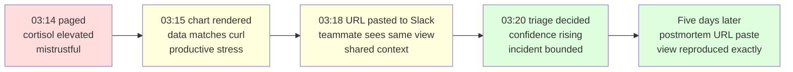

# Operator incident-response journey

> SSOT (cross-feature). The full feature-side narrative lives in
> `docs/feature/prism-v0/discuss/journey-incident-response-visual.md`;
> this file is the cross-feature companion for the YAML entry next to
> it.

## Persona

The senior SRE on the on-call rota. PagerDuty pages her at 03:14 about
a service-level alert; she has 90 seconds to acknowledge, 5–10 minutes
to make a triage decision before customer-facing impact compounds.

The secondary persona is the postmortem-time engineer reading the same
URL days later.

## Mental model

The operator thinks in metric names and time windows. She wants to
type a PromQL string she already remembers from prior incidents
(`http_server_duration_seconds`, `kafka_consumergroup_lag`), see a
chart of that metric over the alert window, and decide the next move.

She does not want to learn a new DSL. She does not want to fight
authentication. She does not want to debug the tool while debugging
the incident.

## Emotional arc

The arc starts at high stress / low trust, moves through productive
stress / building trust, and ends at confident / shareable. Tools
serving this journey must protect the upward arc; surface friction
(login dialogs, spinning loaders without progress, broken URLs)
inverts the arc and is operationally hostile.

## Six activities (the story-map backbone)

1. **Open Prism** — the SPA loads at the operator's URL with the
   backend label visible.
2. **Compose query** — the operator types PromQL into a focused
   input; picks a time range from a small set of operator-canonical
   relative presets.
3. **Read chart** — the chart renders the backend's data verbatim.
4. **Iterate** — edit-and-rerun cycles are light; auto-refresh keeps
   the chart current without flicker.
5. **Share + decide** — the URL bar is the share artefact; the
   teammate clicking it sees the same view.
6. **Postmortem** — days later, the same URL paste reproduces the
   same chart, provably.

Each activity has explicit output (no vague step). Failure modes for
each activity are documented in the feature-side YAML.

## Cross-feature invariants

The journey's `cross_feature_invariants` in `incident-response.yaml`
list three properties every feature touching this journey must
preserve: page-stays-usable-on-failure, no-stale-data-on-error,
shareable-url-always. Future features (Beacon, Loom, Aegis, Lumen,
Ray) inherit them when they extend the journey.

## Deferred extensions

- Logs panel via LogQL (depends on Lumen — Phase 3)
- Traces panel via TraceQL (depends on Ray — Phase 5)
- Exemplar deep-links (depends on Strata — Phase 6)
- Multi-panel dashboards (owned by Loom — Phase 2)
- Saved queries (URL paste is the v0 substitute)
- Native auth (owned by Aegis — Phase 2)

Each lives in `incident-response.yaml > deferred_to_post_v0` with the
feature that will graduate it.
