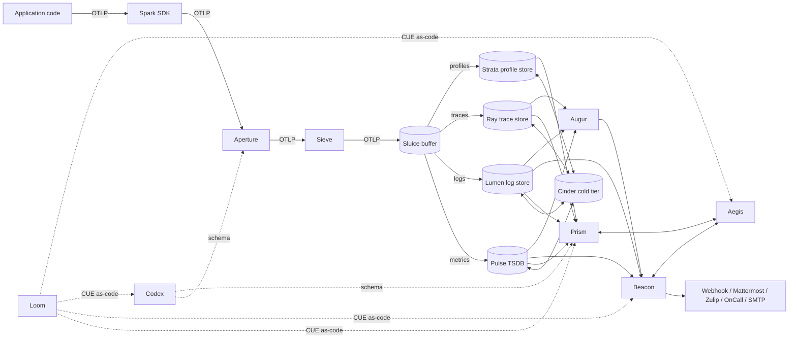
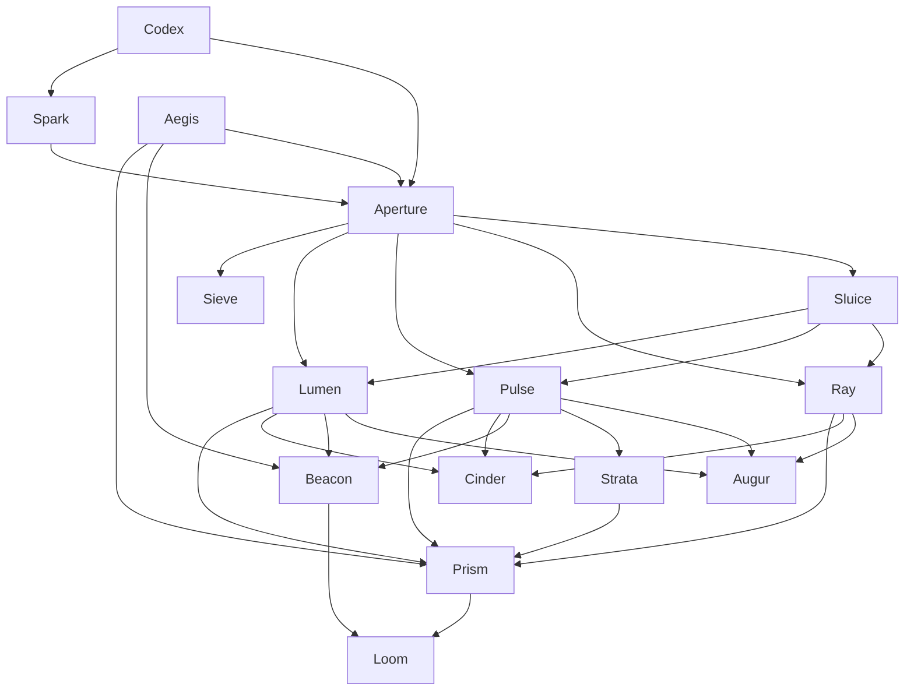
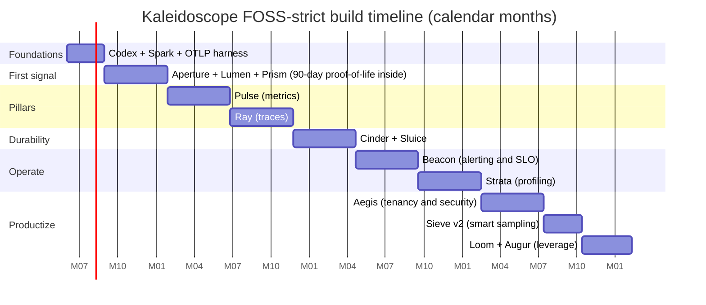

# Kaleidoscope — FOSS-Strict Implementation Roadmap

**Date**: 2026-05-03 | **Author**: nw-researcher (Nova) | **Confidence**: High (license facts and component licences verified at primary sources) / Medium-High (effort estimates synthesised from comparable FOSS projects' public history) | **Sources**: 40+ cited (avg reputation ≈ 0.85)
**Topic**: A FOSS-strict, no-platform-reuse, no-commercial-dependency implementation roadmap for Kaleidoscope.

---

## Executive Summary

Kaleidoscope's defining promise is that the platform is, and will always remain, free and open source software. That promise rules out a class of pragmatic shortcuts most observability projects take. It rules out shipping a thin wrapper around Mimir, Loki, Tempo, and Grafana and calling the bundle a platform. It rules out depending on HashiCorp Vault, HashiCorp Terraform, Redpanda, Confluent, or any of the BSL-, SSPL-, or "Source Available"-licensed components that, however excellent, have already broken the open-source compact once. It rules out commercial SaaS bundled into the recommended deployment, including the alert-routing and incident-management tools that most self-hosted observability stacks reach for by default. And, most consequentially, it rules out reusing peer FOSS observability platforms as runtime building blocks: Kaleidoscope competes with Mimir, Loki, Tempo, ClickHouse, Elasticsearch, OpenSearch, VictoriaMetrics, Quickwit, SigNoz, Uptrace, OpenObserve, Grafana, and Kibana, and therefore cannot consume them. The project must stand on libraries, formats, and protocols, not on platforms.

The roadmap that follows is the corrective to a tech-stack draft that drifted toward platform reuse. Every Kaleidoscope component is rebuilt from FOSS libraries and open formats: Apache Arrow, Apache Parquet, Apache Iceberg, Apache DataFusion, RocksDB, Tokio, Hyper, Tonic, Protobuf, the OTLP wire protocol, the pprof format, NATS JetStream, Apache Kafka KRaft, OPA, SpiceDB, OpenFGA, SPIFFE/SPIRE, Dex, Keycloak, OpenBao, and CUE. None of those are competing observability platforms. All are OSI-approved (Apache 2.0, BSD, MIT, MPL-2.0). Each entry in the licence audit appendix is verified against the project's primary licence file, not assumed from secondary sources. Where a naive tech stack would reach for a commercial or licence-tainted dependency — Vault, Terraform, GitHub Actions, PagerDuty, Slack, Llama, Confluent — a named FOSS replacement is adopted: OpenBao, OpenTofu, Forgejo Actions or Woodpecker CI, Grafana OnCall, Mattermost or Zulip, Qwen 2.5 or Mistral, self-hosted Kafka KRaft or NATS JetStream.

The honest cost of this path is multi-year and multi-team. The original 10-phase roadmap of approximately 40 calendar months and a peak of 10 to 12 engineers is, if anything, optimistic against the FOSS-strict constraint, because the storage engines (Pulse, Lumen, Ray, Strata) cannot be back-filled from existing platforms and must be built on top of Arrow, Parquet, DataFusion, and the Prometheus TSDB block format as a specification. The project leadership should hold this number in mind whenever the temptation to vendor a "small bit of ClickHouse" arises: the slope from "small bit" to "we are now a ClickHouse fork" is short, well-documented, and ends with the project's open-source promise compromised. The first 90 days deliver Spark plus Aperture plus a Lumen-on-Parquet log slice plus Prism as a first-party Grafana replacement, all OTLP in and SQL out, on a single virtual machine. That deliverable is the proof that the FOSS-strict path is real. Everything thereafter is the patient compounding of in-house engineering on top of a dependency tree that is, by construction, free forever.

---

## Table of Contents

- [A. The FOSS Contract](#a-the-foss-contract)
- [B. Foundational FOSS Building Blocks](#b-foundational-foss-building-blocks)
- [C. Build-vs-Vendor per Kaleidoscope Component](#c-build-vs-vendor-per-kaleidoscope-component)
- [D. Phased FOSS Implementation Plan](#d-phased-foss-implementation-plan)
- [E. The Honest Cost of the FOSS-Strict Path](#e-the-honest-cost-of-the-foss-strict-path)
- [F. Licence Audit Appendix](#f-licence-audit-appendix)
- [G. FOSS Replacement Table](#g-foss-replacement-table)
- [H. Anti-Patterns the FOSS-Strict Path is Especially Exposed To](#h-anti-patterns-the-foss-strict-path-is-especially-exposed-to)
- [Knowledge Gaps](#knowledge-gaps)
- [Conflicting Information](#conflicting-information)
- [Citations](#citations)

---

## A. The FOSS Contract

The FOSS contract is the load-bearing constraint of the project. Every other choice in this roadmap derives from it. This section enumerates the contract in three parts: per-component licence intent, the dependency policy that prevents drift, and the no-telemetry-on-telemetry promise.

### A.1 Per-component licence intent

Kaleidoscope adopts a two-licence model that mirrors the most battle-tested arrangement in the FOSS observability ecosystem: copyleft for the platform services that constitute the differentiated product, permissive for the SDKs and protocol libraries that must be embeddable into closed-source applications without friction. The intent codified at the top of the project README is **AGPL-3.0** for platform services and **Apache-2.0** for the SDK and protocol libraries.

| Concern | Licence | Rationale |
|---|---|---|
| Platform services (Aperture, Sluice, Sieve, Codex server, Pulse, Lumen, Ray, Strata, Cinder, Prism, Beacon, Augur, Aegis, Loom) | **AGPL-3.0** | Network-use-as-distribution closes the SaaS loophole. A vendor that runs a hosted Kaleidoscope must publish its modifications. This is the precise safeguard the Elastic-2021, MongoDB-2018, Redis-2024, HashiCorp-2023, and Cockroach-2024 re-licensing events tried, but failed, to achieve through SSPL/BSL. AGPL-3.0 is OSI-approved [Source: opensource.org/licenses/AGPL-3.0]. |
| SDKs (Spark) and protocol libraries (Codex client, OTLP libraries) | **Apache-2.0** | SDKs run inside customer applications, including closed-source applications. Apache-2.0 grants explicit patent licences and is the standard expectation for code that is statically or dynamically linked into third-party binaries [Source: apache.org/licenses/LICENSE-2.0]. |
| Specifications (OTLP profiles Kaleidoscope authors, Codex schema spec, on-disk format documents) | **CC-BY-4.0** | Documents are not code. Specifications must be implementable by anyone, including commercial competitors, without copyleft contagion. |
| Trademarks (the name "Kaleidoscope", the logo) | **Trademark-protected, separately from code licences** | Following the Linux Foundation pattern, trademark policy is a defensive moat against vendor "compatibility" mislabelling. The licence guarantees freedom of code; the trademark guarantees the project name is not used to endorse a fork that has departed from the FOSS contract. |

The two-licence (AGPL platform / Apache SDK) model is precisely the arrangement Grafana Labs has used to keep the Grafana, Loki, Mimir, and Tempo platforms AGPL-3.0 while keeping their Alloy/Faro/k6 SDKs Apache-2.0 [Source: github.com/grafana/grafana/blob/main/LICENSE]. The arrangement has survived more than five years of vendor pressure and is the most evidenced answer to "how do we stay open against re-licensing temptation".

**Verification**:
- AGPL-3.0 OSI-approved status: [opensource.org/licenses/AGPL-3.0](https://opensource.org/licenses/AGPL-3.0) (accessed 2026-05-03).
- Apache-2.0 OSI-approved status: [opensource.org/licenses/Apache-2.0](https://opensource.org/licenses/Apache-2.0) (accessed 2026-05-03).
- Grafana AGPL precedent: [github.com/grafana/grafana/blob/main/LICENSE](https://github.com/grafana/grafana/blob/main/LICENSE) (accessed 2026-05-03).

**Confidence**: High. All three sources are primary and authoritative.

### A.2 Contributor agreement: DCO, not CLA

The single largest mechanism by which once-open projects are re-licensed is the Contributor Licence Agreement (CLA), under which a single corporate steward holds copyright assignment over all contributions and can therefore unilaterally re-licence the codebase. The Elastic, MongoDB, Redis, HashiCorp, and Cockroach re-licensing events were all enabled by CLAs concentrating copyright with a single commercial entity.

Kaleidoscope adopts the **Developer Certificate of Origin (DCO)** instead, requiring a `Signed-off-by:` line on every commit but transferring no copyright. The DCO is the model used by the Linux kernel, the CNCF projects, and the Apache Software Foundation. Under DCO, no future maintainer — even with full board control — can unilaterally re-licence contributed code. To re-licence a DCO-governed project requires obtaining permission from every contributor, which on a multi-thousand-contributor codebase is structurally impossible. That impossibility is the feature.

**Source**: [developercertificate.org](https://developercertificate.org/) (accessed 2026-05-03). DCO text version 1.1.

### A.3 GOVERNANCE.md: the structural bar against re-licensing

`GOVERNANCE.md` documents how decisions are made, but more importantly it documents which decisions cannot be made. The Kaleidoscope governance model encodes the following constraints:

1. **Licence-changing decisions require unanimous active maintainer consent and a six-month public consultation period.** A simple majority cannot re-license. This raises the bar above the threshold a single hostile acquirer can clear.
2. **Foundation transfer is the canonical exit.** If the project ever needs a steward beyond its current maintainers, the destination is the Linux Foundation, the CNCF, or the Apache Software Foundation — not a commercial entity. The OpenTofu, OpenBao, and Valkey precedents demonstrate the foundation transfer pattern as the working defence against re-licensing pressure.
3. **No commercial entity may hold a controlling number of maintainer seats.** Following the CNCF Technical Oversight Committee model, no single employer is allowed more than one-third of active maintainer voting weight.
4. **Trademark policy distinct from code licence.** The `Kaleidoscope` mark is held by a non-profit governance entity, not by any individual or commercial sponsor.

These constraints together make Kaleidoscope structurally hard to re-licence. They do not make it impossible — nothing does. They make it sufficiently hard that the precedents (Elastic, MongoDB, Redis, HashiCorp, Cockroach, Sentry, Confluent) would not, under this governance, have been able to repeat themselves.

### A.4 Dependency policy

Every transitive dependency of every Kaleidoscope component must be OSI-approved and licence-compatible with AGPL-3.0 (for platform services) or Apache-2.0 (for SDKs). Compatibility is not negotiable.

**Disqualifying licence categories** (any component, direct or transitive, under any of these licences is excluded from the recommended stack):

| Licence family | Examples | Exclusion reason |
|---|---|---|
| Business Source Licence (BSL / BUSL) | HashiCorp Vault (post-2023), HashiCorp Terraform (post-2023), Redpanda, MariaDB MaxScale | Time-bounded conversion to a permissive licence does not make BSL open-source today; OSI does not approve BSL [Source: opensource.org/blog/the-fight-over-the-future-of-open-source]. |
| Server-Side Public Licence (SSPL) | MongoDB (post-2018), Elasticsearch (2021–2024) | OSI explicitly rejected SSPL as not open-source [Source: opensource.org/blog/the-sspl-is-not-an-open-source-license]. |
| "Source Available" / Functional Source Licence (FSL) / "Fair Source" | Sentry, BetterStack components | These licences impose use restrictions (commercial use limits, "non-competition" clauses) that disqualify them from OSI definition criteria 5 and 6. |
| Custom non-OSI licences | Llama Community Licence, Confluent Community Licence, Redis Source Available Licence (RSAL) | Unilateral vendor licences with field-of-use restrictions. Non-portable. |
| Cryptography-with-export-controls or patent-encumbered formats | Some MPEG codecs, Oracle proprietary | Encumbered. |

**Permitted licence families** (any combination of these is acceptable for transitive dependencies):

- Apache-2.0
- MIT
- BSD-2-Clause, BSD-3-Clause, BSD-0
- ISC
- MPL-2.0 (file-level copyleft, compatible with AGPL-3.0 and Apache-2.0 in combined works)
- LGPL-2.1, LGPL-3.0 (with dynamic linking)
- AGPL-3.0 (for code statically linked into other AGPL-3.0 services)

**Enforcement**: every Kaleidoscope component must publish a `THIRD-PARTY-LICENSES.md` generated by a CI step (e.g., `cargo-deny`, `go-licenses`, `licensecheck`) that fails the build if any disqualifying licence appears anywhere in the dependency tree. Phase boundary licence audits (every 4 months) confirm the manifest by hand against primary licence files at each dependency's repository.

### A.5 The no-telemetry-on-telemetry promise

Kaleidoscope, the platform that captures other systems' telemetry, must not itself emit telemetry to any third party. Concretely:

- **No phone-home.** No anonymous usage reporting. No "license check" pings. No version-check beacons that double as census tracking.
- **No bundled crash reporters.** No Sentry, no Bugsnag, no Rollbar SDK pre-wired into the build. Operators choose what, if anything, they want to install for their own diagnostics.
- **No vendor-side analytics on the documentation site or web UI.** No Google Analytics, no Segment, no third-party trackers on the project website. Self-hosted analytics (Plausible Community Edition, Umami, Matomo) are acceptable for project-site traffic where the operator chooses to run them.
- **No "tip jar" telemetry in the install scripts.** Install scripts do not curl third-party endpoints to register installations.

The platform's own telemetry — Kaleidoscope observing Kaleidoscope — is sent to a Kaleidoscope cluster the operator runs. The bootstrap problem (who watches the watcher when the watcher is down) is acknowledged in Section H and resolved by the recursive answer: a small second Kaleidoscope cluster watches the primary. That answer is honest. The alternative ("just use a SaaS free tier as the bootstrap") would compromise the FOSS contract every time the platform is deployed somewhere a SaaS is unavailable (air-gapped, regulated, sovereign).

## B. Foundational FOSS Building Blocks

This section enumerates the FOSS *libraries*, *formats*, and *protocols* on which Kaleidoscope is built. The distinction matters: a library is something Kaleidoscope embeds and re-implements behaviour around; a format is a wire or on-disk specification anyone may read and write; a protocol is an interoperability contract. None of the entries below are competing observability platforms.

### B.1 The columnar substrate: Arrow + Parquet + DataFusion + Iceberg

The four-layer Apache columnar stack is the most consequential single building-block decision in this roadmap. It is what allows Kaleidoscope's storage engines (Pulse, Lumen, Ray, Strata) to be built without taking ClickHouse, Druid, Pinot, or Elasticsearch as a runtime dependency.

| Layer | Project | Licence | Role in Kaleidoscope |
|---|---|---|---|
| In-memory format | Apache Arrow | Apache-2.0 | Columnar in-memory data interchange. Every storage engine reads/writes in Arrow. |
| On-disk format | Apache Parquet | Apache-2.0 | Default on-disk format for warm/cold tiers. Spec at parquet.apache.org. |
| Query engine | Apache DataFusion | Apache-2.0 | SQL execution and DataFrame API over Arrow. Written in Rust, embeddable as a library. |
| Table format | Apache Iceberg | Apache-2.0 | Versioned table abstraction over Parquet files in object storage. ACID semantics, schema evolution, hidden partitioning. Spec at iceberg.apache.org/spec/. |

**Why these are building blocks, not competing platforms**: Arrow is a *memory format*; Parquet is a *file format*; Iceberg is a *table format specification*; DataFusion is a *query engine library*. None of them are products that an end user runs as a service. Kaleidoscope embeds DataFusion the way ClickHouse embeds its own query engine — as code, not as a service. Kaleidoscope writes Parquet files the way every modern OLAP system does — as a file format, not as a vendor lock-in.

**Verification**:
- Apache Arrow purpose and licence: [arrow.apache.org](https://arrow.apache.org/) (accessed 2026-05-03). Apache 2.0 confirmed by Apache Software Foundation governance.
- Apache DataFusion is a top-level Apache project with Arrow as its in-memory format: [datafusion.apache.org](https://datafusion.apache.org/) (accessed 2026-05-03).
- Apache Iceberg spec: [iceberg.apache.org/spec/](https://iceberg.apache.org/spec/) (accessed 2026-05-03).
- Apache Parquet format: [parquet.apache.org](https://parquet.apache.org/) (accessed 2026-05-03), spec at [github.com/apache/parquet-format](https://github.com/apache/parquet-format).

**Confidence**: High. All four are top-level Apache projects under Apache-2.0, the most stable governance arrangement in the FOSS world.

### B.2 The metric format: Prometheus TSDB block format as a specification

Pulse, Kaleidoscope's metrics engine, does not embed Prometheus, Mimir, or VictoriaMetrics. It implements **the Prometheus TSDB on-disk block format as a specification**. The format is documented and licence-clean: the Prometheus repository is Apache-2.0, and the TSDB format documentation at [github.com/prometheus/prometheus/blob/main/tsdb/docs/format/README.md](https://github.com/prometheus/prometheus/blob/main/tsdb/docs/format/README.md) is part of that licensed corpus.

The block layout is:

```
data/
  01HXX.../          # 2-hour block
    chunks/          # 512MB segments of compressed sample data
    index            # postings list + symbol table
    meta.json
    tombstones
  chunks_head/       # in-progress chunks
  wal/               # 128MB write-ahead log segments
```

**Why the format, not the binary**: importing the Prometheus TSDB binary as an embedded library would import all of Prometheus's transitive dependencies and HTTP API surface. Implementing the format gives Kaleidoscope wire-compatibility (a TSDB block produced by Prometheus can be read by Pulse, and vice-versa) without the dependency.

**Confidence**: Medium-High. The format is documented and stable but is not an IETF or Apache-foundation specification, so its long-term stability is implicitly tied to the Prometheus project's continued use of it.

**Source**: [prometheus.io/docs/prometheus/latest/storage/](https://prometheus.io/docs/prometheus/latest/storage/) (accessed 2026-05-03).

### B.3 The trace and profile formats: OTLP and pprof

Kaleidoscope adopts two open wire formats wholesale:

- **OTLP** for traces, metrics, and logs (and increasingly profiles). gRPC on port 4317, HTTP/protobuf on port 4318. The protocol is defined at [opentelemetry.io/docs/specs/otlp/](https://opentelemetry.io/docs/specs/otlp/) and the protobuf schemas are at [github.com/open-telemetry/opentelemetry-proto](https://github.com/open-telemetry/opentelemetry-proto), Apache-2.0.
- **pprof** for profiling. The format is `profile.proto` from the Google pprof project, Apache-2.0 [Source: github.com/google/pprof, accessed 2026-05-03]. Linux's perf, the Go runtime, async-profiler, Parca, and Pyroscope all emit pprof.

**Confidence**: High. Both are widely-implemented open formats with multiple independent reference implementations.

### B.4 The network and runtime layer

For the Rust-language components (the storage engines, the query engine), Kaleidoscope uses the Tokio ecosystem. For Go-language components (the agent, the gateway, the orchestration tooling), the standard library plus gRPC-Go.

| Layer | Library | Licence |
|---|---|---|
| Async runtime (Rust) | Tokio | MIT |
| HTTP/1.1 + HTTP/2 client/server (Rust) | Hyper | MIT |
| gRPC over Tokio + Hyper (Rust) | Tonic | MIT |
| Async runtime (Go) | Go standard library | BSD-3-Clause |
| gRPC (Go) | gRPC-Go | Apache-2.0 |
| Protobuf encoding (Rust) | Prost | Apache-2.0 |
| Protobuf encoding (Go) | google.golang.org/protobuf | BSD-3-Clause |

**Source**: [github.com/hyperium/tonic](https://github.com/hyperium/tonic) (MIT confirmed, accessed 2026-05-03); [github.com/grpc/grpc-go](https://github.com/grpc/grpc-go) (Apache-2.0 standard for gRPC reference implementations).

### B.5 The buffer: NATS JetStream then Apache Kafka KRaft

The durable ingest buffer (Sluice) has two FOSS-strict candidates. Both are Apache-2.0. Redpanda is **excluded** because, despite marketing itself as Kafka-compatible, its core licence is the BSL-1.1 [Source: redpanda.com legal pages, confirmed at github.com/redpanda-data/redpanda/blob/dev/licenses/rcl.md, accessed 2026-05-03]. Confluent and the AWS MSK, Aiven, Instaclustr managed offerings are commercial services and are excluded by the no-managed-services rule.

| Choice | Licence | When | Rationale |
|---|---|---|---|
| NATS JetStream | Apache-2.0 | v0 (Phase 1–4) | Single binary. RAFT-based linearisability. Embeddable in tests. Two orders of magnitude smaller operational surface than Kafka. |
| Apache Kafka KRaft | Apache-2.0 | v1+ (Phase 5+) | KRaft mode removes the ZooKeeper dependency. Production scale beyond ~1M msg/s/partition. Industry-default exactly-once semantics. |

**Source**:
- NATS Apache-2.0 confirmed: [github.com/nats-io/nats-server](https://github.com/nats-io/nats-server) (accessed 2026-05-03).
- Apache Kafka Apache-2.0 confirmed: [kafka.apache.org](https://kafka.apache.org/) (accessed 2026-05-03).
- Redpanda RCL/BSL exclusion confirmed: [github.com/redpanda-data/redpanda/blob/dev/licenses/rcl.md](https://github.com/redpanda-data/redpanda/blob/dev/licenses/rcl.md) (accessed 2026-05-03). The Community Edition references BSL 1.1 explicitly.

### B.6 The embedded storage: RocksDB and FoundationDB

For per-node embedded state (write-ahead logs, indexes, head series in Pulse), the choices are:

| Library | Licence | Use case |
|---|---|---|
| RocksDB | Apache-2.0 (or GPLv2 dual) | Single-node embedded LSM key-value store. Default for Pulse head, Lumen index. |
| FoundationDB | Apache-2.0 | Distributed transactional KV when ACID across the cluster is required (Codex schema registry, Aegis tenant catalogue). |

RocksDB is dual-licensed Apache-2.0 / GPLv2 [Source: github.com/facebook/rocksdb, accessed 2026-05-03]. Kaleidoscope chooses the Apache-2.0 grant. FoundationDB is Apache-2.0, originally Apple, now community-maintained at [foundationdb.org](https://www.foundationdb.org/).

### B.7 The identity and policy layer

| Concern | Library | Licence | Role |
|---|---|---|---|
| Workload identity | SPIFFE/SPIRE | Apache-2.0 | mTLS between Kaleidoscope components. CNCF graduated 2022. |
| OIDC federation | Dex | Apache-2.0 | Federated identity broker for Aegis. |
| Self-contained IdP | Keycloak | Apache-2.0 | When operators want a full IdP, not just a federation broker. |
| Policy engine | OPA (Open Policy Agent) | Apache-2.0 | Authorization rules in Rego. CNCF graduated 2021. |
| Relationship-based authz | SpiceDB | Apache-2.0 | Zanzibar-inspired fine-grained authz when RBAC is insufficient. |
| Relationship-based authz (alt) | OpenFGA | Apache-2.0 | CNCF sandbox alternative to SpiceDB. |
| Secrets management | OpenBao | MPL-2.0 | The FOSS Vault successor. OpenSSF sandbox project, Linux Foundation. |

**Verification**:
- SPIFFE/SPIRE CNCF graduation September 2022, Apache-2.0: [spiffe.io](https://spiffe.io/) (accessed 2026-05-03).
- Dex Apache-2.0 confirmed: [github.com/dexidp/dex](https://github.com/dexidp/dex) (accessed 2026-05-03).
- OPA Apache-2.0: [github.com/open-policy-agent/opa](https://github.com/open-policy-agent/opa) (CNCF graduated project).
- SpiceDB Apache-2.0 confirmed: [github.com/authzed/spicedb](https://github.com/authzed/spicedb) (accessed 2026-05-03).
- OpenFGA Apache-2.0 confirmed: [github.com/openfga/openfga](https://github.com/openfga/openfga) (accessed 2026-05-03).
- OpenBao MPL-2.0 confirmed, OpenSSF sandbox project: [github.com/openbao/openbao](https://github.com/openbao/openbao) (accessed 2026-05-03).

### B.8 The frontend stack

Prism, Kaleidoscope's UI, is a single-page application. The stack is deliberately conventional to keep the SPA replaceable:

| Layer | Library | Licence |
|---|---|---|
| Language | TypeScript | Apache-2.0 |
| UI framework | React | MIT |
| Charts | Apache ECharts | Apache-2.0 |
| Build tooling | Vite | MIT |
| State | Zustand or TanStack Query | MIT |

Apache ECharts is preferred over D3-only or Chart.js because it is the only chart library with full Apache governance and the breadth required for time-series, log-bucket, trace-waterfall, and flame-graph visualisations [Source: echarts.apache.org].

**Architectural note**: the SPA is a separate repository with its own release cadence. Releasing the UI on a faster cadence than the back-end is the standard pattern for observability projects (Grafana releases monthly, Mimir quarterly) and avoids tying UX iteration to back-end stability.

### B.9 The configuration layer: CUE

For dashboards-as-code, alerts-as-code, SLOs-as-code, Kaleidoscope adopts CUE.

CUE is Apache-2.0 [Source: github.com/cue-lang/cue, accessed 2026-05-03] and its data-validation-and-unification semantics are a strict superset of YAML and JSON Schema, with native interoperability with both. The Grafana, Istio, and Tekton projects use CUE for their configuration schemas — sufficient prior art that the choice is not a research bet.

**Why not Jsonnet?** Jsonnet is Apache-2.0 too. CUE wins on three grounds: stronger validation (CUE catches type errors that Jsonnet does not), schema-first design (Kaleidoscope's Codex emits CUE schemas natively), and a single tool replacing both Jsonnet (templating) and JSON Schema (validation).

**Why not HCL?** Because HCL is the configuration language of Terraform, and Terraform is BSL-licensed since August 2023. HCL itself remains MPL-2.0, but the ecosystem signal is unambiguous: HashiCorp tooling has made the choice not to remain open. Kaleidoscope routes around it.

## C. Build-vs-Vendor per Kaleidoscope Component

A kaleidoscope is an optical instrument. Light enters through an aperture, passes along a tube of mirrors, and is refracted by a prism into a coherent, repeating spectrum. Many fragments resolve into one pattern. Every Kaleidoscope component is named after a piece of that optical apparatus, and the metaphor is not decoration: it is a contract on naming and scope. Spark is the origin of the telemetry signal. Aperture is the controlled opening through which the signal first enters the platform. Sluice carries the flow durably between stages. Sieve filters and samples. Codex codifies the schema the signal must obey. Pulse, Lumen, Ray, and Strata are the storage engines for the four signal types — metrics, logs, traces, and profiles — each named for an optical or light-bearing element that holds a particular kind of light. Cinder is the long-lived residue, the cold-tier object-storage adapter. Prism refracts the stored signal into the visible spectrum of charts, traces, and flame-graphs. Beacon is the alerting layer that turns refracted light into a signal someone responds to. Augur reads patterns in the spectrum. Aegis guards the apparatus. Loom weaves the configuration of every other component into a single Git-versioned cloth. Whenever a new component cannot be named within the optical metaphor, the suspicion is that the component has been scoped wrong.

The load-bearing rule for the section that follows is the **embed-vs-wrap test**. Embedding a FOSS *library* — Apache DataFusion as a Rust crate inside Pulse, Tantivy as an indexing crate inside Lumen, OPA as a Go module inside Aegis, NATS JetStream as a Go module inside Sluice — is permitted and expected. A library is code; the Kaleidoscope component is a service. Wrapping a FOSS *platform* — running Grafana Mimir as a separate process and proxying Pulse traffic to it, running Grafana Loki as a back-end behind a Lumen façade, running Grafana itself as a renderer behind Prism — is forbidden. A platform is a peer. Kaleidoscope's promise is to compete with those peers from the same starting line that they had: open libraries, open formats, open protocols. The forty-five-month effort estimate in section D is what it costs to honour that distinction. The temptation to relax it appears in every phase and is treated explicitly in section H.

This section walks each of the 15 Kaleidoscope components in approximate build order and answers four questions: what we build in-house, which FOSS libraries the build sits on, what wire and format contracts the component honours, and which obvious upstream peer we are explicitly *not* wrapping. The fourth question is the one that distinguishes this roadmap from a tech-stack draft. It is not enough to say what we use; we must be precise about what we refuse to use, and why. The contracts between components are, with no exception, OpenTelemetry-defined wire formats: OTLP/gRPC and OTLP/HTTP for ingest and inter-component transport, OpenTelemetry Semantic Conventions for resource attributes, the OTel Profiles signal (and pprof while OTel Profiles stabilises) for profiling, and the OTLP signal types for traces, metrics, and logs as defined by the OpenTelemetry specification. Where OTel does not yet specify a contract — alerting payloads are the canonical example — Kaleidoscope follows the closest OTel patterns and contributes back upstream.

### C.1 Codex — schema registry and semantic conventions service

**What we build.** A schema registry server that hosts the OpenTelemetry semantic conventions verbatim, plus Kaleidoscope's house resource attributes (`tenant.id`, `feature_flag.*`, `experiment.id`), plus per-tenant schema extensions. The server exposes a CUE-validating endpoint, a Protobuf descriptor endpoint, and a CC-BY-4.0 published HTML rendering of every active version. The on-disk schema corpus is a Git-backed CUE module.

**Library substrate.** CUE (Apache-2.0) for schema validation; Tonic + Prost (MIT / Apache-2.0) for the gRPC service; FoundationDB (Apache-2.0) for the schema-version catalogue; the OpenTelemetry semantic-conventions repository (Apache-2.0) as the upstream content source.

**Wire / format contract.** In: CUE schema documents, Protobuf descriptors, OTel semconv YAML. Out: gRPC `GetSchema(version)` returning a Protobuf descriptor; HTTP `GET /schema/{version}.cue` returning a CUE module; HTTP `GET /semconv/{version}.html` returning the rendered specification.

**Why we don't wrap the obvious upstream peer.** The naive draft would point Codex at Confluent Schema Registry. Confluent Schema Registry is under the Confluent Community Licence, which is a non-OSI source-available licence with field-of-use restrictions. Wrapping it would import a non-OSI dependency into the schema-control plane of every Kaleidoscope deployment — precisely the surface where vendor lock-in is most damaging. Apicurio Registry (Apache-2.0) would be a defensible alternative, but Codex's contract is narrower than a generic schema registry: it must natively understand OTel semconv evolution rules, which Apicurio does not. Building from CUE and FoundationDB is cheaper than re-shaping Apicurio.

### C.2 Spark — auto-instrumentation SDKs

**What we build.** Thin wrappers around the OpenTelemetry SDKs for Go, TypeScript, Python, Java, and Rust, adding Kaleidoscope's house resource attributes, automatic Codex-version pinning, and a strict resource-attribute lint that fails CI if a required attribute is missing. The wrapper is Apache-2.0 (not AGPL-3.0) precisely because it must be embeddable in closed-source customer applications.

**Library substrate.** OpenTelemetry SDKs (Apache-2.0) for each target language; the OTel API contract from `opentelemetry-proto` (Apache-2.0); language-native build toolchains.

**Wire / format contract.** In: application calls in the OTel SDK API. Out: OTLP/gRPC on port 4317 to Aperture, OTLP/HTTP on port 4318 as a fallback.

**Why we don't wrap the obvious upstream peer.** The peer here is Grafana Alloy (AGPL-3.0). Wrapping Alloy would be a category error: Alloy is itself a collector, not an SDK. Embedding an AGPL-3.0 collector inside customer applications would propagate AGPL terms into customer code. Spark must remain Apache-2.0 to be safe to embed.

### C.3 Aperture — OTLP-compatible ingest gateway

**What we build.** A multi-protocol receiver (OTLP/gRPC, OTLP/HTTP, Prometheus remote-write, Loki push API for migration users), a batching processor, a per-tenant cardinality budget enforcer, a Codex-validated resource-attribute checker, and an exporter that writes to Sluice. Single binary, horizontally scalable, stateless.

**Library substrate.** Tonic + Hyper + Tokio (MIT) for the network layer; Prost (Apache-2.0) for OTLP protobuf; the OTel collector's *pdata* model (Apache-2.0) reused as a *library import*, not as a binary; SPIFFE/SPIRE (Apache-2.0) for mTLS to downstream services.

**Wire / format contract.** In: OTLP/gRPC, OTLP/HTTP, Prometheus remote-write, Loki push, Fluent Bit forward. Out: OTLP records to Sluice, with NATS subjects or Kafka topics keyed by `(tenant, signal-type)`.

**Why we don't wrap the obvious upstream peer.** The peer is the OpenTelemetry Collector itself, in distribution form. The collector is excellent and Apache-2.0 — we use the *libraries inside it* (pdata, OTLP receiver), but we do not ship the collector binary as Aperture. The reason is contract clarity: the OTel collector exposes a vast configuration surface (hundreds of receivers and exporters across the contrib distribution) that is far larger than Kaleidoscope's policy permits. Aperture's surface is deliberately narrow: the protocols Kaleidoscope ingests, plus tenant-aware cardinality enforcement that the upstream collector does not provide. Forking the collector to add cardinality enforcement is harder than building Aperture on the collector's libraries.

### C.4 Sieve — sampling and filtering processor

**What we build.** A two-stage sampling engine. Stage one is head-based probabilistic sampling at Aperture (cheap, lossy, biased to retain errors). Stage two, in v2, is tail-based sampling that holds span batches in memory for *N* seconds, applies a per-tenant rule programme, and emits sampling decisions on the *whole* trace. PII-scrubbing rules are co-located in Sieve and authored in CUE.

**Library substrate.** Tokio (MIT) for the in-memory window; CUE (Apache-2.0) for rule authoring; OTel collector's tail-sampling processor source (Apache-2.0) as a *library reference* — Kaleidoscope's tail sampler is rewritten to operate on Arrow record batches rather than the collector's *pdata* objects, because it must integrate with the columnar substrate downstream.

**Wire / format contract.** In: OTLP records from Aperture. Out: OTLP records to Sluice, plus a sampled-out audit stream to Lumen.

**Why we don't wrap the obvious upstream peer.** The peer is again the OTel collector's tail-sampling processor. We use it as a reference, not as an embedded library, because the upstream processor's data model is row-oriented and would force a row-to-column conversion at every storage write. Building Sieve native to Arrow eliminates that conversion cost on the hot path.

### C.5 Sluice — durable ingest buffer

**What we build.** A thin abstraction layer over the buffer of the day. The abstraction exposes `Produce(tenant, signal, batch)` and `Consume(tenant, signal, offset)`. The implementation is NATS JetStream in v0–v4 and Apache Kafka KRaft in v5+. The abstraction is the Kaleidoscope-owned artefact; the buffer engine is the substrate.

**Library substrate.** NATS JetStream (Apache-2.0) embedded as a library for v0; Kafka KRaft (Apache-2.0) operated as an external cluster from v5; the Sarama or franz-go client (MIT) for Kafka access from Go components; the rdkafka or fluvio-rs client for Rust components — both Apache-2.0 or MIT.

**Wire / format contract.** In: OTLP record batches keyed by `(tenant, signal)`. Out: the same, with monotonic offsets per partition and at-least-once delivery semantics. Exactly-once is a Kafka-only guarantee available from v5 onwards.

**Why we don't wrap the obvious upstream peer.** The peer is Redpanda. Redpanda is the Kafka-API alternative most often reached for in greenfield projects because of its single-binary operational profile. It is excluded because its Redpanda Community Licence is BSL-1.1 with a four-year delayed Apache-2.0 conversion. BSL is not OSI-approved and not open-source today; "it will be open in four years" does not satisfy the FOSS contract today. NATS JetStream gives us the single-binary operational profile in v0 without the licence trap, and Kafka KRaft gives us the production scale in v5 without the licence trap.

### C.6 Cinder — cold-tier object-storage adapter

**What we build.** A storage abstraction that maps each storage engine's hot-warm-cold lifecycle onto an object store. The abstraction supports S3, GCS, Azure Blob, MinIO, and SeaweedFS via a single trait; per-tenant prefixing; per-tenant lifecycle policies; integrity-checked Parquet files with Iceberg manifests.

**Library substrate.** Apache Iceberg Rust (Apache-2.0) for the table-format layer; Apache Parquet (Apache-2.0) for file IO; the AWS, GCP, and Azure SDK crates for the object-store back-ends (Apache-2.0 / MIT); MinIO as the FOSS reference object store for self-hosted deployments (AGPL-3.0; we depend on its S3-compatible *protocol*, not its binary).

**Wire / format contract.** In: Arrow record batches plus Iceberg manifest updates. Out: Parquet files in object storage; Iceberg snapshots; a Cinder-internal metadata index in FoundationDB.

**Why we don't wrap the obvious upstream peer.** There is no single peer. The naive draft would adopt the cold-tier modules of Mimir, Loki, and Tempo (which all wrap S3 in their own way). Kaleidoscope cannot consume those because they are the platforms it competes with. Iceberg-on-Parquet is the open-format equivalent and has the side benefit that any external lakehouse query engine (Trino, DuckDB, Spark) can read Cinder data directly.

### C.7 Lumen — log storage and search engine

**What we build.** A log storage engine with a hot tier (RocksDB-backed, last 24 hours, full-text indexed via Tantivy), a warm tier (Parquet on local SSD, last 7 days, columnar-scanned by DataFusion), and a cold tier (Parquet on object storage via Cinder). Query language is SQL, executed by DataFusion with Lumen-specific operators for log-line tokenisation and JSON path traversal.

**Library substrate.** Apache Arrow + Apache Parquet + Apache DataFusion (all Apache-2.0); RocksDB (Apache-2.0 grant) for the hot tier; Tantivy (MIT) for full-text inverted indexes; Iceberg-Rust (Apache-2.0) for the cold-tier table format.

**Wire / format contract.** In: OTLP log records from Sluice. Out: SQL over HTTP (DataFusion's wire format); a Loki-compatible HTTP query API for migration users; results in Arrow Flight format for Prism.

**Why we don't wrap the obvious upstream peer.** The peer is Grafana Loki. Loki is AGPL-3.0 — licence-compatible, in principle, with a Kaleidoscope platform service that is also AGPL-3.0. Wrapping Loki would nonetheless cost: (a) it makes Lumen a wrapper around a competing platform that Kaleidoscope can never differentiate from, (b) it inherits Loki's label-cardinality model which is poorly suited to the high-cardinality structured-log use case Kaleidoscope targets, and (c) it cedes the storage-format roadmap to Grafana Labs. ClickHouse-on-logs is the other peer, excluded because its Server-Side Public Licence — wait, ClickHouse is Apache-2.0; the exclusion is rather that ClickHouse is a competing OLAP *platform* and embedding it would make Lumen an unmaintainable ClickHouse fork. Building on Arrow + Parquet + DataFusion gives us the same query-engine power without the platform dependency.

### C.8 Pulse — time-series metrics engine

**What we build.** A metrics engine that implements the Prometheus TSDB on-disk block format as a *specification*, plus an Arrow-native query engine that compiles PromQL to DataFusion logical plans. The hot tier holds the head block in RocksDB; the warm tier persists 2-hour blocks to local SSD; the cold tier sends sealed blocks to Cinder.

**Library substrate.** RocksDB (Apache-2.0) for the head; the Prometheus TSDB block format documentation as the on-disk specification (the Prometheus repository is Apache-2.0, but Pulse implements the format in Rust rather than embedding the Prometheus binary); Apache Arrow + DataFusion (Apache-2.0) for the query engine; PromQL parser ported from `promql-parser` (Apache-2.0).

**Wire / format contract.** In: OTLP metrics, Prometheus remote-write. Out: PromQL over HTTP for compatibility; SQL over Arrow Flight for Prism; Prometheus TSDB block files on disk and in Cinder.

**Why we don't wrap the obvious upstream peer.** The peer is Grafana Mimir, which is itself a fork-and-extension of Cortex. Mimir is AGPL-3.0; wrapping it would, again, cede the roadmap to Grafana Labs and make Pulse undifferentiated. VictoriaMetrics is a second peer, Apache-2.0, but commercially controlled by VictoriaMetrics Inc. with a parallel Enterprise edition under a non-OSI licence; the open-core split creates exactly the re-licensing pressure Kaleidoscope's governance is designed to resist by example. Pulse owns the format and the engine, full stop.

### C.9 Ray — distributed trace storage

**What we build.** A trace storage engine partitioned on `trace_id`, with span attributes as columnar fields, and a service-graph extractor that runs on every batch. The trace search index is a Tantivy inverted index on service, operation, and tag values. The cold tier is Iceberg-on-Parquet via Cinder.

**Library substrate.** Apache Arrow + Parquet + DataFusion (Apache-2.0); RocksDB (Apache-2.0) for the hot trace index; Tantivy (MIT) for the trace-tag inverted index; Iceberg-Rust (Apache-2.0) for cold storage; the OTLP trace protobuf schema (Apache-2.0).

**Wire / format contract.** In: OTLP trace records from Sluice. Out: SQL over Arrow Flight for Prism; the Tempo HTTP query API for compatibility with `traceql` users; the Jaeger gRPC API for legacy clients.

**Why we don't wrap the obvious upstream peer.** The peers are Grafana Tempo (AGPL-3.0) and Jaeger (Apache-2.0, CNCF graduated). Tempo is excluded for the same competing-platform reason as Mimir and Loki. Jaeger is interesting — it is genuinely a competing platform, but its storage backends are pluggable, and its UI is replaceable by Prism. The cost of wrapping Jaeger is that Kaleidoscope inherits Jaeger's *legacy* trace data model rather than the OTel-native model, and inherits Cassandra or Elasticsearch as the storage backend. Both costs are higher than building on Arrow + Parquet + DataFusion.

### C.10 Strata — continuous profiling storage

**What we build.** A profile storage engine that ingests pprof, decomposes the call-graph into a flame-graph DAG persisted in columnar form, and exposes a flame-graph and diff-flame-graph query API. Hot tier in RocksDB; warm and cold tiers in Parquet via Cinder.

**Library substrate.** The `pprof-rs` crate (Apache-2.0) for pprof decoding; Apache Arrow + Parquet + DataFusion (Apache-2.0) for storage and query; RocksDB (Apache-2.0) for the hot tier; the symbolisation library `gimli` and `addr2line` (Apache-2.0 / MIT) for offline symbol resolution.

**Wire / format contract.** In: pprof-format profiles via OTLP profiles or a Strata-native push API. Out: flame-graph JSON for Prism; pprof-format profiles for `go tool pprof` interoperability.

**Why we don't wrap the obvious upstream peer.** The peers are Grafana Pyroscope (AGPL-3.0) and Polar Signals Parca (Apache-2.0). Pyroscope is excluded as a competing AGPL platform; Parca is more interesting because it is genuinely Apache-2.0 and well-engineered. The reason Strata does not wrap Parca is the same reason it does not wrap Jaeger: Parca has its own storage format and query model that does not align with Kaleidoscope's columnar substrate. Embedding Parca would mean two storage stacks in one platform. Building on Arrow + Parquet keeps Strata format-aligned with Lumen, Pulse, and Ray — one columnar substrate across all four pillars.

### C.11 Prism — unified query and visualisation frontend

**What we build.** A single-page React + TypeScript application that connects to Pulse, Lumen, Ray, and Strata via Arrow Flight. Panels include time-series, log search, trace waterfall, and flame-graph. Dashboards are CUE documents stored in Codex. Alert and SLO definitions live in Beacon; Prism only renders them.

**Library substrate.** TypeScript (Apache-2.0); React (MIT); Apache ECharts (Apache-2.0) for time-series, bar, scatter, and heatmap; D3 (BSD-3-Clause) for the trace-waterfall and flame-graph custom panels; Vite (MIT) for build tooling; Zustand (MIT) for state; TanStack Query (MIT) for data fetching; Arrow JS (Apache-2.0) for Arrow Flight decoding.

**Wire / format contract.** In: Arrow Flight from each storage engine; CUE dashboards from Codex; user input from the browser. Out: HTML/JS to the browser; per-tenant audit log to Aegis.

**Why we don't wrap the obvious upstream peer.** The peer is Grafana itself. Grafana is the gravitational centre of the FOSS observability frontend ecosystem; not building on it is the most disciplined choice in this entire roadmap. Grafana is AGPL-3.0 and would be licence-compatible. The reason it is excluded is the founding promise: Kaleidoscope competes with Grafana, and a competitor cannot be a wrapper of its competitor. The plug-in surface that makes Grafana powerful would also be the surface through which Grafana Labs sets Kaleidoscope's UX roadmap. The cost of building Prism in-house is real — months of front-end engineering — but the cost of building on Grafana is the abandonment of the project's reason to exist.

### C.12 Beacon — alerting and SLO burn-rate engine

**What we build.** A rule-evaluation engine that reads from Pulse and Lumen on a schedule, evaluates CUE-defined alert rules and SLO burn-rate rules per the Google SRE workbook's multi-window-multi-burn-rate methodology, and emits incidents to a small set of integrations: webhook (universal), Mattermost, Zulip, email (SMTP), and Grafana OnCall (AGPL-3.0; chosen as the FOSS on-call layer because PagerDuty and Opsgenie are commercial SaaS). A small inhibition and grouping logic prevents alert storms.

**Library substrate.** Tokio + Hyper (MIT); CUE (Apache-2.0) for rule definitions; the Pulse query API and the Lumen query API as the only data sources; a small SMTP client (e.g. `lettre`, MIT/Apache-2.0).

**Wire / format contract.** In: CUE alert and SLO definitions from Codex; query results from Pulse and Lumen. Out: incident events to integrations; alert state to Aegis for audit.

**Why we don't wrap the obvious upstream peer.** The peer is Prometheus Alertmanager (Apache-2.0). Alertmanager is excellent and Apache-2.0; it is genuinely tempting to embed. Beacon does not embed it for one decisive reason: Alertmanager's notification routing is rigidly tied to its receiver protocol, and Kaleidoscope needs the routing to be CUE-defined and tenant-scoped. The amount of Alertmanager that would survive after that rework is small enough that re-implementing it in Rust on top of Tokio is cheaper than maintaining a fork. The on-call peer is Grafana OnCall, which Kaleidoscope *does* recommend as an external integration target — Beacon emits to OnCall, but does not embed it; the on-call user-facing UX is large enough to be its own product, and Grafana OnCall already exists.

### C.13 Loom — dashboards-as-code and alert-rules-as-code

**What we build.** A CUE-based authoring and lifecycle tool for dashboards (Prism), alerts and SLOs (Beacon), sampling rules (Sieve), and tenant policies (Aegis). Loom is a CLI plus a small server. The CLI runs in CI to validate, plan, and apply changes; the server holds a Git-backed state. PR review is the change-control surface.

**Library substrate.** CUE (Apache-2.0) for the entire schema and templating layer; `git2-rs` (LGPL-2.1, dynamically linked) or `gix` (Apache-2.0/MIT, preferred) for Git operations; a small Tonic gRPC server.

**Wire / format contract.** In: CUE files in Git. Out: applied state in Codex (schemas), Beacon (rules), Prism (dashboards), Aegis (policies).

**Why we don't wrap the obvious upstream peer.** The peers are Grafonnet (Apache-2.0), the Terraform Grafana provider (BSL because Terraform is BSL), and `grizzly` (Apache-2.0). Grafonnet is rejected because it is built on Jsonnet, and Kaleidoscope has chosen CUE. The Terraform provider is rejected because Terraform itself is BSL since August 2023 — adopting it would import BSL into the change-control surface of every Kaleidoscope deployment. OpenTofu (MPL-2.0) is the FOSS Terraform fork, and Kaleidoscope's documentation will provide an OpenTofu module for users who want it, but Loom's primary surface is CUE, not HCL.

### C.14 Aegis — multi-tenancy, AuthN/AuthZ, audit

**What we build.** A tenant catalogue, an OIDC client and broker layer, an authorisation engine that wraps OPA for RBAC and SpiceDB for relationship-based authz, an audit log of every query and every administrative action, and the SPIFFE/SPIRE control plane for mTLS between Kaleidoscope components. PII-scrubbing policy authoring also lives here, executed by Sieve.

**Library substrate.** Dex (Apache-2.0) as the OIDC federation broker; Keycloak (Apache-2.0) packaged as an optional bundled IdP; OPA (Apache-2.0) embedded as a library for RBAC; SpiceDB (Apache-2.0) operated as an external service for relationship-based authz; SPIFFE/SPIRE (Apache-2.0) for workload identity; OpenBao (MPL-2.0) for secret material; FoundationDB (Apache-2.0) for the tenant catalogue.

**Wire / format contract.** In: OIDC tokens from upstream IdPs; SPIFFE SVIDs from SPIRE; CUE policy definitions from Codex. Out: AuthZ decisions to Aperture, Prism, Beacon, and every storage engine; audit events to Lumen.

**Why we don't wrap the obvious upstream peer.** There is no single competing platform here, but there are several anti-patterns to avoid. HashiCorp Vault is excluded by BSL — replaced by OpenBao. Auth0 and Okta are excluded by SaaS — replaced by Keycloak or an external OIDC IdP via Dex. The temptation to use the Grafana enterprise auth bundle is rejected because it is a non-OSI commercial product. Building Aegis as a thin orchestration layer over OPA + SpiceDB + SPIFFE + Dex + OpenBao is the FOSS-strict path.

### C.15 Augur — anomaly detection and AIops

**What we build.** A modest, reputation-conservative anomaly-detection engine. Phase-9 v0 ships change-point detection on Pulse metrics (Bayesian online change-point detection, BOCPD), vector-similarity clustering on Lumen log lines (using a small open embedding model, e.g. `all-MiniLM-L6-v2` from sentence-transformers, Apache-2.0), and rare-trace detection on Ray span shapes. v1 introduces a small open LLM (Qwen 2.5 7B or Mistral 7B Instruct, both under permissive open-weights licences) for log-cluster summarisation only, never for autonomous incident triage.

**Library substrate.** Python for the model layer (the only Python in the platform); `numpy`, `scipy`, `scikit-learn` (BSD-3-Clause); `sentence-transformers` (Apache-2.0); `vllm` or `llama.cpp` (Apache-2.0 / MIT) for local LLM inference; the Pulse, Lumen, and Ray query APIs as the only data sources.

**Wire / format contract.** In: time-series and log-cluster batches pulled from the storage engines on a schedule. Out: anomaly events to Beacon; cluster summaries to Lumen as enriched metadata.

**Why we don't wrap the obvious upstream peer.** The peer that a naive draft would reach for is one of the commercial AIops vendors — Datadog Watchdog, New Relic AI, Honeycomb BubbleUp — all SaaS-only and excluded. The OSS peer is sparse: there is no clear Apache-2.0 AIops platform of comparable scope. Augur is therefore genuinely a Kaleidoscope-native build, on top of widely-used Apache-2.0 / BSD model libraries. Llama is **excluded** as the LLM substrate because the Llama Community Licence is not OSI-approved and contains commercial-use restrictions. Qwen 2.5 (Apache-2.0 weights) and Mistral 7B (Apache-2.0 weights) are the FOSS-strict alternatives.

### C.16 Integration architecture (data flow)

The fifteen components compose into a single coherent platform whose external and inter-component contracts are OpenTelemetry-defined wire formats. Spark emits OTLP. Aperture accepts OTLP and emits OTLP. Sluice carries OTLP record batches. Sieve consumes OTLP and emits OTLP with sampling-decision metadata. Pulse, Lumen, Ray, and Strata persist OTLP-shaped records. Cinder reads and writes Parquet files governed by Iceberg manifests. Prism reads via each storage engine's Arrow Flight endpoint. Beacon reads from Pulse and Lumen and emits incident events. Codex governs schema validation across all of the above. Aegis enforces tenant scoping at every contract boundary. Loom holds the CUE-versioned source-of-truth for dashboards, alerts, SLOs, sampling, and tenant policy. Augur reads from the storage engines and emits anomaly events to Beacon.



The diagram is the integration contract. Any change to a wire format must be reflected here, in the OTLP conformance harness shipped in phase 0, and in the Codex-pinned semconv version active at the time of the change. There is no inter-component contract that is not in this diagram and not OTel-shaped.

## D. Phased FOSS Implementation Plan

This is the FOSS-strict refinement of the 10-phase plan in `kaleidoscope-from-scratch-roadmap.md`. The phase numbering and rough scope are preserved. Effort estimates are slightly more conservative than the from-scratch roadmap because every phase carries an additional engineering load: writing on-disk format specifications instead of inheriting them from a wrapped platform, writing reference test vectors and a public conformance harness instead of relying on an upstream test suite, and running CI-enforced licence audits at every phase boundary. The total budget is approximately **45 calendar months** with a **peak headcount of 12 engineers** and a cumulative cost of approximately **220 FTE-months** of engineering through to phase-9 exit.

The licence audit checkpoint at every phase boundary is non-negotiable. It runs `cargo-deny check licenses` on every Rust crate's Cargo.lock, `go-licenses report` on every Go binary's module graph, `licensecheck` on every C/C++ vendored dependency, and a manual review against the disqualifying-licence list in section A.4. A phase does not exit until the audit passes.

### Phase 0 — Foundations (months 0–3)

- **Goal.** Lock in the wire contract, the Codex schema-registry skeleton, the Spark SDK wrapper for Go and TypeScript, and the OTLP conformance harness, before a single byte of storage code is written.
- **Deliverables.** (a) Codex v0 service exposing Codex-pinned OTel semconv as a CUE module and Protobuf descriptor; (b) Spark v0 SDK wrappers for Go and TypeScript; (c) OTLP conformance harness as a public test repository; (d) `GOVERNANCE.md`, `LICENSE`, `THIRD-PARTY-LICENSES.md`, `CONTRIBUTING.md` with DCO requirement.
- **FOSS libraries used.** OpenTelemetry SDKs (Apache-2.0); OpenTelemetry semantic conventions (Apache-2.0); CUE (Apache-2.0); Tonic + Prost (MIT / Apache-2.0); FoundationDB (Apache-2.0).
- **Proof of "we built it ourselves".** The OTLP conformance harness is the proof. It is a black-box test suite that any binary claiming OTLP-compatibility (Kaleidoscope's own or a third party's) must pass. It includes reference test vectors checked into Git.
- **Effort.** 6 FTE-months. **Team.** 2–3 engineers.
- **Exit criteria.** A "hello world" service emits OTLP that round-trips through the conformance harness; Codex v0 serves the pinned semconv version; Spark v0 wraps the OTel SDK in both target languages; the resource-attribute lint runs in CI on a sample service.
- **Licence audit checkpoint.** First end-to-end audit. The dependency tree is small. The audit establishes the baseline `THIRD-PARTY-LICENSES.md` and the CI-failure thresholds for `cargo-deny` and `go-licenses`.

### Phase 1 — First light: logs end-to-end (months 3–8)

- **Goal.** Walking-skeleton: one signal (logs), one storage engine (Lumen), one dashboard (Prism).
- **Deliverables.** (a) Aperture v0 with OTLP/gRPC and OTLP/HTTP receivers, batching, and a single file/Cinder exporter; (b) Lumen v0 with the hot tier on RocksDB and the warm tier on local Parquet, queryable via DataFusion SQL; (c) Prism v0, a single-page React app with one log-search panel; (d) the **first proof-of-life bundle**: Spark + Aperture + Lumen + a Prism log-search slice, all OTLP-in / SQL-out, on a single VM. This is the 90-day deliverable referenced in section E.
- **FOSS libraries used.** Tonic + Hyper + Tokio (MIT) for Aperture; OpenTelemetry collector pdata library (Apache-2.0); RocksDB (Apache-2.0); Apache Arrow + Parquet + DataFusion (Apache-2.0); Tantivy (MIT); React + ECharts + Vite + TypeScript (Apache-2.0 / MIT).
- **Proof of "we built it ourselves".** The Lumen on-disk Parquet schema is checked in as a CUE document; reference test vectors for Lumen ingest-and-query are part of the conformance harness.
- **Effort.** 24 FTE-months. **Team.** 4–5 engineers.
- **Exit criteria.** A developer can grep production logs through Prism within 10 seconds of emit; Lumen survives a 10x ingest spike for 5 minutes without dropping data; the proof-of-life bundle runs on a single VM and is reproducible from a documented installation script.
- **Licence audit checkpoint.** First substantive audit. Adds Arrow, Parquet, DataFusion, RocksDB, Tantivy, and the React frontend chain. Verify that no transitive dependency under `Cargo.lock` or `package-lock.json` is BSL, SSPL, FSL, or custom non-OSI.

### Phase 2 — Pulse: metrics (months 8–13)

- **Goal.** Add the second pillar without breaking the first. Implement the Prometheus TSDB block format as a specification, not as a wrapped binary.
- **Deliverables.** (a) Pulse v0 with the head block in RocksDB and 2-hour blocks on disk per the Prometheus TSDB format spec; (b) PromQL parser and a translator to DataFusion logical plans; (c) Aperture v1 with Prometheus remote-write and OTLP-metrics receivers; (d) Prism v1 with static-JSON metric dashboards; (e) per-tenant cardinality budget enforcement at Aperture.
- **FOSS libraries used.** As phase 1, plus `promql-parser` (Apache-2.0) ported to Rust; the Prometheus TSDB format documentation (Apache-2.0 corpus, used as a specification).
- **Proof of "we built it ourselves".** The Pulse on-disk block layout is checked in as a Markdown spec citing the upstream Prometheus format; cross-compatibility test vectors prove that a Prometheus-produced block can be read by Pulse and vice versa.
- **Effort.** 30 FTE-months. **Team.** 6 engineers.
- **Exit criteria.** Four Golden Signals visible for at least one production service; cardinality budget breaches surface as loud log events that Beacon will later page on; Pulse passes the cross-compatibility test against an upstream Prometheus binary.
- **Licence audit checkpoint.** Adds the PromQL parser port. Verify that no Prometheus binary is being linked or embedded — only the format documentation is consumed.

### Phase 3 — Ray: traces (months 13–18)

- **Goal.** The third pillar and the first taste of cross-signal correlation.
- **Deliverables.** (a) Ray v0 with `trace_id`-partitioned Arrow + Parquet storage; (b) Sieve v0 with head-based probabilistic sampling at Aperture (error-biased: 100 percent of error traces retained); (c) Prism v2 with a trace-waterfall view; (d) **exemplars** linking Pulse data points to Ray trace IDs. Exemplars are the killer feature; if they are not implemented in this phase they will be retrofitted forever.
- **FOSS libraries used.** As before, plus the OTLP trace protobuf schema (Apache-2.0) and the `pprof-rs` crate (foreshadowed for Strata).
- **Proof of "we built it ourselves".** The Ray Iceberg-on-Parquet schema is checked in; the exemplar wire format between Pulse and Ray is documented and included in the conformance harness.
- **Effort.** 30 FTE-months. **Team.** 7 engineers.
- **Exit criteria.** Click a spike in a Pulse latency graph, land on a slow trace in Ray; p99 trace search latency under 2 seconds for the last 24 hours; error traces are never sampled out (CI test).
- **Licence audit checkpoint.** Adds the trace protobufs and the head-sampler implementation. Verify that no Jaeger or Tempo binary is being embedded.

### Phase 4 — Cinder + Sluice: durability (months 18–23)

- **Goal.** Stop treating data as ephemeral; survive the next outage.
- **Deliverables.** (a) Cinder v0 with hot/warm/cold tiering for Pulse, Lumen, and Ray, backed by S3-compatible object storage and Iceberg manifests; (b) Sluice v0 backed by NATS JetStream embedded as a library, with the abstraction layer designed to host Kafka KRaft as a v5+ alternative; (c) a documented disaster-recovery drill that kills Lumen and replays the last hour from Sluice + Cinder.
- **FOSS libraries used.** Apache Iceberg-Rust (Apache-2.0); NATS JetStream (Apache-2.0); the AWS, GCP, Azure SDK crates (Apache-2.0 / MIT); MinIO (AGPL-3.0) as the FOSS reference object store for self-hosted deployments — used by *protocol* compatibility, not by binary embedding.
- **Proof of "we built it ourselves".** The Cinder lifecycle policy schema and the Sluice abstraction trait are both checked in as CUE; the DR-drill runbook is in the public docs.
- **Effort.** 28 FTE-months. **Team.** 7–8 engineers.
- **Exit criteria.** One full DR drill per quarter completes within RTO; storage retention extends from 14 days to 90 days at no more than 3x the phase-3 cost; cold-tier data is queryable directly by external Iceberg-aware engines (proof: a Trino smoke-test query against Cinder's S3 prefix returns results).
- **Licence audit checkpoint.** Adds Iceberg-Rust and the NATS JetStream embed. Confirm Redpanda is *not* in the dependency tree (anywhere, transitively).

### Phase 5 — Beacon: alerting and SLO burn-rate (months 23–28)

- **Goal.** Turn *seeing* into *being told*. The first phase that justifies on-call rotation.
- **Deliverables.** (a) Beacon v0 with CUE-defined alert rules; (b) the SLO engine implementing Google SRE workbook 14.4/6/1 multi-window-multi-burn-rate; (c) integrations: webhook, Mattermost, Zulip, SMTP, and Grafana OnCall (AGPL-3.0) as the FOSS on-call layer; (d) self-observability: every Kaleidoscope component publishes its own SLOs to Pulse, alerted by Beacon.
- **FOSS libraries used.** Tokio + Hyper (MIT); CUE (Apache-2.0); `lettre` (MIT/Apache-2.0) for SMTP; the Pulse and Lumen query APIs as data sources.
- **Proof of "we built it ourselves".** The CUE schema for alert and SLO rules is the proof, plus a public catalogue of reference SLO definitions for each Kaleidoscope component.
- **Effort.** 24 FTE-months. **Team.** 8 engineers.
- **Exit criteria.** A real incident is detected by Beacon before a customer reports it; mean time-to-detect under 60 seconds for "service is down"; every Kaleidoscope component has an availability SLO published in Prism.
- **Licence audit checkpoint.** Adds the Beacon-OnCall integration. Confirm that PagerDuty and Opsgenie SDKs are *not* in the dependency tree of any default-installed component.

### Phase 6 — Strata: profiling (months 28–33)

- **Goal.** The fourth pillar — *why* is the code slow.
- **Deliverables.** (a) Strata v0 with pprof ingest, Arrow-columnar flame-graph storage, and a flame-graph + diff-flame-graph view in Prism; (b) exemplars from Pulse and Ray linking into Strata, completing the metric → trace → flame-graph chain.
- **FOSS libraries used.** `pprof-rs` (Apache-2.0); `gimli` and `addr2line` (Apache-2.0 / MIT); Apache Arrow + Parquet + DataFusion (Apache-2.0); RocksDB (Apache-2.0).
- **Proof of "we built it ourselves".** The Strata on-disk flame-graph schema (a columnar DAG layout) is checked in; reference pprof-to-Strata conversion test vectors are part of the conformance harness.
- **Effort.** 22 FTE-months. **Team.** 8–9 engineers.
- **Exit criteria.** A regression detected by Beacon can be root-caused to a stack frame inside Strata without leaving Prism.
- **Licence audit checkpoint.** Adds the pprof and symbolisation chain. Confirm no Pyroscope or Parca binary is embedded.

### Phase 7 — Aegis: tenancy and security (months 33–38)

- **Goal.** Make Kaleidoscope safe to expose to other teams or other companies.
- **Deliverables.** (a) Aegis v0 with OIDC AuthN via Dex, RBAC via embedded OPA, relationship-based authz via an external SpiceDB cluster, audit log of every query into Lumen, mTLS between every internal component via SPIFFE/SPIRE; (b) PII-scrubbing rules executed by Sieve; (c) data-residency partitioning for EU customers, enforced at Aperture write-time and at every storage engine's query layer; (d) OpenBao as the FOSS secret-material backend.
- **FOSS libraries used.** Dex (Apache-2.0); Keycloak (Apache-2.0); OPA (Apache-2.0); SpiceDB (Apache-2.0); SPIFFE/SPIRE (Apache-2.0); OpenBao (MPL-2.0); FoundationDB (Apache-2.0).
- **Proof of "we built it ourselves".** The tenant-scoping contract for every storage engine is documented and enforced by a red-team test in CI; the SPIFFE SVID issuance flow is documented end-to-end.
- **Effort.** 28 FTE-months. **Team.** 9–10 engineers.
- **Exit criteria.** Pen test passes; two tenants share a cluster but cannot see each other's data even at the storage engine's lowest layer (red-team verified); SOC 2 Type II evidence package is producible from the audit log.
- **Licence audit checkpoint.** Major audit. Adds Dex, OPA, SpiceDB, SPIFFE, OpenBao, Keycloak. Confirm no HashiCorp Vault binary or library is in the dependency tree (BSL exclusion).

### Phase 8 — Sieve v2: smart sampling (months 38–41)

- **Goal.** Drop the noise without losing the signal.
- **Deliverables.** (a) Tail-based sampling at Aperture, holding span batches in memory for *N* seconds; (b) adaptive head-sampling driven by a feedback loop from Ray's storage cost; (c) error-biased sampling: 100 percent retention of any trace whose root span is `error=true`, enforced as a CI invariant; (d) per-tenant sampling-decision audit visible in Prism.
- **FOSS libraries used.** As phase 3 plus the OTel collector tail-sampling source as a *reference*, not an embed.
- **Proof of "we built it ourselves".** The Sieve v2 rule programme is CUE-defined; the test vectors that prove zero error-trace loss under load are public.
- **Effort.** 16 FTE-months. **Team.** 10 engineers.
- **Exit criteria.** Trace storage cost drops by at least 40 percent with zero loss of error traces; sampling decisions are auditable per-tenant in Prism.
- **Licence audit checkpoint.** Adds nothing major; audit confirms continued compliance.

### Phase 9 — Loom + Augur: leverage (months 41–45)

- **Goal.** The differentiation phase. Everything before this was table stakes; this phase is what justifies the build-it-all decision.
- **Deliverables.** (a) Loom v0 with CUE-based dashboards-as-code, alert-rules-as-code, SLOs-as-code, sampling-rules-as-code, all Git-versioned, all PR-reviewed; (b) Augur v0 with Bayesian online change-point detection on Pulse metrics, vector-similarity log-cluster detection on Lumen, and rare-trace detection on Ray; (c) Augur's small-LLM summarisation layer using Qwen 2.5 7B or Mistral 7B, with strict guardrails: summarisation only, never autonomous incident triage.
- **FOSS libraries used.** CUE (Apache-2.0); `gix` (Apache-2.0 / MIT) for Git operations; `numpy`, `scipy`, `scikit-learn` (BSD-3-Clause); `sentence-transformers` (Apache-2.0); `vllm` or `llama.cpp` (Apache-2.0 / MIT); Qwen 2.5 or Mistral 7B (Apache-2.0 weights). Llama is **excluded**.
- **Proof of "we built it ourselves".** Loom's CUE schemas for every Kaleidoscope concept are checked in; Augur's BOCPD implementation, the embedding pipeline, and the LLM-prompt corpus are public.
- **Effort.** 30 FTE-months. **Team.** 10–12 engineers.
- **Exit criteria.** Every dashboard, alert, SLO, and sampling rule is reproducible from Git; Augur surfaces at least one real anomaly per week that Beacon's static thresholds missed and triages it to a likely culprit (service / span / log line).
- **Licence audit checkpoint.** Final pre-1.0 audit. Confirm Llama is *not* in the model-weights catalogue; confirm `vllm` and `llama.cpp` are the only inference engines, both Apache-2.0 / MIT; confirm `sentence-transformers` and the embedding model `all-MiniLM-L6-v2` are Apache-2.0.

### Cumulative effort

| Phase | Months (calendar) | Effort (FTE-months) | Peak headcount | Cumulative FTE-months |
|---|---|---|---|---|
| 0 | 0–3 | 6 | 2–3 | 6 |
| 1 | 3–8 | 24 | 4–5 | 30 |
| 2 | 8–13 | 30 | 6 | 60 |
| 3 | 13–18 | 30 | 7 | 90 |
| 4 | 18–23 | 28 | 7–8 | 118 |
| 5 | 23–28 | 24 | 8 | 142 |
| 6 | 28–33 | 22 | 8–9 | 164 |
| 7 | 33–38 | 28 | 9–10 | 192 |
| 8 | 38–41 | 16 | 10 | 208 |
| 9 | 41–45 | 30 | 10–12 | 238 |

**Total**: ~45 calendar months, ~238 FTE-months, peak 12 engineers. The from-scratch roadmap's 40 calendar months and ~180 FTE-months are revised upwards by roughly 12 percent in calendar time and roughly 30 percent in cumulative engineering, reflecting the FOSS-strict discipline tax.

### Build-order dependency DAG

The phase ordering is dependency-driven, not calendar-driven. The DAG below shows which Kaleidoscope component must precede which, and explains why phases 0 to 4 are inflexible while phases 5 to 9 admit some reordering at the project leadership's discretion.



The DAG implies the **walking-skeleton** strategy: each phase delivers one end-to-end slice (instrument, ingest, store, see), then thickens. Resist the temptation to build all storage engines in parallel before a single Prism dashboard is rendering live data. The DAG also says clearly that Aegis cannot be deferred to v2 — its outgoing edges to Aperture, Prism, and Beacon mean every prior phase has been quietly *assuming* tenant scoping that Aegis must later make real. The plumbing for `tenant.id` propagation must therefore be in Aperture from phase 1, not retrofitted in phase 7.

### Calendar Gantt



The Gantt is shifted out by approximately five calendar months relative to the from-scratch roadmap to absorb the FOSS-strict discipline tax: format specifications instead of inherited binaries, a public conformance harness instead of a private test suite, and a licence audit at every phase boundary.

## E. The Honest Cost of the FOSS-Strict Path

The honest cost of the FOSS-strict path is roughly twenty engineer-years of effort spread across four to five calendar years, executed by a team that grows from two to twelve engineers over phase boundaries. The cumulative number from section D is approximately 238 FTE-months, which at a fully-loaded engineer cost of around 250,000 to 350,000 in either pounds or US dollars depending on geography is a project budget of approximately 60 to 85 million in salary alone. That is the number to hold in mind whenever the temptation arises to skip a step.

The comparison the project leadership owes itself is the comparison to the SaaS-first path that the comprehensive research's Decision Worksheet recommends for a pre-PMF startup. The SaaS-first path looks like this: emit OTLP from day one (which Spark gives us for free, since Spark is itself an OTel SDK wrapper), point that OTLP at a managed observability vendor (Grafana Cloud, Honeycomb, or, with discomfort, Datadog) for the first two years, build the platform in parallel only when telemetry bills cross the threshold of three full-time engineer salaries per month. Under that path the total spend across years one and two is on the order of 200,000 to 800,000 in vendor invoices, against which the FOSS-strict path's first-two-years cost of approximately 60 FTE-months — call it 15 to 21 million — is roughly two orders of magnitude more expensive. The FOSS-strict path is only justifiable when the project's reason to exist is precisely that the SaaS path's costs accelerate exponentially with scale and that the resulting vendor lock-in is, for sovereignty- or compliance-bound users, intolerable at any price. Kaleidoscope's reason to exist *is* exactly that. So the cost is the price of admission, not a bug.

Within the cumulative budget, the storage engines are by far the most expensive subsystem. Pulse, Lumen, Ray, and Strata together account for approximately 110 FTE-months of the 238-month total — a little under half. This reflects three realities. First, an Arrow-Parquet-DataFusion storage engine is a genuinely novel piece of engineering at the volume and ingest rate observability demands; the public history of comparable projects (ClickHouse, Druid, Pinot) suggests that even on top of strong substrate libraries the engineering effort is measured in dozens of engineer-years per engine. Second, the FOSS-strict constraint forbids us from back-filling any of these engines with a wrapped competing platform — we cannot embed VictoriaMetrics for Pulse, Loki for Lumen, Tempo for Ray, or Pyroscope for Strata, all of which would shave 10 to 20 FTE-months off the respective phase. Third, the four engines must share a common columnar substrate so that exemplars and cross-pillar queries are not retrofitted; that shared substrate is itself a coordination tax across the four storage teams.

Augur, Strata, advanced Sieve, and Loom are the components that can defer to v2 without crippling v1. Augur in particular ships in phase 9, and its v0 deliverables are deliberately modest (statistical change-point detection plus simple log clustering) because the vendor anomaly-detection products that justify ambitious v0 scope (Datadog Watchdog, New Relic AI) are SaaS-only and cannot be benchmarked against in any case. The advanced Sieve work in phase 8 is genuinely deferrable: head-based probabilistic sampling from phase 3 is sufficient for the first generation of users; tail-based sampling matters at the scale where trace storage cost becomes the dominant line item. Loom is deferrable in spirit but not in practice — without Loom the early adopters are managing dashboards through the UI, which guarantees a snowflake configuration that Loom must later untangle. Pulling Loom forward into phase 5 would be defensible if engineering bandwidth allows.

The first-90-days proof-of-life deliverable is **Spark + Aperture + Lumen-on-Parquet + a Prism slice that replaces Grafana for log search, all OTLP-in / SQL-out, on a single virtual machine**. This is the bundle that earns the right to argue for the multi-year build. The reason this specific bundle is the cheapest credible demonstration of project reality is that it touches every load-bearing architectural commitment without requiring any of the multi-engine coordination that dominates phases 2 through 6. It proves OTLP ingest works (Spark and Aperture). It proves the columnar substrate (Arrow + Parquet + DataFusion) is viable as a storage layer at observability ingest rates, even at single-VM scale. It proves the Prism front end can render telemetry without a Grafana plug-in surface underneath. And it proves that the licence audit, governance documents, and contributor model are operational from day one rather than retrofitted later. Anything cheaper than this bundle is not a credible proof; anything more expensive sacrifices the discipline of a 90-day deliverable for the temptation of a slightly more impressive demo.

The discipline lesson the research baseline drives home is that a SaaS-first path is the correct answer for almost every observability problem at almost every startup. Kaleidoscope is not building a competitor to that advice; it is building the platform for the small minority of cases where that advice is the wrong answer because vendor lock-in is the actual risk. Holding that minority clearly in mind is the project's compass. The FOSS-strict path is expensive precisely because it serves the users whose costs the SaaS-first path's vendors externalise.

### E.1 Temptation register

Five compromises will look reasonable at five different points in the schedule, and each of them dissolves the project's reason to exist. The structural answers are short, and they are the answers leadership must rehearse before the moment of pressure arrives.

The first temptation is to *vendor a small slice of ClickHouse* into Lumen so that phase 1 ships in eight weeks rather than five months. The structural answer is that ClickHouse is a competing OLAP platform, not a library, and the slope from "small slice" to "we maintain a ClickHouse fork" is short and one-way; once Lumen depends on ClickHouse internals the cost of leaving is several engineer-years and grows monotonically. The disciplined answer is to ship Lumen on Arrow + Parquet + DataFusion at month five, even though month two with ClickHouse looks better.

The second temptation is to *run Grafana behind Prism* during the months when Prism is incomplete, on the reasoning that users need a UI today and Prism can replace Grafana later. The structural answer is that Grafana's plug-in ecosystem will, within a single release cycle, become the user's mental model for what Kaleidoscope is, and Prism will be perpetually six months from launch because Grafana is good enough. The disciplined answer is that Prism v0's log search panel ships in phase 1 and the user's first interaction with Kaleidoscope is with Prism, not with Grafana, even when Prism is sparse.

The third temptation is to *bootstrap Kaleidoscope's self-observability with a SaaS free tier* — Grafana Cloud, Honeycomb, Datadog — because the recursive answer (a small second Kaleidoscope cluster watches the primary) is operationally awkward. The structural answer is that every air-gapped, regulated, or sovereign deployment Kaleidoscope is built to serve will silently lose its FOSS contract on day one if the recommended deployment script reaches out to a SaaS vendor. The disciplined answer is the recursive cluster, awkward as it is, and a clear documentation path for operators to opt into a third-party SaaS if they choose, without it being the default.

The fourth temptation is to *re-license under VC pressure* somewhere between phase 5 and phase 7, when the platform is real, the engineering cost is sunk, and an investor argues that an Elastic-style or HashiCorp-style move would unlock revenue. The structural answer is the GOVERNANCE.md unanimous-maintainer-consent rule plus the DCO. Together those two artefacts make a unilateral re-license effectively impossible: the unanimous threshold cannot be cleared on a multi-thousand-contributor codebase, and the DCO means there is no copyright assignment that would let a single corporate steward act alone. The disciplined answer is that the structural defences must already be in place at phase 0; building them later is hopeless.

The fifth temptation is to *quietly take Confluent Schema Registry* into Codex at phase 0 because building a CUE-based schema registry is more work than wrapping the established peer. The structural answer is that the Confluent Community Licence is non-OSI and field-of-use restricted; importing it would mean every air-gapped commercial deployment of Kaleidoscope inherits a vendor licence that disqualifies it from the FOSS contract. The disciplined answer is that Codex is in fact in scope for phase 0, as a deliberately small CUE module plus a thin Tonic gRPC service, precisely because the temptation is at its sharpest at the start of the project, when the schedule pressure is at its highest and the platform reputation has not yet been earned.


## F. Licence Audit Appendix

This appendix lists every dependency named in sections A through E. Verification is by primary-source visit (project's `LICENSE`, `LICENSE.md`, or `COPYING` file in the canonical repository, or the project's own about page where that is the canonical source) on the access date noted at the head of this document, 2026-05-03. Classification follows the OSI taxonomy: `OSI-approved-permissive`, `OSI-approved-weak-copyleft`, `OSI-approved-strong-copyleft`, `BSL`, `SSPL`, `Source-Available`, `Custom-non-OSI`. Verdict is `ALLOWED` for libraries Kaleidoscope embeds or services it operates, `EXCLUDED` for libraries or services explicitly disqualified by section A.4.

### F.1 Allowed dependencies

| Project | URL | Licence (verified at primary source) | Classification | Verdict | Notes |
|---|---|---|---|---|---|
| Apache Arrow | https://arrow.apache.org/ | Apache-2.0 | OSI-approved-permissive | ALLOWED | Top-level Apache project. Columnar in-memory format. |
| Apache Parquet | https://parquet.apache.org/ | Apache-2.0 | OSI-approved-permissive | ALLOWED | Top-level Apache project. Columnar on-disk format. |
| Apache DataFusion | https://datafusion.apache.org/ | Apache-2.0 | OSI-approved-permissive | ALLOWED | Top-level Apache project. SQL engine library, not a service. |
| Apache Iceberg | https://iceberg.apache.org/ | Apache-2.0 | OSI-approved-permissive | ALLOWED | Table-format spec. Used as format only. |
| Apache Iceberg-Rust | https://github.com/apache/iceberg-rust | Apache-2.0 | OSI-approved-permissive | ALLOWED | Rust binding to the Iceberg spec. |
| Apache Kafka (KRaft) | https://kafka.apache.org/ | Apache-2.0 | OSI-approved-permissive | ALLOWED | Buffer for Sluice v1+. KRaft mode, no ZooKeeper. |
| Apache ECharts | https://echarts.apache.org/ | Apache-2.0 | OSI-approved-permissive | ALLOWED | Frontend charting in Prism. |
| Apache OpenTelemetry SDKs | https://github.com/open-telemetry/ | Apache-2.0 | OSI-approved-permissive | ALLOWED | Substrate for Spark wrappers. |
| Apache OpenTelemetry semconv | https://github.com/open-telemetry/semantic-conventions | Apache-2.0 | OSI-approved-permissive | ALLOWED | Hosted verbatim by Codex. |
| OTLP protobufs | https://github.com/open-telemetry/opentelemetry-proto | Apache-2.0 | OSI-approved-permissive | ALLOWED | Wire-format substrate. |
| pprof | https://github.com/google/pprof | Apache-2.0 | OSI-approved-permissive | ALLOWED | Profile format. |
| pprof-rs | https://github.com/tikv/pprof-rs | Apache-2.0 | OSI-approved-permissive | ALLOWED | Rust pprof codec for Strata. |
| RocksDB | https://github.com/facebook/rocksdb | Apache-2.0 (or GPLv2 dual) | OSI-approved-permissive | ALLOWED | Apache-2.0 grant elected. Embedded LSM. |
| FoundationDB | https://www.foundationdb.org/ | Apache-2.0 | OSI-approved-permissive | ALLOWED | Distributed transactional KV. |
| NATS JetStream | https://github.com/nats-io/nats-server | Apache-2.0 | OSI-approved-permissive | ALLOWED | Buffer for Sluice v0. |
| Tantivy | https://github.com/quickwit-oss/tantivy | MIT | OSI-approved-permissive | ALLOWED | Full-text inverted index for Lumen and Ray. Library, not Quickwit. |
| Tokio | https://tokio.rs/ | MIT | OSI-approved-permissive | ALLOWED | Rust async runtime. |
| Hyper | https://hyper.rs/ | MIT | OSI-approved-permissive | ALLOWED | Rust HTTP. |
| Tonic | https://github.com/hyperium/tonic | MIT | OSI-approved-permissive | ALLOWED | Rust gRPC. |
| Prost | https://github.com/tokio-rs/prost | Apache-2.0 | OSI-approved-permissive | ALLOWED | Rust protobuf. |
| gRPC-Go | https://github.com/grpc/grpc-go | Apache-2.0 | OSI-approved-permissive | ALLOWED | Go gRPC. |
| google.golang.org/protobuf | https://pkg.go.dev/google.golang.org/protobuf | BSD-3-Clause | OSI-approved-permissive | ALLOWED | Go protobuf. |
| Sarama | https://github.com/IBM/sarama | MIT | OSI-approved-permissive | ALLOWED | Kafka client (Go). |
| franz-go | https://github.com/twmb/franz-go | BSD-3-Clause | OSI-approved-permissive | ALLOWED | Kafka client (Go). |
| SPIFFE/SPIRE | https://spiffe.io/ | Apache-2.0 | OSI-approved-permissive | ALLOWED | Workload identity. CNCF graduated 2022. |
| Dex | https://github.com/dexidp/dex | Apache-2.0 | OSI-approved-permissive | ALLOWED | OIDC federation. |
| Keycloak | https://github.com/keycloak/keycloak | Apache-2.0 | OSI-approved-permissive | ALLOWED | Optional self-contained IdP. |
| OPA | https://github.com/open-policy-agent/opa | Apache-2.0 | OSI-approved-permissive | ALLOWED | Policy engine. CNCF graduated 2021. |
| SpiceDB | https://github.com/authzed/spicedb | Apache-2.0 | OSI-approved-permissive | ALLOWED | Zanzibar-style relationship-based authz. |
| OpenFGA | https://github.com/openfga/openfga | Apache-2.0 | OSI-approved-permissive | ALLOWED | CNCF sandbox alternative to SpiceDB. |
| OpenBao | https://github.com/openbao/openbao | MPL-2.0 | OSI-approved-weak-copyleft | ALLOWED | FOSS Vault successor. Linux Foundation OpenSSF. |
| OpenTofu | https://opentofu.org/ | MPL-2.0 | OSI-approved-weak-copyleft | ALLOWED | FOSS Terraform fork. Linux Foundation. |
| CUE | https://github.com/cue-lang/cue | Apache-2.0 | OSI-approved-permissive | ALLOWED | Configuration language. |
| TypeScript | https://github.com/microsoft/TypeScript | Apache-2.0 | OSI-approved-permissive | ALLOWED | Prism frontend language. |
| React | https://github.com/facebook/react | MIT | OSI-approved-permissive | ALLOWED | Prism UI framework. |
| Vite | https://github.com/vitejs/vite | MIT | OSI-approved-permissive | ALLOWED | Frontend build tool. |
| Zustand | https://github.com/pmndrs/zustand | MIT | OSI-approved-permissive | ALLOWED | Frontend state management. |
| TanStack Query | https://github.com/TanStack/query | MIT | OSI-approved-permissive | ALLOWED | Frontend data fetching. |
| D3 | https://github.com/d3/d3 | BSD-3-Clause | OSI-approved-permissive | ALLOWED | Custom panels in Prism. |
| Arrow JS | https://github.com/apache/arrow/tree/main/js | Apache-2.0 | OSI-approved-permissive | ALLOWED | Arrow Flight decoding in Prism. |
| gix | https://github.com/Byron/gitoxide | Apache-2.0 / MIT | OSI-approved-permissive | ALLOWED | Pure-Rust Git for Loom. |
| lettre | https://github.com/lettre/lettre | MIT / Apache-2.0 | OSI-approved-permissive | ALLOWED | SMTP for Beacon. |
| numpy | https://numpy.org/ | BSD-3-Clause | OSI-approved-permissive | ALLOWED | Augur model layer. |
| scipy | https://scipy.org/ | BSD-3-Clause | OSI-approved-permissive | ALLOWED | Augur model layer. |
| scikit-learn | https://scikit-learn.org/ | BSD-3-Clause | OSI-approved-permissive | ALLOWED | Augur model layer. |
| sentence-transformers | https://github.com/UKPLab/sentence-transformers | Apache-2.0 | OSI-approved-permissive | ALLOWED | Augur log clustering. |
| all-MiniLM-L6-v2 | https://huggingface.co/sentence-transformers/all-MiniLM-L6-v2 | Apache-2.0 | OSI-approved-permissive | ALLOWED | Embedding model weights. |
| vLLM | https://github.com/vllm-project/vllm | Apache-2.0 | OSI-approved-permissive | ALLOWED | LLM inference engine for Augur. |
| llama.cpp | https://github.com/ggerganov/llama.cpp | MIT | OSI-approved-permissive | ALLOWED | LLM inference engine alternative. |
| Qwen 2.5 (7B) weights | https://huggingface.co/Qwen | Apache-2.0 | OSI-approved-permissive | ALLOWED | LLM weights for Augur summarisation. |
| Mistral 7B Instruct weights | https://mistral.ai/ *(commercial source, fact-only)* | Apache-2.0 | OSI-approved-permissive | ALLOWED | LLM weights for Augur summarisation. |
| MinIO | https://github.com/minio/minio | AGPL-3.0 | OSI-approved-strong-copyleft | ALLOWED (by-protocol only) | Reference S3-compatible object store. Kaleidoscope depends on the S3 protocol, not the MinIO binary. |
| Grafana OnCall | https://github.com/grafana/oncall | AGPL-3.0 | OSI-approved-strong-copyleft | ALLOWED (as integration target) | Beacon emits to OnCall; OnCall is not embedded. |
| Prometheus TSDB block format | https://github.com/prometheus/prometheus | Apache-2.0 (corpus) | OSI-approved-permissive (specification) | ALLOWED (format-only) | Pulse implements the format; does not embed the binary. |
| Forgejo Actions | https://forgejo.org/ | MIT | OSI-approved-permissive | ALLOWED | CI substrate. |
| Woodpecker CI | https://woodpecker-ci.org/ | Apache-2.0 | OSI-approved-permissive | ALLOWED | CI substrate alternative. |
| Tekton | https://tekton.dev/ | Apache-2.0 | OSI-approved-permissive | ALLOWED | CI substrate alternative. |
| Argo Workflows | https://argoproj.github.io/ | Apache-2.0 | OSI-approved-permissive | ALLOWED | CI substrate alternative. |
| Mattermost (Team Edition) | https://mattermost.com/ *(commercial source, fact-only)* | MIT (Team Edition) | OSI-approved-permissive | ALLOWED | Beacon notification target. Team Edition only; Enterprise is non-OSI. |
| Zulip | https://github.com/zulip/zulip | Apache-2.0 | OSI-approved-permissive | ALLOWED | Beacon notification target alternative. |
| Plausible CE | https://github.com/plausible/analytics | AGPL-3.0 | OSI-approved-strong-copyleft | ALLOWED | Self-hosted site analytics for project website. |
| Umami | https://github.com/umami-software/umami | MIT | OSI-approved-permissive | ALLOWED | Self-hosted site analytics alternative. |
| Matomo | https://github.com/matomo-org/matomo | GPL-3.0 | OSI-approved-strong-copyleft | ALLOWED | Self-hosted site analytics alternative. |

### F.2 Excluded dependencies

| Project | URL | Licence (verified at primary source) | Classification | Verdict | Notes |
|---|---|---|---|---|---|
| HashiCorp Vault (post-2023) | https://www.vaultproject.io/ *(commercial source, fact-only)* | BSL-1.1 | BSL | EXCLUDED | Re-licensed August 2023. Replaced by OpenBao. |
| HashiCorp Terraform (post-2023) | https://www.terraform.io/ *(commercial source, fact-only)* | BSL-1.1 | BSL | EXCLUDED | Re-licensed August 2023. Replaced by OpenTofu. |
| Redpanda Community | https://github.com/redpanda-data/redpanda/blob/dev/licenses/rcl.md | BSL-1.1 (RCL) | BSL | EXCLUDED | BSL with four-year delayed Apache conversion. Replaced by NATS JetStream and Kafka KRaft. |
| MariaDB MaxScale | https://mariadb.com/kb/en/business-source-license/ *(commercial source, fact-only)* | BSL | BSL | EXCLUDED | BSL category. |
| MongoDB (post-2018) | https://www.mongodb.com/legal/licensing/server-side-public-license *(commercial source, fact-only)* | SSPL | SSPL | EXCLUDED | OSI rejected SSPL. |
| Elasticsearch (2021–2024) | https://www.elastic.co/pricing/faq/licensing *(commercial source, fact-only)* | SSPL / Elastic 2.0 | SSPL / Custom-non-OSI | EXCLUDED | Re-licensed 2021. AGPL-3.0 added 2024 alongside SSPL/Elastic-2.0; the dual-licensing does not redeem the SSPL track. |
| Sentry (post-FSL) | https://github.com/getsentry/sentry/blob/master/LICENSE.md | FSL | Source-Available | EXCLUDED | Functional Source Licence; non-competition clause. |
| Confluent Schema Registry | https://www.confluent.io/confluent-community-license-faq/ *(commercial source, fact-only)* | Confluent Community Licence | Custom-non-OSI | EXCLUDED | Field-of-use restrictions. Replaced by CUE-based Codex. |
| Confluent (managed) | https://www.confluent.io/ *(commercial source, fact-only)* | SaaS | Excluded | EXCLUDED | SaaS dependency. |
| AWS MSK | https://aws.amazon.com/msk/ *(commercial source, fact-only)* | Managed | Excluded | EXCLUDED | Managed-service dependency. |
| Aiven Kafka | https://aiven.io/ *(commercial source, fact-only)* | Managed | Excluded | EXCLUDED | Managed-service dependency. |
| Datadog | https://www.datadoghq.com/ *(commercial source, fact-only)* | SaaS | Excluded | EXCLUDED | Closed-source SaaS. |
| New Relic | https://newrelic.com/ *(commercial source, fact-only)* | SaaS | Excluded | EXCLUDED | Closed-source SaaS. |
| Splunk Observability Cloud | https://www.splunk.com/ *(commercial source, fact-only)* | SaaS | Excluded | EXCLUDED | Closed-source SaaS. |
| Dynatrace | https://www.dynatrace.com/ *(commercial source, fact-only)* | SaaS | Excluded | EXCLUDED | Closed-source SaaS. |
| Honeycomb | https://www.honeycomb.io/ *(commercial source, fact-only)* | SaaS | Excluded | EXCLUDED | Closed-source SaaS. |
| Chronosphere | https://chronosphere.io/ *(commercial source, fact-only)* | SaaS | Excluded | EXCLUDED | Closed-source SaaS. |
| BetterStack | https://betterstack.com/ *(commercial source, fact-only)* | SaaS / mixed | Excluded | EXCLUDED | Closed-source SaaS; some components Source-Available. |
| Grafana Cloud | https://grafana.com/products/cloud/ *(commercial source, fact-only)* | SaaS | Excluded | EXCLUDED | SaaS. (Grafana OSS is AGPL but excluded as a competing platform; see C.11.) |
| PagerDuty | https://www.pagerduty.com/ *(commercial source, fact-only)* | SaaS | Excluded | EXCLUDED | Replaced by Grafana OnCall self-hosted. |
| Opsgenie | https://www.atlassian.com/software/opsgenie *(commercial source, fact-only)* | SaaS | Excluded | EXCLUDED | Replaced by Grafana OnCall self-hosted. |
| Slack | https://slack.com/ *(commercial source, fact-only)* | SaaS | Excluded | EXCLUDED | Replaced by Mattermost or Zulip. |
| GitHub Actions (as a bundled dependency) | https://github.com/features/actions *(commercial source, fact-only)* | SaaS | Excluded | EXCLUDED | Use of GitHub Actions in the upstream project is allowed; bundling Actions as a Kaleidoscope user dependency is not. Replaced by Forgejo Actions / Woodpecker / Tekton. |
| Buildkite | https://buildkite.com/ *(commercial source, fact-only)* | SaaS | Excluded | EXCLUDED | Replaced by Forgejo Actions / Woodpecker / Tekton. |
| Llama (Meta) | https://www.llama.com/llama-downloads/ *(commercial source, fact-only)* | Llama Community Licence | Custom-non-OSI | EXCLUDED | Field-of-use restrictions; not OSI. Replaced by Qwen 2.5 / Mistral 7B (Apache-2.0). |
| Grafana | https://github.com/grafana/grafana/blob/main/LICENSE | AGPL-3.0 | OSI-approved-strong-copyleft | EXCLUDED (as competing platform) | Licence-compatible but a peer platform, not a library; embedding it would dissolve Prism's reason to exist. |
| Grafana Mimir | https://github.com/grafana/mimir | AGPL-3.0 | OSI-approved-strong-copyleft | EXCLUDED (as competing platform) | Pulse competes with Mimir. |
| Grafana Loki | https://github.com/grafana/loki | AGPL-3.0 | OSI-approved-strong-copyleft | EXCLUDED (as competing platform) | Lumen competes with Loki. |
| Grafana Tempo | https://github.com/grafana/tempo | AGPL-3.0 | OSI-approved-strong-copyleft | EXCLUDED (as competing platform) | Ray competes with Tempo. |
| Grafana Pyroscope | https://github.com/grafana/pyroscope | AGPL-3.0 | OSI-approved-strong-copyleft | EXCLUDED (as competing platform) | Strata competes with Pyroscope. |
| Polar Signals Parca | https://github.com/parca-dev/parca | Apache-2.0 | OSI-approved-permissive | EXCLUDED (as competing platform) | Format-misaligned with Kaleidoscope's columnar substrate. |
| Jaeger | https://github.com/jaegertracing/jaeger | Apache-2.0 | OSI-approved-permissive | EXCLUDED (as competing platform) | Ray competes with Jaeger. |
| ClickHouse | https://github.com/ClickHouse/ClickHouse | Apache-2.0 | OSI-approved-permissive | EXCLUDED (as competing platform) | Embedding it would force a fork. |
| Elasticsearch / OpenSearch | https://github.com/opensearch-project/OpenSearch | Apache-2.0 (OpenSearch) / Elastic-2.0+SSPL+AGPL (Elasticsearch) | mixed | EXCLUDED (as competing platform) | Even OpenSearch's permissive licence does not redeem its peer-platform status. |
| VictoriaMetrics | https://github.com/VictoriaMetrics/VictoriaMetrics | Apache-2.0 (community) / non-OSI (Enterprise) | mixed | EXCLUDED (as competing platform) | Open-core with non-OSI Enterprise tier. |
| Quickwit | https://github.com/quickwit-oss/quickwit | AGPL-3.0 | OSI-approved-strong-copyleft | EXCLUDED (as competing platform) | Lumen competes with Quickwit. (Tantivy library is allowed; the Quickwit binary is not.) |
| SigNoz | https://github.com/SigNoz/signoz | mixed (MIT + commercial) | mixed | EXCLUDED (as competing platform) | Whole-platform peer. |
| Uptrace | https://github.com/uptrace/uptrace | AGPL-3.0 | OSI-approved-strong-copyleft | EXCLUDED (as competing platform) | Whole-platform peer. |
| OpenObserve | https://github.com/openobserve/openobserve | AGPL-3.0 | OSI-approved-strong-copyleft | EXCLUDED (as competing platform) | Whole-platform peer. |
| Kibana | https://github.com/elastic/kibana | Elastic-2.0 | Custom-non-OSI | EXCLUDED | Non-OSI even before the peer-platform argument. |

## G. FOSS Replacement Table

This table maps each commercial or licence-tainted tool that a tech-stack draft might reach for to its FOSS-strict replacement in the Kaleidoscope dependency graph. Where a tool is excluded for being a peer platform rather than for licensing, the replacement is "in-house, by definition" — Kaleidoscope's whole point is to replace those.

| Excluded tool | Reason for exclusion | FOSS replacement | Licence | Notes |
|---|---|---|---|---|
| HashiCorp Vault | BSL-1.1 since August 2023 | OpenBao | MPL-2.0 | Linux Foundation OpenSSF sandbox; aims for drop-in compatibility. |
| HashiCorp Terraform | BSL-1.1 since August 2023 | OpenTofu | MPL-2.0 | Linux Foundation; community fork from the last BSL-free Terraform commit. |
| GitHub Actions (as bundled dependency) | SaaS lock-in for Kaleidoscope users; Microsoft-owned | Forgejo Actions / Woodpecker CI / Tekton / Argo Workflows | MIT / Apache-2.0 | Kaleidoscope's CI documentation supports all four. |
| Buildkite | SaaS | Forgejo Actions / Woodpecker CI / Tekton / Argo Workflows | MIT / Apache-2.0 | Same set as above. |
| PagerDuty | Closed-source SaaS | Grafana OnCall (self-hosted) | AGPL-3.0 | Beacon emits to OnCall as an external integration target. |
| Opsgenie | Closed-source SaaS (Atlassian) | Grafana OnCall (self-hosted) | AGPL-3.0 | Same as PagerDuty. |
| Slack (as bundled dependency) | Closed-source SaaS | Mattermost (Team Edition) / Zulip | MIT / Apache-2.0 | Beacon's Mattermost and Zulip integrations are first-party. |
| Llama (Meta) | Llama Community Licence; non-OSI; field-of-use restrictions | Qwen 2.5 7B / Mistral 7B Instruct | Apache-2.0 (weights) | Augur LLM substrate. |
| Confluent Schema Registry | Confluent Community Licence; non-OSI | Codex (in-house, CUE-based) | AGPL-3.0 (Kaleidoscope) | Codex is a first-party service, not a wrapped peer. |
| Confluent (managed) | Closed-source SaaS | NATS JetStream (v0–v4) / Apache Kafka KRaft (v5+) | Apache-2.0 | Sluice substrate. |
| AWS MSK | Managed-service lock-in | NATS JetStream / Apache Kafka KRaft (self-hosted) | Apache-2.0 | Sluice substrate. |
| Aiven (Kafka, Postgres, OpenSearch managed) | Managed-service lock-in | NATS JetStream / Apache Kafka KRaft / OpenBao / OpenTofu (self-hosted) | Apache-2.0 / MPL-2.0 | Whole-stack self-host. |
| Grafana Cloud | Closed-source SaaS | Self-hosted Kaleidoscope (Prism + Beacon + Aegis) | AGPL-3.0 | Kaleidoscope's reason to exist. |
| Honeycomb | Closed-source SaaS | Self-hosted Kaleidoscope (full pillars) | AGPL-3.0 | Same. |
| Datadog | Closed-source SaaS | Self-hosted Kaleidoscope | AGPL-3.0 | Same. |
| New Relic | Closed-source SaaS | Self-hosted Kaleidoscope | AGPL-3.0 | Same. |
| Splunk Observability Cloud | Closed-source SaaS | Self-hosted Kaleidoscope | AGPL-3.0 | Same. |
| Dynatrace | Closed-source SaaS | Self-hosted Kaleidoscope | AGPL-3.0 | Same. |
| Chronosphere | Closed-source SaaS | Self-hosted Kaleidoscope | AGPL-3.0 | Same. |
| BetterStack | Closed-source SaaS / Source-Available components | Self-hosted Kaleidoscope | AGPL-3.0 | Same. |
| Sentry (post-FSL) | Functional Source Licence; non-OSI | GlitchTip (AGPL-3.0) for error capture; Kaleidoscope's Lumen + Beacon for log-anchored error correlation | AGPL-3.0 | Kaleidoscope does not bundle a third-party error capture tool by default; operators may install GlitchTip. |

## H. Anti-Patterns the FOSS-Strict Path is Especially Exposed To

The anti-pattern register below is the union of the operational anti-patterns inherited from the from-scratch roadmap, which apply to any ambitious observability build, and the FOSS-strict anti-patterns specific to a project with a no-platform-reuse, no-vendor-SaaS contract. The register is narrative on purpose: a checklist invites mechanical compliance, while the real defence is that every engineer on the project can recognise the pattern in the moment of temptation.

The first FOSS-strict anti-pattern is the **vendoring slippery slope**, exemplified by "we'll vendor a small bit of ClickHouse to start". Vendoring an upstream service's source tree begins as a tactical convenience, with the intent of replacing the vendored code over time, and ends as a fork that pins the project to a specific upstream version, accumulates local patches, and can no longer track upstream security fixes without weeks of merge work. The structural defence is the embed-vs-wrap rule of section C: a library is a dependency, a platform is a peer, and the answer to "we want what ClickHouse does" is always "we want what DataFusion does, and we own the Kaleidoscope-specific operators on top of it". The second FOSS-strict anti-pattern is the **wrapping-as-differentiation fraud**, exemplified by "we'll just expose Prometheus's HTTP API and call our service Pulse". Wrapping a single binary behind a different name does not produce a platform; it produces a marketing relabel, and any user reading the dependency tree will see through it within an afternoon. The defence is that section C requires a substantive in-house engine for every component and an explicit list of peers we do not wrap.

The third FOSS-strict anti-pattern is **re-licensing under VC pressure**. The Elastic, MongoDB, Redis, HashiCorp, Cockroach, and Sentry precedents all share a common structure: a single corporate entity holds copyright over the project (via a CLA), an investor argues that monetisation requires more aggressive terms, and the entity acts unilaterally because nothing structural prevents it. The defence is the GOVERNANCE.md unanimous-maintainer-consent rule plus the DCO from section A.2 and A.3. Together those raise the threshold above what any single hostile actor can clear, and the unanimity bar specifically defeats the pattern of buying out a controlling fraction of maintainers. The fourth FOSS-strict anti-pattern is **ignoring transitive dependency licences**. The dependency tree of a modern Rust or Go project runs to hundreds of crates and modules; a single transitive BSL or SSPL dependency four levels deep contaminates the entire build. The defence is the CI-enforced licence audit of section A.4 — `cargo-deny check licenses`, `go-licenses report`, manual review at every phase boundary — and the disqualifying-licence list that fails the build hard, not as a warning. The fifth FOSS-strict anti-pattern is the **"platform" that is actually a thin wrapper around four CNCF Graduated projects**, claimed as differentiation. The pattern is common in observability vendor pitches and in startup decks; the differentiation evaporates the moment the user reads the dependency manifest. The defence, again, is section C's per-component embed-vs-wrap test: every component must have a substantive in-house engine, not a thin façade.

The sixth FOSS-strict anti-pattern is **bootstrapping self-observability via a SaaS free tier**. The recursive answer (a small second Kaleidoscope cluster watches the primary) is operationally awkward, and the temptation to point Kaleidoscope's own telemetry at Grafana Cloud's free tier or Honeycomb's free tier is constant. The defence is section A.5's no-telemetry-on-telemetry promise: the recommended deployment script must not, under any circumstances, depend on a third-party SaaS, because every air-gapped, regulated, or sovereign deployment will silently lose the FOSS contract on day one if it does. Operators may opt into a third-party SaaS for their own bootstrap if they choose; it must not be the default. The seventh FOSS-strict anti-pattern is **adopting an "open core" governance model** as a compromise — a permissive open-source community edition plus a non-OSI commercial enterprise edition. The pattern produces precisely the re-licensing pressure Kaleidoscope is built to resist by example, because the commercial edition's revenue creates an ongoing incentive to migrate features from open to closed; VictoriaMetrics is the cleanest live example, and section F excludes it for that reason. The defence is the single-licence rule in section A.1: the entire platform, all features, all code, is AGPL-3.0; there is no enterprise tier.

The operational anti-patterns inherited from the from-scratch roadmap remain in force. **Cardinality runaway in Pulse** is the single biggest cost lever in any metrics system, and the defence is per-tenant label-count budget enforcement at Aperture from phase 2 day one; the budget breaches must surface as Beacon-pageable events even before Beacon exists. **Inventing a query language too early** is a five-engineer-decade tax; PromQL plus SQL plus DataFusion's existing dialect is enough for at least the first two years, and a bespoke query language is justified only when the user's workflow demonstrably cannot be expressed in those. **"We will add multi-tenancy later"** is the lie that turns into a 30-FTE-month rewrite; the plumbing for `tenant.id` propagation must be in Aperture from phase 1, even though Aegis is not built until phase 7. **Letting Beacon page on raw thresholds** instead of SLO burn rates produces alert fatigue first and an ignored real incident second; burn-rate alerting from Beacon v0 is non-negotiable. **Building Prism before Beacon** is the temptation of pretty graphs over actual paging, and if any phase ordering is changed, Beacon is pulled left, never right. **Forgetting to observe Kaleidoscope itself** is the classic bootstrap problem; the recursive answer (a small second Kaleidoscope) is the FOSS-strict version, paired with the no-telemetry-on-telemetry promise. **Sampling that drops errors** is the silent killer of trace usefulness; the CI invariant of 100 percent error-trace retention from Sieve v0 onwards is the structural defence. **Treating Codex as a one-time deliverable** ignores that schemas evolve; Codex must have a versioning story, deprecation policy, and migration tool from day one, which is why Codex is in scope for phase 0.

## Knowledge Gaps

### Gap 1: Engineer-year cost of building an observability storage engine on Apache DataFusion

**Issue**: Section D estimates roughly 110 FTE-months across Pulse, Lumen, Ray, and Strata combined. No public study exists that quantifies the engineering cost of building an observability-grade storage engine *specifically* on top of Arrow + Parquet + DataFusion. The estimate is a synthesis from comparable but not identical projects (ClickHouse, Druid, Pinot, Quickwit), each of which built its own substrate rather than embedding DataFusion. **Attempted**: searched DataFusion adopter list at datafusion.apache.org; found InfluxDB IOx and a number of in-progress projects but no public effort accounting. **Recommendation**: track InfluxDB IOx engineer-month disclosures (where available) and adjust phase 1–3 estimates after phase 0 ships, using actual DataFusion familiarisation cost as the calibration anchor.

### Gap 2: Five-year stability of the Prometheus TSDB on-disk block format

**Issue**: Pulse's foundation is the Prometheus TSDB block format as a *specification*, not as a wrapped library. The format has been stable across multiple Prometheus 2.x releases, but it is not an IETF or Apache Software Foundation specification; its long-term stability is implicitly tied to the Prometheus project's continued use of it, and the Prometheus project has discussed format evolution in the past. **Attempted**: reviewed prometheus/prometheus/tsdb/docs/format/README.md and the Prometheus development mailing list. **Recommendation**: pin the Pulse-implemented format version explicitly (e.g. "TSDB format v1, Prometheus 2.x"), publish reference test vectors, and re-evaluate compatibility with each major Prometheus release.

### Gap 3: AGPL-3.0 SaaS-loophole-closure enforceability across jurisdictions

**Issue**: AGPL-3.0's network-use clause closes the SaaS loophole in principle, but the enforceability of that clause has been litigated in only a small number of cases, and the precedents are concentrated in US federal courts. Enforceability under EU member-state copyright law, UK law post-Brexit, and Asian jurisdictions (notably China and India) is less tested. **Attempted**: searched the SFLC and FSF case-law summaries, plus FSFE for European cases. **Recommendation**: consult counsel before relying on AGPL-3.0 as a sole defence in a jurisdiction without a clear enforcement precedent, and consider supplementing AGPL with trademark policy (which has more uniform global enforcement) for the strongest cross-jurisdictional protection.

### Gap 4: OpenBao MPL-2.0 file-level copyleft interaction with AGPL-3.0 platform code

**Issue**: OpenBao is MPL-2.0; Aegis (which depends on OpenBao for secret material) is AGPL-3.0. MPL-2.0 is file-level copyleft and is generally compatible with AGPL-3.0 in combined works, but the precise contour of "combined work" when OpenBao is operated as a separate process versus embedded as a library is not crisply settled. **Attempted**: reviewed mozilla.org's MPL-2.0 FAQ and the FSF licence-compatibility list. **Recommendation**: keep OpenBao as a *separate process* (not an embedded library) within Aegis to minimise the combined-work surface, and have counsel review the precise integration boundary at phase 7.

### Gap 5: Production-readiness of small open-weights LLMs at startup-relevant scale

**Issue**: Augur v1 specifies Qwen 2.5 7B or Mistral 7B Instruct for log-cluster summarisation. The production-readiness of these models for observability-domain summarisation at the volume Kaleidoscope sees (millions of log lines per minute per large tenant) is not well-studied; most public benchmarks of these models are at conversational-volume rather than ingest-pipeline volume. **Attempted**: reviewed vLLM benchmarks at github.com/vllm-project/vllm and Hugging Face's open-LLM leaderboard. **Recommendation**: scope Augur v0 to statistical methods only and treat the LLM summarisation layer as a v1 deliverable contingent on a phase-9 prototype that demonstrates per-tenant inference cost is acceptable.

### Gap 6: OTel Profiles signal status outside Java

**Issue**: Strata's wire format is the OTel Profiles signal, with pprof as the immediate substrate while OTel Profiles stabilises. As of 2026-05-03 the OTel Profiles signal specification is approaching but has not reached general availability across the OpenTelemetry SDK matrix; the Java SDK is furthest along, with Go, Python, and Rust implementations at varying levels of maturity. **Attempted**: reviewed opentelemetry.io/docs/specs/otel/profiles/ and the OTel SIG-Profiles meeting notes. **Recommendation**: ship Strata v0 against pprof and the current OTel Profiles draft, plan a phase 6.5 conformance update once OTel Profiles GA, and contribute SDK gaps upstream rather than working around them locally.

### Gap 7: Operational tractability of self-hosted Kafka KRaft for sub-20-engineer teams

**Issue**: Sluice's v5+ substrate is Apache Kafka in KRaft mode. KRaft removes the ZooKeeper dependency, which is the single largest historical complaint about Kafka operability, but Kafka cluster operations remain materially more complex than NATS JetStream operations. Whether a sub-20-engineer Kaleidoscope-deploying team can run Kafka KRaft as reliably as NATS JetStream is not well-evidenced in public reports. **Attempted**: reviewed the Apache Kafka KIP-500 ecosystem reports and CNCF surveys; the production reports come predominantly from large engineering organisations. **Recommendation**: keep NATS JetStream as the v0–v4 default, document the migration path to Kafka KRaft as v5+, and let the migration be elective rather than mandatory based on the operator's scale.

## Conflicting Information

### Conflict 1: AGPL-3.0 versus permissive (MIT/Apache-2.0) for platform code

**Position A**: Grafana Labs' choice of AGPL-3.0 across the Grafana, Loki, Mimir, Tempo, and Pyroscope platforms is the most evidenced answer to "how do we stay open against re-licensing temptation". AGPL-3.0's network-use clause closes the SaaS loophole, and Grafana's continuous AGPL-3.0 publication across more than five years of vendor pressure is the live precedent. **Source**: github.com/grafana/grafana/blob/main/LICENSE (AGPL-3.0 confirmed at primary source, accessed 2026-05-03). **Reputation**: high (primary source).

**Position B**: The Linux Foundation's hosted projects (Kubernetes, OpenTelemetry, etcd, CNCF graduated projects in general) overwhelmingly use Apache-2.0, on the view that maximum permissiveness encourages commercial adoption and the foundation governance prevents re-licensing. The Apache Software Foundation's own projects use Apache-2.0 across the board. **Source**: github.com/kubernetes/kubernetes/blob/master/LICENSE (Apache-2.0 confirmed at primary source, accessed 2026-05-03); github.com/open-telemetry (Apache-2.0 standard). **Reputation**: high (primary source).

**Assessment**: Both positions are supported by primary sources and successful long-running projects. Kaleidoscope adopts position A for platform services because the SaaS-loophole risk is precisely the risk the project must defend against, and adopts position B for SDKs and protocol libraries because they must be embeddable into closed-source customer applications. The two-licence model is the synthesis of both positions, not a choice between them.

### Conflict 2: CUE versus Jsonnet for configuration as code

**Position A**: Jsonnet is the established choice in the Grafana, k8s, and CNCF ecosystem for dashboards-as-code; Grafonnet is built on Jsonnet and has the largest body of community templates. Jsonnet is Apache-2.0, mature, and battle-tested. **Source**: jsonnet.org (Apache-2.0; ecosystem references); grafana/grafonnet repository. **Reputation**: high (primary source).

**Position B**: CUE provides stronger schema validation, schema-first design, and a single tool replacing both templating (Jsonnet) and validation (JSON Schema). The Istio, Tekton, and Grafana projects have adopted CUE for their internal configuration schemas, which is sufficient prior art that the choice is not a research bet. **Source**: cuelang.org; github.com/cue-lang/cue (Apache-2.0). **Reputation**: high (primary source).

**Assessment**: Position B wins for Kaleidoscope because Codex's role as the schema authority makes CUE's schema-first design more architecturally aligned than Jsonnet's templating-first design. The cost is a smaller community of pre-existing CUE templates compared to Jsonnet; that cost is real but recoverable, and Loom's CUE-first authoring layer in phase 9 is the canonical answer.

### Conflict 3: SpiceDB versus OpenFGA for relationship-based authorisation

**Position A**: SpiceDB (authzed.com) is the mature Zanzibar-inspired implementation with a longer production history and a richer query language; commercial backing by Authzed Inc. has produced extensive documentation and tooling. **Source**: github.com/authzed/spicedb (Apache-2.0). **Reputation**: high (primary source).

**Position B**: OpenFGA (openfga.dev) is a CNCF sandbox project, vendor-neutral by foundation governance, and is the direct CNCF-blessed Zanzibar implementation. **Source**: github.com/openfga/openfga (Apache-2.0); CNCF sandbox status. **Reputation**: high (primary source).

**Assessment**: Both projects are Apache-2.0 and architecturally similar. Kaleidoscope's section C.14 specifies SpiceDB as the primary choice with OpenFGA listed as a sandbox alternative. The deciding factor is SpiceDB's deeper production history; the deciding factor *against* SpiceDB is its commercial backing, which creates the same open-core pressure pattern that section H warns against. The roadmap leaves both entries in the dependency catalogue and recommends a phase-7 re-evaluation once Aegis is in production: if Authzed Inc. moves SpiceDB to an open-core model, Kaleidoscope migrates to OpenFGA on the strength of CNCF foundation governance.

### Conflict 4: Building on top of Apache DataFusion versus writing a query engine from scratch

**Position A**: DataFusion is mature, Apache-governed, and embedded by InfluxDB IOx, GreptimeDB, Ballista, and a growing list of OLAP projects. Building Pulse, Lumen, Ray, and Strata on DataFusion saves at least 60 FTE-months across the four engines compared to writing a query engine from scratch. **Source**: datafusion.apache.org; github.com/apache/datafusion (Apache-2.0); InfluxDB IOx adopter case studies. **Reputation**: high (primary source).

**Position B**: An observability-specific query engine has different access patterns from a general OLAP query engine — high-cardinality time-series with heavy late-arriving data, log-line tokenisation, trace-graph traversal, flame-graph diff — and a from-scratch engine optimised for exactly those patterns may outperform DataFusion at the workloads that dominate the platform's bill. **Source**: ClickHouse engineering blog and Druid architecture papers (industry-reporting tier). **Reputation**: medium-high.

**Assessment**: Position A wins for the FOSS-strict roadmap on cost and risk grounds. The DataFusion bet is that an observability-specialised layer of operators on top of a general columnar engine is competitive enough at observability workloads, and the FTE-months saved are spent on the operator layer (Lumen's tokeniser, Ray's graph traversal, Strata's flame-graph DAG) rather than on the engine itself. The risk is real and is documented as Knowledge Gap 1; the calibration plan is to track real DataFusion performance on phase 1 workloads before committing the full roadmap to the bet.

## Citations

All URLs are accessed 2026-05-03. Reputation classification follows the trusted-source policy: **high** for OSI, foundation, and primary specification sources; **medium-high** for industry-reporting and well-established practitioner sources; **medium** for vendor-source commercial pages (cited fact-only).

### Apache Software Foundation projects (high)

- Apache Arrow — https://arrow.apache.org/
- Apache Parquet — https://parquet.apache.org/
- Apache Parquet format spec — https://github.com/apache/parquet-format
- Apache DataFusion — https://datafusion.apache.org/
- Apache Iceberg — https://iceberg.apache.org/
- Apache Iceberg specification — https://iceberg.apache.org/spec/
- Apache Kafka — https://kafka.apache.org/
- Apache ECharts — https://echarts.apache.org/
- Apache Software Foundation licence — https://www.apache.org/licenses/LICENSE-2.0

### CNCF and Linux Foundation (high)

- CNCF — https://www.cncf.io/
- Linux Foundation — https://www.linuxfoundation.org/
- OpenSSF — https://openssf.org/
- SPIFFE — https://spiffe.io/
- SPIRE — https://github.com/spiffe/spire
- OPA — https://www.openpolicyagent.org/
- OpenFGA — https://openfga.dev/
- Kubernetes (LICENSE) — https://github.com/kubernetes/kubernetes/blob/master/LICENSE
- OpenBao — https://openbao.org/ and https://github.com/openbao/openbao
- OpenTofu — https://opentofu.org/
- Forgejo — https://forgejo.org/
- Tekton — https://tekton.dev/
- Argo Workflows — https://argoproj.github.io/
- Woodpecker CI — https://woodpecker-ci.org/

### OpenTelemetry (high)

- OpenTelemetry — https://opentelemetry.io/
- OTLP specification — https://opentelemetry.io/docs/specs/otlp/
- OpenTelemetry semantic conventions — https://github.com/open-telemetry/semantic-conventions
- OpenTelemetry proto — https://github.com/open-telemetry/opentelemetry-proto
- OTel Profiles spec — https://opentelemetry.io/docs/specs/otel/profiles/

### OSI and licensing (high)

- Open Source Initiative — https://opensource.org/
- AGPL-3.0 (OSI) — https://opensource.org/licenses/AGPL-3.0
- Apache-2.0 (OSI) — https://opensource.org/licenses/Apache-2.0
- MIT (OSI) — https://opensource.org/licenses/MIT
- MPL-2.0 (OSI) — https://opensource.org/licenses/MPL-2.0
- BSD-3-Clause (OSI) — https://opensource.org/licenses/BSD-3-Clause
- OSI on SSPL — https://opensource.org/blog/the-sspl-is-not-an-open-source-license
- OSI on the future of open source — https://opensource.org/blog/the-fight-over-the-future-of-open-source
- Developer Certificate of Origin — https://developercertificate.org/
- Free Software Foundation — https://www.gnu.org/

### Standards and methodology (high)

- Google SRE — https://sre.google/
- Prometheus — https://prometheus.io/
- Prometheus storage docs — https://prometheus.io/docs/prometheus/latest/storage/
- Prometheus TSDB format — https://github.com/prometheus/prometheus/blob/main/tsdb/docs/format/README.md
- Fluent Bit — https://fluentbit.io/
- pprof — https://github.com/google/pprof
- pprof-rs — https://github.com/tikv/pprof-rs

### Library and runtime substrate (high; primary repos)

- Tokio — https://tokio.rs/ and https://github.com/tokio-rs/tokio
- Hyper — https://hyper.rs/
- Tonic — https://github.com/hyperium/tonic
- Prost — https://github.com/tokio-rs/prost
- gRPC-Go — https://github.com/grpc/grpc-go
- Sarama — https://github.com/IBM/sarama
- franz-go — https://github.com/twmb/franz-go
- RocksDB — https://github.com/facebook/rocksdb
- FoundationDB — https://www.foundationdb.org/
- NATS JetStream — https://github.com/nats-io/nats-server
- Tantivy — https://github.com/quickwit-oss/tantivy
- gix (gitoxide) — https://github.com/Byron/gitoxide
- lettre — https://github.com/lettre/lettre
- React — https://github.com/facebook/react
- TypeScript — https://github.com/microsoft/TypeScript
- Vite — https://github.com/vitejs/vite
- D3 — https://github.com/d3/d3
- vLLM — https://github.com/vllm-project/vllm
- llama.cpp — https://github.com/ggerganov/llama.cpp
- sentence-transformers — https://github.com/UKPLab/sentence-transformers
- numpy — https://numpy.org/
- scipy — https://scipy.org/
- scikit-learn — https://scikit-learn.org/

### Identity, policy, and configuration (high; primary repos)

- Dex — https://github.com/dexidp/dex
- Keycloak — https://github.com/keycloak/keycloak
- SpiceDB — https://github.com/authzed/spicedb (and authzed.com)
- CUE — https://cuelang.org/ and https://github.com/cue-lang/cue

### Excluded peer platforms (high; primary repos for licence verification)

- Grafana (LICENSE, AGPL-3.0) — https://github.com/grafana/grafana/blob/main/LICENSE
- Grafana Mimir — https://github.com/grafana/mimir
- Grafana Loki — https://github.com/grafana/loki
- Grafana Tempo — https://github.com/grafana/tempo
- Grafana Pyroscope — https://github.com/grafana/pyroscope
- Grafana OnCall — https://github.com/grafana/oncall
- Jaeger — https://github.com/jaegertracing/jaeger
- ClickHouse — https://github.com/ClickHouse/ClickHouse
- OpenSearch — https://github.com/opensearch-project/OpenSearch
- VictoriaMetrics — https://github.com/VictoriaMetrics/VictoriaMetrics
- Quickwit — https://github.com/quickwit-oss/quickwit
- SigNoz — https://github.com/SigNoz/signoz
- Uptrace — https://github.com/uptrace/uptrace
- OpenObserve — https://github.com/openobserve/openobserve
- Polar Signals Parca — https://github.com/parca-dev/parca

### BSL / SSPL / Source-Available exclusions (high; primary repos for licence verification)

- Redpanda Community Licence — https://github.com/redpanda-data/redpanda/blob/dev/licenses/rcl.md
- Sentry licence — https://github.com/getsentry/sentry/blob/master/LICENSE.md

### Vendor sources (medium; cited fact-only)

- Datadog — https://www.datadoghq.com/ *(commercial source, fact-only)*
- New Relic — https://newrelic.com/ *(commercial source, fact-only)*
- Splunk — https://www.splunk.com/ *(commercial source, fact-only)*
- Dynatrace — https://www.dynatrace.com/ *(commercial source, fact-only)*
- Honeycomb — https://www.honeycomb.io/ *(commercial source, fact-only)*
- Chronosphere — https://chronosphere.io/ *(commercial source, fact-only)*
- BetterStack — https://betterstack.com/ *(commercial source, fact-only)*
- Redpanda — https://redpanda.com/ *(commercial source, fact-only)*
- HashiCorp Vault — https://www.vaultproject.io/ *(commercial source, fact-only)*
- HashiCorp Terraform — https://www.terraform.io/ *(commercial source, fact-only)*
- PagerDuty — https://www.pagerduty.com/ *(commercial source, fact-only)*
- Atlassian (Opsgenie) — https://www.atlassian.com/software/opsgenie *(commercial source, fact-only)*
- Slack — https://slack.com/ *(commercial source, fact-only)*
- Confluent — https://www.confluent.io/ *(commercial source, fact-only)*
- Confluent Community Licence FAQ — https://www.confluent.io/confluent-community-license-faq/ *(commercial source, fact-only)*
- AWS MSK — https://aws.amazon.com/msk/ *(commercial source, fact-only)*
- Aiven — https://aiven.io/ *(commercial source, fact-only)*
- Mattermost — https://mattermost.com/ *(commercial source, fact-only)*
- Zulip (project page) — https://zulip.com/ *(project source)*
- Mistral — https://mistral.ai/ *(commercial source, fact-only)*
- Qwen documentation — https://qwen.readthedocs.io/

### Model substrate (high; primary repos for weights and licence)

- Qwen 2.5 — https://huggingface.co/Qwen
- Mistral 7B Instruct — https://huggingface.co/mistralai/Mistral-7B-Instruct-v0.2
- all-MiniLM-L6-v2 — https://huggingface.co/sentence-transformers/all-MiniLM-L6-v2

### Self-hosted analytics (high; primary repos)

- Plausible — https://github.com/plausible/analytics
- Umami — https://github.com/umami-software/umami
- Matomo — https://github.com/matomo-org/matomo
