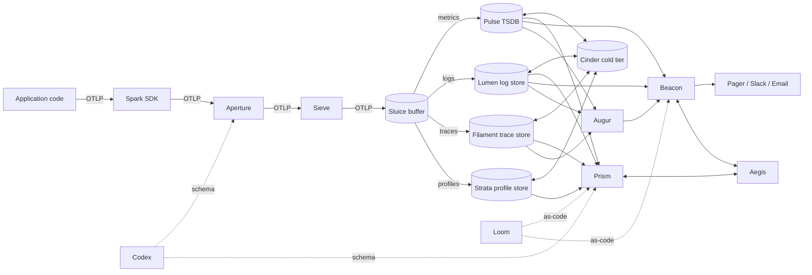
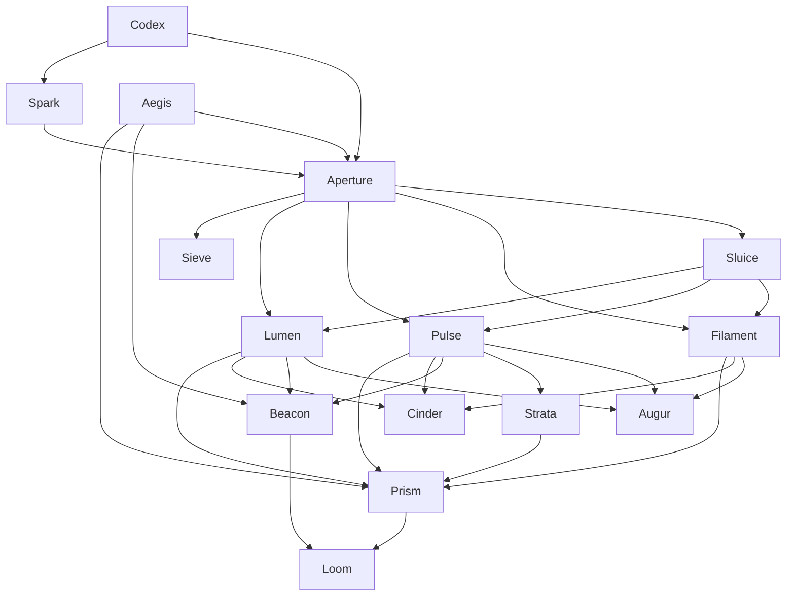
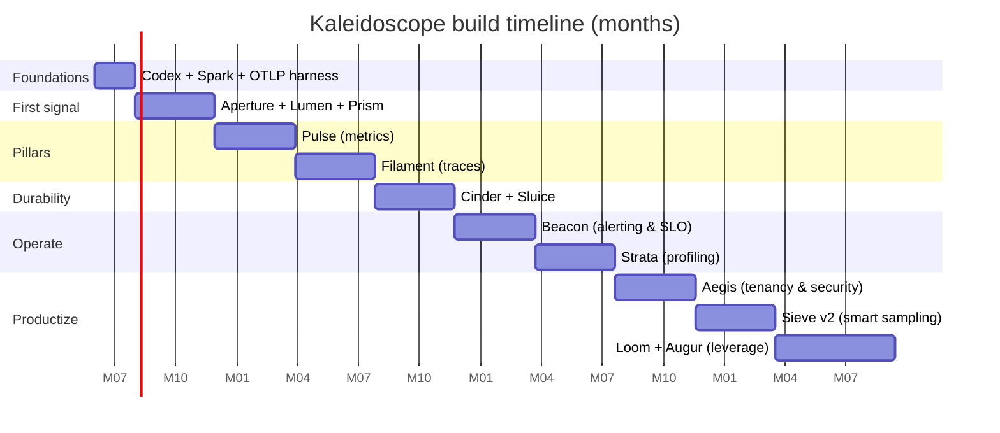

# Kaleidoscope — Build-It-All-Yourself Roadmap

> **Premise.** This roadmap assumes the *most ambitious* path: you are building every
> component of an OpenTelemetry-compatible observability platform from scratch, in-house.
> The realistic startup path (SaaS first → self-host OSS → build only what is special)
> is the phased plan in
> [`docs/research/observability/otel-compatible-observability-platform-comprehensive-research.md`](../research/observability/otel-compatible-observability-platform-comprehensive-research.md).
> Read that first — then come back here when you decide the special-snowflake path is
> warranted (or when you simply want the engineering ride of a lifetime).

---

## The metaphor

A **kaleidoscope** is an optical instrument. Light enters through an **aperture**, passes
along a tube of mirrors, and is **refracted by a prism** into a coherent, repeating
**spectrum**. Many fragments → one pattern.

That is exactly what an observability platform does to telemetry.

So every component in this system is named after a piece of an optical / light-bearing
apparatus. The metaphor is not decoration — it is a *contract*. Whenever you can't
explain how a new component fits the metaphor, you have probably scoped it wrong.

---

## Component catalogue

| Codename       | Role                                                  | Closest OSS analogue                                |
| -------------- | ----------------------------------------------------- | --------------------------------------------------- |
| **Spark**      | Auto-instrumentation SDKs (origin of telemetry)       | OpenTelemetry SDKs                                  |
| **Aperture**   | OTLP-compatible ingest gateway                        | OpenTelemetry Collector                             |
| **Sluice**     | Durable ingest buffer / write-shock absorber          | Kafka / Redpanda / NATS JetStream                   |
| **Sieve**      | Sampling & filtering processor                        | OTel tail-sampling processor                        |
| **Codex**      | Schema registry + semantic conventions service        | OTel semconv + custom schema service                |
| **Pulse**      | Time-series metrics engine (storage + query)          | Prometheus / Mimir / VictoriaMetrics                |
| **Lumen**      | Log storage & search engine                           | Loki / Elasticsearch / ClickHouse-on-logs           |
| **Filament**   | Distributed trace storage & query                     | Tempo / Jaeger / ClickHouse-on-traces               |
| **Strata**     | Continuous profiling storage                          | Pyroscope / Parca                                   |
| **Cinder**     | Cold-tier object-storage adapter                      | S3 / GCS / R2 layer used by Mimir/Tempo/Loki        |
| **Prism**      | Unified query & visualization frontend                | Grafana / Kibana                                    |
| **Beacon**     | Alerting + SLO burn-rate engine                       | Alertmanager / Grafana Alerting                     |
| **Augur**      | Anomaly detection / AIops layer                       | Datadog Watchdog / New Relic AI / Honeycomb BubbleUp|
| **Aegis**      | AuthN/AuthZ, multi-tenancy, audit                     | Custom + OIDC + OPA                                 |
| **Loom**       | Dashboards-as-code + alert-rules-as-code              | Grafonnet + Terraform Grafana provider              |

Each component is independently shippable, has its own SLOs, and exposes
**OTLP in / OTLP out** wherever it touches another component. That is the load-bearing
choice — it is what lets you reorder, swap, or kill any component without melting the
rest of the platform.

---

## Architecture (data flow)

---

## Build order (dependency DAG)

The DAG implies a **walking-skeleton** strategy: each phase delivers one end-to-end
slice (instrument → ingest → store → see), then thickens. Resist the temptation to
build all storage engines in parallel before you have a single dashboard rendering.

---

## Phased roadmap

Each phase is a **vertical slice**. Exit criteria are observable, not "feature complete".

### Phase 0 — Foundations *(months 0–2)*

**Goal:** lock in the wire contract and the metaphor before any storage code is written.

- **Codex (v0):** check in OTel semantic conventions verbatim. Fork only when you must.
  Publish them as a versioned package so every other component can compile against them.
- **Spark (v0):** wrap the upstream OTel SDK for your two highest-traffic languages
  (likely Go + TypeScript). Add only your *house resource attributes*
  (`tenant.id`, `feature_flag.*`, `experiment.id`).
- **OTLP conformance harness:** a test suite that any component must pass to claim
  "OTLP-compatible". This is the most important artifact of Phase 0 — it is the
  contract that keeps the system swappable for years.

**Exit criteria**
- A "hello world" service emits OTLP that round-trips through your harness.
- Codex is versioned and consumed by Spark.
- Resource-attribute lint runs in CI on every service.

**Team:** 2 engineers. **Infra cost:** ~zero.

---

### Phase 1 — First light: logs end-to-end *(months 2–6)*

**Goal:** one signal, one storage engine, one dashboard. The walking skeleton.

- **Aperture (v0):** thin OTLP gRPC + HTTP receiver, batching processor, file/S3 exporter.
  Single-binary, no clustering.
- **Lumen (v0):** logs go into a columnar store (ClickHouse is the pragmatic pick;
  Parquet-on-object-store + DataFusion if you are feeling architecturally pure).
  Per-tenant table, time-partitioned, tag-indexed.
- **Prism (v0):** a single SPA with a log search panel. SQL-ish query language is fine
  for v0 — *do not* invent a query language yet.

**Exit criteria**
- A developer can grep production logs through Prism within 10 seconds of emit.
- Lumen survives a 10× ingest spike for 5 minutes without dropping data
  (this is what tells you whether you need Sluice next).

**Team:** 3–4 engineers. **Infra cost:** single VM tier.

---

### Phase 2 — Pulse: metrics *(months 6–10)*

**Goal:** add the second pillar without breaking the first.

- **Pulse (v0):** TSDB. Either a from-scratch implementation on top of the Prometheus
  TSDB block format (do not invent a new on-disk format — the Prometheus block format
  is the one widely-understood standard) **or** wrap VictoriaMetrics' single-node binary
  while you build out tooling.
- **Aperture v1:** add the Prometheus-remote-write receiver and the OTLP-metrics receiver.
- **Prism v1:** dashboards. Static JSON, no editor yet — Loom will arrive in Phase 9.
- Cardinality budget per tenant, enforced at Aperture. (See "Anti-patterns" below for
  why this is non-negotiable.)

**Exit criteria**
- 4 Golden Signals visible for at least one production service.
- Cardinality budget breaches surface as Beacon-pager-able events (even if Beacon
  doesn't exist yet, log them loudly).

**Team:** +2 engineers (5–6 total). **Infra cost:** small cluster.

---

### Phase 3 — Filament: traces *(months 10–14)*

**Goal:** the third pillar, and the first taste of cross-signal correlation.

- **Filament (v0):** trace storage. ClickHouse again is the pragmatic pick;
  trace-id is the partition key, span attributes are columns.
- **Sieve (v0):** head-based probabilistic sampling at Aperture. Tail-based comes later.
- **Prism v2:** trace waterfall view. **Exemplars** linking metric data points to
  trace IDs is the killer feature — implement it now or you will retrofit it for years.

**Exit criteria**
- Click a spike in a Pulse latency graph → land on a slow trace in Filament.
- p99 trace search latency under 2 seconds for the last 24 h.

**Team:** 6–7 engineers. **Infra cost:** trace storage is the first time the bill bites.

---

### Phase 4 — Cinder + Sluice: durability *(months 14–18)*

**Goal:** stop treating data as ephemeral; survive the next outage.

- **Cinder (v0):** an S3/GCS-backed cold tier. All three storage engines (Pulse, Lumen,
  Filament) gain hot/warm/cold tiering. Hot = local SSD < 24 h, Warm = local SSD ≤ 7 d,
  Cold = object storage. The boundaries are tunable per tenant.
- **Sluice (v0):** a durable buffer in front of the storage engines. Kafka or Redpanda;
  do not roll your own queue. Aperture writes to Sluice; storage engines tail Sluice.
- Disaster-recovery drill: `kill -9` Lumen and replay the last hour from Sluice + Cinder.

**Exit criteria**
- One full DR drill per quarter completes within RTO.
- Storage retention extends from 14 days to 90 days at no more than 3× the Phase 3 cost.

**Team:** 7–8 engineers. **Infra cost:** object-storage costs are now the dominant line.

---

### Phase 5 — Beacon: alerting *(months 18–22)*

**Goal:** turn *seeing* into *being told*. Without Beacon, Kaleidoscope is a museum,
not a platform.

- **Beacon (v0):** alert-rule evaluation engine. Reads Pulse + Lumen, writes incidents
  to the integrations of your choice (PagerDuty, Opsgenie, Slack).
- **SLO engine:** burn-rate alerting using the Google SRE workbook's multi-window
  multi-burn-rate methodology. Implement the canonical 14.4 / 6 / 1 burn-rate table
  out of the box.
- Every component of Kaleidoscope gets its own SLOs, alerted by Beacon. Yes, that is
  recursive. Yes, that is the point — *you must observe the observer*.

**Exit criteria**
- A real incident is detected by Beacon before a customer reports it.
- Mean time-to-detect < 60 s for "service is down".
- All Kaleidoscope components have an availability SLO published in Prism.

**Team:** 8 engineers. **Infra cost:** marginal.

---

### Phase 6 — Strata: profiling *(months 22–26)*

**Goal:** the fourth pillar — *why* is the code slow, not just *that* it is.

- **Strata (v0):** continuous profiling storage. pprof-format ingest. Flamegraph view in
  Prism. Diff-flamegraph view between any two time windows.
- Exemplars from Pulse and Filament now link into Strata: metric → trace → flamegraph.

**Exit criteria**
- A regression detected by Beacon can be root-caused to a stack frame inside Strata
  without leaving Prism.

**Team:** 8–9 engineers. **Infra cost:** profile data is small but bursty.

---

### Phase 7 — Aegis: tenancy & security *(months 26–30)*

**Goal:** make Kaleidoscope safe to expose to other teams (or other companies).

- **Aegis (v0):** OIDC-backed AuthN, role-based + tenant-scoped AuthZ, audit log of
  every query. Tenant isolation enforced at Aperture (write-time) and at every storage
  engine's query layer (read-time).
- mTLS with SPIFFE/SPIRE between every internal component.
- PII scrubbing rules in Sieve, configurable per-tenant.
- Data-residency partitioning if you have EU customers. Do not pretend you can bolt
  this on later — you cannot.

**Exit criteria**
- Pen test passes.
- Two tenants share a cluster but cannot see each other's data, even at the storage
  engine's lowest layer (verified by red-team).

**Team:** 9–10 engineers. **Infra cost:** flat — but compliance audits are not free.

---

### Phase 8 — Sieve v2: smart sampling *(months 30–34)*

**Goal:** drop the noise without losing the signal.

- Tail-based sampling at Aperture: a span batch sits in memory for *N* seconds, the
  sampling decision is made on the *whole* trace (errors, latency outliers, tenant
  importance), not on the root span alone.
- Adaptive head sampling driven by a feedback loop from Filament's storage cost.
- Error-biased sampling: 100% retention of any trace whose root span is `error=true`.

**Exit criteria**
- Trace storage cost drops by ≥40% with **zero** loss of error traces.
- Sampling decisions are auditable per-tenant in Prism.

**Team:** 10 engineers. **Infra cost:** decreases. This phase pays for itself.

---

### Phase 9 — Loom + Augur: leverage *(months 34–40)*

**Goal:** the differentiation phase. Everything before this was table-stakes; this
phase is what justifies the build-it-all decision in the first place.

- **Loom (v0):** dashboards-as-code, alert-rules-as-code, SLOs-as-code. Versioned in
  Git. PR review for monitoring changes is now mandatory. *This is the moment your
  observability platform stops being a snowflake.*
- **Augur (v0):** anomaly detection. Start narrow: change-point detection on Pulse
  metrics, vector-similarity clustering on Lumen logs. Do **not** ship an LLM-on-logs
  feature in v0; it will produce confident nonsense and erode trust in the platform.
  Ship it in v1, only after Augur has earned its reputation on simpler tasks.

**Exit criteria**
- Every dashboard, alert, and SLO is reproducible from Git.
- Augur surfaces at least one real anomaly per week that Beacon's static thresholds
  missed, and triages it to a likely culprit (service / span / log line).

**Team:** 10–12 engineers. **Infra cost:** GPU bill if Augur uses learned models.

---

## At a glance

That is **~40 months** to feature-parity with the LGTM stack, with a peak team of
**10–12 engineers**. If those numbers shock you, the research doc's "use SaaS until
the bill is unbearable, then self-host OSS" path will look much more reasonable —
and that is the correct reaction.

---

## Risks & anti-patterns to watch

- **Cardinality runaway in Pulse.** The single biggest cost lever in any metrics system.
  Enforce a per-tenant label-count budget in Aperture from Phase 2 day one. Do not wait.
- **Inventing a query language too early.** SQL or PromQL-compatible is fine for years.
  A bespoke query language is a 5-engineer-decade tax.
- **"We will add multi-tenancy later."** You will not. Build at least the *plumbing* for
  Aegis (a `tenant.id` label everywhere) from Phase 1.
- **Letting Beacon page on raw thresholds instead of SLO burn rates.** You will get
  alert fatigue, then a real incident gets ignored. Burn-rate alerting from Phase 5 v0.
- **Building Prism before Beacon.** Pretty graphs do not wake people up. Alerts do.
  If you must reorder phases, pull Beacon left, never right.
- **Forgetting to observe Kaleidoscope itself.** Every component's own metrics, logs,
  traces flow through Kaleidoscope. The bootstrap problem (who watches the watcher when
  the watcher is down) is solved by sending Kaleidoscope's *own* telemetry to a
  *different* small watchdog — typically a SaaS free tier kept around exactly for this.
- **Sampling that drops errors.** Always retain 100% of error traces. Test this
  invariant in CI.
- **Treating Codex as a one-time deliverable.** Schema evolves. Codex needs a versioning
  story, deprecation policy, and a migration tool from day one.

---

## Quick-reference card

| Phase | Months | Component(s) shipped              | Headline outcome                                | Team |
| ----- | ------ | --------------------------------- | ----------------------------------------------- | ---- |
| 0     |  0–2   | Codex, Spark, OTLP harness        | Wire contract locked                            |  2   |
| 1     |  2–6   | Aperture, Lumen, Prism            | Logs end-to-end (walking skeleton)              |  3–4 |
| 2     |  6–10  | Pulse                             | Metrics + 4 Golden Signals                      |  5–6 |
| 3     | 10–14  | Filament, Sieve v0                | Traces + metric→trace exemplars                 |  6–7 |
| 4     | 14–18  | Cinder, Sluice                    | Durability, DR, 90-day retention                |  7–8 |
| 5     | 18–22  | Beacon                            | Alerting + SLO burn-rate                        |  8   |
| 6     | 22–26  | Strata                            | Profiling, full 4-pillar correlation            |  8–9 |
| 7     | 26–30  | Aegis                             | Multi-tenancy, security, compliance             |  9–10|
| 8     | 30–34  | Sieve v2                          | Tail-based + adaptive sampling                  | 10   |
| 9     | 34–40  | Loom, Augur                       | As-code config + anomaly detection              | 10–12|

---

## How to use this document

Treat it as a **reference architecture you will violate**. The phases are dependency-ordered,
not calendar-ordered — if you are a 4-engineer startup, you do not get to Phase 9. You
get to Phase 1, and you stay there for a while, and that is correct.

If at any phase the SaaS bill for the equivalent functionality is less than the salary
of the engineers building Kaleidoscope's next component, **stop and buy**. Kaleidoscope
is only worth building when its differentiation justifies the team it consumes.
