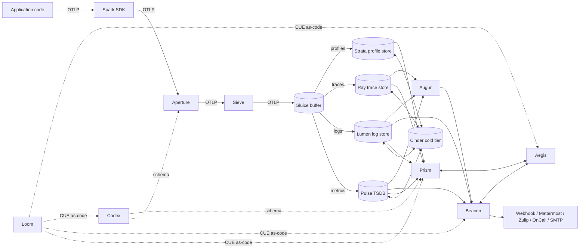
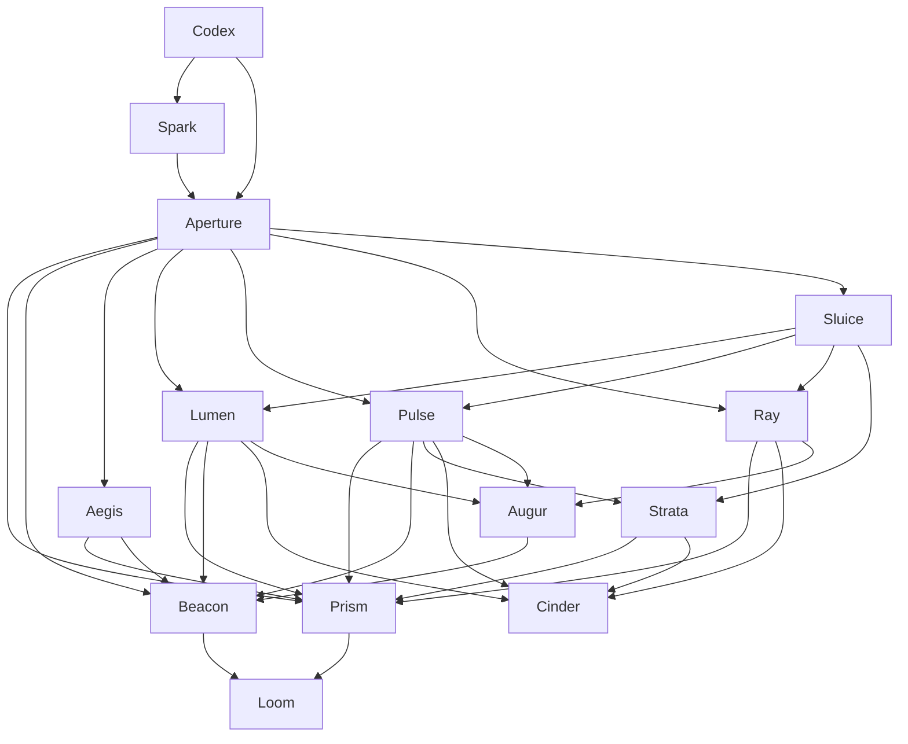
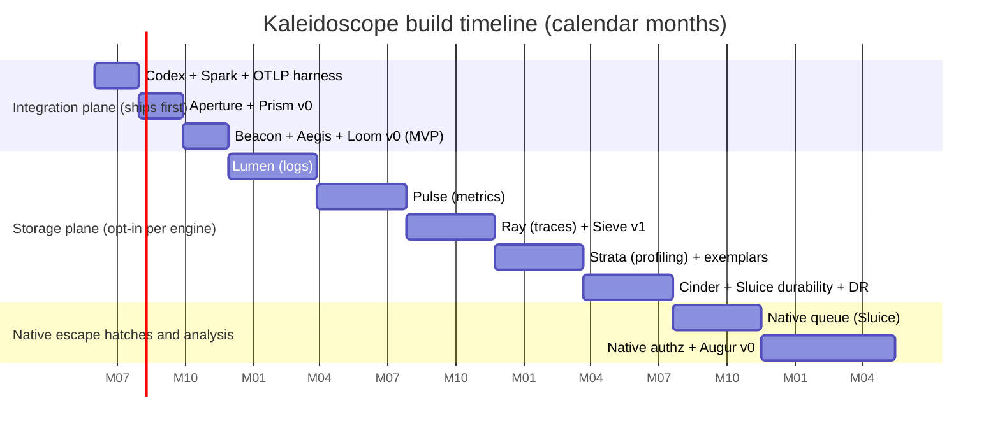

# Kaleidoscope — Implementation Roadmap

**Date**: 2026-05-03 | **Authors**: nw-researcher (Nova), iterated by Bea | **Companion document**: [`../architecture/kaleidoscope-architecture.md`](../architecture/kaleidoscope-architecture.md)

This document is the implementation roadmap. The companion architecture document is the structural model. The roadmap describes *when* each part of Kaleidoscope is built and what its exit criteria are. The architecture document describes *how* Kaleidoscope is structured: the fifteen components grouped into integration plane, storage plane, and cross-cutting analysis; the port-and-adapter discipline; the substrate libraries exempted from port discipline; and the system-context boundary.

---

## Executive Summary

Kaleidoscope is licensed in two classes by component role: platform components under AGPL-3.0-or-later, SDKs and protocol libraries under Apache-2.0. Contributions are accepted under the Developer Certificate of Origin; there is no Contributor Licence Agreement and there will not be one. The full rationale and per-crate table are in [`LICENSING.md`](../../LICENSING.md). The fifteen components are first-party Kaleidoscope code, built on Apache Foundation substrate (Arrow, Parquet, DataFusion, Iceberg) and the OpenTelemetry wire contracts (OTLP, semantic conventions, pprof). Every external dependency that is not Apache Foundation substrate hides behind a port and can be swapped via a different adapter without changing component code.

The roadmap implements the architectural model in three concentric layers, ordered by when each layer ships.

The **integration plane** ships first and is useful from day one. It is the OTel-everywhere wire contract (Spark, Aperture, Sieve, Sluice), the schema authority (Codex), the unified UI (Prism), the alerting and SLO engine (Beacon), the identity-and-tenancy layer (Aegis), and the dashboards-as-code authoring tool (Loom). Paired with any OTel-compatible storage backend the operator already runs, this is a deployable Kaleidoscope at month six.

The **storage plane** ships incrementally afterwards. Lumen for logs first, then Pulse for metrics, Ray for traces, Strata for profiles, and Cinder for the cold tier and durability. Each engine is opt-in when it lands; operators migrate off their existing storage at their own pace.

The **cross-cutting analysis plane** ships last. Augur for anomaly detection plus the first Kaleidoscope-native port escape hatches: a native queue replacing NATS JetStream and Apache Kafka KRaft, and a native authz engine replacing SpiceDB. Both are prioritised because message brokers and commercial-backed authz engines have the highest re-licensing risk among the project's external dependencies.

Calendar in this document is wall-clock time, measured in elapsed months from project start. Effort is described in conceptual terms (difficulty, integration surface, known unknowns) rather than human-engineer-month units, because work on Kaleidoscope is done by AI agents and human-effort numbers would mislead about project shape.

---

## Table of Contents

- [A. Licence and dependency posture](#a-licence-and-dependency-posture)
- [B. Foundational Building Blocks](#b-foundational-building-blocks)
- [C. Build-vs-Vendor per Kaleidoscope Component](#c-build-vs-vendor-per-kaleidoscope-component)
- [D. Phased Implementation Plan](#d-phased-implementation-plan)
- [E. What this commits Kaleidoscope to](#e-what-this-commits-kaleidoscope-to)
- [F. Licence Audit Appendix](#f-licence-audit-appendix)
- [G. FOSS Replacement Table](#g-foss-replacement-table)
- [H. Anti-patterns](#h-anti-patterns)
- [Knowledge Gaps](#knowledge-gaps)
- [Conflicting Information](#conflicting-information)
- [Citations](#citations)

---

## A. Licence and dependency posture

Kaleidoscope is licensed in two classes by component role. Server-side platform components (`aperture`, `sieve`, `sluice`, `pulse`, `lumen`, `ray`, `strata`, `cinder`, `prism`, `beacon`, `augur`, `aegis`, `loom`, the server-side parts of `codex`) are released under AGPL-3.0-or-later. Client-side and protocol code (`spark`, `otlp-conformance-harness`, generated code packages, schema registry client packages, the on-disk format specification) are released under Apache-2.0. Contributions are accepted under the Developer Certificate of Origin; there is no Contributor Licence Agreement and there will not be one. The trademark on the name and logo is reserved. Full rationale and the per-crate table are in [`LICENSING.md`](../../LICENSING.md).

The split is structural protection. AGPL closes the SaaS loophole that drove Elastic, MongoDB, Redis, and HashiCorp to abandon open source in the past few years. Apache-2.0 keeps the SDK class embeddable in proprietary application code without copyleft contamination. The no-CLA contribution model prevents any future maintainer or entity from concentrating enough copyright ownership to unilaterally re-license the project.

This posture **does require dependency cleanliness as a contract** under AGPL: any AGPL platform component that depends on a non-OSI or BSL or SSPL transitive imports compliance risk for downstream operators who run Kaleidoscope as a service. The Apache-2.0 SDK class is similarly disciplined to keep adoption frictionless. Section A.1 catalogues the disqualified licence families; section D enforces the policy via `cargo-deny`.

### A.1 Disqualified dependency categories (engineering practice)

| Licence family | Examples | Reason for exclusion |
|---|---|---|
| Business Source Licence (BSL / BUSL) | HashiCorp Vault (post-2023), HashiCorp Terraform (post-2023), Redpanda, MariaDB MaxScale | Time-bounded conversion to a permissive licence does not make BSL open-source today; OSI does not approve BSL [Source: opensource.org/blog/the-fight-over-the-future-of-open-source]. |
| Server-Side Public Licence (SSPL) | MongoDB (post-2018), Elasticsearch (2021–2024) | OSI explicitly rejected SSPL as not open-source [Source: opensource.org/blog/the-sspl-is-not-an-open-source-license]. |
| "Source Available" / Functional Source Licence (FSL) / "Fair Source" | Sentry (post-FSL), BetterStack enterprise | Use restrictions disqualify these from OSI definition criteria 5 and 6. |
| Custom non-OSI vendor licences | Llama Community Licence, Confluent Community Licence, Redis Source Available Licence (RSAL) | Unilateral vendor licences with field-of-use restrictions. Non-portable. |
| Closed-source / SaaS-only | Datadog, New Relic, Splunk Observability Cloud, PagerDuty, Slack | Cannot be self-hosted; unsuitable as bundled dependencies. |

The acceptable licence families for transitive dependencies are Apache-2.0, MIT, BSD (2/3-clause and 0BSD), ISC, MPL-2.0, CC0-1.0 (some Mozilla CA-list crates ship under CDLA-Permissive-2.0 specifically and are also acceptable), and dual-licensed combinations of the above. LGPL and GPL transitives are evaluated case by case for the AGPL platform crates and are not acceptable for the Apache-2.0 SDK class. Replacement choices for excluded tools are catalogued in section G. CI enforcement via `cargo-deny` and `go-licenses` is described per-phase in section D.

### A.2 The no-telemetry-on-telemetry commitment

Kaleidoscope, the platform that captures other systems' telemetry, does not itself emit telemetry to any third party. No phone-home, no anonymous usage reporting, no "licence check" pings, no version-check beacons. No bundled crash reporters: no Sentry, no Bugsnag, no Rollbar SDK pre-wired into the build. No vendor-side analytics on the documentation site or web UI; self-hosted analytics (Plausible Community Edition, Umami, Matomo) are acceptable for project-site traffic where the operator chooses to run them. No telemetry in the install scripts. The platform's own telemetry — Kaleidoscope observing Kaleidoscope — is sent to a Kaleidoscope cluster the operator runs. The bootstrap problem (who watches the watcher when the watcher is down) is documented in section H; the recursive answer is a small second Kaleidoscope cluster watching the primary.

## B. Foundational Building Blocks

This section enumerates the FOSS *libraries*, *formats*, and *protocols* on which Kaleidoscope is built. The distinction matters: a library is something Kaleidoscope embeds and re-implements behaviour around; a format is a wire or on-disk specification anyone may read and write; a protocol is an interoperability contract. None of the entries below are competing observability platforms.

The architecture document distinguishes **substrate** from **adapter**. Substrate libraries (Apache Arrow, Apache Parquet, Apache DataFusion, Apache Iceberg, plus the language runtimes and foundational network libraries) are too well-protected by Apache Foundation governance and too widely adopted for re-licensing to be a credible risk; they are exempt from the port-and-adapter discipline. Higher-risk dependencies (message brokers, KV stores, identity providers, authz engines, secrets backends) are bound through ports as documented in section C; the entries in this section that bind a port are noted as such. See [`../architecture/kaleidoscope-architecture.md`](../architecture/kaleidoscope-architecture.md) for the full strata view.

### B.1 The columnar substrate: Arrow + Parquet + DataFusion + Iceberg

The four-layer Apache columnar stack is the most consequential single building-block decision in this roadmap. It is what allows Kaleidoscope's storage engines (Pulse, Lumen, Ray, Strata) to be built without taking ClickHouse, Druid, Pinot, or Elasticsearch as a runtime dependency.

| Layer | Project | Licence | Role in Kaleidoscope |
|---|---|---|---|
| In-memory format | Apache Arrow | Apache-2.0 | Columnar in-memory data interchange. Every storage engine reads/writes in Arrow. |
| On-disk format | Apache Parquet | Apache-2.0 | Default on-disk format for warm/cold tiers. Spec at parquet.apache.org. |
| Query engine | Apache DataFusion | Apache-2.0 | SQL execution and DataFrame API over Arrow. Written in Rust, embeddable as a library. |
| Table format | Apache Iceberg | Apache-2.0 | Versioned table abstraction over Parquet files in object storage. ACID semantics, schema evolution, hidden partitioning. Spec at iceberg.apache.org/spec/. |

**Why these are building blocks, not competing platforms**: Arrow is a *memory format*; Parquet is a *file format*; Iceberg is a *table format specification*; DataFusion is a *query engine library*. None of them are products that an end user runs as a service. Kaleidoscope embeds DataFusion the way ClickHouse embeds its own query engine — as code, not as a service. Kaleidoscope writes Parquet files the way every modern OLAP system does — as a file format, not as a vendor lock-in.

**Verification**:
- Apache Arrow purpose and licence: [arrow.apache.org](https://arrow.apache.org/) (accessed 2026-05-03). Apache 2.0 confirmed by Apache Software Foundation governance.
- Apache DataFusion is a top-level Apache project with Arrow as its in-memory format: [datafusion.apache.org](https://datafusion.apache.org/) (accessed 2026-05-03).
- Apache Iceberg spec: [iceberg.apache.org/spec/](https://iceberg.apache.org/spec/) (accessed 2026-05-03).
- Apache Parquet format: [parquet.apache.org](https://parquet.apache.org/) (accessed 2026-05-03), spec at [github.com/apache/parquet-format](https://github.com/apache/parquet-format).

**Confidence**: High. All four are top-level Apache projects under Apache-2.0, the most stable governance arrangement in the FOSS world.

### B.2 The metric format: Prometheus TSDB block format as a specification

Pulse, Kaleidoscope's metrics engine, does not embed Prometheus, Mimir, or VictoriaMetrics. It implements **the Prometheus TSDB on-disk block format as a specification**. The format is documented and licence-clean: the Prometheus repository is Apache-2.0, and the TSDB format documentation at [github.com/prometheus/prometheus/blob/main/tsdb/docs/format/README.md](https://github.com/prometheus/prometheus/blob/main/tsdb/docs/format/README.md) is part of that licensed corpus.

The block layout is:

```
data/
  01HXX.../          # 2-hour block
    chunks/          # 512MB segments of compressed sample data
    index            # postings list + symbol table
    meta.json
    tombstones
  chunks_head/       # in-progress chunks
  wal/               # 128MB write-ahead log segments
```

**Why the format, not the binary**: importing the Prometheus TSDB binary as an embedded library would import all of Prometheus's transitive dependencies and HTTP API surface. Implementing the format gives Kaleidoscope wire-compatibility (a TSDB block produced by Prometheus can be read by Pulse, and vice-versa) without the dependency.

**Confidence**: Medium-High. The format is documented and stable but is not an IETF or Apache-foundation specification, so its long-term stability is implicitly tied to the Prometheus project's continued use of it.

**Source**: [prometheus.io/docs/prometheus/latest/storage/](https://prometheus.io/docs/prometheus/latest/storage/) (accessed 2026-05-03).

### B.3 The trace and profile formats: OTLP and pprof

Kaleidoscope adopts two open wire formats wholesale:

- **OTLP** for traces, metrics, and logs (and increasingly profiles). gRPC on port 4317, HTTP/protobuf on port 4318. The protocol is defined at [opentelemetry.io/docs/specs/otlp/](https://opentelemetry.io/docs/specs/otlp/) and the protobuf schemas are at [github.com/open-telemetry/opentelemetry-proto](https://github.com/open-telemetry/opentelemetry-proto), Apache-2.0.
- **pprof** for profiling. The format is `profile.proto` from the Google pprof project, Apache-2.0 [Source: github.com/google/pprof, accessed 2026-05-03]. Linux's perf, the Go runtime, async-profiler, Parca, and Pyroscope all emit pprof.

**Confidence**: High. Both are widely-implemented open formats with multiple independent reference implementations.

### B.4 The network and runtime layer

For the Rust-language components (the storage engines, the query engine), Kaleidoscope uses the Tokio ecosystem. For Go-language components (the agent, the gateway, the orchestration tooling), the standard library plus gRPC-Go.

| Layer | Library | Licence |
|---|---|---|
| Async runtime (Rust) | Tokio | MIT |
| HTTP/1.1 + HTTP/2 client/server (Rust) | Hyper | MIT |
| gRPC over Tokio + Hyper (Rust) | Tonic | MIT |
| Async runtime (Go) | Go standard library | BSD-3-Clause |
| gRPC (Go) | gRPC-Go | Apache-2.0 |
| Protobuf encoding (Rust) | Prost | Apache-2.0 |
| Protobuf encoding (Go) | google.golang.org/protobuf | BSD-3-Clause |

**Source**: [github.com/hyperium/tonic](https://github.com/hyperium/tonic) (MIT confirmed, accessed 2026-05-03); [github.com/grpc/grpc-go](https://github.com/grpc/grpc-go) (Apache-2.0 standard for gRPC reference implementations).

### B.5 The buffer: NATS JetStream then Apache Kafka KRaft

The durable ingest buffer (Sluice) has two build-it-ourselves candidates. Both are Apache-2.0. Redpanda is **excluded** because, despite marketing itself as Kafka-compatible, its core licence is the BSL-1.1 [Source: redpanda.com legal pages, confirmed at github.com/redpanda-data/redpanda/blob/dev/licenses/rcl.md, accessed 2026-05-03]. Confluent and the AWS MSK, Aiven, Instaclustr managed offerings are commercial services and are excluded by the no-managed-services rule.

| Choice | Licence | When | Rationale |
|---|---|---|---|
| NATS JetStream | Apache-2.0 | v0 (Phase 1–4) | Single binary. RAFT-based linearisability. Embeddable in tests. Two orders of magnitude smaller operational surface than Kafka. |
| Apache Kafka KRaft | Apache-2.0 | v1+ (Phase 5+) | KRaft mode removes the ZooKeeper dependency. Production scale beyond ~1M msg/s/partition. Industry-default exactly-once semantics. |

**Source**:
- NATS Apache-2.0 confirmed: [github.com/nats-io/nats-server](https://github.com/nats-io/nats-server) (accessed 2026-05-03).
- Apache Kafka Apache-2.0 confirmed: [kafka.apache.org](https://kafka.apache.org/) (accessed 2026-05-03).
- Redpanda RCL/BSL exclusion confirmed: [github.com/redpanda-data/redpanda/blob/dev/licenses/rcl.md](https://github.com/redpanda-data/redpanda/blob/dev/licenses/rcl.md) (accessed 2026-05-03). The Community Edition references BSL 1.1 explicitly.

### B.6 The embedded storage: RocksDB and FoundationDB

For per-node embedded state (write-ahead logs, indexes, head series in Pulse), the choices are:

| Library | Licence | Use case |
|---|---|---|
| RocksDB | Apache-2.0 (or GPLv2 dual) | Single-node embedded LSM key-value store. Default for Pulse head, Lumen index. |
| FoundationDB | Apache-2.0 | Distributed transactional KV when ACID across the cluster is required (Codex schema registry, Aegis tenant catalogue). |

RocksDB is dual-licensed Apache-2.0 / GPLv2 [Source: github.com/facebook/rocksdb, accessed 2026-05-03]. Kaleidoscope chooses the Apache-2.0 grant. FoundationDB is Apache-2.0, originally Apple, now community-maintained at [foundationdb.org](https://www.foundationdb.org/).

### B.7 The identity and policy layer

| Concern | Library | Licence | Role |
|---|---|---|---|
| Workload identity | SPIFFE/SPIRE | Apache-2.0 | mTLS between Kaleidoscope components. CNCF graduated 2022. |
| OIDC federation | Dex | Apache-2.0 | Federated identity broker for Aegis. |
| Self-contained IdP | Keycloak | Apache-2.0 | When operators want a full IdP, not just a federation broker. |
| Policy engine | OPA (Open Policy Agent) | Apache-2.0 | Authorization rules in Rego. CNCF graduated 2021. |
| Relationship-based authz | SpiceDB | Apache-2.0 | Zanzibar-inspired fine-grained authz when RBAC is insufficient. |
| Relationship-based authz (alt) | OpenFGA | Apache-2.0 | CNCF sandbox alternative to SpiceDB. |
| Secrets management | OpenBao | MPL-2.0 | The FOSS Vault successor. OpenSSF sandbox project, Linux Foundation. |

**Verification**:
- SPIFFE/SPIRE CNCF graduation September 2022, Apache-2.0: [spiffe.io](https://spiffe.io/) (accessed 2026-05-03).
- Dex Apache-2.0 confirmed: [github.com/dexidp/dex](https://github.com/dexidp/dex) (accessed 2026-05-03).
- OPA Apache-2.0: [github.com/open-policy-agent/opa](https://github.com/open-policy-agent/opa) (CNCF graduated project).
- SpiceDB Apache-2.0 confirmed: [github.com/authzed/spicedb](https://github.com/authzed/spicedb) (accessed 2026-05-03).
- OpenFGA Apache-2.0 confirmed: [github.com/openfga/openfga](https://github.com/openfga/openfga) (accessed 2026-05-03).
- OpenBao MPL-2.0 confirmed, OpenSSF sandbox project: [github.com/openbao/openbao](https://github.com/openbao/openbao) (accessed 2026-05-03).

### B.8 The frontend stack

Prism, Kaleidoscope's UI, is a single-page application. The stack is deliberately conventional to keep the SPA replaceable:

| Layer | Library | Licence |
|---|---|---|
| Language | TypeScript | Apache-2.0 |
| UI framework | React | MIT |
| Charts | Apache ECharts | Apache-2.0 |
| Build tooling | Vite | MIT |
| State | Zustand or TanStack Query | MIT |

Apache ECharts is preferred over D3-only or Chart.js because it is the only chart library with full Apache governance and the breadth required for time-series, log-bucket, trace-waterfall, and flame-graph visualisations [Source: echarts.apache.org].

**Architectural note**: the SPA is a separate repository with its own release cadence. Releasing the UI on a faster cadence than the back-end is the standard pattern for observability projects (Grafana releases monthly, Mimir quarterly) and avoids tying UX iteration to back-end stability.

### B.9 The configuration layer: CUE

For dashboards-as-code, alerts-as-code, SLOs-as-code, Kaleidoscope adopts CUE.

CUE is Apache-2.0 [Source: github.com/cue-lang/cue, accessed 2026-05-03] and its data-validation-and-unification semantics are a strict superset of YAML and JSON Schema, with native interoperability with both. The Grafana, Istio, and Tekton projects use CUE for their configuration schemas — sufficient prior art that the choice is not a research bet.

**Why not Jsonnet?** Jsonnet is Apache-2.0 too. CUE wins on three grounds: stronger validation (CUE catches type errors that Jsonnet does not), schema-first design (Kaleidoscope's Codex emits CUE schemas natively), and a single tool replacing both Jsonnet (templating) and JSON Schema (validation).

**Why not HCL?** Because HCL is the configuration language of Terraform, and Terraform is BSL-licensed since August 2023. HCL itself remains MPL-2.0, but the ecosystem signal is unambiguous: HashiCorp tooling has made the choice not to remain open. Kaleidoscope routes around it.

## C. Build-vs-Vendor per Kaleidoscope Component

A kaleidoscope is an optical instrument. Light enters through an aperture, passes along a tube of mirrors, and is refracted by a prism into a coherent, repeating spectrum. Many fragments resolve into one pattern. Every Kaleidoscope component is named after a piece of that optical apparatus, and the metaphor is not decoration: it is a contract on naming and scope. Spark is the origin of the telemetry signal. Aperture is the controlled opening through which the signal first enters the platform. Sluice carries the flow durably between stages. Sieve filters and samples. Codex codifies the schema the signal must obey. Pulse, Lumen, Ray, and Strata are the storage engines for the four signal types — metrics, logs, traces, and profiles — each named for an optical or light-bearing element that holds a particular kind of light. Cinder is the long-lived residue, the cold-tier object-storage adapter. Prism refracts the stored signal into the visible spectrum of charts, traces, and flame-graphs. Beacon is the alerting layer that turns refracted light into a signal someone responds to. Augur reads patterns in the spectrum. Aegis guards the apparatus. Loom weaves the configuration of every other component into a single Git-versioned cloth. Whenever a new component cannot be named within the optical metaphor, the suspicion is that the component has been scoped wrong.

The load-bearing rule for the section that follows is the **embed-vs-wrap test**, refined into the **port-and-adapter discipline** in the architecture document. Embedding a FOSS *library* (Apache DataFusion as a Rust crate inside Pulse, Tantivy as an indexing crate inside Lumen, OPA as a Go module inside Aegis, NATS JetStream as an embedded Go module inside Sluice) is permitted and expected. A library is code; the Kaleidoscope component is a service. Wrapping a FOSS *platform* (running Grafana Mimir as a separate process and proxying Pulse traffic to it, running Grafana Loki as a back-end behind a Lumen façade, running Grafana itself as a renderer behind Prism) is forbidden. A platform is a peer.

Where a Kaleidoscope component would otherwise depend on an external service that is neither a peer platform nor pure substrate (Apache Kafka KRaft as an external broker, FoundationDB as an external transactional KV, SpiceDB as an external authz engine), the dependency is hidden behind a **port** — an interface plus conformance test vectors that any compliant adapter must pass. Today's adapters bind to those FOSS services; tomorrow's may be Kaleidoscope-native. Substrate libraries (Apache Arrow, Parquet, DataFusion, Iceberg) are exempt from port discipline because Apache Foundation governance makes their re-licensing risk structurally near-zero. The port-and-adapter framing is documented in detail in [`../architecture/kaleidoscope-architecture.md`](../architecture/kaleidoscope-architecture.md).

Kaleidoscope's promise is to compete with peer platforms from the same starting line they had: open libraries, open formats, open protocols. The temptation to relax that promise appears in every phase and is treated explicitly in section H.

This section walks each of the 15 Kaleidoscope components in approximate build order and answers four questions: what we build in-house, which FOSS libraries the build sits on, what wire and format contracts the component honours, and which obvious upstream peer we are explicitly *not* wrapping. The fourth question is the one that distinguishes this roadmap from a tech-stack draft. It is not enough to say what we use; we must be precise about what we refuse to use, and why. The contracts between components are, with no exception, OpenTelemetry-defined wire formats: OTLP/gRPC and OTLP/HTTP for ingest and inter-component transport, OpenTelemetry Semantic Conventions for resource attributes, the OTel Profiles signal (and pprof while OTel Profiles stabilises) for profiling, and the OTLP signal types for traces, metrics, and logs as defined by the OpenTelemetry specification. Where OTel does not yet specify a contract — alerting payloads are the canonical example — Kaleidoscope follows the closest OTel patterns and contributes back upstream.

### C.1 Codex — schema registry and semantic conventions service

**What we build.** A schema registry server that hosts the OpenTelemetry semantic conventions verbatim, plus Kaleidoscope's house resource attributes (`tenant.id`, `feature_flag.*`, `experiment.id`), plus per-tenant schema extensions. The server exposes a CUE-validating endpoint, a Protobuf descriptor endpoint, and a CC-BY-4.0 published HTML rendering of every active version. The on-disk schema corpus is a Git-backed CUE module.

**Library substrate.** CUE (Apache-2.0) for schema validation; Tonic + Prost (MIT / Apache-2.0) for the gRPC service; FoundationDB (Apache-2.0) for the schema-version catalogue; the OpenTelemetry semantic-conventions repository (Apache-2.0) as the upstream content source.

**Wire / format contract.** In: CUE schema documents, Protobuf descriptors, OTel semconv YAML. Out: gRPC `GetSchema(version)` returning a Protobuf descriptor; HTTP `GET /schema/{version}.cue` returning a CUE module; HTTP `GET /semconv/{version}.html` returning the rendered specification.

**Why we don't wrap the obvious upstream peer.** The naive draft would point Codex at Confluent Schema Registry. Confluent Schema Registry is under the Confluent Community Licence, which is a non-OSI source-available licence with field-of-use restrictions. Wrapping it would import a non-OSI dependency into the schema-control plane of every Kaleidoscope deployment — precisely the surface where vendor lock-in is most damaging. Apicurio Registry (Apache-2.0) would be a defensible alternative, but Codex's contract is narrower than a generic schema registry: it must natively understand OTel semconv evolution rules, which Apicurio does not. Building from CUE and FoundationDB is cheaper than re-shaping Apicurio.

### C.2 Spark — auto-instrumentation SDKs

**What we build.** Thin wrappers around the OpenTelemetry SDKs for Go, TypeScript, Python, Java, and Rust, adding Kaleidoscope's house resource attributes, automatic Codex-version pinning, and a strict resource-attribute lint that fails CI if a required attribute is missing. Spark is in the SDK class and is therefore Apache-2.0, so it can be embedded into closed-source customer applications without copyleft contamination. The Apache-2.0 patent grant is the standard SDK posture and is what every OpenTelemetry SDK Spark wraps already provides.

**Library substrate.** OpenTelemetry SDKs (Apache-2.0) for each target language; the OTel API contract from `opentelemetry-proto` (Apache-2.0); language-native build toolchains.

**Wire / format contract.** In: application calls in the OTel SDK API. Out: OTLP/gRPC on port 4317 to Aperture, OTLP/HTTP on port 4318 as a fallback.

**Why we don't wrap the obvious upstream peer.** The peer here is Grafana Alloy (AGPL-3.0). Wrapping Alloy would be a category error: Alloy is itself a collector, not an SDK. Embedding an AGPL-3.0 collector inside customer applications would propagate AGPL terms into customer code; Spark is Apache-2.0 precisely so it imposes no such friction on consumers.

### C.3 Aperture — OTLP-compatible ingest gateway

**What we build.** A multi-protocol receiver (OTLP/gRPC, OTLP/HTTP, Prometheus remote-write, Loki push API for migration users), a batching processor, a per-tenant cardinality budget enforcer, a Codex-validated resource-attribute checker, and an exporter that writes to Sluice. Single binary, horizontally scalable, stateless.

**Library substrate.** Tonic + Hyper + Tokio (MIT) for the network layer; Prost (Apache-2.0) for OTLP protobuf; the OTel collector's *pdata* model (Apache-2.0) reused as a *library import*, not as a binary; SPIFFE/SPIRE (Apache-2.0) for mTLS to downstream services.

**Wire / format contract.** In: OTLP/gRPC, OTLP/HTTP, Prometheus remote-write, Loki push, Fluent Bit forward. Out: OTLP records to Sluice, with NATS subjects or Kafka topics keyed by `(tenant, signal-type)`.

**Why we don't wrap the obvious upstream peer.** The peer is the OpenTelemetry Collector itself, in distribution form. The collector is excellent and Apache-2.0 — we use the *libraries inside it* (pdata, OTLP receiver), but we do not ship the collector binary as Aperture. The reason is contract clarity: the OTel collector exposes a vast configuration surface (hundreds of receivers and exporters across the contrib distribution) that is far larger than Kaleidoscope's policy permits. Aperture's surface is deliberately narrow: the protocols Kaleidoscope ingests, plus tenant-aware cardinality enforcement that the upstream collector does not provide. Forking the collector to add cardinality enforcement is harder than building Aperture on the collector's libraries.

### C.4 Sieve — sampling and filtering processor

**What we build.** A two-stage sampling engine. Stage one is head-based probabilistic sampling at Aperture (cheap, lossy, biased to retain errors). Stage two, in v2, is tail-based sampling that holds span batches in memory for *N* seconds, applies a per-tenant rule programme, and emits sampling decisions on the *whole* trace. PII-scrubbing rules are co-located in Sieve and authored in CUE.

**Library substrate.** Tokio (MIT) for the in-memory window; CUE (Apache-2.0) for rule authoring; OTel collector's tail-sampling processor source (Apache-2.0) as a *library reference* — Kaleidoscope's tail sampler is rewritten to operate on Arrow record batches rather than the collector's *pdata* objects, because it must integrate with the columnar substrate downstream.

**Wire / format contract.** In: OTLP records from Aperture. Out: OTLP records to Sluice, plus a sampled-out audit stream to Lumen.

**Why we don't wrap the obvious upstream peer.** The peer is again the OTel collector's tail-sampling processor. We use it as a reference, not as an embedded library, because the upstream processor's data model is row-oriented and would force a row-to-column conversion at every storage write. Building Sieve native to Arrow eliminates that conversion cost on the hot path.

### C.5 Sluice — durable ingest buffer

**What we build.** A thin abstraction layer over the buffer of the day. The abstraction exposes `Produce(tenant, signal, batch)` and `Consume(tenant, signal, offset)`. The implementation is NATS JetStream in v0–v4 and Apache Kafka KRaft in v5+. The abstraction is the Kaleidoscope-owned artefact; the buffer engine is the substrate.

**Library substrate.** NATS JetStream (Apache-2.0) embedded as a library for v0; Kafka KRaft (Apache-2.0) operated as an external cluster from v5; the Sarama or franz-go client (MIT) for Kafka access from Go components; the rdkafka or fluvio-rs client for Rust components — both Apache-2.0 or MIT.

**Wire / format contract.** In: OTLP record batches keyed by `(tenant, signal)`. Out: the same, with monotonic offsets per partition and at-least-once delivery semantics. Exactly-once is a Kafka-only guarantee available from v5 onwards.

**Why we don't wrap the obvious upstream peer.** The peer is Redpanda. Redpanda is the Kafka-API alternative most often reached for in greenfield projects because of its single-binary operational profile. It is excluded because its Redpanda Community Licence is BSL-1.1 with a four-year delayed Apache-2.0 conversion. BSL is not OSI-approved and not open-source today; "it will be open in four years" does not satisfy the FOSS contract today. NATS JetStream gives us the single-binary operational profile in v0 without the licence trap, and Kafka KRaft gives us the production scale in v5 without the licence trap.

### C.6 Cinder — cold-tier object-storage adapter

**What we build.** A storage abstraction that maps each storage engine's hot-warm-cold lifecycle onto an object store. The abstraction supports S3, GCS, Azure Blob, MinIO, and SeaweedFS via a single trait; per-tenant prefixing; per-tenant lifecycle policies; integrity-checked Parquet files with Iceberg manifests.

**Library substrate.** Apache Iceberg Rust (Apache-2.0) for the table-format layer; Apache Parquet (Apache-2.0) for file IO; the AWS, GCP, and Azure SDK crates for the object-store back-ends (Apache-2.0 / MIT); MinIO as the FOSS reference object store for self-hosted deployments (AGPL-3.0; we depend on its S3-compatible *protocol*, not its binary).

**Wire / format contract.** In: Arrow record batches plus Iceberg manifest updates. Out: Parquet files in object storage; Iceberg snapshots; a Cinder-internal metadata index in FoundationDB.

**Why we don't wrap the obvious upstream peer.** There is no single peer. The naive draft would adopt the cold-tier modules of Mimir, Loki, and Tempo (which all wrap S3 in their own way). Kaleidoscope cannot consume those because they are the platforms it competes with. Iceberg-on-Parquet is the open-format equivalent and has the side benefit that any external lakehouse query engine (Trino, DuckDB, Spark) can read Cinder data directly.

### C.7 Lumen — log storage and search engine

**What we build.** A log storage engine with a hot tier (RocksDB-backed, last 24 hours, full-text indexed via Tantivy), a warm tier (Parquet on local SSD, last 7 days, columnar-scanned by DataFusion), and a cold tier (Parquet on object storage via Cinder). Query language is SQL, executed by DataFusion with Lumen-specific operators for log-line tokenisation and JSON path traversal.

**Library substrate.** Apache Arrow + Apache Parquet + Apache DataFusion (all Apache-2.0); RocksDB (Apache-2.0 grant) for the hot tier; Tantivy (MIT) for full-text inverted indexes; Iceberg-Rust (Apache-2.0) for the cold-tier table format.

**Wire / format contract.** In: OTLP log records from Sluice. Out: SQL over HTTP (DataFusion's wire format); a Loki-compatible HTTP query API for migration users; results in Arrow Flight format for Prism.

**Why we don't wrap the obvious upstream peer.** The peer is Grafana Loki. Loki is AGPL-3.0 — licence-compatible, in principle, with a Kaleidoscope platform service that is also AGPL-3.0. Wrapping Loki would nonetheless cost: (a) it makes Lumen a wrapper around a competing platform that Kaleidoscope can never differentiate from, (b) it inherits Loki's label-cardinality model which is poorly suited to the high-cardinality structured-log use case Kaleidoscope targets, and (c) it cedes the storage-format roadmap to Grafana Labs. ClickHouse-on-logs is the other peer, excluded because its Server-Side Public Licence — wait, ClickHouse is Apache-2.0; the exclusion is rather that ClickHouse is a competing OLAP *platform* and embedding it would make Lumen an unmaintainable ClickHouse fork. Building on Arrow + Parquet + DataFusion gives us the same query-engine power without the platform dependency.

### C.8 Pulse — time-series metrics engine

**What we build.** A metrics engine that implements the Prometheus TSDB on-disk block format as a *specification*, plus an Arrow-native query engine that compiles PromQL to DataFusion logical plans. The hot tier holds the head block in RocksDB; the warm tier persists 2-hour blocks to local SSD; the cold tier sends sealed blocks to Cinder.

**Library substrate.** RocksDB (Apache-2.0) for the head; the Prometheus TSDB block format documentation as the on-disk specification (the Prometheus repository is Apache-2.0, but Pulse implements the format in Rust rather than embedding the Prometheus binary); Apache Arrow + DataFusion (Apache-2.0) for the query engine; PromQL parser ported from `promql-parser` (Apache-2.0).

**Wire / format contract.** In: OTLP metrics, Prometheus remote-write. Out: PromQL over HTTP for compatibility; SQL over Arrow Flight for Prism; Prometheus TSDB block files on disk and in Cinder.

**Why we don't wrap the obvious upstream peer.** The peer is Grafana Mimir, which is itself a fork-and-extension of Cortex. Mimir is AGPL-3.0; wrapping it would, again, cede the roadmap to Grafana Labs and make Pulse undifferentiated. VictoriaMetrics is a second peer, Apache-2.0, but commercially controlled by VictoriaMetrics Inc. with a parallel Enterprise edition under a non-OSI licence; the open-core split creates exactly the re-licensing pressure Kaleidoscope's governance is designed to resist by example. Pulse owns the format and the engine, full stop.

### C.9 Ray — distributed trace storage

**What we build.** A trace storage engine partitioned on `trace_id`, with span attributes as columnar fields, and a service-graph extractor that runs on every batch. The trace search index is a Tantivy inverted index on service, operation, and tag values. The cold tier is Iceberg-on-Parquet via Cinder.

**Library substrate.** Apache Arrow + Parquet + DataFusion (Apache-2.0); RocksDB (Apache-2.0) for the hot trace index; Tantivy (MIT) for the trace-tag inverted index; Iceberg-Rust (Apache-2.0) for cold storage; the OTLP trace protobuf schema (Apache-2.0).

**Wire / format contract.** In: OTLP trace records from Sluice. Out: SQL over Arrow Flight for Prism; the Tempo HTTP query API for compatibility with `traceql` users; the Jaeger gRPC API for legacy clients.

**Why we don't wrap the obvious upstream peer.** The peers are Grafana Tempo (AGPL-3.0) and Jaeger (Apache-2.0, CNCF graduated). Tempo is excluded for the same competing-platform reason as Mimir and Loki. Jaeger is interesting — it is genuinely a competing platform, but its storage backends are pluggable, and its UI is replaceable by Prism. The cost of wrapping Jaeger is that Kaleidoscope inherits Jaeger's *legacy* trace data model rather than the OTel-native model, and inherits Cassandra or Elasticsearch as the storage backend. Both costs are higher than building on Arrow + Parquet + DataFusion.

### C.10 Strata — continuous profiling storage

**What we build.** A profile storage engine that ingests pprof, decomposes the call-graph into a flame-graph DAG persisted in columnar form, and exposes a flame-graph and diff-flame-graph query API. Hot tier in RocksDB; warm and cold tiers in Parquet via Cinder.

**Library substrate.** The `pprof-rs` crate (Apache-2.0) for pprof decoding; Apache Arrow + Parquet + DataFusion (Apache-2.0) for storage and query; RocksDB (Apache-2.0) for the hot tier; the symbolisation library `gimli` and `addr2line` (Apache-2.0 / MIT) for offline symbol resolution.

**Wire / format contract.** In: pprof-format profiles via OTLP profiles or a Strata-native push API. Out: flame-graph JSON for Prism; pprof-format profiles for `go tool pprof` interoperability.

**Why we don't wrap the obvious upstream peer.** The peers are Grafana Pyroscope (AGPL-3.0) and Polar Signals Parca (Apache-2.0). Pyroscope is excluded as a competing AGPL platform; Parca is more interesting because it is genuinely Apache-2.0 and well-engineered. The reason Strata does not wrap Parca is the same reason it does not wrap Jaeger: Parca has its own storage format and query model that does not align with Kaleidoscope's columnar substrate. Embedding Parca would mean two storage stacks in one platform. Building on Arrow + Parquet keeps Strata format-aligned with the other three storage engines (Lumen for logs, Pulse for metrics, Ray for traces) — one columnar substrate across all four pillars, with Cinder serving the same Parquet files from cold tier.

### C.11 Prism — unified query and visualisation frontend

**What we build.** A single-page React + TypeScript application that connects to Pulse, Lumen, Ray, and Strata via Arrow Flight. Panels include time-series, log search, trace waterfall, and flame-graph. Dashboards are CUE documents stored in Codex. Alert and SLO definitions live in Beacon; Prism only renders them.

**Library substrate.** TypeScript (Apache-2.0); React (MIT); Apache ECharts (Apache-2.0) for time-series, bar, scatter, and heatmap; D3 (BSD-3-Clause) for the trace-waterfall and flame-graph custom panels; Vite (MIT) for build tooling; Zustand (MIT) for state; TanStack Query (MIT) for data fetching; Arrow JS (Apache-2.0) for Arrow Flight decoding.

**Wire / format contract.** In: Arrow Flight from each storage engine; CUE dashboards from Codex; user input from the browser. Out: HTML/JS to the browser; per-tenant audit log to Aegis.

**Why we don't wrap the obvious upstream peer.** The peer is Grafana itself. Grafana is the gravitational centre of the FOSS observability frontend ecosystem; not building on it is the most disciplined choice in this entire roadmap. Grafana is AGPL-3.0 and would be licence-compatible. The reason it is excluded is the founding promise: Kaleidoscope competes with Grafana, and a competitor cannot be a wrapper of its competitor. The plug-in surface that makes Grafana powerful would also be the surface through which Grafana Labs sets Kaleidoscope's UX roadmap. The cost of building Prism in-house is real — months of front-end engineering — but the cost of building on Grafana is the abandonment of the project's reason to exist.

### C.12 Beacon — alerting and SLO burn-rate engine

**What we build.** A rule-evaluation engine that reads from Pulse and Lumen on a schedule, evaluates CUE-defined alert rules and SLO burn-rate rules per the Google SRE workbook's multi-window-multi-burn-rate methodology, and emits incidents to a small set of integrations: webhook (universal), Mattermost, Zulip, email (SMTP), and Grafana OnCall (AGPL-3.0; chosen as the FOSS on-call layer because PagerDuty and Opsgenie are commercial SaaS). A small inhibition and grouping logic prevents alert storms.

**Library substrate.** Tokio + Hyper (MIT); CUE (Apache-2.0) for rule definitions; the Pulse query API and the Lumen query API as the only data sources; a small SMTP client (e.g. `lettre`, MIT/Apache-2.0).

**Wire / format contract.** In: CUE alert and SLO definitions from Codex; query results from Pulse and Lumen. Out: incident events to integrations; alert state to Aegis for audit.

**Why we don't wrap the obvious upstream peer.** The peer is Prometheus Alertmanager (Apache-2.0). Alertmanager is excellent and Apache-2.0; it is genuinely tempting to embed. Beacon does not embed it for one decisive reason: Alertmanager's notification routing is rigidly tied to its receiver protocol, and Kaleidoscope needs the routing to be CUE-defined and tenant-scoped. The amount of Alertmanager that would survive after that rework is small enough that re-implementing it in Rust on top of Tokio is cheaper than maintaining a fork. The on-call peer is Grafana OnCall, which Kaleidoscope *does* recommend as an external integration target — Beacon emits to OnCall, but does not embed it; the on-call user-facing UX is large enough to be its own product, and Grafana OnCall already exists.

### C.13 Loom — dashboards-as-code and alert-rules-as-code

**What we build.** A CUE-based authoring and lifecycle tool for dashboards (Prism), alerts and SLOs (Beacon), sampling rules (Sieve), and tenant policies (Aegis). Loom is a CLI plus a small server. The CLI runs in CI to validate, plan, and apply changes; the server holds a Git-backed state. PR review is the change-control surface.

**Library substrate.** CUE (Apache-2.0) for the entire schema and templating layer; `git2-rs` (LGPL-2.1, dynamically linked) or `gix` (Apache-2.0/MIT, preferred) for Git operations; a small Tonic gRPC server.

**Wire / format contract.** In: CUE files in Git. Out: applied state in Codex (schemas), Beacon (rules), Prism (dashboards), Aegis (policies).

**Why we don't wrap the obvious upstream peer.** The peers are Grafonnet (Apache-2.0), the Terraform Grafana provider (BSL because Terraform is BSL), and `grizzly` (Apache-2.0). Grafonnet is rejected because it is built on Jsonnet, and Kaleidoscope has chosen CUE. The Terraform provider is rejected because Terraform itself is BSL since August 2023 — adopting it would import BSL into the change-control surface of every Kaleidoscope deployment. OpenTofu (MPL-2.0) is the FOSS Terraform fork, and Kaleidoscope's documentation will provide an OpenTofu module for users who want it, but Loom's primary surface is CUE, not HCL.

### C.14 Aegis — multi-tenancy, AuthN/AuthZ, audit

**What we build.** A tenant catalogue, an OIDC client and broker layer, an authorisation engine that wraps OPA for RBAC and SpiceDB for relationship-based authz, an audit log of every query and every administrative action, and the SPIFFE/SPIRE control plane for mTLS between Kaleidoscope components. PII-scrubbing policy authoring also lives here, executed by Sieve.

**Library substrate.** Dex (Apache-2.0) as the OIDC federation broker; Keycloak (Apache-2.0) packaged as an optional bundled IdP; OPA (Apache-2.0) embedded as a library for RBAC; SpiceDB (Apache-2.0) operated as an external service for relationship-based authz; SPIFFE/SPIRE (Apache-2.0) for workload identity; OpenBao (MPL-2.0) for secret material; FoundationDB (Apache-2.0) for the tenant catalogue.

**Wire / format contract.** In: OIDC tokens from upstream IdPs; SPIFFE SVIDs from SPIRE; CUE policy definitions from Codex. Out: AuthZ decisions to Aperture, Prism, Beacon, and every storage engine; audit events to Lumen.

**Why we don't wrap the obvious upstream peer.** There is no single competing platform here, but there are several anti-patterns to avoid. HashiCorp Vault is excluded by BSL — replaced by OpenBao. Auth0 and Okta are excluded by SaaS — replaced by Keycloak or an external OIDC IdP via Dex. The temptation to use the Grafana enterprise auth bundle is rejected because it is a non-OSI commercial product. Building Aegis as a thin orchestration layer over OPA + SpiceDB + SPIFFE + Dex + OpenBao is the build-it-ourselves path.

### C.15 Augur — anomaly detection and AIops

**What we build.** A modest, reputation-conservative anomaly-detection engine. Phase-9 v0 ships change-point detection on Pulse metrics (Bayesian online change-point detection, BOCPD), vector-similarity clustering on Lumen log lines (using a small open embedding model, e.g. `all-MiniLM-L6-v2` from sentence-transformers, Apache-2.0), and rare-trace detection on Ray span shapes. v1 introduces a small open LLM (Qwen 2.5 7B or Mistral 7B Instruct, both under permissive open-weights licences) for log-cluster summarisation only, never for autonomous incident triage.

**Library substrate.** Python for the model layer (the only Python in the platform); `numpy`, `scipy`, `scikit-learn` (BSD-3-Clause); `sentence-transformers` (Apache-2.0); `vllm` or `llama.cpp` (Apache-2.0 / MIT) for local LLM inference; the Pulse, Lumen, and Ray query APIs as the only data sources.

**Wire / format contract.** In: time-series and log-cluster batches pulled from the storage engines on a schedule. Out: anomaly events to Beacon; cluster summaries to Lumen as enriched metadata.

**Why we don't wrap the obvious upstream peer.** The peer that a naive draft would reach for is one of the commercial AIops vendors — Datadog Watchdog, New Relic AI, Honeycomb BubbleUp — all SaaS-only and excluded. The OSS peer is sparse: there is no clear Apache-2.0 AIops platform of comparable scope. Augur is therefore genuinely a Kaleidoscope-native build, on top of widely-used Apache-2.0 / BSD model libraries. Llama is **excluded** as the LLM substrate because the Llama Community Licence is not OSI-approved and contains commercial-use restrictions. Qwen 2.5 (Apache-2.0 weights) and Mistral 7B (Apache-2.0 weights) are the build-it-ourselves alternatives.

### C.16 Integration architecture (data flow)

The fifteen components compose into a single coherent platform whose external and inter-component contracts are OpenTelemetry-defined wire formats. Spark emits OTLP. Aperture accepts OTLP and emits OTLP. Sluice carries OTLP record batches. Sieve consumes OTLP and emits OTLP with sampling-decision metadata. Pulse, Lumen, Ray, and Strata persist OTLP-shaped records. Cinder reads and writes Parquet files governed by Iceberg manifests. Prism reads via each storage engine's Arrow Flight endpoint. Beacon reads from Pulse and Lumen and emits incident events. Codex governs schema validation across all of the above. Aegis enforces tenant scoping at every contract boundary. Loom holds the CUE-versioned source-of-truth for dashboards, alerts, SLOs, sampling, and tenant policy. Augur reads from the storage engines and emits anomaly events to Beacon.



The diagram is the integration contract. Any change to a wire format must be reflected here, in the OTLP conformance harness shipped in phase 0, and in the Codex-pinned semconv version active at the time of the change. There is no inter-component contract that is not in this diagram and not OTel-shaped.

## D. Phased Implementation Plan

The phasing implements the architectural model in three concentric layers, ordered by when each layer ships. The integration plane ships first because it is genuinely useful by itself, paired with any OTel-compatible storage backend the operator already runs. The storage plane ships incrementally afterwards, each engine opt-in when it lands. The cross-cutting analysis plane ships last, alongside the first Kaleidoscope-native port escape hatches.

Calendar in this section is wall-clock months from project start. Effort is described in conceptual terms (difficulty, integration surface, known unknowns) rather than human-engineer-month units. The licence audit checkpoint at every phase boundary is non-negotiable: it runs `cargo-deny check licenses` on every Rust crate's `Cargo.lock`, `go-licenses report` on every Go binary's module graph, `licensecheck` on every C/C++ vendored dependency, and a manual review against the disqualifying-licence list in section A.1. A phase does not exit until the audit passes.

### Phase 0 — Foundations (months 0–2)

- **Goal.** Lock in the wire contract and the schema authority before any storage code is written.
- **Deliverables.** Codex v0 service exposing pinned OTel semconv as a CUE module and Protobuf descriptor; Spark v0 SDK wrappers for Go and TypeScript adding house resource attributes (`tenant.id`, `feature_flag.*`, `experiment.id`) and Codex-version pinning; OTLP conformance harness as a public test repository with reference test vectors; project scaffolding files (`LICENSE`, `THIRD-PARTY-LICENSES.md`, `CONTRIBUTING.md`, `.gitignore`).
- **FOSS libraries used.** OpenTelemetry SDKs (Apache-2.0); OpenTelemetry semantic conventions (Apache-2.0); CUE (Apache-2.0); Tonic + Prost (MIT / Apache-2.0); FoundationDB (Apache-2.0) behind the txn-KV port.
- **OTel conformance.** OTLP/gRPC and OTLP/HTTP receivers in the harness pass the OpenTelemetry OTLP specification ([opentelemetry.io/docs/specs/otlp/](https://opentelemetry.io/docs/specs/otlp/)) for all four signals; Spark resource-attribute lint enforces OpenTelemetry Semantic Conventions ([opentelemetry.io/docs/concepts/semantic-conventions/](https://opentelemetry.io/docs/concepts/semantic-conventions/)).
- **Proof of "we built it ourselves".** The OTLP conformance harness is the proof — a black-box test suite any OTLP-compatible binary (Kaleidoscope's or third-party) must pass.
- **Difficulty.** Modest. The harness and SDK wrappers ride on upstream OpenTelemetry libraries; the schema-registry service is a small Tonic service over FoundationDB.
- **Exit criteria.** A "hello world" service emits OTLP that round-trips through the conformance harness; Codex v0 serves the pinned semconv version; Spark v0 wraps the OTel SDK in both target languages; the resource-attribute lint runs in CI on a sample service.
- **Licence audit checkpoint.** First end-to-end audit. Establishes the baseline `THIRD-PARTY-LICENSES.md` and the CI-failure thresholds for `cargo-deny` and `go-licenses`.

### Phase 1 — Aperture and Prism (months 2–4)

- **Goal.** First viewable telemetry through Kaleidoscope, paired with whatever storage backend the operator already runs.
- **Deliverables.** Aperture v0 with OTLP/gRPC and OTLP/HTTP receivers, batching, and a forwarding exporter that can ship OTLP to any external OTel-compatible backend (Mimir / Loki / Tempo / Grafana Cloud / Datadog); Prism v0, a single-page React + TypeScript application with a query panel that reads from the same external backend via OTLP query APIs (PromQL, LogQL, TraceQL) or OTLP-out forwarders.
- **FOSS libraries used.** Tonic + Hyper + Tokio (MIT) for Aperture; OpenTelemetry collector pdata library (Apache-2.0); React + Apache ECharts + Vite + TypeScript (Apache-2.0 / MIT) for Prism.
- **OTel conformance.** Aperture round-trips all four signal types through the harness from phase 0; Prism's query layer speaks OTLP-defined query semantics for any backend it consumes.
- **Proof of "we built it ourselves".** Aperture's processor pipeline is first-party Kaleidoscope code, not a re-skinned OTel Collector binary; Prism is a first-party SPA, not a Grafana plug-in.
- **Difficulty.** Modest. Aperture is a Tonic service plus batch processors; Prism v0 is a deliberately small SPA with one panel.
- **Exit criteria.** A user can instrument a service via Spark, route through Aperture, and see logs / metrics / traces in Prism — all on top of an external OTel-compatible backend the operator already runs.
- **Licence audit checkpoint.** Adds Aperture's processor chain and the React frontend chain. Verify no transitive dependency under `Cargo.lock` or `package-lock.json` is BSL, SSPL, FSL, or custom non-OSI.

### Phase 2 — Beacon, Aegis, Loom v0 (months 4–6) — *MVP boundary at month 6*

- **Goal.** Operating tools: alerting, identity, configuration as code. After this phase the integration plane is a complete, deployable Kaleidoscope.
- **Deliverables.** Beacon v0 with CUE-defined alert rules and the SLO engine implementing Google SRE workbook 14.4 / 6 / 1 multi-window-multi-burn-rate; integrations to webhook, Mattermost, Zulip, SMTP, and Grafana OnCall; Aegis v0 with OIDC AuthN via Dex (embedded as a Go library), RBAC via embedded OPA, audit log of every query, mTLS between internal components via SPIFFE/SPIRE; Loom v0 with CUE-based dashboards-as-code, alert-rules-as-code, SLOs-as-code, all Git-versioned and PR-reviewed.
- **FOSS libraries used.** Tokio + Hyper (MIT); CUE (Apache-2.0); Dex (Apache-2.0); OPA (Apache-2.0); SPIFFE/SPIRE (Apache-2.0); SpiceDB (Apache-2.0) operated as an external service via the authz port; OpenBao (MPL-2.0) operated as an external service via the secrets port; FoundationDB (Apache-2.0) for the tenant catalogue via the txn-KV port; `lettre` (MIT/Apache-2.0) for SMTP; `gix` (Apache-2.0 / MIT) for Loom's Git operations.
- **OTel conformance.** Beacon's evaluation reads from any OTLP-compatible backend; Aegis's audit-log payloads follow OpenTelemetry Logs semantic conventions.
- **Proof of "we built it ourselves".** Beacon's CUE schema for alert and SLO rules is checked in; the tenant-scoping contract for the Aegis port is documented and red-team tested in CI; Loom's CUE schemas for dashboards / alerts / SLOs are public.
- **Difficulty.** Medium. The hardest sub-task is the SLO burn-rate engine; the implementation is a translation of the Google SRE Workbook ([sre.google/workbook/alerting-on-slos/](https://sre.google/workbook/alerting-on-slos/)) into CUE and Tokio.
- **Exit criteria.** **MVP boundary.** A real incident is detected by Beacon before a customer reports it; mean time-to-detect under 60 seconds for "service is down"; two tenants share a cluster but cannot see each other's data; every dashboard / alert / SLO is reproducible from Git via Loom; the integration plane runs over an external OTel backend with no Kaleidoscope-native storage.
- **Licence audit checkpoint.** Major audit. Adds Dex, OPA, SpiceDB, SPIFFE, OpenBao. Confirm no HashiCorp Vault binary or library is in the dependency tree (BSL exclusion); confirm PagerDuty and Opsgenie SDKs are not in the dependency tree of any default-installed component.

### Phase 3 — Lumen: first-party log engine (months 6–10)

- **Goal.** First Kaleidoscope-native storage engine. Operators can migrate logs off Loki / Elasticsearch when they choose.
- **Deliverables.** Lumen v0 with the hot tier on RocksDB (via the embedded-KV port) and the warm tier on local Parquet, queryable via DataFusion SQL; Aperture v1 routing log signals to Lumen as well as forwarding; Prism log-search panel with Tantivy full-text indexing.
- **FOSS libraries used.** Apache Arrow + Parquet + DataFusion (Apache-2.0) as substrate; Tantivy (MIT) for full-text indexing; RocksDB (Apache-2.0) behind the embedded-KV port.
- **OTel conformance.** Lumen ingests, persists, and round-trips OTLP logs in conformance with the OpenTelemetry Logs specification ([opentelemetry.io/docs/specs/otel/logs/](https://opentelemetry.io/docs/specs/otel/logs/)).
- **Proof of "we built it ourselves".** The Lumen on-disk Parquet schema is checked in as a CUE document; reference test vectors for ingest and query are part of the conformance harness.
- **Difficulty.** High. First storage engine; first time the team writes an Arrow + Parquet + DataFusion engine to observability scale. Known unknowns: ingest backpressure under bursty workloads, query-cost predictability for adversarial regex searches, retention-tier transition correctness.
- **Exit criteria.** A developer can grep production logs through Prism within 10 seconds of emit; Lumen survives a 10× ingest spike for 5 minutes without dropping data; an operator can flip a configuration switch to migrate from their previous log backend to Lumen, with parallel double-write supported during the migration window.
- **Licence audit checkpoint.** Adds the columnar substrate (Arrow / Parquet / DataFusion) and Tantivy. Verify Loki and Elasticsearch are *not* in the dependency tree.

### Phase 4 — Pulse: first-party metrics engine (months 10–14)

- **Goal.** Metrics pillar Kaleidoscope-native. Operators can migrate off Mimir / VictoriaMetrics when they choose.
- **Deliverables.** Pulse v0 with the head block on the embedded-KV port and 2-hour blocks on disk per the Prometheus TSDB format spec; PromQL parser and translator to DataFusion logical plans; Aperture v1 with Prometheus remote-write and OTLP-metrics receivers; Prism metric dashboards; per-tenant cardinality budget enforcement at Aperture.
- **FOSS libraries used.** As phase 3, plus a port of `promql-parser` (Apache-2.0) to Rust; the Prometheus TSDB format documentation (Apache-2.0 corpus, used as a specification, not as an embedded binary).
- **OTel conformance.** Aperture's OTLP/metrics receiver passes the OpenTelemetry OTLP specification for metrics; Pulse round-trips OTLP metrics through ingest and query.
- **Proof of "we built it ourselves".** The Pulse on-disk block layout is checked in as a Markdown spec citing the Prometheus format; cross-compatibility test vectors prove a Prometheus-produced block can be read by Pulse and vice versa.
- **Difficulty.** High. The hardest sub-task is the PromQL-to-DataFusion translator; high-cardinality test vectors are sparse in the public domain.
- **Exit criteria.** Four Golden Signals visible for at least one production service; cardinality-budget breaches surface as Beacon-pageable events; Pulse passes the cross-compatibility test against an upstream Prometheus binary.
- **Licence audit checkpoint.** Adds the PromQL parser port. Verify no Prometheus binary is being linked or embedded — only the format documentation is consumed.

### Phase 5 — Ray: first-party trace engine + Sieve v1 (months 14–18)

- **Goal.** Traces pillar Kaleidoscope-native, plus the first taste of cross-signal correlation. Operators can migrate off Tempo when they choose.
- **Deliverables.** Ray v0 with `trace_id`-partitioned Arrow + Parquet storage; Sieve v1 with head-based probabilistic sampling at Aperture (error-biased: 100 percent of error traces retained, enforced as a CI invariant); Prism trace-waterfall view; **exemplars** linking Pulse data points to Ray trace IDs.
- **FOSS libraries used.** As before, plus the OTLP trace protobuf schema (Apache-2.0) and `pprof-rs` (Apache-2.0, foreshadowed for Strata).
- **OTel conformance.** Ray ingests, persists, and round-trips OTLP traces in conformance with the OpenTelemetry Traces specification ([opentelemetry.io/docs/specs/otel/trace/](https://opentelemetry.io/docs/specs/otel/trace/)) with no Kaleidoscope-specific enrichments that would prevent OTel-native consumers from reading the data.
- **Proof of "we built it ourselves".** The Ray Iceberg-on-Parquet schema is checked in; the exemplar wire format between Pulse and Ray is documented and included in the conformance harness.
- **Difficulty.** High. Trace-search query patterns are diverse and hard to optimise without deep workload data; exemplar correlation across two storage engines is a first-of-its-kind for the project.
- **Exit criteria.** Click a spike in a Pulse latency graph, land on a slow trace in Ray; p99 trace search latency under 2 seconds for the last 24 hours; error traces are never sampled out (CI-enforced invariant).
- **Licence audit checkpoint.** Adds the trace protobufs and the head-sampler implementation. Verify no Jaeger or Tempo binary is being embedded.

### Phase 6 — Strata: first-party profiling + cross-pillar exemplars (months 18–22)

- **Goal.** Fourth pillar Kaleidoscope-native. Full four-pillar correlation — metric → trace → flame-graph — without leaving Prism.
- **Deliverables.** Strata v0 with pprof ingest, Arrow-columnar flame-graph storage, and a flame-graph + diff-flame-graph view in Prism; exemplars from Pulse and Ray linking into Strata.
- **FOSS libraries used.** `pprof-rs` (Apache-2.0); `gimli` and `addr2line` (Apache-2.0 / MIT) for symbolisation; Apache Arrow + Parquet + DataFusion (Apache-2.0); RocksDB via the embedded-KV port.
- **OTel conformance.** Strata emits and ingests pprof in conformance with the upstream pprof format ([github.com/google/pprof/blob/main/proto/profile.proto](https://github.com/google/pprof/blob/main/proto/profile.proto)) verified by interoperability with `go tool pprof`; Strata tracks the OpenTelemetry Profiles signal specification ([opentelemetry.io/docs/specs/otel/profiles/](https://opentelemetry.io/docs/specs/otel/profiles/)) and exposes the conformance gap explicitly while the signal is still in development.
- **Proof of "we built it ourselves".** The Strata on-disk flame-graph schema (a columnar DAG layout) is checked in; reference pprof-to-Strata conversion test vectors are part of the conformance harness.
- **Difficulty.** Medium. The columnar flame-graph layout is novel but bounded; symbolisation is well-understood.
- **Exit criteria.** A regression detected by Beacon can be root-caused to a stack frame inside Strata without leaving Prism; Pulse/Ray exemplars deep-link into Strata.
- **Licence audit checkpoint.** Adds the pprof and symbolisation chain. Confirm no Pyroscope or Parca binary is embedded.

### Phase 7 — Cinder + Sluice: durability, cold tier, disaster recovery (months 22–26)

- **Goal.** Production-grade retention and DR. Stop treating data as ephemeral.
- **Deliverables.** Cinder v0 with hot/warm/cold tiering for Lumen, Pulse, Ray, and Strata, backed by S3-compatible object storage (via the object port through Apache OpenDAL) and Iceberg manifests; Sluice v0 with NATS JetStream embedded as a library (default) and an external-Kafka-KRaft adapter (operator-deployed via a Kubernetes operator) both bound to the queue port; a documented disaster-recovery drill that kills Lumen and replays the last hour from Sluice + Cinder.
- **FOSS libraries used.** Apache OpenDAL (Apache-2.0) for the object port; Apache Iceberg-Rust (Apache-2.0); NATS JetStream (Apache-2.0); Apache Kafka KRaft (Apache-2.0) via the external adapter; the Strimzi operator pattern for Kafka lifecycle automation. MinIO (AGPL-3.0) is supported as a *protocol-compatible* operator-deployed object store.
- **OTel conformance.** Cinder and Sluice are signal-format agnostic; they preserve OTLP envelopes through tiering and queueing.
- **Proof of "we built it ourselves".** The Cinder lifecycle policy schema and the Sluice queue-port abstraction are checked in as CUE; the DR-drill runbook is in the public docs.
- **Difficulty.** Medium-high. Cinder's tiering correctness under crash conditions is the hardest sub-task; Sluice's adapter abstraction is comparatively bounded.
- **Exit criteria.** One full DR drill per quarter completes within RTO; storage retention extends to 90 days at cost-effective rates; cold-tier data is queryable directly by external Iceberg-aware engines (proof: a Trino smoke-test query against Cinder's S3 prefix returns results); Redpanda is *not* in the dependency tree.
- **Licence audit checkpoint.** Adds OpenDAL, Iceberg-Rust, the NATS JetStream embed, and the Kafka KRaft adapter. Confirm Redpanda exclusion.

### Phase 8 — Native queue: first port escape hatch (months 26–30)

- **Goal.** Stop depending on NATS JetStream and Kafka KRaft as the queue substrate. Reduce re-licensing exposure on the highest-risk external dependency category (message brokers — Redpanda already gone, NATS / Synadia governance not foundation-locked).
- **Deliverables.** A Kaleidoscope-native queue implementation behind the existing queue port, conformance-tested against the same vectors as the NATS JetStream and Kafka adapters; Sluice v1 with the native queue as the new default and the JetStream / Kafka adapters retained as alternatives.
- **FOSS libraries used.** Tokio + Hyper + Tonic (MIT / Apache-2.0); RocksDB via the embedded-KV port for durable state; the substrate columnar libraries are not used here (queue, not analytics).
- **OTel conformance.** The native queue carries OTLP record batches transparently; the queue's own operational telemetry is OTLP-emitted to Pulse and Lumen.
- **Proof of "we built it ourselves".** The native queue's wire protocol and on-disk WAL format are checked in as specifications; conformance vectors are run side-by-side against the legacy adapters.
- **Difficulty.** High. Replicated logs with crash-correctness are an old, well-studied, but unforgiving problem.
- **Exit criteria.** The native queue passes all conformance vectors that NATS JetStream and Kafka pass; an operator can migrate Sluice from JetStream to the native queue without downtime; the queue port's interface is unchanged from phase 7.
- **Licence audit checkpoint.** Adds nothing major; audit confirms continued compliance.

### Phase 9 — Native authz + Augur v0 (months 30–36)

- **Goal.** Stop depending on SpiceDB as the authz substrate (commercial-backed, open-core risk per section H). Ship the modest cross-cutting analysis plane.
- **Deliverables.** A Kaleidoscope-native relationship-based authz engine behind the existing authz port, Zanzibar-modelled, conformance-tested against the same vectors as the SpiceDB adapter; Aegis v1 with the native authz as the new default; Augur v0 with Bayesian online change-point detection on Pulse, vector-similarity log-cluster detection on Lumen, and rare-trace detection on Ray; Augur's small-LLM summarisation layer using Qwen 2.5 7B or Mistral 7B (both Apache-2.0 weights) with strict guardrails — summarisation only, never autonomous incident triage.
- **FOSS libraries used.** Substrate libraries for the authz engine; for Augur: `numpy`, `scipy`, `scikit-learn` (BSD-3-Clause); `sentence-transformers` (Apache-2.0) for embeddings; `vllm` or `llama.cpp` (Apache-2.0 / MIT) for inference; Qwen 2.5 or Mistral 7B (Apache-2.0 weights). Llama is *excluded* (Llama Community Licence is non-OSI).
- **OTel conformance.** Augur's anomaly events follow the closest available OTel patterns and contribute upstream where the OTel project does not yet specify a contract.
- **Proof of "we built it ourselves".** The native authz on-disk schema and Zanzibar tuple-store are checked in; Augur's BOCPD implementation, embedding pipeline, and LLM-prompt corpus are public.
- **Difficulty.** High. The native authz engine has the same correctness bar as the queue but a more complex semantic model. Augur is comparatively easy because v0 is deliberately modest.
- **Exit criteria.** Native authz passes all conformance vectors that SpiceDB passes; Augur surfaces at least one real anomaly per week that Beacon's static thresholds missed and triages it to a likely culprit (service / span / log line); every dashboard / alert / SLO / sampling rule remains reproducible from Git.
- **Licence audit checkpoint.** Final pre-1.0 audit. Confirm Llama is *not* in the model-weights catalogue; confirm `vllm` and `llama.cpp` are the only inference engines; confirm `sentence-transformers` and the embedding model are Apache-2.0.

### Build-order dependency DAG

The phase ordering is dependency-driven. The DAG below shows which Kaleidoscope component must precede which; phases 0 to 2 (the integration plane) are the inflexible foundation, and phases 3 onwards admit some reordering at the project's discretion.



The integration-plane components (Codex, Spark, Aperture, Prism, Beacon, Aegis, Loom) form a connected sub-graph that ships first and is useful by itself. Storage components (Lumen, Pulse, Ray, Strata, Cinder) join the graph as opt-in alternatives to the operator's existing backends. Augur joins last as a cross-cutting reader of every storage engine.

### Calendar Gantt



Total wall-clock is approximately 36 calendar months from project start to phase-9 exit, with the deployable MVP at month 6.

## E. What this commits Kaleidoscope to

The phasing in section D commits Kaleidoscope to a deployable product at month six (the integration plane on top of any external OTel backend) and to incremental Kaleidoscope-native storage engines through to month thirty-six (when native authz ships and the analysis plane is complete). Two ways to read the cost.

**Wall-clock honesty.** Thirty-six months is a long time to wait for full feature parity with the platforms Kaleidoscope replaces. The decision the model is built to make defensible is to ship the integration plane fast and let the storage plane mature on its own slower timeline rather than holding the whole project hostage to the storage engines. The MVP at month six is real. Operators get a useful product six months in. Storage engines that arrive afterwards are upgrades, not the headline release.

**Comparison to the integration-only path.** Some teams will only ever want the integration plane and will be content to keep their existing Mimir / Loki / Tempo / Grafana Cloud / Datadog backends behind it indefinitely. That is a coherent end-state. Kaleidoscope does not force migration; the storage plane is opt-in per pillar. The architecture document's three concentric layers exist precisely to support this. A sovereign-or-compliance-bound deployment that needs Kaleidoscope-native storage migrates incrementally; a startup that just wants a unified frontend over its existing stack stops at month six.

The highest-difficulty work concentrates in the storage plane. Lumen, Pulse, Ray, and Strata are each genuinely novel pieces of engineering at the volume and ingest rate observability demands. Public history of comparable projects (ClickHouse, Druid, Pinot, InfluxDB IOx, Quickwit) suggests that even on a strong substrate (Arrow + Parquet + DataFusion + Iceberg) each storage engine is a multi-quarter undertaking with non-trivial known unknowns: ingest backpressure under bursty workloads, query-cost predictability for adversarial inputs, retention-tier transition correctness, exemplar correlation across two engines. The roadmap's calendar is calibrated to those unknowns; the calibration gate noted in phase 1 exists for the team to revise the schedule against actual phase-1 productivity before the storage plane begins.

Components that defer cleanly to a later pass without crippling the v1 product are Augur, Strata, advanced Sieve, and Loom v1. Augur ships modest in phase 9; its sophisticated LLM summarisation layer can defer to a v0.1 release after Augur has earned trust on simpler tasks. Strata can ship after the metrics-and-traces pillars are stable. Sieve v1 (head-based, error-biased) is in phase 5; tail-based sampling can wait until trace storage cost demands it. Loom v0 ships at the MVP because dashboards-and-alerts-as-code is the discipline that prevents snowflake configurations; Loom v1 (richer schemas, broader templates) can come later.

The first-90-days proof-of-life deliverable is **Codex + Spark + Aperture + Prism v0**, all OTLP-in / OTLP-or-PromQL-out, configured to forward to any external OTel backend. This is the bundle that earns the right to argue for the rest of the build. It touches every load-bearing architectural commitment except first-party storage: it proves OTLP ingest works, it proves Codex's schema authority is operational, it proves Prism can render telemetry without a Grafana plug-in surface underneath, and it proves the conformance harness is real. Anything cheaper than this bundle is not a credible proof; anything more expensive sacrifices the discipline of a sharp early milestone.

### E.1 Temptation register

Four compromises will look reasonable at four different points in the schedule. Each of them dissolves the project's reason to exist. The structural answers are short, and they are the answers worth rehearsing before the moment of pressure arrives.

The first temptation is to *vendor a small slice of ClickHouse* into Lumen so that phase 3 ships in two months rather than four. The structural answer is that ClickHouse is a competing OLAP platform, not a library, and the slope from "small slice" to "we maintain a ClickHouse fork" is short and one-way. Once Lumen depends on ClickHouse internals, the cost of leaving grows monotonically. The disciplined answer is to ship Lumen on Arrow + Parquet + DataFusion at the calendar set in phase 3, even though embedding ClickHouse looks faster in the short term.

The second temptation is to *run Grafana behind Prism* during the months when Prism is incomplete, on the reasoning that users need a UI today and Prism can replace Grafana later. The structural answer is that Grafana's plug-in ecosystem will, within a single release cycle, become the user's mental model for what Kaleidoscope is, and Prism will be perpetually six months from launch because Grafana is good enough. The disciplined answer is that Prism v0 ships in phase 1 and the user's first interaction with Kaleidoscope is with Prism, not with Grafana, even when Prism is sparse.

The third temptation is to *bootstrap Kaleidoscope's self-observability with a SaaS free tier* — Grafana Cloud, Honeycomb, Datadog — because the recursive answer (a small second Kaleidoscope cluster watches the primary) is operationally awkward. The structural answer is that every air-gapped, regulated, or sovereign deployment Kaleidoscope is built to serve will silently lose its self-contained property on day one if the recommended deployment script reaches out to a SaaS vendor. The disciplined answer is the recursive cluster, awkward as it is, with a clear documentation path for operators who choose to opt into a third-party SaaS instead.

The fourth temptation is to *quietly take Confluent Schema Registry* into Codex at phase 0 because building a CUE-based schema registry is more work than wrapping the established peer. The structural answer is that the Confluent Community Licence is non-OSI and field-of-use-restricted; importing it would mean every air-gapped or commercial deployment of Kaleidoscope inherits a vendor licence whose terms it cannot accept. The disciplined answer is that Codex is in scope for phase 0 as a deliberately small CUE module plus a thin Tonic gRPC service, precisely because the temptation is at its sharpest at the start of the project, when schedule pressure is highest and platform reputation has not yet been earned.


## F. Licence Audit Appendix

This appendix lists every dependency named in sections A through E. Verification is by primary-source visit (project's `LICENSE`, `LICENSE.md`, or `COPYING` file in the canonical repository, or the project's own about page where that is the canonical source) on the access date noted at the head of this document, 2026-05-03. Classification follows the OSI taxonomy: `OSI-approved-permissive`, `OSI-approved-weak-copyleft`, `OSI-approved-strong-copyleft`, `BSL`, `SSPL`, `Source-Available`, `Custom-non-OSI`. Verdict is `ALLOWED` for libraries Kaleidoscope embeds or services it operates, `EXCLUDED` for libraries or services explicitly disqualified by section A.4.

### F.1 Allowed dependencies

| Project | URL | Licence (verified at primary source) | Classification | Verdict | Notes |
|---|---|---|---|---|---|
| Apache Arrow | https://arrow.apache.org/ | Apache-2.0 | OSI-approved-permissive | ALLOWED | Top-level Apache project. Columnar in-memory format. |
| Apache Parquet | https://parquet.apache.org/ | Apache-2.0 | OSI-approved-permissive | ALLOWED | Top-level Apache project. Columnar on-disk format. |
| Apache DataFusion | https://datafusion.apache.org/ | Apache-2.0 | OSI-approved-permissive | ALLOWED | Top-level Apache project. SQL engine library, not a service. |
| Apache Iceberg | https://iceberg.apache.org/ | Apache-2.0 | OSI-approved-permissive | ALLOWED | Table-format spec. Used as format only. |
| Apache Iceberg-Rust | https://github.com/apache/iceberg-rust | Apache-2.0 | OSI-approved-permissive | ALLOWED | Rust binding to the Iceberg spec. |
| Apache Kafka (KRaft) | https://kafka.apache.org/ | Apache-2.0 | OSI-approved-permissive | ALLOWED | Buffer for Sluice v1+. KRaft mode, no ZooKeeper. |
| Apache ECharts | https://echarts.apache.org/ | Apache-2.0 | OSI-approved-permissive | ALLOWED | Frontend charting in Prism. |
| Apache OpenTelemetry SDKs | https://github.com/open-telemetry/ | Apache-2.0 | OSI-approved-permissive | ALLOWED | Substrate for Spark wrappers. |
| Apache OpenTelemetry semconv | https://github.com/open-telemetry/semantic-conventions | Apache-2.0 | OSI-approved-permissive | ALLOWED | Hosted verbatim by Codex. |
| OTLP protobufs | https://github.com/open-telemetry/opentelemetry-proto | Apache-2.0 | OSI-approved-permissive | ALLOWED | Wire-format substrate. |
| pprof | https://github.com/google/pprof | Apache-2.0 | OSI-approved-permissive | ALLOWED | Profile format. |
| pprof-rs | https://github.com/tikv/pprof-rs | Apache-2.0 | OSI-approved-permissive | ALLOWED | Rust pprof codec for Strata. |
| RocksDB | https://github.com/facebook/rocksdb | Apache-2.0 (or GPLv2 dual) | OSI-approved-permissive | ALLOWED | Apache-2.0 grant elected. Embedded LSM. |
| FoundationDB | https://www.foundationdb.org/ | Apache-2.0 | OSI-approved-permissive | ALLOWED | Distributed transactional KV. |
| NATS JetStream | https://github.com/nats-io/nats-server | Apache-2.0 | OSI-approved-permissive | ALLOWED | Buffer for Sluice v0. |
| Tantivy | https://github.com/quickwit-oss/tantivy | MIT | OSI-approved-permissive | ALLOWED | Full-text inverted index for Lumen and Ray. Library, not Quickwit. |
| Tokio | https://tokio.rs/ | MIT | OSI-approved-permissive | ALLOWED | Rust async runtime. |
| Hyper | https://hyper.rs/ | MIT | OSI-approved-permissive | ALLOWED | Rust HTTP. |
| Tonic | https://github.com/hyperium/tonic | MIT | OSI-approved-permissive | ALLOWED | Rust gRPC. |
| Prost | https://github.com/tokio-rs/prost | Apache-2.0 | OSI-approved-permissive | ALLOWED | Rust protobuf. |
| gRPC-Go | https://github.com/grpc/grpc-go | Apache-2.0 | OSI-approved-permissive | ALLOWED | Go gRPC. |
| google.golang.org/protobuf | https://pkg.go.dev/google.golang.org/protobuf | BSD-3-Clause | OSI-approved-permissive | ALLOWED | Go protobuf. |
| Sarama | https://github.com/IBM/sarama | MIT | OSI-approved-permissive | ALLOWED | Kafka client (Go). |
| franz-go | https://github.com/twmb/franz-go | BSD-3-Clause | OSI-approved-permissive | ALLOWED | Kafka client (Go). |
| SPIFFE/SPIRE | https://spiffe.io/ | Apache-2.0 | OSI-approved-permissive | ALLOWED | Workload identity. CNCF graduated 2022. |
| Dex | https://github.com/dexidp/dex | Apache-2.0 | OSI-approved-permissive | ALLOWED | OIDC federation. |
| Keycloak | https://github.com/keycloak/keycloak | Apache-2.0 | OSI-approved-permissive | ALLOWED | Optional self-contained IdP. |
| OPA | https://github.com/open-policy-agent/opa | Apache-2.0 | OSI-approved-permissive | ALLOWED | Policy engine. CNCF graduated 2021. |
| SpiceDB | https://github.com/authzed/spicedb | Apache-2.0 | OSI-approved-permissive | ALLOWED | Zanzibar-style relationship-based authz. |
| OpenFGA | https://github.com/openfga/openfga | Apache-2.0 | OSI-approved-permissive | ALLOWED | CNCF sandbox alternative to SpiceDB. |
| OpenBao | https://github.com/openbao/openbao | MPL-2.0 | OSI-approved-weak-copyleft | ALLOWED | FOSS Vault successor. Linux Foundation OpenSSF. |
| OpenTofu | https://opentofu.org/ | MPL-2.0 | OSI-approved-weak-copyleft | ALLOWED | FOSS Terraform fork. Linux Foundation. |
| CUE | https://github.com/cue-lang/cue | Apache-2.0 | OSI-approved-permissive | ALLOWED | Configuration language. |
| TypeScript | https://github.com/microsoft/TypeScript | Apache-2.0 | OSI-approved-permissive | ALLOWED | Prism frontend language. |
| React | https://github.com/facebook/react | MIT | OSI-approved-permissive | ALLOWED | Prism UI framework. |
| Vite | https://github.com/vitejs/vite | MIT | OSI-approved-permissive | ALLOWED | Frontend build tool. |
| Zustand | https://github.com/pmndrs/zustand | MIT | OSI-approved-permissive | ALLOWED | Frontend state management. |
| TanStack Query | https://github.com/TanStack/query | MIT | OSI-approved-permissive | ALLOWED | Frontend data fetching. |
| D3 | https://github.com/d3/d3 | BSD-3-Clause | OSI-approved-permissive | ALLOWED | Custom panels in Prism. |
| Arrow JS | https://github.com/apache/arrow/tree/main/js | Apache-2.0 | OSI-approved-permissive | ALLOWED | Arrow Flight decoding in Prism. |
| gix | https://github.com/Byron/gitoxide | Apache-2.0 / MIT | OSI-approved-permissive | ALLOWED | Pure-Rust Git for Loom. |
| lettre | https://github.com/lettre/lettre | MIT / Apache-2.0 | OSI-approved-permissive | ALLOWED | SMTP for Beacon. |
| numpy | https://numpy.org/ | BSD-3-Clause | OSI-approved-permissive | ALLOWED | Augur model layer. |
| scipy | https://scipy.org/ | BSD-3-Clause | OSI-approved-permissive | ALLOWED | Augur model layer. |
| scikit-learn | https://scikit-learn.org/ | BSD-3-Clause | OSI-approved-permissive | ALLOWED | Augur model layer. |
| sentence-transformers | https://github.com/UKPLab/sentence-transformers | Apache-2.0 | OSI-approved-permissive | ALLOWED | Augur log clustering. |
| all-MiniLM-L6-v2 | https://huggingface.co/sentence-transformers/all-MiniLM-L6-v2 | Apache-2.0 | OSI-approved-permissive | ALLOWED | Embedding model weights. |
| vLLM | https://github.com/vllm-project/vllm | Apache-2.0 | OSI-approved-permissive | ALLOWED | LLM inference engine for Augur. |
| llama.cpp | https://github.com/ggerganov/llama.cpp | MIT | OSI-approved-permissive | ALLOWED | LLM inference engine alternative. |
| Qwen 2.5 (7B) weights | https://huggingface.co/Qwen | Apache-2.0 | OSI-approved-permissive | ALLOWED | LLM weights for Augur summarisation. |
| Mistral 7B Instruct weights | https://mistral.ai/ *(commercial source, fact-only)* | Apache-2.0 | OSI-approved-permissive | ALLOWED | LLM weights for Augur summarisation. |
| MinIO | https://github.com/minio/minio | AGPL-3.0 | OSI-approved-strong-copyleft | ALLOWED (by-protocol only) | Reference S3-compatible object store. Kaleidoscope depends on the S3 protocol, not the MinIO binary. |
| Grafana OnCall | https://github.com/grafana/oncall | AGPL-3.0 | OSI-approved-strong-copyleft | ALLOWED (as integration target) | Beacon emits to OnCall; OnCall is not embedded. |
| Prometheus TSDB block format | https://github.com/prometheus/prometheus | Apache-2.0 (corpus) | OSI-approved-permissive (specification) | ALLOWED (format-only) | Pulse implements the format; does not embed the binary. |
| Forgejo Actions | https://forgejo.org/ | MIT | OSI-approved-permissive | ALLOWED | CI substrate. |
| Woodpecker CI | https://woodpecker-ci.org/ | Apache-2.0 | OSI-approved-permissive | ALLOWED | CI substrate alternative. |
| Tekton | https://tekton.dev/ | Apache-2.0 | OSI-approved-permissive | ALLOWED | CI substrate alternative. |
| Argo Workflows | https://argoproj.github.io/ | Apache-2.0 | OSI-approved-permissive | ALLOWED | CI substrate alternative. |
| Mattermost (Team Edition) | https://mattermost.com/ *(commercial source, fact-only)* | MIT (Team Edition) | OSI-approved-permissive | ALLOWED | Beacon notification target. Team Edition only; Enterprise is non-OSI. |
| Zulip | https://github.com/zulip/zulip | Apache-2.0 | OSI-approved-permissive | ALLOWED | Beacon notification target alternative. |
| Plausible CE | https://github.com/plausible/analytics | AGPL-3.0 | OSI-approved-strong-copyleft | ALLOWED | Self-hosted site analytics for project website. |
| Umami | https://github.com/umami-software/umami | MIT | OSI-approved-permissive | ALLOWED | Self-hosted site analytics alternative. |
| Matomo | https://github.com/matomo-org/matomo | GPL-3.0 | OSI-approved-strong-copyleft | ALLOWED | Self-hosted site analytics alternative. |

### F.2 Excluded dependencies

| Project | URL | Licence (verified at primary source) | Classification | Verdict | Notes |
|---|---|---|---|---|---|
| HashiCorp Vault (post-2023) | https://www.vaultproject.io/ *(commercial source, fact-only)* | BSL-1.1 | BSL | EXCLUDED | Re-licensed August 2023. Replaced by OpenBao. |
| HashiCorp Terraform (post-2023) | https://www.terraform.io/ *(commercial source, fact-only)* | BSL-1.1 | BSL | EXCLUDED | Re-licensed August 2023. Replaced by OpenTofu. |
| Redpanda Community | https://github.com/redpanda-data/redpanda/blob/dev/licenses/rcl.md | BSL-1.1 (RCL) | BSL | EXCLUDED | BSL with four-year delayed Apache conversion. Replaced by NATS JetStream and Kafka KRaft. |
| MariaDB MaxScale | https://mariadb.com/kb/en/business-source-license/ *(commercial source, fact-only)* | BSL | BSL | EXCLUDED | BSL category. |
| MongoDB (post-2018) | https://www.mongodb.com/legal/licensing/server-side-public-license *(commercial source, fact-only)* | SSPL | SSPL | EXCLUDED | OSI rejected SSPL. |
| Elasticsearch (2021–2024) | https://www.elastic.co/pricing/faq/licensing *(commercial source, fact-only)* | SSPL / Elastic 2.0 | SSPL / Custom-non-OSI | EXCLUDED | Re-licensed 2021. AGPL-3.0 added 2024 alongside SSPL/Elastic-2.0; the dual-licensing does not redeem the SSPL track. |
| Sentry (post-FSL) | https://github.com/getsentry/sentry/blob/master/LICENSE.md | FSL | Source-Available | EXCLUDED | Functional Source Licence; non-competition clause. |
| Confluent Schema Registry | https://www.confluent.io/confluent-community-license-faq/ *(commercial source, fact-only)* | Confluent Community Licence | Custom-non-OSI | EXCLUDED | Field-of-use restrictions. Replaced by CUE-based Codex. |
| Confluent (managed) | https://www.confluent.io/ *(commercial source, fact-only)* | SaaS | Excluded | EXCLUDED | SaaS dependency. |
| AWS MSK | https://aws.amazon.com/msk/ *(commercial source, fact-only)* | Managed | Excluded | EXCLUDED | Managed-service dependency. |
| Aiven Kafka | https://aiven.io/ *(commercial source, fact-only)* | Managed | Excluded | EXCLUDED | Managed-service dependency. |
| Datadog | https://www.datadoghq.com/ *(commercial source, fact-only)* | SaaS | Excluded | EXCLUDED | Closed-source SaaS. |
| New Relic | https://newrelic.com/ *(commercial source, fact-only)* | SaaS | Excluded | EXCLUDED | Closed-source SaaS. |
| Splunk Observability Cloud | https://www.splunk.com/ *(commercial source, fact-only)* | SaaS | Excluded | EXCLUDED | Closed-source SaaS. |
| Dynatrace | https://www.dynatrace.com/ *(commercial source, fact-only)* | SaaS | Excluded | EXCLUDED | Closed-source SaaS. |
| Honeycomb | https://www.honeycomb.io/ *(commercial source, fact-only)* | SaaS | Excluded | EXCLUDED | Closed-source SaaS. |
| Chronosphere | https://chronosphere.io/ *(commercial source, fact-only)* | SaaS | Excluded | EXCLUDED | Closed-source SaaS. |
| BetterStack | https://betterstack.com/ *(commercial source, fact-only)* | SaaS / mixed | Excluded | EXCLUDED | Closed-source SaaS; some components Source-Available. |
| Grafana Cloud | https://grafana.com/products/cloud/ *(commercial source, fact-only)* | SaaS | Excluded | EXCLUDED | SaaS. (Grafana OSS is AGPL but excluded as a competing platform; see C.11.) |
| PagerDuty | https://www.pagerduty.com/ *(commercial source, fact-only)* | SaaS | Excluded | EXCLUDED | Replaced by Grafana OnCall self-hosted. |
| Opsgenie | https://www.atlassian.com/software/opsgenie *(commercial source, fact-only)* | SaaS | Excluded | EXCLUDED | Replaced by Grafana OnCall self-hosted. |
| Slack | https://slack.com/ *(commercial source, fact-only)* | SaaS | Excluded | EXCLUDED | Replaced by Mattermost or Zulip. |
| GitHub Actions (as a bundled dependency) | https://github.com/features/actions *(commercial source, fact-only)* | SaaS | Excluded | EXCLUDED | Use of GitHub Actions in the upstream project is allowed; bundling Actions as a Kaleidoscope user dependency is not. Replaced by Forgejo Actions / Woodpecker / Tekton. |
| Buildkite | https://buildkite.com/ *(commercial source, fact-only)* | SaaS | Excluded | EXCLUDED | Replaced by Forgejo Actions / Woodpecker / Tekton. |
| Llama (Meta) | https://www.llama.com/llama-downloads/ *(commercial source, fact-only)* | Llama Community Licence | Custom-non-OSI | EXCLUDED | Field-of-use restrictions; not OSI. Replaced by Qwen 2.5 / Mistral 7B (Apache-2.0). |
| Grafana | https://github.com/grafana/grafana/blob/main/LICENSE | AGPL-3.0 | OSI-approved-strong-copyleft | EXCLUDED (as competing platform) | Licence-compatible but a peer platform, not a library; embedding it would dissolve Prism's reason to exist. |
| Grafana Mimir | https://github.com/grafana/mimir | AGPL-3.0 | OSI-approved-strong-copyleft | EXCLUDED (as competing platform) | Pulse competes with Mimir. |
| Grafana Loki | https://github.com/grafana/loki | AGPL-3.0 | OSI-approved-strong-copyleft | EXCLUDED (as competing platform) | Lumen competes with Loki. |
| Grafana Tempo | https://github.com/grafana/tempo | AGPL-3.0 | OSI-approved-strong-copyleft | EXCLUDED (as competing platform) | Ray competes with Tempo. |
| Grafana Pyroscope | https://github.com/grafana/pyroscope | AGPL-3.0 | OSI-approved-strong-copyleft | EXCLUDED (as competing platform) | Strata competes with Pyroscope. |
| Polar Signals Parca | https://github.com/parca-dev/parca | Apache-2.0 | OSI-approved-permissive | EXCLUDED (as competing platform) | Format-misaligned with Kaleidoscope's columnar substrate. |
| Jaeger | https://github.com/jaegertracing/jaeger | Apache-2.0 | OSI-approved-permissive | EXCLUDED (as competing platform) | Ray competes with Jaeger. |
| ClickHouse | https://github.com/ClickHouse/ClickHouse | Apache-2.0 | OSI-approved-permissive | EXCLUDED (as competing platform) | Embedding it would force a fork. |
| Elasticsearch / OpenSearch | https://github.com/opensearch-project/OpenSearch | Apache-2.0 (OpenSearch) / Elastic-2.0+SSPL+AGPL (Elasticsearch) | mixed | EXCLUDED (as competing platform) | Even OpenSearch's permissive licence does not redeem its peer-platform status. |
| VictoriaMetrics | https://github.com/VictoriaMetrics/VictoriaMetrics | Apache-2.0 (community) / non-OSI (Enterprise) | mixed | EXCLUDED (as competing platform) | Open-core with non-OSI Enterprise tier. |
| Quickwit | https://github.com/quickwit-oss/quickwit | AGPL-3.0 | OSI-approved-strong-copyleft | EXCLUDED (as competing platform) | Lumen competes with Quickwit. (Tantivy library is allowed; the Quickwit binary is not.) |
| SigNoz | https://github.com/SigNoz/signoz | mixed (MIT + commercial) | mixed | EXCLUDED (as competing platform) | Whole-platform peer. |
| Uptrace | https://github.com/uptrace/uptrace | AGPL-3.0 | OSI-approved-strong-copyleft | EXCLUDED (as competing platform) | Whole-platform peer. |
| OpenObserve | https://github.com/openobserve/openobserve | AGPL-3.0 | OSI-approved-strong-copyleft | EXCLUDED (as competing platform) | Whole-platform peer. |
| Kibana | https://github.com/elastic/kibana | Elastic-2.0 | Custom-non-OSI | EXCLUDED | Non-OSI even before the peer-platform argument. |

## G. FOSS Replacement Table

This table maps each commercial or licence-tainted tool that a tech-stack draft might reach for to its build-it-ourselves replacement in the Kaleidoscope dependency graph. Where a tool is excluded for being a peer platform rather than for licensing, the replacement is "in-house, by definition" — Kaleidoscope's whole point is to replace those.

| Excluded tool | Reason for exclusion | FOSS replacement | Licence | Notes |
|---|---|---|---|---|
| HashiCorp Vault | BSL-1.1 since August 2023 | OpenBao | MPL-2.0 | Linux Foundation OpenSSF sandbox; aims for drop-in compatibility. |
| HashiCorp Terraform | BSL-1.1 since August 2023 | OpenTofu | MPL-2.0 | Linux Foundation; community fork from the last BSL-free Terraform commit. |
| GitHub Actions (as bundled dependency) | SaaS lock-in for Kaleidoscope users; Microsoft-owned | Forgejo Actions / Woodpecker CI / Tekton / Argo Workflows | MIT / Apache-2.0 | Kaleidoscope's CI documentation supports all four. |
| Buildkite | SaaS | Forgejo Actions / Woodpecker CI / Tekton / Argo Workflows | MIT / Apache-2.0 | Same set as above. |
| PagerDuty | Closed-source SaaS | Grafana OnCall (self-hosted) | AGPL-3.0 | Beacon emits to OnCall as an external integration target. |
| Opsgenie | Closed-source SaaS (Atlassian) | Grafana OnCall (self-hosted) | AGPL-3.0 | Same as PagerDuty. |
| Slack (as bundled dependency) | Closed-source SaaS | Mattermost (Team Edition) / Zulip | MIT / Apache-2.0 | Beacon's Mattermost and Zulip integrations are first-party. |
| Llama (Meta) | Llama Community Licence; non-OSI; field-of-use restrictions | Qwen 2.5 7B / Mistral 7B Instruct | Apache-2.0 (weights) | Augur LLM substrate. |
| Confluent Schema Registry | Confluent Community Licence; non-OSI | Codex (in-house, CUE-based) | AGPL-3.0 (Kaleidoscope) | Codex is a first-party service, not a wrapped peer. |
| Confluent (managed) | Closed-source SaaS | NATS JetStream (v0–v4) / Apache Kafka KRaft (v5+) | Apache-2.0 | Sluice substrate. |
| AWS MSK | Managed-service lock-in | NATS JetStream / Apache Kafka KRaft (self-hosted) | Apache-2.0 | Sluice substrate. |
| Aiven (Kafka, Postgres, OpenSearch managed) | Managed-service lock-in | NATS JetStream / Apache Kafka KRaft / OpenBao / OpenTofu (self-hosted) | Apache-2.0 / MPL-2.0 | Whole-stack self-host. |
| Grafana Cloud | Closed-source SaaS | Self-hosted Kaleidoscope (Prism + Beacon + Aegis) | AGPL-3.0 | Kaleidoscope's reason to exist. |
| Honeycomb | Closed-source SaaS | Self-hosted Kaleidoscope (full pillars) | AGPL-3.0 | Same. |
| Datadog | Closed-source SaaS | Self-hosted Kaleidoscope | AGPL-3.0 | Same. |
| New Relic | Closed-source SaaS | Self-hosted Kaleidoscope | AGPL-3.0 | Same. |
| Splunk Observability Cloud | Closed-source SaaS | Self-hosted Kaleidoscope | AGPL-3.0 | Same. |
| Dynatrace | Closed-source SaaS | Self-hosted Kaleidoscope | AGPL-3.0 | Same. |
| Chronosphere | Closed-source SaaS | Self-hosted Kaleidoscope | AGPL-3.0 | Same. |
| BetterStack | Closed-source SaaS / Source-Available components | Self-hosted Kaleidoscope | AGPL-3.0 | Same. |
| Sentry (post-FSL) | Functional Source Licence; non-OSI | GlitchTip (AGPL-3.0) for error capture; Kaleidoscope's Lumen + Beacon for log-anchored error correlation | AGPL-3.0 | Kaleidoscope does not bundle a third-party error capture tool by default; operators may install GlitchTip. |

## H. Anti-patterns

The anti-pattern register below is narrative on purpose: a checklist invites mechanical compliance, while the real defence is that every engineer on the project can recognise the pattern in the moment of temptation. The patterns split into operational ones (which apply to any ambitious observability build) and discipline ones (which apply to any project that intends to own its components rather than wrap peer platforms).

The first discipline anti-pattern is the **vendoring slippery slope**, exemplified by "we'll vendor a small bit of ClickHouse to start". Vendoring an upstream service's source tree begins as a tactical convenience, with the intent of replacing the vendored code over time, and ends as a fork that pins the project to a specific upstream version, accumulates local patches, and can no longer track upstream security fixes without significant merge work. The structural defence is the embed-vs-wrap rule of section C: a library is a dependency, a platform is a peer, and the answer to "we want what ClickHouse does" is always "we want what DataFusion does, and we own the Kaleidoscope-specific operators on top of it".

The second discipline anti-pattern is the **wrapping-as-differentiation fraud**, exemplified by "we'll just expose Prometheus's HTTP API and call our service Pulse". Wrapping a single binary behind a different name does not produce a platform; it produces a marketing relabel, and any user reading the dependency tree will see through it within an afternoon. The defence is section C's per-component requirement of a substantive in-house engine and an explicit list of peers the project does not wrap.

The third discipline anti-pattern is **ignoring transitive dependency licences**. The dependency tree of a modern Rust or Go project runs to hundreds of crates and modules; a single transitive BSL, SSPL, or custom non-OSI dependency four levels deep contaminates downstream operators' compliance posture, especially under the AGPL platform crates where downstream redistributors must publish their modifications. The defence is the CI-enforced licence audit at every phase boundary in section D — `cargo-deny check licenses`, `go-licenses report`, manual review against the disqualifying-licence list in section A.1 — and the fail-the-build threshold rather than warning-only.

The fourth discipline anti-pattern is the **"platform" that is actually a thin wrapper around four CNCF Graduated projects**, claimed as differentiation. The pattern is common in observability vendor pitches; the differentiation evaporates the moment the user reads the dependency manifest. The defence, again, is section C's per-component embed-vs-wrap test: every component must have a substantive in-house engine, not a thin façade.

The fifth discipline anti-pattern is **bootstrapping self-observability via a SaaS free tier**. The recursive answer (a small second Kaleidoscope cluster watches the primary) is operationally awkward, and the temptation to point Kaleidoscope's own telemetry at Grafana Cloud's free tier or Honeycomb's free tier is constant. The defence is section A.2's no-telemetry-on-telemetry commitment: the recommended deployment script must not, under any circumstances, depend on a third-party SaaS, because every air-gapped, regulated, or sovereign deployment will silently lose its self-contained property on day one if it does. Operators may opt into a third-party SaaS for their own bootstrap if they choose; it must not be the default.

The sixth discipline anti-pattern is **adopting an "open core" governance model** as a future move. A permissive open-source community edition plus a non-OSI commercial enterprise edition is the pattern that produces VictoriaMetrics-style and Confluent-style re-licensing pressure. Kaleidoscope's licensing structure already defends against the most direct version of this — the no-CLA contribution model means no future entity can concentrate enough copyright to unilaterally re-license — but new components added by future maintainers under different terms could still fragment the experience. The defence is the per-class licence norm in section A and `LICENSING.md`: platform components stay AGPL, SDKs stay Apache-2.0, and any "enterprise tier" carved out of new features under different terms is the project's reputation walking into a fire.

The operational anti-patterns. **Cardinality runaway in Pulse** is the single biggest cost lever in any metrics system, and the defence is per-tenant label-count budget enforcement at Aperture from the metrics phase day one; budget breaches must surface as Beacon-pageable events. **Inventing a query language too early** is an enormous tax; PromQL plus SQL plus DataFusion's existing dialect is enough for at least the first two years, and a bespoke query language is justified only when the user's workflow demonstrably cannot be expressed in those. **"We will add multi-tenancy later"** turns into a major rewrite; the plumbing for `tenant.id` propagation must be in Aperture from phase 1, even though Aegis is not produced until phase 2. **Letting Beacon page on raw thresholds** instead of SLO burn rates produces alert fatigue first and an ignored real incident second; burn-rate alerting from Beacon v0 is non-negotiable. **Building Prism before Beacon** is the temptation of pretty graphs over actual paging; if any phase ordering is changed, Beacon is pulled left, never right. **Forgetting to observe Kaleidoscope itself** is the classic bootstrap problem; the recursive answer (a small second Kaleidoscope) is the disciplined version, paired with the no-telemetry-on-telemetry commitment. **Sampling that drops errors** is the silent killer of trace usefulness; the CI invariant of 100 percent error-trace retention from Sieve v0 onwards is the structural defence. **Treating Codex as a one-time deliverable** ignores that schemas evolve; Codex must have a versioning story, deprecation policy, and migration tool from day one, which is why Codex is in scope for phase 0.

## Knowledge Gaps

### Gap 1: Wall-clock duration of building an observability storage engine on Apache DataFusion

**Issue**: Section D phases 3–6 schedule four months each for Lumen, Pulse, Ray, and Strata respectively. No public study quantifies the wall-clock duration of building an observability-grade storage engine *specifically* on top of Arrow + Parquet + DataFusion. The estimate is a synthesis from comparable but not identical projects (ClickHouse, Druid, Pinot, Quickwit), each of which built its own substrate rather than embedding DataFusion, and from InfluxDB IOx (which does build on Arrow + Parquet). **Attempted**: searched DataFusion adopter list at datafusion.apache.org; tracked InfluxDB IOx's public release cadence. **Recommendation**: treat the four-month-per-engine number as a working hypothesis, calibrate it against actual phase-3 productivity at the post-Phase-2 review, and revise phases 4–6 accordingly. Storage-engine work is the highest-uncertainty work in the roadmap.

### Gap 2: Five-year stability of the Prometheus TSDB on-disk block format

**Issue**: Pulse's foundation is the Prometheus TSDB block format as a *specification*, not as a wrapped library. The format has been stable across multiple Prometheus 2.x releases, but it is not an IETF or Apache Software Foundation specification; its long-term stability is implicitly tied to the Prometheus project's continued use of it, and the Prometheus project has discussed format evolution in the past. **Attempted**: reviewed prometheus/prometheus/tsdb/docs/format/README.md and the Prometheus development mailing list. **Recommendation**: pin the Pulse-implemented format version explicitly (e.g. "TSDB format v1, Prometheus 2.x"), publish reference test vectors, and re-evaluate compatibility with each major Prometheus release.

### Gap 3: Production-readiness of small open-weights LLMs at startup-relevant scale

**Issue**: Augur v1 specifies Qwen 2.5 7B or Mistral 7B Instruct for log-cluster summarisation. The production-readiness of these models for observability-domain summarisation at the volume Kaleidoscope sees (millions of log lines per minute per large tenant) is not well-studied; most public benchmarks of these models are at conversational-volume rather than ingest-pipeline volume. **Attempted**: reviewed vLLM benchmarks at github.com/vllm-project/vllm and Hugging Face's open-LLM leaderboard. **Recommendation**: scope Augur v0 to statistical methods only and treat the LLM summarisation layer as a v1 deliverable contingent on a phase-9 prototype that demonstrates per-tenant inference cost is acceptable.

### Gap 4: OTel Profiles signal status outside Java

**Issue**: Strata's wire format is the OTel Profiles signal, with pprof as the immediate substrate while OTel Profiles stabilises. As of 2026-05-03 the OTel Profiles signal specification is approaching but has not reached general availability across the OpenTelemetry SDK matrix; the Java SDK is furthest along, with Go, Python, and Rust implementations at varying levels of maturity. **Attempted**: reviewed opentelemetry.io/docs/specs/otel/profiles/ and the OTel SIG-Profiles meeting notes. **Recommendation**: ship Strata v0 against pprof and the current OTel Profiles draft, plan a phase 6.5 conformance update once OTel Profiles GA, and contribute SDK gaps upstream rather than working around them locally.

### Gap 5: Operational tractability of self-hosted Apache Kafka KRaft for small operator teams

**Issue**: Sluice's v5+ substrate is Apache Kafka in KRaft mode. KRaft removes the ZooKeeper dependency, which is the single largest historical complaint about Kafka operability, but Kafka cluster operations remain materially more complex than NATS JetStream operations. Whether a sub-20-engineer Kaleidoscope-deploying team can run Kafka KRaft as reliably as NATS JetStream is not well-evidenced in public reports. **Attempted**: reviewed the Apache Kafka KIP-500 ecosystem reports and CNCF surveys; the production reports come predominantly from large engineering organisations. **Recommendation**: keep NATS JetStream as the v0–v4 default, document the migration path to Kafka KRaft as v5+, and let the migration be elective rather than mandatory based on the operator's scale.

## Conflicting Information

### Conflict 1: CUE versus Jsonnet for configuration as code

**Position A**: Jsonnet is the established choice in the Grafana, k8s, and CNCF ecosystem for dashboards-as-code; Grafonnet is built on Jsonnet and has the largest body of community templates. Jsonnet is Apache-2.0, mature, and battle-tested. **Source**: jsonnet.org (Apache-2.0; ecosystem references); grafana/grafonnet repository. **Reputation**: high (primary source).

**Position B**: CUE provides stronger schema validation, schema-first design, and a single tool replacing both templating (Jsonnet) and validation (JSON Schema). The Istio, Tekton, and Grafana projects have adopted CUE for their internal configuration schemas, which is sufficient prior art that the choice is not a research bet. **Source**: cuelang.org; github.com/cue-lang/cue (Apache-2.0). **Reputation**: high (primary source).

**Assessment**: Position B wins for Kaleidoscope because Codex's role as the schema authority makes CUE's schema-first design more architecturally aligned than Jsonnet's templating-first design. The cost is a smaller community of pre-existing CUE templates compared to Jsonnet; that cost is real but recoverable, and Loom's CUE-first authoring layer in phase 9 is the canonical answer.

### Conflict 2: SpiceDB versus OpenFGA for relationship-based authorisation

**Position A**: SpiceDB (authzed.com) is the mature Zanzibar-inspired implementation with a longer production history and a richer query language; commercial backing by Authzed Inc. has produced extensive documentation and tooling. **Source**: github.com/authzed/spicedb (Apache-2.0). **Reputation**: high (primary source).

**Position B**: OpenFGA (openfga.dev) is a CNCF sandbox project, vendor-neutral by foundation governance, and is the direct CNCF-blessed Zanzibar implementation. **Source**: github.com/openfga/openfga (Apache-2.0); CNCF sandbox status. **Reputation**: high (primary source).

**Assessment**: Both projects are Apache-2.0 and architecturally similar. Kaleidoscope's section C.14 specifies SpiceDB as the primary choice with OpenFGA listed as a sandbox alternative. The deciding factor is SpiceDB's deeper production history; the deciding factor *against* SpiceDB is its commercial backing, which creates the same open-core pressure pattern that section H warns against. The roadmap leaves both entries in the dependency catalogue and recommends a phase-7 re-evaluation once Aegis is in production: if Authzed Inc. moves SpiceDB to an open-core model, Kaleidoscope migrates to OpenFGA on the strength of CNCF foundation governance.

### Conflict 3: Building on top of Apache DataFusion versus writing a query engine from scratch

**Position A**: DataFusion is mature, Apache-governed, and embedded by InfluxDB IOx, GreptimeDB, Ballista, and a growing list of OLAP projects. Building Pulse, Lumen, Ray, and Strata on DataFusion is materially cheaper than writing a query engine from scratch and lets the storage-engine work concentrate on observability-specific concerns (cardinality, retention tiering, exemplar correlation) rather than re-litigating SQL execution. **Source**: datafusion.apache.org; github.com/apache/datafusion (Apache-2.0); InfluxDB IOx adopter case studies. **Reputation**: high (primary source).

**Position B**: An observability-specific query engine has different access patterns from a general OLAP query engine — high-cardinality time-series with heavy late-arriving data, log-line tokenisation, trace-graph traversal, flame-graph diff — and a from-scratch engine optimised for exactly those patterns may outperform DataFusion at the workloads that dominate the platform's bill. **Source**: ClickHouse engineering blog and Druid architecture papers (industry-reporting tier). **Reputation**: medium-high.

**Assessment**: Position A wins for the build-it-ourselves roadmap on cost and risk grounds. The DataFusion bet is that an observability-specialised layer of operators on top of a general columnar engine is competitive enough at observability workloads, and the wall-clock saved by not rebuilding the engine is spent on the operator layer (Lumen's tokeniser, Ray's graph traversal, Strata's flame-graph DAG) rather than on the engine itself. The risk is real and is documented as Knowledge Gap 1; the calibration plan is to track real DataFusion performance on phase 3 workloads before committing the full roadmap to the bet.

## Citations

All URLs are accessed 2026-05-03. Reputation classification follows the trusted-source policy: **high** for OSI, foundation, and primary specification sources; **medium-high** for industry-reporting and well-established practitioner sources; **medium** for vendor-source commercial pages (cited fact-only).

### Apache Software Foundation projects (high)

- Apache Arrow — https://arrow.apache.org/
- Apache Parquet — https://parquet.apache.org/
- Apache Parquet format spec — https://github.com/apache/parquet-format
- Apache DataFusion — https://datafusion.apache.org/
- Apache Iceberg — https://iceberg.apache.org/
- Apache Iceberg specification — https://iceberg.apache.org/spec/
- Apache Kafka — https://kafka.apache.org/
- Apache ECharts — https://echarts.apache.org/
- Apache Software Foundation licence — https://www.apache.org/licenses/LICENSE-2.0

### CNCF and Linux Foundation (high)

- CNCF — https://www.cncf.io/
- Linux Foundation — https://www.linuxfoundation.org/
- OpenSSF — https://openssf.org/
- SPIFFE — https://spiffe.io/
- SPIRE — https://github.com/spiffe/spire
- OPA — https://www.openpolicyagent.org/
- OpenFGA — https://openfga.dev/
- Kubernetes (LICENSE) — https://github.com/kubernetes/kubernetes/blob/master/LICENSE
- OpenBao — https://openbao.org/ and https://github.com/openbao/openbao
- OpenTofu — https://opentofu.org/
- Forgejo — https://forgejo.org/
- Tekton — https://tekton.dev/
- Argo Workflows — https://argoproj.github.io/
- Woodpecker CI — https://woodpecker-ci.org/

### OpenTelemetry (high)

- OpenTelemetry — https://opentelemetry.io/
- OTLP specification — https://opentelemetry.io/docs/specs/otlp/
- OpenTelemetry semantic conventions — https://github.com/open-telemetry/semantic-conventions
- OpenTelemetry proto — https://github.com/open-telemetry/opentelemetry-proto
- OTel Profiles spec — https://opentelemetry.io/docs/specs/otel/profiles/

### OSI and licensing (high)

- Open Source Initiative — https://opensource.org/
- AGPL-3.0 (OSI) — https://opensource.org/licenses/AGPL-3.0
- Apache-2.0 (OSI) — https://opensource.org/licenses/Apache-2.0
- MIT (OSI) — https://opensource.org/licenses/MIT
- MPL-2.0 (OSI) — https://opensource.org/licenses/MPL-2.0
- BSD-3-Clause (OSI) — https://opensource.org/licenses/BSD-3-Clause
- OSI on SSPL — https://opensource.org/blog/the-sspl-is-not-an-open-source-license
- OSI on the future of open source — https://opensource.org/blog/the-fight-over-the-future-of-open-source
- Developer Certificate of Origin — https://developercertificate.org/
- Free Software Foundation — https://www.gnu.org/

### Standards and methodology (high)

- Google SRE — https://sre.google/
- Prometheus — https://prometheus.io/
- Prometheus storage docs — https://prometheus.io/docs/prometheus/latest/storage/
- Prometheus TSDB format — https://github.com/prometheus/prometheus/blob/main/tsdb/docs/format/README.md
- Fluent Bit — https://fluentbit.io/
- pprof — https://github.com/google/pprof
- pprof-rs — https://github.com/tikv/pprof-rs

### Library and runtime substrate (high; primary repos)

- Tokio — https://tokio.rs/ and https://github.com/tokio-rs/tokio
- Hyper — https://hyper.rs/
- Tonic — https://github.com/hyperium/tonic
- Prost — https://github.com/tokio-rs/prost
- gRPC-Go — https://github.com/grpc/grpc-go
- Sarama — https://github.com/IBM/sarama
- franz-go — https://github.com/twmb/franz-go
- RocksDB — https://github.com/facebook/rocksdb
- FoundationDB — https://www.foundationdb.org/
- NATS JetStream — https://github.com/nats-io/nats-server
- Tantivy — https://github.com/quickwit-oss/tantivy
- gix (gitoxide) — https://github.com/Byron/gitoxide
- lettre — https://github.com/lettre/lettre
- React — https://github.com/facebook/react
- TypeScript — https://github.com/microsoft/TypeScript
- Vite — https://github.com/vitejs/vite
- D3 — https://github.com/d3/d3
- vLLM — https://github.com/vllm-project/vllm
- llama.cpp — https://github.com/ggerganov/llama.cpp
- sentence-transformers — https://github.com/UKPLab/sentence-transformers
- numpy — https://numpy.org/
- scipy — https://scipy.org/
- scikit-learn — https://scikit-learn.org/

### Identity, policy, and configuration (high; primary repos)

- Dex — https://github.com/dexidp/dex
- Keycloak — https://github.com/keycloak/keycloak
- SpiceDB — https://github.com/authzed/spicedb (and authzed.com)
- CUE — https://cuelang.org/ and https://github.com/cue-lang/cue

### Excluded peer platforms (high; primary repos for licence verification)

- Grafana (LICENSE, AGPL-3.0) — https://github.com/grafana/grafana/blob/main/LICENSE
- Grafana Mimir — https://github.com/grafana/mimir
- Grafana Loki — https://github.com/grafana/loki
- Grafana Tempo — https://github.com/grafana/tempo
- Grafana Pyroscope — https://github.com/grafana/pyroscope
- Grafana OnCall — https://github.com/grafana/oncall
- Jaeger — https://github.com/jaegertracing/jaeger
- ClickHouse — https://github.com/ClickHouse/ClickHouse
- OpenSearch — https://github.com/opensearch-project/OpenSearch
- VictoriaMetrics — https://github.com/VictoriaMetrics/VictoriaMetrics
- Quickwit — https://github.com/quickwit-oss/quickwit
- SigNoz — https://github.com/SigNoz/signoz
- Uptrace — https://github.com/uptrace/uptrace
- OpenObserve — https://github.com/openobserve/openobserve
- Polar Signals Parca — https://github.com/parca-dev/parca

### BSL / SSPL / Source-Available exclusions (high; primary repos for licence verification)

- Redpanda Community Licence — https://github.com/redpanda-data/redpanda/blob/dev/licenses/rcl.md
- Sentry licence — https://github.com/getsentry/sentry/blob/master/LICENSE.md

### Vendor sources (medium; cited fact-only)

- Datadog — https://www.datadoghq.com/ *(commercial source, fact-only)*
- New Relic — https://newrelic.com/ *(commercial source, fact-only)*
- Splunk — https://www.splunk.com/ *(commercial source, fact-only)*
- Dynatrace — https://www.dynatrace.com/ *(commercial source, fact-only)*
- Honeycomb — https://www.honeycomb.io/ *(commercial source, fact-only)*
- Chronosphere — https://chronosphere.io/ *(commercial source, fact-only)*
- BetterStack — https://betterstack.com/ *(commercial source, fact-only)*
- Redpanda — https://redpanda.com/ *(commercial source, fact-only)*
- HashiCorp Vault — https://www.vaultproject.io/ *(commercial source, fact-only)*
- HashiCorp Terraform — https://www.terraform.io/ *(commercial source, fact-only)*
- PagerDuty — https://www.pagerduty.com/ *(commercial source, fact-only)*
- Atlassian (Opsgenie) — https://www.atlassian.com/software/opsgenie *(commercial source, fact-only)*
- Slack — https://slack.com/ *(commercial source, fact-only)*
- Confluent — https://www.confluent.io/ *(commercial source, fact-only)*
- Confluent Community Licence FAQ — https://www.confluent.io/confluent-community-license-faq/ *(commercial source, fact-only)*
- AWS MSK — https://aws.amazon.com/msk/ *(commercial source, fact-only)*
- Aiven — https://aiven.io/ *(commercial source, fact-only)*
- Mattermost — https://mattermost.com/ *(commercial source, fact-only)*
- Zulip (project page) — https://zulip.com/ *(project source)*
- Mistral — https://mistral.ai/ *(commercial source, fact-only)*
- Qwen documentation — https://qwen.readthedocs.io/

### Model substrate (high; primary repos for weights and licence)

- Qwen 2.5 — https://huggingface.co/Qwen
- Mistral 7B Instruct — https://huggingface.co/mistralai/Mistral-7B-Instruct-v0.2
- all-MiniLM-L6-v2 — https://huggingface.co/sentence-transformers/all-MiniLM-L6-v2

### Self-hosted analytics (high; primary repos)

- Plausible — https://github.com/plausible/analytics
- Umami — https://github.com/umami-software/umami
- Matomo — https://github.com/matomo-org/matomo
